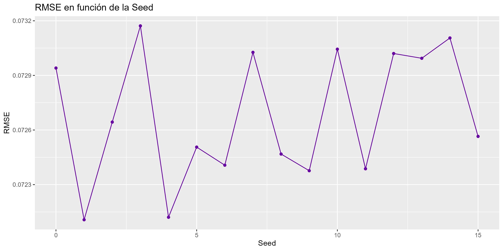

## Introducción {#introduccion}

En este informe se tiene como objetivo analizar que relación tiene la inflación con el crecimiento de la productividad, recaudación estatal
y la corrupción que perciben los ciudadanos.

### Origen de los Datos {#obtencion-de-los-datos}

Los datos utilizados en este análisis provienen de 2 fuentes:

-   **Inflación**: Los datos de inflación anual por país y región se obtuvieron del [Fondo Monetario
    Internacional](https://www.imf.org/external/datamapper/NGDP_RPCH@WEO/OEMDC/ADVEC/WEOWORLD "Fondo Monetario Internacional").

-   **PIB**: Los datos que tratan sobre producto interior bruto provienen del [Fondo Monetario
    Internacional](https://www.imf.org/external/datamapper/NGDPD@WEO/WEOWORLD "Fondo Monetario Internacional").

-   **Ingreso Fiscal**: Los datos de presión fiscal provienen del [Fondo Monetario
    Internacional](https://www.imf.org/external/datamapper/rev@FPP/USA/FRA/JPN/GBR/SWE/ESP/ITA/ZAF/IND/URY/VEN "Fondo Monetario Internacional").

-   **PIB per Capita**: Los datos de PIB per capita provienen del [Fondo Monetario
    Internacional](https://www.imf.org/external/datamapper/NGDPDPC@WEO/OEMDC/ADVEC/WEOWORLD "Fondo Monetario Internacional").

-   **Índice de Percepción de Corrupción (CPI)**: Los datos del CPI se obtuvieron de
    [Transparency.org](https://www.transparency.org/en/ "Transparency.org"), una organización sin fines de lucro que publica anualmente el
    índice de percepción de corrupción.

-   **Deuda sobre el PIB**: Los datos de la deuda pública se obtuvieron del [Fondo Monetario
    Internacional](https://www.imf.org/external/datamapper/CG_DEBT_GDP@GDD "Fondo Monetario Internacional").

## Extracción de Datos {#extraccion-de-datos}

```{r message=FALSE, warning=FALSE, include=FALSE, paged.print=FALSE}
library(parallel)
library(tidyr)
library(dplyr)
library(ggplot2)
library(ggthemes)
library(RColorBrewer)
library(ggcorrplot)
library(readxl)
library(plotly)
library(scales)
library(reshape2)
library(corrplot)
library(stringdist)
library(randomForest)
library(caret)
library(factoextra)
library(Rcpp)
library(patchwork)
library(htmlwidgets)
library(htmltools)
library(knitr)
library(purrr)
library(VIM)
library(colorspace)
#knitr::opts_chunk$set(echo = FALSE)
```

### Importación de Datos del FMI {#importacion-de-datos}

Inflación:
```{r message=FALSE, warning=FALSE}
inflacion <- read_excel("datasets/imf-dm-export-inflacion.xlsx")
head(inflacion[0:2])
```

Producto interior bruto (PIB):
```{r message=FALSE, warning=FALSE}
pib <- read_excel("datasets/imf-dm-export-pib.xls")
head(pib[0:2])
```

Ingreso fiscal:
```{r message=FALSE, warning=FALSE}
ingreso_fiscal <- read_excel("datasets/imf-dm-export-presion-fiscal.xls")
head(ingreso_fiscal[0:2])
```

PIB per capita:
```{r message=FALSE, warning=FALSE}
pib_per_capita <- read_excel("datasets/imf-dm-export-pib-per-capita.xls")
head(pib_per_capita[0:2])
```

Deuda:
```{r message=FALSE, warning=FALSE}
deuda <- read_excel("datasets/imf-dm-export-deuda.xls")
head(deuda[0:2])
```

### Función para formatear los df del FMI {#funcion-fmi}

Procesa y formatea los datos obtenidos del Fondo Monetario Internacional.

**Argumentos:**

-   `df`: Dataframe del FMI

-   `valor`: string con el que renombrar la columna al pivotar

**Devuelve:**

El dataframe formateado de ancho a largo con 3 columnas, el nombre de las columnas originales se meten en la nueva columna "año" y sus
valores correspondientes en "valor"

**Pasos:**

1.  Remplazar valores "no data" por nulos
2.  Eliminar todos los nulos
3.  Renombrar la primera columna a país
4.  Meter en un array los años que tenga el DataFrame de turno
5.  Convertir columnas a formato numérico para evitar posibles errores
6.  Obtener el nombre del df para utilizarlo como nombre de columna
7.  Transformar el DataFrame del formato ancho al formato largo con el nombre de columna proporcionado
8.  Convertir las dos columnas resultantes a numérico
9.  Mostrar primeros registros y resumen de los datos
10. Devolver el dataframe transformado

```{r message=FALSE, warning=FALSE}
formatear_fmi <- function(df, valor) {
  
  # Contar los datos nulos
  df <- df %>% replace(df == "no data", NA)
  print(paste("Total Nulos:", sum(is.na(df))))
  
  # Eliminar los datos nulos
  df <- df %>% drop_na()
  
  # Seleccionar las columnas de los años
  años <- colnames(df)[-1]
  
  # Cambiar el nombre de la columna de país
  colnames(df)[1] <- "pais"
  
  # Convertir las columnas a valores numéricos
  df <- df %>% mutate_at(vars(-pais), as.numeric)
    
  # Transformar el DataFrame de formato ancho a formato largo
  df <- df %>% pivot_longer(cols = all_of(años)
                            , names_to ="año", 
                            values_to = valor) %>%
               mutate(across(c(valor, año), as.numeric))

  # Mostrar los primeros registros y el resumen de los datos
  print("Primeros Registros:")
  print(head(df))
  
  print("Resumen de los Datos:")
  print(summary(df))
  
  return(df)
}

```

### Union de los Datos del FMI {#pib}

Se ejecuta la función anterior con los datos de inflación, deuda, PIB, ingreso fiscal y PIB per capita.

Inflación:

```{r message=FALSE, warning=FALSE}
inflacion <- formatear_fmi(inflacion, "inflacion")
```

Producto interior bruto (PIB):

```{r message=FALSE, warning=FALSE}
pib <- formatear_fmi(pib, "pib")
```

Ingreso fiscal:

```{r message=FALSE, warning=FALSE}
ingreso_fiscal <- formatear_fmi(ingreso_fiscal, "ingreso_fiscal")
```

PIB per capita:

```{r message=FALSE, warning=FALSE}
pib_per_capita <- formatear_fmi(pib_per_capita, "pib_per_capita")
```

Deuda:

```{r message=FALSE, warning=FALSE}
deuda <- formatear_fmi(deuda, "deuda")
```

Se unen los datos del FMI en un solo DataFrame en los países coincidentes por año.

```{r message=FALSE, warning=FALSE}
fmi <- pib %>%
    full_join(ingreso_fiscal, by = c("pais", "año")) %>%
    full_join(pib_per_capita, by = c("pais", "año")) %>%
    full_join(inflacion, by = c("pais", "año")) %>%
    full_join(deuda, by = c("pais", "año"))

```

Se filtran los datos a partir del año 1995 porque es el año en el que se tienen datos de CPI.

```{r message=FALSE, warning=FALSE}
fmi <- fmi %>% filter(año >= 1995 & año <= 2023)
```

### Importación de Datos del CPI {#importacion-de-datos-cpi}

#### Información de los formatos originales

En total se tienen 18 archivos:

-   1995-2011: Se componen de 17 CSV (1 por año), salvo el de 1999 todos tienen las columnas en el mismo orden (se solucionó modificando el
    csv directamente)

-   2012-2023: Una hoja de cálculo con el formato deseado (país, año, valor)

#### Bucle para unir y formatear los CSV

Primero importo los datos del CPI de 2011 ya que es el año con más países de 1995 a 2011.

```{r message=FALSE, warning=FALSE}
cpi <- read.csv("datasets/cpi/CPI-Archive-2011.csv")[c(1,3,4)] 
```

La idea es tener un año de referencia al que ir uniendo el resto de años hasta 1995, dado que 2011 es el año con más países, es más rápido

Dado que si se une un df con otro y **no** hay coincidencias en los nombres de las columnas **no** se crean columnas con sufijos, esto
implicaría que no habría una columna "score2010" sino "score". Al final o cambio el nombre del año 2011 o 2010.

```{r}
colnames(cpi) <- c("pais","region","score")
```

Este bucle une los datos de los años 2011 a 1995.\
**Pasos:**

1.  Iniciar un bucle que recorre los años de 2010 a 1995.

2.  Importar los datos del año correspondiente.

3.  Cambiar el nombre de la primera columna a "país".

4.  Unir los datos del año df principal utilizando el año como sufijo.

```{r message=FALSE, warning=FALSE}
for (año in 2010:1995) {

  # Importar los datos del CPI
  cpi_año <- read.csv(paste0("datasets/cpi/CPI-Archive-",año,".csv"))[c(1,3,4)]
  
  # Cambiar el nombre de la columna de país
  colnames(cpi_año)[1] <- "pais"
  colnames(cpi_año)[2] <- "region"
  
  # Unir los datos del CPI
  cpi <- cpi %>%
    left_join(cpi_año, by = c("pais","region"), suffix = c("", año))
}
```

Cambio el nombre de la columna de "score" a "score2011" quedando claro el año de referencia.

```{r message=FALSE, warning=FALSE}
colnames(cpi)[3] <- "score2011"
```

Convertir las columnas a numérico para evitar error al pivotar:

```{r message=FALSE, warning=FALSE}

# Convertir las columnas a numérico por error al pivotar
cpi <- cpi %>% mutate(across(starts_with("score"), as.numeric))
```

Se transforma el DataFrame de formato ancho a largo.

```{r message=FALSE, warning=FALSE}
cpi <- cpi %>% pivot_longer( cols = starts_with("score"), names_to = "año", names_prefix = "score", values_to = "cpi") %>% 
       mutate(año = as.numeric(año))
```

Se ajusta la escala del CPI para que concuerde con los años posteriores.

```{r message=FALSE, warning=FALSE}
# Ajustar la escala
cpi$cpi <- cpi$cpi * 10
```

Importar los datos de 2012 a 2023.

```{r message=FALSE, warning=FALSE}
# Importar el resto de años
cpi_2012_2022 <- read_excel("datasets/cpi/CPI-Archive-2012-2023.xlsx")[c(1,3,4,5)] 
```

Cambiar el nombre de las columnas y pasar a numérico.

```{r message=FALSE, warning=FALSE}
# Cambiar el nombre de las columnas
colnames(cpi_2012_2022) <- c("pais","año","region","cpi")

# Pasar a numérico
cpi_2012_2022 <- cpi_2012_2022 %>% mutate(cpi = as.numeric(cpi),
                                          año = as.numeric(año))
```

Unir los datos del CPI verticalmente.

```{r message=FALSE, warning=FALSE}
# Unir los datos del CPI verticalmente
cpi <- rbind(cpi, cpi_2012_2022)
```

Convertir a factor las regiones

```{r}
cpi <- cpi %>% mutate(region = as.factor(region))
```

### Unir los Datos del FMI con el CPI {#unir-datos-cpi}

Mapear los nombres de paises con un alto porcentaje de error pero que son correctos.

```{r message=FALSE, warning=FALSE}
fmi$pais <- recode(fmi$pais,
                   "Korea, Republic of" = "Korea (South)",
                   "China, People's Republic of" = "China",
                   "Congo, Dem. Rep. of the" = "Congo",
                   "Taiwan Province of China" = "Taiwan",
                   "Australia and New Zealand" = "Australia",
                   "São Tomé and Príncipe" = "Sao Tome and Principe",
                   "Gambia, The" = "Gambia",
                   "Bahamas, The" = "Bahamas",
                   "Congo, Republic of" = "Congo Republic",
                   "Hong Kong SAR" = "Hong Kong")
```

Calcular la similitud entre los nombres de los países del FMI y el CPI.

Para ello utilizare el algoritmo Jaro-Winkler, se comparan todos con todos y se escoge para cada nombre el que tenga mejor puntuación.

#### Explicación Jaro-Winkler

Se basa en la coincidencia, trasposición y una penalización para las diferencias en las primeras letras de las cadenas.

1.  **Similitud de Jaro**:

$$ S_{j} = \frac{1}{3} \left( \frac{m}{|s_1|} + \frac{m}{|s_2|} + \frac{m - t}{m} \right) $$

Donde: - $s_1$ y $s_2$ → cadenas de texto que se comparan. - $|s_1|$ y $|s_2|$ → longitudes de las cadenas. - $m$ → número de caracteres
coincidentes entre las dos cadenas. - $t$ → número de trasposiciones, lo contrario a $m$

2.  **Similitud de Jaro-Winkler**:

$$ S_{jw} =S_{j} + \ell \cdot p \cdot (1 - S_j) $$

Donde:

1.  $S_{j}$ → Similitud de Jaro.
2.  $\ell$ → Longitud del prefijo común al inicio de las cadenas (máximo 4 caracteres).
3.  $p$ → Escalador de peso para el prefijo (normalmente $p = 0.1$).

El resultado de $S_{jw}$ es un valor entre 0 y 1, donde 1 indica una similitud perfecta y 0 indica ninguna similitud.

##### Ejemplo

**¿Que palabra es más cercana a "Corea": "Korea" o "Correa"?**

1.  Cálculo de $S_j$:

    1.  Coincidencias ($m$): Los caracteres coincidentes son: $o, r, e, a$ (4 caracteres).

    2.  Longitud de las cadenas ($|s_1|, |s_2|$): Ambas tienen longitud 5.

    3.  Transposiciones ($t$): Hay una transposición entre $C$ y $K$. Esto equivale a $t = 1/2 = 0.5$.

Sustituyendo en la fórmula de $S_j$:
$$ S_j = \frac{1}{3} \left( \frac{4}{5} + \frac{4}{5} + \frac{4 - 0.5}{4} \right) = \frac{1}{3} \left( 0.8 + 0.8 + 0.875 \right) = 0.825 $$

2.  **Cálculo de** $S_{jw}$:

    1.  Prefijo común ($\ell$): El prefijo común es vacío ($\ell = 0$).

    2.  Factor de prefijo ($p$): $p = 0.1$.

$$ S_{jw} = S_j + \ell \cdot p \cdot (1 - S_j) = 0.825 + 0 \cdot 0.1 \cdot (1 - 0.825) = 0.825 $$

```{r message=FALSE, warning=FALSE}
# Calcula la distancia de similitud entre los nombres de los países
distancias <- stringdistmatrix(fmi$pais, cpi$pais, method = "jw")
```

Obtener los índices de los string más similares.\
*Nota: El resultado que devuelve R es 1 -* $S_{jw}$, por eso se selecciona el mínimo y no el máximo.

```{r message=FALSE, warning=FALSE}
indices <- apply(distancias, 1, which.min)
```

En base a los indices anteriores se obtienen los nombres equivalentes.

```{r message=FALSE, warning=FALSE}
nombres_equivalentes <- cpi$pais[indices]
```

En vez de seleccionar el indice, me quedo con el valor y lo paso a porcentaje.

```{r message=FALSE, warning=FALSE}
# Calcula el porcentaje de error estimado
porcentaje_error <- apply(distancias, 1, min)
porcentaje_error <- porcentaje_error * 100
```

Añado el porcentaje de error y los nombres equivalentes al df, luego muestro los países y sus equivalentes ordenados por porcentaje de
error. En base a esta tabla se realizaron los cambios de nombres anteriores.

```{r message=FALSE, warning=FALSE}
# Añadir el porcentaje de error estimado al dataframe original
fmi <- fmi %>%
  mutate(porcentaje_error = porcentaje_error,
         nombre_eq = nombres_equivalentes)
fmi %>% select(pais, nombre_eq, porcentaje_error) %>%  group_by(pais) %>% slice(1) %>% arrange(desc(porcentaje_error)) 
```

Elimino las filas con un porcentaje superior a 0.

```{r message=FALSE, warning=FALSE}
fmi <- fmi %>% ungroup() %>% filter(porcentaje_error == 0)
```

Sustituyo los nombres por su equivalente y me quedo con las columnas de interés.

```{r message=FALSE, warning=FALSE}
fmi$pais <- fmi$nombre_eq
fmi <- fmi %>% select(-nombre_eq, -porcentaje_error) %>% 
  mutate(año = as.numeric(año))
```

Unir los Dataframe finales del CPI y FMI

```{r message=FALSE, warning=FALSE}
df <- cpi %>%
  full_join(fmi, by = c("pais", "año"))

df <- df %>% arrange(pais, año) 
```

Elimino las filas que no tengan al menos 2 variables sin nulos, no se puede realizar una correlación con 1 sola variable.

```{r message=FALSE, warning=FALSE}
df <- df[rowSums(is.na(df)) < 4, ]
```

Elimino filas cuyo ingreso fiscal sea mayor al 100% del PIB.

```{r message=FALSE, warning=FALSE}
df <- df %>% filter(ingreso_fiscal <= 100)
```

Elimino filas con valores muy extremos en la inflación.

```{r message=FALSE, warning=FALSE}
df <- df %>% filter(inflacion < 200)
```

Muestro su resumen y los primeros registros.

```{r message=FALSE, warning=FALSE}
summary(df)
head(df)
```

### Descripción de los datos del DataFrame Final {#descripcion-del-dataframe-transformado}

1.  **País**:
    -   Tipo de dato: Carácter.
    -   Descripción: Nombre del país.
2.  **Año**:
    -   Tipo de dato: Numérico.
    -   Descripción: Año al que pertenecen los datos.
3.  **Región**:
    -   Tipo de dato: Carácter
    -   Descripción: Área de tamaño continental donde se encuentra el país.
4.  **Puntuación de Corrupción (CPI)**:
    -   Tipo de dato: Numérico.
    -   Descripción: Representa la percepción de corrupción en el sector público de un país en una escala de 0 a 100, donde 0 indica una
        alta percepción de corrupción y 100 indica una baja percepción de corrupción.
5.  **Inflación**:
    -   Tipo de dato: Numérico.
    -   Descripción: Representa la perdida de poder adquisitivo de los ciudadanos.
6.  **PIB:**
    -   Tipo de dato: Numérico.
    -   Descripción: Representa el valor total de todos los bienes y servicios producidos en un país en un año determinado.
7.  **PIB per Capita**:
    -   Tipo de dato: Numérico.
    -   Descripción: Representa el valor total de todos los bienes y servicios producidos en un país en un año determinado dividido por la
        población total del país.
8.  **Ingresos_fiscales**:
    -   Tipo de dato: Numérico.
    -   Descripción: Representa la cantidad total de ingresos recaudados por el estado a través de impuestos, expresado en % del PIB. No
        tiene en cuenta el endeudamiento.
9.  **Deuda**:
    -   Tipo de dato: Numérico.
    -   Descripción: Representa la cantidad total de deuda de un país expresada en % del PIB.

## Análisis Exploratorio de Datos {#eda}

### Número de paises por año {#paises-por-año}

Agrego los datos por año y creo el gráfico de barras.

```{r}
# Pasar el dataframe a formato largo
df_long <- df %>% 
  select(-pais, -region, -inflacion, -ingreso_fiscal) %>%
  pivot_longer(cols = -año, names_to = "variable", values_to = "valor") %>%
  group_by(año, variable) %>%
  summarize(n_nulos = sum(is.na(valor)), .groups = "drop")

# Crear el gráfico con ggplot2
nulos_año_plot <- ggplot(df_long, aes(x = año, y = n_nulos, fill = variable )) +
  geom_bar(stat = "identity", width = 0.9, color="#aaaaaa") +
  facet_wrap(~variable, scales = "free") +
  labs(
    title = "Cantidad de Nulos por Año y Variable",
    x = "Año",
    y = "Cantidad de Nulos"
  ) +
  theme(legend.position = "none",
        panel.spacing.x = unit(2, "lines"),
        panel.spacing.y = unit(4, "lines"))

ggplotly(nulos_año_plot)
```

### Visualización de los Datos en el tiempo {#visualizacion-de-los-datos}

Se agrupan los datos por año y se calcula la media de todas las variables, mediana para el caso de la inflación debido a valores extremos.

```{r fig.height= 6}
df_avg <- df %>%
  group_by(año) %>%
  summarise(
    cpi = mean(cpi, na.rm = TRUE),
    inflacion = median(inflacion, na.rm = TRUE),
    pib = mean(pib, na.rm = TRUE),
    pib_per_capita = mean(pib_per_capita, na.rm = TRUE),
    ingreso_fiscal = mean(ingreso_fiscal, na.rm = TRUE), 
    deuda = mean(deuda, na.rm = TRUE),
    .groups = "drop"
  )
```

Se transforman los datos a formato largo para poder visualizarlos en un gráfico. Se quita la columna año y el nombre de las variables pasa a
ser la columna "variable" y su contenido en "valor".

```{r message=FALSE, warning=FALSE}
df_avg_largo <- df_avg %>%
  pivot_longer(cols = -año, names_to = "variable", values_to = "valor")

```

Crea varios lineplots interactivos, uno para cada variable, representando cómo cambian a lo largo del tiempo. Cada línea tiene puntos
conectados para mostrar los valores individuales. El gráfico se divide en paneles para comparar las tendencias entre diferentes variables,
se aumenta el margen entre los gráficos para impedir que se solapen.

```{r message=FALSE, warning=FALSE}
# Crear el gráfico
plot <- ggplot(df_avg_largo, aes(x = año, y = valor, color = variable)) +
  geom_line() +
  geom_point(size = 2) +
  facet_wrap(~variable, scales = "free") +
  labs(
    title = "Evolución de las Variables Numéricas (1995-2022) ",
    x = "Año",
    y = ""
  ) +
  theme(legend.position = "none",
        panel.spacing.x = unit(2, "lines"),
        panel.spacing.y = unit(4, "lines"))

# Convertir a objeto plotly
ggplotly(plot)

```

### Visualización de las distribuciones {#visualizacion-distribuciones}

Algunas variables tienen un pico muy acusado como distribución y las colas casi inexsistentes, por lo que se transforman a logaritmo base 2
para poder apreciar mejor la distribución, concrertamente la inflación, PIB, PIB per capita e ingreso fiscal.

```{r, warning=FALSE, message=FALSE, fig.height= 6}
# Seleccionar las columnas de interés
df_correlacion <- df %>% select(-pais, -año, -region) 
                 
```

Se transforman los datos a formato largo. En este caso no necesito ninguna columna adicional, por lo que utilizo la función gather que es
más sencilla.

```{r message=FALSE, warning=FALSE}
# Transformar el DataFrame de formato ancho a formato largo
df_correlacion_largo <-  df_correlacion %>% gather(variable, valor)
```

Mismo sistema que en el gráfico anterior, se crea un gráfico pero de densidad para cada variable.

```{r message=FALSE, warning=FALSE}
# Crear un gráfico de densidad para cada variable
plot <- ggplot(df_correlacion_largo, aes(x = valor, fill = variable)) +
  geom_density() +
  facet_wrap(~variable, scales = "free") +
  labs(x = "",
       y = "Densidad") +
  theme(legend.position = "none",
        panel.spacing.x = unit(1, "lines"),
        panel.spacing.y = unit(3, "lines"))

# Convertir a objeto plotly
ggplotly(plot)

```

### Visualización de la inflación vs el resto de variables {#visualizacion-scatter}

Algunas variables tienen un pico muy acusado como distribución y las colas casi inexsistentes, por lo que se transforman a logaritmo base 2
para poder apreciar mejor la distribución, concretamente la inflación, PIB, PIB per capita e ingreso fiscal.

```{r message=FALSE, warning=FALSE}
df_correlacion <- df %>% select(-pais, -año, -region) %>%
                         mutate(pib = rescale(log10(pib)),
                                pib_per_capita = rescale(log10(pib_per_capita))) %>%
                         mutate_all(~rescale(.))
 
df_correlacion_largo <- df_correlacion %>%
                        pivot_longer(cols = -inflacion, names_to = "variable", values_to = "valor")

```

Mismo sistema que en el gráfico anterior, se crea un gráfico pero de densidad para cada variable.

```{r message=FALSE, warning=FALSE}
plot <- ggplot(df_correlacion_largo, aes(x = inflacion, y = valor)) +
  geom_bin2d(binwidth = c(0.015, 0.015)) +
  scale_fill_gradient(low = "#ada1ff", high = "#df0000") +
  labs(
    x = "",
    y = "") +
  ylim(0, 1) +
  xlim(0, 1) +
  facet_wrap(~variable, scales = "free") +
  labs(
    title = "Scatterplot de Inflación vs Resto de Variables",
    x = "",
    y = "") +
  theme(legend.position = "none",
        panel.spacing.x = unit(2, "lines"),
        panel.spacing.y = unit(4, "lines"))

# Convertir a objeto plotly
ggplotly(plot)

```

## Análisis de Correlación {#correlacion}

### Calculo de la matriz de correlación

Quito las columnas de país y año para calcular la matriz de correlación.

```{r Matriz de Correlación, warning=FALSE}
df_correlacion <- df %>% select(-pais, -año, -region)
```

Meto el número de columnas en una variable para crear matrices vacías

```{r message=FALSE, warning=FALSE}
# Crear matrices vacías para almacenar p-valores más bajos, métodos y coeficientes de correlación
n <- ncol(df_correlacion)
```

Array con los dos posibles métodos de correlación.

```{r message=FALSE, warning=FALSE}
metodos <- c("spearman", "pearson")
```

Creo dos matrices vacías, una para los p-valores y otra para los coeficientes de correlación.

```{r message=FALSE, warning=FALSE}
p_metodo <- matrix(" ", n, n, dimnames = list(names(df_correlacion), names(df_correlacion)))
cor_matrix <- matrix(1, n, n, dimnames = list(names(df_correlacion), names(df_correlacion)))
```

Comparo en cada par que método tiene el p-valor más bajo para seleccionarlo y calcular el coeficiente de correlación.

**Pasos:**

1.  Creo dos bucles que recorren las variables formando los pares de variables.

2.  Asignar los nombres de las variables correspondientes a través de su posición en el array con los nombres de las variables.

3.  Calcula los p-valores para la prueba de correlación entre las dos variables utilizando tanto el método de Pearson como el de Spearman.
    El resultado es un array con 2 p-valores.

4.  Selecciona el método con el p-valor más bajo.

5.  Almacena ese p-valor.

6.  Calcula la correlación con el método elegido.

7.  Almacena los resultados en 2 matrices cuyos indices son el nombre de las variables:

    1.  En la primera matriz almacena en la primera mitad elegido en el par y en la segunda mitad el p-valor redondeado conservando la
        notación científica.

    2.  En la segunda se almacenan en las dos mitades lo mismo, los coeficientes de correlación.

```{r message=FALSE, warning=FALSE}
# Iterar sobre las combinaciones de pares de columnas
for (j in 1:(n-1)) {
  for (k in (j+1):n) {
    var1 <- names(df_correlacion)[j]
    var2 <- names(df_correlacion)[k]
    
    # Aplicar cor.test a cada elemento de la lista y extraer los valores p
    p_valores <- sapply(metodos, function(metodo) cor.test(df_correlacion[[var1]], df_correlacion[[var2]], method = metodo, use ="complete.obs")$p.value)
    
    # Identificar el p-valor más bajo y su método
    metodo_elegido <- metodos[which.min(p_valores)]
    p_valor_minimo <- min(p_valores)
    
    # Calcular el coeficiente de correlación usando el método elegido
    correlacion <- cor(df[[var1]], df[[var2]], method = metodo_elegido, use ="complete.obs")
    
    # Almacenar el p-valor más bajo, el método elegido y el coeficiente de correlación
    p_metodo[var1, var2] <- metodo_elegido
    p_metodo[var2, var1] <- format(p_valor_minimo, digits = 2, scientific = TRUE)
    
    cor_matrix[var1, var2] <- correlacion
    cor_matrix[var2, var1] <- correlacion
  }
}
```

### Visualización de la matriz de p-valores y métodos

Almaceno el nombre de las variables en 2 columnas y en otra tercera su valor (método o p-valor)

```{r}
p_metodo_df <- melt(p_metodo, varnames = c("Variable1", "Variable2"), value.name = "Valor")
```

El gráfico es una matriz de colores donde cada celda representa el p-valor correspondiente al test de correlación entre 2 variables y el
método utilizado.

Al introducir los métodos la escala de colores es discreta, lo que implica que tendría que asignarle un color a cada p-valor, dado todos los
p-valores están muy por debajo de 0.05 asigno como color por defecto el verde clarito.

Las celdas intermedias no aportan información, he introducido como valor un espacio para poder pintarlas de un color que llame menos la
atención que los de su alrededor, en este caso gris.

```{r message=FALSE, warning=FALSE}
# Crear la visualización
method_plot <- ggplot(data = p_metodo_df, aes(x = Variable1, y = Variable2, fill = Valor)) + 
  geom_tile(color = "black") +  
  geom_text(aes(label = Valor), 
            size = 4, 
            color = "black") + 
  scale_fill_manual(values = c("pearson" = "#e033ff", "spearman" = "#fdaf7a"," " = "#e9e9e9"),na.value = "#e0ffbf") +
  theme(axis.text.x = element_text(angle = 45, hjust = 1),
        axis.line = element_line(color = "black"),
        panel.background = element_rect(fill = "#f9f9f9", color = NA),  
        plot.background = element_rect(fill = "#f9f9f9", color = NA),   
        legend.position = "none") +
  labs(title = "Métodos de Correlación Utilizados y sus P-Valores", 
       x = "", 
       y = "", 
       fill = "Método")

method_plot <- ggplotly(method_plot) %>% 
               layout(autosize = TRUE, 
                     xaxis = list(autorange = TRUE))
method_plot
```

### Visualización de la matriz de correlación

Creo un corrplot con la matriz de correlaciones generada en el bucle.

```{r fig.height = 9, fig.width = 12, message=FALSE, warning=FALSE}

corrplot <- ggcorrplot(cor_matrix, 
                       method = "circle",
                       type = "full",
                       lab = TRUE,
                       lab_size = 5) +
  scale_fill_gradient2(high ="#6400e4",mid="#f9e9e9",low = "#ff0000") +
  scale_size_continuous(range = c(8, 25)) +
  theme(axis.text.x = element_text(angle = 45, hjust = 1),
        panel.background = element_rect(fill = "#f9f9f9", color = NA),  
        plot.background = element_rect(fill = "#f9f9f9", color = NA),   
        axis.text = element_text(size = 2),
        legend.position = "none")

ggplotly(corrplot)
```

## Random Forest {#modelado}

### Preparación de los Datos {#preparacion-datos}

#### Imputación de Valores Faltantes

Como se pudo observar previamente las variables de deuda y cpi contenian una cantidad significativa de nulos.

El objetivo es rellenarlos, para valorar que tan bien se han rellenado compararé la correlación entre las variables y la variable a
proyectar, en este caso la inflación.

Para ello el método que me ha dado mejor resultado ha sido el algoritmo K-Nearest Neighbors (KNN).

#### K-Nearest Neighbors (KNN)

Rellena los valores faltantes de la variable identificando los `k` vecinos con características más similares.

De esos vecinos cogería su valor medio para rellenar el nulo.

```{r}
df_limpio <- df
```

```{r}
# Interpolar los NA de la variable deuda
df_limpio <- kNN(df_limpio, variable = "cpi", k = 10)

corr <- cor.test(df_limpio$cpi, df_limpio$inflacion, method = "spearman", use ="complete.obs", exact = FALSE)

cat("p-valor: ",corr$p.value, "\n", "Correlación: ", corr$estimate)
```

```{r}

# Interpolar los NA de la variable deuda 
df_limpio <- kNN(df_limpio, variable = "deuda", k = 179)
  
corr<- cor.test(df_limpio$deuda, df_limpio$inflacion, method = "spearman", use ="complete.obs", exact = FALSE)
cat("p-valor: ",corr$p.value, "\n", "Correlación: ", corr$estimate)
```

```{r}

# Crear función para evaluar la seed
df_seed <- df_limpio %>%
  select(-año, -region, -pais, -deuda_imp, -cpi_imp) %>%
  mutate(across(where(is.numeric), rescale)) %>%
  drop_na()

probar_seed <- function(seed, df) {
  
  set.seed(seed)
  train_index <- createDataPartition(1:nrow(df), p = .75, list = FALSE)
  df_train <- df[train_index, ]
  df_test <- df[-train_index, ]
  
  mean_train <- min(max(df_train$cpi), max(df_train$pib),max(df_train$ingreso_fiscal),max (df_train$pib_per_capita),max(df_train$inflacion), max(df_train$deuda)) 
  
  mean_test <- min(max(df_test$cpi), max(df_test$pib),max(df_test$ingreso_fiscal),max (df_test$pib_per_capita),max(df_test$inflacion), max(df_test$deuda))
  
  metrica <- (mean_train + mean_test) / 2

  return(metrica)
}

# Inicializar variables
mejor_metrica <- 0

# Bucle para encontrar la mejor seed
for (seed in 1:1000) { 
  
  metrica <- probar_seed(seed, df_seed)
  
  if (metrica > mejor_metrica) {
    mejor_metrica <- metrica
    mejor_seed <- seed
  }
}

cat("Mejor seed:", mejor_seed , "\n")
cat("Mejor métrica:", mejor_metrica )
```

```{r}
# Dividir df_limpio en train y test
set.seed(186)

df_limpio <- df_limpio %>%
  select(-año, -deuda_imp, -cpi_imp) %>%
  mutate(across(where(is.numeric), rescale)) %>%
  drop_na()

train_index <- createDataPartition(1:nrow(df_limpio), p = .75, list = FALSE)

df_train <- df_limpio[train_index, ]
df_test <- df_limpio[-train_index, ]

# Contar valores
cat("Número de observaciones en el conjunto de entrenamiento:", nrow(df_train), "\n")
cat("Número de observaciones en el conjunto de prueba:", nrow(df_test), "\n")
# Resumen de los conjuntos de entrenamiento y prueba
summary(df_train)
summary(df_test)

```

```{r}
# Ajuste manual del número óptimo de árboles (ntree)
df_rmse <- data.frame(seed = integer(), n_arboles = integer(), rmse = numeric())
```

```{r}

# Función para entrenar el modelo y calcular el RMSE
calcular_rmse <- function(n_arb, df_train, df_test) {
  rf_model_temp <- randomForest(inflacion ~ pais + region + ingreso_fiscal + pib + pib_per_capita + cpi + deuda, 
                                data = df_train, 
                                ntree = n_arb,
                                mtry = 3,
                                nodesize = 5)
  
  pred_temp <- predict(rf_model_temp, df_test)
  rmse_temp <- sqrt(mean((df_test$inflacion - pred_temp)^2))
  
  return(rmse_temp)
}
```

```{r eval = FALSE}
df_rmse <- do.call(rbind ,lapply(0:15, function(seed) {
  set.seed(seed)
  
  df_rmse_temp <- do.call(rbind, lapply(10:100, function(x) {
    rmse_temp <- calcular_rmse(x, df_train, df_test)
    data.frame(n_arboles = x, rmse = rmse_temp)
  }))
  
  df_rmse_temp <- df_rmse_temp[order(df_rmse_temp$rmse), ]
  arboles_optimos <- df_rmse_temp[1, "n_arboles"]
  rmse_opt <- df_rmse_temp[1, "rmse"]
  
  cat("Semilla:", seed, "\n")
  
  data.frame(seed = seed, n_arboles = arboles_optimos, rmse = rmse_opt)
}))
```

```{r eval = FALSE}
df_rmse <- df_rmse %>% arrange(rmse)
```

```{r eval = FALSE}
cat("Mejor semilla: ", df_rmse[1, "seed"], "\n")
cat("Número óptimo de árboles: ", df_rmse[1, "n_arboles"], "\n" )
cat("Rooted Mean Squared Error más bajo: ", df_rmse[1, "rmse"], "\n" )
```

**Resultados:**

-   Mejor semilla: 4

-   Número óptimo de árboles: 16

-   Rooted Mean Squared Error más bajo: 0.03757958

```{r eval = FALSE}
# Visualizar el RMSE en función de la seed

plot <- ggplot(df_rmse, aes(x = seed, y = rmse)) +
  geom_line(color = "#6600a4") +
  geom_point(color = "#6600a4") +
  labs(title = "RMSE en función de la Seed",
       x = "Seed",
       y = "RMSE")

# Guardar el gráfico como png
ggsave("rmse.png", plot, height = 1500, width = 3000, units = "px")

```

```{r}

```

```{r}
# Ajustar el modelo con la semilla y el número óptimo de árboles

set.seed(4)

# Ajustar el modelo con el número óptimo de árboles
rf_model_opt <- randomForest(inflacion ~ pais + region + ingreso_fiscal + pib + pib_per_capita + cpi + deuda, 
                             data = df_train, 
                             ntree = 16,
                             mtry = 3 ,
                             nodesize = 5)
# Resumen del modelo
print(rf_model_opt)
```

```{r}
# Predecir la inflación en el conjunto de prueba
predicciones_opt <- predict(rf_model_opt, df_test)
```

```{r}
# Evaluar el rendimiento del modelo optimizado (ejemplo con RMSE)
rmse_opt <-sqrt(mean((df_test$inflacion - predicciones_opt)^2))

cat("RMSE del modelo optimizado:", rmse_opt, "\n")
```

```{r}
# Crear un gráfico de dispersión de los valores reales vs. las predicciones

df_pred <- data.frame(real = df_test$inflacion, prediccion = predicciones_opt, error_porcentual = (df_test$inflacion - predicciones_opt) / df_test$inflacion * 100)

plot <- ggplot(df_pred, aes(x = real, y = prediccion)) +
  geom_point(color = "#4400a4", alpha=0.5) +
  geom_abline(intercept = 0, slope = 1, color = "red") +
  ylim(0, max(df_pred$real)) +
  xlim(0, max(df_pred$real)) +
  labs(title = "Valores Reales vs. Predicciones",
       x = "Real",
       y = "Predicción")

ggplotly(plot)

```

```{r}
# Cargar el archivo C++
sourceCpp("cpp/limites.cpp")

# Calcular los límites superior e inferior
limites <- calcular_limites(df_pred$error_porcentual)
IQR <- limites[1]
limite_superior <- limites[2]
limite_inferior <- limites[3]

# Imprimir los resultados
cat("Rango intercuartílico:", IQR, "\n")
cat("Límite superior:", limite_superior, "\n")
cat("Límite inferior:", limite_inferior, "\n")

```

```{r}
sourceCpp("cpp/redondear_columna.cpp")

df_pred$error_porcentual <- redondear_columna(df_pred$error_porcentual, limite_superior, limite_inferior)
```

```{r}
# Crear un gráfico de densidad del error porcentual
plot1 <- ggplot(df_pred, aes(x = error_porcentual)) +
  geom_histogram(bins = 13, fill = "#6600a4", color ="black") +
  labs(title = "",
       x = "Error Porcentual",
       y = "") + 
  scale_x_continuous(breaks = seq(-60, 60, 10)) +
  scale_y_continuous(breaks = seq(0, 200, 10))

# Crear un boxplot del error porcentual

plot2 <- ggplot(df_pred, aes(x = "", y = error_porcentual)) +
  geom_boxplot(fill = "#cc00a4") +
  labs(title = "Histograma y Boxplot del Error Porcentual",
       x = "",
       y = "")

plot1 <- ggplotly(plot1)
plot2 <- ggplotly(plot2)

# Juntar los gráficos 
plot <- subplot(plot1, plot2, nrows = 1, shareX = TRUE, shareY = FALSE) %>% layout(autosize = TRUE)
plot
```

```{r}

# Importancia de las variables usando IncNodePurity
importancia <- importance(rf_model_opt)
importancia_df <- data.frame(variable = rownames(importancia), 
                             importancia = importancia[, "IncNodePurity"])

plot <- ggplot(importancia_df, aes(x = reorder(variable, importancia), y = importancia, fill=variable)) +
  geom_bar(stat = "identity" ) +
  coord_flip() +
  #                               cpi      deuda  ingreso_fiscal  pais       pib    pib_per_capita   region     
  scale_fill_manual(values = c("#1e63a7","#297bcb", "#227aee", "#050555", "#184d80", "#44aaff" ,   "#010111")) +
  labs(title = "Importancia de las Variables",
       x = "",
       y = "Incremento en Pureza del Nodo") +
  theme(legend.position = "none") 

plot <- ggplotly(plot) %>% layout(autosize = TRUE)
plot
```
