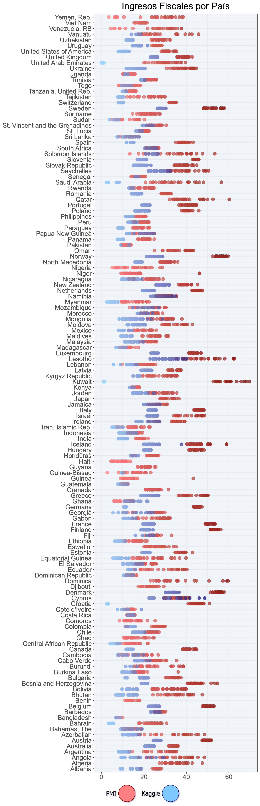

## Introducción {#introduccion}

En este informe se tiene como objetivo analizar que relación tiene la inflación con el crecimiento de la productividad, recaudación estatal y la
corrupción que perciben los ciudadanos.

### Origen de los Datos {#obtencion-de-los-datos}

Los datos utilizados en este análisis provienen de 3 fuentes principales:

-   **Inflación**: Los datos de inflación anual por país y región se obtuvieron del [Fondo Monetario
    Internacional](https://www.imf.org/external/datamapper/NGDP_RPCH@WEO/OEMDC/ADVEC/WEOWORLD "Fondo Monetario Internacional").

-   **Índice de Percepción de Corrupción (CPI)**: Los datos del CPI se obtuvieron de
    [transparency.org](https://www.transparency.org/en/ "transparency.org"), una organización sin fines de lucro que publica anualmente el
    índice de percepción de corrupción.

-   **PIB**: Los datos que tratan sobre producto interior bruto provienen de
    [Kaggle](https://www.kaggle.com/datasets/samybaladram/databank-world-development-indicators).

-   **Ingreso Fiscal**: Los datos de presión fiscal provienen del [Fondo Monetario
    Internacional](https://www.imf.org/external/datamapper/rev@FPP/USA/FRA/JPN/GBR/SWE/ESP/ITA/ZAF/IND/URY/VEN "Fondo Monetario Internacional").

```{r librerias, message=FALSE, warning=FALSE, include=FALSE, paged.print=FALSE}
library(tidyr)
library(dplyr)
library(ggplot2)
library(ggthemes)
library(RColorBrewer)
library(ggcorrplot)
library(readxl)
library(plotly)
```

## Limpieza de datos {#limpieza-de-datos}

### Obtención del DataFrame de Inflación y CPI

1.  Descarga de los datasets de CPI de todos los años disponibles y el de Inflación, que afortunadamente incluía todos los años.
    Posteriormente se unieron basándose en dos columnas distintas, según el caso podía ser el `ISO` o el `nombre` del país. Con frecuencia
    la ortografía de un país variaba de uno a otro.

2.  Creación de 2 arrays con los nombres de los países

3.  Creación y de 1 array con los nombres que no coinciden

4.  En vez de revisarlo manualmente le pase el array a Llama 3.1 varias veces hasta obtener una lista con todos los países que aparecen en
    ambos datasets pero con distinto nombre

5.  Con esa lista se cambia la ortografía del nombre de los países del segundo dataset a los del primero

6.  Se realiza un merge con el nombre del país como columna en común.

### Carga y Visualización del DataFrame de la Inflación y CPI {#carga-y-visualizacion-del-dataframe}

```{r limpieza df1 ,echo=TRUE, warning=FALSE}
df <- read.csv("inflation_corruption_1995_2023_Ruben_Valverde.csv")
head(df[0:6])
```
Se carga y muestra un archivo CSV con los datos de inflación y corrupción.
*Nota: El resto de columnas son repeticiones de las columnas 3, 4 y 5 por lo que mostrarlas no aportan más información y empeoran la estética del documento.*

#### Reemplazo de Valores "no data" por NA {#reemplazo-de-valores-no-data-por-na}

```{r limpieza df2 ,echo=TRUE, warning=FALSE}
# Contar valores "no data" en cada columna
inflation <- df[, grepl("inflation", names(df))]
no_data_count <- colSums(inflation == "no data", na.rm = TRUE)
print(paste("Hay un total de", sum(no_data_count), "valores 'no data'"))

# Reemplazar los valores "no data" por NA en todo el DataFrame porque da problemas al conteo
df[df == "no data"] <- NA
```
1. **Contar valores "no data" en cada columna:**
   - Selecciona las columnas del DataFrame `df` que contienen la palabra "inflation" en su nombre y las guarda en un nuevo DataFrame llamado `inflation`.
   - Utiliza la función `colSums` para contar los valores que son iguales a "no data" en cada columna del DataFrame `inflation`, ignorando los valores NA.
   - Imprime el total de valores "no data" encontrados en todas las columnas seleccionadas.

2. **Reemplazar los valores "no data" por NA en todo el DataFrame:**
   - Reemplaza todos los valores "no data" en el DataFrame `df` con NA, dado que estos valores causan problemas al realizar el conteo o análisis de datos.
  
#### Conversión de Columnas a Numérico {#conversion-de-columnas-a-numerico}

```{r limpieza df3 ,echo=TRUE, warning=FALSE}
# Convertir las columnas de inflación de 1995 a 2023 a valores numéricos
for (year in 1995:2023) {
  column <- paste("inflation", year, sep = "_")
  df[[column]] <- as.numeric(df[[column]])
}
```
1. **Iterar sobre un rango de años**:
   - Utiliza un bucle `for` para iterar desde el año 1995 hasta el año 2023.

2. **Generar nombres de columnas**:
   - Para cada año en el rango, crea el nombre de la columna correspondiente utilizando `paste` para concatenar la palabra "inflation" con el año, separándolos con un guion bajo.

3. **Convertir valores a numéricos**:
   - Para cada columna generada, convierte los valores a tipo numérico utilizando `as.numeric`, asegurándose de que los datos en estas columnas sean tratados como números en lugar de cadenas de texto.

Este proceso garantiza que todas las columnas de inflación desde 1995 hasta 2023 en el DataFrame `df` contengan valores numéricos, facilitando su análisis posterior.

#### Conteo de valores NA {#conteo-de-valores-na}

```{r limpieza df4 ,echo=TRUE, warning=FALSE}
# Contar y mostrar el número de valores nulos por columna
print(paste("Hay un total de", sum(is.na(df)), "valores nulos"))
```
Suma y muestra el total de valores nulos en el DataFrame.

#### Formateo del DataFrame {#formateo-del-dataFrame}

```{r limpieza df5 ,echo=TRUE, warning=FALSE}
# Transformar el DataFrame de formato ancho a formato largo para poder analizar los datos de inflación, puntuación y rango a lo largo del tiempo posteriormente
df_melted <- df %>%
  pivot_longer(cols = starts_with("inflation_") | starts_with("score_"),
  names_to = c(".value", "year"),
  names_sep = "_") %>%
select(country, iso, region, year, inflation, score) #Nota el ranking no se llega a utilizar en este análisis asi que lo elimino

# Convertir las columnas 'inflation', 'score' y 'year' a tipo numérico en el DataFrame df_melted
df_melted <- df_melted %>%
    mutate(across(c(inflation, score, year), as.numeric))
    df_melted <- df_melted %>% arrange(year, country)
head(df_melted)
```
1. **Transformar el DataFrame a formato largo**:
   - Utiliza `pivot_longer` para convertir el DataFrame `df` de un formato ancho a un formato largo, seleccionando las columnas que comienzan con "inflation_" o "score_".
   - Asigna los nombres a las nuevas columnas `inflation` y `score`, y extrae el año de los nombres de las columnas originales.
   - Selecciona las columnas `country`, `iso`, `region`, `year`, `inflation` y `score`, omitiendo la columna `ranking`.

2. **Convertir columnas a tipo numérico**:
   - Usa `mutate` con `across` para convertir las columnas `inflation`, `score` y `year` a tipo numérico.

3. **Ordenar el DataFrame**:
   - Ordena el DataFrame `df_melted` por `year` y `country` utilizando `arrange`.

4. **Mostrar las primeras filas**:
   - Utiliza `head` para mostrar las primeras filas del DataFrame `df_melted` resultante.

### Carga, Visualización e Insercción del DataFrame de PIB

```{r}
df_pib <- read.csv('world_development_data_interpolated.csv')[, c(1, 2, 9, 32)]
# Filtrar el DataFrame para eliminar las filas cuyo año sea anterior a 1995
df_pib <- df_pib %>% filter(Year >= 1995)
head(df_pib)
```
1. **Lectura y selección de columnas**:
   - Importa el archivo CSV `world_development_data_interpolated.csv` en un DataFrame `df_pib`.
   - Selecciona las columnas en las posiciones 1, 2, 9 y 32, resultando en un subconjunto del DataFrame original.

2. **Filtrado por año**:
   - Filtra `df_pib` para mantener solo las filas donde el valor de la columna `Year` es mayor o igual a 1995.

3. **Mostrar las primeras filas**:
   - Usa `head` para mostrar las primeras filas del DataFrame `df_pib` resultante después del filtrado.

#### Unión de ambos DataFrame

```{r}
# Crear una lista de correspondencias entre los nombres de países en ambos datasets
country_corrections <- c(
    "United States" = "United States of America",
    "Russia" = "Russian Federation",
    "South Korea" = "Korea, Rep.",
    "North Korea" = "Korea, Dem. People's Rep.",
    "Iran" = "Iran, Islamic Rep.",
    "Egypt" = "Egypt, Arab Rep.",
    "Vietnam" = "Viet Nam",
    "Syria" = "Syrian Arab Republic",
    "Venezuela" = "Venezuela, RB",
    "Yemen" = "Yemen, Rep.",
    "Gambia" = "Gambia, The",
    "Congo (Kinshasa)" = "Congo, Dem. Rep.",
    "Congo (Brazzaville)" = "Congo, Rep.",
    "Tanzania" = "Tanzania, United Rep.",
    "Laos" = "Lao PDR",
    "Kyrgyzstan" = "Kyrgyz Republic",
    "Slovakia" = "Slovak Republic",
    "Brunei" = "Brunei Darussalam",
    "Bahamas" = "Bahamas, The",
    "Congo" = "Congo, Rep.",
    "Côte d'Ivoire" = "Cote d'Ivoire",
    "Hong Kong" = "Hong Kong SAR, China",
    "Korea (South)" = "Korea, Rep.",
    "Saint Lucia" = "St. Lucia",
    "Saint Vincent and the Grenadines" = "St. Vincent and the Grenadines",
    "Taiwan, China" = "Taiwan" 
)

# Reemplazar los nombres de países en df_melted
df_melted$country <- recode(df_melted$country, !!!country_corrections)

# Reemplazar los nombres de países en df_pib
df_pib$Country <- recode(df_pib$Country, !!!country_corrections)
# Unir el DataFrame de inflación y corrupción con el DataFrame de PIB
df <- df_melted %>% left_join(df_pib, by = c("country" = "Country", "year" = "Year"))

# Cambiar el nombre de las columnas de inglés a español
colnames(df) <- c("pais", "iso", "region", "año", "inflacion", "cpi", "pib", "ingresos_fiscales")
```
1. **Crear una lista de correspondencias entre los nombres de países**:
   - Define una lista `country_corrections` que contiene pares de nombres de países, estableciendo correspondencias entre diferentes formas de nombrar el mismo país en dos datasets.

2. **Reemplazar los nombres de países en `df_melted`**:
   - Utiliza la función `recode` para reemplazar los nombres de países en la columna `country` de `df_melted` según las correspondencias definidas en `country_corrections`.

3. **Reemplazar los nombres de países en `df_pib`**:
   - Aplica el mismo reemplazo de nombres de países en la columna `Country` de `df_pib` usando `recode`.

4. **Unir los DataFrames**:
   - Usa `left_join` para combinar `df_melted` con `df_pib` en base a las columnas `country` y `year`, produciendo un nuevo DataFrame `df`.

5. **Cambiar el nombre de las columnas**:
   - Renombra las columnas del DataFrame `df` al español, resultando en los nombres: `pais`, `iso`, `region`, `año`, `inflacion`, `cpi`, `pib` y `ingresos_fiscales`.
  
#### Corrección de la escala del CPI

En 2011 se produce un cambio de escala en el CPI, aumentando el limite superior del rango a 100 en lugar de 10.

```{r}
# Multiplicar por 10 el CPI de 1995 hasta 2011
df <- df %>% mutate(cpi = ifelse(año >= 1995 & año <= 2011, cpi * 10, cpi))
```
Multiplica por 10 el valor del CPI en los años 1995 a 2011 para corregir la escala y ajustar los valores a la nueva escala de 0 a 100.

```{r}
# Mostrar un resumen de los ingresos fiscales por país
media_ingresos_fiscales <- df %>% drop_na(ingresos_fiscales) %>% group_by(pais) %>% summarize(media_ingresos_fiscales = mean(ingresos_fiscales, na.rm = TRUE)) %>% arrange(pais) %>% select(pais, media_ingresos_fiscales)
```
1. **Filtrar valores NA**:
   - Utiliza `drop_na` para eliminar las filas en las que `ingresos_fiscales` tiene valores NA del DataFrame `df`.

2. **Agrupar por país**:
   - Agrupa los datos por la columna `pais` utilizando `group_by`.

3. **Calcular la media de ingresos fiscales**:
   - Calcula la media de `ingresos_fiscales` para cada país con `summarize`, ignorando los valores NA gracias al argumento `na.rm = TRUE`.

4. **Ordenar por país**:
   - Ordena el resultado por la columna `pais` con `arrange`.

5. **Seleccionar columnas**:
   - Selecciona únicamente las columnas `pais` y `media_ingresos_fiscales` con `select`.

El resultado es un DataFrame llamado `media_ingresos_fiscales` que contiene la media de los ingresos fiscales por país, ordenado alfabéticamente por el nombre del país.

::: scroll
```{r}
knitr::kable(media_ingresos_fiscales)
```
:::

Como se puede observar estos datos de presión fiscal no tienen ni pies ni cabeza, y multiplicarlos por 2 o por 3 no parece que vaya a
resolver el problema por lo que he buscado otra fuente de datos, en este caso como se indica al inicio del documento los he extraído del
**FMI**.

### Carga, Visualización del DataFrame de Presión Fiscal

```{r}
df_pfisc <- read_excel("imf-dm-export-20241217.xls")
head(df_pfisc)
```
Se carga y muestra un archivo Excel con los datos de presión fiscal.

#### Reemplazo de Valores "no data" por NA

```{r,echo=TRUE, warning=FALSE}
# Renombrar la primera columna a pais
colnames(df_pfisc)[1] <- "pais"

# Contar valores "no data" en cada columna
no_data_count <- colSums(df_pfisc == "no data", na.rm = TRUE)

print(paste("Hay un total de", sum(no_data_count), "valores no data"))

# Reemplazar los valores "no data" por NA en todo el DataFrame porque da problemas al conteo
df_pfisc[df_pfisc == "no data"] <- NA
```
1. **Renombrar la primera columna**:
   - Cambia el nombre de la primera columna de `df_pfisc` a `pais`.

2. **Contar valores "no data" en cada columna**:
   - Utiliza `colSums` para contar los valores "no data" en cada columna de `df_pfisc`, ignorando los valores NA.

3. **Imprimir el total de valores "no data"**:
   - Imprime el total de valores "no data" encontrados en todas las columnas del DataFrame.

4. **Reemplazar los valores "no data" por NA**:
   - Reemplaza todos los valores "no data" en el DataFrame `df_pfisc` con NA, dado que estos valores causan problemas al realizar el conteo o análisis de datos.
  
#### Conteo de valores NA

```{r,echo=TRUE, warning=FALSE}
# Contar y mostrar el número de valores nulos por columna
print(paste("Hay un total de", sum(is.na(df_pfisc)), "valores nulos"))
```
Suma y muestra el total de valores nulos en el DataFrame.

#### Formatear el DataFrame poniendo los años en una columna

```{r,echo=TRUE, warning=FALSE}
años <- colnames(df_pfisc)[-1]
# Convertir las columnas de ingresos fiscales de 1995 a 2022 a valores numéricos
df_pfisc <- df_pfisc %>% mutate_at(vars(-pais), as.numeric)
  
# Transformar el DataFrame de formato ancho a formato largo para poder unirlo correctamente con el DataFrame principal
df_pfisc <- df_pfisc %>% pivot_longer(cols = all_of(años), names_to ="año", values_to = "ingresos_fiscales_fmi") %>% mutate(año = as.numeric(año))
head(df_pfisc)
```
1. **Identificar los años**:
   - Extrae los nombres de las columnas del DataFrame `df_pfisc`, omitiendo la primera columna `pais`, y los guarda en la variable `años`.

2. **Convertir columnas a valores numéricos**:
   - Utiliza `mutate_at` para convertir las columnas de ingresos fiscales desde 1995 hasta 2022 a tipo numérico, excepto la columna `pais`.

3. **Transformar el DataFrame a formato largo**:
   - Emplea `pivot_longer` para transformar el DataFrame `df_pfisc` de formato ancho a formato largo, lo cual facilita su posterior unión con el DataFrame principal.
   - Renombra las columnas resultantes a `año` e `ingresos_fiscales_fmi`.

4. **Convertir `año` a numérico**:
   - Usa `mutate` para asegurar que la columna `año` esté en formato numérico.

### Unión de ambos DataFrame

```{r}
# Mapear los nombres de los países en df_pfisc a los nombres de los países en df
# Crear una lista de correspondencias entre los nombres de países en ambos datasets
country_corrections_pfisc <- c(
    "United States" = "United States of America",
    "Russia" = "Russian Federation",
    "South Korea" = "Korea, Rep.",
    "North Korea" = "Korea, Dem. People's Rep.",
    "Iran" = "Iran, Islamic Rep.",
    "Egypt" = "Egypt, Arab Rep.",
    "Vietnam" = "Viet Nam",
    "Syria" = "Syrian Arab Republic",
    "Venezuela" = "Venezuela, RB",
    "Yemen" = "Yemen, Rep.",
    "Gambia" = "Gambia, The",
    "Congo (Kinshasa)" = "Congo, Dem. Rep.",
    "Congo (Brazzaville)" = "Congo, Rep.",
    "Tanzania" = "Tanzania, United Rep.",
    "Laos" = "Lao PDR",
    "Kyrgyzstan" = "Kyrgyz Republic",
    "Slovakia" = "Slovak Republic",
    "Brunei" = "Brunei Darussalam",
    "Bahamas" = "Bahamas, The",
    "Congo" = "Congo, Rep.",
    "Côte d'Ivoire" = "Cote d'Ivoire",
    "Hong Kong" = "Hong Kong SAR, China",
    "Korea (South)" = "Korea, Rep.",
    "Saint Lucia" = "St. Lucia",
    "Saint Vincent and the Grenadines" = "St. Vincent and the Grenadines",
    "Taiwan, China" = "Taiwan" 
)

# Reemplazar los nombres de países en df_pfisc
df_pfisc$pais <- recode(df_pfisc$pais, !!!country_corrections_pfisc)
df_or <- df
# Unir df y df_pfisc a través de las columnas pais y año
df <- df %>% inner_join(df_pfisc, by = c("pais", "año"))
head(df)
```
1. **Crear una lista de correspondencias entre los nombres de países**:
   - Define una lista `country_corrections_pfisc` que contiene pares de nombres de países, estableciendo correspondencias entre diferentes formas de nombrar el mismo país en los dos datasets.

2. **Reemplazar los nombres de países en `df_pfisc`**:
   - Utiliza la función `recode` para reemplazar los nombres de países en la columna `pais` de `df_pfisc` según las correspondencias definidas en `country_corrections_pfisc`.

3. **Unir los DataFrames**:
   - Crea una copia del DataFrame `df` llamada `df_or`.
   - Usa `inner_join` para combinar `df` con `df_pfisc` en base a las columnas `pais` y `año`, produciendo un nuevo DataFrame `df`.
  
### Visualización de la diferencia en la Presión Fiscal entre ambos DataFrames

```{r echo=TRUE, warning=FALSE}
# Scatterplot de los ingresos fiscales por país
ing_fiscal1 <- ggplot(df, 
                   aes(y = pais, x = ingresos_fiscales_fmi, color = ingresos_fiscales_fmi)) +
  geom_point(size = 3, alpha= 0.7) +
  scale_color_gradient(low = '#ff7f7f',high ='#750000') + 
  theme(legend.position = "none",
        panel.background = element_rect(fill = "#f0f4f9")) +
  labs(title = "Ingresos Fiscales por País",
       x = NULL,
       y = NULL) +
  xlim(0, 70)

ing_fiscal2 <- ggplot(df, 
                   aes(y = pais, x = ingresos_fiscales, color = ingresos_fiscales)) +
  geom_point(size = 3) +
  scale_color_gradient(low = '#7fcbff',high ='#000175') + 
  theme(legend.position = "none",
        panel.background = element_rect(fill = "transparent", color = NA),  
        plot.background = element_rect(fill = "transparent", color = NA),
        panel.grid.major = element_blank(), 
        panel.grid.minor = element_blank()) +
  labs(title = "Ingresos Fiscales por País",
       x = NULL,
       y = NULL) +
  xlim(0, 70)

# Guardar el gráfico
ggsave("ing_fisc1.png", plot = ing_fiscal1, width = 20, height = 60, units = "cm")
ggsave("ing_fisc2.png", plot = ing_fiscal2, width = 20, height = 60, units = "cm")
# Nota después de guardar los gráficos los he unido en un solo gráfico con un editor de imágenes
# No he conseguido que se muestren los dos gráficos en una sola celda
```
```{r echo=TRUE, out.width='70%', fig.align='center', warning=FALSE}

```
1. **Crear el primer scatterplot**:
   - Usa `ggplot` para crear un gráfico de dispersión con `df`, asignando `pais` al eje y y `ingresos_fiscales_fmi` al eje x, y coloreando los puntos según `ingresos_fiscales_fmi`.
   - Añade puntos al gráfico con `geom_point` y ajusta el tamaño y la transparencia.
   - Aplica una escala de color con `scale_color_gradient`, definiendo los colores de inicio y fin.
   - Configura el tema del gráfico para remover la leyenda y ajustar el fondo del panel.
   - Añade etiquetas con `labs` y define los límites del eje x con `xlim`.

2. **Crear el segundo scatterplot**:
   - Usa `ggplot` para crear otro gráfico de dispersión similar, pero con `ingresos_fiscales` como eje x y como color de los puntos.
   - Aplica configuraciones de color, tema, etiquetas y límites del eje x de manera similar al primer gráfico.

3. **Guardar los gráficos**:
   - Guarda ambos gráficos como imágenes PNG utilizando `ggsave`, definiendo el tamaño y las unidades de las imágenes.

4. **Nota**:
   - Después de guardar los gráficos, fueron unidos en una sola imagen con un editor de imágenes, debido a que no conseguí superponer los dos gráficos en una sola celda.

#### Eliminación de la columna de presión fiscal de Kaggle

```{r}
# Eliminar la columna presion_fiscal de df
df <- df %>% select(-ingresos_fiscales)
# Renombrar a ingresos_fiscales_fmi como ingresos_fiscales
colnames(df)[colnames(df) == "ingresos_fiscales_fmi"] <- "ingresos_fiscales"
```
Elimina la columna `ingresos_fiscales` del DataFrame `df` y renombra la columna `ingresos_fiscales_fmi` a `ingresos_fiscales`.

#### Creación de la columna variación de ingresos fiscales

```{r}
df <- df %>%
  arrange(pais, año) %>%
  group_by(pais) %>%
  mutate(variacion_ingresos = ingresos_fiscales - lag(ingresos_fiscales))
```
1. **Ordenar el DataFrame**:
   - Usa `arrange` para ordenar el DataFrame `df` por las columnas `pais` y `año` en orden ascendente.

2. **Agrupar por país**:
   - Emplea `group_by` para agrupar los datos por la columna `pais`, permitiendo realizar operaciones dentro de cada grupo de país.

3. **Calcular la variación de ingresos fiscales**:
   - Utiliza `mutate` para crear una nueva columna `variacion_ingresos`, que calcula la diferencia entre `ingresos_fiscales` y el valor de `ingresos_fiscales` en el año anterior (`lag(ingresos_fiscales)`).

Este proceso permite analizar cómo han cambiado los ingresos fiscales año tras año dentro de cada país.

#### Creación de la columna de crecimiento del PIB

```{r}
df <- df %>%
  arrange(pais, año) %>%
  group_by(pais) %>%
  mutate(
    crecimiento_pib = ((pib / (1 + inflacion/100)) / lag(pib)) * 100 - 100
  )

# Imprimir el resumen del DataFrame
summary(df)

```
1. **Ordenar el DataFrame**:
   - Usa `arrange` para ordenar el DataFrame `df` por las columnas `pais` y `año` en orden ascendente.

2. **Agrupar por país**:
   - Emplea `group_by` para agrupar los datos por la columna `pais`, permitiendo realizar operaciones dentro de cada grupo de país.

3. **Calcular el crecimiento del PIB**:
   - Utiliza `mutate` para crear una nueva columna `crecimiento_pib`, que calcula el crecimiento del PIB ajustado por la inflación. Esta fórmula considera el PIB del año actual dividido por el PIB del año anterior (ajustado por la inflación), menos 100 para obtener el porcentaje de crecimiento.

Este proceso permite evaluar el crecimiento del PIB de cada país año tras año, teniendo en cuenta la inflación.

::: scroll
```{r}
knitr::kable(df)
```
:::

### Descripción de los datos del DataFrame Final {#descripcion-del-dataframe-transformado}

1.  **País**:
    -   Nombre del país al que pertenecen los datos.
    -   Tipo de dato: Carácter.
2.  **ISO**:
    -   Código de país de tres letras.
    -   Tipo de dato: Carácter.
3.  **Región**:
    -   Región geográfica a la que pertenece el país.
    -   Tipo de dato: Carácter.
4.  **Año**:
    -   Año al que corresponden los datos.
    -   Tipo de dato: Numérico.
5.  **Inflación**:
    -   Tasa de inflación anual del país en un año determinado.
    -   Tipo de dato: Numérico.
    -   Descripción: Representa la perdida de poder adquisitivo de los ciudadanos.
6.  **Puntuación de Corrupción (CPI)**:
    -   Índice de Percepción de Corrupción (CPI) del país en un año determinado.
    -   Tipo de dato: Numérico.
    -   Descripción: Representa la percepción de corrupción en el sector público de un país en una escala de 0 a 100, donde 0 indica una
        alta percepción de corrupción y 100 indica una baja percepción de corrupción.
7.  **PBI**:
    -   Producto Interno Bruto (PIB) en dólares estadounidenses.
    -   Tipo de dato: Numérico.
    -   Descripción: Representa el valor total de todos los bienes y servicios producidos en un país en un año determinado.
8.  **Ingresos_fiscales**:
    -   Ingresos fiscales totales del país.
    -   Tipo de dato: Numérico.
    -   Descripción: Representa la cantidad total de ingresos recaudados por el estado a través de impuestos, expresado en % del PIB. No
        tiene en cuenta el endeudamiento.
9.  **Variación_Ingresos**:
    -   Variación de los ingresos fiscales de un año a otro.
    -   Tipo de dato: Numérico.
    -   Descripción: Representa el cambio en los ingresos fiscales (% PIB) de un año a otro.
10. **Crecimiento_PIB**:
    -   Tasa de crecimiento del Producto Interno Bruto (PIB) ajustada por inflación.
    -   Tipo de dato: Numérico.
    -   Descripción: Representa el cambio porcentual en el PIB de un año a otro ajustado por la inflación.

## Análisis de la Evolución de la Inflación Promedio Anual por Región {#analisis-de-la-evolución-de-la-inflacion-promedio-anual-por-region}

### Visualización de la Inflación {#visualizacion-de-la-inflacion}

```{r Inflación1, warning=FALSE}
# Crear un DataFrame con la inflación promedio anual por región
df_avg_inflation <- df %>%
    group_by(region, año) %>%
    summarise(inflacion = median(inflacion, na.rm = TRUE), .groups = "drop") %>%
    ungroup()

# Nota: Se utilizó la mediana en lugar del promedio para evitar que valores extremos afecten el resultado (Como la inflación de 1995 en Europa Oriental y Asia Central causada por Bulgaria y Venezuela en América)


# Ajustar el tamaño de los gráficos
knitr::opts_chunk$set(fig.width=12, fig.height=6)

# Agregar un tema a los gráficos
theme_set(theme_bw())

# Hacer las letras más grandes y los títulos centrados
theme_update(
    plot.title = element_text(size = 16, hjust = 0.5),
    axis.title = element_text(size = 14),
    axis.text = element_text(size = 11),
    legend.title = element_text(size = 13),
    legend.text = element_text(size = 11)
    )
```
1. **Crear un DataFrame con la inflación promedio anual por región**:
   - Utiliza `group_by` para agrupar los datos por `region` y `año`.
   - Aplica `summarise` para calcular la mediana de `inflacion` para cada grupo, ignorando los valores NA, y utiliza `.groups = "drop"` para eliminar los grupos después de resumir.
   - Utiliza `ungroup` para quitar la agrupación del DataFrame resultante.

   *Nota*: Se utiliza la mediana en lugar del promedio para evitar que los valores extremos, como la inflación de 1995 en Europa Oriental y Asia Central debido a Bulgaria, y en América debido a Venezuela, afecten el resultado.

2. **Ajustar el tamaño de los gráficos**:
   - Configura las opciones de los gráficos con `knitr::opts_chunk$set`, estableciendo el ancho a 12 y la altura a 6.

3. **Agregar un tema a los gráficos**:
   - Define un tema base para los gráficos con `theme_set`, utilizando `theme_bw`.

4. **Hacer las letras más grandes y los títulos centrados**:
   - Usa `theme_update` para actualizar el tema de los gráficos, aumentando el tamaño de las letras de los títulos, los ejes y las leyendas, y centrando los títulos de los gráficos.

```{r Inflación2, warning=FALSE, fig.width = 12}
# Crear el lineplot
plot <- ggplot(df_avg_inflation, aes(x = año, y = inflacion, color = region, group = region)) +
    geom_line(size=1.5) +
    scale_y_continuous(limits = c(0, 23)) +
    geom_text(data = df_avg_inflation %>% filter(inflacion > 23),
              aes(label = round(inflacion), y = 23),
              color = "#6464AA", size = 3, vjust = -0.7) +
    geom_point(size=3) +
    scale_color_brewer(palette = "Dark2") +
    labs(title = "Evolución de la Inflación Promedio Anual por Región",
         x = "Año",
         y = "Inflación Promedio",
         color = "Región")
plotly::ggplotly(plot)
```
1. **Crear el gráfico**:
   - Utiliza `ggplot` para crear un gráfico de líneas con `df_avg_inflation`, asignando `año` al eje x, `inflacion` al eje y, y `region` al color de las líneas y los puntos.

2. **Añadir líneas**:
   - Utiliza `geom_line` para añadir líneas al gráfico, definiendo el grosor de las líneas con `size = 1.5`.

3. **Ajustar los límites del eje y**:
   - Aplica `scale_y_continuous` para establecer los límites del eje y de 0 a 23.

4. **Agregar etiquetas para valores extremos**:
   - Usa `geom_text` para añadir etiquetas a los puntos donde `inflacion` es mayor a 23, colocando las etiquetas en la posición y = 23 y ajustando el color y tamaño de las etiquetas.

5. **Añadir puntos**:
   - Utiliza `geom_point` para añadir puntos al gráfico, definiendo el tamaño de los puntos con `size = 3`.

6. **Configurar la paleta de colores**:
   - Aplica `scale_color_brewer` para establecer una paleta de colores (Dark2) para las líneas y puntos.

7. **Añadir etiquetas y título**:
   - Utiliza `labs` para añadir un título al gráfico y etiquetas a los ejes, así como una leyenda para el color.

#### Observaciones:

1.  **Patrones Generales**:
    -   La crisis del 2008 y los estímulos monetarios de la crisis del 2021 se vieron reflejados en un aumento de la inflación mundial.
    -   Durante los años próximos de la crisis surge una bajada lenta de la inflación.
2.  **América (AME) y África Subsahariana (SSA)**:
    -   Se observa una tendencia general a la baja en la inflación desde 1995 hasta principios de la década de 2000.
3.  **Asia-Pacífico (AP)**:
    -   La región ha mantenido una inflación relativamente baja y estable en comparación con otras regiones.
    -   Aunque hay algunos picos, la inflación en Asia-Pacífico ha sido más controlada.
4.  **Europa Occidental y Unión Europea (WE/EU)**:
    -   Esta región ha experimentado una inflación muy baja y estable durante la mayor parte del período analizado.
5.  **Medio Oriente y Norte de África (MENA)**:
    -   En 2008 tuvo el peor desempeño relativamente dado que empieza al nivel de AP(5%) y termina junto a SSA(11%).
    -   Sin embargo en 2022 muestra unos resultados muy buenos conteniendo la inflación.
6.  **Europa Oriental y Asia Central (ECA)**:
    -   Muestra una tendencia fluctuante en la inflación a lo largo de los años.
    -   La región muestra una inflación muy alta hasta 2022, donde se empieza a moderar y seguir la tendencia mundial, especialmente despues
        de 2008 aunque en 2022 vuelve a despuntar.

## Análisis de la Evolución del Indice de Percepción de Corrupción Promedio Anual (CPI) por Región {#analisis-de-la-evolucion-del-indice-de-percepcion-de-corrupcion-promedio-anual-cpi-por-region}

### Calculo del CPI anual por región {#calculo-del-cpi-anual-por-region}

```{r CPI2, warning=FALSE}
# Calcular el CPI promedio anual por región
df_avg_score <- df %>%
    group_by(region, año) %>%
    summarise(cpi = mean(cpi, na.rm = TRUE), .groups = "drop") %>%
    ungroup()

# Eliminar filas con valores nulos en la columna 'cpi', provocaban warnings
df_avg_score <- df_avg_score %>% drop_na(cpi)   
```
1. **Calcular el CPI promedio anual por región**:
   - Utiliza `group_by` para agrupar los datos por `region` y `año`.
   - Aplica `summarise` para calcular el promedio de `cpi` (Índice de Percepción de Corrupción) para cada grupo, ignorando los valores NA, y utiliza `.groups = "drop"` para eliminar los grupos después de resumir.
   - Usa `ungroup` para quitar la agrupación del DataFrame resultante.

2. **Eliminar filas con valores nulos en `cpi`**:
   - Utiliza `drop_na` para eliminar las filas en las que la columna `cpi` tiene valores nulos, ya que estos estaban provocando advertencias (warnings).

El resultado es un DataFrame `df_avg_score` que contiene el CPI promedio anual por región, con todas las filas con valores nulos en `cpi` eliminadas.

### Visualización del CPI {#visualizacion-del-cpi}

```{r CPI3, warning=FALSE}
# Crear el lineplot
plot <- ggplot(df_avg_score, aes(x = año, y = cpi, color = region, group = region)) +
    geom_line(size=1.5) +
    geom_point(size=3) +
    scale_color_brewer(palette = "Dark2") +
    labs(title = "Evolución del Indice de Percepción de Corrupción Promedio Anual (CPI) por Región",
         x = "Año",
         y = "CPI Promedio",
         color = "Región")
plotly::ggplotly(plot)
```

#### Observaciones:

1.  **América (AME)**:
    -   La puntuación de corrupción en Iberoamérica ha mostrado una tendencia muy fluctuante a lo largo de los años, especialmente al
        inicio.
2.  **África Subsahariana (SSA)**:
    -   Muestra una tendencia similar a la de Iberoamérica, con puntuaciones de corrupción que varían considerablemente a lo largo del
        tiempo.
3.  **Asia-Pacífico (AP)**:
    -   En la primera decada ha mostrado una tendencia bajista que posteriormente se estabilizó sin apenas subida.
4.  **Europa Occidental y Union Europea (WE/EU)**:
    -   Esta región ha experimentado una puntuación de corrupción relativamente baja y estable durante la mayor parte del período analizado.
5.  **Medio Oriente y Norte de África (MENA)**:
    -   Muestra una puntuación de corrupción relativamente alta en comparación con Europa y Asia-Pacífico.
    -   Hay fluctuaciones significativas en la puntuación, pero con tendencia a la baja.
6.  **Europa Oriental y Asia Central (ECA)**:
    -   Muestra una tendencia alcista en la puntuación de corrupción a lo largo de los años.

## Análisis de la evolución del PIB por región {#analisis-evolucion-pib}

### Visualización del PIB por región

```{r pib 3, warning=FALSE, fig.width = 12}
# Calcular el PIB y PIB per cápita promedio anual por región
df_avg_pib <- df %>%
    group_by(region, año) %>%
    summarise(pib = mean(pib, na.rm = TRUE),
              crecimiento_pib = mean(crecimiento_pib, na.rm = TRUE), .groups = "drop") %>%
    ungroup()

# Crear el lineplot
plot <- ggplot(df_avg_pib, aes(x = año, y = pib, color = region, group = region)) +
    geom_line(size = 1.5) +
    geom_point(size = 3) +
    scale_color_brewer(palette = "Dark2") +
    labs(title = "Evolución del PIB por Región",
         x = "Año",
         y = "PIB",
         color = "Región") +
    scale_y_log10()
  
plotly::ggplotly(plot)
```
Aplico scale_y_log10 para transformar el eje y a escala logarítmica, facilitando la visualización de los datos que varían en un rango amplio.

### Representación del crecimiento del PIB por región

```{r pib 5, warning=FALSE, fig.width = 12}
# Crear el lineplot para la evolución del PIB per cápita mundial
plot <- ggplot(df_avg_pib, aes(x = año, y = crecimiento_pib, color = region, group = region)) +
    geom_line(size = 1.5) +
    geom_point(size = 3) +
    scale_color_brewer(palette = "Dark2") +
    labs(title = "Evolución del PIB per cápita Mundial por Región (1995-2023)",
         x = "Año",
         y = "Crecimiento del PIB (%)",
         color = "Región")
plotly::ggplotly(plot)
```

#### Observaciones:

1.  **Tendencias Generales**
    -   Todas las regiones muestran un crecimiento en el PIB a lo largo de los años, con algunas fluctuaciones.
    -   Se observa un impacto significativo de la crisis financiera de 2008 y el covid del 2021 en el crecimiento del PIB en todas las
        regiones.
2.  **Grupo 1**:
    -   Se compone de Europa Occidental y la Unión Europea (WE/EU), Asia-Pacífico (AP) y América(AME).
    -   Son las regiones más ricas
    -   De 1995 a 2008 las 3 regiones crecieron de forma similar
    -   A partir de 2008:
        -   WE/EU se estancó
        -   AP que previamente estaba un poco rezagada superó a AME y a WE/EU con crecimiento elevado
        -   AME creció de forma moderada
3.  **Grupo 2**:
    -   Se compone de Medio Oriente y Norte de África (MENA).
    -   Ha experimentado un crecimiento elevado, similar al de AP.
4.  **Grupo 3**:
    -   Se compone de Europa Oriental y Asia Central (ECA) y África Subsahariana (SSA).
    -   Se caracterizan por ser las regiones con menos poder adquisitivo.
    -   Desde 1995 hasta 2001 apenas hubo crecimiento e incluso decrecimiento en ECA.
    -   Después del 2001 Se observa un crecimiento acelerado en el PIB con bastantes fluctuaciones

## Análisis del Ingreso Fiscal {#analisis-evolucion-ingreso-fiscal}

### Evolución del Ingreso Fiscal por Región

```{r, warning=FALSE, fig.width = 12}

# Calcular el Ingreso Fiscal promedio anual por región
df_median_ingresos_fiscales <- df %>%
    group_by(region, año) %>%
    summarise(ingresos_fiscales = median(ingresos_fiscales, na.rm = TRUE), .groups = "drop") %>%
    ungroup()

# Crear el lineplot para la evolución del Ingreso Fiscal por región
plot <- ggplot(df_median_ingresos_fiscales, aes(x = año, y = ingresos_fiscales, color = region, group = region)) +
    geom_line(size = 1.5) +
    geom_point(size = 3) +
    scale_color_brewer(palette = "Dark2") +
    labs(title = "Evolución del Ingreso Fiscal por Región",
         x = "Año",
         y = "Ingreso Fiscal",
         color = "Región")

plotly::ggplotly(plot)

# Calcular el Ingreso Fiscal promedio anual por región
df_median_variacion_ingresos <- df %>%
    group_by(region, año) %>%
    summarise(variacion_ingresos = median(variacion_ingresos, na.rm = TRUE), .groups = "drop") %>%
    ungroup()

# Crear el lineplot para la evolución del Ingreso Fiscal por región
plot <- ggplot(df_median_variacion_ingresos, aes(x = año, y = variacion_ingresos, color = region, group = region)) +
    geom_line(size = 1.5) +
    geom_point(size = 3) +
    scale_color_brewer(palette = "Dark2") +
    labs(title = "Variación del Ingreso Fiscal por Región",
         x = "Año",
         y = "Variación Ingreso Fiscal",
         color = "Región")

plotly::ggplotly(plot)

```

#### Observaciones:

1.  **WE/EU** ha mantenido un ingreso fiscal relativamente alto y estable a lo largo del tiempo.
2.  **SSA** muestra ingresos fiscales más bajos y con mayor variabilidad, lo que podría indicar inestabilidad económica o fluctuaciones en
    las políticas fiscales.
3.  **AME** y **ECA** han tenido un incremento gradual en el ingreso fiscal, sugiriendo un crecimiento económico continuo en estas regiones.
4.  **MENA** y **AP** presentan una tendencia más volátil, con picos y valles en diferentes años, reflejando posiblemente cambios políticos
    o económicos significativos.

### Visualización del Ingreso Fiscal por Región

```{r, warning=FALSE, fig.width=12}
# Boxplot para comparar el Ingreso Fiscal por región
plot <- ggplot(df, aes(x = region, y = ingresos_fiscales, fill = region)) +
  geom_boxplot() +
  scale_fill_brewer(palette = "Dark2") +
  labs(title = "Comparación del Ingreso Fiscal por Región",
       x = "Región",
       y = "Ingreso Fiscal") +
  theme(legend.position = "none")
plotly::ggplotly(plot)
```
1. **Crear un boxplot**:
   - Utiliza `ggplot` para crear un boxplot con `df`, asignando `region` al eje x y `ingresos_fiscales` al eje y, y usando `region` para el color de relleno.

2. **Añadir el boxplot**:
   - Usa `geom_boxplot` para añadir los boxplots al gráfico.

3. **Configurar la paleta de colores**:
   - Aplica `scale_fill_brewer` para utilizar la paleta de colores "Dark2" para el relleno de los boxplots.

4. **Añadir etiquetas y título**:
   - Utiliza `labs` para añadir un título al gráfico, así como etiquetas a los ejes.

5. **Eliminar la leyenda**:
   - Emplea `theme` para ajustar la posición de la leyenda a "none", eliminando así la leyenda del gráfico, ya que la información está contenida en los propios boxplots.

#### Observaciones:

1.  **Mediana de Ingresos**:
    -   **WE/EU** presenta la mediana de ingreso fiscal más alta, indicando una estabilidad fiscal considerable en esta región.
    -   **SSA** muestra la mediana de ingresos más baja, lo que sugiere desafíos económicos significativos.
2.  **Distribución y Variabilidad**:
    -   **AP** y **MENA** presentan una alta variabilidad en sus ingresos fiscales, reflejada en la amplia dispersión de sus datos. Además
        se observan varios valores atípicos, lo que podría indicar eventos económicos excepcionales y por consecuencia reformas fiscales.
    -   **AME** y **ECA** tienen distribuciones más ajustadas, con menos variabilidad comparada con AP y MENA.

### Comparación de la Distribución del Ingreso Fiscal en 1995 vs 2022

```{r, warning=FALSE,fig.width = 12}
# Calcular el Ingreso Fiscal promedio anual
df_median_ingresos_fiscales <- df %>%
    group_by(año) %>%
    summarise(ingresos_fiscales = median(ingresos_fiscales, na.rm = TRUE), .groups = "drop") %>%
    ungroup()

# Crear el lineplot para la evolución del Ingreso Fiscal 
plot <- ggplot(df_median_ingresos_fiscales, aes(x = año, y = ingresos_fiscales)) +
    geom_line(size = 1.5) +
    geom_point(size = 3) +
    labs(title = "Evolución del Ingreso Fiscal Mundial",
         x = "Año",
         y = "Ingreso Fiscal") +
    scale_x_continuous(breaks = seq(1995, 2022, 3))

plotly::ggplotly(plot)
```
**Configurar el eje x con intervalos específicos**:
   - Usa `scale_x_continuous` para establecer los puntos de interrupción (breaks) en el eje x.
   - Aplica `seq(1995, 2022, 3)` para generar una secuencia de años desde 1995 hasta 2022 con un intervalo de 3 años entre cada punto.

Este ajuste asegura que el eje x del gráfico muestre etiquetas de año cada 3 años, evitando que se superpongan los años.

```{r, warning=FALSE, fig.width=12}

# Convierto año a factor para poder visualizarlo en el gráfico
df$año <- as.factor(df$año)

# Distribución del Ingreso Fiscal
plot <- ggplot(df %>% filter(año == 1995 | año == 2022), aes(x = ingresos_fiscales, fill = año)) +
  geom_density(alpha=0.5, size=1) +
  labs(title = "Distribución del Ingreso Fiscal",
       x = "Ingreso Fiscal",
       y = "Frecuencia") +
  scale_fill_brewer(palette = "Dark2") +
  geom_vline(xintercept = median(df$ingresos_fiscales[df$año == 1995], na.rm = TRUE), 
             linetype = "dashed", color= "#1b9e77", size = 1) +
  geom_vline(xintercept = median(df$ingresos_fiscales[df$año == 2022], na.rm = TRUE), 
             linetype = "dashed", color= "#e6ab02", size = 1) +
  xlim(0, 70)

plotly::ggplotly(plot)
```
1. **Convertir `año` a factor**:
   - Convierte la columna `año` a tipo factor en el DataFrame `df` para posibilitar su visualización en el gráfico.

2. **Filtrar los datos para los años 1995 y 2022**:
   - Usa `filter` para seleccionar únicamente las filas correspondientes a los años 1995 y 2022.

3. **Crear el gráfico de densidad**:
   - Utiliza `ggplot` para crear un gráfico de densidad con `df`, asignando `ingresos_fiscales` al eje x y `año` al relleno de las áreas de densidad.
   - Añade las áreas de densidad al gráfico con `geom_density`, ajustando la transparencia (`alpha=0.5`) y el tamaño (`size=1`).

4. **Añadir etiquetas y título**:
   - Emplea `labs` para añadir un título al gráfico, así como etiquetas a los ejes.

5. **Configurar la paleta de colores**:
   - Aplica `scale_fill_brewer` para utilizar la paleta de colores "Dark2" para el relleno de las áreas de densidad.

6. **Añadir líneas verticales para las medianas**:
   - Usa `geom_vline` para añadir líneas verticales en las medianas de `ingresos_fiscales` para los años 1995 y 2022, definiendo el tipo de línea (`linetype = "dashed"`), el color y el tamaño.

7. **Definir los límites del eje x**:
   - Aplica `xlim` para establecer los límites del eje x de 0 a 70.

El resultado es un gráfico que muestra la distribución del ingreso fiscal en los años 1995 y 2022, con áreas de densidad diferenciadas por color, medianas indicadas por líneas verticales, y un rango definido en el eje x.

#### Observaciones:

1.  **Evolución de la Distribución**:
    -   1995: Está más concentrada con una asimetría positiva, indicando valores más pequeños y menor variabilidad, aunque se observa un
        máximo local en torno al 45%.
    -   2022: la distribución se ha ampliado desplazando su máximo absoluto hacia la derecha y deshaciéndose así de esa asimetría tan
        pronunciada, ha habido un aumento en la variabilidad pero también un aumento generalizado.
2.  **Medianas**:
    -   1995: 23.38%
    -   2022: 27.75%
3.  **Evolución del lineplot**:
    -   **Estabilidad:**
        -   Desde 1995 hasta 2000 no se observa ninguna tendencia.
    -   **Inicio del Aumento**:
        -   En 2001 surge una subida notoria que se desinfla hasta 2003.
        -   De 2003 hasta 2008 se observa una tendencia alcista que finaliza en una subida en la recaudación de casi el 6.5% del PIB
            mundial.
    -   **Caída Post-2008**:
        -   Hasta 2011, hay una caída en el ingreso fiscal de 3 puntos sobre el PIB. Este descenso refleja el impacto de la crisis
            financiera.
    -   **Fluctuaciones Posteriores**:
        -   Posterior a la caída, se inicia otra tendencia al alza menos agresiva pero con mucha variabilidad al inicio.
    -   **Covid**:
        -   La subida paulatina llegó a su fin con la pandemia provocando un descenso en la recaudación seguido de un incremento del doble
            que la caída.

## Análisis de la Correlación entre la Puntuación de Corrupción y la Inflación

### Calculo de valores medianos de inflación y medios de puntuación de corrupción

```{r Correlación Inflación CPI1}
# Calculo los valores medios de inflación y puntuación de corrupción por país
df_avg <- df %>%
    group_by(pais, region) %>% 
    summarise(
        inflacion = median(inflacion, na.rm = TRUE),
        cpi = mean(cpi, na.rm = TRUE), .groups = "drop"
    ) %>%
    arrange(region, pais)
```
### Visualización de la correlación {#visualizacion-correlacion}

```{r Correlación Inflación CPI2, fig.width=12}
# Crear el scatter plot para visualizar la correlación entre inflación y puntuación de corrupción
plot <- ggplot(df_avg, aes(x = inflacion, y = cpi, color = region)) +
    geom_point(size = 3, alpha = 0.5) +
    geom_smooth(method = "lm", se = FALSE, linetype = "dashed", size = 2.5, color = "black", formula = y ~ x) +
    scale_color_brewer(palette = "Dark2") +
    labs(
        title = "Correlación entre Inflación y Puntuación de Corrupción por País",
        x = "Inflación Mediana",
        y = "Puntuación de Corrupción Promedio",
        color = "Región"
    )
plotly::ggplotly(plot)
```
**Añade una línea de tendencia**:
   - Emplea `geom_smooth` para añadir una línea de tendencia ajustada por regresión lineal (`method = "lm"`), sin mostrar el error estándar (`se = FALSE`), y definiendo el tipo de línea como "dashed", el grosor como `size = 2.5`, el color como "black", y la fórmula de la regresión como `y ~ x`.

El resultado es un gráfico que muestra la correlación entre la inflación y la puntuación de corrupción por país, con puntos coloreados por región, una línea de tendencia de regresión lineal y un diseño atractivo.

#### Observaciones:

1.  **Tendencia General**:
    -   Existe una tendencia negativa entre la inflación y la puntuación de corrupción. Esto sugiere que a medida que aumenta la inflación,
        la puntuación de corrupción tiende a disminuir, indicando mayores niveles de corrupción.
2.  **Regiones con Alta Inflación**:
    -   Las regiones como América (AME) y África Subsahariana (SSA) muestran una mayor dispersión en los valores de inflación, con algunos
        países experimentando inflaciones extremadamente altas. Estos países también tienden a tener puntuaciones de corrupción más bajas,
        lo que indica altos niveles de corrupción.
3.  **Regiones con Baja Inflación**:
    -   Europa Occidental, la Unión Europea(WE/EU) y Asia-Pacífico (AP) muestran inflaciones relativamente bajas y puntuaciones de
        corrupción más altas, lo que indica menores niveles de corrupción. Esto sugiere una mejor gestión económica y políticas más
        efectivas contra la corrupción en estas regiones.
4.  **Línea de Tendencia**:
    -   La línea de tendencia discontinua en el gráfico refuerza la relación negativa entre la inflación y la puntuación de corrupción.
        Aunque hay excepciones, la mayoría de los puntos siguen esta tendencia.

## Análisis de la Correlación entre la Inflación y el crecimiento del PIB

### Calculo de valores medianos de inflación y medios del crecimiento del PIB

```{r Correlación Inflación PIB1, fig.width=12}
# Calcular los valores medios de inflación y crecimiento del PIB por país
df_avg_pib <- df %>% 
    group_by(pais, region) %>% 
    summarise(
        inflacion = median(inflacion, na.rm = TRUE),
        crecimiento_pib = mean(crecimiento_pib, na.rm = TRUE), .groups = "drop"
    ) %>% 
    arrange(region, pais)

# Scatter plot para visualizar la correlación entre inflación y crecimiento del PIB
plot <- ggplot(df_avg_pib, aes(x = inflacion, y = crecimiento_pib, color = region)) +
    geom_point(size = 3, alpha = 0.5) +
    geom_smooth(method = "lm", se = FALSE, linetype = "dashed", size = 2.5, color = "black", formula = y ~ x) +
    scale_color_brewer(palette = "Dark2") +
    labs(
        title = "Correlación entre Inflación y Crecimiento del PIB por País",
        x = "Inflación Mediana",
        y = "Crecimiento del PIB Promedio",
        color = "Región"
    )

plotly::ggplotly(plot)
```

#### Observaciones:

1.  **Tendencia General**:
    -   Existe una tendencia negativa entre la inflación y el crecimiento del PIB. Esto sugiere que a medida que aumenta la inflación, el
        PIB tiende a crecer menos e incluso contraerse.
2.  **Distribución:**
    -   No hay patrón que permita distinguir entre regiones, la mayoría de casos se encuentran en la región de 0 a 10% de inflación y del -5
        al 7% de crecimiento del PIB.
3.  **Línea de Tendencia**:
    -   Existe poca dispersión entre la linea y los puntos, hay solo 3 casos que se alejen significativamente de esta.

## Análisis de la Correlación entre la Puntuación de Corrupción y el crecimiento del PIB

Dado que la inflación tiene una correlación negativa con el crecimiento del PIB y con el CPI es de esperar que el crecimiento del PIB y el
CPI tengan una correlación positiva.

### Calculo de valores medios de la puntuación de corrupción y del crecimiento del PIB

```{r Correlación CPI PIB1, fig.width=12}

# Calcular los valores medios de la puntuación de corrupción y del crecimiento del PIB por país
df_avg_cpi_pib <- df %>% 
    group_by(pais, region) %>% 
    summarise(
        cpi = mean(cpi, na.rm = TRUE),
        crecimiento_pib = mean(crecimiento_pib, na.rm = TRUE), .groups = "drop"
    ) %>% 
    arrange(region, pais)

# Scatter plot para visualizar la correlación entre la puntuación de corrupción y el crecimiento del PIB

plot <- ggplot(df_avg_cpi_pib, aes(x = cpi, y = crecimiento_pib, color = region)) +
    geom_point(size = 3, alpha = 0.5) +
    geom_smooth(method = "lm", se = FALSE, linetype = "dashed", size = 2.5, color = "black", formula = y ~ x) +
    scale_color_brewer(palette = "Dark2") +
    labs(
        title = "Correlación entre Puntuación de Corrupción y Crecimiento del PIB por País",
        x = "Puntuación de Corrupción Promedio",
        y = "Crecimiento del PIB Promedio",
        color = "Región"
    )

plotly::ggplotly(plot)
```

#### Observaciones:

1.  **Tendencia General**:
    -   Existe una muy leve correlación positiva.
2.  **Distribución:**
    -   No hay patrón que permita distinguir entre regiones, sin embargo las dispersión entre los puntos respecto a la linea de tendencia
        empieza siendo muy grande y se va reduciendo a medida que aumenta la puntuación de corrupción, esto puede indicar que a mayor
        puntuación de corrupción mayor estabilidad en el crecimiento del PIB.

## Matriz de Correlación

### ¿Por qué uso el coeficiente de Spearman?

Utilizo este método debido a que los datos no siguen una distribución normal y hay valores extremos.

### Calculo de la matriz de correlación

```{r Matriz de Correlación, fig.width=12}
# Seleccionar las columnas de interés
df_correlacion <- df %>% select(inflacion, pib, crecimiento_pib, cpi, ingresos_fiscales, variacion_ingresos) 

# Eliminar la columna pais de df_correlacion
df_correlacion <- df_correlacion[, -1]

# Calcular la matriz de correlación de Spearman
corr_matrix <- cor(df_correlacion, method = "spearman", use = "complete.obs")

# Función para calcular los p-valores
cor.mtest <- function(mat, method) {
    mat <- as.matrix(mat)
    n <- ncol(mat)
    p.mat <- matrix(NA, n, n)
    diag(p.mat) <- 0
    for (i in 1:(n - 1)) {
        for (j in (i + 1):n) {
            tmp <- cor.test(mat[, i], mat[, j], method = method, exact = FALSE)
            p.mat[i, j] <- p.mat[j, i] <- tmp$p.value
        }
    }
    colnames(p.mat) <- rownames(p.mat) <- colnames(mat)
    p.mat
}
# Calcular los p-valores
p_values <- cor.mtest(df_correlacion, method = "spearman")
```
1. **Seleccionar las columnas de interés**:
   - Utiliza `select` para extraer las columnas `inflacion`, `pib`, `crecimiento_pib`, `cpi`, `ingresos_fiscales` y `variacion_ingresos` del DataFrame `df` y almacenarlas en `df_correlacion`.

2. **Eliminar la columna `pais`**:
   - Excluye la columna `pais` de `df_correlacion`.

3. **Calcular la matriz de correlación de Spearman**:
   - Utiliza `cor` para calcular la matriz de correlación de Spearman, especificando `method = "spearman"` y `use = "complete.obs"` para manejar los datos completos sin valores faltantes.

4. **Definir la función para calcular los p-valores**:
   - Crea la función `cor.mtest` para calcular los p-valores de la matriz de correlación. La función toma una matriz `mat` y el método de correlación `method` como argumentos.
   - Dentro de la función, convierte `mat` a una matriz, define el tamaño `n` y crea una matriz `p.mat` para almacenar los p-valores.
   - Usa bucles anidados para iterar sobre las columnas de la matriz y calcular los p-valores con `cor.test`. Los p-valores se almacenan en `p.mat`.

5. **Calcular los p-valores**:
   - Llama a la función `cor.mtest` con `df_correlacion` y `method = "spearman"` para calcular los p-valores y almacenarlos en `p_values`.

El resultado es una matriz de correlación de Spearman (`corr_matrix`) y una matriz de p-valores (`p_values`) que indica la significancia de las correlaciones calculadas.

#### Matriz con p-valores

|                    | Inflación   | PIB         | Crecimiento PIB | CPI         | Ingresos Fiscales | Variación Ingresos |
|--------------------|-------------|-------------|-----------------|-------------|-------------------|--------------------|
| Inflación          | 0.0000e+00  | 1.4912e-20  | 1.3397e-41      | 4.6748e-149 | 1.6206e-68        | 9.2474e-01         |
| PIB                | 1.4912e-20  | 0.0000e+00  | 3.7233e-02      | 1.2851e-124 | 6.8243e-92        | 5.1900e-01         |
| Crecimiento PIB    | 1.3397e-41  | 3.7233e-02  | 0.0000e+00      | 8.9911e-01  | 1.7919e-05        | 1.4714e-13         |
| CPI                | 4.6748e-149 | 1.2851e-124 | 8.9911e-01      | 0.0000e+00  | 0.0000e+00        | 5.8245e-02         |
| Ingresos Fiscales  | 1.6206e-68  | 6.8243e-92  | 1.7919e-05      | 0.0000e+00  | 0.0000e+00        | 7.1308e-05         |
| Variación Ingresos | 9.2474e-01  | 5.1900e-01  | 1.4714e-13      | 5.8245e-02  | 7.1308e-05        | 0.0000e+00         |

#### Observaciones:

Todos los pares de variables tienen un p-valor menor a 0.05 salvo 2:

-   Inflación vs Variación de Ingresos Fiscales: 0.924
-   PIB vs Variación de Ingresos Fiscales: 0.519

### Visualización de la matriz de correlación

```{r Matriz de Correlación2, fig.width=8, fig.align='center'}
# Visualizar la matriz de correlación
ggcorrplot(corr_matrix, 
           method = "circle", 
           type = "full", 
           lab = TRUE, 
           lab_size = 3, 
           colors = c("#6D9EC1", "white", "#E46726"), 
           title = "Matriz de Correlación de Spearman")
```
1. **Visualizar la matriz de correlación**:
   - Usa `ggcorrplot` para crear una visualización de la matriz de correlación `corr_matrix`.
   - Configura el método de visualización como "circle" para representar las correlaciones con círculos.
   - Establece el tipo de visualización en "full" para mostrar la matriz completa.
   - Activa las etiquetas de los valores de correlación con `lab = TRUE` y ajusta el tamaño de las etiquetas con `lab_size = 3`.
   - Define los colores de los círculos con `colors`, utilizando una paleta que va desde `#6D9EC1` (azul) a `white` (blanco) y `#E46726` (naranja).
   - Añade un título al gráfico con `title = "Matriz de Correlación de Spearman"`.

El resultado es una matriz de correlación visualmente atractiva que muestra la fuerza y la dirección de las relaciones entre las variables seleccionadas, utilizando círculos de diferentes tamaños y colores.

#### Observaciones:

1.  **Pares sin correlación** (entre -0.1 y 0.1)

    -   **Crecimiento PIB y CPI (-0.0026)**: Indica que no existe una correlación significativa entre el crecimiento del PIB y el Índice de
        Percepción de Corrupción.

2.  **Pares con algo de correlación** (entre -0.3 y -0.1 o entre 0.1 y 0.3)

    -   Inflación y PIB (-0.1817): Indica que hay una correlación negativa débil entre la inflación y el PIB.
    
    -   Inflación y Crecimiento PIB (-0.1491): Indica que existe una correlación negativa débil entre la inflación y el crecimiento del PIB.
    
    -   PIB y Crecimiento PIB (0.0153): Indica que hay una correlación muy débil y positiva entre el PIB y el crecimiento del PIB.
    
    -   Crecimiento PIB e Ingresos Fiscales (0.0597): Indica una correlación positiva débil entre el crecimiento del PIB y los ingresos
        fiscales.
    
    -   Crecimiento PIB y Variación Ingresos (0.1224): Indica una correlación positiva débil entre el crecimiento del PIB y la variación de
        ingresos.
    
    -   Ingresos Fiscales y Variación Ingresos (0.0525): Indica una correlación positiva muy débil entre los ingresos fiscales y la variación de
        ingresos.

3.  **Pares correlacionados** (menor a -0.3 o superior a 0.3)

    -   Inflación y CPI (-0.4500): Indica una fuerte correlación negativa entre la inflación y el Índice de Percepción de Corrupción.
    
    -   Inflación e Ingresos Fiscales (-0.3134): Indica una correlación negativa moderada entre la inflación y los ingresos fiscales.
    
    -   PIB y CPI (0.4118): Indica una correlación positiva fuerte entre el PIB y el Índice de Percepción de Corrupción.
    
    -   PIB e Ingresos Fiscales (0.3105): Indica una correlación positiva moderada entre el PIB y los ingresos fiscales.
    
    -   CPI e Ingresos Fiscales (0.6171): Indica una fuerte correlación positiva entre el Índice de Percepción de Corrupción y los ingresos
        fiscales.

## Conclusiones

El análisis realizado sobre el impacto de la inflación en la macroeconomía y su relación con la corrupción ha revelado varios hallazgos importantes:

1. **Inflación y Corrupción**:
    - Existe una correlación negativa significativa entre la inflación y la puntuación de corrupción (CPI). Esto sugiere que a medida que aumenta la inflación, la percepción de corrupción también aumenta. Las regiones con alta inflación tienden a tener mayores niveles de corrupción.

2. **Inflación y Crecimiento del PIB**:
    - La inflación tiene una correlación negativa con el crecimiento del PIB. Esto indica que altos niveles de inflación están asociados con un menor crecimiento económico. Las economías con inflación controlada tienden a crecer más rápidamente.

3. **Corrupción y Crecimiento del PIB**:
    - Aunque la correlación entre la puntuación de corrupción y el crecimiento del PIB es muy débil, se observa que las regiones con menores niveles de corrupción (mayor CPI) tienden a tener un crecimiento económico más estable.

4. **Ingresos Fiscales**:
    - Los ingresos fiscales muestran una correlación positiva con la puntuación de corrupción y el PIB. Esto sugiere que economías con menores niveles de corrupción y mayor PIB tienden a tener ingresos fiscales más altos.

5. **Variabilidad Regional**:
    - Las regiones como Europa Occidental y Asia-Pacífico muestran una inflación controlada y menores niveles de corrupción, lo que se traduce en un crecimiento económico más estable. En contraste, regiones como América y África Subsahariana presentan mayores niveles de inflación y corrupción, lo que afecta negativamente su crecimiento económico.
