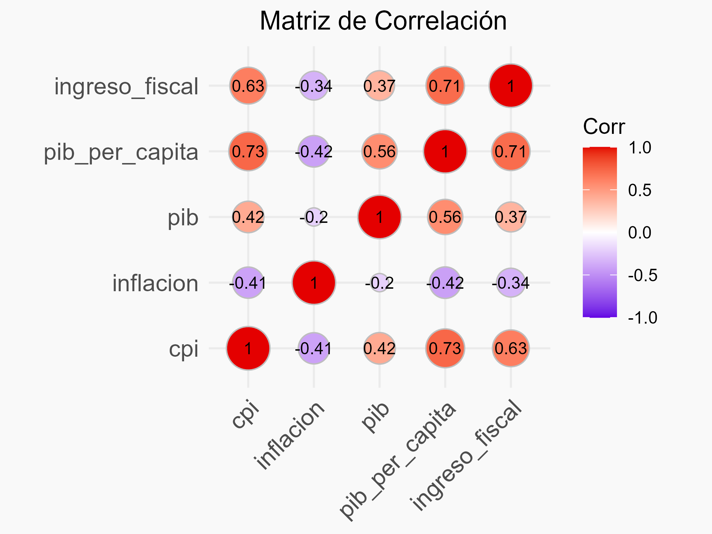

## Introducción {#introduccion}

En este informe se tiene como objetivo analizar que relación tiene la inflación con el crecimiento de la productividad, recaudación estatal
y la corrupción que perciben los ciudadanos.

### Origen de los Datos {#obtencion-de-los-datos}

Los datos utilizados en este análisis provienen de 3 fuentes principales:

-   **Inflación**: Los datos de inflación anual por país y región se obtuvieron del [Fondo Monetario
    Internacional](https://www.imf.org/external/datamapper/NGDP_RPCH@WEO/OEMDC/ADVEC/WEOWORLD "Fondo Monetario Internacional").

-   **Índice de Percepción de Corrupción (CPI)**: Los datos del CPI se obtuvieron de
    [transparency.org](https://www.transparency.org/en/ "transparency.org"), una organización sin fines de lucro que publica anualmente el
    índice de percepción de corrupción.

-   **PIB**: Los datos que tratan sobre producto interior bruto provienen de
    [Kaggle](https://www.kaggle.com/datasets/samybaladram/databank-world-development-indicators).

-   **Ingreso Fiscal**: Los datos de presión fiscal provienen del [Fondo Monetario
    Internacional](https://www.imf.org/external/datamapper/rev@FPP/USA/FRA/JPN/GBR/SWE/ESP/ITA/ZAF/IND/URY/VEN "Fondo Monetario Internacional").


## Limpieza de datos {#limpieza-de-datos}

### Obtención del DataFrame de Inflación y CPI

1.  Descarga de los datasets de CPI de todos los años disponibles y el de Inflación, que afortunadamente incluía todos los años.
    Posteriormente se unieron basándose en dos columnas distintas, según el caso podía ser el `ISO` o el `nombre` del país. Con frecuencia
    la ortografía de un país variaba de uno a otro.

2.  Creación de 2 arrays con los nombres de los países

3.  Creación y de 1 array con los nombres que no coinciden

4.  En vez de revisarlo manualmente le pase el array a Llama 3.1 varias veces hasta obtener una lista con todos los países que aparecen en
    ambos datasets pero con distinto nombre

5.  Con esa lista se cambia la ortografía del nombre de los países del segundo dataset a los del primero

6.  Se realiza un merge con el nombre del país como columna en común.

### Carga y Visualización del DataFrame de la Inflación y CPI {#carga-y-visualizacion-del-dataframe}


``` r
df <- read.csv("inflation_corruption_1995_2023_Ruben_Valverde.csv")
head(df[0:6])
```

```
##       country iso region inflation_2023 score_2023 rank_2023
## 1 Afghanistan AFG     AP        no data         20       162
## 2     Albania ALB    ECA            4.8         37        98
## 3     Algeria DZA   MENA            9.3         36       104
## 4      Angola AGO    SSA           13.6         33       121
## 5   Argentina ARG    AME          133.5         37        98
## 6     Armenia ARM    ECA              2         47        62
```

Se carga y muestra un archivo CSV con los datos de inflación y corrupción. *Nota: El resto de columnas son repeticiones de las columnas 3, 4
y 5 por lo que mostrarlas no aportan más información y empeoran la estética del documento.*

#### Reemplazo de Valores "no data" por NA {#reemplazo-de-valores-no-data-por-na}


``` r
# Contar valores "no data" en cada columna
inflation <- df[, grepl("inflation", names(df))]
no_data_count <- colSums(inflation == "no data", na.rm = TRUE)
print(paste("Hay un total de", sum(no_data_count), "valores 'no data'"))
```

```
## [1] "Hay un total de 128 valores 'no data'"
```

``` r
# Reemplazar los valores "no data" por NA en todo el DataFrame porque da problemas al conteo
df[df == "no data"] <- NA
```

1.  **Contar valores "no data" en cada columna:**
    -   Selecciona las columnas del DataFrame `df` que contienen la palabra "inflation" en su nombre y las guarda en un nuevo DataFrame
        llamado `inflation`.
    -   Utiliza la función `colSums` para contar los valores que son iguales a "no data" en cada columna del DataFrame `inflation`,
        ignorando los valores NA.
    -   Imprime el total de valores "no data" encontrados en todas las columnas seleccionadas.
2.  **Reemplazar los valores "no data" por NA en todo el DataFrame:**
    -   Estos valores causan problemas al realizar el conteo o análisis de datos.

#### Conversión de Columnas a Numérico {#conversion-de-columnas-a-numerico}


``` r
# Convertir las columnas de inflación de 1995 a 2023 a valores numéricos
for (year in 1995:2023) {
  column <- paste("inflation", year, sep = "_")
  df[[column]] <- as.numeric(df[[column]])
}
```

1.  **Iterar sobre un rango de años**:
    -   Utiliza un bucle `for` para iterar desde el año 1995 hasta el año 2023.
2.  **Generar nombres de columnas**:
    -   Para cada año en el rango, crea el nombre de la columna correspondiente utilizando `paste` para concatenar la palabra "inflation"
        con el año, separándolos con un guion bajo.
3.  **Convertir valores a numéricos**:
    -   Para cada columna generada, convierte los valores a tipo numérico utilizando `as.numeric`, asegurándose de que los datos en estas
        columnas sean tratados como números en lugar de cadenas de texto.

Este proceso garantiza que todas las columnas de inflación desde 1995 hasta 2023 contengan valores numéricos.

#### Conteo de valores NA {#conteo-de-valores-na}


``` r
# Contar y mostrar el número de valores nulos por columna
print(paste("Hay un total de", sum(is.na(df)), "valores nulos"))
```

```
## [1] "Hay un total de 2152 valores nulos"
```

Suma y muestra el total de valores nulos en el DataFrame.

#### Formateo del DataFrame {#formateo-del-dataFrame}


``` r
# Transformar el DataFrame de formato ancho a formato largo para poder analizar los datos de inflación, puntuación y rango a lo largo del tiempo posteriormente
df_melted <- df %>%
  pivot_longer(cols = starts_with("inflation_") | starts_with("score_"),
  names_to = c(".value", "year"),
  names_sep = "_") %>%
select(country, iso, region, year, inflation, score) #Nota el ranking no se llega a utilizar en este análisis asi que lo elimino

# Convertir las columnas 'inflation', 'score' y 'year' a tipo numérico en el DataFrame df_melted
df_melted <- df_melted %>%
    mutate(across(c(inflation, score, year), as.numeric))
    df_melted <- df_melted %>% arrange(year, country)
head(df_melted)
```

```
## # A tibble: 6 × 6
##   country     iso   region  year inflation score
##   <chr>       <chr> <chr>  <dbl>     <dbl> <dbl>
## 1 Afghanistan AFG   AP      1995      NA   NA   
## 2 Albania     ALB   ECA     1995       7.8 NA   
## 3 Algeria     DZA   MENA    1995      29.8 NA   
## 4 Angola      AGO   SSA     1995    2672.  NA   
## 5 Argentina   ARG   AME     1995      NA    5.24
## 6 Armenia     ARM   ECA     1995     177.  NA
```

1.  **Transformar el DataFrame a formato largo**:
    -   Utiliza `pivot_longer` para convertir el DataFrame de un formato ancho a un formato largo, seleccionando las columnas que comienzan
        con "inflation\_" o "score\_".
    -   Asigna los nombres a las nuevas columnas `inflation` y `score`, y extrae el año de los nombres de las columnas originales.
    -   Selecciona las columnas `country`, `iso`, `region`, `year`, `inflation` y `score`, omitiendo la columna `ranking`, no la utilizaré
        en el análisis.
2.  **Convertir columnas a tipo numérico**:
    -   Usa `mutate` con `across` para convertir las columnas `inflation`, `score` y `year` a tipo numérico.
3.  **Ordenar el DataFrame**:
    -   Ordena el DataFrame `df_melted` por `year` y `country` utilizando `arrange`.

### Carga, Visualización e Insercción del DataFrame de PIB


``` r
df_pib <- read.csv('world_development_data_interpolated.csv')[, c(1, 2, 9, 32)]
# Filtrar el DataFrame para eliminar las filas cuyo año sea anterior a 1995
df_pib <- df_pib %>% filter(Year >= 1995)
head(df_pib)
```

```
##   Year               Country         GDP TaxRevenue
## 1 1995              Honduras  5347445005         NA
## 2 1995            Montenegro          NA         NA
## 3 1995                 Sudan 13830369852         NA
## 4 1995               Uruguay 19297663097   16.87876
## 5 1995 Micronesia, Fed. Sts.   221575300         NA
## 6 1995                 Aruba  1320670391         NA
```

1.  **Lectura y selección de columnas**:
    -   Importa el archivo CSV `world_development_data_interpolated.csv` en un DataFrame `df_pib`.
    -   Selecciona las columnas en las posiciones 1, 2, 9 y 32, resultando en un subconjunto del DataFrame original.
2.  **Filtrado por año**:
    -   Filtra `df_pib` para mantener solo las filas donde el valor de la columna `Year` es mayor o igual a 1995.

#### Unión de ambos DataFrame


``` r
# Crear una lista de correspondencias entre los nombres de países en ambos datasets
country_corrections <- c(
    "United States" = "United States of America",
    "Russia" = "Russian Federation",
    "South Korea" = "Korea, Rep.",
    "North Korea" = "Korea, Dem. People's Rep.",
    "Iran" = "Iran, Islamic Rep.",
    "Egypt" = "Egypt, Arab Rep.",
    "Vietnam" = "Viet Nam",
    "Syria" = "Syrian Arab Republic",
    "Venezuela" = "Venezuela, RB",
    "Yemen" = "Yemen, Rep.",
    "Gambia" = "Gambia, The",
    "Congo (Kinshasa)" = "Congo, Dem. Rep.",
    "Congo (Brazzaville)" = "Congo, Rep.",
    "Tanzania" = "Tanzania, United Rep.",
    "Laos" = "Lao PDR",
    "Kyrgyzstan" = "Kyrgyz Republic",
    "Slovakia" = "Slovak Republic",
    "Brunei" = "Brunei Darussalam",
    "Bahamas" = "Bahamas, The",
    "Congo" = "Congo, Rep.",
    "Côte d'Ivoire" = "Cote d'Ivoire",
    "Hong Kong" = "Hong Kong SAR, China",
    "Korea (South)" = "Korea, Rep.",
    "Saint Lucia" = "St. Lucia",
    "Saint Vincent and the Grenadines" = "St. Vincent and the Grenadines",
    "Taiwan, China" = "Taiwan" 
)

# Reemplazar los nombres de países en df_melted
df_melted$country <- recode(df_melted$country, !!!country_corrections)

# Reemplazar los nombres de países en df_pib
df_pib$Country <- recode(df_pib$Country, !!!country_corrections)
# Unir el DataFrame de inflación y corrupción con el DataFrame de PIB
df <- df_melted %>% left_join(df_pib, by = c("country" = "Country", "year" = "Year"))

# Cambiar el nombre de las columnas de inglés a español
colnames(df) <- c("pais", "iso", "region", "año", "inflacion", "cpi", "pib", "ingresos_fiscales")
```

1.  **Crear una lista de correspondencias entre los nombres de países**:
    -   Define una lista `country_corrections` que contiene pares de nombres de países, estableciendo correspondencias entre diferentes
        formas de nombrar el mismo país en dos datasets.
2.  **Reemplazar los nombres de países en `df_melted`**:
    -   Utiliza la función `recode` para reemplazar los nombres de países en la columna `country` de `df_melted` según las correspondencias
        definidas en `country_corrections`.
3.  **Reemplazar los nombres de países en `df_pib`**:
    -   Aplica el mismo reemplazo de nombres de países en la columna `Country` de `df_pib` usando `recode`.
4.  **Unir los DataFrames**:
    -   Usa `left_join` para combinar `df_melted` con `df_pib` en base a las columnas `country` y `year`, produciendo un nuevo DataFrame
        `df`.
5.  **Cambiar el nombre de las columnas**:
    -   Renombra las columnas del DataFrame `df` al español, resultando en los nombres: `pais`, `iso`, `region`, `año`, `inflacion`, `cpi`,
        `pib` y `ingresos_fiscales`.

#### Corrección de la escala del CPI

En 2011 se produce un cambio de escala en el `CPI`, aumentando el limite superior del rango a 100 en lugar de 10.


``` r
# Multiplicar por 10 el CPI de 1995 hasta 2011
df <- df %>% mutate(cpi = ifelse(año >= 1995 & año <= 2011, cpi * 10, cpi))
```

Multiplica por 10 el valor del `CPI` en los años 1995 a 2011 para corregir la escala y ajustar los valores a la nueva escala de 0 a 100.


``` r
# Mostrar un resumen de los ingresos fiscales por país
media_ingresos_fiscales <- df %>% drop_na(ingresos_fiscales) %>% group_by(pais) %>% summarize(media_ingresos_fiscales = mean(ingresos_fiscales, na.rm = TRUE)) %>% arrange(pais) %>% select(pais, media_ingresos_fiscales)
```

1.  **Filtrar valores NA**:
    -   Utiliza `drop_na` para eliminar las filas en las que `ingresos_fiscales` tiene valores NA del DataFrame `df`.
2.  **Agrupar por país**:
    -   Agrupa los datos por la columna `pais` utilizando `group_by`.
3.  **Calcular la media de ingresos fiscales**:
    -   Calcula la media de `ingresos_fiscales` para cada país con `summarize`, ignorando los valores NA gracias al argumento
        `na.rm = TRUE`.
4.  **Ordenar por país**:
    -   Ordena el resultado por la columna `pais` con `arrange`.
5.  **Seleccionar columnas**:
    -   Selecciona únicamente las columnas `pais` y `media_ingresos_fiscales` con `select`.

El resultado es un DataFrame llamado `media_ingresos_fiscales` que contiene la media de los ingresos fiscales por país, ordenado
alfabéticamente por el nombre del país.

::: scroll

``` r
knitr::kable(media_ingresos_fiscales)
```


|pais                           | media_ingresos_fiscales|
|:------------------------------|-----------------------:|
|Afghanistan                    |               7.8005405|
|Albania                        |              16.4309944|
|Angola                         |              16.9511721|
|Argentina                      |              11.2366540|
|Armenia                        |              18.7510240|
|Australia                      |              22.7447511|
|Austria                        |              25.9467398|
|Azerbaijan                     |              13.5958319|
|Bahamas, The                   |              12.3937106|
|Bahrain                        |               4.4553900|
|Bangladesh                     |               7.5968698|
|Barbados                       |              25.2629492|
|Belarus                        |              16.8635591|
|Belgium                        |              25.0967044|
|Bhutan                         |              10.8451457|
|Bolivia                        |              13.5004495|
|Bosnia and Herzegovina         |              19.9678561|
|Botswana                       |              23.9159625|
|Bulgaria                       |              19.3065150|
|Burkina Faso                   |              12.6841967|
|Burundi                        |              13.8965331|
|Cabo Verde                     |              17.9889029|
|Cambodia                       |              12.1988739|
|Cameroon                       |              11.0678288|
|Canada                         |              13.0936545|
|Central African Republic       |               7.3314332|
|Chile                          |              17.1771985|
|China                          |               9.3939525|
|Colombia                       |              13.7843855|
|Congo, Rep.                    |               8.3479708|
|Costa Rica                     |              13.3098342|
|Cote d'Ivoire                  |              10.9783587|
|Croatia                        |               2.7686718|
|Cyprus                         |              30.3753052|
|Czechia                        |              14.6377885|
|Denmark                        |              32.8151491|
|Dominican Republic             |              12.7393894|
|Ecuador                        |              13.9372386|
|Egypt, Arab Rep.               |              14.5079547|
|El Salvador                    |              15.3164060|
|Equatorial Guinea              |               8.1523910|
|Estonia                        |              20.6316790|
|Ethiopia                       |               8.6180743|
|Fiji                           |              22.0912927|
|Finland                        |              21.1299667|
|France                         |              22.6244135|
|Gabon                          |              12.7878195|
|Georgia                        |              17.8263814|
|Germany                        |              11.2053056|
|Ghana                          |              14.2306173|
|Greece                         |              22.2259190|
|Guatemala                      |              10.6476606|
|Guinea-Bissau                  |               9.8924538|
|Honduras                       |              15.1692443|
|Hungary                        |              21.9896192|
|Iceland                        |              23.7489529|
|India                          |              10.0033083|
|Indonesia                      |              11.9392548|
|Iran, Islamic Rep.             |               6.7110492|
|Iraq                           |               1.7215676|
|Ireland                        |              22.9248841|
|Israel                         |              23.8839558|
|Italy                          |              24.1175054|
|Jamaica                        |              23.7392901|
|Jordan                         |              17.8859634|
|Kazakhstan                     |              11.4828458|
|Kenya                          |              14.6339396|
|Korea, Rep.                    |              13.8717098|
|Kuwait                         |               1.1941951|
|Kyrgyz Republic                |              16.9473511|
|Latvia                         |              21.3053256|
|Lebanon                        |              14.0276893|
|Lesotho                        |              31.1748391|
|Liberia                        |              10.3590648|
|Lithuania                      |              18.7812497|
|Luxembourg                     |              24.7258344|
|Madagascar                     |               9.1962184|
|Malawi                         |              10.9120180|
|Malaysia                       |              14.7438613|
|Maldives                       |              11.9319452|
|Mali                           |              13.0143206|
|Malta                          |              37.8313928|
|Mauritius                      |              16.8328686|
|Mexico                         |              10.8392187|
|Moldova                        |              16.6071118|
|Mongolia                       |              15.2746206|
|Morocco                        |              19.7306758|
|Mozambique                     |              21.0906324|
|Myanmar                        |               4.5715914|
|Namibia                        |              28.5244576|
|Nepal                          |              11.9469368|
|Netherlands                    |              21.4417755|
|New Zealand                    |              28.3370332|
|Nicaragua                      |              13.4724607|
|North Macedonia                |              17.2205359|
|Norway                         |              25.1961785|
|Pakistan                       |              11.9584395|
|Panama                         |               9.3113010|
|Papua New Guinea               |              17.9768328|
|Paraguay                       |               9.1637087|
|Peru                           |              14.5502398|
|Philippines                    |              12.9830193|
|Poland                         |              17.5064306|
|Portugal                       |              21.1268723|
|Romania                        |              16.7659412|
|Rwanda                         |              14.0065924|
|Saudi Arabia                   |               4.1938465|
|Senegal                        |              16.3899138|
|Serbia                         |              21.6380061|
|Seychelles                     |              27.4315430|
|Singapore                      |              13.4615676|
|Slovak Republic                |              18.0396145|
|Slovenia                       |              19.2351524|
|Solomon Islands                |              24.3056732|
|Somalia                        |               0.0001058|
|South Africa                   |              23.0021865|
|Spain                          |              13.7994413|
|Sri Lanka                      |              12.6607694|
|St. Lucia                      |              17.8209741|
|St. Vincent and the Grenadines |              21.1260511|
|Sudan                          |               6.6917399|
|Sweden                         |              27.6524380|
|Switzerland                    |               9.2400552|
|Tajikistan                     |               8.8280963|
|Tanzania, United Rep.          |              10.9173544|
|Timor-Leste                    |              58.0777980|
|Togo                           |              11.8280274|
|Tunisia                        |              19.4122725|
|Uganda                         |              11.6136194|
|Ukraine                        |              16.5899162|
|United Arab Emirates           |               0.4989788|
|United Kingdom                 |              25.1198956|
|United States of America       |              10.6738298|
|Uruguay                        |              17.5320128|
|Uzbekistan                     |              13.2940289|
|Vanuatu                        |              17.2244652|
|Zambia                         |              15.1614931|
|Zimbabwe                       |              14.8270504|
:::

Como se puede observar estos datos de presión fiscal no tienen ni pies ni cabeza, y multiplicarlos por 2 o por 3 no parece que vaya a
resolver el problema por lo que he buscado otra fuente de datos, en este caso como se indica al inicio del documento los he extraído del
**FMI**.

### Carga, Visualización del nuevo DataFrame de Presión Fiscal


``` r
df_pfisc <- read_excel("imf-dm-export-20241217.xls")
head(df_pfisc)
```

```
## # A tibble: 6 × 29
##   Government revenue, …¹ `1995` `1996` `1997` `1998` `1999` `2000` `2001` `2002`
##   <chr>                  <chr>  <chr>  <chr>   <dbl>  <dbl>  <dbl>  <dbl>  <dbl>
## 1 Albania                no da… no da… 18.39…   26.8   28.3   26.1   25.8   25.3
## 2 Algeria                29.96… 32.10… 33.33…   27.4   29.9   38.3   35.0   35.4
## 3 Angola                 no da… 39.10… 34.88…   27.6   41.1   42.9   37.5   28.7
## 4 Antigua and Barbuda    18.24… 19.24… 18.08…   20.7   18.8   18.1   17.1   19.3
## 5 Argentina              14.62… 13.14… 20.74…   21.3   21.8   21.8   21.1   19.9
## 6 Aruba                  25.49… 25.11… 22.88…   21.7   22.9   22.3   21.7   21.5
## # ℹ abbreviated name: ¹​`Government revenue, percent of GDP (% of GDP)`
## # ℹ 20 more variables: `2003` <dbl>, `2004` <dbl>, `2005` <dbl>, `2006` <dbl>,
## #   `2007` <dbl>, `2008` <dbl>, `2009` <dbl>, `2010` <dbl>, `2011` <dbl>,
## #   `2012` <dbl>, `2013` <dbl>, `2014` <dbl>, `2015` <dbl>, `2016` <dbl>,
## #   `2017` <dbl>, `2018` <dbl>, `2019` <dbl>, `2020` <dbl>, `2021` <dbl>,
## #   `2022` <dbl>
```

Se carga y muestra un archivo Excel con los datos de presión fiscal.

#### Reemplazo de Valores "no data" por NA


``` r
# Renombrar la primera columna a pais
colnames(df_pfisc)[1] <- "pais"

# Contar valores "no data" en cada columna
no_data_count <- colSums(df_pfisc == "no data", na.rm = TRUE)

print(paste("Hay un total de", sum(no_data_count), "valores no data"))
```

```
## [1] "Hay un total de 41 valores no data"
```

``` r
# Reemplazar los valores "no data" por NA en todo el DataFrame porque da problemas al conteo
df_pfisc[df_pfisc == "no data"] <- NA
```

1.  **Renombrar la primera columna**:
    -   Cambia el nombre de la primera columna de `df_pfisc` a `pais`.
2.  **Contar valores "no data" en cada columna**:
    -   Utiliza `colSums` para contar los valores "no data" en cada columna de `df_pfisc`, ignorando los valores NA.
3.  **Imprimir el total de valores "no data"**:
    -   Imprime el total de valores "no data" encontrados en todas las columnas del DataFrame.
4.  **Reemplazar los valores "no data" por NA**:
    -   Reemplaza todos los valores "no data" en el DataFrame `df_pfisc` con NA, dado que estos valores causan problemas al realizar el
        conteo o análisis de datos.


``` r
# Contar y mostrar el número de valores nulos por columna
print(paste("Hay un total de", sum(is.na(df_pfisc)), "valores nulos"))
```

```
## [1] "Hay un total de 98 valores nulos"
```

Suma y muestra el total de valores nulos en el DataFrame.

#### Formatear el DataFrame poniendo los años en una columna


``` r
años <- colnames(df_pfisc)[-1]
# Convertir las columnas de ingresos fiscales de 1995 a 2022 a valores numéricos
df_pfisc <- df_pfisc %>% mutate_at(vars(-pais), as.numeric)
  
# Transformar el DataFrame de formato ancho a formato largo para poder unirlo correctamente con el DataFrame principal
df_pfisc <- df_pfisc %>% pivot_longer(cols = all_of(años), names_to ="año", values_to = "ingresos_fiscales_fmi") %>% mutate(año = as.numeric(año))
head(df_pfisc)
```

```
## # A tibble: 6 × 3
##   pais      año ingresos_fiscales_fmi
##   <chr>   <dbl>                 <dbl>
## 1 Albania  1995                  NA  
## 2 Albania  1996                  NA  
## 3 Albania  1997                  18.4
## 4 Albania  1998                  26.8
## 5 Albania  1999                  28.3
## 6 Albania  2000                  26.1
```

1.  **Identificar los años**:
    -   Extrae los nombres de las columnas del DataFrame `df_pfisc`, omitiendo la primera columna `pais`, y los guarda en la variable
        `años`.
2.  **Convertir columnas a valores numéricos**:
    -   Utiliza `mutate_at` para convertir las columnas de ingresos fiscales desde 1995 hasta 2022 a tipo numérico, excepto la columna
        `pais`.
3.  **Transformar el DataFrame a formato largo**:
    -   Emplea `pivot_longer` para transformar el DataFrame `df_pfisc` de formato ancho a formato largo, lo cual facilita su posterior unión
        con el DataFrame principal.
    -   Renombra las columnas resultantes a `año` e `ingresos_fiscales_fmi`.
4.  **Convertir `año` a numérico**:
    -   Usa `mutate` para asegurar que la columna `año` esté en formato numérico.

### Unión de ambos DataFrame


``` r
# Mapear los nombres de los países en df_pfisc a los nombres de los países en df
# Crear una lista de correspondencias entre los nombres de países en ambos datasets
country_corrections_pfisc <- c(
    "United States" = "United States of America",
    "Russia" = "Russian Federation",
    "South Korea" = "Korea, Rep.",
    "North Korea" = "Korea, Dem. People's Rep.",
    "Iran" = "Iran, Islamic Rep.",
    "Egypt" = "Egypt, Arab Rep.",
    "Vietnam" = "Viet Nam",
    "Syria" = "Syrian Arab Republic",
    "Venezuela" = "Venezuela, RB",
    "Yemen" = "Yemen, Rep.",
    "Gambia" = "Gambia, The",
    "Congo (Kinshasa)" = "Congo, Dem. Rep.",
    "Congo (Brazzaville)" = "Congo, Rep.",
    "Tanzania" = "Tanzania, United Rep.",
    "Laos" = "Lao PDR",
    "Kyrgyzstan" = "Kyrgyz Republic",
    "Slovakia" = "Slovak Republic",
    "Brunei" = "Brunei Darussalam",
    "Bahamas" = "Bahamas, The",
    "Congo" = "Congo, Rep.",
    "Côte d'Ivoire" = "Cote d'Ivoire",
    "Hong Kong" = "Hong Kong SAR, China",
    "Korea (South)" = "Korea, Rep.",
    "Saint Lucia" = "St. Lucia",
    "Saint Vincent and the Grenadines" = "St. Vincent and the Grenadines",
    "Taiwan, China" = "Taiwan" 
)

# Reemplazar los nombres de países en df_pfisc
df_pfisc$pais <- recode(df_pfisc$pais, !!!country_corrections_pfisc)
df_or <- df
# Unir df y df_pfisc a través de las columnas pais y año
df <- df %>% inner_join(df_pfisc, by = c("pais", "año"))
head(df)
```

```
## # A tibble: 6 × 9
##   pais      iso   region   año inflacion   cpi           pib ingresos_fiscales
##   <chr>     <chr> <chr>  <dbl>     <dbl> <dbl>         <dbl>             <dbl>
## 1 Albania   ALB   ECA     1995       7.8  NA     2392764853.             13.6 
## 2 Algeria   DZA   MENA    1995      29.8  NA    41764291964.             NA   
## 3 Angola    AGO   SSA     1995    2672.   NA     5561222222.             NA   
## 4 Argentina ARG   AME     1995      NA    52.4 258031750000               8.05
## 5 Australia AUS   AP      1995       4.6  88   368140778141.             21.2 
## 6 Austria   AUT   WE/EU   1995       1.6  71.3 241038283063.             24.6 
## # ℹ 1 more variable: ingresos_fiscales_fmi <dbl>
```

1.  **Crear una lista de correspondencias entre los nombres de países**:
    -   Define una lista `country_corrections_pfisc` que contiene pares de nombres de países, estableciendo correspondencias entre
        diferentes formas de nombrar el mismo país en los dos datasets.
2.  **Reemplazar los nombres de países en `df_pfisc`**:
    -   Utiliza la función `recode` para reemplazar los nombres de países en la columna `pais` de `df_pfisc` según las correspondencias
        definidas en `country_corrections_pfisc`.
3.  **Unir los DataFrames**:
    -   Crea una copia del DataFrame `df` llamada `df_or`.
    -   Usa `inner_join` para combinar `df` con `df_pfisc` en base a las columnas `pais` y `año`, produciendo un nuevo DataFrame `df`.

#### Creación de la columna variación de ingresos fiscales


``` r
df <- df %>%
  arrange(pais, año) %>%
  group_by(pais) %>%
  mutate(variacion_ingresos = ingresos_fiscales - lag(ingresos_fiscales))
```

1.  **Ordenar el DataFrame**:
    -   Usa `arrange` para ordenar el DataFrame `df` por las columnas `pais` y `año` en orden ascendente.
2.  **Agrupar por país**:
    -   Emplea `group_by` para agrupar los datos por la columna `pais`, permitiendo realizar operaciones dentro de cada grupo de país.
3.  **Calcular la variación de ingresos fiscales**:
    -   Utiliza `mutate` para crear una nueva columna `variacion_ingresos`, que calcula la diferencia entre `ingresos_fiscales` y el valor
        de `ingresos_fiscales` en el año anterior (`lag(ingresos_fiscales)`).

Este proceso permite analizar cómo han cambiado los ingresos fiscales año tras año dentro de cada país.

#### Creación de la columna de crecimiento del PIB


``` r
df <- df %>%
  arrange(pais, año) %>%
  group_by(pais) %>%
  mutate(
    crecimiento_pib = ((pib / (1 + inflacion/100)) / lag(pib)) * 100 - 100
  )
# Imprimir el resumen del DataFrame
summary(df)
```

```
##      pais               iso               region               año      
##  Length:3892        Length:3892        Length:3892        Min.   :1995  
##  Class :character   Class :character   Class :character   1st Qu.:2002  
##  Mode  :character   Mode  :character   Mode  :character   Median :2008  
##                                                           Mean   :2008  
##                                                           3rd Qu.:2015  
##                                                           Max.   :2022  
##                                                                         
##    inflacion             cpi              pib            ingresos_fiscales
##  Min.   :  -19.80   Min.   :  4.00   Min.   :1.419e+08   Min.   : 0.0421  
##  1st Qu.:    1.70   1st Qu.: 28.00   1st Qu.:6.517e+09   1st Qu.:11.9363  
##  Median :    3.70   Median : 39.00   Median :2.407e+10   Median :16.9507  
##  Mean   :   32.69   Mean   : 45.46   Mean   :3.315e+11   Mean   :17.2474  
##  3rd Qu.:    7.60   3rd Qu.: 60.62   3rd Qu.:1.519e+11   3rd Qu.:22.4235  
##  Max.   :65374.10   Max.   :100.00   Max.   :2.332e+13   Max.   :48.5634  
##  NA's   :31         NA's   :752      NA's   :149         NA's   :1451     
##  ingresos_fiscales_fmi variacion_ingresos crecimiento_pib  
##  Min.   : 2.764        Min.   :-22.7969   Min.   :-96.812  
##  1st Qu.:17.789        1st Qu.: -0.4497   1st Qu.: -4.575  
##  Median :25.805        Median :  0.0179   Median :  1.773  
##  Mean   :27.881        Mean   :  0.0341   Mean   :  1.039  
##  3rd Qu.:37.001        3rd Qu.:  0.5827   3rd Qu.:  7.426  
##  Max.   :72.305        Max.   : 14.9234   Max.   :170.389  
##  NA's   :33            NA's   :1586       NA's   :308
```

1.  **Ordenar el DataFrame**:
    -   Usa `arrange` para ordenar el DataFrame `df` por las columnas `pais` y `año` en orden ascendente.
2.  **Agrupar por país**:
    -   Emplea `group_by` para agrupar los datos por la columna `pais`, permitiendo realizar operaciones dentro de cada grupo de país.
3.  **Calcular el crecimiento del PIB**:
    -   Utiliza `mutate` para crear una nueva columna `crecimiento_pib`, que calcula el crecimiento del PIB ajustado por la inflación. Esta
        fórmula considera el PIB del año actual dividido por el PIB del año anterior (ajustado por la inflación), menos 100 para obtener el
        porcentaje de crecimiento.

Este proceso permite evaluar el crecimiento del PIB de cada país año tras año, teniendo en cuenta la inflación.

::: scroll

``` r
knitr::kable(df)
```


|pais                           |iso |region |  año| inflacion|   cpi|          pib| ingresos_fiscales| ingresos_fiscales_fmi| variacion_ingresos| crecimiento_pib|
|:------------------------------|:---|:------|----:|---------:|-----:|------------:|-----------------:|---------------------:|------------------:|---------------:|
|Albania                        |ALB |ECA    | 1995|       7.8|    NA| 2.392765e+09|        13.6007883|                    NA|                 NA|              NA|
|Albania                        |ALB |ECA    | 1996|      12.7|    NA| 3.199641e+09|         8.8617187|                    NA|         -4.7390696|      18.6526091|
|Albania                        |ALB |ECA    | 1997|      33.2|    NA| 2.258514e+09|         9.9048370|             18.397818|          1.0431183|     -47.0071438|
|Albania                        |ALB |ECA    | 1998|      20.6|    NA| 2.545965e+09|        14.5689441|             26.825739|          4.6641071|      -6.5278438|
|Albania                        |ALB |ECA    | 1999|       0.4|  23.0| 3.212122e+09|                NA|             28.266074|                 NA|      25.6625653|
|Albania                        |ALB |ECA    | 2000|       0.0|    NA| 3.480355e+09|                NA|             26.065934|                 NA|       8.3506678|
|Albania                        |ALB |ECA    | 2001|       3.1|    NA| 3.922101e+09|                NA|             25.847842|                 NA|       9.3041140|
|Albania                        |ALB |ECA    | 2002|       5.2|  25.0| 4.348068e+09|        16.4842423|             25.322975|                 NA|       5.3808898|
|Albania                        |ALB |ECA    | 2003|       2.4|  25.0| 5.611496e+09|        17.1961377|             24.673854|          0.7118955|      26.0324472|
|Albania                        |ALB |ECA    | 2004|       2.9|  25.0| 7.184686e+09|        17.9650759|             24.992064|          0.7689381|      24.4267412|
|Albania                        |ALB |ECA    | 2005|       2.4|  24.0| 8.052077e+09|                NA|             25.434208|                 NA|       9.4460758|
|Albania                        |ALB |ECA    | 2006|       2.4|  26.0| 8.896075e+09|                NA|             25.928000|                 NA|       7.8923241|
|Albania                        |ALB |ECA    | 2007|       3.0|  29.0| 1.067732e+10|                NA|             26.129876|                 NA|      16.5270620|
|Albania                        |ALB |ECA    | 2008|       3.3|  34.0| 1.288135e+10|                NA|             26.842287|                 NA|      16.7881285|
|Albania                        |ALB |ECA    | 2009|       2.2|  32.0| 1.204421e+10|                NA|             26.093000|                 NA|      -8.5116519|
|Albania                        |ALB |ECA    | 2010|       3.6|  33.0| 1.192693e+10|                NA|             25.866527|                 NA|      -4.4148043|
|Albania                        |ALB |ECA    | 2011|       3.4|  31.0| 1.289076e+10|        18.0220133|             25.406957|                 NA|       4.5272307|
|Albania                        |ALB |ECA    | 2012|       2.0|  33.0| 1.231983e+10|        17.4832336|             24.788504|         -0.5387797|      -6.3028976|
|Albania                        |ALB |ECA    | 2013|       1.9|  31.0| 1.277622e+10|        16.5032706|             23.977495|         -0.9799629|       1.7708701|
|Albania                        |ALB |ECA    | 2014|       1.6|  33.0| 1.322815e+10|        18.3019361|             26.271611|          1.7986655|       1.9067111|
|Albania                        |ALB |ECA    | 2015|       1.9|  36.0| 1.138685e+10|        18.5157899|             26.439994|          0.2138537|     -15.5245515|
|Albania                        |ALB |ECA    | 2016|       1.3|  39.0| 1.186120e+10|        17.5902298|             27.641886|         -0.9255600|       2.8289634|
|Albania                        |ALB |ECA    | 2017|       2.0|  38.0| 1.301973e+10|        18.8874861|             27.756016|          1.2972563|       7.6150612|
|Albania                        |ALB |ECA    | 2018|       2.0|  36.0| 1.515642e+10|        18.5459675|             27.456517|         -0.3415186|      14.1286617|
|Albania                        |ALB |ECA    | 2019|       1.4|  35.0| 1.540183e+10|        18.1443772|             27.208935|         -0.4015903|       0.2161033|
|Albania                        |ALB |ECA    | 2020|       1.6|  36.0| 1.516273e+10|        16.9832623|             25.852737|         -1.1611149|      -3.1027171|
|Albania                        |ALB |ECA    | 2021|       2.0|  35.0| 1.793057e+10|        18.1985894|             27.527110|          1.2153271|      15.9354584|
|Albania                        |ALB |ECA    | 2022|       6.7|  36.0|           NA|                NA|             26.786660|                 NA|              NA|
|Algeria                        |DZA |MENA   | 1995|      29.8|    NA| 4.176429e+10|                NA|             29.967581|                 NA|              NA|
|Algeria                        |DZA |MENA   | 1996|      18.7|    NA| 4.694155e+10|                NA|             32.107276|                 NA|      -5.3105443|
|Algeria                        |DZA |MENA   | 1997|       5.7|    NA| 4.817761e+10|                NA|             33.330983|                 NA|      -2.9014330|
|Algeria                        |DZA |MENA   | 1998|       5.0|    NA| 4.818778e+10|                NA|             27.363135|                 NA|      -4.7418012|
|Algeria                        |DZA |MENA   | 1999|       2.6|    NA| 4.864067e+10|                NA|             29.948302|                 NA|      -1.6180857|
|Algeria                        |DZA |MENA   | 2000|       0.3|    NA| 5.479040e+10|                NA|             38.272317|                 NA|      12.3062600|
|Algeria                        |DZA |MENA   | 2001|       4.2|    NA| 5.474470e+10|                NA|             34.990987|                 NA|      -4.1107583|
|Algeria                        |DZA |MENA   | 2002|       1.4|    NA| 5.676036e+10|                NA|             35.448925|                 NA|       2.2504175|
|Algeria                        |DZA |MENA   | 2003|       4.3|  26.0| 6.786385e+10|                NA|             37.077795|                 NA|      14.6328469|
|Algeria                        |DZA |MENA   | 2004|       4.0|  27.0| 8.533258e+10|                NA|             36.024215|                 NA|      20.9046620|
|Algeria                        |DZA |MENA   | 2005|       1.4|  28.0| 1.031982e+11|                NA|             40.739156|                 NA|      19.2667363|
|Algeria                        |DZA |MENA   | 2006|       2.3|  31.0| 1.170273e+11|                NA|             42.814172|                 NA|      10.8509214|
|Algeria                        |DZA |MENA   | 2007|       3.7|  30.0| 1.349771e+11|                NA|             39.834184|                 NA|      11.2228878|
|Algeria                        |DZA |MENA   | 2008|       4.9|  32.0| 1.710007e+11|                NA|             47.566036|                 NA|      20.7709166|
|Algeria                        |DZA |MENA   | 2009|       5.7|  28.0| 1.372110e+11|                NA|             36.792473|                 NA|     -24.0870152|
|Algeria                        |DZA |MENA   | 2010|       3.9|  29.0| 1.612073e+11|                NA|             37.212219|                 NA|      13.0785499|
|Algeria                        |DZA |MENA   | 2011|       4.5|  29.0| 2.000131e+11|                NA|             40.018795|                 NA|      18.7291681|
|Algeria                        |DZA |MENA   | 2012|       8.9|  34.0| 2.090591e+11|                NA|             39.108547|                 NA|      -4.0195631|
|Algeria                        |DZA |MENA   | 2013|       3.3|  36.0| 2.097550e+11|                NA|             35.785571|                 NA|      -2.8723304|
|Algeria                        |DZA |MENA   | 2014|       2.9|  36.0| 2.138100e+11|                NA|             33.305480|                 NA|      -0.9395559|
|Algeria                        |DZA |MENA   | 2015|       4.8|  36.0| 1.659792e+11|                NA|             30.544079|                 NA|     -25.9262258|
|Algeria                        |DZA |MENA   | 2016|       6.4|  34.0| 1.600342e+11|                NA|             28.613734|                 NA|      -9.3813728|
|Algeria                        |DZA |MENA   | 2017|       5.6|  33.0| 1.700970e+11|                NA|             32.558046|                 NA|       0.6514117|
|Algeria                        |DZA |MENA   | 2018|       4.3|  35.0| 1.749109e+11|                NA|             33.475769|                 NA|      -1.4093073|
|Algeria                        |DZA |MENA   | 2019|       2.0|  35.0| 1.717603e+11|                NA|             32.202497|                 NA|      -3.7267261|
|Algeria                        |DZA |MENA   | 2020|       2.4|  36.0| 1.457437e+11|                NA|             30.529693|                 NA|     -17.1357627|
|Algeria                        |DZA |MENA   | 2021|       7.2|  33.0| 1.634722e+11|                NA|             29.881101|                 NA|       4.6307532|
|Algeria                        |DZA |MENA   | 2022|       9.3|  33.0|           NA|                NA|             34.191879|                 NA|              NA|
|Angola                         |AGO |SSA    | 1995|    2672.2|    NA| 5.561222e+09|                NA|                    NA|                 NA|              NA|
|Angola                         |AGO |SSA    | 1996|    4146.0|    NA| 7.526964e+09|                NA|             39.103971|                 NA|     -96.8123576|
|Angola                         |AGO |SSA    | 1997|     221.5|    NA| 7.648377e+09|                NA|             34.881748|                 NA|     -68.3940757|
|Angola                         |AGO |SSA    | 1998|     107.4|    NA| 6.506230e+09|                NA|             27.629295|                 NA|     -58.9841871|
|Angola                         |AGO |SSA    | 1999|     248.2|    NA| 6.152923e+09|        16.2939717|             41.127833|                 NA|     -72.8404029|
|Angola                         |AGO |SSA    | 2000|     325.0|  17.0| 9.129595e+09|        28.7033822|             42.857655|         12.4094105|     -65.0874881|
|Angola                         |AGO |SSA    | 2001|     152.6|    NA| 8.936079e+09|        29.2466757|             37.463339|          0.5432936|     -61.2508516|
|Angola                         |AGO |SSA    | 2002|     108.9|  17.0| 1.528559e+10|        15.5328118|             28.680556|        -13.7138639|     -18.1164194|
|Angola                         |AGO |SSA    | 2003|      98.2|  18.0| 1.781270e+10|        17.1715804|             29.715274|          1.6387685|     -41.2045202|
|Angola                         |AGO |SSA    | 2004|      43.5|  20.0| 2.355206e+10|        18.0745701|             30.986721|          0.9029898|      -7.8602369|
|Angola                         |AGO |SSA    | 2005|      23.0|  20.0| 3.697090e+10|        17.1091178|             33.697247|         -0.9654523|      27.6221523|
|Angola                         |AGO |SSA    | 2006|      13.3|  22.0| 5.238103e+10|        23.3851700|             40.026741|          6.2760522|      25.0501015|
|Angola                         |AGO |SSA    | 2007|      12.2|  22.0| 6.526642e+10|        21.4991606|             42.440468|         -1.8860094|      11.0511122|
|Angola                         |AGO |SSA    | 2008|      12.5|  19.0| 8.853866e+10|        25.6501499|             48.430859|          4.1509893|      20.5842769|
|Angola                         |AGO |SSA    | 2009|      13.7|  19.0| 7.030720e+10|        18.3610792|             37.109673|         -7.2890706|     -30.1596596|
|Angola                         |AGO |SSA    | 2010|      14.5|  19.0| 8.169953e+10|        16.5999472|             42.789389|         -1.7611320|       1.4879019|
|Angola                         |AGO |SSA    | 2011|      13.5|  20.0| 1.094366e+11|        16.1034124|             45.483055|         -0.4965348|      18.0176757|
|Angola                         |AGO |SSA    | 2012|      10.3|  22.0| 1.249982e+11|        14.8227191|             41.340071|         -1.2806933|       3.5537482|
|Angola                         |AGO |SSA    | 2013|       8.8|  23.0| 1.334016e+11|        14.1847627|             36.745793|         -0.6379565|      -1.9091969|
|Angola                         |AGO |SSA    | 2014|       7.3|  19.0| 1.372444e+11|        13.5426302|             30.736415|         -0.6421325|      -4.1186693|
|Angola                         |AGO |SSA    | 2015|       9.2|  15.0| 8.721930e+10|        11.0020190|             24.133864|         -2.5406111|     -41.8037228|
|Angola                         |AGO |SSA    | 2016|      30.7|  18.0| 4.984049e+10|         9.7325125|             17.522939|         -1.2695065|     -56.2785932|
|Angola                         |AGO |SSA    | 2017|      29.8|  19.0| 6.897277e+10|         9.2237775|             17.516466|         -0.5087350|       6.6155761|
|Angola                         |AGO |SSA    | 2018|      19.6|  19.0| 7.779294e+10|         9.6447785|             22.865699|          0.4210010|      -5.6957282|
|Angola                         |AGO |SSA    | 2019|      17.1|  26.0| 6.930911e+10|        10.0903858|             21.178819|          0.4456073|     -23.9160208|
|Angola                         |AGO |SSA    | 2020|      22.3|  27.0| 5.024137e+10|                NA|             21.345495|                 NA|     -40.7286692|
|Angola                         |AGO |SSA    | 2021|      25.8|  29.0| 6.568544e+10|                NA|             23.307004|                 NA|       3.9266628|
|Angola                         |AGO |SSA    | 2022|      21.4|  33.0|           NA|                NA|             23.218672|                 NA|              NA|
|Argentina                      |ARG |AME    | 1995|        NA|  52.4| 2.580318e+11|         8.0543577|             14.625500|                 NA|              NA|
|Argentina                      |ARG |AME    | 1996|        NA|  34.1| 2.721497e+11|         8.1717878|             13.149300|          0.1174301|              NA|
|Argentina                      |ARG |AME    | 1997|        NA|  28.1| 2.928590e+11|         8.6900864|             20.748176|          0.5182986|              NA|
|Argentina                      |ARG |AME    | 1998|       0.9|  30.0| 2.989483e+11|         9.0305262|             21.302975|          0.3404398|       1.1687244|
|Argentina                      |ARG |AME    | 1999|      -1.2|  30.0| 2.835230e+11|         9.0761243|             21.766202|          0.0455981|      -4.0079348|
|Argentina                      |ARG |AME    | 2000|      -0.9|  35.0| 2.842037e+11|         9.6226035|             21.830487|          0.5464792|       1.1504581|
|Argentina                      |ARG |AME    | 2001|      -1.1|  35.0| 2.686968e+11|         9.3248988|             21.068353|         -0.2977047|      -4.4047490|
|Argentina                      |ARG |AME    | 2002|      25.9|  28.0| 9.772400e+10|         9.8189583|             19.942904|          0.4940596|     -71.1122904|
|Argentina                      |ARG |AME    | 2003|      13.4|  25.0| 1.275870e+11|        12.5187797|             23.526034|          2.6998214|      15.1309338|
|Argentina                      |ARG |AME    | 2004|       4.4|  25.0| 1.646579e+11|        13.1007799|             26.996427|          0.5820002|      23.6163222|
|Argentina                      |ARG |AME    | 2005|       9.6|  28.0| 1.987371e+11|        13.1031756|             27.766183|          0.0023957|      10.1249516|
|Argentina                      |ARG |AME    | 2006|      10.9|  29.0| 2.325573e+11|        12.8788867|             28.266732|         -0.2242890|       5.5162674|
|Argentina                      |ARG |AME    | 2007|       8.8|  29.0| 2.875305e+11|        12.4482684|             30.307563|         -0.4306182|      13.6384061|
|Argentina                      |ARG |AME    | 2008|       8.6|  29.0| 3.615580e+11|        13.3178464|             31.114321|          0.8695779|      15.7881893|
|Argentina                      |ARG |AME    | 2009|       6.3|  29.0| 3.329765e+11|        12.3830416|             32.694392|         -0.9348048|     -13.3632246|
|Argentina                      |ARG |AME    | 2010|      10.5|  29.0| 4.236274e+11|        12.8530427|             31.964614|          0.4700011|      15.1352274|
|Argentina                      |ARG |AME    | 2011|       9.8|  30.0| 5.301582e+11|        12.6636277|             32.156252|         -0.1894150|      13.9774822|
|Argentina                      |ARG |AME    | 2012|      10.0|  35.0| 5.459824e+11|        12.9528415|             33.803368|          0.2892138|      -6.3774481|
|Argentina                      |ARG |AME    | 2013|      10.6|  34.0| 5.520251e+11|        12.4529028|             34.349105|         -0.4999388|      -8.5833914|
|Argentina                      |ARG |AME    | 2014|        NA|  34.0| 5.263197e+11|        12.6109666|             34.600502|          0.1580639|              NA|
|Argentina                      |ARG |AME    | 2015|        NA|  32.0| 5.947493e+11|        12.3365069|             35.365772|         -0.2744597|              NA|
|Argentina                      |ARG |AME    | 2016|        NA|  36.0| 5.575323e+11|        12.0972836|             34.867352|         -0.2392233|              NA|
|Argentina                      |ARG |AME    | 2017|      25.7|  39.0| 6.436284e+11|        10.9396239|             34.428113|         -1.1576598|      -8.1604235|
|Argentina                      |ARG |AME    | 2018|      34.3|  40.0| 5.248199e+11|         9.9923901|             33.508063|         -0.9472338|     -39.2845688|
|Argentina                      |ARG |AME    | 2019|      53.5|  45.0| 4.477547e+11|        10.5943975|             33.307612|          0.6020074|     -44.4196256|
|Argentina                      |ARG |AME    | 2020|      42.0|  42.0| 3.855404e+11|        10.8715360|             33.471039|          0.2771385|     -39.3624820|
|Argentina                      |ARG |AME    | 2021|      48.4|  38.0| 4.872271e+11|        11.4844172|             33.458373|          0.6128812|     -14.8415680|
|Argentina                      |ARG |AME    | 2022|      72.4|  38.0|           NA|                NA|             33.426426|                 NA|              NA|
|Australia                      |AUS |AP     | 1995|       4.6|  88.0| 3.681408e+11|        21.1610449|             33.701210|                 NA|              NA|
|Australia                      |AUS |AP     | 1996|       2.7|  86.0| 4.013108e+11|        21.8740547|             34.554260|          0.7130098|       6.1442575|
|Australia                      |AUS |AP     | 1997|       0.2|  88.6| 4.356138e+11|        22.3770633|             34.673748|          0.5030086|       8.3310628|
|Australia                      |AUS |AP     | 1998|       0.9|  87.0| 3.996609e+11|        22.2295577|             35.371441|         -0.1475056|      -9.0717465|
|Australia                      |AUS |AP     | 1999|       1.4|  87.0| 3.893896e+11|        22.4301081|             36.219578|          0.2005504|      -3.9151687|
|Australia                      |AUS |AP     | 2000|       4.5|  83.0| 4.158450e+11|        23.0420140|             34.910278|          0.6119059|       2.1952626|
|Australia                      |AUS |AP     | 2001|       4.4|  85.0| 3.793578e+11|        24.8756536|             34.991680|          1.8336395|     -12.6189840|
|Australia                      |AUS |AP     | 2002|       3.0|  86.0| 3.955730e+11|        23.5609774|             35.525311|         -1.3146761|       1.2372640|
|Australia                      |AUS |AP     | 2003|       2.7|  88.0| 4.674980e+11|        24.3125026|             35.509605|          0.7515252|      15.0754307|
|Australia                      |AUS |AP     | 2004|       2.3|  88.0| 6.143264e+11|        24.2714388|             35.785786|         -0.0410638|      28.4528656|
|Australia                      |AUS |AP     | 2005|       2.7|  88.0| 6.953050e+11|        24.7683598|             35.510288|          0.4969210|      10.2061312|
|Australia                      |AUS |AP     | 2006|       3.6|  87.0| 7.479074e+11|        24.5284832|             35.025379|         -0.2398766|       3.8275822|
|Australia                      |AUS |AP     | 2007|       2.4|  86.0| 8.544273e+11|        24.0556693|             35.121555|         -0.4728139|      11.5648253|
|Australia                      |AUS |AP     | 2008|       4.3|  87.0| 1.055686e+12|        24.2174680|             32.835949|          0.1617987|      18.4610026|
|Australia                      |AUS |AP     | 2009|       1.8|  87.0| 9.286298e+11|        22.0241488|             31.646000|         -2.1933191|     -13.5907936|
|Australia                      |AUS |AP     | 2010|       2.9|  87.0| 1.148570e+12|        20.4827851|             32.512699|         -1.5413637|      20.1985744|
|Australia                      |AUS |AP     | 2011|       3.4|  88.0| 1.398456e+12|        20.3247596|             31.791630|         -0.1580255|      17.7527408|
|Australia                      |AUS |AP     | 2012|       1.7|  85.0| 1.546953e+12|        21.1069901|             33.017527|          0.7822305|       8.7695226|
|Australia                      |AUS |AP     | 2013|       2.5|  81.0| 1.576330e+12|        21.9553817|             33.574160|          0.8483915|      -0.5863182|
|Australia                      |AUS |AP     | 2014|       2.5|  80.0| 1.467590e+12|        21.9079605|             33.836895|         -0.0474211|      -9.1690631|
|Australia                      |AUS |AP     | 2015|       1.5|  79.0| 1.350580e+12|        21.8829487|             34.498756|         -0.0250119|      -9.3329124|
|Australia                      |AUS |AP     | 2016|       1.3|  79.0| 1.206563e+12|        22.2770760|             34.844460|          0.3941273|     -11.8098455|
|Australia                      |AUS |AP     | 2017|       2.0|  77.0| 1.326467e+12|        22.0918703|             35.045230|         -0.1852057|       7.7820567|
|Australia                      |AUS |AP     | 2018|       1.9|  77.0| 1.428267e+12|        23.1974319|             35.617979|          1.1055617|       5.6667768|
|Australia                      |AUS |AP     | 2019|       1.6|  77.0| 1.392219e+12|        23.4130770|             34.524270|          0.2156450|      -4.0589544|
|Australia                      |AUS |AP     | 2020|       0.9|  77.0| 1.326945e+12|        22.6119504|             35.757733|         -0.8011266|      -5.5386332|
|Australia                      |AUS |AP     | 2021|       2.8|  73.0| 1.552703e+12|        23.1275046|             35.625137|          0.5155542|      13.8262739|
|Australia                      |AUS |AP     | 2022|       6.6|  75.0|           NA|                NA|             35.749032|                 NA|              NA|
|Austria                        |AUT |WE/EU  | 1995|       1.6|  71.3| 2.410383e+11|        24.6001062|             50.429401|                 NA|              NA|
|Austria                        |AUT |WE/EU  | 1996|       1.8|  75.9| 2.372509e+11|        25.9400360|             51.721901|          1.3399298|      -3.3116487|
|Austria                        |AUT |WE/EU  | 1997|       1.2|  76.1| 2.127903e+11|        26.7977122|             51.528500|          0.8576762|     -11.3735293|
|Austria                        |AUT |WE/EU  | 1998|       0.8|  75.0| 2.182599e+11|        26.8898455|             51.226399|          0.0921333|       1.7563459|
|Austria                        |AUT |WE/EU  | 1999|       0.5|  76.0| 2.172591e+11|        26.6278222|             50.998199|         -0.2620233|      -0.9537476|
|Austria                        |AUT |WE/EU  | 2000|       2.0|  77.0| 1.972896e+11|        26.2250799|             50.098701|         -0.4027423|     -10.9721252|
|Austria                        |AUT |WE/EU  | 2001|       2.3|  78.0| 1.975088e+11|        27.9655720|             51.103001|          1.7404921|      -2.1397075|
|Austria                        |AUT |WE/EU  | 2002|       1.7|  78.0| 2.143949e+11|        26.9755003|             49.764301|         -0.9900717|       6.7350452|
|Austria                        |AUT |WE/EU  | 2003|       1.3|  80.0| 2.622736e+11|        26.6469699|             49.665901|         -0.3285304|      20.7621402|
|Austria                        |AUT |WE/EU  | 2004|       2.0|  84.0| 3.014576e+11|        26.3086725|             49.190899|         -0.3382974|      12.6863681|
|Austria                        |AUT |WE/EU  | 2005|       2.1|  87.0| 3.160923e+11|        25.5139555|             48.182800|         -0.7947170|       2.6979927|
|Austria                        |AUT |WE/EU  | 2006|       1.7|  86.0| 3.362801e+11|        25.0504426|             47.466599|         -0.4635129|       4.6083348|
|Austria                        |AUT |WE/EU  | 2007|       2.2|  81.0| 3.891856e+11|        25.3919943|             47.608299|          0.3415518|      13.2412653|
|Austria                        |AUT |WE/EU  | 2008|       3.2|  81.0| 4.320519e+11|        26.0775197|             48.331699|          0.6855254|       7.5720703|
|Austria                        |AUT |WE/EU  | 2009|       0.4|  79.0| 4.017587e+11|        25.2251652|             48.748100|         -0.8523545|      -7.3819441|
|Austria                        |AUT |WE/EU  | 2010|       1.7|  79.0| 3.922751e+11|        25.2816355|             48.145699|          0.0564703|      -3.9926532|
|Austria                        |AUT |WE/EU  | 2011|       3.5|  78.0| 4.316852e+11|        25.4279853|             48.314828|          0.1463498|       6.3251679|
|Austria                        |AUT |WE/EU  | 2012|       2.6|  69.0| 4.094018e+11|        25.9281976|             49.023961|          0.5002124|      -7.5652593|
|Austria                        |AUT |WE/EU  | 2013|       2.1|  69.0| 4.301910e+11|        26.4151731|             49.697589|          0.4869755|       2.9166860|
|Austria                        |AUT |WE/EU  | 2014|       1.5|  72.0| 4.425848e+11|        26.4178983|             49.595739|          0.0027252|       1.3605988|
|Austria                        |AUT |WE/EU  | 2015|       0.8|  76.0| 3.819711e+11|        26.8261674|             49.980910|          0.4082691|     -14.3803361|
|Austria                        |AUT |WE/EU  | 2016|       1.0|  75.0| 3.958374e+11|        25.4191692|             48.536725|         -1.4069982|       2.6041294|
|Austria                        |AUT |WE/EU  | 2017|       2.2|  75.0| 4.172612e+11|        25.4222262|             48.482774|          0.0030569|       3.1431244|
|Austria                        |AUT |WE/EU  | 2018|       2.1|  76.0| 4.549912e+11|        25.4175021|             48.927792|         -0.0047241|       6.7995143|
|Austria                        |AUT |WE/EU  | 2019|       1.5|  77.0| 4.446212e+11|        25.5813953|             49.239062|          0.1638932|      -3.7233149|
|Austria                        |AUT |WE/EU  | 2020|       1.4|  76.0| 4.352252e+11|        24.4052710|             48.795019|         -1.1761243|      -3.4647394|
|Austria                        |AUT |WE/EU  | 2021|       2.8|  74.0| 4.803684e+11|        25.7829602|             50.272576|          1.3776892|       7.3661173|
|Austria                        |AUT |WE/EU  | 2022|       8.6|  71.0|           NA|                NA|             49.598186|                 NA|              NA|
|Azerbaijan                     |AZE |ECA    | 1995|     411.8|    NA| 2.417333e+09|        17.9540725|             17.571712|                 NA|              NA|
|Azerbaijan                     |AZE |ECA    | 1996|      19.8|    NA| 3.176508e+09|         9.8504574|             17.585989|         -8.1036151|       9.6873974|
|Azerbaijan                     |AZE |ECA    | 1997|       3.7|    NA| 3.962362e+09|        10.6938100|             17.586742|          0.8433525|      20.2888807|
|Azerbaijan                     |AZE |ECA    | 1998|      -0.8|    NA| 4.446370e+09|        12.6793350|             20.352688|          1.9855250|      13.1200975|
|Azerbaijan                     |AZE |ECA    | 1999|      -8.5|  17.0| 4.581247e+09|        12.7334587|             18.471984|          0.0541237|      12.6048123|
|Azerbaijan                     |AZE |ECA    | 2000|       1.8|  15.0| 5.272617e+09|                NA|             18.384434|                 NA|      13.0563039|
|Azerbaijan                     |AZE |ECA    | 2001|       1.8|  20.0| 5.707618e+09|                NA|             38.548857|                 NA|       6.3361416|
|Azerbaijan                     |AZE |ECA    | 2002|       2.8|  20.0| 6.236087e+09|                NA|             42.531871|                 NA|       6.2830748|
|Azerbaijan                     |AZE |ECA    | 2003|       2.1|  18.0| 7.276413e+09|                NA|             23.266678|                 NA|      14.2824287|
|Azerbaijan                     |AZE |ECA    | 2004|       6.7|  19.0| 8.680410e+09|                NA|             25.997290|                 NA|      11.8042934|
|Azerbaijan                     |AZE |ECA    | 2005|       9.6|  22.0| 1.324542e+10|                NA|             25.238777|                 NA|      39.2242846|
|Azerbaijan                     |AZE |ECA    | 2006|       8.3|  24.0| 2.098193e+10|                NA|             25.962045|                 NA|      46.2686224|
|Azerbaijan                     |AZE |ECA    | 2007|      16.7|  21.0| 3.304943e+10|                NA|             28.404835|                 NA|      34.9732335|
|Azerbaijan                     |AZE |ECA    | 2008|      20.8|  19.0| 4.885132e+10|        16.4211754|             48.632837|                 NA|      22.3616787|
|Azerbaijan                     |AZE |ECA    | 2009|       1.5|  23.0| 4.429241e+10|        14.1067090|             40.362921|         -2.3144664|     -10.6721328|
|Azerbaijan                     |AZE |ECA    | 2010|       5.7|  24.0| 5.290929e+10|        12.1577770|             45.789285|         -1.9489320|      13.0128132|
|Azerbaijan                     |AZE |ECA    | 2011|       7.9|  24.0| 6.595276e+10|        12.2247610|             44.594260|          0.0669840|      15.5259592|
|Azerbaijan                     |AZE |ECA    | 2012|       1.1|  27.0| 6.967991e+10|        12.7786394|             40.341917|          0.5538784|       4.5017219|
|Azerbaijan                     |AZE |ECA    | 2013|       2.4|  28.0| 7.416055e+10|        13.3883332|             39.422817|          0.6096938|       3.9358567|
|Azerbaijan                     |AZE |ECA    | 2014|       1.4|  29.0| 7.523974e+10|        14.2125356|             39.116532|          0.8242025|       0.0544380|
|Azerbaijan                     |AZE |ECA    | 2015|       4.0|  29.0| 5.307624e+10|        15.6031629|             33.866095|          1.3906273|     -32.1703498|
|Azerbaijan                     |AZE |ECA    | 2016|      12.4|  30.0| 3.786701e+10|        14.5555166|             34.255099|         -1.0476464|     -36.5262027|
|Azerbaijan                     |AZE |ECA    | 2017|      12.9|  31.0| 4.086663e+10|        13.1640455|             34.229226|         -1.3914711|      -4.4096778|
|Azerbaijan                     |AZE |ECA    | 2018|       2.3|  25.0| 4.711248e+10|        12.9712718|             38.611937|         -0.1927737|      12.6915827|
|Azerbaijan                     |AZE |ECA    | 2019|       2.6|  30.0| 4.817424e+10|        14.2188526|             41.474887|          1.2475809|      -0.3375615|
|Azerbaijan                     |AZE |ECA    | 2020|       2.8|  30.0| 4.269300e+10|        15.1855725|             33.710603|          0.9667199|     -13.7917698|
|Azerbaijan                     |AZE |ECA    | 2021|       6.7|  30.0| 5.482541e+10|        13.4213203|             36.378818|         -1.7642522|      20.3540778|
|Azerbaijan                     |AZE |ECA    | 2022|      13.9|  23.0|           NA|                NA|             32.177723|                 NA|              NA|
|Bahamas, The                   |BHS |AME    | 1995|       2.0|    NA| 3.429000e+09|        17.3461651|             11.712619|                 NA|              NA|
|Bahamas, The                   |BHS |AME    | 1996|       1.3|    NA| 3.609000e+09|        17.0490441|             11.356444|         -0.2971210|       3.8986612|
|Bahamas, The                   |BHS |AME    | 1997|       0.6|    NA| 6.332360e+09|        10.3952397|             11.268457|         -6.6538044|      74.4137558|
|Bahamas, The                   |BHS |AME    | 1998|       1.2|    NA| 6.833220e+09|         9.9725020|             11.606540|         -0.4227377|       6.6299717|
|Bahamas, The                   |BHS |AME    | 1999|       1.1|    NA| 7.683870e+09|        10.3236780|             11.073363|          0.3511761|      11.2252651|
|Bahamas, The                   |BHS |AME    | 2000|       1.7|    NA| 8.076470e+09|        10.6786876|             11.655762|          0.3550096|       3.3524135|
|Bahamas, The                   |BHS |AME    | 2001|       2.4|    NA| 8.317830e+09|         9.8595427|             11.680986|         -0.8191449|       0.5746429|
|Bahamas, The                   |BHS |AME    | 2002|       1.5|    NA| 8.881160e+09|         8.9990947|              9.963814|         -0.8604480|       5.1946401|
|Bahamas, The                   |BHS |AME    | 2003|       3.7|    NA| 8.870090e+09|         9.2885191|             10.160309|          0.2894243|      -3.6881831|
|Bahamas, The                   |BHS |AME    | 2004|       1.2|    NA| 9.055290e+09|         9.4283342|             10.537722|          0.1398151|       0.8773870|
|Bahamas, The                   |BHS |AME    | 2005|       1.8|    NA| 9.836200e+09|        10.0017080|             11.695926|          0.5733738|       6.7031423|
|Bahamas, The                   |BHS |AME    | 2006|       2.0|    NA| 1.016725e+10|        11.2483317|             12.802582|          1.2466237|       1.3388520|
|Bahamas, The                   |BHS |AME    | 2007|       2.4|    NA| 1.061834e+10|        11.3588659|             12.856193|          0.1105342|       1.9889612|
|Bahamas, The                   |BHS |AME    | 2008|       4.4|    NA| 1.052600e+10|        12.1213661|             13.513858|          0.7625003|      -5.0475359|
|Bahamas, The                   |BHS |AME    | 2009|       1.7|    NA| 9.981960e+09|        11.2520687|             12.838645|         -0.8692974|      -6.7537218|
|Bahamas, The                   |BHS |AME    | 2010|       1.6|    NA| 1.009576e+10|        10.7623149|             12.862095|         -0.4897538|      -0.4527001|
|Bahamas, The                   |BHS |AME    | 2011|       3.1|  73.0| 1.007045e+10|        13.0110209|             14.203500|          2.2487059|      -3.2499508|
|Bahamas, The                   |BHS |AME    | 2012|       1.9|  71.0| 1.072050e+10|        12.0392572|             13.718656|         -0.9717637|       4.4700926|
|Bahamas, The                   |BHS |AME    | 2013|       0.4|  71.0| 1.056280e+10|        11.6741861|             13.100898|         -0.3650711|      -1.8635592|
|Bahamas, The                   |BHS |AME    | 2014|       1.2|  71.0| 1.117610e+10|        11.2496129|             13.746745|         -0.4245732|       4.5516063|
|Bahamas, The                   |BHS |AME    | 2015|       1.9|    NA| 1.167290e+10|        12.8806376|             15.278502|          1.6310247|       2.4977429|
|Bahamas, The                   |BHS |AME    | 2016|      -0.3|  66.0| 1.175080e+10|        14.2905343|             16.923351|          1.4098967|       0.9702685|
|Bahamas, The                   |BHS |AME    | 2017|       1.5|  65.0| 1.225350e+10|        15.0239947|             15.485510|          0.7334604|       2.7369523|
|Bahamas, The                   |BHS |AME    | 2018|       2.3|  65.0| 1.265360e+10|        14.5071284|             16.409029|         -0.5168663|       0.9434893|
|Bahamas, The                   |BHS |AME    | 2019|       2.5|  64.0| 1.305870e+10|        16.8370358|             18.578406|          2.3299074|       0.6843517|
|Bahamas, The                   |BHS |AME    | 2020|       0.0|  63.0| 9.754600e+09|        19.0500991|             18.474509|          2.2130633|     -25.3019060|
|Bahamas, The                   |BHS |AME    | 2021|       2.9|  64.0| 1.152760e+10|        13.9812159|             18.769613|         -5.0688832|      14.8455199|
|Bahamas, The                   |BHS |AME    | 2022|       5.6|  64.0|           NA|                NA|             21.094706|                 NA|              NA|
|Bahrain                        |BHR |MENA   | 1995|       3.1|    NA| 5.849468e+09|         4.7967630|             21.977239|                 NA|              NA|
|Bahrain                        |BHR |MENA   | 1996|      -0.2|    NA| 6.101862e+09|         5.0429327|             23.894035|          0.2461697|       4.5238620|
|Bahrain                        |BHR |MENA   | 1997|       4.6|    NA| 6.349203e+09|         5.0978090|             25.647005|          0.0548763|      -0.5224345|
|Bahrain                        |BHR |MENA   | 1998|      -0.4|    NA| 6.183777e+09|         5.6642725|             21.064199|          0.5664635|      -2.2143146|
|Bahrain                        |BHR |MENA   | 1999|      -1.3|    NA| 6.621011e+09|         5.0130550|             23.163906|         -0.6512175|       8.4809064|
|Bahrain                        |BHR |MENA   | 2000|      -0.7|    NA| 9.062899e+09|         3.7327777|             30.733583|         -1.2802773|      37.8458184|
|Bahrain                        |BHR |MENA   | 2001|      -1.2|    NA| 8.976197e+09|         4.1036429|             28.392890|          0.3708652|       0.2462844|
|Bahrain                        |BHR |MENA   | 2002|      -0.5|    NA| 9.593511e+09|         3.5789929|             28.468210|         -0.5246500|       7.4143030|
|Bahrain                        |BHR |MENA   | 2003|       1.7|  61.0| 1.107481e+10|         3.3068132|             27.508575|         -0.2721797|      13.5109922|
|Bahrain                        |BHR |MENA   | 2004|       2.2|  58.0| 1.315016e+10|         4.2168407|             26.302022|          0.9100275|      16.1832960|
|Bahrain                        |BHR |MENA   | 2005|       2.6|  58.0| 1.596872e+10|                NA|             27.836873|                 NA|      18.3564185|
|Bahrain                        |BHR |MENA   | 2006|       2.0|  57.0| 1.850476e+10|                NA|             26.452694|                 NA|      13.6090953|
|Bahrain                        |BHR |MENA   | 2007|       3.3|  50.0| 2.173000e+10|                NA|             24.937366|                 NA|      13.6778714|
|Bahrain                        |BHR |MENA   | 2008|       3.5|  54.0| 2.571090e+10|                NA|             27.903344|                 NA|      14.3186994|
|Bahrain                        |BHR |MENA   | 2009|       2.8|  51.0| 2.293822e+10|                NA|             20.051572|                 NA|     -13.2140920|
|Bahrain                        |BHR |MENA   | 2010|       2.0|  49.0| 2.571327e+10|                NA|             22.713455|                 NA|       9.8999469|
|Bahrain                        |BHR |MENA   | 2011|      -0.3|  51.0| 2.877660e+10|                NA|             26.265367|                 NA|      12.2501489|
|Bahrain                        |BHR |MENA   | 2012|       2.8|  51.0| 3.074931e+10|                NA|             26.348253|                 NA|       3.9448133|
|Bahrain                        |BHR |MENA   | 2013|       3.3|  48.0| 3.253947e+10|                NA|             24.329567|                 NA|       2.4412276|
|Bahrain                        |BHR |MENA   | 2014|       2.6|  49.0| 3.338771e+10|                NA|             24.960077|                 NA|       0.0066451|
|Bahrain                        |BHR |MENA   | 2015|       1.8|  51.0| 3.105064e+10|                NA|             18.209800|                 NA|      -8.6442083|
|Bahrain                        |BHR |MENA   | 2016|       2.8|  43.0| 3.223497e+10|                NA|             17.552464|                 NA|       0.9865811|
|Bahrain                        |BHR |MENA   | 2017|       1.4|  36.0| 3.547378e+10|                NA|             18.151049|                 NA|       8.5280889|
|Bahrain                        |BHR |MENA   | 2018|       2.1|  36.0| 3.780201e+10|                NA|             21.765233|                 NA|       4.3714387|
|Bahrain                        |BHR |MENA   | 2019|       1.0|  42.0| 3.865332e+10|                NA|             23.716669|                 NA|       1.2396344|
|Bahrain                        |BHR |MENA   | 2020|      -2.3|  42.0| 3.462181e+10|                NA|             17.890226|                 NA|      -8.3213107|
|Bahrain                        |BHR |MENA   | 2021|      -0.6|  42.0| 3.930340e+10|                NA|             20.847664|                 NA|      14.2073464|
|Bahrain                        |BHR |MENA   | 2022|       3.6|  44.0|           NA|                NA|             23.097851|                 NA|              NA|
|Bangladesh                     |BGD |AP     | 1995|       8.9|    NA| 3.793975e+10|                NA|             10.085420|                 NA|              NA|
|Bangladesh                     |BGD |AP     | 1996|       6.8|  22.9| 4.643848e+10|                NA|              7.776617|                 NA|      14.6073132|
|Bangladesh                     |BGD |AP     | 1997|       2.7|    NA| 4.824431e+10|                NA|              7.948018|                 NA|       1.1573895|
|Bangladesh                     |BGD |AP     | 1998|       6.7|    NA| 4.998456e+10|                NA|              7.623938|                 NA|      -2.8986299|
|Bangladesh                     |BGD |AP     | 1999|       8.9|    NA| 5.127057e+10|                NA|              7.307972|                 NA|      -5.8100869|
|Bangladesh                     |BGD |AP     | 2000|       3.6|    NA| 5.336979e+10|                NA|              7.260039|                 NA|       0.4772111|
|Bangladesh                     |BGD |AP     | 2001|       1.8|   4.0| 5.399129e+10|         6.6111603|              7.290509|                 NA|      -0.6242424|
|Bangladesh                     |BGD |AP     | 2002|       2.4|  12.0| 5.472408e+10|         6.6913842|              8.050871|          0.0802239|      -1.0183198|
|Bangladesh                     |BGD |AP     | 2003|       3.9|  13.0| 6.015893e+10|         6.9652139|              8.194342|          0.2738297|       5.8049701|
|Bangladesh                     |BGD |AP     | 2004|       8.1|  15.0| 6.510854e+10|         7.0464484|              7.676991|          0.0812345|       0.1180066|
|Bangladesh                     |BGD |AP     | 2005|       6.5|  17.0| 6.944294e+10|         7.1356700|              7.864392|          0.0892216|       0.1475953|
|Bangladesh                     |BGD |AP     | 2006|       7.2|  20.0| 7.181908e+10|         7.0433041|              7.979368|         -0.0923660|      -3.5245183|
|Bangladesh                     |BGD |AP     | 2007|       7.2|  20.0| 7.961189e+10|         6.9172627|              7.762888|         -0.1260414|       3.4054144|
|Bangladesh                     |BGD |AP     | 2008|       9.9|  21.0| 9.163128e+10|         7.6560299|              8.174937|          0.7387672|       4.7292825|
|Bangladesh                     |BGD |AP     | 2009|       6.7|  24.0| 1.024778e+11|         7.4981163|              7.895902|         -0.1579136|       4.8145418|
|Bangladesh                     |BGD |AP     | 2010|       7.3|  24.0| 1.152791e+11|         7.8346847|              8.367746|          0.3365685|       4.8385645|
|Bangladesh                     |BGD |AP     | 2011|       8.8|  27.0| 1.286380e+11|         8.6859247|              8.569631|          0.8512400|       2.5627925|
|Bangladesh                     |BGD |AP     | 2012|       8.9|  26.0| 1.333558e+11|         9.0245627|              9.138724|          0.3386380|      -4.8048399|
|Bangladesh                     |BGD |AP     | 2013|       6.8|  27.0| 1.499905e+11|         8.9624133|              9.230746|         -0.0621494|       5.3126671|
|Bangladesh                     |BGD |AP     | 2014|       7.3|  25.0| 1.728854e+11|         8.6353777|              9.129086|         -0.3270356|       7.4223977|
|Bangladesh                     |BGD |AP     | 2015|       6.4|  25.0| 1.950786e+11|         8.4983488|              8.213396|         -0.1370289|       6.0497242|
|Bangladesh                     |BGD |AP     | 2016|       5.9|  26.0| 2.652364e+11|         7.3169118|              8.438038|         -1.1814370|      28.3889285|
|Bangladesh                     |BGD |AP     | 2017|       5.4|  28.0| 2.937548e+11|         6.9971426|              8.068160|         -0.3197692|       5.0778576|
|Bangladesh                     |BGD |AP     | 2018|       5.8|  26.0| 3.213792e+11|         7.7317722|              8.881893|          0.7346295|       3.4063290|
|Bangladesh                     |BGD |AP     | 2019|       5.5|  26.0| 3.512384e+11|         7.6386382|              8.143963|         -0.0931340|       3.5933343|
|Bangladesh                     |BGD |AP     | 2020|       5.6|  26.0| 3.739022e+11|         7.0015367|              8.467771|         -0.6371014|       0.8073298|
|Bangladesh                     |BGD |AP     | 2021|       5.6|  26.0| 4.162648e+11|         7.6423630|              9.361880|          0.6408263|       5.4260064|
|Bangladesh                     |BGD |AP     | 2022|       6.1|  25.0|           NA|                NA|              8.904118|                 NA|              NA|
|Barbados                       |BRB |AME    | 1995|       2.8|    NA| 2.216974e+09|                NA|             25.728804|                 NA|              NA|
|Barbados                       |BRB |AME    | 1996|       2.4|    NA| 2.363645e+09|                NA|             25.250923|                 NA|       4.1170246|
|Barbados                       |BRB |AME    | 1997|       7.7|    NA| 2.498384e+09|                NA|             27.870512|                 NA|      -1.8565805|
|Barbados                       |BRB |AME    | 1998|      -1.3|    NA| 2.817083e+09|                NA|             26.685037|                 NA|      14.2413565|
|Barbados                       |BRB |AME    | 1999|       1.6|    NA| 2.951822e+09|                NA|             26.907963|                 NA|       3.1327910|
|Barbados                       |BRB |AME    | 2000|       0.9|    NA| 3.059500e+09|                NA|             27.877019|                 NA|       2.7233315|
|Barbados                       |BRB |AME    | 2001|       4.2|    NA| 3.054500e+09|                NA|             28.065355|                 NA|      -4.1875484|
|Barbados                       |BRB |AME    | 2002|       0.3|    NA| 3.106500e+09|                NA|             27.654757|                 NA|       1.3982117|
|Barbados                       |BRB |AME    | 2003|       1.2|    NA| 3.209500e+09|        25.2434180|             28.492430|                 NA|       2.0905420|
|Barbados                       |BRB |AME    | 2004|       0.8|  73.0| 3.444500e+09|        25.7744230|             27.107703|          0.5310050|       6.4702508|
|Barbados                       |BRB |AME    | 2005|       4.7|  69.0| 3.819500e+09|        26.7347428|             27.578052|          0.9603198|       5.9091893|
|Barbados                       |BRB |AME    | 2006|       7.5|  67.0| 4.217451e+09|        25.2849606|             25.817325|         -1.4497822|       2.7152781|
|Barbados                       |BRB |AME    | 2007|       4.8|  69.0| 4.674007e+09|        25.9597132|             26.283900|          0.6747526|       5.7494440|
|Barbados                       |BRB |AME    | 2008|       6.5|  70.0| 4.784925e+09|        25.4291850|             27.601817|         -0.5305282|      -3.8750480|
|Barbados                       |BRB |AME    | 2009|       5.6|  74.0| 4.465657e+09|        24.7137894|             25.924170|         -0.7153956|     -11.6215604|
|Barbados                       |BRB |AME    | 2010|       5.2|  78.0| 4.529928e+09|        24.7133217|             24.976504|         -0.0004678|      -3.5748781|
|Barbados                       |BRB |AME    | 2011|       7.6|  78.0| 4.657699e+09|        25.9518835|             27.448448|          1.2385619|      -4.4418217|
|Barbados                       |BRB |AME    | 2012|       7.1|  76.0| 4.610096e+09|        24.4706742|             26.554568|         -1.4812093|      -7.5836021|
|Barbados                       |BRB |AME    | 2013|       2.2|  75.0| 4.677248e+09|        23.0699473|             24.929384|         -1.4007269|      -0.7273624|
|Barbados                       |BRB |AME    | 2014|       1.6|  74.0| 4.696344e+09|        23.5170454|             25.590858|          0.4470981|      -1.1729574|
|Barbados                       |BRB |AME    | 2015|       0.3|    NA| 4.724691e+09|        25.3397249|             25.867448|          1.8226795|       0.3026859|
|Barbados                       |BRB |AME    | 2016|      -0.3|  61.0| 4.832812e+09|        27.4784602|             28.275154|          2.1387353|       2.5962038|
|Barbados                       |BRB |AME    | 2017|       3.5|  68.0| 4.981589e+09|                NA|             28.583362|                 NA|      -0.4072656|
|Barbados                       |BRB |AME    | 2018|       5.2|  68.0| 5.097283e+09|                NA|             29.040979|                 NA|      -2.7353254|
|Barbados                       |BRB |AME    | 2019|       1.6|  62.0| 5.324250e+09|                NA|             29.624102|                 NA|       2.8077770|
|Barbados                       |BRB |AME    | 2020|       0.5|  64.0| 4.671800e+09|                NA|             30.288834|                 NA|     -12.6908538|
|Barbados                       |BRB |AME    | 2021|       1.5|  65.0| 4.843800e+09|                NA|             28.925398|                 NA|       2.1494231|
|Barbados                       |BRB |AME    | 2022|       5.0|  65.0|           NA|                NA|             29.667015|                 NA|              NA|
|Belgium                        |BEL |WE/EU  | 1995|       1.3|  68.5| 2.880256e+11|        25.6224194|             47.576401|                 NA|              NA|
|Belgium                        |BEL |WE/EU  | 1996|       1.8|  68.4| 2.792014e+11|        26.0298917|             48.412899|          0.4074723|      -4.7776725|
|Belgium                        |BEL |WE/EU  | 1997|       1.5|  52.5| 2.527081e+11|        26.5670243|             48.903099|          0.5371326|     -10.8265861|
|Belgium                        |BEL |WE/EU  | 1998|       0.9|  54.0| 2.585283e+11|        27.1630418|             49.387600|          0.5960175|       1.3906510|
|Belgium                        |BEL |WE/EU  | 1999|       1.1|  53.0| 2.582457e+11|        27.0095119|             49.466900|         -0.1535299|      -1.1961558|
|Belgium                        |BEL |WE/EU  | 2000|       2.7|  61.0| 2.367925e+11|        27.2747414|             49.000099|          0.2652295|     -10.7179257|
|Belgium                        |BEL |WE/EU  | 2001|       2.4|  66.0| 2.367461e+11|        26.7865121|             49.467400|         -0.4882292|      -2.3628524|
|Belgium                        |BEL |WE/EU  | 2002|       1.6|  71.0| 2.583836e+11|        25.7123451|             49.622200|         -1.0741670|       7.4207861|
|Belgium                        |BEL |WE/EU  | 2003|       1.5|  76.0| 3.180825e+11|        25.0766180|             50.859600|         -0.6357271|      21.2854849|
|Belgium                        |BEL |WE/EU  | 2004|       1.9|  75.0| 3.692147e+11|        25.5379613|             48.943100|          0.4613432|      13.9108256|
|Belgium                        |BEL |WE/EU  | 2005|       2.5|  74.0| 3.857148e+11|        25.4713299|             49.270001|         -0.0666313|       1.9209345|
|Belgium                        |BEL |WE/EU  | 2006|       2.3|  73.0| 4.082598e+11|        25.2877505|             48.667400|         -0.1835794|       3.4653110|
|Belgium                        |BEL |WE/EU  | 2007|       1.8|  71.0| 4.709222e+11|        24.7885375|             47.999199|         -0.4992129|      13.3090723|
|Belgium                        |BEL |WE/EU  | 2008|       4.5|  73.0| 5.173281e+11|        25.2541699|             48.600899|          0.4656323|       5.1237015|
|Belgium                        |BEL |WE/EU  | 2009|       0.0|  71.0| 4.832542e+11|        23.7814628|             47.977402|         -1.4727071|      -6.5865198|
|Belgium                        |BEL |WE/EU  | 2010|       2.3|  71.0| 4.814209e+11|        24.4682424|             48.755100|          0.6867796|      -2.6191233|
|Belgium                        |BEL |WE/EU  | 2011|       3.3|  75.0| 5.233304e+11|        24.9366568|             50.974418|          0.4684144|       5.2326916|
|Belgium                        |BEL |WE/EU  | 2012|       2.6|  75.0| 4.961529e+11|        25.8241413|             52.159021|          0.8874844|      -7.5956896|
|Belgium                        |BEL |WE/EU  | 2013|       1.3|  75.0| 5.217910e+11|        26.1908471|             52.986943|          0.3667058|       3.8177554|
|Belgium                        |BEL |WE/EU  | 2014|       0.5|  76.0| 5.353902e+11|        26.1345254|             52.544218|         -0.0563216|       2.0957724|
|Belgium                        |BEL |WE/EU  | 2015|       0.6|  77.0| 4.623356e+11|        24.3545378|             51.305945|         -1.7799876|     -14.1601572|
|Belgium                        |BEL |WE/EU  | 2016|       1.8|  77.0| 4.760628e+11|        22.8423292|             50.754525|         -1.5122086|       1.1484234|
|Belgium                        |BEL |WE/EU  | 2017|       2.2|  75.0| 5.027647e+11|        23.4482590|             51.346433|          0.6059298|       3.3355349|
|Belgium                        |BEL |WE/EU  | 2018|       2.3|  75.0| 5.432991e+11|        24.0085660|             51.395215|          0.5603070|       5.6327364|
|Belgium                        |BEL |WE/EU  | 2019|       1.2|  75.0| 5.358657e+11|        22.6341152|             49.917313|         -1.3744508|      -2.5377392|
|Belgium                        |BEL |WE/EU  | 2020|       0.4|  76.0| 5.252131e+11|        22.0559932|             49.919992|         -0.5781220|      -2.3784146|
|Belgium                        |BEL |WE/EU  | 2021|       3.2|  73.0| 5.943520e+11|        23.3494872|             49.929078|          1.2934940|       9.6550104|
|Belgium                        |BEL |WE/EU  | 2022|      10.3|  73.0|           NA|                NA|             49.662357|                 NA|              NA|
|Benin                          |BEN |SSA    | 1995|      14.5|    NA| 2.169627e+09|                NA|             17.581411|                 NA|              NA|
|Benin                          |BEN |SSA    | 1996|       4.9|    NA| 2.361116e+09|                NA|             18.002825|                 NA|       3.7425250|
|Benin                          |BEN |SSA    | 1997|       3.8|    NA| 2.268302e+09|                NA|             17.989157|                 NA|      -7.4479489|
|Benin                          |BEN |SSA    | 1998|       5.8|    NA| 2.455093e+09|                NA|             17.388212|                 NA|       2.3013624|
|Benin                          |BEN |SSA    | 1999|       0.3|    NA| 3.677394e+09|                NA|             12.690117|                 NA|      49.3383460|
|Benin                          |BEN |SSA    | 2000|       4.0|    NA| 3.519991e+09|                NA|             11.949255|                 NA|      -7.9618024|
|Benin                          |BEN |SSA    | 2001|       3.8|    NA| 3.666223e+09|                NA|             12.178031|                 NA|       0.3413347|
|Benin                          |BEN |SSA    | 2002|       2.7|    NA| 4.194343e+09|                NA|             11.954103|                 NA|      11.3972918|
|Benin                          |BEN |SSA    | 2003|       1.8|  45.0| 5.349258e+09|                NA|             12.613870|                 NA|      25.2800343|
|Benin                          |BEN |SSA    | 2004|       1.3|  38.0| 6.190270e+09|                NA|             12.654780|                 NA|      14.2369556|
|Benin                          |BEN |SSA    | 2005|       4.7|  29.0| 6.567655e+09|                NA|             12.615241|                 NA|       1.3337299|
|Benin                          |BEN |SSA    | 2006|       5.2|  25.0| 7.034111e+09|                NA|             12.859280|                 NA|       1.8082960|
|Benin                          |BEN |SSA    | 2007|       1.3|  27.0| 8.169048e+09|                NA|             16.031470|                 NA|      14.6443841|
|Benin                          |BEN |SSA    | 2008|       6.8|  31.0| 9.787735e+09|                NA|             14.508513|                 NA|      12.1862059|
|Benin                          |BEN |SSA    | 2009|       0.7|  29.0| 9.738627e+09|                NA|             14.755794|                 NA|      -1.1933764|
|Benin                          |BEN |SSA    | 2010|       2.3|  28.0| 9.535345e+09|                NA|             13.800240|                 NA|      -4.2887325|
|Benin                          |BEN |SSA    | 2011|       2.8|  30.0| 1.069332e+10|                NA|             13.746474|                 NA|       9.0895356|
|Benin                          |BEN |SSA    | 2012|       7.0|  36.0| 1.114136e+10|                NA|             14.020368|                 NA|      -2.6262856|
|Benin                          |BEN |SSA    | 2013|       1.0|  36.0| 1.251785e+10|                NA|             13.528994|                 NA|      11.2423275|
|Benin                          |BEN |SSA    | 2014|      -1.1|  39.0| 1.328453e+10|                NA|             12.574012|                 NA|       7.3050739|
|Benin                          |BEN |SSA    | 2015|       0.2|  37.0| 1.138816e+10|                NA|             12.599727|                 NA|     -14.4461116|
|Benin                          |BEN |SSA    | 2016|      -0.8|  36.0| 1.182107e+10|                NA|             11.139156|                 NA|       4.6384665|
|Benin                          |BEN |SSA    | 2017|       1.8|  39.0| 1.270166e+10|                NA|             13.581227|                 NA|       5.5494383|
|Benin                          |BEN |SSA    | 2018|       0.8|  40.0| 1.426241e+10|                NA|             13.591072|                 NA|      11.3966127|
|Benin                          |BEN |SSA    | 2019|      -0.9|  41.0| 1.439169e+10|                NA|             14.061533|                 NA|       1.8228319|
|Benin                          |BEN |SSA    | 2020|       3.0|  41.0| 1.565155e+10|                NA|             14.389202|                 NA|       5.5864798|
|Benin                          |BEN |SSA    | 2021|       1.7|  42.0| 1.769008e+10|                NA|             14.146135|                 NA|      11.1352192|
|Benin                          |BEN |SSA    | 2022|       1.4|  43.0|           NA|                NA|             14.309342|                 NA|              NA|
|Bhutan                         |BTN |AP     | 1995|       7.1|    NA| 2.904910e+08|         6.8982550|             40.533262|                 NA|              NA|
|Bhutan                         |BTN |AP     | 1996|       8.8|    NA| 3.034083e+08|         7.8524970|             43.449415|          0.9542420|      -4.0011653|
|Bhutan                         |BTN |AP     | 1997|       8.6|    NA| 3.522291e+08|         6.7932726|             38.586249|         -1.0592244|       6.8975773|
|Bhutan                         |BTN |AP     | 1998|       7.6|    NA| 3.634584e+08|         8.3114487|             34.792227|          1.5181761|      -4.1003085|
|Bhutan                         |BTN |AP     | 1999|       9.1|    NA| 3.993112e+08|         7.3625065|             41.786048|         -0.9489422|       0.7005980|
|Bhutan                         |BTN |AP     | 2000|       7.2|    NA| 4.244489e+08|        10.3646493|             42.589881|          3.0021429|      -0.8439607|
|Bhutan                         |BTN |AP     | 2001|       3.7|    NA| 4.614796e+08|         8.8029856|             40.969144|         -1.5616637|       4.8451362|
|Bhutan                         |BTN |AP     | 2002|       2.9|    NA| 5.208461e+08|         9.5368537|             37.576481|          0.7338681|       9.6835705|
|Bhutan                         |BTN |AP     | 2003|       2.5|    NA| 6.039994e+08|         9.6443472|             26.393700|          0.1074935|      13.1366145|
|Bhutan                         |BTN |AP     | 2004|       3.3|    NA| 6.825771e+08|         7.9096033|             35.365700|         -1.7347439|       9.3993869|
|Bhutan                         |BTN |AP     | 2005|       4.8|    NA| 7.969386e+08|         8.5762683|             31.784335|          0.6666650|      11.4068430|
|Bhutan                         |BTN |AP     | 2006|       4.9|  60.0| 8.749897e+08|         9.2657128|             35.974031|          0.6894445|       4.6652759|
|Bhutan                         |BTN |AP     | 2007|       5.2|  50.0| 1.168308e+09|         7.6982861|             36.572862|         -1.5674267|      26.9224640|
|Bhutan                         |BTN |AP     | 2008|       6.3|  52.0| 1.227809e+09|         8.6251539|             36.013820|          0.9268679|      -1.1354833|
|Bhutan                         |BTN |AP     | 2009|       7.1|  50.0| 1.234015e+09|         9.4656185|             41.437422|          0.8404646|      -6.1573825|
|Bhutan                         |BTN |AP     | 2010|       4.8|  57.0| 1.547991e+09|        13.4615326|             47.489626|          3.9959141|      19.6979284|
|Bhutan                         |BTN |AP     | 2011|       8.6|  57.0| 1.777103e+09|        13.8352247|             36.653145|          0.3736921|       5.7095607|
|Bhutan                         |BTN |AP     | 2012|      10.1|  63.0| 1.781280e+09|        15.0542417|             36.655632|          1.2190170|      -8.9599651|
|Bhutan                         |BTN |AP     | 2013|       8.1|  63.0| 1.756214e+09|        14.7226979|             30.950695|         -0.3315438|      -8.7948036|
|Bhutan                         |BTN |AP     | 2014|       9.6|  65.0| 1.907090e+09|        13.6986507|             34.490999|         -1.0240472|      -0.9206367|
|Bhutan                         |BTN |AP     | 2015|       6.7|  65.0| 2.003597e+09|        13.2620386|             29.576251|         -0.4366121|      -1.5366417|
|Bhutan                         |BTN |AP     | 2016|       3.3|  65.0| 2.158972e+09|        12.9794732|             30.705640|         -0.2825654|       4.3124863|
|Bhutan                         |BTN |AP     | 2017|       4.3|  67.0| 2.450366e+09|        12.5415621|             28.002520|         -0.4379111|       8.8177434|
|Bhutan                         |BTN |AP     | 2018|       3.7|  68.0| 2.446868e+09|        16.6854549|             31.882110|          4.1438928|      -3.7056660|
|Bhutan                         |BTN |AP     | 2019|       2.8|  68.0| 2.535656e+09|        15.6412081|             24.303608|         -1.0442468|       0.8060705|
|Bhutan                         |BTN |AP     | 2020|       3.0|  68.0| 2.325186e+09|        12.9842438|             31.125998|         -2.6569643|     -10.9712825|
|Bhutan                         |BTN |AP     | 2021|       8.2|  68.0| 2.539551e+09|                NA|             33.158242|                 NA|       0.9420509|
|Bhutan                         |BTN |AP     | 2022|       5.9|  68.0|           NA|                NA|             27.176041|                 NA|              NA|
|Bolivia                        |BOL |AME    | 1995|      10.2|    NA| 6.715162e+09|         9.7223295|             23.963995|                 NA|              NA|
|Bolivia                        |BOL |AME    | 1995|      10.2|    NA| 6.715162e+09|         9.7223295|             23.963995|          0.0000000|      -9.2558984|
|Bolivia                        |BOL |AME    | 1996|      12.4|  34.0| 7.396948e+09|        12.2938525|             24.147607|          2.5715230|      -1.9991662|
|Bolivia                        |BOL |AME    | 1996|      12.4|  34.0| 7.396948e+09|        12.2938525|             24.147607|          0.0000000|     -11.0320285|
|Bolivia                        |BOL |AME    | 1997|       4.7|  20.5| 7.925736e+09|        12.6203460|             24.998784|          0.3264935|       2.3388068|
|Bolivia                        |BOL |AME    | 1997|       4.7|  20.5| 7.925736e+09|        12.6203460|             24.998784|          0.0000000|      -4.4890162|
|Bolivia                        |BOL |AME    | 1998|       7.7|  28.0| 8.497494e+09|        13.5465292|             24.872899|          0.9261831|      -0.4513097|
|Bolivia                        |BOL |AME    | 1998|       7.7|  28.0| 8.497494e+09|        13.5465292|             24.872899|          0.0000000|      -7.1494893|
|Bolivia                        |BOL |AME    | 1999|       2.2|  25.0| 8.285064e+09|        12.0397852|             25.527742|         -1.5067440|      -4.5987432|
|Bolivia                        |BOL |AME    | 1999|       2.2|  25.0| 8.285064e+09|        12.0397852|             25.527742|          0.0000000|      -2.1526419|
|Bolivia                        |BOL |AME    | 2000|       4.6|  27.0| 8.397856e+09|        12.3308029|             25.586234|          0.2910177|      -3.0961861|
|Bolivia                        |BOL |AME    | 2000|       4.6|  27.0| 8.397856e+09|        12.3308029|             25.586234|          0.0000000|      -4.3977055|
|Bolivia                        |BOL |AME    | 2001|       1.6|  20.0| 8.141517e+09|        11.7825460|             25.135262|         -0.5482568|      -4.5791625|
|Bolivia                        |BOL |AME    | 2001|       1.6|  20.0| 8.141517e+09|        11.7825460|             25.135262|          0.0000000|      -1.5748031|
|Bolivia                        |BOL |AME    | 2002|       0.9|  22.0| 7.905485e+09|        13.1841050|             24.504629|          1.4015589|      -3.7652309|
|Bolivia                        |BOL |AME    | 2002|       0.9|  22.0| 7.905485e+09|        13.1841050|             24.504629|          0.0000000|      -0.8919722|
|Bolivia                        |BOL |AME    | 2003|       3.3|  23.0| 8.082400e+09|        12.9730003|             24.114343|         -0.2111047|      -1.0281950|
|Bolivia                        |BOL |AME    | 2003|       3.3|  23.0| 8.082400e+09|        12.9730003|             24.114343|          0.0000000|      -3.1945789|
|Bolivia                        |BOL |AME    | 2004|       4.4|  32.0| 8.773452e+09|        15.0163488|             26.801092|          2.0433485|       3.9751735|
|Bolivia                        |BOL |AME    | 2004|       4.4|  22.0| 8.773452e+09|        15.0163488|             26.801092|          0.0000000|      -4.2145594|
|Bolivia                        |BOL |AME    | 2005|       5.4|  25.0| 9.549122e+09|        16.2151641|             30.937779|          1.1988153|       3.2648107|
|Bolivia                        |BOL |AME    | 2005|       5.4|  25.0| 9.549122e+09|        16.2151641|             30.937779|          0.0000000|      -5.1233397|
|Bolivia                        |BOL |AME    | 2006|       4.3|  27.0| 1.145185e+10|        16.8161682|             34.303983|          0.6010041|      14.9814314|
|Bolivia                        |BOL |AME    | 2006|       4.3|  27.0| 1.145185e+10|        16.8161682|             34.303983|          0.0000000|      -4.1227229|
|Bolivia                        |BOL |AME    | 2007|       6.7|  29.0| 1.312011e+10|        16.9648657|             34.393383|          0.1486976|       7.3735980|
|Bolivia                        |BOL |AME    | 2007|       6.7|  29.0| 1.312011e+10|        16.9648657|             34.393383|          0.0000000|      -6.2792877|
|Bolivia                        |BOL |AME    | 2008|      14.0|  30.0| 1.667428e+10|                NA|             38.902319|                 NA|      11.4820019|
|Bolivia                        |BOL |AME    | 2008|      14.0|  30.0| 1.667428e+10|                NA|             38.902319|                 NA|     -12.2807018|
|Bolivia                        |BOL |AME    | 2009|       3.3|  27.0| 1.733999e+10|                NA|             35.833644|                 NA|       0.6703468|
|Bolivia                        |BOL |AME    | 2009|       3.3|  27.0| 1.733999e+10|                NA|             35.833644|                 NA|      -3.1945789|
|Bolivia                        |BOL |AME    | 2010|       2.5|  28.0| 1.964972e+10|                NA|             33.165558|                 NA|      10.5563536|
|Bolivia                        |BOL |AME    | 2010|       2.5|  28.0| 1.964972e+10|                NA|             33.165558|                 NA|      -2.4390244|
|Bolivia                        |BOL |AME    | 2011|       9.9|  28.0| 2.396316e+10|                NA|             36.187208|                 NA|      10.9660124|
|Bolivia                        |BOL |AME    | 2011|       9.9|  28.0| 2.396316e+10|                NA|             36.187208|                 NA|      -9.0081893|
|Bolivia                        |BOL |AME    | 2012|       4.5|  34.0| 2.708450e+10|                NA|             37.795002|                 NA|       8.1584240|
|Bolivia                        |BOL |AME    | 2012|       4.5|  34.0| 2.708450e+10|                NA|             37.795002|                 NA|      -4.3062201|
|Bolivia                        |BOL |AME    | 2013|       5.7|  34.0| 3.065934e+10|                NA|             39.087398|                 NA|       7.0944627|
|Bolivia                        |BOL |AME    | 2013|       5.7|  34.0| 3.065934e+10|                NA|             39.087398|                 NA|      -5.3926206|
|Bolivia                        |BOL |AME    | 2014|       5.8|  35.0| 3.299619e+10|                NA|             39.893080|                 NA|       1.7220997|
|Bolivia                        |BOL |AME    | 2014|       5.8|  35.0| 3.299619e+10|                NA|             39.893080|                 NA|      -5.4820416|
|Bolivia                        |BOL |AME    | 2015|       4.1|  34.0| 3.300020e+10|                NA|             37.685889|                 NA|      -3.9268457|
|Bolivia                        |BOL |AME    | 2015|       4.1|  34.0| 3.300020e+10|                NA|             37.685889|                 NA|      -3.9385207|
|Bolivia                        |BOL |AME    | 2016|       3.6|  33.0| 3.394113e+10|                NA|             32.685696|                 NA|      -0.7227030|
|Bolivia                        |BOL |AME    | 2016|       3.6|  33.0| 3.394113e+10|                NA|             32.685696|                 NA|      -3.4749035|
|Bolivia                        |BOL |AME    | 2017|       2.8|  33.0| 3.750864e+10|                NA|             30.773991|                 NA|       7.5008702|
|Bolivia                        |BOL |AME    | 2017|       2.8|  33.0| 3.750864e+10|                NA|             30.773991|                 NA|      -2.7237354|
|Bolivia                        |BOL |AME    | 2018|       2.3|  29.0| 4.028765e+10|                NA|             28.951101|                 NA|       4.9941100|
|Bolivia                        |BOL |AME    | 2018|       2.3|  29.0| 4.028765e+10|                NA|             28.951101|                 NA|      -2.2482893|
|Bolivia                        |BOL |AME    | 2019|       1.8|  31.0| 4.089532e+10|                NA|             28.844927|                 NA|      -0.2865024|
|Bolivia                        |BOL |AME    | 2019|       1.8|  31.0| 4.089532e+10|                NA|             28.844927|                 NA|      -1.7681729|
|Bolivia                        |BOL |AME    | 2020|       0.9|  31.0| 3.662984e+10|                NA|             25.254062|                 NA|     -11.2291743|
|Bolivia                        |BOL |AME    | 2020|       0.9|  31.0| 3.662984e+10|                NA|             25.254062|                 NA|      -0.8919722|
|Bolivia                        |BOL |AME    | 2021|       0.7|  30.0| 4.040821e+10|                NA|             25.069946|                 NA|       9.5481529|
|Bolivia                        |BOL |AME    | 2021|       0.7|  30.0| 4.040821e+10|                NA|             25.069946|                 NA|      -0.6951341|
|Bolivia                        |BOL |AME    | 2022|       1.7|  31.0|           NA|                NA|             28.375218|                 NA|              NA|
|Bolivia                        |BOL |AME    | 2022|       1.7|  31.0|           NA|                NA|             28.375218|                 NA|              NA|
|Bosnia and Herzegovina         |BIH |ECA    | 1995|      12.9|    NA| 1.866573e+09|                NA|                    NA|                 NA|              NA|
|Bosnia and Herzegovina         |BIH |ECA    | 1996|     -11.7|    NA| 2.786045e+09|                NA|                    NA|                 NA|      69.0372835|
|Bosnia and Herzegovina         |BIH |ECA    | 1997|       5.7|    NA| 3.671910e+09|                NA|                    NA|                 NA|      24.6892081|
|Bosnia and Herzegovina         |BIH |ECA    | 1998|      -0.3|    NA| 4.116775e+09|                NA|             53.450257|                 NA|      12.4527217|
|Bosnia and Herzegovina         |BIH |ECA    | 1999|       2.8|    NA| 4.686255e+09|                NA|             54.720530|                 NA|      10.7326458|
|Bosnia and Herzegovina         |BIH |ECA    | 2000|       5.0|    NA| 5.567774e+09|                NA|             51.668996|                 NA|      13.1530726|
|Bosnia and Herzegovina         |BIH |ECA    | 2001|       3.2|    NA| 5.800617e+09|                NA|             46.897382|                 NA|       0.9515193|
|Bosnia and Herzegovina         |BIH |ECA    | 2002|       0.3|    NA| 6.728220e+09|                NA|             44.561248|                 NA|      15.6445205|
|Bosnia and Herzegovina         |BIH |ECA    | 2003|       0.5|  33.0| 8.498893e+09|                NA|             46.967537|                 NA|      25.6886803|
|Bosnia and Herzegovina         |BIH |ECA    | 2004|       0.3|  31.0| 1.015654e+10|                NA|             45.413412|                 NA|      19.1468400|
|Bosnia and Herzegovina         |BIH |ECA    | 2005|       3.6|  29.0| 1.122280e+10|        19.8860927|             46.464190|                 NA|       6.6585019|
|Bosnia and Herzegovina         |BIH |ECA    | 2006|       6.1|  29.0| 1.286484e+10|        21.6899552|             47.819258|          1.8038625|       8.0408533|
|Bosnia and Herzegovina         |BIH |ECA    | 2007|       1.5|  33.0| 1.577874e+10|        21.3942700|             46.724247|         -0.2956852|      20.8375003|
|Bosnia and Herzegovina         |BIH |ECA    | 2008|       7.4|  32.0| 1.911280e+10|        20.3021135|             45.512447|         -1.0921565|      12.7840850|
|Bosnia and Herzegovina         |BIH |ECA    | 2009|      -0.4|  30.0| 1.761395e+10|        18.9462860|             43.666223|         -1.3558275|      -7.4720410|
|Bosnia and Herzegovina         |BIH |ECA    | 2010|       2.1|  32.0| 1.717632e+10|        19.6856764|             44.657115|          0.7393904|      -4.4902435|
|Bosnia and Herzegovina         |BIH |ECA    | 2011|       4.0|  32.0| 1.864424e+10|        20.3056653|             43.690568|          0.6199889|       4.3713208|
|Bosnia and Herzegovina         |BIH |ECA    | 2012|       2.1|  42.0| 1.722674e+10|        20.4775399|             44.241028|          0.1718747|      -9.5033295|
|Bosnia and Herzegovina         |BIH |ECA    | 2013|      -0.1|  42.0| 1.817910e+10|        19.7515446|             43.240894|         -0.7259953|       5.6340653|
|Bosnia and Herzegovina         |BIH |ECA    | 2014|      -0.9|  39.0| 1.855873e+10|        19.7779018|             43.397431|          0.0263571|       3.0153969|
|Bosnia and Herzegovina         |BIH |ECA    | 2015|      -1.0|  38.0| 1.640435e+10|        19.7000100|             42.494323|         -0.0778917|     -10.7155953|
|Bosnia and Herzegovina         |BIH |ECA    | 2016|      -1.6|  39.0| 1.711693e+10|        19.7137456|             41.797127|          0.0137355|       6.0404576|
|Bosnia and Herzegovina         |BIH |ECA    | 2017|       0.8|  38.0| 1.832638e+10|        19.9876499|             41.770961|          0.2739043|       6.2160861|
|Bosnia and Herzegovina         |BIH |ECA    | 2018|       1.4|  38.0| 2.048405e+10|        20.1410225|             42.055200|          0.1533727|      10.2303628|
|Bosnia and Herzegovina         |BIH |ECA    | 2019|       0.6|  36.0| 2.048260e+10|        19.8265972|             41.282384|         -0.3144253|      -0.6034340|
|Bosnia and Herzegovina         |BIH |ECA    | 2020|      -1.1|  35.0| 2.022603e+10|        18.7506447|             40.768474|         -1.0759525|      -0.1543344|
|Bosnia and Herzegovina         |BIH |ECA    | 2021|       2.0|  35.0| 2.364957e+10|        19.1168390|             40.477802|          0.3661943|      14.6337084|
|Bosnia and Herzegovina         |BIH |ECA    | 2022|      14.0|  34.0|           NA|                NA|             39.798678|                 NA|              NA|
|Bulgaria                       |BGR |WE/EU  | 1995|      62.1|    NA| 1.899153e+10|        11.1566643|             37.465900|                 NA|              NA|
|Bulgaria                       |BGR |WE/EU  | 1996|     123.0|    NA| 1.229499e+10|        12.0685974|             33.925201|          0.9119331|     -70.9689160|
|Bulgaria                       |BGR |WE/EU  | 1997|    1061.2|    NA| 1.131613e+10|        18.5226349|             33.719299|          6.4540375|     -92.0738433|
|Bulgaria                       |BGR |WE/EU  | 1998|      18.7|  29.0| 1.503105e+10|        19.3755013|             31.688492|          0.8528664|      11.9027810|
|Bulgaria                       |BGR |WE/EU  | 1999|       2.6|  33.0| 1.362733e+10|        20.0322957|             36.306897|          0.6567945|     -11.6363016|
|Bulgaria                       |BGR |WE/EU  | 2000|      10.3|  35.0| 1.324599e+10|        20.4579931|             36.525354|          0.4256973|     -11.8751702|
|Bulgaria                       |BGR |WE/EU  | 2001|       7.4|  39.0| 1.418344e+10|        19.7804941|             35.897062|         -0.6774989|      -0.3004999|
|Bulgaria                       |BGR |WE/EU  | 2002|       5.8|  40.0| 1.640304e+10|        18.1476658|             34.460343|         -1.6328283|       9.3092927|
|Bulgaria                       |BGR |WE/EU  | 2003|       2.3|  39.0| 2.114496e+10|        20.1151862|             35.767192|          1.9675203|      26.0105278|
|Bulgaria                       |BGR |WE/EU  | 2004|       6.1|  41.0| 2.615774e+10|        21.0295710|             36.203841|          0.9143848|      16.5944837|
|Bulgaria                       |BGR |WE/EU  | 2005|       6.0|  40.0| 2.986865e+10|        20.8855220|             36.220484|         -0.1440490|       7.7232514|
|Bulgaria                       |BGR |WE/EU  | 2006|       7.4|  40.0| 3.438054e+10|        21.8120204|             35.722012|          0.9264984|       7.1748402|
|Bulgaria                       |BGR |WE/EU  | 2007|       7.6|  41.0| 4.443281e+10|        21.7606133|             36.200495|         -0.0514071|      20.1098939|
|Bulgaria                       |BGR |WE/EU  | 2008|      12.0|  36.0| 5.448070e+10|        21.9738798|             36.183707|          0.2132665|       9.4764842|
|Bulgaria                       |BGR |WE/EU  | 2009|       2.5|  38.0| 5.202381e+10|        18.5864986|             32.915971|         -3.3873812|      -6.8386747|
|Bulgaria                       |BGR |WE/EU  | 2010|       3.0|  36.0| 5.075420e+10|        17.8737997|             30.788729|         -0.7126990|      -5.2819800|
|Bulgaria                       |BGR |WE/EU  | 2011|       3.4|  33.0| 5.773571e+10|        17.8831274|             30.120910|          0.0093277|      10.0150123|
|Bulgaria                       |BGR |WE/EU  | 2012|       2.4|  41.0| 5.429016e+10|        18.3846508|             32.083398|          0.5015234|      -8.1716829|
|Bulgaria                       |BGR |WE/EU  | 2013|       0.4|  41.0| 5.584425e+10|        19.6890597|             33.723192|          1.3044089|       2.4527501|
|Bulgaria                       |BGR |WE/EU  | 2014|      -1.6|  43.0| 5.715956e+10|        19.5660132|             33.427567|         -0.1230465|       4.0196375|
|Bulgaria                       |BGR |WE/EU  | 2015|      -1.1|  41.0| 5.082809e+10|        20.0714466|             34.543996|          0.5054334|     -10.0877992|
|Bulgaria                       |BGR |WE/EU  | 2016|      -1.3|  41.0| 5.398749e+10|        20.3242795|             34.249613|          0.2528329|       7.6148440|
|Bulgaria                       |BGR |WE/EU  | 2017|       1.2|  43.0| 5.934306e+10|        20.5117038|             32.833481|          0.1874243|       8.6166280|
|Bulgaria                       |BGR |WE/EU  | 2018|       2.6|  42.0| 6.639960e+10|        19.9038514|             34.434199|         -0.6078524|       9.0556509|
|Bulgaria                       |BGR |WE/EU  | 2019|       2.5|  43.0| 6.891193e+10|        20.4736246|             34.895492|          0.5697732|       1.2523415|
|Bulgaria                       |BGR |WE/EU  | 2020|       1.2|  44.0| 7.040436e+10|        20.2679595|             34.862205|         -0.2056651|       0.9542529|
|Bulgaria                       |BGR |WE/EU  | 2021|       2.8|  42.0| 8.406140e+10|        20.6212521|             35.784509|          0.3532926|      16.1459131|
|Bulgaria                       |BGR |WE/EU  | 2022|      13.0|  43.0|           NA|                NA|             37.427597|                 NA|              NA|
|Burkina Faso                   |BFA |SSA    | 1995|       7.8|    NA| 2.379518e+09|                NA|             16.789896|                 NA|              NA|
|Burkina Faso                   |BFA |SSA    | 1996|       6.1|    NA| 2.586551e+09|                NA|             18.086010|                 NA|       2.4510949|
|Burkina Faso                   |BFA |SSA    | 1997|       2.9|    NA| 2.447669e+09|                NA|             17.383170|                 NA|      -8.0363176|
|Burkina Faso                   |BFA |SSA    | 1998|       4.9|    NA| 2.804902e+09|                NA|             17.142950|                 NA|       9.2419782|
|Burkina Faso                   |BFA |SSA    | 1999|      -1.1|    NA| 3.389567e+09|                NA|             18.107381|                 NA|      22.1884470|
|Burkina Faso                   |BFA |SSA    | 2000|      -0.2|  30.0| 2.968370e+09|                NA|             16.799307|                 NA|     -12.2507689|
|Burkina Faso                   |BFA |SSA    | 2001|       4.7|    NA| 3.190371e+09|                NA|             16.102322|                 NA|       2.6541406|
|Burkina Faso                   |BFA |SSA    | 2002|       2.3|    NA| 3.622350e+09|         9.6613838|             15.033892|                 NA|      10.9873763|
|Burkina Faso                   |BFA |SSA    | 2003|       2.0|    NA| 4.740768e+09|         9.8613112|             15.808541|          0.1999274|      28.3092970|
|Burkina Faso                   |BFA |SSA    | 2004|      -0.4|    NA| 5.451689e+09|        11.2910197|             16.063130|          1.4297085|      15.4577213|
|Burkina Faso                   |BFA |SSA    | 2005|       6.4|  34.0| 6.146353e+09|        10.4497341|             15.327440|         -0.8412856|       5.9607072|
|Burkina Faso                   |BFA |SSA    | 2006|       2.3|  32.0| 6.547420e+09|        10.7784083|             36.223782|          0.3286742|       4.1302817|
|Burkina Faso                   |BFA |SSA    | 2007|      -0.2|  29.0| 7.625723e+09|        11.2791891|             17.823560|          0.5007809|      16.7025339|
|Burkina Faso                   |BFA |SSA    | 2008|      10.7|  35.0| 9.451435e+09|        10.5488763|             14.963253|         -0.7303128|      11.9616106|
|Burkina Faso                   |BFA |SSA    | 2009|       0.9|  36.0| 9.450697e+09|        11.1276317|             17.358672|          0.5787554|      -0.8997174|
|Burkina Faso                   |BFA |SSA    | 2010|      -0.6|  31.0| 1.010962e+10|        11.3100647|             17.596704|          0.1824329|       7.6179222|
|Burkina Faso                   |BFA |SSA    | 2011|       2.8|  30.0| 1.208030e+10|        12.2194914|             18.396613|          0.9094267|      16.2384045|
|Burkina Faso                   |BFA |SSA    | 2012|       3.8|  38.0| 1.256102e+10|        13.8899624|             19.904706|          1.6704711|       0.1727994|
|Burkina Faso                   |BFA |SSA    | 2013|       0.5|  38.0| 1.344430e+10|        14.9486420|             21.712595|          1.0586795|       6.4994610|
|Burkina Faso                   |BFA |SSA    | 2014|      -0.3|  38.0| 1.394302e+10|        13.6638275|             19.190308|         -1.2848144|       4.0215592|
|Burkina Faso                   |BFA |SSA    | 2015|       1.7|  38.0| 1.183216e+10|        13.2802007|             18.269025|         -0.3836268|     -16.5576883|
|Burkina Faso                   |BFA |SSA    | 2016|       0.4|  42.0| 1.283336e+10|        14.1391533|             18.568216|          0.8589526|       8.0295977|
|Burkina Faso                   |BFA |SSA    | 2017|       1.5|  42.0| 1.410696e+10|        15.2607212|             19.232132|          1.1215679|       8.2995813|
|Burkina Faso                   |BFA |SSA    | 2018|       2.0|  41.0| 1.589007e+10|        15.2924121|             19.781951|          0.0316909|      10.4313127|
|Burkina Faso                   |BFA |SSA    | 2019|      -3.2|  40.0| 1.617816e+10|        15.5000892|             19.853482|          0.2076771|       5.1787746|
|Burkina Faso                   |BFA |SSA    | 2020|       1.9|  40.0| 1.793361e+10|        13.2753561|             19.136570|         -2.2247331|       8.7838123|
|Burkina Faso                   |BFA |SSA    | 2021|       3.9|  42.0| 1.973762e+10|        15.9064587|             20.318251|          2.6311026|       5.9281820|
|Burkina Faso                   |BFA |SSA    | 2022|      13.8|  42.0|           NA|                NA|             21.654614|                 NA|              NA|
|Burundi                        |BDI |SSA    | 1995|      19.2|    NA| 1.000428e+09|        16.6782066|             21.417427|                 NA|              NA|
|Burundi                        |BDI |SSA    | 1996|      26.5|    NA| 8.690339e+08|        13.4389966|             18.422717|         -3.2392100|     -31.3310888|
|Burundi                        |BDI |SSA    | 1997|      31.1|    NA| 9.728963e+08|        11.4203617|             16.640292|         -2.0186349|     -14.6060408|
|Burundi                        |BDI |SSA    | 1998|      12.5|    NA| 8.937707e+08|        14.3476587|             18.047839|          2.9272969|     -18.3404330|
|Burundi                        |BDI |SSA    | 1999|       3.5|    NA| 8.080772e+08|        13.5974418|             17.451610|         -0.7502169|     -12.6452785|
|Burundi                        |BDI |SSA    | 2000|      25.5|    NA| 8.704861e+08|                NA|             18.210996|                 NA|     -14.1648378|
|Burundi                        |BDI |SSA    | 2001|       7.9|    NA| 8.767947e+08|                NA|             16.681004|                 NA|      -6.6499276|
|Burundi                        |BDI |SSA    | 2002|      -1.3|    NA| 8.253945e+08|                NA|             18.687808|                 NA|      -4.6223756|
|Burundi                        |BDI |SSA    | 2003|      10.6|    NA| 7.846544e+08|                NA|             21.730075|                 NA|     -14.0468654|
|Burundi                        |BDI |SSA    | 2004|       8.2|    NA| 9.152573e+08|                NA|             25.343890|                 NA|       7.8046575|
|Burundi                        |BDI |SSA    | 2005|      13.3|  23.0| 1.117113e+09|                NA|             22.586735|                 NA|       7.7268633|
|Burundi                        |BDI |SSA    | 2006|       2.7|  24.0| 1.273375e+09|                NA|             26.549904|                 NA|      10.9912559|
|Burundi                        |BDI |SSA    | 2007|       8.4|  25.0| 1.356199e+09|                NA|             36.454777|                 NA|      -1.7487882|
|Burundi                        |BDI |SSA    | 2008|      24.4|  19.0| 1.611836e+09|                NA|             38.458430|                 NA|      -4.4618365|
|Burundi                        |BDI |SSA    | 2009|      10.6|  18.0| 1.781455e+09|                NA|             32.842991|                 NA|      -0.0692951|
|Burundi                        |BDI |SSA    | 2010|       6.5|  18.0| 2.032135e+09|                NA|             37.206761|                 NA|       7.1095262|
|Burundi                        |BDI |SSA    | 2011|       9.6|  19.0| 2.235821e+09|                NA|             38.695616|                 NA|       0.3861602|
|Burundi                        |BDI |SSA    | 2012|      18.2|  19.0| 2.333341e+09|                NA|             33.750212|                 NA|     -11.7075020|
|Burundi                        |BDI |SSA    | 2013|       7.9|  21.0| 2.451607e+09|                NA|             32.870328|                 NA|      -2.6241934|
|Burundi                        |BDI |SSA    | 2014|       4.4|  20.0| 2.705783e+09|                NA|             24.529420|                 NA|       5.7162455|
|Burundi                        |BDI |SSA    | 2015|       5.6|  21.0| 3.104004e+09|                NA|             15.608612|                 NA|       8.6338756|
|Burundi                        |BDI |SSA    | 2016|       5.5|  20.0| 2.644488e+09|                NA|             15.462897|                 NA|     -19.2454696|
|Burundi                        |BDI |SSA    | 2017|      16.6|  22.0| 2.723587e+09|                NA|             19.087089|                 NA|     -11.6714437|
|Burundi                        |BDI |SSA    | 2018|      -2.8|  17.0| 2.667182e+09|                NA|             19.359657|                 NA|       0.7500273|
|Burundi                        |BDI |SSA    | 2019|      -0.7|  19.0| 2.576519e+09|                NA|             22.375714|                 NA|      -2.7182450|
|Burundi                        |BDI |SSA    | 2020|       7.3|  19.0| 2.649680e+09|                NA|             23.107087|                 NA|      -4.1569955|
|Burundi                        |BDI |SSA    | 2021|       8.3|  19.0| 2.775799e+09|                NA|             25.129874|                 NA|      -3.2689191|
|Burundi                        |BDI |SSA    | 2022|      18.9|  17.0|           NA|                NA|             26.685191|                 NA|              NA|
|Cabo Verde                     |CPV |SSA    | 1995|       8.4|    NA| 4.871490e+08|                NA|             35.495679|                 NA|              NA|
|Cabo Verde                     |CPV |SSA    | 1996|       6.0|    NA| 5.019793e+08|                NA|             30.643700|                 NA|      -2.7883959|
|Cabo Verde                     |CPV |SSA    | 1997|       8.6|    NA| 4.906087e+08|                NA|             27.772741|                 NA|     -10.0047478|
|Cabo Verde                     |CPV |SSA    | 1998|       4.4|    NA| 5.219106e+08|                NA|             30.083253|                 NA|       1.8967607|
|Cabo Verde                     |CPV |SSA    | 1999|       4.3|    NA| 5.924167e+08|                NA|             25.398552|                 NA|       8.8295671|
|Cabo Verde                     |CPV |SSA    | 2000|      -2.4|    NA| 5.392273e+08|                NA|             24.302270|                 NA|      -6.7401439|
|Cabo Verde                     |CPV |SSA    | 2001|       3.7|    NA| 5.630905e+08|                NA|             24.590467|                 NA|       0.6995621|
|Cabo Verde                     |CPV |SSA    | 2002|       1.9|    NA| 6.205074e+08|                NA|             28.586988|                 NA|       8.1420454|
|Cabo Verde                     |CPV |SSA    | 2003|       1.2|    NA| 8.132605e+08|                NA|             23.148840|                 NA|      29.5096694|
|Cabo Verde                     |CPV |SSA    | 2004|      -1.9|    NA| 9.249400e+08|                NA|             27.403157|                 NA|      15.9350884|
|Cabo Verde                     |CPV |SSA    | 2005|       0.4|    NA| 9.722417e+08|        21.0769714|             26.829450|                 NA|       4.6952446|
|Cabo Verde                     |CPV |SSA    | 2006|       4.8|    NA| 1.107571e+09|        22.7444439|             27.721578|          1.6674725|       8.7016752|
|Cabo Verde                     |CPV |SSA    | 2007|       4.4|  49.0| 1.649622e+09|        19.1757655|             26.196923|         -3.5686783|      42.6632507|
|Cabo Verde                     |CPV |SSA    | 2008|       6.8|  51.0| 1.959621e+09|        19.4194464|             26.185586|          0.2436808|      11.2285780|
|Cabo Verde                     |CPV |SSA    | 2009|       1.0|  51.0| 1.852335e+09|        16.8832369|             25.309379|         -2.5362095|      -6.4107314|
|Cabo Verde                     |CPV |SSA    | 2010|       2.1|  51.0| 1.824751e+09|        16.8202514|             26.111167|         -0.0629855|      -3.5152795|
|Cabo Verde                     |CPV |SSA    | 2011|       4.5|  55.0| 2.046818e+09|        17.9870830|             23.366588|          1.1668316|       7.3394120|
|Cabo Verde                     |CPV |SSA    | 2012|       2.5|    NA| 1.913081e+09|        16.2810827|             22.217080|         -1.7060003|      -8.8135481|
|Cabo Verde                     |CPV |SSA    | 2013|       1.5|  58.0| 2.028911e+09|        16.2703555|             22.377102|         -0.0107273|       4.4873058|
|Cabo Verde                     |CPV |SSA    | 2014|      -0.2|  57.0| 2.041930e+09|        15.5325589|             20.835431|         -0.7377966|       0.8433714|
|Cabo Verde                     |CPV |SSA    | 2015|       0.1|  55.0| 1.749858e+09|        17.1355968|             24.539941|          1.6030379|     -14.3893566|
|Cabo Verde                     |CPV |SSA    | 2016|      -1.4|  59.0| 1.849790e+09|        16.7253073|             23.919180|         -0.4102894|       7.2118513|
|Cabo Verde                     |CPV |SSA    | 2017|       0.8|  55.0| 1.996742e+09|        17.8036384|             25.348607|          1.0783310|       7.0875287|
|Cabo Verde                     |CPV |SSA    | 2018|       1.3|  57.0| 2.205100e+09|                NA|             25.175097|                 NA|       9.0176694|
|Cabo Verde                     |CPV |SSA    | 2019|       1.1|  58.0| 2.266752e+09|                NA|             25.888120|                 NA|       1.6774620|
|Cabo Verde                     |CPV |SSA    | 2020|       0.6|  58.0| 1.878277e+09|                NA|             24.692303|                 NA|     -17.6321583|
|Cabo Verde                     |CPV |SSA    | 2021|       1.9|  58.0| 2.091742e+09|                NA|             23.143999|                 NA|       9.2884265|
|Cabo Verde                     |CPV |SSA    | 2022|       7.9|  60.0|           NA|                NA|             21.804944|                 NA|              NA|
|Cambodia                       |KHM |AP     | 1995|      10.1|    NA| 3.441206e+09|                NA|                    NA|                 NA|              NA|
|Cambodia                       |KHM |AP     | 1996|       7.1|    NA| 3.506696e+09|                NA|              8.129115|                 NA|      -4.8523690|
|Cambodia                       |KHM |AP     | 1997|      10.5|    NA| 3.443413e+09|                NA|              8.693262|                 NA|     -11.1353975|
|Cambodia                       |KHM |AP     | 1998|      12.9|    NA| 3.120426e+09|                NA|              8.048012|                 NA|     -19.7341678|
|Cambodia                       |KHM |AP     | 1999|       2.0|    NA| 3.517242e+09|                NA|             10.003705|                 NA|      10.5066260|
|Cambodia                       |KHM |AP     | 2000|      -0.8|    NA| 3.654032e+09|                NA|             10.229305|                 NA|       4.7269200|
|Cambodia                       |KHM |AP     | 2001|      -0.1|    NA| 3.984001e+09|                NA|              9.986305|                 NA|       9.1394059|
|Cambodia                       |KHM |AP     | 2002|       0.0|    NA| 4.284028e+09|         8.1729113|             10.498790|                 NA|       7.5308215|
|Cambodia                       |KHM |AP     | 2003|       1.0|    NA| 4.658247e+09|         7.5378444|              9.580466|         -0.6350669|       7.6586134|
|Cambodia                       |KHM |AP     | 2004|       3.9|    NA| 5.337833e+09|         8.1172650|             10.303154|          0.5794206|      10.2876669|
|Cambodia                       |KHM |AP     | 2005|       6.3|  23.0| 6.293046e+09|         7.8932428|             11.947589|         -0.2240223|      10.9079430|
|Cambodia                       |KHM |AP     | 2006|       6.1|  21.0| 7.274596e+09|         8.1788221|             12.780000|          0.2855793|       8.9513361|
|Cambodia                       |KHM |AP     | 2007|       7.7|  20.0| 8.639236e+09|         9.6969793|             15.130337|          1.5181572|      10.2683226|
|Cambodia                       |KHM |AP     | 2008|      25.0|  18.0| 1.035191e+10|        10.5551964|             15.885362|          0.8582171|      -4.1404654|
|Cambodia                       |KHM |AP     | 2009|      -0.7|  20.0| 1.040185e+10|         9.6477811|             15.618563|         -0.9074153|       1.1907347|
|Cambodia                       |KHM |AP     | 2010|       4.0|  21.0| 1.124228e+10|        10.0030401|             17.108080|          0.3552591|       3.9226508|
|Cambodia                       |KHM |AP     | 2011|       5.5|  21.0| 1.282954e+10|        10.1546929|             15.899727|          0.1516527|       8.1694069|
|Cambodia                       |KHM |AP     | 2012|       2.9|  22.0| 1.405444e+10|        11.0824863|             17.154922|          0.9277935|       6.4601679|
|Cambodia                       |KHM |AP     | 2013|       2.9|  20.0| 1.522799e+10|        12.0788530|             18.749970|          0.9963666|       5.2964193|
|Cambodia                       |KHM |AP     | 2014|       3.9|  21.0| 1.670261e+10|        14.6266309|             20.075716|          2.5477779|       5.5665168|
|Cambodia                       |KHM |AP     | 2015|       1.2|  21.0| 1.804995e+10|        14.5828781|             19.625648|         -0.0437528|       6.7852408|
|Cambodia                       |KHM |AP     | 2016|       3.0|  21.0| 2.001675e+10|        14.8258906|             20.818484|          0.2430124|       7.6663989|
|Cambodia                       |KHM |AP     | 2017|       2.9|  21.0| 2.217720e+10|        15.7887189|             21.581475|          0.9628284|       7.6707731|
|Cambodia                       |KHM |AP     | 2018|       2.5|  20.0| 2.457175e+10|        17.0520845|             23.701247|          1.2633656|       8.0949889|
|Cambodia                       |KHM |AP     | 2019|       1.9|  20.0| 2.708939e+10|        19.7320552|             26.779469|          2.6799707|       8.1904410|
|Cambodia                       |KHM |AP     | 2020|       2.9|  21.0| 2.587280e+10|        17.8851728|             23.924496|         -1.8468824|      -7.1827290|
|Cambodia                       |KHM |AP     | 2021|       2.9|  23.0| 2.696106e+10|        16.3649333|             21.575349|         -1.5202395|       1.2693939|
|Cambodia                       |KHM |AP     | 2022|       5.3|  24.0|           NA|                NA|             23.945421|                 NA|              NA|
|Canada                         |CAN |AME    | 1995|       2.1|  88.7| 6.059410e+11|        13.2870623|             43.150799|                 NA|              NA|
|Canada                         |CAN |AME    | 1996|       1.6|  89.6| 6.305980e+11|        13.8784928|             43.786999|          0.5914306|       2.4303147|
|Canada                         |CAN |AME    | 1997|       1.6|  91.0| 6.549879e+11|        14.5677283|             44.462398|          0.6892355|       2.2320360|
|Canada                         |CAN |AME    | 1998|       1.0|  92.0| 6.339977e+11|        14.6683976|             44.882702|          0.1006692|      -4.1630391|
|Canada                         |CAN |AME    | 1999|       1.7|  92.0| 6.784100e+11|        14.6999207|             44.298000|          0.0315231|       5.2164342|
|Canada                         |CAN |AME    | 2000|       2.7|  92.0| 7.447734e+11|        14.8577432|             44.053101|          0.1578225|       6.8960074|
|Canada                         |CAN |AME    | 2001|       2.5|  89.0| 7.389627e+11|        14.1814798|             41.631638|         -0.6762634|      -3.2001905|
|Canada                         |CAN |AME    | 2002|       2.3|  90.0| 7.606493e+11|        13.3776275|             40.159957|         -0.8038523|       0.6204653|
|Canada                         |CAN |AME    | 2003|       2.8|  87.0| 8.955406e+11|        13.2289347|             40.148731|         -0.1486928|      14.5269508|
|Canada                         |CAN |AME    | 2004|       1.9|  85.0| 1.026690e+12|        13.3447479|             39.902346|          0.1158132|      12.5071042|
|Canada                         |CAN |AME    | 2005|       2.2|  84.0| 1.173109e+12|        13.2994929|             40.073720|         -0.0452550|      11.8015667|
|Canada                         |CAN |AME    | 2006|       2.0|  85.0| 1.319265e+12|        13.3482207|             40.488399|          0.0487278|      10.2538054|
|Canada                         |CAN |AME    | 2007|       2.1|  87.0| 1.468820e+12|        13.3344320|             40.338704|         -0.0137887|       9.0463109|
|Canada                         |CAN |AME    | 2008|       2.4|  87.0| 1.552990e+12|        12.3901656|             38.959809|         -0.9442664|       3.2523436|
|Canada                         |CAN |AME    | 2009|       0.3|  87.0| 1.374625e+12|        12.3043860|             39.539398|         -0.0857796|     -11.7499872|
|Canada                         |CAN |AME    | 2010|       1.8|  89.0| 1.617343e+12|        11.7328093|             38.326387|         -0.5715767|      15.5766683|
|Canada                         |CAN |AME    | 2011|       2.9|  87.0| 1.793327e+12|        11.8039213|             38.266510|          0.0711120|       7.7560817|
|Canada                         |CAN |AME    | 2012|       1.5|  84.0| 1.828366e+12|        11.6644274|             38.401686|         -0.1394939|       0.4471944|
|Canada                         |CAN |AME    | 2013|       0.9|  81.0| 1.846597e+12|        11.6235046|             38.466035|         -0.0409228|       0.0962501|
|Canada                         |CAN |AME    | 2014|       1.9|  81.0| 1.805750e+12|        11.8083791|             38.545379|          0.1848745|      -4.0353717|
|Canada                         |CAN |AME    | 2015|       1.1|  83.0| 1.556509e+12|        12.3898109|             39.956572|          0.5814318|     -14.7404895|
|Canada                         |CAN |AME    | 2016|       1.4|  82.0| 1.527995e+12|        12.4965626|             40.300069|          0.1067517|      -3.1873028|
|Canada                         |CAN |AME    | 2017|       1.6|  82.0| 1.649266e+12|        12.6120167|             40.342963|          0.1154540|       6.2368156|
|Canada                         |CAN |AME    | 2018|       2.3|  81.0| 1.725298e+12|        13.0576847|             41.022242|          0.4456680|       2.2581326|
|Canada                         |CAN |AME    | 2019|       1.9|  77.0| 1.743725e+12|        12.7416889|             40.572355|         -0.3159958|      -0.8164263|
|Canada                         |CAN |AME    | 2020|       0.7|  77.0| 1.647598e+12|        13.5696057|             41.799337|          0.8279168|      -6.1695386|
|Canada                         |CAN |AME    | 2021|       3.4|  74.0| 2.001487e+12|        13.2594283|             41.474639|         -0.3101774|      17.4845662|
|Canada                         |CAN |AME    | 2022|       6.8|  74.0|           NA|                NA|             40.619195|                 NA|              NA|
|Central African Republic       |CAF |SSA    | 1995|      19.2|    NA| 1.115390e+09|                NA|             15.728825|                 NA|              NA|
|Central African Republic       |CAF |SSA    | 1996|       3.8|    NA| 1.007791e+09|                NA|             10.652812|                 NA|     -12.9544533|
|Central African Republic       |CAF |SSA    | 1997|       1.6|    NA| 9.377415e+08|                NA|             12.894971|                 NA|      -8.4161484|
|Central African Republic       |CAF |SSA    | 1998|      -2.0|    NA| 9.673384e+08|                NA|             18.051270|                 NA|       5.2614155|
|Central African Republic       |CAF |SSA    | 1999|      -1.6|    NA| 9.994775e+08|                NA|             17.699681|                 NA|       5.0024674|
|Central African Republic       |CAF |SSA    | 2000|       3.4|    NA| 9.167773e+08|                NA|             15.155451|                 NA|     -11.2904701|
|Central African Republic       |CAF |SSA    | 2001|       4.1|    NA| 9.326486e+08|                NA|             13.265489|                 NA|      -2.2754966|
|Central African Republic       |CAF |SSA    | 2002|       2.3|    NA| 9.960681e+08|                NA|             15.472747|                 NA|       4.3987679|
|Central African Republic       |CAF |SSA    | 2003|       4.4|    NA| 1.142316e+09|                NA|              9.231105|                 NA|       9.8491063|
|Central African Republic       |CAF |SSA    | 2004|      -2.6|    NA| 1.272361e+09|         6.2119800|             11.337780|                 NA|      14.3576306|
|Central African Republic       |CAF |SSA    | 2005|       2.9|    NA| 1.337894e+09|                NA|             11.812894|                 NA|       2.1871462|
|Central African Republic       |CAF |SSA    | 2006|       6.9|  24.0| 1.461860e+09|                NA|             21.953647|                 NA|       2.2130100|
|Central African Republic       |CAF |SSA    | 2007|       0.9|  20.0| 1.699811e+09|                NA|             13.915459|                 NA|      15.2401544|
|Central African Republic       |CAF |SSA    | 2008|       9.2|  20.0| 1.993408e+09|         8.2843509|             14.795817|                 NA|       7.3922208|
|Central African Republic       |CAF |SSA    | 2009|       3.6|  20.0| 2.067382e+09|         7.9085034|             15.455216|         -0.3758475|       0.1070659|
|Central African Republic       |CAF |SSA    | 2010|       1.5|  21.0| 2.142592e+09|         8.4078922|             15.912380|          0.4993888|       2.1063339|
|Central African Republic       |CAF |SSA    | 2011|       1.2|  22.0| 2.437983e+09|         7.5404036|             12.023212|         -0.8674886|      12.4373814|
|Central African Republic       |CAF |SSA    | 2012|       5.9|  26.0| 2.510127e+09|         8.1723773|             14.850048|          0.6319737|      -2.7769974|
|Central African Republic       |CAF |SSA    | 2013|       4.0|  25.0| 1.691544e+09|         6.1354390|              7.463972|         -2.0369383|     -35.2030778|
|Central African Republic       |CAF |SSA    | 2014|      17.8|  24.0| 1.894813e+09|         4.0985007|             14.081352|         -2.0369383|      -4.9093476|
|Central African Republic       |CAF |SSA    | 2015|       1.4|  24.0| 1.695826e+09|         5.4489914|             13.375329|          1.3504907|     -11.7373797|
|Central African Republic       |CAF |SSA    | 2016|       4.9|  20.0| 1.825018e+09|         6.8075889|             13.172225|          1.3585976|       2.5912880|
|Central African Republic       |CAF |SSA    | 2017|       4.2|  23.0| 2.072350e+09|         7.0812442|             12.799628|          0.2736553|       8.9753304|
|Central African Republic       |CAF |SSA    | 2018|       1.6|  26.0| 2.220979e+09|         8.6398307|             16.634827|          1.5585865|       5.4842629|
|Central African Republic       |CAF |SSA    | 2019|       2.8|  25.0| 2.221301e+09|         8.3184580|             18.336169|         -0.3213727|      -2.7096232|
|Central African Republic       |CAF |SSA    | 2020|       0.9|  26.0| 2.326721e+09|         8.7096448|             21.751278|          0.3911868|       3.8115426|
|Central African Republic       |CAF |SSA    | 2021|       4.3|  24.0| 2.516498e+09|         8.2062923|             13.665350|         -0.5033525|       3.6974462|
|Central African Republic       |CAF |SSA    | 2022|       5.6|  24.0|           NA|                NA|             12.288172|                 NA|              NA|
|Chad                           |TCD |SSA    | 1995|       5.4|    NA| 1.445920e+09|                NA|             11.900790|                 NA|              NA|
|Chad                           |TCD |SSA    | 1996|      11.3|    NA| 1.607345e+09|                NA|             11.841781|                 NA|      -0.1220082|
|Chad                           |TCD |SSA    | 1997|       5.6|    NA| 1.544690e+09|                NA|             12.228449|                 NA|      -8.9944040|
|Chad                           |TCD |SSA    | 1998|       4.3|    NA| 1.744795e+09|                NA|             10.916586|                 NA|       8.2975838|
|Chad                           |TCD |SSA    | 1999|      -8.4|    NA| 1.534674e+09|                NA|             11.440758|                 NA|      -3.9767829|
|Chad                           |TCD |SSA    | 2000|       3.8|    NA| 1.388507e+09|                NA|             12.135645|                 NA|     -12.8365060|
|Chad                           |TCD |SSA    | 2001|      12.4|    NA| 1.710843e+09|                NA|             10.964752|                 NA|       9.6215502|
|Chad                           |TCD |SSA    | 2002|       5.2|    NA| 1.997006e+09|                NA|             12.587438|                 NA|      10.9566444|
|Chad                           |TCD |SSA    | 2003|      -1.8|    NA| 2.742815e+09|                NA|             13.745342|                 NA|      39.8639317|
|Chad                           |TCD |SSA    | 2004|      -4.8|  17.0| 4.422856e+09|                NA|             10.373064|                 NA|      69.3827934|
|Chad                           |TCD |SSA    | 2005|       4.4|  17.0| 6.649308e+09|                NA|             11.441825|                 NA|      44.0035354|
|Chad                           |TCD |SSA    | 2006|       9.6|  20.0| 7.428701e+09|                NA|             16.151619|                 NA|       1.9356113|
|Chad                           |TCD |SSA    | 2007|      -7.4|  18.0| 8.650138e+09|                NA|             19.585671|                 NA|      25.7474338|
|Chad                           |TCD |SSA    | 2008|       8.3|  16.0| 1.039383e+10|                NA|             22.409160|                 NA|      10.9492286|
|Chad                           |TCD |SSA    | 2009|      10.1|  16.0| 9.290728e+09|                NA|             14.935419|                 NA|     -18.8129661|
|Chad                           |TCD |SSA    | 2010|      -2.1|  17.0| 1.066810e+10|                NA|             20.202610|                 NA|      17.2883213|
|Chad                           |TCD |SSA    | 2011|       2.0|  20.0| 1.217231e+10|                NA|             24.758995|                 NA|      11.8627700|
|Chad                           |TCD |SSA    | 2012|       7.5|  19.0| 1.236736e+10|                NA|             24.352101|                 NA|      -5.4861028|
|Chad                           |TCD |SSA    | 2013|       0.2|  19.0| 1.295353e+10|                NA|             20.739909|                 NA|       4.5306083|
|Chad                           |TCD |SSA    | 2014|       1.7|  22.0| 1.394077e+10|                NA|             17.795538|                 NA|       5.8223555|
|Chad                           |TCD |SSA    | 2015|       4.8|  22.0| 1.095039e+10|                NA|             13.960092|                 NA|     -25.0482602|
|Chad                           |TCD |SSA    | 2016|      -1.6|  20.0| 1.009778e+10|                NA|             12.429408|                 NA|      -6.2867396|
|Chad                           |TCD |SSA    | 2017|      -0.9|  20.0| 1.000039e+10|                NA|             14.648636|                 NA|      -0.0649922|
|Chad                           |TCD |SSA    | 2018|       4.0|  19.0| 1.123917e+10|                NA|             15.277271|                 NA|       8.0646601|
|Chad                           |TCD |SSA    | 2019|      -1.0|  20.0| 1.131495e+10|                NA|             14.173614|                 NA|       1.6911896|
|Chad                           |TCD |SSA    | 2020|       5.3|  21.0| 1.071540e+10|                NA|             21.095592|                 NA|     -10.0653238|
|Chad                           |TCD |SSA    | 2021|      -1.6|  20.0| 1.177998e+10|                NA|             16.827818|                 NA|      11.7226623|
|Chad                           |TCD |SSA    | 2022|       6.9|  19.0|           NA|                NA|             23.916894|                 NA|              NA|
|Chile                          |CHL |AME    | 1995|       8.2|  79.4| 7.344645e+10|        15.1007539|             22.370001|                 NA|              NA|
|Chile                          |CHL |AME    | 1996|       7.4|  68.0| 7.857502e+10|        16.0605427|             22.705695|          0.9597887|      -0.3885103|
|Chile                          |CHL |AME    | 1997|       6.1|  60.5| 8.572890e+10|        15.7811010|             22.620669|         -0.2794417|       2.8317824|
|Chile                          |CHL |AME    | 1998|       5.1|  68.0| 8.199575e+10|        15.7712896|             22.295547|         -0.0098113|      -8.9958129|
|Chile                          |CHL |AME    | 1999|       3.3|  69.0| 7.559660e+10|        15.0949571|             21.674595|         -0.6763326|     -10.7495136|
|Chile                          |CHL |AME    | 2000|       3.8|  74.0| 7.824988e+10|        16.0724036|             22.177170|          0.9774465|      -0.2795811|
|Chile                          |CHL |AME    | 2001|       3.6|  75.0| 7.151727e+10|        15.9131258|             22.686639|         -0.1592779|     -11.7799181|
|Chile                          |CHL |AME    | 2002|       2.5|  75.0| 7.029523e+10|        16.0730676|             22.030861|          0.1599419|      -4.1060757|
|Chile                          |CHL |AME    | 2003|       2.8|  74.0| 7.650785e+10|        15.7688273|             21.802799|         -0.3042404|       5.8734422|
|Chile                          |CHL |AME    | 2004|       1.1|  74.0| 9.907937e+10|        16.4239451|             22.866487|          0.6551178|      28.0931902|
|Chile                          |CHL |AME    | 2005|       3.1|  73.0| 1.223150e+11|        18.1208899|             24.817124|          1.6969449|      19.7395711|
|Chile                          |CHL |AME    | 2006|       3.4|  73.0| 1.538401e+11|        19.6120173|             26.239243|          1.4911274|      21.6380077|
|Chile                          |CHL |AME    | 2007|       4.4|  70.0| 1.725659e+11|        20.3790285|             27.261483|          0.7670112|       7.4446928|
|Chile                          |CHL |AME    | 2008|       8.7|  69.0| 1.796634e+11|        18.7092656|             25.721567|         -1.6697630|      -4.2199271|
|Chile                          |CHL |AME    | 2009|       1.5|  67.0| 1.714126e+11|        14.6058606|             20.716724|         -4.1034050|      -6.0023018|
|Chile                          |CHL |AME    | 2010|       1.4|  72.0| 2.171054e+11|        17.4710063|             23.103755|          2.8651457|      24.9078940|
|Chile                          |CHL |AME    | 2011|       3.3|  72.0| 2.512249e+11|        18.9360960|             24.312880|          1.4650897|      12.0189744|
|Chile                          |CHL |AME    | 2012|       3.0|  72.0| 2.671759e+11|        18.9910596|             23.771790|          0.0549636|       3.2517452|
|Chile                          |CHL |AME    | 2013|       1.8|  71.0| 2.772395e+11|        17.4587729|             22.642928|         -1.5322867|       1.9318848|
|Chile                          |CHL |AME    | 2014|       4.7|  73.0| 2.594052e+11|        17.0445012|             22.356241|         -0.4142717|     -10.6330531|
|Chile                          |CHL |AME    | 2015|       4.3|  70.0| 2.424967e+11|        17.5460829|             22.939436|          0.5015817|     -10.3721917|
|Chile                          |CHL |AME    | 2016|       3.8|  66.0| 2.492987e+11|        17.4689644|             22.706037|         -0.0771185|      -0.9585664|
|Chile                          |CHL |AME    | 2017|       2.2|  67.0| 2.763649e+11|        17.5057947|             22.865089|          0.0368303|       8.4705947|
|Chile                          |CHL |AME    | 2018|       2.3|  67.0| 2.954026e+11|        18.3955245|             24.133440|          0.8897298|       4.4854471|
|Chile                          |CHL |AME    | 2019|       2.2|  67.0| 2.784933e+11|        17.6988933|             23.739982|         -0.6966312|      -7.7535871|
|Chile                          |CHL |AME    | 2020|       3.0|  67.0| 2.540961e+11|        16.1824079|             21.974626|         -1.5164854|     -11.4178909|
|Chile                          |CHL |AME    | 2021|       4.5|  67.0| 3.167136e+11|        19.5981815|             25.986625|          3.4157737|      19.2758132|
|Chile                          |CHL |AME    | 2022|      11.6|  67.0|           NA|                NA|             28.133618|                 NA|              NA|
|Colombia                       |COL |AME    | 1995|      20.9|  34.4| 9.249597e+10|                NA|             11.300000|                 NA|              NA|
|Colombia                       |COL |AME    | 1996|      20.8|  27.3| 9.715339e+10|                NA|             11.800000|                 NA|     -13.0502762|
|Colombia                       |COL |AME    | 1997|      18.5|  22.3| 1.066565e+11|                NA|             12.400000|                 NA|      -7.3573453|
|Colombia                       |COL |AME    | 1998|      18.7|  22.0| 9.848636e+10|        13.7437322|             11.800000|                 NA|     -22.2074398|
|Colombia                       |COL |AME    | 1999|      10.9|  29.0| 8.627895e+10|        13.4769213|             12.300000|         -0.2668109|     -21.0054348|
|Colombia                       |COL |AME    | 2000|       9.2|  32.0| 9.987507e+10|        11.2197542|             23.642232|         -2.2571671|       6.0058031|
|Colombia                       |COL |AME    | 2001|       8.0|  38.0| 9.820064e+10|                NA|             24.798005|                 NA|      -8.9597483|
|Colombia                       |COL |AME    | 2002|       6.3|  36.0| 9.794581e+10|                NA|             24.621741|                 NA|      -6.1707410|
|Colombia                       |COL |AME    | 2003|       7.1|  37.0| 9.464497e+10|        11.2588269|             25.311846|                 NA|      -9.7759769|
|Colombia                       |COL |AME    | 2004|       5.9|  38.0| 1.170924e+11|                NA|             25.320340|                 NA|      16.8248616|
|Colombia                       |COL |AME    | 2005|       5.0|  40.0| 1.456005e+11|                NA|             25.868560|                 NA|      18.4254054|
|Colombia                       |COL |AME    | 2006|       4.3|  39.0| 1.617930e+11|                NA|             27.448513|                 NA|       6.5399188|
|Colombia                       |COL |AME    | 2007|       5.5|  38.0| 2.062295e+11|                NA|             27.342456|                 NA|      20.8199880|
|Colombia                       |COL |AME    | 2008|       7.0|  38.0| 2.425042e+11|        13.0315110|             28.470610|                 NA|       9.8966698|
|Colombia                       |COL |AME    | 2009|       4.2|  37.0| 2.324687e+11|        12.6752274|             28.240170|         -0.3562836|      -8.0021814|
|Colombia                       |COL |AME    | 2010|       2.3|  35.0| 2.864985e+11|        12.1421652|             27.047403|         -0.5330622|      20.4709530|
|Colombia                       |COL |AME    | 2011|       3.4|  34.0| 3.349661e+11|        14.5758812|             28.240388|          2.4337160|      13.0727512|
|Colombia                       |COL |AME    | 2012|       3.2|  36.0| 3.706911e+11|        13.2269907|             29.247337|         -1.3488905|       7.2337788|
|Colombia                       |COL |AME    | 2013|       2.0|  36.0| 3.820937e+11|        14.0221143|             28.977619|          0.7951236|       1.0549269|
|Colombia                       |COL |AME    | 2014|       2.9|  37.0| 3.812409e+11|        15.6997484|             29.517127|          1.6776340|      -3.0351797|
|Colombia                       |COL |AME    | 2015|       5.0|  37.0| 2.934924e+11|        15.7972627|             27.757093|          0.0975143|     -26.6824286|
|Colombia                       |COL |AME    | 2016|       7.5|  37.0| 2.827201e+11|        14.3852129|             27.719733|         -1.4120497|     -10.3910463|
|Colombia                       |COL |AME    | 2017|       4.3|  37.0| 3.118669e+11|        14.8508184|             26.824972|          0.4656055|       5.7616589|
|Colombia                       |COL |AME    | 2018|       3.2|  36.0| 3.341982e+11|        14.6098424|             29.990242|         -0.2409760|       3.8377296|
|Colombia                       |COL |AME    | 2019|       3.5|  37.0| 3.230317e+11|        14.9005246|             29.397084|          0.2906822|      -6.6099378|
|Colombia                       |COL |AME    | 2020|       2.5|  39.0| 2.701510e+11|        14.0555007|             26.599837|         -0.8450239|     -18.4098935|
|Colombia                       |COL |AME    | 2021|       3.5|  39.0| 3.185118e+11|        14.4469045|             27.217147|          0.3914038|      13.9144152|
|Colombia                       |COL |AME    | 2022|      10.2|  39.0|           NA|                NA|             27.856475|                 NA|              NA|
|Comoros                        |COM |SSA    | 1995|       3.2|    NA| 3.984618e+08|                NA|             14.263864|                 NA|              NA|
|Comoros                        |COM |SSA    | 1996|       2.4|    NA| 3.960538e+08|                NA|             12.097889|                 NA|      -2.9339077|
|Comoros                        |COM |SSA    | 1997|       1.5|    NA| 3.644456e+08|                NA|             13.246463|                 NA|      -9.3406757|
|Comoros                        |COM |SSA    | 1998|       1.2|    NA| 3.701067e+08|                NA|             11.077439|                 NA|       0.3491682|
|Comoros                        |COM |SSA    | 1999|       1.1|    NA| 3.824550e+08|                NA|             11.008506|                 NA|       2.2120679|
|Comoros                        |COM |SSA    | 2000|       5.9|    NA| 3.511366e+08|                NA|              8.608738|                 NA|     -13.3038558|
|Comoros                        |COM |SSA    | 2001|       5.6|    NA| 3.785120e+08|                NA|             10.865225|                 NA|       2.0797711|
|Comoros                        |COM |SSA    | 2002|       3.6|    NA| 4.259647e+08|                NA|             12.115194|                 NA|       8.6260920|
|Comoros                        |COM |SSA    | 2003|       3.7|    NA| 5.468852e+08|                NA|             10.714489|                 NA|      23.8066126|
|Comoros                        |COM |SSA    | 2004|       4.5|    NA| 6.337061e+08|                NA|             10.733595|                 NA|      10.8856676|
|Comoros                        |COM |SSA    | 2005|       3.0|    NA| 6.538452e+08|                NA|             11.763227|                 NA|       0.1727969|
|Comoros                        |COM |SSA    | 2006|       3.4|    NA| 6.984318e+08|                NA|             10.947864|                 NA|       3.3067130|
|Comoros                        |COM |SSA    | 2007|       4.5|  26.0| 7.956732e+08|                NA|             11.884416|                 NA|       9.0170468|
|Comoros                        |COM |SSA    | 2008|       4.8|  25.0| 9.156591e+08|                NA|             13.664492|                 NA|       9.8089736|
|Comoros                        |COM |SSA    | 2009|       4.8|  23.0| 9.053412e+08|                NA|             14.021637|                 NA|      -5.6553734|
|Comoros                        |COM |SSA    | 2010|       3.9|  21.0| 9.079787e+08|                NA|             17.471201|                 NA|      -3.4732117|
|Comoros                        |COM |SSA    | 2011|       2.2|  24.0| 1.023086e+09|                NA|             14.078388|                 NA|      10.2517993|
|Comoros                        |COM |SSA    | 2012|       5.9|  28.0| 1.015843e+09|                NA|             16.821510|                 NA|      -6.2397871|
|Comoros                        |COM |SSA    | 2013|       0.4|  28.0| 1.116224e+09|                NA|             25.315182|                 NA|       9.4437292|
|Comoros                        |COM |SSA    | 2014|       0.0|  26.0| 1.149588e+09|                NA|             14.199788|                 NA|       2.9889654|
|Comoros                        |COM |SSA    | 2015|       0.9|  26.0| 9.660296e+08|                NA|             21.657140|                 NA|     -16.7168440|
|Comoros                        |COM |SSA    | 2016|       0.8|  24.0| 1.012835e+09|                NA|             13.385545|                 NA|       4.0130774|
|Comoros                        |COM |SSA    | 2017|       0.1|  27.0| 1.077440e+09|                NA|             18.751722|                 NA|       6.2722822|
|Comoros                        |COM |SSA    | 2018|       1.7|  27.0| 1.188797e+09|                NA|             17.820590|                 NA|       8.4910508|
|Comoros                        |COM |SSA    | 2019|       3.7|  25.0| 1.195020e+09|                NA|             15.844201|                 NA|      -3.0632663|
|Comoros                        |COM |SSA    | 2020|       0.8|  21.0| 1.225039e+09|                NA|             18.250767|                 NA|       1.6984770|
|Comoros                        |COM |SSA    | 2021|       0.0|  20.0| 1.296089e+09|                NA|             17.041573|                 NA|       5.7998376|
|Comoros                        |COM |SSA    | 2022|      12.4|  19.0|           NA|                NA|             14.224797|                 NA|              NA|
|Costa Rica                     |CRI |AME    | 1995|      23.2|    NA| 1.157859e+10|        12.2450380|             12.048200|                 NA|              NA|
|Costa Rica                     |CRI |AME    | 1995|      23.2|    NA| 1.157859e+10|        12.2450380|             12.048200|          0.0000000|     -18.8311688|
|Costa Rica                     |CRI |AME    | 1996|      17.5|    NA| 1.167842e+10|        12.6428152|             12.296900|          0.3977773|     -14.1598327|
|Costa Rica                     |CRI |AME    | 1996|      17.5|    NA| 1.167842e+10|        12.6428152|             12.296900|          0.0000000|     -14.8936170|
|Costa Rica                     |CRI |AME    | 1997|      13.2|  64.5| 1.261460e+10|        12.6131649|             12.181500|         -0.0296503|      -4.5792378|
|Costa Rica                     |CRI |AME    | 1997|      13.2|  64.5| 1.261460e+10|        12.6131649|             12.181500|          0.0000000|     -11.6607774|
|Costa Rica                     |CRI |AME    | 1998|      11.7|  56.0| 1.368426e+10|        12.8238649|             12.255800|          0.2107000|      -2.8831809|
|Costa Rica                     |CRI |AME    | 1998|      11.7|  56.0| 1.368426e+10|        12.8238649|             12.255800|          0.0000000|     -10.4744852|
|Costa Rica                     |CRI |AME    | 1999|      10.0|  51.0| 1.425487e+10|        13.1337582|             12.129900|          0.3098932|      -5.3001537|
|Costa Rica                     |CRI |AME    | 1999|      10.0|  51.0| 1.425487e+10|        13.1337582|             12.129900|          0.0000000|      -9.0909091|
|Costa Rica                     |CRI |AME    | 2000|      11.0|  54.0| 1.501363e+10|        12.8397128|             13.186322|         -0.2940453|      -5.1145608|
|Costa Rica                     |CRI |AME    | 2000|      11.0|  54.0| 1.501363e+10|        12.8397128|             13.186322|          0.0000000|      -9.9099099|
|Costa Rica                     |CRI |AME    | 2001|      11.3|  45.0| 1.597617e+10|        13.3610338|             13.809511|          0.5213210|      -4.3925076|
|Costa Rica                     |CRI |AME    | 2001|      11.3|  45.0| 1.597617e+10|        13.3610338|             13.809511|          0.0000000|     -10.1527403|
|Costa Rica                     |CRI |AME    | 2002|       9.2|  45.0| 1.657882e+10|        13.3681089|             13.558239|          0.0070751|      -4.9705524|
|Costa Rica                     |CRI |AME    | 2002|       9.2|  45.0| 1.657882e+10|        13.3681089|             13.558239|          0.0000000|      -8.4249084|
|Costa Rica                     |CRI |AME    | 2003|       9.4|  21.0| 1.727176e+10|        13.5849516|             14.134989|          0.2168427|      -4.7717834|
|Costa Rica                     |CRI |AME    | 2003|       9.4|  43.0| 1.727176e+10|        13.5849516|             14.134989|          0.0000000|      -8.5923218|
|Costa Rica                     |CRI |AME    | 2004|      12.3|  49.0| 1.861059e+10|        13.3589275|             13.590993|         -0.2260241|      -4.0502404|
|Costa Rica                     |CRI |AME    | 2004|      12.3|  49.0| 1.861059e+10|        13.3589275|             13.590993|          0.0000000|     -10.9528050|
|Costa Rica                     |CRI |AME    | 2005|      13.8|  42.0| 2.004064e+10|        13.6353970|             13.797447|          0.2764695|      -5.3742960|
|Costa Rica                     |CRI |AME    | 2005|      13.8|  42.0| 2.004064e+10|        13.6353970|             13.797447|          0.0000000|     -12.1265378|
|Costa Rica                     |CRI |AME    | 2006|      11.5|  41.0| 2.271554e+10|        13.8416637|             14.107530|          0.2062668|       1.6568303|
|Costa Rica                     |CRI |AME    | 2006|      11.5|  41.0| 2.271554e+10|        13.8416637|             14.107530|          0.0000000|     -10.3139013|
|Costa Rica                     |CRI |AME    | 2007|       9.4|  50.0| 2.688470e+10|        14.8564702|             15.153666|          1.0148064|       8.1844413|
|Costa Rica                     |CRI |AME    | 2007|       9.4|  50.0| 2.688470e+10|        14.8564702|             15.153666|          0.0000000|      -8.5923218|
|Costa Rica                     |CRI |AME    | 2008|      13.4|  51.0| 3.080174e+10|        15.2325099|             15.362049|          0.3760398|       1.0315614|
|Costa Rica                     |CRI |AME    | 2008|      13.4|  51.0| 3.080174e+10|        15.2325099|             15.362049|          0.0000000|     -11.8165785|
|Costa Rica                     |CRI |AME    | 2009|       7.8|  53.0| 3.074571e+10|        13.1830720|             13.407727|         -2.0494379|      -7.4043665|
|Costa Rica                     |CRI |AME    | 2009|       7.8|  53.0| 3.074571e+10|        13.1830720|             13.407727|          0.0000000|      -7.2356215|
|Costa Rica                     |CRI |AME    | 2010|       5.7|  53.0| 3.765861e+10|        12.9525421|             13.085990|         -0.2305299|      15.8790074|
|Costa Rica                     |CRI |AME    | 2010|       5.7|  53.0| 3.765861e+10|        12.9525421|             13.085990|          0.0000000|      -5.3926206|
|Costa Rica                     |CRI |AME    | 2011|       4.9|  48.0| 4.276261e+10|        13.2089869|             13.270150|          0.2564448|       8.2491295|
|Costa Rica                     |CRI |AME    | 2011|       4.9|  48.0| 4.276261e+10|        13.2089869|             13.270150|          0.0000000|      -4.6711153|
|Costa Rica                     |CRI |AME    | 2012|       4.5|  54.0| 4.723166e+10|        13.1052961|             13.127903|         -0.1036908|       5.6945600|
|Costa Rica                     |CRI |AME    | 2012|       4.5|  54.0| 4.723166e+10|        13.1052961|             13.127903|          0.0000000|      -4.3062201|
|Costa Rica                     |CRI |AME    | 2013|       5.2|  53.0| 5.094967e+10|        13.4168247|             13.273182|          0.3115287|       2.5397982|
|Costa Rica                     |CRI |AME    | 2013|       5.2|  53.0| 5.094967e+10|        13.4168247|             13.273182|          0.0000000|      -4.9429658|
|Costa Rica                     |CRI |AME    | 2014|       4.5|  54.0| 5.201641e+10|        13.0455890|             12.946496|         -0.3712358|      -2.3026666|
|Costa Rica                     |CRI |AME    | 2014|       4.5|  54.0| 5.201641e+10|        13.0455890|             12.946496|          0.0000000|      -4.3062201|
|Costa Rica                     |CRI |AME    | 2015|       0.8|  55.0| 5.644192e+10|        13.2539942|             13.236866|          0.2084053|       7.6467412|
|Costa Rica                     |CRI |AME    | 2015|       0.8|  55.0| 5.644192e+10|        13.2539942|             13.236866|          0.0000000|      -0.7936508|
|Costa Rica                     |CRI |AME    | 2016|       0.0|  58.0| 5.884702e+10|        13.5108543|             13.661789|          0.2568601|       4.2611923|
|Costa Rica                     |CRI |AME    | 2016|       0.0|  58.0| 5.884702e+10|        13.5108543|             13.661789|          0.0000000|       0.0000000|
|Costa Rica                     |CRI |AME    | 2017|       1.6|  59.0| 6.051604e+10|        13.2441026|             13.277753|         -0.2667518|       1.2167421|
|Costa Rica                     |CRI |AME    | 2017|       1.6|  59.0| 6.051604e+10|        13.2441026|             13.277753|          0.0000000|      -1.5748031|
|Costa Rica                     |CRI |AME    | 2018|       2.2|  56.0| 6.242016e+10|        13.1821487|             13.234893|         -0.0619539|       0.9260978|
|Costa Rica                     |CRI |AME    | 2018|       2.2|  56.0| 6.242016e+10|        13.1821487|             13.234893|          0.0000000|      -2.1526419|
|Costa Rica                     |CRI |AME    | 2019|       2.1|  56.0| 6.441767e+10|        13.3742076|             15.002216|          0.1920589|       1.0774698|
|Costa Rica                     |CRI |AME    | 2019|       2.1|  56.0| 6.441767e+10|        13.3742076|             15.002216|          0.0000000|      -2.0568071|
|Costa Rica                     |CRI |AME    | 2020|       0.7|  57.0| 6.239561e+10|        12.2767160|             13.912406|         -1.0974916|      -3.8122970|
|Costa Rica                     |CRI |AME    | 2020|       0.7|  57.0| 6.239561e+10|        12.2767160|             13.912406|          0.0000000|      -0.6951341|
|Costa Rica                     |CRI |AME    | 2021|       1.7|  58.0| 6.461648e+10|        14.0737728|             15.771011|          1.7970568|       1.8282588|
|Costa Rica                     |CRI |AME    | 2021|       1.7|  58.0| 6.461648e+10|        14.0737728|             15.771011|          0.0000000|      -1.6715831|
|Costa Rica                     |CRI |AME    | 2022|       8.3|  54.0|           NA|                NA|             16.589591|                 NA|              NA|
|Costa Rica                     |CRI |AME    | 2022|       8.3|  54.0|           NA|                NA|             16.589591|                 NA|              NA|
|Cote d'Ivoire                  |CIV |SSA    | 1995|      14.1|    NA| 1.100015e+10|        18.8190746|                    NA|                 NA|              NA|
|Cote d'Ivoire                  |CIV |SSA    | 1996|       2.7|    NA| 1.807115e+10|                NA|                    NA|                 NA|      59.9620477|
|Cote d'Ivoire                  |CIV |SSA    | 1997|       6.3|    NA| 1.804756e+10|                NA|             14.422998|                 NA|      -6.0494507|
|Cote d'Ivoire                  |CIV |SSA    | 1998|       4.5|  31.0| 1.961965e+10|                NA|             13.868021|                 NA|       4.0295270|
|Cote d'Ivoire                  |CIV |SSA    | 1999|       0.7|  26.0| 1.887099e+10|                NA|             12.399990|                 NA|      -4.4844877|
|Cote d'Ivoire                  |CIV |SSA    | 2000|       2.5|  27.0| 1.657753e+10|                NA|             12.046812|                 NA|     -14.2959554|
|Cote d'Ivoire                  |CIV |SSA    | 2001|       4.4|  24.0| 1.681054e+10|         9.5362259|             12.138205|                 NA|      -2.8682609|
|Cote d'Ivoire                  |CIV |SSA    | 2002|       3.1|  27.0| 1.805438e+10|        10.0548462|             12.460603|          0.5186203|       4.1699381|
|Cote d'Ivoire                  |CIV |SSA    | 2003|       3.3|  37.0| 2.125175e+10|         9.6568945|             11.413515|         -0.3979517|      13.9493379|
|Cote d'Ivoire                  |CIV |SSA    | 2004|       1.5|  20.0| 2.351058e+10|        10.0128886|             12.470238|          0.3559941|       8.9939606|
|Cote d'Ivoire                  |CIV |SSA    | 2005|       3.9|  19.0| 2.403692e+10|         9.8724391|             12.571449|         -0.1404495|      -1.5988930|
|Cote d'Ivoire                  |CIV |SSA    | 2006|       2.5|  21.0| 2.528141e+10|        10.3299161|             13.426948|          0.4574770|       2.6121265|
|Cote d'Ivoire                  |CIV |SSA    | 2007|       1.9|  21.0| 2.876009e+10|        10.6657568|             14.453783|          0.3358407|      11.6386877|
|Cote d'Ivoire                  |CIV |SSA    | 2008|       1.7|  20.0| 3.407824e+10|        10.7442668|             14.379532|          0.0785101|      16.5107379|
|Cote d'Ivoire                  |CIV |SSA    | 2009|       0.5|  21.0| 3.388681e+10|        10.5012658|             13.383985|         -0.2430010|      -1.0564458|
|Cote d'Ivoire                  |CIV |SSA    | 2010|       1.8|  22.0| 3.493631e+10|        10.2137621|             13.128470|         -0.2875037|       1.2741252|
|Cote d'Ivoire                  |CIV |SSA    | 2011|       4.9|  22.0| 3.669371e+10|         7.5714813|             10.307848|         -2.6422809|       0.1242183|
|Cote d'Ivoire                  |CIV |SSA    | 2012|       1.3|  29.0| 3.630230e+10|        10.6193516|             13.865282|          3.0478703|      -2.3363174|
|Cote d'Ivoire                  |CIV |SSA    | 2013|       2.6|  27.0| 4.276024e+10|        10.6359292|             14.236298|          0.0165777|      14.8044050|
|Cote d'Ivoire                  |CIV |SSA    | 2014|       0.5|  32.0| 4.884301e+10|        10.1172575|             13.645380|         -0.5186717|      13.6570111|
|Cote d'Ivoire                  |CIV |SSA    | 2015|       1.2|  32.0| 4.581501e+10|        11.1757328|             14.460456|          1.0584753|      -7.3117150|
|Cote d'Ivoire                  |CIV |SSA    | 2016|       0.6|  34.0| 4.840776e+10|        11.4603709|             14.602189|          0.2846381|       5.0290108|
|Cote d'Ivoire                  |CIV |SSA    | 2017|       0.6|  36.0| 5.251234e+10|        11.7563707|             14.834974|          0.2959998|       7.8321906|
|Cote d'Ivoire                  |CIV |SSA    | 2018|       0.6|  35.0| 5.852248e+10|        11.6659927|             14.655912|         -0.0903779|      10.7804997|
|Cote d'Ivoire                  |CIV |SSA    | 2019|       0.8|  35.0| 5.989848e+10|        11.7598374|             15.099128|          0.0938447|       1.5389255|
|Cote d'Ivoire                  |CIV |SSA    | 2020|       2.4|  36.0| 6.298277e+10|        11.7951254|             14.961322|          0.0352880|       2.6847591|
|Cote d'Ivoire                  |CIV |SSA    | 2021|       4.2|  36.0| 7.181108e+10|        12.5591044|             15.808237|          0.7639789|       9.4213249|
|Cote d'Ivoire                  |CIV |SSA    | 2022|       5.2|  37.0|           NA|                NA|             15.302794|                 NA|              NA|
|Croatia                        |HRV |WE/EU  | 1995|       2.0|    NA| 2.277831e+10|         3.0028449|             46.449672|                 NA|              NA|
|Croatia                        |HRV |WE/EU  | 1996|       3.6|    NA| 2.414754e+10|         2.9605798|             48.084622|         -0.0422651|       2.3273449|
|Croatia                        |HRV |WE/EU  | 1997|       3.7|    NA| 2.417261e+10|         2.8623189|             47.128859|         -0.0982609|      -3.4678729|
|Croatia                        |HRV |WE/EU  | 1998|       6.7|    NA| 2.588523e+10|         3.1228747|             50.878988|          0.2605558|       0.3607775|
|Croatia                        |HRV |WE/EU  | 1999|       4.0|  27.0| 2.377016e+10|         3.0098332|             48.231536|         -0.1130415|     -11.7028243|
|Croatia                        |HRV |WE/EU  | 2000|       4.6|  37.0| 2.212872e+10|         2.9431000|             45.753756|         -0.0667332|     -10.9994897|
|Croatia                        |HRV |WE/EU  | 2001|       4.3|  39.0| 2.306332e+10|         2.8208860|             45.588566|         -0.1222141|      -0.0733555|
|Croatia                        |HRV |WE/EU  | 2002|       2.5|  38.0| 2.675726e+10|         2.8731838|             45.307233|          0.0522978|      13.1868081|
|Croatia                        |HRV |WE/EU  | 2003|       2.4|  46.0| 3.525483e+10|         2.8007191|             44.094584|         -0.0724647|      28.6699501|
|Croatia                        |HRV |WE/EU  | 2004|       2.1|  35.0| 4.185527e+10|         2.6975765|             42.970371|         -0.1031426|      16.2801817|
|Croatia                        |HRV |WE/EU  | 2005|       3.0|  34.0| 4.502533e+10|         2.7024464|             42.418080|          0.0048699|       4.4406478|
|Croatia                        |HRV |WE/EU  | 2006|       3.3|  34.0| 4.953259e+10|         2.7472551|             42.933482|          0.0448087|       6.4961362|
|Croatia                        |HRV |WE/EU  | 2007|       2.7|  41.0| 5.917290e+10|         2.7290350|             43.616046|         -0.0182200|      16.3218725|
|Croatia                        |HRV |WE/EU  | 2008|       5.8|  44.0| 6.834206e+10|         2.6997869|             43.005940|         -0.0292482|       9.1640201|
|Croatia                        |HRV |WE/EU  | 2009|       2.2|  41.0| 6.194147e+10|         2.5803431|             42.947892|         -0.1194437|     -11.3165648|
|Croatia                        |HRV |WE/EU  | 2010|       1.1|  41.0| 5.869361e+10|         2.5880401|             41.969824|          0.0076970|      -6.2744067|
|Croatia                        |HRV |WE/EU  | 2011|       2.2|  40.0| 6.259978e+10|         2.5102218|             40.874544|         -0.0778183|       4.3592735|
|Croatia                        |HRV |WE/EU  | 2012|       3.4|  46.0| 5.723146e+10|         2.5828420|             41.751712|          0.0726202|     -11.5818392|
|Croatia                        |HRV |WE/EU  | 2013|       2.3|  48.0| 5.936312e+10|         2.6504938|             42.519296|          0.0676518|       1.3926147|
|Croatia                        |HRV |WE/EU  | 2014|       0.2|  48.0| 5.921446e+10|         2.6068137|             43.738810|         -0.0436801|      -0.4495299|
|Croatia                        |HRV |WE/EU  | 2015|      -0.3|  51.0| 5.074209e+10|         2.7263494|             43.894647|          0.1195357|     -14.0501000|
|Croatia                        |HRV |WE/EU  | 2016|      -0.6|  49.0| 5.239104e+10|         2.7903304|             44.805096|          0.0639810|       3.8729122|
|Croatia                        |HRV |WE/EU  | 2017|       1.3|  49.0| 5.593748e+10|         2.8114083|             44.992124|          0.0210779|       5.3989947|
|Croatia                        |HRV |WE/EU  | 2018|       1.6|  48.0| 6.133048e+10|         2.7815856|             45.442694|         -0.0298227|       7.9144884|
|Croatia                        |HRV |WE/EU  | 2019|       0.8|  47.0| 6.132927e+10|         2.8035701|             46.520096|          0.0219845|      -0.7956179|
|Croatia                        |HRV |WE/EU  | 2020|       0.0|  47.0| 5.762494e+10|         2.6689955|             46.805016|         -0.1345745|      -6.0400665|
|Croatia                        |HRV |WE/EU  | 2021|       2.7|  47.0| 6.884367e+10|         2.6807033|             46.183126|          0.0117077|      16.3276946|
|Croatia                        |HRV |WE/EU  | 2022|      10.7|  50.0|           NA|                NA|             45.511717|                 NA|              NA|
|Cyprus                         |CYP |WE/EU  | 1995|       2.6|    NA| 9.933133e+09|        31.4981384|             29.703190|                 NA|              NA|
|Cyprus                         |CYP |WE/EU  | 1996|       2.6|    NA| 1.001192e+10|        30.4848196|             29.488063|         -1.0133188|      -1.7610570|
|Cyprus                         |CYP |WE/EU  | 1997|       3.3|    NA| 9.547819e+09|        29.2465143|             29.394272|         -1.2383053|      -7.6819677|
|Cyprus                         |CYP |WE/EU  | 1998|       2.3|    NA| 1.024862e+10|        31.2949526|             30.530475|          2.0484384|       4.9265742|
|Cyprus                         |CYP |WE/EU  | 1999|       1.1|    NA| 1.049791e+10|        32.2018832|             30.266349|          0.9069306|       1.3179348|
|Cyprus                         |CYP |WE/EU  | 2000|       4.9|    NA| 9.985844e+09|        35.5331682|             32.730533|          3.3312850|      -9.3210391|
|Cyprus                         |CYP |WE/EU  | 2001|       2.0|    NA| 1.039790e+10|        36.3857611|             33.608072|          0.8525929|       2.0846736|
|Cyprus                         |CYP |WE/EU  | 2002|       2.8|    NA| 1.142023e+10|        36.6175007|             33.291235|          0.2317396|       6.8405563|
|Cyprus                         |CYP |WE/EU  | 2003|       4.0|  39.0| 1.454733e+10|        37.6149917|             34.479027|          0.9974910|      22.4827794|
|Cyprus                         |CYP |WE/EU  | 2004|       1.9|  54.0| 1.732055e+10|        37.2967807|             34.926099|         -0.3182111|      16.8434616|
|Cyprus                         |CYP |WE/EU  | 2005|       2.0|  57.0| 1.843341e+10|        39.5856637|             37.464243|          2.2888831|       4.3383104|
|Cyprus                         |CYP |WE/EU  | 2006|       2.3|  56.0| 2.007279e+10|        41.5392579|             38.085387|          1.9535942|       6.4452572|
|Cyprus                         |CYP |WE/EU  | 2007|       2.2|  53.0| 2.396876e+10|        48.5634217|             40.792051|          7.0241638|      16.8387984|
|Cyprus                         |CYP |WE/EU  | 2008|       4.4|  64.0| 2.784470e+10|        46.0460832|             39.083937|         -2.5173385|      11.2746889|
|Cyprus                         |CYP |WE/EU  | 2009|       0.2|  66.0| 2.594539e+10|        23.2491854|             36.455444|        -22.7968978|      -7.0070588|
|Cyprus                         |CYP |WE/EU  | 2010|       2.6|  63.0| 2.579994e+10|        23.0541633|             37.011973|         -0.1950221|      -3.0805124|
|Cyprus                         |CYP |WE/EU  | 2011|       3.5|  63.0| 2.764155e+10|        23.1497766|             36.424935|          0.0956133|       3.5150195|
|Cyprus                         |CYP |WE/EU  | 2012|       3.1|  66.0| 2.504743e+10|        23.3347689|             36.343119|          0.1849923|     -12.1094587|
|Cyprus                         |CYP |WE/EU  | 2013|       0.4|  63.0| 2.395971e+10|        23.5211675|             36.938410|          0.1863986|      -4.7237621|
|Cyprus                         |CYP |WE/EU  | 2014|      -0.3|  63.0| 2.322591e+10|        24.7157220|             40.082252|          1.1945545|      -2.7709409|
|Cyprus                         |CYP |WE/EU  | 2015|      -1.5|  61.0| 1.990927e+10|        24.0473875|             39.531877|         -0.6683345|     -12.9745444|
|Cyprus                         |CYP |WE/EU  | 2016|      -1.2|  55.0| 2.104645e+10|        23.5160580|             37.542404|         -0.5313295|       6.9957766|
|Cyprus                         |CYP |WE/EU  | 2017|       0.7|  57.0| 2.294658e+10|        23.8198834|             38.304377|          0.3038254|       8.2703808|
|Cyprus                         |CYP |WE/EU  | 2018|       0.8|  59.0| 2.559730e+10|        23.9793597|             38.995852|          0.1594763|      10.6663576|
|Cyprus                         |CYP |WE/EU  | 2019|       0.5|  58.0| 2.594519e+10|        23.3010327|             39.384460|         -0.6783270|       0.8548264|
|Cyprus                         |CYP |WE/EU  | 2020|      -1.1|  57.0| 2.500827e+10|        22.4234898|             38.823379|         -0.8775429|      -2.5391118|
|Cyprus                         |CYP |WE/EU  | 2021|       2.2|  53.0| 2.840806e+10|        24.1123098|             41.463181|          1.6888200|      11.1494111|
|Cyprus                         |CYP |WE/EU  | 2022|       8.1|  52.0|           NA|                NA|             41.923766|                 NA|              NA|
|Denmark                        |DNK |WE/EU  | 1995|       2.0|  93.2| 1.850080e+11|        31.6608320|             56.364101|                 NA|              NA|
|Denmark                        |DNK |WE/EU  | 1996|       2.1|  93.3| 1.876333e+11|        31.8798206|             56.880402|          0.2189886|      -0.6669838|
|Denmark                        |DNK |WE/EU  | 1997|       1.9|  99.4| 1.735387e+11|        31.7470264|             56.076901|         -0.1327942|      -9.2362619|
|Denmark                        |DNK |WE/EU  | 1998|       1.3| 100.0| 1.769912e+11|        32.0466262|             56.235001|          0.2995998|       0.6806275|
|Denmark                        |DNK |WE/EU  | 1999|       2.0| 100.0| 1.779642e+11|        31.9265708|             56.775799|         -0.1200555|      -1.4218536|
|Denmark                        |DNK |WE/EU  | 2000|       2.8|  98.0| 1.641578e+11|        31.5941190|             55.835800|         -0.3324517|     -10.2703546|
|Denmark                        |DNK |WE/EU  | 2001|       2.3|  95.0| 1.647911e+11|        30.1671958|             55.370499|         -1.4269232|      -1.8712032|
|Denmark                        |DNK |WE/EU  | 2002|       2.4|  95.0| 1.786348e+11|        30.1171897|             54.823502|         -0.0500062|       5.8601425|
|Denmark                        |DNK |WE/EU  | 2003|       2.0|  33.0| 2.180969e+11|        30.1407779|             54.979301|          0.0235882|      19.6969765|
|Denmark                        |DNK |WE/EU  | 2004|       0.9|  95.0| 2.513748e+11|        31.2922145|             56.443401|          1.1514366|      14.2302384|
|Denmark                        |DNK |WE/EU  | 2005|       1.7|  95.0| 2.644669e+11|        33.0717677|             57.807899|          1.7795532|       3.4495461|
|Denmark                        |DNK |WE/EU  | 2006|       1.8|  95.0| 2.828860e+11|        31.8602912|             56.627399|         -1.2114765|       5.0732889|
|Denmark                        |DNK |WE/EU  | 2007|       1.7|  94.0| 3.194234e+11|        35.0930012|             55.604698|          3.2327100|      11.0284611|
|Denmark                        |DNK |WE/EU  | 2008|       3.6|  93.0| 3.533589e+11|        33.4215407|             55.167702|         -1.6714605|       6.7799188|
|Denmark                        |DNK |WE/EU  | 2009|       1.0|  93.0| 3.212433e+11|        33.1838392|             55.606800|         -0.2377015|      -9.9887755|
|Denmark                        |DNK |WE/EU  | 2010|       2.2|  93.0| 3.219953e+11|        32.7372367|             55.697498|         -0.4466025|      -1.9235971|
|Denmark                        |DNK |WE/EU  | 2011|       2.7|  94.0| 3.440031e+11|        32.7534893|             54.373545|          0.0162526|       4.0261332|
|Denmark                        |DNK |WE/EU  | 2012|       2.4|  90.0| 3.271489e+11|        33.4463982|             54.464481|          0.6929089|      -7.1283499|
|Denmark                        |DNK |WE/EU  | 2013|       0.5|  91.0| 3.435844e+11|        33.8197527|             54.584731|          0.3733544|       4.5013359|
|Denmark                        |DNK |WE/EU  | 2014|       0.4|  92.0| 3.529936e+11|        36.5002917|             56.362141|          2.6805390|       2.3292359|
|Denmark                        |DNK |WE/EU  | 2015|       0.2|  91.0| 3.026731e+11|        33.9216191|             53.198066|         -2.5786726|     -14.4265205|
|Denmark                        |DNK |WE/EU  | 2016|       0.0|  90.0| 3.131159e+11|        33.2950595|             52.372630|         -0.6265596|       3.4502106|
|Denmark                        |DNK |WE/EU  | 2017|       1.1|  88.0| 3.321211e+11|        33.3998796|             52.335793|          0.1048201|       4.9156082|
|Denmark                        |DNK |WE/EU  | 2018|       0.7|  88.0| 3.568412e+11|        32.2352444|             51.308761|         -1.1646352|       6.6962413|
|Denmark                        |DNK |WE/EU  | 2019|       0.7|  87.0| 3.464987e+11|        34.8340430|             53.799360|          2.5987986|      -3.5733286|
|Denmark                        |DNK |WE/EU  | 2020|       0.3|  88.0| 3.552224e+11|        34.4076487|             53.856674|         -0.4263942|       2.2110417|
|Denmark                        |DNK |WE/EU  | 2021|       1.9|  88.0| 3.983033e+11|        35.4555507|             53.861613|          1.0479020|      10.0371380|
|Denmark                        |DNK |WE/EU  | 2022|       8.5|  90.0|           NA|                NA|             48.322955|                 NA|              NA|
|Djibouti                       |DJI |SSA    | 1995|       4.9|    NA| 4.977240e+08|                NA|             21.865514|                 NA|              NA|
|Djibouti                       |DJI |SSA    | 1996|       3.5|    NA| 4.940046e+08|                NA|             21.897968|                 NA|      -4.1036369|
|Djibouti                       |DJI |SSA    | 1997|       2.5|    NA| 5.026755e+08|                NA|             22.135422|                 NA|      -0.7266095|
|Djibouti                       |DJI |SSA    | 1998|       2.2|    NA| 5.142679e+08|                NA|             20.415917|                 NA|       0.1038407|
|Djibouti                       |DJI |SSA    | 1999|      -0.4|    NA| 5.360801e+08|                NA|             18.325555|                 NA|       4.6600639|
|Djibouti                       |DJI |SSA    | 2000|       1.2|    NA| 5.512309e+08|                NA|             19.231309|                 NA|       1.6069201|
|Djibouti                       |DJI |SSA    | 2001|       1.9|    NA| 5.724174e+08|                NA|             17.351743|                 NA|       1.9072657|
|Djibouti                       |DJI |SSA    | 2002|       1.4|    NA| 5.911220e+08|                NA|             18.828504|                 NA|       1.8418640|
|Djibouti                       |DJI |SSA    | 2003|       1.6|    NA| 6.220447e+08|                NA|             21.710960|                 NA|       3.5739907|
|Djibouti                       |DJI |SSA    | 2004|       2.4|    NA| 6.660721e+08|                NA|             23.027089|                 NA|       4.5682204|
|Djibouti                       |DJI |SSA    | 2005|       3.3|    NA| 7.086332e+08|                NA|             25.033770|                 NA|       2.9911546|
|Djibouti                       |DJI |SSA    | 2006|       3.5|    NA| 7.688737e+08|                NA|             24.111170|                 NA|       4.8318270|
|Djibouti                       |DJI |SSA    | 2007|       5.9|  29.0| 8.479189e+08|                NA|             24.689556|                 NA|       4.1365951|
|Djibouti                       |DJI |SSA    | 2008|       8.7|  30.0| 9.991053e+08|                NA|             29.449037|                 NA|       8.3995315|
|Djibouti                       |DJI |SSA    | 2009|       5.6|  28.0| 1.049111e+09|                NA|             27.121158|                 NA|      -0.5634353|
|Djibouti                       |DJI |SSA    | 2010|       2.5|  32.0| 1.128612e+09|                NA|             25.584961|                 NA|       4.9540913|
|Djibouti                       |DJI |SSA    | 2011|       5.2|  30.0| 1.239145e+09|                NA|             24.093320|                 NA|       4.3666314|
|Djibouti                       |DJI |SSA    | 2012|       4.2|  36.0| 1.353633e+09|                NA|             24.434765|                 NA|       4.8361930|
|Djibouti                       |DJI |SSA    | 2013|       1.1|  36.0| 2.042817e+09|                NA|             22.568297|                 NA|      49.2716824|
|Djibouti                       |DJI |SSA    | 2014|       1.3|  34.0| 2.214679e+09|                NA|             22.127289|                 NA|       7.0217037|
|Djibouti                       |DJI |SSA    | 2015|      -0.5|  34.0| 2.424392e+09|                NA|             26.510005|                 NA|      10.0193107|
|Djibouti                       |DJI |SSA    | 2016|       2.4|  30.0| 2.604955e+09|                NA|             24.359033|                 NA|       4.9294757|
|Djibouti                       |DJI |SSA    | 2017|       0.6|  31.0| 2.762581e+09|                NA|             23.654953|                 NA|       5.4184992|
|Djibouti                       |DJI |SSA    | 2018|       0.1|  31.0| 2.913467e+09|                NA|             23.934779|                 NA|       5.3563977|
|Djibouti                       |DJI |SSA    | 2019|       3.3|  30.0| 3.088854e+09|                NA|             23.486674|                 NA|       2.6329815|
|Djibouti                       |DJI |SSA    | 2020|       1.8|  27.0| 3.181071e+09|                NA|             23.152335|                 NA|       1.1645316|
|Djibouti                       |DJI |SSA    | 2021|       1.2|  30.0| 3.372287e+09|                NA|             21.381104|                 NA|       4.7540185|
|Djibouti                       |DJI |SSA    | 2022|       5.2|  30.0|           NA|                NA|             18.951328|                 NA|              NA|
|Dominica                       |DMA |AME    | 1995|       1.3|    NA| 2.745222e+08|                NA|             25.873758|                 NA|              NA|
|Dominica                       |DMA |AME    | 1996|       1.7|    NA| 2.922852e+08|                NA|             26.867734|                 NA|       4.6907581|
|Dominica                       |DMA |AME    | 1997|       2.4|    NA| 3.029889e+08|                NA|             25.910467|                 NA|       1.2324955|
|Dominica                       |DMA |AME    | 1998|       1.0|    NA| 3.224111e+08|                NA|             27.051571|                 NA|       5.3566430|
|Dominica                       |DMA |AME    | 1999|       1.2|    NA| 3.317593e+08|                NA|             26.025605|                 NA|       1.6792982|
|Dominica                       |DMA |AME    | 2000|       0.8|    NA| 3.334704e+08|                NA|             29.856572|                 NA|      -0.2819753|
|Dominica                       |DMA |AME    | 2001|       1.6|    NA| 3.402037e+08|                NA|             23.076444|                 NA|       0.4125688|
|Dominica                       |DMA |AME    | 2002|       0.2|    NA| 3.331963e+08|                NA|             24.540434|                 NA|      -2.2552576|
|Dominica                       |DMA |AME    | 2003|       1.5|    NA| 3.433111e+08|                NA|             30.956145|                 NA|       1.5129975|
|Dominica                       |DMA |AME    | 2004|       2.4|    NA| 3.672000e+08|                NA|             29.575780|                 NA|       4.4515422|
|Dominica                       |DMA |AME    | 2005|       1.7|    NA| 3.642556e+08|                NA|             31.904409|                 NA|      -2.4600432|
|Dominica                       |DMA |AME    | 2006|       2.6|  45.0| 3.902519e+08|                NA|             32.619027|                 NA|       4.4218607|
|Dominica                       |DMA |AME    | 2007|       3.2|  56.0| 4.213741e+08|                NA|             35.862205|                 NA|       4.6268479|
|Dominica                       |DMA |AME    | 2008|       6.4|  60.0| 4.581889e+08|                NA|             35.440647|                 NA|       2.1962863|
|Dominica                       |DMA |AME    | 2009|       0.0|  59.0| 4.890741e+08|                NA|             35.599391|                 NA|       6.7407102|
|Dominica                       |DMA |AME    | 2010|       2.8|  52.0| 4.938259e+08|                NA|             36.044597|                 NA|      -1.7785976|
|Dominica                       |DMA |AME    | 2011|       1.1|  52.0| 5.010259e+08|                NA|             30.815213|                 NA|       0.3541085|
|Dominica                       |DMA |AME    | 2012|       1.4|  58.0| 4.859963e+08|                NA|             30.757984|                 NA|      -4.3390245|
|Dominica                       |DMA |AME    | 2013|       0.0|  58.0| 4.982963e+08|                NA|             30.559301|                 NA|       2.5308835|
|Dominica                       |DMA |AME    | 2014|       0.8|  58.0| 5.202074e+08|                NA|             27.162736|                 NA|       3.5686560|
|Dominica                       |DMA |AME    | 2015|      -0.9|    NA| 5.407370e+08|                NA|             43.772499|                 NA|       4.8904456|
|Dominica                       |DMA |AME    | 2016|       0.1|  59.0| 5.762296e+08|                NA|             59.628121|                 NA|       6.4572863|
|Dominica                       |DMA |AME    | 2017|       0.3|  57.0| 5.215519e+08|                NA|             50.713663|                 NA|      -9.7596081|
|Dominica                       |DMA |AME    | 2018|       1.0|  57.0| 5.547704e+08|                NA|             44.739894|                 NA|       5.3160088|
|Dominica                       |DMA |AME    | 2019|       1.5|  55.0| 6.115370e+08|                NA|             39.638327|                 NA|       8.6034107|
|Dominica                       |DMA |AME    | 2020|      -0.7|  55.0| 5.042148e+08|                NA|             59.082757|                 NA|     -16.9683652|
|Dominica                       |DMA |AME    | 2021|       1.6|  55.0| 5.552667e+08|                NA|             57.220577|                 NA|       8.3907679|
|Dominica                       |DMA |AME    | 2022|       7.7|  55.0|           NA|                NA|             43.145379|                 NA|              NA|
|Dominican Republic             |DOM |AME    | 1995|      12.5|    NA| 1.663737e+10|        10.5746248|             11.795300|                 NA|              NA|
|Dominican Republic             |DOM |AME    | 1996|       5.4|    NA| 1.824162e+10|        10.3443425|             11.512900|         -0.2302823|       4.0251020|
|Dominican Republic             |DOM |AME    | 1997|       8.3|    NA| 2.001745e+10|        11.4087879|             12.655200|          1.0644454|       1.3250524|
|Dominican Republic             |DOM |AME    | 1998|       4.8|    NA| 2.167222e+10|        11.4316697|             12.389100|          0.0228817|       3.3078401|
|Dominican Republic             |DOM |AME    | 1999|       6.5|    NA| 2.213658e+10|        11.5292955|             12.650100|          0.0976258|      -4.0913910|
|Dominican Republic             |DOM |AME    | 2000|       7.7|    NA| 2.430578e+10|        12.1644137|             13.234000|          0.6351182|       1.9490923|
|Dominican Republic             |DOM |AME    | 2001|       8.9|  31.0| 2.560182e+10|        13.3805070|             14.163088|          1.2160933|      -3.2761772|
|Dominican Republic             |DOM |AME    | 2002|       5.2|  35.0| 2.713744e+10|        13.2167276|             14.197845|         -0.1637794|       0.7586272|
|Dominican Republic             |DOM |AME    | 2003|      27.4|  22.0| 2.140317e+10|        11.7451430|             12.981799|         -1.4715846|     -38.0930029|
|Dominican Republic             |DOM |AME    | 2004|      51.5|  29.0| 2.232239e+10|        12.5218843|             13.734046|          0.7767413|     -31.1585595|
|Dominican Republic             |DOM |AME    | 2005|       4.2|  30.0| 3.577756e+10|        13.6981611|             14.786366|          1.1762768|      53.8163001|
|Dominican Republic             |DOM |AME    | 2006|       7.6|  28.0| 3.787983e+10|        13.9947599|             15.263034|          0.2965988|      -1.6022826|
|Dominican Republic             |DOM |AME    | 2007|       6.1|  30.0| 4.396546e+10|        14.8862684|             16.601994|          0.8915085|       9.3926665|
|Dominican Republic             |DOM |AME    | 2008|      10.6|  30.0| 4.812260e+10|        14.1610535|             15.051608|         -0.7252148|      -1.0348337|
|Dominican Republic             |DOM |AME    | 2009|       1.4|  30.0| 4.826108e+10|        12.6359094|             13.250249|         -1.5251442|      -1.0968829|
|Dominican Republic             |DOM |AME    | 2010|       6.3|  30.0| 5.386019e+10|        12.2074011|             13.077968|         -0.4285082|       4.9874927|
|Dominican Republic             |DOM |AME    | 2011|       8.5|  26.0| 5.802977e+10|        12.2976255|             12.901455|          0.0902244|      -0.6990784|
|Dominican Republic             |DOM |AME    | 2012|       3.7|  32.0| 6.068154e+10|        13.0264830|             13.532494|          0.7288575|       0.8386286|
|Dominican Republic             |DOM |AME    | 2013|       4.8|  29.0| 6.268216e+10|        13.5035356|             14.073290|          0.4770527|      -1.4342349|
|Dominican Republic             |DOM |AME    | 2014|       3.0|  32.0| 6.717996e+10|        13.3864470|             14.247110|         -0.1170886|       4.0539443|
|Dominican Republic             |DOM |AME    | 2015|       0.8|  33.0| 7.116483e+10|        12.8118480|             16.648165|         -0.5745991|       5.0909087|
|Dominican Republic             |DOM |AME    | 2016|       1.6|  31.0| 7.570465e+10|        12.9108685|             13.871207|          0.0990206|       4.7040402|
|Dominican Republic             |DOM |AME    | 2017|       3.3|  29.0| 7.999805e+10|        13.0307511|             13.976602|          0.1198825|       2.2954962|
|Dominican Republic             |DOM |AME    | 2018|       3.6|  30.0| 8.555539e+10|        13.0249350|             14.191252|         -0.0058161|       3.2305504|
|Dominican Republic             |DOM |AME    | 2019|       1.8|  28.0| 8.894137e+10|        13.3027786|             14.396073|          0.2778436|       2.1194975|
|Dominican Republic             |DOM |AME    | 2020|       3.8|  28.0| 7.884466e+10|        12.3898799|             14.186693|         -0.9128987|     -14.5974017|
|Dominican Republic             |DOM |AME    | 2021|       8.2|  30.0| 9.424343e+10|        14.3774132|             15.598541|          1.9875333|      10.4718292|
|Dominican Republic             |DOM |AME    | 2022|       8.8|  32.0|           NA|                NA|             15.265393|                 NA|              NA|
|Ecuador                        |ECU |AME    | 1995|      22.9|    NA| 2.443288e+10|                NA|             19.070922|                 NA|              NA|
|Ecuador                        |ECU |AME    | 1996|      24.4|  31.9| 2.522639e+10|                NA|             18.465451|                 NA|     -17.0034501|
|Ecuador                        |ECU |AME    | 1997|      30.6|    NA| 2.816205e+10|                NA|             18.314873|                 NA|     -14.5197125|
|Ecuador                        |ECU |AME    | 1998|      36.1|  23.0| 2.798190e+10|                NA|             15.725593|                 NA|     -26.9946452|
|Ecuador                        |ECU |AME    | 1999|      52.2|  24.0| 1.964527e+10|                NA|             18.473404|                 NA|     -53.8718269|
|Ecuador                        |ECU |AME    | 2000|      96.1|  26.0| 1.832776e+10|                NA|             22.909474|                 NA|     -52.4255418|
|Ecuador                        |ECU |AME    | 2001|      37.7|  23.0| 2.446832e+10|                NA|             20.249055|                 NA|      -3.0471059|
|Ecuador                        |ECU |AME    | 2002|      12.5|  22.0| 2.854895e+10|                NA|             22.280600|                 NA|       3.7130291|
|Ecuador                        |ECU |AME    | 2003|       7.9|    NA| 3.243286e+10|                NA|             21.306303|                 NA|       5.2867480|
|Ecuador                        |ECU |AME    | 2004|       2.7|  24.0| 3.659166e+10|                NA|             22.345191|                 NA|       9.8566774|
|Ecuador                        |ECU |AME    | 2005|       2.2|  25.0| 4.150709e+10|                NA|             22.034175|                 NA|      10.9913707|
|Ecuador                        |ECU |AME    | 2006|       3.3|  23.0| 4.680204e+10|                NA|             24.064587|                 NA|       9.1546558|
|Ecuador                        |ECU |AME    | 2007|       2.3|  21.0| 5.100778e+10|                NA|             26.722577|                 NA|       6.5358910|
|Ecuador                        |ECU |AME    | 2008|       8.4|  20.0| 6.176264e+10|                NA|             35.795712|                 NA|      11.7017912|
|Ecuador                        |ECU |AME    | 2009|       5.2|  22.0| 6.251969e+10|                NA|             29.396202|                 NA|      -3.7778111|
|Ecuador                        |ECU |AME    | 2010|       3.6|  25.0| 6.955537e+10|                NA|             33.323671|                 NA|       7.3875917|
|Ecuador                        |ECU |AME    | 2011|       4.5|  27.0| 7.927666e+10|                NA|             39.342943|                 NA|       9.0682713|
|Ecuador                        |ECU |AME    | 2012|       5.1|  32.0| 8.792454e+10|                NA|             40.303097|                 NA|       5.5266234|
|Ecuador                        |ECU |AME    | 2013|       2.7|  35.0| 9.512966e+10|        14.3371208|             39.189017|                 NA|       5.3502018|
|Ecuador                        |ECU |AME    | 2014|       3.6|  33.0| 1.017263e+11|        14.1573265|             38.317191|         -0.1797943|       3.2185338|
|Ecuador                        |ECU |AME    | 2015|       4.0|  32.0| 9.929038e+10|        16.0455890|             36.464889|          1.8882625|      -6.1486645|
|Ecuador                        |ECU |AME    | 2016|       1.7|  31.0| 9.993770e+10|        14.2120104|             33.103974|         -1.8335786|      -1.0305395|
|Ecuador                        |ECU |AME    | 2017|       0.4|  32.0| 1.042959e+11|        13.7118307|             34.804774|         -0.5001797|       3.9451026|
|Ecuador                        |ECU |AME    | 2018|      -0.2|  34.0| 1.075620e+11|        14.2815135|             38.118742|          0.5696828|       3.3382927|
|Ecuador                        |ECU |AME    | 2019|       0.3|  38.0| 1.081080e+11|        13.3374007|             36.131414|         -0.9441128|       0.2069941|
|Ecuador                        |ECU |AME    | 2020|      -0.3|  39.0| 9.929112e+10|        12.4949411|             31.727442|         -0.8424596|      -7.8792639|
|Ecuador                        |ECU |AME    | 2021|       0.1|  36.0| 1.061659e+11|        12.8574149|             36.229693|          0.3624737|       6.8170063|
|Ecuador                        |ECU |AME    | 2022|       3.5|  36.0|           NA|                NA|             39.386664|                 NA|              NA|
|El Salvador                    |SLV |AME    | 1995|      10.0|    NA| 8.921947e+09|                NA|             18.387012|                 NA|              NA|
|El Salvador                    |SLV |AME    | 1995|      10.0|    NA| 8.921947e+09|                NA|             18.387012|                 NA|      -9.0909091|
|El Salvador                    |SLV |AME    | 1996|       9.8|    NA| 9.586328e+09|                NA|             18.332582|                 NA|      -2.1433619|
|El Salvador                    |SLV |AME    | 1996|       9.8|    NA| 9.586328e+09|                NA|             18.332582|                 NA|      -8.9253188|
|El Salvador                    |SLV |AME    | 1997|       4.5|    NA| 1.022171e+10|                NA|             16.652400|                 NA|       2.0363266|
|El Salvador                    |SLV |AME    | 1997|       4.5|    NA| 1.022171e+10|                NA|             16.652400|                 NA|      -4.3062201|
|El Salvador                    |SLV |AME    | 1998|       2.5|  36.0| 1.093667e+10|         9.8797898|             16.347572|                 NA|       4.3849428|
|El Salvador                    |SLV |AME    | 1998|       2.5|  36.0| 1.093667e+10|         9.8797898|             16.347572|          0.0000000|      -2.4390244|
|El Salvador                    |SLV |AME    | 1999|       0.5|  39.0| 1.128420e+10|        10.4317569|             16.567959|          0.5519671|       2.6643102|
|El Salvador                    |SLV |AME    | 1999|       0.5|  39.0| 1.128420e+10|        10.4317569|             16.567959|          0.0000000|      -0.4975124|
|El Salvador                    |SLV |AME    | 2000|       2.3|  41.0| 1.178493e+10|        10.6054957|             17.517287|          0.1737388|       2.0893948|
|El Salvador                    |SLV |AME    | 2000|       2.3|  41.0| 1.178493e+10|        10.6054957|             17.517287|          0.0000000|      -2.2482893|
|El Salvador                    |SLV |AME    | 2001|       3.7|  36.0| 1.228253e+10|        13.3067008|             16.730266|          2.7012051|       0.5037536|
|El Salvador                    |SLV |AME    | 2001|       3.7|  36.0| 1.228253e+10|        13.3067008|             16.730266|          0.0000000|      -3.5679846|
|El Salvador                    |SLV |AME    | 2002|       1.9|  34.0| 1.266419e+10|        12.0994707|             17.005259|         -1.2072301|       1.1848013|
|El Salvador                    |SLV |AME    | 2002|       1.9|  34.0| 1.266419e+10|        12.0994707|             17.005259|          0.0000000|      -1.8645731|
|El Salvador                    |SLV |AME    | 2003|       2.1|  37.0| 1.324389e+10|        12.6782971|             18.396243|          0.5788264|       2.4265317|
|El Salvador                    |SLV |AME    | 2003|       2.1|  37.0| 1.324389e+10|        12.6782971|             18.396243|          0.0000000|      -2.0568071|
|El Salvador                    |SLV |AME    | 2004|       4.5|  42.0| 1.372481e+10|        12.6544549|             18.737964|         -0.0238422|      -0.8313407|
|El Salvador                    |SLV |AME    | 2004|       4.5|  42.0| 1.372481e+10|        12.6544549|             18.737964|          0.0000000|      -4.3062201|
|El Salvador                    |SLV |AME    | 2005|       4.7|  42.0| 1.469800e+10|        14.5108178|             18.955844|          1.8563629|       2.2834085|
|El Salvador                    |SLV |AME    | 2005|       4.7|  42.0| 1.469800e+10|        14.5108178|             18.955844|          0.0000000|      -4.4890162|
|El Salvador                    |SLV |AME    | 2006|       4.0|  40.0| 1.599989e+10|        15.6701077|             19.995900|          1.1592899|       4.6707689|
|El Salvador                    |SLV |AME    | 2006|       4.0|  40.0| 1.599989e+10|        15.6701077|             19.995900|          0.0000000|      -3.8461538|
|El Salvador                    |SLV |AME    | 2007|       4.6|  40.0| 1.701175e+10|        16.7448969|             20.503064|          1.0747892|       1.6483446|
|El Salvador                    |SLV |AME    | 2007|       4.6|  40.0| 1.701175e+10|        16.7448969|             20.503064|          0.0000000|      -4.3977055|
|El Salvador                    |SLV |AME    | 2008|       7.3|  39.0| 1.798689e+10|        17.0602033|             20.747789|          0.3153064|      -1.4611783|
|El Salvador                    |SLV |AME    | 2008|       7.3|  39.0| 1.798689e+10|        17.0602033|             20.747789|          0.0000000|      -6.8033551|
|El Salvador                    |SLV |AME    | 2009|       0.5|  66.0| 1.760162e+10|        14.9770305|             19.312370|         -2.0831728|      -2.6288049|
|El Salvador                    |SLV |AME    | 2009|       0.5|  34.0| 1.760162e+10|        14.9770305|             19.312370|          0.0000000|      -0.4975124|
|El Salvador                    |SLV |AME    | 2010|       1.2|  36.0| 1.844792e+10|        15.8120807|             20.624428|          0.8350502|       3.5652966|
|El Salvador                    |SLV |AME    | 2010|       1.2|  36.0| 1.844792e+10|        15.8120807|             20.624428|          0.0000000|      -1.1857708|
|El Salvador                    |SLV |AME    | 2011|       5.1|  34.0| 2.028378e+10|        15.3440335|             20.805382|         -0.4680472|       4.6161585|
|El Salvador                    |SLV |AME    | 2011|       5.1|  34.0| 2.028378e+10|        15.3440335|             20.805382|          0.0000000|      -4.8525214|
|El Salvador                    |SLV |AME    | 2012|       1.7|  38.0| 2.138615e+10|        16.1824358|             23.574779|          0.8384023|       3.6723073|
|El Salvador                    |SLV |AME    | 2012|       1.7|  38.0| 2.138615e+10|        16.1824358|             23.574779|          0.0000000|      -1.6715831|
|El Salvador                    |SLV |AME    | 2013|       0.8|  38.0| 2.199096e+10|        17.0547352|             24.037343|          0.8722994|       2.0119497|
|El Salvador                    |SLV |AME    | 2013|       0.8|  38.0| 2.199096e+10|        17.0547352|             24.037343|          0.0000000|      -0.7936508|
|El Salvador                    |SLV |AME    | 2014|       1.1|  39.0| 2.259347e+10|        16.7087952|             23.590843|         -0.3459400|       1.6219660|
|El Salvador                    |SLV |AME    | 2014|       1.1|  39.0| 2.259347e+10|        16.7087952|             23.590843|          0.0000000|      -1.0880317|
|El Salvador                    |SLV |AME    | 2015|      -0.7|  39.0| 2.343824e+10|        16.7526849|             23.475450|          0.0438897|       4.4702927|
|El Salvador                    |SLV |AME    | 2015|      -0.7|  39.0| 2.343824e+10|        16.7526849|             23.475450|          0.0000000|       0.7049345|
|El Salvador                    |SLV |AME    | 2016|       0.6|  36.0| 2.419143e+10|        17.3547756|             24.357437|          0.6020907|       2.5979217|
|El Salvador                    |SLV |AME    | 2016|       0.6|  36.0| 2.419143e+10|        17.3547756|             24.357437|          0.0000000|      -0.5964215|
|El Salvador                    |SLV |AME    | 2017|       1.0|  33.0| 2.497919e+10|        17.7537511|             25.235296|          0.3989754|       2.2340196|
|El Salvador                    |SLV |AME    | 2017|       1.0|  33.0| 2.497919e+10|        17.7537511|             25.235296|          0.0000000|      -0.9900990|
|El Salvador                    |SLV |AME    | 2018|       1.1|  35.0| 2.602085e+10|        18.1289235|             24.556961|          0.3751725|       3.0367074|
|El Salvador                    |SLV |AME    | 2018|       1.1|  35.0| 2.602085e+10|        18.1289235|             24.556961|          0.0000000|      -1.0880317|
|El Salvador                    |SLV |AME    | 2019|       0.1|  34.0| 2.688114e+10|        18.0814504|             24.137667|         -0.0474731|       3.2029535|
|El Salvador                    |SLV |AME    | 2019|       0.1|  34.0| 2.688114e+10|        18.0814504|             24.137667|          0.0000000|      -0.0999001|
|El Salvador                    |SLV |AME    | 2020|      -0.4|  36.0| 2.493008e+10|        18.3842170|             24.507021|          0.3027666|      -6.8856425|
|El Salvador                    |SLV |AME    | 2020|      -0.4|  36.0| 2.493008e+10|        18.3842170|             24.507021|          0.0000000|       0.4016064|
|El Salvador                    |SLV |AME    | 2021|       3.5|  34.0| 2.945124e+10|        19.4168395|             25.787225|          1.0326225|      14.1404454|
|El Salvador                    |SLV |AME    | 2021|       3.5|  34.0| 2.945124e+10|        19.4168395|             25.787225|          0.0000000|      -3.3816425|
|El Salvador                    |SLV |AME    | 2022|       7.2|  33.0|           NA|                NA|             25.769621|                 NA|              NA|
|El Salvador                    |SLV |AME    | 2022|       7.2|  33.0|           NA|                NA|             25.769621|                 NA|              NA|
|Equatorial Guinea              |GNQ |SSA    | 1995|      19.9|    NA| 1.418534e+08|                NA|             18.085462|                 NA|              NA|
|Equatorial Guinea              |GNQ |SSA    | 1996|       4.5|    NA| 2.324630e+08|                NA|             16.587535|                 NA|      56.8187401|
|Equatorial Guinea              |GNQ |SSA    | 1997|       3.0|    NA| 4.423379e+08|                NA|             17.966206|                 NA|      84.7408840|
|Equatorial Guinea              |GNQ |SSA    | 1998|       7.9|    NA| 3.706876e+08|                NA|             27.435641|                 NA|     -22.3337151|
|Equatorial Guinea              |GNQ |SSA    | 1999|       0.4|    NA| 6.211179e+08|                NA|             18.494861|                 NA|      66.8907335|
|Equatorial Guinea              |GNQ |SSA    | 2000|       4.8|    NA| 1.045998e+09|                NA|             19.978007|                 NA|      60.6925499|
|Equatorial Guinea              |GNQ |SSA    | 2001|       8.7|    NA| 1.461139e+09|                NA|             28.385416|                 NA|      28.5082280|
|Equatorial Guinea              |GNQ |SSA    | 2002|       7.6|    NA| 1.806743e+09|                NA|             28.848653|                 NA|      14.9191773|
|Equatorial Guinea              |GNQ |SSA    | 2003|       7.3|    NA| 2.484746e+09|                NA|             21.564894|                 NA|      28.1698712|
|Equatorial Guinea              |GNQ |SSA    | 2004|       4.2|    NA| 4.410764e+09|                NA|             24.637596|                 NA|      70.3586331|
|Equatorial Guinea              |GNQ |SSA    | 2005|       5.6|  19.0| 8.217369e+09|                NA|             32.668754|                 NA|      76.4229263|
|Equatorial Guinea              |GNQ |SSA    | 2006|       4.5|  21.0| 1.008653e+10|         9.6688829|             39.887595|                 NA|      17.4607160|
|Equatorial Guinea              |GNQ |SSA    | 2007|       2.8|  19.0| 1.307172e+10|         7.5466882|             36.848916|         -2.1221947|      26.0659649|
|Equatorial Guinea              |GNQ |SSA    | 2008|       4.7|  17.0| 1.974989e+10|         7.7863599|             34.506435|          0.2396717|      44.3063300|
|Equatorial Guinea              |GNQ |SSA    | 2009|       5.7|  18.0| 1.502780e+10|        12.7630966|             33.372520|          4.9767368|     -28.0127603|
|Equatorial Guinea              |GNQ |SSA    | 2010|       5.3|  19.0| 1.631444e+10|         7.5861592|             26.645854|         -5.1769374|       3.0976163|
|Equatorial Guinea              |GNQ |SSA    | 2011|       4.8|  19.0| 2.135734e+10|         7.0157901|             28.327077|         -0.5703691|      24.9147409|
|Equatorial Guinea              |GNQ |SSA    | 2012|       3.4|  20.0| 2.238834e+10|         8.7422191|             27.960911|          1.7264289|       1.3804463|
|Equatorial Guinea              |GNQ |SSA    | 2013|       3.2|  19.0| 2.194883e+10|         8.5163499|             24.870313|         -0.2258691|      -5.0030223|
|Equatorial Guinea              |GNQ |SSA    | 2014|       4.3|    NA| 2.176545e+10|         8.2989008|             24.056933|         -0.2174491|      -4.9237719|
|Equatorial Guinea              |GNQ |SSA    | 2015|       1.7|    NA| 1.318550e+10|        11.4567349|             26.473692|          3.1578341|     -40.4327110|
|Equatorial Guinea              |GNQ |SSA    | 2016|       1.4|    NA| 1.124081e+10|         6.3844070|             16.901559|         -5.0723279|     -15.9257296|
|Equatorial Guinea              |GNQ |SSA    | 2017|       0.7|  17.0| 1.220091e+10|         5.9818469|             17.479566|         -0.4025601|       7.7867380|
|Equatorial Guinea              |GNQ |SSA    | 2018|       1.3|  16.0| 1.309701e+10|         6.1689089|             19.884121|          0.1870620|       5.9669470|
|Equatorial Guinea              |GNQ |SSA    | 2019|       1.2|  16.0| 1.136413e+10|         9.3019436|             18.622917|          3.1330347|     -14.2599788|
|Equatorial Guinea              |GNQ |SSA    | 2020|       4.8|  16.0| 1.009916e+10|         7.8483999|             14.394562|         -1.4535437|     -15.2016201|
|Equatorial Guinea              |GNQ |SSA    | 2021|      -0.1|  17.0| 1.226939e+10|         5.3715673|             15.300365|         -2.4768326|      21.6108815|
|Equatorial Guinea              |GNQ |SSA    | 2022|       4.9|  17.0|           NA|                NA|             30.788079|                 NA|              NA|
|Estonia                        |EST |WE/EU  | 1995|      29.0|    NA| 4.502971e+09|        22.8390174|             39.158695|                 NA|              NA|
|Estonia                        |EST |WE/EU  | 1996|      19.7|    NA| 4.786019e+09|        21.8490912|             37.598554|         -0.9899262|     -11.2065097|
|Estonia                        |EST |WE/EU  | 1997|       9.3|    NA| 5.154421e+09|        21.9671892|             38.674495|          0.1180980|      -1.4661893|
|Estonia                        |EST |WE/EU  | 1998|       8.8|  57.0| 5.674081e+09|        22.1073474|             39.438565|          0.1401582|       1.1781520|
|Estonia                        |EST |WE/EU  | 1999|       3.1|  57.0| 5.756912e+09|        20.9245903|             37.129708|         -1.1827571|      -1.5908571|
|Estonia                        |EST |WE/EU  | 2000|       3.9|  57.0| 5.686580e+09|        19.6861615|             36.151071|         -1.2384289|      -4.9294568|
|Estonia                        |EST |WE/EU  | 2001|       5.6|  56.0| 6.254650e+09|        19.2210783|             35.011685|         -0.4650832|       4.1568718|
|Estonia                        |EST |WE/EU  | 2002|       3.6|  56.0| 7.367976e+09|        19.6343150|             36.138481|          0.4132368|      13.7065441|
|Estonia                        |EST |WE/EU  | 2003|       1.4|  55.0| 9.874013e+09|        19.8292032|             36.688109|          0.1948882|      32.1622878|
|Estonia                        |EST |WE/EU  | 2004|       3.0|  60.0| 1.214591e+10|        20.2326596|             36.325918|          0.4034564|      19.4260861|
|Estonia                        |EST |WE/EU  | 2005|       4.1|  64.0| 1.410679e+10|        19.1003123|             34.743418|         -1.1323473|      11.5699799|
|Estonia                        |EST |WE/EU  | 2006|       4.4|  67.0| 1.702287e+10|        19.9592746|             36.185406|          0.8589623|      15.5856945|
|Estonia                        |EST |WE/EU  | 2007|       6.7|  65.0| 2.244913e+10|        20.2229892|             36.291822|          0.2637146|      23.5953958|
|Estonia                        |EST |WE/EU  | 2008|      10.6|  66.0| 2.434168e+10|        19.3020679|             36.524874|         -0.9209213|      -1.9616728|
|Estonia                        |EST |WE/EU  | 2009|       0.2|  66.0| 1.963303e+10|        21.5210231|             42.963580|          2.2189552|     -19.5049610|
|Estonia                        |EST |WE/EU  | 2010|       2.7|  65.0| 1.952348e+10|        19.8239575|             39.797606|         -1.6970656|      -3.1723554|
|Estonia                        |EST |WE/EU  | 2011|       5.1|  64.0| 2.321399e+10|        19.2438732|             37.971433|         -0.5800843|      13.1331765|
|Estonia                        |EST |WE/EU  | 2012|       4.2|  64.0| 2.301915e+10|        19.9520759|             38.490458|          0.7082027|      -4.8362175|
|Estonia                        |EST |WE/EU  | 2013|       3.2|  68.0| 2.511575e+10|        20.1672231|             38.151863|          0.2151472|       5.7248866|
|Estonia                        |EST |WE/EU  | 2014|       0.5|  69.0| 2.663408e+10|        20.7473719|             38.018916|          0.5801488|       5.5177430|
|Estonia                        |EST |WE/EU  | 2015|       0.1|  70.0| 2.289076e+10|        21.6400643|             39.137349|          0.8926924|     -14.1404892|
|Estonia                        |EST |WE/EU  | 2016|       0.8|  70.0| 2.407283e+10|        21.7746901|             38.442477|          0.1346258|       4.3293141|
|Estonia                        |EST |WE/EU  | 2017|       3.7|  71.0| 2.692439e+10|        20.9418093|             38.209871|         -0.8328807|       7.8549052|
|Estonia                        |EST |WE/EU  | 2018|       3.4|  73.0| 3.062472e+10|        20.9592130|             38.137920|          0.0174037|      10.0033211|
|Estonia                        |EST |WE/EU  | 2019|       2.3|  74.0| 3.108190e+10|        21.2929536|             39.245852|          0.3337406|      -0.7890011|
|Estonia                        |EST |WE/EU  | 2020|      -0.6|  75.0| 3.137040e+10|        20.6910749|             39.451310|         -0.6018786|       1.5373969|
|Estonia                        |EST |WE/EU  | 2021|       4.5|  74.0| 3.719117e+10|        21.4247055|             39.392307|          0.7336306|      13.4497415|
|Estonia                        |EST |WE/EU  | 2022|      19.4|  74.0|           NA|                NA|             38.686895|                 NA|              NA|
|Eswatini                       |SWZ |SSA    | 1995|      12.3|    NA| 1.698989e+09|                NA|             20.139977|                 NA|              NA|
|Eswatini                       |SWZ |SSA    | 1996|       6.4|    NA| 1.602742e+09|                NA|             20.907230|                 NA|     -11.3392824|
|Eswatini                       |SWZ |SSA    | 1997|       7.9|    NA| 1.716714e+09|                NA|             22.050443|                 NA|      -0.7311485|
|Eswatini                       |SWZ |SSA    | 1998|       7.5|    NA| 1.576909e+09|                NA|             22.414818|                 NA|     -14.5523512|
|Eswatini                       |SWZ |SSA    | 1999|       5.9|    NA| 1.547888e+09|                NA|             23.837052|                 NA|      -7.3090952|
|Eswatini                       |SWZ |SSA    | 2000|       9.9|    NA| 1.738094e+09|                NA|             22.846385|                 NA|       2.1729297|
|Eswatini                       |SWZ |SSA    | 2001|       7.5|    NA| 1.542477e+09|                NA|             22.654012|                 NA|     -17.4461903|
|Eswatini                       |SWZ |SSA    | 2002|      11.9|    NA| 1.432222e+09|                NA|             22.133100|                 NA|     -17.0222977|
|Eswatini                       |SWZ |SSA    | 2003|       7.3|    NA| 2.197598e+09|                NA|             23.069692|                 NA|      43.0007570|
|Eswatini                       |SWZ |SSA    | 2004|       3.5|    NA| 2.770083e+09|                NA|             26.210080|                 NA|      21.7878786|
|Eswatini                       |SWZ |SSA    | 2005|       4.9|  27.0| 3.178112e+09|                NA|             26.527294|                 NA|       9.3707036|
|Eswatini                       |SWZ |SSA    | 2006|       5.2|  25.0| 3.291330e+09|                NA|             35.181985|                 NA|      -1.5566381|
|Eswatini                       |SWZ |SSA    | 2007|       8.1|  33.0| 3.469381e+09|                NA|             31.804530|                 NA|      -2.4887080|
|Eswatini                       |SWZ |SSA    | 2008|      12.7|  36.0| 3.294084e+09|                NA|             33.986377|                 NA|     -15.7521643|
|Eswatini                       |SWZ |SSA    | 2009|       7.4|  36.0| 3.580428e+09|                NA|             29.964887|                 NA|       1.2036016|
|Eswatini                       |SWZ |SSA    | 2010|       4.5|  32.0| 4.438765e+09|                NA|             21.086913|                 NA|      18.6344798|
|Eswatini                       |SWZ |SSA    | 2011|       6.1|  31.0| 4.820479e+09|                NA|             20.641231|                 NA|       2.3558363|
|Eswatini                       |SWZ |SSA    | 2012|       8.9|    NA| 4.886552e+09|                NA|             29.567656|                 NA|      -6.9139804|
|Eswatini                       |SWZ |SSA    | 2013|       5.6|  39.0| 4.597553e+09|                NA|             28.504605|                 NA|     -10.9035659|
|Eswatini                       |SWZ |SSA    | 2014|       5.7|  43.0| 4.422986e+09|                NA|             28.804557|                 NA|      -8.9848096|
|Eswatini                       |SWZ |SSA    | 2015|       5.0|    NA| 4.063246e+09|                NA|             27.602566|                 NA|     -12.5080344|
|Eswatini                       |SWZ |SSA    | 2016|       7.8|    NA| 3.816019e+09|                NA|             25.249337|                 NA|     -12.8798305|
|Eswatini                       |SWZ |SSA    | 2017|       6.2|  39.0| 4.402969e+09|                NA|             28.229677|                 NA|       8.6452090|
|Eswatini                       |SWZ |SSA    | 2018|       4.8|  38.0| 4.666598e+09|                NA|             25.067572|                 NA|       1.1331327|
|Eswatini                       |SWZ |SSA    | 2019|       2.6|  34.0| 4.466215e+09|                NA|             27.323127|                 NA|      -6.7192937|
|Eswatini                       |SWZ |SSA    | 2020|       3.9|  33.0| 3.982237e+09|                NA|             28.910226|                 NA|     -14.1832731|
|Eswatini                       |SWZ |SSA    | 2021|       3.7|  32.0| 4.748702e+09|                NA|             24.850194|                 NA|      14.9923961|
|Eswatini                       |SWZ |SSA    | 2022|       4.8|  30.0|           NA|                NA|             23.267952|                 NA|              NA|
|Ethiopia                       |ETH |SSA    | 1995|      13.4|    NA| 7.663985e+09|         8.4295215|             14.632530|                 NA|              NA|
|Ethiopia                       |ETH |SSA    | 1996|       0.9|    NA| 8.547940e+09|         8.9524884|             14.861364|          0.5229669|      10.5390336|
|Ethiopia                       |ETH |SSA    | 1997|      -6.4|    NA| 8.589233e+09|        10.5227644|             16.176178|          1.5702760|       7.3537217|
|Ethiopia                       |ETH |SSA    | 1998|       3.6|    NA| 7.818206e+09|        11.2621454|             17.484368|          0.7393810|     -12.1396463|
|Ethiopia                       |ETH |SSA    | 1999|       7.9|    NA| 7.700833e+09|        10.8848190|             18.270161|         -0.3773264|      -8.7129485|
|Ethiopia                       |ETH |SSA    | 2000|       0.7|  32.0| 8.242350e+09|         9.4843453|             16.717931|         -1.4004737|       6.2879050|
|Ethiopia                       |ETH |SSA    | 2001|      -8.2|    NA| 8.231326e+09|         8.0838717|             18.677667|         -1.4004737|       8.7867674|
|Ethiopia                       |ETH |SSA    | 2002|       1.7|  35.0| 7.850809e+09|         9.7098317|             19.105315|          1.6259600|      -6.2170946|
|Ethiopia                       |ETH |SSA    | 2003|      17.8|  25.0| 8.623691e+09|         9.1168955|             21.449478|         -0.5929362|      -6.7532998|
|Ethiopia                       |ETH |SSA    | 2004|       3.2|  23.0| 1.013119e+10|         9.6807622|             20.497795|          0.5638667|      13.8380489|
|Ethiopia                       |ETH |SSA    | 2005|      11.7|  22.0| 1.240114e+10|         8.7244164|             18.767740|         -0.9563458|       9.5842338|
|Ethiopia                       |ETH |SSA    | 2006|      13.6|  24.0| 1.528086e+10|         8.2628459|             18.279095|         -0.4615705|       8.4695719|
|Ethiopia                       |ETH |SSA    | 2007|      17.2|  24.0| 1.970762e+10|         7.8125297|             16.953989|         -0.4503162|      10.0420438|
|Ethiopia                       |ETH |SSA    | 2008|      44.4|  26.0| 2.706691e+10|         7.8141443|             15.873681|          0.0016146|      -4.8875389|
|Ethiopia                       |ETH |SSA    | 2009|       8.5|  27.0| 3.243739e+10|         6.5811814|             16.180658|         -1.2329629|      10.4529784|
|Ethiopia                       |ETH |SSA    | 2010|       8.1|  27.0| 2.993379e+10|         8.1634411|             17.162484|          1.5822597|     -14.6329787|
|Ethiopia                       |ETH |SSA    | 2011|      33.2|  27.0| 3.195276e+10|         9.2093586|             16.621002|          1.0459175|     -19.8612651|
|Ethiopia                       |ETH |SSA    | 2012|      24.1|  33.0| 4.331072e+10|         9.3775947|             15.476302|          0.1682361|       9.2232806|
|Ethiopia                       |ETH |SSA    | 2013|       8.1|  33.0| 4.764828e+10|         8.7647254|             15.825258|         -0.6128693|       1.7714780|
|Ethiopia                       |ETH |SSA    | 2014|       7.4|  33.0| 5.561223e+10|         8.8119554|             14.901416|          0.0472300|       8.6722907|
|Ethiopia                       |ETH |SSA    | 2015|       9.6|  33.0| 6.458933e+10|         8.3513383|             15.378668|         -0.4606171|       5.9692656|
|Ethiopia                       |ETH |SSA    | 2016|       6.6|  34.0| 7.429675e+10|         8.0870655|             15.612514|         -0.2642727|       7.9075448|
|Ethiopia                       |ETH |SSA    | 2017|      10.7|  35.0| 8.177089e+10|         7.6039292|             14.743350|         -0.4831363|      -0.5782744|
|Ethiopia                       |ETH |SSA    | 2018|      13.8|  34.0| 8.426920e+10|         7.5199204|             13.070290|         -0.0840088|      -9.4417793|
|Ethiopia                       |ETH |SSA    | 2019|      15.8|  37.0| 9.591261e+10|         6.6617413|             12.819356|         -0.8581791|      -1.7124998|
|Ethiopia                       |ETH |SSA    | 2020|      20.4|  38.0| 1.076577e+11|         6.1962995|             11.704948|         -0.4654419|      -6.7727124|
|Ethiopia                       |ETH |SSA    | 2021|      26.8|  39.0| 1.112619e+11|                NA|             11.030763|                 NA|     -18.4954384|
|Ethiopia                       |ETH |SSA    | 2022|      33.9|  38.0|           NA|                NA|              8.538085|                 NA|              NA|
|Fiji                           |FJI |AP     | 1995|       2.2|    NA| 1.970301e+09|        22.2061424|             24.287463|                 NA|              NA|
|Fiji                           |FJI |AP     | 1996|       3.0|    NA| 2.128697e+09|        21.2078200|             23.757145|         -0.9983224|       4.8923870|
|Fiji                           |FJI |AP     | 1997|       3.4|    NA| 2.090221e+09|                NA|             24.735479|                 NA|      -5.0362358|
|Fiji                           |FJI |AP     | 1998|       5.7|    NA| 1.653147e+09|                NA|             33.113488|                 NA|     -25.1754266|
|Fiji                           |FJI |AP     | 1999|       2.0|    NA| 1.936460e+09|                NA|             25.765353|                 NA|      14.8409784|
|Fiji                           |FJI |AP     | 2000|       1.1|    NA| 1.678220e+09|                NA|             22.843813|                 NA|     -14.2786342|
|Fiji                           |FJI |AP     | 2001|       4.3|    NA| 1.652462e+09|                NA|             22.487823|                 NA|      -5.5942549|
|Fiji                           |FJI |AP     | 2002|       0.7|    NA| 1.833280e+09|                NA|             24.439283|                 NA|      10.1711363|
|Fiji                           |FJI |AP     | 2003|       4.2|    NA| 2.300492e+09|                NA|             23.279137|                 NA|      20.4270954|
|Fiji                           |FJI |AP     | 2004|       2.8|    NA| 2.708078e+09|        22.3492148|             23.712784|                 NA|      14.5110516|
|Fiji                           |FJI |AP     | 2005|       2.3|  40.0| 2.980403e+09|        21.5360119|             22.855957|         -0.8132029|       7.5816449|
|Fiji                           |FJI |AP     | 2006|       2.5|    NA| 3.076305e+09|        23.3862792|             24.638630|          1.8502673|       0.7002457|
|Fiji                           |FJI |AP     | 2007|       4.8|    NA| 3.378315e+09|        19.2096698|             23.804763|         -4.1766094|       4.7874693|
|Fiji                           |FJI |AP     | 2008|       7.7|    NA| 3.523186e+09|        22.7136293|             24.183647|          3.5039595|      -3.1678069|
|Fiji                           |FJI |AP     | 2009|       3.7|    NA| 2.870625e+09|        21.7493557|             23.328265|         -0.9642737|     -21.4290346|
|Fiji                           |FJI |AP     | 2010|       3.7|    NA| 3.140167e+09|        21.8225644|             24.252917|          0.0732088|       5.4866777|
|Fiji                           |FJI |AP     | 2011|       7.3|    NA| 3.779412e+09|        22.9170933|             25.784443|          1.0945289|      12.1687207|
|Fiji                           |FJI |AP     | 2012|       3.4|    NA| 3.972029e+09|        22.8925761|             25.333850|         -0.0245172|       1.6406775|
|Fiji                           |FJI |AP     | 2013|       2.9|    NA| 4.189969e+09|        23.4756627|             25.830257|          0.5830866|       2.5139728|
|Fiji                           |FJI |AP     | 2014|       0.5|    NA| 4.857104e+09|        22.6437561|             26.705230|         -0.8319067|      15.3454668|
|Fiji                           |FJI |AP     | 2015|       1.4|    NA| 4.682480e+09|        23.6157056|             26.700824|          0.9719495|      -4.9262519|
|Fiji                           |FJI |AP     | 2016|       3.9|    NA| 4.930214e+09|        23.5346235|             26.383084|         -0.0810821|       1.3384471|
|Fiji                           |FJI |AP     | 2017|       3.3|    NA| 5.353468e+09|        24.6699421|             26.019352|          1.1353185|       5.1160830|
|Fiji                           |FJI |AP     | 2018|       4.1|    NA| 5.581426e+09|        23.9933534|             28.101980|         -0.6765887|       0.1518995|
|Fiji                           |FJI |AP     | 2019|       1.8|    NA| 5.481693e+09|        22.7371349|             26.778619|         -1.2562185|      -3.5234558|
|Fiji                           |FJI |AP     | 2020|      -2.6|    NA| 4.477030e+09|        19.2586101|             23.549931|         -3.4785249|     -16.1474285|
|Fiji                           |FJI |AP     | 2021|       0.2|  55.0| 4.296235e+09|        15.9067085|             20.689270|         -3.3519016|      -4.2298145|
|Fiji                           |FJI |AP     | 2022|       4.3|  53.0|           NA|                NA|             21.362234|                 NA|              NA|
|Finland                        |FIN |WE/EU  | 1995|       0.4|  91.2| 1.341898e+11|        20.7023917|             55.130000|                 NA|              NA|
|Finland                        |FIN |WE/EU  | 1996|       1.1|  90.5| 1.321292e+11|        21.9106022|             56.250000|          1.2082105|      -2.6069399|
|Finland                        |FIN |WE/EU  | 1997|       1.2|  94.8| 1.269122e+11|        22.6158997|             54.850000|          0.7052976|      -5.0873771|
|Finland                        |FIN |WE/EU  | 1998|       1.3|  96.0| 1.340387e+11|        22.7094643|             53.960000|          0.0935646|       4.2599740|
|Finland                        |FIN |WE/EU  | 1999|       1.3|  98.0| 1.352641e+11|        22.3872483|             52.650000|         -0.3222160|      -0.3808612|
|Finland                        |FIN |WE/EU  | 2000|       3.0| 100.0| 1.260195e+11|        24.2403366|             54.800000|          1.8530883|      -9.5479983|
|Finland                        |FIN |WE/EU  | 2001|       2.7|  99.0| 1.295331e+11|        21.8899522|             52.250000|         -2.3503844|       0.0857939|
|Finland                        |FIN |WE/EU  | 2002|       2.0|  97.0| 1.404045e+11|        22.4674380|             52.530000|          0.5774859|       6.2673740|
|Finland                        |FIN |WE/EU  | 2003|       1.3|  97.0| 1.716525e+11|        22.0581355|             51.760000|         -0.4093025|      20.6867739|
|Finland                        |FIN |WE/EU  | 2004|       0.1|  97.0| 1.974794e+11|        21.8124441|             51.330000|         -0.2456914|      14.9311602|
|Finland                        |FIN |WE/EU  | 2005|       0.8|  96.0| 2.048855e+11|        21.7928555|             51.670000|         -0.0195886|       2.9268744|
|Finland                        |FIN |WE/EU  | 2006|       1.3|  96.0| 2.170893e+11|        21.4202676|             52.040000|         -0.3725880|       4.5966318|
|Finland                        |FIN |WE/EU  | 2007|       1.6|  94.0| 2.563781e+11|        21.0651514|             51.680000|         -0.3551162|      16.2381808|
|Finland                        |FIN |WE/EU  | 2008|       3.9|  90.0| 2.857163e+11|        20.4910818|             52.050000|         -0.5740696|       7.2602035|
|Finland                        |FIN |WE/EU  | 2009|       1.6|  89.0| 2.534975e+11|        18.8828426|             51.610000|         -1.6082391|     -12.6737172|
|Finland                        |FIN |WE/EU  | 2010|       1.7|  92.0| 2.494243e+11|        18.6012767|             51.370000|         -0.2815659|      -3.2515287|
|Finland                        |FIN |WE/EU  | 2011|       3.3|  94.0| 2.756044e+11|        20.0178790|             52.632350|          1.4166023|       6.9663004|
|Finland                        |FIN |WE/EU  | 2012|       3.2|  90.0| 2.582901e+11|        20.1355969|             53.279247|          0.1177180|      -9.1882764|
|Finland                        |FIN |WE/EU  | 2013|       2.2|  89.0| 2.713624e+11|        20.6434972|             54.291042|          0.5079003|       2.7995212|
|Finland                        |FIN |WE/EU  | 2014|       1.2|  89.0| 2.748628e+11|        20.6315220|             54.286432|         -0.0119753|       0.0888767|
|Finland                        |FIN |WE/EU  | 2015|      -0.2|  90.0| 2.345344e+11|        20.4707051|             54.064385|         -0.1608169|     -14.5012100|
|Finland                        |FIN |WE/EU  | 2016|       0.4|  89.0| 2.407714e+11|        20.8134499|             53.948639|          0.3427448|       2.2502971|
|Finland                        |FIN |WE/EU  | 2017|       0.8|  85.0| 2.556480e+11|        20.7338898|             52.978555|         -0.0795601|       5.3360486|
|Finland                        |FIN |WE/EU  | 2018|       1.2|  85.0| 2.757080e+11|        20.8243740|             52.525893|          0.0904842|       6.5679209|
|Finland                        |FIN |WE/EU  | 2019|       1.1|  86.0| 2.685149e+11|        20.6684788|             52.389747|         -0.1558951|      -3.6685958|
|Finland                        |FIN |WE/EU  | 2020|       0.4|  85.0| 2.718861e+11|        19.8669960|             51.606886|         -0.8014828|       0.8520752|
|Finland                        |FIN |WE/EU  | 2021|       2.1|  88.0| 2.963876e+11|        20.6553230|             52.957516|          0.7883269|       6.7695362|
|Finland                        |FIN |WE/EU  | 2022|       7.2|  87.0|           NA|                NA|             52.196911|                 NA|              NA|
|France                         |FRA |WE/EU  | 1995|       1.8|  70.0| 1.601095e+12|        19.4632073|             48.927299|                 NA|              NA|
|France                         |FRA |WE/EU  | 1996|       2.1|  69.6| 1.605675e+12|        20.3858445|             50.472000|          0.9226372|      -1.7766162|
|France                         |FRA |WE/EU  | 1997|       1.3|  66.6| 1.452885e+12|        21.1008550|             50.871800|          0.7150104|     -10.6768354|
|France                         |FRA |WE/EU  | 1998|       0.7|  67.0| 1.503109e+12|        23.0269192|             50.129799|          1.9260642|       2.7376704|
|France                         |FRA |WE/EU  | 1999|       0.6|  66.0| 1.493152e+12|        23.6319940|             50.790402|          0.6050748|      -1.2548978|
|France                         |FRA |WE/EU  | 2000|       1.8|  67.0| 1.365640e+12|        23.3918239|             50.165100|         -0.2401701|     -10.1569682|
|France                         |FRA |WE/EU  | 2001|       1.8|  67.0| 1.377657e+12|        23.3744637|             50.008301|         -0.0173603|      -0.9037292|
|France                         |FRA |WE/EU  | 2002|       1.9|  63.0| 1.501409e+12|        22.5672286|             49.587898|         -0.8072351|       6.9507246|
|France                         |FRA |WE/EU  | 2003|       2.2|  69.0| 1.844545e+12|        22.1169142|             49.310299|         -0.4503144|      20.2096090|
|France                         |FRA |WE/EU  | 2004|       2.3|  71.0| 2.119633e+12|        22.1629571|             49.643501|          0.0460429|      12.3300287|
|France                         |FRA |WE/EU  | 2005|       1.9|  75.0| 2.196945e+12|        22.2955368|             50.603500|          0.1325797|       1.7148439|
|France                         |FRA |WE/EU  | 2006|       1.9|  74.0| 2.320536e+12|        22.5778088|             50.599701|          0.2822720|       3.6561173|
|France                         |FRA |WE/EU  | 2007|       1.6|  73.0| 2.660591e+12|        22.1220176|             49.858200|         -0.4557913|      12.8485799|
|France                         |FRA |WE/EU  | 2008|       3.2|  69.0| 2.930304e+12|        22.0052400|             49.938000|         -0.1167776|       6.7222052|
|France                         |FRA |WE/EU  | 2009|       0.1|  69.0| 2.700887e+12|        20.7014277|             49.163799|         -1.3038123|      -7.9211788|
|France                         |FRA |WE/EU  | 2010|       1.7|  68.0| 2.645188e+12|        21.9526595|             49.544102|          1.2512318|      -3.6993767|
|France                         |FRA |WE/EU  | 2011|       2.3|  70.0| 2.865158e+12|        21.8164965|             51.135924|         -0.1361630|       5.8805890|
|France                         |FRA |WE/EU  | 2012|       2.2|  71.0| 2.683672e+12|        22.5307401|             52.126289|          0.7142436|      -8.3505239|
|France                         |FRA |WE/EU  | 2013|       1.0|  71.0| 2.811877e+12|        23.2109179|             53.143695|          0.6801778|       3.7398323|
|France                         |FRA |WE/EU  | 2014|       0.6|  69.0| 2.855964e+12|        23.1614153|             53.308943|         -0.0495026|       0.9621332|
|France                         |FRA |WE/EU  | 2015|       0.1|  70.0| 2.439189e+12|        23.1977155|             53.172397|          0.0363001|     -14.6784947|
|France                         |FRA |WE/EU  | 2016|       0.3|  69.0| 2.472964e+12|        23.0648275|             53.048593|         -0.1328880|       1.0814661|
|France                         |FRA |WE/EU  | 2017|       1.2|  70.0| 2.595151e+12|        23.6293347|             53.545034|          0.5645072|       3.6965417|
|France                         |FRA |WE/EU  | 2018|       2.1|  72.0| 2.790957e+12|        24.1708437|             53.355596|          0.5415091|       5.3330705|
|France                         |FRA |WE/EU  | 2019|       1.3|  69.0| 2.728870e+12|        24.5146628|             52.287155|          0.3438191|      -3.4793330|
|France                         |FRA |WE/EU  | 2020|       0.5|  69.0| 2.639009e+12|        24.7169730|             52.362660|          0.2023103|      -3.7741238|
|France                         |FRA |WE/EU  | 2021|       2.1|  71.0| 2.957880e+12|        23.9683390|             52.630903|         -0.7486340|       9.7776554|
|France                         |FRA |WE/EU  | 2022|       5.9|  72.0|           NA|                NA|             53.529967|                 NA|              NA|
|Gabon                          |GAB |SSA    | 1995|       9.6|    NA| 4.958846e+09|                NA|             27.716839|                 NA|              NA|
|Gabon                          |GAB |SSA    | 1996|       0.7|    NA| 5.694040e+09|                NA|             24.343208|                 NA|      14.0277232|
|Gabon                          |GAB |SSA    | 1997|       4.0|    NA| 5.326817e+09|                NA|             31.104291|                 NA|     -10.0473560|
|Gabon                          |GAB |SSA    | 1998|       1.4|    NA| 4.483417e+09|                NA|             32.383774|                 NA|     -16.9951587|
|Gabon                          |GAB |SSA    | 1999|      -1.9|    NA| 4.662992e+09|                NA|             26.611033|                 NA|       6.0196831|
|Gabon                          |GAB |SSA    | 2000|       0.5|    NA| 5.080484e+09|                NA|             31.429223|                 NA|       8.4112422|
|Gabon                          |GAB |SSA    | 2001|       2.1|    NA| 5.023265e+09|                NA|             31.900545|                 NA|      -3.1598782|
|Gabon                          |GAB |SSA    | 2002|       0.2|    NA| 5.335451e+09|                NA|             29.446611|                 NA|       6.0027903|
|Gabon                          |GAB |SSA    | 2003|       2.1|    NA| 6.511903e+09|                NA|             29.002107|                 NA|      19.5393970|
|Gabon                          |GAB |SSA    | 2004|       0.4|  33.0| 7.770219e+09|                NA|             27.866675|                 NA|      18.8479239|
|Gabon                          |GAB |SSA    | 2005|       1.2|  29.0| 9.582784e+09|                NA|             28.744920|                 NA|      21.8647009|
|Gabon                          |GAB |SSA    | 2006|      -1.4|  30.0| 1.032760e+10|                NA|             29.806720|                 NA|       9.3026582|
|Gabon                          |GAB |SSA    | 2007|      -1.0|  33.0| 1.245541e+10|                NA|             27.450761|                 NA|      21.8213704|
|Gabon                          |GAB |SSA    | 2008|       5.3|  31.0| 1.557135e+10|                NA|             29.923437|                 NA|      18.7243596|
|Gabon                          |GAB |SSA    | 2009|       1.9|  29.0| 1.211370e+10|                NA|             29.368334|                 NA|     -23.6557424|
|Gabon                          |GAB |SSA    | 2010|       1.4|  28.0| 1.437259e+10|                NA|             25.788273|                 NA|      17.0093031|
|Gabon                          |GAB |SSA    | 2011|       1.3|  30.0| 1.821031e+10|                NA|             23.483414|                 NA|      25.0756338|
|Gabon                          |GAB |SSA    | 2012|       2.7|  35.0| 1.717046e+10|        14.0605243|             30.153759|                 NA|      -8.1890878|
|Gabon                          |GAB |SSA    | 2013|       0.5|  34.0| 1.759574e+10|        16.0588356|             31.605458|          1.9983113|       1.9669811|
|Gabon                          |GAB |SSA    | 2014|       4.5|  37.0| 1.820397e+10|        15.1052289|             29.735110|         -0.9536067|      -0.9984277|
|Gabon                          |GAB |SSA    | 2015|      -0.1|  34.0| 1.438311e+10|        12.8300685|             21.136140|         -2.2751603|     -20.9100668|
|Gabon                          |GAB |SSA    | 2016|       2.1|  35.0| 1.402389e+10|        11.4680637|             17.137665|         -1.3620048|      -4.5029341|
|Gabon                          |GAB |SSA    | 2017|       2.7|  32.0| 1.492949e+10|        11.0849703|             16.414487|         -0.3830934|       3.6587461|
|Gabon                          |GAB |SSA    | 2018|       4.8|  31.0| 1.686733e+10|        10.2153364|             16.918171|         -0.8696339|       7.8052887|
|Gabon                          |GAB |SSA    | 2019|       2.0|  31.0| 1.687441e+10|        11.4795282|             19.594142|          1.2641919|      -1.9196381|
|Gabon                          |GAB |SSA    | 2020|       1.7|  30.0| 1.531458e+10|                NA|             17.617421|                 NA|     -10.7608187|
|Gabon                          |GAB |SSA    | 2021|       1.1|  31.0| 2.021795e+10|                NA|             14.741368|                 NA|      30.5812693|
|Gabon                          |GAB |SSA    | 2022|       4.3|  29.0|           NA|                NA|             18.098167|                 NA|              NA|
|Georgia                        |GEO |ECA    | 1995|        NA|    NA| 2.693768e+09|         5.4148430|             10.763726|                 NA|              NA|
|Georgia                        |GEO |ECA    | 1996|        NA|    NA| 3.095048e+09|         7.8764379|             12.493434|          2.4615949|              NA|
|Georgia                        |GEO |ECA    | 1997|       7.2|    NA| 3.510520e+09|        10.6237239|             14.780084|          2.7472860|       5.8057723|
|Georgia                        |GEO |ECA    | 1998|       3.6|    NA| 3.613498e+09|        10.0157305|             14.780421|         -0.6079934|      -0.6434266|
|Georgia                        |GEO |ECA    | 1999|      19.1|  23.0| 2.800026e+09|        11.1912784|             14.976271|          1.1755480|     -34.9387332|
|Georgia                        |GEO |ECA    | 2000|       4.0|    NA| 3.057475e+09|        11.4014330|             14.996551|          0.2101546|       4.9947311|
|Georgia                        |GEO |ECA    | 2001|       4.7|    NA| 3.219463e+09|        11.8046749|             16.114713|          0.4032418|       0.5712307|
|Georgia                        |GEO |ECA    | 2002|       5.6|  24.0| 3.395767e+09|        11.6215129|             15.798479|         -0.1831620|      -0.1172443|
|Georgia                        |GEO |ECA    | 2003|       4.8|  18.0| 3.991378e+09|        10.9223386|             15.535382|         -0.6991743|      12.1563130|
|Georgia                        |GEO |ECA    | 2004|       5.7|  20.0| 5.125365e+09|        15.1023483|             22.444274|          4.1800097|      21.4862087|
|Georgia                        |GEO |ECA    | 2005|       8.2|  23.0| 6.410912e+09|        16.5426086|             23.752582|          1.4402603|      15.6026376|
|Georgia                        |GEO |ECA    | 2006|       9.2|  28.0| 7.745249e+09|        18.5701129|             25.940757|          2.0275043|      10.6351026|
|Georgia                        |GEO |ECA    | 2007|       9.2|  34.0| 1.017293e+10|        20.9552896|             28.459771|          2.3851767|      20.2785408|
|Georgia                        |GEO |ECA    | 2008|      10.0|  39.0| 1.279515e+10|        24.2245045|             29.851865|          3.2692149|      14.3421724|
|Georgia                        |GEO |ECA    | 2009|       1.7|  41.0| 1.076692e+10|        23.5093962|             28.470545|         -0.7151083|     -17.2581556|
|Georgia                        |GEO |ECA    | 2010|       7.1|  38.0| 1.224322e+10|        21.4273930|             26.883035|         -2.0820032|       6.1731485|
|Georgia                        |GEO |ECA    | 2011|       8.5|  41.0| 1.510748e+10|        23.2131153|             26.965243|          1.7857222|      13.7278234|
|Georgia                        |GEO |ECA    | 2012|      -0.9|  52.0| 1.648882e+10|        23.6564037|             27.688381|          0.4432884|      10.1346062|
|Georgia                        |GEO |ECA    | 2013|      -0.5|  49.0| 1.719007e+10|        22.4830466|             25.832046|         -1.1733571|       4.7767602|
|Georgia                        |GEO |ECA    | 2014|       3.1|  52.0| 1.762734e+10|        22.4768667|             26.230671|         -0.0061799|      -0.5395494|
|Georgia                        |GEO |ECA    | 2015|       4.0|  52.0| 1.495368e+10|        22.7514366|             26.295709|          0.2745698|     -18.4304740|
|Georgia                        |GEO |ECA    | 2016|       2.1|  57.0| 1.514160e+10|        23.5034602|             26.852717|          0.7520236|      -0.8259564|
|Georgia                        |GEO |ECA    | 2017|       6.0|  56.0| 1.624265e+10|        23.3401044|             27.137526|         -0.1633558|       1.1996982|
|Georgia                        |GEO |ECA    | 2018|       2.6|  58.0| 1.759692e+10|        22.4307950|             26.370275|         -0.9093094|       5.5923725|
|Georgia                        |GEO |ECA    | 2019|       4.9|  56.0| 1.747044e+10|        23.1173330|             27.104649|          0.6865379|      -5.3563368|
|Georgia                        |GEO |ECA    | 2020|       5.2|  56.0| 1.584292e+10|        21.4053149|             25.213386|         -1.7120181|     -13.7983043|
|Georgia                        |GEO |ECA    | 2021|       9.6|  55.0| 1.862937e+10|        21.7307962|             25.519604|          0.3254814|       7.2882628|
|Georgia                        |GEO |ECA    | 2022|      11.9|  56.0|           NA|                NA|             26.869603|                 NA|              NA|
|Germany                        |DEU |WE/EU  | 1995|       1.7|  81.4| 2.585792e+12|        11.4761349|             45.371399|                 NA|              NA|
|Germany                        |DEU |WE/EU  | 1996|       1.3|  82.7| 2.497245e+12|        10.9018518|             45.707699|         -0.5742831|      -4.6637633|
|Germany                        |DEU |WE/EU  | 1997|       1.5|  82.3| 2.211990e+12|        10.7293680|             45.471600|         -0.1724838|     -12.7318119|
|Germany                        |DEU |WE/EU  | 1998|       0.6|  79.0| 2.238991e+12|        10.8349798|             45.667702|          0.1056118|       0.6169708|
|Germany                        |DEU |WE/EU  | 1999|       0.6|  80.0| 2.194945e+12|        11.5085361|             46.613800|          0.6735563|      -2.5518917|
|Germany                        |DEU |WE/EU  | 2000|       1.4|  76.0| 1.947982e+12|        11.7050007|             46.233898|          0.1964646|     -12.4767804|
|Germany                        |DEU |WE/EU  | 2001|       1.9|  74.0| 1.945791e+12|        10.9616854|             44.537300|         -0.7433153|      -1.9749522|
|Germany                        |DEU |WE/EU  | 2002|       1.3|  73.0| 2.078485e+12|        10.8353047|             44.100899|         -0.1263807|       5.4486840|
|Germany                        |DEU |WE/EU  | 2003|       1.1|  77.0| 2.501640e+12|        10.9985214|             44.311100|          0.1632167|      19.0493231|
|Germany                        |DEU |WE/EU  | 2004|       1.8|  82.0| 2.814354e+12|        10.4262946|             43.313801|         -0.5722268|      10.5111366|
|Germany                        |DEU |WE/EU  | 2005|       1.9|  82.0| 2.846864e+12|        10.6568166|             43.577099|          0.2305220|      -0.7309501|
|Germany                        |DEU |WE/EU  | 2006|       1.8|  80.0| 2.994704e+12|        10.8516276|             43.694599|          0.1948110|       3.3330670|
|Germany                        |DEU |WE/EU  | 2007|       2.3|  78.0| 3.425578e+12|        11.3340401|             43.743000|          0.4824125|      11.8161217|
|Germany                        |DEU |WE/EU  | 2008|       2.8|  79.0| 3.745264e+12|        11.4723011|             43.988998|          0.1382610|       6.3543905|
|Germany                        |DEU |WE/EU  | 2009|       0.2|  80.0| 3.411261e+12|        11.6149371|             44.892799|          0.1426360|      -9.0998065|
|Germany                        |DEU |WE/EU  | 2010|       1.1|  79.0| 3.399668e+12|        11.1902979|             43.594601|         -0.4246391|      -1.4241904|
|Germany                        |DEU |WE/EU  | 2011|       2.5|  80.0| 3.749315e+12|        11.4813852|             44.357022|          0.2910873|       7.5948733|
|Germany                        |DEU |WE/EU  | 2012|       2.2|  79.0| 3.527143e+12|        11.6229861|             44.927312|          0.1416009|      -7.9507474|
|Germany                        |DEU |WE/EU  | 2013|       1.6|  78.0| 3.733805e+12|        11.6115034|             44.984367|         -0.0114827|       4.1921005|
|Germany                        |DEU |WE/EU  | 2014|       0.8|  79.0| 3.889093e+12|        11.4825632|             44.882576|         -0.1289402|       3.3323271|
|Germany                        |DEU |WE/EU  | 2015|       0.7|  81.0| 3.357586e+12|        11.4787290|             45.101646|         -0.0038342|     -14.2667467|
|Germany                        |DEU |WE/EU  | 2016|       0.4|  81.0| 3.469853e+12|        11.2961203|             45.514078|         -0.1826087|       2.9319766|
|Germany                        |DEU |WE/EU  | 2017|       1.7|  81.0| 3.690849e+12|        11.4191224|             45.511239|          0.1230022|       4.5909742|
|Germany                        |DEU |WE/EU  | 2018|       1.9|  80.0| 3.974443e+12|        11.4569820|             46.270900|          0.0378596|       5.6758700|
|Germany                        |DEU |WE/EU  | 2019|       1.4|  80.0| 3.888226e+12|        11.4085614|             46.528809|         -0.0484206|      -3.5200128|
|Germany                        |DEU |WE/EU  | 2020|       0.4|  80.0| 3.889669e+12|        10.5623078|             46.122489|         -0.8462536|      -0.3614458|
|Germany                        |DEU |WE/EU  | 2021|       3.2|  80.0| 4.259935e+12|        11.2252933|             47.349984|          0.6629854|       6.1232721|
|Germany                        |DEU |WE/EU  | 2022|       8.7|  79.0|           NA|                NA|             46.977618|                 NA|              NA|
|Ghana                          |GHA |SSA    | 1995|      59.3|    NA| 6.464390e+09|                NA|              9.074037|                 NA|              NA|
|Ghana                          |GHA |SSA    | 1996|      44.5|    NA| 6.932985e+09|                NA|              7.327562|                 NA|     -25.7793311|
|Ghana                          |GHA |SSA    | 1997|      24.8|    NA| 6.891434e+09|                NA|              6.279206|                 NA|     -20.3520196|
|Ghana                          |GHA |SSA    | 1998|      19.2|  33.0| 7.482072e+09|                NA|              7.033298|                 NA|      -8.9172659|
|Ghana                          |GHA |SSA    | 1999|      12.5|  33.0| 7.718111e+09|                NA|              5.891266|                 NA|      -8.3069159|
|Ghana                          |GHA |SSA    | 2000|      25.1|  35.0| 4.982849e+09|                NA|              8.615563|                 NA|     -48.3929049|
|Ghana                          |GHA |SSA    | 2001|      32.9|  34.0| 5.314872e+09|        17.1929279|             10.876702|                 NA|     -19.7416787|
|Ghana                          |GHA |SSA    | 2002|      14.8|  39.0| 6.166197e+09|        17.4931112|              8.499836|          0.3001833|       1.0608013|
|Ghana                          |GHA |SSA    | 2003|      26.6|  33.0| 7.632721e+09|        18.4776861|             10.859206|          0.9845749|      -2.2249031|
|Ghana                          |GHA |SSA    | 2004|      12.7|  36.0| 8.881419e+09|        21.7521055|             12.559882|          3.2744194|       3.2473921|
|Ghana                          |GHA |SSA    | 2005|      15.1|  35.0| 1.074456e+10|        21.3215083|             11.808832|         -0.4305972|       5.1068549|
|Ghana                          |GHA |SSA    | 2006|      11.7|  33.0| 2.088504e+10|        12.5346185|             12.058302|         -8.7868898|      74.0177071|
|Ghana                          |GHA |SSA    | 2007|      10.7|  37.0| 2.482733e+10|        13.8779845|             12.726187|          1.3433660|       7.3858623|
|Ghana                          |GHA |SSA    | 2008|      16.5|  39.0| 2.867938e+10|        13.8959679|             11.769661|          0.0179834|      -0.8451878|
|Ghana                          |GHA |SSA    | 2009|      13.1|  39.0| 2.604873e+10|        12.6124615|             12.157962|         -1.2835064|     -19.6928750|
|Ghana                          |GHA |SSA    | 2010|       6.7|  41.0| 3.219765e+10|        13.3883874|             12.409120|          0.7759259|      15.8439184|
|Ghana                          |GHA |SSA    | 2011|       7.7|  39.0| 3.933667e+10|        14.8657904|             14.053017|          1.4774030|      13.4377801|
|Ghana                          |GHA |SSA    | 2012|       7.1|  45.0| 4.127171e+10|        15.3681810|             13.648661|          0.5023906|      -2.0362488|
|Ghana                          |GHA |SSA    | 2013|      11.7|  46.0| 6.282463e+10|        10.6718365|             12.447525|         -4.6963445|      36.2775482|
|Ghana                          |GHA |SSA    | 2014|      15.5|  48.0| 5.478332e+10|        11.2521858|             13.154340|          0.5803493|     -24.5018282|
|Ghana                          |GHA |SSA    | 2015|      17.2|  47.0| 4.940601e+10|        11.6905633|             14.615953|          0.4383774|     -23.0508450|
|Ghana                          |GHA |SSA    | 2016|      17.5|  43.0| 5.616493e+10|        11.0583293|             13.144771|         -0.6322340|      -3.2507598|
|Ghana                          |GHA |SSA    | 2017|      12.4|  40.0| 6.040592e+10|        11.5770312|             13.615892|          0.5187018|      -4.3141006|
|Ghana                          |GHA |SSA    | 2018|       9.8|  41.0| 6.729891e+10|        12.2442417|             14.103995|          0.6672105|       1.4673249|
|Ghana                          |GHA |SSA    | 2019|       7.1|  41.0| 6.833797e+10|        11.9969958|             14.971384|         -0.2472459|      -5.1877230|
|Ghana                          |GHA |SSA    | 2020|       9.9|  43.0| 7.004310e+10|        11.3404320|             14.067998|         -0.6565638|      -6.7378256|
|Ghana                          |GHA |SSA    | 2021|      10.0|  43.0| 7.915641e+10|                NA|             15.182434|                 NA|       2.7372815|
|Ghana                          |GHA |SSA    | 2022|      31.7|  43.0|           NA|                NA|             15.838694|                 NA|              NA|
|Greece                         |GRC |WE/EU  | 1995|       8.8|  40.4| 1.368784e+11|        18.5808413|             36.268589|                 NA|              NA|
|Greece                         |GRC |WE/EU  | 1996|       7.9|  50.1| 1.458616e+11|        18.6360885|             36.924600|          0.0552472|      -1.2391649|
|Greece                         |GRC |WE/EU  | 1997|       5.4|  53.5| 1.431576e+11|        19.5219017|             37.649941|          0.8858132|      -6.8821825|
|Greece                         |GRC |WE/EU  | 1998|       4.5|  49.0| 1.444282e+11|        20.5280822|             38.880595|          1.0061805|      -3.4569053|
|Greece                         |GRC |WE/EU  | 1999|       2.1|  49.0| 1.425889e+11|        21.4330463|             40.360568|          0.9049641|      -3.3041166|
|Greece                         |GRC |WE/EU  | 2000|       2.9|  49.0| 1.304578e+11|        22.4705218|             42.362670|          1.0374756|     -11.0862581|
|Greece                         |GRC |WE/EU  | 2001|       3.6|  42.0| 1.363093e+11|        20.9377728|             40.519994|         -1.5327490|       0.8546231|
|Greece                         |GRC |WE/EU  | 2002|       3.9|  42.0| 1.545642e+11|        21.2668772|             39.772790|          0.3291044|       9.1359669|
|Greece                         |GRC |WE/EU  | 2003|       3.4|  43.0| 2.023701e+11|        19.7076768|             38.761354|         -1.5592005|      26.6242755|
|Greece                         |GRC |WE/EU  | 2004|       3.0|  43.0| 2.409636e+11|        19.1347301|             38.786677|         -0.5729467|      15.6026308|
|Greece                         |GRC |WE/EU  | 2005|       3.5|  43.0| 2.478754e+11|        20.3265057|             39.373726|          1.1917757|      -0.6102170|
|Greece                         |GRC |WE/EU  | 2006|       3.3|  44.0| 2.735467e+11|        19.9792007|             39.170668|         -0.3473050|       6.8311090|
|Greece                         |GRC |WE/EU  | 2007|       3.0|  46.0| 3.189028e+11|        20.2428425|             40.362277|          0.2636418|      13.1851948|
|Greece                         |GRC |WE/EU  | 2008|       4.2|  47.0| 3.559087e+11|        20.2136126|             40.669449|         -0.0292299|       7.1056792|
|Greece                         |GRC |WE/EU  | 2009|       1.3|  38.0| 3.313085e+11|        19.7756802|             38.869383|         -0.4379324|      -8.1065532|
|Greece                         |GRC |WE/EU  | 2010|       4.7|  35.0| 2.971250e+11|        20.3860336|             41.560029|          0.6103534|     -14.3435879|
|Greece                         |GRC |WE/EU  | 2011|       3.1|  34.0| 2.829959e+11|        22.4776944|             44.612116|          2.0916609|      -7.6190543|
|Greece                         |GRC |WE/EU  | 2012|       1.0|  36.0| 2.420293e+11|        24.2684179|             46.945286|          1.7907235|     -15.3228221|
|Greece                         |GRC |WE/EU  | 2013|      -0.9|  40.0| 2.389077e+11|        24.1232730|             48.077372|         -0.1451449|      -0.3933080|
|Greece                         |GRC |WE/EU  | 2014|      -1.4|  43.0| 2.354581e+11|        24.8696687|             46.524521|          0.7463957|      -0.0445101|
|Greece                         |GRC |WE/EU  | 2015|      -1.1|  46.0| 1.956835e+11|        24.8813760|             48.164927|          0.0117074|     -15.9680814|
|Greece                         |GRC |WE/EU  | 2016|       0.0|  44.0| 1.931481e+11|        26.6696580|             50.194849|          1.7882820|      -1.2956535|
|Greece                         |GRC |WE/EU  | 2017|       1.1|  48.0| 1.998444e+11|        26.4585125|             49.401084|         -0.2111455|       2.3411506|
|Greece                         |GRC |WE/EU  | 2018|       0.8|  45.0| 2.120494e+11|        26.9451026|             49.304960|          0.4865901|       5.2651507|
|Greece                         |GRC |WE/EU  | 2019|       0.5|  48.0| 2.052570e+11|        26.1798097|             48.031917|         -0.7652929|      -3.6848064|
|Greece                         |GRC |WE/EU  | 2020|      -1.3|  50.0| 1.889260e+11|        24.7439756|             49.567126|         -1.4358341|      -6.7440482|
|Greece                         |GRC |WE/EU  | 2021|       0.6|  49.0| 2.148739e+11|        25.3409109|             50.037154|          0.5969353|      13.0560804|
|Greece                         |GRC |WE/EU  | 2022|       9.3|  52.0|           NA|                NA|             50.189876|                 NA|              NA|
|Grenada                        |GRD |AME    | 1995|       3.0|    NA| 3.421725e+08|                NA|             22.781501|                 NA|              NA|
|Grenada                        |GRD |AME    | 1996|       2.0|    NA| 3.669114e+08|                NA|             23.232535|                 NA|       5.1274088|
|Grenada                        |GRD |AME    | 1997|       1.2|    NA| 3.921906e+08|                NA|             21.629985|                 NA|       5.6222468|
|Grenada                        |GRD |AME    | 1998|       1.4|    NA| 4.459036e+08|                NA|             22.906296|                 NA|      12.1258748|
|Grenada                        |GRD |AME    | 1999|       0.6|    NA| 4.820094e+08|                NA|             22.041139|                 NA|       7.4525012|
|Grenada                        |GRD |AME    | 2000|       2.1|    NA| 5.200444e+08|                NA|             23.537568|                 NA|       5.6718173|
|Grenada                        |GRD |AME    | 2001|       1.7|    NA| 5.204442e+08|                NA|             23.513079|                 NA|      -1.5959873|
|Grenada                        |GRD |AME    | 2002|       1.1|    NA| 5.403369e+08|                NA|             21.849084|                 NA|       2.6926430|
|Grenada                        |GRD |AME    | 2003|       2.2|    NA| 5.910184e+08|                NA|             25.892799|                 NA|       7.0250560|
|Grenada                        |GRD |AME    | 2004|       2.3|    NA| 5.991186e+08|                NA|             24.149570|                 NA|      -0.9085562|
|Grenada                        |GRD |AME    | 2005|       3.5|    NA| 6.955556e+08|                NA|             27.465787|                 NA|      12.1705054|
|Grenada                        |GRD |AME    | 2006|       4.3|  35.0| 6.987007e+08|                NA|             27.135422|                 NA|      -3.6891922|
|Grenada                        |GRD |AME    | 2007|       3.9|  34.0| 7.586836e+08|                NA|             21.756234|                 NA|       4.5090709|
|Grenada                        |GRD |AME    | 2008|       8.0|    NA| 8.259760e+08|                NA|             24.180437|                 NA|       0.8052150|
|Grenada                        |GRD |AME    | 2009|      -0.3|    NA| 7.712756e+08|                NA|             22.755017|                 NA|      -6.3415511|
|Grenada                        |GRD |AME    | 2010|       3.4|    NA| 7.710148e+08|                NA|             24.632565|                 NA|      -3.3208960|
|Grenada                        |GRD |AME    | 2011|       3.0|    NA| 7.786556e+08|                NA|             23.611288|                 NA|      -1.9504875|
|Grenada                        |GRD |AME    | 2012|       2.4|    NA| 7.998815e+08|                NA|             20.803469|                 NA|       0.3183312|
|Grenada                        |GRD |AME    | 2013|       0.0|    NA| 8.426185e+08|                NA|             20.865679|                 NA|       5.3429212|
|Grenada                        |GRD |AME    | 2014|      -1.0|    NA| 9.114963e+08|                NA|             24.494045|                 NA|       9.2669232|
|Grenada                        |GRD |AME    | 2015|      -0.6|    NA| 9.970074e+08|                NA|             24.461028|                 NA|      10.0416496|
|Grenada                        |GRD |AME    | 2016|       1.7|  56.0| 1.061641e+09|                NA|             26.219701|                 NA|       4.7027861|
|Grenada                        |GRD |AME    | 2017|       0.9|  52.0| 1.125685e+09|                NA|             25.603547|                 NA|       5.0868098|
|Grenada                        |GRD |AME    | 2018|       0.8|  52.0| 1.166515e+09|                NA|             26.958748|                 NA|       2.8046541|
|Grenada                        |GRD |AME    | 2019|       0.6|  53.0| 1.213485e+09|                NA|             26.612346|                 NA|       3.4061191|
|Grenada                        |GRD |AME    | 2020|      -0.7|  53.0| 1.043411e+09|                NA|             28.137351|                 NA|     -13.4092044|
|Grenada                        |GRD |AME    | 2021|       1.2|  53.0| 1.122800e+09|                NA|             31.570944|                 NA|       6.3326003|
|Grenada                        |GRD |AME    | 2022|       2.6|  52.0|           NA|                NA|             33.156807|                 NA|              NA|
|Guatemala                      |GTM |AME    | 1995|       8.4|    NA| 1.465540e+10|         7.7147312|              9.246835|                 NA|              NA|
|Guatemala                      |GTM |AME    | 1996|      11.1|    NA| 1.567484e+10|         8.5296637|              9.889134|          0.8149325|      -3.7299653|
|Guatemala                      |GTM |AME    | 1997|       9.2|    NA| 1.779003e+10|         8.6976693|             10.396341|          0.1680055|       3.9323997|
|Guatemala                      |GTM |AME    | 1998|       6.6|  31.0| 1.939549e+10|         9.3719340|             10.867693|          0.6742647|       2.2744158|
|Guatemala                      |GTM |AME    | 1999|       5.2|  32.0| 1.831841e+10|        10.2471509|             11.619696|          0.8752170|     -10.2217185|
|Guatemala                      |GTM |AME    | 2000|       6.0|    NA| 1.928893e+10|        10.0649764|             11.705084|         -0.1821745|      -0.6622287|
|Guatemala                      |GTM |AME    | 2001|       7.3|  29.0| 1.840522e+10|        11.0386722|             11.757044|          0.9736958|     -11.0730866|
|Guatemala                      |GTM |AME    | 2002|       8.1|  25.0| 2.044421e+10|        12.0735962|             12.115418|          1.0349240|       2.7551287|
|Guatemala                      |GTM |AME    | 2003|       5.6|  24.0| 2.157635e+10|        11.8583959|             11.898735|         -0.2152002|      -0.0589637|
|Guatemala                      |GTM |AME    | 2004|       7.6|  22.0| 2.357730e+10|        11.7428498|             11.816604|         -0.1155461|       1.5555722|
|Guatemala                      |GTM |AME    | 2005|       9.1|  25.0| 2.678339e+10|        11.3843835|             11.574641|         -0.3584663|       4.1230138|
|Guatemala                      |GTM |AME    | 2006|       6.6|  26.0| 2.974425e+10|        12.0510564|             12.288797|          0.6666728|       4.1790174|
|Guatemala                      |GTM |AME    | 2007|       6.8|  28.0| 3.356785e+10|        12.2552413|             12.502804|          0.2041849|       5.6694114|
|Guatemala                      |GTM |AME    | 2008|      11.4|  31.0| 3.850372e+10|        11.4590303|             11.690628|         -0.7962110|       2.9660271|
|Guatemala                      |GTM |AME    | 2009|       1.9|  34.0| 3.712615e+10|        10.5046856|             10.980235|         -0.9543447|      -5.3756270|
|Guatemala                      |GTM |AME    | 2010|       3.9|  32.0| 4.067658e+10|        10.6050218|             11.190573|          0.1003363|       5.4505874|
|Guatemala                      |GTM |AME    | 2011|       6.2|  27.0| 4.687600e+10|        11.0178435|             11.683765|          0.4128217|       8.5129687|
|Guatemala                      |GTM |AME    | 2012|       3.8|  33.0| 4.959393e+10|        11.0095523|             11.734656|         -0.0082913|       1.9249621|
|Guatemala                      |GTM |AME    | 2013|       4.3|  29.0| 5.299645e+10|        11.1022939|             11.830248|          0.0927416|       2.4551885|
|Guatemala                      |GTM |AME    | 2014|       3.4|  32.0| 5.785215e+10|        10.7778159|             11.674756|         -0.3244780|       5.5728405|
|Guatemala                      |GTM |AME    | 2015|       2.4|  28.0| 6.218606e+10|        10.3582516|             11.109483|         -0.4195643|       4.9720334|
|Guatemala                      |GTM |AME    | 2016|       4.4|  28.0| 6.605340e+10|        10.4215149|             11.455671|          0.0632633|       1.7423166|
|Guatemala                      |GTM |AME    | 2017|       4.4|  28.0| 7.165376e+10|        10.6355740|             11.393367|          0.2140591|       3.9066324|
|Guatemala                      |GTM |AME    | 2018|       3.7|  27.0| 7.332837e+10|        10.5609499|             11.306780|         -0.0746240|      -1.3142807|
|Guatemala                      |GTM |AME    | 2019|       3.7|  26.0| 7.717231e+10|        10.4353913|             11.205036|         -0.1255586|       1.4870748|
|Guatemala                      |GTM |AME    | 2020|       3.2|  25.0| 7.771518e+10|         9.9556384|             10.676015|         -0.4797530|      -2.4191370|
|Guatemala                      |GTM |AME    | 2021|       4.3|  25.0| 8.605308e+10|        11.6129518|             12.364626|          1.6573135|       6.1637462|
|Guatemala                      |GTM |AME    | 2022|       6.9|  24.0|           NA|                NA|             12.656271|                 NA|              NA|
|Guinea                         |GIN |SSA    | 1995|       5.6|    NA| 3.693711e+09|                NA|             11.622333|                 NA|              NA|
|Guinea                         |GIN |SSA    | 1996|       3.0|    NA| 3.868968e+09|                NA|              9.777893|                 NA|       1.6939453|
|Guinea                         |GIN |SSA    | 1997|       1.9|    NA| 3.783700e+09|                NA|             12.658893|                 NA|      -4.0273724|
|Guinea                         |GIN |SSA    | 1998|       5.1|    NA| 3.588376e+09|                NA|             12.773905|                 NA|      -9.7642913|
|Guinea                         |GIN |SSA    | 1999|       4.6|    NA| 3.461282e+09|                NA|             10.319932|                 NA|      -7.7837496|
|Guinea                         |GIN |SSA    | 2000|       6.8|    NA| 2.995361e+09|                NA|             10.202254|                 NA|     -18.9709228|
|Guinea                         |GIN |SSA    | 2001|       5.4|    NA| 2.829436e+09|                NA|             11.694490|                 NA|     -10.3789428|
|Guinea                         |GIN |SSA    | 2002|       3.0|    NA| 2.950199e+09|                NA|             11.033888|                 NA|       1.2311534|
|Guinea                         |GIN |SSA    | 2003|      11.0|    NA| 3.446442e+09|                NA|             10.085056|                 NA|       5.2438429|
|Guinea                         |GIN |SSA    | 2004|      17.5|    NA| 3.635458e+09|                NA|              9.135167|                 NA|     -10.2260481|
|Guinea                         |GIN |SSA    | 2005|      31.4|    NA| 2.937072e+09|                NA|              9.934309|                 NA|     -38.5162947|
|Guinea                         |GIN |SSA    | 2006|      34.7|  19.0| 4.220019e+09|                NA|             11.035300|                 NA|       6.6675404|
|Guinea                         |GIN |SSA    | 2007|      22.9|  19.0| 6.281918e+09|                NA|              9.937010|                 NA|      21.1228064|
|Guinea                         |GIN |SSA    | 2008|      18.4|  16.0| 6.964179e+09|                NA|             10.459307|                 NA|      -6.3676344|
|Guinea                         |GIN |SSA    | 2009|       4.7|  18.0| 6.716905e+09|                NA|             11.357262|                 NA|      -7.8802913|
|Guinea                         |GIN |SSA    | 2010|      15.5|  20.0| 6.853468e+09|                NA|             10.849415|                 NA|     -11.6596288|
|Guinea                         |GIN |SSA    | 2011|      21.4|  21.0| 6.785137e+09|                NA|             15.105764|                 NA|     -18.4489477|
|Guinea                         |GIN |SSA    | 2012|      15.2|  24.0| 7.638045e+09|                NA|             43.272784|                 NA|      -2.2827781|
|Guinea                         |GIN |SSA    | 2013|      11.9|  24.0| 8.376614e+09|                NA|             14.765356|                 NA|      -1.9932055|
|Guinea                         |GIN |SSA    | 2014|       9.7|  25.0| 8.778474e+09|                NA|             17.049808|                 NA|      -4.4690966|
|Guinea                         |GIN |SSA    | 2015|       8.2|  25.0| 8.794202e+09|                NA|             15.150966|                 NA|      -7.4129629|
|Guinea                         |GIN |SSA    | 2016|       8.2|  27.0| 8.595956e+09|                NA|             15.988838|                 NA|      -9.6620052|
|Guinea                         |GIN |SSA    | 2017|       8.9|  27.0| 1.032467e+10|                NA|             15.284352|                 NA|      10.2945526|
|Guinea                         |GIN |SSA    | 2018|       9.8|  28.0| 1.185703e+10|                NA|             14.942081|                 NA|       4.5917634|
|Guinea                         |GIN |SSA    | 2019|       9.5|  29.0| 1.344286e+10|                NA|             14.714512|                 NA|       3.5384532|
|Guinea                         |GIN |SSA    | 2020|      10.6|  28.0| 1.417784e+10|                NA|             13.994981|                 NA|      -4.6406916|
|Guinea                         |GIN |SSA    | 2021|      12.6|  25.0| 1.609182e+10|                NA|             13.873670|                 NA|       0.7991277|
|Guinea                         |GIN |SSA    | 2022|      10.5|  25.0|           NA|                NA|             13.203627|                 NA|              NA|
|Guinea-Bissau                  |GNB |SSA    | 1995|      45.1|    NA| 2.539669e+08|                NA|             10.586405|                 NA|              NA|
|Guinea-Bissau                  |GNB |SSA    | 1996|      50.9|    NA| 2.704198e+08|                NA|             12.404110|                 NA|     -29.4378088|
|Guinea-Bissau                  |GNB |SSA    | 1997|      49.1|    NA| 2.685510e+08|                NA|             10.181518|                 NA|     -33.3944078|
|Guinea-Bissau                  |GNB |SSA    | 1998|       8.1|    NA| 2.064576e+08|                NA|              2.764126|                 NA|     -28.8822037|
|Guinea-Bissau                  |GNB |SSA    | 1999|      -2.1|    NA| 2.244467e+08|                NA|              8.073953|                 NA|      11.0451733|
|Guinea-Bissau                  |GNB |SSA    | 2000|       8.6|    NA| 3.710955e+08|                NA|             20.713534|                 NA|      52.2448933|
|Guinea-Bissau                  |GNB |SSA    | 2001|       3.3|    NA| 3.926214e+08|                NA|             17.248865|                 NA|       2.4207426|
|Guinea-Bissau                  |GNB |SSA    | 2002|       3.3|    NA| 4.178067e+08|                NA|             10.351073|                 NA|       3.0151436|
|Guinea-Bissau                  |GNB |SSA    | 2003|      -3.5|    NA| 4.774586e+08|                NA|             11.404871|                 NA|      18.4221760|
|Guinea-Bissau                  |GNB |SSA    | 2004|       0.8|    NA| 5.320629e+08|                NA|             17.053052|                 NA|      10.5520350|
|Guinea-Bissau                  |GNB |SSA    | 2005|       3.4|    NA| 5.870291e+08|                NA|             15.206354|                 NA|       6.7028737|
|Guinea-Bissau                  |GNB |SSA    | 2006|       2.0|    NA| 5.923657e+08|                NA|             15.232989|                 NA|      -1.0695295|
|Guinea-Bissau                  |GNB |SSA    | 2007|       4.6|  22.0| 6.969108e+08|                NA|             14.914915|                 NA|      12.4749028|
|Guinea-Bissau                  |GNB |SSA    | 2008|      10.4|  19.0| 8.681546e+08|                NA|             21.019867|                 NA|      12.8368169|
|Guinea-Bissau                  |GNB |SSA    | 2009|      -1.6|  19.0| 8.301264e+08|                NA|             23.286660|                 NA|      -2.8255575|
|Guinea-Bissau                  |GNB |SSA    | 2010|       1.1|  21.0| 8.498785e+08|                NA|             18.323522|                 NA|       1.2654835|
|Guinea-Bissau                  |GNB |SSA    | 2011|       5.1|  22.0| 1.099819e+09|                NA|             15.959715|                 NA|      23.1293265|
|Guinea-Bissau                  |GNB |SSA    | 2012|       2.1|  25.0| 9.892712e+08|                NA|             10.851095|                 NA|     -11.9014933|
|Guinea-Bissau                  |GNB |SSA    | 2013|       0.8|  19.0| 1.046087e+09|                NA|             10.742848|                 NA|       4.9040075|
|Guinea-Bissau                  |GNB |SSA    | 2014|      -1.0|  19.0| 1.054916e+09|                NA|             20.523236|                 NA|       1.8625525|
|Guinea-Bissau                  |GNB |SSA    | 2015|       1.5|  17.0| 1.048230e+09|                NA|             18.341746|                 NA|      -2.1022561|
|Guinea-Bissau                  |GNB |SSA    | 2016|       2.7|  16.0| 1.179005e+09|                NA|             15.174568|                 NA|       9.5188154|
|Guinea-Bissau                  |GNB |SSA    | 2017|      -0.2|  17.0| 1.350177e+09|        10.3228332|             16.787504|                 NA|      14.7478492|
|Guinea-Bissau                  |GNB |SSA    | 2018|       0.4|  16.0| 1.504630e+09|         9.8924538|             14.712174|         -0.4303794|      10.9954974|
|Guinea-Bissau                  |GNB |SSA    | 2019|       0.3|  18.0| 1.439638e+09|         9.4620744|             14.935341|         -0.4303794|      -4.6056379|
|Guinea-Bissau                  |GNB |SSA    | 2020|       1.5|  19.0| 1.431758e+09|                NA|             15.396775|                 NA|      -2.0171154|
|Guinea-Bissau                  |GNB |SSA    | 2021|       3.3|  21.0| 1.638518e+09|                NA|             19.086430|                 NA|      10.7850358|
|Guinea-Bissau                  |GNB |SSA    | 2022|       7.9|  21.0|           NA|                NA|             15.248807|                 NA|              NA|
|Guyana                         |GUY |AME    | 1995|      12.2|    NA| 6.216268e+08|                NA|                    NA|                 NA|              NA|
|Guyana                         |GUY |AME    | 1996|       7.1|    NA| 7.054060e+08|                NA|                    NA|                 NA|       5.9546349|
|Guyana                         |GUY |AME    | 1997|       3.6|    NA| 7.491380e+08|                NA|             19.183331|                 NA|       2.5092196|
|Guyana                         |GUY |AME    | 1998|       4.6|    NA| 7.175307e+08|                NA|             16.991158|                 NA|      -8.4313187|
|Guyana                         |GUY |AME    | 1999|       7.5|    NA| 6.947550e+08|                NA|             17.150055|                 NA|      -9.9294671|
|Guyana                         |GUY |AME    | 2000|       6.1|    NA| 7.126679e+08|                NA|             20.605282|                 NA|      -3.3192216|
|Guyana                         |GUY |AME    | 2001|       2.6|    NA| 7.121674e+08|                NA|             20.311899|                 NA|      -2.6025553|
|Guyana                         |GUY |AME    | 2002|       5.4|    NA| 7.261314e+08|                NA|             20.691328|                 NA|      -3.2630239|
|Guyana                         |GUY |AME    | 2003|       6.0|    NA| 7.430639e+08|                NA|             18.690374|                 NA|      -3.4604905|
|Guyana                         |GUY |AME    | 2004|       4.7|    NA| 7.878144e+08|                NA|             20.781393|                 NA|       1.2630561|
|Guyana                         |GUY |AME    | 2005|       6.9|  25.0| 8.248806e+08|                NA|             21.834156|                 NA|      -2.0533797|
|Guyana                         |GUY |AME    | 2006|       6.7|  25.0| 2.379818e+09|                NA|             22.836676|                 NA|     170.3885268|
|Guyana                         |GUY |AME    | 2007|      12.2|  26.0| 2.730972e+09|                NA|             22.123783|                 NA|       2.2776131|
|Guyana                         |GUY |AME    | 2008|       8.1|  26.0| 3.025187e+09|                NA|             21.363839|                 NA|       2.4729902|
|Guyana                         |GUY |AME    | 2009|       3.0|  26.0| 3.165663e+09|                NA|             22.863069|                 NA|       1.5956679|
|Guyana                         |GUY |AME    | 2010|       4.3|  27.0| 3.432913e+09|                NA|             22.043124|                 NA|       3.9713602|
|Guyana                         |GUY |AME    | 2011|       4.4|  25.0| 3.691384e+09|                NA|             21.379521|                 NA|       2.9973447|
|Guyana                         |GUY |AME    | 2012|       2.4|  28.0| 4.063089e+09|                NA|             18.734962|                 NA|       7.4897532|
|Guyana                         |GUY |AME    | 2013|       1.9|  27.0| 4.167801e+09|                NA|             19.247037|                 NA|       0.6645366|
|Guyana                         |GUY |AME    | 2014|       0.7|  30.0| 4.127660e+09|                NA|             19.221687|                 NA|      -1.6515556|
|Guyana                         |GUY |AME    | 2015|      -0.9|  29.0| 4.279840e+09|                NA|             20.991221|                 NA|       4.6284918|
|Guyana                         |GUY |AME    | 2016|       0.8|  34.0| 4.482697e+09|                NA|             21.970109|                 NA|       3.9085614|
|Guyana                         |GUY |AME    | 2017|       1.9|  38.0| 4.748174e+09|                NA|             23.168847|                 NA|       3.9472622|
|Guyana                         |GUY |AME    | 2018|       1.3|  37.0| 4.787637e+09|                NA|             25.035162|                 NA|      -0.4628702|
|Guyana                         |GUY |AME    | 2019|       2.1|  40.0| 5.173760e+09|                NA|             25.609572|                 NA|       5.8423168|
|Guyana                         |GUY |AME    | 2020|       1.2|  41.0| 5.471257e+09|                NA|             22.762651|                 NA|       4.4961466|
|Guyana                         |GUY |AME    | 2021|       3.3|  39.0| 8.044499e+09|                NA|             18.726778|                 NA|      42.3349610|
|Guyana                         |GUY |AME    | 2022|       6.5|  40.0|           NA|                NA|             15.370704|                 NA|              NA|
|Haiti                          |HTI |AME    | 1995|      30.2|    NA| 2.813313e+09|                NA|                    NA|                 NA|              NA|
|Haiti                          |HTI |AME    | 1996|      20.6|    NA| 2.907518e+09|                NA|                    NA|                 NA|     -14.3047125|
|Haiti                          |HTI |AME    | 1997|      11.6|    NA| 3.338949e+09|                NA|              5.828700|                 NA|       2.9018699|
|Haiti                          |HTI |AME    | 1998|       6.6|    NA| 3.723904e+09|                NA|              5.609253|                 NA|       4.6240276|
|Haiti                          |HTI |AME    | 1999|       2.8|    NA| 4.153726e+09|                NA|              5.365848|                 NA|       8.5041333|
|Haiti                          |HTI |AME    | 2000|       6.4|    NA| 6.813566e+09|                NA|              4.889848|                 NA|      54.1682691|
|Haiti                          |HTI |AME    | 2001|      15.5|    NA| 6.331970e+09|                NA|              4.557777|                 NA|     -19.5395557|
|Haiti                          |HTI |AME    | 2002|       6.6|  22.0| 6.205847e+09|                NA|              4.841027|                 NA|      -8.0598957|
|Haiti                          |HTI |AME    | 2003|      22.2|  15.0| 5.071948e+09|                NA|              5.589771|                 NA|     -33.1190405|
|Haiti                          |HTI |AME    | 2004|      25.7|  15.0| 6.087361e+09|                NA|              6.033429|                 NA|      -4.5185543|
|Haiti                          |HTI |AME    | 2005|      14.1|  18.0| 7.030150e+09|                NA|              7.919281|                 NA|       1.2161690|
|Haiti                          |HTI |AME    | 2006|      13.0|  18.0| 7.638739e+09|                NA|              8.762465|                 NA|      -3.8434980|
|Haiti                          |HTI |AME    | 2007|       6.9|  16.0| 9.228638e+09|                NA|              9.595314|                 NA|      13.0155535|
|Haiti                          |HTI |AME    | 2008|      12.5|  14.0| 1.043296e+10|                NA|              9.409790|                 NA|       0.4887707|
|Haiti                          |HTI |AME    | 2009|       5.6|  18.0| 1.159700e+10|                NA|              9.555316|                 NA|       5.2626242|
|Haiti                          |HTI |AME    | 2010|       2.9|  22.0| 1.185931e+10|                NA|             11.140543|                 NA|      -0.6201410|
|Haiti                          |HTI |AME    | 2011|       5.2|  18.0| 1.300875e+10|                NA|             12.699948|                 NA|       4.2701931|
|Haiti                          |HTI |AME    | 2012|       5.7|  19.0| 1.370893e+10|                NA|             13.723449|                 NA|      -0.3004976|
|Haiti                          |HTI |AME    | 2013|       5.3|  19.0| 1.490249e+10|                NA|             11.882459|                 NA|       3.2350115|
|Haiti                          |HTI |AME    | 2014|       3.2|  19.0| 1.514688e+10|                NA|             10.988386|                 NA|      -1.5116647|
|Haiti                          |HTI |AME    | 2015|       5.3|  17.0| 1.484963e+10|                NA|             11.275291|                 NA|      -6.8969400|
|Haiti                          |HTI |AME    | 2016|      11.4|  20.0| 1.406928e+10|                NA|             10.664630|                 NA|     -14.9506516|
|Haiti                          |HTI |AME    | 2017|      10.6|  22.0| 1.509336e+10|                NA|              9.920366|                 NA|      -3.0028609|
|Haiti                          |HTI |AME    | 2018|      11.4|  20.0| 1.640386e+10|                NA|             10.136174|                 NA|      -2.4392491|
|Haiti                          |HTI |AME    | 2019|      17.3|  18.0| 1.501609e+10|                NA|              7.593455|                 NA|     -21.9608189|
|Haiti                          |HTI |AME    | 2020|      22.9|  18.0| 1.450822e+10|                NA|              7.523272|                 NA|     -21.3849970|
|Haiti                          |HTI |AME    | 2021|      15.9|  20.0| 2.087741e+10|                NA|              6.757860|                 NA|      24.1592497|
|Haiti                          |HTI |AME    | 2022|      27.6|  17.0|           NA|                NA|              6.241046|                 NA|              NA|
|Honduras                       |HND |AME    | 1995|      29.4|    NA| 5.347445e+09|                NA|             15.957000|                 NA|              NA|
|Honduras                       |HND |AME    | 1996|      23.8|    NA| 5.215029e+09|                NA|             14.490900|                 NA|     -21.2247563|
|Honduras                       |HND |AME    | 1997|      20.2|    NA| 5.737100e+09|                NA|             14.727500|                 NA|      -8.4767994|
|Honduras                       |HND |AME    | 1998|      13.7|  17.0| 6.366340e+09|                NA|             22.312498|                 NA|      -2.4028830|
|Honduras                       |HND |AME    | 1999|      11.7|  18.0| 6.414521e+09|                NA|             24.701777|                 NA|      -9.7969589|
|Honduras                       |HND |AME    | 2000|      11.0|    NA| 7.186638e+09|                NA|             23.606948|                 NA|       0.9342576|
|Honduras                       |HND |AME    | 2001|       9.7|  27.0| 7.651162e+09|                NA|             21.946914|                 NA|      -2.9501171|
|Honduras                       |HND |AME    | 2002|       7.7|  27.0| 7.858255e+09|                NA|             21.793356|                 NA|      -4.6363174|
|Honduras                       |HND |AME    | 2003|       7.7|  23.0| 8.230392e+09|        13.7464658|             21.347845|                 NA|      -2.7524521|
|Honduras                       |HND |AME    | 2004|       8.1|  23.0| 8.869299e+09|        14.4958593|             23.068563|          0.7493935|      -0.3119458|
|Honduras                       |HND |AME    | 2005|       8.8|  26.0| 9.757013e+09|        14.5349540|             23.576935|          0.0390946|       1.1110627|
|Honduras                       |HND |AME    | 2006|       5.6|  25.0| 1.091748e+10|        15.2383561|             23.038280|          0.7034021|       5.9598865|
|Honduras                       |HND |AME    | 2007|       6.9|  25.0| 1.236126e+10|        16.3850005|             24.194992|          1.1466445|       5.9162690|
|Honduras                       |HND |AME    | 2008|      11.4|  26.0| 1.388173e+10|        16.1305160|             26.142368|         -0.2544846|       0.8081845|
|Honduras                       |HND |AME    | 2009|       5.5|  25.0| 1.458750e+10|        14.1619702|             23.486790|         -1.9685458|      -0.3941942|
|Honduras                       |HND |AME    | 2010|       4.7|  24.0| 1.583934e+10|        14.4250984|             23.091942|          0.2631282|       3.7074053|
|Honduras                       |HND |AME    | 2011|       6.8|  26.0| 1.771028e+10|        14.7879788|             22.969209|          0.3628804|       4.6928131|
|Honduras                       |HND |AME    | 2012|       5.2|  28.0| 1.852855e+10|        14.7474723|             22.872972|         -0.0405065|      -0.5509867|
|Honduras                       |HND |AME    | 2013|       5.2|  26.0| 1.849973e+10|        15.0632419|             23.845808|          0.3157696|      -5.0908508|
|Honduras                       |HND |AME    | 2014|       6.1|  29.0| 1.975653e+10|        16.5426382|             24.741001|          1.4793963|       0.6537586|
|Honduras                       |HND |AME    | 2015|       3.2|  31.0| 2.097979e+10|        17.3444721|             25.240787|          0.8018338|       2.8988985|
|Honduras                       |HND |AME    | 2016|       2.7|  30.0| 2.171760e+10|                NA|             26.985198|                 NA|       0.7953057|
|Honduras                       |HND |AME    | 2017|       3.9|  29.0| 2.313625e+10|                NA|             26.450147|                 NA|       2.5334245|
|Honduras                       |HND |AME    | 2018|       4.3|  29.0| 2.406775e+10|                NA|             26.353339|                 NA|      -0.2625501|
|Honduras                       |HND |AME    | 2019|       4.4|  26.0| 2.508994e+10|                NA|             25.812765|                 NA|      -0.1464352|
|Honduras                       |HND |AME    | 2020|       3.5|  24.0| 2.382786e+10|        14.7653972|             23.351715|                 NA|      -8.2417522|
|Honduras                       |HND |AME    | 2021|       4.5|  23.0| 2.848872e+10|                NA|             25.284758|                 NA|      14.4120144|
|Honduras                       |HND |AME    | 2022|       9.1|  23.0|           NA|                NA|             25.469994|                 NA|              NA|
|Hungary                        |HUN |WE/EU  | 1995|      28.3|  41.2| 4.642568e+10|        23.1672053|             46.630865|                 NA|              NA|
|Hungary                        |HUN |WE/EU  | 1996|      23.5|  48.6| 4.665877e+10|        22.9160784|             46.707597|         -0.2511269|     -18.6218088|
|Hungary                        |HUN |WE/EU  | 1997|      18.3|  51.8| 4.729696e+10|        20.9347155|             44.050456|         -1.9813630|     -14.3129379|
|Hungary                        |HUN |WE/EU  | 1998|      14.2|  50.0| 4.870679e+10|        20.7652379|             43.369804|         -0.1694776|      -9.8241576|
|Hungary                        |HUN |WE/EU  | 1999|      10.0|  52.0| 4.907337e+10|        21.8021652|             43.744489|          1.0369273|      -8.4067066|
|Hungary                        |HUN |WE/EU  | 2000|       9.8|  52.0| 4.721841e+10|        22.3784626|             44.305629|          0.5762975|     -12.3679200|
|Hungary                        |HUN |WE/EU  | 2001|       9.2|  53.0| 5.374999e+10|        21.3996571|             43.252954|         -0.9788055|       4.2423923|
|Hungary                        |HUN |WE/EU  | 2002|       5.3|  49.0| 6.760892e+10|        20.8930507|             42.197106|         -0.5066064|      19.4530495|
|Hungary                        |HUN |WE/EU  | 2003|       4.7|  48.0| 8.528508e+10|        20.6616138|             41.938564|         -0.2314369|      20.4820542|
|Hungary                        |HUN |WE/EU  | 2004|       6.8|  48.0| 1.041208e+11|        20.3626717|             42.131121|         -0.2989422|      14.3123673|
|Hungary                        |HUN |WE/EU  | 2005|       3.6|  50.0| 1.132112e+11|        19.8994457|             41.539837|         -0.4632259|       4.9523021|
|Hungary                        |HUN |WE/EU  | 2006|       3.9|  52.0| 1.157156e+11|        19.8097021|             42.097869|         -0.0897436|      -1.6244440|
|Hungary                        |HUN |WE/EU  | 2007|       8.0|  53.0| 1.401867e+11|        21.3821296|             44.778202|          1.5724275|      12.1737009|
|Hungary                        |HUN |WE/EU  | 2008|       6.1|  51.0| 1.583256e+11|        23.2592148|             44.962496|          1.8770851|       6.4458978|
|Hungary                        |HUN |WE/EU  | 2009|       4.2|  51.0| 1.310693e+11|        23.2942656|             45.809267|          0.0350508|     -20.5521613|
|Hungary                        |HUN |WE/EU  | 2010|       4.9|  47.0| 1.321753e+11|        22.5876260|             44.386060|         -0.7066396|      -3.8666501|
|Hungary                        |HUN |WE/EU  | 2011|       3.9|  46.0| 1.419423e+11|        21.0415078|             43.849210|         -1.5461182|       3.3583846|
|Hungary                        |HUN |WE/EU  | 2012|       5.7|  55.0| 1.288143e+11|        22.8677980|             46.791474|          1.8262902|     -14.1426873|
|Hungary                        |HUN |WE/EU  | 2013|       1.7|  54.0| 1.356843e+11|        22.8679862|             47.464378|          0.0001882|       3.5725545|
|Hungary                        |HUN |WE/EU  | 2014|      -0.2|  54.0| 1.410338e+11|        23.0184223|             47.270980|          0.1504361|       4.1509297|
|Hungary                        |HUN |WE/EU  | 2015|      -0.1|  51.0| 1.251742e+11|        23.2351280|             48.375706|          0.2167057|     -11.1564547|
|Hungary                        |HUN |WE/EU  | 2016|       0.4|  48.0| 1.286098e+11|        23.0674567|             45.000766|         -0.1676713|       2.3353589|
|Hungary                        |HUN |WE/EU  | 2017|       2.4|  45.0| 1.431122e+11|        22.8812975|             44.258649|         -0.1861592|       8.6682191|
|Hungary                        |HUN |WE/EU  | 2018|       2.8|  46.0| 1.605656e+11|        22.5345388|             44.039055|         -0.3467587|       9.1397268|
|Hungary                        |HUN |WE/EU  | 2019|       3.4|  44.0| 1.640205e+11|        22.3640563|             44.037837|         -0.1704825|      -1.2072977|
|Hungary                        |HUN |WE/EU  | 2020|       3.3|  44.0| 1.572271e+11|        22.8650134|             43.554669|          0.5009571|      -7.2040460|
|Hungary                        |HUN |WE/EU  | 2021|       5.1|  43.0| 1.822754e+11|        21.4632705|             41.195494|         -1.4017429|      10.3057267|
|Hungary                        |HUN |WE/EU  | 2022|      14.6|  42.0|           NA|                NA|             41.603781|                 NA|              NA|
|Iceland                        |ISL |WE/EU  | 1995|       1.7|    NA| 7.123637e+09|        22.5133473|             41.500017|                 NA|              NA|
|Iceland                        |ISL |WE/EU  | 1995|       1.7|    NA| 7.123637e+09|        22.5133473|             41.500017|          0.0000000|      -1.6715831|
|Iceland                        |ISL |WE/EU  | 1996|       2.3|    NA| 7.426082e+09|        23.4478366|             42.423617|          0.9344893|       1.9019128|
|Iceland                        |ISL |WE/EU  | 1996|       2.3|    NA| 7.426082e+09|        23.4478366|             42.423617|          0.0000000|      -2.2482893|
|Iceland                        |ISL |WE/EU  | 1997|       1.8|    NA| 7.569674e+09|        21.9969036|             42.158683|         -1.4509331|       0.1312497|
|Iceland                        |ISL |WE/EU  | 1997|       1.8|    NA| 7.569674e+09|        21.9969036|             42.158683|          0.0000000|      -1.7681729|
|Iceland                        |ISL |WE/EU  | 1998|       1.7|  93.0| 8.503689e+09|        23.9553787|             40.306791|          1.9584751|      10.4610711|
|Iceland                        |ISL |WE/EU  | 1998|       1.7|  93.0| 8.503689e+09|        23.9553787|             40.306791|          0.0000000|      -1.6715831|
|Iceland                        |ISL |WE/EU  | 1999|       3.2|  92.0| 8.982048e+09|        25.8603943|             46.712502|          1.9050156|       2.3501116|
|Iceland                        |ISL |WE/EU  | 1999|       3.2|  92.0| 8.982048e+09|        25.8603943|             46.712502|          0.0000000|      -3.1007752|
|Iceland                        |ISL |WE/EU  | 2000|       5.1|  91.0| 9.025660e+09|        25.1055726|             46.271568|         -0.7548217|      -4.3905370|
|Iceland                        |ISL |WE/EU  | 2000|       5.1|  91.0| 9.025660e+09|        25.1055726|             46.271568|          0.0000000|      -4.8525214|
|Iceland                        |ISL |WE/EU  | 2001|       6.4|  92.0| 8.234847e+09|        22.7640674|             47.138582|         -2.3415052|     -14.2498488|
|Iceland                        |ISL |WE/EU  | 2001|       6.4|  92.0| 8.234847e+09|        22.7640674|             47.138582|          0.0000000|      -6.0150376|
|Iceland                        |ISL |WE/EU  | 2002|       5.2|  94.0| 9.318398e+09|        22.5927118|             43.183319|         -0.1713556|       7.5647636|
|Iceland                        |ISL |WE/EU  | 2002|       5.2|  94.0| 9.318398e+09|        22.5927118|             43.183319|          0.0000000|      -4.9429658|
|Iceland                        |ISL |WE/EU  | 2003|       2.1|  96.0| 1.142934e+10|        23.6770823|             45.468347|          1.0843705|      20.1306891|
|Iceland                        |ISL |WE/EU  | 2003|       2.1|  96.0| 1.142934e+10|        23.6770823|             45.468347|          0.0000000|      -2.0568071|
|Iceland                        |ISL |WE/EU  | 2004|       3.2|  95.0| 1.382531e+10|        24.7663210|             46.972809|          1.0892386|      17.2125639|
|Iceland                        |ISL |WE/EU  | 2004|       3.2|  95.0| 1.382531e+10|        24.7663210|             46.972809|          0.0000000|      -3.1007752|
|Iceland                        |ISL |WE/EU  | 2005|       4.0|  97.0| 1.685297e+10|        27.2429931|             50.005229|          2.4766722|      17.2109834|
|Iceland                        |ISL |WE/EU  | 2005|       4.0|  97.0| 1.685297e+10|        27.2429931|             50.005229|          0.0000000|      -3.8461538|
|Iceland                        |ISL |WE/EU  | 2006|       6.7|  96.0| 1.746532e+10|        26.8971376|             51.287819|         -0.3458555|      -2.8739800|
|Iceland                        |ISL |WE/EU  | 2006|       6.7|  96.0| 1.746532e+10|        26.8971376|             51.287819|          0.0000000|      -6.2792877|
|Iceland                        |ISL |WE/EU  | 2007|       5.1|  92.0| 2.165251e+10|        25.9584918|             50.345650|         -0.9386458|      17.9584161|
|Iceland                        |ISL |WE/EU  | 2007|       5.1|  92.0| 2.165251e+10|        25.9584918|             50.345650|          0.0000000|      -4.8525214|
|Iceland                        |ISL |WE/EU  | 2008|      12.7|  89.0| 1.807462e+10|        22.7977746|             51.247558|         -3.1607172|     -25.9308963|
|Iceland                        |ISL |WE/EU  | 2008|      12.7|  89.0| 1.807462e+10|        22.7977746|             51.247558|          0.0000000|     -11.2688554|
|Iceland                        |ISL |WE/EU  | 2009|      12.0|  80.0| 1.315442e+10|        19.9335386|             44.997790|         -2.8642359|     -35.0192992|
|Iceland                        |ISL |WE/EU  | 2009|      12.0|  87.0| 1.315442e+10|        19.9335386|             44.997790|          0.0000000|     -10.7142857|
|Iceland                        |ISL |WE/EU  | 2010|       5.4|  85.0| 1.375116e+10|        20.2264380|             42.132415|          0.2928993|      -0.8192915|
|Iceland                        |ISL |WE/EU  | 2010|       5.4|  85.0| 1.375116e+10|        20.2264380|             42.132415|          0.0000000|      -5.1233397|
|Iceland                        |ISL |WE/EU  | 2011|       4.0|  83.0| 1.522162e+10|        20.5821774|             44.005725|          0.3557394|       6.4359214|
|Iceland                        |ISL |WE/EU  | 2011|       4.0|  83.0| 1.522162e+10|        20.5821774|             44.005725|          0.0000000|      -3.8461538|
|Iceland                        |ISL |WE/EU  | 2012|       5.2|  82.0| 1.475151e+10|        21.5033071|             45.107500|          0.9211297|      -7.8787709|
|Iceland                        |ISL |WE/EU  | 2012|       5.2|  82.0| 1.475151e+10|        21.5033071|             45.107500|          0.0000000|      -4.9429658|
|Iceland                        |ISL |WE/EU  | 2013|       3.9|  78.0| 1.612506e+10|        21.6567855|             44.718615|          0.1534784|       5.2081497|
|Iceland                        |ISL |WE/EU  | 2013|       3.9|  78.0| 1.612506e+10|        21.6567855|             44.718615|          0.0000000|      -3.7536092|
|Iceland                        |ISL |WE/EU  | 2014|       2.0|  79.0| 1.786766e+10|        24.4919600|             46.122385|          2.8351745|       8.6341093|
|Iceland                        |ISL |WE/EU  | 2014|       2.0|  79.0| 1.786766e+10|        24.4919600|             46.122385|          0.0000000|      -1.9607843|
|Iceland                        |ISL |WE/EU  | 2015|       1.6|  79.0| 1.751721e+10|        22.6894441|             43.078255|         -1.8025159|      -3.5052893|
|Iceland                        |ISL |WE/EU  | 2015|       1.6|  79.0| 1.751721e+10|        22.6894441|             43.078255|          0.0000000|      -1.5748031|
|Iceland                        |ISL |WE/EU  | 2016|       1.7|  78.0| 2.079317e+10|        37.6128498|             58.986583|         14.9234057|      16.7171733|
|Iceland                        |ISL |WE/EU  | 2016|       1.7|  78.0| 2.079317e+10|        37.6128498|             58.986583|          0.0000000|      -1.6715831|
|Iceland                        |ISL |WE/EU  | 2017|       1.8|  77.0| 2.472829e+10|        23.9232132|             45.387230|        -13.6896366|      16.8222481|
|Iceland                        |ISL |WE/EU  | 2017|       1.8|  77.0| 2.472829e+10|        23.9232132|             45.387230|          0.0000000|      -1.7681729|
|Iceland                        |ISL |WE/EU  | 2018|       2.7|  76.0| 2.626085e+10|        22.9783611|             44.803372|         -0.9448521|       3.4056680|
|Iceland                        |ISL |WE/EU  | 2018|       2.7|  76.0| 2.626085e+10|        22.9783611|             44.803372|          0.0000000|      -2.6290166|
|Iceland                        |ISL |WE/EU  | 2019|       3.0|  78.0| 2.466364e+10|        21.9477535|             41.984568|         -1.0306075|      -8.8175591|
|Iceland                        |ISL |WE/EU  | 2019|       3.0|  78.0| 2.466364e+10|        21.9477535|             41.984568|          0.0000000|      -2.9126214|
|Iceland                        |ISL |WE/EU  | 2020|       2.8|  75.0| 2.155308e+10|        22.4815129|             42.330663|          0.5337594|     -14.9921546|
|Iceland                        |ISL |WE/EU  | 2020|       2.8|  75.0| 2.155308e+10|        22.4815129|             42.330663|          0.0000000|      -2.7237354|
|Iceland                        |ISL |WE/EU  | 2021|       4.5|  74.0| 2.555264e+10|        21.6183754|             41.386119|         -0.8631375|      13.4514716|
|Iceland                        |ISL |WE/EU  | 2021|       4.5|  74.0| 2.555264e+10|        21.6183754|             41.386119|          0.0000000|      -4.3062201|
|Iceland                        |ISL |WE/EU  | 2022|       8.3|  74.0|           NA|                NA|             43.452229|                 NA|              NA|
|Iceland                        |ISL |WE/EU  | 2022|       8.3|  74.0|           NA|                NA|             43.452229|                 NA|              NA|
|India                          |IND |AP     | 1995|      10.0|  27.8| 3.602819e+11|         9.2268247|             17.852437|                 NA|              NA|
|India                          |IND |AP     | 1996|       9.4|  26.3| 3.928969e+11|         9.2314687|             17.354409|          0.0046440|      -0.3175318|
|India                          |IND |AP     | 1997|       6.8|  27.5| 4.158676e+11|         9.0085777|             16.662930|         -0.2228910|      -0.8927922|
|India                          |IND |AP     | 1998|      13.1|  29.0| 4.213513e+11|         8.1131435|             16.011240|         -0.8954342|     -10.4167734|
|India                          |IND |AP     | 1999|       3.4|  29.0| 4.588204e+11|         8.6383000|             16.853500|          0.5251565|       5.3119948|
|India                          |IND |AP     | 2000|       3.8|  28.0| 4.683949e+11|         8.8101435|             17.372049|          0.1718435|      -1.6505120|
|India                          |IND |AP     | 2001|       4.4|  27.0| 4.854410e+11|         8.0794544|             16.945553|         -0.7306891|      -0.7286848|
|India                          |IND |AP     | 2002|       5.0|  27.0| 5.149379e+11|         8.6762739|             17.732034|          0.5968195|       1.0250637|
|India                          |IND |AP     | 2003|       4.1|  28.0| 6.076993e+11|         9.1080843|             18.194603|          0.4318104|      13.3660716|
|India                          |IND |AP     | 2004|       4.0|  28.0| 7.091485e+11|         9.5708171|             18.897125|          0.4627328|      12.2057551|
|India                          |IND |AP     | 2005|       3.7|  29.0| 8.203816e+11|        10.0809315|             19.062387|          0.5101144|      11.5578035|
|India                          |IND |AP     | 2006|       6.7|  33.0| 9.402599e+11|        11.1293371|             20.337841|          1.0484055|       7.4156551|
|India                          |IND |AP     | 2007|       5.9|  35.0| 1.216736e+12|        12.1083470|             21.961767|          0.9790099|      22.1947785|
|India                          |IND |AP     | 2008|       9.2|  34.0| 1.198895e+12|        10.9771722|             19.707867|         -1.1311748|      -9.7676962|
|India                          |IND |AP     | 2009|      10.6|  34.0| 1.341888e+12|         9.8097254|             18.518027|         -1.1674467|       1.1998678|
|India                          |IND |AP     | 2010|       9.4|  33.0| 1.675616e+12|        10.3880398|             18.821446|          0.5783144|      14.1407635|
|India                          |IND |AP     | 2011|       8.1|  31.0| 1.823052e+12|        10.1773872|             19.291430|         -0.2106526|       0.6465638|
|India                          |IND |AP     | 2012|      10.0|  36.0| 1.827638e+12|        10.8367717|             19.814295|          0.6593845|      -8.8622341|
|India                          |IND |AP     | 2013|       9.4|  36.0| 1.856721e+12|        11.0016257|             19.600330|          0.1648540|      -7.1377154|
|India                          |IND |AP     | 2014|       5.8|  38.0| 2.039126e+12|         9.9846542|             19.149373|         -1.0169715|       3.8034360|
|India                          |IND |AP     | 2015|       4.9|  38.0| 2.103588e+12|        10.5697091|             19.853890|          0.5850549|      -1.6575314|
|India                          |IND |AP     | 2016|       4.5|  40.0| 2.294797e+12|        11.1477384|             20.112834|          0.5780294|       4.3919970|
|India                          |IND |AP     | 2017|       3.6|  40.0| 2.651474e+12|        11.3874440|             20.004427|          0.2397056|      11.5278700|
|India                          |IND |AP     | 2018|       3.4|  41.0| 2.702930e+12|        12.0174277|             19.951850|          0.6299838|      -1.4113804|
|India                          |IND |AP     | 2019|       4.8|  41.0| 2.835606e+12|                NA|             19.151765|                 NA|       0.1036471|
|India                          |IND |AP     | 2020|       6.2|  40.0| 2.671595e+12|                NA|             18.176956|                 NA|     -11.2843488|
|India                          |IND |AP     | 2021|       5.5|  40.0| 3.150307e+12|                NA|             19.876081|                 NA|      11.7711477|
|India                          |IND |AP     | 2022|       6.7|  40.0|           NA|                NA|             19.386916|                 NA|              NA|
|Indonesia                      |IDN |AP     | 1995|       9.4|  19.4| 2.021320e+11|        14.9647723|             12.547990|                 NA|              NA|
|Indonesia                      |IDN |AP     | 1996|       8.0|  26.5| 2.273697e+11|        14.2348019|             12.470349|         -0.7299703|       4.1534497|
|Indonesia                      |IDN |AP     | 1997|       6.2|  27.2| 2.157490e+11|        16.0118484|             14.215753|          1.7770465|     -10.6505831|
|Indonesia                      |IDN |AP     | 1998|      58.4|  20.0| 9.544555e+10|        15.0275882|             13.185280|         -0.9842602|     -72.0712364|
|Indonesia                      |IDN |AP     | 1999|      20.5|  17.0| 1.400014e+11|        16.3158356|             14.180785|          1.2882474|      21.7277249|
|Indonesia                      |IDN |AP     | 2000|       3.7|  17.0| 1.650210e+11|        13.9470101|             13.432873|         -2.3688255|      13.6653943|
|Indonesia                      |IDN |AP     | 2001|      11.5|  19.0| 1.604469e+11|        11.5781846|             17.745350|         -2.3688255|     -12.7998271|
|Indonesia                      |IDN |AP     | 2002|      11.9|  19.0| 1.956606e+11|        11.8269596|             16.352819|          0.2487750|       8.9787593|
|Indonesia                      |IDN |AP     | 2003|       6.8|  19.0| 2.347725e+11|        12.3855321|             17.098734|          0.5585725|      12.3498506|
|Indonesia                      |IDN |AP     | 2004|       6.1|  20.0| 2.568369e+11|        12.3307679|             17.573031|         -0.0547642|       3.1085872|
|Indonesia                      |IDN |AP     | 2005|      10.5|  22.0| 2.858686e+11|                NA|             17.859578|                 NA|       0.7272155|
|Indonesia                      |IDN |AP     | 2006|      13.1|  24.0| 3.645705e+11|                NA|             18.867516|                 NA|      12.7593214|
|Indonesia                      |IDN |AP     | 2007|       6.3|  23.0| 4.322167e+11|                NA|             17.782204|                 NA|      11.5287344|
|Indonesia                      |IDN |AP     | 2008|       9.9|  26.0| 5.102286e+11|        13.3106178|             19.448114|                 NA|       7.4151539|
|Indonesia                      |IDN |AP     | 2009|       4.8|  28.0| 5.395801e+11|        11.0577865|             15.382278|         -2.2528313|       0.9089766|
|Indonesia                      |IDN |AP     | 2010|       5.1|  28.0| 7.550942e+11|        10.5374851|             15.644107|         -0.5203015|      33.1504018|
|Indonesia                      |IDN |AP     | 2011|       5.3|  30.0| 8.929691e+11|        11.1581279|             17.010164|          0.6206428|      12.3070325|
|Indonesia                      |IDN |AP     | 2012|       4.0|  32.0| 9.178699e+11|        11.3805899|             17.249346|          0.2224621|      -1.1648645|
|Indonesia                      |IDN |AP     | 2013|       6.4|  32.0| 9.125241e+11|        11.2853015|             16.864417|         -0.0952885|      -6.5624165|
|Indonesia                      |IDN |AP     | 2014|       6.4|  34.0| 8.908148e+11|        10.8355238|             16.460578|         -0.4497777|      -8.2509843|
|Indonesia                      |IDN |AP     | 2015|       6.4|  36.0| 8.608542e+11|        10.7534878|             14.874656|         -0.0820360|      -9.1760075|
|Indonesia                      |IDN |AP     | 2016|       3.5|  37.0| 9.318774e+11|        10.3363487|             14.337501|         -0.4171391|       4.5896702|
|Indonesia                      |IDN |AP     | 2017|       3.8|  37.0| 1.015619e+12|         9.8772931|             14.053317|         -0.4590556|       4.9964442|
|Indonesia                      |IDN |AP     | 2018|       3.3|  38.0| 1.042272e+12|        10.2301430|             14.890031|          0.3528499|      -0.6541232|
|Indonesia                      |IDN |AP     | 2019|       2.8|  40.0| 1.119100e+12|         9.7519618|             14.174871|         -0.4781812|       4.4467317|
|Indonesia                      |IDN |AP     | 2020|       2.0|  37.0| 1.059055e+12|         8.3101052|             12.461248|         -1.4418566|      -7.2210543|
|Indonesia                      |IDN |AP     | 2021|       1.6|  38.0| 1.186505e+12|         9.0940424|             13.639091|          0.7839372|      10.2700524|
|Indonesia                      |IDN |AP     | 2022|       4.1|  34.0|           NA|                NA|             15.199203|                 NA|              NA|
|Iran, Islamic Rep.             |IRN |MENA   | 1995|      49.3|    NA| 9.641923e+10|         6.2207987|             22.375789|                 NA|              NA|
|Iran, Islamic Rep.             |IRN |MENA   | 1996|      23.9|    NA| 1.204039e+11|         7.9463151|             20.146342|          1.7255165|       0.7872796|
|Iran, Islamic Rep.             |IRN |MENA   | 1997|      16.5|    NA| 1.139192e+11|        10.1579621|             19.015790|          2.2116470|     -18.7861326|
|Iran, Islamic Rep.             |IRN |MENA   | 1998|      18.5|    NA| 1.102769e+11|         8.6443761|             14.482354|         -1.5135860|     -18.3098931|
|Iran, Islamic Rep.             |IRN |MENA   | 1999|      20.2|    NA| 1.138485e+11|         8.3278233|             18.597065|         -0.3165527|     -14.1108998|
|Iran, Islamic Rep.             |IRN |MENA   | 2000|      12.3|    NA| 1.095917e+11|         5.8612821|             22.874066|         -2.4665412|     -14.2822395|
|Iran, Islamic Rep.             |IRN |MENA   | 2001|      11.5|    NA| 1.268788e+11|         5.7469036|             16.657839|         -0.1143785|       3.8332219|
|Iran, Islamic Rep.             |IRN |MENA   | 2002|      15.8|    NA| 1.286269e+11|         4.9943777|             15.576787|         -0.7525258|     -12.4543825|
|Iran, Islamic Rep.             |IRN |MENA   | 2003|      15.6|  30.0| 1.535448e+11|         5.2013253|             15.759173|          0.2069476|       3.2631287|
|Iran, Islamic Rep.             |IRN |MENA   | 2004|      15.3|  29.0| 1.900434e+11|         5.1953234|             15.399747|         -0.0060020|       7.3466724|
|Iran, Islamic Rep.             |IRN |MENA   | 2005|      10.3|  29.0| 2.264521e+11|         6.6575937|             18.745411|          1.4622704|       8.0309124|
|Iran, Islamic Rep.             |IRN |MENA   | 2006|      12.0|  27.0| 2.662989e+11|         6.2176814|             16.483873|         -0.4399123|       4.9965292|
|Iran, Islamic Rep.             |IRN |MENA   | 2007|      18.4|  25.0| 3.498816e+11|         5.9376877|             14.089498|         -0.2799937|      10.9685757|
|Iran, Islamic Rep.             |IRN |MENA   | 2008|      25.3|  23.0| 4.123362e+11|         6.1978093|             14.580574|          0.2601216|      -5.9455694|
|Iran, Islamic Rep.             |IRN |MENA   | 2009|      10.8|  18.0| 4.163970e+11|         7.3584780|             14.289667|          1.1606688|      -8.8584473|
|Iran, Islamic Rep.             |IRN |MENA   | 2010|      12.3|  22.0| 4.868076e+11|                NA|             15.281866|                 NA|       4.1046168|
|Iran, Islamic Rep.             |IRN |MENA   | 2011|      21.5|  27.0| 6.261331e+11|                NA|             16.136131|                 NA|       5.8602776|
|Iran, Islamic Rep.             |IRN |MENA   | 2012|      30.6|  28.0| 6.440355e+11|                NA|             12.585742|                 NA|     -21.2410411|
|Iran, Islamic Rep.             |IRN |MENA   | 2013|      34.7|  25.0| 4.927756e+11|                NA|             12.475641|                 NA|     -43.1969370|
|Iran, Islamic Rep.             |IRN |MENA   | 2014|      15.6|  27.0| 4.603828e+11|                NA|             13.111695|                 NA|     -19.1812588|
|Iran, Islamic Rep.             |IRN |MENA   | 2015|      11.9|  27.0| 4.082129e+11|                NA|             14.822505|                 NA|     -20.7612574|
|Iran, Islamic Rep.             |IRN |MENA   | 2016|       9.1|  29.0| 4.579546e+11|                NA|             15.264698|                 NA|       2.8278949|
|Iran, Islamic Rep.             |IRN |MENA   | 2017|       9.6|  30.0| 4.866301e+11|                NA|             15.504445|                 NA|      -3.0459363|
|Iran, Islamic Rep.             |IRN |MENA   | 2018|      30.2|  28.0| 3.279007e+11|                NA|             13.611532|                 NA|     -48.2473798|
|Iran, Islamic Rep.             |IRN |MENA   | 2019|      34.7|  26.0| 2.836495e+11|                NA|              9.657167|                 NA|     -35.7797284|
|Iran, Islamic Rep.             |IRN |MENA   | 2020|      36.4|  25.0| 2.397355e+11|                NA|              7.239366|                 NA|     -38.0365081|
|Iran, Islamic Rep.             |IRN |MENA   | 2021|      40.2|  25.0| 3.590969e+11|                NA|              7.990595|                 NA|       6.8393720|
|Iran, Islamic Rep.             |IRN |MENA   | 2022|      45.8|  25.0|           NA|                NA|              8.181175|                 NA|              NA|
|Ireland                        |IRL |WE/EU  | 1995|       2.5|  85.7| 6.913982e+10|        26.5265892|             39.308701|                 NA|              NA|
|Ireland                        |IRL |WE/EU  | 1996|       2.2|  84.5| 7.579079e+10|        27.2110370|             39.253601|          0.6844478|       7.2598665|
|Ireland                        |IRL |WE/EU  | 1997|       1.3|  82.8| 8.285665e+10|        26.8735851|             38.295502|         -0.3374519|       7.9198929|
|Ireland                        |IRL |WE/EU  | 1998|       2.1|  82.0| 9.019941e+10|        26.4943284|             36.600201|         -0.3792567|       6.6229248|
|Ireland                        |IRL |WE/EU  | 1999|       2.4|  77.0| 9.889396e+10|        26.6510600|             36.493500|          0.1567316|       7.0695817|
|Ireland                        |IRL |WE/EU  | 2000|       5.3|  72.0| 1.002076e+11|        26.3499404|             35.929001|         -0.3011196|      -3.7717529|
|Ireland                        |IRL |WE/EU  | 2001|       4.0|  75.0| 1.093467e+11|        24.2082382|             33.969501|         -2.1417023|       4.9231966|
|Ireland                        |IRL |WE/EU  | 2002|       4.7|  69.0| 1.285960e+11|        23.5168458|             33.050899|         -0.6913924|      12.3247185|
|Ireland                        |IRL |WE/EU  | 2003|       4.0|  75.0| 1.646708e+11|        24.1607392|             33.553200|          0.6438934|      23.1276530|
|Ireland                        |IRL |WE/EU  | 2004|       2.3|  75.0| 1.943721e+11|        25.0697231|             34.886299|          0.9089839|      15.3829948|
|Ireland                        |IRL |WE/EU  | 2005|       2.2|  74.0| 2.118770e+11|        25.4571402|             35.422600|          0.3874172|       6.6593512|
|Ireland                        |IRL |WE/EU  | 2006|       2.7|  74.0| 2.321806e+11|        26.8188128|             37.183498|          1.3616725|       6.7017946|
|Ireland                        |IRL |WE/EU  | 2007|       2.9|  75.0| 2.700793e+11|        25.9371683|             36.699101|         -0.8816444|      13.0446283|
|Ireland                        |IRL |WE/EU  | 2008|       3.1|  77.0| 2.754475e+11|        23.8109412|             35.452801|         -2.1262271|      -1.0789179|
|Ireland                        |IRL |WE/EU  | 2009|      -1.7|    NA| 2.364431e+11|        22.0623763|             34.716801|         -1.7485649|     -12.6758502|
|Ireland                        |IRL |WE/EU  | 2010|      -1.6|  80.0| 2.219136e+11|        21.8399866|             35.510799|         -0.2223897|      -4.6189564|
|Ireland                        |IRL |WE/EU  | 2011|       1.2|  75.0| 2.390031e+11|        21.8578274|             33.635173|          0.0178408|       6.4239166|
|Ireland                        |IRL |WE/EU  | 2012|       1.9|  69.0| 2.256287e+11|        22.4689213|             34.130317|          0.6110939|      -7.3561566|
|Ireland                        |IRL |WE/EU  | 2013|       0.5|  72.0| 2.383409e+11|        22.9092893|             34.243913|          0.4403680|       5.1085632|
|Ireland                        |IRL |WE/EU  | 2014|       0.3|  74.0| 2.591709e+11|        23.1204946|             33.901551|          0.2112053|       8.4143594|
|Ireland                        |IRL |WE/EU  | 2015|       0.0|  75.0| 2.917752e+11|        18.7702091|             26.966722|         -4.3502855|      12.5802173|
|Ireland                        |IRL |WE/EU  | 2016|      -0.2|  73.0| 2.990911e+11|        19.0445995|             27.369432|          0.2743904|       2.7128224|
|Ireland                        |IRL |WE/EU  | 2017|       0.3|  74.0| 3.363775e+11|        18.2493079|             25.804964|         -0.7952916|      12.1301687|
|Ireland                        |IRL |WE/EU  | 2018|       0.7|  73.0| 3.857367e+11|        18.0851315|             25.421190|         -0.1641764|      13.8766099|
|Ireland                        |IRL |WE/EU  | 2019|       0.9|  74.0| 3.993217e+11|        17.6957667|             24.770581|         -0.3893647|       2.5984519|
|Ireland                        |IRL |WE/EU  | 2020|      -0.4|  72.0| 4.258523e+11|        16.3049320|             22.192991|         -1.3908347|       7.0722003|
|Ireland                        |IRL |WE/EU  | 2021|       2.4|  74.0| 5.041826e+11|        17.4768789|             22.787961|          1.1719469|      15.6189234|
|Ireland                        |IRL |WE/EU  | 2022|       8.0|  77.0|           NA|                NA|             22.814479|                 NA|              NA|
|Israel                         |ISR |MENA   | 1995|      10.0|    NA| 1.048932e+11|        25.8747308|             48.551201|                 NA|              NA|
|Israel                         |ISR |MENA   | 1996|      11.3|  77.1| 1.145077e+11|        25.2990439|             47.201901|         -0.5756868|      -1.9174311|
|Israel                         |ISR |MENA   | 1997|       9.0|  79.7| 1.188611e+11|        25.6940635|             47.782902|          0.3950196|      -4.7689154|
|Israel                         |ISR |MENA   | 1998|       5.4|  71.0| 1.200575e+11|        24.8132819|             46.977001|         -0.8807816|      -4.1683707|
|Israel                         |ISR |MENA   | 1999|       5.2|  68.0| 1.209225e+11|        24.7622438|             47.372501|         -0.0510381|      -4.2581160|
|Israel                         |ISR |MENA   | 2000|       1.1|  66.0| 1.360347e+11|        26.3858322|             47.401699|          1.6235883|      11.2734309|
|Israel                         |ISR |MENA   | 2001|       1.1|  76.0| 1.346374e+11|        25.9035462|             47.382801|         -0.4822860|      -2.1039745|
|Israel                         |ISR |MENA   | 2002|       5.7|  73.0| 1.250600e+11|        24.9040349|             47.571499|         -0.9995113|     -12.1225353|
|Israel                         |ISR |MENA   | 2003|       0.7|  70.0| 1.312990e+11|        24.1386023|             46.040001|         -0.7654326|       4.2589875|
|Israel                         |ISR |MENA   | 2004|      -0.4|  64.0| 1.399737e+11|        24.0425672|             44.926201|         -0.0960351|       7.0349816|
|Israel                         |ISR |MENA   | 2005|       1.3|  63.0| 1.470840e+11|        24.5656195|             44.533699|          0.5230523|       3.7312542|
|Israel                         |ISR |MENA   | 2006|       2.1|  59.0| 1.586702e+11|        25.3143469|             45.315201|          0.7487274|       5.6584165|
|Israel                         |ISR |MENA   | 2007|       0.5|  61.0| 1.840529e+11|        25.3006328|             44.894699|         -0.0137141|      15.4200635|
|Israel                         |ISR |MENA   | 2008|       4.6|  60.0| 2.205298e+11|        23.2820331|             42.350201|         -2.0185997|      14.5494200|
|Israel                         |ISR |MENA   | 2009|       3.3|  61.0| 2.119681e+11|        21.3900107|             39.320702|         -1.8920223|      -6.9528589|
|Israel                         |ISR |MENA   | 2010|       2.7|  61.0| 2.383641e+11|        22.0848228|             40.473202|          0.6948121|       9.4963957|
|Israel                         |ISR |MENA   | 2011|       3.5|  58.0| 2.667919e+11|        22.3029879|             36.008953|          0.2181650|       8.1412495|
|Israel                         |ISR |MENA   | 2012|       1.7|  60.0| 2.622823e+11|        21.7122485|             35.139589|         -0.5907394|      -3.3336016|
|Israel                         |ISR |MENA   | 2013|       1.5|  61.0| 2.977328e+11|        22.5582539|             35.691772|          0.8460054|      11.8385562|
|Israel                         |ISR |MENA   | 2014|       0.5|  60.0| 3.143301e+11|        22.8548077|             36.031757|          0.2965538|       5.0493105|
|Israel                         |ISR |MENA   | 2015|      -0.6|  61.0| 3.034143e+11|        23.0671009|             36.382232|          0.2122932|      -2.8900547|
|Israel                         |ISR |MENA   | 2016|      -0.5|  64.0| 3.221028e+11|        23.0422586|             36.152468|         -0.0248423|       6.6928692|
|Israel                         |ISR |MENA   | 2017|       0.2|  62.0| 3.582454e+11|        24.2417233|             37.233344|          1.1994647|      10.9988418|
|Israel                         |ISR |MENA   | 2018|       0.8|  61.0| 3.766915e+11|        22.6956049|             35.631016|         -1.5461184|       4.3144958|
|Israel                         |ISR |MENA   | 2019|       0.8|  60.0| 4.024705e+11|        22.1150005|             34.843409|         -0.5806044|       5.9955627|
|Israel                         |ISR |MENA   | 2020|      -0.6|  60.0| 4.132677e+11|        21.9059867|             34.104934|         -0.2090139|       3.3025349|
|Israel                         |ISR |MENA   | 2021|       1.5|  59.0| 4.885265e+11|        24.6154201|             36.482196|          2.7094334|      16.4637298|
|Israel                         |ISR |MENA   | 2022|       4.4|  63.0|           NA|                NA|             37.207824|                 NA|              NA|
|Italy                          |ITA |WE/EU  | 1995|       5.4|  29.9| 1.174662e+12|        24.3630313|             45.006901|                 NA|              NA|
|Italy                          |ITA |WE/EU  | 1996|       4.0|  34.2| 1.312427e+12|        24.2906235|             45.446899|         -0.0724078|       7.4307766|
|Italy                          |ITA |WE/EU  | 1997|       1.8|  50.3| 1.241880e+12|        25.7756322|             47.482899|          1.4850087|      -7.0484328|
|Italy                          |ITA |WE/EU  | 1998|       2.0|  46.0| 1.270053e+12|        24.6443778|             46.243301|         -1.1312544|       0.2633050|
|Italy                          |ITA |WE/EU  | 1999|       1.7|  47.0| 1.252447e+12|        24.9930753|             46.144299|          0.3486975|      -3.0346424|
|Italy                          |ITA |WE/EU  | 2000|       2.6|  46.0| 1.146677e+12|        23.8097405|             44.952702|         -1.1833348|     -10.7651574|
|Italy                          |ITA |WE/EU  | 2001|       2.3|  55.0| 1.168023e+12|        23.4057501|             44.523399|         -0.4039904|      -0.4285439|
|Italy                          |ITA |WE/EU  | 2002|       2.6|  52.0| 1.276769e+12|        22.8913877|             43.953098|         -0.5143624|       6.5402056|
|Italy                          |ITA |WE/EU  | 2003|       2.8|  53.0| 1.577622e+12|        22.7635727|             44.430901|         -0.1278151|      20.1980201|
|Italy                          |ITA |WE/EU  | 2004|       2.3|  48.0| 1.806543e+12|        22.2158493|             43.959801|         -0.5477234|      11.9360014|
|Italy                          |ITA |WE/EU  | 2005|       2.2|  50.0| 1.858217e+12|        21.9593096|             43.423401|         -0.2565397|       0.6461744|
|Italy                          |ITA |WE/EU  | 2006|       2.2|  49.0| 1.949552e+12|        23.3278212|             45.039001|          1.3685116|       2.6567242|
|Italy                          |ITA |WE/EU  | 2007|       2.0|  52.0| 2.213102e+12|        23.7633479|             46.040699|          0.4355268|      11.2926779|
|Italy                          |ITA |WE/EU  | 2008|       3.5|  48.0| 2.408655e+12|        23.4899640|             45.927700|         -0.2733839|       5.1556922|
|Italy                          |ITA |WE/EU  | 2009|       0.8|  43.0| 2.199929e+12|        23.7429449|             46.257401|          0.2529809|      -9.3905630|
|Italy                          |ITA |WE/EU  | 2010|       1.6|  39.0| 2.136100e+12|        23.6806230|             45.762299|         -0.0623220|      -4.4305169|
|Italy                          |ITA |WE/EU  | 2011|       2.9|  39.0| 2.294994e+12|        23.6475893|             45.581396|         -0.0330337|       4.4106177|
|Italy                          |ITA |WE/EU  | 2012|       3.3|  42.0| 2.086958e+12|        24.9468298|             47.644640|          1.2992405|     -11.9697966|
|Italy                          |ITA |WE/EU  | 2013|       1.2|  43.0| 2.141924e+12|        25.1389039|             48.097287|          0.1920741|       1.4168054|
|Italy                          |ITA |WE/EU  | 2014|       0.2|  43.0| 2.162010e+12|        24.8410722|             47.901077|         -0.2978317|       0.7362601|
|Italy                          |ITA |WE/EU  | 2015|       0.1|  44.0| 1.836638e+12|        24.7395272|             47.764921|         -0.1015450|     -15.1343780|
|Italy                          |ITA |WE/EU  | 2016|      -0.1|  47.0| 1.877072e+12|        25.0703095|             46.674494|          0.3307824|       2.3038255|
|Italy                          |ITA |WE/EU  | 2017|       1.3|  50.0| 1.961796e+12|        24.6836794|             46.344250|         -0.3866301|       3.1724120|
|Italy                          |ITA |WE/EU  | 2018|       1.2|  52.0| 2.091932e+12|        24.2381807|             46.228755|         -0.4454987|       5.3690952|
|Italy                          |ITA |WE/EU  | 2019|       0.6|  53.0| 2.011302e+12|        24.5767049|             46.964154|          0.3385242|      -4.4277752|
|Italy                          |ITA |WE/EU  | 2020|      -0.1|  53.0| 1.897210e+12|        24.7622560|             47.337029|          0.1855511|      -5.5781087|
|Italy                          |ITA |WE/EU  | 2021|       1.9|  56.0| 2.114356e+12|        25.4105415|             48.297342|          0.6482855|       9.3675206|
|Italy                          |ITA |WE/EU  | 2022|       8.7|  56.0|           NA|                NA|             48.787578|                 NA|              NA|
|Jamaica                        |JAM |AME    | 1995|      19.9|    NA| 6.577521e+09|        21.7440400|             24.202151|                 NA|              NA|
|Jamaica                        |JAM |AME    | 1996|      26.4|    NA| 7.393892e+09|        20.1091996|             22.691222|         -1.6348404|     -11.0668252|
|Jamaica                        |JAM |AME    | 1997|       9.7|    NA| 8.400042e+09|        19.9140942|             21.810833|         -0.1951054|       3.5623092|
|Jamaica                        |JAM |AME    | 1998|       8.6|  38.0| 8.787196e+09|        20.8518573|             22.725341|          0.9377631|      -3.6749990|
|Jamaica                        |JAM |AME    | 1999|       6.0|  38.0| 8.887058e+09|        21.8922345|             25.171323|          1.0403772|      -4.5882508|
|Jamaica                        |JAM |AME    | 2000|       8.1|    NA| 9.005064e+09|        22.4946625|             25.574405|          0.6024280|      -6.2647128|
|Jamaica                        |JAM |AME    | 2001|       6.9|    NA| 9.194728e+09|        21.4148130|             23.676615|         -1.0798495|      -4.4843916|
|Jamaica                        |JAM |AME    | 2002|       7.0|  40.0| 9.719010e+09|        21.8590102|             24.134155|          0.4441972|      -1.2131009|
|Jamaica                        |JAM |AME    | 2003|      10.1|  38.0| 9.430235e+09|        24.0711001|             26.335951|          2.2120899|     -11.8721489|
|Jamaica                        |JAM |AME    | 2004|      13.5|  33.0| 1.017466e+10|        24.1674973|             26.807561|          0.0963972|      -4.9391392|
|Jamaica                        |JAM |AME    | 2005|      15.1|  36.0| 1.124387e+10|        23.2159728|             26.021591|         -0.9515245|      -3.9891717|
|Jamaica                        |JAM |AME    | 2006|       8.5|  37.0| 1.193018e+10|        24.0143899|             26.062245|          0.7984171|      -2.2083948|
|Jamaica                        |JAM |AME    | 2007|       9.3|  33.0| 1.279960e+10|        24.7865464|             27.550401|          0.7721565|      -1.8411928|
|Jamaica                        |JAM |AME    | 2008|      22.0|  31.0| 1.370940e+10|        24.6847566|             27.288570|         -0.1017898|     -12.2065203|
|Jamaica                        |JAM |AME    | 2009|       9.6|  30.0| 1.212046e+10|        24.9559702|             27.541285|          0.2712136|     -19.3340992|
|Jamaica                        |JAM |AME    | 2010|      12.6|  33.0| 1.322055e+10|        24.2781717|             26.842225|         -0.6777985|      -3.1293772|
|Jamaica                        |JAM |AME    | 2011|       7.5|  33.0| 1.444466e+10|        23.3643683|             25.574999|         -0.9138034|       1.6364263|
|Jamaica                        |JAM |AME    | 2012|       6.9|  38.0| 1.480709e+10|        24.3328930|             25.729495|          0.9685247|      -4.1075225|
|Jamaica                        |JAM |AME    | 2013|       9.4|  38.0| 1.426421e+10|        24.0092922|             27.146621|         -0.3236008|     -11.9436580|
|Jamaica                        |JAM |AME    | 2014|       8.3|  38.0| 1.389923e+10|        24.0532148|             26.245724|          0.0439226|     -10.0265106|
|Jamaica                        |JAM |AME    | 2015|       3.7|  41.0| 1.418894e+10|        24.8153093|             26.989571|          0.7620944|      -1.5579696|
|Jamaica                        |JAM |AME    | 2016|       2.3|  39.0| 1.407711e+10|        26.0266695|             27.958723|          1.2113602|      -3.0187412|
|Jamaica                        |JAM |AME    | 2017|       4.4|  44.0| 1.480898e+10|        26.2210038|             29.078537|          0.1943343|       0.7653982|
|Jamaica                        |JAM |AME    | 2018|       3.7|  44.0| 1.573079e+10|        26.7810666|             30.626559|          0.5600628|       2.4345655|
|Jamaica                        |JAM |AME    | 2019|       3.9|  43.0| 1.583077e+10|        27.4539417|             30.633311|          0.6728752|      -3.1419288|
|Jamaica                        |JAM |AME    | 2020|       5.2|  44.0| 1.381242e+10|        25.7094657|             29.525421|         -1.7444760|     -17.0622681|
|Jamaica                        |JAM |AME    | 2021|       5.9|  44.0| 1.465759e+10|                NA|             31.014842|                 NA|       0.2066786|
|Jamaica                        |JAM |AME    | 2022|      10.3|  44.0|           NA|                NA|             30.081279|                 NA|              NA|
|Japan                          |JPN |AP     | 1995|      -0.1|  67.2| 5.545565e+12|                NA|             29.108635|                 NA|              NA|
|Japan                          |JPN |AP     | 1996|       0.1|  70.5| 4.923393e+12|                NA|             28.939357|                 NA|     -11.3079530|
|Japan                          |JPN |AP     | 1997|       1.7|  65.7| 4.492450e+12|                NA|             29.555218|                 NA|     -10.2782467|
|Japan                          |JPN |AP     | 1998|       0.7|  58.0| 4.098363e+12|                NA|             28.586271|                 NA|      -9.4063690|
|Japan                          |JPN |AP     | 1999|      -0.3|  60.0| 4.635982e+12|                NA|             28.818476|                 NA|      13.4582800|
|Japan                          |JPN |AP     | 2000|      -0.7|  64.0| 4.968359e+12|                NA|             28.668714|                 NA|       7.9249835|
|Japan                          |JPN |AP     | 2001|      -0.7|  71.0| 4.374710e+12|                NA|             28.993505|                 NA|     -11.3278914|
|Japan                          |JPN |AP     | 2002|      -0.9|  71.0| 4.182845e+12|                NA|             28.055839|                 NA|      -3.5174236|
|Japan                          |JPN |AP     | 2003|      -0.3|  70.0| 4.519563e+12|                NA|             27.605122|                 NA|       8.3750913|
|Japan                          |JPN |AP     | 2004|       0.0|  69.0| 4.893116e+12|                NA|             28.364005|                 NA|       8.2652451|
|Japan                          |JPN |AP     | 2005|      -0.3|  73.0| 4.831467e+12|                NA|             29.081045|                 NA|      -0.9628112|
|Japan                          |JPN |AP     | 2006|       0.3|  76.0| 4.601663e+12|                NA|             30.027887|                 NA|      -5.0412759|
|Japan                          |JPN |AP     | 2007|       0.0|  75.0| 4.579750e+12|                NA|             30.221719|                 NA|      -0.4761947|
|Japan                          |JPN |AP     | 2008|       1.4|  73.0| 5.106679e+12|                NA|             29.997586|                 NA|       9.9661166|
|Japan                          |JPN |AP     | 2009|      -1.3|  77.0| 5.289494e+12|                NA|             28.992638|                 NA|       4.9441803|
|Japan                          |JPN |AP     | 2010|      -0.7|  78.0| 5.759072e+12|                NA|             28.669105|                 NA|       9.6450766|
|Japan                          |JPN |AP     | 2011|      -0.3|  80.0| 6.233147e+12|                NA|             29.641109|                 NA|       8.5574747|
|Japan                          |JPN |AP     | 2012|       0.0|  74.0| 6.272363e+12|                NA|             30.441545|                 NA|       0.6291497|
|Japan                          |JPN |AP     | 2013|       0.3|  74.0| 5.212328e+12|                NA|             31.166820|                 NA|     -17.1486413|
|Japan                          |JPN |AP     | 2014|       2.8|  76.0| 4.896994e+12|                NA|             32.772911|                 NA|      -8.6087240|
|Japan                          |JPN |AP     | 2015|       0.8|  75.0| 4.444931e+12|                NA|             33.617436|                 NA|      -9.9518386|
|Japan                          |JPN |AP     | 2016|      -0.1|  72.0| 5.003678e+12|                NA|             33.629667|                 NA|      12.6831149|
|Japan                          |JPN |AP     | 2017|       0.5|  73.0| 4.930837e+12|                NA|             33.587266|                 NA|      -1.9460044|
|Japan                          |JPN |AP     | 2018|       1.0|  73.0| 5.040881e+12|                NA|             34.267299|                 NA|       1.2195466|
|Japan                          |JPN |AP     | 2019|       0.5|  73.0| 5.117994e+12|                NA|             34.249053|                 NA|       1.0246276|
|Japan                          |JPN |AP     | 2020|       0.0|  74.0| 5.048790e+12|                NA|             35.485289|                 NA|      -1.3521755|
|Japan                          |JPN |AP     | 2021|      -0.2|  73.0| 5.005537e+12|                NA|             36.552862|                 NA|      -0.6580136|
|Japan                          |JPN |AP     | 2022|       2.5|  73.0|           NA|                NA|             37.238607|                 NA|              NA|
|Jordan                         |JOR |MENA   | 1995|       2.4|    NA| 6.727597e+09|        20.7086347|             33.817312|                 NA|              NA|
|Jordan                         |JOR |MENA   | 1996|       6.5|  48.9| 6.927504e+09|        21.6896734|             32.999995|          0.9810387|      -3.3132021|
|Jordan                         |JOR |MENA   | 1997|       3.0|    NA| 7.245839e+09|        19.0557297|             30.923140|         -2.6339438|       1.5487805|
|Jordan                         |JOR |MENA   | 1998|       3.1|  47.0| 7.912271e+09|        18.1234625|             29.458411|         -0.9322672|       5.9141012|
|Jordan                         |JOR |MENA   | 1999|       0.6|  44.0| 8.149929e+09|        18.1087863|             29.965419|         -0.0146762|       2.3893361|
|Jordan                         |JOR |MENA   | 2000|       0.7|  46.0| 8.460790e+09|        18.9981163|             29.124393|          0.8893299|       3.0926223|
|Jordan                         |JOR |MENA   | 2001|       1.8|  49.0| 8.975812e+09|        18.6804846|             29.306359|         -0.3176316|       4.2113648|
|Jordan                         |JOR |MENA   | 2002|       1.8|  45.0| 9.582513e+09|        17.4816014|             28.427201|         -1.1988832|       4.8715923|
|Jordan                         |JOR |MENA   | 2003|       1.6|  46.0| 1.019563e+10|        18.2179368|             33.488733|          0.7363354|       4.7227043|
|Jordan                         |JOR |MENA   | 2004|       3.4|  53.0| 1.141171e+10|        20.9955023|             35.494757|          2.7775655|       8.2470559|
|Jordan                         |JOR |MENA   | 2005|       3.5|  57.0| 1.258900e+10|        24.4151654|             31.908839|          3.4196630|       6.5860178|
|Jordan                         |JOR |MENA   | 2006|       6.3|  53.0| 1.505698e+10|        24.5548645|             30.840254|          0.1396991|      12.5157896|
|Jordan                         |JOR |MENA   | 2007|       4.3|  47.0| 1.711044e+10|        24.6898519|             30.791383|          0.1349874|       8.9529567|
|Jordan                         |JOR |MENA   | 2008|      12.7|  51.0| 2.265873e+10|        17.1522106|             29.167014|         -7.5376412|      17.5033923|
|Jordan                         |JOR |MENA   | 2009|      -1.3|  50.0| 2.453788e+10|        16.5303516|             25.693079|         -0.6218591|       9.7196073|
|Jordan                         |JOR |MENA   | 2010|       4.9|  47.0| 2.713380e+10|        15.4990908|             24.207257|         -1.0312608|       5.4139848|
|Jordan                         |JOR |MENA   | 2011|       4.2|  45.0| 2.952415e+10|        14.6082372|             25.826759|         -0.8908536|       4.4236777|
|Jordan                         |JOR |MENA   | 2012|       4.6|  48.0| 3.163456e+10|        14.9212805|             22.503381|          0.3130433|       2.4360318|
|Jordan                         |JOR |MENA   | 2013|       4.9|  45.0| 3.445444e+10|        14.9305150|             23.536679|          0.0092345|       3.8264219|
|Jordan                         |JOR |MENA   | 2014|       3.0|  49.0| 3.684764e+10|        15.4316440|             27.103129|          0.5011290|       3.8310622|
|Jordan                         |JOR |MENA   | 2015|      -1.1|  53.0| 3.858702e+10|        14.9510256|             24.300914|         -0.4806184|       5.8851864|
|Jordan                         |JOR |MENA   | 2016|      -0.6|  48.0| 3.989255e+10|        15.0206304|             24.761048|          0.0696048|       4.0073927|
|Jordan                         |JOR |MENA   | 2017|       3.6|  48.0| 4.160844e+10|        14.7021242|             25.130921|         -0.3185062|       0.6768978|
|Jordan                         |JOR |MENA   | 2018|       4.5|  49.0| 4.337086e+10|        14.7288480|             25.458842|          0.0267238|      -0.2528812|
|Jordan                         |JOR |MENA   | 2019|       0.7|  48.0| 4.450301e+10|        14.8140018|             24.297226|          0.0851537|       1.8971021|
|Jordan                         |JOR |MENA   | 2020|       0.4|  49.0| 4.357992e+10|        16.0252782|             22.716046|          1.2112765|      -2.4643611|
|Jordan                         |JOR |MENA   | 2021|       1.3|  49.0| 4.511632e+10|                NA|             25.374814|                 NA|       2.1969192|
|Jordan                         |JOR |MENA   | 2022|       4.2|  47.0|           NA|                NA|             26.550259|                 NA|              NA|
|Kenya                          |KEN |SSA    | 1995|       1.6|    NA| 9.046320e+09|                NA|             17.098633|                 NA|              NA|
|Kenya                          |KEN |SSA    | 1996|       6.8|  22.1| 1.204587e+10|                NA|             14.728095|                 NA|      24.6794277|
|Kenya                          |KEN |SSA    | 1997|      11.3|    NA| 1.311576e+10|                NA|             14.644830|                 NA|      -2.1726172|
|Kenya                          |KEN |SSA    | 1998|       5.4|  25.0| 1.409400e+10|                NA|             15.314858|                 NA|       1.9530008|
|Kenya                          |KEN |SSA    | 1999|       5.8|  20.0| 1.289601e+10|                NA|             14.524857|                 NA|     -13.5160575|
|Kenya                          |KEN |SSA    | 2000|      10.0|  21.0| 1.270535e+10|                NA|             14.474754|                 NA|     -10.4349496|
|Kenya                          |KEN |SSA    | 2001|       5.7|  20.0| 1.298601e+10|                NA|             14.411829|                 NA|      -3.3027727|
|Kenya                          |KEN |SSA    | 2002|       2.0|  19.0| 1.314774e+10|                NA|             14.356122|                 NA|      -0.7397904|
|Kenya                          |KEN |SSA    | 2003|       9.8|  19.0| 1.490452e+10|                NA|             15.285806|                 NA|       3.2439422|
|Kenya                          |KEN |SSA    | 2004|      11.8|  21.0| 1.609534e+10|                NA|             15.950183|                 NA|      -3.4081804|
|Kenya                          |KEN |SSA    | 2005|       9.9|  21.0| 1.873790e+10|                NA|             16.055772|                 NA|       5.9309924|
|Kenya                          |KEN |SSA    | 2006|       6.0|  22.0| 2.582551e+10|                NA|             16.878151|                 NA|      30.0236249|
|Kenya                          |KEN |SSA    | 2007|       4.3|  21.0| 3.195820e+10|                NA|             17.121739|                 NA|      18.6448773|
|Kenya                          |KEN |SSA    | 2008|      15.1|  21.0| 3.589515e+10|                NA|             16.963713|                 NA|      -2.4160835|
|Kenya                          |KEN |SSA    | 2009|      10.5|  22.0| 4.234722e+10|                NA|             17.149689|                 NA|       6.7644809|
|Kenya                          |KEN |SSA    | 2010|       4.1|  21.0| 4.540562e+10|                NA|             17.870084|                 NA|       2.9992237|
|Kenya                          |KEN |SSA    | 2011|      14.0|  22.0| 4.686947e+10|                NA|             16.479584|                 NA|      -9.4526685|
|Kenya                          |KEN |SSA    | 2012|       9.4|  27.0| 5.639670e+10|                NA|             16.810090|                 NA|       9.9882610|
|Kenya                          |KEN |SSA    | 2013|       5.7|  27.0| 6.167144e+10|                NA|             17.984529|                 NA|       3.4559268|
|Kenya                          |KEN |SSA    | 2014|       6.9|  25.0| 6.828580e+10|        15.1870213|             17.671521|                 NA|       3.5782533|
|Kenya                          |KEN |SSA    | 2015|       6.6|  25.0| 7.012045e+10|        14.8394827|             17.144517|         -0.3475386|      -3.6709918|
|Kenya                          |KEN |SSA    | 2016|       6.3|  26.0| 7.481514e+10|        14.9664727|             17.891412|          0.1269901|       0.3717686|
|Kenya                          |KEN |SSA    | 2017|       8.0|  28.0| 8.203651e+10|        15.0524641|             17.802459|          0.0859914|       1.5298893|
|Kenya                          |KEN |SSA    | 2018|       4.7|  27.0| 9.220298e+10|        14.3612789|             17.543431|         -0.6911852|       7.3472919|
|Kenya                          |KEN |SSA    | 2019|       5.2|  28.0| 1.003784e+11|        15.1001093|             17.000185|          0.7388304|       3.4855535|
|Kenya                          |KEN |SSA    | 2020|       5.3|  31.0| 1.006575e+11|        14.2998226|             16.669089|         -0.8002867|      -4.7692140|
|Kenya                          |KEN |SSA    | 2021|       6.1|  30.0| 1.097037e+11|        13.2648649|             16.819226|         -1.0349578|       2.7210775|
|Kenya                          |KEN |SSA    | 2022|       7.6|  32.0|           NA|                NA|             17.178652|                 NA|              NA|
|Kuwait                         |KWT |MENA   | 1995|        NA|    NA| 2.718701e+10|         1.1461812|             52.678428|                 NA|              NA|
|Kuwait                         |KWT |MENA   | 1996|        NA|    NA| 3.149242e+10|         0.9650974|             55.468443|         -0.1810838|              NA|
|Kuwait                         |KWT |MENA   | 1997|        NA|    NA| 3.035021e+10|         1.1730588|             60.612625|          0.2079613|              NA|
|Kuwait                         |KWT |MENA   | 1998|        NA|    NA| 2.594374e+10|         1.4924429|             58.886454|          0.3193842|              NA|
|Kuwait                         |KWT |MENA   | 1999|        NA|    NA| 3.012240e+10|                NA|             60.074266|                 NA|              NA|
|Kuwait                         |KWT |MENA   | 2000|        NA|    NA| 3.771879e+10|                NA|             68.161337|                 NA|              NA|
|Kuwait                         |KWT |MENA   | 2001|        NA|    NA| 3.488960e+10|                NA|             71.588863|                 NA|              NA|
|Kuwait                         |KWT |MENA   | 2002|        NA|    NA| 3.813576e+10|                NA|             61.026356|                 NA|              NA|
|Kuwait                         |KWT |MENA   | 2003|        NA|  53.0| 4.787466e+10|                NA|             54.070046|                 NA|              NA|
|Kuwait                         |KWT |MENA   | 2004|        NA|  46.0| 5.943909e+10|                NA|             56.105096|                 NA|              NA|
|Kuwait                         |KWT |MENA   | 2005|        NA|  47.0| 8.079863e+10|                NA|             71.293320|                 NA|              NA|
|Kuwait                         |KWT |MENA   | 2006|        NA|  48.0| 1.015573e+11|                NA|             63.741194|                 NA|              NA|
|Kuwait                         |KWT |MENA   | 2007|        NA|  43.0| 1.146341e+11|                NA|             67.447578|                 NA|              NA|
|Kuwait                         |KWT |MENA   | 2008|        NA|  43.0| 1.473795e+11|                NA|             60.548125|                 NA|              NA|
|Kuwait                         |KWT |MENA   | 2009|        NA|  41.0| 1.059685e+11|                NA|             69.693626|                 NA|              NA|
|Kuwait                         |KWT |MENA   | 2010|        NA|  45.0| 1.154167e+11|                NA|             70.685166|                 NA|              NA|
|Kuwait                         |KWT |MENA   | 2011|        NA|  46.0| 1.540799e+11|                NA|             72.304774|                 NA|              NA|
|Kuwait                         |KWT |MENA   | 2012|        NA|  44.0| 1.740483e+11|                NA|             71.297822|                 NA|              NA|
|Kuwait                         |KWT |MENA   | 2013|        NA|  43.0| 1.741676e+11|                NA|             71.924266|                 NA|              NA|
|Kuwait                         |KWT |MENA   | 2014|       2.9|  44.0| 1.626502e+11|                NA|             65.782602|                 NA|      -9.2447475|
|Kuwait                         |KWT |MENA   | 2015|       3.3|  49.0| 1.145856e+11|                NA|             58.905617|                 NA|     -31.8014690|
|Kuwait                         |KWT |MENA   | 2016|       2.9|  41.0| 1.094062e+11|                NA|             54.856460|                 NA|      -7.2109951|
|Kuwait                         |KWT |MENA   | 2017|       1.6|  39.0| 1.206876e+11|                NA|             53.796914|                 NA|       8.5743557|
|Kuwait                         |KWT |MENA   | 2018|       0.6|  41.0| 1.382023e+11|                NA|             58.314082|                 NA|      13.8294247|
|Kuwait                         |KWT |MENA   | 2019|       1.1|  40.0| 1.361918e+11|                NA|             55.248069|                 NA|      -2.5269959|
|Kuwait                         |KWT |MENA   | 2020|       2.1|  42.0| 1.059488e+11|                NA|             54.836099|                 NA|     -23.8062500|
|Kuwait                         |KWT |MENA   | 2021|       3.4|  43.0| 1.367974e+11|                NA|             54.353417|                 NA|      24.8709673|
|Kuwait                         |KWT |MENA   | 2022|       4.0|  42.0|           NA|                NA|             60.940980|                 NA|              NA|
|Kyrgyz Republic                |KGZ |ECA    | 1995|      42.2|    NA| 1.661019e+09|                NA|             24.359006|                 NA|              NA|
|Kyrgyz Republic                |KGZ |ECA    | 1996|      31.9|    NA| 1.827571e+09|                NA|             19.517133|                 NA|     -16.5829380|
|Kyrgyz Republic                |KGZ |ECA    | 1997|      23.4|    NA| 1.767864e+09|                NA|             21.849623|                 NA|     -21.6102027|
|Kyrgyz Republic                |KGZ |ECA    | 1998|      10.5|    NA| 1.645964e+09|                NA|             23.972483|                 NA|     -15.7423917|
|Kyrgyz Republic                |KGZ |ECA    | 1999|      35.9|  22.0| 1.249061e+09|                NA|             22.359489|                 NA|     -44.1601691|
|Kyrgyz Republic                |KGZ |ECA    | 2000|      19.7|    NA| 1.369688e+09|                NA|             19.518466|                 NA|      -8.3897980|
|Kyrgyz Republic                |KGZ |ECA    | 2001|       6.9|    NA| 1.525116e+09|                NA|             21.340776|                 NA|       4.1605990|
|Kyrgyz Republic                |KGZ |ECA    | 2002|       2.1|    NA| 1.605643e+09|                NA|             23.449736|                 NA|       3.1146314|
|Kyrgyz Republic                |KGZ |ECA    | 2003|       3.0|  21.0| 1.919008e+09|                NA|             22.908079|                 NA|      16.0354157|
|Kyrgyz Republic                |KGZ |ECA    | 2004|       4.1|  22.0| 2.211535e+09|                NA|             23.565368|                 NA|      10.7047359|
|Kyrgyz Republic                |KGZ |ECA    | 2005|       4.3|  23.0| 2.460247e+09|                NA|             25.277024|                 NA|       6.6597671|
|Kyrgyz Republic                |KGZ |ECA    | 2006|       5.6|  22.0| 2.834169e+09|                NA|             27.034195|                 NA|       9.0895459|
|Kyrgyz Republic                |KGZ |ECA    | 2007|      10.2|  21.0| 3.802571e+09|                NA|             30.872303|                 NA|      21.7502779|
|Kyrgyz Republic                |KGZ |ECA    | 2008|      24.5|  18.0| 5.139959e+09|                NA|             29.808219|                 NA|       8.5707947|
|Kyrgyz Republic                |KGZ |ECA    | 2009|       6.8|  19.0| 4.690061e+09|                NA|             32.918966|                 NA|     -14.5626795|
|Kyrgyz Republic                |KGZ |ECA    | 2010|       8.0|  20.0| 4.794362e+09|                NA|             31.160101|                 NA|      -5.3482762|
|Kyrgyz Republic                |KGZ |ECA    | 2011|      16.6|  21.0| 6.197766e+09|                NA|             32.662815|                 NA|      10.8678982|
|Kyrgyz Republic                |KGZ |ECA    | 2012|       2.8|  24.0| 6.605143e+09|                NA|             34.721864|                 NA|       3.6701984|
|Kyrgyz Republic                |KGZ |ECA    | 2013|       6.6|  24.0| 7.335034e+09|                NA|             34.447648|                 NA|       4.1748057|
|Kyrgyz Republic                |KGZ |ECA    | 2014|       7.5|  27.0| 7.468102e+09|        17.5486531|             35.439787|                 NA|      -5.2891621|
|Kyrgyz Republic                |KGZ |ECA    | 2015|       6.5|  28.0| 6.678177e+09|        16.8016681|             35.566892|         -0.7469850|     -16.0350397|
|Kyrgyz Republic                |KGZ |ECA    | 2016|       0.4|  28.0| 6.813095e+09|        16.9491732|             33.132850|          0.1475051|       1.6138251|
|Kyrgyz Republic                |KGZ |ECA    | 2017|       3.2|  29.0| 7.702938e+09|        17.0462851|             33.287217|          0.0971119|       9.5550137|
|Kyrgyz Republic                |KGZ |ECA    | 2018|       1.5|  29.0| 8.271106e+09|        17.9988570|             32.469595|          0.9525720|       5.7891506|
|Kyrgyz Republic                |KGZ |ECA    | 2019|       1.1|  30.0| 8.871020e+09|        16.8640679|             30.766391|         -1.1347891|       6.0861765|
|Kyrgyz Republic                |KGZ |ECA    | 2020|       6.3|  31.0| 7.780873e+09|        14.9195352|             29.011294|         -1.9445328|     -17.4871616|
|Kyrgyz Republic                |KGZ |ECA    | 2021|      11.9|  27.0| 8.740682e+09|        17.4505693|             31.370491|          2.5310342|       0.3891754|
|Kyrgyz Republic                |KGZ |ECA    | 2022|      13.9|  27.0|           NA|                NA|             36.503364|                 NA|              NA|
|Latvia                         |LVA |WE/EU  | 1995|      25.0|    NA| 5.789129e+09|        19.3430707|                    NA|                 NA|              NA|
|Latvia                         |LVA |WE/EU  | 1996|      17.6|    NA| 5.975249e+09|        18.6563390|                    NA|         -0.6867317|     -12.2321468|
|Latvia                         |LVA |WE/EU  | 1997|       8.1|    NA| 6.527926e+09|        22.2506590|                    NA|          3.5943200|       1.0633201|
|Latvia                         |LVA |WE/EU  | 1998|       4.3|  27.0| 7.166275e+09|        23.6639402|             36.431903|          1.4132812|       5.2528677|
|Latvia                         |LVA |WE/EU  | 1999|       2.1|  34.0| 7.533788e+09|        22.6683832|             35.859820|         -0.9955570|       2.9660760|
|Latvia                         |LVA |WE/EU  | 2000|       2.6|  34.0| 7.958853e+09|        20.7150633|             33.621666|         -1.9533199|       2.9650207|
|Latvia                         |LVA |WE/EU  | 2001|       2.5|  34.0| 8.362399e+09|        20.6606623|             32.318001|         -0.0544010|       2.5077096|
|Latvia                         |LVA |WE/EU  | 2002|       2.0|  37.0| 9.557032e+09|        19.9626882|             31.720395|         -0.6979740|      12.0448709|
|Latvia                         |LVA |WE/EU  | 2003|       2.9|  38.0| 1.177198e+10|        20.2045923|             31.297834|          0.2419041|      19.7046276|
|Latvia                         |LVA |WE/EU  | 2004|       6.2|  40.0| 1.443570e+10|        20.3305979|             32.340809|          0.1260056|      15.4686293|
|Latvia                         |LVA |WE/EU  | 2005|       6.9|  42.0| 1.700346e+10|        21.4393810|             33.324872|          1.1087831|      10.1848111|
|Latvia                         |LVA |WE/EU  | 2006|       6.6|  47.0| 2.157008e+10|        22.1230199|             33.219123|          0.6836390|      19.0028000|
|Latvia                         |LVA |WE/EU  | 2007|      10.1|  48.0| 3.105435e+10|        21.6093887|             33.529338|         -0.5136312|      30.7625716|
|Latvia                         |LVA |WE/EU  | 2008|      15.3|  50.0| 3.585427e+10|        20.6825000|             33.223427|         -0.9268887|       0.1357538|
|Latvia                         |LVA |WE/EU  | 2009|       3.3|  45.0| 2.641091e+10|        18.6710359|             35.457186|         -2.0114642|     -28.6913700|
|Latvia                         |LVA |WE/EU  | 2010|      -1.2|  43.0| 2.395616e+10|        19.6578123|             36.240310|          0.9867765|      -8.1927527|
|Latvia                         |LVA |WE/EU  | 2011|       4.2|  42.0| 2.747438e+10|        20.5991087|             36.612256|          0.9412964|      10.0634013|
|Latvia                         |LVA |WE/EU  | 2012|       2.3|  49.0| 2.816990e+10|        21.0757702|             37.286926|          0.4766614|       0.2263242|
|Latvia                         |LVA |WE/EU  | 2013|       0.0|  53.0| 3.020478e+10|        21.7488072|             36.768023|          0.6730370|       7.2235989|
|Latvia                         |LVA |WE/EU  | 2014|       0.7|  55.0| 3.138690e+10|        22.0482719|             36.115963|          0.2994647|       3.1913224|
|Latvia                         |LVA |WE/EU  | 2015|       0.2|  56.0| 2.726309e+10|        22.3884361|             35.872552|          0.3401643|     -13.3119988|
|Latvia                         |LVA |WE/EU  | 2016|       0.1|  57.0| 2.808360e+10|        23.5038978|             35.730093|          1.1154617|       2.9066823|
|Latvia                         |LVA |WE/EU  | 2017|       2.9|  58.0| 3.048381e+10|        23.4795128|             35.666818|         -0.0243850|       5.4875181|
|Latvia                         |LVA |WE/EU  | 2018|       2.6|  58.0| 3.442902e+10|        22.8267372|             37.329590|         -0.6527756|      10.0799324|
|Latvia                         |LVA |WE/EU  | 2019|       2.7|  56.0| 3.434396e+10|        21.2656518|             37.208307|         -1.5610854|      -2.8695870|
|Latvia                         |LVA |WE/EU  | 2020|       0.1|  57.0| 3.460174e+10|        21.9015361|             37.460290|          0.6358844|       0.6499311|
|Latvia                         |LVA |WE/EU  | 2021|       3.2|  59.0| 3.972538e+10|        21.7669284|             37.408288|         -0.1346077|      11.2475511|
|Latvia                         |LVA |WE/EU  | 2022|      17.2|  59.0|           NA|                NA|             36.541001|                 NA|              NA|
|Lebanon                        |LBN |MENA   | 1995|      10.3|    NA| 1.171880e+10|                NA|             17.459532|                 NA|              NA|
|Lebanon                        |LBN |MENA   | 1996|       8.9|    NA| 1.369022e+10|                NA|             17.892440|                 NA|       7.2752379|
|Lebanon                        |LBN |MENA   | 1997|       7.7|    NA| 1.575187e+10|        11.9327258|             15.995384|                 NA|       6.8331426|
|Lebanon                        |LBN |MENA   | 1998|       4.5|    NA| 1.724718e+10|        12.6332288|             17.412812|          0.7005030|       4.7779098|
|Lebanon                        |LBN |MENA   | 1999|       0.2|    NA| 1.739106e+10|        13.3726881|             18.846454|          0.7394593|       0.6329422|
|Lebanon                        |LBN |MENA   | 2000|      -0.4|    NA| 1.726036e+10|        11.9012298|             18.899935|         -1.4714583|      -0.3528986|
|Lebanon                        |LBN |MENA   | 2001|      -0.4|    NA| 1.764975e+10|        11.8780772|             17.900719|         -0.0231526|       2.6666234|
|Lebanon                        |LBN |MENA   | 2002|       1.8|    NA| 1.915224e+10|        14.4305902|             20.593070|          2.5525130|       6.5941035|
|Lebanon                        |LBN |MENA   | 2003|       1.3|  30.0| 2.008292e+10|        15.3767135|             22.456843|          0.9461233|       3.5137012|
|Lebanon                        |LBN |MENA   | 2004|       1.7|  27.0| 2.115983e+10|        16.5086439|             23.466239|          1.1319305|       3.6010958|
|Lebanon                        |LBN |MENA   | 2005|      -1.4|  31.0| 2.149734e+10|        15.1681038|             22.850002|         -1.3405402|       3.0375697|
|Lebanon                        |LBN |MENA   | 2006|       4.1|  36.0| 2.202271e+10|        15.0082855|             25.560612|         -0.1598182|      -1.5908744|
|Lebanon                        |LBN |MENA   | 2007|       4.1|  30.0| 2.482736e+10|        14.9441192|             24.265353|         -0.0641664|       8.2951402|
|Lebanon                        |LBN |MENA   | 2008|      10.7|  30.0| 2.911892e+10|        16.4183940|             24.468643|          1.4742748|       5.9490654|
|Lebanon                        |LBN |MENA   | 2009|       1.2|  25.0| 3.539958e+10|        16.8563060|             23.988609|          0.4379120|      20.1274969|
|Lebanon                        |LBN |MENA   | 2010|       4.0|  25.0| 3.844391e+10|        16.8444767|             21.685130|         -0.0118293|       4.4229682|
|Lebanon                        |LBN |MENA   | 2011|       5.0|  25.0| 3.992713e+10|        16.3773329|             22.875685|         -0.4671438|      -1.0874878|
|Lebanon                        |LBN |MENA   | 2012|       6.6|  30.0| 4.401680e+10|        15.1980266|             21.794686|         -1.1793063|       3.4173028|
|Lebanon                        |LBN |MENA   | 2013|       5.6|  28.0| 4.688010e+10|        14.0661145|             20.091501|         -1.1319122|       0.8570307|
|Lebanon                        |LBN |MENA   | 2014|       1.1|  27.0| 4.809521e+10|        14.1095659|             22.616500|          0.0434514|       1.4757210|
|Lebanon                        |LBN |MENA   | 2015|      -3.8|  28.0| 4.992934e+10|        13.4650513|             19.175165|         -0.6445146|       7.9142695|
|Lebanon                        |LBN |MENA   | 2016|      -0.8|  28.0| 5.114731e+10|        13.5253569|             19.399520|          0.0603056|       3.2655134|
|Lebanon                        |LBN |MENA   | 2017|       4.5|  28.0| 5.302768e+10|        15.3598818|             21.917487|          1.8345249|      -0.7881485|
|Lebanon                        |LBN |MENA   | 2018|       6.1|  28.0| 5.490152e+10|        15.3254055|             21.025568|         -0.0344763|      -2.4187571|
|Lebanon                        |LBN |MENA   | 2019|       2.9|  28.0| 5.160596e+10|        15.4053905|             20.791586|          0.0799851|      -8.6517740|
|Lebanon                        |LBN |MENA   | 2020|      84.9|  25.0| 3.171213e+10|         8.9017283|             16.027752|         -6.5036622|     -66.7655402|
|Lebanon                        |LBN |MENA   | 2021|     154.8|  24.0| 2.313194e+10|         5.6847955|              9.773498|         -3.2169328|     -71.3722462|
|Lebanon                        |LBN |MENA   | 2022|     171.2|  24.0|           NA|                NA|              6.342366|                 NA|              NA|
|Lesotho                        |LSO |SSA    | 1995|      10.0|    NA| 1.001894e+09|        28.7504972|             47.192198|                 NA|              NA|
|Lesotho                        |LSO |SSA    | 1996|       9.1|    NA| 9.461125e+08|        26.9618997|             43.615144|         -1.7885975|     -13.4441882|
|Lesotho                        |LSO |SSA    | 1997|       8.5|    NA| 9.980043e+08|        29.2124749|             44.849327|          2.2505752|      -2.7790350|
|Lesotho                        |LSO |SSA    | 1998|       7.8|    NA| 9.284609e+08|        25.0805433|             39.598331|         -4.1319315|     -13.6996780|
|Lesotho                        |LSO |SSA    | 1999|       8.6|    NA| 9.127737e+08|        24.7222153|             35.477364|         -0.3583280|      -9.4747633|
|Lesotho                        |LSO |SSA    | 2000|       6.1|    NA| 8.872916e+08|        22.9395559|             38.316298|         -1.7826595|      -8.3805013|
|Lesotho                        |LSO |SSA    | 2001|       6.9|    NA| 8.257070e+08|        25.7822062|             38.683930|          2.8426503|     -12.9473796|
|Lesotho                        |LSO |SSA    | 2002|      12.6|    NA| 7.757773e+08|        24.1941630|             38.790684|         -1.5880431|     -16.5603045|
|Lesotho                        |LSO |SSA    | 2003|       7.2|    NA| 1.157825e+09|        27.1148820|             40.646564|          2.9207190|      39.2230821|
|Lesotho                        |LSO |SSA    | 2004|       5.0|    NA| 1.511237e+09|        28.9613250|             42.308341|          1.8464430|      24.3082933|
|Lesotho                        |LSO |SSA    | 2005|       3.4|  34.0| 1.682343e+09|        28.5739007|             42.030245|         -0.3874243|       7.6618011|
|Lesotho                        |LSO |SSA    | 2006|       6.1|  32.0| 1.800093e+09|        33.9197543|             54.771126|          5.3458536|       0.8474182|
|Lesotho                        |LSO |SSA    | 2007|       8.0|  33.0| 1.682025e+09|        39.3162865|             58.107751|          5.3965322|     -13.4805117|
|Lesotho                        |LSO |SSA    | 2008|      10.7|  32.0| 1.766820e+09|        38.2603484|             62.136479|         -1.0559381|      -5.1117876|
|Lesotho                        |LSO |SSA    | 2009|       7.4|  33.0| 1.740836e+09|        39.9876025|             62.231945|          1.7272540|      -8.2594959|
|Lesotho                        |LSO |SSA    | 2010|       3.5|  35.0| 2.234732e+09|        30.2990623|             53.723223|         -9.6885401|      24.0301528|
|Lesotho                        |LSO |SSA    | 2011|       5.0|  35.0| 2.579422e+09|        30.2136066|             50.293902|         -0.0854557|       9.9278173|
|Lesotho                        |LSO |SSA    | 2012|       6.1|  45.0| 2.477702e+09|        38.0837564|             62.681486|          7.8701498|      -9.4660675|
|Lesotho                        |LSO |SSA    | 2013|       4.9|  49.0| 2.367113e+09|        35.9075236|             55.783175|         -2.1762329|      -8.9259986|
|Lesotho                        |LSO |SSA    | 2014|       5.4|  49.0| 2.441063e+09|        36.3284324|             53.229156|          0.4209089|      -2.1593373|
|Lesotho                        |LSO |SSA    | 2015|       3.2|  44.0| 2.359754e+09|        33.7691820|             50.471458|         -2.5592504|      -6.3283799|
|Lesotho                        |LSO |SSA    | 2016|       6.6|  39.0| 2.114426e+09|        29.2862704|             44.717645|         -4.4829116|     -15.9440163|
|Lesotho                        |LSO |SSA    | 2017|       4.4|  42.0| 2.306742e+09|        33.0073099|             48.390574|          3.7210394|       4.4974908|
|Lesotho                        |LSO |SSA    | 2018|       4.8|  41.0| 2.556247e+09|        31.8151700|             47.161271|         -1.1921398|       5.7408049|
|Lesotho                        |LSO |SSA    | 2019|       5.2|  40.0| 2.436030e+09|        31.9366575|             46.756071|          0.1214874|      -9.4133964|
|Lesotho                        |LSO |SSA    | 2020|       5.0|  41.0| 2.117737e+09|        34.9059492|             53.378742|          2.9692917|     -17.2057703|
|Lesotho                        |LSO |SSA    | 2021|       6.0|  38.0| 2.373416e+09|        32.3900797|             44.909208|         -2.5158695|       5.7294863|
|Lesotho                        |LSO |SSA    | 2022|       8.3|  37.0|           NA|                NA|             41.456930|                 NA|              NA|
|Luxembourg                     |LUX |WE/EU  | 1995|       1.9|    NA| 2.085309e+10|        24.4732271|             44.694583|                 NA|              NA|
|Luxembourg                     |LUX |WE/EU  | 1996|       1.2|    NA| 2.089531e+10|        24.6973871|             44.916476|          0.2241600|      -0.9857038|
|Luxembourg                     |LUX |WE/EU  | 1997|       1.4|  86.1| 1.956384e+10|        25.2441523|             46.810773|          0.5467652|      -7.6648309|
|Luxembourg                     |LUX |WE/EU  | 1998|       1.0|  87.0| 2.015005e+10|        25.6011769|             46.899121|          0.3570246|       1.9766655|
|Luxembourg                     |LUX |WE/EU  | 1999|       1.0|  88.0| 2.189932e+10|        25.1003285|             44.988759|         -0.5008485|       7.6051378|
|Luxembourg                     |LUX |WE/EU  | 2000|       3.8|  86.0| 2.123018e+10|        25.4725969|             43.525981|          0.3722684|      -6.6045322|
|Luxembourg                     |LUX |WE/EU  | 2001|       2.4|  87.0| 2.138753e+10|        24.9848942|             43.761436|         -0.4877027|      -1.6199559|
|Luxembourg                     |LUX |WE/EU  | 2002|       2.1|  90.0| 2.364983e+10|        24.7817029|             43.791776|         -0.2031913|       8.3032865|
|Luxembourg                     |LUX |WE/EU  | 2003|       2.5|  87.0| 2.966727e+10|        24.6300961|             43.611672|         -0.1516067|      22.3842719|
|Luxembourg                     |LUX |WE/EU  | 2004|       3.2|  84.0| 3.506484e+10|        24.0425732|             42.282451|         -0.5875229|      14.5287848|
|Luxembourg                     |LUX |WE/EU  | 2005|       3.8|  85.0| 3.767228e+10|        25.3355555|             43.234214|          1.2929823|       3.5029301|
|Luxembourg                     |LUX |WE/EU  | 2006|       3.0|  86.0| 4.291015e+10|        23.9298412|             41.305840|         -1.4057142|      10.5861819|
|Luxembourg                     |LUX |WE/EU  | 2007|       2.7|  84.0| 5.158740e+10|        24.3803455|             41.745183|          0.4505043|      17.0612651|
|Luxembourg                     |LUX |WE/EU  | 2008|       4.1|  83.0| 5.884428e+10|        23.5557108|             41.294437|         -0.8246347|       9.5745902|
|Luxembourg                     |LUX |WE/EU  | 2009|       0.0|  82.0| 5.446729e+10|        23.8391085|             42.482562|          0.2833977|      -7.4382556|
|Luxembourg                     |LUX |WE/EU  | 2010|       2.8|  85.0| 5.621399e+10|        23.8178404|             41.698967|         -0.0212681|       0.3957896|
|Luxembourg                     |LUX |WE/EU  | 2011|       3.7|  85.0| 6.169628e+10|        23.9870479|             42.154388|          0.1692074|       5.8365929|
|Luxembourg                     |LUX |WE/EU  | 2012|       2.9|  80.0| 5.977638e+10|        24.4278272|             42.317349|          0.4407793|      -5.8424231|
|Luxembourg                     |LUX |WE/EU  | 2013|       1.7|  80.0| 6.520328e+10|        24.5522670|             42.079528|          0.1244398|       7.2553168|
|Luxembourg                     |LUX |WE/EU  | 2014|       0.7|  82.0| 6.880481e+10|        24.7451571|             41.944066|          0.1928902|       4.7900196|
|Luxembourg                     |LUX |WE/EU  | 2015|       0.1|  85.0| 6.007158e+10|        23.3218594|             41.669216|         -1.4232977|     -12.7799772|
|Luxembourg                     |LUX |WE/EU  | 2016|       0.0|  81.0| 6.221689e+10|        23.7675097|             41.934723|          0.4456503|       3.5712413|
|Luxembourg                     |LUX |WE/EU  | 2017|       2.1|  82.0| 6.571218e+10|        24.5181471|             42.644165|          0.7506374|       3.4455633|
|Luxembourg                     |LUX |WE/EU  | 2018|       2.0|  81.0| 7.100036e+10|        26.6445939|             45.276437|          2.1264469|       5.9289092|
|Luxembourg                     |LUX |WE/EU  | 2019|       1.7|  80.0| 6.982564e+10|        26.4782860|             45.326122|         -0.1663079|      -3.2984502|
|Luxembourg                     |LUX |WE/EU  | 2020|       0.0|  80.0| 7.399259e+10|        25.1302392|             43.519579|         -1.3480468|       5.9676493|
|Luxembourg                     |LUX |WE/EU  | 2021|       3.5|  81.0| 8.550624e+10|        26.1380575|             43.596843|          1.0078183|      11.6527032|
|Luxembourg                     |LUX |WE/EU  | 2022|       8.2|  77.0|           NA|                NA|             43.809594|                 NA|              NA|
|Madagascar                     |MDG |SSA    | 1995|      49.0|    NA| 3.838101e+09|         6.8458658|              9.411539|                 NA|              NA|
|Madagascar                     |MDG |SSA    | 1996|      19.8|    NA| 4.931861e+09|                NA|             10.425108|                 NA|       7.2599586|
|Madagascar                     |MDG |SSA    | 1997|       4.5|    NA| 4.262965e+09|                NA|             12.455978|                 NA|     -17.2849211|
|Madagascar                     |MDG |SSA    | 1998|       6.2|    NA| 4.401968e+09|                NA|             11.625334|                 NA|      -2.7677091|
|Madagascar                     |MDG |SSA    | 1999|       7.2|    NA| 4.277904e+09|                NA|             13.056991|                 NA|      -9.3454969|
|Madagascar                     |MDG |SSA    | 2000|      11.6|    NA| 4.629247e+09|                NA|             12.994275|                 NA|      -3.0349633|
|Madagascar                     |MDG |SSA    | 2001|       7.9|    NA| 5.438333e+09|                NA|             11.695662|                 NA|       8.8764488|
|Madagascar                     |MDG |SSA    | 2002|      16.5|  17.0| 5.351702e+09|                NA|              8.350475|                 NA|     -15.5304452|
|Madagascar                     |MDG |SSA    | 2003|      -1.7|  26.0| 6.372499e+09|         8.5978003|             13.241985|                 NA|      21.1335250|
|Madagascar                     |MDG |SSA    | 2004|      14.0|  31.0| 5.064733e+09|         9.3724199|             17.468616|          0.7746196|     -30.2824843|
|Madagascar                     |MDG |SSA    | 2005|      18.4|  28.0| 5.859270e+09|         8.6901555|             15.878437|         -0.6822644|      -2.2908428|
|Madagascar                     |MDG |SSA    | 2006|      10.8|  31.0| 6.395712e+09|         9.2018816|             12.762833|          0.5117261|      -1.4842474|
|Madagascar                     |MDG |SSA    | 2007|      10.3|  32.0| 8.524621e+09|         9.8480613|             13.778932|          0.6461797|      20.8399756|
|Madagascar                     |MDG |SSA    | 2008|       9.3|  34.0| 1.072514e+10|        11.3914508|             13.987951|          1.5433895|      15.1085655|
|Madagascar                     |MDG |SSA    | 2009|       9.0|  30.0| 9.616879e+09|         8.3441490|             10.247078|         -3.0473019|     -17.7369524|
|Madagascar                     |MDG |SSA    | 2010|       9.2|  26.0| 9.982711e+09|         8.5353191|             11.520140|          0.1911702|      -4.9413364|
|Madagascar                     |MDG |SSA    | 2011|       9.5|  30.0| 1.155182e+10|         8.7103236|              9.997886|          0.1750045|       5.6787740|
|Madagascar                     |MDG |SSA    | 2012|       5.7|  32.0| 1.157898e+10|         8.3682555|              9.278439|         -0.3420681|      -5.1702223|
|Madagascar                     |MDG |SSA    | 2013|       5.8|  28.0| 1.242356e+10|         8.7855918|              9.299126|          0.4173362|       1.4121795|
|Madagascar                     |MDG |SSA    | 2014|       6.1|  28.0| 1.252296e+10|         8.4411334|             10.594063|         -0.3444584|      -4.9951850|
|Madagascar                     |MDG |SSA    | 2015|       7.4|  28.0| 1.132302e+10|         8.9453104|             10.178884|          0.5041770|     -15.8118208|
|Madagascar                     |MDG |SSA    | 2016|       6.1|  26.0| 1.184861e+10|         9.2448519|             12.438331|          0.2995415|      -1.3743539|
|Madagascar                     |MDG |SSA    | 2017|       8.6|  24.0| 1.317631e+10|        10.0275447|             12.839490|          0.7826929|       2.3991970|
|Madagascar                     |MDG |SSA    | 2018|       8.6|  25.0| 1.376003e+10|        10.2831287|             13.013231|          0.2555839|      -3.8397161|
|Madagascar                     |MDG |SSA    | 2019|       5.6|  24.0| 1.410466e+10|        10.5318646|             13.940744|          0.2487359|      -2.9312665|
|Madagascar                     |MDG |SSA    | 2020|       4.2|  25.0| 1.305144e+10|         9.5207287|             12.440076|         -1.0111359|     -11.1969287|
|Madagascar                     |MDG |SSA    | 2021|       5.8|  26.0| 1.455475e+10|        10.2385307|             11.056981|          0.7178020|       5.4048839|
|Madagascar                     |MDG |SSA    | 2022|       8.2|  26.0|           NA|                NA|             10.914517|                 NA|              NA|
|Malaysia                       |MYS |AP     | 1995|       3.5|  52.8| 8.870534e+10|                NA|             25.700265|                 NA|              NA|
|Malaysia                       |MYS |AP     | 1996|       3.5|  53.2| 1.008554e+11|        19.3779263|             25.660399|                 NA|       9.8522613|
|Malaysia                       |MYS |AP     | 1997|       2.7|  50.1| 1.000053e+11|        19.7533668|             25.995230|          0.3754405|      -3.4497184|
|Malaysia                       |MYS |AP     | 1998|       5.3|  53.0| 7.216750e+10|        16.7301575|             22.486304|         -3.0232093|     -31.4685114|
|Malaysia                       |MYS |AP     | 1999|       2.7|  51.0| 7.914842e+10|        14.0937080|             21.639823|         -2.6364495|       6.7898944|
|Malaysia                       |MYS |AP     | 2000|       1.6|  48.0| 9.378974e+10|        13.6669089|             19.579592|         -0.4267991|      16.6324380|
|Malaysia                       |MYS |AP     | 2001|       1.4|  50.0| 9.278395e+10|        17.7948888|             23.862657|          4.1279799|      -2.4382520|
|Malaysia                       |MYS |AP     | 2002|       1.8|  49.0| 1.008455e+11|        17.4469551|             23.184272|         -0.3479337|       6.7667478|
|Malaysia                       |MYS |AP     | 2003|       1.1|  52.0| 1.102024e+11|        15.4956551|             23.472127|         -1.9513000|       8.0894074|
|Malaysia                       |MYS |AP     | 2004|       1.4|  50.0| 1.247495e+11|        15.1990938|             22.530999|         -0.2965614|      11.6374322|
|Malaysia                       |MYS |AP     | 2005|       3.0|  51.0| 1.435344e+11|        14.8263911|             21.704862|         -0.3727027|      11.7069277|
|Malaysia                       |MYS |AP     | 2006|       3.6|  50.0| 1.626923e+11|        14.5161970|             22.972324|         -0.3101941|       9.4085048|
|Malaysia                       |MYS |AP     | 2007|       2.0|  51.0| 1.935495e+11|        14.3037228|             23.317846|         -0.2124741|      16.6339804|
|Malaysia                       |MYS |AP     | 2008|       5.4|  51.0| 2.308116e+11|        14.6629583|             23.515275|          0.3592354|      13.1422583|
|Malaysia                       |MYS |AP     | 2009|       0.6|  45.0| 2.022575e+11|        14.9405015|             25.009395|          0.2775433|     -12.8938239|
|Malaysia                       |MYS |AP     | 2010|       1.7|  44.0| 2.550176e+11|        13.3321953|             22.285401|         -1.6083062|      23.9780306|
|Malaysia                       |MYS |AP     | 2011|       3.2|  43.0| 2.979517e+11|        14.7943532|             23.520192|          1.4621579|      13.2128940|
|Malaysia                       |MYS |AP     | 2012|       1.7|  49.0| 3.144431e+11|        15.6131467|             25.402553|          0.8187936|       3.7708185|
|Malaysia                       |MYS |AP     | 2013|       2.1|  50.0| 3.232763e+11|        15.3102353|             24.301876|         -0.3029115|       0.6945776|
|Malaysia                       |MYS |AP     | 2014|       3.1|  52.0| 3.380661e+11|        14.8407907|             23.328529|         -0.4694446|       1.4306348|
|Malaysia                       |MYS |AP     | 2015|       2.1|  50.0| 3.013548e+11|        14.0568621|             22.162300|         -0.7839286|     -12.6926720|
|Malaysia                       |MYS |AP     | 2016|       2.1|  49.0| 3.012553e+11|        13.5507252|             20.254802|         -0.5061370|      -2.0891298|
|Malaysia                       |MYS |AP     | 2017|       3.8|  47.0| 3.191091e+11|        12.9459662|             19.631231|         -0.6047589|       2.0486109|
|Malaysia                       |MYS |AP     | 2018|       1.0|  47.0| 3.587888e+11|        12.0226659|             20.155275|         -0.9233004|      11.3213209|
|Malaysia                       |MYS |AP     | 2019|       0.7|  53.0| 3.651777e+11|        11.9363488|             21.566854|         -0.0863170|       1.0731761|
|Malaysia                       |MYS |AP     | 2020|      -1.1|  51.0| 3.373395e+11|        10.8884368|             20.152980|         -1.0479120|      -6.5957675|
|Malaysia                       |MYS |AP     | 2021|       2.5|  48.0| 3.729811e+11|        11.2402377|             18.567705|          0.3518009|       7.8687830|
|Malaysia                       |MYS |AP     | 2022|       3.4|  47.0|           NA|                NA|             19.460763|                 NA|              NA|
|Maldives                       |MDV |AP     | 1995|       5.5|    NA| 3.989890e+08|        13.5963885|             25.662929|                 NA|              NA|
|Maldives                       |MDV |AP     | 1996|       6.2|    NA| 4.503823e+08|        13.4521788|             25.264290|         -0.1442097|       6.2908674|
|Maldives                       |MDV |AP     | 1997|       7.6|    NA| 5.082236e+08|        14.4455044|             23.761829|          0.9933256|       4.8724026|
|Maldives                       |MDV |AP     | 1998|      -1.4|    NA| 5.400964e+08|        14.2002405|             23.652137|         -0.2452640|       7.7803366|
|Maldives                       |MDV |AP     | 1999|       3.0|    NA| 5.892398e+08|        14.0915705|             24.995048|         -0.1086700|       5.9213565|
|Maldives                       |MDV |AP     | 2000|      -1.2|    NA| 6.243371e+08|        13.7961100|             25.152755|         -0.2954604|       7.2433052|
|Maldives                       |MDV |AP     | 2001|       0.7|    NA| 8.700317e+08|         9.8263074|             25.683453|         -3.9698027|      38.3841684|
|Maldives                       |MDV |AP     | 2002|       0.9|    NA| 8.970312e+08|         9.5079254|             25.608681|         -0.3183819|       2.1836363|
|Maldives                       |MDV |AP     | 2003|      -2.8|    NA| 1.052121e+09|         9.4207018|             22.929168|         -0.0872236|      20.6679331|
|Maldives                       |MDV |AP     | 2004|       6.3|    NA| 1.226830e+09|        10.4894359|             21.808653|          1.0687340|       9.6946019|
|Maldives                       |MDV |AP     | 2005|       2.5|    NA| 1.163362e+09|        11.5693739|             30.977743|          1.0799380|      -7.4861107|
|Maldives                       |MDV |AP     | 2006|       3.5|    NA| 1.575200e+09|        11.7564407|             30.522406|          0.1870668|      30.8218914|
|Maldives                       |MDV |AP     | 2007|       6.8|  33.0| 1.868383e+09|        12.1474495|             31.654202|          0.3910088|      11.0603277|
|Maldives                       |MDV |AP     | 2008|      12.0|  28.0| 2.271646e+09|        11.5788828|             25.644054|         -0.5685667|       8.5567051|
|Maldives                       |MDV |AP     | 2009|       4.5|  25.0| 2.345295e+09|         9.1006680|             19.057264|         -2.4782148|      -1.2037470|
|Maldives                       |MDV |AP     | 2010|       6.1|  23.0| 2.588176e+09|                NA|             19.613156|                 NA|       4.0114082|
|Maldives                       |MDV |AP     | 2011|      11.3|  25.0| 2.774350e+09|                NA|             23.129830|                 NA|      -3.6897977|
|Maldives                       |MDV |AP     | 2012|      10.9|    NA| 2.886164e+09|                NA|             22.861684|                 NA|      -6.1945275|
|Maldives                       |MDV |AP     | 2013|       4.0|    NA| 3.295009e+09|                NA|             23.503727|                 NA|       9.7747105|
|Maldives                       |MDV |AP     | 2014|       2.4|    NA| 3.697353e+09|                NA|             26.666248|                 NA|       9.5807686|
|Maldives                       |MDV |AP     | 2015|       1.4|    NA| 4.109416e+09|                NA|             27.406363|                 NA|       9.6102746|
|Maldives                       |MDV |AP     | 2016|       0.8|  36.0| 4.379134e+09|                NA|             27.604800|                 NA|       5.7176680|
|Maldives                       |MDV |AP     | 2017|       2.3|  33.0| 4.754186e+09|                NA|             27.693702|                 NA|       6.1236642|
|Maldives                       |MDV |AP     | 2018|       1.4|  31.0| 5.300950e+09|                NA|             27.238683|                 NA|       9.9612343|
|Maldives                       |MDV |AP     | 2019|       1.3|  29.0| 5.609385e+09|                NA|             26.924935|                 NA|       4.4605104|
|Maldives                       |MDV |AP     | 2020|      -1.6|  43.0| 3.746329e+09|                NA|             26.416206|                 NA|     -32.1272298|
|Maldives                       |MDV |AP     | 2021|       0.2|  40.0| 5.405557e+09|                NA|             25.696714|                 NA|      44.0014241|
|Maldives                       |MDV |AP     | 2022|       2.6|  40.0|           NA|                NA|             29.565493|                 NA|              NA|
|Mexico                         |MEX |AME    | 1995|      35.1|  31.8| 3.600725e+11|         8.4796246|             12.957700|                 NA|              NA|
|Mexico                         |MEX |AME    | 1996|      34.3|  33.0| 4.109730e+11|         8.7429817|             17.149293|          0.2633570|     -15.0140191|
|Mexico                         |MEX |AME    | 1997|      20.6|  26.6| 5.004160e+11|         8.9877307|             17.261078|          0.2447490|       0.9649472|
|Mexico                         |MEX |AME    | 1998|      15.9|  33.0| 5.264997e+11|         8.1556119|             14.986783|         -0.8321188|      -9.2213929|
|Mexico                         |MEX |AME    | 1999|      16.6|  34.0| 6.002330e+11|         8.6081362|             15.647587|          0.4525243|      -2.2260427|
|Mexico                         |MEX |AME    | 2000|       9.5|  33.0| 7.079099e+11|         9.5728614|             16.701286|          0.9647253|       7.7070060|
|Mexico                         |MEX |AME    | 2001|       6.4|  37.0| 7.567029e+11|                NA|             16.973732|                 NA|       0.4629256|
|Mexico                         |MEX |AME    | 2002|       5.0|  36.0| 7.721097e+11|                NA|             17.586170|                 NA|      -2.8228177|
|Mexico                         |MEX |AME    | 2003|       4.6|  36.0| 7.293350e+11|                NA|             19.261131|                 NA|      -9.6940490|
|Mexico                         |MEX |AME    | 2004|       4.7|  36.0| 7.822429e+11|                NA|             19.112974|                 NA|       2.4396027|
|Mexico                         |MEX |AME    | 2005|       4.0|  35.0| 8.774769e+11|                NA|             19.722058|                 NA|       7.8600736|
|Mexico                         |MEX |AME    | 2006|       3.6|  33.0| 9.753834e+11|                NA|             20.350679|                 NA|       7.2951071|
|Mexico                         |MEX |AME    | 2007|       4.0|  35.0| 1.052697e+12|                NA|             21.062676|                 NA|       3.7754726|
|Mexico                         |MEX |AME    | 2008|       5.1|  36.0| 1.109987e+12|        10.0237674|             25.820676|                 NA|       0.3256340|
|Mexico                         |MEX |AME    | 2009|       5.3|  33.0| 9.000470e+11|         9.6797963|             22.581198|         -0.3439712|     -22.9950265|
|Mexico                         |MEX |AME    | 2010|       4.2|  31.0| 1.057801e+12|        10.1109133|             22.678321|          0.4311170|      12.7900770|
|Mexico                         |MEX |AME    | 2011|       3.4|  30.0| 1.180487e+12|        10.0124027|             23.417944|         -0.0985106|       7.9286998|
|Mexico                         |MEX |AME    | 2012|       4.1|  34.0| 1.201094e+12|         9.7730156|             23.433699|         -0.2393871|      -2.2616734|
|Mexico                         |MEX |AME    | 2013|       3.8|  34.0| 1.274444e+12|        10.2945786|             23.109448|          0.5215630|       2.2224897|
|Mexico                         |MEX |AME    | 2014|       4.0|  35.0| 1.315356e+12|        10.6256051|             22.578122|          0.3310264|      -0.7594218|
|Mexico                         |MEX |AME    | 2015|       2.7|  31.0| 1.171870e+12|        12.7823935|             22.698584|          2.1567885|     -13.2507625|
|Mexico                         |MEX |AME    | 2016|       2.8|  30.0| 1.078493e+12|        13.5343604|             23.841112|          0.7519668|     -10.4749079|
|Mexico                         |MEX |AME    | 2017|       6.0|  29.0| 1.158912e+12|        13.0356727|             23.984132|         -0.4986877|       1.3741547|
|Mexico                         |MEX |AME    | 2018|       4.9|  28.0| 1.222406e+12|        13.0646378|             22.831150|          0.0289651|       0.5516871|
|Mexico                         |MEX |AME    | 2019|       3.6|  29.0| 1.269010e+12|        13.1414155|             22.977540|          0.0767777|       0.2051003|
|Mexico                         |MEX |AME    | 2020|       3.4|  31.0| 1.090515e+12|        14.2868396|             23.499525|          1.1454242|     -16.8913565|
|Mexico                         |MEX |AME    | 2021|       5.7|  31.0| 1.272839e+12|        13.8720298|             23.007272|         -0.4148098|      10.4248432|
|Mexico                         |MEX |AME    | 2022|       7.9|  31.0|           NA|                NA|             24.203572|                 NA|              NA|
|Moldova                        |MDA |ECA    | 1995|      30.2|    NA| 1.752980e+09|                NA|             39.441982|                 NA|              NA|
|Moldova                        |MDA |ECA    | 1996|      23.5|    NA| 1.695122e+09|        12.0896762|             35.872312|                 NA|     -21.7008397|
|Moldova                        |MDA |ECA    | 1997|      11.8|    NA| 1.930081e+09|        18.2831061|             38.479978|          6.1934299|       1.8433708|
|Moldova                        |MDA |ECA    | 1998|       7.7|    NA| 1.698718e+09|        18.0802408|             37.572380|         -0.2028653|     -18.2797126|
|Moldova                        |MDA |ECA    | 1999|      39.3|  26.0| 1.170783e+09|        15.0573540|             30.379472|         -3.0228869|     -50.5229140|
|Moldova                        |MDA |ECA    | 2000|      31.2|  26.0| 1.288429e+09|        14.7257496|             30.479121|         -0.3316044|     -16.1215500|
|Moldova                        |MDA |ECA    | 2001|       9.6|  31.0| 1.480674e+09|        12.1712003|             29.162952|         -2.5545493|       4.8547608|
|Moldova                        |MDA |ECA    | 2002|       5.2|  21.0| 1.661818e+09|        12.8813544|             29.560469|          0.7101541|       6.6862455|
|Moldova                        |MDA |ECA    | 2003|      11.7|  24.0| 1.980907e+09|        14.6728701|             33.973815|          1.7915158|       6.7155006|
|Moldova                        |MDA |ECA    | 2004|      12.4|  23.0| 2.598250e+09|        16.3573926|             35.400783|          1.6845225|      16.6944949|
|Moldova                        |MDA |ECA    | 2005|      11.9|  29.0| 2.988343e+09|        18.4853394|             38.560221|          2.1279468|       2.7825723|
|Moldova                        |MDA |ECA    | 2006|      12.7|  32.0| 3.408255e+09|        19.5712115|             39.878126|          1.0858721|       1.1993633|
|Moldova                        |MDA |ECA    | 2007|      12.4|  28.0| 4.401173e+09|        20.5665357|             42.860161|          0.9953241|      14.8867695|
|Moldova                        |MDA |ECA    | 2008|      12.7|  29.0| 6.054824e+09|        20.4459490|             40.627578|         -0.1205867|      22.0700669|
|Moldova                        |MDA |ECA    | 2009|       0.0|  33.0| 5.439434e+09|        17.6853133|             38.917178|         -2.7606356|     -10.1636370|
|Moldova                        |MDA |ECA    | 2010|       7.4|  29.0| 6.974982e+09|        15.1606407|             31.918032|         -2.5246726|      19.3947190|
|Moldova                        |MDA |ECA    | 2011|       7.6|  29.0| 8.414352e+09|        15.2403272|             30.512554|          0.0796865|      12.1154004|
|Moldova                        |MDA |ECA    | 2012|       4.6|  36.0| 8.709139e+09|        15.5953463|             31.736816|          0.3550191|      -1.0483895|
|Moldova                        |MDA |ECA    | 2013|       4.6|  35.0| 9.496718e+09|        15.4696360|             30.877197|         -0.1257103|       4.2477363|
|Moldova                        |MDA |ECA    | 2014|       5.1|  35.0| 9.399833e+09|        16.8287992|             31.806698|          1.3591632|      -5.8232058|
|Moldova                        |MDA |ECA    | 2015|       9.6|  33.0| 7.798693e+09|        16.2909681|             29.961653|         -0.5378311|     -24.3008303|
|Moldova                        |MDA |ECA    | 2016|       6.4|  30.0| 7.982451e+09|        16.4301183|             28.571355|          0.1391502|      -3.8005027|
|Moldova                        |MDA |ECA    | 2017|       6.5|  31.0| 9.519053e+09|        17.7273904|             30.327948|          1.2972721|      11.9716031|
|Moldova                        |MDA |ECA    | 2018|       3.6|  33.0| 1.125373e+10|        18.0140837|             30.675497|          0.2866933|      14.1150433|
|Moldova                        |MDA |ECA    | 2019|       4.8|  32.0| 1.173577e+10|        17.6562901|             30.519901|         -0.3577936|      -0.4928996|
|Moldova                        |MDA |ECA    | 2020|       3.8|  34.0| 1.153197e+10|        17.9098985|             31.369421|          0.2536084|      -5.3339384|
|Moldova                        |MDA |ECA    | 2021|       5.1|  36.0| 1.369223e+10|        18.3881164|             31.964160|          0.4782179|      12.9712802|
|Moldova                        |MDA |ECA    | 2022|      28.6|  39.0|           NA|                NA|             33.197180|                 NA|              NA|
|Mongolia                       |MNG |AP     | 1995|       0.2|    NA| 1.452165e+09|         9.7739564|             21.628637|                 NA|              NA|
|Mongolia                       |MNG |AP     | 1996|      46.8|    NA| 1.345719e+09|         9.6023478|             21.739259|         -0.1716085|     -36.8733832|
|Mongolia                       |MNG |AP     | 1997|      30.0|    NA| 1.180934e+09|        10.5724332|             22.739525|          0.9700853|     -32.4962636|
|Mongolia                       |MNG |AP     | 1998|       9.6|    NA| 1.124440e+09|         8.3586721|             23.851322|         -2.2137611|     -13.1239413|
|Mongolia                       |MNG |AP     | 1999|       7.5|  43.0| 1.057409e+09|         9.8058179|             23.294107|          1.4471458|     -12.5221695|
|Mongolia                       |MNG |AP     | 2000|      11.4|    NA| 1.136896e+09|        13.9101607|             28.707349|          4.1043428|      -3.4854564|
|Mongolia                       |MNG |AP     | 2001|       6.3|    NA| 1.267998e+09|        14.6620592|             30.857499|          0.7518985|       4.9215012|
|Mongolia                       |MNG |AP     | 2002|       1.1|    NA| 1.396556e+09|        13.3692402|             30.765249|         -1.2928190|       8.9402998|
|Mongolia                       |MNG |AP     | 2003|       5.1|    NA| 1.595297e+09|        18.0387456|             30.282479|          4.6695053|       8.6877658|
|Mongolia                       |MNG |AP     | 2004|       8.2|  30.0| 1.992067e+09|                NA|             30.201863|                 NA|      15.4077551|
|Mongolia                       |MNG |AP     | 2005|      12.7|  30.0| 2.523472e+09|                NA|             27.548390|                 NA|      12.4011116|
|Mongolia                       |MNG |AP     | 2006|       4.3|  28.0| 3.414056e+09|        28.7099747|             33.777531|                 NA|      29.7143033|
|Mongolia                       |MNG |AP     | 2007|       9.6|  30.0| 4.235000e+09|        23.4791765|             37.938729|         -5.2307982|      13.1806627|
|Mongolia                       |MNG |AP     | 2008|      28.0|  30.0| 5.623217e+09|        21.6518154|             33.107269|         -1.8273611|       3.7340799|
|Mongolia                       |MNG |AP     | 2009|       7.6|  27.0| 4.583850e+09|        16.5402944|             30.254974|         -5.1115210|     -24.2411545|
|Mongolia                       |MNG |AP     | 2010|       8.2|  27.0| 7.189482e+09|        19.5931193|             32.000862|          3.0528248|      44.9572387|
|Mongolia                       |MNG |AP     | 2011|       8.8|  27.0| 1.040980e+10|        18.4669911|             33.917949|         -1.1261282|      33.0809155|
|Mongolia                       |MNG |AP     | 2012|      13.9|  36.0| 1.229277e+10|        15.3121422|             29.816055|         -3.1548489|       3.6773237|
|Mongolia                       |MNG |AP     | 2013|      10.6|  38.0| 1.258212e+10|        15.7312080|             31.223790|          0.4190659|      -7.4558422|
|Mongolia                       |MNG |AP     | 2014|      12.9|  39.0| 1.222651e+10|        12.9016342|             28.418172|         -2.8295738|     -13.9294024|
|Mongolia                       |MNG |AP     | 2015|       6.8|  39.0| 1.161989e+10|        11.8941379|             26.134331|         -1.0074963|     -11.0126676|
|Mongolia                       |MNG |AP     | 2016|       0.8|  38.0| 1.118135e+10|        11.3509935|             24.382433|         -0.5431445|      -4.5377599|
|Mongolia                       |MNG |AP     | 2017|       4.3|  36.0| 1.148085e+10|        13.5469084|             28.460903|          2.1959150|      -1.5546105|
|Mongolia                       |MNG |AP     | 2018|       6.8|  37.0| 1.317809e+10|        16.6885283|             31.259839|          3.1416199|       7.4749903|
|Mongolia                       |MNG |AP     | 2019|       7.3|  35.0| 1.420636e+10|        16.8505209|             31.821788|          0.1619926|       0.4686205|
|Mongolia                       |MNG |AP     | 2020|       3.7|  35.0| 1.331298e+10|        14.1457872|             27.883895|         -2.7047337|      -9.6321845|
|Mongolia                       |MNG |AP     | 2021|       7.4|  35.0| 1.528644e+10|        16.9088495|             32.846236|          2.7630623|       6.9120847|
|Mongolia                       |MNG |AP     | 2022|      15.2|  33.0|           NA|                NA|             34.393736|                 NA|              NA|
|Morocco                        |MAR |MENA   | 1995|       6.3|    NA| 3.903029e+10|        18.3512090|             18.732154|                 NA|              NA|
|Morocco                        |MAR |MENA   | 1996|       2.8|    NA| 4.316157e+10|        18.8783483|             18.456397|          0.5271392|       7.5727856|
|Morocco                        |MAR |MENA   | 1997|       1.1|    NA| 3.914784e+10|        19.4054875|             20.097046|          0.5271392|     -10.2861609|
|Morocco                        |MAR |MENA   | 1998|       2.7|  37.0| 4.649761e+10|        17.2315353|             20.219200|         -2.1739522|      15.6517817|
|Morocco                        |MAR |MENA   | 1999|       0.8|  41.0| 4.626643e+10|        17.8825478|             21.637796|          0.6510125|      -1.2868953|
|Morocco                        |MAR |MENA   | 2000|       1.8|  47.0| 4.301746e+10|                NA|             20.780965|                 NA|      -8.6663173|
|Morocco                        |MAR |MENA   | 2001|       0.6|    NA| 4.383148e+10|                NA|             19.911950|                 NA|       1.2846051|
|Morocco                        |MAR |MENA   | 2002|       2.8|  37.0| 4.707719e+10|        17.1115740|             21.445240|                 NA|       4.4795517|
|Morocco                        |MAR |MENA   | 2003|       1.1|  33.0| 5.802936e+10|        16.8582507|             20.354886|         -0.2533233|      21.9231243|
|Morocco                        |MAR |MENA   | 2004|       1.5|  32.0| 6.611415e+10|        17.1163253|             21.164740|          0.2580746|      12.2485067|
|Morocco                        |MAR |MENA   | 2005|       1.1|  32.0| 6.885266e+10|        18.9900493|             23.181245|          1.8737240|       3.0089912|
|Morocco                        |MAR |MENA   | 2006|       3.2|  32.0| 7.588382e+10|        19.4035909|             24.178964|          0.4135416|       6.7944776|
|Morocco                        |MAR |MENA   | 2007|       2.0|  35.0| 8.694791e+10|        21.7314748|             26.313986|          2.3278839|      12.3336283|
|Morocco                        |MAR |MENA   | 2008|       3.8|  35.0| 1.018229e+11|        24.0687711|             28.880858|          2.3372963|      12.8207525|
|Morocco                        |MAR |MENA   | 2009|      -0.2|  33.0| 1.011550e+11|        21.5414840|             26.476702|         -2.5272871|      -0.4569103|
|Morocco                        |MAR |MENA   | 2010|       1.0|  34.0| 1.008653e+11|        21.0889641|             24.777087|         -0.4525199|      -1.2735841|
|Morocco                        |MAR |MENA   | 2011|       1.0|  34.0| 1.100806e+11|        21.4534609|             25.155320|          0.3644968|       8.0556907|
|Morocco                        |MAR |MENA   | 2012|       1.3|  37.0| 1.069374e+11|        21.9652841|             25.909140|          0.5118232|      -4.1020654|
|Morocco                        |MAR |MENA   | 2013|       1.8|  37.0| 1.157393e+11|        20.6278690|             25.729222|         -1.3374151|       6.3171729|
|Morocco                        |MAR |MENA   | 2014|       0.5|  39.0| 1.191308e+11|        20.3536178|             25.897030|         -0.2742513|       2.4182511|
|Morocco                        |MAR |MENA   | 2015|       1.6|  36.0| 1.104138e+11|        19.4374651|             23.898957|         -0.9161527|      -8.7767575|
|Morocco                        |MAR |MENA   | 2016|       1.5|  37.0| 1.115729e+11|        19.8672578|             24.125112|          0.4297927|      -0.4435453|
|Morocco                        |MAR |MENA   | 2017|       0.8|  40.0| 1.185406e+11|        20.1297012|             24.578008|          0.2624435|       5.4016946|
|Morocco                        |MAR |MENA   | 2018|       1.6|  43.0| 1.273411e+11|        20.2861214|             24.243204|          0.1564201|       5.7323788|
|Morocco                        |MAR |MENA   | 2019|       0.2|  41.0| 1.289203e+11|        19.9144279|             23.811127|         -0.3716934|       1.0379971|
|Morocco                        |MAR |MENA   | 2020|       0.7|  40.0| 1.213475e+11|        20.0231197|             26.998103|          0.1086918|      -6.5282673|
|Morocco                        |MAR |MENA   | 2021|       1.4|  39.0| 1.428666e+11|        19.5489590|             25.293772|         -0.4741607|      16.1078944|
|Morocco                        |MAR |MENA   | 2022|       6.6|  38.0|           NA|                NA|             27.007301|                 NA|              NA|
|Mozambique                     |MOZ |SSA    | 1995|      47.7|    NA| 2.899912e+09|                NA|             17.207399|                 NA|              NA|
|Mozambique                     |MOZ |SSA    | 1996|      48.5|    NA| 3.856800e+09|                NA|             13.382791|                 NA|     -10.4396445|
|Mozambique                     |MOZ |SSA    | 1997|       7.4|    NA| 4.648839e+09|                NA|             15.449979|                 NA|      12.2310727|
|Mozambique                     |MOZ |SSA    | 1998|       1.5|    NA| 5.263885e+09|                NA|             14.626327|                 NA|      11.5567483|
|Mozambique                     |MOZ |SSA    | 1999|       2.9|  35.0| 5.976403e+09|                NA|             16.084940|                 NA|      10.3362159|
|Mozambique                     |MOZ |SSA    | 2000|      12.7|  22.0| 5.656474e+09|                NA|             16.706451|                 NA|     -16.0188132|
|Mozambique                     |MOZ |SSA    | 2001|       9.1|    NA| 5.398558e+09|                NA|             17.094701|                 NA|     -12.5203082|
|Mozambique                     |MOZ |SSA    | 2002|      16.8|    NA| 5.677014e+09|                NA|             15.987784|                 NA|      -9.9674956|
|Mozambique                     |MOZ |SSA    | 2003|      13.5|  27.0| 6.303400e+09|                NA|             16.681752|                 NA|      -2.1729286|
|Mozambique                     |MOZ |SSA    | 2004|      12.6|  28.0| 7.631106e+09|                NA|             15.185332|                 NA|       7.5162862|
|Mozambique                     |MOZ |SSA    | 2005|       6.4|  28.0| 8.542083e+09|                NA|             15.495077|                 NA|       5.2045848|
|Mozambique                     |MOZ |SSA    | 2006|      13.2|  28.0| 9.176897e+09|                NA|             17.726534|                 NA|      -5.0957589|
|Mozambique                     |MOZ |SSA    | 2007|      10.4|  28.0| 1.045083e+10|                NA|             19.376204|                 NA|       3.1539178|
|Mozambique                     |MOZ |SSA    | 2008|      14.5|  26.0| 1.255617e+10|                NA|             19.960311|                 NA|       4.9303626|
|Mozambique                     |MOZ |SSA    | 2009|       3.8|  25.0| 1.191447e+10|                NA|             21.970209|                 NA|      -8.5844386|
|Mozambique                     |MOZ |SSA    | 2010|      12.4|  27.0| 1.110465e+10|        14.7435550|             23.856694|                 NA|     -17.0791503|
|Mozambique                     |MOZ |SSA    | 2011|      11.2|  27.0| 1.438155e+10|        17.0772263|             24.969701|          2.3336713|      16.4651913|
|Mozambique                     |MOZ |SSA    | 2012|       2.6|  31.0| 1.635081e+10|        19.0130703|             25.173891|          1.9358439|      10.8118572|
|Mozambique                     |MOZ |SSA    | 2013|       4.3|  30.0| 1.697431e+10|        21.8246052|             29.634414|          2.8115349|      -0.4666626|
|Mozambique                     |MOZ |SSA    | 2014|       2.6|  31.0| 1.771609e+10|        24.3200141|             30.423811|          2.4954089|       1.7251418|
|Mozambique                     |MOZ |SSA    | 2015|       3.6|  31.0| 1.595098e+10|        20.3300885|             26.025359|         -3.9899256|     -13.0920125|
|Mozambique                     |MOZ |SSA    | 2016|      17.4|  27.0| 1.193699e+10|        20.2988702|             23.921950|         -0.0312183|     -36.2559735|
|Mozambique                     |MOZ |SSA    | 2017|      15.1|  25.0| 1.321908e+10|        22.1882969|             27.072785|          1.8894268|      -3.7876221|
|Mozambique                     |MOZ |SSA    | 2018|       3.9|  23.0| 1.484540e+10|        21.4381171|             25.760653|         -0.7501798|       8.0874222|
|Mozambique                     |MOZ |SSA    | 2019|       2.8|  26.0| 1.539003e+10|        26.8956427|             29.945392|          5.4575256|       0.8450208|
|Mozambique                     |MOZ |SSA    | 2020|       3.1|  25.0| 1.415686e+10|        21.6461528|             27.495157|         -5.2494899|     -10.7786219|
|Mozambique                     |MOZ |SSA    | 2021|       5.7|  26.0| 1.577676e+10|        23.3119498|             27.351358|          1.6657969|       5.4327836|
|Mozambique                     |MOZ |SSA    | 2022|       9.8|  26.0|           NA|                NA|             27.284829|                 NA|              NA|
|Myanmar                        |MMR |AP     | 1995|        NA|    NA| 4.879258e+09|         4.2030506|                    NA|                 NA|              NA|
|Myanmar                        |MMR |AP     | 1996|        NA|    NA| 5.759625e+09|         4.4901264|                    NA|          0.2870759|              NA|
|Myanmar                        |MMR |AP     | 1997|        NA|    NA| 5.633071e+09|         5.1717797|                    NA|          0.6816533|              NA|
|Myanmar                        |MMR |AP     | 1998|      47.3|    NA| 4.613071e+09|         4.1514902|             19.269858|         -1.0202895|     -44.4041667|
|Myanmar                        |MMR |AP     | 1999|      26.8|    NA| 5.643819e+09|         3.1732883|             17.388928|         -0.9782020|      -3.5141528|
|Myanmar                        |MMR |AP     | 2000|       4.3|    NA| 6.849322e+09|         3.1931757|             14.621032|          0.0198874|      16.3563795|
|Myanmar                        |MMR |AP     | 2001|     -19.8|    NA| 6.220271e+09|         2.6255143|             12.086447|         -0.5676614|      13.2367382|
|Myanmar                        |MMR |AP     | 2002|      21.9|    NA| 6.110633e+09|         2.4540517|             10.728524|         -0.1714626|     -19.4114754|
|Myanmar                        |MMR |AP     | 2003|      47.5|  16.0| 7.754647e+09|         2.5568978|              9.585195|          0.1028461|     -13.9632799|
|Myanmar                        |MMR |AP     | 2004|       8.0|  17.0| 9.390855e+09|         3.5378906|              9.427543|          0.9809928|      12.1293581|
|Myanmar                        |MMR |AP     | 2005|       6.9|  18.0| 1.058843e+10|         4.4645870|             10.586716|          0.9266964|       5.4748319|
|Myanmar                        |MMR |AP     | 2006|      16.6|  19.0| 1.186302e+10|                NA|             11.555760|                 NA|      -3.9129453|
|Myanmar                        |MMR |AP     | 2007|      34.4|  14.0| 1.559118e+10|                NA|             11.576265|                 NA|      -2.2122035|
|Myanmar                        |MMR |AP     | 2008|      20.9|  13.0| 2.301302e+10|                NA|             11.072687|                 NA|      22.0866505|
|Myanmar                        |MMR |AP     | 2009|       3.7|  14.0| 2.945517e+10|                NA|             10.336476|                 NA|      23.4267166|
|Myanmar                        |MMR |AP     | 2010|       5.9|  14.0| 3.779605e+10|                NA|              9.848444|                 NA|      21.1683014|
|Myanmar                        |MMR |AP     | 2011|       6.8|  15.0| 5.411860e+10|                NA|             10.232601|                 NA|      34.0691537|
|Myanmar                        |MMR |AP     | 2012|       0.4|  15.0| 5.831868e+10|         4.7536840|             16.369553|                 NA|       7.3315463|
|Myanmar                        |MMR |AP     | 2013|       6.4|  21.0| 6.057226e+10|         5.8712658|             21.213764|          1.1175818|      -2.3832237|
|Myanmar                        |MMR |AP     | 2014|       5.7|  21.0| 6.326489e+10|         6.1790529|             22.461835|          0.3077872|      -1.1870121|
|Myanmar                        |MMR |AP     | 2015|       7.3|  22.0| 6.304531e+10|         6.3304173|             21.425004|          0.1513644|      -7.1268315|
|Myanmar                        |MMR |AP     | 2016|       9.1|  28.0| 6.029174e+10|         7.7051961|             19.564949|          1.3747788|     -12.3442724|
|Myanmar                        |MMR |AP     | 2017|       4.6|  30.0| 6.144939e+10|         6.5810094|             17.908743|         -1.1241867|      -2.5620597|
|Myanmar                        |MMR |AP     | 2018|       5.9|  29.0| 6.714473e+10|         2.9784867|             17.629088|         -3.6025227|       3.1806732|
|Myanmar                        |MMR |AP     | 2019|       8.6|  29.0| 6.869776e+10|         6.4392728|             16.349427|          3.4607861|      -5.7891649|
|Myanmar                        |MMR |AP     | 2020|       5.7|  28.0| 7.893026e+10|                NA|             16.037647|                 NA|       8.6991017|
|Myanmar                        |MMR |AP     | 2021|       3.6|  28.0| 6.512477e+10|                NA|             13.124712|                 NA|     -20.3578609|
|Myanmar                        |MMR |AP     | 2022|      18.4|  23.0|           NA|                NA|             13.246411|                 NA|              NA|
|Namibia                        |NAM |SSA    | 1995|      11.1|    NA| 3.978514e+09|        25.0186945|             27.883788|                 NA|              NA|
|Namibia                        |NAM |SSA    | 1995|      11.1|    NA| 3.978514e+09|        25.0186945|             27.883788|          0.0000000|      -9.9909991|
|Namibia                        |NAM |SSA    | 1996|       8.7|    NA| 3.989163e+09|        23.9866295|             26.729877|         -1.0320651|      -7.7574438|
|Namibia                        |NAM |SSA    | 1996|       8.7|    NA| 3.989163e+09|        23.9866295|             26.729877|          0.0000000|      -8.0036799|
|Namibia                        |NAM |SSA    | 1997|       9.7|    NA| 4.154990e+09|        26.6687060|             28.540266|          2.6820765|      -5.0529240|
|Namibia                        |NAM |SSA    | 1997|       9.7|    NA| 4.154990e+09|        26.6687060|             28.540266|          0.0000000|      -8.8422972|
|Namibia                        |NAM |SSA    | 1998|       6.6|  53.0| 3.873110e+09|        25.6934877|             28.502690|         -0.9752183|     -12.5554817|
|Namibia                        |NAM |SSA    | 1998|       6.6|  53.0| 3.873110e+09|        25.6934877|             28.502690|          0.0000000|      -6.1913696|
|Namibia                        |NAM |SSA    | 1999|       9.4|  53.0| 3.868552e+09|        27.9151280|             29.949526|          2.2216403|      -8.6998962|
|Namibia                        |NAM |SSA    | 1999|       9.4|  53.0| 3.868552e+09|        27.9151280|             29.949526|          0.0000000|      -8.5923218|
|Namibia                        |NAM |SSA    | 2000|      10.2|  54.0| 3.922232e+09|        27.4285090|             29.333970|         -0.4866190|      -7.9967255|
|Namibia                        |NAM |SSA    | 2000|      10.2|  54.0| 3.922232e+09|        27.4285090|             29.333970|          0.0000000|      -9.2558984|
|Namibia                        |NAM |SSA    | 2001|      10.2|  54.0| 3.557341e+09|        26.3094628|             28.711868|         -1.1190462|     -17.6979483|
|Namibia                        |NAM |SSA    | 2001|      10.2|  54.0| 3.557341e+09|        26.3094628|             28.711868|          0.0000000|      -9.2558984|
|Namibia                        |NAM |SSA    | 2002|      12.7|  57.0| 3.349170e+09|        26.0619967|             28.462466|         -0.2474662|     -16.4612957|
|Namibia                        |NAM |SSA    | 2002|      12.7|  57.0| 3.349170e+09|        26.0619967|             28.462466|          0.0000000|     -11.2688554|
|Namibia                        |NAM |SSA    | 2003|       7.2|  47.0| 4.926439e+09|        23.1947692|             26.615606|         -2.8672275|      37.2148657|
|Namibia                        |NAM |SSA    | 2003|       7.2|  47.0| 4.926439e+09|        23.1947692|             26.615606|          0.0000000|      -6.7164179|
|Namibia                        |NAM |SSA    | 2004|       4.1|  41.0| 6.609207e+09|        24.2728217|             25.721110|          1.0780525|      28.8740445|
|Namibia                        |NAM |SSA    | 2004|       4.1|  41.0| 6.609207e+09|        24.2728217|             25.721110|          0.0000000|      -3.9385207|
|Namibia                        |NAM |SSA    | 2005|       2.3|  43.0| 7.248375e+09|        25.7290099|             27.388591|          1.4561881|       7.2051654|
|Namibia                        |NAM |SSA    | 2005|       2.3|  43.0| 7.248375e+09|        25.7290099|             27.388591|          0.0000000|      -2.2482893|
|Namibia                        |NAM |SSA    | 2006|       5.0|  25.0| 8.001780e+09|        29.0721666|             30.785393|          3.3431567|       5.1372508|
|Namibia                        |NAM |SSA    | 2006|       5.0|  41.0| 8.001780e+09|        29.0721666|             30.785393|          0.0000000|      -4.7619048|
|Namibia                        |NAM |SSA    | 2007|       6.5|  45.0| 8.839537e+09|        30.5252906|             32.086686|          1.4531240|       3.7273595|
|Namibia                        |NAM |SSA    | 2007|       6.5|  45.0| 8.839537e+09|        30.5252906|             32.086686|          0.0000000|      -6.1032864|
|Namibia                        |NAM |SSA    | 2008|       9.1|  45.0| 8.607432e+09|        29.7011935|             31.874195|         -0.8240971|     -10.7477179|
|Namibia                        |NAM |SSA    | 2008|       9.1|  45.0| 8.607432e+09|        29.7011935|             31.874195|          0.0000000|      -8.3409716|
|Namibia                        |NAM |SSA    | 2009|       9.5|  45.0| 8.938847e+09|        29.0723053|             31.557288|         -0.6288883|      -5.1595055|
|Namibia                        |NAM |SSA    | 2009|       9.5|  45.0| 8.938847e+09|        29.0723053|             31.557288|          0.0000000|      -8.6757991|
|Namibia                        |NAM |SSA    | 2010|       4.9|  44.0| 1.143141e+10|        25.5423160|             28.487791|         -3.5299893|      21.9109972|
|Namibia                        |NAM |SSA    | 2010|       4.9|  44.0| 1.143141e+10|        25.5423160|             28.487791|          0.0000000|      -4.6711153|
|Namibia                        |NAM |SSA    | 2011|       5.0|  44.0| 1.252336e+10|        29.5505904|             31.385212|          4.0082744|       4.3353923|
|Namibia                        |NAM |SSA    | 2011|       5.0|  44.0| 1.252336e+10|        29.5505904|             31.385212|          0.0000000|      -4.7619048|
|Namibia                        |NAM |SSA    | 2012|       6.7|  48.0| 1.304205e+10|        32.9327514|             31.939559|          3.3821610|      -2.3975489|
|Namibia                        |NAM |SSA    | 2012|       6.7|  48.0| 1.304205e+10|        32.9327514|             31.939559|          0.0000000|      -6.2792877|
|Namibia                        |NAM |SSA    | 2013|       5.6|  48.0| 1.204331e+10|        32.9807193|             33.618258|          0.0479679|     -12.5548233|
|Namibia                        |NAM |SSA    | 2013|       5.6|  48.0| 1.204331e+10|        32.9807193|             33.618258|          0.0000000|      -5.3030303|
|Namibia                        |NAM |SSA    | 2014|       5.3|  49.0| 1.243543e+10|        34.6286881|             35.348421|          1.6479688|      -1.9411755|
|Namibia                        |NAM |SSA    | 2014|       5.3|  49.0| 1.243543e+10|        34.6286881|             35.348421|          0.0000000|      -5.0332384|
|Namibia                        |NAM |SSA    | 2015|       3.4|  53.0| 1.133516e+10|        33.4223869|             35.372471|         -1.2063012|     -11.8451233|
|Namibia                        |NAM |SSA    | 2015|       3.4|  53.0| 1.133516e+10|        33.4223869|             35.372471|          0.0000000|      -3.2882012|
|Namibia                        |NAM |SSA    | 2016|       6.7|  52.0| 1.072202e+10|        30.0963060|             32.459146|         -3.3260809|     -11.3488344|
|Namibia                        |NAM |SSA    | 2016|       6.7|  52.0| 1.072202e+10|        30.0963060|             32.459146|          0.0000000|      -6.2792877|
|Namibia                        |NAM |SSA    | 2017|       6.1|  51.0| 1.289515e+10|        31.6946329|             33.099126|          1.5983270|      13.3533995|
|Namibia                        |NAM |SSA    | 2017|       6.1|  51.0| 1.289515e+10|        31.6946329|             33.099126|          0.0000000|      -5.7492931|
|Namibia                        |NAM |SSA    | 2018|       4.3|  53.0| 1.368202e+10|        29.1800882|             31.235513|         -2.5145447|       1.7277365|
|Namibia                        |NAM |SSA    | 2018|       4.3|  53.0| 1.368202e+10|        29.1800882|             31.235513|          0.0000000|      -4.1227229|
|Namibia                        |NAM |SSA    | 2019|       3.7|  52.0| 1.254193e+10|        30.3539966|             31.923462|          1.1739084|     -11.6034418|
|Namibia                        |NAM |SSA    | 2019|       3.7|  52.0| 1.254193e+10|        30.3539966|             31.923462|          0.0000000|      -3.5679846|
|Namibia                        |NAM |SSA    | 2020|       2.2|  51.0| 1.058375e+10|        31.1624890|             33.406601|          0.8084924|     -17.4296132|
|Namibia                        |NAM |SSA    | 2020|       2.2|  51.0| 1.058375e+10|        31.1624890|             33.406601|          0.0000000|      -2.1526419|
|Namibia                        |NAM |SSA    | 2021|       3.6|  49.0| 1.244629e+10|        27.9652178|             30.471790|         -3.1972712|      13.5117106|
|Namibia                        |NAM |SSA    | 2021|       3.6|  49.0| 1.244629e+10|        27.9652178|             30.471790|          0.0000000|      -3.4749035|
|Namibia                        |NAM |SSA    | 2022|       6.1|  49.0|           NA|                NA|             29.976597|                 NA|              NA|
|Namibia                        |NAM |SSA    | 2022|       6.1|  49.0|           NA|                NA|             29.976597|                 NA|              NA|
|Netherlands                    |NLD |WE/EU  | 1995|       1.3|  86.9| 4.523017e+11|        20.8701642|             47.227798|                 NA|              NA|
|Netherlands                    |NLD |WE/EU  | 1996|       1.4|  87.1| 4.504902e+11|        21.4795793|             47.542599|          0.6094151|      -1.7756432|
|Netherlands                    |NLD |WE/EU  | 1997|       1.9|  90.3| 4.168127e+11|        20.9377693|             46.296299|         -0.5418100|      -9.2009182|
|Netherlands                    |NLD |WE/EU  | 1998|       1.8|  90.0| 4.380082e+11|        20.7080993|             45.800999|         -0.2296700|       3.2270457|
|Netherlands                    |NLD |WE/EU  | 1999|       2.0|  90.0| 4.470495e+11|        21.2206676|             46.436100|          0.5125683|       0.0629271|
|Netherlands                    |NLD |WE/EU  | 2000|       2.3|  89.0| 4.174793e+11|        20.9379501|             46.142201|         -0.2827175|      -8.7140970|
|Netherlands                    |NLD |WE/EU  | 2001|       5.1|  88.0| 4.315869e+11|        21.2141587|             45.098900|          0.2762086|      -1.6372857|
|Netherlands                    |NLD |WE/EU  | 2002|       3.9|  90.0| 4.738620e+11|        21.1580865|             44.099098|         -0.0560722|       5.6739913|
|Netherlands                    |NLD |WE/EU  | 2003|       2.2|  89.0| 5.800704e+11|        20.3537373|             43.942200|         -0.8043493|      19.7782365|
|Netherlands                    |NLD |WE/EU  | 2004|       1.4|  87.0| 6.583801e+11|        20.1700026|             44.326401|         -0.1837346|      11.9329766|
|Netherlands                    |NLD |WE/EU  | 2005|       1.5|  86.0| 6.853482e+11|        21.2348176|             44.509701|          1.0648149|       2.5577629|
|Netherlands                    |NLD |WE/EU  | 2006|       1.7|  87.0| 7.339553e+11|        21.6000109|             46.059300|          0.3651934|       5.3021832|
|Netherlands                    |NLD |WE/EU  | 2007|       1.6|  90.0| 8.485589e+11|        21.5952000|             45.432701|         -0.0048109|      13.7938223|
|Netherlands                    |NLD |WE/EU  | 2008|       2.2|  89.0| 9.518700e+11|        21.1439158|             46.710300|         -0.4512843|       9.7601662|
|Netherlands                    |NLD |WE/EU  | 2009|       1.0|  89.0| 8.715186e+11|        20.9443347|             45.999001|         -0.1995810|      -9.3479422|
|Netherlands                    |NLD |WE/EU  | 2010|       0.9|  88.0| 8.473809e+11|        20.9861903|             46.196602|          0.0418555|      -3.6368908|
|Netherlands                    |NLD |WE/EU  | 2011|       2.5|  89.0| 9.052706e+11|        20.2294425|             42.705798|         -0.7567478|       4.2259623|
|Netherlands                    |NLD |WE/EU  | 2012|       2.8|  84.0| 8.389233e+11|        19.4077486|             43.091065|         -0.8216939|      -9.8531152|
|Netherlands                    |NLD |WE/EU  | 2013|       2.6|  83.0| 8.771728e+11|        19.6920948|             43.884366|          0.2843461|       1.9097042|
|Netherlands                    |NLD |WE/EU  | 2014|       0.3|  83.0| 8.921680e+11|        20.6364286|             43.831229|          0.9443338|       1.4052720|
|Netherlands                    |NLD |WE/EU  | 2015|       0.2|  84.0| 7.655728e+11|        21.1606242|             42.905879|          0.5241956|     -14.3608947|
|Netherlands                    |NLD |WE/EU  | 2016|       0.1|  83.0| 7.840604e+11|        21.9051101|             43.773797|          0.7444859|       2.3125669|
|Netherlands                    |NLD |WE/EU  | 2017|       1.3|  82.0| 8.338696e+11|        23.0855413|             43.830218|          1.1804312|       4.9878836|
|Netherlands                    |NLD |WE/EU  | 2018|       1.6|  82.0| 9.140434e+11|        23.0563304|             43.782001|         -0.0292109|       7.8884526|
|Netherlands                    |NLD |WE/EU  | 2019|       2.7|  82.0| 9.101943e+11|        24.0454828|             43.923351|          0.9891524|      -3.0390515|
|Netherlands                    |NLD |WE/EU  | 2020|       1.1|  82.0| 9.097935e+11|        24.3732188|             44.116731|          0.3277361|      -1.1315959|
|Netherlands                    |NLD |WE/EU  | 2021|       2.8|  82.0| 1.011799e+12|        24.7812314|             43.728542|          0.4080125|       8.1828091|
|Netherlands                    |NLD |WE/EU  | 2022|      11.6|  80.0|           NA|                NA|             43.347288|                 NA|              NA|
|New Zealand                    |NZL |AP     | 1995|       3.8|  95.5| 6.391690e+10|                NA|             45.305196|                 NA|              NA|
|New Zealand                    |NZL |AP     | 1996|       2.3|  94.3| 7.014084e+10|                NA|             42.464517|                 NA|       7.2703263|
|New Zealand                    |NZL |AP     | 1997|       1.2|  92.3| 6.607313e+10|                NA|             40.584986|                 NA|      -6.9163433|
|New Zealand                    |NZL |AP     | 1998|       1.3|  94.0| 5.622650e+10|                NA|             39.667778|                 NA|     -15.9946871|
|New Zealand                    |NZL |AP     | 1999|      -0.1|  94.0| 5.876226e+10|                NA|             38.156750|                 NA|       4.6145101|
|New Zealand                    |NZL |AP     | 2000|       2.6|  94.0| 5.262295e+10|                NA|             38.481143|                 NA|     -12.7170587|
|New Zealand                    |NZL |AP     | 2001|       2.6|  94.0| 5.387246e+10|        28.5576325|             38.532927|                 NA|      -0.2198285|
|New Zealand                    |NZL |AP     | 2002|       2.7|  95.0| 6.662773e+10|        28.2080536|             39.325489|         -0.3495789|      20.4252991|
|New Zealand                    |NZL |AP     | 2003|       1.8|  95.0| 8.825089e+10|        29.2481384|             40.367768|          1.0400848|      30.1116790|
|New Zealand                    |NZL |AP     | 2004|       2.3|  96.0| 1.039056e+11|        29.2579313|             40.653825|          0.0097928|      15.0917964|
|New Zealand                    |NZL |AP     | 2005|       3.0|  96.0| 1.147201e+11|        30.3129068|             42.246203|          1.0549756|       7.1922358|
|New Zealand                    |NZL |AP     | 2006|       3.4|  96.0| 1.115388e+11|        31.9858840|             42.472435|          1.6729772|      -5.9701286|
|New Zealand                    |NZL |AP     | 2007|       2.4|  94.0| 1.371889e+11|        30.1098713|             40.675611|         -1.8760128|      20.1138689|
|New Zealand                    |NZL |AP     | 2008|       4.0|  93.0| 1.331314e+11|        31.5254005|             40.044638|          1.4155292|      -6.6900537|
|New Zealand                    |NZL |AP     | 2009|       2.1|  94.0| 1.213736e+11|        29.6855131|             38.632704|         -1.8398873|     -10.7068592|
|New Zealand                    |NZL |AP     | 2010|       2.3|  93.0| 1.465175e+11|        26.1523001|             37.512467|         -3.5332131|      18.0021027|
|New Zealand                    |NZL |AP     | 2011|       4.0|  95.0| 1.682914e+11|        25.6672315|             37.455392|         -0.4850685|      10.4431669|
|New Zealand                    |NZL |AP     | 2012|       1.1|  90.0| 1.762067e+11|        26.9100644|             37.587350|          1.2428329|       3.5641274|
|New Zealand                    |NZL |AP     | 2013|       1.1|  91.0| 1.909066e+11|        26.7160997|             37.345827|         -0.1939647|       7.1636290|
|New Zealand                    |NZL |AP     | 2014|       1.2|  91.0| 2.013135e+11|        26.8537232|             37.347040|          0.1376235|       4.2009059|
|New Zealand                    |NZL |AP     | 2015|       0.3|  91.0| 1.780645e+11|        27.4178350|             37.612812|          0.5641119|     -11.8132276|
|New Zealand                    |NZL |AP     | 2016|       0.6|  90.0| 1.888383e+11|        27.2858138|             37.429234|         -0.1320212|       5.4180370|
|New Zealand                    |NZL |AP     | 2017|       1.9|  89.0| 2.065563e+11|        27.3324527|             36.990456|          0.0466389|       7.3430659|
|New Zealand                    |NZL |AP     | 2018|       1.6|  87.0| 2.118867e+11|        27.4769569|             37.370913|          0.1445042|       0.9651752|
|New Zealand                    |NZL |AP     | 2019|       1.6|  87.0| 2.130920e+11|        28.1373764|             36.324605|          0.6604195|      -1.0149194|
|New Zealand                    |NZL |AP     | 2020|       1.7|  88.0| 2.125698e+11|        27.3933068|             37.773364|         -0.7440697|      -1.9125487|
|New Zealand                    |NZL |AP     | 2021|       3.9|  88.0| 2.555517e+11|        28.8432051|             38.593718|          1.4498983|      15.7075539|
|New Zealand                    |NZL |AP     | 2022|       7.2|  87.0|           NA|                NA|             39.087116|                 NA|              NA|
|Nicaragua                      |NIC |AME    | 1995|      11.1|    NA| 4.140470e+09|         9.4027344|             13.040000|                 NA|              NA|
|Nicaragua                      |NIC |AME    | 1996|      11.7|    NA| 4.308352e+09|         9.4944413|             13.035300|          0.0917069|      -6.8445317|
|Nicaragua                      |NIC |AME    | 1997|       9.2|    NA| 4.389973e+09|        10.5890918|             14.565600|          1.0946505|      -6.6900246|
|Nicaragua                      |NIC |AME    | 1998|      13.0|  30.0| 4.635267e+09|        11.0364831|             15.609700|          0.4473913|      -6.5596513|
|Nicaragua                      |NIC |AME    | 1999|      11.2|  31.0| 4.855718e+09|        10.7189464|             15.234901|         -0.3175367|      -5.7950156|
|Nicaragua                      |NIC |AME    | 2000|      11.5|    NA| 5.107329e+09|        10.6468701|             22.717574|         -0.0720763|      -5.6665925|
|Nicaragua                      |NIC |AME    | 2001|       7.4|  24.0| 5.323147e+09|         9.8025081|             19.566937|         -0.8443620|      -2.9556384|
|Nicaragua                      |NIC |AME    | 2002|       3.8|  25.0| 5.224213e+09|        10.3954991|             20.796539|          0.5929910|      -5.4514007|
|Nicaragua                      |NIC |AME    | 2003|       5.3|  26.0| 5.322455e+09|        11.7208159|             22.180002|          1.3253168|      -3.2473778|
|Nicaragua                      |NIC |AME    | 2004|       8.5|  27.0| 5.795568e+09|        12.1881792|             22.514725|          0.4673633|       0.3585299|
|Nicaragua                      |NIC |AME    | 2005|       9.6|  26.0| 6.321324e+09|        12.8998035|             22.982735|          0.7116243|      -0.4820304|
|Nicaragua                      |NIC |AME    | 2006|       9.1|  26.0| 6.763419e+09|        13.6841751|             22.390266|          0.7843716|      -1.9306181|
|Nicaragua                      |NIC |AME    | 2007|      11.1|  26.0| 7.423365e+09|        13.8621051|             22.804758|          0.1779301|      -1.2082903|
|Nicaragua                      |NIC |AME    | 2008|      19.8|  25.0| 8.496948e+09|        13.2017059|             21.473769|         -0.6603992|      -4.4555817|
|Nicaragua                      |NIC |AME    | 2009|       3.7|  25.0| 8.298736e+09|        13.1376072|             21.263887|         -0.0640987|      -5.8174928|
|Nicaragua                      |NIC |AME    | 2010|       5.5|  25.0| 8.758619e+09|        13.6783404|             22.458998|          0.5407331|       0.0394299|
|Nicaragua                      |NIC |AME    | 2011|       8.1|  25.0| 9.774320e+09|        14.5197169|             23.474397|          0.8413766|       3.2345869|
|Nicaragua                      |NIC |AME    | 2012|       7.2|  29.0| 1.053198e+10|        15.0091938|             23.935438|          0.4894768|       0.5144960|
|Nicaragua                      |NIC |AME    | 2013|       7.1|  28.0| 1.098295e+10|        15.0204807|             23.480245|          0.0112869|      -2.6312311|
|Nicaragua                      |NIC |AME    | 2014|       6.0|  28.0| 1.188043e+10|        15.3162664|             23.346266|          0.2957857|       2.0486451|
|Nicaragua                      |NIC |AME    | 2015|       4.0|  27.0| 1.275672e+10|        15.5895435|             23.787962|          0.2732771|       3.2460529|
|Nicaragua                      |NIC |AME    | 2016|       3.5|  26.0| 1.328607e+10|        16.1664887|             24.916096|          0.5769452|       0.6275645|
|Nicaragua                      |NIC |AME    | 2017|       3.9|  26.0| 1.378589e+10|        16.5737916|             25.625481|          0.4073029|      -0.1327985|
|Nicaragua                      |NIC |AME    | 2018|       4.9|  25.0| 1.302527e+10|        15.6993783|             24.623377|         -0.8744134|      -9.9308028|
|Nicaragua                      |NIC |AME    | 2019|       5.4|  22.0| 1.269903e+10|        17.4217691|             27.377977|          1.7223909|      -7.4996700|
|Nicaragua                      |NIC |AME    | 2020|       3.7|  22.0| 1.267816e+10|        17.0756669|             26.729502|         -0.3461022|      -3.7264378|
|Nicaragua                      |NIC |AME    | 2021|       4.9|  20.0| 1.414585e+10|        18.9048368|             29.127789|          1.8291698|       6.3646501|
|Nicaragua                      |NIC |AME    | 2022|      10.5|  19.0|           NA|                NA|             29.275953|                 NA|              NA|
|Niger                          |NER |SSA    | 1995|      10.9|    NA| 2.302538e+09|                NA|              9.303123|                 NA|              NA|
|Niger                          |NER |SSA    | 1995|      10.9|    NA| 2.302538e+09|                NA|              9.303123|                 NA|      -9.8286745|
|Niger                          |NER |SSA    | 1996|       5.3|    NA| 2.405687e+09|                NA|             10.517390|                 NA|      -0.7789051|
|Niger                          |NER |SSA    | 1996|       5.3|    NA| 2.405687e+09|                NA|             10.517390|                 NA|      -5.0332384|
|Niger                          |NER |SSA    | 1997|       2.9|    NA| 2.290319e+09|                NA|             10.511912|                 NA|      -7.4787538|
|Niger                          |NER |SSA    | 1997|       2.9|    NA| 2.290319e+09|                NA|             10.511912|                 NA|      -2.8182702|
|Niger                          |NER |SSA    | 1998|       4.6|    NA| 2.643364e+09|                NA|             11.400788|                 NA|      10.3390522|
|Niger                          |NER |SSA    | 1998|       4.6|    NA| 2.643364e+09|                NA|             11.400788|                 NA|      -4.3977055|
|Niger                          |NER |SSA    | 1999|      -2.1|    NA| 2.537790e+09|                NA|             10.689552|                 NA|      -1.9345407|
|Niger                          |NER |SSA    | 1999|      -2.1|    NA| 2.537790e+09|                NA|             10.689552|                 NA|       2.1450460|
|Niger                          |NER |SSA    | 2000|       2.7|    NA| 2.241753e+09|                NA|             10.675118|                 NA|     -13.9874739|
|Niger                          |NER |SSA    | 2000|       2.7|    NA| 2.241753e+09|                NA|             10.675118|                 NA|      -2.6290166|
|Niger                          |NER |SSA    | 2001|       3.9|    NA| 2.448715e+09|                NA|             11.144555|                 NA|       5.1319802|
|Niger                          |NER |SSA    | 2001|       3.9|    NA| 2.448715e+09|                NA|             11.144555|                 NA|      -3.7536092|
|Niger                          |NER |SSA    | 2002|       2.5|    NA| 2.782193e+09|                NA|             12.235890|                 NA|      10.8473157|
|Niger                          |NER |SSA    | 2002|       2.5|    NA| 2.782193e+09|                NA|             12.235890|                 NA|      -2.4390244|
|Niger                          |NER |SSA    | 2003|      -1.5|    NA| 3.394085e+09|                NA|             11.861427|                 NA|      23.8509136|
|Niger                          |NER |SSA    | 2003|      -1.5|    NA| 3.394085e+09|                NA|             11.861427|                 NA|       1.5228426|
|Niger                          |NER |SSA    | 2004|       0.2|  22.0| 3.760444e+09|                NA|             13.307661|                 NA|      10.5728983|
|Niger                          |NER |SSA    | 2004|       0.2|  22.0| 3.760444e+09|                NA|             13.307661|                 NA|      -0.1996008|
|Niger                          |NER |SSA    | 2005|       7.8|  24.0| 4.383316e+09|                NA|             14.023668|                 NA|       8.1296810|
|Niger                          |NER |SSA    | 2005|       7.8|  24.0| 4.383316e+09|                NA|             14.023668|                 NA|      -7.2356215|
|Niger                          |NER |SSA    | 2006|       0.0|  22.0| 4.756361e+09|                NA|             46.242347|                 NA|       8.5105726|
|Niger                          |NER |SSA    | 2006|       0.0|  23.0| 4.756361e+09|                NA|             46.242347|                 NA|       0.0000000|
|Niger                          |NER |SSA    | 2007|       0.1|  26.0| 5.731485e+09|                NA|             16.650516|                 NA|      20.3810851|
|Niger                          |NER |SSA    | 2007|       0.1|  26.0| 5.731485e+09|                NA|             16.650516|                 NA|      -0.0999001|
|Niger                          |NER |SSA    | 2008|      11.3|  28.0| 7.297600e+09|                NA|             17.985306|                 NA|      14.3978178|
|Niger                          |NER |SSA    | 2008|      11.3|  28.0| 7.297600e+09|                NA|             17.985306|                 NA|     -10.1527403|
|Niger                          |NER |SSA    | 2009|       0.5|  29.0| 7.352131e+09|                NA|             13.760721|                 NA|       0.2460167|
|Niger                          |NER |SSA    | 2009|       0.5|  29.0| 7.352131e+09|                NA|             13.760721|                 NA|      -0.4975124|
|Niger                          |NER |SSA    | 2010|       0.9|  26.0| 7.851192e+09|                NA|             13.309351|                 NA|       5.8354607|
|Niger                          |NER |SSA    | 2010|       0.9|  26.0| 7.851192e+09|                NA|             13.309351|                 NA|      -0.8919722|
|Niger                          |NER |SSA    | 2011|       2.9|  25.0| 8.772951e+09|                NA|             13.135615|                 NA|       8.5912150|
|Niger                          |NER |SSA    | 2011|       2.9|  25.0| 8.772951e+09|                NA|             13.135615|                 NA|      -2.8182702|
|Niger                          |NER |SSA    | 2012|       0.5|  33.0| 9.426913e+09|                NA|             15.811152|                 NA|       6.9196991|
|Niger                          |NER |SSA    | 2012|       0.5|  33.0| 9.426913e+09|                NA|             15.811152|                 NA|      -0.4975124|
|Niger                          |NER |SSA    | 2013|       2.3|  34.0| 1.022490e+10|                NA|             18.515843|                 NA|       6.0263582|
|Niger                          |NER |SSA    | 2013|       2.3|  34.0| 1.022490e+10|                NA|             18.515843|                 NA|      -2.2482893|
|Niger                          |NER |SSA    | 2014|      -0.9|  35.0| 1.086294e+10|                NA|             17.514037|                 NA|       7.2049670|
|Niger                          |NER |SSA    | 2014|      -0.9|  35.0| 1.086294e+10|                NA|             17.514037|                 NA|       0.9081736|
|Niger                          |NER |SSA    | 2015|       1.0|  34.0| 9.683868e+09|                NA|             17.490990|                 NA|     -11.7367405|
|Niger                          |NER |SSA    | 2015|       1.0|  34.0| 9.683868e+09|                NA|             17.490990|                 NA|      -0.9900990|
|Niger                          |NER |SSA    | 2016|       0.2|  35.0| 1.039886e+10|                NA|             14.898079|                 NA|       7.1690139|
|Niger                          |NER |SSA    | 2016|       0.2|  35.0| 1.039886e+10|                NA|             14.898079|                 NA|      -0.1996008|
|Niger                          |NER |SSA    | 2017|       0.2|  33.0| 1.118510e+10|                NA|             15.392571|                 NA|       7.3461299|
|Niger                          |NER |SSA    | 2017|       0.2|  33.0| 1.118510e+10|                NA|             15.392571|                 NA|      -0.1996008|
|Niger                          |NER |SSA    | 2018|       2.8|  34.0| 1.280866e+10|                NA|             18.150467|                 NA|      11.3962846|
|Niger                          |NER |SSA    | 2018|       2.8|  34.0| 1.280866e+10|                NA|             18.150467|                 NA|      -2.7237354|
|Niger                          |NER |SSA    | 2019|      -2.5|  32.0| 1.291645e+10|                NA|             18.003605|                 NA|       3.4272475|
|Niger                          |NER |SSA    | 2019|      -2.5|  32.0| 1.291645e+10|                NA|             18.003605|                 NA|       2.5641026|
|Niger                          |NER |SSA    | 2020|       2.9|  32.0| 1.374417e+10|                NA|             17.549967|                 NA|       3.4093855|
|Niger                          |NER |SSA    | 2020|       2.9|  32.0| 1.374417e+10|                NA|             17.549967|                 NA|      -2.8182702|
|Niger                          |NER |SSA    | 2021|       3.8|  31.0| 1.491500e+10|                NA|             18.354658|                 NA|       4.5459714|
|Niger                          |NER |SSA    | 2021|       3.8|  31.0| 1.491500e+10|                NA|             18.354658|                 NA|      -3.6608863|
|Niger                          |NER |SSA    | 2022|       4.2|  32.0|           NA|                NA|             14.811322|                 NA|              NA|
|Niger                          |NER |SSA    | 2022|       4.2|  32.0|           NA|                NA|             14.811322|                 NA|              NA|
|Nigeria                        |NGA |SSA    | 1995|        NA|    NA| 4.406247e+10|                NA|             16.047222|                 NA|              NA|
|Nigeria                        |NGA |SSA    | 1996|      29.3|   6.9| 5.107582e+10|                NA|             15.825169|                 NA|     -10.3504761|
|Nigeria                        |NGA |SSA    | 1997|      10.7|  17.6| 5.445784e+10|                NA|             15.231273|                 NA|      -3.6842192|
|Nigeria                        |NGA |SSA    | 1998|       7.9|  19.0| 5.460405e+10|                NA|             10.827906|                 NA|      -7.0727606|
|Nigeria                        |NGA |SSA    | 1999|       6.6|  16.0| 5.937268e+10|                NA|             19.049013|                 NA|       2.0010370|
|Nigeria                        |NGA |SSA    | 2000|       6.9|  12.0| 6.944896e+10|                NA|             28.806871|                 NA|       9.4211840|
|Nigeria                        |NGA |SSA    | 2001|      18.9|  10.0| 7.403056e+10|                NA|             27.635169|                 NA|     -10.3472884|
|Nigeria                        |NGA |SSA    | 2002|      12.9|  16.0| 9.505409e+10|                NA|             20.723567|                 NA|      13.7275910|
|Nigeria                        |NGA |SSA    | 2003|      14.0|  14.0| 1.047390e+11|                NA|             21.010826|                 NA|      -3.3431451|
|Nigeria                        |NGA |SSA    | 2004|      15.0|  16.0| 1.357647e+11|                NA|             23.828009|                 NA|      12.7147448|
|Nigeria                        |NGA |SSA    | 2005|      17.9|  19.0| 1.756705e+11|                NA|             22.719558|                 NA|       9.7484030|
|Nigeria                        |NGA |SSA    | 2006|       8.2|    NA| 2.384550e+11|                NA|             21.075691|                 NA|      25.4527419|
|Nigeria                        |NGA |SSA    | 2007|       5.4|  22.0| 2.782608e+11|                NA|             17.017959|                 NA|      10.7146486|
|Nigeria                        |NGA |SSA    | 2008|      11.6|  27.0| 3.394762e+11|                NA|             20.076360|                 NA|       9.3183617|
|Nigeria                        |NGA |SSA    | 2009|      12.5|  25.0| 2.950088e+11|                NA|             10.104998|                 NA|     -22.7545250|
|Nigeria                        |NGA |SSA    | 2010|      13.7|  24.0| 3.669905e+11|                NA|             12.420521|                 NA|       9.4106172|
|Nigeria                        |NGA |SSA    | 2011|      10.8|  24.0| 4.144665e+11|                NA|             17.729154|                 NA|       1.9283187|
|Nigeria                        |NGA |SSA    | 2012|      12.2|  27.0| 4.639710e+11|                NA|             14.712417|                 NA|      -0.2280401|
|Nigeria                        |NGA |SSA    | 2013|       8.5|  25.0| 5.201172e+11|                NA|             11.482873|                 NA|       3.3190991|
|Nigeria                        |NGA |SSA    | 2014|       8.0|  27.0| 5.741838e+11|                NA|             10.936920|                 NA|       2.2176785|
|Nigeria                        |NGA |SSA    | 2015|       9.0|  26.0| 4.930268e+11|                NA|              7.250924|                 NA|     -21.2241570|
|Nigeria                        |NGA |SSA    | 2016|      15.7|  28.0| 4.046490e+11|                NA|              5.116838|                 NA|     -29.0627003|
|Nigeria                        |NGA |SSA    | 2017|      16.5|  27.0| 3.757457e+11|                NA|              6.575672|                 NA|     -20.2942583|
|Nigeria                        |NGA |SSA    | 2018|      12.1|  27.0| 4.217392e+11|                NA|              8.504721|                 NA|       0.1254109|
|Nigeria                        |NGA |SSA    | 2019|      11.4|  26.0| 4.745175e+11|                NA|              7.832213|                 NA|       1.0003865|
|Nigeria                        |NGA |SSA    | 2020|      13.2|  25.0| 4.321989e+11|                NA|              6.500788|                 NA|     -19.5390678|
|Nigeria                        |NGA |SSA    | 2021|      17.0|  24.0| 4.408336e+11|                NA|              7.310389|                 NA|     -12.8223580|
|Nigeria                        |NGA |SSA    | 2022|      18.8|  24.0|           NA|                NA|              8.789409|                 NA|              NA|
|North Macedonia                |MKD |ECA    | 1995|      16.4|    NA| 4.707041e+09|                NA|                    NA|                 NA|              NA|
|North Macedonia                |MKD |ECA    | 1996|       2.5|    NA| 4.642021e+09|                NA|                    NA|                 NA|      -3.7866685|
|North Macedonia                |MKD |ECA    | 1997|       1.3|    NA| 3.912986e+09|                NA|             31.913634|                 NA|     -16.7868938|
|North Macedonia                |MKD |ECA    | 1998|       0.5|    NA| 3.765745e+09|                NA|             30.558380|                 NA|      -4.2416747|
|North Macedonia                |MKD |ECA    | 1999|      -1.3|  33.0| 3.863619e+09|                NA|             32.537495|                 NA|       3.9504232|
|North Macedonia                |MKD |ECA    | 2000|       6.6|    NA| 3.772859e+09|                NA|             34.399384|                 NA|      -8.3950264|
|North Macedonia                |MKD |ECA    | 2001|       5.2|    NA| 3.709636e+09|                NA|             31.479701|                 NA|      -6.5358678|
|North Macedonia                |MKD |ECA    | 2002|       1.1|    NA| 4.018366e+09|                NA|             32.950670|                 NA|       7.1437915|
|North Macedonia                |MKD |ECA    | 2003|       0.9|  23.0| 4.946297e+09|                NA|             35.927592|                 NA|      21.9942947|
|North Macedonia                |MKD |ECA    | 2004|      -0.4|  27.0| 5.682784e+09|                NA|             34.490598|                 NA|      15.3510871|
|North Macedonia                |MKD |ECA    | 2005|       0.5|  27.0| 6.258603e+09|        18.4250987|             32.704005|                 NA|       9.5847568|
|North Macedonia                |MKD |ECA    | 2006|       3.2|  27.0| 6.861227e+09|        18.0826617|             30.945341|         -0.3424370|       6.2293929|
|North Macedonia                |MKD |ECA    | 2007|       2.3|  33.0| 8.336475e+09|        19.0748302|             32.026067|          0.9921685|      18.7695282|
|North Macedonia                |MKD |ECA    | 2008|       8.3|  36.0| 9.909552e+09|        18.5239461|             32.833281|         -0.5508841|       9.7597542|
|North Macedonia                |MKD |ECA    | 2009|      -0.7|  38.0| 9.401737e+09|        17.1295783|             30.934441|         -1.3943678|      -4.4556951|
|North Macedonia                |MKD |ECA    | 2010|       1.5|  41.0| 9.407170e+09|        16.8656928|             30.099681|         -0.2638855|      -1.4208934|
|North Macedonia                |MKD |ECA    | 2011|       3.9|  39.0| 1.049463e+10|        16.9996510|             29.381972|          0.1339582|       7.3723455|
|North Macedonia                |MKD |ECA    | 2012|       3.3|    NA| 9.745261e+09|        16.4166504|             29.449993|         -0.5830006|     -10.1069390|
|North Macedonia                |MKD |ECA    | 2013|       2.8|  44.0| 1.081770e+10|        15.6689580|             27.836921|         -0.7476924|       7.9812691|
|North Macedonia                |MKD |ECA    | 2014|      -0.3|  45.0| 1.136227e+10|        16.2352837|             27.519422|          0.5663257|       5.3500476|
|North Macedonia                |MKD |ECA    | 2015|      -0.3|  42.0| 1.006452e+10|        16.8182331|             28.747088|          0.5829494|     -11.1550020|
|North Macedonia                |MKD |ECA    | 2016|      -0.2|  37.0| 1.067247e+10|        16.9511578|             28.405465|          0.1329247|       6.2530038|
|North Macedonia                |MKD |ECA    | 2017|       1.4|  35.0| 1.130707e+10|        17.1611136|             29.029810|          0.2099558|       4.4833736|
|North Macedonia                |MKD |ECA    | 2018|       1.5|  37.0| 1.268307e+10|        17.5749363|             28.511206|          0.4138227|      10.5117139|
|North Macedonia                |MKD |ECA    | 2019|       0.8|  35.0| 1.260634e+10|        17.0832811|             29.437853|         -0.4916552|      -1.3938259|
|North Macedonia                |MKD |ECA    | 2020|       1.2|  35.0| 1.236358e+10|        16.1270304|             28.354393|         -0.9562507|      -3.0886180|
|North Macedonia                |MKD |ECA    | 2021|       3.2|  39.0| 1.382505e+10|        17.6110068|             30.330519|          1.4839764|       8.3534505|
|North Macedonia                |MKD |ECA    | 2022|      14.2|  40.0|           NA|                NA|             30.603753|                 NA|              NA|
|Norway                         |NOR |WE/EU  | 1995|       2.5|  86.1| 1.520307e+11|        23.0049069|             54.159100|                 NA|              NA|
|Norway                         |NOR |WE/EU  | 1996|       1.3|  88.7| 1.635199e+11|        23.9368259|             54.795399|          0.9319190|       6.1768907|
|Norway                         |NOR |WE/EU  | 1997|       2.6|  89.2| 1.613566e+11|        23.8919165|             54.465500|         -0.0449093|      -3.8235371|
|Norway                         |NOR |WE/EU  | 1998|       2.3|  90.0| 1.542303e+11|        23.9569539|             52.403198|          0.0650374|      -6.5654645|
|Norway                         |NOR |WE/EU  | 1999|       2.4|  89.0| 1.623843e+11|        24.2542419|             53.682800|          0.2972880|       2.8192038|
|Norway                         |NOR |WE/EU  | 2000|       3.1|  91.0| 1.714564e+11|        26.6719545|             57.674000|          2.4177125|       2.4120322|
|Norway                         |NOR |WE/EU  | 2001|       3.0|  86.0| 1.742402e+11|        26.0393130|             57.427101|         -0.6326415|      -1.3362620|
|Norway                         |NOR |WE/EU  | 2002|       1.3|  85.0| 1.959154e+11|        27.1341212|             56.266102|          1.0948082|      10.9968366|
|Norway                         |NOR |WE/EU  | 2003|       2.5|  88.0| 2.293849e+11|        25.8695458|             55.468102|         -1.2645754|      14.2279816|
|Norway                         |NOR |WE/EU  | 2004|       0.5|  89.0| 2.652674e+11|        27.3169687|             56.569901|          1.4474229|      15.0675475|
|Norway                         |NOR |WE/EU  | 2005|       1.5|  89.0| 3.099786e+11|        28.2037338|             57.179199|          0.8867651|      15.1282337|
|Norway                         |NOR |WE/EU  | 2006|       2.3|  88.0| 3.469134e+11|        28.7982989|             58.876801|          0.5945650|       9.3990887|
|Norway                         |NOR |WE/EU  | 2007|       0.7|  87.0| 4.026456e+11|        28.0802178|             58.620399|         -0.7180811|      15.2583534|
|Norway                         |NOR |WE/EU  | 2008|       3.8|  79.0| 4.649176e+11|        27.7643981|             59.674702|         -0.3158197|      11.2386440|
|Norway                         |NOR |WE/EU  | 2009|       2.2|  86.0| 3.879743e+11|        25.8473541|             56.799801|         -1.9170440|     -18.3462437|
|Norway                         |NOR |WE/EU  | 2010|       2.4|  86.0| 4.310521e+11|        26.7437670|             56.522499|          0.8964128|       8.4992773|
|Norway                         |NOR |WE/EU  | 2011|       1.3|  90.0| 5.013605e+11|        27.5519417|             56.538475|          0.8081747|      14.8182446|
|Norway                         |NOR |WE/EU  | 2012|       0.7|  85.0| 5.127773e+11|        26.8725432|             56.079901|         -0.6793985|       1.5661923|
|Norway                         |NOR |WE/EU  | 2013|       2.1|  86.0| 5.260145e+11|        25.0101364|             54.062812|         -1.8624068|       0.4715606|
|Norway                         |NOR |WE/EU  | 2014|       2.0|  86.0| 5.017365e+11|        23.4120317|             53.797342|         -1.5981047|      -6.4857468|
|Norway                         |NOR |WE/EU  | 2015|       2.2|  88.0| 3.881595e+11|        22.0885488|             54.190666|         -1.3234829|     -24.3021288|
|Norway                         |NOR |WE/EU  | 2016|       3.6|  85.0| 3.709565e+11|        21.9603759|             54.440852|         -0.1281729|      -7.7528299|
|Norway                         |NOR |WE/EU  | 2017|       1.9|  85.0| 4.017453e+11|        22.2900404|             54.180415|          0.3296644|       6.2804911|
|Norway                         |NOR |WE/EU  | 2018|       2.8|  84.0| 4.397886e+11|        23.3136059|             55.507816|          1.0235656|       6.4878603|
|Norway                         |NOR |WE/EU  | 2019|       2.2|  84.0| 4.087428e+11|        23.2830044|             56.725474|         -0.0306015|      -9.0599329|
|Norway                         |NOR |WE/EU  | 2020|       1.3|  84.0| 3.676334e+11|        21.2531868|             54.150524|         -2.0298176|     -11.2117740|
|Norway                         |NOR |WE/EU  | 2021|       3.5|  85.0| 4.902934e+11|        25.7468860|             57.497790|          4.4936992|      28.8548242|
|Norway                         |NOR |WE/EU  | 2022|       5.8|  84.0|           NA|                NA|             63.862549|                 NA|              NA|
|Oman                           |OMN |MENA   | 1995|      -1.1|    NA| 1.380260e+10|                NA|             34.345717|                 NA|              NA|
|Oman                           |OMN |MENA   | 1996|       0.5|    NA| 1.527776e+10|                NA|             35.701102|                 NA|      10.1368851|
|Oman                           |OMN |MENA   | 1997|      -0.4|    NA| 1.583745e+10|                NA|             36.860797|                 NA|       4.0797342|
|Oman                           |OMN |MENA   | 1998|       0.4|    NA| 1.399691e+10|                NA|             31.758564|                 NA|     -11.9735247|
|Oman                           |OMN |MENA   | 1999|       0.5|    NA| 1.559346e+10|                NA|             34.474873|                 NA|      10.8521209|
|Oman                           |OMN |MENA   | 2000|      -1.2|    NA| 1.950745e+10|                NA|             43.381995|                 NA|      26.6196854|
|Oman                           |OMN |MENA   | 2001|      -0.8|    NA| 1.945200e+10|                NA|             40.823803|                 NA|       0.5198985|
|Oman                           |OMN |MENA   | 2002|      -0.3|    NA| 2.014276e+10|                NA|             39.451115|                 NA|       3.8626650|
|Oman                           |OMN |MENA   | 2003|       0.2|  63.0| 2.163371e+10|                NA|             39.876420|                 NA|       7.1875521|
|Oman                           |OMN |MENA   | 2004|       0.8|  61.0| 2.476371e+10|                NA|             39.507234|                 NA|      13.5597062|
|Oman                           |OMN |MENA   | 2005|       1.9|  63.0| 3.108199e+10|                NA|             41.836250|                 NA|      23.1739577|
|Oman                           |OMN |MENA   | 2006|       3.2|  54.0| 3.721578e+10|                NA|             42.281816|                 NA|      16.0215292|
|Oman                           |OMN |MENA   | 2007|       5.9|  47.0| 4.208538e+10|                NA|             41.212153|                 NA|       6.7844868|
|Oman                           |OMN |MENA   | 2008|      12.6|  55.0| 6.090545e+10|                NA|             40.242346|                 NA|      28.5246816|
|Oman                           |OMN |MENA   | 2009|       3.5|  55.0| 4.838836e+10|                NA|             33.100813|                 NA|     -23.2383306|
|Oman                           |OMN |MENA   | 2010|       3.3|  53.0| 6.499350e+10|                NA|             35.531049|                 NA|      30.0255367|
|Oman                           |OMN |MENA   | 2011|       4.1|  48.0| 7.749753e+10|                NA|             42.733539|                 NA|      14.5426470|
|Oman                           |OMN |MENA   | 2012|       2.9|  47.0| 8.740884e+10|                NA|             42.702360|                 NA|       9.6104949|
|Oman                           |OMN |MENA   | 2013|       1.3|  47.0| 8.993602e+10|                NA|             42.070601|                 NA|       1.5707953|
|Oman                           |OMN |MENA   | 2014|       1.2|  45.0| 9.269909e+10|                NA|             39.838476|                 NA|       1.8500599|
|Oman                           |OMN |MENA   | 2015|       0.1|  45.0| 7.871079e+10|                NA|             31.069438|                 NA|     -15.1748293|
|Oman                           |OMN |MENA   | 2016|       0.9|  45.0| 7.512874e+10|                NA|             24.996318|                 NA|      -5.4022859|
|Oman                           |OMN |MENA   | 2017|       1.5|  44.0| 8.085670e+10|                NA|             28.969261|                 NA|       6.0336855|
|Oman                           |OMN |MENA   | 2018|       0.7|  52.0| 9.150585e+10|                NA|             31.601662|                 NA|      12.3837193|
|Oman                           |OMN |MENA   | 2019|       0.5|  52.0| 8.806086e+10|                NA|             33.948526|                 NA|      -4.2435616|
|Oman                           |OMN |MENA   | 2020|      -0.4|  54.0| 7.590940e+10|                NA|             28.864985|                 NA|     -13.4527460|
|Oman                           |OMN |MENA   | 2021|       1.7|  52.0| 8.819198e+10|                NA|             32.999196|                 NA|      14.2385236|
|Oman                           |OMN |MENA   | 2022|       2.5|  44.0|           NA|                NA|             37.141659|                 NA|              NA|
|Pakistan                       |PAK |AP     | 1995|      13.0|  22.5| 6.063607e+10|                NA|             10.074294|                 NA|              NA|
|Pakistan                       |PAK |AP     | 1996|      10.8|  10.0| 6.332017e+10|                NA|             10.687278|                 NA|      -5.7521928|
|Pakistan                       |PAK |AP     | 1997|      11.8|  25.3| 6.243334e+10|        12.7424730|              9.862393|                 NA|     -11.8072884|
|Pakistan                       |PAK |AP     | 1998|       7.8|  27.0| 6.219196e+10|        12.8290938|              9.659405|          0.0866208|      -7.5942744|
|Pakistan                       |PAK |AP     | 1999|       5.7|  22.0| 6.297386e+10|        13.1653201|             10.167328|          0.3362263|      -4.2031805|
|Pakistan                       |PAK |AP     | 2000|       3.6|    NA| 8.201774e+10|         9.0968713|             10.607789|         -4.0684488|      25.7151935|
|Pakistan                       |PAK |AP     | 2001|       4.4|  23.0| 7.948440e+10|                NA|             10.493725|                 NA|      -7.1731513|
|Pakistan                       |PAK |AP     | 2002|       3.5|  26.0| 7.990499e+10|                NA|             11.727965|                 NA|      -2.8703990|
|Pakistan                       |PAK |AP     | 2003|       3.1|  25.0| 9.176054e+10|                NA|             12.735764|                 NA|      11.3841597|
|Pakistan                       |PAK |AP     | 2004|       4.6|  21.0| 1.077597e+11|                NA|             10.834050|                 NA|      12.2712737|
|Pakistan                       |PAK |AP     | 2005|       9.3|  21.0| 1.200553e+11|                NA|             10.666751|                 NA|       1.9306604|
|Pakistan                       |PAK |AP     | 2006|       7.9|  22.0| 1.372641e+11|                NA|             11.681760|                 NA|       5.9629623|
|Pakistan                       |PAK |AP     | 2007|       7.8|  24.0| 1.523857e+11|                NA|             11.887104|                 NA|       2.9837391|
|Pakistan                       |PAK |AP     | 2008|      12.0|  25.0| 1.700778e+11|                NA|             12.097615|                 NA|      -0.3481462|
|Pakistan                       |PAK |AP     | 2009|      19.6|  24.0| 1.681528e+11|                NA|             12.769968|                 NA|     -17.3343292|
|Pakistan                       |PAK |AP     | 2010|      10.1|  23.0| 1.771655e+11|                NA|             12.901309|                 NA|      -4.3052939|
|Pakistan                       |PAK |AP     | 2011|      13.7|  25.0| 2.135875e+11|                NA|             11.688984|                 NA|       6.0317993|
|Pakistan                       |PAK |AP     | 2012|      11.0|  27.0| 2.243835e+11|                NA|             11.685264|                 NA|      -5.3562026|
|Pakistan                       |PAK |AP     | 2013|       7.4|  28.0| 2.312185e+11|                NA|             12.025244|                 NA|      -4.0539204|
|Pakistan                       |PAK |AP     | 2014|       8.6|  29.0| 2.443609e+11|                NA|             13.724972|                 NA|      -2.6851094|
|Pakistan                       |PAK |AP     | 2015|       4.5|  30.0| 2.705561e+11|                NA|             13.094165|                 NA|       5.9520600|
|Pakistan                       |PAK |AP     | 2016|       2.9|  32.0| 3.136300e+11|                NA|             13.788752|                 NA|      12.6535505|
|Pakistan                       |PAK |AP     | 2017|       4.1|  32.0| 3.392055e+11|                NA|             13.956674|                 NA|       3.8949901|
|Pakistan                       |PAK |AP     | 2018|       3.9|  33.0| 3.561282e+11|                NA|             13.434536|                 NA|       1.0480287|
|Pakistan                       |PAK |AP     | 2019|       6.7|  32.0| 3.209095e+11|                NA|             11.264619|                 NA|     -15.5476396|
|Pakistan                       |PAK |AP     | 2020|      10.7|  31.0| 3.004256e+11|                NA|             13.264829|                 NA|     -15.4318573|
|Pakistan                       |PAK |AP     | 2021|       8.9|  28.0| 3.482625e+11|                NA|             12.417082|                 NA|       6.4490865|
|Pakistan                       |PAK |AP     | 2022|      12.1|  27.0|           NA|                NA|             12.122470|                 NA|              NA|
|Panama                         |PAN |AME    | 1995|       0.9|    NA| 9.573814e+09|                NA|             22.645646|                 NA|              NA|
|Panama                         |PAN |AME    | 1996|       1.3|    NA| 9.870494e+09|                NA|             19.394266|                 NA|       1.7757875|
|Panama                         |PAN |AME    | 1997|       1.3|    NA| 1.067729e+10|                NA|             20.300181|                 NA|       6.7855640|
|Panama                         |PAN |AME    | 1998|       0.6|    NA| 1.157549e+10|                NA|             20.190977|                 NA|       7.7656589|
|Panama                         |PAN |AME    | 1999|       1.3|    NA| 1.213025e+10|                NA|             21.933278|                 NA|       3.4477707|
|Panama                         |PAN |AME    | 2000|       1.4|    NA| 1.230411e+10|                NA|             22.247358|                 NA|       0.0328394|
|Panama                         |PAN |AME    | 2001|       0.3|  37.0| 1.250201e+10|                NA|             21.347620|                 NA|       1.3044786|
|Panama                         |PAN |AME    | 2002|       1.0|  30.0| 1.299431e+10|                NA|             20.522973|                 NA|       2.9086552|
|Panama                         |PAN |AME    | 2003|       0.1|  34.0| 1.369398e+10|                NA|             20.001034|                 NA|       5.2791605|
|Panama                         |PAN |AME    | 2004|       0.5|  37.0| 1.501338e+10|                NA|             18.934717|                 NA|       9.0894462|
|Panama                         |PAN |AME    | 2005|       2.9|  35.0| 1.637439e+10|                NA|             20.014647|                 NA|       5.9915718|
|Panama                         |PAN |AME    | 2006|       2.5|  31.0| 1.814167e+10|                NA|             22.361696|                 NA|       8.0906368|
|Panama                         |PAN |AME    | 2007|       4.2|  32.0| 2.129598e+10|                NA|             24.915429|                 NA|      12.6556098|
|Panama                         |PAN |AME    | 2008|       8.8|  34.0| 2.515589e+10|                NA|             23.068337|                 NA|       8.5708034|
|Panama                         |PAN |AME    | 2009|       2.4|  34.0| 2.711664e+10|                NA|             21.816166|                 NA|       5.2679548|
|Panama                         |PAN |AME    | 2010|       3.5|  36.0| 2.944029e+10|                NA|             22.343616|                 NA|       4.8976825|
|Panama                         |PAN |AME    | 2011|       5.9|  33.0| 3.468622e+10|                NA|             21.612614|                 NA|      11.2548672|
|Panama                         |PAN |AME    | 2012|       5.7|  38.0| 4.042970e+10|                NA|             21.394002|                 NA|      10.2728257|
|Panama                         |PAN |AME    | 2013|       4.0|  35.0| 4.559990e+10|                NA|             21.046661|                 NA|       8.4501188|
|Panama                         |PAN |AME    | 2014|       2.6|  37.0| 4.992140e+10|        10.2600468|             19.430502|                 NA|       6.7027237|
|Panama                         |PAN |AME    | 2015|       0.1|  39.0| 5.409180e+10|        10.1016061|             19.005597|         -0.1584407|       8.2456867|
|Panama                         |PAN |AME    | 2016|       0.7|  38.0| 5.790770e+10|        10.3775416|             19.405361|          0.2759355|       6.3103166|
|Panama                         |PAN |AME    | 2017|       0.9|  37.0| 6.220270e+10|         9.9959490|             19.299480|         -0.3815927|       6.4588460|
|Panama                         |PAN |AME    | 2018|       0.8|  37.0| 6.729417e+10|         9.5941464|             19.079316|         -0.4018026|       7.3266732|
|Panama                         |PAN |AME    | 2019|      -0.4|  36.0| 6.972179e+10|         8.6554735|             17.778547|         -0.9386728|       4.0235662|
|Panama                         |PAN |AME    | 2020|      -1.6|  35.0| 5.708684e+10|         8.0461835|             17.273860|         -0.6092900|     -16.7906041|
|Panama                         |PAN |AME    | 2021|       1.6|  36.0| 6.740674e+10|         7.4594607|             17.292905|         -0.5867229|      16.2180604|
|Panama                         |PAN |AME    | 2022|       2.9|  36.0|           NA|                NA|             17.345423|                 NA|              NA|
|Papua New Guinea               |PNG |AP     | 1995|      17.3|    NA| 4.636057e+09|        19.7271539|             18.172219|                 NA|              NA|
|Papua New Guinea               |PNG |AP     | 1996|      11.6|    NA| 5.155311e+09|        22.4631845|             19.621514|          2.7360307|      -0.3581299|
|Papua New Guinea               |PNG |AP     | 1997|       3.9|    NA| 4.936615e+09|        23.7232047|             21.235867|          1.2600202|      -7.8365208|
|Papua New Guinea               |PNG |AP     | 1998|      13.6|    NA| 3.789443e+09|        20.4802911|             19.864443|         -3.2429136|     -32.4278458|
|Papua New Guinea               |PNG |AP     | 1999|      14.9|    NA| 3.477038e+09|        21.7881675|             19.508882|          1.3078763|     -20.1428047|
|Papua New Guinea               |PNG |AP     | 2000|      15.6|    NA| 3.521340e+09|        18.9759650|             20.760493|         -2.8122025|     -12.3926333|
|Papua New Guinea               |PNG |AP     | 2001|       9.3|    NA| 3.081024e+09|        24.6964497|             20.235573|          5.7204847|     -19.9489512|
|Papua New Guinea               |PNG |AP     | 2002|      11.8|    NA| 2.999511e+09|        21.0132470|             19.067118|         -3.6832027|     -12.9209766|
|Papua New Guinea               |PNG |AP     | 2003|      14.7|  21.0| 3.536412e+09|                NA|             18.856660|                 NA|       2.7895468|
|Papua New Guinea               |PNG |AP     | 2004|       2.2|  26.0| 3.927158e+09|                NA|             21.462187|                 NA|       8.6587313|
|Papua New Guinea               |PNG |AP     | 2005|       1.8|  23.0| 4.865893e+09|                NA|             23.460907|                 NA|      21.7128451|
|Papua New Guinea               |PNG |AP     | 2006|       2.4|  24.0| 8.354912e+09|                NA|             24.782459|                 NA|      67.6792611|
|Papua New Guinea               |PNG |AP     | 2007|       0.9|  20.0| 9.545029e+09|                NA|             24.920637|                 NA|      13.2255001|
|Papua New Guinea               |PNG |AP     | 2008|      10.8|  20.0| 1.167089e+10|                NA|             22.488035|                 NA|      10.3537236|
|Papua New Guinea               |PNG |AP     | 2009|       6.9|  21.0| 1.161946e+10|                NA|             19.168567|                 NA|      -6.8669066|
|Papua New Guinea               |PNG |AP     | 2010|       5.1|  21.0| 1.425079e+10|                NA|             21.456063|                 NA|      16.6944863|
|Papua New Guinea               |PNG |AP     | 2011|       4.4|  22.0| 1.798514e+10|                NA|             21.903412|                 NA|      20.8855733|
|Papua New Guinea               |PNG |AP     | 2012|       4.5|  25.0| 2.129517e+10|                NA|             21.227098|                 NA|      13.3054859|
|Papua New Guinea               |PNG |AP     | 2013|       5.0|  25.0| 2.126134e+10|                NA|             20.740024|                 NA|      -4.9131894|
|Papua New Guinea               |PNG |AP     | 2014|       5.2|  25.0| 2.321082e+10|        17.9099622|             20.785405|                 NA|       3.7729650|
|Papua New Guinea               |PNG |AP     | 2015|       6.0|  25.0| 2.172344e+10|        15.2272871|             18.296135|         -2.6826751|     -11.7058017|
|Papua New Guinea               |PNG |AP     | 2016|       6.7|  28.0| 2.075887e+10|        12.9486286|             16.122107|         -2.2786585|     -10.4406770|
|Papua New Guinea               |PNG |AP     | 2017|       5.4|  29.0| 2.274270e+10|        12.6050018|             15.891945|         -0.3436268|       3.9435464|
|Papua New Guinea               |PNG |AP     | 2018|       4.4|  28.0| 2.410978e+10|        13.1930287|             17.739259|          0.5880270|       1.5431886|
|Papua New Guinea               |PNG |AP     | 2019|       3.9|  28.0| 2.475107e+10|        13.0217239|             16.316673|         -0.1713048|      -1.1935791|
|Papua New Guinea               |PNG |AP     | 2020|       4.9|  27.0| 2.384844e+10|        11.8791969|             14.655758|         -1.1425270|      -8.1475876|
|Papua New Guinea               |PNG |AP     | 2021|       4.5|  31.0| 2.631166e+10|                NA|             15.000198|                 NA|       5.5776210|
|Papua New Guinea               |PNG |AP     | 2022|       5.3|  30.0|           NA|                NA|             16.836458|                 NA|              NA|
|Paraguay                       |PRY |AME    | 1995|      13.4|    NA| 9.062131e+09|                NA|             19.151223|                 NA|              NA|
|Paraguay                       |PRY |AME    | 1996|       9.8|    NA| 9.788392e+09|                NA|             19.938577|                 NA|      -1.6263819|
|Paraguay                       |PRY |AME    | 1997|       7.0|    NA| 9.965226e+09|                NA|             21.615561|                 NA|      -4.8536753|
|Paraguay                       |PRY |AME    | 1998|      11.6|  15.0| 9.260482e+09|                NA|             22.731009|                 NA|     -16.7312129|
|Paraguay                       |PRY |AME    | 1999|       6.8|  20.0| 8.837070e+09|                NA|             22.300630|                 NA|     -10.6481637|
|Paraguay                       |PRY |AME    | 2000|       9.0|    NA| 8.855705e+09|                NA|             19.481124|                 NA|      -8.0634202|
|Paraguay                       |PRY |AME    | 2001|       7.3|    NA| 8.495806e+09|                NA|             19.588736|                 NA|     -10.5908967|
|Paraguay                       |PRY |AME    | 2002|      10.5|  17.0| 7.196261e+09|                NA|             16.137397|                 NA|     -23.3450864|
|Paraguay                       |PRY |AME    | 2003|      14.2|  16.0| 7.691367e+09|                NA|             16.176890|                 NA|      -6.4097577|
|Paraguay                       |PRY |AME    | 2004|       4.3|  19.0| 9.624441e+09|                NA|             16.604515|                 NA|      19.9741378|
|Paraguay                       |PRY |AME    | 2005|       6.8|  21.0| 1.073750e+10|         8.2647645|             15.787341|                 NA|       4.4615401|
|Paraguay                       |PRY |AME    | 2006|       9.6|  26.0| 1.342943e+10|         8.3505042|             16.901882|          0.0857397|      14.1152912|
|Paraguay                       |PRY |AME    | 2007|       8.1|  24.0| 1.785639e+10|         7.8378779|             15.708298|         -0.5126263|      23.0015165|
|Paraguay                       |PRY |AME    | 2008|      10.2|  24.0| 2.461527e+10|         8.0940723|             15.046869|          0.2561944|      25.0919106|
|Paraguay                       |PRY |AME    | 2009|       2.6|  21.0| 2.235515e+10|         8.3275828|             14.816179|          0.2335105|     -11.4832034|
|Paraguay                       |PRY |AME    | 2010|       4.6|  22.0| 2.712930e+10|         8.8712135|             15.298567|          0.5436307|      16.0190511|
|Paraguay                       |PRY |AME    | 2011|       8.2|  22.0| 3.373703e+10|         9.3668351|             17.297161|          0.4956216|      14.9320169|
|Paraguay                       |PRY |AME    | 2012|       3.7|  25.0| 3.329644e+10|         9.4577784|             17.477346|          0.0909432|      -4.8273568|
|Paraguay                       |PRY |AME    | 2013|       2.7|  24.0| 3.865133e+10|         8.9293626|             16.595902|         -0.5284158|      13.0306616|
|Paraguay                       |PRY |AME    | 2014|       5.0|  24.0| 4.037799e+10|         9.7451764|             17.411646|          0.8158138|      -0.5073785|
|Paraguay                       |PRY |AME    | 2015|       3.1|  27.0| 3.621137e+10|         9.6422747|             18.642434|         -0.1029017|     -13.0155433|
|Paraguay                       |PRY |AME    | 2016|       4.1|  30.0| 3.608955e+10|         9.5590633|             19.059653|         -0.0832114|      -4.2616898|
|Paraguay                       |PRY |AME    | 2017|       3.6|  29.0| 3.899713e+10|         9.9564744|             18.588928|          0.3974111|       4.3017064|
|Paraguay                       |PRY |AME    | 2018|       4.0|  29.0| 4.022545e+10|        10.0750586|             19.055888|          0.1185842|      -0.8175314|
|Paraguay                       |PRY |AME    | 2019|       2.8|  28.0| 3.792534e+10|         9.9957561|             19.212098|         -0.0793025|      -8.2860383|
|Paraguay                       |PRY |AME    | 2020|       1.8|  28.0| 3.543218e+10|         9.5149993|             18.782402|         -0.4807568|      -8.2258005|
|Paraguay                       |PRY |AME    | 2021|       4.8|  30.0| 3.995090e+10|         9.7942536|             18.820315|          0.2792543|       7.5888917|
|Paraguay                       |PRY |AME    | 2022|       9.8|  28.0|           NA|                NA|             19.855282|                 NA|              NA|
|Peru                           |PER |AME    | 1995|      11.1|    NA| 5.331279e+10|        13.6847576|             15.487800|                 NA|              NA|
|Peru                           |PER |AME    | 1996|      11.5|    NA| 5.525241e+10|        14.1998142|             16.238600|          0.5150566|      -7.0509512|
|Peru                           |PER |AME    | 1997|       8.5|    NA| 5.814752e+10|        14.3987605|             16.076000|          0.1989464|      -3.0048053|
|Peru                           |PER |AME    | 1998|       7.3|  45.0| 5.550147e+10|        14.2348050|             16.072700|         -0.1639556|     -11.0443512|
|Peru                           |PER |AME    | 1999|       3.5|  45.0| 5.018732e+10|        12.9941893|             14.917900|         -1.2406157|     -12.6326374|
|Peru                           |PER |AME    | 2000|       3.8|  44.0| 5.174475e+10|        12.6086475|             19.619247|         -0.3855418|      -0.6712689|
|Peru                           |PER |AME    | 2001|       2.0|  41.0| 5.203016e+10|        12.8971056|             18.779885|          0.2884581|      -1.4200273|
|Peru                           |PER |AME    | 2002|       0.2|  40.0| 5.477755e+10|        12.4871426|             18.245196|         -0.4099630|       5.0702484|
|Peru                           |PER |AME    | 2003|       2.3|  37.0| 5.873103e+10|        13.4115212|             18.491003|          0.9243785|       4.8067738|
|Peru                           |PER |AME    | 2004|       3.7|  35.0| 6.676870e+10|        13.6633689|             18.525158|          0.2518478|       9.6292817|
|Peru                           |PER |AME    | 2005|       1.6|  35.0| 7.606061e+10|        14.1047422|             19.943062|          0.4413732|      12.1225924|
|Peru                           |PER |AME    | 2006|       2.0|  33.0| 8.864319e+10|        15.6699876|             21.191192|          1.5652454|      14.2576897|
|Peru                           |PER |AME    | 2007|       1.8|  35.0| 1.021710e+11|        16.4074684|             21.941508|          0.7374807|      13.2229313|
|Peru                           |PER |AME    | 2008|       5.8|  36.0| 1.205506e+11|        16.5121709|             22.306024|          0.1047026|      11.5208688|
|Peru                           |PER |AME    | 2009|       2.9|  37.0| 1.208230e+11|        14.4565268|             19.956986|         -2.0556441|      -2.5986859|
|Peru                           |PER |AME    | 2010|       1.5|  35.0| 1.475276e+11|        15.4665718|             21.066997|          1.0100449|      20.2978211|
|Peru                           |PER |AME    | 2011|       3.4|  34.0| 1.717617e+11|        15.9688951|             21.760500|          0.5023234|      12.5984766|
|Peru                           |PER |AME    | 2012|       3.7|  38.0| 1.926500e+11|        16.5466871|             22.346967|          0.5777920|       8.1592864|
|Peru                           |PER |AME    | 2013|       2.8|  38.0| 2.011755e+11|        16.4330067|             22.238014|         -0.1136804|       1.5811374|
|Peru                           |PER |AME    | 2014|       3.2|  38.0| 2.007862e+11|        16.7209267|             22.324090|          0.2879200|      -3.2882878|
|Peru                           |PER |AME    | 2015|       3.5|  36.0| 1.898030e+11|        14.9196513|             20.185014|         -1.8012754|      -8.6667973|
|Peru                           |PER |AME    | 2016|       3.6|  35.0| 1.918981e+11|        13.7875476|             18.688232|         -1.1321037|      -2.4093980|
|Peru                           |PER |AME    | 2017|       2.8|  37.0| 2.110080e+11|        13.1743417|             18.169450|         -0.6132060|       6.9633437|
|Peru                           |PER |AME    | 2018|       1.3|  35.0| 2.225970e+11|        14.2863713|             19.281606|          1.1120297|       4.1384472|
|Peru                           |PER |AME    | 2019|       2.1|  36.0| 2.283259e+11|        14.5254041|             19.786505|          0.2390327|       0.4638875|
|Peru                           |PER |AME    | 2020|       1.8|  38.0| 2.019476e+11|        13.1858744|             17.824980|         -1.3395296|     -13.1167938|
|Peru                           |PER |AME    | 2021|       4.0|  36.0| 2.237178e+11|        16.1101894|             21.008881|          2.9243150|       6.5193432|
|Peru                           |PER |AME    | 2022|       7.9|  36.0|           NA|                NA|             22.054443|                 NA|              NA|
|Philippines                    |PHL |AP     | 1995|       6.9|  27.7| 8.464433e+10|        14.2662552|             19.086561|                 NA|              NA|
|Philippines                    |PHL |AP     | 1996|       8.3|  26.9| 9.464808e+10|        14.8266417|             20.157574|          0.5603864|       3.2489161|
|Philippines                    |PHL |AP     | 1997|       5.6|  30.5| 9.410632e+10|        14.8614949|             20.654087|          0.0348533|      -5.8450781|
|Philippines                    |PHL |AP     | 1998|       9.4|  33.0| 7.449242e+10|        13.6754638|             19.028413|         -1.1860312|     -27.6437642|
|Philippines                    |PHL |AP     | 1999|       6.2|  36.0| 8.564017e+10|        12.8954371|             18.461580|         -0.7800267|       8.2532500|
|Philippines                    |PHL |AP     | 2000|       6.5|  28.0| 8.366979e+10|        12.4403248|             17.535414|         -0.4551123|      -8.2636324|
|Philippines                    |PHL |AP     | 2001|       5.4|  29.0| 7.892123e+10|        12.2655086|             17.522408|         -0.1748161|     -10.5079227|
|Philippines                    |PHL |AP     | 2002|       2.8|  26.0| 8.430735e+10|        11.6681307|             16.850672|         -0.5973780|       3.9150464|
|Philippines                    |PHL |AP     | 2003|       2.2|  25.0| 8.703909e+10|        11.6664326|             16.920162|         -0.0016981|       1.0178307|
|Philippines                    |PHL |AP     | 2004|       4.8|  26.0| 9.500200e+10|        11.3644044|             16.562864|         -0.3020282|       4.1494816|
|Philippines                    |PHL |AP     | 2005|       6.6|  25.0| 1.074200e+11|        11.9242241|             17.116337|          0.5598197|       6.0706194|
|Philippines                    |PHL |AP     | 2006|       5.4|  25.0| 1.276529e+11|        13.1273014|             18.235929|          1.2030774|      12.7470298|
|Philippines                    |PHL |AP     | 2007|       2.9|  25.0| 1.559804e+11|        12.9604093|             17.898893|         -0.1668921|      18.7473422|
|Philippines                    |PHL |AP     | 2008|       8.2|  23.0| 1.816246e+11|        13.0335137|             17.900630|          0.0731044|       7.6161435|
|Philippines                    |PHL |AP     | 2009|       4.2|  24.0| 1.759748e+11|        11.6989356|             16.640421|         -1.3345781|      -7.0160673|
|Philippines                    |PHL |AP     | 2010|       3.7|  24.0| 2.083689e+11|        11.6352756|             16.094578|         -0.0636600|      14.1836074|
|Philippines                    |PHL |AP     | 2011|       4.7|  26.0| 2.342167e+11|        11.8490008|             16.840808|          0.2137252|       7.3589734|
|Philippines                    |PHL |AP     | 2012|       3.2|  34.0| 2.619205e+11|        12.3059271|             17.486927|          0.4569263|       8.3607369|
|Philippines                    |PHL |AP     | 2013|       2.6|  36.0| 2.839028e+11|        12.7438221|             17.696827|          0.4378949|       5.6459368|
|Philippines                    |PHL |AP     | 2014|       3.6|  38.0| 2.974836e+11|        13.0155172|             18.154656|          0.2716951|       1.1424533|
|Philippines                    |PHL |AP     | 2015|       0.7|  35.0| 3.064459e+11|        13.0196106|             17.931535|          0.0040934|       2.2966341|
|Philippines                    |PHL |AP     | 2016|       1.2|  35.0| 3.186270e+11|        13.0871007|             18.267023|          0.0674901|       2.7420655|
|Philippines                    |PHL |AP     | 2017|       2.9|  34.0| 3.284807e+11|        13.5937937|             18.705840|          0.5066931|       0.1871340|
|Philippines                    |PHL |AP     | 2018|       5.3|  36.0| 3.468419e+11|        14.0475333|             19.429766|          0.4537395|       0.2751392|
|Philippines                    |PHL |AP     | 2019|       2.4|  34.0| 3.768234e+11|        14.4884730|             20.218406|          0.4409397|       6.0977954|
|Philippines                    |PHL |AP     | 2020|       2.4|  34.0| 3.617511e+11|        13.9509857|             20.375808|         -0.5374873|      -6.2498246|
|Philippines                    |PHL |AP     | 2021|       3.9|  33.0| 3.940874e+11|        14.1300039|             20.968584|          0.1790182|       4.8496645|
|Philippines                    |PHL |AP     | 2022|       5.8|  33.0|           NA|                NA|             20.414247|                 NA|              NA|
|Poland                         |POL |WE/EU  | 1995|      27.9|    NA| 1.422938e+11|        22.3691532|             43.055264|                 NA|              NA|
|Poland                         |POL |WE/EU  | 1996|      19.9|  55.7| 1.601932e+11|        21.6558578|             45.879816|         -0.7132954|      -6.1057174|
|Poland                         |POL |WE/EU  | 1997|      14.9|  50.8| 1.593582e+11|        20.9048532|             41.482619|         -0.7510046|     -13.4214752|
|Poland                         |POL |WE/EU  | 1998|      11.8|  46.0| 1.746858e+11|        20.1527583|             39.766649|         -0.7520949|      -1.9514044|
|Poland                         |POL |WE/EU  | 1999|       7.3|  42.0| 1.700306e+11|        18.0642818|             40.177677|         -2.0884765|      -9.2869216|
|Poland                         |POL |WE/EU  | 2000|      10.1|  41.0| 1.722205e+11|        16.9608395|             39.040298|         -1.1034423|      -8.0037350|
|Poland                         |POL |WE/EU  | 2001|       5.5|  41.0| 1.909055e+11|        16.0559556|             39.975355|         -0.9048838|       5.0706072|
|Poland                         |POL |WE/EU  | 2002|       1.9|  40.0| 1.990704e+11|        16.8407587|             40.241661|          0.7848031|       2.3326333|
|Poland                         |POL |WE/EU  | 2003|       0.7|  36.0| 2.178287e+11|        16.7213204|             39.412289|         -0.1194383|       8.6622746|
|Poland                         |POL |WE/EU  | 2004|       3.5|  35.0| 2.551073e+11|        15.6896809|             38.469361|         -1.0316395|      13.1533647|
|Poland                         |POL |WE/EU  | 2005|       2.2|  34.0| 3.061459e+11|        16.4738070|             40.297582|          0.7841261|      17.4234203|
|Poland                         |POL |WE/EU  | 2006|       1.2|  37.0| 3.446266e+11|        17.1551040|             40.912002|          0.6812970|      11.2345891|
|Poland                         |POL |WE/EU  | 2007|       2.5|  42.0| 4.290208e+11|        18.0865308|             41.017826|          0.9314268|      21.4522610|
|Poland                         |POL |WE/EU  | 2008|       4.3|  46.0| 5.335999e+11|        18.2673691|             40.565802|          0.1808383|      19.2485453|
|Poland                         |POL |WE/EU  | 2009|       3.8|  50.0| 4.397316e+11|        16.0518941|             37.761643|         -2.2154750|     -20.6083813|
|Poland                         |POL |WE/EU  | 2010|       2.6|  53.0| 4.756966e+11|        16.6209787|             38.779371|          0.5690846|       5.4374727|
|Poland                         |POL |WE/EU  | 2011|       4.2|  55.0| 5.243742e+11|        16.7801313|             39.410911|          0.1591526|       5.7897413|
|Poland                         |POL |WE/EU  | 2012|       3.7|  58.0| 4.952306e+11|        16.0995673|             39.615655|         -0.6805641|      -8.9274790|
|Poland                         |POL |WE/EU  | 2013|       1.1|  60.0| 5.157620e+11|        15.7477397|             39.146851|         -0.3518275|       3.0126937|
|Poland                         |POL |WE/EU  | 2014|       0.1|  61.0| 5.390805e+11|        15.7157205|             39.238764|         -0.0320192|       4.4167622|
|Poland                         |POL |WE/EU  | 2015|      -0.9|  63.0| 4.771113e+11|        15.7099002|             39.136670|         -0.0058203|     -10.6915836|
|Poland                         |POL |WE/EU  | 2016|      -0.7|  62.0| 4.700246e+11|        16.3205905|             38.935090|          0.6106903|      -0.7908769|
|Poland                         |POL |WE/EU  | 2017|       2.0|  60.0| 5.246412e+11|        16.8540958|             39.926639|          0.5335052|       9.4313294|
|Poland                         |POL |WE/EU  | 2018|       1.8|  60.0| 5.887799e+11|        17.3551826|             41.197476|          0.5010868|      10.2409033|
|Poland                         |POL |WE/EU  | 2019|       2.2|  58.0| 5.960585e+11|        17.3364818|             41.132592|         -0.0187008|      -0.9430319|
|Poland                         |POL |WE/EU  | 2020|       3.4|  56.0| 5.994428e+11|        17.4778155|             41.324496|          0.1413337|      -2.7390893|
|Poland                         |POL |WE/EU  | 2021|       5.1|  56.0| 6.794419e+11|        19.2052586|             42.260142|          1.7274431|       7.8454616|
|Poland                         |POL |WE/EU  | 2022|      14.4|  55.0|           NA|                NA|             39.795413|                 NA|              NA|
|Portugal                       |PRT |WE/EU  | 1995|       4.0|  55.6| 1.181220e+11|        19.6949300|             36.503399|                 NA|              NA|
|Portugal                       |PRT |WE/EU  | 1996|       2.9|  65.3| 1.226301e+11|        20.5167584|             37.532101|          0.8218284|       0.8906342|
|Portugal                       |PRT |WE/EU  | 1997|       1.9|  69.7| 1.170165e+11|        20.2643012|             37.753101|         -0.2524572|      -6.3568520|
|Portugal                       |PRT |WE/EU  | 1998|       2.2|  65.0| 1.239463e+11|        20.4126590|             37.338600|          0.1483578|       3.6419402|
|Portugal                       |PRT |WE/EU  | 1999|       2.2|  67.0| 1.274704e+11|        20.9342560|             38.281300|          0.5215969|       0.6293666|
|Portugal                       |PRT |WE/EU  | 2000|       2.8|  64.0| 1.186052e+11|        20.8784035|             38.194302|         -0.0558524|      -9.4890152|
|Portugal                       |PRT |WE/EU  | 2001|       4.4|  63.0| 1.216041e+11|        20.5140417|             38.156700|         -0.3643618|      -1.7926391|
|Portugal                       |PRT |WE/EU  | 2002|       3.7|  63.0| 1.347956e+11|        20.8275027|             39.362801|          0.3134610|       6.8928374|
|Portugal                       |PRT |WE/EU  | 2003|       3.2|  66.0| 1.652262e+11|        19.8811706|             40.692101|         -0.9463321|      18.7745922|
|Portugal                       |PRT |WE/EU  | 2004|       2.5|  63.0| 1.893821e+11|        19.9795278|             41.263401|          0.0983572|      11.8243195|
|Portugal                       |PRT |WE/EU  | 2005|       2.1|  65.0| 1.972539e+11|        20.5819284|             39.888901|          0.6024006|       2.0142464|
|Portugal                       |PRT |WE/EU  | 2006|       3.0|  66.0| 2.087564e+11|        21.1251623|             40.453602|          0.5432340|       2.7488877|
|Portugal                       |PRT |WE/EU  | 2007|       2.4|  65.0| 2.404961e+11|        21.3472971|             41.149300|          0.2221348|      12.5040782|
|Portugal                       |PRT |WE/EU  | 2008|       2.7|  61.0| 2.634164e+11|        21.0468267|             41.106998|         -0.3004704|       6.6508287|
|Portugal                       |PRT |WE/EU  | 2009|      -0.9|  58.0| 2.446678e+11|        19.0577021|             39.722599|         -1.9891246|      -6.2739542|
|Portugal                       |PRT |WE/EU  | 2010|       1.4|  60.0| 2.381130e+11|        19.6428094|             41.561001|          0.5851073|      -4.0227269|
|Portugal                       |PRT |WE/EU  | 2011|       3.6|  61.0| 2.451180e+11|        21.1333391|             42.359574|          1.4905297|      -0.6352558|
|Portugal                       |PRT |WE/EU  | 2012|       2.8|  63.0| 2.162242e+11|        20.7701624|             42.709019|         -0.3631767|     -14.1903603|
|Portugal                       |PRT |WE/EU  | 2013|       0.4|  62.0| 2.264339e+11|        22.6620921|             44.816921|          1.8919297|       4.3045546|
|Portugal                       |PRT |WE/EU  | 2014|      -0.2|  63.0| 2.299020e+11|        22.6473991|             44.379230|         -0.0146930|       1.7350902|
|Portugal                       |PRT |WE/EU  | 2015|       0.5|  64.0| 1.993941e+11|        22.7887191|             43.798842|          0.1413200|     -13.7014523|
|Portugal                       |PRT |WE/EU  | 2016|       0.6|  62.0| 2.064262e+11|        22.3319932|             42.901703|         -0.4567259|       2.9092721|
|Portugal                       |PRT |WE/EU  | 2017|       1.6|  63.0| 2.213579e+11|        22.3705880|             42.412059|          0.0385947|       5.5447294|
|Portugal                       |PRT |WE/EU  | 2018|       1.2|  64.0| 2.423131e+11|        22.6533467|             42.891363|          0.2827587|       8.1686562|
|Portugal                       |PRT |WE/EU  | 2019|       0.3|  62.0| 2.399869e+11|        22.2011920|             42.524314|         -0.4521547|      -1.2562264|
|Portugal                       |PRT |WE/EU  | 2020|      -0.1|  61.0| 2.290319e+11|        22.0209217|             43.407381|         -0.1802703|      -4.4693273|
|Portugal                       |PRT |WE/EU  | 2021|       0.9|  62.0| 2.539828e+11|        22.1405228|             44.854706|          0.1196010|       9.9049671|
|Portugal                       |PRT |WE/EU  | 2022|       8.1|  62.0|           NA|                NA|             44.365052|                 NA|              NA|
|Qatar                          |QAT |MENA   | 1995|       3.0|    NA| 8.137912e+09|                NA|             46.464108|                 NA|              NA|
|Qatar                          |QAT |MENA   | 1996|       7.0|    NA| 9.059340e+09|                NA|             46.427149|                 NA|       4.0398726|
|Qatar                          |QAT |MENA   | 1997|       2.7|    NA| 1.129780e+10|                NA|             38.244267|                 NA|      21.4302649|
|Qatar                          |QAT |MENA   | 1998|       2.9|    NA| 1.025550e+10|                NA|             48.110841|                 NA|     -11.7840145|
|Qatar                          |QAT |MENA   | 1999|       2.2|    NA| 1.239313e+10|                NA|             38.008574|                 NA|      18.2424845|
|Qatar                          |QAT |MENA   | 2000|       1.6|    NA| 1.775989e+10|                NA|             34.407373|                 NA|      41.0475333|
|Qatar                          |QAT |MENA   | 2001|       1.7|    NA| 1.753846e+10|                NA|             36.590311|                 NA|      -2.8975322|
|Qatar                          |QAT |MENA   | 2002|       0.2|    NA| 1.936374e+10|                NA|             39.471925|                 NA|      10.1868944|
|Qatar                          |QAT |MENA   | 2003|       2.3|  56.0| 2.353379e+10|                NA|             35.217756|                 NA|      18.8029168|
|Qatar                          |QAT |MENA   | 2004|       6.8|  52.0| 3.173407e+10|                NA|             48.224477|                 NA|      26.2590656|
|Qatar                          |QAT |MENA   | 2005|       9.0|  59.0| 4.453049e+10|                NA|             39.601260|                 NA|      28.7375679|
|Qatar                          |QAT |MENA   | 2006|      11.7|  60.0| 6.088214e+10|                NA|             38.783678|                 NA|      22.3993859|
|Qatar                          |QAT |MENA   | 2007|      13.7|  60.0| 7.971209e+10|                NA|             40.609356|                 NA|      15.1526112|
|Qatar                          |QAT |MENA   | 2008|      15.1|  65.0| 1.152701e+11|                NA|             33.804529|                 NA|      25.6368363|
|Qatar                          |QAT |MENA   | 2009|      -4.9|  70.0| 9.779835e+10|                NA|             52.563340|                 NA|     -10.7856906|
|Qatar                          |QAT |MENA   | 2010|      -2.4|  77.0| 1.251223e+11|                NA|             39.079019|                 NA|      31.0851177|
|Qatar                          |QAT |MENA   | 2011|       2.0|  72.0| 1.677753e+11|                NA|             35.821790|                 NA|      31.4598190|
|Qatar                          |QAT |MENA   | 2012|       1.8|  68.0| 1.868335e+11|                NA|             41.506108|                 NA|       9.3903556|
|Qatar                          |QAT |MENA   | 2013|       3.1|  68.0| 1.987276e+11|                NA|             49.849756|                 NA|       3.1679643|
|Qatar                          |QAT |MENA   | 2014|       4.2|  69.0| 2.062246e+11|                NA|             47.717428|                 NA|      -0.4102903|
|Qatar                          |QAT |MENA   | 2015|       0.9|  71.0| 1.617400e+11|                NA|             60.215259|                 NA|     -22.2705336|
|Qatar                          |QAT |MENA   | 2016|       2.7|  61.0| 1.517322e+11|                NA|             35.243375|                 NA|      -8.6539148|
|Qatar                          |QAT |MENA   | 2017|       0.6|  63.0| 1.610991e+11|                NA|             32.099783|                 NA|       5.5400974|
|Qatar                          |QAT |MENA   | 2018|       0.1|  62.0| 1.833350e+11|                NA|             34.754582|                 NA|      13.6888889|
|Qatar                          |QAT |MENA   | 2019|      -0.9|  62.0| 1.763713e+11|                NA|             37.308183|                 NA|      -2.9246626|
|Qatar                          |QAT |MENA   | 2020|      -2.5|  63.0| 1.444114e+11|                NA|             35.971499|                 NA|     -16.0213448|
|Qatar                          |QAT |MENA   | 2021|       2.3|  63.0| 1.796771e+11|                NA|             33.679119|                 NA|      21.6230259|
|Qatar                          |QAT |MENA   | 2022|       5.0|  58.0|           NA|                NA|             37.761480|                 NA|              NA|
|Romania                        |ROU |WE/EU  | 1995|      32.3|    NA| 3.743024e+10|        17.4020445|             31.072791|                 NA|              NA|
|Romania                        |ROU |WE/EU  | 1996|      38.8|    NA| 3.693707e+10|        16.1077303|             28.717990|         -1.2943142|     -28.9031387|
|Romania                        |ROU |WE/EU  | 1997|     154.8|  34.4| 3.557520e+10|        17.0360116|             28.332335|          0.9282814|     -62.2005567|
|Romania                        |ROU |WE/EU  | 1998|      59.1|  30.0| 4.169611e+10|        17.7360387|             29.396943|          0.7000271|     -26.3321397|
|Romania                        |ROU |WE/EU  | 1999|      45.8|  33.0| 3.595316e+10|        17.0566190|             31.534510|         -0.6794197|     -40.8596325|
|Romania                        |ROU |WE/EU  | 2000|      45.7|  29.0| 3.725374e+10|        17.9627095|             31.048074|          0.9060905|     -28.8830364|
|Romania                        |ROU |WE/EU  | 2001|      34.5|  28.0| 4.039511e+10|        16.6334161|             29.963103|         -1.3292934|     -19.3811313|
|Romania                        |ROU |WE/EU  | 2002|      22.5|  26.0| 4.606550e+10|        16.4891001|             29.487578|         -0.1443160|      -6.9083163|
|Romania                        |ROU |WE/EU  | 2003|      15.4|  28.0| 5.780638e+10|        17.7747638|             29.529679|          1.2856637|       8.7412122|
|Romania                        |ROU |WE/EU  | 2004|      11.9|  29.0| 7.497366e+10|        17.4212662|             30.261128|         -0.3534976|      15.9051774|
|Romania                        |ROU |WE/EU  | 2005|       9.0|  30.0| 9.845437e+10|        17.4680569|             31.610842|          0.0467908|      20.4757956|
|Romania                        |ROU |WE/EU  | 2006|       6.6|  31.0| 1.220237e+11|        17.9470572|             32.497186|          0.4790003|      16.2658160|
|Romania                        |ROU |WE/EU  | 2007|       4.8|  37.0| 1.745888e+11|        17.5395257|             31.518958|         -0.4075315|      36.5245610|
|Romania                        |ROU |WE/EU  | 2008|       7.8|  38.0| 2.143172e+11|        16.7853450|             30.666652|         -0.7541807|      13.8732920|
|Romania                        |ROU |WE/EU  | 2009|       5.6|  38.0| 1.741023e+11|        15.2728302|             29.454633|         -1.5125148|     -23.0721601|
|Romania                        |ROU |WE/EU  | 2010|       6.1|  37.0| 1.700294e+11|        16.2426807|             31.210433|          0.9698506|      -7.9541731|
|Romania                        |ROU |WE/EU  | 2011|       5.8|  36.0| 1.926136e+11|        17.2163031|             30.920644|          0.9736224|       7.0723340|
|Romania                        |ROU |WE/EU  | 2012|       3.3|  44.0| 1.791329e+11|        17.1572139|             31.082316|         -0.0590892|      -9.9698107|
|Romania                        |ROU |WE/EU  | 2013|       4.0|  43.0| 1.897893e+11|        17.7614606|             31.729319|          0.6042466|       1.8739143|
|Romania                        |ROU |WE/EU  | 2014|       1.1|    NA| 1.997138e+11|        17.9398316|             31.772283|          0.1783711|       4.0842948|
|Romania                        |ROU |WE/EU  | 2015|      -0.6|    NA| 1.778839e+11|        18.9183090|             32.816238|          0.9784774|     -10.3929416|
|Romania                        |ROU |WE/EU  | 2016|      -1.6|    NA| 1.852876e+11|        17.1121252|             29.316405|         -1.8061838|       5.8557994|
|Romania                        |ROU |WE/EU  | 2017|       1.3|  48.0| 2.101472e+11|        15.5866639|             28.162500|         -1.5254613|      11.9612482|
|Romania                        |ROU |WE/EU  | 2018|       4.6|  47.0| 2.433161e+11|        14.3833547|             28.989970|         -1.2033092|      10.6918141|
|Romania                        |ROU |WE/EU  | 2019|       3.8|  44.0| 2.510178e+11|        14.5605552|             28.753925|          0.1772005|      -0.6114390|
|Romania                        |ROU |WE/EU  | 2020|       2.6|  44.0| 2.513625e+11|        14.1842863|             28.618442|         -0.3762689|      -2.4002578|
|Romania                        |ROU |WE/EU  | 2021|       5.0|  45.0| 2.854047e+11|        14.9851137|             30.463138|          0.8008275|       8.1362363|
|Romania                        |ROU |WE/EU  | 2022|      13.8|  46.0|           NA|                NA|             31.043883|                 NA|              NA|
|Rwanda                         |RWA |SSA    | 1995|      56.0|    NA| 1.293535e+09|                NA|             15.965371|                 NA|              NA|
|Rwanda                         |RWA |SSA    | 1996|      13.2|    NA| 1.382335e+09|                NA|             14.501641|                 NA|      -5.5963924|
|Rwanda                         |RWA |SSA    | 1997|      11.8|    NA| 1.851558e+09|                NA|             14.777556|                 NA|      19.8070288|
|Rwanda                         |RWA |SSA    | 1998|       6.5|    NA| 1.989344e+09|                NA|             13.778346|                 NA|       0.8841210|
|Rwanda                         |RWA |SSA    | 1999|      -2.4|    NA| 2.157025e+09|                NA|             17.961944|                 NA|      11.0952582|
|Rwanda                         |RWA |SSA    | 2000|       3.9|    NA| 2.068763e+09|                NA|             18.019194|                 NA|      -7.6918598|
|Rwanda                         |RWA |SSA    | 2001|       3.4|    NA| 1.966548e+09|                NA|             17.264110|                 NA|      -8.0665784|
|Rwanda                         |RWA |SSA    | 2002|       2.0|    NA| 1.965933e+09|                NA|             18.421358|                 NA|      -1.9914872|
|Rwanda                         |RWA |SSA    | 2003|       7.4|    NA| 2.138185e+09|                NA|             17.264496|                 NA|       1.2680509|
|Rwanda                         |RWA |SSA    | 2004|      12.0|    NA| 2.376465e+09|                NA|             20.149745|                 NA|      -0.7642933|
|Rwanda                         |RWA |SSA    | 2005|       9.1|  31.0| 2.933766e+09|                NA|             21.083856|                 NA|      13.1538565|
|Rwanda                         |RWA |SSA    | 2006|       8.8|  25.0| 3.319711e+09|                NA|             20.558651|                 NA|       4.0030246|
|Rwanda                         |RWA |SSA    | 2007|       9.1|  28.0| 4.070392e+09|                NA|             20.853586|                 NA|      12.3857182|
|Rwanda                         |RWA |SSA    | 2008|      15.4|  30.0| 5.179804e+09|                NA|             23.284120|                 NA|      10.2735501|
|Rwanda                         |RWA |SSA    | 2009|      10.3|  33.0| 5.674429e+09|                NA|             22.572428|                 NA|      -0.6807806|
|Rwanda                         |RWA |SSA    | 2010|       2.3|  40.0| 6.124693e+09|                NA|             23.194055|                 NA|       5.5082833|
|Rwanda                         |RWA |SSA    | 2011|       5.7|  50.0| 6.884908e+09|                NA|             23.827683|                 NA|       6.3503163|
|Rwanda                         |RWA |SSA    | 2012|       6.3|  53.0| 7.654783e+09|                NA|             22.190651|                 NA|       4.5927287|
|Rwanda                         |RWA |SSA    | 2013|       4.2|  53.0| 7.820052e+09|                NA|             24.884979|                 NA|      -1.9587039|
|Rwanda                         |RWA |SSA    | 2014|       1.8|  49.0| 8.239043e+09|        12.9475092|             23.561446|                 NA|       3.4949882|
|Rwanda                         |RWA |SSA    | 2015|       2.5|  54.0| 8.543869e+09|        13.2937250|             23.911010|          0.3462158|       1.1705220|
|Rwanda                         |RWA |SSA    | 2016|       5.7|  54.0| 8.695319e+09|        14.4160719|             22.865752|          1.1223469|      -3.7156006|
|Rwanda                         |RWA |SSA    | 2017|       4.8|  55.0| 9.252834e+09|        13.4513717|             22.575288|         -0.9647002|       1.5378495|
|Rwanda                         |RWA |SSA    | 2018|       1.4|  56.0| 9.636511e+09|        14.2517718|             23.805451|          0.8004001|       2.7086695|
|Rwanda                         |RWA |SSA    | 2019|       2.4|  53.0| 1.034668e+10|        14.6090622|             23.130564|          0.3572905|       4.8530489|
|Rwanda                         |RWA |SSA    | 2020|       7.7|  54.0| 1.017293e+10|        15.0766348|             23.919604|          0.4675725|      -8.7087166|
|Rwanda                         |RWA |SSA    | 2021|       0.8|  53.0| 1.105528e+10|                NA|             24.592520|                 NA|       7.8110912|
|Rwanda                         |RWA |SSA    | 2022|      13.9|  51.0|           NA|                NA|             23.919811|                 NA|              NA|
|Saudi Arabia                   |SAU |MENA   | 1995|       5.1|    NA| 1.433430e+11|                NA|             27.290339|                 NA|              NA|
|Saudi Arabia                   |SAU |MENA   | 1996|       0.3|    NA| 1.586624e+11|                NA|             30.095542|                 NA|      10.3561287|
|Saudi Arabia                   |SAU |MENA   | 1997|      -0.2|    NA| 1.659636e+11|                NA|             33.092423|                 NA|       4.8113547|
|Saudi Arabia                   |SAU |MENA   | 1998|      -0.4|    NA| 1.467754e+11|                NA|             25.655522|                 NA|     -11.2064977|
|Saudi Arabia                   |SAU |MENA   | 1999|      -2.1|    NA| 1.617170e+11|                NA|             24.323428|                 NA|      12.5433230|
|Saudi Arabia                   |SAU |MENA   | 2000|      -1.0|    NA| 1.895149e+11|                NA|             36.317279|                 NA|      18.3729323|
|Saudi Arabia                   |SAU |MENA   | 2001|      -1.1|    NA| 1.841375e+11|                NA|             33.033316|                 NA|      -1.7567754|
|Saudi Arabia                   |SAU |MENA   | 2002|       0.1|    NA| 1.896059e+11|                NA|             29.956837|                 NA|       2.8668715|
|Saudi Arabia                   |SAU |MENA   | 2003|       0.5|  45.0| 2.158077e+11|                NA|             34.314580|                 NA|      13.2527851|
|Saudi Arabia                   |SAU |MENA   | 2004|       0.3|  34.0| 2.587423e+11|                NA|             40.811865|                 NA|      19.5362406|
|Saudi Arabia                   |SAU |MENA   | 2005|       0.6|  34.0| 3.284597e+11|                NA|             46.137627|                 NA|      26.1876170|
|Saudi Arabia                   |SAU |MENA   | 2006|       1.9|  33.0| 3.769001e+11|                NA|             48.091911|                 NA|      12.6082003|
|Saudi Arabia                   |SAU |MENA   | 2007|       5.0|  34.0| 4.159646e+11|                NA|             41.236493|                 NA|       5.1092075|
|Saudi Arabia                   |SAU |MENA   | 2008|       6.1|  35.0| 5.197967e+11|                NA|             56.481558|                 NA|      17.7773590|
|Saudi Arabia                   |SAU |MENA   | 2009|       4.3|  43.0| 4.290979e+11|                NA|             31.682283|                 NA|     -20.8522580|
|Saudi Arabia                   |SAU |MENA   | 2010|       3.7|  47.0| 5.282073e+11|         2.5296129|             37.403220|                 NA|      18.7050658|
|Saudi Arabia                   |SAU |MENA   | 2011|       3.7|  44.0| 6.766346e+11|         2.3133708|             44.042696|         -0.2162421|      23.5295994|
|Saudi Arabia                   |SAU |MENA   | 2012|       2.9|  44.0| 7.418500e+11|         2.5183169|             44.808240|          0.2049461|       6.5483013|
|Saudi Arabia                   |SAU |MENA   | 2013|       3.5|  46.0| 7.538645e+11|         2.7077544|             40.771548|          0.1894375|      -1.8168694|
|Saudi Arabia                   |SAU |MENA   | 2014|       2.2|  49.0| 7.666059e+11|         2.7343035|             36.181699|          0.0265492|      -0.4988797|
|Saudi Arabia                   |SAU |MENA   | 2015|       1.2|  52.0| 6.694844e+11|         3.2586272|             24.404597|          0.5243237|     -13.7045787|
|Saudi Arabia                   |SAU |MENA   | 2016|       2.1|  46.0| 6.659999e+11|         3.2827634|             20.798775|          0.0241362|      -2.5665773|
|Saudi Arabia                   |SAU |MENA   | 2017|      -0.8|  49.0| 7.149947e+11|         3.2598162|             23.179669|         -0.0229472|       8.2223591|
|Saudi Arabia                   |SAU |MENA   | 2018|       2.5|  49.0| 8.465838e+11|         8.2924968|             28.525912|          5.0326806|      15.5162977|
|Saudi Arabia                   |SAU |MENA   | 2019|      -2.1|  53.0| 8.385647e+11|         6.9977777|             29.473990|         -1.2947191|       1.1774994|
|Saudi Arabia                   |SAU |MENA   | 2020|       3.4|  53.0| 7.342712e+11|         8.2374712|             28.387700|          1.2396935|     -15.3163893|
|Saudi Arabia                   |SAU |MENA   | 2021|       3.1|  53.0| 8.685859e+11|                NA|             29.641612|                 NA|      14.7354466|
|Saudi Arabia                   |SAU |MENA   | 2022|       2.5|  51.0|           NA|                NA|             30.731920|                 NA|              NA|
|Senegal                        |SEN |SSA    | 1995|       8.1|    NA| 6.326343e+09|                NA|             16.847701|                 NA|              NA|
|Senegal                        |SEN |SSA    | 1996|       2.8|    NA| 6.559712e+09|                NA|             16.299104|                 NA|       0.8646437|
|Senegal                        |SEN |SSA    | 1997|       1.8|    NA| 6.041479e+09|                NA|             15.037836|                 NA|      -9.5287295|
|Senegal                        |SEN |SSA    | 1998|       1.0|  33.0| 6.505608e+09|                NA|             14.395838|                 NA|       6.6162152|
|Senegal                        |SEN |SSA    | 1999|       0.8|  34.0| 6.592835e+09|                NA|             14.008520|                 NA|       0.5365053|
|Senegal                        |SEN |SSA    | 2000|       0.8|  35.0| 6.013185e+09|                NA|             14.763458|                 NA|      -9.5159916|
|Senegal                        |SEN |SSA    | 2001|       3.1|  29.0| 6.507825e+09|                NA|             14.270980|                 NA|       4.9717949|
|Senegal                        |SEN |SSA    | 2002|       2.4|  31.0| 7.006402e+09|                NA|             15.705787|                 NA|       5.1378910|
|Senegal                        |SEN |SSA    | 2003|       0.0|  32.0| 8.768722e+09|                NA|             16.553777|                 NA|      25.1529837|
|Senegal                        |SEN |SSA    | 2004|       0.5|  30.0| 1.007682e+10|                NA|             18.329326|                 NA|      14.3460101|
|Senegal                        |SEN |SSA    | 2005|       1.7|  32.0| 1.100903e+10|                NA|             18.405990|                 NA|       7.4248810|
|Senegal                        |SEN |SSA    | 2006|       2.1|  33.0| 1.169792e+10|                NA|             17.618369|                 NA|       4.0719396|
|Senegal                        |SEN |SSA    | 2007|       5.9|  36.0| 1.399422e+10|                NA|             19.374137|                 NA|      12.9650517|
|Senegal                        |SEN |SSA    | 2008|       6.3|  34.0| 1.685399e+10|                NA|             17.407488|                 NA|      13.2976260|
|Senegal                        |SEN |SSA    | 2009|      -2.2|  30.0| 1.614587e+10|                NA|             17.455768|                 NA|      -2.0465342|
|Senegal                        |SEN |SSA    | 2010|       1.2|  29.0| 1.612132e+10|                NA|             17.761027|                 NA|      -1.3360287|
|Senegal                        |SEN |SSA    | 2011|       3.4|  29.0| 1.781428e+10|                NA|             18.326991|                 NA|       6.8679150|
|Senegal                        |SEN |SSA    | 2012|       1.4|  36.0| 1.766087e+10|                NA|             18.787008|                 NA|      -2.2299617|
|Senegal                        |SEN |SSA    | 2013|       0.7|  41.0| 1.891867e+10|                NA|             17.754856|                 NA|       6.3773031|
|Senegal                        |SEN |SSA    | 2014|      -1.1|  43.0| 1.979725e+10|                NA|             19.203592|                 NA|       5.8079016|
|Senegal                        |SEN |SSA    | 2015|       0.9|  44.0| 1.777477e+10|        15.7743360|             19.283508|                 NA|     -11.0168450|
|Senegal                        |SEN |SSA    | 2016|       1.2|  45.0| 1.904031e+10|        16.3711764|             20.690987|          0.5968404|       5.8497037|
|Senegal                        |SEN |SSA    | 2017|       1.1|  45.0| 2.099656e+10|        15.9064517|             19.494990|         -0.4647248|       9.0744382|
|Senegal                        |SEN |SSA    | 2018|       0.5|  45.0| 2.311670e+10|        16.3782525|             18.889664|          0.4718008|       9.5498016|
|Senegal                        |SEN |SSA    | 2019|       1.0|  45.0| 2.340400e+10|                NA|             20.339180|                 NA|       0.2403964|
|Senegal                        |SEN |SSA    | 2020|       2.5|  45.0| 2.453051e+10|                NA|             20.159126|                 NA|       2.2569303|
|Senegal                        |SEN |SSA    | 2021|       2.2|  43.0| 2.756914e+10|        17.5193524|             19.481874|                 NA|       9.9678261|
|Senegal                        |SEN |SSA    | 2022|       9.7|  43.0|           NA|                NA|             19.942694|                 NA|              NA|
|Seychelles                     |SYC |SSA    | 1995|       0.5|    NA| 5.407330e+08|        25.9736558|             50.516094|                 NA|              NA|
|Seychelles                     |SYC |SSA    | 1996|      -2.1|    NA| 5.352503e+08|        25.3182097|             49.418047|         -0.6554461|       1.1093580|
|Seychelles                     |SYC |SSA    | 1997|       1.8|    NA| 5.989670e+08|        25.3436767|             48.839412|          0.0254670|       9.9254307|
|Seychelles                     |SYC |SSA    | 1998|       2.7|    NA| 6.472874e+08|        24.8466651|             44.027739|         -0.4970116|       5.2261744|
|Seychelles                     |SYC |SSA    | 1999|       6.3|    NA| 6.628386e+08|        25.5816132|             45.861942|          0.7349481|      -3.6664866|
|Seychelles                     |SYC |SSA    | 2000|       6.3|    NA| 6.542124e+08|        24.5127814|             40.668887|         -1.0688318|      -7.1508938|
|Seychelles                     |SYC |SSA    | 2001|       6.0|    NA| 6.620642e+08|                NA|             37.915526|                 NA|      -4.5281271|
|Seychelles                     |SYC |SSA    | 2002|       0.2|    NA| 7.421348e+08|                NA|             40.055028|                 NA|      11.8703432|
|Seychelles                     |SYC |SSA    | 2003|       3.3|    NA| 7.508473e+08|                NA|             48.024019|                 NA|      -2.0581065|
|Seychelles                     |SYC |SSA    | 2004|       3.9|  44.0| 8.930122e+08|                NA|             40.332932|                 NA|      14.4696207|
|Seychelles                     |SYC |SSA    | 2005|       0.6|  40.0| 9.778994e+08|        25.6585989|             39.401607|                 NA|       8.8525958|
|Seychelles                     |SYC |SSA    | 2006|      -1.9|  36.0| 1.081441e+09|        23.2079124|             41.013263|         -2.4506865|      12.7300739|
|Seychelles                     |SYC |SSA    | 2007|       5.3|  45.0| 1.077309e+09|        22.3072096|             31.967025|         -0.9007028|      -5.3961303|
|Seychelles                     |SYC |SSA    | 2008|      37.0|  48.0| 9.795974e+08|        22.0847017|             34.870563|         -0.2225079|     -33.6277106|
|Seychelles                     |SYC |SSA    | 2009|      31.8|  48.0| 8.510643e+08|        25.1328844|             36.956107|          3.0481827|     -34.0827069|
|Seychelles                     |SYC |SSA    | 2010|      -2.4|  48.0| 9.819180e+08|        27.5116423|             35.097398|          2.3787579|      18.2123966|
|Seychelles                     |SYC |SSA    | 2011|       2.6|  48.0| 1.059250e+09|        31.6865084|             39.764251|          4.1748661|       5.1419106|
|Seychelles                     |SYC |SSA    | 2012|       7.1|  52.0| 1.089881e+09|        29.5575287|             41.490980|         -2.1289797|      -3.9292833|
|Seychelles                     |SYC |SSA    | 2013|       4.3|  54.0| 1.324915e+09|        28.1333014|             38.160702|         -1.4242274|      16.5533691|
|Seychelles                     |SYC |SSA    | 2014|       1.4|  55.0| 1.387576e+09|        29.1159275|             36.254910|          0.9826262|       3.2834805|
|Seychelles                     |SYC |SSA    | 2015|       4.0|  55.0| 1.391428e+09|        29.3021462|             32.909229|          0.1862186|      -3.5792556|
|Seychelles                     |SYC |SSA    | 2016|      -1.0|    NA| 1.458954e+09|        30.9923090|             34.490386|          1.6901628|       5.9121316|
|Seychelles                     |SYC |SSA    | 2017|       2.9|  60.0| 1.529773e+09|        31.9562551|             32.690399|          0.9639461|       1.8990339|
|Seychelles                     |SYC |SSA    | 2018|       3.7|  66.0| 1.587813e+09|        32.4801701|             32.218956|          0.5239151|       0.0906688|
|Seychelles                     |SYC |SSA    | 2019|       1.8|  66.0| 1.645091e+09|        32.2112626|             32.175306|         -0.2689076|       1.7753521|
|Seychelles                     |SYC |SSA    | 2020|       1.2|  66.0| 1.183515e+09|        30.5789861|             31.047959|         -1.6322765|     -28.9108064|
|Seychelles                     |SYC |SSA    | 2021|       9.8|  70.0| 1.286688e+09|                NA|             33.009928|                 NA|      -0.9859203|
|Seychelles                     |SYC |SSA    | 2022|       2.6|  70.0|           NA|                NA|             31.191134|                 NA|              NA|
|Slovak Republic                |SVK |WE/EU  | 1995|       9.9|    NA| 2.584015e+10|        23.2417389|             44.894449|                 NA|              NA|
|Slovak Republic                |SVK |WE/EU  | 1996|       5.8|    NA| 2.792504e+10|        21.4185779|             43.454364|         -1.8231609|       2.1440599|
|Slovak Republic                |SVK |WE/EU  | 1997|       6.0|    NA| 2.770603e+10|        20.4621209|             42.443634|         -0.9564570|      -6.4002580|
|Slovak Republic                |SVK |WE/EU  | 1998|       6.7|  39.0| 2.985600e+10|        20.1627613|             40.553726|         -0.2993596|       0.9933881|
|Slovak Republic                |SVK |WE/EU  | 1999|      10.5|  37.0| 3.046367e+10|        19.7458566|             40.793115|         -0.4169048|      -7.6603309|
|Slovak Republic                |SVK |WE/EU  | 2000|      12.2|  35.0| 2.924256e+10|        18.5017738|             40.141372|         -1.2440828|     -14.4460056|
|Slovak Republic                |SVK |WE/EU  | 2001|       7.1|  37.0| 3.077878e+10|        17.2753813|             38.086051|         -1.2263925|      -1.7242014|
|Slovak Republic                |SVK |WE/EU  | 2002|       3.5|  37.0| 3.529779e+10|        17.1182470|             37.226590|         -0.1571343|      10.8040909|
|Slovak Republic                |SVK |WE/EU  | 2003|       8.4|  37.0| 4.691997e+10|        17.6830250|             37.259369|          0.5647780|      22.6255111|
|Slovak Republic                |SVK |WE/EU  | 2004|       7.5|  40.0| 5.743744e+10|        17.2928761|             35.605693|         -0.3901489|      13.8751503|
|Slovak Republic                |SVK |WE/EU  | 2005|       2.8|  43.0| 6.280872e+10|        18.0071099|             36.851894|          0.7142338|       6.3730822|
|Slovak Republic                |SVK |WE/EU  | 2006|       4.3|  47.0| 7.076734e+10|        16.8008474|             35.242205|         -1.2062625|       8.0260732|
|Slovak Republic                |SVK |WE/EU  | 2007|       1.9|  49.0| 8.656399e+10|        16.7489005|             34.330220|         -0.0519469|      20.0411649|
|Slovak Republic                |SVK |WE/EU  | 2008|       3.9|  50.0| 1.008799e+11|        16.4458087|             34.471005|         -0.3030918|      12.1635789|
|Slovak Republic                |SVK |WE/EU  | 2009|       0.9|  45.0| 8.939930e+10|        15.5233083|             36.258240|         -0.9225004|     -12.1709244|
|Slovak Republic                |SVK |WE/EU  | 2010|       0.7|  43.0| 9.116284e+10|        15.0035802|             34.667446|         -0.5197280|       1.2638009|
|Slovak Republic                |SVK |WE/EU  | 2011|       4.1|  40.0| 9.992269e+10|        15.9694489|             37.051060|          0.9658687|       5.2920397|
|Slovak Republic                |SVK |WE/EU  | 2012|       3.7|  46.0| 9.462373e+10|        15.5161063|             36.756986|         -0.4533426|      -8.6818268|
|Slovak Republic                |SVK |WE/EU  | 2013|       1.5|  47.0| 9.893522e+10|        16.6927249|             39.596497|          1.1766186|       3.0112892|
|Slovak Republic                |SVK |WE/EU  | 2014|      -0.1|  50.0| 1.014370e+11|        17.4357842|             40.152840|          0.7430593|       2.6313798|
|Slovak Republic                |SVK |WE/EU  | 2015|      -0.3|  51.0| 8.890088e+10|        18.1078979|             42.898435|          0.6721138|     -12.0948483|
|Slovak Republic                |SVK |WE/EU  | 2016|      -0.5|  51.0| 8.995270e+10|        18.0917730|             39.971353|         -0.0161249|       1.6915918|
|Slovak Republic                |SVK |WE/EU  | 2017|       1.4|  50.0| 9.564997e+10|        18.5658708|             38.515222|          0.4740978|       4.8655080|
|Slovak Republic                |SVK |WE/EU  | 2018|       2.5|  50.0| 1.061379e+11|        18.5467404|             38.658667|         -0.0191304|       8.2584743|
|Slovak Republic                |SVK |WE/EU  | 2019|       2.8|  50.0| 1.057101e+11|        18.7841248|             39.314315|          0.2373844|      -3.1158831|
|Slovak Republic                |SVK |WE/EU  | 2020|       2.0|  49.0| 1.067289e+11|        18.6381166|             39.394040|         -0.1460082|      -1.0158531|
|Slovak Republic                |SVK |WE/EU  | 2021|       2.8|  52.0| 1.186566e+11|        19.2890899|             40.143376|          0.6509732|       8.1475415|
|Slovak Republic                |SVK |WE/EU  | 2022|      12.1|  53.0|           NA|                NA|             40.276010|                 NA|              NA|
|Slovenia                       |SVN |WE/EU  | 1995|      13.6|    NA| 2.135222e+10|        19.4254702|             44.958715|                 NA|              NA|
|Slovenia                       |SVN |WE/EU  | 1996|       9.9|    NA| 2.150723e+10|        20.1029695|             44.053411|          0.6774993|      -8.3476250|
|Slovenia                       |SVN |WE/EU  | 1997|       8.3|    NA| 2.076310e+10|        19.8017046|             43.063636|         -0.3012649|     -10.8586427|
|Slovenia                       |SVN |WE/EU  | 1998|       7.9|    NA| 2.214623e+10|        20.5020751|             43.890619|          0.7003704|      -1.1478390|
|Slovenia                       |SVN |WE/EU  | 1999|       6.1|  60.0| 2.271138e+10|        20.8388430|             44.046997|          0.3367679|      -3.3440981|
|Slovenia                       |SVN |WE/EU  | 2000|       8.9|  55.0| 2.028963e+10|        20.0958388|             43.888803|         -0.7430042|     -17.9643562|
|Slovenia                       |SVN |WE/EU  | 2001|       8.4|  52.0| 2.087631e+10|        19.9493969|             44.261078|         -0.1464419|      -5.0816068|
|Slovenia                       |SVN |WE/EU  | 2002|       7.5|  60.0| 2.348989e+10|        20.5032695|             44.887169|          0.5538726|       4.6691717|
|Slovenia                       |SVN |WE/EU  | 2003|       5.5|  59.0| 2.963471e+10|        20.6655703|             44.560053|          0.1623008|      19.5824060|
|Slovenia                       |SVN |WE/EU  | 2004|       3.6|  60.0| 3.441478e+10|        20.6342551|             44.686226|         -0.0313152|      12.0945671|
|Slovenia                       |SVN |WE/EU  | 2005|       2.5|  61.0| 3.620640e+10|        21.1489985|             45.069658|          0.5147434|       2.6399370|
|Slovenia                       |SVN |WE/EU  | 2006|       2.5|  64.0| 3.948105e+10|        20.8938600|             44.308125|         -0.2551385|       6.3847745|
|Slovenia                       |SVN |WE/EU  | 2007|       3.7|  66.0| 4.806740e+10|        20.0747511|             43.360657|         -0.8191089|      17.4040953|
|Slovenia                       |SVN |WE/EU  | 2008|       5.6|  67.0| 5.577943e+10|        19.4079592|             43.658786|         -0.6667919|       9.8903341|
|Slovenia                       |SVN |WE/EU  | 2009|       0.8|  64.0| 5.056773e+10|        17.9971511|             43.548045|         -1.4108081|     -10.0628929|
|Slovenia                       |SVN |WE/EU  | 2010|       1.8|  64.0| 4.820824e+10|        18.0573024|             44.576077|          0.0601512|      -6.3516780|
|Slovenia                       |SVN |WE/EU  | 2011|       1.8|  59.0| 5.158387e+10|        17.8391643|             44.227251|         -0.2181381|       5.1102001|
|Slovenia                       |SVN |WE/EU  | 2012|       2.6|  61.0| 4.657779e+10|        17.8673169|             45.359733|          0.0281526|     -11.9929167|
|Slovenia                       |SVN |WE/EU  | 2013|       1.8|  57.0| 4.841566e+10|        17.8998694|             45.688712|          0.0325525|       2.1078533|
|Slovenia                       |SVN |WE/EU  | 2014|       0.2|  58.0| 4.999719e+10|        18.1688179|             45.334974|          0.2689485|       3.0604446|
|Slovenia                       |SVN |WE/EU  | 2015|      -0.5|  60.0| 4.310751e+10|        18.4938831|             45.863082|          0.3250651|     -13.3468706|
|Slovenia                       |SVN |WE/EU  | 2016|      -0.1|  61.0| 4.476672e+10|        18.6066578|             44.243532|          0.1127747|       3.9529735|
|Slovenia                       |SVN |WE/EU  | 2017|       1.4|  61.0| 4.858910e+10|        18.3381224|             44.017037|         -0.2685354|       7.0398761|
|Slovenia                       |SVN |WE/EU  | 2018|       1.7|  60.0| 5.417788e+10|        18.5207869|             44.212807|          0.1826644|       9.6382811|
|Slovenia                       |SVN |WE/EU  | 2019|       1.6|  60.0| 5.433159e+10|        18.3345051|             44.091984|         -0.1862817|      -1.2955647|
|Slovenia                       |SVN |WE/EU  | 2020|      -0.1|  60.0| 5.370680e+10|        16.8850420|             43.706119|         -1.4494631|      -1.0510053|
|Slovenia                       |SVN |WE/EU  | 2021|       1.9|  57.0| 6.174859e+10|        18.2955324|             44.851450|          1.4104904|      12.8297328|
|Slovenia                       |SVN |WE/EU  | 2022|       8.8|  56.0|           NA|                NA|             43.917674|                 NA|              NA|
|Solomon Islands                |SLB |AP     | 1995|       9.6|    NA| 4.694432e+08|                NA|                    NA|                 NA|              NA|
|Solomon Islands                |SLB |AP     | 1996|      11.8|    NA| 5.105864e+08|                NA|                    NA|                 NA|      -2.7153389|
|Solomon Islands                |SLB |AP     | 1997|       8.1|    NA| 5.265541e+08|                NA|             26.377004|                 NA|      -4.6000739|
|Solomon Islands                |SLB |AP     | 1998|      12.4|    NA| 4.575798e+08|                NA|             22.361615|                 NA|     -22.6860974|
|Solomon Islands                |SLB |AP     | 1999|       8.0|    NA| 4.880245e+08|                NA|             19.740753|                 NA|      -1.2468301|
|Solomon Islands                |SLB |AP     | 2000|       6.9|    NA| 4.198427e+08|                NA|             17.462635|                 NA|     -19.5238446|
|Solomon Islands                |SLB |AP     | 2001|       7.6|    NA| 4.095086e+08|                NA|             20.923253|                 NA|      -9.3507708|
|Solomon Islands                |SLB |AP     | 2002|       9.4|    NA| 3.464067e+08|                NA|             13.421173|                 NA|     -22.6774759|
|Solomon Islands                |SLB |AP     | 2003|      10.1|    NA| 4.176690e+08|                NA|             32.174534|                 NA|       9.5112145|
|Solomon Islands                |SLB |AP     | 2004|       6.9|    NA| 4.680053e+08|                NA|             40.190230|                 NA|       4.8192020|
|Solomon Islands                |SLB |AP     | 2005|       7.5|    NA| 5.528646e+08|                NA|             40.327746|                 NA|       9.8903356|
|Solomon Islands                |SLB |AP     | 2006|      11.2|    NA| 6.172581e+08|                NA|             42.120886|                 NA|       0.4022098|
|Solomon Islands                |SLB |AP     | 2007|       7.7|  28.0| 6.952953e+08|                NA|             53.397554|                 NA|       4.5891909|
|Solomon Islands                |SLB |AP     | 2008|      17.3|  29.0| 7.763377e+08|                NA|             36.716203|                 NA|      -4.8117472|
|Solomon Islands                |SLB |AP     | 2009|       7.2|  28.0| 8.055576e+08|                NA|             42.499263|                 NA|      -3.2054019|
|Solomon Islands                |SLB |AP     | 2010|       0.9|  28.0| 8.981336e+08|                NA|             47.682656|                 NA|      10.4976911|
|Solomon Islands                |SLB |AP     | 2011|       7.4|  27.0| 1.063895e+09|        25.1585966|             44.890616|                 NA|      10.2944515|
|Solomon Islands                |SLB |AP     | 2012|       5.9|    NA| 1.185283e+09|        26.1751659|             42.088148|          1.0165693|       5.2028092|
|Solomon Islands                |SLB |AP     | 2013|       5.2|    NA| 1.285912e+09|        26.6062570|             40.035962|          0.4310911|       3.1271827|
|Solomon Islands                |SLB |AP     | 2014|       5.3|    NA| 1.335571e+09|        25.5956749|             37.757418|         -1.0105821|      -1.3657783|
|Solomon Islands                |SLB |AP     | 2015|      -0.6|    NA| 1.307910e+09|        25.7391420|             37.986319|          0.1434670|      -1.4800136|
|Solomon Islands                |SLB |AP     | 2016|       0.5|  42.0| 1.379490e+09|        23.8430927|             35.563690|         -1.8960493|       4.9481458|
|Solomon Islands                |SLB |AP     | 2017|       0.5|  39.0| 1.469789e+09|        24.7650678|             36.448082|          0.9219751|       6.0157256|
|Solomon Islands                |SLB |AP     | 2018|       3.5|  44.0| 1.615478e+09|        25.5276065|             34.052500|          0.7625387|       6.1954242|
|Solomon Islands                |SLB |AP     | 2019|       1.6|  42.0| 1.619155e+09|        22.2321460|             32.191845|         -3.2954605|      -1.3508052|
|Solomon Islands                |SLB |AP     | 2020|       3.0|  42.0| 1.536146e+09|        21.0515329|             30.990785|         -1.1806131|      -7.8899946|
|Solomon Islands                |SLB |AP     | 2021|      -0.1|  43.0| 1.580304e+09|        20.6681227|             27.939535|         -0.3834102|       2.9775540|
|Solomon Islands                |SLB |AP     | 2022|       5.5|  42.0|           NA|                NA|             29.405542|                 NA|              NA|
|South Africa                   |ZAF |SSA    | 1995|       8.8|  56.2| 1.717359e+11|        20.2955260|             22.806101|                 NA|              NA|
|South Africa                   |ZAF |SSA    | 1996|       7.3|  56.8| 1.632349e+11|        20.9846365|             23.950001|          0.6891105|     -11.4166357|
|South Africa                   |ZAF |SSA    | 1997|       8.6|  49.5| 1.689781e+11|        21.2498396|             23.770300|          0.2652031|      -4.6792500|
|South Africa                   |ZAF |SSA    | 1998|       7.0|  52.0| 1.529830e+11|        21.9639431|             24.514299|          0.7141036|     -15.3885779|
|South Africa                   |ZAF |SSA    | 1999|       5.1|  50.0| 1.515170e+11|        21.7599312|             24.456699|         -0.2040119|      -5.7643142|
|South Africa                   |ZAF |SSA    | 2000|       5.3|  50.0| 1.517527e+11|        20.9760632|             21.263669|         -0.7838680|      -4.8854471|
|South Africa                   |ZAF |SSA    | 2001|       5.7|  48.0| 1.354299e+11|        21.7005914|             21.604705|          0.7245282|     -15.5687871|
|South Africa                   |ZAF |SSA    | 2002|       9.0|  48.0| 1.290876e+11|        20.8248928|             21.255164|         -0.8756987|     -12.5533229|
|South Africa                   |ZAF |SSA    | 2003|       5.9|  44.0| 1.970190e+11|        20.4927671|             21.030675|         -0.3321257|      44.1211338|
|South Africa                   |ZAF |SSA    | 2004|       1.4|  46.0| 2.558069e+11|        21.6985961|             21.663741|          1.2058290|      28.0460906|
|South Africa                   |ZAF |SSA    | 2005|       3.4|  45.0| 2.888672e+11|        22.9721112|             25.037208|          1.2735151|       9.2107509|
|South Africa                   |ZAF |SSA    | 2006|       4.7|  46.0| 3.038587e+11|        24.3780854|             25.481707|          1.4059742|       0.4677585|
|South Africa                   |ZAF |SSA    | 2007|       7.1|  51.0| 3.330771e+11|        24.8072373|             25.647326|          0.4291519|       2.3490219|
|South Africa                   |ZAF |SSA    | 2008|      11.0|  49.0| 3.161312e+11|        24.3228099|             25.522841|         -0.4844274|     -14.4933982|
|South Africa                   |ZAF |SSA    | 2009|       7.2|  47.0| 3.297541e+11|        21.8948743|             23.788657|         -2.4279356|      -2.6966179|
|South Africa                   |ZAF |SSA    | 2010|       4.2|  45.0| 4.173638e+11|        22.5206039|             23.760657|          0.6257296|      21.4666184|
|South Africa                   |ZAF |SSA    | 2011|       5.0|  41.0| 4.581995e+11|        22.8746700|             24.356338|          0.3540661|       4.5563696|
|South Africa                   |ZAF |SSA    | 2012|       5.6|  43.0| 4.344005e+11|        23.3457660|             24.580729|          0.4710960|     -10.2216033|
|South Africa                   |ZAF |SSA    | 2013|       5.7|  42.0| 4.008860e+11|        23.8313914|             25.004969|          0.4856254|     -12.6916952|
|South Africa                   |ZAF |SSA    | 2014|       6.1|  44.0| 3.811989e+11|        24.4319342|             25.396786|          0.6005429|     -10.3778587|
|South Africa                   |ZAF |SSA    | 2015|       4.6|  44.0| 3.467098e+11|        25.0486927|             25.790096|          0.6167585|     -13.0473511|
|South Africa                   |ZAF |SSA    | 2016|       6.3|  45.0| 3.235855e+11|        24.8283560|             26.183574|         -0.2203367|     -12.2009745|
|South Africa                   |ZAF |SSA    | 2017|       5.3|  43.0| 3.814488e+11|        24.7692873|             25.844125|         -0.0590687|      11.9486429|
|South Africa                   |ZAF |SSA    | 2018|       4.6|  43.0| 4.041589e+11|        24.9627631|             26.420025|          0.1934758|       1.2941055|
|South Africa                   |ZAF |SSA    | 2019|       4.1|  44.0| 3.885312e+11|        24.9184716|             26.697874|         -0.0442915|      -7.6529404|
|South Africa                   |ZAF |SSA    | 2020|       3.3|  44.0| 3.376196e+11|        23.2894120|             24.961769|         -1.6290596|     -15.8795938|
|South Africa                   |ZAF |SSA    | 2021|       4.6|  44.0| 4.190156e+11|        25.9157821|             27.050747|          2.6263700|      18.6508717|
|South Africa                   |ZAF |SSA    | 2022|       6.9|  43.0|           NA|                NA|             27.747590|                 NA|              NA|
|Spain                          |ESP |WE/EU  | 1995|       4.7|  43.5| 6.146090e+11|                NA|             37.256500|                 NA|              NA|
|Spain                          |ESP |WE/EU  | 1996|       3.6|  43.1| 6.425890e+11|                NA|             37.720402|                 NA|       0.9193853|
|Spain                          |ESP |WE/EU  | 1997|       1.9|  59.0| 5.900773e+11|                NA|             37.637699|                 NA|      -9.8841005|
|Spain                          |ESP |WE/EU  | 1998|       1.8|  61.0| 6.192148e+11|                NA|             38.065601|                 NA|       3.0824392|
|Spain                          |ESP |WE/EU  | 1999|       2.2|  66.0| 6.349075e+11|                NA|             38.694000|                 NA|       0.3270953|
|Spain                          |ESP |WE/EU  | 2000|       3.5|  70.0| 5.983633e+11|                NA|             38.238800|                 NA|      -8.9428356|
|Spain                          |ESP |WE/EU  | 2001|       2.8|  70.0| 6.278300e+11|                NA|             38.114101|                 NA|       2.0666854|
|Spain                          |ESP |WE/EU  | 2002|       3.6|  71.0| 7.087567e+11|                NA|             38.672100|                 NA|       8.9670826|
|Spain                          |ESP |WE/EU  | 2003|       3.1|  69.0| 9.074915e+11|                NA|             38.040001|                 NA|      24.1900347|
|Spain                          |ESP |WE/EU  | 2004|       3.1|  71.0| 1.069056e+12|                NA|             38.761398|                 NA|      14.2612790|
|Spain                          |ESP |WE/EU  | 2005|       3.4|  70.0| 1.153716e+12|                NA|             39.701500|                 NA|       4.3705535|
|Spain                          |ESP |WE/EU  | 2006|       3.6|  68.0| 1.260399e+12|                NA|             40.718899|                 NA|       5.4506930|
|Spain                          |ESP |WE/EU  | 2007|       2.8|  67.0| 1.474003e+12|                NA|             41.134201|                 NA|      13.7619654|
|Spain                          |ESP |WE/EU  | 2008|       4.1|  65.0| 1.631863e+12|                NA|             36.964199|                 NA|       6.3493534|
|Spain                          |ESP |WE/EU  | 2009|      -0.2|  61.0| 1.491473e+12|                NA|             35.087799|                 NA|      -8.4199228|
|Spain                          |ESP |WE/EU  | 2010|       2.0|  61.0| 1.422108e+12|                NA|             36.279999|                 NA|      -6.5203462|
|Spain                          |ESP |WE/EU  | 2011|       3.0|  62.0| 1.480710e+12|                NA|             36.415066|                 NA|       1.0881595|
|Spain                          |ESP |WE/EU  | 2012|       2.4|  65.0| 1.324751e+12|        11.7629260|             37.919744|                 NA|     -12.6296533|
|Spain                          |ESP |WE/EU  | 2013|       1.5|  59.0| 1.355580e+12|        13.6117498|             38.859208|          1.8488239|       0.8149157|
|Spain                          |ESP |WE/EU  | 2014|      -0.2|  60.0| 1.371821e+12|        14.1352769|             39.222628|          0.5235270|       1.4008873|
|Spain                          |ESP |WE/EU  | 2015|      -0.6|  58.0| 1.196157e+12|        14.1996230|             38.739365|          0.0643461|     -12.2788148|
|Spain                          |ESP |WE/EU  | 2016|      -0.3|  58.0| 1.233555e+12|        13.7887870|             38.164696|         -0.4108360|       3.4368228|
|Spain                          |ESP |WE/EU  | 2017|       2.0|  57.0| 1.313245e+12|        13.7149331|             38.196994|         -0.0738539|       4.3727646|
|Spain                          |ESP |WE/EU  | 2018|       1.7|  58.0| 1.421703e+12|        14.2257524|             39.218879|          0.5108193|       6.4490953|
|Spain                          |ESP |WE/EU  | 2019|       0.8|  62.0| 1.394320e+12|        13.7486321|             39.223677|         -0.4771203|      -2.7044115|
|Spain                          |ESP |WE/EU  | 2020|      -0.3|  62.0| 1.276963e+12|        13.5817079|             41.784435|         -0.1669242|      -8.1412409|
|Spain                          |ESP |WE/EU  | 2021|       3.0|  61.0| 1.427381e+12|        15.2250253|             43.190896|          1.6433174|       8.5236477|
|Spain                          |ESP |WE/EU  | 2022|       8.3|  60.0|           NA|                NA|             42.374536|                 NA|              NA|
|Sri Lanka                      |LKA |AP     | 1995|       7.7|    NA| 1.302970e+10|        17.7520172|             17.653943|                 NA|              NA|
|Sri Lanka                      |LKA |AP     | 1996|      15.9|    NA| 1.389774e+10|        16.9506905|             16.204654|         -0.8013266|      -7.9706487|
|Sri Lanka                      |LKA |AP     | 1997|       9.6|    NA| 1.509191e+10|        16.0076920|             15.695042|         -0.9429985|      -0.9191708|
|Sri Lanka                      |LKA |AP     | 1998|       9.4|    NA| 1.579497e+10|        14.4764270|             14.587655|         -1.5312650|      -4.3340820|
|Sri Lanka                      |LKA |AP     | 1999|       4.7|    NA| 1.565633e+10|        15.0120754|             14.925955|          0.5356485|      -5.3273918|
|Sri Lanka                      |LKA |AP     | 2000|       6.2|    NA| 1.633081e+10|        14.5027655|             13.954408|         -0.5093099|      -1.7814738|
|Sri Lanka                      |LKA |AP     | 2001|      14.2|    NA| 1.574975e+10|        14.6255004|             13.925962|          0.1227349|     -15.5499661|
|Sri Lanka                      |LKA |AP     | 2002|       9.6|  37.0| 1.653654e+10|        14.0203618|             13.897081|         -0.6051386|      -4.2011694|
|Sri Lanka                      |LKA |AP     | 2003|       9.0|  34.0| 1.888177e+10|        12.7106759|             13.192216|         -1.3096859|       4.7542300|
|Sri Lanka                      |LKA |AP     | 2004|       9.0|  35.0| 2.066253e+10|        13.4659690|             12.943520|          0.7552931|       0.3955159|
|Sri Lanka                      |LKA |AP     | 2005|      11.0|  32.0| 2.440579e+10|        13.7325290|             14.212207|          0.2665601|       6.4109935|
|Sri Lanka                      |LKA |AP     | 2006|       9.9|  31.0| 2.827980e+10|        14.5772592|             14.609698|          0.8447302|       5.4352398|
|Sri Lanka                      |LKA |AP     | 2007|      15.9|  32.0| 3.235024e+10|        14.2216086|             14.067428|         -0.3556506|      -1.2998798|
|Sri Lanka                      |LKA |AP     | 2008|      22.4|  32.0| 4.071383e+10|        13.2773344|             13.156405|         -0.9442742|       2.8212816|
|Sri Lanka                      |LKA |AP     | 2009|       3.5|  31.0| 4.206622e+10|        12.8003205|             12.684379|         -0.4770140|      -0.1722551|
|Sri Lanka                      |LKA |AP     | 2010|       6.2|  32.0| 5.863616e+10|        10.9318687|             12.582698|         -1.8684518|      31.2524688|
|Sri Lanka                      |LKA |AP     | 2011|       6.7|  33.0| 6.775328e+10|        10.8476049|             13.122207|         -0.0842638|       8.2930048|
|Sri Lanka                      |LKA |AP     | 2012|       7.5|  40.0| 7.044722e+10|        10.1110307|             11.875595|         -0.7365742|      -3.2780538|
|Sri Lanka                      |LKA |AP     | 2013|       6.9|  37.0| 7.700058e+10|        10.1212571|             11.604556|          0.0102263|       2.2474390|
|Sri Lanka                      |LKA |AP     | 2014|       2.8|  38.0| 8.252854e+10|         9.7478598|             11.179450|         -0.3733972|       4.2598361|
|Sri Lanka                      |LKA |AP     | 2015|       2.2|  37.0| 8.514096e+10|        11.7202649|             12.629840|          1.9724050|       0.9446915|
|Sri Lanka                      |LKA |AP     | 2016|       4.0|  36.0| 8.801228e+10|        11.4234898|             13.217517|         -0.2967751|      -0.6034245|
|Sri Lanka                      |LKA |AP     | 2017|       6.6|  38.0| 9.437624e+10|        11.6086827|             12.785996|          0.1851930|       0.5917063|
|Sri Lanka                      |LKA |AP     | 2018|       4.3|  38.0| 9.449387e+10|        11.1537606|             12.587723|         -0.4549221|      -4.0032185|
|Sri Lanka                      |LKA |AP     | 2019|       4.3|  38.0| 8.901498e+10|        10.9039513|             11.933953|         -0.2498093|      -9.6818278|
|Sri Lanka                      |LKA |AP     | 2020|       4.6|  38.0| 8.444054e+10|         7.7627495|              8.763066|         -3.1412019|      -9.3106676|
|Sri Lanka                      |LKA |AP     | 2021|       6.0|  37.0| 8.849654e+10|         7.3750283|              8.317017|         -0.3877212|      -1.1288867|
|Sri Lanka                      |LKA |AP     | 2022|      45.2|  36.0|           NA|                NA|              8.334489|                 NA|              NA|
|St. Lucia                      |LCA |AME    | 1995|       5.9|    NA| 7.629630e+08|                NA|             18.886506|                 NA|              NA|
|St. Lucia                      |LCA |AME    | 1996|       0.9|    NA| 7.888889e+08|                NA|             18.257535|                 NA|       2.4757763|
|St. Lucia                      |LCA |AME    | 1997|       0.0|    NA| 8.059259e+08|                NA|             17.939156|                 NA|       2.1596244|
|St. Lucia                      |LCA |AME    | 1998|       3.2|    NA| 8.774074e+08|                NA|             20.792163|                 NA|       5.4936873|
|St. Lucia                      |LCA |AME    | 1999|       2.4|    NA| 9.218519e+08|                NA|             22.496221|                 NA|       2.6029575|
|St. Lucia                      |LCA |AME    | 2000|       4.8|    NA| 9.325926e+08|        17.0513315|             19.754232|                 NA|      -3.4683907|
|St. Lucia                      |LCA |AME    | 2001|       5.3|    NA| 8.925926e+08|        16.4898507|             18.963767|         -0.5614807|      -9.1064752|
|St. Lucia                      |LCA |AME    | 2002|      -0.3|    NA| 9.000000e+08|        16.6644444|             19.980496|          0.1745937|       1.1332753|
|St. Lucia                      |LCA |AME    | 2003|       1.0|    NA| 9.874074e+08|        16.1669542|             19.316236|         -0.4974902|       8.6256774|
|St. Lucia                      |LCA |AME    | 2004|       1.5|    NA| 1.066667e+09|        17.2120653|             19.912480|          1.0451111|       6.4305485|
|St. Lucia                      |LCA |AME    | 2005|       3.9|    NA| 1.135556e+09|        17.6395305|             19.281084|          0.4274652|       2.4623035|
|St. Lucia                      |LCA |AME    | 2006|       3.6|    NA| 1.268319e+09|        17.6326852|             19.406837|         -0.0068453|       7.8103411|
|St. Lucia                      |LCA |AME    | 2007|       2.8|  68.0| 1.336089e+09|        18.2691189|             20.589481|          0.6364337|       2.4739912|
|St. Lucia                      |LCA |AME    | 2008|       5.5|  71.0| 1.437731e+09|        18.6849027|             21.625591|          0.4157838|       1.9975835|
|St. Lucia                      |LCA |AME    | 2009|      -0.2|  70.0| 1.401508e+09|        19.1338696|             21.636098|          0.4489668|      -2.3241195|
|St. Lucia                      |LCA |AME    | 2010|       3.3|    NA| 1.482370e+09|        18.2145529|             21.751219|         -0.9193167|       2.3907814|
|St. Lucia                      |LCA |AME    | 2011|       2.8|  70.0| 1.568370e+09|        18.0488001|             21.502357|         -0.1657528|       2.9197657|
|St. Lucia                      |LCA |AME    | 2012|       4.2|  71.0| 1.598222e+09|        17.1542293|             20.179939|         -0.8945708|      -2.2040619|
|St. Lucia                      |LCA |AME    | 2013|       1.5|  71.0| 1.660222e+09|        18.1647018|             20.309427|          1.0104725|       2.3441481|
|St. Lucia                      |LCA |AME    | 2014|       3.5|  71.0| 1.749296e+09|        18.1131761|             20.328182|         -0.0515257|       1.8021158|
|St. Lucia                      |LCA |AME    | 2015|      -1.0|    NA| 1.807222e+09|        18.7191311|             21.173315|          0.6059550|       4.3549338|
|St. Lucia                      |LCA |AME    | 2016|      -3.1|  60.0| 1.865444e+09|        19.1766434|             21.274930|          0.4575124|       6.5238819|
|St. Lucia                      |LCA |AME    | 2017|       0.1|  55.0| 1.996704e+09|        18.2415463|             20.892830|         -0.9350972|       6.9294237|
|St. Lucia                      |LCA |AME    | 2018|       2.6|  55.0| 2.057074e+09|                NA|             22.087715|                 NA|       0.4127697|
|St. Lucia                      |LCA |AME    | 2019|       0.5|  55.0| 2.094185e+09|                NA|             21.538092|                 NA|       1.2975847|
|St. Lucia                      |LCA |AME    | 2020|      -1.8|  56.0| 1.516000e+09|                NA|             21.560322|                 NA|     -26.2821551|
|St. Lucia                      |LCA |AME    | 2021|       2.4|  56.0| 1.691259e+09|                NA|             21.593747|                 NA|       8.9459347|
|St. Lucia                      |LCA |AME    | 2022|       6.4|  55.0|           NA|                NA|             21.822871|                 NA|              NA|
|St. Vincent and the Grenadines |VCT |AME    | 1995|       2.4|    NA| 3.160074e+08|        19.2213028|             21.354047|                 NA|              NA|
|St. Vincent and the Grenadines |VCT |AME    | 1996|       4.4|    NA| 3.314889e+08|        19.9548613|             22.757757|          0.7335585|       0.4780538|
|St. Vincent and the Grenadines |VCT |AME    | 1997|       0.5|    NA| 3.477704e+08|        20.5648683|             23.585925|          0.6100069|       4.3896737|
|St. Vincent and the Grenadines |VCT |AME    | 1998|       2.1|    NA| 3.736185e+08|        21.1743014|             23.578241|          0.6094331|       5.2228533|
|St. Vincent and the Grenadines |VCT |AME    | 1999|       1.0|    NA| 3.907185e+08|        20.6931200|             23.522335|         -0.4811814|       3.5414465|
|St. Vincent and the Grenadines |VCT |AME    | 2000|       0.2|    NA| 4.279460e+08|        19.6990915|             22.967589|         -0.9940285|       9.3093450|
|St. Vincent and the Grenadines |VCT |AME    | 2001|       1.9|    NA| 4.620723e+08|        19.3628495|             22.801593|         -0.3362420|       5.9611768|
|St. Vincent and the Grenadines |VCT |AME    | 2002|       0.7|    NA| 4.877639e+08|        20.7166127|             23.712143|          1.3537632|       4.8262803|
|St. Vincent and the Grenadines |VCT |AME    | 2003|       0.1|    NA| 5.090909e+08|        19.8270643|             23.475489|         -0.8895484|       4.2681422|
|St. Vincent and the Grenadines |VCT |AME    | 2004|       2.9|    NA| 5.499002e+08|        19.5929834|             22.144025|         -0.2340809|       4.9719262|
|St. Vincent and the Grenadines |VCT |AME    | 2005|       3.4|    NA| 5.799489e+08|        19.7244700|             22.402490|          0.1314866|       1.9965175|
|St. Vincent and the Grenadines |VCT |AME    | 2006|       3.0|    NA| 6.435011e+08|        20.8183286|             22.950870|          1.0938586|       7.7264511|
|St. Vincent and the Grenadines |VCT |AME    | 2007|       7.0|  61.0| 7.135967e+08|        20.8950764|             24.051555|          0.0767479|       3.6381636|
|St. Vincent and the Grenadines |VCT |AME    | 2008|      10.1|  65.0| 7.326633e+08|        22.6447082|             27.025863|          1.7496318|      -6.7466844|
|St. Vincent and the Grenadines |VCT |AME    | 2009|       0.4|    NA| 7.143003e+08|        22.4310791|             28.170939|         -0.2136291|      -2.8947566|
|St. Vincent and the Grenadines |VCT |AME    | 2010|       0.8|    NA| 7.204479e+08|        21.6672659|             27.357563|         -0.7638131|       0.0601693|
|St. Vincent and the Grenadines |VCT |AME    | 2011|       3.2|  58.0| 7.137964e+08|        21.3847934|             25.875667|         -0.2824726|      -3.9953951|
|St. Vincent and the Grenadines |VCT |AME    | 2012|       2.6|  62.0| 7.300326e+08|        21.8446859|             24.540036|          0.4598926|      -0.3171253|
|St. Vincent and the Grenadines |VCT |AME    | 2013|       0.8|  62.0| 7.647813e+08|        20.3705811|             23.662046|         -1.4741048|       3.9284512|
|St. Vincent and the Grenadines |VCT |AME    | 2014|       0.2|  62.0| 7.709014e+08|        22.4998740|             27.609236|          2.1292929|       0.5990539|
|St. Vincent and the Grenadines |VCT |AME    | 2015|      -1.7|    NA| 7.865546e+08|        22.6595374|             25.575207|          0.1596634|       3.7950140|
|St. Vincent and the Grenadines |VCT |AME    | 2016|      -0.2|  60.0| 8.143023e+08|        24.3521365|             28.122453|          1.6925991|       3.7352213|
|St. Vincent and the Grenadines |VCT |AME    | 2017|       2.2|  58.0| 8.440391e+08|        23.7995829|             27.946078|         -0.5525537|       1.4205613|
|St. Vincent and the Grenadines |VCT |AME    | 2018|       2.3|  58.0| 8.843282e+08|                NA|             26.640315|                 NA|       2.4177620|
|St. Vincent and the Grenadines |VCT |AME    | 2019|       0.9|  59.0| 9.107657e+08|                NA|             27.482198|                 NA|       2.0709226|
|St. Vincent and the Grenadines |VCT |AME    | 2020|      -0.6|  59.0| 8.691119e+08|                NA|             28.530561|                 NA|      -3.9974835|
|St. Vincent and the Grenadines |VCT |AME    | 2021|       1.6|  59.0| 8.722261e+08|                NA|             30.532449|                 NA|      -1.2221249|
|St. Vincent and the Grenadines |VCT |AME    | 2022|       5.7|  60.0|           NA|                NA|             27.614513|                 NA|              NA|
|Sudan                          |SDN |SSA    | 1995|      68.4|    NA| 1.383037e+10|                NA|              9.397979|                 NA|              NA|
|Sudan                          |SDN |SSA    | 1996|      86.8|    NA| 9.018303e+09|                NA|              6.694606|                 NA|     -65.0928684|
|Sudan                          |SDN |SSA    | 1997|      47.2|    NA| 1.168118e+10|                NA|              6.790078|                 NA|     -12.0057972|
|Sudan                          |SDN |SSA    | 1998|      24.6|    NA| 1.125022e+10|         6.1971633|              7.228460|                 NA|     -22.7041289|
|Sudan                          |SDN |SSA    | 1999|      17.2|    NA| 1.068203e+10|         6.3866172|              7.596294|          0.1894539|     -18.9850726|
|Sudan                          |SDN |SSA    | 2000|       7.1|    NA| 1.225730e+10|                NA|              9.663567|                 NA|       7.1399939|
|Sudan                          |SDN |SSA    | 2001|       1.9|    NA| 1.571636e+10|                NA|              9.099430|                 NA|      25.8296653|
|Sudan                          |SDN |SSA    | 2002|      22.2|    NA| 1.813713e+10|                NA|              9.855353|                 NA|      -5.5623317|
|Sudan                          |SDN |SSA    | 2003|       6.5|  23.0| 2.135530e+10|                NA|             13.311871|                 NA|      10.5573219|
|Sudan                          |SDN |SSA    | 2004|       9.7|  22.0| 2.664601e+10|                NA|             16.667726|                 NA|      13.7417548|
|Sudan                          |SDN |SSA    | 2005|       8.5|  21.0| 3.518271e+10|                NA|             17.873989|                 NA|      21.6934977|
|Sudan                          |SDN |SSA    | 2006|       7.2|  20.0| 4.526382e+10|                NA|             17.500235|                 NA|      20.0127007|
|Sudan                          |SDN |SSA    | 2007|      14.8|  18.0| 5.944014e+10|                NA|             16.741347|                 NA|      14.3896381|
|Sudan                          |SDN |SSA    | 2008|      14.3|  16.0| 6.483309e+10|                NA|             20.203306|                 NA|      -4.5731345|
|Sudan                          |SDN |SSA    | 2009|      11.3|  15.0| 5.831535e+10|         6.4694844|             14.959018|                 NA|     -19.1851842|
|Sudan                          |SDN |SSA    | 2010|      13.0|  16.0| 7.415116e+10|         5.8624747|             17.461667|         -0.6070097|      12.5269701|
|Sudan                          |SDN |SSA    | 2011|      18.1|  16.0| 7.840284e+10|         3.8562102|             15.906053|         -2.0062645|     -10.4709507|
|Sudan                          |SDN |SSA    | 2012|      35.6|  13.0| 6.319624e+10|         6.8944070|              9.113180|          3.0381968|     -40.5571363|
|Sudan                          |SDN |SSA    | 2013|      36.5|  11.0| 6.602715e+10|         7.6840164|              9.562769|          0.7896094|     -23.4582001|
|Sudan                          |SDN |SSA    | 2014|      36.9|  11.0| 7.681877e+10|         7.9823179|              8.791961|          0.2983015|     -15.0151750|
|Sudan                          |SDN |SSA    | 2015|      16.9|  12.0| 8.498467e+10|         8.1944380|              8.509043|          0.2121201|      -5.3634885|
|Sudan                          |SDN |SSA    | 2016|      17.8|  14.0| 1.029435e+11|         7.3902703|              6.057881|         -0.8041677|       2.8284052|
|Sudan                          |SDN |SSA    | 2017|      32.4|  16.0| 1.297186e+11|                NA|              6.743009|                 NA|      -4.8266821|
|Sudan                          |SDN |SSA    | 2018|      63.3|  16.0| 3.233378e+10|                NA|              8.914220|                 NA|     -84.7360087|
|Sudan                          |SDN |SSA    | 2019|      51.0|  16.0| 3.233808e+10|                NA|              7.840062|                 NA|     -33.7660298|
|Sudan                          |SDN |SSA    | 2020|     163.3|  16.0| 2.703459e+10|                NA|              4.810563|                 NA|     -68.2491929|
|Sudan                          |SDN |SSA    | 2021|     359.1|  20.0| 3.422951e+10|                NA|              9.460593|                 NA|     -72.4213128|
|Sudan                          |SDN |SSA    | 2022|     138.8|  22.0|           NA|                NA|             15.177225|                 NA|              NA|
|Suriname                       |SUR |AME    | 1995|      24.2|    NA| 6.915905e+08|                NA|             21.409637|                 NA|              NA|
|Suriname                       |SUR |AME    | 1996|       2.8|    NA| 8.613720e+08|                NA|             24.809987|                 NA|      21.1570364|
|Suriname                       |SUR |AME    | 1997|       6.1|    NA| 9.264225e+08|                NA|             20.787498|                 NA|       1.3684805|
|Suriname                       |SUR |AME    | 1998|      11.2|    NA| 1.110850e+09|                NA|             23.955532|                 NA|       7.8304799|
|Suriname                       |SUR |AME    | 1999|      60.5|    NA| 8.862907e+08|                NA|             14.695691|                 NA|     -50.2897743|
|Suriname                       |SUR |AME    | 2000|      29.6|    NA| 9.476720e+08|                NA|             16.604308|                 NA|     -17.4956509|
|Suriname                       |SUR |AME    | 2001|      34.4|    NA| 8.342794e+08|                NA|             25.327237|                 NA|     -34.4980553|
|Suriname                       |SUR |AME    | 2002|      15.5|    NA| 1.093574e+09|                NA|             18.903105|                 NA|      13.4892902|
|Suriname                       |SUR |AME    | 2003|      23.0|    NA| 1.274190e+09|                NA|             19.063149|                 NA|      -5.2714641|
|Suriname                       |SUR |AME    | 2004|       9.1|  43.0| 1.484093e+09|                NA|             19.610435|                 NA|       6.7583696|
|Suriname                       |SUR |AME    | 2005|      14.0|  32.0| 1.793411e+09|                NA|             18.814770|                 NA|       6.0019620|
|Suriname                       |SUR |AME    | 2006|      11.3|  30.0| 2.626380e+09|                NA|             22.801229|                 NA|      31.5778343|
|Suriname                       |SUR |AME    | 2007|       6.4|  35.0| 2.936612e+09|                NA|             27.596003|                 NA|       5.0865925|
|Suriname                       |SUR |AME    | 2008|      14.7|  36.0| 3.532969e+09|                NA|             22.892855|                 NA|       4.8889748|
|Suriname                       |SUR |AME    | 2009|      -0.3|  37.0| 3.875410e+09|                NA|             26.049330|                 NA|      10.0227885|
|Suriname                       |SUR |AME    | 2010|       6.9|    NA| 4.368372e+09|                NA|             20.873086|                 NA|       5.4445713|
|Suriname                       |SUR |AME    | 2011|      17.7|  30.0| 4.422277e+09|                NA|             23.367645|                 NA|     -13.9898165|
|Suriname                       |SUR |AME    | 2012|       5.0|  37.0| 4.980000e+09|                NA|             24.683924|                 NA|       7.2492191|
|Suriname                       |SUR |AME    | 2013|       1.9|  36.0| 5.145758e+09|                NA|             23.537519|                 NA|       1.4018306|
|Suriname                       |SUR |AME    | 2014|       3.4|  36.0| 5.240606e+09|                NA|             22.506593|                 NA|      -1.5055739|
|Suriname                       |SUR |AME    | 2015|       6.9|  36.0| 5.126238e+09|                NA|             21.589644|                 NA|      -8.4961098|
|Suriname                       |SUR |AME    | 2016|      55.5|  45.0| 3.317421e+09|                NA|             17.722772|                 NA|     -58.3829317|
|Suriname                       |SUR |AME    | 2017|      22.0|  41.0| 3.591679e+09|                NA|             20.119898|                 NA|     -11.2563934|
|Suriname                       |SUR |AME    | 2018|       6.9|  43.0| 3.996199e+09|                NA|             20.902580|                 NA|       4.0810860|
|Suriname                       |SUR |AME    | 2019|       4.4|  44.0| 4.016041e+09|                NA|             20.437884|                 NA|      -3.7389682|
|Suriname                       |SUR |AME    | 2020|      34.9|  38.0| 2.911807e+09|                NA|             18.423457|                 NA|     -46.2531993|
|Suriname                       |SUR |AME    | 2021|      59.1|  39.0| 2.984706e+09|                NA|             27.228551|                 NA|     -35.5728746|
|Suriname                       |SUR |AME    | 2022|      52.4|  40.0|           NA|                NA|             27.776399|                 NA|              NA|
|Sweden                         |SWE |WE/EU  | 1995|       2.5|  88.7| 2.673071e+11|        26.7323903|             56.060000|                 NA|              NA|
|Sweden                         |SWE |WE/EU  | 1996|       1.0|  90.8| 2.917457e+11|        27.3112203|             57.880000|          0.5788300|       8.0619267|
|Sweden                         |SWE |WE/EU  | 1997|       1.8|  93.5| 2.681463e+11|        27.5148503|             57.190000|          0.2036300|      -9.7141693|
|Sweden                         |SWE |WE/EU  | 1998|       1.0|  95.0| 2.708102e+11|        29.6705614|             57.260000|          2.1557111|      -0.0065214|
|Sweden                         |SWE |WE/EU  | 1999|       0.6|  94.0| 2.740712e+11|        30.2978502|             56.660000|          0.6272888|       0.6005948|
|Sweden                         |SWE |WE/EU  | 2000|       1.3|  94.0| 2.628342e+11|        29.8589250|             56.190000|         -0.4389252|      -5.3307492|
|Sweden                         |SWE |WE/EU  | 2001|       2.7|  90.0| 2.423950e+11|        27.8928128|             53.930000|         -1.9661122|     -10.2010248|
|Sweden                         |SWE |WE/EU  | 2002|       1.9|  93.0| 2.668484e+11|        26.7631669|             52.210000|         -1.1296459|       8.0355725|
|Sweden                         |SWE |WE/EU  | 2003|       2.3|  93.0| 3.343370e+11|        26.8944806|             52.570000|          0.1313137|      22.4740896|
|Sweden                         |SWE |WE/EU  | 2004|       1.0|  92.0| 3.851187e+11|        27.2535028|             52.660000|          0.3590221|      14.0482929|
|Sweden                         |SWE |WE/EU  | 2005|       0.8|  92.0| 3.922187e+11|        28.5568655|             54.100000|          1.3033627|       1.0352939|
|Sweden                         |SWE |WE/EU  | 2006|       1.5|  92.0| 4.230906e+11|        28.5603081|             53.190000|          0.0034427|       6.2769435|
|Sweden                         |SWE |WE/EU  | 2007|       1.7|  93.0| 4.912548e+11|        28.5070407|             52.620000|         -0.0532675|      14.1701133|
|Sweden                         |SWE |WE/EU  | 2008|       3.3|  93.0| 5.177062e+11|        27.4719372|             51.930000|         -1.0351035|       2.0178759|
|Sweden                         |SWE |WE/EU  | 2009|       1.9|  92.0| 4.365359e+11|        27.2335385|             51.540000|         -0.2383987|     -17.2510629|
|Sweden                         |SWE |WE/EU  | 2010|       1.9|  92.0| 4.958126e+11|        27.3995189|             50.340000|          0.1659804|      11.4611072|
|Sweden                         |SWE |WE/EU  | 2011|       1.4|  93.0| 5.740941e+11|        26.6327334|             48.387284|         -0.7667855|      14.1898797|
|Sweden                         |SWE |WE/EU  | 2012|       0.9|  88.0| 5.524837e+11|        26.3039107|             48.780391|         -0.3288227|      -4.6226545|
|Sweden                         |SWE |WE/EU  | 2013|       0.4|  89.0| 5.868418e+11|        26.4675406|             49.141870|          0.1636299|       5.7956602|
|Sweden                         |SWE |WE/EU  | 2014|       0.2|  87.0| 5.819640e+11|        26.5148908|             48.144052|          0.0473502|      -1.0291375|
|Sweden                         |SWE |WE/EU  | 2015|       0.7|  89.0| 5.051038e+11|        27.1368417|             48.393205|          0.6219509|     -13.8103700|
|Sweden                         |SWE |WE/EU  | 2016|       1.1|  88.0| 5.156547e+11|        28.1205047|             49.756231|          0.9836630|       0.9780968|
|Sweden                         |SWE |WE/EU  | 2017|       1.9|  84.0| 5.410187e+11|        28.1273851|             49.649304|          0.0068804|       2.9625230|
|Sweden                         |SWE |WE/EU  | 2018|       2.0|  85.0| 5.554554e+11|        27.9091466|             49.570367|         -0.2182385|       0.6553081|
|Sweden                         |SWE |WE/EU  | 2019|       1.7|  85.0| 5.338795e+11|        27.4127018|             48.669593|         -0.4964448|      -5.4910050|
|Sweden                         |SWE |WE/EU  | 2020|       0.7|  85.0| 5.470542e+11|        26.7343821|             48.251854|         -0.6783198|       1.7554307|
|Sweden                         |SWE |WE/EU  | 2021|       2.7|  85.0| 6.368562e+11|        27.3368192|             48.093121|          0.6024371|      13.3549856|
|Sweden                         |SWE |WE/EU  | 2022|       8.1|  83.0|           NA|                NA|             48.058868|                 NA|              NA|
|Switzerland                    |CHE |WE/EU  | 1995|       1.8|  87.6| 3.528450e+11|         7.9154615|             33.046700|                 NA|              NA|
|Switzerland                    |CHE |WE/EU  | 1996|       0.8|  87.6| 3.401012e+11|         8.3380451|             33.475700|          0.4225836|      -4.3767134|
|Switzerland                    |CHE |WE/EU  | 1997|       0.5|  86.1| 2.947857e+11|         8.3239292|             32.699101|         -0.0141159|     -13.7553594|
|Switzerland                    |CHE |WE/EU  | 1998|       0.0|  89.0| 3.034562e+11|         9.2619570|             33.842800|          0.9380277|       2.9413130|
|Switzerland                    |CHE |WE/EU  | 1999|       0.8|  89.0| 2.978826e+11|         8.9188865|             33.843800|         -0.3430704|      -2.6158005|
|Switzerland                    |CHE |WE/EU  | 2000|       1.6|  86.0| 2.792090e+11|        10.0323454|             35.164200|          1.1134589|      -7.7448479|
|Switzerland                    |CHE |WE/EU  | 2001|       1.0|  84.0| 2.865801e+11|         8.9706326|             34.650200|         -1.0617128|       1.6237624|
|Switzerland                    |CHE |WE/EU  | 2002|       0.6|  85.0| 3.092999e+11|         8.9557043|             34.960800|         -0.0149284|       7.2842029|
|Switzerland                    |CHE |WE/EU  | 2003|       0.6|  88.0| 3.620883e+11|         8.9775772|             34.639702|          0.0218729|      16.3688362|
|Switzerland                    |CHE |WE/EU  | 2004|       0.8|  91.0| 4.039142e+11|         9.0203939|             34.157299|          0.0428167|      10.6659810|
|Switzerland                    |CHE |WE/EU  | 2005|       1.2|  91.0| 4.182927e+11|         9.1261607|             34.559601|          0.1057668|       2.3317987|
|Switzerland                    |CHE |WE/EU  | 2006|       1.1|  91.0| 4.416194e+11|         9.1940381|             34.332298|          0.0678773|       4.4279391|
|Switzerland                    |CHE |WE/EU  | 2007|       0.7|  90.0| 4.907547e+11|         9.0656238|             34.007900|         -0.1284143|      10.3536826|
|Switzerland                    |CHE |WE/EU  | 2008|       2.4|  90.0| 5.672730e+11|         9.5871419|             34.681599|          0.5215181|      12.8827828|
|Switzerland                    |CHE |WE/EU  | 2009|      -0.5|  90.0| 5.541917e+11|         9.3485280|             35.139900|         -0.2386139|      -1.8150772|
|Switzerland                    |CHE |WE/EU  | 2010|       0.7|  87.0| 5.988510e+11|         9.3640080|             34.762600|          0.0154801|       7.3073151|
|Switzerland                    |CHE |WE/EU  | 2011|       0.2|  88.0| 7.158881e+11|         9.3219522|             32.133091|         -0.0420559|      19.3049980|
|Switzerland                    |CHE |WE/EU  | 2012|      -0.7|  86.0| 6.864202e+11|         9.1690747|             31.892891|         -0.1528774|      -3.4403548|
|Switzerland                    |CHE |WE/EU  | 2013|      -0.2|  85.0| 7.062349e+11|         9.2562141|             32.112208|          0.0871394|       3.0928600|
|Switzerland                    |CHE |WE/EU  | 2014|       0.0|  86.0| 7.265378e+11|         9.0873395|             31.924589|         -0.1688746|       2.8748041|
|Switzerland                    |CHE |WE/EU  | 2015|      -1.1|  86.0| 6.941182e+11|         9.5561790|             33.019658|          0.4688395|      -3.3996028|
|Switzerland                    |CHE |WE/EU  | 2016|      -0.4|  86.0| 6.878955e+11|         9.4046031|             32.682873|         -0.1515759|      -0.4984876|
|Switzerland                    |CHE |WE/EU  | 2017|       0.5|  85.0| 6.952008e+11|        10.0616353|             33.576100|          0.6570322|       0.5591928|
|Switzerland                    |CHE |WE/EU  | 2018|       0.9|  85.0| 7.255625e+11|         9.6910239|             33.034418|         -0.3706113|       3.4364005|
|Switzerland                    |CHE |WE/EU  | 2019|       0.4|  85.0| 7.213691e+11|         9.9071692|             33.308819|          0.2161452|      -0.9740583|
|Switzerland                    |CHE |WE/EU  | 2020|      -0.7|  85.0| 7.399136e+11|         9.3712140|             33.993128|         -0.5359552|       3.2937942|
|Switzerland                    |CHE |WE/EU  | 2021|       0.6|  84.0| 8.006402e+11|        10.2546515|             34.231827|          0.8834376|       7.5618754|
|Switzerland                    |CHE |WE/EU  | 2022|       2.8|  82.0|           NA|                NA|             32.471676|                 NA|              NA|
|Tajikistan                     |TJK |ECA    | 1995|     612.5|    NA| 1.231567e+09|                NA|                    NA|                 NA|              NA|
|Tajikistan                     |TJK |ECA    | 1996|     418.5|    NA| 1.043655e+09|                NA|                    NA|                 NA|     -83.6563133|
|Tajikistan                     |TJK |ECA    | 1997|      88.0|    NA| 9.215175e+08|                NA|                    NA|                 NA|     -53.0334297|
|Tajikistan                     |TJK |ECA    | 1998|      43.2|    NA| 1.320200e+09|         7.6890666|             12.047847|                 NA|       0.0444479|
|Tajikistan                     |TJK |ECA    | 1999|      27.5|    NA| 1.086613e+09|         8.2094424|             13.508253|          0.5203758|     -35.4457330|
|Tajikistan                     |TJK |ECA    | 2000|      32.9|    NA| 8.605418e+08|         7.7030839|             13.601786|         -0.5063585|     -40.4101515|
|Tajikistan                     |TJK |ECA    | 2001|      38.6|    NA| 1.080773e+09|         8.2019268|             15.203015|          0.4988429|      -9.3851982|
|Tajikistan                     |TJK |ECA    | 2002|      12.2|    NA| 1.221106e+09|         8.9520576|             16.740254|          0.7501308|       0.6992340|
|Tajikistan                     |TJK |ECA    | 2003|      16.4|  18.0| 1.555318e+09|         9.7021884|             17.326377|          0.7501308|       9.4240909|
|Tajikistan                     |TJK |ECA    | 2004|       7.2|  20.0| 2.076177e+09|         9.8210238|             17.932180|          0.1188354|      24.5231779|
|Tajikistan                     |TJK |ECA    | 2005|       7.3|  21.0| 2.312352e+09|                NA|             20.083924|                 NA|       3.7982364|
|Tajikistan                     |TJK |ECA    | 2006|      10.0|  22.0| 2.830214e+09|                NA|             23.621677|                 NA|      11.2685751|
|Tajikistan                     |TJK |ECA    | 2007|      13.2|  21.0| 3.719524e+09|                NA|             22.462077|                 NA|      16.0972016|
|Tajikistan                     |TJK |ECA    | 2008|      20.4|  20.0| 5.161300e+09|                NA|             22.119567|                 NA|      15.2511338|
|Tajikistan                     |TJK |ECA    | 2009|       6.4|  20.0| 4.979472e+09|                NA|             23.414755|                 NA|      -9.3260399|
|Tajikistan                     |TJK |ECA    | 2010|       6.5|  21.0| 5.642222e+09|                NA|             23.159838|                 NA|       6.3940239|
|Tajikistan                     |TJK |ECA    | 2011|      12.4|  23.0| 6.522756e+09|                NA|             24.885181|                 NA|       2.8524577|
|Tajikistan                     |TJK |ECA    | 2012|       5.8|  22.0| 7.633036e+09|                NA|             25.134347|                 NA|      10.6064734|
|Tajikistan                     |TJK |ECA    | 2013|       5.0|  22.0| 8.448411e+09|                NA|             26.938650|                 NA|       5.4115960|
|Tajikistan                     |TJK |ECA    | 2014|       6.1|  23.0| 9.112606e+09|                NA|             28.394632|                 NA|       1.6604888|
|Tajikistan                     |TJK |ECA    | 2015|       5.8|  26.0| 8.271432e+09|                NA|             29.944274|                 NA|     -14.2068852|
|Tajikistan                     |TJK |ECA    | 2016|       5.9|  25.0| 6.992416e+09|                NA|             29.739924|                 NA|     -20.1728538|
|Tajikistan                     |TJK |ECA    | 2017|       7.3|  21.0| 7.536403e+09|                NA|             28.128616|                 NA|       0.4470384|
|Tajikistan                     |TJK |ECA    | 2018|       3.8|  25.0| 7.765000e+09|                NA|             28.181419|                 NA|      -0.7386905|
|Tajikistan                     |TJK |ECA    | 2019|       7.8|  25.0| 8.300814e+09|                NA|             26.772702|                 NA|      -0.8345379|
|Tajikistan                     |TJK |ECA    | 2020|       8.6|  25.0| 8.133964e+09|                NA|             24.824260|                 NA|      -9.7698387|
|Tajikistan                     |TJK |ECA    | 2021|       9.0|  25.0| 8.937805e+09|        10.3459805|             26.975819|                 NA|       0.8096619|
|Tajikistan                     |TJK |ECA    | 2022|       6.6|  24.0|           NA|                NA|             27.720969|                 NA|              NA|
|Tanzania, United Rep.          |TZA |SSA    | 1995|      26.8|    NA| 5.255221e+09|                NA|             13.458426|                 NA|              NA|
|Tanzania, United Rep.          |TZA |SSA    | 1996|      21.0|    NA| 6.496196e+09|                NA|             14.947304|                 NA|       2.1604388|
|Tanzania, United Rep.          |TZA |SSA    | 1997|      16.1|    NA| 7.683852e+09|                NA|             12.802011|                 NA|       1.8797080|
|Tanzania, United Rep.          |TZA |SSA    | 1998|      12.8|  19.0| 1.227045e+10|                NA|             11.503897|                 NA|      41.5703545|
|Tanzania, United Rep.          |TZA |SSA    | 1999|       7.9|  19.0| 1.271121e+10|                NA|             11.621591|                 NA|      -3.9925072|
|Tanzania, United Rep.          |TZA |SSA    | 2000|       6.0|  25.0| 1.337598e+10|                NA|             11.593771|                 NA|      -0.7266642|
|Tanzania, United Rep.          |TZA |SSA    | 2001|       5.1|  22.0| 1.358164e+10|                NA|             11.962820|                 NA|      -3.3895417|
|Tanzania, United Rep.          |TZA |SSA    | 2002|       4.6|  27.0| 1.414204e+10|                NA|             12.882599|                 NA|      -0.4530690|
|Tanzania, United Rep.          |TZA |SSA    | 2003|       4.4|  25.0| 1.522426e+10|                NA|             13.588723|                 NA|       3.1154444|
|Tanzania, United Rep.          |TZA |SSA    | 2004|       4.1|  28.0| 1.667595e+10|                NA|             14.589175|                 NA|       5.2213058|
|Tanzania, United Rep.          |TZA |SSA    | 2005|       4.4|  29.0| 1.839905e+10|                NA|             15.037581|                 NA|       5.6827886|
|Tanzania, United Rep.          |TZA |SSA    | 2006|       7.3|  29.0| 1.864959e+10|                NA|             14.234274|                 NA|      -5.5342740|
|Tanzania, United Rep.          |TZA |SSA    | 2007|       7.0|  32.0| 2.184353e+10|                NA|             16.386346|                 NA|       9.4636013|
|Tanzania, United Rep.          |TZA |SSA    | 2008|      10.3|  30.0| 2.796153e+10|                NA|             16.166496|                 NA|      16.0546585|
|Tanzania, United Rep.          |TZA |SSA    | 2009|      12.1|  26.0| 2.908183e+10|        11.5341745|             15.115243|                 NA|      -7.2198294|
|Tanzania, United Rep.          |TZA |SSA    | 2010|       7.2|  27.0| 3.201425e+10|         9.9122616|             15.060864|         -1.6219129|       2.6896892|
|Tanzania, United Rep.          |TZA |SSA    | 2011|      12.7|  30.0| 3.465714e+10|         9.7939820|             15.518412|         -0.1182796|      -3.9437722|
|Tanzania, United Rep.          |TZA |SSA    | 2012|      16.0|  35.0| 3.965052e+10|        10.4330040|             15.579969|          0.6390220|      -1.3724637|
|Tanzania, United Rep.          |TZA |SSA    | 2013|       7.9|  33.0| 4.568053e+10|        10.7219234|             15.032547|          0.2889194|       6.7728409|
|Tanzania, United Rep.          |TZA |SSA    | 2014|       6.1|  31.0| 4.996483e+10|        11.3637969|             14.377135|          0.6418734|       3.0903059|
|Tanzania, United Rep.          |TZA |SSA    | 2015|       5.6|  30.0| 4.737860e+10|        10.4924955|             13.982215|         -0.8713014|     -10.2046250|
|Tanzania, United Rep.          |TZA |SSA    | 2016|       5.2|  32.0| 4.977400e+10|        11.3903399|             14.827421|          0.8978444|      -0.1370045|
|Tanzania, United Rep.          |TZA |SSA    | 2017|       5.3|  36.0| 5.327597e+10|        11.8364832|             15.414551|          0.4461433|       1.6483637|
|Tanzania, United Rep.          |TZA |SSA    | 2018|       3.5|  36.0| 5.700369e+10|        11.6950831|             14.674294|         -0.1414002|       3.3787412|
|Tanzania, United Rep.          |TZA |SSA    | 2019|       3.4|  37.0| 6.102677e+10|                NA|             14.668990|                 NA|       3.5373098|
|Tanzania, United Rep.          |TZA |SSA    | 2020|       3.3|  38.0| 6.606874e+10|                NA|             14.314423|                 NA|       4.8033906|
|Tanzania, United Rep.          |TZA |SSA    | 2021|       3.7|  39.0| 7.065563e+10|                NA|             14.363544|                 NA|       3.1269077|
|Tanzania, United Rep.          |TZA |SSA    | 2022|       4.4|  38.0|           NA|                NA|             14.554322|                 NA|              NA|
|Togo                           |TGO |SSA    | 1995|      15.8|    NA| 1.779349e+09|                NA|              9.729321|                 NA|              NA|
|Togo                           |TGO |SSA    | 1996|       4.6|    NA| 1.991429e+09|                NA|              9.123525|                 NA|       6.9971355|
|Togo                           |TGO |SSA    | 1997|       5.3|    NA| 2.036957e+09|                NA|              9.615192|                 NA|      -2.8621284|
|Togo                           |TGO |SSA    | 1998|       1.0|    NA| 2.157079e+09|                NA|              9.515837|                 NA|       4.8486411|
|Togo                           |TGO |SSA    | 1999|      -0.1|    NA| 2.142575e+09|                NA|             10.148901|                 NA|      -0.5729755|
|Togo                           |TGO |SSA    | 2000|       1.6|    NA| 2.027363e+09|                NA|              8.455616|                 NA|      -6.8673644|
|Togo                           |TGO |SSA    | 2001|       5.1|    NA| 2.014517e+09|                NA|             10.137715|                 NA|      -5.4554248|
|Togo                           |TGO |SSA    | 2002|       2.7|    NA| 2.319269e+09|                NA|              8.141130|                 NA|      12.1010742|
|Togo                           |TGO |SSA    | 2003|      -0.9|    NA| 2.875256e+09|                NA|             10.318480|                 NA|      25.0983877|
|Togo                           |TGO |SSA    | 2004|       0.7|    NA| 3.071153e+09|         9.6741064|             11.170150|                 NA|       6.0707093|
|Togo                           |TGO |SSA    | 2005|       5.3|    NA| 3.100357e+09|         9.4764435|             11.584121|         -0.1976628|      -4.1301892|
|Togo                           |TGO |SSA    | 2006|       1.1|  24.0| 3.195619e+09|        10.2183346|             12.785560|          0.7418911|       1.9511649|
|Togo                           |TGO |SSA    | 2007|       0.4|  23.0| 3.618281e+09|        11.3096922|             11.861242|          1.0913576|      12.7752047|
|Togo                           |TGO |SSA    | 2008|       7.7|  27.0| 4.516616e+09|        10.4844044|             11.800380|         -0.8252878|      15.9031288|
|Togo                           |TGO |SSA    | 2009|       4.1|  28.0| 4.592147e+09|        10.6076800|             11.663155|          0.1232756|      -2.3320924|
|Togo                           |TGO |SSA    | 2010|       0.2|  24.0| 4.660370e+09|        10.7017374|             13.426832|          0.0940574|       1.2830663|
|Togo                           |TGO |SSA    | 2011|       3.6|  24.0| 5.262368e+09|        11.7521636|             13.730828|          1.0504262|       8.9936290|
|Togo                           |TGO |SSA    | 2012|       2.6|  30.0| 5.263522e+09|        11.6854893|             14.462739|         -0.0666742|      -2.5127431|
|Togo                           |TGO |SSA    | 2013|       1.8|  29.0| 5.872791e+09|        12.4069440|             15.402809|          0.7214547|       9.6024639|
|Togo                           |TGO |SSA    | 2014|       0.2|  29.0| 6.217048e+09|        13.5396967|             14.786733|          1.1327527|       5.6505917|
|Togo                           |TGO |SSA    | 2015|       1.8|  32.0| 5.681469e+09|        13.9480254|             15.855069|          0.4083288|     -10.2305228|
|Togo                           |TGO |SSA    | 2016|       0.9|  32.0| 6.031632e+09|        13.9582787|             15.878173|          0.0102533|       5.2162942|
|Togo                           |TGO |SSA    | 2017|      -0.2|  32.0| 6.395472e+09|        13.0422275|             16.063581|         -0.9160512|       6.2446878|
|Togo                           |TGO |SSA    | 2018|       0.9|  30.0| 7.029218e+09|        12.8595857|             18.204975|         -0.1826419|       8.9289302|
|Togo                           |TGO |SSA    | 2019|       0.7|  29.0| 6.992656e+09|        13.5836290|             18.230472|          0.7240434|      -1.2116546|
|Togo                           |TGO |SSA    | 2020|       1.8|  29.0| 7.389329e+09|                NA|             16.645450|                 NA|       3.8042316|
|Togo                           |TGO |SSA    | 2021|       4.5|  30.0| 8.334047e+09|                NA|             17.133631|                 NA|       7.9281303|
|Togo                           |TGO |SSA    | 2022|       7.6|  30.0|           NA|                NA|             17.646611|                 NA|              NA|
|Tunisia                        |TUN |MENA   | 1995|       6.2|    NA| 1.803088e+10|        20.4858138|             22.050172|                 NA|              NA|
|Tunisia                        |TUN |MENA   | 1996|       3.7|    NA| 1.958716e+10|        19.8376193|             21.498593|         -0.6481946|       4.7552421|
|Tunisia                        |TUN |MENA   | 1997|       3.6|    NA| 2.074620e+10|        18.4410332|             20.826741|         -1.3965861|       2.2368661|
|Tunisia                        |TUN |MENA   | 1998|       3.1|  50.0| 2.180289e+10|        19.1831638|             21.338845|          0.7421307|       1.9334735|
|Tunisia                        |TUN |MENA   | 1999|       2.8|  50.0| 2.294320e+10|        19.1311665|             20.957078|         -0.0519974|       2.3638902|
|Tunisia                        |TUN |MENA   | 2000|       2.8|  52.0| 2.147352e+10|        19.2923685|             20.828845|          0.1612021|      -8.9549888|
|Tunisia                        |TUN |MENA   | 2001|       1.9|  53.0| 2.206584e+10|        19.5974977|             21.113375|          0.3051291|       0.8423558|
|Tunisia                        |TUN |MENA   | 2002|       2.7|  48.0| 2.314161e+10|        19.5406247|             21.577438|         -0.0568730|       2.1180896|
|Tunisia                        |TUN |MENA   | 2003|       2.7|  49.0| 2.745390e+10|        18.7452648|             20.829020|         -0.7953599|      15.5154129|
|Tunisia                        |TUN |MENA   | 2004|       3.7|  50.0| 3.118389e+10|        18.6721938|             20.920444|         -0.0730709|       9.5336633|
|Tunisia                        |TUN |MENA   | 2005|       2.0|  49.0| 3.227218e+10|        18.8775047|             20.450042|          0.2053109|       1.4606803|
|Tunisia                        |TUN |MENA   | 2006|       4.1|  46.0| 3.437666e+10|        18.5107155|             20.518026|         -0.3667892|       2.3257003|
|Tunisia                        |TUN |MENA   | 2007|       3.4|  42.0| 3.891534e+10|        19.0678739|             20.852851|          0.5571585|       9.4804554|
|Tunisia                        |TUN |MENA   | 2008|       4.9|  44.0| 4.485945e+10|        20.4998082|             23.051085|          1.4319343|       9.8898562|
|Tunisia                        |TUN |MENA   | 2009|       3.5|  42.0| 4.345574e+10|        20.0481618|             22.050663|         -0.4516464|      -6.4049586|
|Tunisia                        |TUN |MENA   | 2010|       4.4|  43.0| 4.620609e+10|        19.1997508|             23.542124|         -0.8484110|       1.8477841|
|Tunisia                        |TUN |MENA   | 2011|       3.2|  38.0| 4.812331e+10|        20.1748559|             24.694042|          0.9751051|       0.9198499|
|Tunisia                        |TUN |MENA   | 2012|       4.6|  41.0| 4.731141e+10|        20.1154877|             23.450605|         -0.0593682|      -6.0106398|
|Tunisia                        |TUN |MENA   | 2013|       5.3|  41.0| 4.868544e+10|                NA|             23.750060|                 NA|      -2.2752006|
|Tunisia                        |TUN |MENA   | 2014|       4.6|  40.0| 5.027181e+10|                NA|             24.571907|                 NA|      -1.2825803|
|Tunisia                        |TUN |MENA   | 2015|       4.4|  38.0| 4.577949e+10|                NA|             22.495890|                 NA|     -12.7740029|
|Tunisia                        |TUN |MENA   | 2016|       3.6|  41.0| 4.436007e+10|                NA|             21.344290|                 NA|      -6.4677380|
|Tunisia                        |TUN |MENA   | 2017|       5.3|  42.0| 4.216353e+10|                NA|             23.117389|                 NA|      -9.7356172|
|Tunisia                        |TUN |MENA   | 2018|       7.3|  43.0| 4.268651e+10|                NA|             24.419333|                 NA|      -5.6473819|
|Tunisia                        |TUN |MENA   | 2019|       6.7|  43.0| 4.190564e+10|                NA|             25.928959|                 NA|      -7.9937380|
|Tunisia                        |TUN |MENA   | 2020|       5.6|  44.0| 4.253846e+10|                NA|             25.447903|                 NA|      -3.8729933|
|Tunisia                        |TUN |MENA   | 2021|       5.7|  44.0| 4.668730e+10|                NA|             25.675068|                 NA|       3.8345700|
|Tunisia                        |TUN |MENA   | 2022|       8.3|  40.0|           NA|                NA|             28.457076|                 NA|              NA|
|Uganda                         |UGA |SSA    | 1995|       6.8|    NA| 5.755819e+09|                NA|                    NA|                 NA|              NA|
|Uganda                         |UGA |SSA    | 1996|       7.5|  27.1| 6.044585e+09|                NA|                    NA|                 NA|      -2.3098151|
|Uganda                         |UGA |SSA    | 1997|       7.7|    NA| 6.269333e+09|                NA|             13.033085|                 NA|      -3.6971491|
|Uganda                         |UGA |SSA    | 1998|       5.8|  26.0| 6.584816e+09|                NA|             13.246470|                 NA|      -0.7257520|
|Uganda                         |UGA |SSA    | 1999|       5.8|  22.0| 5.998563e+09|                NA|             13.474826|                 NA|     -13.8970678|
|Uganda                         |UGA |SSA    | 2000|       3.4|  23.0| 6.193247e+09|                NA|             14.605323|                 NA|      -0.1494164|
|Uganda                         |UGA |SSA    | 2001|       1.9|  19.0| 5.840504e+09|                NA|             15.212390|                 NA|      -7.4539808|
|Uganda                         |UGA |SSA    | 2002|      -0.3|  21.0| 6.178564e+09|                NA|             14.693059|                 NA|       6.1065140|
|Uganda                         |UGA |SSA    | 2003|       8.7|  22.0| 6.606884e+09|                NA|             15.489844|                 NA|      -1.6261576|
|Uganda                         |UGA |SSA    | 2004|       3.7|  26.0| 7.939488e+09|                NA|             15.935432|                 NA|      15.8822758|
|Uganda                         |UGA |SSA    | 2005|       8.6|  25.0| 9.239222e+09|                NA|             14.301224|                 NA|       7.1551612|
|Uganda                         |UGA |SSA    | 2006|       7.2|  27.0| 9.977648e+09|                NA|             13.057776|                 NA|       0.7390818|
|Uganda                         |UGA |SSA    | 2007|       6.1|  28.0| 1.190256e+10|                NA|             12.416939|                 NA|      12.4338274|
|Uganda                         |UGA |SSA    | 2008|      12.0|  26.0| 1.444040e+10|                NA|             10.951001|                 NA|       8.3230255|
|Uganda                         |UGA |SSA    | 2009|      13.0|  25.0| 2.512781e+10|                NA|             10.146601|                 NA|      53.9915079|
|Uganda                         |UGA |SSA    | 2010|       4.0|  25.0| 2.667344e+10|                NA|             10.779338|                 NA|       2.0683632|
|Uganda                         |UGA |SSA    | 2011|      18.7|  24.0| 2.787173e+10|                NA|             11.131599|                 NA|     -11.9693151|
|Uganda                         |UGA |SSA    | 2012|      14.0|  29.0| 2.730592e+10|                NA|             10.732283|                 NA|     -14.0614454|
|Uganda                         |UGA |SSA    | 2013|       5.5|  26.0| 2.891579e+10|                NA|             10.112149|                 NA|       0.3750563|
|Uganda                         |UGA |SSA    | 2014|       4.3|  26.0| 3.261240e+10|                NA|             10.824590|                 NA|       8.1342832|
|Uganda                         |UGA |SSA    | 2015|       3.7|  25.0| 3.238718e+10|        10.8017708|             12.549110|                 NA|      -4.2339213|
|Uganda                         |UGA |SSA    | 2016|       5.2|  25.0| 2.920399e+10|        11.1195630|             12.387489|          0.3177922|     -14.2857071|
|Uganda                         |UGA |SSA    | 2017|       5.6|  26.0| 3.074447e+10|        11.6047237|             12.736422|          0.4851607|      -0.3078471|
|Uganda                         |UGA |SSA    | 2018|       2.5|  26.0| 3.292703e+10|        11.6828686|             13.156958|          0.0781450|       4.4868343|
|Uganda                         |UGA |SSA    | 2019|       2.1|  28.0| 3.534816e+10|        12.2363795|             13.454196|          0.5535108|       5.1449716|
|Uganda                         |UGA |SSA    | 2020|       2.8|  27.0| 3.760543e+10|        11.3911633|             13.941555|         -0.8452162|       3.4881671|
|Uganda                         |UGA |SSA    | 2021|       2.2|  27.0| 4.051024e+10|        12.4588667|             14.060238|          1.0677034|       5.4055245|
|Uganda                         |UGA |SSA    | 2022|       7.2|  26.0|           NA|                NA|             14.004453|                 NA|              NA|
|Ukraine                        |UKR |ECA    | 1995|     376.7|    NA| 4.821387e+10|                NA|             36.568839|                 NA|              NA|
|Ukraine                        |UKR |ECA    | 1996|      80.2|    NA| 4.455884e+10|                NA|             33.801419|                 NA|     -48.7130190|
|Ukraine                        |UKR |ECA    | 1997|      15.9|    NA| 5.015152e+10|                NA|             35.443714|                 NA|      -2.8893651|
|Ukraine                        |UKR |ECA    | 1998|      10.6|  28.0| 4.188253e+10|                NA|             34.397863|                 NA|     -24.4918815|
|Ukraine                        |UKR |ECA    | 1999|      22.7|  26.0| 3.158064e+10|        12.9917511|             30.803357|                 NA|     -38.5469426|
|Ukraine                        |UKR |ECA    | 2000|      28.2|  15.0| 3.237508e+10|        13.6153820|             32.278502|          0.6236309|     -20.0346403|
|Ukraine                        |UKR |ECA    | 2001|      12.0|  21.0| 3.930958e+10|        11.6624127|             33.645087|         -1.9529693|       8.4100427|
|Ukraine                        |UKR |ECA    | 2002|       0.8|  24.0| 4.395616e+10|        12.6327971|             36.041130|          0.9703845|      10.9330196|
|Ukraine                        |UKR |ECA    | 2003|       5.2|  23.0| 5.201035e+10|        13.1616259|             37.988388|          0.5288288|      12.4745531|
|Ukraine                        |UKR |ECA    | 2004|       9.0|  22.0| 6.722015e+10|        12.8140915|             37.203131|         -0.3475345|      18.5722904|
|Ukraine                        |UKR |ECA    | 2005|      13.5|  26.0| 8.923887e+10|        16.5287706|             41.916998|          3.7146791|      16.9657400|
|Ukraine                        |UKR |ECA    | 2006|       9.1|  28.0| 1.118848e+11|        17.0921634|             43.222041|          0.5633929|      14.9190736|
|Ukraine                        |UKR |ECA    | 2007|      12.8|  27.0| 1.487339e+11|        15.8179538|             41.690824|         -1.2742096|      17.8500709|
|Ukraine                        |UKR |ECA    | 2008|      25.2|  25.0| 1.881104e+11|        17.0917179|             43.974053|          1.2737641|       1.0179542|
|Ukraine                        |UKR |ECA    | 2009|      15.9|  22.0| 1.215521e+11|        15.7892364|             42.351759|         -1.3024815|     -44.2472297|
|Ukraine                        |UKR |ECA    | 2010|       9.4|  24.0| 1.412092e+11|        14.9975058|             43.378120|         -0.7917306|       6.1898282|
|Ukraine                        |UKR |ECA    | 2011|       8.0|  23.0| 1.693338e+11|        17.8400493|             42.938759|          2.8425435|      11.0342899|
|Ukraine                        |UKR |ECA    | 2012|       0.6|  26.0| 1.825917e+11|        17.6333154|             44.665327|         -0.2067339|       7.1863316|
|Ukraine                        |UKR |ECA    | 2013|      -0.3|  25.0| 1.904988e+11|        16.8986843|             43.325203|         -0.7346311|       4.6443947|
|Ukraine                        |UKR |ECA    | 2014|      12.1|  26.0| 1.335039e+11|        17.2943478|             40.313915|          0.3956635|     -37.4833119|
|Ukraine                        |UKR |ECA    | 2015|      48.7|  27.0| 9.103097e+10|        20.4513654|             41.883673|          3.1570176|     -54.1452479|
|Ukraine                        |UKR |ECA    | 2016|      13.9|  29.0| 9.335587e+10|        19.6301198|             38.326042|         -0.8212456|      -9.9613993|
|Ukraine                        |UKR |ECA    | 2017|      14.4|  30.0| 1.120905e+11|        20.0523677|             39.291272|          0.4222479|       4.9545258|
|Ukraine                        |UKR |ECA    | 2018|      10.9|  32.0| 1.308911e+11|        20.1425525|             39.794504|          0.0901848|       5.2954745|
|Ukraine                        |UKR |ECA    | 2019|       7.9|  30.0| 1.538830e+11|        19.1961401|             39.408852|         -0.9464124|       8.9580331|
|Ukraine                        |UKR |ECA    | 2020|       2.7|  33.0| 1.566177e+11|        19.1514003|             39.682156|         -0.0447398|      -0.8986250|
|Ukraine                        |UKR |ECA    | 2021|       9.4|  32.0| 1.997659e+11|        19.0823228|             36.520561|         -0.0690775|      16.5904674|
|Ukraine                        |UKR |ECA    | 2022|      20.2|  33.0|           NA|                NA|             50.253616|                 NA|              NA|
|United Arab Emirates           |ARE |MENA   | 1995|       4.3|    NA| 6.574367e+10|                NA|             29.726667|                 NA|              NA|
|United Arab Emirates           |ARE |MENA   | 1996|       3.0|    NA| 7.357123e+10|                NA|             28.520821|                 NA|       8.6467887|
|United Arab Emirates           |ARE |MENA   | 1997|       3.0|    NA| 7.883901e+10|         0.9923363|             29.273099|                 NA|       4.0389327|
|United Arab Emirates           |ARE |MENA   | 1998|       2.0|    NA| 7.567434e+10|         1.0758724|             26.839059|          0.0835360|      -5.8961709|
|United Arab Emirates           |ARE |MENA   | 1999|       2.1|    NA| 8.444547e+10|         1.1224470|             25.586198|          0.0465746|       9.2954319|
|United Arab Emirates           |ARE |MENA   | 2000|       1.3|    NA| 1.043374e+11|                NA|             32.448568|                 NA|      21.9702957|
|United Arab Emirates           |ARE |MENA   | 2001|       2.8|    NA| 1.033116e+11|                NA|             26.433779|                 NA|      -3.6800501|
|United Arab Emirates           |ARE |MENA   | 2002|       2.9|    NA| 1.098162e+11|                NA|             20.094918|                 NA|       3.3003480|
|United Arab Emirates           |ARE |MENA   | 2003|       3.1|  52.0| 1.243464e+11|                NA|             22.401600|                 NA|       9.8267133|
|United Arab Emirates           |ARE |MENA   | 2004|       5.0|  61.0| 1.478244e+11|                NA|             24.109101|                 NA|      13.2201351|
|United Arab Emirates           |ARE |MENA   | 2005|       6.2|  62.0| 1.806175e+11|                NA|             31.730941|                 NA|      15.0506814|
|United Arab Emirates           |ARE |MENA   | 2006|       9.3|  62.0| 2.221165e+11|                NA|             35.777256|                 NA|      12.5125562|
|United Arab Emirates           |ARE |MENA   | 2007|      11.1|  57.0| 2.579161e+11|                NA|             34.782791|                 NA|       4.5161846|
|United Arab Emirates           |ARE |MENA   | 2008|      12.3|  59.0| 3.154746e+11|                NA|             39.588661|                 NA|       8.9196292|
|United Arab Emirates           |ARE |MENA   | 2009|      -4.7|  65.0| 2.535474e+11|                NA|             28.870343|                 NA|     -15.6661805|
|United Arab Emirates           |ARE |MENA   | 2010|       0.9|  63.0| 2.897875e+11|                NA|             31.645572|                 NA|      13.2737609|
|United Arab Emirates           |ARE |MENA   | 2011|       0.9|  68.0| 3.506661e+11|         0.3214138|             35.458973|                 NA|      19.9286619|
|United Arab Emirates           |ARE |MENA   | 2012|       0.7|  68.0| 3.846101e+11|         0.3543093|             37.153099|          0.0328955|       8.9174616|
|United Arab Emirates           |ARE |MENA   | 2013|       1.1|  69.0| 4.002185e+11|         0.3610916|             37.743885|          0.0067823|       2.9260540|
|United Arab Emirates           |ARE |MENA   | 2014|       2.3|  70.0| 4.141054e+11|         0.3463012|             34.038814|         -0.0147904|       1.1435128|
|United Arab Emirates           |ARE |MENA   | 2015|       4.1|  70.0| 3.702755e+11|         0.0558411|             20.683429|         -0.2904602|     -14.1058962|
|United Arab Emirates           |ARE |MENA   | 2016|       1.6|  66.0| 3.692553e+11|         0.0420564|             29.723340|         -0.0137846|      -1.8459737|
|United Arab Emirates           |ARE |MENA   | 2017|       2.0|  71.0| 3.905168e+11|         0.0656214|             27.971798|          0.0235649|       3.6842490|
|United Arab Emirates           |ARE |MENA   | 2018|       3.1|  70.0| 4.270494e+11|         0.0586389|             30.461213|         -0.0069825|       6.0668709|
|United Arab Emirates           |ARE |MENA   | 2019|      -1.9|  71.0| 4.179897e+11|         0.9722384|             31.039139|          0.9135995|      -0.2257558|
|United Arab Emirates           |ARE |MENA   | 2020|      -2.1|  71.0| 3.494730e+11|         0.6820883|             28.662458|         -0.2901501|     -14.5985287|
|United Arab Emirates           |ARE |MENA   | 2021|      -0.1|  69.0| 4.150216e+11|         0.5354464|             30.422769|         -0.1466419|      18.8752806|
|United Arab Emirates           |ARE |MENA   | 2022|       4.8|  67.0|           NA|                NA|             32.824379|                 NA|              NA|
|United Kingdom                 |GBR |WE/EU  | 1995|       2.6|  85.7| 1.346252e+12|        23.1980232|             37.987099|                 NA|              NA|
|United Kingdom                 |GBR |WE/EU  | 1996|       2.4|  84.4| 1.421712e+12|        23.0329939|             38.015400|         -0.1650292|       3.1300616|
|United Kingdom                 |GBR |WE/EU  | 1997|       1.8|  82.2| 1.561715e+12|        23.7235207|             38.338799|          0.6905267|       7.9052140|
|United Kingdom                 |GBR |WE/EU  | 1998|       1.6|  87.0| 1.654997e+12|        25.0044530|             39.360699|          1.2809323|       4.3041487|
|United Kingdom                 |GBR |WE/EU  | 1999|       1.3|  86.0| 1.689408e+12|        25.4596562|             39.793598|          0.4552032|       0.7692251|
|United Kingdom                 |GBR |WE/EU  | 2000|       0.8|  87.0| 1.666049e+12|        26.0799006|             40.353298|          0.6202444|      -2.1653478|
|United Kingdom                 |GBR |WE/EU  | 2001|       1.2|  83.0| 1.648765e+12|        25.7597202|             40.650799|         -0.3201804|      -2.2108674|
|United Kingdom                 |GBR |WE/EU  | 2002|       1.3|  87.0| 1.785781e+12|        24.9599879|             39.023998|         -0.7997323|       6.9202651|
|United Kingdom                 |GBR |WE/EU  | 2003|       1.4|  87.0| 2.056705e+12|        24.5292635|             38.720501|         -0.4307244|      13.5809961|
|United Kingdom                 |GBR |WE/EU  | 2004|       1.3|  86.0| 2.423047e+12|        25.1374469|             39.492699|          0.6081834|      16.3002206|
|United Kingdom                 |GBR |WE/EU  | 2005|       2.1|  86.0| 2.544813e+12|        25.4718525|             40.671799|          0.3344055|       2.8651492|
|United Kingdom                 |GBR |WE/EU  | 2006|       2.3|  86.0| 2.709978e+12|        25.7564143|             41.454201|          0.2845619|       4.0960512|
|United Kingdom                 |GBR |WE/EU  | 2007|       2.3|  84.0| 3.092996e+12|        25.9752929|             41.142601|          0.2188786|      11.5675763|
|United Kingdom                 |GBR |WE/EU  | 2008|       3.6|  77.0| 2.931684e+12|        26.4390304|             42.853199|          0.4637375|      -8.5090924|
|United Kingdom                 |GBR |WE/EU  | 2009|       2.2|  77.0| 2.417566e+12|        24.1249012|             40.062500|         -2.3141291|     -19.3117538|
|United Kingdom                 |GBR |WE/EU  | 2010|       3.3|  76.0| 2.491397e+12|        25.2132716|             40.281300|          1.0883703|      -0.2381683|
|United Kingdom                 |GBR |WE/EU  | 2011|       4.5|  78.0| 2.666403e+12|        25.7990724|             36.070246|          0.5858008|       2.4156855|
|United Kingdom                 |GBR |WE/EU  | 2012|       2.8|  74.0| 2.706341e+12|        25.0941345|             36.078170|         -0.7049379|      -1.2667104|
|United Kingdom                 |GBR |WE/EU  | 2013|       2.6|  76.0| 2.786315e+12|        25.1069407|             36.454326|          0.0128063|       0.3460713|
|United Kingdom                 |GBR |WE/EU  | 2014|       1.5|  78.0| 3.065223e+12|        24.8610311|             35.664826|         -0.2459096|       8.3841626|
|United Kingdom                 |GBR |WE/EU  | 2015|       0.0|  81.0| 2.934858e+12|        24.9898751|             35.748554|          0.1288439|      -4.2530453|
|United Kingdom                 |GBR |WE/EU  | 2016|       0.7|  81.0| 2.699660e+12|        25.3405293|             36.179950|          0.3506542|      -8.6533837|
|United Kingdom                 |GBR |WE/EU  | 2017|       2.7|  82.0| 2.683489e+12|        25.5512689|             36.642641|          0.2107396|      -3.2122763|
|United Kingdom                 |GBR |WE/EU  | 2018|       2.5|  80.0| 2.878152e+12|        25.4704947|             36.564770|         -0.0807742|       4.6381717|
|United Kingdom                 |GBR |WE/EU  | 2019|       1.8|  77.0| 2.857058e+12|        25.0393147|             36.310976|         -0.4311800|      -2.4881249|
|United Kingdom                 |GBR |WE/EU  | 2020|       0.9|  77.0| 2.704609e+12|        24.7381250|             36.859557|         -0.3011897|      -6.1802407|
|United Kingdom                 |GBR |WE/EU  | 2021|       2.6|  78.0| 3.122480e+12|        26.3806654|             38.013061|          1.6425404|      12.5246933|
|United Kingdom                 |GBR |WE/EU  | 2022|       9.1|  73.0|           NA|                NA|             38.795624|                 NA|              NA|
|United States of America       |USA |AME    | 1995|       2.8|  77.9| 7.639749e+12|        10.9809890|             33.782600|                 NA|              NA|
|United States of America       |USA |AME    | 1996|       2.9|  76.6| 8.073122e+12|        11.3739146|             34.260502|          0.3929255|       2.6944683|
|United States of America       |USA |AME    | 1997|       2.3|  76.1| 8.577554e+12|        11.8281965|             34.553299|          0.4542820|       3.8595256|
|United States of America       |USA |AME    | 1998|       1.5|  75.0| 9.062818e+12|        12.3298291|             34.929001|          0.5016326|       4.0959282|
|United States of America       |USA |AME    | 1999|       2.2|  44.0| 9.631174e+12|        12.2599793|             34.884800|         -0.0698498|       3.9836570|
|United States of America       |USA |AME    | 2000|       3.4|  78.0| 1.025095e+13|        12.9708004|             35.353298|          0.7108210|       2.9352777|
|United States of America       |USA |AME    | 2001|       2.8|  76.0| 1.058193e+13|        11.8577039|             32.257174|         -1.1130965|       0.4171127|
|United States of America       |USA |AME    | 2002|       1.6|  77.0| 1.092911e+13|         9.8680122|             29.877016|         -1.9896917|       1.6544352|
|United States of America       |USA |AME    | 2003|       2.3|  75.0| 1.145644e+13|         9.3906991|             29.266457|         -0.4773131|       2.4682252|
|United States of America       |USA |AME    | 2004|       2.7|  62.0| 1.221719e+13|         9.5374730|             29.475505|          0.1467739|       3.8367857|
|United States of America       |USA |AME    | 2005|       3.4|  76.0| 1.303920e+13|        10.6817311|             30.852920|          1.1442582|       3.2188318|
|United States of America       |USA |AME    | 2006|       3.2|  73.0| 1.381559e+13|        11.3104757|             31.655650|          0.6287445|       2.6688561|
|United States of America       |USA |AME    | 2007|       2.9|  72.0| 1.447423e+13|        11.2899135|             31.648707|         -0.0205621|       1.8147411|
|United States of America       |USA |AME    | 2008|       3.8|  73.0| 1.476986e+13|        10.2761909|             30.531603|         -1.0137226|      -1.6931937|
|United States of America       |USA |AME    | 2009|      -0.3|  75.0| 1.447806e+13|         7.9035182|             28.221832|         -2.3726727|      -1.6806396|
|United States of America       |USA |AME    | 2010|       1.6|  71.0| 1.504896e+13|         8.5632258|             28.770099|          0.6597075|       2.3063023|
|United States of America       |USA |AME    | 2011|       3.1|  71.0| 1.559973e+13|         9.5389310|             29.080410|          0.9757052|       0.5429788|
|United States of America       |USA |AME    | 2012|       2.1|  73.0| 1.625397e+13|         9.7639160|             29.108961|          0.2249850|       2.0508772|
|United States of America       |USA |AME    | 2013|       1.5|  73.0| 1.684319e+13|        10.4835093|             31.291466|          0.7195933|       2.0936704|
|United States of America       |USA |AME    | 2014|       1.6|  74.0| 1.755068e+13|        10.9331808|             31.379534|          0.4496715|       2.5594943|
|United States of America       |USA |AME    | 2015|       0.1|  76.0| 1.820602e+13|        11.2290084|             31.660085|          0.2958276|       3.6303592|
|United States of America       |USA |AME    | 2016|       1.3|  74.0| 1.869511e+13|        10.9141375|             31.179357|         -0.3148709|       1.3686274|
|United States of America       |USA |AME    | 2017|       2.1|  75.0| 1.947734e+13|        11.5839042|             30.646525|          0.6697667|       2.0412528|
|United States of America       |USA |AME    | 2018|       2.4|  71.0| 2.053306e+13|         9.9944040|             30.229393|         -1.5895002|       2.9494650|
|United States of America       |USA |AME    | 2019|       1.8|  69.0| 2.138098e+13|         9.9608698|             30.222352|         -0.0335342|       2.2883401|
|United States of America       |USA |AME    | 2020|       1.2|  67.0| 2.106047e+13|        10.1352702|             30.814693|          0.1744003|      -2.6670038|
|United States of America       |USA |AME    | 2021|       4.7|  67.0| 2.331508e+13|        11.2336202|             31.396275|          1.0983500|       5.7358121|
|United States of America       |USA |AME    | 2022|       8.0|  69.0|           NA|                NA|             32.549148|                 NA|              NA|
|Uruguay                        |URY |AME    | 1995|      42.2|    NA| 1.929766e+10|        16.8787580|             25.070400|                 NA|              NA|
|Uruguay                        |URY |AME    | 1996|      28.3|    NA| 2.051546e+10|        17.3511022|             25.210600|          0.4723442|     -17.1390659|
|Uruguay                        |URY |AME    | 1997|      19.8|  41.4| 2.396974e+10|        16.7807925|             26.584200|         -0.5703098|      -2.4729080|
|Uruguay                        |URY |AME    | 1998|      10.8|  43.0| 2.538589e+10|        16.9828418|             26.581499|          0.2020493|      -4.4150975|
|Uruguay                        |URY |AME    | 1999|       5.7|  75.0| 2.398395e+10|        15.2782852|             24.461237|         -1.7045566|     -10.6173390|
|Uruguay                        |URY |AME    | 2000|       4.8|    NA| 2.282327e+10|        14.6991370|             23.806048|         -0.5791481|      -9.1978794|
|Uruguay                        |URY |AME    | 2001|       4.4|  51.0| 2.089876e+10|        15.3059816|             24.964732|          0.6068445|     -12.2914018|
|Uruguay                        |URY |AME    | 2002|      14.0|  51.0| 1.360652e+10|        15.7776762|             24.411880|          0.4716946|     -42.8887695|
|Uruguay                        |URY |AME    | 2003|      19.4|  55.0| 1.204564e+10|        17.2060059|             25.537081|          1.4283297|     -25.8555661|
|Uruguay                        |URY |AME    | 2004|       9.2|  75.0| 1.368633e+10|        17.8462046|             25.744224|          0.6401987|       4.0481950|
|Uruguay                        |URY |AME    | 2005|       4.7|  59.0| 1.736286e+10|        17.8969220|             25.997969|          0.0507173|      21.1678830|
|Uruguay                        |URY |AME    | 2006|       6.4|  64.0| 1.974142e+10|        18.8323064|             26.183891|          0.9353845|       6.8600972|
|Uruguay                        |URY |AME    | 2007|       8.1|  67.0| 2.379777e+10|        18.1109426|             26.595613|         -0.7213638|      11.5147270|
|Uruguay                        |URY |AME    | 2008|       7.9|  69.0| 3.111960e+10|        17.8002013|             24.986963|         -0.3107413|      21.1926511|
|Uruguay                        |URY |AME    | 2009|       7.1|  67.0| 3.270832e+10|        18.1226990|             25.799733|          0.3224977|      -1.8625656|
|Uruguay                        |URY |AME    | 2010|       6.7|  69.0| 4.195036e+10|        18.1364190|             27.013009|          0.0137200|      20.2023798|
|Uruguay                        |URY |AME    | 2011|       8.1|  70.0| 5.034241e+10|        18.1987735|             25.994850|          0.0623545|      11.0126736|
|Uruguay                        |URY |AME    | 2012|       8.1|  72.0| 5.423227e+10|        17.7918745|             25.505345|         -0.4068990|      -0.3452282|
|Uruguay                        |URY |AME    | 2013|       8.6|  73.0| 6.133762e+10|        17.8597397|             27.104592|          0.0678653|       4.1452215|
|Uruguay                        |URY |AME    | 2014|       8.9|  73.0| 6.149619e+10|        17.2752894|             26.495906|         -0.5844503|      -7.9352493|
|Uruguay                        |URY |AME    | 2015|       8.7|  74.0| 5.768033e+10|        17.0956159|             26.494088|         -0.1796735|     -13.7120812|
|Uruguay                        |URY |AME    | 2016|       9.6|  71.0| 5.748079e+10|        21.7322479|             26.986552|          4.6366320|      -9.0747643|
|Uruguay                        |URY |AME    | 2017|       6.2|  70.0| 6.500605e+10|        18.0774622|             27.217140|         -3.6547857|       6.4894366|
|Uruguay                        |URY |AME    | 2018|       7.6|  70.0| 6.520307e+10|        18.3644730|             28.516376|          0.2870108|      -6.7815197|
|Uruguay                        |URY |AME    | 2019|       7.9|  71.0| 6.204859e+10|        17.9151144|             27.939365|         -0.4493586|     -11.8053198|
|Uruguay                        |URY |AME    | 2020|       9.8|  71.0| 5.366691e+10|        18.5154681|             28.068799|          0.6003537|     -21.2279130|
|Uruguay                        |URY |AME    | 2021|       7.7|  73.0| 6.141227e+10|                NA|             27.260705|                 NA|       6.2509586|
|Uruguay                        |URY |AME    | 2022|       9.1|  74.0|           NA|                NA|             27.239098|                 NA|              NA|
|Uzbekistan                     |UZB |ECA    | 1995|     304.6|    NA| 1.335047e+10|                NA|                    NA|                 NA|              NA|
|Uzbekistan                     |UZB |ECA    | 1996|      54.0|    NA| 1.394889e+10|                NA|                    NA|                 NA|     -32.1542766|
|Uzbekistan                     |UZB |ECA    | 1997|      70.9|    NA| 1.474460e+10|                NA|             29.785479|                 NA|     -38.1483449|
|Uzbekistan                     |UZB |ECA    | 1998|      29.0|    NA| 1.498897e+10|                NA|             32.091052|                 NA|     -21.1958646|
|Uzbekistan                     |UZB |ECA    | 1999|      29.1|  18.0| 1.707847e+10|                NA|             30.734920|                 NA|     -11.7426687|
|Uzbekistan                     |UZB |ECA    | 2000|      25.0|  24.0| 1.376051e+10|                NA|             29.195186|                 NA|     -35.5421547|
|Uzbekistan                     |UZB |ECA    | 2001|      27.3|  27.0| 1.140142e+10|                NA|             27.338667|                 NA|     -34.9127480|
|Uzbekistan                     |UZB |ECA    | 2002|      27.3|  29.0| 9.687789e+09|                NA|             28.312624|                 NA|     -33.2521547|
|Uzbekistan                     |UZB |ECA    | 2003|      12.5|  24.0| 1.013445e+10|                NA|             26.666212|                 NA|      -7.0128023|
|Uzbekistan                     |UZB |ECA    | 2004|       7.3|  23.0| 1.203002e+10|                NA|             25.665055|                 NA|      10.6283472|
|Uzbekistan                     |UZB |ECA    | 2005|      10.7|  22.0| 1.430751e+10|                NA|             24.548064|                 NA|       7.4360308|
|Uzbekistan                     |UZB |ECA    | 2006|      13.1|  21.0| 1.733083e+10|                NA|             27.436930|                 NA|       7.1008212|
|Uzbekistan                     |UZB |ECA    | 2007|      11.2|  17.0| 2.231139e+10|                NA|             28.387877|                 NA|      15.7717127|
|Uzbekistan                     |UZB |ECA    | 2008|      13.1|  18.0| 2.954944e+10|                NA|             32.455813|                 NA|      17.1008182|
|Uzbekistan                     |UZB |ECA    | 2009|      12.3|  17.0| 3.368922e+10|                NA|             29.294653|                 NA|       1.5224310|
|Uzbekistan                     |UZB |ECA    | 2010|      12.3|  16.0| 4.976568e+10|                NA|             28.966781|                 NA|      31.5403980|
|Uzbekistan                     |UZB |ECA    | 2011|      12.4|  16.0| 6.017891e+10|        12.3662568|             28.761656|                 NA|       7.5840996|
|Uzbekistan                     |UZB |ECA    | 2012|      11.9|  17.0| 6.751735e+10|        13.1744078|             29.814311|          0.8081510|       0.2630668|
|Uzbekistan                     |UZB |ECA    | 2013|      11.7|  17.0| 7.318004e+10|        13.8004799|             27.378422|          0.6260721|      -2.9659689|
|Uzbekistan                     |UZB |ECA    | 2014|       9.1|  18.0| 8.084539e+10|        13.4703930|             26.763279|         -0.3300869|       1.2599846|
|Uzbekistan                     |UZB |ECA    | 2015|       8.5|  19.0| 8.619626e+10|        13.5577540|             24.289600|          0.0873610|      -1.7339565|
|Uzbekistan                     |UZB |ECA    | 2016|       8.8|  21.0| 8.613829e+10|        13.4329631|             24.008008|         -0.1247910|      -8.1500557|
|Uzbekistan                     |UZB |ECA    | 2017|      13.9|  22.0| 6.208132e+10|        11.6417474|             23.500915|         -1.7912157|     -36.7237114|
|Uzbekistan                     |UZB |ECA    | 2018|      17.5|  23.0| 5.287011e+10|        14.0941922|             26.784440|          2.4524448|     -27.5211371|
|Uzbekistan                     |UZB |ECA    | 2019|      14.5|  25.0| 6.028350e+10|        12.6162270|             26.790568|         -1.4779651|      -0.4175516|
|Uzbekistan                     |UZB |ECA    | 2020|      12.9|  26.0| 6.022470e+10|        14.7858679|             25.459647|          2.1696409|     -11.5124385|
|Uzbekistan                     |UZB |ECA    | 2021|      10.8|  28.0| 6.960061e+10|                NA|             25.932412|                 NA|       4.3034472|
|Uzbekistan                     |UZB |ECA    | 2022|      11.4|  31.0|           NA|                NA|             30.869545|                 NA|              NA|
|Vanuatu                        |VUT |AP     | 1995|       2.2|    NA| 2.493333e+08|        17.9014775|             25.375385|                 NA|              NA|
|Vanuatu                        |VUT |AP     | 1996|       0.9|    NA| 2.613700e+08|        18.5719178|             22.680286|          0.6704403|       3.8925599|
|Vanuatu                        |VUT |AP     | 1997|       2.8|    NA| 2.727712e+08|        18.0915016|             21.705736|         -0.4804162|       1.5195309|
|Vanuatu                        |VUT |AP     | 1998|       3.6|    NA| 2.622934e+08|        17.7355219|             21.240288|         -0.3559797|      -7.1826647|
|Vanuatu                        |VUT |AP     | 1999|       2.0|    NA| 2.680070e+08|        17.1248518|             23.312717|         -0.6106700|       0.1748131|
|Vanuatu                        |VUT |AP     | 2000|       2.5|    NA| 2.720146e+08|                NA|             19.169904|                 NA|      -0.9801419|
|Vanuatu                        |VUT |AP     | 2001|       3.6|    NA| 2.579269e+08|                NA|             19.007894|                 NA|      -8.4739765|
|Vanuatu                        |VUT |AP     | 2002|       2.0|    NA| 2.625965e+08|                NA|             18.701885|                 NA|      -0.1858273|
|Vanuatu                        |VUT |AP     | 2003|       3.0|    NA| 3.144714e+08|                NA|             17.494007|                 NA|      16.2665960|
|Vanuatu                        |VUT |AP     | 2004|       1.4|    NA| 3.649969e+08|                NA|             19.313507|                 NA|      14.4642879|
|Vanuatu                        |VUT |AP     | 2005|       1.2|    NA| 3.949624e+08|                NA|             20.151494|                 NA|       6.9266933|
|Vanuatu                        |VUT |AP     | 2006|       2.0|    NA| 4.393586e+08|                NA|             20.590969|                 NA|       9.0594133|
|Vanuatu                        |VUT |AP     | 2007|       3.9|  31.0| 5.163929e+08|                NA|             22.726190|                 NA|      13.1216202|
|Vanuatu                        |VUT |AP     | 2008|       4.8|  29.0| 5.907484e+08|                NA|             27.760386|                 NA|       9.1593681|
|Vanuatu                        |VUT |AP     | 2009|       4.3|  32.0| 5.926223e+08|        16.4961980|             26.716253|                 NA|      -3.8185950|
|Vanuatu                        |VUT |AP     | 2010|       2.8|  36.0| 6.707130e+08|        16.1945350|             25.705428|         -0.3016630|      10.0944921|
|Vanuatu                        |VUT |AP     | 2011|       0.9|  35.0| 7.701536e+08|        16.4423482|             22.936362|          0.2478131|      13.8018885|
|Vanuatu                        |VUT |AP     | 2012|       1.3|    NA| 7.478397e+08|        17.3819159|             22.754987|          0.9395677|      -4.1434653|
|Vanuatu                        |VUT |AP     | 2013|       1.5|    NA| 7.583045e+08|        18.2298178|             22.662222|          0.8479019|      -0.0991792|
|Vanuatu                        |VUT |AP     | 2014|       0.8|    NA| 7.723160e+08|        18.3375701|             24.790159|          0.1077523|       1.0394279|
|Vanuatu                        |VUT |AP     | 2015|       2.5|    NA| 7.308708e+08|        16.9067088|             35.093329|         -1.4308613|      -7.6744881|
|Vanuatu                        |VUT |AP     | 2016|       0.8|    NA| 7.808896e+08|        16.8001853|             35.524455|         -0.1065234|       5.9957607|
|Vanuatu                        |VUT |AP     | 2017|       3.1|  43.0| 8.800618e+08|        17.1291720|             35.934513|          0.3289866|       9.3112544|
|Vanuatu                        |VUT |AP     | 2018|       2.4|  46.0| 9.147370e+08|        17.8372705|             39.508296|          0.7080985|       1.5039860|
|Vanuatu                        |VUT |AP     | 2019|       2.7|  46.0| 9.365263e+08|        17.5946606|             42.630805|         -0.2426099|      -0.3096134|
|Vanuatu                        |VUT |AP     | 2020|       5.3|  43.0| 9.094210e+08|        14.0402558|             41.428776|         -3.5544048|      -7.7817949|
|Vanuatu                        |VUT |AP     | 2021|       2.3|  45.0| 9.716361e+08|                NA|             45.747627|                 NA|       4.4390729|
|Vanuatu                        |VUT |AP     | 2022|       6.7|  48.0|           NA|                NA|             35.519703|                 NA|              NA|
|Venezuela, RB                  |VEN |AME    | 1995|      59.9|  26.6| 7.738949e+10|                NA|             27.005113|                 NA|              NA|
|Venezuela, RB                  |VEN |AME    | 1996|      99.9|  25.0| 7.054321e+10|                NA|             35.669870|                 NA|     -54.4004603|
|Venezuela, RB                  |VEN |AME    | 1997|      50.0|  27.7| 8.583768e+10|                NA|             33.566008|                 NA|     -18.8793392|
|Venezuela, RB                  |VEN |AME    | 1998|      35.8|  23.0| 9.133676e+10|                NA|             24.300758|                 NA|     -21.6447892|
|Venezuela, RB                  |VEN |AME    | 1999|      23.6|  26.0| 9.797284e+10|                NA|             26.847393|                 NA|     -13.2156090|
|Venezuela, RB                  |VEN |AME    | 2000|      16.2|  27.0| 1.171465e+11|                NA|             32.742655|                 NA|       2.9004693|
|Venezuela, RB                  |VEN |AME    | 2001|      12.5|  28.0| 1.229110e+11|                NA|             27.305311|                 NA|      -6.7370458|
|Venezuela, RB                  |VEN |AME    | 2002|      22.4|  25.0| 9.289359e+10|                NA|             29.507526|                 NA|     -38.2533448|
|Venezuela, RB                  |VEN |AME    | 2003|      31.1|  24.0| 8.362063e+10|                NA|             32.346844|                 NA|     -31.3366482|
|Venezuela, RB                  |VEN |AME    | 2004|      21.7|  23.0| 1.124514e+11|                NA|             34.384901|                 NA|      10.4996398|
|Venezuela, RB                  |VEN |AME    | 2005|      16.0|  23.0| 1.455135e+11|                NA|             37.625014|                 NA|      11.5527802|
|Venezuela, RB                  |VEN |AME    | 2006|      13.7|  23.0| 1.834775e+11|                NA|             37.661982|                 NA|      10.8968335|
|Venezuela, RB                  |VEN |AME    | 2007|      18.7|  20.0| 2.303640e+11|                NA|             33.134000|                 NA|       5.7745166|
|Venezuela, RB                  |VEN |AME    | 2008|      31.4|  19.0| 3.159534e+11|                NA|             31.418395|                 NA|       4.3789725|
|Venezuela, RB                  |VEN |AME    | 2009|      26.0|  19.0| 3.297876e+11|                NA|             24.583532|                 NA|     -17.1598650|
|Venezuela, RB                  |VEN |AME    | 2010|      28.2|  15.0| 3.931924e+11|                NA|             26.359188|                 NA|      -7.0000577|
|Venezuela, RB                  |VEN |AME    | 2011|      26.1|  19.0| 3.164822e+11|                NA|             31.116672|                 NA|     -36.1693708|
|Venezuela, RB                  |VEN |AME    | 2012|      21.1|  19.0| 3.812862e+11|                NA|             28.151208|                 NA|      -0.5149756|
|Venezuela, RB                  |VEN |AME    | 2013|      40.6|  20.0| 3.710054e+11|                NA|             26.099398|                 NA|     -30.7939987|
|Venezuela, RB                  |VEN |AME    | 2014|      62.2|  19.0| 4.823593e+11|                NA|             21.798191|                 NA|     -19.8433393|
|Venezuela, RB                  |VEN |AME    | 2015|     121.7|  17.0|           NA|                NA|             14.885026|                 NA|              NA|
|Venezuela, RB                  |VEN |AME    | 2016|     254.9|  17.0|           NA|                NA|             11.223226|                 NA|              NA|
|Venezuela, RB                  |VEN |AME    | 2017|     438.1|  18.0|           NA|                NA|              8.493087|                 NA|              NA|
|Venezuela, RB                  |VEN |AME    | 2018|   65374.1|  18.0|           NA|                NA|              6.394345|                 NA|              NA|
|Venezuela, RB                  |VEN |AME    | 2019|   19906.0|  16.0|           NA|                NA|              8.719890|                 NA|              NA|
|Venezuela, RB                  |VEN |AME    | 2020|    2355.1|  15.0|           NA|                NA|              4.297626|                 NA|              NA|
|Venezuela, RB                  |VEN |AME    | 2021|    1588.5|  14.0|           NA|                NA|              5.942038|                 NA|              NA|
|Venezuela, RB                  |VEN |AME    | 2022|     186.5|  14.0|           NA|                NA|              5.962671|                 NA|              NA|
|Viet Nam                       |VNM |AP     | 1995|      16.9|    NA| 2.073616e+10|                NA|                    NA|                 NA|              NA|
|Viet Nam                       |VNM |AP     | 1996|       5.6|    NA| 2.465747e+10|                NA|                    NA|                 NA|      12.6046115|
|Viet Nam                       |VNM |AP     | 1997|       3.1|  27.9| 2.684370e+10|                NA|                    NA|                 NA|       5.5930161|
|Viet Nam                       |VNM |AP     | 1998|       8.1|  25.0| 2.720960e+10|                NA|             15.917665|                 NA|      -6.2321167|
|Viet Nam                       |VNM |AP     | 1999|       4.1|  26.0| 2.868366e+10|                NA|             15.456407|                 NA|       1.2655280|
|Viet Nam                       |VNM |AP     | 2000|      -1.8|  25.0| 3.117252e+10|                NA|             16.182990|                 NA|      10.6689657|
|Viet Nam                       |VNM |AP     | 2001|      -0.4|  26.0| 3.268520e+10|                NA|             16.999856|                 NA|       5.2737037|
|Viet Nam                       |VNM |AP     | 2002|       3.8|  24.0| 3.506411e+10|                NA|             17.892333|                 NA|       3.3509040|
|Viet Nam                       |VNM |AP     | 2003|       3.1|  24.0| 3.955251e+10|                NA|             19.637510|                 NA|       9.4089008|
|Viet Nam                       |VNM |AP     | 2004|       7.8|  26.0| 4.542785e+10|                NA|             19.291051|                 NA|       6.5440945|
|Viet Nam                       |VNM |AP     | 2005|       8.3|  26.0| 5.763326e+10|                NA|             19.671526|                 NA|      17.1446527|
|Viet Nam                       |VNM |AP     | 2006|       7.7|  26.0| 6.637166e+10|                NA|             20.734417|                 NA|       6.9285935|
|Viet Nam                       |VNM |AP     | 2007|       8.4|  26.0| 7.741443e+10|                NA|             20.557939|                 NA|       7.5994130|
|Viet Nam                       |VNM |AP     | 2008|      23.3|  27.0| 9.913030e+10|                NA|             20.932818|                 NA|       3.8535787|
|Viet Nam                       |VNM |AP     | 2009|       6.7|  27.0| 1.060147e+11|                NA|             20.150493|                 NA|       0.2293849|
|Viet Nam                       |VNM |AP     | 2010|       9.1|  27.0| 1.472012e+11|                NA|             21.469686|                 NA|      27.2683960|
|Viet Nam                       |VNM |AP     | 2011|      18.7|  29.0| 1.725950e+11|                NA|             20.322863|                 NA|      -1.2206117|
|Viet Nam                       |VNM |AP     | 2012|       9.1|  31.0| 1.955906e+11|                NA|             18.004199|                 NA|       3.8711733|
|Viet Nam                       |VNM |AP     | 2013|       6.6|  31.0| 2.137088e+11|                NA|             18.492998|                 NA|       2.4984221|
|Viet Nam                       |VNM |AP     | 2014|       4.1|  31.0| 2.334515e+11|                NA|             17.738239|                 NA|       4.9357432|
|Viet Nam                       |VNM |AP     | 2015|       0.6|  31.0| 2.392583e+11|                NA|             19.190370|                 NA|       1.8761363|
|Viet Nam                       |VNM |AP     | 2016|       2.7|  33.0| 2.570960e+11|                NA|             19.066706|                 NA|       4.6303773|
|Viet Nam                       |VNM |AP     | 2017|       3.5|  35.0| 2.813536e+11|                NA|             19.565300|                 NA|       5.7345315|
|Viet Nam                       |VNM |AP     | 2018|       3.5|  33.0| 3.101065e+11|                NA|             19.458708|                 NA|       6.4922406|
|Viet Nam                       |VNM |AP     | 2019|       2.8|  37.0| 3.343653e+11|                NA|             19.414526|                 NA|       4.8859220|
|Viet Nam                       |VNM |AP     | 2020|       3.2|  36.0| 3.466158e+11|                NA|             18.389990|                 NA|       0.4494238|
|Viet Nam                       |VNM |AP     | 2021|       1.8|  39.0| 3.661376e+11|                NA|             18.710100|                 NA|       3.7643687|
|Viet Nam                       |VNM |AP     | 2022|       3.2|  42.0|           NA|                NA|             19.031112|                 NA|              NA|
|Yemen, Rep.                    |YEM |MENA   | 1995|      63.9|    NA| 4.258789e+09|                NA|             18.387962|                 NA|              NA|
|Yemen, Rep.                    |YEM |MENA   | 1996|      38.8|    NA| 5.785685e+09|                NA|             29.779807|                 NA|      -2.1233162|
|Yemen, Rep.                    |YEM |MENA   | 1997|       4.6|    NA| 6.838557e+09|                NA|             32.722079|                 NA|      12.9998853|
|Yemen, Rep.                    |YEM |MENA   | 1998|      11.5|    NA| 6.325142e+09|                NA|             26.499120|                 NA|     -17.0472296|
|Yemen, Rep.                    |YEM |MENA   | 1999|       7.9|    NA| 7.641103e+09|                NA|             28.308528|                 NA|      11.9603699|
|Yemen, Rep.                    |YEM |MENA   | 2000|      11.0|    NA| 9.652436e+09|                NA|             37.775945|                 NA|      13.8041065|
|Yemen, Rep.                    |YEM |MENA   | 2001|      11.9|    NA| 9.861560e+09|                NA|             33.276197|                 NA|      -8.6983554|
|Yemen, Rep.                    |YEM |MENA   | 2002|      12.2|    NA| 1.069463e+10|                NA|             30.227363|                 NA|      -3.3443593|
|Yemen, Rep.                    |YEM |MENA   | 2003|      10.8|  26.0| 1.177797e+10|                NA|             31.115917|                 NA|      -0.6049231|
|Yemen, Rep.                    |YEM |MENA   | 2004|      12.5|  24.0| 1.387279e+10|                NA|             32.009643|                 NA|       4.6986352|
|Yemen, Rep.                    |YEM |MENA   | 2005|       9.9|  27.0| 1.674635e+10|                NA|             34.947410|                 NA|       9.8395000|
|Yemen, Rep.                    |YEM |MENA   | 2006|      10.8|  26.0| 1.906198e+10|                NA|             38.554899|                 NA|       2.7325607|
|Yemen, Rep.                    |YEM |MENA   | 2007|       7.9|  25.0| 2.165053e+10|                NA|             33.166346|                 NA|       5.2638271|
|Yemen, Rep.                    |YEM |MENA   | 2008|      19.0|  23.0| 2.691086e+10|                NA|             36.715278|                 NA|       4.4508482|
|Yemen, Rep.                    |YEM |MENA   | 2009|       3.7|  21.0| 2.513028e+10|                NA|             25.003918|                 NA|      -9.9484835|
|Yemen, Rep.                    |YEM |MENA   | 2010|      11.2|  22.0| 3.090675e+10|                NA|             26.145040|                 NA|      10.5990122|
|Yemen, Rep.                    |YEM |MENA   | 2011|      19.5|  21.0| 3.272642e+10|                NA|             25.333218|                 NA|     -11.3911228|
|Yemen, Rep.                    |YEM |MENA   | 2012|       9.9|  23.0| 3.540132e+10|                NA|             29.902829|                 NA|      -1.5709411|
|Yemen, Rep.                    |YEM |MENA   | 2013|      11.0|  18.0| 4.041523e+10|                NA|             23.900181|                 NA|       2.8496021|
|Yemen, Rep.                    |YEM |MENA   | 2014|       8.2|  19.0| 4.322859e+10|                NA|             23.643994|                 NA|      -1.1449931|
|Yemen, Rep.                    |YEM |MENA   | 2015|      22.0|  18.0| 4.244449e+10|                NA|             10.680388|                 NA|     -19.5195381|
|Yemen, Rep.                    |YEM |MENA   | 2016|      21.3|  14.0| 3.131782e+10|                NA|              7.561308|                 NA|     -39.1711681|
|Yemen, Rep.                    |YEM |MENA   | 2017|      30.4|  16.0| 2.684223e+10|                NA|              3.487907|                 NA|     -34.2721495|
|Yemen, Rep.                    |YEM |MENA   | 2018|      33.6|  14.0| 2.160616e+10|                NA|              6.416938|                 NA|     -39.7506261|
|Yemen, Rep.                    |YEM |MENA   | 2019|      15.7|  15.0|           NA|                NA|              7.321758|                 NA|              NA|
|Yemen, Rep.                    |YEM |MENA   | 2020|      21.7|  15.0|           NA|                NA|              6.183676|                 NA|              NA|
|Yemen, Rep.                    |YEM |MENA   | 2021|      31.5|  16.0|           NA|                NA|              7.299781|                 NA|              NA|
|Yemen, Rep.                    |YEM |MENA   | 2022|      29.5|  16.0|           NA|                NA|              9.575993|                 NA|              NA|
:::

### Descripción de los datos del DataFrame Final {#descripcion-del-dataframe-transformado}

1.  **País**:
    -   Nombre del país al que pertenecen los datos.
    -   Tipo de dato: Carácter.
2.  **ISO**:
    -   Código de país de tres letras.
    -   Tipo de dato: Carácter.
3.  **Región**:
    -   Región geográfica a la que pertenece el país.
    -   Tipo de dato: Carácter.
4.  **Año**:
    -   Año al que corresponden los datos.
    -   Tipo de dato: Numérico.
5.  **Inflación**:
    -   Tasa de inflación anual del país en un año determinado.
    -   Tipo de dato: Numérico.
    -   Descripción: Representa la perdida de poder adquisitivo de los ciudadanos.
6.  **Puntuación de Corrupción (CPI)**:
    -   Índice de Percepción de Corrupción (CPI) del país en un año determinado.
    -   Tipo de dato: Numérico.
    -   Descripción: Representa la percepción de corrupción en el sector público de un país en una escala de 0 a 100, donde 0 indica una
        alta percepción de corrupción y 100 indica una baja percepción de corrupción.
7.  **PBI**:
    -   Producto Interno Bruto (PIB) en dólares estadounidenses.
    -   Tipo de dato: Numérico.
    -   Descripción: Representa el valor total de todos los bienes y servicios producidos en un país en un año determinado.
8.  **Ingresos_fiscales**:
    -   Ingresos fiscales totales del país.
    -   Tipo de dato: Numérico.
    -   Descripción: Representa la cantidad total de ingresos recaudados por el estado a través de impuestos, expresado en % del PIB. No
        tiene en cuenta el endeudamiento.
9.  **Variación_Ingresos**:
    -   Variación de los ingresos fiscales de un año a otro.
    -   Tipo de dato: Numérico.
    -   Descripción: Representa el cambio en los ingresos fiscales (% PIB) de un año a otro.
10. **Crecimiento_PIB**:
    -   Tasa de crecimiento del Producto Interno Bruto (PIB) ajustada por inflación.
    -   Tipo de dato: Numérico.
    -   Descripción: Representa el cambio porcentual en el PIB de un año a otro ajustado por la inflación.

## Ajuste de los Gráficos y Creación de Funciones {#ajuste-de-los-gráficos-y-creación-de-funciones}

#### **Agregar un tema a los gráficos**:

``` r
theme_set(theme_bw())
```

1.  **Establecer el tema del gráfico**:
    -   Usa `theme_set` para aplicar el tema `theme_bw()` (tema de fondo blanco) a todos los gráficos de ggplot2.

#### **Hacer las letras más grandes y los títulos centrados**:

``` r
theme_update(
    plot.title = element_text(size = 16, hjust = 0.5),
    axis.title = element_text(size = 14),
    axis.text = element_text(size = 11),
    legend.title = element_text(size = 13),
    legend.text = element_text(size = 11)
    )
```

1.  **Actualizar tema**:
    -   Utiliza `theme_update` para modificar aspectos específicos del tema actual.
2.  **Ajustar los textos:**
    -   Usa `element_text(size = n)` para establecer el tamaño de la letra de los distintos textos del gráfico.

### Generar lineplots

#### Crear el df agrupado


``` r
# Function to create the summarized dataframe
df_line_plot <- function(col, metodo){
   df_avg <- df %>%
    group_by(region, año) %>%
    summarise(!!col := metodo(.data[[col]], na.rm = TRUE), .groups = "drop") %>%
    ungroup()
   
  df_avg
}
```

1.  **Definir la función**:
    -   La función `df_line_plot` toma dos argumentos: `col` y `metodo`.
2.  **Agrupar por variables específicas**:
    -   Utiliza `group_by` para agrupar los datos por `region` y `año`.
3.  **Calcular el valor resumido**:
    -   Usa `summarise` para calcular el valor resumido de la columna `col` mediante el método `metodo`, manejando valores nulos con
        `na.rm = TRUE`.
4.  **Eliminar agrupación**:
    -   Emplea `ungroup` para quitar la agrupación después de la summarización.
5.  **Retornar el dataframe resumido**:
    -   Devuelve el dataframe `df_avg`.

#### Crear el gráfico


``` r
# Function to create the line plot
line_plot <- function(df, col){
  plot <- ggplot(df, aes(x = año, y = .data[[col]], color = region)) +
    geom_line(size = 1.5) +
    geom_point(size = 3) +
    scale_color_brewer(palette = "Dark2")
  
  plot
}
```

1.  **Definir la función**:
    -   La función `line_plot` toma dos argumentos: `df` y `col`.
2.  **Crear el gráfico de líneas**:
    -   Usa `ggplot` con `df` y `aes` para mapear `año` al eje x, `col` al eje y, y `region` para el color.
3.  **Añadir líneas**:
    -   Añade líneas al gráfico con `geom_line(size = 1.5)`, especificando el tamaño de las líneas.
4.  **Añadir puntos**:
    -   Añade puntos con `geom_point(size = 3)`, especificando el tamaño de los puntos.
5.  **Configurar la paleta de colores**:
    -   Aplica `scale_color_brewer(palette = "Dark2")` para utilizar la paleta de colores "Dark2".

### Generar Scatterplots

#### Crear el df agrupado


``` r
# Function to create the summarized dataframe
df_scatter_plot <- function(col1, col2, metodo1, metodo2){
  df_avg <- df %>%
    group_by(pais, region) %>%
    summarise(!!col1 := metodo1(.data[[col1]], na.rm = TRUE),
              !!col2 := metodo2(.data[[col2]], na.rm = TRUE),.groups = "drop") %>%
    ungroup()
  df_avg
}
```

1.  **Definir la función**:
    -   La función `df_scatter_plot` toma cuatro argumentos: `col1`, `col2`, `metodo1` y `metodo2`.
2.  **Agrupar por variables específicas**:
    -   Utiliza `group_by` para agrupar los datos por `pais` y `region`.
3.  **Calcular los valores resumidos**:
    -   Usa `summarise` para calcular el valor resumido de la columna `col1` mediante el método `metodo1`, y el valor de la columna `col2`
        mediante el método `metodo2`, manejando valores nulos con `na.rm = TRUE`.
4.  **Eliminar agrupación**:
    -   Emplea `ungroup` para quitar la agrupación.
5.  **Retornar el dataframe resumido**:
    -   Retorna el dataframe `df_avg`.

#### Crear el gráfico


``` r
# Function to create the scatter plot
scatter_plot <- function(df, col1, col2){
  plot <- ggplot(df, aes(x = .data[[col1]], y = .data[[col2]], color = region)) +
    geom_point(size = 3, alpha = 0.7) +
    geom_smooth(method = "lm", se = FALSE, linetype = "dashed", linewidth = 1, color = "black", formula = y ~ x)
  plot
}
```

1.  **Definir la función**:
    -   La función `scatter_plot` toma tres argumentos: `df`, `col1` y `col2`.
2.  **Crear el gráfico de dispersión**:
    -   Usa `ggplot` con `df` y `aes` para mapear `col1` al eje x, `col2` al eje y, y `region` para el color.
3.  **Añadir puntos**:
    -   Añade puntos al gráfico con `geom_point(size = 3, alpha = 0.7)`, especificando el tamaño de los puntos y su transparencia.
4.  **Añadir una línea de tendencia**:
    -   Añade una línea de tendencia con
        `geom_smooth(method = "lm", se = FALSE, linetype = "dashed", linewidth = 1, color = "black", formula = y ~ x)`, especificando el
        método de regresión lineal, sin intervalo de confianza, estilo de línea, grosor, color y fórmula.

## Análisis de la Evolución de la Inflación Promedio Anual por Región {#analisis-de-la-evolución-de-la-inflacion-promedio-anual-por-region}

### Visualización de la Inflación {#visualizacion-de-la-inflacion}


``` r
df_line <- df_line_plot("inflacion", median)

plot <- line_plot(df_line, "inflacion") +
        scale_y_continuous(limits = c(0, 24)) +
        geom_text(data = df_line %>% filter(inflacion > 24),
                  aes(label = round(inflacion), y = 24),
                  color = "#6464AA", size = 3, vjust = -0.7) +
        labs(title = "Evolución de la Inflación Promedio Anual por Región",
             x = "Año",
             y = "Inflación Promedio",
             color = "Región")
      
plotly::ggplotly(plot)
```

```{=html}
<div class="plotly html-widget html-fill-item" id="htmlwidget-15ff99d29401aac897e5" style="width:1152px;height:576px;"></div>
<script type="application/json" data-for="htmlwidget-15ff99d29401aac897e5">{"x":{"data":[{"x":[1995,1996,1997,1998,1999,2000,2001,2002,2003,2004,2005,2006,2007,2008,2009,2010,2011,2012,2013,2014,2015,2016,2017,2018,2019,2020,2021,2022],"y":[11.1,9.8000000000000007,7,6.5999999999999996,3.3999999999999999,4.7999999999999998,4.3000000000000007,4.4000000000000004,4.9499999999999993,4.4500000000000002,4.7000000000000002,4.2999999999999998,6.25,8.6499999999999986,2.9500000000000002,3.5499999999999998,5.0999999999999996,4.1500000000000004,2.75,3.3999999999999999,2.3999999999999999,1.7,2.7999999999999998,2.3499999999999996,2.1000000000000001,1.2,3.5,7.9000000000000004],"text":["año: 1995<br />inflacion: 11.10<br />region: AME","año: 1996<br />inflacion:  9.80<br />region: AME","año: 1997<br />inflacion:  7.00<br />region: AME","año: 1998<br />inflacion:  6.60<br />region: AME","año: 1999<br />inflacion:  3.40<br />region: AME","año: 2000<br />inflacion:  4.80<br />region: AME","año: 2001<br />inflacion:  4.30<br />region: AME","año: 2002<br />inflacion:  4.40<br />region: AME","año: 2003<br />inflacion:  4.95<br />region: AME","año: 2004<br />inflacion:  4.45<br />region: AME","año: 2005<br />inflacion:  4.70<br />region: AME","año: 2006<br />inflacion:  4.30<br />region: AME","año: 2007<br />inflacion:  6.25<br />region: AME","año: 2008<br />inflacion:  8.65<br />region: AME","año: 2009<br />inflacion:  2.95<br />region: AME","año: 2010<br />inflacion:  3.55<br />region: AME","año: 2011<br />inflacion:  5.10<br />region: AME","año: 2012<br />inflacion:  4.15<br />region: AME","año: 2013<br />inflacion:  2.75<br />region: AME","año: 2014<br />inflacion:  3.40<br />region: AME","año: 2015<br />inflacion:  2.40<br />region: AME","año: 2016<br />inflacion:  1.70<br />region: AME","año: 2017<br />inflacion:  2.80<br />region: AME","año: 2018<br />inflacion:  2.35<br />region: AME","año: 2019<br />inflacion:  2.10<br />region: AME","año: 2020<br />inflacion:  1.20<br />region: AME","año: 2021<br />inflacion:  3.50<br />region: AME","año: 2022<br />inflacion:  7.90<br />region: AME"],"type":"scatter","mode":"lines+markers","line":{"width":5.6692913385826778,"color":"rgba(27,158,119,1)","dash":"solid"},"hoveron":"points","name":"AME","legendgroup":"AME","showlegend":true,"xaxis":"x","yaxis":"y","hoverinfo":"text","marker":{"autocolorscale":false,"color":"rgba(27,158,119,1)","opacity":1,"size":11.338582677165356,"symbol":"circle","line":{"width":1.8897637795275593,"color":"rgba(27,158,119,1)"}},"frame":null},{"x":[1995,1996,1997,1998,1999,2000,2001,2002,2003,2004,2005,2006,2007,2008,2009,2010,2011,2012,2013,2014,2015,2016,2017,2018,2019,2020,2021,2022],"y":[7.0999999999999996,7.0999999999999996,5.5999999999999996,7.9499999999999993,4.4000000000000004,3.6500000000000004,4,2.8499999999999996,3.1000000000000001,4.2999999999999998,5.5499999999999998,5.1500000000000004,6.0999999999999996,9.9000000000000004,4.4000000000000004,4.9499999999999993,6.75,4.25,5.0999999999999996,4,2.1500000000000004,2.7999999999999998,3.5499999999999998,3.5,2.75,3,3.25,5.8499999999999996],"text":["año: 1995<br />inflacion:  7.10<br />region: AP","año: 1996<br />inflacion:  7.10<br />region: AP","año: 1997<br />inflacion:  5.60<br />region: AP","año: 1998<br />inflacion:  7.95<br />region: AP","año: 1999<br />inflacion:  4.40<br />region: AP","año: 2000<br />inflacion:  3.65<br />region: AP","año: 2001<br />inflacion:  4.00<br />region: AP","año: 2002<br />inflacion:  2.85<br />region: AP","año: 2003<br />inflacion:  3.10<br />region: AP","año: 2004<br />inflacion:  4.30<br />region: AP","año: 2005<br />inflacion:  5.55<br />region: AP","año: 2006<br />inflacion:  5.15<br />region: AP","año: 2007<br />inflacion:  6.10<br />region: AP","año: 2008<br />inflacion:  9.90<br />region: AP","año: 2009<br />inflacion:  4.40<br />region: AP","año: 2010<br />inflacion:  4.95<br />region: AP","año: 2011<br />inflacion:  6.75<br />region: AP","año: 2012<br />inflacion:  4.25<br />region: AP","año: 2013<br />inflacion:  5.10<br />region: AP","año: 2014<br />inflacion:  4.00<br />region: AP","año: 2015<br />inflacion:  2.15<br />region: AP","año: 2016<br />inflacion:  2.80<br />region: AP","año: 2017<br />inflacion:  3.55<br />region: AP","año: 2018<br />inflacion:  3.50<br />region: AP","año: 2019<br />inflacion:  2.75<br />region: AP","año: 2020<br />inflacion:  3.00<br />region: AP","año: 2021<br />inflacion:  3.25<br />region: AP","año: 2022<br />inflacion:  5.85<br />region: AP"],"type":"scatter","mode":"lines+markers","line":{"width":5.6692913385826778,"color":"rgba(217,95,2,1)","dash":"solid"},"hoveron":"points","name":"AP","legendgroup":"AP","showlegend":true,"xaxis":"x","yaxis":"y","hoverinfo":"text","marker":{"autocolorscale":false,"color":"rgba(217,95,2,1)","opacity":1,"size":11.338582677165356,"symbol":"circle","line":{"width":1.8897637795275593,"color":"rgba(217,95,2,1)"}},"frame":null},{"x":[1995,1996,1997,1998,1999,2000,2001,2002,2003,2004,2005,2006,2007,2008,2009,2010,2011,2012,2013,2014,2015,2016,2017,2018,2019,2020,2021,2022],"y":[null,23.5,13.850000000000001,9.0999999999999996,20.899999999999999,13.149999999999999,6.0500000000000007,4,3.8999999999999999,6.2000000000000002,7.75,8.6999999999999993,10.699999999999999,12.899999999999999,1.9500000000000002,6.7999999999999998,7.9500000000000002,2.4500000000000002,2.5999999999999996,4.0999999999999996,4.9000000000000004,4,6.25,2.4500000000000002,3.7000000000000002,3.2999999999999998,7.8499999999999996,13.9],"text":["año: 1995<br />inflacion: 42.20<br />region: ECA","año: 1996<br />inflacion: 23.50<br />region: ECA","año: 1997<br />inflacion: 13.85<br />region: ECA","año: 1998<br />inflacion:  9.10<br />region: ECA","año: 1999<br />inflacion: 20.90<br />region: ECA","año: 2000<br />inflacion: 13.15<br />region: ECA","año: 2001<br />inflacion:  6.05<br />region: ECA","año: 2002<br />inflacion:  4.00<br />region: ECA","año: 2003<br />inflacion:  3.90<br />region: ECA","año: 2004<br />inflacion:  6.20<br />region: ECA","año: 2005<br />inflacion:  7.75<br />region: ECA","año: 2006<br />inflacion:  8.70<br />region: ECA","año: 2007<br />inflacion: 10.70<br />region: ECA","año: 2008<br />inflacion: 12.90<br />region: ECA","año: 2009<br />inflacion:  1.95<br />region: ECA","año: 2010<br />inflacion:  6.80<br />region: ECA","año: 2011<br />inflacion:  7.95<br />region: ECA","año: 2012<br />inflacion:  2.45<br />region: ECA","año: 2013<br />inflacion:  2.60<br />region: ECA","año: 2014<br />inflacion:  4.10<br />region: ECA","año: 2015<br />inflacion:  4.90<br />region: ECA","año: 2016<br />inflacion:  4.00<br />region: ECA","año: 2017<br />inflacion:  6.25<br />region: ECA","año: 2018<br />inflacion:  2.45<br />region: ECA","año: 2019<br />inflacion:  3.70<br />region: ECA","año: 2020<br />inflacion:  3.30<br />region: ECA","año: 2021<br />inflacion:  7.85<br />region: ECA","año: 2022<br />inflacion: 13.90<br />region: ECA"],"type":"scatter","mode":"lines+markers","line":{"width":5.6692913385826778,"color":"rgba(117,112,179,1)","dash":"solid"},"hoveron":"points","name":"ECA","legendgroup":"ECA","showlegend":true,"xaxis":"x","yaxis":"y","hoverinfo":"text","marker":{"autocolorscale":false,"color":"rgba(117,112,179,1)","opacity":1,"size":11.338582677165356,"symbol":"circle","line":{"width":1.8897637795275593,"color":"rgba(117,112,179,1)"}},"frame":null},{"x":[1995,1996,1997,1998,1999,2000,2001,2002,2003,2004,2005,2006,2007,2008,2009,2010,2011,2012,2013,2014,2015,2016,2017,2018,2019,2020,2021,2022],"y":[6.2000000000000002,6.5,3.6000000000000001,3.1000000000000001,2.1000000000000001,1.1000000000000001,1.7,1.8,1.7,3.3999999999999999,2,4.0999999999999996,4.2999999999999998,10.699999999999999,3.2999999999999998,3.7000000000000002,3.7000000000000002,2.8999999999999999,3.2999999999999998,2.75,1.7000000000000002,2.4000000000000004,1.8,2.7999999999999998,0.90000000000000002,1.3999999999999999,2.7000000000000002,4.9000000000000004],"text":["año: 1995<br />inflacion:  6.20<br />region: MENA","año: 1996<br />inflacion:  6.50<br />region: MENA","año: 1997<br />inflacion:  3.60<br />region: MENA","año: 1998<br />inflacion:  3.10<br />region: MENA","año: 1999<br />inflacion:  2.10<br />region: MENA","año: 2000<br />inflacion:  1.10<br />region: MENA","año: 2001<br />inflacion:  1.70<br />region: MENA","año: 2002<br />inflacion:  1.80<br />region: MENA","año: 2003<br />inflacion:  1.70<br />region: MENA","año: 2004<br />inflacion:  3.40<br />region: MENA","año: 2005<br />inflacion:  2.00<br />region: MENA","año: 2006<br />inflacion:  4.10<br />region: MENA","año: 2007<br />inflacion:  4.30<br />region: MENA","año: 2008<br />inflacion: 10.70<br />region: MENA","año: 2009<br />inflacion:  3.30<br />region: MENA","año: 2010<br />inflacion:  3.70<br />region: MENA","año: 2011<br />inflacion:  3.70<br />region: MENA","año: 2012<br />inflacion:  2.90<br />region: MENA","año: 2013<br />inflacion:  3.30<br />region: MENA","año: 2014<br />inflacion:  2.75<br />region: MENA","año: 2015<br />inflacion:  1.70<br />region: MENA","año: 2016<br />inflacion:  2.40<br />region: MENA","año: 2017<br />inflacion:  1.80<br />region: MENA","año: 2018<br />inflacion:  2.80<br />region: MENA","año: 2019<br />inflacion:  0.90<br />region: MENA","año: 2020<br />inflacion:  1.40<br />region: MENA","año: 2021<br />inflacion:  2.70<br />region: MENA","año: 2022<br />inflacion:  4.90<br />region: MENA"],"type":"scatter","mode":"lines+markers","line":{"width":5.6692913385826778,"color":"rgba(231,41,138,1)","dash":"solid"},"hoveron":"points","name":"MENA","legendgroup":"MENA","showlegend":true,"xaxis":"x","yaxis":"y","hoverinfo":"text","marker":{"autocolorscale":false,"color":"rgba(231,41,138,1)","opacity":1,"size":11.338582677165356,"symbol":"circle","line":{"width":1.8897637795275593,"color":"rgba(231,41,138,1)"}},"frame":null},{"x":[1995,1996,1997,1998,1999,2000,2001,2002,2003,2004,2005,2006,2007,2008,2009,2010,2011,2012,2013,2014,2015,2016,2017,2018,2019,2020,2021,2022],"y":[11.1,6.5999999999999996,6.8499999999999996,5.5999999999999996,3.8999999999999999,5.5999999999999996,5.25,3.0499999999999998,5.1500000000000004,3.7999999999999998,5.0999999999999996,5.0999999999999996,5.9000000000000004,10.699999999999999,7.3000000000000007,3.9500000000000002,5,6.1999999999999993,4.2999999999999998,4.3499999999999996,3.3999999999999999,5.2000000000000002,4.5999999999999996,3.6000000000000001,2.7000000000000002,3.0499999999999998,3.8499999999999996,7.5999999999999996],"text":["año: 1995<br />inflacion: 11.10<br />region: SSA","año: 1996<br />inflacion:  6.60<br />region: SSA","año: 1997<br />inflacion:  6.85<br />region: SSA","año: 1998<br />inflacion:  5.60<br />region: SSA","año: 1999<br />inflacion:  3.90<br />region: SSA","año: 2000<br />inflacion:  5.60<br />region: SSA","año: 2001<br />inflacion:  5.25<br />region: SSA","año: 2002<br />inflacion:  3.05<br />region: SSA","año: 2003<br />inflacion:  5.15<br />region: SSA","año: 2004<br />inflacion:  3.80<br />region: SSA","año: 2005<br />inflacion:  5.10<br />region: SSA","año: 2006<br />inflacion:  5.10<br />region: SSA","año: 2007<br />inflacion:  5.90<br />region: SSA","año: 2008<br />inflacion: 10.70<br />region: SSA","año: 2009<br />inflacion:  7.30<br />region: SSA","año: 2010<br />inflacion:  3.95<br />region: SSA","año: 2011<br />inflacion:  5.00<br />region: SSA","año: 2012<br />inflacion:  6.20<br />region: SSA","año: 2013<br />inflacion:  4.30<br />region: SSA","año: 2014<br />inflacion:  4.35<br />region: SSA","año: 2015<br />inflacion:  3.40<br />region: SSA","año: 2016<br />inflacion:  5.20<br />region: SSA","año: 2017<br />inflacion:  4.60<br />region: SSA","año: 2018<br />inflacion:  3.60<br />region: SSA","año: 2019<br />inflacion:  2.70<br />region: SSA","año: 2020<br />inflacion:  3.05<br />region: SSA","año: 2021<br />inflacion:  3.85<br />region: SSA","año: 2022<br />inflacion:  7.60<br />region: SSA"],"type":"scatter","mode":"lines+markers","line":{"width":5.6692913385826778,"color":"rgba(102,166,30,1)","dash":"solid"},"hoveron":"points","name":"SSA","legendgroup":"SSA","showlegend":true,"xaxis":"x","yaxis":"y","hoverinfo":"text","marker":{"autocolorscale":false,"color":"rgba(102,166,30,1)","opacity":1,"size":11.338582677165356,"symbol":"circle","line":{"width":1.8897637795275593,"color":"rgba(102,166,30,1)"}},"frame":null},{"x":[1995,1996,1997,1998,1999,2000,2001,2002,2003,2004,2005,2006,2007,2008,2009,2010,2011,2012,2013,2014,2015,2016,2017,2018,2019,2020,2021,2022],"y":[2.5,2.3999999999999999,1.8999999999999999,2,2.1000000000000001,3.1000000000000001,3,2.6000000000000001,2.2999999999999998,2.2999999999999998,2.2000000000000002,2.5,2.3999999999999999,4.0999999999999996,1,2,3.2999999999999998,2.7999999999999998,1.5,0.29999999999999999,0.10000000000000001,0.10000000000000001,1.6000000000000001,2,1.6000000000000001,0.40000000000000002,2.7999999999999998,8.6999999999999993],"text":["año: 1995<br />inflacion:  2.50<br />region: WE/EU","año: 1996<br />inflacion:  2.40<br />region: WE/EU","año: 1997<br />inflacion:  1.90<br />region: WE/EU","año: 1998<br />inflacion:  2.00<br />region: WE/EU","año: 1999<br />inflacion:  2.10<br />region: WE/EU","año: 2000<br />inflacion:  3.10<br />region: WE/EU","año: 2001<br />inflacion:  3.00<br />region: WE/EU","año: 2002<br />inflacion:  2.60<br />region: WE/EU","año: 2003<br />inflacion:  2.30<br />region: WE/EU","año: 2004<br />inflacion:  2.30<br />region: WE/EU","año: 2005<br />inflacion:  2.20<br />region: WE/EU","año: 2006<br />inflacion:  2.50<br />region: WE/EU","año: 2007<br />inflacion:  2.40<br />region: WE/EU","año: 2008<br />inflacion:  4.10<br />region: WE/EU","año: 2009<br />inflacion:  1.00<br />region: WE/EU","año: 2010<br />inflacion:  2.00<br />region: WE/EU","año: 2011<br />inflacion:  3.30<br />region: WE/EU","año: 2012<br />inflacion:  2.80<br />region: WE/EU","año: 2013<br />inflacion:  1.50<br />region: WE/EU","año: 2014<br />inflacion:  0.30<br />region: WE/EU","año: 2015<br />inflacion:  0.10<br />region: WE/EU","año: 2016<br />inflacion:  0.10<br />region: WE/EU","año: 2017<br />inflacion:  1.60<br />region: WE/EU","año: 2018<br />inflacion:  2.00<br />region: WE/EU","año: 2019<br />inflacion:  1.60<br />region: WE/EU","año: 2020<br />inflacion:  0.40<br />region: WE/EU","año: 2021<br />inflacion:  2.80<br />region: WE/EU","año: 2022<br />inflacion:  8.70<br />region: WE/EU"],"type":"scatter","mode":"lines+markers","line":{"width":5.6692913385826778,"color":"rgba(230,171,2,1)","dash":"solid"},"hoveron":"points","name":"WE/EU","legendgroup":"WE/EU","showlegend":true,"xaxis":"x","yaxis":"y","hoverinfo":"text","marker":{"autocolorscale":false,"color":"rgba(230,171,2,1)","opacity":1,"size":11.338582677165356,"symbol":"circle","line":{"width":1.8897637795275593,"color":"rgba(230,171,2,1)"}},"frame":null},{"x":[1995],"y":[24],"text":42,"hovertext":"año: 1995<br />y: 24<br />region: #6464AA<br />round(inflacion): 42","textfont":{"size":11.338582677165356,"color":"rgba(100,100,170,1)"},"type":"scatter","mode":"text","hoveron":"points","showlegend":false,"xaxis":"x","yaxis":"y","hoverinfo":"text","frame":null}],"layout":{"margin":{"t":48.146118721461193,"r":7.3059360730593621,"b":44.56621004566211,"l":37.260273972602747},"plot_bgcolor":"rgba(235,235,235,1)","paper_bgcolor":"rgba(255,255,255,1)","font":{"color":"rgba(0,0,0,1)","family":"","size":14.611872146118724},"title":{"text":"Evolución de la Inflación Promedio Anual por Región","font":{"color":"rgba(0,0,0,1)","family":"","size":17.534246575342465},"x":0,"xref":"paper"},"xaxis":{"domain":[0,1],"automargin":true,"type":"linear","autorange":false,"range":[1993.6500000000001,2023.3499999999999],"tickmode":"array","ticktext":["2000","2010","2020"],"tickvals":[2000,2010,2020],"categoryorder":"array","categoryarray":["2000","2010","2020"],"nticks":null,"ticks":"outside","tickcolor":"rgba(51,51,51,1)","ticklen":3.6529680365296811,"tickwidth":0.66417600664176002,"showticklabels":true,"tickfont":{"color":"rgba(77,77,77,1)","family":"","size":11.68949771689498},"tickangle":-0,"showline":false,"linecolor":null,"linewidth":0,"showgrid":true,"gridcolor":"rgba(255,255,255,1)","gridwidth":0.66417600664176002,"zeroline":false,"anchor":"y","title":{"text":"Año","font":{"color":"rgba(0,0,0,1)","family":"","size":14.611872146118724}},"hoverformat":".2f"},"yaxis":{"domain":[0,1],"automargin":true,"type":"linear","autorange":false,"range":[-1.2000000000000002,25.199999999999999],"tickmode":"array","ticktext":["0","5","10","15","20","25"],"tickvals":[0,5,10,15,20,25],"categoryorder":"array","categoryarray":["0","5","10","15","20","25"],"nticks":null,"ticks":"outside","tickcolor":"rgba(51,51,51,1)","ticklen":3.6529680365296811,"tickwidth":0.66417600664176002,"showticklabels":true,"tickfont":{"color":"rgba(77,77,77,1)","family":"","size":11.68949771689498},"tickangle":-0,"showline":false,"linecolor":null,"linewidth":0,"showgrid":true,"gridcolor":"rgba(255,255,255,1)","gridwidth":0.66417600664176002,"zeroline":false,"anchor":"x","title":{"text":"Inflación Promedio","font":{"color":"rgba(0,0,0,1)","family":"","size":14.611872146118724}},"hoverformat":".2f"},"shapes":[{"type":"rect","fillcolor":null,"line":{"color":null,"width":0,"linetype":[]},"yref":"paper","xref":"paper","x0":0,"x1":1,"y0":0,"y1":1}],"showlegend":true,"legend":{"bgcolor":"rgba(255,255,255,1)","bordercolor":"transparent","borderwidth":1.8897637795275593,"font":{"color":"rgba(0,0,0,1)","family":"","size":11.68949771689498},"title":{"text":"Región","font":{"color":"rgba(0,0,0,1)","family":"","size":14.611872146118724}}},"hovermode":"closest","barmode":"relative"},"config":{"doubleClick":"reset","modeBarButtonsToAdd":["hoverclosest","hovercompare"],"showSendToCloud":false},"source":"A","attrs":{"31e011e64b86":{"x":{},"y":{},"colour":{},"type":"scatter"},"31e03d0a6682":{"x":{},"y":{},"colour":{}},"31e024835df4":{"x":{},"y":{},"colour":{},"label":{}}},"cur_data":"31e011e64b86","visdat":{"31e011e64b86":["function (y) ","x"],"31e03d0a6682":["function (y) ","x"],"31e024835df4":["function (y) ","x"]},"highlight":{"on":"plotly_click","persistent":false,"dynamic":false,"selectize":false,"opacityDim":0.20000000000000001,"selected":{"opacity":1},"debounce":0},"shinyEvents":["plotly_hover","plotly_click","plotly_selected","plotly_relayout","plotly_brushed","plotly_brushing","plotly_clickannotation","plotly_doubleclick","plotly_deselect","plotly_afterplot","plotly_sunburstclick"],"base_url":"https://plot.ly"},"evals":[],"jsHooks":[]}</script>
```

1.  **Crear el dataframe resumido**:
    -   Se llama a la función `df_line_plot` con los argumentos `"inflacion"` y `median` para crear el dataframe `df_line` que contiene los
        valores de inflación por región y año, calculados como la mediana.
2.  **Generar el gráfico de líneas**:
    -   Se llama a la función `line_plot` con los argumentos `df_line` y `"inflacion"` para crear el gráfico base `plot`.
3.  **Ajustar los límites del eje Y**:
    -   Utiliza `scale_y_continuous(limits = c(0, 24))` para establecer los límites del eje y entre 0 y 24.
4.  **Añadir etiquetas de texto**:
    -   Usa `geom_text` para añadir etiquetas de texto en los puntos donde la inflación es mayor a 24. Filtra los datos con
        `df_line %>% filter(inflacion > 24)`, y añade etiquetas redondeadas con `aes(label = round(inflacion), y = 24)`, ajustando el color
        y tamaño del texto.

#### Observaciones:

1.  **Patrones Generales**:
    -   La crisis del 2008 y los estímulos monetarios de la crisis del 2021 se vieron reflejados en un aumento de la inflación mundial.
    -   Durante los años próximos de la crisis surge una bajada lenta de la inflación.
2.  **América (AME) y África Subsahariana (SSA)**:
    -   Se observa una tendencia general a la baja en la inflación desde 1995 hasta principios de la década de 2000.
3.  **Asia-Pacífico (AP)**:
    -   La región ha mantenido una inflación relativamente baja y estable en comparación con otras regiones.
    -   Aunque hay algunos picos, la inflación en Asia-Pacífico ha sido más controlada.
4.  **Europa Occidental y Unión Europea (WE/EU)**:
    -   Esta región ha experimentado una inflación muy baja y estable durante la mayor parte del período analizado.
5.  **Medio Oriente y Norte de África (MENA)**:
    -   En 2008 tuvo el peor desempeño relativamente dado que empieza al nivel de AP(5%) y termina junto a SSA(11%).
    -   Sin embargo en 2022 muestra unos resultados muy buenos conteniendo la inflación.
6.  **Europa Oriental y Asia Central (ECA)**:
    -   Muestra una tendencia fluctuante en la inflación a lo largo de los años.
    -   La región muestra una inflación muy alta hasta 2022, donde se empieza a moderar y seguir la tendencia mundial, especialmente despues
        de 2008 aunque en 2022 vuelve a despuntar.

## Análisis de la Evolución del Indice de Percepción de Corrupción Promedio Anual (CPI) por Región {#analisis-de-la-evolucion-del-indice-de-percepcion-de-corrupcion-promedio-anual-cpi-por-region}

### Visualización del CPI {#visualizacion-del-cpi}


``` r
df_line <- df_line_plot("cpi", mean)

plot <- line_plot(df_line, "cpi")+
        labs(title = "Evolución del CPI Promedio Anual por Región",
             x = "Año",
             y = "CPI Promedio",
             color = "Región")

plotly::ggplotly(plot)
```

```{=html}
<div class="plotly html-widget html-fill-item" id="htmlwidget-600b98bde76d9d24cd7f" style="width:1152px;height:576px;"></div>
<script type="application/json" data-for="htmlwidget-600b98bde76d9d24cd7f">{"x":{"data":[{"x":[1995,1996,1997,1998,1999,2000,2001,2002,2003,2004,2005,2006,2007,2008,2009,2010,2011,2012,2013,2014,2015,2016,2017,2018,2019,2020,2021,2022],"y":[55.885714285714286,45.350000000000001,45.308333333333337,39.285714285714285,39.857142857142854,45.666666666666664,40.142857142857146,37.625,36.173913043478258,39.769230769230766,38.481481481481481,38.275862068965516,41.12903225806452,41.966666666666669,41.931034482758619,40.222222222222221,41.612903225806448,44.903225806451616,44.29032258064516,44.967741935483872,40.46153846153846,44.25,44.1875,43.625,43.3125,43.34375,43.03125,42.75],"text":["año: 1995<br />cpi: 55.88571<br />region: AME","año: 1996<br />cpi: 45.35000<br />region: AME","año: 1997<br />cpi: 45.30833<br />region: AME","año: 1998<br />cpi: 39.28571<br />region: AME","año: 1999<br />cpi: 39.85714<br />region: AME","año: 2000<br />cpi: 45.66667<br />region: AME","año: 2001<br />cpi: 40.14286<br />region: AME","año: 2002<br />cpi: 37.62500<br />region: AME","año: 2003<br />cpi: 36.17391<br />region: AME","año: 2004<br />cpi: 39.76923<br />region: AME","año: 2005<br />cpi: 38.48148<br />region: AME","año: 2006<br />cpi: 38.27586<br />region: AME","año: 2007<br />cpi: 41.12903<br />region: AME","año: 2008<br />cpi: 41.96667<br />region: AME","año: 2009<br />cpi: 41.93103<br />region: AME","año: 2010<br />cpi: 40.22222<br />region: AME","año: 2011<br />cpi: 41.61290<br />region: AME","año: 2012<br />cpi: 44.90323<br />region: AME","año: 2013<br />cpi: 44.29032<br />region: AME","año: 2014<br />cpi: 44.96774<br />region: AME","año: 2015<br />cpi: 40.46154<br />region: AME","año: 2016<br />cpi: 44.25000<br />region: AME","año: 2017<br />cpi: 44.18750<br />region: AME","año: 2018<br />cpi: 43.62500<br />region: AME","año: 2019<br />cpi: 43.31250<br />region: AME","año: 2020<br />cpi: 43.34375<br />region: AME","año: 2021<br />cpi: 43.03125<br />region: AME","año: 2022<br />cpi: 42.75000<br />region: AME"],"type":"scatter","mode":"lines+markers","line":{"width":5.6692913385826778,"color":"rgba(27,158,119,1)","dash":"solid"},"hoveron":"points","name":"AME","legendgroup":"AME","showlegend":true,"xaxis":"x","yaxis":"y","hoverinfo":"text","marker":{"autocolorscale":false,"color":"rgba(27,158,119,1)","opacity":1,"size":11.338582677165356,"symbol":"circle","line":{"width":1.8897637795275593,"color":"rgba(27,158,119,1)"}},"frame":null},{"x":[1995,1996,1997,1998,1999,2000,2001,2002,2003,2004,2005,2006,2007,2008,2009,2010,2011,2012,2013,2014,2015,2016,2017,2018,2019,2020,2021,2022],"y":[50.112499999999997,46.288888888888891,48.344444444444441,47.333333333333336,46.5,48.375,42.799999999999997,42.909090909090907,39.230769230769234,39.071428571428569,38.375,40.125,37.736842105263158,37.421052631578945,37.473684210526315,37.89473684210526,38.736842105263158,42.8125,43.125,43.9375,43.6875,43.722222222222221,43.578947368421055,43.789473684210527,43.94736842105263,44.157894736842103,44.549999999999997,44],"text":["año: 1995<br />cpi: 50.11250<br />region: AP","año: 1996<br />cpi: 46.28889<br />region: AP","año: 1997<br />cpi: 48.34444<br />region: AP","año: 1998<br />cpi: 47.33333<br />region: AP","año: 1999<br />cpi: 46.50000<br />region: AP","año: 2000<br />cpi: 48.37500<br />region: AP","año: 2001<br />cpi: 42.80000<br />region: AP","año: 2002<br />cpi: 42.90909<br />region: AP","año: 2003<br />cpi: 39.23077<br />region: AP","año: 2004<br />cpi: 39.07143<br />region: AP","año: 2005<br />cpi: 38.37500<br />region: AP","año: 2006<br />cpi: 40.12500<br />region: AP","año: 2007<br />cpi: 37.73684<br />region: AP","año: 2008<br />cpi: 37.42105<br />region: AP","año: 2009<br />cpi: 37.47368<br />region: AP","año: 2010<br />cpi: 37.89474<br />region: AP","año: 2011<br />cpi: 38.73684<br />region: AP","año: 2012<br />cpi: 42.81250<br />region: AP","año: 2013<br />cpi: 43.12500<br />region: AP","año: 2014<br />cpi: 43.93750<br />region: AP","año: 2015<br />cpi: 43.68750<br />region: AP","año: 2016<br />cpi: 43.72222<br />region: AP","año: 2017<br />cpi: 43.57895<br />region: AP","año: 2018<br />cpi: 43.78947<br />region: AP","año: 2019<br />cpi: 43.94737<br />region: AP","año: 2020<br />cpi: 44.15789<br />region: AP","año: 2021<br />cpi: 44.55000<br />region: AP","año: 2022<br />cpi: 44.00000<br />region: AP"],"type":"scatter","mode":"lines+markers","line":{"width":5.6692913385826778,"color":"rgba(217,95,2,1)","dash":"solid"},"hoveron":"points","name":"AP","legendgroup":"AP","showlegend":true,"xaxis":"x","yaxis":"y","hoverinfo":"text","marker":{"autocolorscale":false,"color":"rgba(217,95,2,1)","opacity":1,"size":11.338582677165356,"symbol":"circle","line":{"width":1.8897637795275593,"color":"rgba(217,95,2,1)"}},"frame":null},{"x":[1995,1996,1997,1998,1999,2000,2001,2002,2003,2004,2005,2006,2007,2008,2009,2010,2011,2012,2013,2014,2015,2016,2017,2018,2019,2020,2021,2022],"y":[null,null,null,28,23.5,20,24.75,23.833333333333332,22.699999999999999,23.199999999999999,24.600000000000001,25.899999999999999,26.399999999999999,27,27.5,27.800000000000001,27.899999999999999,31,31.699999999999999,32.700000000000003,33,33.5,33.100000000000001,33.600000000000001,33.399999999999999,34.100000000000001,34.200000000000003,34.299999999999997],"text":["año: 1995<br />cpi:      NaN<br />region: ECA","año: 1996<br />cpi:      NaN<br />region: ECA","año: 1997<br />cpi:      NaN<br />region: ECA","año: 1998<br />cpi: 28.00000<br />region: ECA","año: 1999<br />cpi: 23.50000<br />region: ECA","año: 2000<br />cpi: 20.00000<br />region: ECA","año: 2001<br />cpi: 24.75000<br />region: ECA","año: 2002<br />cpi: 23.83333<br />region: ECA","año: 2003<br />cpi: 22.70000<br />region: ECA","año: 2004<br />cpi: 23.20000<br />region: ECA","año: 2005<br />cpi: 24.60000<br />region: ECA","año: 2006<br />cpi: 25.90000<br />region: ECA","año: 2007<br />cpi: 26.40000<br />region: ECA","año: 2008<br />cpi: 27.00000<br />region: ECA","año: 2009<br />cpi: 27.50000<br />region: ECA","año: 2010<br />cpi: 27.80000<br />region: ECA","año: 2011<br />cpi: 27.90000<br />region: ECA","año: 2012<br />cpi: 31.00000<br />region: ECA","año: 2013<br />cpi: 31.70000<br />region: ECA","año: 2014<br />cpi: 32.70000<br />region: ECA","año: 2015<br />cpi: 33.00000<br />region: ECA","año: 2016<br />cpi: 33.50000<br />region: ECA","año: 2017<br />cpi: 33.10000<br />region: ECA","año: 2018<br />cpi: 33.60000<br />region: ECA","año: 2019<br />cpi: 33.40000<br />region: ECA","año: 2020<br />cpi: 34.10000<br />region: ECA","año: 2021<br />cpi: 34.20000<br />region: ECA","año: 2022<br />cpi: 34.30000<br />region: ECA"],"type":"scatter","mode":"lines+markers","line":{"width":5.6692913385826778,"color":"rgba(117,112,179,1)","dash":"solid"},"hoveron":"points","name":"ECA","legendgroup":"ECA","showlegend":true,"xaxis":"x","yaxis":"y","hoverinfo":"text","marker":{"autocolorscale":false,"color":"rgba(117,112,179,1)","opacity":1,"size":11.338582677165356,"symbol":"circle","line":{"width":1.8897637795275593,"color":"rgba(117,112,179,1)"}},"frame":null},{"x":[1995,1996,1997,1998,1999,2000,2001,2002,2003,2004,2005,2006,2007,2008,2009,2010,2011,2012,2013,2014,2015,2016,2017,2018,2019,2020,2021,2022],"y":[null,63,79.700000000000003,51.25,50.75,52.75,59.333333333333336,50.75,45.714285714285715,44.142857142857146,45.642857142857146,44.571428571428569,41.857142857142854,43.5,43.071428571428569,44.071428571428569,43.285714285714285,44.5,43.714285714285715,44.5,45.357142857142854,42.642857142857146,42.928571428571431,43.642857142857146,44,44.214285714285715,43.642857142857146,42.285714285714285],"text":["año: 1995<br />cpi:      NaN<br />region: MENA","año: 1996<br />cpi: 63.00000<br />region: MENA","año: 1997<br />cpi: 79.70000<br />region: MENA","año: 1998<br />cpi: 51.25000<br />region: MENA","año: 1999<br />cpi: 50.75000<br />region: MENA","año: 2000<br />cpi: 52.75000<br />region: MENA","año: 2001<br />cpi: 59.33333<br />region: MENA","año: 2002<br />cpi: 50.75000<br />region: MENA","año: 2003<br />cpi: 45.71429<br />region: MENA","año: 2004<br />cpi: 44.14286<br />region: MENA","año: 2005<br />cpi: 45.64286<br />region: MENA","año: 2006<br />cpi: 44.57143<br />region: MENA","año: 2007<br />cpi: 41.85714<br />region: MENA","año: 2008<br />cpi: 43.50000<br />region: MENA","año: 2009<br />cpi: 43.07143<br />region: MENA","año: 2010<br />cpi: 44.07143<br />region: MENA","año: 2011<br />cpi: 43.28571<br />region: MENA","año: 2012<br />cpi: 44.50000<br />region: MENA","año: 2013<br />cpi: 43.71429<br />region: MENA","año: 2014<br />cpi: 44.50000<br />region: MENA","año: 2015<br />cpi: 45.35714<br />region: MENA","año: 2016<br />cpi: 42.64286<br />region: MENA","año: 2017<br />cpi: 42.92857<br />region: MENA","año: 2018<br />cpi: 43.64286<br />region: MENA","año: 2019<br />cpi: 44.00000<br />region: MENA","año: 2020<br />cpi: 44.21429<br />region: MENA","año: 2021<br />cpi: 43.64286<br />region: MENA","año: 2022<br />cpi: 42.28571<br />region: MENA"],"type":"scatter","mode":"lines+markers","line":{"width":5.6692913385826778,"color":"rgba(231,41,138,1)","dash":"solid"},"hoveron":"points","name":"MENA","legendgroup":"MENA","showlegend":true,"xaxis":"x","yaxis":"y","hoverinfo":"text","marker":{"autocolorscale":false,"color":"rgba(231,41,138,1)","opacity":1,"size":11.338582677165356,"symbol":"circle","line":{"width":1.8897637795275593,"color":"rgba(231,41,138,1)"}},"frame":null},{"x":[1995,1996,1997,1998,1999,2000,2001,2002,2003,2004,2005,2006,2007,2008,2009,2010,2011,2012,2013,2014,2015,2016,2017,2018,2019,2020,2021,2022],"y":[56.200000000000003,28.225000000000001,33.549999999999997,34.399999999999999,32.81818181818182,31.214285714285715,31.399999999999999,31.615384615384617,30.25,28.80952380952381,28.185185185185187,27.03448275862069,29.176470588235293,29.294117647058822,28.882352941176471,28.676470588235293,29.382352941176471,32.8125,33.441176470588232,34.303030303030305,33.875,33.064516129032256,33.764705882352942,33.852941176470587,33.970588235294116,33.970588235294116,34.058823529411768,34.029411764705884],"text":["año: 1995<br />cpi: 56.20000<br />region: SSA","año: 1996<br />cpi: 28.22500<br />region: SSA","año: 1997<br />cpi: 33.55000<br />region: SSA","año: 1998<br />cpi: 34.40000<br />region: SSA","año: 1999<br />cpi: 32.81818<br />region: SSA","año: 2000<br />cpi: 31.21429<br />region: SSA","año: 2001<br />cpi: 31.40000<br />region: SSA","año: 2002<br />cpi: 31.61538<br />region: SSA","año: 2003<br />cpi: 30.25000<br />region: SSA","año: 2004<br />cpi: 28.80952<br />region: SSA","año: 2005<br />cpi: 28.18519<br />region: SSA","año: 2006<br />cpi: 27.03448<br />region: SSA","año: 2007<br />cpi: 29.17647<br />region: SSA","año: 2008<br />cpi: 29.29412<br />region: SSA","año: 2009<br />cpi: 28.88235<br />region: SSA","año: 2010<br />cpi: 28.67647<br />region: SSA","año: 2011<br />cpi: 29.38235<br />region: SSA","año: 2012<br />cpi: 32.81250<br />region: SSA","año: 2013<br />cpi: 33.44118<br />region: SSA","año: 2014<br />cpi: 34.30303<br />region: SSA","año: 2015<br />cpi: 33.87500<br />region: SSA","año: 2016<br />cpi: 33.06452<br />region: SSA","año: 2017<br />cpi: 33.76471<br />region: SSA","año: 2018<br />cpi: 33.85294<br />region: SSA","año: 2019<br />cpi: 33.97059<br />region: SSA","año: 2020<br />cpi: 33.97059<br />region: SSA","año: 2021<br />cpi: 34.05882<br />region: SSA","año: 2022<br />cpi: 34.02941<br />region: SSA"],"type":"scatter","mode":"lines+markers","line":{"width":5.6692913385826778,"color":"rgba(102,166,30,1)","dash":"solid"},"hoveron":"points","name":"SSA","legendgroup":"SSA","showlegend":true,"xaxis":"x","yaxis":"y","hoverinfo":"text","marker":{"autocolorscale":false,"color":"rgba(102,166,30,1)","opacity":1,"size":11.338582677165356,"symbol":"circle","line":{"width":1.8897637795275593,"color":"rgba(102,166,30,1)"}},"frame":null},{"x":[1995,1996,1997,1998,1999,2000,2001,2002,2003,2004,2005,2006,2007,2008,2009,2010,2011,2012,2013,2014,2015,2016,2017,2018,2019,2020,2021,2022],"y":[70.994117647058815,72.25,72.569999999999993,68.307692307692307,66.928571428571431,66.785714285714292,66.607142857142861,66.964285714285708,65.068965517241381,67.758620689655174,68.58620689655173,69.034482758620683,69.068965517241381,68.41379310344827,66.714285714285708,66.65517241379311,66.517241379310349,66.896551724137936,66.827586206896555,68.607142857142861,69.535714285714292,68.535714285714292,67.65517241379311,67.58620689655173,67.448275862068968,67.172413793103445,67.137931034482762,66.758620689655174],"text":["año: 1995<br />cpi: 70.99412<br />region: WE/EU","año: 1996<br />cpi: 72.25000<br />region: WE/EU","año: 1997<br />cpi: 72.57000<br />region: WE/EU","año: 1998<br />cpi: 68.30769<br />region: WE/EU","año: 1999<br />cpi: 66.92857<br />region: WE/EU","año: 2000<br />cpi: 66.78571<br />region: WE/EU","año: 2001<br />cpi: 66.60714<br />region: WE/EU","año: 2002<br />cpi: 66.96429<br />region: WE/EU","año: 2003<br />cpi: 65.06897<br />region: WE/EU","año: 2004<br />cpi: 67.75862<br />region: WE/EU","año: 2005<br />cpi: 68.58621<br />region: WE/EU","año: 2006<br />cpi: 69.03448<br />region: WE/EU","año: 2007<br />cpi: 69.06897<br />region: WE/EU","año: 2008<br />cpi: 68.41379<br />region: WE/EU","año: 2009<br />cpi: 66.71429<br />region: WE/EU","año: 2010<br />cpi: 66.65517<br />region: WE/EU","año: 2011<br />cpi: 66.51724<br />region: WE/EU","año: 2012<br />cpi: 66.89655<br />region: WE/EU","año: 2013<br />cpi: 66.82759<br />region: WE/EU","año: 2014<br />cpi: 68.60714<br />region: WE/EU","año: 2015<br />cpi: 69.53571<br />region: WE/EU","año: 2016<br />cpi: 68.53571<br />region: WE/EU","año: 2017<br />cpi: 67.65517<br />region: WE/EU","año: 2018<br />cpi: 67.58621<br />region: WE/EU","año: 2019<br />cpi: 67.44828<br />region: WE/EU","año: 2020<br />cpi: 67.17241<br />region: WE/EU","año: 2021<br />cpi: 67.13793<br />region: WE/EU","año: 2022<br />cpi: 66.75862<br />region: WE/EU"],"type":"scatter","mode":"lines+markers","line":{"width":5.6692913385826778,"color":"rgba(230,171,2,1)","dash":"solid"},"hoveron":"points","name":"WE/EU","legendgroup":"WE/EU","showlegend":true,"xaxis":"x","yaxis":"y","hoverinfo":"text","marker":{"autocolorscale":false,"color":"rgba(230,171,2,1)","opacity":1,"size":11.338582677165356,"symbol":"circle","line":{"width":1.8897637795275593,"color":"rgba(230,171,2,1)"}},"frame":null}],"layout":{"margin":{"t":48.146118721461193,"r":7.3059360730593621,"b":44.56621004566211,"l":37.260273972602747},"plot_bgcolor":"rgba(235,235,235,1)","paper_bgcolor":"rgba(255,255,255,1)","font":{"color":"rgba(0,0,0,1)","family":"","size":14.611872146118724},"title":{"text":"Evolución del CPI Promedio Anual por Región","font":{"color":"rgba(0,0,0,1)","family":"","size":17.534246575342465},"x":0,"xref":"paper"},"xaxis":{"domain":[0,1],"automargin":true,"type":"linear","autorange":false,"range":[1993.6500000000001,2023.3499999999999],"tickmode":"array","ticktext":["2000","2010","2020"],"tickvals":[2000,2010,2020],"categoryorder":"array","categoryarray":["2000","2010","2020"],"nticks":null,"ticks":"outside","tickcolor":"rgba(51,51,51,1)","ticklen":3.6529680365296811,"tickwidth":0.66417600664176002,"showticklabels":true,"tickfont":{"color":"rgba(77,77,77,1)","family":"","size":11.68949771689498},"tickangle":-0,"showline":false,"linecolor":null,"linewidth":0,"showgrid":true,"gridcolor":"rgba(255,255,255,1)","gridwidth":0.66417600664176002,"zeroline":false,"anchor":"y","title":{"text":"Año","font":{"color":"rgba(0,0,0,1)","family":"","size":14.611872146118724}},"hoverformat":".2f"},"yaxis":{"domain":[0,1],"automargin":true,"type":"linear","autorange":false,"range":[17.015000000000001,82.685000000000002],"tickmode":"array","ticktext":["20","40","60","80"],"tickvals":[20,40,60,80],"categoryorder":"array","categoryarray":["20","40","60","80"],"nticks":null,"ticks":"outside","tickcolor":"rgba(51,51,51,1)","ticklen":3.6529680365296811,"tickwidth":0.66417600664176002,"showticklabels":true,"tickfont":{"color":"rgba(77,77,77,1)","family":"","size":11.68949771689498},"tickangle":-0,"showline":false,"linecolor":null,"linewidth":0,"showgrid":true,"gridcolor":"rgba(255,255,255,1)","gridwidth":0.66417600664176002,"zeroline":false,"anchor":"x","title":{"text":"CPI Promedio","font":{"color":"rgba(0,0,0,1)","family":"","size":14.611872146118724}},"hoverformat":".2f"},"shapes":[{"type":"rect","fillcolor":null,"line":{"color":null,"width":0,"linetype":[]},"yref":"paper","xref":"paper","x0":0,"x1":1,"y0":0,"y1":1}],"showlegend":true,"legend":{"bgcolor":"rgba(255,255,255,1)","bordercolor":"transparent","borderwidth":1.8897637795275593,"font":{"color":"rgba(0,0,0,1)","family":"","size":11.68949771689498},"title":{"text":"Región","font":{"color":"rgba(0,0,0,1)","family":"","size":14.611872146118724}}},"hovermode":"closest","barmode":"relative"},"config":{"doubleClick":"reset","modeBarButtonsToAdd":["hoverclosest","hovercompare"],"showSendToCloud":false},"source":"A","attrs":{"31e01d99383f":{"x":{},"y":{},"colour":{},"type":"scatter"},"31e0606a74c5":{"x":{},"y":{},"colour":{}}},"cur_data":"31e01d99383f","visdat":{"31e01d99383f":["function (y) ","x"],"31e0606a74c5":["function (y) ","x"]},"highlight":{"on":"plotly_click","persistent":false,"dynamic":false,"selectize":false,"opacityDim":0.20000000000000001,"selected":{"opacity":1},"debounce":0},"shinyEvents":["plotly_hover","plotly_click","plotly_selected","plotly_relayout","plotly_brushed","plotly_brushing","plotly_clickannotation","plotly_doubleclick","plotly_deselect","plotly_afterplot","plotly_sunburstclick"],"base_url":"https://plot.ly"},"evals":[],"jsHooks":[]}</script>
```

1.  **Crear el dataframe resumido**:
    -   Se llama a la función `df_line_plot` con los argumentos `"cpi"` y `mean` para crear el dataframe `df_line` que contiene los valores
        del CPI por región y año, calculados como la media.
2.  **Generar el gráfico de líneas**:
    -   Se llama a la función `line_plot` con los argumentos `df_line` y `"cpi"` para crear el gráfico base `plot`.
3.  **Añadir etiquetas y título**:
    -   Aplica `labs` para añadir un título al gráfico y etiquetas a los ejes:
        -   Título: "Evolución del CPI Promedio Anual por Región"
        -   Eje X: "Año"
        -   Eje Y: "CPI Promedio"
        -   Leyenda: "Región"

#### Observaciones:

1.  **América (AME)**:
    -   La puntuación de corrupción en Iberoamérica ha mostrado una tendencia muy fluctuante a lo largo de los años, especialmente al
        inicio.
2.  **África Subsahariana (SSA)**:
    -   Muestra una tendencia similar a la de Iberoamérica, con puntuaciones de corrupción que varían considerablemente a lo largo del
        tiempo.
3.  **Asia-Pacífico (AP)**:
    -   En la primera década ha mostrado una tendencia bajista que posteriormente se estabilizó sin apenas subida.
4.  **Europa Occidental y Unión Europea (WE/EU)**:
    -   Esta región ha experimentado una puntuación de corrupción relativamente baja y estable durante la mayor parte del período analizado.
5.  **Medio Oriente y Norte de África (MENA)**:
    -   Muestra una puntuación de corrupción relativamente alta en comparación con Europa y Asia-Pacífico.
    -   Hay fluctuaciones significativas en la puntuación, pero con tendencia a la baja.
6.  **Europa Oriental y Asia Central (ECA)**:
    -   Muestra una tendencia alcista en la puntuación de corrupción a lo largo de los años.

## Análisis de la evolución del PIB por región {#analisis-evolucion-pib}

### Visualización del PIB y su crecimiento por región


``` r
# Calcular el PIB y PIB per cápita promedio anual por región
df_line <- df_line_plot("pib", mean)

plot1 <- line_plot(df_line, "pib")+
         labs(y = "PIB") +
         scale_y_log10()
df_line <- df_line_plot("crecimiento_pib", mean)

plot2 <-line_plot(df_line, "crecimiento_pib")+
        labs(x = "Año",
             y = "Crecimiento del PIB (%)")

plot <- plotly::subplot(plot1, plot2, nrows = 2, margin = 0.05)
plot <- plot %>% layout(title = list(text = "Evolución del PIB y su Crecimiento por Región", y = 0.985))
plot
```

```{=html}
<div class="plotly html-widget html-fill-item" id="htmlwidget-466359aa0240b69d5584" style="width:1152px;height:576px;"></div>
<script type="application/json" data-for="htmlwidget-466359aa0240b69d5584">{"x":{"data":[{"x":[1995,1996,1997,1998,1999,2000,2001,2002,2003,2004,2005,2006,2007,2008,2009,2010,2011,2012,2013,2014,2015,2016,2017,2018,2019,2020,2021,2022],"y":[11.465013808047582,11.489349791910175,11.518863994207436,11.538923224756177,11.56358230940349,11.593641574677291,11.606037192239112,11.612280712282841,11.633248454273117,11.666210485976471,11.700826205801516,11.731796718050212,11.758867727415355,11.775544798160121,11.759033304672073,11.788913883785309,11.811584303994803,11.830194479439758,11.845065806469481,11.860441687817351,11.869497377241203,11.876032104852726,11.897687932021755,11.917807438240937,11.931567121905481,11.91775680954483,11.967571711643011,null],"text":["año: 1995<br />pib: 291751977275<br />region: AME","año: 1996<br />pib: 308567222919<br />region: AME","año: 1997<br />pib: 330266097087<br />region: AME","año: 1998<br />pib: 345878227538<br />region: AME","año: 1999<br />pib: 366085316086<br />region: AME","año: 2000<br />pib: 392321017332<br />region: AME","año: 2001<br />pib: 403679961951<br />region: AME","año: 2002<br />pib: 409525276564<br />region: AME","año: 2003<br />pib: 429782229320<br />region: AME","año: 2004<br />pib: 463671589228<br />region: AME","año: 2005<br />pib: 502141604327<br />region: AME","año: 2006<br />pib: 539258150719<br />region: AME","año: 2007<br />pib: 573941630824<br />region: AME","año: 2008<br />pib: 596409837276<br />region: AME","año: 2009<br />pib: 574160491074<br />region: AME","año: 2010<br />pib: 615054901435<br />region: AME","año: 2011<br />pib: 648013873648<br />region: AME","año: 2012<br />pib: 676385796837<br />region: AME","año: 2013<br />pib: 699948047592<br />region: AME","año: 2014<br />pib: 725173103459<br />region: AME","año: 2015<br />pib: 740452795750<br />region: AME","año: 2016<br />pib: 751678459160<br />region: AME","año: 2017<br />pib: 790110679612<br />region: AME","año: 2018<br />pib: 827575143945<br />region: AME","año: 2019<br />pib: 854214859454<br />region: AME","año: 2020<br />pib: 827478673439<br />region: AME","año: 2021<br />pib: 928050719216<br />region: AME","año: 2022<br />pib:          NaN<br />region: AME"],"type":"scatter","mode":"lines+markers","line":{"width":5.6692913385826778,"color":"rgba(27,158,119,1)","dash":"solid"},"hoveron":"points","name":"AME","legendgroup":"AME","showlegend":true,"xaxis":"x","yaxis":"y","hoverinfo":"text","marker":{"autocolorscale":false,"color":"rgba(27,158,119,1)","opacity":1,"size":11.338582677165356,"symbol":"circle","line":{"width":1.8897637795275593,"color":"rgba(27,158,119,1)"}},"frame":null},{"x":[1995,1996,1997,1998,1999,2000,2001,2002,2003,2004,2005,2006,2007,2008,2009,2010,2011,2012,2013,2014,2015,2016,2017,2018,2019,2020,2021,2022],"y":[11.535516598123536,11.503678407531417,11.476499943069484,11.430463026939588,11.478833717503678,11.508474090040531,11.464314301198588,11.458311302300896,11.501580390961896,11.547906442100377,11.562316239699177,11.568055494785096,11.599732927815335,11.647268457970247,11.657142765100486,11.721227625559241,11.768496241935626,11.780234634311624,11.746199559111288,11.74007000640421,11.718631440382682,11.751874985715707,11.775245973446232,11.790947627376694,11.801625491115535,11.788111340717727,11.822341729845098,null],"text":["año: 1995<br />pib: 343175755240<br />region: AP","año: 1996<br />pib: 318917541519<br />region: AP","año: 1997<br />pib: 299571119973<br />region: AP","año: 1998<br />pib: 269440593806<br />region: AP","año: 1999<br />pib: 301185262647<br />region: AP","año: 2000<br />pib: 322458693509<br />region: AP","año: 2001<br />pib: 291282438177<br />region: AP","año: 2002<br />pib: 287283909534<br />region: AP","año: 2003<br />pib: 317380610329<br />region: AP","año: 2004<br />pib: 353107093493<br />region: AP","año: 2005<br />pib: 365019646101<br />region: AP","año: 2006<br />pib: 369875439986<br />region: AP","año: 2007<br />pib: 397862427250<br />region: AP","año: 2008<br />pib: 443882944196<br />region: AP","año: 2009<br />pib: 454090864859<br />region: AP","año: 2010<br />pib: 526293038621<br />region: AP","año: 2011<br />pib: 586808291790<br />region: AP","año: 2012<br />pib: 602885216167<br />region: AP","año: 2013<br />pib: 557441835638<br />region: AP","año: 2014<br />pib: 549629464625<br />region: AP","año: 2015<br />pib: 523156276866<br />region: AP","año: 2016<br />pib: 564774377702<br />region: AP","año: 2017<br />pib: 595999607107<br />region: AP","año: 2018<br />pib: 617941876538<br />region: AP","año: 2019<br />pib: 633323336568<br />region: AP","año: 2020<br />pib: 613919376408<br />region: AP","año: 2021<br />pib: 664265550166<br />region: AP","año: 2022<br />pib:          NaN<br />region: AP"],"type":"scatter","mode":"lines+markers","line":{"width":5.6692913385826778,"color":"rgba(217,95,2,1)","dash":"solid"},"hoveron":"points","name":"AP","legendgroup":"AP","showlegend":true,"xaxis":"x","yaxis":"y","hoverinfo":"text","marker":{"autocolorscale":false,"color":"rgba(217,95,2,1)","opacity":1,"size":11.338582677165356,"symbol":"circle","line":{"width":1.8897637795275593,"color":"rgba(217,95,2,1)"}},"frame":null},{"x":[1995,1996,1997,1998,1999,2000,2001,2002,2003,2004,2005,2006,2007,2008,2009,2010,2011,2012,2013,2014,2015,2016,2017,2018,2019,2020,2021,2022],"y":[9.904647297873872,9.9029452589952207,9.9386792129845904,9.9032242417441498,9.8531433379951601,9.8500659913674049,9.8873753297008644,9.918339825655746,9.9908914383925556,10.089784782531675,10.194506369371158,10.291452209257702,10.416612918262278,10.528358788940169,10.422375686199148,10.494223264431533,10.572566669029916,10.600446828225612,10.625397515315647,10.575587318784672,10.485524362250633,10.468260637916623,10.47522456523714,10.510657552248148,10.552923118386859,10.544784032326803,10.63306138904457,null],"text":["año: 1995<br />pib:   8028738221<br />region: ECA","año: 1996<br />pib:   7997334456<br />region: ECA","año: 1997<br />pib:   8683188179<br />region: ECA","año: 1998<br />pib:   8002473446<br />region: ECA","año: 1999<br />pib:   7130883446<br />region: ECA","año: 2000<br />pib:   7080533654<br />region: ECA","año: 2001<br />pib:   7715699938<br />region: ECA","año: 2002<br />pib:   8285902633<br />region: ECA","año: 2003<br />pib:   9792451706<br />region: ECA","año: 2004<br />pib:  12296592541<br />region: ECA","año: 2005<br />pib:  15649712710<br />region: ECA","año: 2006<br />pib:  19563754721<br />region: ECA","año: 2007<br />pib:  26098342019<br />region: ECA","año: 2008<br />pib:  33756607103<br />region: ECA","año: 2009<br />pib:  26446955605<br />region: ECA","año: 2010<br />pib:  31204933717<br />region: ECA","año: 2011<br />pib:  37373749384<br />region: ECA","año: 2012<br />pib:  39851697788<br />region: ECA","año: 2013<br />pib:  42208266435<br />region: ECA","año: 2014<br />pib:  37634601239<br />region: ECA","año: 2015<br />pib:  30586118181<br />region: ECA","año: 2016<br />pib:  29394131850<br />region: ECA","año: 2017<br />pib:  29869267014<br />region: ECA","año: 2018<br />pib:  32408397147<br />region: ECA","año: 2019<br />pib:  35720959701<br />region: ECA","año: 2020<br />pib:  35057749404<br />region: ECA","año: 2021<br />pib:  42959714753<br />region: ECA","año: 2022<br />pib:          NaN<br />region: ECA"],"type":"scatter","mode":"lines+markers","line":{"width":5.6692913385826778,"color":"rgba(117,112,179,1)","dash":"solid"},"hoveron":"points","name":"ECA","legendgroup":"ECA","showlegend":true,"xaxis":"x","yaxis":"y","hoverinfo":"text","marker":{"autocolorscale":false,"color":"rgba(117,112,179,1)","opacity":1,"size":11.338582677165356,"symbol":"circle","line":{"width":1.8897637795275593,"color":"rgba(117,112,179,1)"}},"frame":null},{"x":[1995,1996,1997,1998,1999,2000,2001,2002,2003,2004,2005,2006,2007,2008,2009,2010,2011,2012,2013,2014,2015,2016,2017,2018,2019,2020,2021,2022],"y":[10.622441095298646,10.676804794638297,10.685949853147587,10.671527858725609,10.696915157692874,10.744953510459911,10.749819506986292,10.760612715375096,10.819787481939761,10.893185217961504,10.971192611182012,11.037305561805125,11.106823342722983,11.199005403474269,11.144572721790059,11.211649725633995,11.302384988365233,11.328987723842447,11.321611992730904,11.325423270851642,11.267273563445428,11.27252777100253,11.30115154194851,11.315353629755855,11.33640535924807,11.280956480478739,11.362667338947894,null],"text":["año: 1995<br />pib:  41921913284<br />region: MENA","año: 1996<br />pib:  47512162172<br />region: MENA","año: 1997<br />pib:  48523246840<br />region: MENA","año: 1998<br />pib:  46938354294<br />region: MENA","año: 1999<br />pib:  49763985824<br />region: MENA","año: 2000<br />pib:  55584475306<br />region: MENA","año: 2001<br />pib:  56210766440<br />region: MENA","año: 2002<br />pib:  57625235781<br />region: MENA","año: 2003<br />pib:  66037022276<br />region: MENA","año: 2004<br />pib:  78196122440<br />region: MENA","año: 2005<br />pib:  93582062197<br />region: MENA","año: 2006<br />pib: 108969651460<br />region: MENA","año: 2007<br />pib: 127886099808<br />region: MENA","año: 2008<br />pib: 158126771322<br />region: MENA","año: 2009<br />pib: 139499522740<br />region: MENA","año: 2010<br />pib: 162798247565<br />region: MENA","año: 2011<br />pib: 200624971643<br />region: MENA","año: 2012<br />pib: 213298461944<br />region: MENA","año: 2013<br />pib: 209706548671<br />region: MENA","año: 2014<br />pib: 211554988661<br />region: MENA","año: 2015<br />pib: 185043384599<br />region: MENA","año: 2016<br />pib: 187295684559<br />region: MENA","año: 2017<br />pib: 200055981966<br />region: MENA","año: 2018<br />pib: 206706260252<br />region: MENA","año: 2019<br />pib: 216972832835<br />region: MENA","año: 2020<br />pib: 190966188672<br />region: MENA","año: 2021<br />pib: 230498094217<br />region: MENA","año: 2022<br />pib:          NaN<br />region: MENA"],"type":"scatter","mode":"lines+markers","line":{"width":5.6692913385826778,"color":"rgba(231,41,138,1)","dash":"solid"},"hoveron":"points","name":"MENA","legendgroup":"MENA","showlegend":true,"xaxis":"x","yaxis":"y","hoverinfo":"text","marker":{"autocolorscale":false,"color":"rgba(231,41,138,1)","opacity":1,"size":11.338582677165356,"symbol":"circle","line":{"width":1.8897637795275593,"color":"rgba(231,41,138,1)"}},"frame":null},{"x":[1995,1996,1997,1998,1999,2000,2001,2002,2003,2004,2005,2006,2007,2008,2009,2010,2011,2012,2013,2014,2015,2016,2017,2018,2019,2020,2021,2022],"y":[9.9881645946093744,10.004423084657612,10.022111862098846,10.010894913928865,10.014561563570796,10.026349589467962,10.018557698383546,10.053327319986495,10.160519461767416,10.258075866416105,10.335560355253854,10.409475823060147,10.474718763878252,10.527345280566744,10.509849575989314,10.586560821144158,10.637670698596299,10.654936836285335,10.678567178354118,10.698935811656575,10.648154893351965,10.614833384103553,10.651026810407322,10.660067706304348,10.675793085656609,10.648628258964571,10.697629854098805,null],"text":["año: 1995<br />pib:   9731159581<br />region: SSA","año: 1996<br />pib:  10102365676<br />region: SSA","año: 1997<br />pib:  10522328646<br />region: SSA","año: 1998<br />pib:  10254037797<br />region: SSA","año: 1999<br />pib:  10340976795<br />region: SSA","año: 2000<br />pib:  10625505232<br />region: SSA","año: 2001<br />pib:  10436567790<br />region: SSA","año: 2002<br />pib:  11306477426<br />region: SSA","año: 2003<br />pib:  14471697028<br />region: SSA","año: 2004<br />pib:  18116565412<br />region: SSA","año: 2005<br />pib:  21655108062<br />region: SSA","año: 2006<br />pib:  25672952842<br />region: SSA","año: 2007<br />pib:  29834500002<br />region: SSA","año: 2008<br />pib:  33677921520<br />region: SSA","año: 2009<br />pib:  32348159512<br />region: SSA","año: 2010<br />pib:  38597646222<br />region: SSA","año: 2011<br />pib:  43418088406<br />region: SSA","año: 2012<br />pib:  45179023130<br />region: SSA","año: 2013<br />pib:  47705360091<br />region: SSA","año: 2014<br />pib:  49996063577<br />region: SSA","año: 2015<br />pib:  44478987577<br />region: SSA","año: 2016<br />pib:  41193944933<br />region: SSA","año: 2017<br />pib:  44774094382<br />region: SSA","año: 2018<br />pib:  45715945500<br />region: SSA","año: 2019<br />pib:  47401609223<br />region: SSA","año: 2020<br />pib:  44527494530<br />region: SSA","año: 2021<br />pib:  49845947313<br />region: SSA","año: 2022<br />pib:          NaN<br />region: SSA"],"type":"scatter","mode":"lines+markers","line":{"width":5.6692913385826778,"color":"rgba(102,166,30,1)","dash":"solid"},"hoveron":"points","name":"SSA","legendgroup":"SSA","showlegend":true,"xaxis":"x","yaxis":"y","hoverinfo":"text","marker":{"autocolorscale":false,"color":"rgba(102,166,30,1)","opacity":1,"size":11.338582677165356,"symbol":"circle","line":{"width":1.8897637795275593,"color":"rgba(102,166,30,1)"}},"frame":null},{"x":[1995,1996,1997,1998,1999,2000,2001,2002,2003,2004,2005,2006,2007,2008,2009,2010,2011,2012,2013,2014,2015,2016,2017,2018,2019,2020,2021,2022],"y":[11.541481715153406,11.550109629651166,11.523959371003247,11.5383619664654,11.538175528474234,11.507657322324519,11.512368441465025,11.550111285538973,11.633776569996755,11.695670111901009,11.715057750121401,11.743152265030384,11.8052258766115,11.838665086940349,11.790336390474719,11.789229058588518,11.825318105252308,11.800426983290834,11.818109876846881,11.832295306385294,11.777268416956066,11.779102414119762,11.800401411772583,11.833341834198805,11.825536505843468,11.814242729559616,11.865705018150877,null],"text":["año: 1995<br />pib: 347921858990<br />region: WE/EU","año: 1996<br />pib: 354902966651<br />region: WE/EU","año: 1997<br />pib: 334163776967<br />region: WE/EU","año: 1998<br />pib: 345431522260<br />region: WE/EU","año: 1999<br />pib: 345283264015<br />region: WE/EU","año: 2000<br />pib: 321852822709<br />region: WE/EU","año: 2001<br />pib: 325363208009<br />region: WE/EU","año: 2002<br />pib: 354904319836<br />region: WE/EU","año: 2003<br />pib: 430305175898<br />region: WE/EU","año: 2004<br />pib: 496215255425<br />region: WE/EU","año: 2005<br />pib: 518869030727<br />region: WE/EU","año: 2006<br />pib: 553544149542<br />region: WE/EU","año: 2007<br />pib: 638595533447<br />region: WE/EU","año: 2008<br />pib: 689707719686<br />region: WE/EU","año: 2009<br />pib: 617072781442<br />region: WE/EU","año: 2010<br />pib: 615501419115<br />region: WE/EU","año: 2011<br />pib: 668833635032<br />region: WE/EU","año: 2012<br />pib: 631577984931<br />region: WE/EU","año: 2013<br />pib: 657824246358<br />region: WE/EU","año: 2014<br />pib: 679665626460<br />region: WE/EU","año: 2015<br />pib: 598781559388<br />region: WE/EU","año: 2016<br />pib: 601315521323<br />region: WE/EU","año: 2017<br />pib: 631540798337<br />region: WE/EU","año: 2018<br />pib: 681305404776<br />region: WE/EU","año: 2019<br />pib: 669170066653<br />region: WE/EU","año: 2020<br />pib: 651992694527<br />region: WE/EU","año: 2021<br />pib: 734015140446<br />region: WE/EU","año: 2022<br />pib:          NaN<br />region: WE/EU"],"type":"scatter","mode":"lines+markers","line":{"width":5.6692913385826778,"color":"rgba(230,171,2,1)","dash":"solid"},"hoveron":"points","name":"WE/EU","legendgroup":"WE/EU","showlegend":true,"xaxis":"x","yaxis":"y","hoverinfo":"text","marker":{"autocolorscale":false,"color":"rgba(230,171,2,1)","opacity":1,"size":11.338582677165356,"symbol":"circle","line":{"width":1.8897637795275593,"color":"rgba(230,171,2,1)"}},"frame":null},{"x":[1995,1996,1997,1998,1999,2000,2001,2002,2003,2004,2005,2006,2007,2008,2009,2010,2011,2012,2013,2014,2015,2016,2017,2018,2019,2020,2021,2022],"y":[-12.392658762894706,-5.7152324079477648,1.0103120781284824,-2.6675536858613569,-6.3086398014394751,-0.77304166889961312,-5.4166003286774451,-5.8154883624281837,-3.9049258233713977,3.7917399950691864,6.3255846356113832,10.723671296361299,5.8899054500012058,2.1630091025653502,-4.8134465503785009,5.8484387403810683,2.612032312663819,1.0393618477831721,-0.02161808795235487,-1.004585231148843,-2.0260707893100247,-2.3877691082826087,1.761565064445725,-0.32367696038381549,-2.6000894169443844,-12.680973186934567,7.1980327444087076,null],"text":["año: 1995<br />crecimiento_pib: -12.39265876<br />region: AME","año: 1996<br />crecimiento_pib:  -5.71523241<br />region: AME","año: 1997<br />crecimiento_pib:   1.01031208<br />region: AME","año: 1998<br />crecimiento_pib:  -2.66755369<br />region: AME","año: 1999<br />crecimiento_pib:  -6.30863980<br />region: AME","año: 2000<br />crecimiento_pib:  -0.77304167<br />region: AME","año: 2001<br />crecimiento_pib:  -5.41660033<br />region: AME","año: 2002<br />crecimiento_pib:  -5.81548836<br />region: AME","año: 2003<br />crecimiento_pib:  -3.90492582<br />region: AME","año: 2004<br />crecimiento_pib:   3.79174000<br />region: AME","año: 2005<br />crecimiento_pib:   6.32558464<br />region: AME","año: 2006<br />crecimiento_pib:  10.72367130<br />region: AME","año: 2007<br />crecimiento_pib:   5.88990545<br />region: AME","año: 2008<br />crecimiento_pib:   2.16300910<br />region: AME","año: 2009<br />crecimiento_pib:  -4.81344655<br />region: AME","año: 2010<br />crecimiento_pib:   5.84843874<br />region: AME","año: 2011<br />crecimiento_pib:   2.61203231<br />region: AME","año: 2012<br />crecimiento_pib:   1.03936185<br />region: AME","año: 2013<br />crecimiento_pib:  -0.02161809<br />region: AME","año: 2014<br />crecimiento_pib:  -1.00458523<br />region: AME","año: 2015<br />crecimiento_pib:  -2.02607079<br />region: AME","año: 2016<br />crecimiento_pib:  -2.38776911<br />region: AME","año: 2017<br />crecimiento_pib:   1.76156506<br />region: AME","año: 2018<br />crecimiento_pib:  -0.32367696<br />region: AME","año: 2019<br />crecimiento_pib:  -2.60008942<br />region: AME","año: 2020<br />crecimiento_pib: -12.68097319<br />region: AME","año: 2021<br />crecimiento_pib:   7.19803274<br />region: AME","año: 2022<br />crecimiento_pib:          NaN<br />region: AME"],"type":"scatter","mode":"lines+markers","line":{"width":5.6692913385826778,"color":"rgba(27,158,119,1)","dash":"solid"},"hoveron":"points","name":"AME","legendgroup":"AME","showlegend":true,"xaxis":"x2","yaxis":"y2","hoverinfo":"text","marker":{"autocolorscale":false,"color":"rgba(27,158,119,1)","opacity":1,"size":11.338582677165356,"symbol":"circle","line":{"width":1.8897637795275593,"color":"rgba(27,158,119,1)"}},"frame":null},{"x":[1995,1996,1997,1998,1999,2000,2001,2002,2003,2004,2005,2006,2007,2008,2009,2010,2011,2012,2013,2014,2015,2016,2017,2018,2019,2020,2021,2022],"y":[null,-0.062724350107293506,-4.3943543907535147,-17.909323667276773,1.8441884644347788,1.4844352721335192,-2.0778024980973866,0.87027408789508409,10.245986078379588,10.080604779607016,7.5474080792571625,9.9014978717256348,10.396968790169435,4.5916973057537076,-4.5960973713025455,16.444178350736234,11.021785213871647,1.190969301137401,-0.74301464954044216,0.8191920802342374,-3.328606214893866,3.1825769333083898,4.5060191332079604,2.9363277057537607,-0.36595415310416757,-7.7410626792950534,5.9838781438651152,null],"text":["año: 1995<br />crecimiento_pib:          NaN<br />region: AP","año: 1996<br />crecimiento_pib:  -0.06272435<br />region: AP","año: 1997<br />crecimiento_pib:  -4.39435439<br />region: AP","año: 1998<br />crecimiento_pib: -17.90932367<br />region: AP","año: 1999<br />crecimiento_pib:   1.84418846<br />region: AP","año: 2000<br />crecimiento_pib:   1.48443527<br />region: AP","año: 2001<br />crecimiento_pib:  -2.07780250<br />region: AP","año: 2002<br />crecimiento_pib:   0.87027409<br />region: AP","año: 2003<br />crecimiento_pib:  10.24598608<br />region: AP","año: 2004<br />crecimiento_pib:  10.08060478<br />region: AP","año: 2005<br />crecimiento_pib:   7.54740808<br />region: AP","año: 2006<br />crecimiento_pib:   9.90149787<br />region: AP","año: 2007<br />crecimiento_pib:  10.39696879<br />region: AP","año: 2008<br />crecimiento_pib:   4.59169731<br />region: AP","año: 2009<br />crecimiento_pib:  -4.59609737<br />region: AP","año: 2010<br />crecimiento_pib:  16.44417835<br />region: AP","año: 2011<br />crecimiento_pib:  11.02178521<br />region: AP","año: 2012<br />crecimiento_pib:   1.19096930<br />region: AP","año: 2013<br />crecimiento_pib:  -0.74301465<br />region: AP","año: 2014<br />crecimiento_pib:   0.81919208<br />region: AP","año: 2015<br />crecimiento_pib:  -3.32860621<br />region: AP","año: 2016<br />crecimiento_pib:   3.18257693<br />region: AP","año: 2017<br />crecimiento_pib:   4.50601913<br />region: AP","año: 2018<br />crecimiento_pib:   2.93632771<br />region: AP","año: 2019<br />crecimiento_pib:  -0.36595415<br />region: AP","año: 2020<br />crecimiento_pib:  -7.74106268<br />region: AP","año: 2021<br />crecimiento_pib:   5.98387814<br />region: AP","año: 2022<br />crecimiento_pib:          NaN<br />region: AP"],"type":"scatter","mode":"lines+markers","line":{"width":5.6692913385826778,"color":"rgba(217,95,2,1)","dash":"solid"},"hoveron":"points","name":"AP","legendgroup":"AP","showlegend":true,"xaxis":"x2","yaxis":"y2","hoverinfo":"text","marker":{"autocolorscale":false,"color":"rgba(217,95,2,1)","opacity":1,"size":11.338582677165356,"symbol":"circle","line":{"width":1.8897637795275593,"color":"rgba(217,95,2,1)"}},"frame":null},{"x":[1995,1996,1997,1998,1999,2000,2001,2002,2003,2004,2005,2006,2007,2008,2009,2010,2011,2012,2013,2014,2015,2016,2017,2018,2019,2020,2021,2022],"y":[null,-12.135196111082557,-12.684814808566584,-6.5505528373309119,-16.240671395647134,-8.9338545606854858,-1.6245405959376853,2.2516008125348961,13.779092183386135,17.333821665859794,11.815860332835445,12.264367449041305,19.774189743775871,14.004658669043682,-12.514683160442903,6.7030713454653181,8.997882539854654,0.94008426298594405,3.961138521835585,-3.5888161964559209,-19.841793222685002,-6.2700720497203966,0.53090110593474193,5.0094534147482559,0.58241656009151366,-7.8937745839605968,10.16289900279201,null],"text":["año: 1995<br />crecimiento_pib:          NaN<br />region: ECA","año: 1996<br />crecimiento_pib: -12.13519611<br />region: ECA","año: 1997<br />crecimiento_pib: -12.68481481<br />region: ECA","año: 1998<br />crecimiento_pib:  -6.55055284<br />region: ECA","año: 1999<br />crecimiento_pib: -16.24067140<br />region: ECA","año: 2000<br />crecimiento_pib:  -8.93385456<br />region: ECA","año: 2001<br />crecimiento_pib:  -1.62454060<br />region: ECA","año: 2002<br />crecimiento_pib:   2.25160081<br />region: ECA","año: 2003<br />crecimiento_pib:  13.77909218<br />region: ECA","año: 2004<br />crecimiento_pib:  17.33382167<br />region: ECA","año: 2005<br />crecimiento_pib:  11.81586033<br />region: ECA","año: 2006<br />crecimiento_pib:  12.26436745<br />region: ECA","año: 2007<br />crecimiento_pib:  19.77418974<br />region: ECA","año: 2008<br />crecimiento_pib:  14.00465867<br />region: ECA","año: 2009<br />crecimiento_pib: -12.51468316<br />region: ECA","año: 2010<br />crecimiento_pib:   6.70307135<br />region: ECA","año: 2011<br />crecimiento_pib:   8.99788254<br />region: ECA","año: 2012<br />crecimiento_pib:   0.94008426<br />region: ECA","año: 2013<br />crecimiento_pib:   3.96113852<br />region: ECA","año: 2014<br />crecimiento_pib:  -3.58881620<br />region: ECA","año: 2015<br />crecimiento_pib: -19.84179322<br />region: ECA","año: 2016<br />crecimiento_pib:  -6.27007205<br />region: ECA","año: 2017<br />crecimiento_pib:   0.53090111<br />region: ECA","año: 2018<br />crecimiento_pib:   5.00945341<br />region: ECA","año: 2019<br />crecimiento_pib:   0.58241656<br />region: ECA","año: 2020<br />crecimiento_pib:  -7.89377458<br />region: ECA","año: 2021<br />crecimiento_pib:  10.16289900<br />region: ECA","año: 2022<br />crecimiento_pib:          NaN<br />region: ECA"],"type":"scatter","mode":"lines+markers","line":{"width":5.6692913385826778,"color":"rgba(117,112,179,1)","dash":"solid"},"hoveron":"points","name":"ECA","legendgroup":"ECA","showlegend":true,"xaxis":"x2","yaxis":"y2","hoverinfo":"text","marker":{"autocolorscale":false,"color":"rgba(117,112,179,1)","opacity":1,"size":11.338582677165356,"symbol":"circle","line":{"width":1.8897637795275593,"color":"rgba(117,112,179,1)"}},"frame":null},{"x":[1995,1996,1997,1998,1999,2000,2001,2002,2003,2004,2005,2006,2007,2008,2009,2010,2011,2012,2013,2014,2015,2016,2017,2018,2019,2020,2021,2022],"y":[null,3.4945837420766415,1.5933757463905351,-4.5434269931558209,4.2682160254871109,11.852018500630781,-0.74177630825052177,1.5402738028249603,9.985072485888308,12.490285871437628,12.805223420346875,9.341099057532082,9.7829150894686805,13.474299033278184,-8.5090862480998073,11.590704282166449,10.412475325482912,0.30668531426025736,-1.1051163427232293,-1.2091244931533762,-13.039278247899336,-4.5259514042168272,0.74784499424451467,-1.5587727575297028,-4.2096266849901536,-17.155189795460132,6.7116602249391359,null],"text":["año: 1995<br />crecimiento_pib:          NaN<br />region: MENA","año: 1996<br />crecimiento_pib:   3.49458374<br />region: MENA","año: 1997<br />crecimiento_pib:   1.59337575<br />region: MENA","año: 1998<br />crecimiento_pib:  -4.54342699<br />region: MENA","año: 1999<br />crecimiento_pib:   4.26821603<br />region: MENA","año: 2000<br />crecimiento_pib:  11.85201850<br />region: MENA","año: 2001<br />crecimiento_pib:  -0.74177631<br />region: MENA","año: 2002<br />crecimiento_pib:   1.54027380<br />region: MENA","año: 2003<br />crecimiento_pib:   9.98507249<br />region: MENA","año: 2004<br />crecimiento_pib:  12.49028587<br />region: MENA","año: 2005<br />crecimiento_pib:  12.80522342<br />region: MENA","año: 2006<br />crecimiento_pib:   9.34109906<br />region: MENA","año: 2007<br />crecimiento_pib:   9.78291509<br />region: MENA","año: 2008<br />crecimiento_pib:  13.47429903<br />region: MENA","año: 2009<br />crecimiento_pib:  -8.50908625<br />region: MENA","año: 2010<br />crecimiento_pib:  11.59070428<br />region: MENA","año: 2011<br />crecimiento_pib:  10.41247533<br />region: MENA","año: 2012<br />crecimiento_pib:   0.30668531<br />region: MENA","año: 2013<br />crecimiento_pib:  -1.10511634<br />region: MENA","año: 2014<br />crecimiento_pib:  -1.20912449<br />region: MENA","año: 2015<br />crecimiento_pib: -13.03927825<br />region: MENA","año: 2016<br />crecimiento_pib:  -4.52595140<br />region: MENA","año: 2017<br />crecimiento_pib:   0.74784499<br />region: MENA","año: 2018<br />crecimiento_pib:  -1.55877276<br />region: MENA","año: 2019<br />crecimiento_pib:  -4.20962668<br />region: MENA","año: 2020<br />crecimiento_pib: -17.15518980<br />region: MENA","año: 2021<br />crecimiento_pib:   6.71166022<br />region: MENA","año: 2022<br />crecimiento_pib:          NaN<br />region: MENA"],"type":"scatter","mode":"lines+markers","line":{"width":5.6692913385826778,"color":"rgba(231,41,138,1)","dash":"solid"},"hoveron":"points","name":"MENA","legendgroup":"MENA","showlegend":true,"xaxis":"x2","yaxis":"y2","hoverinfo":"text","marker":{"autocolorscale":false,"color":"rgba(231,41,138,1)","opacity":1,"size":11.338582677165356,"symbol":"circle","line":{"width":1.8897637795275593,"color":"rgba(231,41,138,1)"}},"frame":null},{"x":[1995,1996,1997,1998,1999,2000,2001,2002,2003,2004,2005,2006,2007,2008,2009,2010,2011,2012,2013,2014,2015,2016,2017,2018,2019,2020,2021,2022],"y":[-9.9098367907124327,-4.8682201865723584,-4.632852040314841,-4.7628374032850411,-0.6529573560499683,-5.4718828510608661,-4.0067535298016947,0.20688839028956102,13.055122753921243,12.509978733989165,8.4346956600817542,8.1160026852227176,11.019433875148101,5.0211194240929347,-6.2951338330196718,4.6806302152893817,5.1805017920765506,-3.4927773836610485,2.1720725203292992,0.3111462753578092,-11.008779881951641,-5.2241079566760735,3.2608391089408579,1.6481017286006794,-2.7060186056218738,-8.795409819736701,3.5966558289890656,null],"text":["año: 1995<br />crecimiento_pib:  -9.90983679<br />region: SSA","año: 1996<br />crecimiento_pib:  -4.86822019<br />region: SSA","año: 1997<br />crecimiento_pib:  -4.63285204<br />region: SSA","año: 1998<br />crecimiento_pib:  -4.76283740<br />region: SSA","año: 1999<br />crecimiento_pib:  -0.65295736<br />region: SSA","año: 2000<br />crecimiento_pib:  -5.47188285<br />region: SSA","año: 2001<br />crecimiento_pib:  -4.00675353<br />region: SSA","año: 2002<br />crecimiento_pib:   0.20688839<br />region: SSA","año: 2003<br />crecimiento_pib:  13.05512275<br />region: SSA","año: 2004<br />crecimiento_pib:  12.50997873<br />region: SSA","año: 2005<br />crecimiento_pib:   8.43469566<br />region: SSA","año: 2006<br />crecimiento_pib:   8.11600269<br />region: SSA","año: 2007<br />crecimiento_pib:  11.01943388<br />region: SSA","año: 2008<br />crecimiento_pib:   5.02111942<br />region: SSA","año: 2009<br />crecimiento_pib:  -6.29513383<br />region: SSA","año: 2010<br />crecimiento_pib:   4.68063022<br />region: SSA","año: 2011<br />crecimiento_pib:   5.18050179<br />region: SSA","año: 2012<br />crecimiento_pib:  -3.49277738<br />region: SSA","año: 2013<br />crecimiento_pib:   2.17207252<br />region: SSA","año: 2014<br />crecimiento_pib:   0.31114628<br />region: SSA","año: 2015<br />crecimiento_pib: -11.00877988<br />region: SSA","año: 2016<br />crecimiento_pib:  -5.22410796<br />region: SSA","año: 2017<br />crecimiento_pib:   3.26083911<br />region: SSA","año: 2018<br />crecimiento_pib:   1.64810173<br />region: SSA","año: 2019<br />crecimiento_pib:  -2.70601861<br />region: SSA","año: 2020<br />crecimiento_pib:  -8.79540982<br />region: SSA","año: 2021<br />crecimiento_pib:   3.59665583<br />region: SSA","año: 2022<br />crecimiento_pib:          NaN<br />region: SSA"],"type":"scatter","mode":"lines+markers","line":{"width":5.6692913385826778,"color":"rgba(102,166,30,1)","dash":"solid"},"hoveron":"points","name":"SSA","legendgroup":"SSA","showlegend":true,"xaxis":"x2","yaxis":"y2","hoverinfo":"text","marker":{"autocolorscale":false,"color":"rgba(102,166,30,1)","opacity":1,"size":11.338582677165356,"symbol":"circle","line":{"width":1.8897637795275593,"color":"rgba(102,166,30,1)"}},"frame":null},{"x":[1995,1996,1997,1998,1999,2000,2001,2002,2003,2004,2005,2006,2007,2008,2009,2010,2011,2012,2013,2014,2015,2016,2017,2018,2019,2020,2021,2022],"y":[-1.6715830875122748,-5.0459723867245803,-11.410173250185382,0.74557304777926869,-3.0270744989692902,-9.0142400042474566,-1.6444271941641282,7.5109731491718268,19.676441644827118,13.731587732136136,5.3781684794948044,6.0361591836965891,15.613974091540593,5.2921125031267806,-13.020270857485054,-2.4301392963039818,5.8890983686373239,-8.1281390415633439,2.7307885760666553,2.3060611409876599,-11.41895571962063,2.3207159437742373,5.5259006074654682,6.9425746407682292,-2.6061430951480276,-2.4085036862449214,10.795242117541797,null],"text":["año: 1995<br />crecimiento_pib:  -1.67158309<br />region: WE/EU","año: 1996<br />crecimiento_pib:  -5.04597239<br />region: WE/EU","año: 1997<br />crecimiento_pib: -11.41017325<br />region: WE/EU","año: 1998<br />crecimiento_pib:   0.74557305<br />region: WE/EU","año: 1999<br />crecimiento_pib:  -3.02707450<br />region: WE/EU","año: 2000<br />crecimiento_pib:  -9.01424000<br />region: WE/EU","año: 2001<br />crecimiento_pib:  -1.64442719<br />region: WE/EU","año: 2002<br />crecimiento_pib:   7.51097315<br />region: WE/EU","año: 2003<br />crecimiento_pib:  19.67644164<br />region: WE/EU","año: 2004<br />crecimiento_pib:  13.73158773<br />region: WE/EU","año: 2005<br />crecimiento_pib:   5.37816848<br />region: WE/EU","año: 2006<br />crecimiento_pib:   6.03615918<br />region: WE/EU","año: 2007<br />crecimiento_pib:  15.61397409<br />region: WE/EU","año: 2008<br />crecimiento_pib:   5.29211250<br />region: WE/EU","año: 2009<br />crecimiento_pib: -13.02027086<br />region: WE/EU","año: 2010<br />crecimiento_pib:  -2.43013930<br />region: WE/EU","año: 2011<br />crecimiento_pib:   5.88909837<br />region: WE/EU","año: 2012<br />crecimiento_pib:  -8.12813904<br />region: WE/EU","año: 2013<br />crecimiento_pib:   2.73078858<br />region: WE/EU","año: 2014<br />crecimiento_pib:   2.30606114<br />region: WE/EU","año: 2015<br />crecimiento_pib: -11.41895572<br />region: WE/EU","año: 2016<br />crecimiento_pib:   2.32071594<br />region: WE/EU","año: 2017<br />crecimiento_pib:   5.52590061<br />region: WE/EU","año: 2018<br />crecimiento_pib:   6.94257464<br />region: WE/EU","año: 2019<br />crecimiento_pib:  -2.60614310<br />region: WE/EU","año: 2020<br />crecimiento_pib:  -2.40850369<br />region: WE/EU","año: 2021<br />crecimiento_pib:  10.79524212<br />region: WE/EU","año: 2022<br />crecimiento_pib:          NaN<br />region: WE/EU"],"type":"scatter","mode":"lines+markers","line":{"width":5.6692913385826778,"color":"rgba(230,171,2,1)","dash":"solid"},"hoveron":"points","name":"WE/EU","legendgroup":"WE/EU","showlegend":true,"xaxis":"x2","yaxis":"y2","hoverinfo":"text","marker":{"autocolorscale":false,"color":"rgba(230,171,2,1)","opacity":1,"size":11.338582677165356,"symbol":"circle","line":{"width":1.8897637795275593,"color":"rgba(230,171,2,1)"}},"frame":null}],"layout":{"xaxis":{"domain":[0,1],"automargin":true,"type":"linear","autorange":false,"range":[1993.6500000000001,2023.3499999999999],"tickmode":"array","ticktext":["2000","2010","2020"],"tickvals":[2000,2010,2020],"categoryorder":"array","categoryarray":["2000","2010","2020"],"nticks":null,"ticks":"outside","tickcolor":"rgba(51,51,51,1)","ticklen":3.6529680365296811,"tickwidth":0.66417600664176002,"showticklabels":true,"tickfont":{"color":"rgba(77,77,77,1)","family":"","size":11.68949771689498},"tickangle":-0,"showline":false,"linecolor":null,"linewidth":0,"showgrid":true,"gridcolor":"rgba(255,255,255,1)","gridwidth":0.66417600664176002,"zeroline":false,"anchor":"y","hoverformat":".2f"},"xaxis2":{"domain":[0,1],"automargin":true,"type":"linear","autorange":false,"range":[1993.6500000000001,2023.3499999999999],"tickmode":"array","ticktext":["2000","2010","2020"],"tickvals":[2000,2010,2020],"categoryorder":"array","categoryarray":["2000","2010","2020"],"nticks":null,"ticks":"outside","tickcolor":"rgba(51,51,51,1)","ticklen":3.6529680365296811,"tickwidth":0.66417600664176002,"showticklabels":true,"tickfont":{"color":"rgba(77,77,77,1)","family":"","size":11.68949771689498},"tickangle":-0,"showline":false,"linecolor":null,"linewidth":0,"showgrid":true,"gridcolor":"rgba(255,255,255,1)","gridwidth":0.66417600664176002,"zeroline":false,"anchor":"y2","hoverformat":".2f"},"yaxis2":{"domain":[0,0.45000000000000001],"automargin":true,"type":"linear","autorange":false,"range":[-21.822592371008046,21.754988892098915],"tickmode":"array","ticktext":["-20","-10","0","10","20"],"tickvals":[-20,-10,0,10,19.999999999999996],"categoryorder":"array","categoryarray":["-20","-10","0","10","20"],"nticks":null,"ticks":"outside","tickcolor":"rgba(51,51,51,1)","ticklen":3.6529680365296811,"tickwidth":0.66417600664176002,"showticklabels":true,"tickfont":{"color":"rgba(77,77,77,1)","family":"","size":11.68949771689498},"tickangle":-0,"showline":false,"linecolor":null,"linewidth":0,"showgrid":true,"gridcolor":"rgba(255,255,255,1)","gridwidth":0.66417600664176002,"zeroline":false,"anchor":"x2","hoverformat":".2f"},"yaxis":{"domain":[0.55000000000000004,1],"automargin":true,"type":"linear","autorange":false,"range":[9.7441907053536241,12.073446997656792],"tickmode":"array","ticktext":["1e+10","1e+11","1e+12"],"tickvals":[10,11,12],"categoryorder":"array","categoryarray":["1e+10","1e+11","1e+12"],"nticks":null,"ticks":"outside","tickcolor":"rgba(51,51,51,1)","ticklen":3.6529680365296811,"tickwidth":0.66417600664176002,"showticklabels":true,"tickfont":{"color":"rgba(77,77,77,1)","family":"","size":11.68949771689498},"tickangle":-0,"showline":false,"linecolor":null,"linewidth":0,"showgrid":true,"gridcolor":"rgba(255,255,255,1)","gridwidth":0.66417600664176002,"zeroline":false,"anchor":"x","hoverformat":".2f"},"annotations":[],"shapes":[{"type":"rect","fillcolor":null,"line":{"color":null,"width":0,"linetype":[]},"yref":"paper","xref":"paper","x0":0,"x1":1,"y0":0.55000000000000004,"y1":1},{"type":"rect","fillcolor":null,"line":{"color":null,"width":0,"linetype":[]},"yref":"paper","xref":"paper","x0":0,"x1":1,"y0":0,"y1":0.45000000000000001}],"images":[],"margin":{"t":30.611872146118724,"r":7.3059360730593621,"b":44.56621004566211,"l":43.105022831050235},"plot_bgcolor":"rgba(235,235,235,1)","paper_bgcolor":"rgba(255,255,255,1)","font":{"color":"rgba(0,0,0,1)","family":"","size":14.611872146118724},"showlegend":true,"legend":{"bgcolor":"rgba(255,255,255,1)","bordercolor":"transparent","borderwidth":1.8897637795275593,"font":{"color":"rgba(0,0,0,1)","family":"","size":11.68949771689498},"title":{"text":"region","font":{"color":"rgba(0,0,0,1)","family":"","size":14.611872146118724}}},"hovermode":"closest","barmode":"relative","title":{"text":"Evolución del PIB y su Crecimiento por Región","y":0.98499999999999999}},"attrs":{"31e03581246":{"x":{},"y":{},"colour":{},"type":"scatter"},"31e030e7667a":{"x":{},"y":{},"colour":{}},"31e05176259":{"x":{},"y":{},"colour":{},"type":"scatter"},"31e07de91066":{"x":{},"y":{},"colour":{}}},"source":"A","config":{"doubleClick":"reset","modeBarButtonsToAdd":["hoverclosest","hovercompare"],"showSendToCloud":false},"highlight":{"on":"plotly_click","persistent":false,"dynamic":false,"selectize":false,"opacityDim":0.20000000000000001,"selected":{"opacity":1},"debounce":0},"subplot":true,"shinyEvents":["plotly_hover","plotly_click","plotly_selected","plotly_relayout","plotly_brushed","plotly_brushing","plotly_clickannotation","plotly_doubleclick","plotly_deselect","plotly_afterplot","plotly_sunburstclick"],"base_url":"https://plot.ly"},"evals":[],"jsHooks":[]}</script>
```

1.  **Calcular el PIB promedio anual por región**:
    -   Se llama a la función `df_line_plot` con los argumentos `"pib"` y `mean` para crear el dataframe `df_line` que contiene los valores
        de PIB por región y año, calculados como la media.
2.  **Generar el primer gráfico de líneas (PIB)**:
    -   Se llama a la función `line_plot` con los argumentos `df_line` y `"pib"` para crear el gráfico base `plot1`.
    -   Se añaden etiquetas a los ejes utilizando `labs(y = "PIB")`.
    -   Se escala el eje y en logaritmo base 10 con `scale_y_log10()`.
3.  **Calcular el crecimiento del PIB promedio anual por región**:
    -   Se llama a la función `df_line_plot` con los argumentos `"crecimiento_pib"` y `mean` para crear el dataframe `df_line` que contiene
        los valores de crecimiento del PIB por región y año, calculados como la media.
4.  **Generar el segundo gráfico de líneas (Crecimiento del PIB)**:
    -   Se llama a la función `line_plot` con los argumentos `df_line` y `"crecimiento_pib"` para crear el gráfico base `plot2`.
    -   Se añaden etiquetas a los ejes utilizando `labs(x = "Año", y = "Crecimiento del PIB (%)")`.
5.  **Crear un subplot con ambos gráficos**:
    -   Usa `plotly::subplot(plot1, plot2, nrows = 2, margin = 0.05)` para crear un subplot con `plot1` y `plot2` en dos filas y un margen
        de 0.05.
6.  **Ajustar el título del subplot**:
    -   Utiliza `plot %>% layout(title = list(text = "Evolución del PIB y su Crecimiento por Región", y = 0.985))` para establecer el título
        del subplot y su posición vertical.

#### Observaciones:

1.  **Tendencias Generales**
    -   Todas las regiones muestran un crecimiento en el PIB a lo largo de los años, con algunas fluctuaciones.
    -   Se observa un impacto significativo de la crisis financiera de 2008 y el covid del 2021 en el crecimiento del PIB en todas las
        regiones.
2.  **Grupo 1**:
    -   Se compone de Europa Occidental y la Unión Europea (WE/EU), Asia-Pacífico (AP) y América(AME).
    -   Son las regiones más ricas
    -   De 1995 a 2008 las 3 regiones crecieron de forma similar
    -   A partir de 2008:
        -   WE/EU se estancó
        -   AP que previamente estaba un poco rezagada superó a AME y a WE/EU con crecimiento elevado
        -   AME creció de forma moderada
3.  **Grupo 2**:
    -   Se compone de Medio Oriente y Norte de África (MENA).
    -   Ha experimentado un crecimiento elevado, similar al de AP.
4.  **Grupo 3**:
    -   Se compone de Europa Oriental y Asia Central (ECA) y África Subsahariana (SSA).
    -   Se caracterizan por ser las regiones con menos poder adquisitivo.
    -   Desde 1995 hasta 2001 apenas hubo crecimiento e incluso decrecimiento en ECA.
    -   Después del 2001 Se observa un crecimiento acelerado en el PIB con bastantes fluctuaciones

## Análisis del Ingreso Fiscal {#analisis-evolucion-ingreso-fiscal}

### Evolución del Ingreso Fiscal por Región


``` r
df_line <- df_line_plot("ingresos_fiscales", mean) 
plot1 <- line_plot(df_line, "ingresos_fiscales")


df_line <- df_line_plot("variacion_ingresos", mean) 
plot2 <- line_plot(df_line, "variacion_ingresos")


plot <- plotly::subplot(plot1, plot2, nrows = 2, margin = 0.05)
plot <- plot %>% layout(title = list(text = "Evolución del Ingreso Fiscal por Región", y = 0.985))

plot
```

```{=html}
<div class="plotly html-widget html-fill-item" id="htmlwidget-b6c10ab4b1152eb01e75" style="width:1152px;height:576px;"></div>
<script type="application/json" data-for="htmlwidget-b6c10ab4b1152eb01e75">{"x":{"data":[{"x":[1995,1996,1997,1998,1999,2000,2001,2002,2003,2004,2005,2006,2007,2008,2009,2010,2011,2012,2013,2014,2015,2016,2017,2018,2019,2020,2021,2022],"y":[12.7296844941714,13.243148467184277,13.121833462551828,13.062807425144381,12.905176961845134,13.141714618052294,13.564715791704016,13.612149403749751,14.314725862164488,14.90952654662811,15.183100099983129,15.755696420635907,16.163560601247145,15.602629193388911,14.532081499890726,14.701277325959747,15.116156148610756,15.108113428284412,15.078956212697436,15.076916918756806,15.434067334141417,15.787804711975381,15.043901817005413,14.445582439848925,14.591458552892504,14.339363800243838,14.220752359265695,null],"text":["año: 1995<br />ingresos_fiscales: 12.729684<br />region: AME","año: 1996<br />ingresos_fiscales: 13.243148<br />region: AME","año: 1997<br />ingresos_fiscales: 13.121833<br />region: AME","año: 1998<br />ingresos_fiscales: 13.062807<br />region: AME","año: 1999<br />ingresos_fiscales: 12.905177<br />region: AME","año: 2000<br />ingresos_fiscales: 13.141715<br />region: AME","año: 2001<br />ingresos_fiscales: 13.564716<br />region: AME","año: 2002<br />ingresos_fiscales: 13.612149<br />region: AME","año: 2003<br />ingresos_fiscales: 14.314726<br />region: AME","año: 2004<br />ingresos_fiscales: 14.909527<br />region: AME","año: 2005<br />ingresos_fiscales: 15.183100<br />region: AME","año: 2006<br />ingresos_fiscales: 15.755696<br />region: AME","año: 2007<br />ingresos_fiscales: 16.163561<br />region: AME","año: 2008<br />ingresos_fiscales: 15.602629<br />region: AME","año: 2009<br />ingresos_fiscales: 14.532081<br />region: AME","año: 2010<br />ingresos_fiscales: 14.701277<br />region: AME","año: 2011<br />ingresos_fiscales: 15.116156<br />region: AME","año: 2012<br />ingresos_fiscales: 15.108113<br />region: AME","año: 2013<br />ingresos_fiscales: 15.078956<br />region: AME","año: 2014<br />ingresos_fiscales: 15.076917<br />region: AME","año: 2015<br />ingresos_fiscales: 15.434067<br />region: AME","año: 2016<br />ingresos_fiscales: 15.787805<br />region: AME","año: 2017<br />ingresos_fiscales: 15.043902<br />region: AME","año: 2018<br />ingresos_fiscales: 14.445582<br />region: AME","año: 2019<br />ingresos_fiscales: 14.591459<br />region: AME","año: 2020<br />ingresos_fiscales: 14.339364<br />region: AME","año: 2021<br />ingresos_fiscales: 14.220752<br />region: AME","año: 2022<br />ingresos_fiscales:       NaN<br />region: AME"],"type":"scatter","mode":"lines+markers","line":{"width":5.6692913385826778,"color":"rgba(27,158,119,1)","dash":"solid"},"hoveron":"points","name":"AME","legendgroup":"AME","showlegend":true,"xaxis":"x","yaxis":"y","hoverinfo":"text","marker":{"autocolorscale":false,"color":"rgba(27,158,119,1)","opacity":1,"size":11.338582677165356,"symbol":"circle","line":{"width":1.8897637795275593,"color":"rgba(27,158,119,1)"}},"frame":null},{"x":[1995,1996,1997,1998,1999,2000,2001,2002,2003,2004,2005,2006,2007,2008,2009,2010,2011,2012,2013,2014,2015,2016,2017,2018,2019,2020,2021,2022],"y":[14.306444870716966,14.933512022920011,14.581554800346467,13.563007381437608,13.530537439903352,12.978841572620166,14.230869186831928,13.296666119839545,13.006982443411884,13.454636938338767,13.901708019558928,16.51708295354166,15.575704342847706,15.67578249554701,14.465354528952711,14.79764814375568,15.748524039056775,15.329419710678003,15.654126568293204,15.482146197261153,15.342336396854707,15.025830493138654,15.216376748830752,15.739594082415062,16.034569936668696,14.940276468204157,15.572818100348842,null],"text":["año: 1995<br />ingresos_fiscales: 14.306445<br />region: AP","año: 1996<br />ingresos_fiscales: 14.933512<br />region: AP","año: 1997<br />ingresos_fiscales: 14.581555<br />region: AP","año: 1998<br />ingresos_fiscales: 13.563007<br />region: AP","año: 1999<br />ingresos_fiscales: 13.530537<br />region: AP","año: 2000<br />ingresos_fiscales: 12.978842<br />region: AP","año: 2001<br />ingresos_fiscales: 14.230869<br />region: AP","año: 2002<br />ingresos_fiscales: 13.296666<br />region: AP","año: 2003<br />ingresos_fiscales: 13.006982<br />region: AP","año: 2004<br />ingresos_fiscales: 13.454637<br />region: AP","año: 2005<br />ingresos_fiscales: 13.901708<br />region: AP","año: 2006<br />ingresos_fiscales: 16.517083<br />region: AP","año: 2007<br />ingresos_fiscales: 15.575704<br />region: AP","año: 2008<br />ingresos_fiscales: 15.675782<br />region: AP","año: 2009<br />ingresos_fiscales: 14.465355<br />region: AP","año: 2010<br />ingresos_fiscales: 14.797648<br />region: AP","año: 2011<br />ingresos_fiscales: 15.748524<br />region: AP","año: 2012<br />ingresos_fiscales: 15.329420<br />region: AP","año: 2013<br />ingresos_fiscales: 15.654127<br />region: AP","año: 2014<br />ingresos_fiscales: 15.482146<br />region: AP","año: 2015<br />ingresos_fiscales: 15.342336<br />region: AP","año: 2016<br />ingresos_fiscales: 15.025830<br />region: AP","año: 2017<br />ingresos_fiscales: 15.216377<br />region: AP","año: 2018<br />ingresos_fiscales: 15.739594<br />region: AP","año: 2019<br />ingresos_fiscales: 16.034570<br />region: AP","año: 2020<br />ingresos_fiscales: 14.940276<br />region: AP","año: 2021<br />ingresos_fiscales: 15.572818<br />region: AP","año: 2022<br />ingresos_fiscales:       NaN<br />region: AP"],"type":"scatter","mode":"lines+markers","line":{"width":5.6692913385826778,"color":"rgba(217,95,2,1)","dash":"solid"},"hoveron":"points","name":"AP","legendgroup":"AP","showlegend":true,"xaxis":"x","yaxis":"y","hoverinfo":"text","marker":{"autocolorscale":false,"color":"rgba(217,95,2,1)","opacity":1,"size":11.338582677165356,"symbol":"circle","line":{"width":1.8897637795275593,"color":"rgba(217,95,2,1)"}},"frame":null},{"x":[1995,1996,1997,1998,1999,2000,2001,2002,2003,2004,2005,2006,2007,2008,2009,2010,2011,2012,2013,2014,2015,2016,2017,2018,2019,2020,2021,2022],"y":[12.323234602976759,9.6695725654780418,12.376369229541343,12.606663405443895,12.036656921822892,11.861412135938419,10.960053671306733,12.514392856962482,13.131032168939258,14.411986394205726,17.973581990255379,19.001220949713279,19.56177585595054,19.5015677067626,17.861086522674565,16.715780955130349,17.026479880169312,17.151942062680998,16.745494157852537,17.349635228125145,17.832265345611145,17.63960937286539,17.66757666980061,17.990408732090799,17.635907365247121,17.246502959167078,17.260615643055147,null],"text":["año: 1995<br />ingresos_fiscales: 12.323235<br />region: ECA","año: 1996<br />ingresos_fiscales:  9.669573<br />region: ECA","año: 1997<br />ingresos_fiscales: 12.376369<br />region: ECA","año: 1998<br />ingresos_fiscales: 12.606663<br />region: ECA","año: 1999<br />ingresos_fiscales: 12.036657<br />region: ECA","año: 2000<br />ingresos_fiscales: 11.861412<br />region: ECA","año: 2001<br />ingresos_fiscales: 10.960054<br />region: ECA","año: 2002<br />ingresos_fiscales: 12.514393<br />region: ECA","año: 2003<br />ingresos_fiscales: 13.131032<br />region: ECA","año: 2004<br />ingresos_fiscales: 14.411986<br />region: ECA","año: 2005<br />ingresos_fiscales: 17.973582<br />region: ECA","año: 2006<br />ingresos_fiscales: 19.001221<br />region: ECA","año: 2007<br />ingresos_fiscales: 19.561776<br />region: ECA","año: 2008<br />ingresos_fiscales: 19.501568<br />region: ECA","año: 2009<br />ingresos_fiscales: 17.861087<br />region: ECA","año: 2010<br />ingresos_fiscales: 16.715781<br />region: ECA","año: 2011<br />ingresos_fiscales: 17.026480<br />region: ECA","año: 2012<br />ingresos_fiscales: 17.151942<br />region: ECA","año: 2013<br />ingresos_fiscales: 16.745494<br />region: ECA","año: 2014<br />ingresos_fiscales: 17.349635<br />region: ECA","año: 2015<br />ingresos_fiscales: 17.832265<br />region: ECA","año: 2016<br />ingresos_fiscales: 17.639609<br />region: ECA","año: 2017<br />ingresos_fiscales: 17.667577<br />region: ECA","año: 2018<br />ingresos_fiscales: 17.990409<br />region: ECA","año: 2019<br />ingresos_fiscales: 17.635907<br />region: ECA","año: 2020<br />ingresos_fiscales: 17.246503<br />region: ECA","año: 2021<br />ingresos_fiscales: 17.260616<br />region: ECA","año: 2022<br />ingresos_fiscales:       NaN<br />region: ECA"],"type":"scatter","mode":"lines+markers","line":{"width":5.6692913385826778,"color":"rgba(117,112,179,1)","dash":"solid"},"hoveron":"points","name":"ECA","legendgroup":"ECA","showlegend":true,"xaxis":"x","yaxis":"y","hoverinfo":"text","marker":{"autocolorscale":false,"color":"rgba(117,112,179,1)","opacity":1,"size":11.338582677165356,"symbol":"circle","line":{"width":1.8897637795275593,"color":"rgba(117,112,179,1)"}},"frame":null},{"x":[1995,1996,1997,1998,1999,2000,2001,2002,2003,2004,2005,2006,2007,2008,2009,2010,2011,2012,2013,2014,2015,2016,2017,2018,2019,2020,2021,2022],"y":[13.940590174717405,14.237004304995953,12.438911752467487,12.095737363624856,13.465094732618372,14.361934432756001,14.318358690914096,14.577399404431326,14.549272383796255,15.249628100626735,18.11233940017927,18.168247450025397,18.61194003513183,17.936504384439139,17.287465362084436,16.207786358666031,13.935951349837962,13.826421950466466,12.541933065251621,12.638373357034448,12.372518523384942,12.463387257038022,12.959811363548752,13.564519244740939,13.369806140610432,12.629278737158154,12.596155266993504,null],"text":["año: 1995<br />ingresos_fiscales: 13.940590<br />region: MENA","año: 1996<br />ingresos_fiscales: 14.237004<br />region: MENA","año: 1997<br />ingresos_fiscales: 12.438912<br />region: MENA","año: 1998<br />ingresos_fiscales: 12.095737<br />region: MENA","año: 1999<br />ingresos_fiscales: 13.465095<br />region: MENA","año: 2000<br />ingresos_fiscales: 14.361934<br />region: MENA","año: 2001<br />ingresos_fiscales: 14.318359<br />region: MENA","año: 2002<br />ingresos_fiscales: 14.577399<br />region: MENA","año: 2003<br />ingresos_fiscales: 14.549272<br />region: MENA","año: 2004<br />ingresos_fiscales: 15.249628<br />region: MENA","año: 2005<br />ingresos_fiscales: 18.112339<br />region: MENA","año: 2006<br />ingresos_fiscales: 18.168247<br />region: MENA","año: 2007<br />ingresos_fiscales: 18.611940<br />region: MENA","año: 2008<br />ingresos_fiscales: 17.936504<br />region: MENA","año: 2009<br />ingresos_fiscales: 17.287465<br />region: MENA","año: 2010<br />ingresos_fiscales: 16.207786<br />region: MENA","año: 2011<br />ingresos_fiscales: 13.935951<br />region: MENA","año: 2012<br />ingresos_fiscales: 13.826422<br />region: MENA","año: 2013<br />ingresos_fiscales: 12.541933<br />region: MENA","año: 2014<br />ingresos_fiscales: 12.638373<br />region: MENA","año: 2015<br />ingresos_fiscales: 12.372519<br />region: MENA","año: 2016<br />ingresos_fiscales: 12.463387<br />region: MENA","año: 2017<br />ingresos_fiscales: 12.959811<br />region: MENA","año: 2018<br />ingresos_fiscales: 13.564519<br />region: MENA","año: 2019<br />ingresos_fiscales: 13.369806<br />region: MENA","año: 2020<br />ingresos_fiscales: 12.629279<br />region: MENA","año: 2021<br />ingresos_fiscales: 12.596155<br />region: MENA","año: 2022<br />ingresos_fiscales:       NaN<br />region: MENA"],"type":"scatter","mode":"lines+markers","line":{"width":5.6692913385826778,"color":"rgba(231,41,138,1)","dash":"solid"},"hoveron":"points","name":"MENA","legendgroup":"MENA","showlegend":true,"xaxis":"x","yaxis":"y","hoverinfo":"text","marker":{"autocolorscale":false,"color":"rgba(231,41,138,1)","opacity":1,"size":11.338582677165356,"symbol":"circle","line":{"width":1.8897637795275593,"color":"rgba(231,41,138,1)"}},"frame":null},{"x":[1995,1996,1997,1998,1999,2000,2001,2002,2003,2004,2005,2006,2007,2008,2009,2010,2011,2012,2013,2014,2015,2016,2017,2018,2019,2020,2021,2022],"y":[19.536637397147221,20.51849853784579,21.5837899011931,19.38563680116949,19.450762826843999,23.067592293269502,20.520178064071345,17.732781540334173,16.687935554858928,16.272951401546766,18.106416667373587,18.341041933887663,18.606867317787184,18.005977638379406,16.403171532969534,15.203399640092787,15.976593461147852,17.083199599815675,16.918084816443322,16.825628835153164,16.258944029444439,15.666010472671289,16.257741062349016,15.9932836929483,16.865106304420657,17.637442819361581,17.92871418654985,null],"text":["año: 1995<br />ingresos_fiscales: 19.536637<br />region: SSA","año: 1996<br />ingresos_fiscales: 20.518499<br />region: SSA","año: 1997<br />ingresos_fiscales: 21.583790<br />region: SSA","año: 1998<br />ingresos_fiscales: 19.385637<br />region: SSA","año: 1999<br />ingresos_fiscales: 19.450763<br />region: SSA","año: 2000<br />ingresos_fiscales: 23.067592<br />region: SSA","año: 2001<br />ingresos_fiscales: 20.520178<br />region: SSA","año: 2002<br />ingresos_fiscales: 17.732782<br />region: SSA","año: 2003<br />ingresos_fiscales: 16.687936<br />region: SSA","año: 2004<br />ingresos_fiscales: 16.272951<br />region: SSA","año: 2005<br />ingresos_fiscales: 18.106417<br />region: SSA","año: 2006<br />ingresos_fiscales: 18.341042<br />region: SSA","año: 2007<br />ingresos_fiscales: 18.606867<br />region: SSA","año: 2008<br />ingresos_fiscales: 18.005978<br />region: SSA","año: 2009<br />ingresos_fiscales: 16.403172<br />region: SSA","año: 2010<br />ingresos_fiscales: 15.203400<br />region: SSA","año: 2011<br />ingresos_fiscales: 15.976593<br />region: SSA","año: 2012<br />ingresos_fiscales: 17.083200<br />region: SSA","año: 2013<br />ingresos_fiscales: 16.918085<br />region: SSA","año: 2014<br />ingresos_fiscales: 16.825629<br />region: SSA","año: 2015<br />ingresos_fiscales: 16.258944<br />region: SSA","año: 2016<br />ingresos_fiscales: 15.666010<br />region: SSA","año: 2017<br />ingresos_fiscales: 16.257741<br />region: SSA","año: 2018<br />ingresos_fiscales: 15.993284<br />region: SSA","año: 2019<br />ingresos_fiscales: 16.865106<br />region: SSA","año: 2020<br />ingresos_fiscales: 17.637443<br />region: SSA","año: 2021<br />ingresos_fiscales: 17.928714<br />region: SSA","año: 2022<br />ingresos_fiscales:       NaN<br />region: SSA"],"type":"scatter","mode":"lines+markers","line":{"width":5.6692913385826778,"color":"rgba(102,166,30,1)","dash":"solid"},"hoveron":"points","name":"SSA","legendgroup":"SSA","showlegend":true,"xaxis":"x","yaxis":"y","hoverinfo":"text","marker":{"autocolorscale":false,"color":"rgba(102,166,30,1)","opacity":1,"size":11.338582677165356,"symbol":"circle","line":{"width":1.8897637795275593,"color":"rgba(102,166,30,1)"}},"frame":null},{"x":[1995,1996,1997,1998,1999,2000,2001,2002,2003,2004,2005,2006,2007,2008,2009,2010,2011,2012,2013,2014,2015,2016,2017,2018,2019,2020,2021,2022],"y":[20.977024957020713,21.129104283196263,21.41471333407544,21.990991806173916,22.157867553769719,22.229986984743203,21.456554957329658,21.256985451552119,21.293962392810034,21.407208562178827,22.009030756785275,22.168563236923724,22.475835285654682,21.918246272441007,20.070741284839457,20.188150513758668,20.445341082234254,20.442251063135686,20.775251592328267,21.177437774061723,20.848294719867148,21.878223944560229,20.993122240547919,20.968768757030244,20.849013234349091,20.413644980075436,21.163795131097345,null],"text":["año: 1995<br />ingresos_fiscales: 20.977025<br />region: WE/EU","año: 1996<br />ingresos_fiscales: 21.129104<br />region: WE/EU","año: 1997<br />ingresos_fiscales: 21.414713<br />region: WE/EU","año: 1998<br />ingresos_fiscales: 21.990992<br />region: WE/EU","año: 1999<br />ingresos_fiscales: 22.157868<br />region: WE/EU","año: 2000<br />ingresos_fiscales: 22.229987<br />region: WE/EU","año: 2001<br />ingresos_fiscales: 21.456555<br />region: WE/EU","año: 2002<br />ingresos_fiscales: 21.256985<br />region: WE/EU","año: 2003<br />ingresos_fiscales: 21.293962<br />region: WE/EU","año: 2004<br />ingresos_fiscales: 21.407209<br />region: WE/EU","año: 2005<br />ingresos_fiscales: 22.009031<br />region: WE/EU","año: 2006<br />ingresos_fiscales: 22.168563<br />region: WE/EU","año: 2007<br />ingresos_fiscales: 22.475835<br />region: WE/EU","año: 2008<br />ingresos_fiscales: 21.918246<br />region: WE/EU","año: 2009<br />ingresos_fiscales: 20.070741<br />region: WE/EU","año: 2010<br />ingresos_fiscales: 20.188151<br />region: WE/EU","año: 2011<br />ingresos_fiscales: 20.445341<br />region: WE/EU","año: 2012<br />ingresos_fiscales: 20.442251<br />region: WE/EU","año: 2013<br />ingresos_fiscales: 20.775252<br />region: WE/EU","año: 2014<br />ingresos_fiscales: 21.177438<br />region: WE/EU","año: 2015<br />ingresos_fiscales: 20.848295<br />region: WE/EU","año: 2016<br />ingresos_fiscales: 21.878224<br />region: WE/EU","año: 2017<br />ingresos_fiscales: 20.993122<br />region: WE/EU","año: 2018<br />ingresos_fiscales: 20.968769<br />region: WE/EU","año: 2019<br />ingresos_fiscales: 20.849013<br />region: WE/EU","año: 2020<br />ingresos_fiscales: 20.413645<br />region: WE/EU","año: 2021<br />ingresos_fiscales: 21.163795<br />region: WE/EU","año: 2022<br />ingresos_fiscales:       NaN<br />region: WE/EU"],"type":"scatter","mode":"lines+markers","line":{"width":5.6692913385826778,"color":"rgba(230,171,2,1)","dash":"solid"},"hoveron":"points","name":"WE/EU","legendgroup":"WE/EU","showlegend":true,"xaxis":"x","yaxis":"y","hoverinfo":"text","marker":{"autocolorscale":false,"color":"rgba(230,171,2,1)","opacity":1,"size":11.338582677165356,"symbol":"circle","line":{"width":1.8897637795275593,"color":"rgba(230,171,2,1)"}},"frame":null},{"x":[1995,1996,1997,1998,1999,2000,2001,2002,2003,2004,2005,2006,2007,2008,2009,2010,2011,2012,2013,2014,2015,2016,2017,2018,2019,2020,2021,2022],"y":[0,0.33879924903574554,-0.13877636813280111,0.19693248286537537,-0.12538628076719824,0.032521256808460297,-0.006740030479013258,0.036833404501223577,0.2873608039151212,0.36387777315164566,0.44436821388802339,0.48320719580329213,0.30612358195341077,-0.10786920295297242,-0.88270175315185728,0.14171763249532068,0.42449711338851376,-0.041438698530808858,-0.049247792752664103,0.23857139765800137,0.34663812533316479,0.39945276472459013,-0.21851963052385479,-0.016314031956198339,0.13864682284836424,-0.23366017360703034,0.61153079885424511,null],"text":["año: 1995<br />variacion_ingresos:  0.000000000<br />region: AME","año: 1996<br />variacion_ingresos:  0.338799249<br />region: AME","año: 1997<br />variacion_ingresos: -0.138776368<br />region: AME","año: 1998<br />variacion_ingresos:  0.196932483<br />region: AME","año: 1999<br />variacion_ingresos: -0.125386281<br />region: AME","año: 2000<br />variacion_ingresos:  0.032521257<br />region: AME","año: 2001<br />variacion_ingresos: -0.006740030<br />region: AME","año: 2002<br />variacion_ingresos:  0.036833405<br />region: AME","año: 2003<br />variacion_ingresos:  0.287360804<br />region: AME","año: 2004<br />variacion_ingresos:  0.363877773<br />region: AME","año: 2005<br />variacion_ingresos:  0.444368214<br />region: AME","año: 2006<br />variacion_ingresos:  0.483207196<br />region: AME","año: 2007<br />variacion_ingresos:  0.306123582<br />region: AME","año: 2008<br />variacion_ingresos: -0.107869203<br />region: AME","año: 2009<br />variacion_ingresos: -0.882701753<br />region: AME","año: 2010<br />variacion_ingresos:  0.141717632<br />region: AME","año: 2011<br />variacion_ingresos:  0.424497113<br />region: AME","año: 2012<br />variacion_ingresos: -0.041438699<br />region: AME","año: 2013<br />variacion_ingresos: -0.049247793<br />region: AME","año: 2014<br />variacion_ingresos:  0.238571398<br />region: AME","año: 2015<br />variacion_ingresos:  0.346638125<br />region: AME","año: 2016<br />variacion_ingresos:  0.399452765<br />region: AME","año: 2017<br />variacion_ingresos: -0.218519631<br />region: AME","año: 2018<br />variacion_ingresos: -0.016314032<br />region: AME","año: 2019<br />variacion_ingresos:  0.138646823<br />region: AME","año: 2020<br />variacion_ingresos: -0.233660174<br />region: AME","año: 2021<br />variacion_ingresos:  0.611530799<br />region: AME","año: 2022<br />variacion_ingresos:          NaN<br />region: AME"],"type":"scatter","mode":"lines+markers","line":{"width":5.6692913385826778,"color":"rgba(27,158,119,1)","dash":"solid"},"hoveron":"points","name":"AME","legendgroup":"AME","showlegend":true,"xaxis":"x2","yaxis":"y2","hoverinfo":"text","marker":{"autocolorscale":false,"color":"rgba(27,158,119,1)","opacity":1,"size":11.338582677165356,"symbol":"circle","line":{"width":1.8897637795275593,"color":"rgba(27,158,119,1)"}},"frame":null},{"x":[1995,1996,1997,1998,1999,2000,2001,2002,2003,2004,2005,2006,2007,2008,2009,2010,2011,2012,2013,2014,2015,2016,2017,2018,2019,2020,2021,2022],"y":[null,0.25669929445009521,0.32415859817000198,-1.0185474189088584,-0.032469941534257259,-0.25216966655513934,0.28938900389343269,-0.54006807883446017,0.30389946550408165,0.12575326672369092,0.35341532762820549,0.64901014227769493,-0.94137861069395645,0.29717520841581324,-1.3666466989231514,-0.080374580370663057,0.22702415729574824,0.33630536432386127,0.32470685761520029,-0.33383476795108014,-0.13980980040644758,-0.31650590371605242,0.19054625569209876,0.52321733358430866,0.046831431980403453,-1.7796718333134303,0.09462045496683294,null],"text":["año: 1995<br />variacion_ingresos:          NaN<br />region: AP","año: 1996<br />variacion_ingresos:  0.256699294<br />region: AP","año: 1997<br />variacion_ingresos:  0.324158598<br />region: AP","año: 1998<br />variacion_ingresos: -1.018547419<br />region: AP","año: 1999<br />variacion_ingresos: -0.032469942<br />region: AP","año: 2000<br />variacion_ingresos: -0.252169667<br />region: AP","año: 2001<br />variacion_ingresos:  0.289389004<br />region: AP","año: 2002<br />variacion_ingresos: -0.540068079<br />region: AP","año: 2003<br />variacion_ingresos:  0.303899466<br />region: AP","año: 2004<br />variacion_ingresos:  0.125753267<br />region: AP","año: 2005<br />variacion_ingresos:  0.353415328<br />region: AP","año: 2006<br />variacion_ingresos:  0.649010142<br />region: AP","año: 2007<br />variacion_ingresos: -0.941378611<br />region: AP","año: 2008<br />variacion_ingresos:  0.297175208<br />region: AP","año: 2009<br />variacion_ingresos: -1.366646699<br />region: AP","año: 2010<br />variacion_ingresos: -0.080374580<br />region: AP","año: 2011<br />variacion_ingresos:  0.227024157<br />region: AP","año: 2012<br />variacion_ingresos:  0.336305364<br />region: AP","año: 2013<br />variacion_ingresos:  0.324706858<br />region: AP","año: 2014<br />variacion_ingresos: -0.333834768<br />region: AP","año: 2015<br />variacion_ingresos: -0.139809800<br />region: AP","año: 2016<br />variacion_ingresos: -0.316505904<br />region: AP","año: 2017<br />variacion_ingresos:  0.190546256<br />region: AP","año: 2018<br />variacion_ingresos:  0.523217334<br />region: AP","año: 2019<br />variacion_ingresos:  0.046831432<br />region: AP","año: 2020<br />variacion_ingresos: -1.779671833<br />region: AP","año: 2021<br />variacion_ingresos:  0.094620455<br />region: AP","año: 2022<br />variacion_ingresos:          NaN<br />region: AP"],"type":"scatter","mode":"lines+markers","line":{"width":5.6692913385826778,"color":"rgba(217,95,2,1)","dash":"solid"},"hoveron":"points","name":"AP","legendgroup":"AP","showlegend":true,"xaxis":"x2","yaxis":"y2","hoverinfo":"text","marker":{"autocolorscale":false,"color":"rgba(217,95,2,1)","opacity":1,"size":11.338582677165356,"symbol":"circle","line":{"width":1.8897637795275593,"color":"rgba(217,95,2,1)"}},"frame":null},{"x":[1995,1996,1997,1998,1999,2000,2001,2002,2003,2004,2005,2006,2007,2008,2009,2010,2011,2012,2013,2014,2015,2016,2017,2018,2019,2020,2021,2022],"y":[null,-3.460363260572703,2.7067966640633001,1.4596933736011826,-0.31820985965070303,-0.0010443372588448963,-0.90135846463168723,0.5618768325525445,0.61663931197677579,1.2809542252664681,2.4276287485807662,1.0276389594578994,0.56055490623725956,0.55587031846736112,-1.6404811840880338,-1.1453055675442159,0.92148054557973291,0.12546218251168728,-0.40644790482846238,0.57926383792647473,0.48263011748600054,-0.1926559727457558,0.027967296935222583,0.32283206229018879,-0.35450136684367828,-0.38940440608004345,0.57086268989984967,null],"text":["año: 1995<br />variacion_ingresos:          NaN<br />region: ECA","año: 1996<br />variacion_ingresos: -3.460363261<br />region: ECA","año: 1997<br />variacion_ingresos:  2.706796664<br />region: ECA","año: 1998<br />variacion_ingresos:  1.459693374<br />region: ECA","año: 1999<br />variacion_ingresos: -0.318209860<br />region: ECA","año: 2000<br />variacion_ingresos: -0.001044337<br />region: ECA","año: 2001<br />variacion_ingresos: -0.901358465<br />region: ECA","año: 2002<br />variacion_ingresos:  0.561876833<br />region: ECA","año: 2003<br />variacion_ingresos:  0.616639312<br />region: ECA","año: 2004<br />variacion_ingresos:  1.280954225<br />region: ECA","año: 2005<br />variacion_ingresos:  2.427628749<br />region: ECA","año: 2006<br />variacion_ingresos:  1.027638959<br />region: ECA","año: 2007<br />variacion_ingresos:  0.560554906<br />region: ECA","año: 2008<br />variacion_ingresos:  0.555870318<br />region: ECA","año: 2009<br />variacion_ingresos: -1.640481184<br />region: ECA","año: 2010<br />variacion_ingresos: -1.145305568<br />region: ECA","año: 2011<br />variacion_ingresos:  0.921480546<br />region: ECA","año: 2012<br />variacion_ingresos:  0.125462183<br />region: ECA","año: 2013<br />variacion_ingresos: -0.406447905<br />region: ECA","año: 2014<br />variacion_ingresos:  0.579263838<br />region: ECA","año: 2015<br />variacion_ingresos:  0.482630117<br />region: ECA","año: 2016<br />variacion_ingresos: -0.192655973<br />region: ECA","año: 2017<br />variacion_ingresos:  0.027967297<br />region: ECA","año: 2018<br />variacion_ingresos:  0.322832062<br />region: ECA","año: 2019<br />variacion_ingresos: -0.354501367<br />region: ECA","año: 2020<br />variacion_ingresos: -0.389404406<br />region: ECA","año: 2021<br />variacion_ingresos:  0.570862690<br />region: ECA","año: 2022<br />variacion_ingresos:          NaN<br />region: ECA"],"type":"scatter","mode":"lines+markers","line":{"width":5.6692913385826778,"color":"rgba(117,112,179,1)","dash":"solid"},"hoveron":"points","name":"ECA","legendgroup":"ECA","showlegend":true,"xaxis":"x2","yaxis":"y2","hoverinfo":"text","marker":{"autocolorscale":false,"color":"rgba(117,112,179,1)","opacity":1,"size":11.338582677165356,"symbol":"circle","line":{"width":1.8897637795275593,"color":"rgba(117,112,179,1)"}},"frame":null},{"x":[1995,1996,1997,1998,1999,2000,2001,2002,2003,2004,2005,2006,2007,2008,2009,2010,2011,2012,2013,2014,2015,2016,2017,2018,2019,2020,2021,2022],"y":[null,0.29641413027854646,-0.09055521141903887,-0.3431743888426303,0.043945564378642776,-0.42402607840666029,-0.043575741841907011,-0.16332172449569882,-0.028127020635070808,0.70035571683047959,1.0239133938012868,0.055908049846130257,0.44369258510643217,-0.67543565069269196,-0.64903902235470234,-0.32984177722827968,-0.0027454239434447913,-0.10952939937149665,-0.23631125631807293,0.096440291782826329,-0.26585483364950607,0.090868733653080763,0.49642410651072999,0.60470788119218732,-0.19471310413050716,-0.74052740345227841,-0.28207548234245616,null],"text":["año: 1995<br />variacion_ingresos:          NaN<br />region: MENA","año: 1996<br />variacion_ingresos:  0.296414130<br />region: MENA","año: 1997<br />variacion_ingresos: -0.090555211<br />region: MENA","año: 1998<br />variacion_ingresos: -0.343174389<br />region: MENA","año: 1999<br />variacion_ingresos:  0.043945564<br />region: MENA","año: 2000<br />variacion_ingresos: -0.424026078<br />region: MENA","año: 2001<br />variacion_ingresos: -0.043575742<br />region: MENA","año: 2002<br />variacion_ingresos: -0.163321724<br />region: MENA","año: 2003<br />variacion_ingresos: -0.028127021<br />region: MENA","año: 2004<br />variacion_ingresos:  0.700355717<br />region: MENA","año: 2005<br />variacion_ingresos:  1.023913394<br />region: MENA","año: 2006<br />variacion_ingresos:  0.055908050<br />region: MENA","año: 2007<br />variacion_ingresos:  0.443692585<br />region: MENA","año: 2008<br />variacion_ingresos: -0.675435651<br />region: MENA","año: 2009<br />variacion_ingresos: -0.649039022<br />region: MENA","año: 2010<br />variacion_ingresos: -0.329841777<br />region: MENA","año: 2011<br />variacion_ingresos: -0.002745424<br />region: MENA","año: 2012<br />variacion_ingresos: -0.109529399<br />region: MENA","año: 2013<br />variacion_ingresos: -0.236311256<br />region: MENA","año: 2014<br />variacion_ingresos:  0.096440292<br />region: MENA","año: 2015<br />variacion_ingresos: -0.265854834<br />region: MENA","año: 2016<br />variacion_ingresos:  0.090868734<br />region: MENA","año: 2017<br />variacion_ingresos:  0.496424107<br />region: MENA","año: 2018<br />variacion_ingresos:  0.604707881<br />region: MENA","año: 2019<br />variacion_ingresos: -0.194713104<br />region: MENA","año: 2020<br />variacion_ingresos: -0.740527403<br />region: MENA","año: 2021<br />variacion_ingresos: -0.282075482<br />region: MENA","año: 2022<br />variacion_ingresos:          NaN<br />region: MENA"],"type":"scatter","mode":"lines+markers","line":{"width":5.6692913385826778,"color":"rgba(231,41,138,1)","dash":"solid"},"hoveron":"points","name":"MENA","legendgroup":"MENA","showlegend":true,"xaxis":"x2","yaxis":"y2","hoverinfo":"text","marker":{"autocolorscale":false,"color":"rgba(231,41,138,1)","opacity":1,"size":11.338582677165356,"symbol":"circle","line":{"width":1.8897637795275593,"color":"rgba(231,41,138,1)"}},"frame":null},{"x":[1995,1996,1997,1998,1999,2000,2001,2002,2003,2004,2005,2006,2007,2008,2009,2010,2011,2012,2013,2014,2015,2016,2017,2018,2019,2020,2021,2022],"y":[0,-0.786177333562743,0.68213757322225121,-0.17476855768451419,0.18201988676440883,0.98385123031713106,0.26515869920238683,-1.7475385302919333,0.1726387610666712,1.1431922441550726,-0.17016168930885331,0.64454852174428412,0.16203081257830729,0.1523763088329553,-0.57403460712052456,-0.96507577976539505,0.55051190749666046,1.0866347078815877,-0.16763940940416178,0.11116288192086243,-0.2262999276991241,-0.44832134397435047,0.41267789406988781,-0.079891824128744501,0.61746559933837608,-0.70599474339318991,-0.021294136918731537,null],"text":["año: 1995<br />variacion_ingresos:  0.000000000<br />region: SSA","año: 1996<br />variacion_ingresos: -0.786177334<br />region: SSA","año: 1997<br />variacion_ingresos:  0.682137573<br />region: SSA","año: 1998<br />variacion_ingresos: -0.174768558<br />region: SSA","año: 1999<br />variacion_ingresos:  0.182019887<br />region: SSA","año: 2000<br />variacion_ingresos:  0.983851230<br />region: SSA","año: 2001<br />variacion_ingresos:  0.265158699<br />region: SSA","año: 2002<br />variacion_ingresos: -1.747538530<br />region: SSA","año: 2003<br />variacion_ingresos:  0.172638761<br />region: SSA","año: 2004<br />variacion_ingresos:  1.143192244<br />region: SSA","año: 2005<br />variacion_ingresos: -0.170161689<br />region: SSA","año: 2006<br />variacion_ingresos:  0.644548522<br />region: SSA","año: 2007<br />variacion_ingresos:  0.162030813<br />region: SSA","año: 2008<br />variacion_ingresos:  0.152376309<br />region: SSA","año: 2009<br />variacion_ingresos: -0.574034607<br />region: SSA","año: 2010<br />variacion_ingresos: -0.965075780<br />region: SSA","año: 2011<br />variacion_ingresos:  0.550511907<br />region: SSA","año: 2012<br />variacion_ingresos:  1.086634708<br />region: SSA","año: 2013<br />variacion_ingresos: -0.167639409<br />region: SSA","año: 2014<br />variacion_ingresos:  0.111162882<br />region: SSA","año: 2015<br />variacion_ingresos: -0.226299928<br />region: SSA","año: 2016<br />variacion_ingresos: -0.448321344<br />region: SSA","año: 2017<br />variacion_ingresos:  0.412677894<br />region: SSA","año: 2018<br />variacion_ingresos: -0.079891824<br />region: SSA","año: 2019<br />variacion_ingresos:  0.617465599<br />region: SSA","año: 2020<br />variacion_ingresos: -0.705994743<br />region: SSA","año: 2021<br />variacion_ingresos: -0.021294137<br />region: SSA","año: 2022<br />variacion_ingresos:          NaN<br />region: SSA"],"type":"scatter","mode":"lines+markers","line":{"width":5.6692913385826778,"color":"rgba(102,166,30,1)","dash":"solid"},"hoveron":"points","name":"SSA","legendgroup":"SSA","showlegend":true,"xaxis":"x2","yaxis":"y2","hoverinfo":"text","marker":{"autocolorscale":false,"color":"rgba(102,166,30,1)","opacity":1,"size":11.338582677165356,"symbol":"circle","line":{"width":1.8897637795275593,"color":"rgba(102,166,30,1)"}},"frame":null},{"x":[1995,1996,1997,1998,1999,2000,2001,2002,2003,2004,2005,2006,2007,2008,2009,2010,2011,2012,2013,2014,2015,2016,2017,2018,2019,2020,2021,2022],"y":[0,0.11870470873814601,0.33742808864732315,0.50633293267692836,0.098839474965494695,0.099077349707664672,-0.68980684114652424,-0.1934496646373263,-0.0017505770409780932,0.074344789620319457,0.51336961760682143,0.17188446374722699,0.34079511293653608,-0.44470625575477196,-1.7452108473504757,0.1069485380196757,0.24448558874605714,0.27398839021971405,0.32770816971866057,0.30442154447596775,-0.26698733474545583,0.5153290292033379,-0.41304527003115782,0.0082276245153311348,-0.084217331800922793,-0.45377374964622397,0.7799135115195831,null],"text":["año: 1995<br />variacion_ingresos:  0.000000000<br />region: WE/EU","año: 1996<br />variacion_ingresos:  0.118704709<br />region: WE/EU","año: 1997<br />variacion_ingresos:  0.337428089<br />region: WE/EU","año: 1998<br />variacion_ingresos:  0.506332933<br />region: WE/EU","año: 1999<br />variacion_ingresos:  0.098839475<br />region: WE/EU","año: 2000<br />variacion_ingresos:  0.099077350<br />region: WE/EU","año: 2001<br />variacion_ingresos: -0.689806841<br />region: WE/EU","año: 2002<br />variacion_ingresos: -0.193449665<br />region: WE/EU","año: 2003<br />variacion_ingresos: -0.001750577<br />region: WE/EU","año: 2004<br />variacion_ingresos:  0.074344790<br />region: WE/EU","año: 2005<br />variacion_ingresos:  0.513369618<br />region: WE/EU","año: 2006<br />variacion_ingresos:  0.171884464<br />region: WE/EU","año: 2007<br />variacion_ingresos:  0.340795113<br />region: WE/EU","año: 2008<br />variacion_ingresos: -0.444706256<br />region: WE/EU","año: 2009<br />variacion_ingresos: -1.745210847<br />region: WE/EU","año: 2010<br />variacion_ingresos:  0.106948538<br />region: WE/EU","año: 2011<br />variacion_ingresos:  0.244485589<br />region: WE/EU","año: 2012<br />variacion_ingresos:  0.273988390<br />region: WE/EU","año: 2013<br />variacion_ingresos:  0.327708170<br />region: WE/EU","año: 2014<br />variacion_ingresos:  0.304421544<br />region: WE/EU","año: 2015<br />variacion_ingresos: -0.266987335<br />region: WE/EU","año: 2016<br />variacion_ingresos:  0.515329029<br />region: WE/EU","año: 2017<br />variacion_ingresos: -0.413045270<br />region: WE/EU","año: 2018<br />variacion_ingresos:  0.008227625<br />region: WE/EU","año: 2019<br />variacion_ingresos: -0.084217332<br />region: WE/EU","año: 2020<br />variacion_ingresos: -0.453773750<br />region: WE/EU","año: 2021<br />variacion_ingresos:  0.779913512<br />region: WE/EU","año: 2022<br />variacion_ingresos:          NaN<br />region: WE/EU"],"type":"scatter","mode":"lines+markers","line":{"width":5.6692913385826778,"color":"rgba(230,171,2,1)","dash":"solid"},"hoveron":"points","name":"WE/EU","legendgroup":"WE/EU","showlegend":true,"xaxis":"x2","yaxis":"y2","hoverinfo":"text","marker":{"autocolorscale":false,"color":"rgba(230,171,2,1)","opacity":1,"size":11.338582677165356,"symbol":"circle","line":{"width":1.8897637795275593,"color":"rgba(230,171,2,1)"}},"frame":null}],"layout":{"xaxis":{"domain":[0,1],"automargin":true,"type":"linear","autorange":false,"range":[1993.6500000000001,2023.3499999999999],"tickmode":"array","ticktext":["2000","2010","2020"],"tickvals":[2000,2010,2020],"categoryorder":"array","categoryarray":["2000","2010","2020"],"nticks":null,"ticks":"outside","tickcolor":"rgba(51,51,51,1)","ticklen":3.6529680365296811,"tickwidth":0.66417600664176002,"showticklabels":true,"tickfont":{"color":"rgba(77,77,77,1)","family":"","size":11.68949771689498},"tickangle":-0,"showline":false,"linecolor":null,"linewidth":0,"showgrid":true,"gridcolor":"rgba(255,255,255,1)","gridwidth":0.66417600664176002,"zeroline":false,"anchor":"y","hoverformat":".2f"},"xaxis2":{"domain":[0,1],"automargin":true,"type":"linear","autorange":false,"range":[1993.6500000000001,2023.3499999999999],"tickmode":"array","ticktext":["2000","2010","2020"],"tickvals":[2000,2010,2020],"categoryorder":"array","categoryarray":["2000","2010","2020"],"nticks":null,"ticks":"outside","tickcolor":"rgba(51,51,51,1)","ticklen":3.6529680365296811,"tickwidth":0.66417600664176002,"showticklabels":true,"tickfont":{"color":"rgba(77,77,77,1)","family":"","size":11.68949771689498},"tickangle":-0,"showline":false,"linecolor":null,"linewidth":0,"showgrid":true,"gridcolor":"rgba(255,255,255,1)","gridwidth":0.66417600664176002,"zeroline":false,"anchor":"y2","hoverformat":".2f"},"yaxis2":{"domain":[0,0.45000000000000001],"automargin":true,"type":"linear","autorange":false,"range":[-3.7687212568045032,3.0151546602951003],"tickmode":"array","ticktext":["-2","0","2"],"tickvals":[-2,0,2],"categoryorder":"array","categoryarray":["-2","0","2"],"nticks":null,"ticks":"outside","tickcolor":"rgba(51,51,51,1)","ticklen":3.6529680365296811,"tickwidth":0.66417600664176002,"showticklabels":true,"tickfont":{"color":"rgba(77,77,77,1)","family":"","size":11.68949771689498},"tickangle":-0,"showline":false,"linecolor":null,"linewidth":0,"showgrid":true,"gridcolor":"rgba(255,255,255,1)","gridwidth":0.66417600664176002,"zeroline":false,"anchor":"x2","hoverformat":".2f"},"yaxis":{"domain":[0.55000000000000004,1],"automargin":true,"type":"linear","autorange":false,"range":[8.9996715790884689,23.737493279659077],"tickmode":"array","ticktext":["12","16","20"],"tickvals":[12,16,20],"categoryorder":"array","categoryarray":["12","16","20"],"nticks":null,"ticks":"outside","tickcolor":"rgba(51,51,51,1)","ticklen":3.6529680365296811,"tickwidth":0.66417600664176002,"showticklabels":true,"tickfont":{"color":"rgba(77,77,77,1)","family":"","size":11.68949771689498},"tickangle":-0,"showline":false,"linecolor":null,"linewidth":0,"showgrid":true,"gridcolor":"rgba(255,255,255,1)","gridwidth":0.66417600664176002,"zeroline":false,"anchor":"x","hoverformat":".2f"},"annotations":[],"shapes":[{"type":"rect","fillcolor":null,"line":{"color":null,"width":0,"linetype":[]},"yref":"paper","xref":"paper","x0":0,"x1":1,"y0":0.55000000000000004,"y1":1},{"type":"rect","fillcolor":null,"line":{"color":null,"width":0,"linetype":[]},"yref":"paper","xref":"paper","x0":0,"x1":1,"y0":0,"y1":0.45000000000000001}],"images":[],"margin":{"t":30.611872146118724,"r":7.3059360730593621,"b":44.56621004566211,"l":37.260273972602747},"plot_bgcolor":"rgba(235,235,235,1)","paper_bgcolor":"rgba(255,255,255,1)","font":{"color":"rgba(0,0,0,1)","family":"","size":14.611872146118724},"showlegend":true,"legend":{"bgcolor":"rgba(255,255,255,1)","bordercolor":"transparent","borderwidth":1.8897637795275593,"font":{"color":"rgba(0,0,0,1)","family":"","size":11.68949771689498},"title":{"text":"region","font":{"color":"rgba(0,0,0,1)","family":"","size":14.611872146118724}}},"hovermode":"closest","barmode":"relative","title":{"text":"Evolución del Ingreso Fiscal por Región","y":0.98499999999999999}},"attrs":{"31e07658401c":{"x":{},"y":{},"colour":{},"type":"scatter"},"31e024606095":{"x":{},"y":{},"colour":{}},"31e027926bab":{"x":{},"y":{},"colour":{},"type":"scatter"},"31e01d2258ab":{"x":{},"y":{},"colour":{}}},"source":"A","config":{"doubleClick":"reset","modeBarButtonsToAdd":["hoverclosest","hovercompare"],"showSendToCloud":false},"highlight":{"on":"plotly_click","persistent":false,"dynamic":false,"selectize":false,"opacityDim":0.20000000000000001,"selected":{"opacity":1},"debounce":0},"subplot":true,"shinyEvents":["plotly_hover","plotly_click","plotly_selected","plotly_relayout","plotly_brushed","plotly_brushing","plotly_clickannotation","plotly_doubleclick","plotly_deselect","plotly_afterplot","plotly_sunburstclick"],"base_url":"https://plot.ly"},"evals":[],"jsHooks":[]}</script>
```

1.  **Calcular los ingresos fiscales promedio anual por región**:
    -   Se llama a la función `df_line_plot` con los argumentos `"ingresos_fiscales"` y `mean` para crear el dataframe `df_line` que
        contiene los valores de ingresos fiscales por región y año, calculados como la media.
2.  **Generar el primer gráfico de líneas (Ingresos Fiscales)**:
    -   Se llama a la función `line_plot` con los argumentos `df_line` y `"ingresos_fiscales"` para crear el gráfico base `plot1`.
3.  **Calcular la variación de ingresos promedio anual por región**:
    -   Se llama a la función `df_line_plot` con los argumentos `"variacion_ingresos"` y `mean` para crear el dataframe `df_line` que
        contiene los valores de la variación de ingresos por región y año, calculados como la media.
4.  **Generar el segundo gráfico de líneas (Variación de Ingresos)**:
    -   Se llama a la función `line_plot` con los argumentos `df_line` y `"variacion_ingresos"` para crear el gráfico base `plot2`.
5.  **Crear un subplot con ambos gráficos**:
    -   Usa `plotly::subplot(plot1, plot2, nrows = 2, margin = 0.05)` para crear un subplot con `plot1` y `plot2` en dos filas y un margen
        de 0.05.
6.  **Ajustar el título del subplot**:
    -   Utiliza `plot %>% layout(title = list(text = "Evolución del Ingreso Fiscal por Región", y = 0.985))` para establecer el título del
        subplot y su posición vertical.

#### Observaciones:

1.  **WE/EU** ha mantenido un ingreso fiscal relativamente alto y estable a lo largo del tiempo.
2.  **SSA** muestra ingresos fiscales más bajos y con mayor variabilidad, lo que podría indicar inestabilidad económica o fluctuaciones en
    las políticas fiscales.
3.  **AME** y **ECA** han tenido un incremento gradual en el ingreso fiscal, sugiriendo un crecimiento económico continuo en estas regiones.
4.  **MENA** y **AP** presentan una tendencia más volátil, con picos y valles en diferentes años, reflejando posiblemente cambios políticos
    o económicos significativos.

### Visualización del Ingreso Fiscal por Región


``` r
# Boxplot para comparar el Ingreso Fiscal por región
plot <- ggplot(df, aes(x = region, y = ingresos_fiscales, fill = region)) +
  geom_boxplot() +
  geom_violin(alpha = 0.3) +
  scale_fill_brewer(palette = "Dark2") +
  labs(title = "Comparación del Ingreso Fiscal por Región",
       x = "Región",
       y = "Ingreso Fiscal") +
  theme(legend.position = "none")

plotly::ggplotly(plot) 
```

```{=html}
<div class="plotly html-widget html-fill-item" id="htmlwidget-a87897f30b7eae32a4c7" style="width:1152px;height:576px;"></div>
<script type="application/json" data-for="htmlwidget-a87897f30b7eae32a4c7">{"x":{"data":[{"x":[1,1,1,1,1,1,1,1,1,1,1,1,1,1,1,1,1,1,1,1,1,1,1,1,1,1,1,1,1,1,1,1,1,1,1,1,1,1,1,1,1,1,1,1,1,1,1,1,1,1,1,1,1,1,1,1,1,1,1,1,1,1,1,1,1,1,1,1,1,1,1,1,1,1,1,1,1,1,1,1,1,1,1,1,1,1,1,1,1,1,1,1,1,1,1,1,1,1,1,1,1,1,1,1,1,1,1,1,1,1,1,1,1,1,1,1,1,1,1,1,1,1,1,1,1,1,1,1,1,1,1,1,1,1,1,1,1,1,1,1,1,1,1,1,1,1,1,1,1,1,1,1,1,1,1,1,1,1,1,1,1,1,1,1,1,1,1,1,1,1,1,1,1,1,1,1,1,1,1,1,1,1,1,1,1,1,1,1,1,1,1,1,1,1,1,1,1,1,1,1,1,1,1,1,1,1,1,1,1,1,1,1,1,1,1,1,1,1,1,1,1,1,1,1,1,1,1,1,1,1,1,1,1,1,1,1,1,1,1,1,1,1,1,1,1,1,1,1,1,1,1,1,1,1,1,1,1,1,1,1,1,1,1,1,1,1,1,1,1,1,1,1,1,1,1,1,1,1,1,1,1,1,1,1,1,1,1,1,1,1,1,1,1,1,1,1,1,1,1,1,1,1,1,1,1,1,1,1,1,1,1,1,1,1,1,1,1,1,1,1,1,1,1,1,1,1,1,1,1,1,1,1,1,1,1,1,1,1,1,1,1,1,1,1,1,1,1,1,1,1,1,1,1,1,1,1,1,1,1,1,1,1,1,1,1,1,1,1,1,1,1,1,1,1,1,1,1,1,1,1,1,1,1,1,1,1,1,1,1,1,1,1,1,1,1,1,1,1,1,1,1,1,1,1,1,1,1,1,1,1,1,1,1,1,1,1,1,1,1,1,1,1,1,1,1,1,1,1,1,1,1,1,1,1,1,1,1,1,1,1,1,1,1,1,1,1,1,1,1,1,1,1,1,1,1,1,1,1,1,1,1,1,1,1,1,1,1,1,1,1,1,1,1,1,1,1,1,1,1,1,1,1,1,1,1,1,1,1,1,1,1,1,1,1,1,1,1,1,1,1,1,1,1,1,1,1,1,1,1,1,1,1,1,1,1,1,1,1,1,1,1,1,1,1,1,1,1,1,1,1,1,1,1,1,1,1,1,1,1,1,1,1,1,1,1,1,1,1,1,1,1,1,1,1,1,1,1,1,1,1,1,1,1,1,1,1,1,1,1,1,1,1,1,1,1,1,1,1,1,1,1,1,1,1,1,1,1,1,1,1,1,1,1,1,1,1,1,1,1,1,1,1,1,1,1,1,1,1,1,1,1,1,1,1,1,1,1,1,1,1,1,1,1,1,1,1,1,1,1,1,1,1,1,1,1,1,1,1,1,1,1,1,1,1,1,1,1,1,1,1,1,1,1,1,1,1,1,1,1,1,1,1,1,1,1,1,1,1,1,1,1,1,1,1,1,1,1,1,1,1,1,1,1,1,1,1,1,1,1,1,1,1,1,1,1,1,1,1,1,1,1,1,1,1,1,1,1,1,1,1,1,1,1,1,1,1,1,1,1,1,1,1,1,1,1,1,1,1,1,1,1,1,1,1,1,1,1,1,1,1,1,1,1,1,1,1,1,1,1,1,1,1,1,1,1,1,1,1,1,1,1,1,1,1,1,1,1,1,1,1,1,1,1,1,1,1,1,1,1,1,1,1,1,1,1,1,1,1,1,1,1,1,1,1,1,1,1,1,1,1,1,1,1,1,1,1,1,1,1,1,1,1,1,1,1,1,1,1,1,1,1,1,1,1,1,1,1,1,1,1,1,1,1,1,1,1,1,1,1,1,1,1,1,1,1,1,1,1,1,1,1,1,1,1,1,1,1,1,1,1,1,1,1,1,1,1,1,1,1,1,1,1,1,1,1,1,1,1,1,1,1,1,1,1,1,1,1,1,1,1,1,1,1,1,1,1],"y":[14.446904541807401,14.055500706240601,null,null,null,14.900524623260001,14.6098424480272,null,null,null,null,12.3043859548638,13.299492885697701,13.3344320068963,null,14.8508184081791,null,null,12.3901655964853,null,null,11.7328092981826,13.348220669342099,14.385212929851299,null,13.2269907142761,null,null,15.797262655066,null,null,11.8039212812623,null,13.2289347132717,null,null,13.3447478670743,null,null,null,null,null,null,15.6997483720014,null,null,14.5758811869672,14.8577431846106,14.1814798149467,13.3776274685072,null,17.753751064506101,9.8797898252373901,null,11.664427363103799,11.6235045990299,null,14.022114346450699,12.1421652023674,null,7.7147312425577601,12.3898109063213,12.496562633144,12.6120166809848,13.0576846693075,12.7416889014909,9.8797898252373901,null,null,null,11.8083790792206,null,14.699920727599601,null,null,null,null,null,null,null,null,null,10.605495695998201,null,13.306700825959901,null,null,null,null,null,null,null,null,10.431756907469801,10.431756907469801,null,10.605495695998201,13.0315110144915,null,18.384216978044201,null,null,null,null,null,null,17.753751064506101,null,18.128923536317998,18.081450414677398,18.081450414677398,12.675227384194599,null,null,null,12.330802881141199,11.782546046113801,11.782546046113801,13.184104976033201,13.5696057485221,13.2594283273391,null,null,null,18.384216978044201,14.668397589042,null,null,null,null,null,null,20.693119987866599,19.699091517509601,19.3628494753066,20.7166127142278,19.8270642788518,null,19.724469990045701,20.818328563804101,19.416839494703801,19.416839494703801,null,null,9.7223294940958507,9.7223294940958507,null,null,null,null,19.592983373076802,null,12.0397851865925,12.0397851865925,12.330802881141199,null,15.2325099066937,15.2325099066937,13.1830719882569,null,null,8.2647645044043205,8.3505041827766497,13.287062255522599,null,null,null,12.8574148529315,13.416824749449001,15.1007539454673,16.060542658752698,15.7811009565986,15.771289644969,15.094957082375201,16.072403628215401,15.9131257668038,13.981215925257599,15.7688272670367,16.4239450549758,18.120889905892199,13.306700825959901,12.0994707415286,12.0994707415286,12.6782970945656,12.6782970945656,12.654454860285201,12.293852523875399,12.293852523875399,12.6203460249816,null,null,null,null,null,null,null,null,13.743732154452299,13.4769212818618,11.219754185325,null,null,11.258826863848199,null,null,null,13.878492825359301,14.5677283478242,null,null,null,null,17.354775618927899,14.5197169475596,15.0091937917603,18.128923536317998,15.316266378731701,15.5895435250267,16.1664887182454,16.573791619983201,15.6993782545689,17.421769127989101,17.075666923138801,18.904836751593901,21.667265933799499,null,null,null,null,12.6203460249816,13.5465291507295,13.5465291507295,16.166954238559601,null,null,10.5746248391509,10.344342525508701,11.408787925252501,11.4316696590021,11.529295481642601,13.184104976033201,12.973000318332501,12.973000318332501,15.0163488014671,7.8378778913987803,8.0940722999316304,8.3275828169992394,8.8712134760668206,9.3668351029700396,9.4577783512195808,8.9293625676154296,9.7451763796531594,21.174301376924401,9.5590633366043907,9.9564744137239298,10.0750585766838,9.9957560747909096,9.5149992858082992,9.7942535978751799,null,null,20.895076428172199,22.644708184872801,22.431079066397398,14.605860565276499,21.384793370367799,21.844685929801201,20.370581101524401,22.4998739984966,17.051331453534601,16.489850746887999,16.664444444444399,null,13.635396985213999,13.635396985213999,13.841663738624201,13.841663738624201,14.8564701560594,14.8564701560594,null,21.7440400125625,13.1830719882569,12.9525420586669,12.9525420586669,13.2089868654328,13.2089868654328,13.1052960656825,13.1052960656825,13.416824749449001,13.0110208622256,13.045588962638799,13.045588962638799,13.2539942164455,13.2539942164455,13.510854335455701,13.510854335455701,13.244102554611,16.073067624139899,13.182148685143201,13.182148685143201,13.374207610688099,19.6120173267628,20.379028541213302,18.709265563074499,12.839712833354,17.4710062673519,18.936095998372299,12.654454860285201,14.5108177983399,22.6595374282943,24.352136549085401,23.799582888204402,16.744896909489,16.744896909489,17.0602032925092,null,null,null,null,null,null,null,null,null,16.1824358287957,16.1824358287957,17.054735218471599,17.054735218471599,16.7087952019765,16.7087952019765,16.752684909404501,16.752684909404501,17.354775618927899,13.6783403634264,null,null,15.0204806853043,12.6428152370212,12.613164915421001,12.613164915421001,12.8238649326758,12.8238649326758,13.133758163939399,13.133758163939399,12.276716036308899,12.839712833354,13.3610338036884,null,13.368108901546,8.5296637390484609,8.6976692730371497,9.3719339745146595,10.247150926656101,10.0649764496874,17.212065312499998,17.639530528375701,17.632685229544698,18.269118946905198,18.684902729970101,19.133869570586601,18.214552868279,12.164413656634901,13.3805069856065,null,null,15.0163488014671,16.215164102759701,16.215164102759701,16.816168162387399,16.816168162387399,16.9648657379261,16.9648657379261,null,9.6422746972935105,12.245037959189499,12.245037959189499,12.6428152370212,14.5071284061453,13.244102554611,19.0500991019622,null,null,13.374207610688099,12.276716036308899,14.199814167514701,14.073772812015401,14.073772812015401,13.3610338036884,18.9910595532311,13.368108901546,13.584951609794601,13.584951609794601,13.3589275001756,13.3589275001756,17.3461650627005,17.0490440565254,10.395239689468101,9.9725019829597201,10.323678042444801,10.6786875949518,9.85954269322648,8.9990947128528305,9.2885190567401192,9.4283341560568505,10.0017079766577,11.2483316531019,11.358865886758201,12.1213661409842,11.2520687319925,10.762314932704401,12.4949411237167,12.0392571652442,11.674186099235101,11.249612918191501,12.8806376143032,14.290534287027301,15.0239946987391,null,12.9108685475088,13.030751059433999,13.0249349887579,13.3027785951135,12.3898799024195,13.6847575729859,26.026669466957099,14.398760530647801,14.2348049647571,10.8715360069805,12.6086474992247,17.458772896877601,14.5108177983399,15.670107731990701,15.670107731990701,17.505794683457399,18.395524498420802,17.698893282115499,16.1824078514889,19.598181507072599,17.0602032925092,14.9770305233268,14.9770305233268,15.812080711538201,15.812080711538201,15.3440335085472,15.3440335085472,null,10.3954991061828,11.720815896043399,12.188179180118301,null,null,13.862105147864201,13.2017059330992,13.1376072325703,null,null,null,12.8118479609538,24.2781717265526,23.364368298024001,24.332893031300699,24.009292197310799,24.0532148308844,24.8153092563686,null,26.221003760790499,26.781066569950202,12.994189298182601,25.709465695729101,12.897105633687101,12.487142627315199,13.411521163568001,13.6633689429004,14.104742192391599,15.669987601514199,11.038672209979699,12.073596162644201,null,11.742849829847501,null,null,null,18.048800099182898,17.1542292593623,13.2167276126136,11.745142976412801,12.5218843188301,13.6981611220213,13.9947598935454,14.886268365310499,14.1610535171598,12.635909352309399,12.207401125725999,12.297625512720201,13.0264829667776,13.503535632633399,13.386447035733401,24.955970204737199,null,null,null,null,null,null,null,null,null,27.4539417450804,null,null,null,17.044501214887301,17.546082926925902,17.468964414345798,null,16.4074683503203,16.512170920242301,14.456526808391899,15.4665717570431,15.968895145208901,16.546687102766899,16.433006693027199,16.7209266785318,14.919651317911599,13.787547642922901,13.1743416510927,14.2863713099787,14.5254040570996,13.185874431574501,16.1101894275061,null,24.071100071623999,24.167497305917699,23.2159728449925,24.014389942575601,24.786546428363,24.684756616975001,null,12.8788866954319,12.4482684483004,13.3178463574032,16.837035845834599,12.8530426903255,12.6636277012315,14.425098400860699,null,null,null,null,null,null,null,null,null,null,null,null,null,null,null,9.4027344016102798,null,10.589091758038,11.036483063754099,10.718946374596401,10.646870112031101,9.8025080664999606,null,null,null,12.8998034816805,13.6841750955082,null,null,null,null,20.564868261304799,13.1031756459852,14.4958593254183,14.5349539639745,15.2383560846971,16.385000548022202,16.130515984298299,14.161970190710701,10.012402667476501,14.7879787886259,14.7474723155071,null,16.5426382434487,null,null,null,null,null,null,null,null,null,11.858395939684501,null,11.3843835155732,12.0510563506017,12.2552412852976,null,null,18.1647017579084,18.1131760919735,18.719131058510101,19.176643437171201,18.241546252156301,null,null,null,null,null,19.221302829281999,13.100779899438599,13.746465776674899,null,null,null,10.023767413884499,12.3830415594157,10.1109133125608,null,12.952841512741299,12.452902755807701,15.0632419088149,12.3365069418291,17.344472061159401,null,null,null,null,14.765397230423501,null,null,null,null,null,null,null,null,null,8.4796246173324601,20.109199571952701,19.914094207737801,20.851857286619001,21.892234514133001,22.494662535331699,21.4148130153716,21.859010192432301,13.337400728654201,9.3248987939005605,9.8189583466632495,12.5187797002949,null,null,25.951883541992,24.470674233248101,23.069947302134899,23.517045401493998,25.339724932710901,27.4784601945234,18.136419018586199,null,null,12.610966606719099,14.3774132098976,12.097283641196199,10.939623860491,9.9923900838433504,10.594397514508101,null,null,null,null,null,null,null,null,null,null,null,null,null,null,null,7.45946065253922,null,null,null,null,null,null,null,null,24.713321654561302,17.846204617423702,17.8969219665738,18.832306418653801,18.110942594677201,17.800201322152802,9.6797962626878107,12.2599793135157,18.198773485893799,9.7730156049398609,null,10.6256050549437,null,null,null,null,null,null,null,null,null,null,null,null,null,null,null,11.4590303096883,10.5046855711114,null,null,null,null,null,null,null,null,null,null,24.713789434760301,17.206005898569099,9.9556383708141798,11.612951826192599,19.954861343880602,11.373914577284999,11.8281965458351,12.329829144684901,18.1226990471616,12.970800362943301,11.8577039046602,null,9.3906991031754306,12.782393522023099,13.5343603549909,13.0356726825138,13.0646377793546,13.141415463458999,14.286839630072,null,null,10.483509334625801,null,11.2290084092682,null,null,10.260046815293601,10.1016061233884,null,null,null,14.337120836900199,14.1573264926724,16.045589003165201,14.212010424262701,13.7118307400763,14.281513504739699,9.6226035018890492,null,null,15.7776762187295,10.435391329164901,null,null,null,null,null,null,null,null,null,9.8680122022766703,10.294578624308,9.5374729785786592,10.681731135357801,11.310475666951,11.2899135181825,10.2761909366076,7.9035182202616303,13.872029811329201,11.484417219576301,null,10.9331808281859,null,10.914137483560999,11.5839041663827,9.9944039936063103,9.9608698318849704,10.377541649676999,9.9959489988537502,9.5941463564983493,8.6554735295556195,8.0461835124517105,null,25.243417977878199,25.774422993177499,null,null,25.959713232806301,25.429185014829201,10.560949928931301,null,21.732247876125399,18.077462198057301,18.364472985242202,17.915114357117801,8.5632257607851106,null,10.980989035111,null,null,17.7918744506058,null,17.275289380084001,17.095615857288301,10.1352701711438,11.233620202425801,9.4944412884239409,10.6050218415249,11.0178435431948,9.5389309882012991,9.7639160295279996,8.6900863555499406,26.734742767377899,null,9.5728614375643293,15.3059815839749,null,null,null,null,null,null,11.0095522578867,8.1717877749290597,null,null,25.284960613174199,null,10.4215148794664,null,17.8597397264673,null,null,17.351102234929801,null,18.515468083927999,null,10.3582515698864,11.1022938902238,null,9.0761243355918193,15.278285168979,null,14.6991370386579,null,8.0543576517230893,null,null,null,10.777815919786001,8.9877306757098996,null,9.0305261863884496,16.9828417745635,null,10.6355739727646,null,null,null,null,16.878758028336801,null,16.780792455572001,null,8.6081361854540503,null,8.7429816562291496,null,8.1556118829710194],"hoverinfo":"y","type":"box","fillcolor":"rgba(27,158,119,1)","marker":{"opacity":null,"outliercolor":"rgba(0,0,0,1)","line":{"width":1.8897637795275593,"color":"rgba(0,0,0,1)"},"size":5.6692913385826778},"line":{"color":"rgba(51,51,51,1)","width":1.8897637795275593},"name":"AME","legendgroup":"AME","showlegend":true,"xaxis":"x","yaxis":"y","frame":null},{"x":[2,2,2,2,2,2,2,2,2,2,2,2,2,2,2,2,2,2,2,2,2,2,2,2,2,2,2,2,2,2,2,2,2,2,2,2,2,2,2,2,2,2,2,2,2,2,2,2,2,2,2,2,2,2,2,2,2,2,2,2,2,2,2,2,2,2,2,2,2,2,2,2,2,2,2,2,2,2,2,2,2,2,2,2,2,2,2,2,2,2,2,2,2,2,2,2,2,2,2,2,2,2,2,2,2,2,2,2,2,2,2,2,2,2,2,2,2,2,2,2,2,2,2,2,2,2,2,2,2,2,2,2,2,2,2,2,2,2,2,2,2,2,2,2,2,2,2,2,2,2,2,2,2,2,2,2,2,2,2,2,2,2,2,2,2,2,2,2,2,2,2,2,2,2,2,2,2,2,2,2,2,2,2,2,2,2,2,2,2,2,2,2,2,2,2,2,2,2,2,2,2,2,2,2,2,2,2,2,2,2,2,2,2,2,2,2,2,2,2,2,2,2,2,2,2,2,2,2,2,2,2,2,2,2,2,2,2,2,2,2,2,2,2,2,2,2,2,2,2,2,2,2,2,2,2,2,2,2,2,2,2,2,2,2,2,2,2,2,2,2,2,2,2,2,2,2,2,2,2,2,2,2,2,2,2,2,2,2,2,2,2,2,2,2,2,2,2,2,2,2,2,2,2,2,2,2,2,2,2,2,2,2,2,2,2,2,2,2,2,2,2,2,2,2,2,2,2,2,2,2,2,2,2,2,2,2,2,2,2,2,2,2,2,2,2,2,2,2,2,2,2,2,2,2,2,2,2,2,2,2,2,2,2,2,2,2,2,2,2,2,2,2,2,2,2,2,2,2,2,2,2,2,2,2,2,2,2,2,2,2,2,2,2,2,2,2,2,2,2,2,2,2,2,2,2,2,2,2,2,2,2,2,2,2,2,2,2,2,2,2,2,2,2,2,2,2,2,2,2,2,2,2,2,2,2,2,2,2,2,2,2,2,2,2,2,2,2,2,2,2,2,2,2,2,2,2,2,2,2,2,2,2,2,2,2,2,2,2,2,2,2,2,2,2,2,2,2,2,2,2,2,2,2,2,2,2,2,2,2,2,2,2,2,2,2,2,2,2,2,2,2,2,2,2,2,2,2,2,2,2,2,2,2,2,2,2,2,2,2,2,2,2,2,2,2,2,2,2,2,2,2,2,2,2,2,2,2,2,2,2,2,2,2,2,2,2,2,2,2,2,2,2,2,2,2,2,2,2,2,2],"y":[null,9.8058178776211609,19.258610071689301,null,null,null,8.3586720873341207,null,13.9101606963282,14.6620591872387,22.7371349405127,null,19.2096698424659,null,null,21.7493556604798,22.892576135079299,null,null,18.091501613617702,23.3862792496761,null,17.909962151046599,13.546908447037399,16.8001853447767,16.688528314044699,null,null,22.917093317277399,16.908849519202899,null,22.643756092756899,22.349214804713299,13.369240222564301,21.536011904761899,null,null,28.709974678687399,22.7136293118166,15.906708513969701,22.2061424086037,14.1457872327323,18.571917808219201,null,9.7739563560805092,null,17.735521870421898,null,18.038745571348102,23.9933534165529,11.350993451352201,28.843205128066199,21.2078200321371,21.822564421383799,23.127504603639899,16.540294403425499,19.593119250577399,23.4756627460653,10.5724331514759,15.731208037060499,null,23.534623542121199,null,null,12.9842437899039,17.7520171555561,16.850520916563202,12.605001762351099,17.8372704957726,17.5946605537459,14.040255792011701,15.312142184276301,null,23.615705626518999,16.364933301101001,22.4631845408922,24.669942067798999,27.393306792354998,15.227287056527,null,17.129171979892298,21.013246964952199,null,null,22.611950364516598,6.61116027143823,6.6913841906781304,17.124851848639899,null,7.13567003946154,7.0433040578091104,16.906708763824899,21.651815360390099,24.696449698450401,12.9486285832779,null,13.193028747715701,18.466991091551002,11.879196873740501,null,null,12.901634244446599,11.8941379230625,18.3375700947045,null,null,23.479176478541898,null,null,null,null,null,null,null,8.6762739309717798,17.885172776043699,19.7271538573297,null,null,9.0968713008670203,null,null,null,null,null,null,10.1212570540829,6.96521390375867,null,11.4234897676172,11.6086827381536,13.1653200625243,7.6560298828247397,null,7.8346847494673302,null,9.0245626899384206,13.0217239124958,16.4961980492278,16.194535048310701,16.4423481605108,17.381915904038799,18.229817831836201,7.7317721664742303,6.9172626685682097,14.488473021474199,13.9509857073772,14.130003931366099,null,10.1546928691448,16.950690509914999,null,14.476426984261099,15.012075449178701,14.5027655060765,14.6255003915026,14.020361783568299,12.829093804431899,21.7881674633561,18.9759649951725,null,14.826641655220699,null,null,null,null,28.557632543974101,9.7478598230374995,7.0464484181855198,29.2579312754353,30.312906829019798,11.153760646747999,10.903951333201,7.4981162627692699,7.3750282593626997,null,8.6859247055781594,null,8.9624133156424808,8.6353777373446992,8.4983488282080106,7.3169118475575798,6.9971426324368799,14.0937080235667,28.1373764480734,17.794888805062101,7.6386381785018802,7.0015367440543699,9.2268246907529594,9.2314686908926795,9.0085777324606298,8.1131435109324705,8.6383000275707804,8.8101434962395597,8.0794544445695706,14.794353171378001,9.1080843221766496,null,23.7232047008306,20.480291147675398,14.5772591775899,14.221608589516601,13.2773344349014,12.800320476959699,10.931868686570599,10.847604911486799,10.111030705252499,28.208053646592301,11.7202648574869,9.6023478161415099,15.0542417161478,14.7226979126826,13.6986506986787,7.7627494690213803,12.979473203421399,12.5415621434496,16.685454928311501,null,null,null,19.377926315955399,19.7533668092053,16.7301574972727,null,13.666908903173701,null,null,null,null,null,null,null,null,null,null,null,null,12.7106758527447,13.4659689569891,13.7325290221471,null,null,null,null,null,null,null,17.901477480055799,null,29.2481384340701,null,4.2030505527083903,31.985884049208199,13.262038619355099,31.525400462498499,29.685513131281901,26.1523000658988,15.6412080939078,26.910064417051,26.716099710902,26.8537231631434,27.417835043471399,27.2858138171791,27.332452727641702,12.742472960641001,14.0475332790366,9.6969792649365605,10.555196360938,9.64778105024212,10.0030401381124,null,11.0824863489844,12.078852960250799,14.6266308888619,14.5828781049436,14.825890552427399,15.788718932696099,17.052084547705199,19.7320552255634,null,8.8029856362038394,9.5368537421891997,9.6443472274353397,7.9096032814089501,8.5762682559155703,9.2657127556649908,7.6982860701181899,null,null,13.4615326355097,13.835224701686601,11.387443979813099,12.017427748316599,null,null,null,null,25.6672315455932,14.234801940784999,16.011848414470801,15.0275881804252,16.3158356093432,13.947010096459,11.578184583574799,11.826959589169901,null,12.330767895235301,17.4469550876406,15.495655122513799,15.199093762656901,14.826391060712499,14.516196982492801,14.303722837197499,14.662958256785799,14.9405015326636,13.332195310376701,null,15.613146742554999,9.5708170805097499,10.0809315264093,11.1293370539256,12.1083469904396,10.9771721522223,9.8097254064342696,10.3880397905448,10.177387199760799,10.836771718767899,8.6251539260649803,9.4656185060838904,10.569709051971801,11.147738418376401,11.6664325949085,11.3644043893781,11.924224062402899,30.109871272224701,12.9604093017337,13.0335136905172,11.6989355673304,11.63527559371,11.8490007825541,12.305927115149499,12.7438220628562,13.015517179749301,13.0196105917208,13.087100691321799,27.476956937736499,8.1788220688595406,null,null,null,13.310617826948899,11.0577865188848,10.537485061296399,11.158127850744499,11.380589944792099,null,null,null,null,null,null,null,null,14.2662552351009,null,14.861494931242101,13.6754637567029,12.895437086049601,12.4403247745092,12.2655086469998,11.6681306910299,23.4130769701014,14.091570465227599,13.796110041301,9.8263073889775594,9.5079254485281304,9.42070183448992,10.489435854297801,11.5693738822473,11.7564407107925,12.147449506222801,11.5788828140298,9.1006679916955004,null,null,null,12.385532064309301,null,null,null,null,null,null,null,16.0076920311995,6.8982550376609399,7.85249702894329,6.7932726070480296,8.31144869899844,7.3625064712755899,10.364649343797799,null,null,null,null,null,null,null,null,null,null,14.2002404743947,null,24.765067827530899,25.527606522328,13.127301440187299,null,null,null,null,null,null,null,8.1729112737865499,7.53784441565446,8.1172650354232996,13.593793749049601,null,null,null,null,null,null,null,null,null,null,10.8355237532905,null,15.310235280489,14.840790714026801,14.056862129339301,13.550725172419201,12.945966241179701,12.0226658594691,11.936348829934699,10.888436832485,11.2402377281295,11.0016256942917,9.9846541907131208,14.445504438987699,null,23.8430926877896,null,null,22.232145988892199,21.051532867004799,20.668122668006301,null,5.1717796963518996,14.964772269991199,3.1732882537704299,3.1931757027779102,2.6255142693376601,2.45405168972274,2.5568977736098502,3.5378906169086601,null,null,null,null,null,null,null,null,null,11.285301463398699,null,10.7534877772096,null,null,null,null,null,null,21.106990113160101,null,null,null,null,null,23.197431938501101,13.5963884925789,7.7051961065822798,null,null,null,21.874054691753901,4.4901264329219597,null,4.1514902254619797,5.8712657807130801,24.875653561485699,null,6.3304173441393896,null,25.595674942285999,null,null,22.024148847859401,20.482785117065202,null,null,4.7536840128411404,21.907960542901101,21.882948675695602,22.277076000670899,22.091870268155802,25.739141956200399,21.161044912184501,6.5810094037264601,7.8932427685137903,null,7.6423630101790101,20.324759606402399,22.377063316972901,21.955381653604501,23.560977416359599,23.0420140147396,26.1751659121358,6.1790529391908402,null,null,24.312502647335101,null,22.2295577203761,null,null,null,26.606257020522101,13.452178834182201,25.158596633126301,null,24.271438827261999,10.3363487033276,4.4645870359492497,22.430108080619501,9.7519618082786508,9.0940424408139595,8.3101052419224608,9.8772930803788004,null,null,24.5284832176065,24.217467962172801,2.9784867487962501,10.230143021131999,6.4392728287842003,24.768359847166199,24.055669292206801],"hoverinfo":"y","type":"box","fillcolor":"rgba(217,95,2,1)","marker":{"opacity":null,"outliercolor":"rgba(0,0,0,1)","line":{"width":1.8897637795275593,"color":"rgba(0,0,0,1)"},"size":5.6692913385826778},"line":{"color":"rgba(51,51,51,1)","width":1.8897637795275593},"name":"AP","legendgroup":"AP","showlegend":true,"xaxis":"x","yaxis":"y","frame":null},{"x":[3,3,3,3,3,3,3,3,3,3,3,3,3,3,3,3,3,3,3,3,3,3,3,3,3,3,3,3,3,3,3,3,3,3,3,3,3,3,3,3,3,3,3,3,3,3,3,3,3,3,3,3,3,3,3,3,3,3,3,3,3,3,3,3,3,3,3,3,3,3,3,3,3,3,3,3,3,3,3,3,3,3,3,3,3,3,3,3,3,3,3,3,3,3,3,3,3,3,3,3,3,3,3,3,3,3,3,3,3,3,3,3,3,3,3,3,3,3,3,3,3,3,3,3,3,3,3,3,3,3,3,3,3,3,3,3,3,3,3,3,3,3,3,3,3,3,3,3,3,3,3,3,3,3,3,3,3,3,3,3,3,3,3,3,3,3,3,3,3,3,3,3,3,3,3,3,3,3,3,3,3,3,3,3,3,3,3,3,3,3,3,3,3,3,3,3,3,3,3,3,3,3,3,3,3,3,3,3,3,3,3,3,3,3,3,3,3,3,3,3,3,3,3,3,3,3,3,3,3,3,3,3,3,3,3,3,3,3,3,3,3,3,3,3,3,3,3,3,3,3,3,3,3,3,3,3,3,3,3,3,3,3,3,3,3,3,3,3,3,3,3,3,3,3,3,3,3,3,3,3],"y":[13.6007883019966,8.86171869158599,9.9048369571778707,14.5689441026067,null,null,null,16.484242269375301,17.196137740542799,17.965075861919399,null,null,null,null,null,null,18.0220132797796,17.483233556745901,16.503270612338898,18.301936135826899,18.515789855309901,17.590229809728999,18.8874860606848,18.545967473162101,18.144377190386599,16.9832622958989,18.1985894411308,null,22.476866726641799,22.7514365699131,23.503460207612498,23.3401044119956,22.430795033117001,23.117332972792401,21.4053148501443,21.730796222543301,null,7.7030838976884803,8.2019268273656305,8.9520576296697101,9.7021884319737897,9.8210237867462293,null,null,null,null,null,17.9540725466304,9.8504574398009197,10.693809961055001,12.6793349997094,12.7334587163254,null,null,null,null,null,null,null,null,16.4211753684861,14.1067089869809,12.157776992817601,12.2247609538804,12.7786393685483,13.388333161458901,14.2125356482603,15.603162927546901,14.555516572555799,13.1640455061148,12.971271787444399,14.2188526451777,15.185572507409301,13.4213202980155,null,7.68906661464937,8.2094423791821605,12.8813543692286,14.6728701256381,16.357392607392601,18.4853394242006,19.571211511820199,20.566535654126898,20.4459489526716,17.685313321309401,15.1606407229695,15.2403272229961,null,null,null,null,null,null,null,19.886092731863599,21.6899552066421,21.394270036889399,20.302113498036402,18.946285984021898,19.685676403117,20.3056652821355,20.477539941352699,19.751544642443001,19.777901772831001,19.7000100398431,19.7137455722415,19.9876498649,20.141022535477699,19.826597189919202,18.7506447293439,null,12.089676234700001,18.2831060982003,18.0802408389372,15.0573539668779,14.7257496118183,12.171200309308499,null,null,null,null,null,17.548653086894198,16.801668055008999,16.949173180341699,null,null,15.595346340688399,15.4696360019738,16.828799153089498,16.290968087047499,16.430118320466701,17.727390431331401,18.014083738484,17.656290127877,17.9098984894955,18.3881163669346,null,10.9223385995026,15.102348258909,16.5426085759279,18.5701129087231,20.9552895761984,24.2245044534965,23.509396197042101,21.427393041756801,23.2131152688324,23.656403683068099,22.483046609146999,null,null,null,null,null,null,null,null,null,19.151400299287602,19.0823227721039,null,null,null,18.425098651308002,18.082661685879799,17.0462850607483,17.998857013595,null,null,null,null,null,null,null,null,null,null,null,null,10.345980548358,null,12.8140914560614,16.5287705679768,null,null,null,null,null,null,17.8400492744471,17.6333154227001,16.8986843392832,17.294347838416002,20.451365421132198,19.630119809656101,null,null,19.196140096620798,null,null,null,null,null,null,null,19.074830221728199,18.523946106196799,16.864067948661798,14.919535168677401,17.450569327385001,null,5.4148429603032797,7.8764378958252603,10.6237239017322,10.0157304713168,11.1912784236245,11.401433039334099,11.8046748576566,11.621512875536499,null,null,13.161625947038999,20.052367699608201,20.142552513803601,17.092163435501199,15.817953790809799,17.091717861688199,15.789236380223899,14.997505767077,null,null,12.9917511231045,null,null,19.1168390486344,16.865692803044201,16.999651001968999,null,null,null,null,null,null,17.161113590549199,17.5749363175957,13.6153819949128,11.6624126908962,17.129578266469199,null,null,16.416650417931699,15.6689580043276,16.235283708121798,null,null,null,13.4703929830448,13.5577540324739,17.083281079512599,16.127030379682601,12.6327971410023,null,null,null,null,12.3662567573144,13.174407770412801,null,16.951157821602401,17.611006762390801,12.616227036275999,13.4329630615828,11.6417474022732,null,14.0941921761377,14.7858679125642,null,13.8004798918479,null,16.818233122224701],"hoverinfo":"y","type":"box","fillcolor":"rgba(117,112,179,1)","marker":{"opacity":null,"outliercolor":"rgba(0,0,0,1)","line":{"width":1.8897637795275593,"color":"rgba(0,0,0,1)"},"size":5.6692913385826778},"line":{"color":"rgba(51,51,51,1)","width":1.8897637795275593},"name":"ECA","legendgroup":"ECA","showlegend":true,"xaxis":"x","yaxis":"y","frame":null},{"x":[4,4,4,4,4,4,4,4,4,4,4,4,4,4,4,4,4,4,4,4,4,4,4,4,4,4,4,4,4,4,4,4,4,4,4,4,4,4,4,4,4,4,4,4,4,4,4,4,4,4,4,4,4,4,4,4,4,4,4,4,4,4,4,4,4,4,4,4,4,4,4,4,4,4,4,4,4,4,4,4,4,4,4,4,4,4,4,4,4,4,4,4,4,4,4,4,4,4,4,4,4,4,4,4,4,4,4,4,4,4,4,4,4,4,4,4,4,4,4,4,4,4,4,4,4,4,4,4,4,4,4,4,4,4,4,4,4,4,4,4,4,4,4,4,4,4,4,4,4,4,4,4,4,4,4,4,4,4,4,4,4,4,4,4,4,4,4,4,4,4,4,4,4,4,4,4,4,4,4,4,4,4,4,4,4,4,4,4,4,4,4,4,4,4,4,4,4,4,4,4,4,4,4,4,4,4,4,4,4,4,4,4,4,4,4,4,4,4,4,4,4,4,4,4,4,4,4,4,4,4,4,4,4,4,4,4,4,4,4,4,4,4,4,4,4,4,4,4,4,4,4,4,4,4,4,4,4,4,4,4,4,4,4,4,4,4,4,4,4,4,4,4,4,4,4,4,4,4,4,4,4,4,4,4,4,4,4,4,4,4,4,4,4,4,4,4,4,4,4,4,4,4,4,4,4,4,4,4,4,4,4,4,4,4,4,4,4,4,4,4,4,4,4,4,4,4,4,4,4,4,4,4,4,4,4,4,4,4,4,4,4,4,4,4,4,4,4,4,4,4,4,4,4,4,4,4,4,4,4,4,4,4,4,4,4,4,4,4,4,4,4,4,4,4,4,4,4,4,4,4,4,4,4,4,4,4,4,4,4,4,4,4],"y":[null,null,null,null,null,null,null,null,null,18.1234625120325,null,null,null,null,null,null,null,null,null,null,null,19.055729663441898,null,null,18.108786321236401,18.9981162585227,18.680484623725199,null,null,14.8140017546718,16.025278216007301,null,null,null,21.689673426174799,null,null,null,15.431644034002799,14.9510256180555,17.4816014130115,18.217936835115601,20.995502342137499,24.415165367034099,24.554864454727699,24.689851870780501,17.152210648873002,null,null,null,null,null,null,null,null,14.7288480451847,null,null,null,18.351209036907001,18.878348250445651,null,null,null,null,5.6847955456445396,null,null,null,null,null,null,null,null,16.530351582939399,15.499090812401199,null,null,null,null,15.020630435531899,14.7021242425125,null,19.597497669027,19.540624658067198,18.745264776723602,18.672193828288901,18.877504716868501,18.510715487737201,19.067873938373001,20.499808225324401,20.048161807311899,19.199750829309,null,null,null,null,null,null,null,null,20.708634695738901,0.042056449990282997,0.065621398191233596,0.058638862696075898,0.97223838948167296,0.68208827447905795,0.53544640854377701,null,null,null,25.874730781418599,25.299043947870601,25.694063500093499,null,null,14.608237222506901,14.9212805170996,14.9305149962785,18.441033151145898,null,null,19.2923685337066,null,23.2820330547857,21.390010727570999,null,null,null,null,null,null,null,20.1748559350054,20.115487723847099,null,null,null,null,null,null,null,null,null,null,null,null,null,21.965284105196101,20.627869015766201,20.353617753206699,19.4374650876196,19.867257761967799,20.129701232229099,24.813281943876799,24.7622438244635,null,null,null,1.1730587506924299,19.183163830430001,19.131166454779901,null,25.300632769303501,3.2827634088961499,3.25981620899758,22.084822829707701,22.302987874282099,21.7122485102906,22.558253926937901,22.854807724373899,23.0671009043702,23.0422585923939,24.241723335638099,22.6956049214457,22.115000518814899,21.905986660900901,24.615420108669799,null,null,null,null,null,null,null,null,null,4.7967629715723801,5.0429327046564403,5.0978090270259697,5.6642725044084097,5.0130550316551501,3.7327777207166202,4.1036429089939404,20.2861213777208,19.914427943865601,26.385832164031601,25.9035461875328,24.904034932653399,24.138602349420999,1.4924429267058701,null,25.314346886232201,3.2586271776342901,null,0.99233634397307702,8.2924968044856602,6.99777771009472,8.2374712095977802,null,null,null,null,null,null,null,null,null,null,null,null,null,0.055841069132757402,13.5253568934481,null,null,null,null,null,null,5.9376876895655801,6.19780928803603,null,null,null,null,20.023119736884102,19.548959005115901,2.5296129071272899,1.14618124453099,24.042567244474299,24.565619514979002,2.7343035131682498,null,null,11.9327257731959,1.07587239217888,1.1224470054107001,null,null,null,null,null,null,null,null,null,null,null,null,null,14.109565884079601,13.465051283497299,5.8612820963455903,15.359881763723999,15.3254054569127,15.4053905267339,8.9017283250797803,21.453460872473801,6.2176814095270903,null,null,7.35847804149632,null,null,3.5789928919149698,null,null,4.2168406661192499,2.3133707901466201,0.965097411205735,2.7077543542659899,20.485813814377401,null,null,null,12.633228804160799,13.3726880982344,11.901229823212899,11.878077197729899,14.430590191188699,15.3767134599505,16.5086439486372,15.1681037723611,null,null,null,null,6.2207986784765703,7.9463151397027403,10.1579620986544,8.6443760539130405,8.3278233366066203,18.990049314371799,5.7469035584757302,4.99437771167461,5.20132534963171,5.1953233518613899,6.6575937154611102,null,null,null,null,null,null,null,null,3.3068131878687699,null,null,2.5183168716735,null,14.9441191656562,16.4183940001544,16.856306005776101,19.837619254915701,null,null,null,null,null,null,null,null,15.008285536734901,21.088964088467499,null,null,null,0.32141384053021699,0.354309302652762,0.36109164480593298,0.346301233375436,17.116325322868601,19.403590925193299,21.731474777112201,24.068771089461301,21.541484007411899,null,null,19.405487463984301,null,null,null,null,null,null,null,null,null,null,null,null,null,null,16.844476684983501,16.3773329139207,15.1980266225056,14.066114453455199,null,null,null,null,null,null,null,null,null,null,16.8582507278626,null,null,null,null,17.882547788560299,null,null,17.231535304917401,null,null,null,17.111574032508901],"hoverinfo":"y","type":"box","fillcolor":"rgba(231,41,138,1)","marker":{"opacity":null,"outliercolor":"rgba(0,0,0,1)","line":{"width":1.8897637795275593,"color":"rgba(0,0,0,1)"},"size":5.6692913385826778},"line":{"color":"rgba(51,51,51,1)","width":1.8897637795275593},"name":"MENA","legendgroup":"MENA","showlegend":true,"xaxis":"x","yaxis":"y","frame":null},{"x":[5,5,5,5,5,5,5,5,5,5,5,5,5,5,5,5,5,5,5,5,5,5,5,5,5,5,5,5,5,5,5,5,5,5,5,5,5,5,5,5,5,5,5,5,5,5,5,5,5,5,5,5,5,5,5,5,5,5,5,5,5,5,5,5,5,5,5,5,5,5,5,5,5,5,5,5,5,5,5,5,5,5,5,5,5,5,5,5,5,5,5,5,5,5,5,5,5,5,5,5,5,5,5,5,5,5,5,5,5,5,5,5,5,5,5,5,5,5,5,5,5,5,5,5,5,5,5,5,5,5,5,5,5,5,5,5,5,5,5,5,5,5,5,5,5,5,5,5,5,5,5,5,5,5,5,5,5,5,5,5,5,5,5,5,5,5,5,5,5,5,5,5,5,5,5,5,5,5,5,5,5,5,5,5,5,5,5,5,5,5,5,5,5,5,5,5,5,5,5,5,5,5,5,5,5,5,5,5,5,5,5,5,5,5,5,5,5,5,5,5,5,5,5,5,5,5,5,5,5,5,5,5,5,5,5,5,5,5,5,5,5,5,5,5,5,5,5,5,5,5,5,5,5,5,5,5,5,5,5,5,5,5,5,5,5,5,5,5,5,5,5,5,5,5,5,5,5,5,5,5,5,5,5,5,5,5,5,5,5,5,5,5,5,5,5,5,5,5,5,5,5,5,5,5,5,5,5,5,5,5,5,5,5,5,5,5,5,5,5,5,5,5,5,5,5,5,5,5,5,5,5,5,5,5,5,5,5,5,5,5,5,5,5,5,5,5,5,5,5,5,5,5,5,5,5,5,5,5,5,5,5,5,5,5,5,5,5,5,5,5,5,5,5,5,5,5,5,5,5,5,5,5,5,5,5,5,5,5,5,5,5,5,5,5,5,5,5,5,5,5,5,5,5,5,5,5,5,5,5,5,5,5,5,5,5,5,5,5,5,5,5,5,5,5,5,5,5,5,5,5,5,5,5,5,5,5,5,5,5,5,5,5,5,5,5,5,5,5,5,5,5,5,5,5,5,5,5,5,5,5,5,5,5,5,5,5,5,5,5,5,5,5,5,5,5,5,5,5,5,5,5,5,5,5,5,5,5,5,5,5,5,5,5,5,5,5,5,5,5,5,5,5,5,5,5,5,5,5,5,5,5,5,5,5,5,5,5,5,5,5,5,5,5,5,5,5,5,5,5,5,5,5,5,5,5,5,5,5,5,5,5,5,5,5,5,5,5,5,5,5,5,5,5,5,5,5,5,5,5,5,5,5,5,5,5,5,5,5,5,5,5,5,5,5,5,5,5,5,5,5,5,5,5,5,5,5,5,5,5,5,5,5,5,5,5,5,5,5,5,5,5,5,5,5,5,5,5,5,5,5,5,5,5,5,5,5,5,5,5,5,5,5,5,5,5,5,5,5,5,5,5,5,5,5,5,5,5,5,5,5,5,5,5,5,5,5,5,5,5,5,5,5,5,5,5,5,5,5,5,5,5,5,5,5,5,5,5,5,5,5,5,5,5,5,5,5,5,5,5,5,5,5,5,5,5,5,5,5,5,5,5,5,5,5,5,5,5,5,5,5,5,5,5,5,5,5,5,5,5,5,5,5,5,5,5,5,5,5,5,5,5,5,5,5,5,5,5,5,5,5,5,5,5,5,5,5,5,5,5,5,5,5,5,5,5,5,5,5,5,5,5,5,5,5,5,5,5,5,5,5,5,5,5,5,5,5,5,5,5,5,5,5,5,5,5,5,5,5,5,5,5,5,5,5,5,5,5,5,5,5,5,5,5,5,5,5,5,5,5,5,5,5,5,5,5,5,5,5,5,5,5,5,5,5,5,5,5,5,5,5,5,5,5,5,5,5,5,5,5,5,5,5,5,5,5,5,5,5,5,5,5,5,5,5,5,5,5,5,5,5,5,5,5,5,5,5,5,5,5,5,5,5,5,5,5,5,5,5,5,5,5,5,5,5,5,5,5,5,5,5,5,5,5,5,5,5,5,5,5,5,5,5,5,5,5,5,5,5,5,5,5,5,5,5,5,5,5,5,5,5,5,5,5,5,5,5,5,5,5,5,5,5,5,5,5,5,5,5,5,5,5,5,5,5,5,5,5,5,5,5,5,5,5,5,5,5,5,5,5,5,5,5],"y":[27.9151280086767,27.428509040792299,null,21.321508315786001,10.238530699155399,18.477686134796102,21.752105518845099,27.428509040792299,12.559104360388501,26.061996674151601,null,26.061996674151601,null,null,null,17.192927894680199,17.493111211166099,25.729009877012398,11.5770311564905,12.2442416661964,11.996995764392199,26.309462849394698,26.309462849394698,null,null,null,23.194769224005601,24.2728217434857,24.2728217434857,25.729009877012398,11.058329312952999,null,null,null,null,null,15.532811830744601,null,23.194769224005601,18.0745701171648,17.109117812082602,23.385169992982998,21.499160563566001,25.650149856555899,18.361079231124702,29.072166606464702,29.072166606464702,14.184762657139,12.5346185451704,null,12.6124615220586,17.1715803572772,null,null,10.671836497112,11.252185823348601,11.690563267295399,null,null,null,null,11.3404319629261,13.8959679074555,null,null,null,null,null,null,null,null,null,27.9151280086767,8.7855917730926905,8.4411333820870595,8.9453103735307593,9.2448518735952394,10.027544729967101,10.283128679327399,10.531864621156,9.5207287252654798,null,null,null,null,16.599947206125002,16.103412436712802,30.5252906049617,30.5252906049617,29.701193518389999,9.7325124835278807,13.3883874032931,14.865790361573399,15.3681810106551,null,null,null,null,null,null,null,null,null,null,null,null,23.986629478751901,23.986629478751901,26.6687060096273,26.6687060096273,25.6934877320742,25.6934877320742,null,null,null,16.293971661522299,28.7033821587261,29.246675723501699,null,null,null,null,null,null,null,null,null,14.8227191113256,null,13.5426301621262,13.877984546399199,9.2237775021079997,9.6447785034135691,10.090385804431,null,null,null,null,null,null,null,null,null,null,null,null,null,null,null,null,null,null,6.4694843824523502,5.8624746754664798,3.85621016052459,6.8944069951648803,7.6840163938758499,7.9823178620978696,8.1944380049100793,null,null,null,null,null,null,null,null,null,null,null,null,null,null,null,null,null,null,null,null,null,null,6.1971632823489298,6.3866172236466996,null,8.5978002861276703,9.3724198682296294,8.6901555176453602,9.2018816211953904,9.8480613247709794,11.391450838192499,8.3441489613859705,8.5353191175150407,8.7103236379200109,8.3682555430118395,null,9.6741063517937196,null,null,null,null,null,null,11.7521635608009,9.6613837680153907,9.8613112044880307,11.291019659814401,10.4497340755746,null,null,null,null,null,null,null,null,null,null,14.139153304949801,15.2607212259008,15.2924120845571,15.5000891974549,13.275356078565499,null,null,null,null,null,null,null,null,null,null,null,null,null,null,null,null,null,null,null,null,null,null,null,null,null,10.7784082614218,11.279189116277299,10.548876346234801,11.127631727350099,11.0020190179303,null,13.889962428562001,null,13.6638275123408,13.280200702439799,null,null,null,null,null,21.076971360611701,22.744443857537799,19.175765528894999,19.419446372105298,16.883236881363398,16.820251406083202,17.987083017097198,16.281082726841799,16.270355462072501,15.5325589020017,17.1355967789329,16.72530734415,17.803638365855001,null,null,null,null,null,7.3902702617495102,null,null,null,null,null,null,null,null,null,null,11.3100646526483,12.2194913583116,null,null,null,null,6.8458658173510596,null,null,null,null,null,null,null,null,null,null,25.018694549562699,25.018694549562699,null,null,null,null,null,null,null,9.4764435247907297,10.218334614818,11.3096921964062,10.484404395557201,10.6076799596336,10.7017373754947,28.750497175983,11.685489324026801,12.4069439812585,13.539696652793101,13.9480254468114,13.958278714904001,13.042227531824601,12.859585656512801,null,null,null,null,14.9486419589637,null,null,null,null,null,null,null,null,null,6.2119799571473697,null,null,null,8.2843508895808107,7.9085033836688403,8.4078921966113995,7.5404036241748598,8.1723772805196209,6.1354389882101152,4.0985006959006096,5.44899138512974,6.8075889370106397,7.0812442491975798,8.6398307197091508,8.3184580447599092,8.7096448269134594,8.2062922970999495,null,26.961899686105099,29.2124748908169,25.080543341342899,24.722215326314402,22.939555856983599,25.782206151658301,24.1941630480867,13.583629046700899,null,null,33.919754342517699,39.316286522501201,38.260348445465397,39.9876024917303,30.299062347366,30.2136065974451,38.0837564315433,35.907523575056302,36.328432445017199,33.769181998194398,29.286270441397399,33.007309864609098,31.8151700238766,31.936657471246299,34.905949177032198,32.390079655444197,null,null,null,null,null,null,null,null,null,null,null,null,null,null,null,null,null,null,null,null,null,27.1148820182378,28.961325004384602,null,null,null,null,null,null,null,null,9.8724391175315809,10.329916076702901,10.665756752385199,10.744266813672301,10.501265837069999,10.213762113664,7.5714812612260198,10.6193515786444,10.6359292435724,10.1172575457063,11.1757327985719,11.4603709076892,11.756370693715301,11.665992746561299,11.7598374498521,11.7951254124273,6.1962994699261902,null,null,null,null,null,null,null,null,null,null,null,null,null,null,null,null,null,null,null,null,null,9.6688828864426597,7.5466881535227897,7.7863598891329602,12.7630966475237,7.5861592239032998,7.0157901124496496,null,8.51634994290945,8.2989008082068292,11.4567349338539,6.3844069893483102,5.9818468716612996,6.1689089093843004,9.3019436141062108,7.8483999039347996,5.3715673453777102,null,null,null,null,null,null,null,null,null,null,null,10.3228332008281,9.8924537795509799,null,null,null,null,null,null,28.5739007299318,null,null,null,null,null,null,null,null,null,null,null,null,null,null,null,null,null,null,null,null,null,null,null,null,null,null,null,null,null,null,null,15.187021265047299,14.8394826504099,9.4620743582738598,null,null,null,null,null,null,null,null,null,9.5362259448708109,10.0548462066041,9.6568945058040594,10.012888580582599,15.1052288790252,12.8300685455322,11.4680637070479,11.084970300656799,10.2153363843183,11.479528243119701,null,null,null,8.76472537700643,null,null,8.0870655332992794,7.6039292287320999,7.5199204232090002,6.6617413217447501,15.076634750574501,26.895642737631398,null,23.3119497541241,null,27.965217829235499,null,null,null,null,14.966472730754401,15.0524641340645,14.3612789172776,null,null,null,null,null,null,null,29.701193518389999,29.072305263311801,25.5423159777691,25.5423159777691,29.550590421820399,29.550590421820399,32.932751442592497,32.932751442592497,8.7422190526890997,15.9064586869154,null,null,null,null,null,null,null,null,null,null,null,30.3539966155383,21.6461528082909,31.162488983726998,31.162488983726998,null,27.965217829235499,null,null,20.295526021468099,null,null,null,15.1001093470909,14.2998226320714,13.264864861799801,null,null,null,null,null,null,null,null,null,null,null,null,null,null,null,null,14.7435550027425,17.0772263126761,19.013070256672101,21.824605202842001,24.320014137685501,20.330088512653301,20.298870165789499,22.1882969379744,21.438117115238001,null,30.3539966155383,null,null,null,null,null,null,null,null,null,null,null,null,null,null,null,null,null,null,null,null,14.060524333195801,16.058835606482798,9.6807622028762808,8.7244163845773706,8.2628458548156498,7.8125296661611303,7.8141442540804196,6.5811813810255098,8.1634410798228991,9.2093586170191504,9.3775947150543804,null,8.8119553931563601,8.3513382670135403,14.4160719249052,13.451371705053401,14.2517717758492,14.609062246381599,null,null,null,null,30.5789860764576,null,null,null,null,null,null,null,null,null,null,null,null,null,null,null,null,null,null,null,null,null,null,null,32.980719337196902,32.980719337196902,34.628688101058501,34.628688101058501,33.422386866615703,33.422386866615703,30.0963059722433,30.0963059722433,31.694632926214901,31.694632926214901,29.1800882337375,29.1800882337375,30.992308955906701,null,32.480170129145499,32.211262557281998,null,null,null,null,null,null,null,null,null,null,null,null,18.819074586303401,null,10.5227644109401,11.2621453760978,null,null,null,null,null,null,null,10.8017708078357,11.1195629663956,11.604723672174,11.682868648019101,12.2363794693778,11.391163306529601,12.458866678469599,null,null,null,null,null,null,null,31.9562550564698,null,null,null,null,null,null,null,null,null,null,null,null,null,null,null,null,null,null,10.8848189783442,9.4843453254925194,8.0838716726408393,9.7098316788519803,9.1168955068118205,null,null,null,null,null,null,null,null,null,null,12.947509240387999,13.2937250428315,null,null,null,null,null,null,null,null,null,null,25.318209672142501,25.343676697857799,null,null,null,null,null,null,null,null,null,null,null,null,null,24.846665131573602,29.072305263311801,24.5127813836835,null,null,null,null,null,20.976063246416199,21.700591426429501,20.824892771235501,20.4927670870354,null,null,null,28.1333013667108,29.115927524124601,29.3021461652399,21.2498395625278,null,21.759931242672199,25.658598902701801,null,null,null,null,null,null,25.581613182344501,null,20.9846364817904,null,21.963943143179598,null,null,null,null,null,8.4295215264988403,null,null,null,14.3476586706647,null,null,null,null,23.345765989473598,null,null,null,null,21.6985960707513,22.972111180598301,24.3780853808343,null,13.597441809398299,null,null,22.8746700116825,15.774336047294399,16.371176446302201,15.9064516552729,16.378252466729801,null,null,null,13.4389965792474,11.4203617269545,24.322809870073002,21.894874300616198,22.520603877613201,null,10.7219234484868,11.363796887442801,23.831391363238001,24.431934217603398,23.2079124270583,null,8.9524883881313393,null,null,29.557528717975298,null,null,null,9.7939820004570599,10.4330040159572,null,10.492495494465301,11.390339936807701,null,null,16.6782065784591,27.511642305244099,24.807237282433601,11.8364832097323,null,9.9122615825387292,null,31.686508386949601,null,17.5193523727634,null,null,null,null,25.915782055139001,25.132884362630499,25.973655769136101,22.307209585778601,22.084701660804999,11.5341744642247,null,null,null,11.695083058288001,null,24.9627630902235,null,23.289412011416299,null,null,null,null,24.76928728931,24.918471562335,25.048692703114401,null,24.8283559884696,null],"hoverinfo":"y","type":"box","fillcolor":"rgba(102,166,30,1)","marker":{"opacity":null,"outliercolor":"rgba(0,0,0,1)","line":{"width":1.8897637795275593,"color":"rgba(0,0,0,1)"},"size":5.6692913385826778},"line":{"color":"rgba(51,51,51,1)","width":1.8897637795275593},"name":"SSA","legendgroup":"SSA","showlegend":true,"xaxis":"x","yaxis":"y","frame":null},{"x":[6,6,6,6,6,6,6,6,6,6,6,6,6,6,6,6,6,6,6,6,6,6,6,6,6,6,6,6,6,6,6,6,6,6,6,6,6,6,6,6,6,6,6,6,6,6,6,6,6,6,6,6,6,6,6,6,6,6,6,6,6,6,6,6,6,6,6,6,6,6,6,6,6,6,6,6,6,6,6,6,6,6,6,6,6,6,6,6,6,6,6,6,6,6,6,6,6,6,6,6,6,6,6,6,6,6,6,6,6,6,6,6,6,6,6,6,6,6,6,6,6,6,6,6,6,6,6,6,6,6,6,6,6,6,6,6,6,6,6,6,6,6,6,6,6,6,6,6,6,6,6,6,6,6,6,6,6,6,6,6,6,6,6,6,6,6,6,6,6,6,6,6,6,6,6,6,6,6,6,6,6,6,6,6,6,6,6,6,6,6,6,6,6,6,6,6,6,6,6,6,6,6,6,6,6,6,6,6,6,6,6,6,6,6,6,6,6,6,6,6,6,6,6,6,6,6,6,6,6,6,6,6,6,6,6,6,6,6,6,6,6,6,6,6,6,6,6,6,6,6,6,6,6,6,6,6,6,6,6,6,6,6,6,6,6,6,6,6,6,6,6,6,6,6,6,6,6,6,6,6,6,6,6,6,6,6,6,6,6,6,6,6,6,6,6,6,6,6,6,6,6,6,6,6,6,6,6,6,6,6,6,6,6,6,6,6,6,6,6,6,6,6,6,6,6,6,6,6,6,6,6,6,6,6,6,6,6,6,6,6,6,6,6,6,6,6,6,6,6,6,6,6,6,6,6,6,6,6,6,6,6,6,6,6,6,6,6,6,6,6,6,6,6,6,6,6,6,6,6,6,6,6,6,6,6,6,6,6,6,6,6,6,6,6,6,6,6,6,6,6,6,6,6,6,6,6,6,6,6,6,6,6,6,6,6,6,6,6,6,6,6,6,6,6,6,6,6,6,6,6,6,6,6,6,6,6,6,6,6,6,6,6,6,6,6,6,6,6,6,6,6,6,6,6,6,6,6,6,6,6,6,6,6,6,6,6,6,6,6,6,6,6,6,6,6,6,6,6,6,6,6,6,6,6,6,6,6,6,6,6,6,6,6,6,6,6,6,6,6,6,6,6,6,6,6,6,6,6,6,6,6,6,6,6,6,6,6,6,6,6,6,6,6,6,6,6,6,6,6,6,6,6,6,6,6,6,6,6,6,6,6,6,6,6,6,6,6,6,6,6,6,6,6,6,6,6,6,6,6,6,6,6,6,6,6,6,6,6,6,6,6,6,6,6,6,6,6,6,6,6,6,6,6,6,6,6,6,6,6,6,6,6,6,6,6,6,6,6,6,6,6,6,6,6,6,6,6,6,6,6,6,6,6,6,6,6,6,6,6,6,6,6,6,6,6,6,6,6,6,6,6,6,6,6,6,6,6,6,6,6,6,6,6,6,6,6,6,6,6,6,6,6,6,6,6,6,6,6,6,6,6,6,6,6,6,6,6,6,6,6,6,6,6,6,6,6,6,6,6,6,6,6,6,6,6,6,6,6,6,6,6,6,6,6,6,6,6,6,6,6,6,6,6,6,6,6,6,6,6,6,6,6,6,6,6,6,6,6,6,6,6,6,6,6,6,6,6,6,6,6,6,6,6,6,6,6,6,6,6,6,6,6,6,6,6,6,6,6,6,6,6,6,6,6,6,6,6,6,6,6,6,6,6,6,6,6,6,6,6,6,6,6,6,6,6,6,6,6,6,6,6,6,6,6,6,6,6,6,6,6,6,6,6,6,6,6,6,6,6,6,6,6,6,6,6,6,6,6,6,6,6,6],"y":[26.797712169363301,25.281635506236199,25.391994315615399,26.889845462572499,26.0775197165623,25.513955464257901,20.682500031513499,23.5038978134329,26.627822201928499,25.2251652368968,25.940036007276799,21.6093887447784,null,26.225079875854,26.308672486445701,25.050442556682199,21.9015361371636,23.479512795022501,22.826737181746299,21.265651750747299,22.388436122918399,null,18.671035858419401,2.94310004385799,2.70244635972987,2.8731837703131902,2.80071911581439,2.69757647644655,27.965571988455899,22.123019917614801,35.455550697243098,3.0028448907264802,26.417898311092198,22.048271853246799,26.646969932088201,25.422226176188701,25.417502121671401,null,25.419169232675099,2.7290350479638099,21.766928440432501,19.657812330458398,2.7472550649301599,26.9755003214763,21.748807167295201,24.6973870800268,24.473227069155602,null,25.244152327397,25.6011769443944,25.100328459176499,24.600106166880199,21.439380965540501,null,2.9605798070919498,20.599108744613801,3.1228747212952999,21.0757701735068,3.0098332434207302,20.643497242084798,2.82088598879161,20.470705111526399,20.8134499213858,20.7338898193115,20.824373988057999,20.668478849986201,19.8669960258446,24.630096128509201,2.86231888661887,26.4151730942712,2.58284203489319,31.8798206458533,31.747026398127701,32.0466262429374,31.926570776831301,31.594119030262,30.167195826802601,25.5813952902833,24.405271034347699,25.7829602150365,2.6997868774855802,24.042573185433199,25.3355554538416,23.929841204305699,18.6563390349611,22.2506590041957,23.6639402203995,22.668383189092001,20.715063281984701,20.6606622727667,19.962688228885799,25.472596895496601,24.984894192766099,24.7817028715337,25.427985275530499,25.928197640920001,2.51022184196353,22.689444117931401,22.689444117931401,37.612849787134003,37.612849787134003,23.9232132016805,23.9232132016805,22.978361068723402,22.978361068723402,21.9477535331967,21.9477535331967,21.656785501488699,24.491959981955802,24.491959981955802,31.6608320178835,null,null,2.6504938459542999,26.826167415542798,2.7263493837909101,2.79033042256347,30.117189665557799,30.140777884416501,31.292214494563598,22.481512899001199,2.5803431324948498,2.5880401495033598,19.343070696600101,22.615899717526901,22.709464282749799,22.3872482586908,24.2403365532607,21.889952153109999,22.467438007623599,22.0581354737099,20.204592319532601,20.3305978777109,20.621252086056,21.0651513855628,20.491081769747499,18.882842632890799,18.6012766884763,20.017878968474399,20.1355969299184,null,20.631521965035699,25.622419403190001,26.029891673367199,26.567024317106299,27.1630417867819,27.009511876639401,27.2747413568488,22.481512899001199,21.618375444568599,21.618375444568599,25.5379612606576,25.471329929015099,25.287750479391899,24.788537533878401,25.254169875684799,23.781462787266399,2.81140828539281,2.7815856155196999,2.8035700716405398,2.66899552719127,2.6807032727235698,20.702391703619501,21.9106021570683,33.4215407090296,33.183839220088203,32.737236674583897,32.753489271810501,33.446398212041402,33.819752658153902,36.5002916609685,33.921619060381502,33.295059484391899,21.4202675581416,32.2352444013286,34.834042959563099,34.407648722295498,23.241738851719401,21.4185779109688,24.380345488909001,23.5557107740178,23.839108515809802,23.817840437811601,23.9870478540645,24.427827154217798,24.552266956073201,24.7451571133867,23.321859372663599,26.786512110205699,25.712345094836,25.076618010940201,26.478285969375399,25.1302392166393,26.138057516209798,26.526589180101698,22.369153190749401,27.211037028130502,24.4682424221396,24.936656809439501,25.824141250061199,26.190847077988199,33.071767670922,31.860291158869501,35.093001165987602,22.797774575150999,22.797774575150999,19.933538648120901,19.933538648120901,20.226437993307901,20.226437993307901,20.582177425734699,20.582177425734699,21.503307076744999,33.399879584306298,21.656785501488699,23.120494601009,18.770209122649899,19.044599474527001,18.2493078661536,18.085131455169499,17.695766716994498,16.3049319994367,17.476878928037902,null,19.6949300211616,20.516758429648501,20.2643012437292,20.4126590462484,20.934255955552398,20.878403516053002,20.514041726191302,20.827502717333701,19.881170572104899,19.979527796379699,20.581928391457801,2.60681371568029,21.347297115583,21.0468267379946,19.057702101200501,19.642809410675699,21.133339122972799,20.770162403978699,22.6620920858294,22.647399066455002,22.788719105427301,22.331993247609699,22.370587976220701,22.653346708247302,22.201192006777699,22.0209217328531,22.140522772713599,null,21.812444097305299,21.503307076744999,24.290623514697302,25.775632203858599,24.644377810330901,24.993075349136401,23.8097405190071,23.4057500716183,22.891387718310899,22.7635726624321,22.2158492727837,21.959309611924699,23.327821167797701,23.763347918474601,23.489964031250199,23.742944946346402,23.680622988166999,23.6475892912704,24.946829785810198,25.138903933917099,24.841072194909501,24.739527170909,25.070309545987701,24.683679444024001,24.238180702263801,24.576704903602501,24.762256009094202,25.410541533435001,17.402044516858101,16.107730270379399,26.1345254492953,24.354537805728501,22.842329184466401,23.448258971293299,24.0085660105362,22.634115219038499,22.055993183529299,null,null,null,null,null,null,null,null,null,null,null,null,null,null,null,null,null,11.7629259512135,13.6117498483849,14.1352768911339,23.7675096749456,24.5181470528935,26.644593907064099,14.225752351396601,13.7486320897494,13.581707870113201,15.2250253140013,null,null,21.655857762383199,26.873585146346201,26.4943284050314,26.651059972964699,26.3499404107767,24.208238152221401,23.516845782920701,24.160739179045599,25.069723079588101,25.457140237500301,26.818812774603,25.937168346524999,23.810941221499,22.062376309001898,21.8399865885578,21.857827413928,22.468921265216,22.909289296811501,26.732390274038899,27.3112203120576,27.5148502712638,29.6705614042422,30.297850204063199,29.858924959439801,27.892812766227699,26.763166888347001,26.894480629364899,27.253502763414801,28.5568654610835,28.560308142954302,28.5070406755097,27.471937162924299,27.233538461262199,27.399518857974702,26.632733398517399,26.303910730343901,26.467540628005899,26.5148908140545,21.125162349926999,28.120504703138,28.127385086659899,27.909146603384301,27.4127018295836,26.7343820767056,27.336819210404901,null,7.9154614857455199,null,31.4981383964077,30.484819561820402,29.2465142560274,31.294952611638202,32.2018831678499,35.533168166401303,36.385761100967798,36.6175007190676,21.792855538081302,37.296780657909999,39.585663727559798,41.539257935892202,48.563421688938703,46.046083217059397,23.2491854431902,23.0541633071918,23.1497766022135,23.334768887713501,23.521167498672099,24.715722007671701,24.047387469333302,23.516058007503599,23.819883399544,23.979359721376099,23.301032704807099,22.423489820481901,24.112309780667299,null,19.46320734351,20.385844541015999,21.100854981176202,23.0269192304734,23.631994027119202,23.391823939780299,23.374463658821998,22.567228586957398,22.116914193341898,22.162957103177799,22.295536849377498,22.577808847870099,22.122017554703898,22.005239964263801,20.701427684667902,21.952659489427301,21.816496459089699,22.5307400790117,23.210917872707601,23.161415317488199,23.197715462657001,23.0648275010082,23.629334654337701,24.170843724849799,24.514662777651299,24.716973047463501,23.968339018021702,null,20.4621208989442,20.1627613380391,19.7458565847638,18.5017738031381,17.275381306523201,17.1182469628578,17.683024997072,17.2928761225857,14.199623037737,13.788786992336799,13.7149330920127,16.445808688411699,15.5233082674625,15.0035802397986,15.969448907797201,15.5161062928306,16.692724892191901,17.435784158644001,18.107897945996299,18.091773037847901,18.565870835031401,18.5467404044429,18.7841248405668,18.638116646877201,19.289089860174599,null,19.425470205410399,20.102969511294098,19.801704632468901,20.5020750704414,20.838842986001001,20.095838768772602,19.949396865910099,20.5032695128779,20.665570282419498,20.634255108070999,21.148998492558299,20.893860031576999,20.074751116627901,19.4079592154111,17.997151118246599,18.057302365375499,17.839164269942501,17.867316914180901,17.899869406470799,18.168817949331999,18.4938830799173,18.606657823486199,18.338122419299701,18.520786854228799,18.3345051105103,16.885042011438099,18.295532406983501,null,null,27.136841709952201,11.4761349301439,10.901851794023001,10.729367972873099,10.834979795673201,11.508536135335101,11.705000734914099,10.961685400499,10.8353047149382,10.9985214123903,10.4262945741916,10.6568166026456,10.8516276183608,11.334040127222901,11.4723010889499,11.6149370535587,11.1902979254406,11.481385229955899,37.614991707991997,11.611503370267,11.4825632039024,11.478728958621099,11.2961202523973,11.419122418246999,11.456981978635801,11.408561409165999,10.5623078436497,11.225293260220701,20.870164195092102,21.479579252811,20.937769275374901,20.708099265778198,21.220667574184802,20.937950075994401,21.2141586823303,21.1580865112734,20.353737251613701,20.170002607286001,21.234817556541,21.600010948667901,21.595200025840999,21.143915772298399,20.9443347278192,20.986190269827102,20.229442507907201,19.407748642348899,19.692094788050198,20.636428613973401,21.1606242246467,21.905110138253399,23.085541342769599,23.0563304034822,24.045482777917901,24.373218836704201,24.7812313698902,null,23.349487215561702,18.580841289388701,18.6360885224104,19.521901705559898,20.528082159333898,21.4330462877261,22.4705218385946,20.937772789460801,21.266877230550602,19.707676765013002,19.134730056951899,20.326505747433799,19.979200737231501,20.242842514179099,20.213612614947198,19.775680199895099,20.386033572571399,22.477694433384901,18.007109899554901,16.800847388085,16.748900533334599,24.8813760283753,26.669658017698001,26.4585125001209,26.945102586424699,26.179809724525501,24.743975605516098,25.340910881072698,null,20.9048532096398,20.152758263424801,18.064281796213699,16.960839457943599,16.055955616289701,16.8407587162989,16.721320376980799,15.689680856422401,16.4738069518339,17.155103975852601,18.0865307854768,18.267369130137499,16.051894098139599,16.620978716758898,16.780131317337801,16.099567257938201,15.7477397452712,15.715720542506199,15.709900243039799,16.3205905444891,16.854095786047399,17.355182632919899,17.336481840443401,17.477815536140199,19.205258640796199,null,23.1980231561746,23.032993949024299,23.723520680285802,25.004453001322901,25.4596561796677,26.079900612363701,25.759720183738601,24.959987914545799,24.529263500506101,25.137446917834101,25.471852465235798,25.7564143214762,25.975292924274399,26.439030385574501,24.124901248935199,25.2132715530634,25.799072353205201,25.0941344504363,25.1069407101851,24.861031110242699,24.989875054528898,25.340529272638999,25.551268868033102,25.470494713568598,25.039314708883499,24.738124966225701,26.380665355208201,null,11.6229861108582,24.363031286225901,22.8390173739655,21.8490911610692,21.9671891680782,22.107347398680599,20.924590319170399,19.686161469105901,19.221078251839199,19.634315021386801,19.8292031975569,20.232659630687301,19.100312343795,19.959274607504099,20.222989178807001,19.302067918380899,21.521023140909399,19.823957542390101,19.243873212715599,19.952075947990799,20.167223104023599,20.747371862228601,21.640064286594399,21.7746900736669,20.941809328622998,20.959212986985701,21.292953558877301,20.691074911318001,21.424705484158899,null,17.036011623483802,17.736038716267199,17.056618970221201,17.962709479419001,16.6334160764758,16.489100061403501,17.774763752777201,17.4212661578016,17.468056929135599,17.947057234365701,17.539525726518601,16.785344992707,15.272830152286399,16.242680715694998,17.2163031100132,17.1572139397977,17.761460563274799,17.939831634065701,18.918308998916,17.1121251976423,15.5866638594668,14.3833546771803,14.560555204924,14.1842862706995,14.9851137238732,null,24.268417906817099,24.123272960109201,24.8696686726853,11.1566642653274,12.0685973776701,18.5226349001335,19.375501274790299,20.0322957340146,20.4579930652149,19.780494127026401,18.1476658113756,20.115186152398302,21.029570986563801,20.885521991507801,21.812020406639,21.760613299220601,21.9738798204441,18.586498644158102,17.8737996906608,17.883127362127102,18.384650757953501,19.689059653592299,19.566013198217799,20.071446623933301,20.324279492386701,20.5117038349021,19.903851411667599,20.4736245713875,20.2679594626726,23.004906877311502,23.936825856759299,23.891916519179201,23.956953912706499,24.254241932058001,26.671954474492601,26.039313005358999,27.134121197203601,25.8695458085888,27.3169686872771,28.203733831671599,28.798298867664698,28.080217814449298,27.764398095445099,25.847354113928201,26.743766962685601,27.551941703865101,26.872543228781499,25.010136441518501,23.412031718882002,22.088548816474901,21.9603759264578,22.290040362877701,23.313605927001198,23.2830044006887,21.253186771917399,25.746885996362401,null,8.3380450682086504,8.3239292123456696,9.2619569588680495,8.9188865324646596,10.032345418206001,8.9706326300942205,8.9557042716729001,8.9775771862927094,9.0203938965349995,9.1261607283782809,9.1940380654300409,9.0656237703257005,9.5871418950760301,9.3485279867304207,9.3640080389708409,9.3219521882828609,9.1690747420643,9.2562140987697497,9.0873395319748198,9.55617901664748,9.4046031407415196,10.0616352922898,9.6910239449610192,9.9071691866066196,9.3712139592225903,10.254651511550399,null,20.655322952664498,null,23.167205318682502,22.9160784324738,20.93471548102,20.765237888853399,21.802165164373999,22.378462647849201,21.399657113912198,20.893050700937799,20.661613838068401,20.3626716533573,19.899445743799699,19.8097021085166,21.382129631622298,23.2592147712304,23.2942655976582,22.587625954185398,21.041507800666601,22.8677979866006,22.867986234668699,23.018422325796099,23.235128011375199,23.0674566943004,22.881297521458901,22.534538802319901,22.364056255432299,22.8650133986445,21.463270469185399,null,22.5133473452549,22.5133473452549,23.447836633502199,23.447836633502199,21.9969035759941,21.9969035759941,23.955378679797398,23.955378679797398,25.860394313446001,25.860394313446001,25.105572588889,25.105572588889,22.764067373412399,22.764067373412399,22.5927118214864,22.5927118214864,23.677082333855399,23.677082333855399,24.7663209668127,24.7663209668127,27.2429931228023,27.2429931228023,26.8971375817565,26.8971375817565,25.958491784000302,25.958491784000302],"hoverinfo":"y","type":"box","fillcolor":"rgba(230,171,2,1)","marker":{"opacity":null,"outliercolor":"rgba(0,0,0,1)","line":{"width":1.8897637795275593,"color":"rgba(0,0,0,1)"},"size":5.6692913385826778},"line":{"color":"rgba(51,51,51,1)","width":1.8897637795275593},"name":"WE/EU","legendgroup":"WE/EU","showlegend":true,"xaxis":"x","yaxis":"y","frame":null},{"x":[0.94726864018203638,0.94487174709790245,0.94239135915181649,0.93985894886942167,0.93727470973966054,0.93462647362455487,0.9319084509700658,0.92913986826341299,0.92632094536911236,0.92342901388920795,0.92048062502800376,0.91748332827812207,0.91443372664320199,0.91131049861888425,0.90813996662152885,0.90492242335376805,0.90164453037450187,0.89830670983766403,0.8949239076615978,0.89149650197671471,0.8880027511123364,0.88446275041072564,0.88088101606917579,0.87725287779841676,0.87356648069518139,0.8698423248223317,0.86608120695773105,0.86227219341648143,0.85842179294628962,0.85454026103976455,0.85062868885175125,0.84667451391779169,0.84269598891518671,0.83869556726186356,0.83467178610338755,0.83062604589752975,0.82656862803879183,0.82250139856724902,0.81842593470921388,0.81434982991276039,0.8102765002797101,0.80620835294528725,0.80215760507258305,0.79812374933429109,0.79410920387012585,0.79012356911897108,0.78617835748958931,0.78226748052410211,0.77839338298691008,0.7745810207600845,0.7708238525383595,0.76711799086646981,0.76347031661793252,0.75991393325984025,0.75642172039316091,0.75299547827221525,0.74965901018525494,0.74641829567533369,0.74325283299520661,0.74016380386311198,0.73719448028633416,0.73431259348239397,0.73151130839213607,0.72880176206203096,0.72621154994028392,0.72370100966985595,0.72126940998353206,0.71894255974595134,0.71670870427121858,0.7145461662940098,0.71245326433580014,0.71046226213555652,0.70853162987745721,0.70665642700495312,0.70484226769715475,0.70308989444364878,0.70137393890824118,0.69969090122837163,0.698043790804871,0.69641536412577087,0.69479642224721561,0.69318283146685244,0.69156061177099826,0.689922341245647,0.68826377320841847,0.68657132200438653,0.68482685584423719,0.68303629761290319,0.68119556856148078,0.67926834745244014,0.6772625294055441,0.67518316245638577,0.67301990346247775,0.67072465798279579,0.6683365015432241,0.66585288816642962,0.66323943229490601,0.66048837436764596,0.65762958556693585,0.65466166761538336,0.65152400997921878,0.64826388474370633,0.64489140605094475,0.64139173558253992,0.63772934226774325,0.63395985385673048,0.63008506216521176,0.62607263869649332,0.62194141816138282,0.61772087853138935,0.61341431464219731,0.60898702876957267,0.60449254962913712,0.59993834874637519,0.59532186382111318,0.59065098540879823,0.58595417041971354,0.58123755060991822,0.57651138325966444,0.57179769699314154,0.56710493706419629,0.5624411546970185,0.55785158525218725,0.55332711115470767,0.54887509491767217,0.54452834777365133,0.5403227253385493,0.53623452311992093,0.53227091605961296,0.52851311009012791,0.5249354413098728,0.52152421755473788,0.51830106668846931,0.51536850032329484,0.51263877223677579,0.51011698146036533,0.50787743700797883,0.50593645744138538,0.50423017633023948,0.5027621449458346,0.50166802149656164,0.50084685373260673,0.50027865710153407,0.5,0.50010043131498816,0.50045764687522487,0.50107110280760359,0.50203036865735862,0.5033038174494775,0.504824168303459,0.50658908530622293,0.50872877936420347,0.5111034478032741,0.51370149759952488,0.5165582224449865,0.51970600668945888,0.52304801100717091,0.52657885365601076,0.53036038668781771,0.53433609273552141,0.5384646707034404,0.54274321333158582,0.54722802097312861,0.55182669059482681,0.55653273555994587,0.56135946296425465,0.56629547718322182,0.57129925531987769,0.57636446211484538,0.58149967313501194,0.58667146835113793,0.59186735690051129,0.59708167427916203,0.60230019012079072,0.60750900099673077,0.61270309631649922,0.61786655020549364,0.62298375819604823,0.62805798908341792,0.63308506893015726,0.63802624801111107,0.64289641984055435,0.64769730882782461,0.65241456204620074,0.65701259437293691,0.66152424732786197,0.66594724623354251,0.6702441178542724,0.67441884619112846,0.6784934857704934,0.6824665167631887,0.68627391172905894,0.68997084120331165,0.69355971856646415,0.69701844097574817,0.70032057723313823,0.70351180927489532,0.70659199508903714,0.70951495975818601,0.71230553811976516,0.71498600932056955,0.71755390658174689,0.71995019841676411,0.72224009055888616,0.72442449023416988,0.72647906649615401,0.72839574963579534,0.73021365668605642,0.73193409274794785,0.73351573302255779,0.73499431833647511,0.73638483959012202,0.73768229604419833,0.73885542016801775,0.73995185309996414,0.74097364165192392,0.74190288355558909,0.74274672310729972,0.74352927640572697,0.74425283359096084,0.74489478511102614,0.74548553132202589,0.74603207770849989,0.74653215056568423,0.74698159904518191,0.74740232725784883,0.74779688547446721,0.74816253741702199,0.74850979948283636,0.74884651256118362,0.74917519734774096,0.74950100070158743,0.74983135979189108,0.75016868203115616,0.7505185393908288,0.75089157850696475,0.75128549132840661,0.75170240183541659,0.75215794714662443,0.75265208058964761,0.75318123142344118,0.75374835352692093,0.75438083897119301,0.75505841108494609,0.75578245156839352,0.75656737640142746,0.75742286890819144,0.75833220942148116,0.75929638292487622,0.76034413233261477,0.76145862859209623,0.76263244893134485,0.7638712373753922,0.76520310928482027,0.76659637004147718,0.76805108761849294,0.76958611811391064,0.77120102322081374,0.77287659064231584,0.77461249819045797,0.77643900635846064,0.77832809929847935,0.78027407950926386,0.78228372930210122,0.7843723791730739,0.78651250091089542,0.78870302836867923,0.79095927187505866,0.79327193109517913,0.79562758046056814,0.79802490258493264,0.80048269273444883,0.80297581737632873,0.805501695195458,0.80806396235721234,0.81066358636545899,0.81328623494128993,0.8159302756878426,0.8185998040845146,0.82128571519607729,0.82398287021013772,0.82668976339417199,0.8294049624196751,0.83212137574009715,0.83483742373377734,0.83754976928527414,0.840252742455878,0.84294599449408314,0.84562808001078893,0.84828913576948606,0.85093006951765782,0.85355163634216491,0.8561505601400573,0.85871307484924708,0.86124924310995588,0.86375807909956248,0.86622894081535518,0.8686589914812245,0.87105638458743539,0.87342037268613526,0.87573085988331079,0.87800189557543673,0.88023588924531404,0.88242689785159922,0.88456099327992632,0.88665572500396017,0.88871084254456401,0.8907113951354223,0.89266149259081851,0.89457105516816693,0.89644001328807987,0.89824457531351187,0.90000758332232733,0.9017302058875758,0.90340470504404713,0.90502283882664436,0.90660154097918311,0.90814102618322634,0.90962556729886679,0.91106474072344068,0.91246631752067542,0.91382950794499163,0.91513506866772165,0.91640505358598401,0.91763982885561124,0.91883127552851107,0.91997704330231245,0.92108997246712776,0.92217046975216255,0.92320450778621899,0.92420398370160251,0.92517364738566166,0.92611152684036568,0.92700650897472014,0.92787444686041942,0.9287158034147065,0.92952347922950573,0.93029917486541147,0.93105117187174313,0.93177994389665675,0.93247489093971125,0.93314726977576823,0.93379933709384966,0.93442895203514409,0.93503142692000496,0.93561644673149513,0.93618446316810655,0.93673047028496392,0.93725774232047954,0.93777067431405192,0.93826968135104494,0.93874817390781062,0.93921439258570816,0.93966900203937853,0.94011033197914995,0.94053712667234357,0.94095421876406082,0.94136187089552426,0.9417568407804412,0.94214179792824748,0.94251859512611813,0.9428871618091359,0.94324360557114961,0.94359256821378079,0.9439340847384412,0.94426633350201228,0.94458849336513639,0.94490310954808898,0.9452101076660504,0.94550552535479926,0.94579160825440733,0.94606921993837145,0.94633737762177639,0.94659140554975907,0.9468355635049166,0.94706957354417698,0.94728962872813327,0.94749477539876981,0.94768789077592219,0.94786864586056685,0.94802924159507496,0.94817467227339924,0.9483056422416245,0.94841955048281656,0.94851027332308169,0.94858450408641226,0.94864193906912719,0.94867566382620461,0.94868690103134234,0.94867972156383895,0.94865390211815459,0.94859777028580461,0.94852175286537743,0.94842623390651981,0.94830720951117853,0.9481604593739017,0.94799420413480162,0.94780853912222962,0.94759568246481418,0.94736068597493517,0.94710750815933853,0.94683587945635117,0.94653749160652256,0.94622324446727291,0.94589364420891719,0.94554584574707967,0.9451804100974861,0.94480322548769691,0.94441496699722394,0.94401270943709348,0.94360195862256613,0.94318482802099923,0.94276185515235023,0.94233409780620436,0.94190530899610725,0.94147640714748626,0.94104953484157616,0.9406278161692937,0.94021173194879271,0.93980222403705949,0.93940620277552833,0.93902222558569348,0.93865049468555295,0.9382941794454458,0.93796088534523592,0.93764508352327358,0.93734755964300265,0.93707704492799748,0.93683340104690294,0.93661239061882995,0.93641465193891593,0.93625617031382369,0.93612425931490106,0.93601877941593892,0.93594577658463862,0.9359122021155486,0.93590709856898635,0.93593068557671988,0.93599560777487856,0.93609538527716496,0.93622451332316037,0.93638399916233883,0.9365896206748745,0.93682418227977293,0.93708750263973617,0.93738654967927881,0.93772329236200169,0.93808726849791291,0.93847815870287188,0.93890767302160227,0.93936563957999897,0.9398481372436841,0.94035677789094185,0.94090011956965358,0.94146511301323788,0.94205125090147201,0.94266391413466744,0.94330109082760671,0.94395617836955048,0.94462863681741482,0.94532575873072955,0.94603868052523887,0.94676561667787884,0.94750774359569867,0.94826727216860884,0.94903749702552798,0.94981789012472939,0.95061079447009944,0.9514134372791393,0.95222310127723231,0.95303928934720628,0.95386392063791714,0.95469275373793117,0.95552523063948536,0.95636127067654508,0.95719994546343712,0.95803965388812107,0.95887999980607364,0.95972010772468097,0.96055890738494776,0.96139610003248044,0.96223124568575513,0.96306198238018415,0.96388918945529689,0.96471259269964893,0.96553064604884653,0.96634206863884298,0.96714816196041087,0.96794870721231019,0.96874037064134111,0.96952470895215637,0.97030235916765073,0.97107249866182443,0.97183161421579645,0.97258319426126894,0.97332713017857064,0.97406078210747971,0.97478397052856758,0.97549896899680089,0.97620570639659088,0.97689953911729743,0.97758419200936841,0.97826026465861715,0.97892643705953242,0.9795798396933415,0.98022446610093317,0.98086029262312213,0.9814840147013123,0.9820966895501404,0.98270044316182925,0.98329525772877169,0.9838757779583106,1.0161242220416893,1.0167047422712283,1.0172995568381709,1.0179033104498596,1.0185159852986878,1.0191397073768778,1.0197755338990668,1.0204201603066585,1.0210735629404677,1.0217397353413828,1.0224158079906316,1.0231004608827026,1.023794293603409,1.024501031003199,1.0252160294714323,1.0259392178925204,1.0266728698214294,1.0274168057387312,1.0281683857842034,1.0289275013381756,1.0296976408323493,1.0304752910478436,1.0312596293586589,1.0320512927876899,1.0328518380395892,1.0336579313611569,1.0344693539511534,1.0352874073003511,1.0361108105447032,1.0369380176198157,1.0377687543142449,1.0386038999675196,1.0394410926150524,1.0402798922753191,1.0411200001939265,1.0419603461118789,1.042800054536563,1.043638729323455,1.0444747693605145,1.0453072462620689,1.0461360793620829,1.0469607106527938,1.0477768987227676,1.0485865627208606,1.0493892055299006,1.0501821098752706,1.050962502974472,1.051732727831391,1.0524922564043013,1.0532343833221212,1.053961319474761,1.0546742412692705,1.0553713631825852,1.0560438216304495,1.0566989091723933,1.0573360858653327,1.057948749098528,1.0585348869867621,1.0590998804303464,1.0596432221090581,1.060151862756316,1.060634360420001,1.0610923269783978,1.0615218412971281,1.0619127315020871,1.0622767076379984,1.0626134503207212,1.0629124973602637,1.0631758177202271,1.0634103793251255,1.0636160008376612,1.0637754866768396,1.063904614722835,1.0640043922251214,1.06406931442328,1.0640929014310136,1.0640877978844514,1.0640542234153614,1.0639812205840611,1.0638757406850989,1.0637438296861763,1.0635853480610842,1.0633876093811701,1.0631665989530972,1.0629229550720025,1.0626524403569972,1.0623549164767265,1.0620391146547641,1.0617058205545542,1.0613495053144471,1.0609777744143065,1.0605937972244717,1.0601977759629406,1.0597882680512072,1.0593721838307064,1.0589504651584238,1.0585235928525139,1.0580946910038929,1.0576659021937955,1.0572381448476498,1.0568151719790009,1.0563980413774339,1.0559872905629066,1.0555850330027761,1.055196774512303,1.0548195899025139,1.0544541542529204,1.0541063557910828,1.0537767555327271,1.0534625083934774,1.0531641205436488,1.0528924918406615,1.0526393140250649,1.0524043175351858,1.0521914608777705,1.0520057958651985,1.0518395406260983,1.0516927904888216,1.0515737660934803,1.0514782471346225,1.0514022297141954,1.0513460978818454,1.051320278436161,1.0513130989686577,1.0513243361737954,1.0513580609308728,1.0514154959135877,1.0514897266769183,1.0515804495171834,1.0516943577583755,1.0518253277266008,1.0519707584049249,1.0521313541394333,1.0523121092240779,1.0525052246012301,1.0527103712718666,1.052930426455823,1.0531644364950834,1.0534085944502409,1.0536626223782235,1.0539307800616284,1.0542083917455927,1.0544944746452007,1.0547898923339496,1.0550968904519111,1.0554115066348637,1.0557336664979877,1.0560659152615588,1.0564074317862191,1.0567563944288505,1.0571128381908641,1.0574814048738819,1.0578582020717526,1.0582431592195587,1.0586381291044757,1.0590457812359391,1.0594628733276563,1.0598896680208501,1.0603309979606215,1.0607856074142918,1.0612518260921895,1.0617303186489551,1.0622293256859481,1.0627422576795205,1.0632695297150361,1.0638155368318936,1.0643835532685049,1.0649685730799949,1.0655710479648559,1.0662006629061505,1.0668527302242317,1.0675251090602886,1.0682200561033433,1.0689488281282569,1.0697008251345885,1.0704765207704943,1.0712841965852935,1.0721255531395806,1.0729934910252799,1.0738884731596343,1.0748263526143382,1.0757960162983975,1.076795492213781,1.0778295302478376,1.0789100275328722,1.0800229566976876,1.0811687244714889,1.0823601711443886,1.083594946414016,1.0848649313322782,1.0861704920550084,1.0875336824793245,1.0889352592765593,1.0903744327011331,1.0918589738167737,1.093398459020817,1.0949771611733556,1.0965952949559528,1.0982697941124242,1.0999924166776727,1.101755424686488,1.1035599867119201,1.1054289448318331,1.1073385074091815,1.1092886048645778,1.111289157455436,1.1133442749960398,1.1154390067200737,1.1175731021484008,1.1197641107546858,1.1219981044245633,1.1242691401166893,1.1265796273138646,1.1289436154125645,1.1313410085187756,1.1337710591846448,1.1362419209004375,1.1387507568900441,1.1412869251507529,1.1438494398599426,1.1464483636578351,1.1490699304823422,1.1517108642305141,1.1543719199892111,1.1570540055059169,1.1597472575441221,1.162450230714726,1.1651625762662228,1.1678786242599029,1.1705950375803249,1.1733102366058281,1.1760171297898623,1.1787142848039227,1.1814001959154854,1.1840697243121574,1.1867137650587101,1.189336413634541,1.1919360376427877,1.1944983048045419,1.1970241826236714,1.1995173072655512,1.2019750974150674,1.2043724195394319,1.206728068904821,1.2090407281249413,1.2112969716313207,1.2134874990891045,1.2156276208269261,1.2177162706978988,1.2197259204907362,1.2216719007015207,1.2235609936415393,1.2253875018095419,1.2271234093576842,1.2287989767791863,1.2304138818860895,1.2319489123815071,1.2334036299585227,1.2347968907151796,1.2361287626246078,1.237367551068655,1.2385413714079037,1.2396558676673852,1.2407036170751238,1.2416677905785187,1.2425771310918086,1.2434326235985727,1.2442175484316065,1.2449415889150539,1.245619161028807,1.2462516464730791,1.2468187685765588,1.2473479194103523,1.2478420528533756,1.2482975981645834,1.2487145086715934,1.2491084214930352,1.2494814606091713,1.2498313179688438,1.2501686402081089,1.2504989992984126,1.250824802652259,1.2511534874388164,1.2514902005171638,1.251837462582978,1.2522031145255328,1.2525976727421511,1.2530184009548182,1.2534678494343159,1.2539679222915001,1.2545144686779741,1.2551052148889739,1.2557471664090392,1.2564707235942731,1.2572532768927003,1.2580971164444108,1.2590263583480761,1.260048146900036,1.2611445798319822,1.2623177039558016,1.263615160409878,1.2650056816635249,1.2664842669774421,1.2680659072520521,1.2697863433139436,1.2716042503642047,1.273520933503846,1.2755755097658301,1.2777599094411138,1.2800498015832358,1.2824460934182531,1.2850139906794305,1.2876944618802348,1.290485040241814,1.2934080049109629,1.2964881907251047,1.2996794227668618,1.3029815590242517,1.3064402814335359,1.3100291587966884,1.3137260882709412,1.3175334832368113,1.3215065142295066,1.3255811538088715,1.3297558821457276,1.3340527537664575,1.338475752672138,1.342987405627063,1.3475854379537993,1.3523026911721754,1.3571035801594458,1.3619737519888888,1.3669149310698427,1.3719420109165821,1.3770162418039518,1.3821334497945064,1.3872969036835008,1.3924909990032692,1.3976998098792093,1.402918325720838,1.4081326430994887,1.4133285316488622,1.4185003268649881,1.4236355378851546,1.4287007446801223,1.4337045228167782,1.4386405370357453,1.4434672644400541,1.4481733094051732,1.4527719790268714,1.4572567866684141,1.4615353292965596,1.4656639072644786,1.4696396133121823,1.4734211463439892,1.4769519889928291,1.480293993310541,1.4834417775550135,1.4862985024004751,1.4888965521967259,1.4912712206357965,1.4934109146937771,1.4951758316965411,1.4966961825505225,1.4979696313426414,1.4989288971923964,1.4995423531247751,1.4998995686850118,1.5,1.4997213428984659,1.4991531462673933,1.4983319785034384,1.4972378550541654,1.4957698236697605,1.4940635425586146,1.4921225629920212,1.4898830185396346,1.4873612277632242,1.4846314996767052,1.4816989333115307,1.4784757824452621,1.4750645586901272,1.4714868899098721,1.4677290839403869,1.463765476880079,1.4596772746614506,1.4554716522263487,1.4511249050823278,1.4466728888452924,1.4421484147478127,1.4375588453029815,1.4328950629358037,1.4282023030068585,1.4234886167403356,1.4187624493900817,1.4140458295802865,1.4093490145912018,1.4046781361788869,1.4000616512536248,1.3955074503708629,1.3910129712304273,1.3865856853578027,1.3822791214686108,1.3780585818386171,1.3739273613035068,1.3699149378347881,1.3660401461432694,1.3622706577322568,1.3586082644174602,1.3551085939490553,1.3517361152562937,1.3484759900207812,1.3453383323846166,1.3423704144330642,1.339511625632354,1.336760567705094,1.3341471118335704,1.3316634984567759,1.3292753420172043,1.3269800965375222,1.3248168375436142,1.3227374705944559,1.3207316525475599,1.3188044314385192,1.3169637023870968,1.3151731441557628,1.3134286779956135,1.3117362267915815,1.310077658754353,1.3084393882290017,1.3068171685331476,1.3052035777527844,1.3035846358742291,1.3019562091951289,1.3003090987716284,1.2986260610917588,1.2969101055563512,1.2951577323028451,1.2933435729950469,1.2914683701225429,1.2895377378644435,1.2875467356641999,1.2854538337059902,1.2832912957287814,1.2810574402540487,1.278730590016468,1.276298990330144,1.2737884500597161,1.2711982379379689,1.2684886916078639,1.265687406517606,1.2628055197136658,1.259836196136888,1.2567471670047934,1.2535817043246662,1.2503409898147451,1.2470045217277848,1.2435782796068391,1.2400860667401596,1.2365296833820674,1.2328820091335302,1.2291761474616405,1.2254189792399155,1.2216066170130899,1.2177325194758979,1.2138216425104107,1.209876430881029,1.2058907961298742,1.2018762506657088,1.1978423949274171,1.1937916470547127,1.1897234997202899,1.1856501700872397,1.181574065290786,1.1774986014327509,1.1734313719612082,1.1693739541024701,1.1653282138966123,1.1613044327381365,1.1573040110848132,1.1533254860822084,1.1493713111482489,1.1454597389602355,1.1415782070537104,1.1377278065835186,1.1339187930422689,1.1301576751776683,1.1264335193048187,1.1227471222015832,1.1191189839308242,1.1155372495892744,1.1119972488876635,1.1085034980232853,1.1050760923384022,1.101693290162336,1.0983554696254982,1.095077576646232,1.0918600333784712,1.0886895013811158,1.0855662733567981,1.0825166717218779,1.0795193749719962,1.0765709861107922,1.0736790546308876,1.0708601317365871,1.0680915490299341,1.0653735263754451,1.0627252902603395,1.0601410511305784,1.0576086408481835,1.0551282529020976,1.0527313598179635,0.94726864018203638],"y":[7.45946065253922,7.4986367768875253,7.5378129012358315,7.5769890255841368,7.6161651499324421,7.6553412742807483,7.6945173986290536,7.7336935229773598,7.7728696473256651,7.8120457716739704,7.8512218960222766,7.8903980203705819,7.9295741447188872,7.9687502690671934,8.0079263934154987,8.047102517763804,8.0862786421121093,8.1254547664604164,8.1646308908087217,8.203807015157027,8.2429831395053323,8.2821592638536377,8.3213353882019447,8.36051151255025,8.3996876368985554,8.4388637612468607,8.478039885595166,8.5172160099434713,8.5563921342917784,8.5955682586400837,8.634744382988389,8.6739205073366943,8.7130966316849996,8.7522727560333067,8.791448880381612,8.8306250047299173,8.8698011290782226,8.9089772534265279,8.9481533777748332,8.9873295021231403,9.0265056264714456,9.0656817508197509,9.1048578751680562,9.1440339995163615,9.1832101238646686,9.2223862482129739,9.2615623725612792,9.3007384969095845,9.3399146212578898,9.3790907456061952,9.4182668699545022,9.4574429943028075,9.4966191186511129,9.5357952429994182,9.5749713673477252,9.6141474916960306,9.6533236160443359,9.6924997403926412,9.7316758647409465,9.7708519890892518,9.8100281134375571,9.8492042377858642,9.8883803621341695,9.9275564864824748,9.9667326108307801,10.005908735179087,10.045084859527392,10.084260983875698,10.123437108224003,10.162613232572308,10.201789356920614,10.240965481268919,10.280141605617226,10.319317729965531,10.358493854313837,10.397669978662142,10.436846103010449,10.476022227358754,10.51519835170706,10.554374476055365,10.59355060040367,10.632726724751976,10.671902849100281,10.711078973448588,10.750255097796893,10.789431222145199,10.828607346493504,10.867783470841811,10.906959595190116,10.946135719538422,10.985311843886727,11.024487968235032,11.063664092583338,11.102840216931643,11.14201634127995,11.181192465628255,11.220368589976561,11.259544714324866,11.298720838673173,11.337896963021478,11.377073087369784,11.416249211718089,11.455425336066394,11.4946014604147,11.533777584763005,11.572953709111312,11.612129833459617,11.651305957807923,11.69048208215623,11.729658206504535,11.76883433085284,11.808010455201146,11.847186579549451,11.886362703897756,11.925538828246061,11.964714952594367,12.003891076942674,12.043067201290979,12.082243325639284,12.121419449987592,12.160595574335897,12.199771698684202,12.238947823032508,12.278123947380813,12.317300071729118,12.356476196077423,12.395652320425729,12.434828444774036,12.474004569122341,12.513180693470646,12.552356817818954,12.591532942167259,12.630709066515564,12.669885190863869,12.709061315212175,12.74823743956048,12.787413563908785,12.826589688257091,12.865765812605398,12.904941936953703,12.944118061302008,12.983294185650315,13.022470309998621,13.061646434346926,13.100822558695231,13.139998683043537,13.179174807391842,13.218350931740147,13.257527056088453,13.29670318043676,13.335879304785065,13.37505542913337,13.414231553481677,13.453407677829983,13.492583802178288,13.531759926526593,13.570936050874899,13.610112175223204,13.649288299571509,13.688464423919815,13.727640548268122,13.766816672616427,13.805992796964732,13.845168921313039,13.884345045661345,13.92352117000965,13.962697294357955,14.001873418706261,14.041049543054566,14.080225667402871,14.119401791751176,14.158577916099484,14.197754040447789,14.236930164796096,14.276106289144401,14.315282413492707,14.354458537841012,14.393634662189317,14.432810786537623,14.471986910885928,14.511163035234233,14.550339159582538,14.589515283930846,14.628691408279151,14.667867532627458,14.707043656975763,14.746219781324069,14.785395905672374,14.824572030020679,14.863748154368984,14.90292427871729,14.942100403065595,14.9812765274139,15.020452651762207,15.059628776110513,15.09880490045882,15.137981024807125,15.17715714915543,15.216333273503736,15.255509397852041,15.294685522200346,15.333861646548652,15.373037770896957,15.412213895245264,15.451390019593569,15.490566143941876,15.529742268290182,15.568918392638487,15.608094516986792,15.647270641335098,15.686446765683403,15.725622890031708,15.764799014380014,15.803975138728319,15.843151263076624,15.88232738742493,15.921503511773238,15.960679636121544,15.999855760469849,16.039031884818154,16.07820800916646,16.117384133514765,16.15656025786307,16.195736382211376,16.234912506559681,16.274088630907986,16.313264755256291,16.3524408796046,16.391617003952906,16.430793128301211,16.469969252649516,16.509145376997822,16.548321501346127,16.587497625694432,16.626673750042738,16.665849874391043,16.705025998739348,16.744202123087657,16.783378247435962,16.822554371784268,16.861730496132573,16.900906620480878,16.940082744829184,16.979258869177489,17.018434993525794,17.057611117874099,17.096787242222405,17.13596336657071,17.175139490919019,17.214315615267324,17.25349173961563,17.292667863963935,17.33184398831224,17.371020112660545,17.410196237008851,17.449372361357156,17.488548485705461,17.527724610053767,17.566900734402072,17.606076858750381,17.645252983098686,17.684429107446991,17.723605231795297,17.762781356143602,17.801957480491907,17.841133604840213,17.880309729188518,17.919485853536823,17.958661977885129,17.997838102233434,18.037014226581743,18.076190350930048,18.115366475278353,18.154542599626659,18.193718723974964,18.232894848323269,18.272070972671575,18.31124709701988,18.350423221368185,18.389599345716491,18.428775470064796,18.467951594413105,18.50712771876141,18.546303843109715,18.585479967458021,18.624656091806326,18.663832216154631,18.703008340502937,18.742184464851242,18.781360589199547,18.820536713547853,18.859712837896158,18.898888962244467,18.938065086592772,18.977241210941077,19.016417335289383,19.055593459637688,19.094769583985993,19.133945708334299,19.173121832682604,19.212297957030909,19.251474081379214,19.29065020572752,19.329826330075829,19.369002454424134,19.408178578772439,19.447354703120745,19.48653082746905,19.525706951817355,19.56488307616566,19.604059200513966,19.643235324862271,19.682411449210576,19.721587573558882,19.760763697907191,19.799939822255496,19.839115946603801,19.878292070952106,19.917468195300412,19.956644319648717,19.995820443997022,20.034996568345328,20.074172692693633,20.113348817041938,20.152524941390244,20.191701065738553,20.230877190086858,20.270053314435163,20.309229438783468,20.348405563131774,20.387581687480079,20.426757811828384,20.46593393617669,20.505110060524995,20.5442861848733,20.583462309221609,20.622638433569914,20.66181455791822,20.700990682266525,20.74016680661483,20.779342930963136,20.818519055311441,20.857695179659746,20.896871304008052,20.936047428356357,20.975223552704662,21.014399677052971,21.053575801401276,21.092751925749582,21.131928050097887,21.171104174446192,21.210280298794498,21.249456423142803,21.288632547491108,21.327808671839414,21.366984796187719,21.406160920536024,21.445337044884333,21.484513169232638,21.523689293580944,21.562865417929249,21.602041542277554,21.64121766662586,21.680393790974165,21.71956991532247,21.758746039670775,21.797922164019081,21.837098288367386,21.876274412715695,21.915450537064,21.954626661412306,21.993802785760611,22.032978910108916,22.072155034457221,22.111331158805527,22.150507283153832,22.189683407502137,22.228859531850443,22.268035656198748,22.307211780547057,22.346387904895362,22.385564029243668,22.424740153591973,22.463916277940278,22.503092402288583,22.542268526636889,22.581444650985194,22.620620775333499,22.659796899681805,22.69897302403011,22.738149148378419,22.777325272726724,22.816501397075029,22.855677521423335,22.89485364577164,22.934029770119945,22.973205894468251,23.012382018816556,23.051558143164861,23.090734267513167,23.129910391861472,23.169086516209781,23.208262640558086,23.247438764906391,23.286614889254697,23.325791013603002,23.364967137951307,23.404143262299613,23.443319386647918,23.482495510996227,23.521671635344532,23.560847759692837,23.600023884041143,23.639200008389448,23.678376132737753,23.717552257086059,23.756728381434364,23.795904505782669,23.835080630130975,23.87425675447928,23.913432878827589,23.952609003175894,23.991785127524199,24.030961251872505,24.07013737622081,24.109313500569115,24.148489624917421,24.187665749265726,24.226841873614031,24.266017997962336,24.305194122310642,24.344370246658951,24.383546371007256,24.422722495355561,24.461898619703867,24.501074744052172,24.540250868400477,24.579426992748783,24.618603117097088,24.657779241445393,24.696955365793698,24.736131490142004,24.775307614490313,24.814483738838618,24.853659863186923,24.892835987535229,24.932012111883534,24.971188236231839,25.010364360580144,25.04954048492845,25.088716609276755,25.12789273362506,25.167068857973366,25.206244982321675,25.24542110666998,25.284597231018285,25.32377335536659,25.362949479714896,25.402125604063201,25.441301728411506,25.480477852759812,25.519653977108117,25.558830101456422,25.598006225804731,25.637182350153036,25.676358474501342,25.715534598849647,25.754710723197952,25.793886847546258,25.833062971894563,25.872239096242868,25.911415220591174,25.950591344939479,25.989767469287784,26.028943593636093,26.068119717984398,26.107295842332704,26.146471966681009,26.185648091029314,26.22482421537762,26.264000339725925,26.30317646407423,26.342352588422536,26.381528712770841,26.420704837119146,26.459880961467455,26.49905708581576,26.538233210164066,26.577409334512371,26.616585458860676,26.655761583208982,26.694937707557287,26.734113831905592,26.773289956253898,26.812466080602203,26.851642204950508,26.890818329298817,26.929994453647122,26.969170577995428,27.008346702343733,27.047522826692038,27.086698951040344,27.125875075388649,27.165051199736954,27.204227324085259,27.243403448433565,27.28257957278187,27.321755697130179,27.360931821478484,27.40010794582679,27.439284070175095,27.4784601945234,27.4784601945234,27.439284070175095,27.40010794582679,27.360931821478484,27.321755697130179,27.28257957278187,27.243403448433565,27.204227324085259,27.165051199736954,27.125875075388649,27.086698951040344,27.047522826692038,27.008346702343733,26.969170577995428,26.929994453647122,26.890818329298817,26.851642204950508,26.812466080602203,26.773289956253898,26.734113831905592,26.694937707557287,26.655761583208982,26.616585458860676,26.577409334512371,26.538233210164066,26.49905708581576,26.459880961467455,26.420704837119146,26.381528712770841,26.342352588422536,26.30317646407423,26.264000339725925,26.22482421537762,26.185648091029314,26.146471966681009,26.107295842332704,26.068119717984398,26.028943593636093,25.989767469287784,25.950591344939479,25.911415220591174,25.872239096242868,25.833062971894563,25.793886847546258,25.754710723197952,25.715534598849647,25.676358474501342,25.637182350153036,25.598006225804731,25.558830101456422,25.519653977108117,25.480477852759812,25.441301728411506,25.402125604063201,25.362949479714896,25.32377335536659,25.284597231018285,25.24542110666998,25.206244982321675,25.167068857973366,25.12789273362506,25.088716609276755,25.04954048492845,25.010364360580144,24.971188236231839,24.932012111883534,24.892835987535229,24.853659863186923,24.814483738838618,24.775307614490313,24.736131490142004,24.696955365793698,24.657779241445393,24.618603117097088,24.579426992748783,24.540250868400477,24.501074744052172,24.461898619703867,24.422722495355561,24.383546371007256,24.344370246658951,24.305194122310642,24.266017997962336,24.226841873614031,24.187665749265726,24.148489624917421,24.109313500569115,24.07013737622081,24.030961251872505,23.991785127524199,23.952609003175894,23.913432878827589,23.87425675447928,23.835080630130975,23.795904505782669,23.756728381434364,23.717552257086059,23.678376132737753,23.639200008389448,23.600023884041143,23.560847759692837,23.521671635344532,23.482495510996227,23.443319386647918,23.404143262299613,23.364967137951307,23.325791013603002,23.286614889254697,23.247438764906391,23.208262640558086,23.169086516209781,23.129910391861472,23.090734267513167,23.051558143164861,23.012382018816556,22.973205894468251,22.934029770119945,22.89485364577164,22.855677521423335,22.816501397075029,22.777325272726724,22.738149148378419,22.69897302403011,22.659796899681805,22.620620775333499,22.581444650985194,22.542268526636889,22.503092402288583,22.463916277940278,22.424740153591973,22.385564029243668,22.346387904895362,22.307211780547057,22.268035656198748,22.228859531850443,22.189683407502137,22.150507283153832,22.111331158805527,22.072155034457221,22.032978910108916,21.993802785760611,21.954626661412306,21.915450537064,21.876274412715695,21.837098288367386,21.797922164019081,21.758746039670775,21.71956991532247,21.680393790974165,21.64121766662586,21.602041542277554,21.562865417929249,21.523689293580944,21.484513169232638,21.445337044884333,21.406160920536024,21.366984796187719,21.327808671839414,21.288632547491108,21.249456423142803,21.210280298794498,21.171104174446192,21.131928050097887,21.092751925749582,21.053575801401276,21.014399677052971,20.975223552704662,20.936047428356357,20.896871304008052,20.857695179659746,20.818519055311441,20.779342930963136,20.74016680661483,20.700990682266525,20.66181455791822,20.622638433569914,20.583462309221609,20.5442861848733,20.505110060524995,20.46593393617669,20.426757811828384,20.387581687480079,20.348405563131774,20.309229438783468,20.270053314435163,20.230877190086858,20.191701065738553,20.152524941390244,20.113348817041938,20.074172692693633,20.034996568345328,19.995820443997022,19.956644319648717,19.917468195300412,19.878292070952106,19.839115946603801,19.799939822255496,19.760763697907191,19.721587573558882,19.682411449210576,19.643235324862271,19.604059200513966,19.56488307616566,19.525706951817355,19.48653082746905,19.447354703120745,19.408178578772439,19.369002454424134,19.329826330075829,19.29065020572752,19.251474081379214,19.212297957030909,19.173121832682604,19.133945708334299,19.094769583985993,19.055593459637688,19.016417335289383,18.977241210941077,18.938065086592772,18.898888962244467,18.859712837896158,18.820536713547853,18.781360589199547,18.742184464851242,18.703008340502937,18.663832216154631,18.624656091806326,18.585479967458021,18.546303843109715,18.50712771876141,18.467951594413105,18.428775470064796,18.389599345716491,18.350423221368185,18.31124709701988,18.272070972671575,18.232894848323269,18.193718723974964,18.154542599626659,18.115366475278353,18.076190350930048,18.037014226581743,17.997838102233434,17.958661977885129,17.919485853536823,17.880309729188518,17.841133604840213,17.801957480491907,17.762781356143602,17.723605231795297,17.684429107446991,17.645252983098686,17.606076858750381,17.566900734402072,17.527724610053767,17.488548485705461,17.449372361357156,17.410196237008851,17.371020112660545,17.33184398831224,17.292667863963935,17.25349173961563,17.214315615267324,17.175139490919019,17.13596336657071,17.096787242222405,17.057611117874099,17.018434993525794,16.979258869177489,16.940082744829184,16.900906620480878,16.861730496132573,16.822554371784268,16.783378247435962,16.744202123087657,16.705025998739348,16.665849874391043,16.626673750042738,16.587497625694432,16.548321501346127,16.509145376997822,16.469969252649516,16.430793128301211,16.391617003952906,16.3524408796046,16.313264755256291,16.274088630907986,16.234912506559681,16.195736382211376,16.15656025786307,16.117384133514765,16.07820800916646,16.039031884818154,15.999855760469849,15.960679636121544,15.921503511773238,15.88232738742493,15.843151263076624,15.803975138728319,15.764799014380014,15.725622890031708,15.686446765683403,15.647270641335098,15.608094516986792,15.568918392638487,15.529742268290182,15.490566143941876,15.451390019593569,15.412213895245264,15.373037770896957,15.333861646548652,15.294685522200346,15.255509397852041,15.216333273503736,15.17715714915543,15.137981024807125,15.09880490045882,15.059628776110513,15.020452651762207,14.9812765274139,14.942100403065595,14.90292427871729,14.863748154368984,14.824572030020679,14.785395905672374,14.746219781324069,14.707043656975763,14.667867532627458,14.628691408279151,14.589515283930846,14.550339159582538,14.511163035234233,14.471986910885928,14.432810786537623,14.393634662189317,14.354458537841012,14.315282413492707,14.276106289144401,14.236930164796096,14.197754040447789,14.158577916099484,14.119401791751176,14.080225667402871,14.041049543054566,14.001873418706261,13.962697294357955,13.92352117000965,13.884345045661345,13.845168921313039,13.805992796964732,13.766816672616427,13.727640548268122,13.688464423919815,13.649288299571509,13.610112175223204,13.570936050874899,13.531759926526593,13.492583802178288,13.453407677829983,13.414231553481677,13.37505542913337,13.335879304785065,13.29670318043676,13.257527056088453,13.218350931740147,13.179174807391842,13.139998683043537,13.100822558695231,13.061646434346926,13.022470309998621,12.983294185650315,12.944118061302008,12.904941936953703,12.865765812605398,12.826589688257091,12.787413563908785,12.74823743956048,12.709061315212175,12.669885190863869,12.630709066515564,12.591532942167259,12.552356817818954,12.513180693470646,12.474004569122341,12.434828444774036,12.395652320425729,12.356476196077423,12.317300071729118,12.278123947380813,12.238947823032508,12.199771698684202,12.160595574335897,12.121419449987592,12.082243325639284,12.043067201290979,12.003891076942674,11.964714952594367,11.925538828246061,11.886362703897756,11.847186579549451,11.808010455201146,11.76883433085284,11.729658206504535,11.69048208215623,11.651305957807923,11.612129833459617,11.572953709111312,11.533777584763005,11.4946014604147,11.455425336066394,11.416249211718089,11.377073087369784,11.337896963021478,11.298720838673173,11.259544714324866,11.220368589976561,11.181192465628255,11.14201634127995,11.102840216931643,11.063664092583338,11.024487968235032,10.985311843886727,10.946135719538422,10.906959595190116,10.867783470841811,10.828607346493504,10.789431222145199,10.750255097796893,10.711078973448588,10.671902849100281,10.632726724751976,10.59355060040367,10.554374476055365,10.51519835170706,10.476022227358754,10.436846103010449,10.397669978662142,10.358493854313837,10.319317729965531,10.280141605617226,10.240965481268919,10.201789356920614,10.162613232572308,10.123437108224003,10.084260983875698,10.045084859527392,10.005908735179087,9.9667326108307801,9.9275564864824748,9.8883803621341695,9.8492042377858642,9.8100281134375571,9.7708519890892518,9.7316758647409465,9.6924997403926412,9.6533236160443359,9.6141474916960306,9.5749713673477252,9.5357952429994182,9.4966191186511129,9.4574429943028075,9.4182668699545022,9.3790907456061952,9.3399146212578898,9.3007384969095845,9.2615623725612792,9.2223862482129739,9.1832101238646686,9.1440339995163615,9.1048578751680562,9.0656817508197509,9.0265056264714456,8.9873295021231403,8.9481533777748332,8.9089772534265279,8.8698011290782226,8.8306250047299173,8.791448880381612,8.7522727560333067,8.7130966316849996,8.6739205073366943,8.634744382988389,8.5955682586400837,8.5563921342917784,8.5172160099434713,8.478039885595166,8.4388637612468607,8.3996876368985554,8.36051151255025,8.3213353882019447,8.2821592638536377,8.2429831395053323,8.203807015157027,8.1646308908087217,8.1254547664604164,8.0862786421121093,8.047102517763804,8.0079263934154987,7.9687502690671934,7.9295741447188872,7.8903980203705819,7.8512218960222766,7.8120457716739704,7.7728696473256651,7.7336935229773598,7.6945173986290536,7.6553412742807483,7.6161651499324421,7.5769890255841368,7.5378129012358315,7.4986367768875253,7.45946065253922,7.45946065253922],"text":["region: AME<br />ingresos_fiscales:  7.45946065<br />region: AME<br />density: 0.0136436047","region: AME<br />ingresos_fiscales:  7.49863678<br />region: AME<br />density: 0.0142637720","region: AME<br />ingresos_fiscales:  7.53781290<br />region: AME<br />density: 0.0149055425","region: AME<br />ingresos_fiscales:  7.57698903<br />region: AME<br />density: 0.0155607732","region: AME<br />ingresos_fiscales:  7.61616515<br />region: AME<br />density: 0.0162294139","region: AME<br />ingresos_fiscales:  7.65534127<br />region: AME<br />density: 0.0169146132","region: AME<br />ingresos_fiscales:  7.69451740<br />region: AME<br />density: 0.0176178688","region: AME<br />ingresos_fiscales:  7.73369352<br />region: AME<br />density: 0.0183342063","region: AME<br />ingresos_fiscales:  7.77286965<br />region: AME<br />density: 0.0190635686","region: AME<br />ingresos_fiscales:  7.81204577<br />region: AME<br />density: 0.0198118211","region: AME<br />ingresos_fiscales:  7.85122190<br />region: AME<br />density: 0.0205746812","region: AME<br />ingresos_fiscales:  7.89039802<br />region: AME<br />density: 0.0213501957","region: AME<br />ingresos_fiscales:  7.92957414<br />region: AME<br />density: 0.0221392434","region: AME<br />ingresos_fiscales:  7.96875027<br />region: AME<br />density: 0.0229473411","region: AME<br />ingresos_fiscales:  8.00792639<br />region: AME<br />density: 0.0237676781","region: AME<br />ingresos_fiscales:  8.04710252<br />region: AME<br />density: 0.0246001787","region: AME<br />ingresos_fiscales:  8.08627864<br />region: AME<br />density: 0.0254482940","region: AME<br />ingresos_fiscales:  8.12545477<br />region: AME<br />density: 0.0263119149","region: AME<br />ingresos_fiscales:  8.16463089<br />region: AME<br />density: 0.0271871743","region: AME<br />ingresos_fiscales:  8.20380702<br />region: AME<br />density: 0.0280739742","region: AME<br />ingresos_fiscales:  8.24298314<br />region: AME<br />density: 0.0289779402","region: AME<br />ingresos_fiscales:  8.28215926<br />region: AME<br />density: 0.0298938728","region: AME<br />ingresos_fiscales:  8.32133539<br />region: AME<br />density: 0.0308206035","region: AME<br />ingresos_fiscales:  8.36051151<br />region: AME<br />density: 0.0317593406","region: AME<br />ingresos_fiscales:  8.39968764<br />region: AME<br />density: 0.0327131515","region: AME<br />ingresos_fiscales:  8.43886376<br />region: AME<br />density: 0.0336767320","region: AME<br />ingresos_fiscales:  8.47803989<br />region: AME<br />density: 0.0346498759","region: AME<br />ingresos_fiscales:  8.51721601<br />region: AME<br />density: 0.0356354124","region: AME<br />ingresos_fiscales:  8.55639213<br />region: AME<br />density: 0.0366316571","region: AME<br />ingresos_fiscales:  8.59556826<br />region: AME<br />density: 0.0376359568","region: AME<br />ingresos_fiscales:  8.63474438<br />region: AME<br />density: 0.0386480290","region: AME<br />ingresos_fiscales:  8.67392051<br />region: AME<br />density: 0.0396711242","region: AME<br />ingresos_fiscales:  8.71309663<br />region: AME<br />density: 0.0407005197","region: AME<br />ingresos_fiscales:  8.75227276<br />region: AME<br />density: 0.0417355806","region: AME<br />ingresos_fiscales:  8.79144888<br />region: AME<br />density: 0.0427766856","region: AME<br />ingresos_fiscales:  8.83062500<br />region: AME<br />density: 0.0438234722","region: AME<br />ingresos_fiscales:  8.86980113<br />region: AME<br />density: 0.0448732802","region: AME<br />ingresos_fiscales:  8.90897725<br />region: AME<br />density: 0.0459256269","region: AME<br />ingresos_fiscales:  8.94815338<br />region: AME<br />density: 0.0469801041","region: AME<br />ingresos_fiscales:  8.98732950<br />region: AME<br />density: 0.0480347472","region: AME<br />ingresos_fiscales:  9.02650563<br />region: AME<br />density: 0.0490886722","region: AME<br />ingresos_fiscales:  9.06568175<br />region: AME<br />density: 0.0501412563","region: AME<br />ingresos_fiscales:  9.10485788<br />region: AME<br />density: 0.0511893386","region: AME<br />ingresos_fiscales:  9.14403400<br />region: AME<br />density: 0.0522330502","region: AME<br />ingresos_fiscales:  9.18321012<br />region: AME<br />density: 0.0532717655","region: AME<br />ingresos_fiscales:  9.22238625<br />region: AME<br />density: 0.0543030006","region: AME<br />ingresos_fiscales:  9.26156237<br />region: AME<br />density: 0.0553237766","region: AME<br />ingresos_fiscales:  9.30073850<br />region: AME<br />density: 0.0563356689","region: AME<br />ingresos_fiscales:  9.33991462<br />region: AME<br />density: 0.0573380450","region: AME<br />ingresos_fiscales:  9.37909075<br />region: AME<br />density: 0.0583244479","region: AME<br />ingresos_fiscales:  9.41826687<br />region: AME<br />density: 0.0592965699","region: AME<br />ingresos_fiscales:  9.45744299<br />region: AME<br />density: 0.0602554171","region: AME<br />ingresos_fiscales:  9.49661912<br />region: AME<br />density: 0.0611992089","region: AME<br />ingresos_fiscales:  9.53579524<br />region: AME<br />density: 0.0621193803","region: AME<br />ingresos_fiscales:  9.57497137<br />region: AME<br />density: 0.0630229483","region: AME<br />ingresos_fiscales:  9.61414749<br />region: AME<br />density: 0.0639094472","region: AME<br />ingresos_fiscales:  9.65332362<br />region: AME<br />density: 0.0647727182","region: AME<br />ingresos_fiscales:  9.69249974<br />region: AME<br />density: 0.0656112141","region: AME<br />ingresos_fiscales:  9.73167586<br />region: AME<br />density: 0.0664302394","region: AME<br />ingresos_fiscales:  9.77085199<br />region: AME<br />density: 0.0672294885","region: AME<br />ingresos_fiscales:  9.81002811<br />region: AME<br />density: 0.0679977653","region: AME<br />ingresos_fiscales:  9.84920424<br />region: AME<br />density: 0.0687434188","region: AME<br />ingresos_fiscales:  9.88838036<br />region: AME<br />density: 0.0694682176","region: AME<br />ingresos_fiscales:  9.92755649<br />region: AME<br />density: 0.0701692801","region: AME<br />ingresos_fiscales:  9.96673261<br />region: AME<br />density: 0.0708394663","region: AME<br />ingresos_fiscales: 10.00590874<br />region: AME<br />density: 0.0714890384","region: AME<br />ingresos_fiscales: 10.04508486<br />region: AME<br />density: 0.0721181856","region: AME<br />ingresos_fiscales: 10.08426098<br />region: AME<br />density: 0.0727202300","region: AME<br />ingresos_fiscales: 10.12343711<br />region: AME<br />density: 0.0732982133","region: AME<br />ingresos_fiscales: 10.16261323<br />region: AME<br />density: 0.0738577439","region: AME<br />ingresos_fiscales: 10.20178936<br />region: AME<br />density: 0.0743992571","region: AME<br />ingresos_fiscales: 10.24096548<br />region: AME<br />density: 0.0749144050","region: AME<br />ingresos_fiscales: 10.28014161<br />region: AME<br />density: 0.0754139329","region: AME<br />ingresos_fiscales: 10.31931773<br />region: AME<br />density: 0.0758991190","region: AME<br />ingresos_fiscales: 10.35849385<br />region: AME<br />density: 0.0763685109","region: AME<br />ingresos_fiscales: 10.39766998<br />region: AME<br />density: 0.0768219164","region: AME<br />ingresos_fiscales: 10.43684610<br />region: AME<br />density: 0.0772658992","region: AME<br />ingresos_fiscales: 10.47602223<br />region: AME<br />density: 0.0777013650","region: AME<br />ingresos_fiscales: 10.51519835<br />region: AME<br />density: 0.0781275350","region: AME<br />ingresos_fiscales: 10.55437448<br />region: AME<br />density: 0.0785488708","region: AME<br />ingresos_fiscales: 10.59355060<br />region: AME<br />density: 0.0789677525","region: AME<br />ingresos_fiscales: 10.63272672<br />region: AME<br />density: 0.0793852497","region: AME<br />ingresos_fiscales: 10.67190285<br />region: AME<br />density: 0.0798049795","region: AME<br />ingresos_fiscales: 10.71107897<br />region: AME<br />density: 0.0802288623","region: AME<br />ingresos_fiscales: 10.75025510<br />region: AME<br />density: 0.0806579968","region: AME<br />ingresos_fiscales: 10.78943122<br />region: AME<br />density: 0.0810958982","region: AME<br />ingresos_fiscales: 10.82860735<br />region: AME<br />density: 0.0815472578","region: AME<br />ingresos_fiscales: 10.86778347<br />region: AME<br />density: 0.0820105432","region: AME<br />ingresos_fiscales: 10.90695960<br />region: AME<br />density: 0.0824868097","region: AME<br />ingresos_fiscales: 10.94613572<br />region: AME<br />density: 0.0829854550","region: AME<br />ingresos_fiscales: 10.98531184<br />region: AME<br />density: 0.0835044363","region: AME<br />ingresos_fiscales: 11.02448797<br />region: AME<br />density: 0.0840424474","region: AME<br />ingresos_fiscales: 11.06366409<br />region: AME<br />density: 0.0846021647","region: AME<br />ingresos_fiscales: 11.10284022<br />region: AME<br />density: 0.0851960318","region: AME<br />ingresos_fiscales: 11.14201634<br />region: AME<br />density: 0.0858139385","region: AME<br />ingresos_fiscales: 11.18119247<br />region: AME<br />density: 0.0864565436","region: AME<br />ingresos_fiscales: 11.22036859<br />region: AME<br />density: 0.0871327439","region: AME<br />ingresos_fiscales: 11.25954471<br />region: AME<br />density: 0.0878445470","region: AME<br />ingresos_fiscales: 11.29872084<br />region: AME<br />density: 0.0885842242","region: AME<br />ingresos_fiscales: 11.33789696<br />region: AME<br />density: 0.0893521372","region: AME<br />ingresos_fiscales: 11.37707309<br />region: AME<br />density: 0.0901639684","region: AME<br />ingresos_fiscales: 11.41624921<br />region: AME<br />density: 0.0910074866","region: AME<br />ingresos_fiscales: 11.45542534<br />region: AME<br />density: 0.0918800748","region: AME<br />ingresos_fiscales: 11.49460146<br />region: AME<br />density: 0.0927855725","region: AME<br />ingresos_fiscales: 11.53377758<br />region: AME<br />density: 0.0937331726","region: AME<br />ingresos_fiscales: 11.57295371<br />region: AME<br />density: 0.0947084824","region: AME<br />ingresos_fiscales: 11.61212983<br />region: AME<br />density: 0.0957110381","region: AME<br />ingresos_fiscales: 11.65130596<br />region: AME<br />density: 0.0967492044","region: AME<br />ingresos_fiscales: 11.69048208<br />region: AME<br />density: 0.0978181080","region: AME<br />ingresos_fiscales: 11.72965821<br />region: AME<br />density: 0.0989101218","region: AME<br />ingresos_fiscales: 11.76883433<br />region: AME<br />density: 0.1000243934","region: AME<br />ingresos_fiscales: 11.80801046<br />region: AME<br />density: 0.1011699003","region: AME<br />ingresos_fiscales: 11.84718658<br />region: AME<br />density: 0.1023327927","region: AME<br />ingresos_fiscales: 11.88636270<br />region: AME<br />density: 0.1035111374","region: AME<br />ingresos_fiscales: 11.92553883<br />region: AME<br />density: 0.1047055973","region: AME<br />ingresos_fiscales: 11.96471495<br />region: AME<br />density: 0.1059141309","region: AME<br />ingresos_fiscales: 12.00389108<br />region: AME<br />density: 0.1071293752","region: AME<br />ingresos_fiscales: 12.04306720<br />region: AME<br />density: 0.1083497438","region: AME<br />ingresos_fiscales: 12.08224333<br />region: AME<br />density: 0.1095725828","region: AME<br />ingresos_fiscales: 12.12141945<br />region: AME<br />density: 0.1107921923","region: AME<br />ingresos_fiscales: 12.16059557<br />region: AME<br />density: 0.1120063875","region: AME<br />ingresos_fiscales: 12.19977170<br />region: AME<br />density: 0.1132130851","region: AME<br />ingresos_fiscales: 12.23894782<br />region: AME<br />density: 0.1144005809","region: AME<br />ingresos_fiscales: 12.27812395<br />region: AME<br />density: 0.1155712341","region: AME<br />ingresos_fiscales: 12.31730007<br />region: AME<br />density: 0.1167231398","region: AME<br />ingresos_fiscales: 12.35647620<br />region: AME<br />density: 0.1178478083","region: AME<br />ingresos_fiscales: 12.39565232<br />region: AME<br />density: 0.1189359625","region: AME<br />ingresos_fiscales: 12.43482844<br />region: AME<br />density: 0.1199937356","region: AME<br />ingresos_fiscales: 12.47400457<br />region: AME<br />density: 0.1210192712","region: AME<br />ingresos_fiscales: 12.51318069<br />region: AME<br />density: 0.1219915583","region: AME<br />ingresos_fiscales: 12.55235682<br />region: AME<br />density: 0.1229172370","region: AME<br />ingresos_fiscales: 12.59153294<br />region: AME<br />density: 0.1237998501","region: AME<br />ingresos_fiscales: 12.63070907<br />region: AME<br />density: 0.1246338016","region: AME<br />ingresos_fiscales: 12.66988519<br />region: AME<br />density: 0.1253925678","region: AME<br />ingresos_fiscales: 12.70906132<br />region: AME<br />density: 0.1260988521","region: AME<br />ingresos_fiscales: 12.74823744<br />region: AME<br />density: 0.1267513351","region: AME<br />ingresos_fiscales: 12.78741356<br />region: AME<br />density: 0.1273307903","region: AME<br />ingresos_fiscales: 12.82658969<br />region: AME<br />density: 0.1278329954","region: AME<br />ingresos_fiscales: 12.86576581<br />region: AME<br />density: 0.1282744751","region: AME<br />ingresos_fiscales: 12.90494194<br />region: AME<br />density: 0.1286543106","region: AME<br />ingresos_fiscales: 12.94411806<br />region: AME<br />density: 0.1289374019","region: AME<br />ingresos_fiscales: 12.98329419<br />region: AME<br />density: 0.1291498691","region: AME<br />ingresos_fiscales: 13.02247031<br />region: AME<br />density: 0.1292968832","region: AME<br />ingresos_fiscales: 13.06164643<br />region: AME<br />density: 0.1293689823","region: AME<br />ingresos_fiscales: 13.10082256<br />region: AME<br />density: 0.1293429969","region: AME<br />ingresos_fiscales: 13.13999868<br />region: AME<br />density: 0.1292505717","region: AME<br />ingresos_fiscales: 13.17917481<br />region: AME<br />density: 0.1290918474","region: AME<br />ingresos_fiscales: 13.21835093<br />region: AME<br />density: 0.1288436489","region: AME<br />ingresos_fiscales: 13.25752706<br />region: AME<br />density: 0.1285141593","region: AME<br />ingresos_fiscales: 13.29670318<br />region: AME<br />density: 0.1281207869","region: AME<br />ingresos_fiscales: 13.33587930<br />region: AME<br />density: 0.1276641358","region: AME<br />ingresos_fiscales: 13.37505543<br />region: AME<br />density: 0.1271105157","region: AME<br />ingresos_fiscales: 13.41423155<br />region: AME<br />density: 0.1264960989","region: AME<br />ingresos_fiscales: 13.45340768<br />region: AME<br />density: 0.1258238847","region: AME<br />ingresos_fiscales: 13.49258380<br />region: AME<br />density: 0.1250847416","region: AME<br />ingresos_fiscales: 13.53175993<br />region: AME<br />density: 0.1242702903","region: AME<br />ingresos_fiscales: 13.57093605<br />region: AME<br />density: 0.1234055869","region: AME<br />ingresos_fiscales: 13.61011218<br />region: AME<br />density: 0.1224920238","region: AME<br />ingresos_fiscales: 13.64928830<br />region: AME<br />density: 0.1215135977","region: AME<br />ingresos_fiscales: 13.68846442<br />region: AME<br />density: 0.1204849316","region: AME<br />ingresos_fiscales: 13.72764055<br />region: AME<br />density: 0.1194167117","region: AME<br />ingresos_fiscales: 13.76681667<br />region: AME<br />density: 0.1183096903","region: AME<br />ingresos_fiscales: 13.80599280<br />region: AME<br />density: 0.1171493003","region: AME<br />ingresos_fiscales: 13.84516892<br />region: AME<br />density: 0.1159594499","region: AME<br />ingresos_fiscales: 13.88434505<br />region: AME<br />density: 0.1147418174","region: AME<br />ingresos_fiscales: 13.92352117<br />region: AME<br />density: 0.1134929598","region: AME<br />ingresos_fiscales: 13.96269729<br />region: AME<br />density: 0.1122158255","region: AME<br />ingresos_fiscales: 14.00187342<br />region: AME<br />density: 0.1109211581","region: AME<br />ingresos_fiscales: 14.04104954<br />region: AME<br />density: 0.1096105968","region: AME<br />ingresos_fiscales: 14.08022567<br />region: AME<br />density: 0.1082819228","region: AME<br />ingresos_fiscales: 14.11940179<br />region: AME<br />density: 0.1069437830","region: AME<br />ingresos_fiscales: 14.15857792<br />region: AME<br />density: 0.1055994094","region: AME<br />ingresos_fiscales: 14.19775404<br />region: AME<br />density: 0.1042502675","region: AME<br />ingresos_fiscales: 14.23693016<br />region: AME<br />density: 0.1029000394","region: AME<br />ingresos_fiscales: 14.27610629<br />region: AME<br />density: 0.1015523222","region: AME<br />ingresos_fiscales: 14.31528241<br />region: AME<br />density: 0.1002084126","region: AME<br />ingresos_fiscales: 14.35445854<br />region: AME<br />density: 0.0988724310","region: AME<br />ingresos_fiscales: 14.39363466<br />region: AME<br />density: 0.0975484151","region: AME<br />ingresos_fiscales: 14.43281079<br />region: AME<br />density: 0.0962355189","region: AME<br />ingresos_fiscales: 14.47198691<br />region: AME<br />density: 0.0949348225","region: AME<br />ingresos_fiscales: 14.51116304<br />region: AME<br />density: 0.0936563519","region: AME<br />ingresos_fiscales: 14.55033916<br />region: AME<br />density: 0.0923962535","region: AME<br />ingresos_fiscales: 14.58951528<br />region: AME<br />density: 0.0911540813","region: AME<br />ingresos_fiscales: 14.62869141<br />region: AME<br />density: 0.0899335488","region: AME<br />ingresos_fiscales: 14.66786753<br />region: AME<br />density: 0.0887438632","region: AME<br />ingresos_fiscales: 14.70704366<br />region: AME<br />density: 0.0875765273","region: AME<br />ingresos_fiscales: 14.74621978<br />region: AME<br />density: 0.0864321296","region: AME<br />ingresos_fiscales: 14.78539591<br />region: AME<br />density: 0.0853203658","region: AME<br />ingresos_fiscales: 14.82457203<br />region: AME<br />density: 0.0842402051","region: AME<br />ingresos_fiscales: 14.86374815<br />region: AME<br />density: 0.0831859411","region: AME<br />ingresos_fiscales: 14.90292428<br />region: AME<br />density: 0.0821579672","region: AME<br />ingresos_fiscales: 14.94210040<br />region: AME<br />density: 0.0811728495","region: AME<br />ingresos_fiscales: 14.98127653<br />region: AME<br />density: 0.0802163135","region: AME<br />ingresos_fiscales: 15.02045265<br />region: AME<br />density: 0.0792877347","region: AME<br />ingresos_fiscales: 15.05962878<br />region: AME<br />density: 0.0783928319","region: AME<br />ingresos_fiscales: 15.09880490<br />region: AME<br />density: 0.0775384439","region: AME<br />ingresos_fiscales: 15.13798102<br />region: AME<br />density: 0.0767127510","region: AME<br />ingresos_fiscales: 15.17715715<br />region: AME<br />density: 0.0759157900","region: AME<br />ingresos_fiscales: 15.21633327<br />region: AME<br />density: 0.0751595081","region: AME<br />ingresos_fiscales: 15.25550940<br />region: AME<br />density: 0.0744374795","region: AME<br />ingresos_fiscales: 15.29468552<br />region: AME<br />density: 0.0737439399","region: AME<br />ingresos_fiscales: 15.33386165<br />region: AME<br />density: 0.0730795273","region: AME<br />ingresos_fiscales: 15.37303777<br />region: AME<br />density: 0.0724595157","region: AME<br />ingresos_fiscales: 15.41221390<br />region: AME<br />density: 0.0718670336","region: AME<br />ingresos_fiscales: 15.45139002<br />region: AME<br />density: 0.0713018465","region: AME<br />ingresos_fiscales: 15.49056614<br />region: AME<br />density: 0.0707702496","region: AME<br />ingresos_fiscales: 15.52974227<br />region: AME<br />density: 0.0702743309","region: AME<br />ingresos_fiscales: 15.56891839<br />region: AME<br />density: 0.0698039694","region: AME<br />ingresos_fiscales: 15.60809452<br />region: AME<br />density: 0.0693588272","region: AME<br />ingresos_fiscales: 15.64727064<br />region: AME<br />density: 0.0689495969","region: AME<br />ingresos_fiscales: 15.68644677<br />region: AME<br />density: 0.0685670307","region: AME<br />ingresos_fiscales: 15.72562289<br />region: AME<br />density: 0.0682072501","region: AME<br />ingresos_fiscales: 15.76479901<br />region: AME<br />density: 0.0678715488","region: AME<br />ingresos_fiscales: 15.80397514<br />region: AME<br />density: 0.0675680171","region: AME<br />ingresos_fiscales: 15.84315126<br />region: AME<br />density: 0.0672843282","region: AME<br />ingresos_fiscales: 15.88232739<br />region: AME<br />density: 0.0670199528","region: AME<br />ingresos_fiscales: 15.92150351<br />region: AME<br />density: 0.0667795226","region: AME<br />ingresos_fiscales: 15.96067964<br />region: AME<br />density: 0.0665611893","region: AME<br />ingresos_fiscales: 15.99985576<br />region: AME<br />density: 0.0663587130","region: AME<br />ingresos_fiscales: 16.03903188<br />region: AME<br />density: 0.0661715013","region: AME<br />ingresos_fiscales: 16.07820801<br />region: AME<br />density: 0.0660054041","region: AME<br />ingresos_fiscales: 16.11738413<br />region: AME<br />density: 0.0658525556","region: AME<br />ingresos_fiscales: 16.15656026<br />region: AME<br />density: 0.0657111433","region: AME<br />ingresos_fiscales: 16.19573638<br />region: AME<br />density: 0.0655817555","region: AME<br />ingresos_fiscales: 16.23491251<br />region: AME<br />density: 0.0654654661","region: AME<br />ingresos_fiscales: 16.27408863<br />region: AME<br />density: 0.0653566077","region: AME<br />ingresos_fiscales: 16.31326476<br />region: AME<br />density: 0.0652545205","region: AME<br />ingresos_fiscales: 16.35244088<br />region: AME<br />density: 0.0651599125","region: AME<br />ingresos_fiscales: 16.39161700<br />region: AME<br />density: 0.0650700626","region: AME<br />ingresos_fiscales: 16.43079313<br />region: AME<br />density: 0.0649829422","region: AME<br />ingresos_fiscales: 16.46996925<br />region: AME<br />density: 0.0648978989","region: AME<br />ingresos_fiscales: 16.50914538<br />region: AME<br />density: 0.0648136012","region: AME<br />ingresos_fiscales: 16.54832150<br />region: AME<br />density: 0.0647281248","region: AME<br />ingresos_fiscales: 16.58749763<br />region: AME<br />density: 0.0646408467","region: AME<br />ingresos_fiscales: 16.62667375<br />region: AME<br />density: 0.0645503253","region: AME<br />ingresos_fiscales: 16.66584987<br />region: AME<br />density: 0.0644538060","region: AME<br />ingresos_fiscales: 16.70502600<br />region: AME<br />density: 0.0643518858","region: AME<br />ingresos_fiscales: 16.74420212<br />region: AME<br />density: 0.0642440152","region: AME<br />ingresos_fiscales: 16.78337825<br />region: AME<br />density: 0.0641261483","region: AME<br />ingresos_fiscales: 16.82255437<br />region: AME<br />density: 0.0639982972","region: AME<br />ingresos_fiscales: 16.86173050<br />region: AME<br />density: 0.0638613858","region: AME<br />ingresos_fiscales: 16.90090662<br />region: AME<br />density: 0.0637146498","region: AME<br />ingresos_fiscales: 16.94008274<br />region: AME<br />density: 0.0635510018","region: AME<br />ingresos_fiscales: 16.97925887<br />region: AME<br />density: 0.0633756882","region: AME<br />ingresos_fiscales: 17.01843499<br />region: AME<br />density: 0.0631883514","region: AME<br />ingresos_fiscales: 17.05761112<br />region: AME<br />density: 0.0629852616","region: AME<br />ingresos_fiscales: 17.09678724<br />region: AME<br />density: 0.0627639132","region: AME<br />ingresos_fiscales: 17.13596337<br />region: AME<br />density: 0.0625286323","region: AME<br />ingresos_fiscales: 17.17513949<br />region: AME<br />density: 0.0622791640","region: AME<br />ingresos_fiscales: 17.21431562<br />region: AME<br />density: 0.0620080714","region: AME<br />ingresos_fiscales: 17.25349174<br />region: AME<br />density: 0.0617197089","region: AME<br />ingresos_fiscales: 17.29266786<br />region: AME<br />density: 0.0614159970","region: AME<br />ingresos_fiscales: 17.33184399<br />region: AME<br />density: 0.0610954754","region: AME<br />ingresos_fiscales: 17.37102011<br />region: AME<br />density: 0.0607508696","region: AME<br />ingresos_fiscales: 17.41019624<br />region: AME<br />density: 0.0603903802","region: AME<br />ingresos_fiscales: 17.44937236<br />region: AME<br />density: 0.0600139895","region: AME<br />ingresos_fiscales: 17.48854849<br />region: AME<br />density: 0.0596168188","region: AME<br />ingresos_fiscales: 17.52772461<br />region: AME<br />density: 0.0591989816","region: AME<br />ingresos_fiscales: 17.56690073<br />region: AME<br />density: 0.0587654487","region: AME<br />ingresos_fiscales: 17.60607686<br />region: AME<br />density: 0.0583163035","region: AME<br />ingresos_fiscales: 17.64525298<br />region: AME<br />density: 0.0578437165","region: AME<br />ingresos_fiscales: 17.68442911<br />region: AME<br />density: 0.0573549364","region: AME<br />ingresos_fiscales: 17.72360523<br />region: AME<br />density: 0.0568514375","region: AME<br />ingresos_fiscales: 17.76278136<br />region: AME<br />density: 0.0563314648","region: AME<br />ingresos_fiscales: 17.80195748<br />region: AME<br />density: 0.0557910517","region: AME<br />ingresos_fiscales: 17.84113360<br />region: AME<br />density: 0.0552373210","region: AME<br />ingresos_fiscales: 17.88030973<br />region: AME<br />density: 0.0546705484","region: AME<br />ingresos_fiscales: 17.91948585<br />region: AME<br />density: 0.0540867725","region: AME<br />ingresos_fiscales: 17.95866198<br />region: AME<br />density: 0.0534883998","region: AME<br />ingresos_fiscales: 17.99783810<br />region: AME<br />density: 0.0528789039","region: AME<br />ingresos_fiscales: 18.03701423<br />region: AME<br />density: 0.0522586256","region: AME<br />ingresos_fiscales: 18.07619035<br />region: AME<br />density: 0.0516227020","region: AME<br />ingresos_fiscales: 18.11536648<br />region: AME<br />density: 0.0509776360","region: AME<br />ingresos_fiscales: 18.15454260<br />region: AME<br />density: 0.0503240955","region: AME<br />ingresos_fiscales: 18.19371872<br />region: AME<br />density: 0.0496611397","region: AME<br />ingresos_fiscales: 18.23289485<br />region: AME<br />density: 0.0489885183","region: AME<br />ingresos_fiscales: 18.27207097<br />region: AME<br />density: 0.0483099395","region: AME<br />ingresos_fiscales: 18.31124710<br />region: AME<br />density: 0.0476258258","region: AME<br />ingresos_fiscales: 18.35042322<br />region: AME<br />density: 0.0469351175","region: AME<br />ingresos_fiscales: 18.38959935<br />region: AME<br />density: 0.0462401703","region: AME<br />ingresos_fiscales: 18.42877547<br />region: AME<br />density: 0.0455423139","region: AME<br />ingresos_fiscales: 18.46795159<br />region: AME<br />density: 0.0448419379","region: AME<br />ingresos_fiscales: 18.50712772<br />region: AME<br />density: 0.0441394128","region: AME<br />ingresos_fiscales: 18.54630384<br />region: AME<br />density: 0.0434365736","region: AME<br />ingresos_fiscales: 18.58547997<br />region: AME<br />density: 0.0427338288","region: AME<br />ingresos_fiscales: 18.62465609<br />region: AME<br />density: 0.0420320421","region: AME<br />ingresos_fiscales: 18.66383222<br />region: AME<br />density: 0.0413326803","region: AME<br />ingresos_fiscales: 18.70300834<br />region: AME<br />density: 0.0406358337","region: AME<br />ingresos_fiscales: 18.74218446<br />region: AME<br />density: 0.0399418764","region: AME<br />ingresos_fiscales: 18.78136059<br />region: AME<br />density: 0.0392533602","region: AME<br />ingresos_fiscales: 18.82053671<br />region: AME<br />density: 0.0385700504","region: AME<br />ingresos_fiscales: 18.85971284<br />region: AME<br />density: 0.0378917515","region: AME<br />ingresos_fiscales: 18.89888896<br />region: AME<br />density: 0.0372193113","region: AME<br />ingresos_fiscales: 18.93806509<br />region: AME<br />density: 0.0365562914","region: AME<br />ingresos_fiscales: 18.97724121<br />region: AME<br />density: 0.0359000884","region: AME<br />ingresos_fiscales: 19.01641734<br />region: AME<br />density: 0.0352509573","region: AME<br />ingresos_fiscales: 19.05559346<br />region: AME<br />density: 0.0346116516","region: AME<br />ingresos_fiscales: 19.09476958<br />region: AME<br />density: 0.0339829052","region: AME<br />ingresos_fiscales: 19.13394571<br />region: AME<br />density: 0.0333626086","region: AME<br />ingresos_fiscales: 19.17312183<br />region: AME<br />density: 0.0327509551","region: AME<br />ingresos_fiscales: 19.21229796<br />region: AME<br />density: 0.0321531444","region: AME<br />ingresos_fiscales: 19.25147408<br />region: AME<br />density: 0.0315655412","region: AME<br />ingresos_fiscales: 19.29065021<br />region: AME<br />density: 0.0309875223","region: AME<br />ingresos_fiscales: 19.32982633<br />region: AME<br />density: 0.0304206252","region: AME<br />ingresos_fiscales: 19.36900245<br />region: AME<br />density: 0.0298684536","region: AME<br />ingresos_fiscales: 19.40817858<br />region: AME<br />density: 0.0293264670","region: AME<br />ingresos_fiscales: 19.44735470<br />region: AME<br />density: 0.0287947301","region: AME<br />ingresos_fiscales: 19.48653083<br />region: AME<br />density: 0.0282771112","region: AME<br />ingresos_fiscales: 19.52570695<br />region: AME<br />density: 0.0277725469","region: AME<br />ingresos_fiscales: 19.56488308<br />region: AME<br />density: 0.0272784706","region: AME<br />ingresos_fiscales: 19.60405920<br />region: AME<br />density: 0.0267949002","region: AME<br />ingresos_fiscales: 19.64323532<br />region: AME<br />density: 0.0263279915","region: AME<br />ingresos_fiscales: 19.68241145<br />region: AME<br />density: 0.0258718344","region: AME<br />ingresos_fiscales: 19.72158757<br />region: AME<br />density: 0.0254261265","region: AME<br />ingresos_fiscales: 19.76076370<br />region: AME<br />density: 0.0249928700","region: AME<br />ingresos_fiscales: 19.79993982<br />region: AME<br />density: 0.0245741974","region: AME<br />ingresos_fiscales: 19.83911595<br />region: AME<br />density: 0.0241657272","region: AME<br />ingresos_fiscales: 19.87829207<br />region: AME<br />density: 0.0237674039","region: AME<br />ingresos_fiscales: 19.91746820<br />region: AME<br />density: 0.0233832968","region: AME<br />ingresos_fiscales: 19.95664432<br />region: AME<br />density: 0.0230109280","region: AME<br />ingresos_fiscales: 19.99582044<br />region: AME<br />density: 0.0226482868","region: AME<br />ingresos_fiscales: 20.03499657<br />region: AME<br />density: 0.0222955777","region: AME<br />ingresos_fiscales: 20.07417269<br />region: AME<br />density: 0.0219577796","region: AME<br />ingresos_fiscales: 20.11334882<br />region: AME<br />density: 0.0216291863","region: AME<br />ingresos_fiscales: 20.15252494<br />region: AME<br />density: 0.0213097031","region: AME<br />ingresos_fiscales: 20.19170107<br />region: AME<br />density: 0.0210014306","region: AME<br />ingresos_fiscales: 20.23087719<br />region: AME<br />density: 0.0207049769","region: AME<br />ingresos_fiscales: 20.27005331<br />region: AME<br />density: 0.0204170199","region: AME<br />ingresos_fiscales: 20.30922944<br />region: AME<br />density: 0.0201374542","region: AME<br />ingresos_fiscales: 20.34840556<br />region: AME<br />density: 0.0198699094","region: AME<br />ingresos_fiscales: 20.38758169<br />region: AME<br />density: 0.0196113070","region: AME<br />ingresos_fiscales: 20.42675781<br />region: AME<br />density: 0.0193604182","region: AME<br />ingresos_fiscales: 20.46593394<br />region: AME<br />density: 0.0191177532","region: AME<br />ingresos_fiscales: 20.50511006<br />region: AME<br />density: 0.0188861873","region: AME<br />ingresos_fiscales: 20.54428618<br />region: AME<br />density: 0.0186616188","region: AME<br />ingresos_fiscales: 20.58346231<br />region: AME<br />density: 0.0184439279","region: AME<br />ingresos_fiscales: 20.62263843<br />region: AME<br />density: 0.0182349515","region: AME<br />ingresos_fiscales: 20.66181456<br />region: AME<br />density: 0.0180342496","region: AME<br />ingresos_fiscales: 20.70099068<br />region: AME<br />density: 0.0178396795","region: AME<br />ingresos_fiscales: 20.74016681<br />region: AME<br />density: 0.0176511185","region: AME<br />ingresos_fiscales: 20.77934293<br />region: AME<br />density: 0.0174713093","region: AME<br />ingresos_fiscales: 20.81851906<br />region: AME<br />density: 0.0172973394","region: AME<br />ingresos_fiscales: 20.85769518<br />region: AME<br />density: 0.0171286248","region: AME<br />ingresos_fiscales: 20.89687130<br />region: AME<br />density: 0.0169657195","region: AME<br />ingresos_fiscales: 20.93604743<br />region: AME<br />density: 0.0168098364","region: AME<br />ingresos_fiscales: 20.97522355<br />region: AME<br />density: 0.0166584695","region: AME<br />ingresos_fiscales: 21.01439968<br />region: AME<br />density: 0.0165115021","region: AME<br />ingresos_fiscales: 21.05357580<br />region: AME<br />density: 0.0163702293","region: AME<br />ingresos_fiscales: 21.09275193<br />region: AME<br />density: 0.0162338041","region: AME<br />ingresos_fiscales: 21.13192805<br />region: AME<br />density: 0.0161010891","region: AME<br />ingresos_fiscales: 21.17110417<br />region: AME<br />density: 0.0159719770","region: AME<br />ingresos_fiscales: 21.21028030<br />region: AME<br />density: 0.0158481728","region: AME<br />ingresos_fiscales: 21.24945642<br />region: AME<br />density: 0.0157275443","region: AME<br />ingresos_fiscales: 21.28863255<br />region: AME<br />density: 0.0156099196","region: AME<br />ingresos_fiscales: 21.32780867<br />region: AME<br />density: 0.0154957308","region: AME<br />ingresos_fiscales: 21.36698480<br />region: AME<br />density: 0.0153853028","region: AME<br />ingresos_fiscales: 21.40616092<br />region: AME<br />density: 0.0152773853","region: AME<br />ingresos_fiscales: 21.44533704<br />region: AME<br />density: 0.0151719102","region: AME<br />ingresos_fiscales: 21.48451317<br />region: AME<br />density: 0.0150697165","region: AME<br />ingresos_fiscales: 21.52368929<br />region: AME<br />density: 0.0149701134","region: AME<br />ingresos_fiscales: 21.56286542<br />region: AME<br />density: 0.0148726217","region: AME<br />ingresos_fiscales: 21.60204154<br />region: AME<br />density: 0.0147772595","region: AME<br />ingresos_fiscales: 21.64121767<br />region: AME<br />density: 0.0146850340","region: AME<br />ingresos_fiscales: 21.68039379<br />region: AME<br />density: 0.0145947441","region: AME<br />ingresos_fiscales: 21.71956992<br />region: AME<br />density: 0.0145063808","region: AME<br />ingresos_fiscales: 21.75874604<br />region: AME<br />density: 0.0144204154","region: AME<br />ingresos_fiscales: 21.79792216<br />region: AME<br />density: 0.0143370604","region: AME<br />ingresos_fiscales: 21.83709829<br />region: AME<br />density: 0.0142556573","region: AME<br />ingresos_fiscales: 21.87627441<br />region: AME<br />density: 0.0141762252","region: AME<br />ingresos_fiscales: 21.91545054<br />region: AME<br />density: 0.0140997895","region: AME<br />ingresos_fiscales: 21.95462666<br />region: AME<br />density: 0.0140257689","region: AME<br />ingresos_fiscales: 21.99380279<br />region: AME<br />density: 0.0139539403","region: AME<br />ingresos_fiscales: 22.03297891<br />region: AME<br />density: 0.0138845577","region: AME<br />ingresos_fiscales: 22.07215503<br />region: AME<br />density: 0.0138188310","region: AME<br />ingresos_fiscales: 22.11133116<br />region: AME<br />density: 0.0137556581","region: AME<br />ingresos_fiscales: 22.15050728<br />region: AME<br />density: 0.0136951108","region: AME<br />ingresos_fiscales: 22.18968341<br />region: AME<br />density: 0.0136381742","region: AME<br />ingresos_fiscales: 22.22885953<br />region: AME<br />density: 0.0135850949","region: AME<br />ingresos_fiscales: 22.26803566<br />region: AME<br />density: 0.0135351287","region: AME<br />ingresos_fiscales: 22.30721178<br />region: AME<br />density: 0.0134883605","region: AME<br />ingresos_fiscales: 22.34638790<br />region: AME<br />density: 0.0134468083","region: AME<br />ingresos_fiscales: 22.38556403<br />region: AME<br />density: 0.0134091798","region: AME<br />ingresos_fiscales: 22.42474015<br />region: AME<br />density: 0.0133752929","region: AME<br />ingresos_fiscales: 22.46391628<br />region: AME<br />density: 0.0133458205","region: AME<br />ingresos_fiscales: 22.50309240<br />region: AME<br />density: 0.0133223471","region: AME<br />ingresos_fiscales: 22.54226853<br />region: AME<br />density: 0.0133031408","region: AME<br />ingresos_fiscales: 22.58144465<br />region: AME<br />density: 0.0132882802","region: AME<br />ingresos_fiscales: 22.62062078<br />region: AME<br />density: 0.0132795543","region: AME<br />ingresos_fiscales: 22.65979690<br />region: AME<br />density: 0.0132766468","region: AME<br />ingresos_fiscales: 22.69897302<br />region: AME<br />density: 0.0132785044","region: AME<br />ingresos_fiscales: 22.73814915<br />region: AME<br />density: 0.0132851849","region: AME<br />ingresos_fiscales: 22.77732527<br />region: AME<br />density: 0.0132997083","region: AME<br />ingresos_fiscales: 22.81650140<br />region: AME<br />density: 0.0133193769","region: AME<br />ingresos_fiscales: 22.85567752<br />region: AME<br />density: 0.0133440913","region: AME<br />ingresos_fiscales: 22.89485365<br />region: AME<br />density: 0.0133748874","region: AME<br />ingresos_fiscales: 22.93402977<br />region: AME<br />density: 0.0134128572","region: AME<br />ingresos_fiscales: 22.97320589<br />region: AME<br />density: 0.0134558738","region: AME<br />ingresos_fiscales: 23.01238202<br />region: AME<br />density: 0.0135039124","region: AME<br />ingresos_fiscales: 23.05155814<br />region: AME<br />density: 0.0135589865","region: AME<br />ingresos_fiscales: 23.09073427<br />region: AME<br />density: 0.0136197890","region: AME<br />ingresos_fiscales: 23.12991039<br />region: AME<br />density: 0.0136852957","region: AME<br />ingresos_fiscales: 23.16908652<br />region: AME<br />density: 0.0137555763","region: AME<br />ingresos_fiscales: 23.20826264<br />region: AME<br />density: 0.0138327806","region: AME<br />ingresos_fiscales: 23.24743876<br />region: AME<br />density: 0.0139140883","region: AME<br />ingresos_fiscales: 23.28661489<br />region: AME<br />density: 0.0139993684","region: AME<br />ingresos_fiscales: 23.32579101<br />region: AME<br />density: 0.0140893570","region: AME<br />ingresos_fiscales: 23.36496714<br />region: AME<br />density: 0.0141839091","region: AME<br />ingresos_fiscales: 23.40414326<br />region: AME<br />density: 0.0142815011","region: AME<br />ingresos_fiscales: 23.44331939<br />region: AME<br />density: 0.0143819583","region: AME<br />ingresos_fiscales: 23.48249551<br />region: AME<br />density: 0.0144860376","region: AME<br />ingresos_fiscales: 23.52167164<br />region: AME<br />density: 0.0145923144","region: AME<br />ingresos_fiscales: 23.56084776<br />region: AME<br />density: 0.0147002420","region: AME<br />ingresos_fiscales: 23.60002388<br />region: AME<br />density: 0.0148096811","region: AME<br />ingresos_fiscales: 23.63920001<br />region: AME<br />density: 0.0149203582","region: AME<br />ingresos_fiscales: 23.67837613<br />region: AME<br />density: 0.0150313021","region: AME<br />ingresos_fiscales: 23.71755226<br />region: AME<br />density: 0.0151422753","region: AME<br />ingresos_fiscales: 23.75672838<br />region: AME<br />density: 0.0152527234","region: AME<br />ingresos_fiscales: 23.79590451<br />region: AME<br />density: 0.0153618380","region: AME<br />ingresos_fiscales: 23.83508063<br />region: AME<br />density: 0.0154694948","region: AME<br />ingresos_fiscales: 23.87425675<br />region: AME<br />density: 0.0155754500","region: AME<br />ingresos_fiscales: 23.91343288<br />region: AME<br />density: 0.0156779158","region: AME<br />ingresos_fiscales: 23.95260900<br />region: AME<br />density: 0.0157772652","region: AME<br />ingresos_fiscales: 23.99178513<br />region: AME<br />density: 0.0158734461","region: AME<br />ingresos_fiscales: 24.03096125<br />region: AME<br />density: 0.0159656384","region: AME<br />ingresos_fiscales: 24.07013738<br />region: AME<br />density: 0.0160518743","region: AME<br />ingresos_fiscales: 24.10931350<br />region: AME<br />density: 0.0161335842","region: AME<br />ingresos_fiscales: 24.14848962<br />region: AME<br />density: 0.0162105649","region: AME<br />ingresos_fiscales: 24.18766575<br />region: AME<br />density: 0.0162805573","region: AME<br />ingresos_fiscales: 24.22684187<br />region: AME<br />density: 0.0163435972","region: AME<br />ingresos_fiscales: 24.26601800<br />region: AME<br />density: 0.0164007810","region: AME<br />ingresos_fiscales: 24.30519412<br />region: AME<br />density: 0.0164519435","region: AME<br />ingresos_fiscales: 24.34437025<br />region: AME<br />density: 0.0164929488","region: AME<br />ingresos_fiscales: 24.38354637<br />region: AME<br />density: 0.0165270791","region: AME<br />ingresos_fiscales: 24.42272250<br />region: AME<br />density: 0.0165543708","region: AME<br />ingresos_fiscales: 24.46189862<br />region: AME<br />density: 0.0165732594","region: AME<br />ingresos_fiscales: 24.50107474<br />region: AME<br />density: 0.0165819464","region: AME<br />ingresos_fiscales: 24.54025087<br />region: AME<br />density: 0.0165832669","region: AME<br />ingresos_fiscales: 24.57942699<br />region: AME<br />density: 0.0165771640","region: AME<br />ingresos_fiscales: 24.61860312<br />region: AME<br />density: 0.0165603662","region: AME<br />ingresos_fiscales: 24.65777924<br />region: AME<br />density: 0.0165345499","region: AME<br />ingresos_fiscales: 24.69695537<br />region: AME<br />density: 0.0165011396","region: AME<br />ingresos_fiscales: 24.73613149<br />region: AME<br />density: 0.0164598746","region: AME<br />ingresos_fiscales: 24.77530761<br />region: AME<br />density: 0.0164066725","region: AME<br />ingresos_fiscales: 24.81448374<br />region: AME<br />density: 0.0163459825","region: AME<br />ingresos_fiscales: 24.85365986<br />region: AME<br />density: 0.0162778515","region: AME<br />ingresos_fiscales: 24.89283599<br />region: AME<br />density: 0.0162004767","region: AME<br />ingresos_fiscales: 24.93201211<br />region: AME<br />density: 0.0161133486","region: AME<br />ingresos_fiscales: 24.97118824<br />region: AME<br />density: 0.0160191741","region: AME<br />ingresos_fiscales: 25.01036436<br />region: AME<br />density: 0.0159180360","region: AME<br />ingresos_fiscales: 25.04954048<br />region: AME<br />density: 0.0158069043","region: AME<br />ingresos_fiscales: 25.08871661<br />region: AME<br />density: 0.0156884110","region: AME<br />ingresos_fiscales: 25.12789273<br />region: AME<br />density: 0.0155635705","region: AME<br />ingresos_fiscales: 25.16706886<br />region: AME<br />density: 0.0154319659","region: AME<br />ingresos_fiscales: 25.20624498<br />region: AME<br />density: 0.0152913828","region: AME<br />ingresos_fiscales: 25.24542111<br />region: AME<br />density: 0.0151451975","region: AME<br />ingresos_fiscales: 25.28459723<br />region: AME<br />density: 0.0149935414","region: AME<br />ingresos_fiscales: 25.32377336<br />region: AME<br />density: 0.0148350222","region: AME<br />ingresos_fiscales: 25.36294948<br />region: AME<br />density: 0.0146701604","region: AME<br />ingresos_fiscales: 25.40212560<br />region: AME<br />density: 0.0145006643","region: AME<br />ingresos_fiscales: 25.44130173<br />region: AME<br />density: 0.0143266738","region: AME<br />ingresos_fiscales: 25.48047785<br />region: AME<br />density: 0.0141463019","region: AME<br />ingresos_fiscales: 25.51965398<br />region: AME<br />density: 0.0139618420","region: AME<br />ingresos_fiscales: 25.55883010<br />region: AME<br />density: 0.0137737560","region: AME<br />ingresos_fiscales: 25.59800623<br />region: AME<br />density: 0.0135817396","region: AME<br />ingresos_fiscales: 25.63718235<br />region: AME<br />density: 0.0133852207","region: AME<br />ingresos_fiscales: 25.67635847<br />region: AME<br />density: 0.0131859343","region: AME<br />ingresos_fiscales: 25.71553460<br />region: AME<br />density: 0.0129840170","region: AME<br />ingresos_fiscales: 25.75471072<br />region: AME<br />density: 0.0127788625","region: AME<br />ingresos_fiscales: 25.79388685<br />region: AME<br />density: 0.0125711883","region: AME<br />ingresos_fiscales: 25.83306297<br />region: AME<br />density: 0.0123616975","region: AME<br />ingresos_fiscales: 25.87223910<br />region: AME<br />density: 0.0121505187","region: AME<br />ingresos_fiscales: 25.91141522<br />region: AME<br />density: 0.0119371553","region: AME<br />ingresos_fiscales: 25.95059134<br />region: AME<br />density: 0.0117227047","region: AME<br />ingresos_fiscales: 25.98976747<br />region: AME<br />density: 0.0115073113","region: AME<br />ingresos_fiscales: 26.02894359<br />region: AME<br />density: 0.0112909960","region: AME<br />ingresos_fiscales: 26.06811972<br />region: AME<br />density: 0.0110739990","region: AME<br />ingresos_fiscales: 26.10729584<br />region: AME<br />density: 0.0108567346","region: AME<br />ingresos_fiscales: 26.14647197<br />region: AME<br />density: 0.0106393052","region: AME<br />ingresos_fiscales: 26.18564809<br />region: AME<br />density: 0.0104219373","region: AME<br />ingresos_fiscales: 26.22482422<br />region: AME<br />density: 0.0102049080","region: AME<br />ingresos_fiscales: 26.26400034<br />region: AME<br />density: 0.0099882945","region: AME<br />ingresos_fiscales: 26.30317646<br />region: AME<br />density: 0.0097722106","region: AME<br />ingresos_fiscales: 26.34235259<br />region: AME<br />density: 0.0095572675","region: AME<br />ingresos_fiscales: 26.38152871<br />region: AME<br />density: 0.0093432376","region: AME<br />ingresos_fiscales: 26.42070484<br />region: AME<br />density: 0.0091301919","region: AME<br />ingresos_fiscales: 26.45988096<br />region: AME<br />density: 0.0089185305","region: AME<br />ingresos_fiscales: 26.49905709<br />region: AME<br />density: 0.0087085847","region: AME<br />ingresos_fiscales: 26.53823321<br />region: AME<br />density: 0.0085000177","region: AME<br />ingresos_fiscales: 26.57740933<br />region: AME<br />density: 0.0082928863","region: AME<br />ingresos_fiscales: 26.61658546<br />region: AME<br />density: 0.0080880529","region: AME<br />ingresos_fiscales: 26.65576158<br />region: AME<br />density: 0.0078851148","region: AME<br />ingresos_fiscales: 26.69493771<br />region: AME<br />density: 0.0076839071","region: AME<br />ingresos_fiscales: 26.73411383<br />region: AME<br />density: 0.0074846428","region: AME<br />ingresos_fiscales: 26.77328996<br />region: AME<br />density: 0.0072882308","region: AME<br />ingresos_fiscales: 26.81246608<br />region: AME<br />density: 0.0070937685","region: AME<br />ingresos_fiscales: 26.85164220<br />region: AME<br />density: 0.0069012840","region: AME<br />ingresos_fiscales: 26.89081833<br />region: AME<br />density: 0.0067114604","region: AME<br />ingresos_fiscales: 26.92999445<br />region: AME<br />density: 0.0065243441","region: AME<br />ingresos_fiscales: 26.96917058<br />region: AME<br />density: 0.0063393469","region: AME<br />ingresos_fiscales: 27.00834670<br />region: AME<br />density: 0.0061564871","region: AME<br />ingresos_fiscales: 27.04752283<br />region: AME<br />density: 0.0059769662","region: AME<br />ingresos_fiscales: 27.08669895<br />region: AME<br />density: 0.0057998205","region: AME<br />ingresos_fiscales: 27.12587508<br />region: AME<br />density: 0.0056248949","region: AME<br />ingresos_fiscales: 27.16505120<br />region: AME<br />density: 0.0054525308","region: AME<br />ingresos_fiscales: 27.20422732<br />region: AME<br />density: 0.0052834707","region: AME<br />ingresos_fiscales: 27.24340345<br />region: AME<br />density: 0.0051166814","region: AME<br />ingresos_fiscales: 27.28257957<br />region: AME<br />density: 0.0049521689","region: AME<br />ingresos_fiscales: 27.32175570<br />region: AME<br />density: 0.0047907884","region: AME<br />ingresos_fiscales: 27.36093182<br />region: AME<br />density: 0.0046322661","region: AME<br />ingresos_fiscales: 27.40010795<br />region: AME<br />density: 0.0044760521","region: AME<br />ingresos_fiscales: 27.43928407<br />region: AME<br />density: 0.0043221510","region: AME<br />ingresos_fiscales: 27.47846019<br />region: AME<br />density: 0.0041719484","region: AME<br />ingresos_fiscales: 27.47846019<br />region: AME<br />density: 0.0041719484","region: AME<br />ingresos_fiscales: 27.43928407<br />region: AME<br />density: 0.0043221510","region: AME<br />ingresos_fiscales: 27.40010795<br />region: AME<br />density: 0.0044760521","region: AME<br />ingresos_fiscales: 27.36093182<br />region: AME<br />density: 0.0046322661","region: AME<br />ingresos_fiscales: 27.32175570<br />region: AME<br />density: 0.0047907884","region: AME<br />ingresos_fiscales: 27.28257957<br />region: AME<br />density: 0.0049521689","region: AME<br />ingresos_fiscales: 27.24340345<br />region: AME<br />density: 0.0051166814","region: AME<br />ingresos_fiscales: 27.20422732<br />region: AME<br />density: 0.0052834707","region: AME<br />ingresos_fiscales: 27.16505120<br />region: AME<br />density: 0.0054525308","region: AME<br />ingresos_fiscales: 27.12587508<br />region: AME<br />density: 0.0056248949","region: AME<br />ingresos_fiscales: 27.08669895<br />region: AME<br />density: 0.0057998205","region: AME<br />ingresos_fiscales: 27.04752283<br />region: AME<br />density: 0.0059769662","region: AME<br />ingresos_fiscales: 27.00834670<br />region: AME<br />density: 0.0061564871","region: AME<br />ingresos_fiscales: 26.96917058<br />region: AME<br />density: 0.0063393469","region: AME<br />ingresos_fiscales: 26.92999445<br />region: AME<br />density: 0.0065243441","region: AME<br />ingresos_fiscales: 26.89081833<br />region: AME<br />density: 0.0067114604","region: AME<br />ingresos_fiscales: 26.85164220<br />region: AME<br />density: 0.0069012840","region: AME<br />ingresos_fiscales: 26.81246608<br />region: AME<br />density: 0.0070937685","region: AME<br />ingresos_fiscales: 26.77328996<br />region: AME<br />density: 0.0072882308","region: AME<br />ingresos_fiscales: 26.73411383<br />region: AME<br />density: 0.0074846428","region: AME<br />ingresos_fiscales: 26.69493771<br />region: AME<br />density: 0.0076839071","region: AME<br />ingresos_fiscales: 26.65576158<br />region: AME<br />density: 0.0078851148","region: AME<br />ingresos_fiscales: 26.61658546<br />region: AME<br />density: 0.0080880529","region: AME<br />ingresos_fiscales: 26.57740933<br />region: AME<br />density: 0.0082928863","region: AME<br />ingresos_fiscales: 26.53823321<br />region: AME<br />density: 0.0085000177","region: AME<br />ingresos_fiscales: 26.49905709<br />region: AME<br />density: 0.0087085847","region: AME<br />ingresos_fiscales: 26.45988096<br />region: AME<br />density: 0.0089185305","region: AME<br />ingresos_fiscales: 26.42070484<br />region: AME<br />density: 0.0091301919","region: AME<br />ingresos_fiscales: 26.38152871<br />region: AME<br />density: 0.0093432376","region: AME<br />ingresos_fiscales: 26.34235259<br />region: AME<br />density: 0.0095572675","region: AME<br />ingresos_fiscales: 26.30317646<br />region: AME<br />density: 0.0097722106","region: AME<br />ingresos_fiscales: 26.26400034<br />region: AME<br />density: 0.0099882945","region: AME<br />ingresos_fiscales: 26.22482422<br />region: AME<br />density: 0.0102049080","region: AME<br />ingresos_fiscales: 26.18564809<br />region: AME<br />density: 0.0104219373","region: AME<br />ingresos_fiscales: 26.14647197<br />region: AME<br />density: 0.0106393052","region: AME<br />ingresos_fiscales: 26.10729584<br />region: AME<br />density: 0.0108567346","region: AME<br />ingresos_fiscales: 26.06811972<br />region: AME<br />density: 0.0110739990","region: AME<br />ingresos_fiscales: 26.02894359<br />region: AME<br />density: 0.0112909960","region: AME<br />ingresos_fiscales: 25.98976747<br />region: AME<br />density: 0.0115073113","region: AME<br />ingresos_fiscales: 25.95059134<br />region: AME<br />density: 0.0117227047","region: AME<br />ingresos_fiscales: 25.91141522<br />region: AME<br />density: 0.0119371553","region: AME<br />ingresos_fiscales: 25.87223910<br />region: AME<br />density: 0.0121505187","region: AME<br />ingresos_fiscales: 25.83306297<br />region: AME<br />density: 0.0123616975","region: AME<br />ingresos_fiscales: 25.79388685<br />region: AME<br />density: 0.0125711883","region: AME<br />ingresos_fiscales: 25.75471072<br />region: AME<br />density: 0.0127788625","region: AME<br />ingresos_fiscales: 25.71553460<br />region: AME<br />density: 0.0129840170","region: AME<br />ingresos_fiscales: 25.67635847<br />region: AME<br />density: 0.0131859343","region: AME<br />ingresos_fiscales: 25.63718235<br />region: AME<br />density: 0.0133852207","region: AME<br />ingresos_fiscales: 25.59800623<br />region: AME<br />density: 0.0135817396","region: AME<br />ingresos_fiscales: 25.55883010<br />region: AME<br />density: 0.0137737560","region: AME<br />ingresos_fiscales: 25.51965398<br />region: AME<br />density: 0.0139618420","region: AME<br />ingresos_fiscales: 25.48047785<br />region: AME<br />density: 0.0141463019","region: AME<br />ingresos_fiscales: 25.44130173<br />region: AME<br />density: 0.0143266738","region: AME<br />ingresos_fiscales: 25.40212560<br />region: AME<br />density: 0.0145006643","region: AME<br />ingresos_fiscales: 25.36294948<br />region: AME<br />density: 0.0146701604","region: AME<br />ingresos_fiscales: 25.32377336<br />region: AME<br />density: 0.0148350222","region: AME<br />ingresos_fiscales: 25.28459723<br />region: AME<br />density: 0.0149935414","region: AME<br />ingresos_fiscales: 25.24542111<br />region: AME<br />density: 0.0151451975","region: AME<br />ingresos_fiscales: 25.20624498<br />region: AME<br />density: 0.0152913828","region: AME<br />ingresos_fiscales: 25.16706886<br />region: AME<br />density: 0.0154319659","region: AME<br />ingresos_fiscales: 25.12789273<br />region: AME<br />density: 0.0155635705","region: AME<br />ingresos_fiscales: 25.08871661<br />region: AME<br />density: 0.0156884110","region: AME<br />ingresos_fiscales: 25.04954048<br />region: AME<br />density: 0.0158069043","region: AME<br />ingresos_fiscales: 25.01036436<br />region: AME<br />density: 0.0159180360","region: AME<br />ingresos_fiscales: 24.97118824<br />region: AME<br />density: 0.0160191741","region: AME<br />ingresos_fiscales: 24.93201211<br />region: AME<br />density: 0.0161133486","region: AME<br />ingresos_fiscales: 24.89283599<br />region: AME<br />density: 0.0162004767","region: AME<br />ingresos_fiscales: 24.85365986<br />region: AME<br />density: 0.0162778515","region: AME<br />ingresos_fiscales: 24.81448374<br />region: AME<br />density: 0.0163459825","region: AME<br />ingresos_fiscales: 24.77530761<br />region: AME<br />density: 0.0164066725","region: AME<br />ingresos_fiscales: 24.73613149<br />region: AME<br />density: 0.0164598746","region: AME<br />ingresos_fiscales: 24.69695537<br />region: AME<br />density: 0.0165011396","region: AME<br />ingresos_fiscales: 24.65777924<br />region: AME<br />density: 0.0165345499","region: AME<br />ingresos_fiscales: 24.61860312<br />region: AME<br />density: 0.0165603662","region: AME<br />ingresos_fiscales: 24.57942699<br />region: AME<br />density: 0.0165771640","region: AME<br />ingresos_fiscales: 24.54025087<br />region: AME<br />density: 0.0165832669","region: AME<br />ingresos_fiscales: 24.50107474<br />region: AME<br />density: 0.0165819464","region: AME<br />ingresos_fiscales: 24.46189862<br />region: AME<br />density: 0.0165732594","region: AME<br />ingresos_fiscales: 24.42272250<br />region: AME<br />density: 0.0165543708","region: AME<br />ingresos_fiscales: 24.38354637<br />region: AME<br />density: 0.0165270791","region: AME<br />ingresos_fiscales: 24.34437025<br />region: AME<br />density: 0.0164929488","region: AME<br />ingresos_fiscales: 24.30519412<br />region: AME<br />density: 0.0164519435","region: AME<br />ingresos_fiscales: 24.26601800<br />region: AME<br />density: 0.0164007810","region: AME<br />ingresos_fiscales: 24.22684187<br />region: AME<br />density: 0.0163435972","region: AME<br />ingresos_fiscales: 24.18766575<br />region: AME<br />density: 0.0162805573","region: AME<br />ingresos_fiscales: 24.14848962<br />region: AME<br />density: 0.0162105649","region: AME<br />ingresos_fiscales: 24.10931350<br />region: AME<br />density: 0.0161335842","region: AME<br />ingresos_fiscales: 24.07013738<br />region: AME<br />density: 0.0160518743","region: AME<br />ingresos_fiscales: 24.03096125<br />region: AME<br />density: 0.0159656384","region: AME<br />ingresos_fiscales: 23.99178513<br />region: AME<br />density: 0.0158734461","region: AME<br />ingresos_fiscales: 23.95260900<br />region: AME<br />density: 0.0157772652","region: AME<br />ingresos_fiscales: 23.91343288<br />region: AME<br />density: 0.0156779158","region: AME<br />ingresos_fiscales: 23.87425675<br />region: AME<br />density: 0.0155754500","region: AME<br />ingresos_fiscales: 23.83508063<br />region: AME<br />density: 0.0154694948","region: AME<br />ingresos_fiscales: 23.79590451<br />region: AME<br />density: 0.0153618380","region: AME<br />ingresos_fiscales: 23.75672838<br />region: AME<br />density: 0.0152527234","region: AME<br />ingresos_fiscales: 23.71755226<br />region: AME<br />density: 0.0151422753","region: AME<br />ingresos_fiscales: 23.67837613<br />region: AME<br />density: 0.0150313021","region: AME<br />ingresos_fiscales: 23.63920001<br />region: AME<br />density: 0.0149203582","region: AME<br />ingresos_fiscales: 23.60002388<br />region: AME<br />density: 0.0148096811","region: AME<br />ingresos_fiscales: 23.56084776<br />region: AME<br />density: 0.0147002420","region: AME<br />ingresos_fiscales: 23.52167164<br />region: AME<br />density: 0.0145923144","region: AME<br />ingresos_fiscales: 23.48249551<br />region: AME<br />density: 0.0144860376","region: AME<br />ingresos_fiscales: 23.44331939<br />region: AME<br />density: 0.0143819583","region: AME<br />ingresos_fiscales: 23.40414326<br />region: AME<br />density: 0.0142815011","region: AME<br />ingresos_fiscales: 23.36496714<br />region: AME<br />density: 0.0141839091","region: AME<br />ingresos_fiscales: 23.32579101<br />region: AME<br />density: 0.0140893570","region: AME<br />ingresos_fiscales: 23.28661489<br />region: AME<br />density: 0.0139993684","region: AME<br />ingresos_fiscales: 23.24743876<br />region: AME<br />density: 0.0139140883","region: AME<br />ingresos_fiscales: 23.20826264<br />region: AME<br />density: 0.0138327806","region: AME<br />ingresos_fiscales: 23.16908652<br />region: AME<br />density: 0.0137555763","region: AME<br />ingresos_fiscales: 23.12991039<br />region: AME<br />density: 0.0136852957","region: AME<br />ingresos_fiscales: 23.09073427<br />region: AME<br />density: 0.0136197890","region: AME<br />ingresos_fiscales: 23.05155814<br />region: AME<br />density: 0.0135589865","region: AME<br />ingresos_fiscales: 23.01238202<br />region: AME<br />density: 0.0135039124","region: AME<br />ingresos_fiscales: 22.97320589<br />region: AME<br />density: 0.0134558738","region: AME<br />ingresos_fiscales: 22.93402977<br />region: AME<br />density: 0.0134128572","region: AME<br />ingresos_fiscales: 22.89485365<br />region: AME<br />density: 0.0133748874","region: AME<br />ingresos_fiscales: 22.85567752<br />region: AME<br />density: 0.0133440913","region: AME<br />ingresos_fiscales: 22.81650140<br />region: AME<br />density: 0.0133193769","region: AME<br />ingresos_fiscales: 22.77732527<br />region: AME<br />density: 0.0132997083","region: AME<br />ingresos_fiscales: 22.73814915<br />region: AME<br />density: 0.0132851849","region: AME<br />ingresos_fiscales: 22.69897302<br />region: AME<br />density: 0.0132785044","region: AME<br />ingresos_fiscales: 22.65979690<br />region: AME<br />density: 0.0132766468","region: AME<br />ingresos_fiscales: 22.62062078<br />region: AME<br />density: 0.0132795543","region: AME<br />ingresos_fiscales: 22.58144465<br />region: AME<br />density: 0.0132882802","region: AME<br />ingresos_fiscales: 22.54226853<br />region: AME<br />density: 0.0133031408","region: AME<br />ingresos_fiscales: 22.50309240<br />region: AME<br />density: 0.0133223471","region: AME<br />ingresos_fiscales: 22.46391628<br />region: AME<br />density: 0.0133458205","region: AME<br />ingresos_fiscales: 22.42474015<br />region: AME<br />density: 0.0133752929","region: AME<br />ingresos_fiscales: 22.38556403<br />region: AME<br />density: 0.0134091798","region: AME<br />ingresos_fiscales: 22.34638790<br />region: AME<br />density: 0.0134468083","region: AME<br />ingresos_fiscales: 22.30721178<br />region: AME<br />density: 0.0134883605","region: AME<br />ingresos_fiscales: 22.26803566<br />region: AME<br />density: 0.0135351287","region: AME<br />ingresos_fiscales: 22.22885953<br />region: AME<br />density: 0.0135850949","region: AME<br />ingresos_fiscales: 22.18968341<br />region: AME<br />density: 0.0136381742","region: AME<br />ingresos_fiscales: 22.15050728<br />region: AME<br />density: 0.0136951108","region: AME<br />ingresos_fiscales: 22.11133116<br />region: AME<br />density: 0.0137556581","region: AME<br />ingresos_fiscales: 22.07215503<br />region: AME<br />density: 0.0138188310","region: AME<br />ingresos_fiscales: 22.03297891<br />region: AME<br />density: 0.0138845577","region: AME<br />ingresos_fiscales: 21.99380279<br />region: AME<br />density: 0.0139539403","region: AME<br />ingresos_fiscales: 21.95462666<br />region: AME<br />density: 0.0140257689","region: AME<br />ingresos_fiscales: 21.91545054<br />region: AME<br />density: 0.0140997895","region: AME<br />ingresos_fiscales: 21.87627441<br />region: AME<br />density: 0.0141762252","region: AME<br />ingresos_fiscales: 21.83709829<br />region: AME<br />density: 0.0142556573","region: AME<br />ingresos_fiscales: 21.79792216<br />region: AME<br />density: 0.0143370604","region: AME<br />ingresos_fiscales: 21.75874604<br />region: AME<br />density: 0.0144204154","region: AME<br />ingresos_fiscales: 21.71956992<br />region: AME<br />density: 0.0145063808","region: AME<br />ingresos_fiscales: 21.68039379<br />region: AME<br />density: 0.0145947441","region: AME<br />ingresos_fiscales: 21.64121767<br />region: AME<br />density: 0.0146850340","region: AME<br />ingresos_fiscales: 21.60204154<br />region: AME<br />density: 0.0147772595","region: AME<br />ingresos_fiscales: 21.56286542<br />region: AME<br />density: 0.0148726217","region: AME<br />ingresos_fiscales: 21.52368929<br />region: AME<br />density: 0.0149701134","region: AME<br />ingresos_fiscales: 21.48451317<br />region: AME<br />density: 0.0150697165","region: AME<br />ingresos_fiscales: 21.44533704<br />region: AME<br />density: 0.0151719102","region: AME<br />ingresos_fiscales: 21.40616092<br />region: AME<br />density: 0.0152773853","region: AME<br />ingresos_fiscales: 21.36698480<br />region: AME<br />density: 0.0153853028","region: AME<br />ingresos_fiscales: 21.32780867<br />region: AME<br />density: 0.0154957308","region: AME<br />ingresos_fiscales: 21.28863255<br />region: AME<br />density: 0.0156099196","region: AME<br />ingresos_fiscales: 21.24945642<br />region: AME<br />density: 0.0157275443","region: AME<br />ingresos_fiscales: 21.21028030<br />region: AME<br />density: 0.0158481728","region: AME<br />ingresos_fiscales: 21.17110417<br />region: AME<br />density: 0.0159719770","region: AME<br />ingresos_fiscales: 21.13192805<br />region: AME<br />density: 0.0161010891","region: AME<br />ingresos_fiscales: 21.09275193<br />region: AME<br />density: 0.0162338041","region: AME<br />ingresos_fiscales: 21.05357580<br />region: AME<br />density: 0.0163702293","region: AME<br />ingresos_fiscales: 21.01439968<br />region: AME<br />density: 0.0165115021","region: AME<br />ingresos_fiscales: 20.97522355<br />region: AME<br />density: 0.0166584695","region: AME<br />ingresos_fiscales: 20.93604743<br />region: AME<br />density: 0.0168098364","region: AME<br />ingresos_fiscales: 20.89687130<br />region: AME<br />density: 0.0169657195","region: AME<br />ingresos_fiscales: 20.85769518<br />region: AME<br />density: 0.0171286248","region: AME<br />ingresos_fiscales: 20.81851906<br />region: AME<br />density: 0.0172973394","region: AME<br />ingresos_fiscales: 20.77934293<br />region: AME<br />density: 0.0174713093","region: AME<br />ingresos_fiscales: 20.74016681<br />region: AME<br />density: 0.0176511185","region: AME<br />ingresos_fiscales: 20.70099068<br />region: AME<br />density: 0.0178396795","region: AME<br />ingresos_fiscales: 20.66181456<br />region: AME<br />density: 0.0180342496","region: AME<br />ingresos_fiscales: 20.62263843<br />region: AME<br />density: 0.0182349515","region: AME<br />ingresos_fiscales: 20.58346231<br />region: AME<br />density: 0.0184439279","region: AME<br />ingresos_fiscales: 20.54428618<br />region: AME<br />density: 0.0186616188","region: AME<br />ingresos_fiscales: 20.50511006<br />region: AME<br />density: 0.0188861873","region: AME<br />ingresos_fiscales: 20.46593394<br />region: AME<br />density: 0.0191177532","region: AME<br />ingresos_fiscales: 20.42675781<br />region: AME<br />density: 0.0193604182","region: AME<br />ingresos_fiscales: 20.38758169<br />region: AME<br />density: 0.0196113070","region: AME<br />ingresos_fiscales: 20.34840556<br />region: AME<br />density: 0.0198699094","region: AME<br />ingresos_fiscales: 20.30922944<br />region: AME<br />density: 0.0201374542","region: AME<br />ingresos_fiscales: 20.27005331<br />region: AME<br />density: 0.0204170199","region: AME<br />ingresos_fiscales: 20.23087719<br />region: AME<br />density: 0.0207049769","region: AME<br />ingresos_fiscales: 20.19170107<br />region: AME<br />density: 0.0210014306","region: AME<br />ingresos_fiscales: 20.15252494<br />region: AME<br />density: 0.0213097031","region: AME<br />ingresos_fiscales: 20.11334882<br />region: AME<br />density: 0.0216291863","region: AME<br />ingresos_fiscales: 20.07417269<br />region: AME<br />density: 0.0219577796","region: AME<br />ingresos_fiscales: 20.03499657<br />region: AME<br />density: 0.0222955777","region: AME<br />ingresos_fiscales: 19.99582044<br />region: AME<br />density: 0.0226482868","region: AME<br />ingresos_fiscales: 19.95664432<br />region: AME<br />density: 0.0230109280","region: AME<br />ingresos_fiscales: 19.91746820<br />region: AME<br />density: 0.0233832968","region: AME<br />ingresos_fiscales: 19.87829207<br />region: AME<br />density: 0.0237674039","region: AME<br />ingresos_fiscales: 19.83911595<br />region: AME<br />density: 0.0241657272","region: AME<br />ingresos_fiscales: 19.79993982<br />region: AME<br />density: 0.0245741974","region: AME<br />ingresos_fiscales: 19.76076370<br />region: AME<br />density: 0.0249928700","region: AME<br />ingresos_fiscales: 19.72158757<br />region: AME<br />density: 0.0254261265","region: AME<br />ingresos_fiscales: 19.68241145<br />region: AME<br />density: 0.0258718344","region: AME<br />ingresos_fiscales: 19.64323532<br />region: AME<br />density: 0.0263279915","region: AME<br />ingresos_fiscales: 19.60405920<br />region: AME<br />density: 0.0267949002","region: AME<br />ingresos_fiscales: 19.56488308<br />region: AME<br />density: 0.0272784706","region: AME<br />ingresos_fiscales: 19.52570695<br />region: AME<br />density: 0.0277725469","region: AME<br />ingresos_fiscales: 19.48653083<br />region: AME<br />density: 0.0282771112","region: AME<br />ingresos_fiscales: 19.44735470<br />region: AME<br />density: 0.0287947301","region: AME<br />ingresos_fiscales: 19.40817858<br />region: AME<br />density: 0.0293264670","region: AME<br />ingresos_fiscales: 19.36900245<br />region: AME<br />density: 0.0298684536","region: AME<br />ingresos_fiscales: 19.32982633<br />region: AME<br />density: 0.0304206252","region: AME<br />ingresos_fiscales: 19.29065021<br />region: AME<br />density: 0.0309875223","region: AME<br />ingresos_fiscales: 19.25147408<br />region: AME<br />density: 0.0315655412","region: AME<br />ingresos_fiscales: 19.21229796<br />region: AME<br />density: 0.0321531444","region: AME<br />ingresos_fiscales: 19.17312183<br />region: AME<br />density: 0.0327509551","region: AME<br />ingresos_fiscales: 19.13394571<br />region: AME<br />density: 0.0333626086","region: AME<br />ingresos_fiscales: 19.09476958<br />region: AME<br />density: 0.0339829052","region: AME<br />ingresos_fiscales: 19.05559346<br />region: AME<br />density: 0.0346116516","region: AME<br />ingresos_fiscales: 19.01641734<br />region: AME<br />density: 0.0352509573","region: AME<br />ingresos_fiscales: 18.97724121<br />region: AME<br />density: 0.0359000884","region: AME<br />ingresos_fiscales: 18.93806509<br />region: AME<br />density: 0.0365562914","region: AME<br />ingresos_fiscales: 18.89888896<br />region: AME<br />density: 0.0372193113","region: AME<br />ingresos_fiscales: 18.85971284<br />region: AME<br />density: 0.0378917515","region: AME<br />ingresos_fiscales: 18.82053671<br />region: AME<br />density: 0.0385700504","region: AME<br />ingresos_fiscales: 18.78136059<br />region: AME<br />density: 0.0392533602","region: AME<br />ingresos_fiscales: 18.74218446<br />region: AME<br />density: 0.0399418764","region: AME<br />ingresos_fiscales: 18.70300834<br />region: AME<br />density: 0.0406358337","region: AME<br />ingresos_fiscales: 18.66383222<br />region: AME<br />density: 0.0413326803","region: AME<br />ingresos_fiscales: 18.62465609<br />region: AME<br />density: 0.0420320421","region: AME<br />ingresos_fiscales: 18.58547997<br />region: AME<br />density: 0.0427338288","region: AME<br />ingresos_fiscales: 18.54630384<br />region: AME<br />density: 0.0434365736","region: AME<br />ingresos_fiscales: 18.50712772<br />region: AME<br />density: 0.0441394128","region: AME<br />ingresos_fiscales: 18.46795159<br />region: AME<br />density: 0.0448419379","region: AME<br />ingresos_fiscales: 18.42877547<br />region: AME<br />density: 0.0455423139","region: AME<br />ingresos_fiscales: 18.38959935<br />region: AME<br />density: 0.0462401703","region: AME<br />ingresos_fiscales: 18.35042322<br />region: AME<br />density: 0.0469351175","region: AME<br />ingresos_fiscales: 18.31124710<br />region: AME<br />density: 0.0476258258","region: AME<br />ingresos_fiscales: 18.27207097<br />region: AME<br />density: 0.0483099395","region: AME<br />ingresos_fiscales: 18.23289485<br />region: AME<br />density: 0.0489885183","region: AME<br />ingresos_fiscales: 18.19371872<br />region: AME<br />density: 0.0496611397","region: AME<br />ingresos_fiscales: 18.15454260<br />region: AME<br />density: 0.0503240955","region: AME<br />ingresos_fiscales: 18.11536648<br />region: AME<br />density: 0.0509776360","region: AME<br />ingresos_fiscales: 18.07619035<br />region: AME<br />density: 0.0516227020","region: AME<br />ingresos_fiscales: 18.03701423<br />region: AME<br />density: 0.0522586256","region: AME<br />ingresos_fiscales: 17.99783810<br />region: AME<br />density: 0.0528789039","region: AME<br />ingresos_fiscales: 17.95866198<br />region: AME<br />density: 0.0534883998","region: AME<br />ingresos_fiscales: 17.91948585<br />region: AME<br />density: 0.0540867725","region: AME<br />ingresos_fiscales: 17.88030973<br />region: AME<br />density: 0.0546705484","region: AME<br />ingresos_fiscales: 17.84113360<br />region: AME<br />density: 0.0552373210","region: AME<br />ingresos_fiscales: 17.80195748<br />region: AME<br />density: 0.0557910517","region: AME<br />ingresos_fiscales: 17.76278136<br />region: AME<br />density: 0.0563314648","region: AME<br />ingresos_fiscales: 17.72360523<br />region: AME<br />density: 0.0568514375","region: AME<br />ingresos_fiscales: 17.68442911<br />region: AME<br />density: 0.0573549364","region: AME<br />ingresos_fiscales: 17.64525298<br />region: AME<br />density: 0.0578437165","region: AME<br />ingresos_fiscales: 17.60607686<br />region: AME<br />density: 0.0583163035","region: AME<br />ingresos_fiscales: 17.56690073<br />region: AME<br />density: 0.0587654487","region: AME<br />ingresos_fiscales: 17.52772461<br />region: AME<br />density: 0.0591989816","region: AME<br />ingresos_fiscales: 17.48854849<br />region: AME<br />density: 0.0596168188","region: AME<br />ingresos_fiscales: 17.44937236<br />region: AME<br />density: 0.0600139895","region: AME<br />ingresos_fiscales: 17.41019624<br />region: AME<br />density: 0.0603903802","region: AME<br />ingresos_fiscales: 17.37102011<br />region: AME<br />density: 0.0607508696","region: AME<br />ingresos_fiscales: 17.33184399<br />region: AME<br />density: 0.0610954754","region: AME<br />ingresos_fiscales: 17.29266786<br />region: AME<br />density: 0.0614159970","region: AME<br />ingresos_fiscales: 17.25349174<br />region: AME<br />density: 0.0617197089","region: AME<br />ingresos_fiscales: 17.21431562<br />region: AME<br />density: 0.0620080714","region: AME<br />ingresos_fiscales: 17.17513949<br />region: AME<br />density: 0.0622791640","region: AME<br />ingresos_fiscales: 17.13596337<br />region: AME<br />density: 0.0625286323","region: AME<br />ingresos_fiscales: 17.09678724<br />region: AME<br />density: 0.0627639132","region: AME<br />ingresos_fiscales: 17.05761112<br />region: AME<br />density: 0.0629852616","region: AME<br />ingresos_fiscales: 17.01843499<br />region: AME<br />density: 0.0631883514","region: AME<br />ingresos_fiscales: 16.97925887<br />region: AME<br />density: 0.0633756882","region: AME<br />ingresos_fiscales: 16.94008274<br />region: AME<br />density: 0.0635510018","region: AME<br />ingresos_fiscales: 16.90090662<br />region: AME<br />density: 0.0637146498","region: AME<br />ingresos_fiscales: 16.86173050<br />region: AME<br />density: 0.0638613858","region: AME<br />ingresos_fiscales: 16.82255437<br />region: AME<br />density: 0.0639982972","region: AME<br />ingresos_fiscales: 16.78337825<br />region: AME<br />density: 0.0641261483","region: AME<br />ingresos_fiscales: 16.74420212<br />region: AME<br />density: 0.0642440152","region: AME<br />ingresos_fiscales: 16.70502600<br />region: AME<br />density: 0.0643518858","region: AME<br />ingresos_fiscales: 16.66584987<br />region: AME<br />density: 0.0644538060","region: AME<br />ingresos_fiscales: 16.62667375<br />region: AME<br />density: 0.0645503253","region: AME<br />ingresos_fiscales: 16.58749763<br />region: AME<br />density: 0.0646408467","region: AME<br />ingresos_fiscales: 16.54832150<br />region: AME<br />density: 0.0647281248","region: AME<br />ingresos_fiscales: 16.50914538<br />region: AME<br />density: 0.0648136012","region: AME<br />ingresos_fiscales: 16.46996925<br />region: AME<br />density: 0.0648978989","region: AME<br />ingresos_fiscales: 16.43079313<br />region: AME<br />density: 0.0649829422","region: AME<br />ingresos_fiscales: 16.39161700<br />region: AME<br />density: 0.0650700626","region: AME<br />ingresos_fiscales: 16.35244088<br />region: AME<br />density: 0.0651599125","region: AME<br />ingresos_fiscales: 16.31326476<br />region: AME<br />density: 0.0652545205","region: AME<br />ingresos_fiscales: 16.27408863<br />region: AME<br />density: 0.0653566077","region: AME<br />ingresos_fiscales: 16.23491251<br />region: AME<br />density: 0.0654654661","region: AME<br />ingresos_fiscales: 16.19573638<br />region: AME<br />density: 0.0655817555","region: AME<br />ingresos_fiscales: 16.15656026<br />region: AME<br />density: 0.0657111433","region: AME<br />ingresos_fiscales: 16.11738413<br />region: AME<br />density: 0.0658525556","region: AME<br />ingresos_fiscales: 16.07820801<br />region: AME<br />density: 0.0660054041","region: AME<br />ingresos_fiscales: 16.03903188<br />region: AME<br />density: 0.0661715013","region: AME<br />ingresos_fiscales: 15.99985576<br />region: AME<br />density: 0.0663587130","region: AME<br />ingresos_fiscales: 15.96067964<br />region: AME<br />density: 0.0665611893","region: AME<br />ingresos_fiscales: 15.92150351<br />region: AME<br />density: 0.0667795226","region: AME<br />ingresos_fiscales: 15.88232739<br />region: AME<br />density: 0.0670199528","region: AME<br />ingresos_fiscales: 15.84315126<br />region: AME<br />density: 0.0672843282","region: AME<br />ingresos_fiscales: 15.80397514<br />region: AME<br />density: 0.0675680171","region: AME<br />ingresos_fiscales: 15.76479901<br />region: AME<br />density: 0.0678715488","region: AME<br />ingresos_fiscales: 15.72562289<br />region: AME<br />density: 0.0682072501","region: AME<br />ingresos_fiscales: 15.68644677<br />region: AME<br />density: 0.0685670307","region: AME<br />ingresos_fiscales: 15.64727064<br />region: AME<br />density: 0.0689495969","region: AME<br />ingresos_fiscales: 15.60809452<br />region: AME<br />density: 0.0693588272","region: AME<br />ingresos_fiscales: 15.56891839<br />region: AME<br />density: 0.0698039694","region: AME<br />ingresos_fiscales: 15.52974227<br />region: AME<br />density: 0.0702743309","region: AME<br />ingresos_fiscales: 15.49056614<br />region: AME<br />density: 0.0707702496","region: AME<br />ingresos_fiscales: 15.45139002<br />region: AME<br />density: 0.0713018465","region: AME<br />ingresos_fiscales: 15.41221390<br />region: AME<br />density: 0.0718670336","region: AME<br />ingresos_fiscales: 15.37303777<br />region: AME<br />density: 0.0724595157","region: AME<br />ingresos_fiscales: 15.33386165<br />region: AME<br />density: 0.0730795273","region: AME<br />ingresos_fiscales: 15.29468552<br />region: AME<br />density: 0.0737439399","region: AME<br />ingresos_fiscales: 15.25550940<br />region: AME<br />density: 0.0744374795","region: AME<br />ingresos_fiscales: 15.21633327<br />region: AME<br />density: 0.0751595081","region: AME<br />ingresos_fiscales: 15.17715715<br />region: AME<br />density: 0.0759157900","region: AME<br />ingresos_fiscales: 15.13798102<br />region: AME<br />density: 0.0767127510","region: AME<br />ingresos_fiscales: 15.09880490<br />region: AME<br />density: 0.0775384439","region: AME<br />ingresos_fiscales: 15.05962878<br />region: AME<br />density: 0.0783928319","region: AME<br />ingresos_fiscales: 15.02045265<br />region: AME<br />density: 0.0792877347","region: AME<br />ingresos_fiscales: 14.98127653<br />region: AME<br />density: 0.0802163135","region: AME<br />ingresos_fiscales: 14.94210040<br />region: AME<br />density: 0.0811728495","region: AME<br />ingresos_fiscales: 14.90292428<br />region: AME<br />density: 0.0821579672","region: AME<br />ingresos_fiscales: 14.86374815<br />region: AME<br />density: 0.0831859411","region: AME<br />ingresos_fiscales: 14.82457203<br />region: AME<br />density: 0.0842402051","region: AME<br />ingresos_fiscales: 14.78539591<br />region: AME<br />density: 0.0853203658","region: AME<br />ingresos_fiscales: 14.74621978<br />region: AME<br />density: 0.0864321296","region: AME<br />ingresos_fiscales: 14.70704366<br />region: AME<br />density: 0.0875765273","region: AME<br />ingresos_fiscales: 14.66786753<br />region: AME<br />density: 0.0887438632","region: AME<br />ingresos_fiscales: 14.62869141<br />region: AME<br />density: 0.0899335488","region: AME<br />ingresos_fiscales: 14.58951528<br />region: AME<br />density: 0.0911540813","region: AME<br />ingresos_fiscales: 14.55033916<br />region: AME<br />density: 0.0923962535","region: AME<br />ingresos_fiscales: 14.51116304<br />region: AME<br />density: 0.0936563519","region: AME<br />ingresos_fiscales: 14.47198691<br />region: AME<br />density: 0.0949348225","region: AME<br />ingresos_fiscales: 14.43281079<br />region: AME<br />density: 0.0962355189","region: AME<br />ingresos_fiscales: 14.39363466<br />region: AME<br />density: 0.0975484151","region: AME<br />ingresos_fiscales: 14.35445854<br />region: AME<br />density: 0.0988724310","region: AME<br />ingresos_fiscales: 14.31528241<br />region: AME<br />density: 0.1002084126","region: AME<br />ingresos_fiscales: 14.27610629<br />region: AME<br />density: 0.1015523222","region: AME<br />ingresos_fiscales: 14.23693016<br />region: AME<br />density: 0.1029000394","region: AME<br />ingresos_fiscales: 14.19775404<br />region: AME<br />density: 0.1042502675","region: AME<br />ingresos_fiscales: 14.15857792<br />region: AME<br />density: 0.1055994094","region: AME<br />ingresos_fiscales: 14.11940179<br />region: AME<br />density: 0.1069437830","region: AME<br />ingresos_fiscales: 14.08022567<br />region: AME<br />density: 0.1082819228","region: AME<br />ingresos_fiscales: 14.04104954<br />region: AME<br />density: 0.1096105968","region: AME<br />ingresos_fiscales: 14.00187342<br />region: AME<br />density: 0.1109211581","region: AME<br />ingresos_fiscales: 13.96269729<br />region: AME<br />density: 0.1122158255","region: AME<br />ingresos_fiscales: 13.92352117<br />region: AME<br />density: 0.1134929598","region: AME<br />ingresos_fiscales: 13.88434505<br />region: AME<br />density: 0.1147418174","region: AME<br />ingresos_fiscales: 13.84516892<br />region: AME<br />density: 0.1159594499","region: AME<br />ingresos_fiscales: 13.80599280<br />region: AME<br />density: 0.1171493003","region: AME<br />ingresos_fiscales: 13.76681667<br />region: AME<br />density: 0.1183096903","region: AME<br />ingresos_fiscales: 13.72764055<br />region: AME<br />density: 0.1194167117","region: AME<br />ingresos_fiscales: 13.68846442<br />region: AME<br />density: 0.1204849316","region: AME<br />ingresos_fiscales: 13.64928830<br />region: AME<br />density: 0.1215135977","region: AME<br />ingresos_fiscales: 13.61011218<br />region: AME<br />density: 0.1224920238","region: AME<br />ingresos_fiscales: 13.57093605<br />region: AME<br />density: 0.1234055869","region: AME<br />ingresos_fiscales: 13.53175993<br />region: AME<br />density: 0.1242702903","region: AME<br />ingresos_fiscales: 13.49258380<br />region: AME<br />density: 0.1250847416","region: AME<br />ingresos_fiscales: 13.45340768<br />region: AME<br />density: 0.1258238847","region: AME<br />ingresos_fiscales: 13.41423155<br />region: AME<br />density: 0.1264960989","region: AME<br />ingresos_fiscales: 13.37505543<br />region: AME<br />density: 0.1271105157","region: AME<br />ingresos_fiscales: 13.33587930<br />region: AME<br />density: 0.1276641358","region: AME<br />ingresos_fiscales: 13.29670318<br />region: AME<br />density: 0.1281207869","region: AME<br />ingresos_fiscales: 13.25752706<br />region: AME<br />density: 0.1285141593","region: AME<br />ingresos_fiscales: 13.21835093<br />region: AME<br />density: 0.1288436489","region: AME<br />ingresos_fiscales: 13.17917481<br />region: AME<br />density: 0.1290918474","region: AME<br />ingresos_fiscales: 13.13999868<br />region: AME<br />density: 0.1292505717","region: AME<br />ingresos_fiscales: 13.10082256<br />region: AME<br />density: 0.1293429969","region: AME<br />ingresos_fiscales: 13.06164643<br />region: AME<br />density: 0.1293689823","region: AME<br />ingresos_fiscales: 13.02247031<br />region: AME<br />density: 0.1292968832","region: AME<br />ingresos_fiscales: 12.98329419<br />region: AME<br />density: 0.1291498691","region: AME<br />ingresos_fiscales: 12.94411806<br />region: AME<br />density: 0.1289374019","region: AME<br />ingresos_fiscales: 12.90494194<br />region: AME<br />density: 0.1286543106","region: AME<br />ingresos_fiscales: 12.86576581<br />region: AME<br />density: 0.1282744751","region: AME<br />ingresos_fiscales: 12.82658969<br />region: AME<br />density: 0.1278329954","region: AME<br />ingresos_fiscales: 12.78741356<br />region: AME<br />density: 0.1273307903","region: AME<br />ingresos_fiscales: 12.74823744<br />region: AME<br />density: 0.1267513351","region: AME<br />ingresos_fiscales: 12.70906132<br />region: AME<br />density: 0.1260988521","region: AME<br />ingresos_fiscales: 12.66988519<br />region: AME<br />density: 0.1253925678","region: AME<br />ingresos_fiscales: 12.63070907<br />region: AME<br />density: 0.1246338016","region: AME<br />ingresos_fiscales: 12.59153294<br />region: AME<br />density: 0.1237998501","region: AME<br />ingresos_fiscales: 12.55235682<br />region: AME<br />density: 0.1229172370","region: AME<br />ingresos_fiscales: 12.51318069<br />region: AME<br />density: 0.1219915583","region: AME<br />ingresos_fiscales: 12.47400457<br />region: AME<br />density: 0.1210192712","region: AME<br />ingresos_fiscales: 12.43482844<br />region: AME<br />density: 0.1199937356","region: AME<br />ingresos_fiscales: 12.39565232<br />region: AME<br />density: 0.1189359625","region: AME<br />ingresos_fiscales: 12.35647620<br />region: AME<br />density: 0.1178478083","region: AME<br />ingresos_fiscales: 12.31730007<br />region: AME<br />density: 0.1167231398","region: AME<br />ingresos_fiscales: 12.27812395<br />region: AME<br />density: 0.1155712341","region: AME<br />ingresos_fiscales: 12.23894782<br />region: AME<br />density: 0.1144005809","region: AME<br />ingresos_fiscales: 12.19977170<br />region: AME<br />density: 0.1132130851","region: AME<br />ingresos_fiscales: 12.16059557<br />region: AME<br />density: 0.1120063875","region: AME<br />ingresos_fiscales: 12.12141945<br />region: AME<br />density: 0.1107921923","region: AME<br />ingresos_fiscales: 12.08224333<br />region: AME<br />density: 0.1095725828","region: AME<br />ingresos_fiscales: 12.04306720<br />region: AME<br />density: 0.1083497438","region: AME<br />ingresos_fiscales: 12.00389108<br />region: AME<br />density: 0.1071293752","region: AME<br />ingresos_fiscales: 11.96471495<br />region: AME<br />density: 0.1059141309","region: AME<br />ingresos_fiscales: 11.92553883<br />region: AME<br />density: 0.1047055973","region: AME<br />ingresos_fiscales: 11.88636270<br />region: AME<br />density: 0.1035111374","region: AME<br />ingresos_fiscales: 11.84718658<br />region: AME<br />density: 0.1023327927","region: AME<br />ingresos_fiscales: 11.80801046<br />region: AME<br />density: 0.1011699003","region: AME<br />ingresos_fiscales: 11.76883433<br />region: AME<br />density: 0.1000243934","region: AME<br />ingresos_fiscales: 11.72965821<br />region: AME<br />density: 0.0989101218","region: AME<br />ingresos_fiscales: 11.69048208<br />region: AME<br />density: 0.0978181080","region: AME<br />ingresos_fiscales: 11.65130596<br />region: AME<br />density: 0.0967492044","region: AME<br />ingresos_fiscales: 11.61212983<br />region: AME<br />density: 0.0957110381","region: AME<br />ingresos_fiscales: 11.57295371<br />region: AME<br />density: 0.0947084824","region: AME<br />ingresos_fiscales: 11.53377758<br />region: AME<br />density: 0.0937331726","region: AME<br />ingresos_fiscales: 11.49460146<br />region: AME<br />density: 0.0927855725","region: AME<br />ingresos_fiscales: 11.45542534<br />region: AME<br />density: 0.0918800748","region: AME<br />ingresos_fiscales: 11.41624921<br />region: AME<br />density: 0.0910074866","region: AME<br />ingresos_fiscales: 11.37707309<br />region: AME<br />density: 0.0901639684","region: AME<br />ingresos_fiscales: 11.33789696<br />region: AME<br />density: 0.0893521372","region: AME<br />ingresos_fiscales: 11.29872084<br />region: AME<br />density: 0.0885842242","region: AME<br />ingresos_fiscales: 11.25954471<br />region: AME<br />density: 0.0878445470","region: AME<br />ingresos_fiscales: 11.22036859<br />region: AME<br />density: 0.0871327439","region: AME<br />ingresos_fiscales: 11.18119247<br />region: AME<br />density: 0.0864565436","region: AME<br />ingresos_fiscales: 11.14201634<br />region: AME<br />density: 0.0858139385","region: AME<br />ingresos_fiscales: 11.10284022<br />region: AME<br />density: 0.0851960318","region: AME<br />ingresos_fiscales: 11.06366409<br />region: AME<br />density: 0.0846021647","region: AME<br />ingresos_fiscales: 11.02448797<br />region: AME<br />density: 0.0840424474","region: AME<br />ingresos_fiscales: 10.98531184<br />region: AME<br />density: 0.0835044363","region: AME<br />ingresos_fiscales: 10.94613572<br />region: AME<br />density: 0.0829854550","region: AME<br />ingresos_fiscales: 10.90695960<br />region: AME<br />density: 0.0824868097","region: AME<br />ingresos_fiscales: 10.86778347<br />region: AME<br />density: 0.0820105432","region: AME<br />ingresos_fiscales: 10.82860735<br />region: AME<br />density: 0.0815472578","region: AME<br />ingresos_fiscales: 10.78943122<br />region: AME<br />density: 0.0810958982","region: AME<br />ingresos_fiscales: 10.75025510<br />region: AME<br />density: 0.0806579968","region: AME<br />ingresos_fiscales: 10.71107897<br />region: AME<br />density: 0.0802288623","region: AME<br />ingresos_fiscales: 10.67190285<br />region: AME<br />density: 0.0798049795","region: AME<br />ingresos_fiscales: 10.63272672<br />region: AME<br />density: 0.0793852497","region: AME<br />ingresos_fiscales: 10.59355060<br />region: AME<br />density: 0.0789677525","region: AME<br />ingresos_fiscales: 10.55437448<br />region: AME<br />density: 0.0785488708","region: AME<br />ingresos_fiscales: 10.51519835<br />region: AME<br />density: 0.0781275350","region: AME<br />ingresos_fiscales: 10.47602223<br />region: AME<br />density: 0.0777013650","region: AME<br />ingresos_fiscales: 10.43684610<br />region: AME<br />density: 0.0772658992","region: AME<br />ingresos_fiscales: 10.39766998<br />region: AME<br />density: 0.0768219164","region: AME<br />ingresos_fiscales: 10.35849385<br />region: AME<br />density: 0.0763685109","region: AME<br />ingresos_fiscales: 10.31931773<br />region: AME<br />density: 0.0758991190","region: AME<br />ingresos_fiscales: 10.28014161<br />region: AME<br />density: 0.0754139329","region: AME<br />ingresos_fiscales: 10.24096548<br />region: AME<br />density: 0.0749144050","region: AME<br />ingresos_fiscales: 10.20178936<br />region: AME<br />density: 0.0743992571","region: AME<br />ingresos_fiscales: 10.16261323<br />region: AME<br />density: 0.0738577439","region: AME<br />ingresos_fiscales: 10.12343711<br />region: AME<br />density: 0.0732982133","region: AME<br />ingresos_fiscales: 10.08426098<br />region: AME<br />density: 0.0727202300","region: AME<br />ingresos_fiscales: 10.04508486<br />region: AME<br />density: 0.0721181856","region: AME<br />ingresos_fiscales: 10.00590874<br />region: AME<br />density: 0.0714890384","region: AME<br />ingresos_fiscales:  9.96673261<br />region: AME<br />density: 0.0708394663","region: AME<br />ingresos_fiscales:  9.92755649<br />region: AME<br />density: 0.0701692801","region: AME<br />ingresos_fiscales:  9.88838036<br />region: AME<br />density: 0.0694682176","region: AME<br />ingresos_fiscales:  9.84920424<br />region: AME<br />density: 0.0687434188","region: AME<br />ingresos_fiscales:  9.81002811<br />region: AME<br />density: 0.0679977653","region: AME<br />ingresos_fiscales:  9.77085199<br />region: AME<br />density: 0.0672294885","region: AME<br />ingresos_fiscales:  9.73167586<br />region: AME<br />density: 0.0664302394","region: AME<br />ingresos_fiscales:  9.69249974<br />region: AME<br />density: 0.0656112141","region: AME<br />ingresos_fiscales:  9.65332362<br />region: AME<br />density: 0.0647727182","region: AME<br />ingresos_fiscales:  9.61414749<br />region: AME<br />density: 0.0639094472","region: AME<br />ingresos_fiscales:  9.57497137<br />region: AME<br />density: 0.0630229483","region: AME<br />ingresos_fiscales:  9.53579524<br />region: AME<br />density: 0.0621193803","region: AME<br />ingresos_fiscales:  9.49661912<br />region: AME<br />density: 0.0611992089","region: AME<br />ingresos_fiscales:  9.45744299<br />region: AME<br />density: 0.0602554171","region: AME<br />ingresos_fiscales:  9.41826687<br />region: AME<br />density: 0.0592965699","region: AME<br />ingresos_fiscales:  9.37909075<br />region: AME<br />density: 0.0583244479","region: AME<br />ingresos_fiscales:  9.33991462<br />region: AME<br />density: 0.0573380450","region: AME<br />ingresos_fiscales:  9.30073850<br />region: AME<br />density: 0.0563356689","region: AME<br />ingresos_fiscales:  9.26156237<br />region: AME<br />density: 0.0553237766","region: AME<br />ingresos_fiscales:  9.22238625<br />region: AME<br />density: 0.0543030006","region: AME<br />ingresos_fiscales:  9.18321012<br />region: AME<br />density: 0.0532717655","region: AME<br />ingresos_fiscales:  9.14403400<br />region: AME<br />density: 0.0522330502","region: AME<br />ingresos_fiscales:  9.10485788<br />region: AME<br />density: 0.0511893386","region: AME<br />ingresos_fiscales:  9.06568175<br />region: AME<br />density: 0.0501412563","region: AME<br />ingresos_fiscales:  9.02650563<br />region: AME<br />density: 0.0490886722","region: AME<br />ingresos_fiscales:  8.98732950<br />region: AME<br />density: 0.0480347472","region: AME<br />ingresos_fiscales:  8.94815338<br />region: AME<br />density: 0.0469801041","region: AME<br />ingresos_fiscales:  8.90897725<br />region: AME<br />density: 0.0459256269","region: AME<br />ingresos_fiscales:  8.86980113<br />region: AME<br />density: 0.0448732802","region: AME<br />ingresos_fiscales:  8.83062500<br />region: AME<br />density: 0.0438234722","region: AME<br />ingresos_fiscales:  8.79144888<br />region: AME<br />density: 0.0427766856","region: AME<br />ingresos_fiscales:  8.75227276<br />region: AME<br />density: 0.0417355806","region: AME<br />ingresos_fiscales:  8.71309663<br />region: AME<br />density: 0.0407005197","region: AME<br />ingresos_fiscales:  8.67392051<br />region: AME<br />density: 0.0396711242","region: AME<br />ingresos_fiscales:  8.63474438<br />region: AME<br />density: 0.0386480290","region: AME<br />ingresos_fiscales:  8.59556826<br />region: AME<br />density: 0.0376359568","region: AME<br />ingresos_fiscales:  8.55639213<br />region: AME<br />density: 0.0366316571","region: AME<br />ingresos_fiscales:  8.51721601<br />region: AME<br />density: 0.0356354124","region: AME<br />ingresos_fiscales:  8.47803989<br />region: AME<br />density: 0.0346498759","region: AME<br />ingresos_fiscales:  8.43886376<br />region: AME<br />density: 0.0336767320","region: AME<br />ingresos_fiscales:  8.39968764<br />region: AME<br />density: 0.0327131515","region: AME<br />ingresos_fiscales:  8.36051151<br />region: AME<br />density: 0.0317593406","region: AME<br />ingresos_fiscales:  8.32133539<br />region: AME<br />density: 0.0308206035","region: AME<br />ingresos_fiscales:  8.28215926<br />region: AME<br />density: 0.0298938728","region: AME<br />ingresos_fiscales:  8.24298314<br />region: AME<br />density: 0.0289779402","region: AME<br />ingresos_fiscales:  8.20380702<br />region: AME<br />density: 0.0280739742","region: AME<br />ingresos_fiscales:  8.16463089<br />region: AME<br />density: 0.0271871743","region: AME<br />ingresos_fiscales:  8.12545477<br />region: AME<br />density: 0.0263119149","region: AME<br />ingresos_fiscales:  8.08627864<br />region: AME<br />density: 0.0254482940","region: AME<br />ingresos_fiscales:  8.04710252<br />region: AME<br />density: 0.0246001787","region: AME<br />ingresos_fiscales:  8.00792639<br />region: AME<br />density: 0.0237676781","region: AME<br />ingresos_fiscales:  7.96875027<br />region: AME<br />density: 0.0229473411","region: AME<br />ingresos_fiscales:  7.92957414<br />region: AME<br />density: 0.0221392434","region: AME<br />ingresos_fiscales:  7.89039802<br />region: AME<br />density: 0.0213501957","region: AME<br />ingresos_fiscales:  7.85122190<br />region: AME<br />density: 0.0205746812","region: AME<br />ingresos_fiscales:  7.81204577<br />region: AME<br />density: 0.0198118211","region: AME<br />ingresos_fiscales:  7.77286965<br />region: AME<br />density: 0.0190635686","region: AME<br />ingresos_fiscales:  7.73369352<br />region: AME<br />density: 0.0183342063","region: AME<br />ingresos_fiscales:  7.69451740<br />region: AME<br />density: 0.0176178688","region: AME<br />ingresos_fiscales:  7.65534127<br />region: AME<br />density: 0.0169146132","region: AME<br />ingresos_fiscales:  7.61616515<br />region: AME<br />density: 0.0162294139","region: AME<br />ingresos_fiscales:  7.57698903<br />region: AME<br />density: 0.0155607732","region: AME<br />ingresos_fiscales:  7.53781290<br />region: AME<br />density: 0.0149055425","region: AME<br />ingresos_fiscales:  7.49863678<br />region: AME<br />density: 0.0142637720","region: AME<br />ingresos_fiscales:  7.45946065<br />region: AME<br />density: 0.0136436047","region: AME<br />ingresos_fiscales:  7.45946065<br />region: AME<br />density: 0.0136436047"],"type":"scatter","mode":"lines","line":{"width":1.8897637795275593,"color":"rgba(51,51,51,0.3)","dash":"solid"},"fill":"toself","fillcolor":"rgba(27,158,119,0.3)","hoveron":"points","name":"AME","legendgroup":"AME","showlegend":false,"xaxis":"x","yaxis":"y","hoverinfo":"text","frame":null},{"x":[1.9743031361396743,1.9736640705826818,1.9730213225652682,1.972375432660596,1.9717242864608817,1.9710685085636157,1.9704089988269018,1.9697435301941031,1.9690718117155706,1.9683953173547846,1.9677117148789094,1.9670194214106325,1.9663208362729816,1.9656136623862406,1.9648944042710343,1.9641668748635919,1.9634290899899867,1.9626747855078501,1.9619098019754662,1.9611328762091123,1.9603339155595561,1.9595215041524039,1.9586955024789303,1.9578411294589302,1.9569701452895152,1.9560825123518306,1.9551626895949576,1.9542212023330938,1.9532598632549973,1.9522629849169133,1.9512387438752565,1.950191441378105,1.9491059422598163,1.9479869014957878,1.9468417339406392,1.9456565895346041,1.9444314685651864,1.9431774559449293,1.9418826972178387,1.9405415491243645,1.9391691979449597,1.9377564150169069,1.9362911714706621,1.9347930077327948,1.933255815731789,1.9316607780766799,1.9300318177550784,1.9283662588737867,1.9266385060210316,1.9248766346590058,1.9230806527670483,1.9212211804146961,1.9193274176766966,1.9174002735710076,1.9154149571264163,1.9133935881898536,1.9113404488029118,1.9092355697542747,1.9070941329214455,1.9049233916802804,1.9027081581329834,1.9004572865107703,1.8981803649568501,1.8958666802144319,1.893519804142259,1.8911508177049243,1.8887529341607836,1.8863258596063204,1.8838811650763498,1.8814152410791221,1.8789256268064092,1.8764232762459621,1.8739068591910868,1.8713736215390488,1.8688327528443918,1.8662842157808397,1.8637268938944023,1.8611670915681109,1.8586050561284391,1.8560431688149222,1.8534838294557539,1.8509272660786178,1.8483790327052962,1.8458387682456985,1.8433059943117189,1.8407882575946002,1.8382843655796357,1.8357922524194443,1.8333203418801096,1.8308683664547567,1.8284319287909707,1.8260193293156373,1.8236327295947641,1.8212648257854205,1.8189229472240782,1.8166128819892828,1.8143240317392924,1.8120620827273004,1.8098373125954101,1.807635631104981,1.805460593963863,1.8033274949449765,1.8012187355158626,1.7991354335467771,1.7970981098095118,1.7950858012486837,1.7930985260808798,1.7911575244570548,1.7892431855710191,1.7873540155076808,1.7855084752591845,1.7836918865120037,1.7819001809690569,1.7801488958361014,1.7784284078562826,1.7767321846252826,1.7750728334145718,1.7734456933121014,1.7718419569695472,1.7702714010047902,1.7687340800838669,1.7672191477159214,1.7657337213859947,1.7642822313880584,1.7628520438929163,1.7614478294751965,1.7600780184771554,1.7587284297344119,1.7574015110624244,1.7561093340937441,1.7548363741243098,1.7535830667689805,1.7523648296453327,1.7511649410944572,1.7499833647219534,1.7488345766398985,1.7477048261620354,1.7465927272629076,1.7455106582190485,1.7444489254148303,1.7434044286807602,1.7423876985081406,1.741392844894146,1.7404151002253925,1.7394633359233314,1.738535355089887,1.7376246824194721,1.736738641906614,1.7358787897672383,1.7350368031838204,1.7342184795612308,1.7334293807727743,1.7326590871606604,1.7319117884096278,1.7311975120880776,1.7305033766019047,1.729831773288721,1.7291978685515847,1.7285858368495532,1.7279959686140227,1.7274494487302112,1.7269269144748605,1.7264284802587864,1.7259754086522021,1.7255511147457459,1.7251533987117733,1.7248027045067018,1.7244865681242456,1.7241997667069096,1.7239615085675155,1.7237643633803024,1.7235995050820865,1.7234843835960285,1.7234176375340973,1.7233862175801093,1.7234052163438851,1.7234804295230872,1.723593967225979,1.723757929465767,1.7239863239970097,1.7242558566621105,1.724575011617979,1.7249669322733783,1.7254024666403116,1.7258859258316439,1.7264502772164096,1.7270602257875347,1.727715857611779,1.7284591654886472,1.7292497998837315,1.7300874142370781,1.7310096422239509,1.7319845982641955,1.7330070572195035,1.734109627976371,1.7352694970523459,1.7364765234974993,1.7377578346550207,1.7390998728257865,1.7404877969902521,1.7419430456210796,1.7434610258642509,1.7450226808470255,1.7466438255755463,1.7483280499987304,1.7500528302337319,1.7518286995099075,1.7536661777632632,1.7555402633603006,1.7574568087814837,1.7594315972312127,1.7614383353108567,1.7634790188512908,1.7655727032898505,1.7676931258215649,1.7698400252492983,1.772031714114253,1.7742451614235237,1.7764794833559063,1.7787465561441178,1.7810313671436133,1.7833312889053083,1.7856529005043373,1.7879871256052078,1.7903307298263209,1.7926862224922058,1.7950483135710351,1.7974142643481581,1.7997837546144015,1.802153188528284,1.8045213295874607,1.8068862128890451,1.8092440106771617,1.8115958498828542,1.813939194962132,1.8162683075475929,1.8185873615333807,1.8208941753675505,1.823179717499676,1.825451701604945,1.8277090556142073,1.829938381992374,1.8321512430573821,1.8343475116879253,1.8365108917894113,1.8386546936064785,1.8407795744721291,1.8428698261907335,1.8449365084919485,1.8469823975195023,1.8489929541258208,1.8509759950091105,1.8529367226481959,1.8548621891889729,1.8567562071676349,1.8586266300627958,1.8604624057759962,1.8622627407790224,1.8640383237011597,1.8657802295274357,1.8674825420720835,1.8691589687333128,1.8708029122493774,1.8724028368318133,1.8739756841997883,1.875517390091942,1.8770102730220628,1.8784747772636059,1.8799096053844946,1.8812903494404138,1.8826412833159587,1.8839623343459106,1.8852271781122323,1.8864588502602524,1.8876590868986427,1.8888036009923916,1.8899099778522424,1.8909833059452128,1.892001654223626,1.8929765960623477,1.8939168964819972,1.8948033476264472,1.895640941874615,1.8964424273519498,1.8971917048743945,1.897886673216344,1.898544311282635,1.8991519921490505,1.8997001428798215,1.9002101153592288,1.9006730507534428,1.9010717449832282,1.9014319121487162,1.9017486425587684,1.9019972419524256,1.9022075791521067,1.9023787162690786,1.9024789810741172,1.9025419572466786,1.9025677157511112,1.9025269159795626,1.9024477868116194,1.9023332463845757,1.902159359359564,1.9019463526389764,1.9017005543786698,1.9014034080237074,1.9010677847111941,1.9007027982924452,1.9002949992270191,1.8998509805723101,1.899381793206617,1.8988785770430425,1.8983431353571052,1.8977874050300765,1.8972063684545306,1.8965988865462498,1.8959765666489932,1.8953372897151555,1.8946791011319051,1.8940119505851756,1.8933355233493514,1.8926493520526777,1.8919603512570857,1.8912688238669004,1.8905781474732615,1.8898908455617012,1.8892072153466191,1.8885349898173684,1.8878728124399071,1.8872203710668669,1.8865883506399677,1.8859738996497641,1.8853749215660041,1.8848036518905698,1.8842580286872743,1.8837331098858394,1.8832413435922917,1.8827835264917552,1.8823509817680768,1.8819551624766506,1.8816014654061588,1.8812768139637195,1.8809906460382673,1.8807542813151759,1.8805498419373257,1.8803839624900645,1.8802747247418501,1.8801993357776416,1.8801611001597123,1.8801851819763191,1.8802440547786818,1.8803377472546428,1.8804973842256065,1.8806920918719701,1.8809215272895048,1.8812125035538141,1.8815411001083528,1.8819034180755865,1.8823216162183887,1.8827788758544277,1.883268018864553,1.8838064979405822,1.8843842582502068,1.8849913410315009,1.8856407024881052,1.8863282924868585,1.8870420500088203,1.8877908652282089,1.8885755960337118,1.889382887650876,1.8902181672683294,1.8910858622073994,1.8919722085712245,1.892879893398675,1.8938154343025295,1.8947655640131029,1.8957310180109681,1.8967188855473667,1.8977172698891644,1.8987259756753085,1.8997505449149299,1.9007819012260347,1.901819644315426,1.9028659157349876,1.9039156627852702,1.9049681126750291,1.9060229425238446,1.9070775945195091,1.9081316132264854,1.9091830909171621,1.9102305802216293,1.911274523869918,1.9123122155603187,1.9133421377661566,1.914366079321991,1.9153812008608369,1.9163849793328596,1.9173808505898746,1.9183663692905462,1.9193373396177111,1.9202989937860804,1.9212496611526162,1.9221830790040872,1.9231062782226276,1.9240185981528721,1.9249115767505556,1.9257939114429776,1.9266655924710965,1.9275174362370853,1.9283581854002567,1.929188315687574,1.9300000300040172,1.9307999731832277,1.9315897026237248,1.932362916547514,1.933124109369154,1.9338757980189114,1.934613163470738,1.9353386891331055,1.9360556540548448,1.9367606125598549,1.9374543216206637,1.9381405754499172,1.9388171216647707,1.9394833718339179,1.9401433644980912,1.9407958160152934,1.9414392225228536,1.9420775962722483,1.9427103779896189,1.9433355835442354,1.9439569497988014,1.9445743996572362,1.9451858711582422,1.9457946157607393,1.9464006841578041,1.9470026741461615,1.9476027955794568,1.9482012220460596,1.9487973178396623,1.9493923009499623,1.9499864170631114,1.9505795315270416,1.9511722574183197,1.9517647720234528,1.9523572195661061,1.9529499106902217,1.9535428644901731,1.9541363321283727,1.9547305302531299,1.955325282424216,1.9559208279691882,1.9565174016895484,1.9571146449541452,1.9577127190077206,1.9583118967665978,1.9589116967410587,1.9595121847655903,1.9601136089368458,1.9607154632344526,1.9613177437435922,1.961920541151303,1.9625234535998619,1.9631264626016203,1.9637293327166638,1.964331898095218,1.9649341405878515,1.9655355121790139,1.9661360070417333,1.9667356883392633,1.9673337637678692,1.9679302391735083,1.9685253643608973,1.969118195712982,1.969708567999954,1.9702970315594137,1.9708825997227084,1.9714647358620867,1.9720444049695482,1.9726206920945411,1.9731924866246633,1.9737612752724443,1.9743263283429029,1.9748857694498927,1.9754417011396235,1.9759936849013846,1.9765389078636615,1.9770801652935279,1.9776174033875582,1.9781467303400966,1.9786716912683679,1.9791922688616483,1.9797046608389905,1.9802119201103152,1.9807144598016402,1.9812087700290817,1.9816971485534642,1.9821805320318315,1.9826557901724096,1.9831243323899252,1.9835876625598181,1.9840430986591617,1.9844910606431809,1.9849336475364101,1.9853686767939827,1.9857955075841047,1.9862168482863718,1.9866310514919778,1.9870363704616563,1.9874361258760369,1.9878292279413174,2.0121707720586826,2.0125638741239631,2.0129636295383437,2.0133689485080222,2.013783151713628,2.0142044924158955,2.0146313232060176,2.0150663524635899,2.0155089393568191,2.015956901340838,2.0164123374401819,2.0168756676100745,2.0173442098275904,2.0178194679681685,2.0183028514465358,2.0187912299709181,2.0192855401983598,2.0197880798896848,2.0202953391610095,2.0208077311383517,2.0213283087316323,2.0218532696599034,2.0223825966124416,2.0229198347064723,2.0234610921363383,2.0240063150986156,2.0245582988603763,2.0251142305501073,2.0256736716570973,2.0262387247275555,2.0268075133753367,2.0273793079054587,2.027955595030452,2.0285352641379135,2.0291174002772916,2.0297029684405863,2.030291432000046,2.0308818042870178,2.0314746356391025,2.0320697608264919,2.0326662362321311,2.0332643116607367,2.0338639929582665,2.0344644878209861,2.0350658594121485,2.0356681019047822,2.0362706672833362,2.03687353739838,2.0374765464001379,2.038079458848697,2.0386822562564078,2.0392845367655474,2.0398863910631544,2.0404878152344095,2.0410883032589413,2.0416881032334024,2.0422872809922796,2.0428853550458546,2.0434825983104519,2.0440791720308118,2.0446747175757842,2.0452694697468701,2.0458636678716275,2.0464571355098267,2.0470500893097783,2.0476427804338937,2.0482352279765474,2.0488277425816803,2.0494204684729587,2.0500135829368888,2.0506076990500377,2.0512026821603375,2.0517987779539402,2.0523972044205432,2.0529973258538385,2.0535993158421961,2.0542053842392609,2.0548141288417576,2.055425600342764,2.0560430502011986,2.0566644164557646,2.0572896220103809,2.0579224037277517,2.0585607774771466,2.0592041839847068,2.0598566355019088,2.0605166281660821,2.0611828783352291,2.0618594245500828,2.0625456783793363,2.0632393874401451,2.0639443459451554,2.0646613108668945,2.065386836529262,2.0661242019810886,2.066875890630846,2.0676370834524862,2.0684102973762752,2.0692000268167723,2.0699999699959828,2.0708116843124258,2.0716418145997433,2.0724825637629145,2.0733344075289035,2.0742060885570224,2.0750884232494444,2.0759814018471281,2.0768937217773726,2.0778169209959128,2.0787503388473838,2.0797010062139196,2.0806626603822891,2.0816336307094536,2.0826191494101254,2.0836150206671404,2.0846187991391631,2.085633920678009,2.0866578622338432,2.0876877844396811,2.0887254761300817,2.0897694197783707,2.0908169090828381,2.0918683867735144,2.0929224054804907,2.0939770574761556,2.0950318873249709,2.0960843372147298,2.0971340842650124,2.098180355684574,2.0992180987739655,2.1002494550850703,2.1012740243246917,2.1022827301108356,2.1032811144526331,2.1042689819890317,2.1052344359868971,2.1061845656974705,2.1071201066013252,2.1080277914287753,2.1089141377926008,2.1097818327316706,2.1106171123491242,2.1114244039662879,2.1122091347717911,2.1129579499911797,2.1136717075131415,2.1143592975118946,2.1150086589684989,2.1156157417497932,2.1161935020594176,2.1167319811354468,2.1172211241455723,2.1176783837816111,2.1180965819244135,2.1184588998916474,2.1187874964461857,2.1190784727104952,2.1193079081280302,2.1195026157743935,2.119662252745357,2.1197559452213182,2.1198148180236807,2.1198388998402877,2.1198006642223586,2.1197252752581499,2.1196160375099353,2.1194501580626741,2.1192457186848244,2.1190093539617325,2.1187231860362803,2.1183985345938412,2.1180448375233496,2.1176490182319232,2.1172164735082446,2.1167586564077085,2.1162668901141606,2.1157419713127257,2.1151963481094302,2.1146250784339959,2.1140261003502361,2.1134116493600326,2.1127796289331329,2.1121271875600929,2.1114650101826316,2.1107927846533809,2.1101091544382991,2.1094218525267387,2.1087311761330998,2.1080396487429143,2.1073506479473223,2.1066644766506486,2.1059880494148246,2.1053208988680949,2.1046627102848445,2.1040234333510068,2.1034011134537502,2.1027936315454694,2.1022125949699233,2.1016568646428948,2.1011214229569575,2.1006182067933827,2.1001490194276902,2.0997050007729809,2.0992972017075546,2.0989322152888059,2.0985965919762926,2.09829944562133,2.0980536473610236,2.097840640640436,2.0976667536154245,2.0975522131883806,2.0974730840204376,2.0974322842488888,2.0974580427533214,2.0975210189258826,2.0976212837309216,2.0977924208478931,2.0980027580475742,2.0982513574412316,2.0985680878512838,2.0989282550167716,2.0993269492465569,2.0997898846407712,2.1002998571201785,2.1008480078509493,2.101455688717365,2.1021133267836558,2.1028082951256057,2.1035575726480502,2.104359058125385,2.1051966523735528,2.106083103518003,2.1070234039376525,2.107998345776374,2.1090166940547874,2.1100900221477574,2.1111963990076084,2.1123409131013573,2.1135411497397478,2.1147728218877679,2.1160376656540891,2.1173587166840413,2.1187096505595862,2.1200903946155054,2.1215252227363939,2.1229897269779374,2.1244826099080578,2.1260243158002115,2.1275971631681867,2.1291970877506228,2.1308410312666872,2.1325174579279165,2.1342197704725643,2.13596167629884,2.1377372592209776,2.139537594224004,2.1413733699372042,2.1432437928323651,2.1451378108110273,2.1470632773518039,2.1490240049908897,2.1510070458741795,2.1530176024804977,2.1550634915080518,2.1571301738092665,2.1592204255278706,2.1613453063935215,2.1634891082105887,2.1656524883120749,2.1678487569426181,2.170061618007626,2.1722909443857925,2.174548298395055,2.1768202825003242,2.1791058246324493,2.1814126384666195,2.1837316924524073,2.1860608050378683,2.1884041501171456,2.1907559893228381,2.1931137871109549,2.1954786704125393,2.1978468114717162,2.2002162453855982,2.2025857356518417,2.2049516864289651,2.2073137775077942,2.2096692701736793,2.2120128743947922,2.2143470994956629,2.2166687110946914,2.2189686328563867,2.2212534438558822,2.2235205166440934,2.2257548385764765,2.2279682858857472,2.2301599747507015,2.2323068741784349,2.2344272967101495,2.236520981148709,2.2385616646891435,2.2405684027687873,2.2425431912185161,2.2444597366396994,2.2463338222367368,2.2481713004900925,2.2499471697662683,2.2516719500012696,2.2533561744244537,2.2549773191529745,2.2565389741357489,2.2580569543789206,2.2595122030097481,2.2609001271742133,2.2622421653449791,2.2635234765025007,2.2647305029476539,2.265890372023629,2.2669929427804965,2.2680154017358047,2.2689903577760493,2.2699125857629219,2.2707502001162685,2.2715408345113528,2.2722841423882207,2.2729397742124653,2.2735497227835904,2.2741140741683559,2.2745975333596884,2.2750330677266217,2.2754249883820212,2.2757441433378895,2.2760136760029903,2.276242070534233,2.276406032774021,2.2765195704769128,2.2765947836561149,2.2766137824198904,2.276582362465903,2.2765156164039713,2.2764004949179135,2.2762356366196976,2.2760384914324847,2.2758002332930904,2.2755134318757544,2.2751972954932982,2.2748466012882265,2.2744488852542539,2.2740245913477981,2.2735715197412136,2.2730730855251395,2.2725505512697888,2.2720040313859773,2.271414163150447,2.2708021314484155,2.270168226711279,2.2694966233980951,2.2688024879119224,2.2680882115903724,2.2673409128393396,2.2665706192272257,2.265781520438769,2.2649631968161796,2.2641212102327617,2.263261358093386,2.2623753175805277,2.261464644910113,2.2605366640766684,2.2595848997746075,2.258607155105854,2.2576123014918594,2.2565955713192398,2.2555510745851697,2.2544893417809515,2.2534072727370926,2.2522951738379646,2.2511654233601015,2.2500166352780466,2.2488350589055428,2.2476351703546675,2.2464169332310195,2.2451636258756902,2.2438906659062559,2.2425984889375759,2.2412715702655883,2.2399219815228446,2.2385521705248035,2.2371479561070835,2.2357177686119418,2.2342662786140055,2.2327808522840789,2.2312659199161331,2.2297285989952096,2.2281580430304526,2.2265543066878983,2.2249271665854282,2.2232678153747174,2.2215715921437171,2.2198511041638986,2.2180998190309431,2.2163081134879965,2.2144915247408155,2.2126459844923194,2.2107568144289811,2.2088424755429452,2.2069014739191202,2.2049141987513163,2.2029018901904882,2.2008645664532231,2.1987812644841371,2.1966725050550235,2.194539406036137,2.192364368895019,2.1901626874045896,2.1879379172726998,2.1856759682607074,2.1833871180107174,2.1810770527759216,2.1787351742145797,2.1763672704052359,2.1739806706843625,2.1715680712090295,2.1691316335452431,2.1666796581198904,2.1642077475805559,2.1617156344203643,2.1592117424053998,2.1566940056882808,2.1541612317543013,2.1516209672947038,2.1490727339213822,2.1465161705442459,2.1439568311850778,2.1413949438715609,2.1388329084318891,2.1362731061055977,2.1337157842191603,2.131167247155608,2.1286263784609512,2.1260931408089134,2.1235767237540379,2.1210743731935908,2.1185847589208779,2.1161188349236499,2.1136741403936798,2.1112470658392164,2.1088491822950757,2.106480195857741,2.1041333197855683,2.1018196350431499,2.0995427134892299,2.0972918418670168,2.0950766083197196,2.0929058670785547,2.0907644302457253,2.0886595511970882,2.0866064118101466,2.0845850428735835,2.0825997264289926,2.0806725823233037,2.0787788195853039,2.0769193472329519,2.075123365340994,2.0733614939789682,2.0716337411262136,2.0699681822449216,2.0683392219233201,2.0667441842682108,2.0652069922672052,2.0637088285293381,2.0622435849830931,2.0608308020550403,2.0594584508756357,2.0581173027821613,2.0568225440550707,2.0555685314348136,2.0543434104653957,2.053158266059361,2.0520130985042124,2.0508940577401837,2.049808558621895,2.0487612561247435,2.0477370150830865,2.0467401367450027,2.0457787976669062,2.0448373104050424,2.0439174876481694,2.0430298547104848,2.0421588705410696,2.0413044975210695,2.0404784958475961,2.0396660844404439,2.0388671237908875,2.0380901980245336,2.0373252144921499,2.0365709100100133,2.0358331251364081,2.0351055957289659,2.0343863376137592,2.0336791637270184,2.0329805785893673,2.0322882851210906,2.0316046826452157,2.0309281882844297,2.0302564698058969,2.029591001173098,2.0289314914363845,2.0282757135391183,2.0276245673394042,2.0269786774347316,2.0263359294173182,2.0256968638603259,1.9743031361396743],"y":[2.45405168972274,2.5118439252598934,2.5696361607970473,2.6274283963342007,2.6852206318713541,2.7430128674085079,2.8008051029456613,2.8585973384828147,2.9163895740199681,2.974181809557122,3.0319740450942754,3.0897662806314292,3.1475585161685826,3.205350751705736,3.2631429872428894,3.3209352227800433,3.3787274583171967,3.4365196938543501,3.4943119293915039,3.5521041649286573,3.6098964004658107,3.6676886360029641,3.725480871540118,3.7832731070772714,3.8410653426144252,3.8988575781515786,3.956649813688732,4.0144420492258854,4.0722342847630397,4.1300265203001931,4.1878187558373465,4.2456109913744999,4.3034032269116533,4.3611954624488067,4.4189876979859601,4.4767799335231135,4.5345721690602669,4.5923644045974212,4.6501566401345746,4.707948875671728,4.7657411112088814,4.8235333467460357,4.8813255822831891,4.9391178178203425,4.9969100533574959,5.0547022888946493,5.1124945244318027,5.1702867599689561,5.2280789955061095,5.285871231043263,5.3436634665804172,5.4014557021175706,5.459247937654724,5.5170401731918783,5.5748324087290317,5.6326246442661851,5.6904168798033385,5.7482091153404919,5.8060013508776454,5.8637935864147988,5.9215858219519522,5.9793780574891056,6.037170293026259,6.0949625285634133,6.1527547641005667,6.2105469996377201,6.2683392351748743,6.3261314707120277,6.3839237062491812,6.4417159417863346,6.499508177323488,6.5573004128606414,6.6150926483977948,6.6728848839349482,6.7306771194721025,6.7884693550092559,6.8462615905464093,6.9040538260835627,6.9618460616207161,7.0196382971578695,7.0774305326950229,7.1352227682321772,7.1930150037693306,7.250807239306484,7.3085994748436374,7.3663917103807908,7.4241839459179442,7.4819761814550985,7.5397684169922519,7.5975606525294053,7.6553528880665587,7.7131451236037121,7.7709373591408655,7.8287295946780198,7.8865218302151732,7.9443140657523266,8.00210630128948,8.0598985368266334,8.1176907723637868,8.1754830079009402,8.2332752434380936,8.291067478975247,8.3488597145124004,8.4066519500495538,8.4644441855867072,8.5222364211238606,8.5800286566610158,8.6378208921981692,8.6956131277353226,8.753405363272476,8.8111975988096294,8.8689898343467828,8.926782069883938,8.9845743054210914,9.0423665409582448,9.1001587764953982,9.1579510120325516,9.215743247569705,9.2735354831068584,9.3313277186440118,9.3891199541811652,9.4469121897183186,9.504704425255472,9.5624966607926254,9.6202888963297788,9.6780811318669322,9.7358733674040856,9.793665602941239,9.8514578384783924,9.9092500740155458,9.9670423095526992,10.024834545089853,10.082626780627008,10.140419016164161,10.198211251701315,10.256003487238468,10.313795722775621,10.371587958312775,10.42938019384993,10.487172429387083,10.544964664924237,10.60275690046139,10.660549135998544,10.718341371535697,10.77613360707285,10.833925842610004,10.891718078147157,10.949510313684311,11.007302549221464,11.065094784758617,11.122887020295771,11.180679255832924,11.238471491370078,11.296263726907231,11.354055962444384,11.411848197981538,11.469640433518691,11.527432669055845,11.585224904592998,11.643017140130151,11.700809375667305,11.758601611204462,11.816393846741615,11.874186082278769,11.931978317815922,11.989770553353075,12.047562788890229,12.105355024427382,12.163147259964536,12.220939495501689,12.278731731038842,12.336523966575996,12.394316202113149,12.452108437650303,12.509900673187456,12.567692908724609,12.625485144261763,12.683277379798916,12.74106961533607,12.798861850873223,12.856654086410376,12.91444632194753,12.972238557484683,13.030030793021837,13.08782302855899,13.145615264096143,13.2034074996333,13.261199735170454,13.318991970707607,13.376784206244761,13.434576441781914,13.492368677319067,13.550160912856221,13.607953148393374,13.665745383930528,13.723537619467681,13.781329855004834,13.839122090541988,13.896914326079141,13.954706561616295,14.012498797153448,14.070291032690601,14.128083268227755,14.185875503764908,14.243667739302062,14.301459974839215,14.359252210376368,14.417044445913522,14.474836681450675,14.532628916987829,14.590421152524982,14.648213388062135,14.706005623599292,14.763797859136446,14.821590094673599,14.879382330210753,14.937174565747906,14.994966801285059,15.052759036822213,15.110551272359366,15.16834350789652,15.226135743433673,15.283927978970826,15.34172021450798,15.399512450045133,15.457304685582287,15.51509692111944,15.572889156656593,15.630681392193747,15.6884736277309,15.746265863268054,15.804058098805207,15.86185033434236,15.919642569879514,15.977434805416667,16.035227040953821,16.093019276490974,16.150811512028131,16.208603747565284,16.266395983102438,16.324188218639591,16.381980454176745,16.439772689713898,16.497564925251051,16.555357160788205,16.613149396325358,16.670941631862512,16.728733867399665,16.786526102936818,16.844318338473972,16.902110574011125,16.959902809548279,17.017695045085432,17.075487280622585,17.133279516159739,17.191071751696892,17.248863987234046,17.306656222771199,17.364448458308352,17.422240693845506,17.480032929382659,17.537825164919813,17.595617400456966,17.653409635994123,17.711201871531276,17.76899410706843,17.826786342605583,17.884578578142737,17.94237081367989,18.000163049217043,18.057955284754197,18.11574752029135,18.173539755828504,18.231331991365657,18.28912422690281,18.346916462439964,18.404708697977117,18.462500933514271,18.520293169051424,18.578085404588577,18.635877640125731,18.693669875662884,18.751462111200038,18.809254346737191,18.867046582274345,18.924838817811498,18.982631053348651,19.040423288885805,19.098215524422958,19.156007759960112,19.213799995497265,19.271592231034418,19.329384466571572,19.387176702108725,19.444968937645879,19.502761173183035,19.560553408720189,19.618345644257342,19.676137879794496,19.733930115331649,19.791722350868802,19.849514586405956,19.907306821943109,19.965099057480263,20.022891293017416,20.08068352855457,20.138475764091723,20.196267999628876,20.25406023516603,20.311852470703183,20.369644706240337,20.42743694177749,20.485229177314643,20.543021412851797,20.60081364838895,20.658605883926104,20.716398119463257,20.77419035500041,20.831982590537564,20.889774826074717,20.947567061611871,21.005359297149027,21.063151532686181,21.120943768223334,21.178736003760488,21.236528239297641,21.294320474834795,21.352112710371948,21.409904945909101,21.467697181446255,21.525489416983408,21.583281652520562,21.641073888057715,21.698866123594868,21.756658359132022,21.814450594669175,21.872242830206329,21.930035065743482,21.987827301280635,22.045619536817789,22.103411772354942,22.161204007892096,22.218996243429249,22.276788478966402,22.334580714503556,22.392372950040709,22.450165185577866,22.50795742111502,22.565749656652173,22.623541892189326,22.68133412772648,22.739126363263633,22.796918598800787,22.85471083433794,22.912503069875093,22.970295305412247,23.0280875409494,23.085879776486554,23.143672012023707,23.20146424756086,23.259256483098014,23.317048718635167,23.374840954172321,23.432633189709474,23.490425425246627,23.548217660783781,23.606009896320934,23.663802131858088,23.721594367395241,23.779386602932394,23.837178838469548,23.894971074006701,23.952763309543858,24.010555545081012,24.068347780618165,24.126140016155318,24.183932251692472,24.241724487229625,24.299516722766779,24.357308958303932,24.415101193841085,24.472893429378239,24.530685664915392,24.588477900452546,24.646270135989699,24.704062371526852,24.761854607064006,24.819646842601159,24.877439078138313,24.935231313675466,24.993023549212619,25.050815784749773,25.108608020286926,25.16640025582408,25.224192491361233,25.281984726898386,25.33977696243554,25.397569197972697,25.45536143350985,25.513153669047004,25.570945904584157,25.62873814012131,25.686530375658464,25.744322611195617,25.802114846732771,25.859907082269924,25.917699317807077,25.975491553344231,26.033283788881384,26.091076024418538,26.148868259955691,26.206660495492844,26.264452731029998,26.322244966567151,26.380037202104305,26.437829437641458,26.495621673178611,26.553413908715765,26.611206144252918,26.668998379790072,26.726790615327225,26.784582850864378,26.842375086401532,26.900167321938689,26.957959557475842,27.015751793012996,27.073544028550149,27.131336264087302,27.189128499624456,27.246920735161609,27.304712970698763,27.362505206235916,27.420297441773069,27.478089677310223,27.535881912847376,27.59367414838453,27.651466383921683,27.709258619458836,27.76705085499599,27.824843090533143,27.882635326070297,27.94042756160745,27.998219797144603,28.056012032681757,28.11380426821891,28.171596503756064,28.229388739293217,28.28718097483037,28.344973210367527,28.402765445904681,28.460557681441834,28.518349916978988,28.576142152516141,28.633934388053294,28.691726623590448,28.749518859127601,28.807311094664755,28.865103330201908,28.922895565739061,28.980687801276215,29.038480036813368,29.096272272350522,29.154064507887675,29.211856743424828,29.269648978961982,29.327441214499135,29.385233450036289,29.443025685573442,29.500817921110595,29.558610156647749,29.616402392184902,29.674194627722056,29.731986863259209,29.789779098796362,29.847571334333519,29.905363569870673,29.963155805407826,30.02094804094498,30.078740276482133,30.136532512019286,30.19432474755644,30.252116983093593,30.309909218630747,30.3677014541679,30.425493689705053,30.483285925242207,30.54107816077936,30.598870396316514,30.656662631853667,30.71445486739082,30.772247102927974,30.830039338465127,30.887831574002281,30.945623809539434,31.003416045076587,31.061208280613741,31.119000516150894,31.176792751688048,31.234584987225201,31.292377222762354,31.350169458299511,31.407961693836665,31.465753929373818,31.523546164910972,31.581338400448125,31.639130635985278,31.696922871522432,31.754715107059585,31.812507342596739,31.870299578133892,31.928091813671045,31.985884049208199,31.985884049208199,31.928091813671045,31.870299578133892,31.812507342596739,31.754715107059585,31.696922871522432,31.639130635985278,31.581338400448125,31.523546164910972,31.465753929373818,31.407961693836665,31.350169458299511,31.292377222762354,31.234584987225201,31.176792751688048,31.119000516150894,31.061208280613741,31.003416045076587,30.945623809539434,30.887831574002281,30.830039338465127,30.772247102927974,30.71445486739082,30.656662631853667,30.598870396316514,30.54107816077936,30.483285925242207,30.425493689705053,30.3677014541679,30.309909218630747,30.252116983093593,30.19432474755644,30.136532512019286,30.078740276482133,30.02094804094498,29.963155805407826,29.905363569870673,29.847571334333519,29.789779098796362,29.731986863259209,29.674194627722056,29.616402392184902,29.558610156647749,29.500817921110595,29.443025685573442,29.385233450036289,29.327441214499135,29.269648978961982,29.211856743424828,29.154064507887675,29.096272272350522,29.038480036813368,28.980687801276215,28.922895565739061,28.865103330201908,28.807311094664755,28.749518859127601,28.691726623590448,28.633934388053294,28.576142152516141,28.518349916978988,28.460557681441834,28.402765445904681,28.344973210367527,28.28718097483037,28.229388739293217,28.171596503756064,28.11380426821891,28.056012032681757,27.998219797144603,27.94042756160745,27.882635326070297,27.824843090533143,27.76705085499599,27.709258619458836,27.651466383921683,27.59367414838453,27.535881912847376,27.478089677310223,27.420297441773069,27.362505206235916,27.304712970698763,27.246920735161609,27.189128499624456,27.131336264087302,27.073544028550149,27.015751793012996,26.957959557475842,26.900167321938689,26.842375086401532,26.784582850864378,26.726790615327225,26.668998379790072,26.611206144252918,26.553413908715765,26.495621673178611,26.437829437641458,26.380037202104305,26.322244966567151,26.264452731029998,26.206660495492844,26.148868259955691,26.091076024418538,26.033283788881384,25.975491553344231,25.917699317807077,25.859907082269924,25.802114846732771,25.744322611195617,25.686530375658464,25.62873814012131,25.570945904584157,25.513153669047004,25.45536143350985,25.397569197972697,25.33977696243554,25.281984726898386,25.224192491361233,25.16640025582408,25.108608020286926,25.050815784749773,24.993023549212619,24.935231313675466,24.877439078138313,24.819646842601159,24.761854607064006,24.704062371526852,24.646270135989699,24.588477900452546,24.530685664915392,24.472893429378239,24.415101193841085,24.357308958303932,24.299516722766779,24.241724487229625,24.183932251692472,24.126140016155318,24.068347780618165,24.010555545081012,23.952763309543858,23.894971074006701,23.837178838469548,23.779386602932394,23.721594367395241,23.663802131858088,23.606009896320934,23.548217660783781,23.490425425246627,23.432633189709474,23.374840954172321,23.317048718635167,23.259256483098014,23.20146424756086,23.143672012023707,23.085879776486554,23.0280875409494,22.970295305412247,22.912503069875093,22.85471083433794,22.796918598800787,22.739126363263633,22.68133412772648,22.623541892189326,22.565749656652173,22.50795742111502,22.450165185577866,22.392372950040709,22.334580714503556,22.276788478966402,22.218996243429249,22.161204007892096,22.103411772354942,22.045619536817789,21.987827301280635,21.930035065743482,21.872242830206329,21.814450594669175,21.756658359132022,21.698866123594868,21.641073888057715,21.583281652520562,21.525489416983408,21.467697181446255,21.409904945909101,21.352112710371948,21.294320474834795,21.236528239297641,21.178736003760488,21.120943768223334,21.063151532686181,21.005359297149027,20.947567061611871,20.889774826074717,20.831982590537564,20.77419035500041,20.716398119463257,20.658605883926104,20.60081364838895,20.543021412851797,20.485229177314643,20.42743694177749,20.369644706240337,20.311852470703183,20.25406023516603,20.196267999628876,20.138475764091723,20.08068352855457,20.022891293017416,19.965099057480263,19.907306821943109,19.849514586405956,19.791722350868802,19.733930115331649,19.676137879794496,19.618345644257342,19.560553408720189,19.502761173183035,19.444968937645879,19.387176702108725,19.329384466571572,19.271592231034418,19.213799995497265,19.156007759960112,19.098215524422958,19.040423288885805,18.982631053348651,18.924838817811498,18.867046582274345,18.809254346737191,18.751462111200038,18.693669875662884,18.635877640125731,18.578085404588577,18.520293169051424,18.462500933514271,18.404708697977117,18.346916462439964,18.28912422690281,18.231331991365657,18.173539755828504,18.11574752029135,18.057955284754197,18.000163049217043,17.94237081367989,17.884578578142737,17.826786342605583,17.76899410706843,17.711201871531276,17.653409635994123,17.595617400456966,17.537825164919813,17.480032929382659,17.422240693845506,17.364448458308352,17.306656222771199,17.248863987234046,17.191071751696892,17.133279516159739,17.075487280622585,17.017695045085432,16.959902809548279,16.902110574011125,16.844318338473972,16.786526102936818,16.728733867399665,16.670941631862512,16.613149396325358,16.555357160788205,16.497564925251051,16.439772689713898,16.381980454176745,16.324188218639591,16.266395983102438,16.208603747565284,16.150811512028131,16.093019276490974,16.035227040953821,15.977434805416667,15.919642569879514,15.86185033434236,15.804058098805207,15.746265863268054,15.6884736277309,15.630681392193747,15.572889156656593,15.51509692111944,15.457304685582287,15.399512450045133,15.34172021450798,15.283927978970826,15.226135743433673,15.16834350789652,15.110551272359366,15.052759036822213,14.994966801285059,14.937174565747906,14.879382330210753,14.821590094673599,14.763797859136446,14.706005623599292,14.648213388062135,14.590421152524982,14.532628916987829,14.474836681450675,14.417044445913522,14.359252210376368,14.301459974839215,14.243667739302062,14.185875503764908,14.128083268227755,14.070291032690601,14.012498797153448,13.954706561616295,13.896914326079141,13.839122090541988,13.781329855004834,13.723537619467681,13.665745383930528,13.607953148393374,13.550160912856221,13.492368677319067,13.434576441781914,13.376784206244761,13.318991970707607,13.261199735170454,13.2034074996333,13.145615264096143,13.08782302855899,13.030030793021837,12.972238557484683,12.91444632194753,12.856654086410376,12.798861850873223,12.74106961533607,12.683277379798916,12.625485144261763,12.567692908724609,12.509900673187456,12.452108437650303,12.394316202113149,12.336523966575996,12.278731731038842,12.220939495501689,12.163147259964536,12.105355024427382,12.047562788890229,11.989770553353075,11.931978317815922,11.874186082278769,11.816393846741615,11.758601611204462,11.700809375667305,11.643017140130151,11.585224904592998,11.527432669055845,11.469640433518691,11.411848197981538,11.354055962444384,11.296263726907231,11.238471491370078,11.180679255832924,11.122887020295771,11.065094784758617,11.007302549221464,10.949510313684311,10.891718078147157,10.833925842610004,10.77613360707285,10.718341371535697,10.660549135998544,10.60275690046139,10.544964664924237,10.487172429387083,10.42938019384993,10.371587958312775,10.313795722775621,10.256003487238468,10.198211251701315,10.140419016164161,10.082626780627008,10.024834545089853,9.9670423095526992,9.9092500740155458,9.8514578384783924,9.793665602941239,9.7358733674040856,9.6780811318669322,9.6202888963297788,9.5624966607926254,9.504704425255472,9.4469121897183186,9.3891199541811652,9.3313277186440118,9.2735354831068584,9.215743247569705,9.1579510120325516,9.1001587764953982,9.0423665409582448,8.9845743054210914,8.926782069883938,8.8689898343467828,8.8111975988096294,8.753405363272476,8.6956131277353226,8.6378208921981692,8.5800286566610158,8.5222364211238606,8.4644441855867072,8.4066519500495538,8.3488597145124004,8.291067478975247,8.2332752434380936,8.1754830079009402,8.1176907723637868,8.0598985368266334,8.00210630128948,7.9443140657523266,7.8865218302151732,7.8287295946780198,7.7709373591408655,7.7131451236037121,7.6553528880665587,7.5975606525294053,7.5397684169922519,7.4819761814550985,7.4241839459179442,7.3663917103807908,7.3085994748436374,7.250807239306484,7.1930150037693306,7.1352227682321772,7.0774305326950229,7.0196382971578695,6.9618460616207161,6.9040538260835627,6.8462615905464093,6.7884693550092559,6.7306771194721025,6.6728848839349482,6.6150926483977948,6.5573004128606414,6.499508177323488,6.4417159417863346,6.3839237062491812,6.3261314707120277,6.2683392351748743,6.2105469996377201,6.1527547641005667,6.0949625285634133,6.037170293026259,5.9793780574891056,5.9215858219519522,5.8637935864147988,5.8060013508776454,5.7482091153404919,5.6904168798033385,5.6326246442661851,5.5748324087290317,5.5170401731918783,5.459247937654724,5.4014557021175706,5.3436634665804172,5.285871231043263,5.2280789955061095,5.1702867599689561,5.1124945244318027,5.0547022888946493,4.9969100533574959,4.9391178178203425,4.8813255822831891,4.8235333467460357,4.7657411112088814,4.707948875671728,4.6501566401345746,4.5923644045974212,4.5345721690602669,4.4767799335231135,4.4189876979859601,4.3611954624488067,4.3034032269116533,4.2456109913744999,4.1878187558373465,4.1300265203001931,4.0722342847630397,4.0144420492258854,3.956649813688732,3.8988575781515786,3.8410653426144252,3.7832731070772714,3.725480871540118,3.6676886360029641,3.6098964004658107,3.5521041649286573,3.4943119293915039,3.4365196938543501,3.3787274583171967,3.3209352227800433,3.2631429872428894,3.205350751705736,3.1475585161685826,3.0897662806314292,3.0319740450942754,2.974181809557122,2.9163895740199681,2.8585973384828147,2.8008051029456613,2.7430128674085079,2.6852206318713541,2.6274283963342007,2.5696361607970473,2.5118439252598934,2.45405168972274,2.45405168972274],"text":["region: AP<br />ingresos_fiscales:  2.45405169<br />region: AP<br />density: 0.0066487543","region: AP<br />ingresos_fiscales:  2.51184393<br />region: AP<br />density: 0.0068141048","region: AP<br />ingresos_fiscales:  2.56963616<br />region: AP<br />density: 0.0069804081","region: AP<br />ingresos_fiscales:  2.62742840<br />region: AP<br />density: 0.0071475243","region: AP<br />ingresos_fiscales:  2.68522063<br />region: AP<br />density: 0.0073160006","region: AP<br />ingresos_fiscales:  2.74301287<br />region: AP<br />density: 0.0074856752","region: AP<br />ingresos_fiscales:  2.80080510<br />region: AP<br />density: 0.0076563154","region: AP<br />ingresos_fiscales:  2.85859734<br />region: AP<br />density: 0.0078284974","region: AP<br />ingresos_fiscales:  2.91638957<br />region: AP<br />density: 0.0080022965","region: AP<br />ingresos_fiscales:  2.97418181<br />region: AP<br />density: 0.0081773313","region: AP<br />ingresos_fiscales:  3.03197405<br />region: AP<br />density: 0.0083542052","region: AP<br />ingresos_fiscales:  3.08976628<br />region: AP<br />density: 0.0085333278","region: AP<br />ingresos_fiscales:  3.14755852<br />region: AP<br />density: 0.0087140783","region: AP<br />ingresos_fiscales:  3.20535075<br />region: AP<br />density: 0.0088970510","region: AP<br />ingresos_fiscales:  3.26314299<br />region: AP<br />density: 0.0090831504","region: AP<br />ingresos_fiscales:  3.32093522<br />region: AP<br />density: 0.0092713899","region: AP<br />ingresos_fiscales:  3.37872746<br />region: AP<br />density: 0.0094622828","region: AP<br />ingresos_fiscales:  3.43651969<br />region: AP<br />density: 0.0096574500","region: AP<br />ingresos_fiscales:  3.49431193<br />region: AP<br />density: 0.0098553803","region: AP<br />ingresos_fiscales:  3.55210416<br />region: AP<br />density: 0.0100564005","region: AP<br />ingresos_fiscales:  3.60989640<br />region: AP<br />density: 0.0102631220","region: AP<br />ingresos_fiscales:  3.66768864<br />region: AP<br />density: 0.0104733236","region: AP<br />ingresos_fiscales:  3.72548087<br />region: AP<br />density: 0.0106870416","region: AP<br />ingresos_fiscales:  3.78327311<br />region: AP<br />density: 0.0109081004","region: AP<br />ingresos_fiscales:  3.84106534<br />region: AP<br />density: 0.0111334570","region: AP<br />ingresos_fiscales:  3.89885758<br />region: AP<br />density: 0.0113631214","region: AP<br />ingresos_fiscales:  3.95664981<br />region: AP<br />density: 0.0116011144","region: AP<br />ingresos_fiscales:  4.01444205<br />region: AP<br />density: 0.0118447129","region: AP<br />ingresos_fiscales:  4.07223428<br />region: AP<br />density: 0.0120934479","region: AP<br />ingresos_fiscales:  4.13002652<br />region: AP<br />density: 0.0123513781","region: AP<br />ingresos_fiscales:  4.18781876<br />region: AP<br />density: 0.0126163882","region: AP<br />ingresos_fiscales:  4.24561099<br />region: AP<br />density: 0.0128873651","region: AP<br />ingresos_fiscales:  4.30340323<br />region: AP<br />density: 0.0131682249","region: AP<br />ingresos_fiscales:  4.36119546<br />region: AP<br />density: 0.0134577632","region: AP<br />ingresos_fiscales:  4.41898770<br />region: AP<br />density: 0.0137540616","region: AP<br />ingresos_fiscales:  4.47677993<br />region: AP<br />density: 0.0140607034","region: AP<br />ingresos_fiscales:  4.53457217<br />region: AP<br />density: 0.0143776887","region: AP<br />ingresos_fiscales:  4.59236440<br />region: AP<br />density: 0.0147021494","region: AP<br />ingresos_fiscales:  4.65015664<br />region: AP<br />density: 0.0150371526","region: AP<br />ingresos_fiscales:  4.70794888<br />region: AP<br />density: 0.0153841586","region: AP<br />ingresos_fiscales:  4.76574111<br />region: AP<br />density: 0.0157392379","region: AP<br />ingresos_fiscales:  4.82353335<br />region: AP<br />density: 0.0161047785","region: AP<br />ingresos_fiscales:  4.88132558<br />region: AP<br />density: 0.0164838926","region: AP<br />ingresos_fiscales:  4.93911782<br />region: AP<br />density: 0.0168715245","region: AP<br />ingresos_fiscales:  4.99691005<br />region: AP<br />density: 0.0172692544","region: AP<br />ingresos_fiscales:  5.05470229<br />region: AP<br />density: 0.0176819512","region: AP<br />ingresos_fiscales:  5.11249452<br />region: AP<br />density: 0.0181034251","region: AP<br />ingresos_fiscales:  5.17028676<br />region: AP<br />density: 0.0185343684","region: AP<br />ingresos_fiscales:  5.22807900<br />region: AP<br />density: 0.0189814036","region: AP<br />ingresos_fiscales:  5.28587123<br />region: AP<br />density: 0.0194372666","region: AP<br />ingresos_fiscales:  5.34366347<br />region: AP<br />density: 0.0199019553","region: AP<br />ingresos_fiscales:  5.40145570<br />region: AP<br />density: 0.0203830714","region: AP<br />ingresos_fiscales:  5.45924794<br />region: AP<br />density: 0.0208730598","region: AP<br />ingresos_fiscales:  5.51704017<br />region: AP<br />density: 0.0213716851","region: AP<br />ingresos_fiscales:  5.57483241<br />region: AP<br />density: 0.0218853618","region: AP<br />ingresos_fiscales:  5.63262464<br />region: AP<br />density: 0.0224083667","region: AP<br />ingresos_fiscales:  5.69041688<br />region: AP<br />density: 0.0229395918","region: AP<br />ingresos_fiscales:  5.74820912<br />region: AP<br />density: 0.0234842039","region: AP<br />ingresos_fiscales:  5.80600135<br />region: AP<br />density: 0.0240382750","region: AP<br />ingresos_fiscales:  5.86379359<br />region: AP<br />density: 0.0245999281","region: AP<br />ingresos_fiscales:  5.92158582<br />region: AP<br />density: 0.0251730931","region: AP<br />ingresos_fiscales:  5.97937806<br />region: AP<br />density: 0.0257554791","region: AP<br />ingresos_fiscales:  6.03717029<br />region: AP<br />density: 0.0263446051","region: AP<br />ingresos_fiscales:  6.09496253<br />region: AP<br />density: 0.0269432432","region: AP<br />ingresos_fiscales:  6.15275476<br />region: AP<br />density: 0.0275504692","region: AP<br />ingresos_fiscales:  6.21054700<br />region: AP<br />density: 0.0281634159","region: AP<br />ingresos_fiscales:  6.26833924<br />region: AP<br />density: 0.0287838394","region: AP<br />ingresos_fiscales:  6.32613147<br />region: AP<br />density: 0.0294118157","region: AP<br />ingresos_fiscales:  6.38392371<br />region: AP<br />density: 0.0300443510","region: AP<br />ingresos_fiscales:  6.44171594<br />region: AP<br />density: 0.0306823792","region: AP<br />ingresos_fiscales:  6.49950818<br />region: AP<br />density: 0.0313265369","region: AP<br />ingresos_fiscales:  6.55730041<br />region: AP<br />density: 0.0319739900","region: AP<br />ingresos_fiscales:  6.61509265<br />region: AP<br />density: 0.0326250826","region: AP<br />ingresos_fiscales:  6.67288488<br />region: AP<br />density: 0.0332805274","region: AP<br />ingresos_fiscales:  6.73067712<br />region: AP<br />density: 0.0339379466","region: AP<br />ingresos_fiscales:  6.78846936<br />region: AP<br />density: 0.0345973499","region: AP<br />ingresos_fiscales:  6.84626159<br />region: AP<br />density: 0.0352590261","region: AP<br />ingresos_fiscales:  6.90405383<br />region: AP<br />density: 0.0359213442","region: AP<br />ingresos_fiscales:  6.96184606<br />region: AP<br />density: 0.0365842400","region: AP<br />ingresos_fiscales:  7.01963830<br />region: AP<br />density: 0.0372470975","region: AP<br />ingresos_fiscales:  7.07743053<br />region: AP<br />density: 0.0379092958","region: AP<br />ingresos_fiscales:  7.13522277<br />region: AP<br />density: 0.0385707758","region: AP<br />ingresos_fiscales:  7.19301500<br />region: AP<br />density: 0.0392301005","region: AP<br />ingresos_fiscales:  7.25080724<br />region: AP<br />density: 0.0398873633","region: AP<br />ingresos_fiscales:  7.30859947<br />region: AP<br />density: 0.0405426881","region: AP<br />ingresos_fiscales:  7.36639171<br />region: AP<br />density: 0.0411941222","region: AP<br />ingresos_fiscales:  7.42418395<br />region: AP<br />density: 0.0418419741","region: AP<br />ingresos_fiscales:  7.48197618<br />region: AP<br />density: 0.0424867784","region: AP<br />ingresos_fiscales:  7.53976842<br />region: AP<br />density: 0.0431263555","region: AP<br />ingresos_fiscales:  7.59756065<br />region: AP<br />density: 0.0437607746","region: AP<br />ingresos_fiscales:  7.65535289<br />region: AP<br />density: 0.0443911735","region: AP<br />ingresos_fiscales:  7.71314512<br />region: AP<br />density: 0.0450154046","region: AP<br />ingresos_fiscales:  7.77093736<br />region: AP<br />density: 0.0456329086","region: AP<br />ingresos_fiscales:  7.82872959<br />region: AP<br />density: 0.0462455752","region: AP<br />ingresos_fiscales:  7.88652183<br />region: AP<br />density: 0.0468515081","region: AP<br />ingresos_fiscales:  7.94431407<br />region: AP<br />density: 0.0474492097","region: AP<br />ingresos_fiscales:  8.00210630<br />region: AP<br />density: 0.0480414221","region: AP<br />ingresos_fiscales:  8.05989854<br />region: AP<br />density: 0.0486266742","region: AP<br />ingresos_fiscales:  8.11769077<br />region: AP<br />density: 0.0492023067","region: AP<br />ingresos_fiscales:  8.17548301<br />region: AP<br />density: 0.0497719653","region: AP<br />ingresos_fiscales:  8.23327524<br />region: AP<br />density: 0.0503347300","region: AP<br />ingresos_fiscales:  8.29106748<br />region: AP<br />density: 0.0508866437","region: AP<br />ingresos_fiscales:  8.34885971<br />region: AP<br />density: 0.0514322598","region: AP<br />ingresos_fiscales:  8.40665195<br />region: AP<br />density: 0.0519712891","region: AP<br />ingresos_fiscales:  8.46444419<br />region: AP<br />density: 0.0524984221","region: AP<br />ingresos_fiscales:  8.52223642<br />region: AP<br />density: 0.0530190827","region: AP<br />ingresos_fiscales:  8.58002866<br />region: AP<br />density: 0.0535332663","region: AP<br />ingresos_fiscales:  8.63782089<br />region: AP<br />density: 0.0540354771","region: AP<br />ingresos_fiscales:  8.69561313<br />region: AP<br />density: 0.0545307892","region: AP<br />ingresos_fiscales:  8.75340536<br />region: AP<br />density: 0.0550195892","region: AP<br />ingresos_fiscales:  8.81119760<br />region: AP<br />density: 0.0554971006","region: AP<br />ingresos_fiscales:  8.86898983<br />region: AP<br />density: 0.0559671210","region: AP<br />ingresos_fiscales:  8.92678207<br />region: AP<br />density: 0.0564307033","region: AP<br />ingresos_fiscales:  8.98457431<br />region: AP<br />density: 0.0568838272","region: AP<br />ingresos_fiscales:  9.04236654<br />region: AP<br />density: 0.0573289828","region: AP<br />ingresos_fiscales:  9.10015878<br />region: AP<br />density: 0.0577678601","region: AP<br />ingresos_fiscales:  9.15795101<br />region: AP<br />density: 0.0581971973","region: AP<br />ingresos_fiscales:  9.21574325<br />region: AP<br />density: 0.0586182002","region: AP<br />ingresos_fiscales:  9.27353548<br />region: AP<br />density: 0.0590331477","region: AP<br />ingresos_fiscales:  9.33132772<br />region: AP<br />density: 0.0594395101","region: AP<br />ingresos_fiscales:  9.38911995<br />region: AP<br />density: 0.0598372734","region: AP<br />ingresos_fiscales:  9.44691219<br />region: AP<br />density: 0.0602292439","region: AP<br />ingresos_fiscales:  9.50470443<br />region: AP<br />density: 0.0606135801","region: AP<br />ingresos_fiscales:  9.56249666<br />region: AP<br />density: 0.0609891357","region: AP<br />ingresos_fiscales:  9.62028890<br />region: AP<br />density: 0.0613591795","region: AP<br />ingresos_fiscales:  9.67808113<br />region: AP<br />density: 0.0617225031","region: AP<br />ingresos_fiscales:  9.73587337<br />region: AP<br />density: 0.0620769252","region: AP<br />ingresos_fiscales:  9.79366560<br />region: AP<br />density: 0.0624261150","region: AP<br />ingresos_fiscales:  9.85145784<br />region: AP<br />density: 0.0627694393","region: AP<br />ingresos_fiscales:  9.90925007<br />region: AP<br />density: 0.0631037745","region: AP<br />ingresos_fiscales:  9.96704231<br />region: AP<br />density: 0.0634331376","region: AP<br />ingresos_fiscales: 10.02483455<br />region: AP<br />density: 0.0637574158","region: AP<br />ingresos_fiscales: 10.08262678<br />region: AP<br />density: 0.0640726200","region: AP<br />ingresos_fiscales: 10.14041902<br />region: AP<br />density: 0.0643830767","region: AP<br />ingresos_fiscales: 10.19821125<br />region: AP<br />density: 0.0646887953","region: AP<br />ingresos_fiscales: 10.25600349<br />region: AP<br />density: 0.0649860304","region: AP<br />ingresos_fiscales: 10.31379572<br />region: AP<br />density: 0.0652783398","region: AP<br />ingresos_fiscales: 10.37158796<br />region: AP<br />density: 0.0655660820","region: AP<br />ingresos_fiscales: 10.42938019<br />region: AP<br />density: 0.0658460543","region: AP<br />ingresos_fiscales: 10.48717243<br />region: AP<br />density: 0.0661207649","region: AP<br />ingresos_fiscales: 10.54496466<br />region: AP<br />density: 0.0663910159","region: AP<br />ingresos_fiscales: 10.60275690<br />region: AP<br />density: 0.0666540826","region: AP<br />ingresos_fiscales: 10.66054914<br />region: AP<br />density: 0.0669114890","region: AP<br />ingresos_fiscales: 10.71834137<br />region: AP<br />density: 0.0671644686","region: AP<br />ingresos_fiscales: 10.77613361<br />region: AP<br />density: 0.0674107262","region: AP<br />ingresos_fiscales: 10.83392584<br />region: AP<br />density: 0.0676508301","region: AP<br />ingresos_fiscales: 10.89171808<br />region: AP<br />density: 0.0678864557","region: AP<br />ingresos_fiscales: 10.94951031<br />region: AP<br />density: 0.0681157080","region: AP<br />ingresos_fiscales: 11.00730255<br />region: AP<br />density: 0.0683381844","region: AP<br />ingresos_fiscales: 11.06509478<br />region: AP<br />density: 0.0685560383","region: AP<br />ingresos_fiscales: 11.12288702<br />region: AP<br />density: 0.0687677696","region: AP<br />ingresos_fiscales: 11.18067926<br />region: AP<br />density: 0.0689719395","region: AP<br />ingresos_fiscales: 11.23847149<br />region: AP<br />density: 0.0691712437","region: AP<br />ingresos_fiscales: 11.29626373<br />region: AP<br />density: 0.0693645982","region: AP<br />ingresos_fiscales: 11.35405596<br />region: AP<br />density: 0.0695494086","region: AP<br />ingresos_fiscales: 11.41184820<br />region: AP<br />density: 0.0697290078","region: AP<br />ingresos_fiscales: 11.46964043<br />region: AP<br />density: 0.0699027771","region: AP<br />ingresos_fiscales: 11.52743267<br />region: AP<br />density: 0.0700667923","region: AP<br />ingresos_fiscales: 11.58522490<br />region: AP<br />density: 0.0702251482","region: AP<br />ingresos_fiscales: 11.64301714<br />region: AP<br />density: 0.0703777695","region: AP<br />ingresos_fiscales: 11.70080938<br />region: AP<br />density: 0.0705191749","region: AP<br />ingresos_fiscales: 11.75860161<br />region: AP<br />density: 0.0706543744","region: AP<br />ingresos_fiscales: 11.81639385<br />region: AP<br />density: 0.0707833382","region: AP<br />ingresos_fiscales: 11.87418608<br />region: AP<br />density: 0.0709005650","region: AP<br />ingresos_fiscales: 11.93197832<br />region: AP<br />density: 0.0710103460","region: AP<br />ingresos_fiscales: 11.98977055<br />region: AP<br />density: 0.0711132502","region: AP<br />ingresos_fiscales: 12.04756279<br />region: AP<br />density: 0.0712039881","region: AP<br />ingresos_fiscales: 12.10535502<br />region: AP<br />density: 0.0712857846","region: AP<br />ingresos_fiscales: 12.16314726<br />region: AP<br />density: 0.0713599910","region: AP<br />ingresos_fiscales: 12.22093950<br />region: AP<br />density: 0.0714216374","region: AP<br />ingresos_fiscales: 12.27873173<br />region: AP<br />density: 0.0714726464","region: AP<br />ingresos_fiscales: 12.33652397<br />region: AP<br />density: 0.0715153015","region: AP<br />ingresos_fiscales: 12.39431620<br />region: AP<br />density: 0.0715450878","region: AP<br />ingresos_fiscales: 12.45210844<br />region: AP<br />density: 0.0715623575","region: AP<br />ingresos_fiscales: 12.50990067<br />region: AP<br />density: 0.0715704871","region: AP<br />ingresos_fiscales: 12.56769291<br />region: AP<br />density: 0.0715655714","region: AP<br />ingresos_fiscales: 12.62548514<br />region: AP<br />density: 0.0715461109","region: AP<br />ingresos_fiscales: 12.68327738<br />region: AP<br />density: 0.0715167343","region: AP<br />ingresos_fiscales: 12.74106962<br />region: AP<br />density: 0.0714743111","region: AP<br />ingresos_fiscales: 12.79886185<br />region: AP<br />density: 0.0714152168","region: AP<br />ingresos_fiscales: 12.85665409<br />region: AP<br />density: 0.0713454784","region: AP<br />ingresos_fiscales: 12.91444632<br />region: AP<br />density: 0.0712629009","region: AP<br />ingresos_fiscales: 12.97223856<br />region: AP<br />density: 0.0711614962","region: AP<br />ingresos_fiscales: 13.03003079<br />region: AP<br />density: 0.0710488069","region: AP<br />ingresos_fiscales: 13.08782303<br />region: AP<br />density: 0.0709237176","region: AP<br />ingresos_fiscales: 13.14561526<br />region: AP<br />density: 0.0707776985","region: AP<br />ingresos_fiscales: 13.20340750<br />region: AP<br />density: 0.0706198817","region: AP<br />ingresos_fiscales: 13.26119974<br />region: AP<br />density: 0.0704502448","region: AP<br />ingresos_fiscales: 13.31899197<br />region: AP<br />density: 0.0702579228","region: AP<br />ingresos_fiscales: 13.37678421<br />region: AP<br />density: 0.0700533557","region: AP<br />ingresos_fiscales: 13.43457644<br />region: AP<br />density: 0.0698366331","region: AP<br />ingresos_fiscales: 13.49236868<br />region: AP<br />density: 0.0695980177","region: AP<br />ingresos_fiscales: 13.55016091<br />region: AP<br />density: 0.0693457595","region: AP<br />ingresos_fiscales: 13.60795315<br />region: AP<br />density: 0.0690812106","region: AP<br />ingresos_fiscales: 13.66574538<br />region: AP<br />density: 0.0687959337","region: AP<br />ingresos_fiscales: 13.72353762<br />region: AP<br />density: 0.0684958315","region: AP<br />ingresos_fiscales: 13.78132986<br />region: AP<br />density: 0.0681835280","region: AP<br />ingresos_fiscales: 13.83912209<br />region: AP<br />density: 0.0678520041","region: AP<br />ingresos_fiscales: 13.89691433<br />region: AP<br />density: 0.0675047679","region: AP<br />ingresos_fiscales: 13.95470656<br />region: AP<br />density: 0.0671456592","region: AP<br />ingresos_fiscales: 14.01249880<br />region: AP<br />density: 0.0667691311","region: AP<br />ingresos_fiscales: 14.07029103<br />region: AP<br />density: 0.0663763720","region: AP<br />ingresos_fiscales: 14.12808327<br />region: AP<br />density: 0.0659723126","region: AP<br />ingresos_fiscales: 14.18587550<br />region: AP<br />density: 0.0655528609","region: AP<br />ingresos_fiscales: 14.24366774<br />region: AP<br />density: 0.0651170881","region: AP<br />ingresos_fiscales: 14.30145997<br />region: AP<br />density: 0.0646708220","region: AP<br />ingresos_fiscales: 14.35925221<br />region: AP<br />density: 0.0642113372","region: AP<br />ingresos_fiscales: 14.41704445<br />region: AP<br />density: 0.0637359118","region: AP<br />ingresos_fiscales: 14.47483668<br />region: AP<br />density: 0.0632510147","region: AP<br />ingresos_fiscales: 14.53262892<br />region: AP<br />density: 0.0627551316","region: AP<br />ingresos_fiscales: 14.59042115<br />region: AP<br />density: 0.0622441789","region: AP<br />ingresos_fiscales: 14.64821339<br />region: AP<br />density: 0.0617249596","region: AP<br />ingresos_fiscales: 14.70600562<br />region: AP<br />density: 0.0611969573","region: AP<br />ingresos_fiscales: 14.76379786<br />region: AP<br />density: 0.0606552416","region: AP<br />ingresos_fiscales: 14.82159009<br />region: AP<br />density: 0.0601066078","region: AP<br />ingresos_fiscales: 14.87938233<br />region: AP<br />density: 0.0595511234","region: AP<br />ingresos_fiscales: 14.93717457<br />region: AP<br />density: 0.0589840503","region: AP<br />ingresos_fiscales: 14.99496680<br />region: AP<br />density: 0.0584113474","region: AP<br />ingresos_fiscales: 15.05275904<br />region: AP<br />density: 0.0578332435","region: AP<br />ingresos_fiscales: 15.11055127<br />region: AP<br />density: 0.0572466657","region: AP<br />ingresos_fiscales: 15.16834351<br />region: AP<br />density: 0.0566554984","region: AP<br />ingresos_fiscales: 15.22613574<br />region: AP<br />density: 0.0560604213","region: AP<br />ingresos_fiscales: 15.28392798<br />region: AP<br />density: 0.0554597323","region: AP<br />ingresos_fiscales: 15.34172021<br />region: AP<br />density: 0.0548557796","region: AP<br />ingresos_fiscales: 15.39951245<br />region: AP<br />density: 0.0542494002","region: AP<br />ingresos_fiscales: 15.45730469<br />region: AP<br />density: 0.0536399448","region: AP<br />ingresos_fiscales: 15.51509692<br />region: AP<br />density: 0.0530287822","region: AP<br />ingresos_fiscales: 15.57288916<br />region: AP<br />density: 0.0524166209","region: AP<br />ingresos_fiscales: 15.63068139<br />region: AP<br />density: 0.0518035438","region: AP<br />ingresos_fiscales: 15.68847363<br />region: AP<br />density: 0.0511904813","region: AP<br />ingresos_fiscales: 15.74626586<br />region: AP<br />density: 0.0505777533","region: AP<br />ingresos_fiscales: 15.80405810<br />region: AP<br />density: 0.0499658682","region: AP<br />ingresos_fiscales: 15.86185033<br />region: AP<br />density: 0.0493558164","region: AP<br />ingresos_fiscales: 15.91964257<br />region: AP<br />density: 0.0487473063","region: AP<br />ingresos_fiscales: 15.97743481<br />region: AP<br />density: 0.0481409940","region: AP<br />ingresos_fiscales: 16.03522704<br />region: AP<br />density: 0.0475383642","region: AP<br />ingresos_fiscales: 16.09301928<br />region: AP<br />density: 0.0469383368","region: AP<br />ingresos_fiscales: 16.15081151<br />region: AP<br />density: 0.0463414765","region: AP<br />ingresos_fiscales: 16.20860375<br />region: AP<br />density: 0.0457501200","region: AP<br />ingresos_fiscales: 16.26639598<br />region: AP<br />density: 0.0451622715","region: AP<br />ingresos_fiscales: 16.32418822<br />region: AP<br />density: 0.0445782083","region: AP<br />ingresos_fiscales: 16.38198045<br />region: AP<br />density: 0.0440013969","region: AP<br />ingresos_fiscales: 16.43977269<br />region: AP<br />density: 0.0434288457","region: AP<br />ingresos_fiscales: 16.49756493<br />region: AP<br />density: 0.0428605877","region: AP<br />ingresos_fiscales: 16.55535716<br />region: AP<br />density: 0.0423008391","region: AP<br />ingresos_fiscales: 16.61314940<br />region: AP<br />density: 0.0417461562","region: AP<br />ingresos_fiscales: 16.67094163<br />region: AP<br />density: 0.0411963688","region: AP<br />ingresos_fiscales: 16.72873387<br />region: AP<br />density: 0.0406555414","region: AP<br />ingresos_fiscales: 16.78652610<br />region: AP<br />density: 0.0401208122","region: AP<br />ingresos_fiscales: 16.84431834<br />region: AP<br />density: 0.0395914630","region: AP<br />ingresos_fiscales: 16.90211057<br />region: AP<br />density: 0.0390712557","region: AP<br />ingresos_fiscales: 16.95990281<br />region: AP<br />density: 0.0385581677","region: AP<br />ingresos_fiscales: 17.01769505<br />region: AP<br />density: 0.0380508531","region: AP<br />ingresos_fiscales: 17.07548728<br />region: AP<br />density: 0.0375526618","region: AP<br />ingresos_fiscales: 17.13327952<br />region: AP<br />density: 0.0370626074","region: AP<br />ingresos_fiscales: 17.19107175<br />region: AP<br />density: 0.0365786580","region: AP<br />ingresos_fiscales: 17.24886399<br />region: AP<br />density: 0.0361036731","region: AP<br />ingresos_fiscales: 17.30665622<br />region: AP<br />density: 0.0356378581","region: AP<br />ingresos_fiscales: 17.36444846<br />region: AP<br />density: 0.0351784474","region: AP<br />ingresos_fiscales: 17.42224069<br />region: AP<br />density: 0.0347277502","region: AP<br />ingresos_fiscales: 17.48003293<br />region: AP<br />density: 0.0342872973","region: AP<br />ingresos_fiscales: 17.53782516<br />region: AP<br />density: 0.0338535421","region: AP<br />ingresos_fiscales: 17.59561740<br />region: AP<br />density: 0.0334281915","region: AP<br />ingresos_fiscales: 17.65340964<br />region: AP<br />density: 0.0330142303","region: AP<br />ingresos_fiscales: 17.71120187<br />region: AP<br />density: 0.0326072750","region: AP<br />ingresos_fiscales: 17.76899411<br />region: AP<br />density: 0.0322083771","region: AP<br />ingresos_fiscales: 17.82678634<br />region: AP<br />density: 0.0318221116","region: AP<br />ingresos_fiscales: 17.88457858<br />region: AP<br />density: 0.0314431888","region: AP<br />ingresos_fiscales: 17.94237081<br />region: AP<br />density: 0.0310719443","region: AP<br />ingresos_fiscales: 18.00016305<br />region: AP<br />density: 0.0307146934","region: AP<br />ingresos_fiscales: 18.05795528<br />region: AP<br />density: 0.0303651555","region: AP<br />ingresos_fiscales: 18.11574752<br />region: AP<br />density: 0.0300233494","region: AP<br />ingresos_fiscales: 18.17353976<br />region: AP<br />density: 0.0296960863","region: AP<br />ingresos_fiscales: 18.23133199<br />region: AP<br />density: 0.0293774060","region: AP<br />ingresos_fiscales: 18.28912423<br />region: AP<br />density: 0.0290668592","region: AP<br />ingresos_fiscales: 18.34691646<br />region: AP<br />density: 0.0287707300","region: AP<br />ingresos_fiscales: 18.40470870<br />region: AP<br />density: 0.0284844683","region: AP<br />ingresos_fiscales: 18.46250093<br />region: AP<br />density: 0.0282067575","region: AP<br />ingresos_fiscales: 18.52029317<br />region: AP<br />density: 0.0279432722","region: AP<br />ingresos_fiscales: 18.57808540<br />region: AP<br />density: 0.0276910177","region: AP<br />ingresos_fiscales: 18.63587764<br />region: AP<br />density: 0.0274477263","region: AP<br />ingresos_fiscales: 18.69366988<br />region: AP<br />density: 0.0272183677","region: AP<br />ingresos_fiscales: 18.75146211<br />region: AP<br />density: 0.0270016503","region: AP<br />ingresos_fiscales: 18.80925435<br />region: AP<br />density: 0.0267942756","region: AP<br />ingresos_fiscales: 18.86704658<br />region: AP<br />density: 0.0266004090","region: AP<br />ingresos_fiscales: 18.92483882<br />region: AP<br />density: 0.0264205943","region: AP<br />ingresos_fiscales: 18.98263105<br />region: AP<br />density: 0.0262504384","region: AP<br />ingresos_fiscales: 19.04042329<br />region: AP<br />density: 0.0260932083","region: AP<br />ingresos_fiscales: 19.09821552<br />region: AP<br />density: 0.0259513809","region: AP<br />ingresos_fiscales: 19.15600776<br />region: AP<br />density: 0.0258194316","region: AP<br />ingresos_fiscales: 19.21380000<br />region: AP<br />density: 0.0256996527","region: AP<br />ingresos_fiscales: 19.27159223<br />region: AP<br />density: 0.0255964954","region: AP<br />ingresos_fiscales: 19.32938447<br />region: AP<br />density: 0.0255033064","region: AP<br />ingresos_fiscales: 19.38717670<br />region: AP<br />density: 0.0254213563","region: AP<br />ingresos_fiscales: 19.44496894<br />region: AP<br />density: 0.0253570341","region: AP<br />ingresos_fiscales: 19.50276117<br />region: AP<br />density: 0.0253026119","region: AP<br />ingresos_fiscales: 19.56055341<br />region: AP<br />density: 0.0252583323","region: AP<br />ingresos_fiscales: 19.61834564<br />region: AP<br />density: 0.0252323900","region: AP<br />ingresos_fiscales: 19.67613788<br />region: AP<br />density: 0.0252160956","region: AP<br />ingresos_fiscales: 19.73393012<br />region: AP<br />density: 0.0252094309","region: AP<br />ingresos_fiscales: 19.79172235<br />region: AP<br />density: 0.0252199874","region: AP<br />ingresos_fiscales: 19.84951459<br />region: AP<br />density: 0.0252404611","region: AP<br />ingresos_fiscales: 19.90730682<br />region: AP<br />density: 0.0252700970","region: AP<br />ingresos_fiscales: 19.96509906<br />region: AP<br />density: 0.0253150882","region: AP<br />ingresos_fiscales: 20.02289129<br />region: AP<br />density: 0.0253702011","region: AP<br />ingresos_fiscales: 20.08068353<br />region: AP<br />density: 0.0254337985","region: AP<br />ingresos_fiscales: 20.13847576<br />region: AP<br />density: 0.0255106815","region: AP<br />ingresos_fiscales: 20.19626800<br />region: AP<br />density: 0.0255975200","region: AP<br />ingresos_fiscales: 20.25406024<br />region: AP<br />density: 0.0256919559","region: AP<br />ingresos_fiscales: 20.31185247<br />region: AP<br />density: 0.0257974690","region: AP<br />ingresos_fiscales: 20.36964471<br />region: AP<br />density: 0.0259123535","region: AP<br />ingresos_fiscales: 20.42743694<br />region: AP<br />density: 0.0260337500","region: AP<br />ingresos_fiscales: 20.48522918<br />region: AP<br />density: 0.0261639512","region: AP<br />ingresos_fiscales: 20.54302141<br />region: AP<br />density: 0.0263024903","region: AP<br />ingresos_fiscales: 20.60081365<br />region: AP<br />density: 0.0264462788","region: AP<br />ingresos_fiscales: 20.65860588<br />region: AP<br />density: 0.0265966150","region: AP<br />ingresos_fiscales: 20.71639812<br />region: AP<br />density: 0.0267537936","region: AP<br />ingresos_fiscales: 20.77419036<br />region: AP<br />density: 0.0269148114","region: AP<br />ingresos_fiscales: 20.83198259<br />region: AP<br />density: 0.0270802166","region: AP<br />ingresos_fiscales: 20.88977483<br />region: AP<br />density: 0.0272505150","region: AP<br />ingresos_fiscales: 20.94756706<br />region: AP<br />density: 0.0274231322","region: AP<br />ingresos_fiscales: 21.00535930<br />region: AP<br />density: 0.0275981496","region: AP<br />ingresos_fiscales: 21.06315153<br />region: AP<br />density: 0.0277756882","region: AP<br />ingresos_fiscales: 21.12094377<br />region: AP<br />density: 0.0279539588","region: AP<br />ingresos_fiscales: 21.17873600<br />region: AP<br />density: 0.0281328832","region: AP<br />ingresos_fiscales: 21.23652824<br />region: AP<br />density: 0.0283115874","region: AP<br />ingresos_fiscales: 21.29432047<br />region: AP<br />density: 0.0284894185","region: AP<br />ingresos_fiscales: 21.35211271<br />region: AP<br />density: 0.0286662996","region: AP<br />ingresos_fiscales: 21.40990495<br />region: AP<br />density: 0.0288402299","region: AP<br />ingresos_fiscales: 21.46769718<br />region: AP<br />density: 0.0290115603","region: AP<br />ingresos_fiscales: 21.52548942<br />region: AP<br />density: 0.0291803716","region: AP<br />ingresos_fiscales: 21.58328165<br />region: AP<br />density: 0.0293438993","region: AP<br />ingresos_fiscales: 21.64107389<br />region: AP<br />density: 0.0295028811","region: AP<br />ingresos_fiscales: 21.69886612<br />region: AP<br />density: 0.0296578595","region: AP<br />ingresos_fiscales: 21.75665836<br />region: AP<br />density: 0.0298056686","region: AP<br />ingresos_fiscales: 21.81445059<br />region: AP<br />density: 0.0299468421","region: AP<br />ingresos_fiscales: 21.87224283<br />region: AP<br />density: 0.0300826585","region: AP<br />ingresos_fiscales: 21.93003507<br />region: AP<br />density: 0.0302098971","region: AP<br />ingresos_fiscales: 21.98782730<br />region: AP<br />density: 0.0303283518","region: AP<br />ingresos_fiscales: 22.04561954<br />region: AP<br />density: 0.0304402675","region: AP<br />ingresos_fiscales: 22.10341177<br />region: AP<br />density: 0.0305426810","region: AP<br />ingresos_fiscales: 22.16120401<br />region: AP<br />density: 0.0306341959","region: AP<br />ingresos_fiscales: 22.21899624<br />region: AP<br />density: 0.0307181955","region: AP<br />ingresos_fiscales: 22.27678848<br />region: AP<br />density: 0.0307922380","region: AP<br />ingresos_fiscales: 22.33458071<br />region: AP<br />density: 0.0308533945","region: AP<br />ingresos_fiscales: 22.39237295<br />region: AP<br />density: 0.0309062908","region: AP<br />ingresos_fiscales: 22.45016519<br />region: AP<br />density: 0.0309492101","region: AP<br />ingresos_fiscales: 22.50795742<br />region: AP<br />density: 0.0309774740","region: AP<br />ingresos_fiscales: 22.56574966<br />region: AP<br />density: 0.0309969800","region: AP<br />ingresos_fiscales: 22.62354189<br />region: AP<br />density: 0.0310068730","region: AP<br />ingresos_fiscales: 22.68133413<br />region: AP<br />density: 0.0310006422","region: AP<br />ingresos_fiscales: 22.73912636<br />region: AP<br />density: 0.0309854095","region: AP<br />ingresos_fiscales: 22.79691860<br />region: AP<br />density: 0.0309611677","region: AP<br />ingresos_fiscales: 22.85471083<br />region: AP<br />density: 0.0309198636","region: AP<br />ingresos_fiscales: 22.91250307<br />region: AP<br />density: 0.0308694853","region: AP<br />ingresos_fiscales: 22.97029531<br />region: AP<br />density: 0.0308101217","region: AP<br />ingresos_fiscales: 23.02808754<br />region: AP<br />density: 0.0307348351","region: AP<br />ingresos_fiscales: 23.08587978<br />region: AP<br />density: 0.0306498147","region: AP<br />ingresos_fiscales: 23.14367201<br />region: AP<br />density: 0.0305560692","region: AP<br />ingresos_fiscales: 23.20146425<br />region: AP<br />density: 0.0304478655","region: AP<br />ingresos_fiscales: 23.25925648<br />region: AP<br />density: 0.0303295551","region: AP<br />ingresos_fiscales: 23.31704872<br />region: AP<br />density: 0.0302029952","region: AP<br />ingresos_fiscales: 23.37484095<br />region: AP<br />density: 0.0300636702","region: AP<br />ingresos_fiscales: 23.43263319<br />region: AP<br />density: 0.0299141817","region: AP<br />ingresos_fiscales: 23.49042543<br />region: AP<br />density: 0.0297571063","region: AP<br />ingresos_fiscales: 23.54821766<br />region: AP<br />density: 0.0295890919","region: AP<br />ingresos_fiscales: 23.60600990<br />region: AP<br />density: 0.0294111862","region: AP<br />ingresos_fiscales: 23.66380213<br />region: AP<br />density: 0.0292265101","region: AP<br />ingresos_fiscales: 23.72159437<br />region: AP<br />density: 0.0290327631","region: AP<br />ingresos_fiscales: 23.77938660<br />region: AP<br />density: 0.0288297235","region: AP<br />ingresos_fiscales: 23.83717884<br />region: AP<br />density: 0.0286208465","region: AP<br />ingresos_fiscales: 23.89497107<br />region: AP<br />density: 0.0284047280","region: AP<br />ingresos_fiscales: 23.95276331<br />region: AP<br />density: 0.0281802223","region: AP<br />ingresos_fiscales: 24.01055555<br />region: AP<br />density: 0.0279508909","region: AP<br />ingresos_fiscales: 24.06834778<br />region: AP<br />density: 0.0277160384","region: AP<br />ingresos_fiscales: 24.12614002<br />region: AP<br />density: 0.0274739784","region: AP<br />ingresos_fiscales: 24.18393225<br />region: AP<br />density: 0.0272281438","region: AP<br />ingresos_fiscales: 24.24172449<br />region: AP<br />density: 0.0269783442","region: AP<br />ingresos_fiscales: 24.29951672<br />region: AP<br />density: 0.0267227453","region: AP<br />ingresos_fiscales: 24.35730896<br />region: AP<br />density: 0.0264644254","region: AP<br />ingresos_fiscales: 24.41510119<br />region: AP<br />density: 0.0262034349","region: AP<br />ingresos_fiscales: 24.47289343<br />region: AP<br />density: 0.0259383400","region: AP<br />ingresos_fiscales: 24.53068566<br />region: AP<br />density: 0.0256714889","region: AP<br />ingresos_fiscales: 24.58847790<br />region: AP<br />density: 0.0254029854","region: AP<br />ingresos_fiscales: 24.64627014<br />region: AP<br />density: 0.0251322753","region: AP<br />ingresos_fiscales: 24.70406237<br />region: AP<br />density: 0.0248606658","region: AP<br />ingresos_fiscales: 24.76185461<br />region: AP<br />density: 0.0245883571","region: AP<br />ingresos_fiscales: 24.81964684<br />region: AP<br />density: 0.0243154326","region: AP<br />ingresos_fiscales: 24.87743908<br />region: AP<br />density: 0.0240425541","region: AP<br />ingresos_fiscales: 24.93523131<br />region: AP<br />density: 0.0237698394","region: AP<br />ingresos_fiscales: 24.99302355<br />region: AP<br />density: 0.0234977822","region: AP<br />ingresos_fiscales: 25.05081578<br />region: AP<br />density: 0.0232267570","region: AP<br />ingresos_fiscales: 25.10860802<br />region: AP<br />density: 0.0229566491","region: AP<br />ingresos_fiscales: 25.16640026<br />region: AP<br />density: 0.0226881589","region: AP<br />ingresos_fiscales: 25.22419249<br />region: AP<br />density: 0.0224216789","region: AP<br />ingresos_fiscales: 25.28198473<br />region: AP<br />density: 0.0221567463","region: AP<br />ingresos_fiscales: 25.33977696<br />region: AP<br />density: 0.0218940959","region: AP<br />ingresos_fiscales: 25.39756920<br />region: AP<br />density: 0.0216343803","region: AP<br />ingresos_fiscales: 25.45536143<br />region: AP<br />density: 0.0213767106","region: AP<br />ingresos_fiscales: 25.51315367<br />region: AP<br />density: 0.0211217195","region: AP<br />ingresos_fiscales: 25.57094590<br />region: AP<br />density: 0.0208704926","region: AP<br />ingresos_fiscales: 25.62873814<br />region: AP<br />density: 0.0206216761","region: AP<br />ingresos_fiscales: 25.68653038<br />region: AP<br />density: 0.0203757024","region: AP<br />ingresos_fiscales: 25.74432261<br />region: AP<br />density: 0.0201341918","region: AP<br />ingresos_fiscales: 25.80211485<br />region: AP<br />density: 0.0198953251","region: AP<br />ingresos_fiscales: 25.85990708<br />region: AP<br />density: 0.0196592733","region: AP<br />ingresos_fiscales: 25.91769932<br />region: AP<br />density: 0.0194282258","region: AP<br />ingresos_fiscales: 25.97549155<br />region: AP<br />density: 0.0191999323","region: AP<br />ingresos_fiscales: 26.03328379<br />region: AP<br />density: 0.0189743953","region: AP<br />ingresos_fiscales: 26.09107602<br />region: AP<br />density: 0.0187539910","region: AP<br />ingresos_fiscales: 26.14886826<br />region: AP<br />density: 0.0185364573","region: AP<br />ingresos_fiscales: 26.20666050<br />region: AP<br />density: 0.0183216711","region: AP<br />ingresos_fiscales: 26.26445273<br />region: AP<br />density: 0.0181116498","region: AP<br />ingresos_fiscales: 26.32224497<br />region: AP<br />density: 0.0179046741","region: AP<br />ingresos_fiscales: 26.38003720<br />region: AP<br />density: 0.0177003411","region: AP<br />ingresos_fiscales: 26.43782944<br />region: AP<br />density: 0.0175002813","region: AP<br />ingresos_fiscales: 26.49562167<br />region: AP<br />density: 0.0173033318","region: AP<br />ingresos_fiscales: 26.55341391<br />region: AP<br />density: 0.0171088414","region: AP<br />ingresos_fiscales: 26.61120614<br />region: AP<br />density: 0.0169180570","region: AP<br />ingresos_fiscales: 26.66899838<br />region: AP<br />density: 0.0167303360","region: AP<br />ingresos_fiscales: 26.72679062<br />region: AP<br />density: 0.0165448299","region: AP<br />ingresos_fiscales: 26.78458285<br />region: AP<br />density: 0.0163624304","region: AP<br />ingresos_fiscales: 26.84237509<br />region: AP<br />density: 0.0161829415","region: AP<br />ingresos_fiscales: 26.90016732<br />region: AP<br />density: 0.0160053816","region: AP<br />ingresos_fiscales: 26.95795956<br />region: AP<br />density: 0.0158303334","region: AP<br />ingresos_fiscales: 27.01575179<br />region: AP<br />density: 0.0156579492","region: AP<br />ingresos_fiscales: 27.07354403<br />region: AP<br />density: 0.0154871840","region: AP<br />ingresos_fiscales: 27.13133626<br />region: AP<br />density: 0.0153183701","region: AP<br />ingresos_fiscales: 27.18912850<br />region: AP<br />density: 0.0151518964","region: AP<br />ingresos_fiscales: 27.24692074<br />region: AP<br />density: 0.0149867248","region: AP<br />ingresos_fiscales: 27.30471297<br />region: AP<br />density: 0.0148230002","region: AP<br />ingresos_fiscales: 27.36250521<br />region: AP<br />density: 0.0146612358","region: AP<br />ingresos_fiscales: 27.42029744<br />region: AP<br />density: 0.0145004647","region: AP<br />ingresos_fiscales: 27.47808968<br />region: AP<br />density: 0.0143407070","region: AP<br />ingresos_fiscales: 27.53588191<br />region: AP<br />density: 0.0141824961","region: AP<br />ingresos_fiscales: 27.59367415<br />region: AP<br />density: 0.0140249908","region: AP<br />ingresos_fiscales: 27.65146638<br />region: AP<br />density: 0.0138681779","region: AP<br />ingresos_fiscales: 27.70925862<br />region: AP<br />density: 0.0137124202","region: AP<br />ingresos_fiscales: 27.76705085<br />region: AP<br />density: 0.0135571460","region: AP<br />ingresos_fiscales: 27.82484309<br />region: AP<br />density: 0.0134023104","region: AP<br />ingresos_fiscales: 27.88263533<br />region: AP<br />density: 0.0132480778","region: AP<br />ingresos_fiscales: 27.94042756<br />region: AP<br />density: 0.0130941330","region: AP<br />ingresos_fiscales: 27.99821980<br />region: AP<br />density: 0.0129404127","region: AP<br />ingresos_fiscales: 28.05601203<br />region: AP<br />density: 0.0127869514","region: AP<br />ingresos_fiscales: 28.11380427<br />region: AP<br />density: 0.0126335907","region: AP<br />ingresos_fiscales: 28.17159650<br />region: AP<br />density: 0.0124802847","region: AP<br />ingresos_fiscales: 28.22938874<br />region: AP<br />density: 0.0123269960","region: AP<br />ingresos_fiscales: 28.28718097<br />region: AP<br />density: 0.0121736443","region: AP<br />ingresos_fiscales: 28.34497321<br />region: AP<br />density: 0.0120202247","region: AP<br />ingresos_fiscales: 28.40276545<br />region: AP<br />density: 0.0118666721","region: AP<br />ingresos_fiscales: 28.46055768<br />region: AP<br />density: 0.0117129305","region: AP<br />ingresos_fiscales: 28.51834992<br />region: AP<br />density: 0.0115590455","region: AP<br />ingresos_fiscales: 28.57614215<br />region: AP<br />density: 0.0114049553","region: AP<br />ingresos_fiscales: 28.63393439<br />region: AP<br />density: 0.0112505990","region: AP<br />ingresos_fiscales: 28.69172662<br />region: AP<br />density: 0.0110960695","region: AP<br />ingresos_fiscales: 28.74951886<br />region: AP<br />density: 0.0109413250","region: AP<br />ingresos_fiscales: 28.80731109<br />region: AP<br />density: 0.0107862950","region: AP<br />ingresos_fiscales: 28.86510333<br />region: AP<br />density: 0.0106311040","region: AP<br />ingresos_fiscales: 28.92289557<br />region: AP<br />density: 0.0104757349","region: AP<br />ingresos_fiscales: 28.98068780<br />region: AP<br />density: 0.0103201236","region: AP<br />ingresos_fiscales: 29.03848004<br />region: AP<br />density: 0.0101644011","region: AP<br />ingresos_fiscales: 29.09627227<br />region: AP<br />density: 0.0100085683","region: AP<br />ingresos_fiscales: 29.15406451<br />region: AP<br />density: 0.0098526017","region: AP<br />ingresos_fiscales: 29.21185674<br />region: AP<br />density: 0.0096966053","region: AP<br />ingresos_fiscales: 29.26964898<br />region: AP<br />density: 0.0095405840","region: AP<br />ingresos_fiscales: 29.32744121<br />region: AP<br />density: 0.0093845986","region: AP<br />ingresos_fiscales: 29.38523345<br />region: AP<br />density: 0.0092286921","region: AP<br />ingresos_fiscales: 29.44302569<br />region: AP<br />density: 0.0090728691","region: AP<br />ingresos_fiscales: 29.50081792<br />region: AP<br />density: 0.0089172714","region: AP<br />ingresos_fiscales: 29.55861016<br />region: AP<br />density: 0.0087619006","region: AP<br />ingresos_fiscales: 29.61640239<br />region: AP<br />density: 0.0086067403","region: AP<br />ingresos_fiscales: 29.67419463<br />region: AP<br />density: 0.0084519955","region: AP<br />ingresos_fiscales: 29.73198686<br />region: AP<br />density: 0.0082976646","region: AP<br />ingresos_fiscales: 29.78977910<br />region: AP<br />density: 0.0081436832","region: AP<br />ingresos_fiscales: 29.84757133<br />region: AP<br />density: 0.0079902952","region: AP<br />ingresos_fiscales: 29.90536357<br />region: AP<br />density: 0.0078375435","region: AP<br />ingresos_fiscales: 29.96315581<br />region: AP<br />density: 0.0076852856","region: AP<br />ingresos_fiscales: 30.02094804<br />region: AP<br />density: 0.0075337769","region: AP<br />ingresos_fiscales: 30.07874028<br />region: AP<br />density: 0.0073831562","region: AP<br />ingresos_fiscales: 30.13653251<br />region: AP<br />density: 0.0072331738","region: AP<br />ingresos_fiscales: 30.19432475<br />region: AP<br />density: 0.0070840664","region: AP<br />ingresos_fiscales: 30.25211698<br />region: AP<br />density: 0.0069361214","region: AP<br />ingresos_fiscales: 30.30990922<br />region: AP<br />density: 0.0067889542","region: AP<br />ingresos_fiscales: 30.36770145<br />region: AP<br />density: 0.0066427536","region: AP<br />ingresos_fiscales: 30.42549369<br />region: AP<br />density: 0.0064980049","region: AP<br />ingresos_fiscales: 30.48328593<br />region: AP<br />density: 0.0063541643","region: AP<br />ingresos_fiscales: 30.54107816<br />region: AP<br />density: 0.0062113451","region: AP<br />ingresos_fiscales: 30.59887040<br />region: AP<br />density: 0.0060702752","region: AP<br />ingresos_fiscales: 30.65666263<br />region: AP<br />density: 0.0059302314","region: AP<br />ingresos_fiscales: 30.71445487<br />region: AP<br />density: 0.0057912275","region: AP<br />ingresos_fiscales: 30.77224710<br />region: AP<br />density: 0.0056542705","region: AP<br />ingresos_fiscales: 30.83003934<br />region: AP<br />density: 0.0055184432","region: AP<br />ingresos_fiscales: 30.88783157<br />region: AP<br />density: 0.0053837500","region: AP<br />ingresos_fiscales: 30.94562381<br />region: AP<br />density: 0.0052511747","region: AP<br />ingresos_fiscales: 31.00341605<br />region: AP<br />density: 0.0051199275","region: AP<br />ingresos_fiscales: 31.06120828<br />region: AP<br />density: 0.0049899014","region: AP<br />ingresos_fiscales: 31.11900052<br />region: AP<br />density: 0.0048620046","region: AP<br />ingresos_fiscales: 31.17679275<br />region: AP<br />density: 0.0047356425","region: AP<br />ingresos_fiscales: 31.23458499<br />region: AP<br />density: 0.0046105729","region: AP<br />ingresos_fiscales: 31.29237722<br />region: AP<br />density: 0.0044876055","region: AP<br />ingresos_fiscales: 31.35016946<br />region: AP<br />density: 0.0043663759","region: AP<br />ingresos_fiscales: 31.40796169<br />region: AP<br />density: 0.0042464948","region: AP<br />ingresos_fiscales: 31.46575393<br />region: AP<br />density: 0.0041286562","region: AP<br />ingresos_fiscales: 31.52354616<br />region: AP<br />density: 0.0040127514","region: AP<br />ingresos_fiscales: 31.58133840<br />region: AP<br />density: 0.0038982374","region: AP<br />ingresos_fiscales: 31.63913064<br />region: AP<br />density: 0.0037856788","region: AP<br />ingresos_fiscales: 31.69692287<br />region: AP<br />density: 0.0036752415","region: AP<br />ingresos_fiscales: 31.75471511<br />region: AP<br />density: 0.0035662246","region: AP<br />ingresos_fiscales: 31.81250734<br />region: AP<br />density: 0.0034590545","region: AP<br />ingresos_fiscales: 31.87029958<br />region: AP<br />density: 0.0033541831","region: AP<br />ingresos_fiscales: 31.92809181<br />region: AP<br />density: 0.0032507512","region: AP<br />ingresos_fiscales: 31.98588405<br />region: AP<br />density: 0.0031490408","region: AP<br />ingresos_fiscales: 31.98588405<br />region: AP<br />density: 0.0031490408","region: AP<br />ingresos_fiscales: 31.92809181<br />region: AP<br />density: 0.0032507512","region: AP<br />ingresos_fiscales: 31.87029958<br />region: AP<br />density: 0.0033541831","region: AP<br />ingresos_fiscales: 31.81250734<br />region: AP<br />density: 0.0034590545","region: AP<br />ingresos_fiscales: 31.75471511<br />region: AP<br />density: 0.0035662246","region: AP<br />ingresos_fiscales: 31.69692287<br />region: AP<br />density: 0.0036752415","region: AP<br />ingresos_fiscales: 31.63913064<br />region: AP<br />density: 0.0037856788","region: AP<br />ingresos_fiscales: 31.58133840<br />region: AP<br />density: 0.0038982374","region: AP<br />ingresos_fiscales: 31.52354616<br />region: AP<br />density: 0.0040127514","region: AP<br />ingresos_fiscales: 31.46575393<br />region: AP<br />density: 0.0041286562","region: AP<br />ingresos_fiscales: 31.40796169<br />region: AP<br />density: 0.0042464948","region: AP<br />ingresos_fiscales: 31.35016946<br />region: AP<br />density: 0.0043663759","region: AP<br />ingresos_fiscales: 31.29237722<br />region: AP<br />density: 0.0044876055","region: AP<br />ingresos_fiscales: 31.23458499<br />region: AP<br />density: 0.0046105729","region: AP<br />ingresos_fiscales: 31.17679275<br />region: AP<br />density: 0.0047356425","region: AP<br />ingresos_fiscales: 31.11900052<br />region: AP<br />density: 0.0048620046","region: AP<br />ingresos_fiscales: 31.06120828<br />region: AP<br />density: 0.0049899014","region: AP<br />ingresos_fiscales: 31.00341605<br />region: AP<br />density: 0.0051199275","region: AP<br />ingresos_fiscales: 30.94562381<br />region: AP<br />density: 0.0052511747","region: AP<br />ingresos_fiscales: 30.88783157<br />region: AP<br />density: 0.0053837500","region: AP<br />ingresos_fiscales: 30.83003934<br />region: AP<br />density: 0.0055184432","region: AP<br />ingresos_fiscales: 30.77224710<br />region: AP<br />density: 0.0056542705","region: AP<br />ingresos_fiscales: 30.71445487<br />region: AP<br />density: 0.0057912275","region: AP<br />ingresos_fiscales: 30.65666263<br />region: AP<br />density: 0.0059302314","region: AP<br />ingresos_fiscales: 30.59887040<br />region: AP<br />density: 0.0060702752","region: AP<br />ingresos_fiscales: 30.54107816<br />region: AP<br />density: 0.0062113451","region: AP<br />ingresos_fiscales: 30.48328593<br />region: AP<br />density: 0.0063541643","region: AP<br />ingresos_fiscales: 30.42549369<br />region: AP<br />density: 0.0064980049","region: AP<br />ingresos_fiscales: 30.36770145<br />region: AP<br />density: 0.0066427536","region: AP<br />ingresos_fiscales: 30.30990922<br />region: AP<br />density: 0.0067889542","region: AP<br />ingresos_fiscales: 30.25211698<br />region: AP<br />density: 0.0069361214","region: AP<br />ingresos_fiscales: 30.19432475<br />region: AP<br />density: 0.0070840664","region: AP<br />ingresos_fiscales: 30.13653251<br />region: AP<br />density: 0.0072331738","region: AP<br />ingresos_fiscales: 30.07874028<br />region: AP<br />density: 0.0073831562","region: AP<br />ingresos_fiscales: 30.02094804<br />region: AP<br />density: 0.0075337769","region: AP<br />ingresos_fiscales: 29.96315581<br />region: AP<br />density: 0.0076852856","region: AP<br />ingresos_fiscales: 29.90536357<br />region: AP<br />density: 0.0078375435","region: AP<br />ingresos_fiscales: 29.84757133<br />region: AP<br />density: 0.0079902952","region: AP<br />ingresos_fiscales: 29.78977910<br />region: AP<br />density: 0.0081436832","region: AP<br />ingresos_fiscales: 29.73198686<br />region: AP<br />density: 0.0082976646","region: AP<br />ingresos_fiscales: 29.67419463<br />region: AP<br />density: 0.0084519955","region: AP<br />ingresos_fiscales: 29.61640239<br />region: AP<br />density: 0.0086067403","region: AP<br />ingresos_fiscales: 29.55861016<br />region: AP<br />density: 0.0087619006","region: AP<br />ingresos_fiscales: 29.50081792<br />region: AP<br />density: 0.0089172714","region: AP<br />ingresos_fiscales: 29.44302569<br />region: AP<br />density: 0.0090728691","region: AP<br />ingresos_fiscales: 29.38523345<br />region: AP<br />density: 0.0092286921","region: AP<br />ingresos_fiscales: 29.32744121<br />region: AP<br />density: 0.0093845986","region: AP<br />ingresos_fiscales: 29.26964898<br />region: AP<br />density: 0.0095405840","region: AP<br />ingresos_fiscales: 29.21185674<br />region: AP<br />density: 0.0096966053","region: AP<br />ingresos_fiscales: 29.15406451<br />region: AP<br />density: 0.0098526017","region: AP<br />ingresos_fiscales: 29.09627227<br />region: AP<br />density: 0.0100085683","region: AP<br />ingresos_fiscales: 29.03848004<br />region: AP<br />density: 0.0101644011","region: AP<br />ingresos_fiscales: 28.98068780<br />region: AP<br />density: 0.0103201236","region: AP<br />ingresos_fiscales: 28.92289557<br />region: AP<br />density: 0.0104757349","region: AP<br />ingresos_fiscales: 28.86510333<br />region: AP<br />density: 0.0106311040","region: AP<br />ingresos_fiscales: 28.80731109<br />region: AP<br />density: 0.0107862950","region: AP<br />ingresos_fiscales: 28.74951886<br />region: AP<br />density: 0.0109413250","region: AP<br />ingresos_fiscales: 28.69172662<br />region: AP<br />density: 0.0110960695","region: AP<br />ingresos_fiscales: 28.63393439<br />region: AP<br />density: 0.0112505990","region: AP<br />ingresos_fiscales: 28.57614215<br />region: AP<br />density: 0.0114049553","region: AP<br />ingresos_fiscales: 28.51834992<br />region: AP<br />density: 0.0115590455","region: AP<br />ingresos_fiscales: 28.46055768<br />region: AP<br />density: 0.0117129305","region: AP<br />ingresos_fiscales: 28.40276545<br />region: AP<br />density: 0.0118666721","region: AP<br />ingresos_fiscales: 28.34497321<br />region: AP<br />density: 0.0120202247","region: AP<br />ingresos_fiscales: 28.28718097<br />region: AP<br />density: 0.0121736443","region: AP<br />ingresos_fiscales: 28.22938874<br />region: AP<br />density: 0.0123269960","region: AP<br />ingresos_fiscales: 28.17159650<br />region: AP<br />density: 0.0124802847","region: AP<br />ingresos_fiscales: 28.11380427<br />region: AP<br />density: 0.0126335907","region: AP<br />ingresos_fiscales: 28.05601203<br />region: AP<br />density: 0.0127869514","region: AP<br />ingresos_fiscales: 27.99821980<br />region: AP<br />density: 0.0129404127","region: AP<br />ingresos_fiscales: 27.94042756<br />region: AP<br />density: 0.0130941330","region: AP<br />ingresos_fiscales: 27.88263533<br />region: AP<br />density: 0.0132480778","region: AP<br />ingresos_fiscales: 27.82484309<br />region: AP<br />density: 0.0134023104","region: AP<br />ingresos_fiscales: 27.76705085<br />region: AP<br />density: 0.0135571460","region: AP<br />ingresos_fiscales: 27.70925862<br />region: AP<br />density: 0.0137124202","region: AP<br />ingresos_fiscales: 27.65146638<br />region: AP<br />density: 0.0138681779","region: AP<br />ingresos_fiscales: 27.59367415<br />region: AP<br />density: 0.0140249908","region: AP<br />ingresos_fiscales: 27.53588191<br />region: AP<br />density: 0.0141824961","region: AP<br />ingresos_fiscales: 27.47808968<br />region: AP<br />density: 0.0143407070","region: AP<br />ingresos_fiscales: 27.42029744<br />region: AP<br />density: 0.0145004647","region: AP<br />ingresos_fiscales: 27.36250521<br />region: AP<br />density: 0.0146612358","region: AP<br />ingresos_fiscales: 27.30471297<br />region: AP<br />density: 0.0148230002","region: AP<br />ingresos_fiscales: 27.24692074<br />region: AP<br />density: 0.0149867248","region: AP<br />ingresos_fiscales: 27.18912850<br />region: AP<br />density: 0.0151518964","region: AP<br />ingresos_fiscales: 27.13133626<br />region: AP<br />density: 0.0153183701","region: AP<br />ingresos_fiscales: 27.07354403<br />region: AP<br />density: 0.0154871840","region: AP<br />ingresos_fiscales: 27.01575179<br />region: AP<br />density: 0.0156579492","region: AP<br />ingresos_fiscales: 26.95795956<br />region: AP<br />density: 0.0158303334","region: AP<br />ingresos_fiscales: 26.90016732<br />region: AP<br />density: 0.0160053816","region: AP<br />ingresos_fiscales: 26.84237509<br />region: AP<br />density: 0.0161829415","region: AP<br />ingresos_fiscales: 26.78458285<br />region: AP<br />density: 0.0163624304","region: AP<br />ingresos_fiscales: 26.72679062<br />region: AP<br />density: 0.0165448299","region: AP<br />ingresos_fiscales: 26.66899838<br />region: AP<br />density: 0.0167303360","region: AP<br />ingresos_fiscales: 26.61120614<br />region: AP<br />density: 0.0169180570","region: AP<br />ingresos_fiscales: 26.55341391<br />region: AP<br />density: 0.0171088414","region: AP<br />ingresos_fiscales: 26.49562167<br />region: AP<br />density: 0.0173033318","region: AP<br />ingresos_fiscales: 26.43782944<br />region: AP<br />density: 0.0175002813","region: AP<br />ingresos_fiscales: 26.38003720<br />region: AP<br />density: 0.0177003411","region: AP<br />ingresos_fiscales: 26.32224497<br />region: AP<br />density: 0.0179046741","region: AP<br />ingresos_fiscales: 26.26445273<br />region: AP<br />density: 0.0181116498","region: AP<br />ingresos_fiscales: 26.20666050<br />region: AP<br />density: 0.0183216711","region: AP<br />ingresos_fiscales: 26.14886826<br />region: AP<br />density: 0.0185364573","region: AP<br />ingresos_fiscales: 26.09107602<br />region: AP<br />density: 0.0187539910","region: AP<br />ingresos_fiscales: 26.03328379<br />region: AP<br />density: 0.0189743953","region: AP<br />ingresos_fiscales: 25.97549155<br />region: AP<br />density: 0.0191999323","region: AP<br />ingresos_fiscales: 25.91769932<br />region: AP<br />density: 0.0194282258","region: AP<br />ingresos_fiscales: 25.85990708<br />region: AP<br />density: 0.0196592733","region: AP<br />ingresos_fiscales: 25.80211485<br />region: AP<br />density: 0.0198953251","region: AP<br />ingresos_fiscales: 25.74432261<br />region: AP<br />density: 0.0201341918","region: AP<br />ingresos_fiscales: 25.68653038<br />region: AP<br />density: 0.0203757024","region: AP<br />ingresos_fiscales: 25.62873814<br />region: AP<br />density: 0.0206216761","region: AP<br />ingresos_fiscales: 25.57094590<br />region: AP<br />density: 0.0208704926","region: AP<br />ingresos_fiscales: 25.51315367<br />region: AP<br />density: 0.0211217195","region: AP<br />ingresos_fiscales: 25.45536143<br />region: AP<br />density: 0.0213767106","region: AP<br />ingresos_fiscales: 25.39756920<br />region: AP<br />density: 0.0216343803","region: AP<br />ingresos_fiscales: 25.33977696<br />region: AP<br />density: 0.0218940959","region: AP<br />ingresos_fiscales: 25.28198473<br />region: AP<br />density: 0.0221567463","region: AP<br />ingresos_fiscales: 25.22419249<br />region: AP<br />density: 0.0224216789","region: AP<br />ingresos_fiscales: 25.16640026<br />region: AP<br />density: 0.0226881589","region: AP<br />ingresos_fiscales: 25.10860802<br />region: AP<br />density: 0.0229566491","region: AP<br />ingresos_fiscales: 25.05081578<br />region: AP<br />density: 0.0232267570","region: AP<br />ingresos_fiscales: 24.99302355<br />region: AP<br />density: 0.0234977822","region: AP<br />ingresos_fiscales: 24.93523131<br />region: AP<br />density: 0.0237698394","region: AP<br />ingresos_fiscales: 24.87743908<br />region: AP<br />density: 0.0240425541","region: AP<br />ingresos_fiscales: 24.81964684<br />region: AP<br />density: 0.0243154326","region: AP<br />ingresos_fiscales: 24.76185461<br />region: AP<br />density: 0.0245883571","region: AP<br />ingresos_fiscales: 24.70406237<br />region: AP<br />density: 0.0248606658","region: AP<br />ingresos_fiscales: 24.64627014<br />region: AP<br />density: 0.0251322753","region: AP<br />ingresos_fiscales: 24.58847790<br />region: AP<br />density: 0.0254029854","region: AP<br />ingresos_fiscales: 24.53068566<br />region: AP<br />density: 0.0256714889","region: AP<br />ingresos_fiscales: 24.47289343<br />region: AP<br />density: 0.0259383400","region: AP<br />ingresos_fiscales: 24.41510119<br />region: AP<br />density: 0.0262034349","region: AP<br />ingresos_fiscales: 24.35730896<br />region: AP<br />density: 0.0264644254","region: AP<br />ingresos_fiscales: 24.29951672<br />region: AP<br />density: 0.0267227453","region: AP<br />ingresos_fiscales: 24.24172449<br />region: AP<br />density: 0.0269783442","region: AP<br />ingresos_fiscales: 24.18393225<br />region: AP<br />density: 0.0272281438","region: AP<br />ingresos_fiscales: 24.12614002<br />region: AP<br />density: 0.0274739784","region: AP<br />ingresos_fiscales: 24.06834778<br />region: AP<br />density: 0.0277160384","region: AP<br />ingresos_fiscales: 24.01055555<br />region: AP<br />density: 0.0279508909","region: AP<br />ingresos_fiscales: 23.95276331<br />region: AP<br />density: 0.0281802223","region: AP<br />ingresos_fiscales: 23.89497107<br />region: AP<br />density: 0.0284047280","region: AP<br />ingresos_fiscales: 23.83717884<br />region: AP<br />density: 0.0286208465","region: AP<br />ingresos_fiscales: 23.77938660<br />region: AP<br />density: 0.0288297235","region: AP<br />ingresos_fiscales: 23.72159437<br />region: AP<br />density: 0.0290327631","region: AP<br />ingresos_fiscales: 23.66380213<br />region: AP<br />density: 0.0292265101","region: AP<br />ingresos_fiscales: 23.60600990<br />region: AP<br />density: 0.0294111862","region: AP<br />ingresos_fiscales: 23.54821766<br />region: AP<br />density: 0.0295890919","region: AP<br />ingresos_fiscales: 23.49042543<br />region: AP<br />density: 0.0297571063","region: AP<br />ingresos_fiscales: 23.43263319<br />region: AP<br />density: 0.0299141817","region: AP<br />ingresos_fiscales: 23.37484095<br />region: AP<br />density: 0.0300636702","region: AP<br />ingresos_fiscales: 23.31704872<br />region: AP<br />density: 0.0302029952","region: AP<br />ingresos_fiscales: 23.25925648<br />region: AP<br />density: 0.0303295551","region: AP<br />ingresos_fiscales: 23.20146425<br />region: AP<br />density: 0.0304478655","region: AP<br />ingresos_fiscales: 23.14367201<br />region: AP<br />density: 0.0305560692","region: AP<br />ingresos_fiscales: 23.08587978<br />region: AP<br />density: 0.0306498147","region: AP<br />ingresos_fiscales: 23.02808754<br />region: AP<br />density: 0.0307348351","region: AP<br />ingresos_fiscales: 22.97029531<br />region: AP<br />density: 0.0308101217","region: AP<br />ingresos_fiscales: 22.91250307<br />region: AP<br />density: 0.0308694853","region: AP<br />ingresos_fiscales: 22.85471083<br />region: AP<br />density: 0.0309198636","region: AP<br />ingresos_fiscales: 22.79691860<br />region: AP<br />density: 0.0309611677","region: AP<br />ingresos_fiscales: 22.73912636<br />region: AP<br />density: 0.0309854095","region: AP<br />ingresos_fiscales: 22.68133413<br />region: AP<br />density: 0.0310006422","region: AP<br />ingresos_fiscales: 22.62354189<br />region: AP<br />density: 0.0310068730","region: AP<br />ingresos_fiscales: 22.56574966<br />region: AP<br />density: 0.0309969800","region: AP<br />ingresos_fiscales: 22.50795742<br />region: AP<br />density: 0.0309774740","region: AP<br />ingresos_fiscales: 22.45016519<br />region: AP<br />density: 0.0309492101","region: AP<br />ingresos_fiscales: 22.39237295<br />region: AP<br />density: 0.0309062908","region: AP<br />ingresos_fiscales: 22.33458071<br />region: AP<br />density: 0.0308533945","region: AP<br />ingresos_fiscales: 22.27678848<br />region: AP<br />density: 0.0307922380","region: AP<br />ingresos_fiscales: 22.21899624<br />region: AP<br />density: 0.0307181955","region: AP<br />ingresos_fiscales: 22.16120401<br />region: AP<br />density: 0.0306341959","region: AP<br />ingresos_fiscales: 22.10341177<br />region: AP<br />density: 0.0305426810","region: AP<br />ingresos_fiscales: 22.04561954<br />region: AP<br />density: 0.0304402675","region: AP<br />ingresos_fiscales: 21.98782730<br />region: AP<br />density: 0.0303283518","region: AP<br />ingresos_fiscales: 21.93003507<br />region: AP<br />density: 0.0302098971","region: AP<br />ingresos_fiscales: 21.87224283<br />region: AP<br />density: 0.0300826585","region: AP<br />ingresos_fiscales: 21.81445059<br />region: AP<br />density: 0.0299468421","region: AP<br />ingresos_fiscales: 21.75665836<br />region: AP<br />density: 0.0298056686","region: AP<br />ingresos_fiscales: 21.69886612<br />region: AP<br />density: 0.0296578595","region: AP<br />ingresos_fiscales: 21.64107389<br />region: AP<br />density: 0.0295028811","region: AP<br />ingresos_fiscales: 21.58328165<br />region: AP<br />density: 0.0293438993","region: AP<br />ingresos_fiscales: 21.52548942<br />region: AP<br />density: 0.0291803716","region: AP<br />ingresos_fiscales: 21.46769718<br />region: AP<br />density: 0.0290115603","region: AP<br />ingresos_fiscales: 21.40990495<br />region: AP<br />density: 0.0288402299","region: AP<br />ingresos_fiscales: 21.35211271<br />region: AP<br />density: 0.0286662996","region: AP<br />ingresos_fiscales: 21.29432047<br />region: AP<br />density: 0.0284894185","region: AP<br />ingresos_fiscales: 21.23652824<br />region: AP<br />density: 0.0283115874","region: AP<br />ingresos_fiscales: 21.17873600<br />region: AP<br />density: 0.0281328832","region: AP<br />ingresos_fiscales: 21.12094377<br />region: AP<br />density: 0.0279539588","region: AP<br />ingresos_fiscales: 21.06315153<br />region: AP<br />density: 0.0277756882","region: AP<br />ingresos_fiscales: 21.00535930<br />region: AP<br />density: 0.0275981496","region: AP<br />ingresos_fiscales: 20.94756706<br />region: AP<br />density: 0.0274231322","region: AP<br />ingresos_fiscales: 20.88977483<br />region: AP<br />density: 0.0272505150","region: AP<br />ingresos_fiscales: 20.83198259<br />region: AP<br />density: 0.0270802166","region: AP<br />ingresos_fiscales: 20.77419036<br />region: AP<br />density: 0.0269148114","region: AP<br />ingresos_fiscales: 20.71639812<br />region: AP<br />density: 0.0267537936","region: AP<br />ingresos_fiscales: 20.65860588<br />region: AP<br />density: 0.0265966150","region: AP<br />ingresos_fiscales: 20.60081365<br />region: AP<br />density: 0.0264462788","region: AP<br />ingresos_fiscales: 20.54302141<br />region: AP<br />density: 0.0263024903","region: AP<br />ingresos_fiscales: 20.48522918<br />region: AP<br />density: 0.0261639512","region: AP<br />ingresos_fiscales: 20.42743694<br />region: AP<br />density: 0.0260337500","region: AP<br />ingresos_fiscales: 20.36964471<br />region: AP<br />density: 0.0259123535","region: AP<br />ingresos_fiscales: 20.31185247<br />region: AP<br />density: 0.0257974690","region: AP<br />ingresos_fiscales: 20.25406024<br />region: AP<br />density: 0.0256919559","region: AP<br />ingresos_fiscales: 20.19626800<br />region: AP<br />density: 0.0255975200","region: AP<br />ingresos_fiscales: 20.13847576<br />region: AP<br />density: 0.0255106815","region: AP<br />ingresos_fiscales: 20.08068353<br />region: AP<br />density: 0.0254337985","region: AP<br />ingresos_fiscales: 20.02289129<br />region: AP<br />density: 0.0253702011","region: AP<br />ingresos_fiscales: 19.96509906<br />region: AP<br />density: 0.0253150882","region: AP<br />ingresos_fiscales: 19.90730682<br />region: AP<br />density: 0.0252700970","region: AP<br />ingresos_fiscales: 19.84951459<br />region: AP<br />density: 0.0252404611","region: AP<br />ingresos_fiscales: 19.79172235<br />region: AP<br />density: 0.0252199874","region: AP<br />ingresos_fiscales: 19.73393012<br />region: AP<br />density: 0.0252094309","region: AP<br />ingresos_fiscales: 19.67613788<br />region: AP<br />density: 0.0252160956","region: AP<br />ingresos_fiscales: 19.61834564<br />region: AP<br />density: 0.0252323900","region: AP<br />ingresos_fiscales: 19.56055341<br />region: AP<br />density: 0.0252583323","region: AP<br />ingresos_fiscales: 19.50276117<br />region: AP<br />density: 0.0253026119","region: AP<br />ingresos_fiscales: 19.44496894<br />region: AP<br />density: 0.0253570341","region: AP<br />ingresos_fiscales: 19.38717670<br />region: AP<br />density: 0.0254213563","region: AP<br />ingresos_fiscales: 19.32938447<br />region: AP<br />density: 0.0255033064","region: AP<br />ingresos_fiscales: 19.27159223<br />region: AP<br />density: 0.0255964954","region: AP<br />ingresos_fiscales: 19.21380000<br />region: AP<br />density: 0.0256996527","region: AP<br />ingresos_fiscales: 19.15600776<br />region: AP<br />density: 0.0258194316","region: AP<br />ingresos_fiscales: 19.09821552<br />region: AP<br />density: 0.0259513809","region: AP<br />ingresos_fiscales: 19.04042329<br />region: AP<br />density: 0.0260932083","region: AP<br />ingresos_fiscales: 18.98263105<br />region: AP<br />density: 0.0262504384","region: AP<br />ingresos_fiscales: 18.92483882<br />region: AP<br />density: 0.0264205943","region: AP<br />ingresos_fiscales: 18.86704658<br />region: AP<br />density: 0.0266004090","region: AP<br />ingresos_fiscales: 18.80925435<br />region: AP<br />density: 0.0267942756","region: AP<br />ingresos_fiscales: 18.75146211<br />region: AP<br />density: 0.0270016503","region: AP<br />ingresos_fiscales: 18.69366988<br />region: AP<br />density: 0.0272183677","region: AP<br />ingresos_fiscales: 18.63587764<br />region: AP<br />density: 0.0274477263","region: AP<br />ingresos_fiscales: 18.57808540<br />region: AP<br />density: 0.0276910177","region: AP<br />ingresos_fiscales: 18.52029317<br />region: AP<br />density: 0.0279432722","region: AP<br />ingresos_fiscales: 18.46250093<br />region: AP<br />density: 0.0282067575","region: AP<br />ingresos_fiscales: 18.40470870<br />region: AP<br />density: 0.0284844683","region: AP<br />ingresos_fiscales: 18.34691646<br />region: AP<br />density: 0.0287707300","region: AP<br />ingresos_fiscales: 18.28912423<br />region: AP<br />density: 0.0290668592","region: AP<br />ingresos_fiscales: 18.23133199<br />region: AP<br />density: 0.0293774060","region: AP<br />ingresos_fiscales: 18.17353976<br />region: AP<br />density: 0.0296960863","region: AP<br />ingresos_fiscales: 18.11574752<br />region: AP<br />density: 0.0300233494","region: AP<br />ingresos_fiscales: 18.05795528<br />region: AP<br />density: 0.0303651555","region: AP<br />ingresos_fiscales: 18.00016305<br />region: AP<br />density: 0.0307146934","region: AP<br />ingresos_fiscales: 17.94237081<br />region: AP<br />density: 0.0310719443","region: AP<br />ingresos_fiscales: 17.88457858<br />region: AP<br />density: 0.0314431888","region: AP<br />ingresos_fiscales: 17.82678634<br />region: AP<br />density: 0.0318221116","region: AP<br />ingresos_fiscales: 17.76899411<br />region: AP<br />density: 0.0322083771","region: AP<br />ingresos_fiscales: 17.71120187<br />region: AP<br />density: 0.0326072750","region: AP<br />ingresos_fiscales: 17.65340964<br />region: AP<br />density: 0.0330142303","region: AP<br />ingresos_fiscales: 17.59561740<br />region: AP<br />density: 0.0334281915","region: AP<br />ingresos_fiscales: 17.53782516<br />region: AP<br />density: 0.0338535421","region: AP<br />ingresos_fiscales: 17.48003293<br />region: AP<br />density: 0.0342872973","region: AP<br />ingresos_fiscales: 17.42224069<br />region: AP<br />density: 0.0347277502","region: AP<br />ingresos_fiscales: 17.36444846<br />region: AP<br />density: 0.0351784474","region: AP<br />ingresos_fiscales: 17.30665622<br />region: AP<br />density: 0.0356378581","region: AP<br />ingresos_fiscales: 17.24886399<br />region: AP<br />density: 0.0361036731","region: AP<br />ingresos_fiscales: 17.19107175<br />region: AP<br />density: 0.0365786580","region: AP<br />ingresos_fiscales: 17.13327952<br />region: AP<br />density: 0.0370626074","region: AP<br />ingresos_fiscales: 17.07548728<br />region: AP<br />density: 0.0375526618","region: AP<br />ingresos_fiscales: 17.01769505<br />region: AP<br />density: 0.0380508531","region: AP<br />ingresos_fiscales: 16.95990281<br />region: AP<br />density: 0.0385581677","region: AP<br />ingresos_fiscales: 16.90211057<br />region: AP<br />density: 0.0390712557","region: AP<br />ingresos_fiscales: 16.84431834<br />region: AP<br />density: 0.0395914630","region: AP<br />ingresos_fiscales: 16.78652610<br />region: AP<br />density: 0.0401208122","region: AP<br />ingresos_fiscales: 16.72873387<br />region: AP<br />density: 0.0406555414","region: AP<br />ingresos_fiscales: 16.67094163<br />region: AP<br />density: 0.0411963688","region: AP<br />ingresos_fiscales: 16.61314940<br />region: AP<br />density: 0.0417461562","region: AP<br />ingresos_fiscales: 16.55535716<br />region: AP<br />density: 0.0423008391","region: AP<br />ingresos_fiscales: 16.49756493<br />region: AP<br />density: 0.0428605877","region: AP<br />ingresos_fiscales: 16.43977269<br />region: AP<br />density: 0.0434288457","region: AP<br />ingresos_fiscales: 16.38198045<br />region: AP<br />density: 0.0440013969","region: AP<br />ingresos_fiscales: 16.32418822<br />region: AP<br />density: 0.0445782083","region: AP<br />ingresos_fiscales: 16.26639598<br />region: AP<br />density: 0.0451622715","region: AP<br />ingresos_fiscales: 16.20860375<br />region: AP<br />density: 0.0457501200","region: AP<br />ingresos_fiscales: 16.15081151<br />region: AP<br />density: 0.0463414765","region: AP<br />ingresos_fiscales: 16.09301928<br />region: AP<br />density: 0.0469383368","region: AP<br />ingresos_fiscales: 16.03522704<br />region: AP<br />density: 0.0475383642","region: AP<br />ingresos_fiscales: 15.97743481<br />region: AP<br />density: 0.0481409940","region: AP<br />ingresos_fiscales: 15.91964257<br />region: AP<br />density: 0.0487473063","region: AP<br />ingresos_fiscales: 15.86185033<br />region: AP<br />density: 0.0493558164","region: AP<br />ingresos_fiscales: 15.80405810<br />region: AP<br />density: 0.0499658682","region: AP<br />ingresos_fiscales: 15.74626586<br />region: AP<br />density: 0.0505777533","region: AP<br />ingresos_fiscales: 15.68847363<br />region: AP<br />density: 0.0511904813","region: AP<br />ingresos_fiscales: 15.63068139<br />region: AP<br />density: 0.0518035438","region: AP<br />ingresos_fiscales: 15.57288916<br />region: AP<br />density: 0.0524166209","region: AP<br />ingresos_fiscales: 15.51509692<br />region: AP<br />density: 0.0530287822","region: AP<br />ingresos_fiscales: 15.45730469<br />region: AP<br />density: 0.0536399448","region: AP<br />ingresos_fiscales: 15.39951245<br />region: AP<br />density: 0.0542494002","region: AP<br />ingresos_fiscales: 15.34172021<br />region: AP<br />density: 0.0548557796","region: AP<br />ingresos_fiscales: 15.28392798<br />region: AP<br />density: 0.0554597323","region: AP<br />ingresos_fiscales: 15.22613574<br />region: AP<br />density: 0.0560604213","region: AP<br />ingresos_fiscales: 15.16834351<br />region: AP<br />density: 0.0566554984","region: AP<br />ingresos_fiscales: 15.11055127<br />region: AP<br />density: 0.0572466657","region: AP<br />ingresos_fiscales: 15.05275904<br />region: AP<br />density: 0.0578332435","region: AP<br />ingresos_fiscales: 14.99496680<br />region: AP<br />density: 0.0584113474","region: AP<br />ingresos_fiscales: 14.93717457<br />region: AP<br />density: 0.0589840503","region: AP<br />ingresos_fiscales: 14.87938233<br />region: AP<br />density: 0.0595511234","region: AP<br />ingresos_fiscales: 14.82159009<br />region: AP<br />density: 0.0601066078","region: AP<br />ingresos_fiscales: 14.76379786<br />region: AP<br />density: 0.0606552416","region: AP<br />ingresos_fiscales: 14.70600562<br />region: AP<br />density: 0.0611969573","region: AP<br />ingresos_fiscales: 14.64821339<br />region: AP<br />density: 0.0617249596","region: AP<br />ingresos_fiscales: 14.59042115<br />region: AP<br />density: 0.0622441789","region: AP<br />ingresos_fiscales: 14.53262892<br />region: AP<br />density: 0.0627551316","region: AP<br />ingresos_fiscales: 14.47483668<br />region: AP<br />density: 0.0632510147","region: AP<br />ingresos_fiscales: 14.41704445<br />region: AP<br />density: 0.0637359118","region: AP<br />ingresos_fiscales: 14.35925221<br />region: AP<br />density: 0.0642113372","region: AP<br />ingresos_fiscales: 14.30145997<br />region: AP<br />density: 0.0646708220","region: AP<br />ingresos_fiscales: 14.24366774<br />region: AP<br />density: 0.0651170881","region: AP<br />ingresos_fiscales: 14.18587550<br />region: AP<br />density: 0.0655528609","region: AP<br />ingresos_fiscales: 14.12808327<br />region: AP<br />density: 0.0659723126","region: AP<br />ingresos_fiscales: 14.07029103<br />region: AP<br />density: 0.0663763720","region: AP<br />ingresos_fiscales: 14.01249880<br />region: AP<br />density: 0.0667691311","region: AP<br />ingresos_fiscales: 13.95470656<br />region: AP<br />density: 0.0671456592","region: AP<br />ingresos_fiscales: 13.89691433<br />region: AP<br />density: 0.0675047679","region: AP<br />ingresos_fiscales: 13.83912209<br />region: AP<br />density: 0.0678520041","region: AP<br />ingresos_fiscales: 13.78132986<br />region: AP<br />density: 0.0681835280","region: AP<br />ingresos_fiscales: 13.72353762<br />region: AP<br />density: 0.0684958315","region: AP<br />ingresos_fiscales: 13.66574538<br />region: AP<br />density: 0.0687959337","region: AP<br />ingresos_fiscales: 13.60795315<br />region: AP<br />density: 0.0690812106","region: AP<br />ingresos_fiscales: 13.55016091<br />region: AP<br />density: 0.0693457595","region: AP<br />ingresos_fiscales: 13.49236868<br />region: AP<br />density: 0.0695980177","region: AP<br />ingresos_fiscales: 13.43457644<br />region: AP<br />density: 0.0698366331","region: AP<br />ingresos_fiscales: 13.37678421<br />region: AP<br />density: 0.0700533557","region: AP<br />ingresos_fiscales: 13.31899197<br />region: AP<br />density: 0.0702579228","region: AP<br />ingresos_fiscales: 13.26119974<br />region: AP<br />density: 0.0704502448","region: AP<br />ingresos_fiscales: 13.20340750<br />region: AP<br />density: 0.0706198817","region: AP<br />ingresos_fiscales: 13.14561526<br />region: AP<br />density: 0.0707776985","region: AP<br />ingresos_fiscales: 13.08782303<br />region: AP<br />density: 0.0709237176","region: AP<br />ingresos_fiscales: 13.03003079<br />region: AP<br />density: 0.0710488069","region: AP<br />ingresos_fiscales: 12.97223856<br />region: AP<br />density: 0.0711614962","region: AP<br />ingresos_fiscales: 12.91444632<br />region: AP<br />density: 0.0712629009","region: AP<br />ingresos_fiscales: 12.85665409<br />region: AP<br />density: 0.0713454784","region: AP<br />ingresos_fiscales: 12.79886185<br />region: AP<br />density: 0.0714152168","region: AP<br />ingresos_fiscales: 12.74106962<br />region: AP<br />density: 0.0714743111","region: AP<br />ingresos_fiscales: 12.68327738<br />region: AP<br />density: 0.0715167343","region: AP<br />ingresos_fiscales: 12.62548514<br />region: AP<br />density: 0.0715461109","region: AP<br />ingresos_fiscales: 12.56769291<br />region: AP<br />density: 0.0715655714","region: AP<br />ingresos_fiscales: 12.50990067<br />region: AP<br />density: 0.0715704871","region: AP<br />ingresos_fiscales: 12.45210844<br />region: AP<br />density: 0.0715623575","region: AP<br />ingresos_fiscales: 12.39431620<br />region: AP<br />density: 0.0715450878","region: AP<br />ingresos_fiscales: 12.33652397<br />region: AP<br />density: 0.0715153015","region: AP<br />ingresos_fiscales: 12.27873173<br />region: AP<br />density: 0.0714726464","region: AP<br />ingresos_fiscales: 12.22093950<br />region: AP<br />density: 0.0714216374","region: AP<br />ingresos_fiscales: 12.16314726<br />region: AP<br />density: 0.0713599910","region: AP<br />ingresos_fiscales: 12.10535502<br />region: AP<br />density: 0.0712857846","region: AP<br />ingresos_fiscales: 12.04756279<br />region: AP<br />density: 0.0712039881","region: AP<br />ingresos_fiscales: 11.98977055<br />region: AP<br />density: 0.0711132502","region: AP<br />ingresos_fiscales: 11.93197832<br />region: AP<br />density: 0.0710103460","region: AP<br />ingresos_fiscales: 11.87418608<br />region: AP<br />density: 0.0709005650","region: AP<br />ingresos_fiscales: 11.81639385<br />region: AP<br />density: 0.0707833382","region: AP<br />ingresos_fiscales: 11.75860161<br />region: AP<br />density: 0.0706543744","region: AP<br />ingresos_fiscales: 11.70080938<br />region: AP<br />density: 0.0705191749","region: AP<br />ingresos_fiscales: 11.64301714<br />region: AP<br />density: 0.0703777695","region: AP<br />ingresos_fiscales: 11.58522490<br />region: AP<br />density: 0.0702251482","region: AP<br />ingresos_fiscales: 11.52743267<br />region: AP<br />density: 0.0700667923","region: AP<br />ingresos_fiscales: 11.46964043<br />region: AP<br />density: 0.0699027771","region: AP<br />ingresos_fiscales: 11.41184820<br />region: AP<br />density: 0.0697290078","region: AP<br />ingresos_fiscales: 11.35405596<br />region: AP<br />density: 0.0695494086","region: AP<br />ingresos_fiscales: 11.29626373<br />region: AP<br />density: 0.0693645982","region: AP<br />ingresos_fiscales: 11.23847149<br />region: AP<br />density: 0.0691712437","region: AP<br />ingresos_fiscales: 11.18067926<br />region: AP<br />density: 0.0689719395","region: AP<br />ingresos_fiscales: 11.12288702<br />region: AP<br />density: 0.0687677696","region: AP<br />ingresos_fiscales: 11.06509478<br />region: AP<br />density: 0.0685560383","region: AP<br />ingresos_fiscales: 11.00730255<br />region: AP<br />density: 0.0683381844","region: AP<br />ingresos_fiscales: 10.94951031<br />region: AP<br />density: 0.0681157080","region: AP<br />ingresos_fiscales: 10.89171808<br />region: AP<br />density: 0.0678864557","region: AP<br />ingresos_fiscales: 10.83392584<br />region: AP<br />density: 0.0676508301","region: AP<br />ingresos_fiscales: 10.77613361<br />region: AP<br />density: 0.0674107262","region: AP<br />ingresos_fiscales: 10.71834137<br />region: AP<br />density: 0.0671644686","region: AP<br />ingresos_fiscales: 10.66054914<br />region: AP<br />density: 0.0669114890","region: AP<br />ingresos_fiscales: 10.60275690<br />region: AP<br />density: 0.0666540826","region: AP<br />ingresos_fiscales: 10.54496466<br />region: AP<br />density: 0.0663910159","region: AP<br />ingresos_fiscales: 10.48717243<br />region: AP<br />density: 0.0661207649","region: AP<br />ingresos_fiscales: 10.42938019<br />region: AP<br />density: 0.0658460543","region: AP<br />ingresos_fiscales: 10.37158796<br />region: AP<br />density: 0.0655660820","region: AP<br />ingresos_fiscales: 10.31379572<br />region: AP<br />density: 0.0652783398","region: AP<br />ingresos_fiscales: 10.25600349<br />region: AP<br />density: 0.0649860304","region: AP<br />ingresos_fiscales: 10.19821125<br />region: AP<br />density: 0.0646887953","region: AP<br />ingresos_fiscales: 10.14041902<br />region: AP<br />density: 0.0643830767","region: AP<br />ingresos_fiscales: 10.08262678<br />region: AP<br />density: 0.0640726200","region: AP<br />ingresos_fiscales: 10.02483455<br />region: AP<br />density: 0.0637574158","region: AP<br />ingresos_fiscales:  9.96704231<br />region: AP<br />density: 0.0634331376","region: AP<br />ingresos_fiscales:  9.90925007<br />region: AP<br />density: 0.0631037745","region: AP<br />ingresos_fiscales:  9.85145784<br />region: AP<br />density: 0.0627694393","region: AP<br />ingresos_fiscales:  9.79366560<br />region: AP<br />density: 0.0624261150","region: AP<br />ingresos_fiscales:  9.73587337<br />region: AP<br />density: 0.0620769252","region: AP<br />ingresos_fiscales:  9.67808113<br />region: AP<br />density: 0.0617225031","region: AP<br />ingresos_fiscales:  9.62028890<br />region: AP<br />density: 0.0613591795","region: AP<br />ingresos_fiscales:  9.56249666<br />region: AP<br />density: 0.0609891357","region: AP<br />ingresos_fiscales:  9.50470443<br />region: AP<br />density: 0.0606135801","region: AP<br />ingresos_fiscales:  9.44691219<br />region: AP<br />density: 0.0602292439","region: AP<br />ingresos_fiscales:  9.38911995<br />region: AP<br />density: 0.0598372734","region: AP<br />ingresos_fiscales:  9.33132772<br />region: AP<br />density: 0.0594395101","region: AP<br />ingresos_fiscales:  9.27353548<br />region: AP<br />density: 0.0590331477","region: AP<br />ingresos_fiscales:  9.21574325<br />region: AP<br />density: 0.0586182002","region: AP<br />ingresos_fiscales:  9.15795101<br />region: AP<br />density: 0.0581971973","region: AP<br />ingresos_fiscales:  9.10015878<br />region: AP<br />density: 0.0577678601","region: AP<br />ingresos_fiscales:  9.04236654<br />region: AP<br />density: 0.0573289828","region: AP<br />ingresos_fiscales:  8.98457431<br />region: AP<br />density: 0.0568838272","region: AP<br />ingresos_fiscales:  8.92678207<br />region: AP<br />density: 0.0564307033","region: AP<br />ingresos_fiscales:  8.86898983<br />region: AP<br />density: 0.0559671210","region: AP<br />ingresos_fiscales:  8.81119760<br />region: AP<br />density: 0.0554971006","region: AP<br />ingresos_fiscales:  8.75340536<br />region: AP<br />density: 0.0550195892","region: AP<br />ingresos_fiscales:  8.69561313<br />region: AP<br />density: 0.0545307892","region: AP<br />ingresos_fiscales:  8.63782089<br />region: AP<br />density: 0.0540354771","region: AP<br />ingresos_fiscales:  8.58002866<br />region: AP<br />density: 0.0535332663","region: AP<br />ingresos_fiscales:  8.52223642<br />region: AP<br />density: 0.0530190827","region: AP<br />ingresos_fiscales:  8.46444419<br />region: AP<br />density: 0.0524984221","region: AP<br />ingresos_fiscales:  8.40665195<br />region: AP<br />density: 0.0519712891","region: AP<br />ingresos_fiscales:  8.34885971<br />region: AP<br />density: 0.0514322598","region: AP<br />ingresos_fiscales:  8.29106748<br />region: AP<br />density: 0.0508866437","region: AP<br />ingresos_fiscales:  8.23327524<br />region: AP<br />density: 0.0503347300","region: AP<br />ingresos_fiscales:  8.17548301<br />region: AP<br />density: 0.0497719653","region: AP<br />ingresos_fiscales:  8.11769077<br />region: AP<br />density: 0.0492023067","region: AP<br />ingresos_fiscales:  8.05989854<br />region: AP<br />density: 0.0486266742","region: AP<br />ingresos_fiscales:  8.00210630<br />region: AP<br />density: 0.0480414221","region: AP<br />ingresos_fiscales:  7.94431407<br />region: AP<br />density: 0.0474492097","region: AP<br />ingresos_fiscales:  7.88652183<br />region: AP<br />density: 0.0468515081","region: AP<br />ingresos_fiscales:  7.82872959<br />region: AP<br />density: 0.0462455752","region: AP<br />ingresos_fiscales:  7.77093736<br />region: AP<br />density: 0.0456329086","region: AP<br />ingresos_fiscales:  7.71314512<br />region: AP<br />density: 0.0450154046","region: AP<br />ingresos_fiscales:  7.65535289<br />region: AP<br />density: 0.0443911735","region: AP<br />ingresos_fiscales:  7.59756065<br />region: AP<br />density: 0.0437607746","region: AP<br />ingresos_fiscales:  7.53976842<br />region: AP<br />density: 0.0431263555","region: AP<br />ingresos_fiscales:  7.48197618<br />region: AP<br />density: 0.0424867784","region: AP<br />ingresos_fiscales:  7.42418395<br />region: AP<br />density: 0.0418419741","region: AP<br />ingresos_fiscales:  7.36639171<br />region: AP<br />density: 0.0411941222","region: AP<br />ingresos_fiscales:  7.30859947<br />region: AP<br />density: 0.0405426881","region: AP<br />ingresos_fiscales:  7.25080724<br />region: AP<br />density: 0.0398873633","region: AP<br />ingresos_fiscales:  7.19301500<br />region: AP<br />density: 0.0392301005","region: AP<br />ingresos_fiscales:  7.13522277<br />region: AP<br />density: 0.0385707758","region: AP<br />ingresos_fiscales:  7.07743053<br />region: AP<br />density: 0.0379092958","region: AP<br />ingresos_fiscales:  7.01963830<br />region: AP<br />density: 0.0372470975","region: AP<br />ingresos_fiscales:  6.96184606<br />region: AP<br />density: 0.0365842400","region: AP<br />ingresos_fiscales:  6.90405383<br />region: AP<br />density: 0.0359213442","region: AP<br />ingresos_fiscales:  6.84626159<br />region: AP<br />density: 0.0352590261","region: AP<br />ingresos_fiscales:  6.78846936<br />region: AP<br />density: 0.0345973499","region: AP<br />ingresos_fiscales:  6.73067712<br />region: AP<br />density: 0.0339379466","region: AP<br />ingresos_fiscales:  6.67288488<br />region: AP<br />density: 0.0332805274","region: AP<br />ingresos_fiscales:  6.61509265<br />region: AP<br />density: 0.0326250826","region: AP<br />ingresos_fiscales:  6.55730041<br />region: AP<br />density: 0.0319739900","region: AP<br />ingresos_fiscales:  6.49950818<br />region: AP<br />density: 0.0313265369","region: AP<br />ingresos_fiscales:  6.44171594<br />region: AP<br />density: 0.0306823792","region: AP<br />ingresos_fiscales:  6.38392371<br />region: AP<br />density: 0.0300443510","region: AP<br />ingresos_fiscales:  6.32613147<br />region: AP<br />density: 0.0294118157","region: AP<br />ingresos_fiscales:  6.26833924<br />region: AP<br />density: 0.0287838394","region: AP<br />ingresos_fiscales:  6.21054700<br />region: AP<br />density: 0.0281634159","region: AP<br />ingresos_fiscales:  6.15275476<br />region: AP<br />density: 0.0275504692","region: AP<br />ingresos_fiscales:  6.09496253<br />region: AP<br />density: 0.0269432432","region: AP<br />ingresos_fiscales:  6.03717029<br />region: AP<br />density: 0.0263446051","region: AP<br />ingresos_fiscales:  5.97937806<br />region: AP<br />density: 0.0257554791","region: AP<br />ingresos_fiscales:  5.92158582<br />region: AP<br />density: 0.0251730931","region: AP<br />ingresos_fiscales:  5.86379359<br />region: AP<br />density: 0.0245999281","region: AP<br />ingresos_fiscales:  5.80600135<br />region: AP<br />density: 0.0240382750","region: AP<br />ingresos_fiscales:  5.74820912<br />region: AP<br />density: 0.0234842039","region: AP<br />ingresos_fiscales:  5.69041688<br />region: AP<br />density: 0.0229395918","region: AP<br />ingresos_fiscales:  5.63262464<br />region: AP<br />density: 0.0224083667","region: AP<br />ingresos_fiscales:  5.57483241<br />region: AP<br />density: 0.0218853618","region: AP<br />ingresos_fiscales:  5.51704017<br />region: AP<br />density: 0.0213716851","region: AP<br />ingresos_fiscales:  5.45924794<br />region: AP<br />density: 0.0208730598","region: AP<br />ingresos_fiscales:  5.40145570<br />region: AP<br />density: 0.0203830714","region: AP<br />ingresos_fiscales:  5.34366347<br />region: AP<br />density: 0.0199019553","region: AP<br />ingresos_fiscales:  5.28587123<br />region: AP<br />density: 0.0194372666","region: AP<br />ingresos_fiscales:  5.22807900<br />region: AP<br />density: 0.0189814036","region: AP<br />ingresos_fiscales:  5.17028676<br />region: AP<br />density: 0.0185343684","region: AP<br />ingresos_fiscales:  5.11249452<br />region: AP<br />density: 0.0181034251","region: AP<br />ingresos_fiscales:  5.05470229<br />region: AP<br />density: 0.0176819512","region: AP<br />ingresos_fiscales:  4.99691005<br />region: AP<br />density: 0.0172692544","region: AP<br />ingresos_fiscales:  4.93911782<br />region: AP<br />density: 0.0168715245","region: AP<br />ingresos_fiscales:  4.88132558<br />region: AP<br />density: 0.0164838926","region: AP<br />ingresos_fiscales:  4.82353335<br />region: AP<br />density: 0.0161047785","region: AP<br />ingresos_fiscales:  4.76574111<br />region: AP<br />density: 0.0157392379","region: AP<br />ingresos_fiscales:  4.70794888<br />region: AP<br />density: 0.0153841586","region: AP<br />ingresos_fiscales:  4.65015664<br />region: AP<br />density: 0.0150371526","region: AP<br />ingresos_fiscales:  4.59236440<br />region: AP<br />density: 0.0147021494","region: AP<br />ingresos_fiscales:  4.53457217<br />region: AP<br />density: 0.0143776887","region: AP<br />ingresos_fiscales:  4.47677993<br />region: AP<br />density: 0.0140607034","region: AP<br />ingresos_fiscales:  4.41898770<br />region: AP<br />density: 0.0137540616","region: AP<br />ingresos_fiscales:  4.36119546<br />region: AP<br />density: 0.0134577632","region: AP<br />ingresos_fiscales:  4.30340323<br />region: AP<br />density: 0.0131682249","region: AP<br />ingresos_fiscales:  4.24561099<br />region: AP<br />density: 0.0128873651","region: AP<br />ingresos_fiscales:  4.18781876<br />region: AP<br />density: 0.0126163882","region: AP<br />ingresos_fiscales:  4.13002652<br />region: AP<br />density: 0.0123513781","region: AP<br />ingresos_fiscales:  4.07223428<br />region: AP<br />density: 0.0120934479","region: AP<br />ingresos_fiscales:  4.01444205<br />region: AP<br />density: 0.0118447129","region: AP<br />ingresos_fiscales:  3.95664981<br />region: AP<br />density: 0.0116011144","region: AP<br />ingresos_fiscales:  3.89885758<br />region: AP<br />density: 0.0113631214","region: AP<br />ingresos_fiscales:  3.84106534<br />region: AP<br />density: 0.0111334570","region: AP<br />ingresos_fiscales:  3.78327311<br />region: AP<br />density: 0.0109081004","region: AP<br />ingresos_fiscales:  3.72548087<br />region: AP<br />density: 0.0106870416","region: AP<br />ingresos_fiscales:  3.66768864<br />region: AP<br />density: 0.0104733236","region: AP<br />ingresos_fiscales:  3.60989640<br />region: AP<br />density: 0.0102631220","region: AP<br />ingresos_fiscales:  3.55210416<br />region: AP<br />density: 0.0100564005","region: AP<br />ingresos_fiscales:  3.49431193<br />region: AP<br />density: 0.0098553803","region: AP<br />ingresos_fiscales:  3.43651969<br />region: AP<br />density: 0.0096574500","region: AP<br />ingresos_fiscales:  3.37872746<br />region: AP<br />density: 0.0094622828","region: AP<br />ingresos_fiscales:  3.32093522<br />region: AP<br />density: 0.0092713899","region: AP<br />ingresos_fiscales:  3.26314299<br />region: AP<br />density: 0.0090831504","region: AP<br />ingresos_fiscales:  3.20535075<br />region: AP<br />density: 0.0088970510","region: AP<br />ingresos_fiscales:  3.14755852<br />region: AP<br />density: 0.0087140783","region: AP<br />ingresos_fiscales:  3.08976628<br />region: AP<br />density: 0.0085333278","region: AP<br />ingresos_fiscales:  3.03197405<br />region: AP<br />density: 0.0083542052","region: AP<br />ingresos_fiscales:  2.97418181<br />region: AP<br />density: 0.0081773313","region: AP<br />ingresos_fiscales:  2.91638957<br />region: AP<br />density: 0.0080022965","region: AP<br />ingresos_fiscales:  2.85859734<br />region: AP<br />density: 0.0078284974","region: AP<br />ingresos_fiscales:  2.80080510<br />region: AP<br />density: 0.0076563154","region: AP<br />ingresos_fiscales:  2.74301287<br />region: AP<br />density: 0.0074856752","region: AP<br />ingresos_fiscales:  2.68522063<br />region: AP<br />density: 0.0073160006","region: AP<br />ingresos_fiscales:  2.62742840<br />region: AP<br />density: 0.0071475243","region: AP<br />ingresos_fiscales:  2.56963616<br />region: AP<br />density: 0.0069804081","region: AP<br />ingresos_fiscales:  2.51184393<br />region: AP<br />density: 0.0068141048","region: AP<br />ingresos_fiscales:  2.45405169<br />region: AP<br />density: 0.0066487543","region: AP<br />ingresos_fiscales:  2.45405169<br />region: AP<br />density: 0.0066487543"],"type":"scatter","mode":"lines","line":{"width":1.8897637795275593,"color":"rgba(51,51,51,0.3)","dash":"solid"},"fill":"toself","fillcolor":"rgba(217,95,2,0.3)","hoveron":"points","name":"AP","legendgroup":"AP","showlegend":false,"xaxis":"x","yaxis":"y","hoverinfo":"text","frame":null},{"x":[2.9878277162905724,2.9875226281724299,2.9872055670007893,2.9868818209260866,2.9865496130427172,2.9862041124730276,2.985850964154448,2.9854874868760661,2.9851095259695124,2.984722955901622,2.9843240411261376,2.9839096604052009,2.9834857521677423,2.9830474073455258,2.9825928940838682,2.9821280218227462,2.9816466358867739,2.9811487157658316,2.9806397357425869,2.9801122851817508,2.979568309415153,2.9790127445420254,2.9784369868086324,2.9778451032257065,2.9772413090449108,2.9766159503030498,2.9759752470403971,2.9753225479292174,2.9746473729131728,2.9739579843353736,2.9732567698584451,2.9725327233308056,2.9717958895721255,2.9710476628308196,2.9702768747390005,2.9694949487461653,2.9687019509075978,2.9678880709760076,2.9670644699924646,2.9662300527484247,2.9653777197007432,2.9645168215643127,2.9636457878359526,2.9627600174635811,2.9618670056486103,2.9609649579073785,2.9600514227270009,2.9591320874816325,2.9582052002475274,2.9572700032776278,2.9563305092166723,2.9553852685389064,2.9544346932770251,2.9534813261422315,2.9525242510759777,2.9515645016602394,2.950603408447213,2.9496407708854164,2.9486777171217331,2.947714654254904,2.9467522135967936,2.94579115516781,2.9448312588195669,2.9438740268198247,2.9429194895718318,2.9419670805950742,2.9410191294124792,2.9400747042405175,2.9391331376306153,2.9381974607630932,2.9372656924647131,2.9363372579845026,2.9354156897140844,2.9344980195115271,2.9335838963658118,2.9326770908889621,2.9317738524301271,2.9308743132082964,2.9299815839472929,2.9290920488135743,2.9282061324728739,2.927325919729888,2.9264483851237344,2.9255740557238727,2.9247039873648744,2.9238358960068154,2.922970252856933,2.922107209037601,2.9212452895948005,2.9203847236089691,2.9195249849118601,2.9186654006482673,2.9178057555452819,2.9169451499686683,2.9160836437941269,2.9152203692256906,2.9143544073230658,2.9134864329672956,2.9126147188269189,2.9117387085854811,2.910859540078095,2.9099744243924359,2.9090835604512031,2.9081883752137179,2.9072848218322429,2.9063742470875247,2.905458181439855,2.9045311278387205,2.9035959690395305,2.9026541484609432,2.9016985279581422,2.9007339102217671,2.8997614599513337,2.8987722061010786,2.8977732540667249,2.8967652828306081,2.895737341829435,2.8946991771535955,2.8936499675811769,2.8925791070522267,2.891496852944456,2.8904013389897174,2.8892826957806492,2.8881514991832695,2.8870046502339193,2.8858334191178252,2.8846484999442246,2.8834453838765612,2.88221689278316,2.880973627437895,2.8797095133918251,2.8784193365852517,2.8771133799704844,2.8757838843944437,2.8744279950054099,2.8730554416153233,2.8716567168231872,2.8702316762744138,2.8687892570807016,2.8673182170278619,2.8658213949748923,2.864306702922069,2.862761276521232,2.861191091275114,2.8596028246403513,2.8579822230596914,2.8563383893500731,2.8546765992582825,2.8529815805932022,2.8512653492140245,2.8495316754687541,2.8477647882066677,2.8459791607476443,2.844177039015428,2.8423428249934619,2.840492726616255,2.8386272166104969,2.8367326881618844,2.8348250822744356,2.8329030899207868,2.8309576756432553,2.8290016063297663,2.8270331159061772,2.8250474318788203,2.8230539829579526,2.8210511145547601,2.8190377259277062,2.8170198893775353,2.8149967270845,2.8129699439870923,2.8109423949804131,2.8089147119324105,2.8068902931217559,2.8048690738079363,2.8028539582864642,2.8008487286226353,2.798850847794188,2.7968662403219637,2.7948976330431576,2.7929405936459473,2.7910047504209334,2.7890902896657614,2.7871915604633792,2.7853224632149476,2.7834792060252793,2.7816556573409734,2.7798703934429758,2.7781143533361101,2.7763816794344445,2.7746958186159625,2.7730413945433936,2.7714135466932248,2.7698405417555474,2.7682999767331116,2.7667886311927354,2.7653392696650489,2.7639221625064025,2.7625377033780749,2.7612181781874883,2.7599310696239305,2.7586804303292602,2.7574937278751324,2.7563397790117894,2.7552252342394579,2.7541717818879725,2.7531505586268796,2.7521705247022643,2.7512470634732651,2.7503544355014942,2.7495033990249724,2.7487029740021685,2.74793113153049,2.7471997080674253,2.7465117753656445,2.7458493613781405,2.745224479755362,2.7446351237540489,2.7440674744654001,2.743532676617467,2.7430249266383386,2.7425344085006778,2.7420702501626222,2.741624482185693,2.7411909104298697,2.740775444605525,2.740369851202153,2.7399709727406276,2.7395802959821598,2.7391914065111509,2.7388034291641712,2.7384122703319522,2.7380155035904008,2.7376136539953491,2.7371959862300299,2.7367662190482238,2.736325313125183,2.7358549720144527,2.7353671094969045,2.7348607444277118,2.7343134157154934,2.7337429516336318,2.7331457392192435,2.7324978748525863,2.7318214337108282,2.7311094943675842,2.7303389226833965,2.7295347778186261,2.7286861364350785,2.7277727159392078,2.7268212803147831,2.725816387808377,2.724742475480971,2.7236267633139803,2.7224489854871208,2.7211998748587143,2.719905932694934,2.718542004768441,2.7171063320310167,2.7156236373086742,2.7140640814501396,2.7124341965170964,2.710756020131071,2.7089955211839247,2.7071678184764938,2.7052915455949234,2.7033292773769126,2.7013044785098095,2.6992318792414376,2.6970717706653735,2.6948551485308814,2.6925925874042171,2.6902435147954584,2.6878450462396257,2.6854036172730238,2.6828795071424674,2.6803139399145608,2.6777091139572575,2.6750293383967056,2.672316157697276,2.6695666126670017,2.6667569762105821,2.663920257223968,2.6610522594207557,2.6581401825352833,2.6552083179321491,2.652252609661816,2.6492695342090631,2.6462748297127043,2.6432661498409784,2.6402470308221271,2.6372251673624256,2.6342016252041001,2.6311842922150706,2.6281736596196392,2.6251759701597326,2.6222003689858262,2.6192412831417098,2.6163118797325149,2.6134192115880377,2.6105530340413754,2.6077350827135022,2.6049668653324654,2.6022350508456014,2.5995713975739805,2.5969684781639435,2.594411581310526,2.5919436693982316,2.5895452239224044,2.5872018999285422,2.5849686986232872,2.5828112546137683,2.5807172920068107,2.5787542791982281,2.5768708000862781,2.5750582230781847,2.5733964642540075,2.5718155319290634,2.5703144515188914,2.5689771713169907,2.5677223003312872,2.5665591256393636,2.5655622267581504,2.5646513384448291,2.5638430439137321,2.5631999312011136,2.5626450092489836,2.562202202236505,2.5619202050095726,2.5617271461037801,2.5616539690149605,2.5617343469872633,2.5619030114098482,2.56219726457187,2.5626354114683281,2.563159869517869,2.5638133468780442,2.5645991805489654,2.5654681417547409,2.5664671614081374,2.5675856808092892,2.568783084638806,2.5701091870118722,2.5715411689228742,2.5730469084345913,2.5746776871538861,2.5764004893449814,2.5781912333920873,2.5801012578725806,2.582089690919823,2.5841397663720809,2.5863015512998575,2.5885287786343856,2.5908110718808386,2.593196047269501,2.5956344724830789,2.5981213093459541,2.6007007458264599,2.6033228477991921,2.6059889239588689,2.6087326604080383,2.6115117404243744,2.6143306865182336,2.6172120048243426,2.6201228153374143,2.6230688958195238,2.626063986279378,2.6290832180969961,2.6321328762514447,2.6352201405509357,2.6383267535704698,2.6414589167305058,2.6446191727688531,2.6477945645145948,2.6509907700440998,2.6542072964152994,2.6574353119970415,2.6606796615158705,2.6639380924581029,2.6672048886058533,2.6704838480905657,2.6737719380934553,2.677065722066275,2.6803677943308628,2.6836750786539554,2.6869857495517038,2.6903010526148812,2.6936184352650492,2.6969371601565753,2.7002569496623661,2.7035762535653762,2.7068950135735643,2.7102111894453285,2.7135247044349735,2.7168358463258357,2.7201404830904035,2.7234405458985784,2.726736372811577,2.7300213096272055,2.733299946428942,2.7365718089399889,2.7398288979872567,2.7430775545326105,2.7463163648662468,2.7495365016070252,2.752745878986127,2.7559417381780076,2.7591150138253657,2.76227501998993,2.7654171936289687,2.7685329467446982,2.771632765626582,2.774709796971385,2.7777567702150106,2.7807850422214226,2.7837849845615761,2.7867515829254126,2.7896966832889292,2.7926074338181772,2.7954820658837258,2.7983324612568361,2.8011421722806435,2.8039136511510407,2.8066583102970388,2.809355849086443,2.8120138264950794,2.8146426581429576,2.8172180843519592,2.8197534901086554,2.822257780072591,2.8247028093691213,2.8271082687379412,2.8294810891833864,2.8317895134607118,2.8340597171057977,2.8362962831922105,2.8384643211589502,2.8405963256929683,2.8426935847096084,2.8447208352031206,2.8467142768121492,2.8486705667538721,2.8505606956455338,2.852417904399843,2.8542364103626303,2.8559938219991228,2.8577198299464133,2.8594065865301972,2.8610383227691099,2.8626407644243632,2.8642045144843733,2.8657200738983484,2.8672089830128997,2.868660924113613,2.8700719837810906,2.8714594950646619,2.8728129249984526,2.8741329768944839,2.8754329455039973,2.8767028227310734,2.8779467402668986,2.8791742952432964,2.8803767336565529,2.8815602866144121,2.8827313369674008,2.8838830569113054,2.8850223948365472,2.8861531086089993,2.8872708675542555,2.8883819925868139,2.8894882699672708,2.8905882966652907,2.8916865468285415,2.8927835082375455,2.8938809635803366,2.8949805267293773,2.8960820358192598,2.8971905220649434,2.8983039990800812,2.8994224966398972,2.9005533763831921,2.901691409849311,2.9028375159869824,2.9039996151469682,2.9051705967789561,2.9063523518112788,2.9075522008562777,2.9087620674320438,2.9099848625311702,2.9112264415664528,2.9124785652540197,2.913745054778615,2.9150297586230849,2.9163249335012771,2.9176350533646151,2.9189617514396198,2.9202982738955603,2.9216493618865158,2.9230145474551952,2.9243883841890046,2.9257753937147548,2.9271734133220737,2.9285784470923,2.929994241860316,2.9314175926376342,2.9328459328198604,2.9342816467289365,2.9357213267029501,2.9371636693629619,2.9386091134988517,2.9400550083077195,2.9415010289263406,2.9429451261756845,3.0570548738243155,3.0584989710736594,3.0599449916922805,3.0613908865011483,3.0628363306370381,3.0642786732970499,3.0657183532710635,3.0671540671801396,3.0685824073623658,3.070005758139684,3.0714215529077,3.0728265866779263,3.0742246062852452,3.0756116158109954,3.0769854525448048,3.0783506381134842,3.0797017261044397,3.0810382485603802,3.0823649466353849,3.0836750664987229,3.0849702413769151,3.086254945221385,3.0875214347459803,3.0887735584335472,3.0900151374688298,3.0912379325679562,3.0924477991437223,3.0936476481887212,3.0948294032210439,3.0960003848530318,3.0971624840130176,3.098308590150689,3.0994466236168079,3.1005775033601028,3.1016960009199188,3.1028094779350566,3.1039179641807402,3.1050194732706227,3.1061190364196634,3.1072164917624545,3.1083134531714585,3.1094117033347093,3.1105117300327292,3.1116180074131861,3.1127291324457445,3.1138468913910007,3.1149776051634528,3.1161169430886946,3.1172686630325992,3.1184397133855879,3.1196232663434471,3.1208257047567036,3.1220532597331014,3.1232971772689266,3.1245670544960027,3.1258670231055161,3.1271870750015474,3.1285405049353381,3.1299280162189094,3.131339075886387,3.1327910169871003,3.1342799261016516,3.1357954855156267,3.1373592355756368,3.1389616772308901,3.1405934134698028,3.1422801700535867,3.1440061780008772,3.1457635896373697,3.147582095600157,3.1494393043544662,3.1513294332461279,3.1532857231878508,3.1552791647968794,3.1573064152903916,3.1594036743070317,3.1615356788410498,3.1637037168077895,3.1659402828942023,3.1682104865392882,3.1705189108166136,3.1728917312620588,3.1752971906308787,3.177742219927409,3.1802465098913446,3.1827819156480408,3.1853573418570424,3.1879861735049206,3.190644150913557,3.1933416897029612,3.1960863488489593,3.1988578277193565,3.2016675387431639,3.2045179341162742,3.2073925661818228,3.2103033167110708,3.2132484170745874,3.2162150154384239,3.2192149577785774,3.2222432297849894,3.225290203028615,3.228367234373418,3.2314670532553018,3.2345828063710313,3.23772498001007,3.2408849861746343,3.2440582618219924,3.247254121013873,3.2504634983929748,3.2536836351337532,3.2569224454673895,3.2601711020127433,3.2634281910600111,3.266700053571058,3.2699786903727945,3.273263627188423,3.2765594541014216,3.2798595169095965,3.2831641536741643,3.2864752955650265,3.2897888105546715,3.2931049864264357,3.2964237464346238,3.2997430503376339,3.3030628398434247,3.3063815647349508,3.3096989473851188,3.3130142504482962,3.3163249213460446,3.3196322056691372,3.322934277933725,3.3262280619065447,3.3295161519094343,3.3327951113941467,3.3360619075418971,3.3393203384841295,3.3425646880029585,3.3457927035847006,3.3490092299559002,3.3522054354854052,3.3553808272311469,3.3585410832694942,3.3616732464295302,3.3647798594490643,3.3678671237485553,3.3709167819030039,3.373936013720622,3.3769311041804762,3.3798771846625857,3.3827879951756574,3.3856693134817664,3.3884882595756256,3.3912673395919617,3.3940110760411311,3.3966771522008079,3.3992992541735401,3.4018786906540459,3.4043655275169211,3.406803952730499,3.4091889281191614,3.4114712213656144,3.4136984487001425,3.4158602336279191,3.417910309080177,3.4198987421274194,3.4218087666079127,3.4235995106550186,3.4253223128461139,3.4269530915654087,3.4284588310771258,3.4298908129881278,3.431216915361194,3.4324143191907108,3.4335328385918626,3.4345318582452591,3.4354008194510346,3.4361866531219558,3.436840130482131,3.4373645885316719,3.43780273542813,3.4380969885901518,3.4382656530127367,3.4383460309850395,3.4382728538962199,3.4380797949904274,3.437797797763495,3.4373549907510164,3.4368000687988864,3.4361569560862679,3.4353486615551709,3.4344377732418496,3.4334408743606364,3.4322776996687128,3.4310228286830093,3.4296855484811086,3.4281844680709366,3.4266035357459925,3.4249417769218153,3.4231291999137219,3.4212457208017719,3.4192827079931893,3.4171887453862317,3.4150313013767128,3.4127981000714578,3.4104547760775956,3.4080563306017684,3.405588418689474,3.4030315218360565,3.4004286024260195,3.3977649491543986,3.3950331346675346,3.3922649172864978,3.3894469659586246,3.3865807884119623,3.3836881202674851,3.3807587168582902,3.3777996310141738,3.3748240298402674,3.3718263403803608,3.3688157077849294,3.3657983747958999,3.3627748326375744,3.3597529691778729,3.3567338501590216,3.3537251702872957,3.3507304657909369,3.347747390338184,3.3447916820678509,3.3418598174647167,3.3389477405792443,3.336079742776032,3.3332430237894179,3.3304333873329983,3.327683842302724,3.3249706616032944,3.3222908860427425,3.3196860600854392,3.3171204928575326,3.3145963827269762,3.3121549537603743,3.3097564852045416,3.3074074125957829,3.3051448514691186,3.3029282293346265,3.3007681207585624,3.2986955214901905,3.2966707226230874,3.2947084544050766,3.2928321815235062,3.2910044788160753,3.289243979868929,3.2875658034829036,3.2859359185498604,3.2843763626913258,3.2828936679689833,3.281457995231559,3.280094067305066,3.2788001251412857,3.2775510145128792,3.2763732366860197,3.275257524519029,3.274183612191623,3.2731787196852169,3.2722272840607922,3.2713138635649215,3.2704652221813739,3.2696610773166035,3.2688905056324158,3.2681785662891718,3.2675021251474137,3.2668542607807565,3.2662570483663682,3.2656865842845066,3.2651392555722882,3.2646328905030955,3.2641450279855473,3.263674686874817,3.2632337809517762,3.2628040137699701,3.2623863460046509,3.2619844964095992,3.2615877296680478,3.2611965708358288,3.2608085934888491,3.2604197040178402,3.2600290272593724,3.259630148797847,3.259224555394475,3.2588090895701303,3.258375517814307,3.2579297498373778,3.2574655914993222,3.2569750733616614,3.256467323382533,3.2559325255345999,3.2553648762459511,3.254775520244638,3.2541506386218595,3.2534882246343555,3.2528002919325747,3.25206886846951,3.2512970259978315,3.2504966009750276,3.2496455644985058,3.2487529365267349,3.2478294752977357,3.2468494413731204,3.2458282181120275,3.2447747657605421,3.2436602209882106,3.2425062721248676,3.2413195696707398,3.2400689303760695,3.2387818218125117,3.2374622966219251,3.2360778374935975,3.2346607303349511,3.2332113688072646,3.2317000232668884,3.2301594582444526,3.2285864533067752,3.2269586054566064,3.2253041813840375,3.2236183205655555,3.2218856466638899,3.2201296065570242,3.2183443426590266,3.2165207939747207,3.2146775367850524,3.2128084395366208,3.2109097103342386,3.2089952495790666,3.2070594063540527,3.2051023669568424,3.2031337596780363,3.201149152205812,3.1991512713773647,3.1971460417135358,3.1951309261920637,3.1931097068782441,3.1910852880675895,3.1890576050195869,3.1870300560129077,3.1850032729155,3.1829801106224647,3.1809622740722938,3.1789488854452399,3.1769460170420474,3.1749525681211797,3.1729668840938228,3.1709983936702337,3.1690423243567447,3.1670969100792132,3.1651749177255644,3.1632673118381156,3.1613727833895031,3.159507273383745,3.1576571750065381,3.155822960984572,3.1540208392523557,3.1522352117933323,3.1504683245312459,3.1487346507859755,3.1470184194067978,3.1453234007417175,3.1436616106499269,3.1420177769403086,3.1403971753596487,3.138808908724886,3.137238723478768,3.135693297077931,3.1341786050251077,3.1326817829721381,3.1312107429192984,3.1297683237255862,3.1283432831768128,3.1269445583846767,3.1255720049945901,3.1242161156055563,3.1228866200295156,3.1215806634147483,3.1202904866081749,3.119026372562105,3.11778310721684,3.1165546161234388,3.1153515000557754,3.1141665808821748,3.1129953497660807,3.1118485008167305,3.1107173042193508,3.1095986610102826,3.108503147055544,3.1074208929477733,3.1063500324188231,3.1053008228464045,3.104262658170565,3.1032347171693919,3.1022267459332751,3.1012277938989214,3.1002385400486663,3.0992660897782329,3.0983014720418578,3.0973458515390568,3.0964040309604695,3.0954688721612795,3.094541818560145,3.0936257529124753,3.0927151781677571,3.0918116247862821,3.0909164395487969,3.0900255756075641,3.089140459921905,3.0882612914145189,3.0873852811730811,3.0865135670327044,3.0856455926769342,3.0847796307743094,3.0839163562058731,3.0830548500313317,3.0821942444547181,3.0813345993517327,3.0804750150881399,3.0796152763910309,3.0787547104051995,3.077892790962399,3.077029747143067,3.0761641039931846,3.0752960126351256,3.0744259442761273,3.0735516148762656,3.072674080270112,3.0717938675271261,3.0709079511864257,3.0700184160527071,3.0691256867917036,3.0682261475698729,3.0673229091110379,3.0664161036341882,3.0655019804884729,3.0645843102859156,3.0636627420154974,3.0627343075352869,3.0618025392369068,3.0608668623693847,3.0599252957594825,3.0589808705875208,3.0580329194049258,3.0570805104281682,3.0561259731801753,3.0551687411804331,3.05420884483219,3.0532477864032064,3.052285345745096,3.0513222828782669,3.0503592291145836,3.049396591552787,3.0484354983397606,3.0474757489240223,3.0465186738577685,3.0455653067229749,3.0446147314610936,3.0436694907833277,3.0427299967223722,3.0417947997524726,3.0408679125183675,3.0399485772729991,3.0390350420926215,3.0381329943513897,3.0372399825364189,3.0363542121640474,3.0354831784356873,3.0346222802992568,3.0337699472515753,3.0329355300075354,3.0321119290239924,3.0312980490924022,3.0305050512538347,3.0297231252609995,3.0289523371691804,3.0282041104278745,3.0274672766691944,3.0267432301415549,3.0260420156646264,3.0253526270868272,3.0246774520707826,3.0240247529596029,3.0233840496969502,3.0227586909550892,3.0221548967742935,3.0215630131913676,3.0209872554579746,3.020431690584847,3.0198877148182492,3.0193602642574131,3.0188512842341684,3.0183533641132261,3.0178719781772538,3.0174071059161318,3.0169525926544742,3.0165142478322577,3.0160903395947991,3.0156759588738624,3.015277044098378,3.0148904740304876,3.0145125131239339,3.014149035845552,3.0137958875269724,3.0134503869572828,3.0131181790739134,3.0127944329992107,3.0124773718275701,3.0121722837094276,2.9878277162905724],"y":[5.4148429603032797,5.451652473988589,5.4884619876738991,5.5252715013592084,5.5620810150445186,5.5988905287298278,5.6357000424151371,5.6725095561004473,5.7093190697857565,5.7461285834710667,5.782938097156376,5.8197476108416861,5.8565571245269954,5.8933666382123047,5.9301761518976148,5.9669856655829241,6.0037951792682343,6.0406046929535435,6.0774142066388528,6.1142237203241629,6.1510332340094722,6.1878427476947824,6.2246522613800916,6.2614617750654009,6.2982712887507111,6.3350808024360203,6.3718903161213305,6.4086998298066398,6.445509343491949,6.4823188571772592,6.5191283708625685,6.5559378845478786,6.5927473982331879,6.6295569119184972,6.6663664256038073,6.7031759392891166,6.7399854529744267,6.776794966659736,6.8136044803450453,6.8504139940303554,6.8872235077156647,6.9240330214009749,6.9608425350862841,6.9976520487715934,7.0344615624569036,7.0712710761422128,7.108080589827523,7.1448901035128323,7.1816996171981415,7.2185091308834517,7.255318644568761,7.2921281582540711,7.3289376719393804,7.3657471856246897,7.4025566993099998,7.43936621299531,7.4761757266806192,7.5129852403659285,7.5497947540512378,7.5866042677365479,7.6234137814218581,7.6602232951071674,7.6970328087924766,7.7338423224777859,7.7706518361630961,7.8074613498484062,7.8442708635337155,7.8810803772190248,7.917889890904334,7.9546994045896442,7.9915089182749544,8.0283184319602636,8.0651279456455729,8.1019374593308822,8.1387469730161932,8.1755564867015025,8.2123660003868117,8.249175514072121,8.2859850277574303,8.3227945414427396,8.3596040551280506,8.3964135688133599,8.4332230824986691,8.4700325961839784,8.5068421098692895,8.5436516235545987,8.580461137239908,8.6172706509252173,8.6540801646105265,8.6908896782958358,8.7276991919811469,8.7645087056664561,8.8013182193517654,8.8381277330370764,8.8749372467223857,8.911746760407695,8.9485562740930042,8.9853657877783135,9.0221753014636228,9.0589848151489321,9.0957943288342431,9.1326038425195524,9.1694133562048616,9.2062228698901727,9.243032383575482,9.2798418972607912,9.3166514109461005,9.3534609246314098,9.390270438316719,9.4270799520020283,9.4638894656873394,9.5006989793726486,9.5375084930579597,9.5743180067432689,9.6111275204285782,9.6479370341138875,9.6847465477991967,9.721556061484506,9.7583655751698153,9.7951750888551246,9.8319846025404356,9.8687941162257449,9.9056036299110559,9.9424131435963652,9.9792226572816745,10.016032170966984,10.052841684652293,10.089651198337602,10.126460712022912,10.163270225708221,10.200079739393532,10.236889253078841,10.273698766764152,10.310508280449461,10.347317794134771,10.38412730782008,10.420936821505389,10.457746335190699,10.494555848876008,10.531365362561317,10.568174876246628,10.604984389931937,10.641793903617248,10.678603417302558,10.715412930987867,10.752222444673176,10.789031958358485,10.825841472043795,10.862650985729104,10.899460499414415,10.936270013099724,10.973079526785034,11.009889040470345,11.046698554155654,11.083508067840963,11.120317581526272,11.157127095211582,11.193936608896891,11.2307461225822,11.267555636267511,11.304365149952821,11.34117466363813,11.377984177323441,11.41479369100875,11.451603204694059,11.488412718379369,11.525222232064678,11.562031745749987,11.598841259435297,11.635650773120608,11.672460286805917,11.709269800491226,11.746079314176537,11.782888827861846,11.819698341547156,11.856507855232465,11.893317368917774,11.930126882603084,11.966936396288393,12.003745909973704,12.040555423659013,12.077364937344324,12.114174451029633,12.150983964714943,12.187793478400252,12.224602992085561,12.26141250577087,12.29822201945618,12.335031533141489,12.3718410468268,12.408650560512109,12.44546007419742,12.48226958788273,12.519079101568039,12.555888615253348,12.592698128938657,12.629507642623967,12.666317156309276,12.703126669994585,12.739936183679896,12.776745697365206,12.813555211050517,12.850364724735826,12.887174238421135,12.923983752106444,12.960793265791754,12.997602779477063,13.034412293162372,13.071221806847682,13.108031320532993,13.144840834218302,13.181650347903613,13.218459861588922,13.255269375274231,13.292078888959541,13.32888840264485,13.365697916330159,13.402507430015469,13.439316943700778,13.476126457386087,13.5129359710714,13.549745484756709,13.586554998442018,13.623364512127328,13.660174025812637,13.696983539497946,13.733793053183255,13.770602566868565,13.807412080553874,13.844221594239187,13.881031107924496,13.917840621609805,13.954650135295115,13.991459648980424,14.028269162665733,14.065078676351042,14.101888190036352,14.138697703721661,14.17550721740697,14.212316731092283,14.249126244777592,14.285935758462902,14.322745272148211,14.35955478583352,14.396364299518829,14.433173813204139,14.469983326889448,14.506792840574757,14.543602354260067,14.580411867945379,14.617221381630689,14.654030895315998,14.690840409001307,14.727649922686616,14.764459436371926,14.801268950057235,14.838078463742544,14.874887977427854,14.911697491113163,14.948507004798476,14.985316518483785,15.022126032169094,15.058935545854403,15.095745059539713,15.132554573225022,15.169364086910331,15.20617360059564,15.24298311428095,15.279792627966259,15.316602141651572,15.353411655336881,15.39022116902219,15.4270306827075,15.463840196392809,15.500649710078118,15.537459223763427,15.574268737448737,15.611078251134046,15.647887764819355,15.684697278504668,15.721506792189977,15.758316305875287,15.795125819560596,15.831935333245905,15.868744846931214,15.905554360616524,15.942363874301833,15.979173387987142,16.015982901672452,16.052792415357764,16.089601929043074,16.126411442728383,16.163220956413692,16.200030470099001,16.236839983784311,16.27364949746962,16.310459011154929,16.347268524840239,16.384078038525551,16.420887552210861,16.45769706589617,16.494506579581479,16.531316093266788,16.568125606952098,16.604935120637407,16.641744634322716,16.678554148008025,16.715363661693335,16.752173175378648,16.788982689063957,16.825792202749266,16.862601716434575,16.899411230119885,16.936220743805194,16.973030257490503,17.009839771175812,17.046649284861122,17.083458798546431,17.120268312231744,17.157077825917053,17.193887339602362,17.230696853287672,17.267506366972981,17.30431588065829,17.341125394343599,17.377934908028909,17.414744421714218,17.451553935399527,17.48836344908484,17.525172962770149,17.561982476455459,17.598791990140768,17.635601503826077,17.672411017511386,17.709220531196696,17.746030044882005,17.782839558567314,17.819649072252624,17.856458585937936,17.893268099623246,17.930077613308555,17.966887126993864,18.003696640679173,18.040506154364483,18.077315668049792,18.114125181735101,18.15093469542041,18.18774420910572,18.224553722791033,18.261363236476342,18.298172750161651,18.33498226384696,18.37179177753227,18.408601291217579,18.445410804902888,18.482220318588197,18.519029832273507,18.55583934595882,18.592648859644129,18.629458373329438,18.666267887014747,18.703077400700057,18.739886914385366,18.776696428070675,18.813505941755984,18.850315455441294,18.887124969126603,18.923934482811916,18.960743996497225,18.997553510182534,19.034363023867844,19.071172537553153,19.107982051238462,19.144791564923771,19.181601078609081,19.21841059229439,19.255220105979699,19.292029619665012,19.328839133350321,19.365648647035631,19.40245816072094,19.439267674406249,19.476077188091558,19.512886701776868,19.549696215462177,19.586505729147486,19.623315242832795,19.660124756518108,19.696934270203418,19.733743783888727,19.770553297574036,19.807362811259345,19.844172324944655,19.880981838629964,19.917791352315273,19.954600866000582,19.991410379685892,20.028219893371205,20.065029407056514,20.101838920741823,20.138648434427132,20.175457948112442,20.212267461797751,20.24907697548306,20.285886489168369,20.322696002853679,20.359505516538988,20.396315030224301,20.43312454390961,20.469934057594919,20.506743571280229,20.543553084965538,20.580362598650847,20.617172112336156,20.653981626021466,20.690791139706775,20.727600653392084,20.764410167077397,20.801219680762706,20.838029194448016,20.874838708133325,20.911648221818634,20.948457735503943,20.985267249189253,21.022076762874562,21.058886276559871,21.095695790245184,21.132505303930493,21.169314817615803,21.206124331301112,21.242933844986421,21.27974335867173,21.31655287235704,21.353362386042349,21.390171899727658,21.426981413412967,21.463790927098277,21.500600440783586,21.537409954468895,21.574219468154208,21.611028981839517,21.647838495524827,21.684648009210136,21.721457522895445,21.758267036580754,21.795076550266064,21.831886063951373,21.868695577636682,21.905505091321995,21.942314605007304,21.979124118692614,22.015933632377923,22.052743146063232,22.089552659748541,22.126362173433851,22.16317168711916,22.199981200804469,22.236790714489779,22.273600228175091,22.310409741860401,22.34721925554571,22.384028769231019,22.420838282916328,22.457647796601638,22.494457310286947,22.531266823972256,22.568076337657565,22.604885851342875,22.641695365028188,22.678504878713497,22.715314392398806,22.752123906084115,22.788933419769425,22.825742933454734,22.862552447140043,22.899361960825352,22.936171474510662,22.972980988195971,23.009790501881284,23.046600015566593,23.083409529251902,23.120219042937212,23.157028556622521,23.19383807030783,23.230647583993139,23.267457097678449,23.304266611363758,23.341076125049067,23.37788563873438,23.414695152419689,23.451504666104999,23.488314179790308,23.525123693475617,23.561933207160926,23.598742720846236,23.635552234531545,23.672361748216854,23.709171261902164,23.745980775587476,23.782790289272786,23.819599802958095,23.856409316643404,23.893218830328713,23.930028344014023,23.966837857699332,24.003647371384641,24.04045688506995,24.07726639875526,24.114075912440573,24.150885426125882,24.187694939811191,24.2245044534965,24.2245044534965,24.187694939811191,24.150885426125882,24.114075912440573,24.07726639875526,24.04045688506995,24.003647371384641,23.966837857699332,23.930028344014023,23.893218830328713,23.856409316643404,23.819599802958095,23.782790289272786,23.745980775587476,23.709171261902164,23.672361748216854,23.635552234531545,23.598742720846236,23.561933207160926,23.525123693475617,23.488314179790308,23.451504666104999,23.414695152419689,23.37788563873438,23.341076125049067,23.304266611363758,23.267457097678449,23.230647583993139,23.19383807030783,23.157028556622521,23.120219042937212,23.083409529251902,23.046600015566593,23.009790501881284,22.972980988195971,22.936171474510662,22.899361960825352,22.862552447140043,22.825742933454734,22.788933419769425,22.752123906084115,22.715314392398806,22.678504878713497,22.641695365028188,22.604885851342875,22.568076337657565,22.531266823972256,22.494457310286947,22.457647796601638,22.420838282916328,22.384028769231019,22.34721925554571,22.310409741860401,22.273600228175091,22.236790714489779,22.199981200804469,22.16317168711916,22.126362173433851,22.089552659748541,22.052743146063232,22.015933632377923,21.979124118692614,21.942314605007304,21.905505091321995,21.868695577636682,21.831886063951373,21.795076550266064,21.758267036580754,21.721457522895445,21.684648009210136,21.647838495524827,21.611028981839517,21.574219468154208,21.537409954468895,21.500600440783586,21.463790927098277,21.426981413412967,21.390171899727658,21.353362386042349,21.31655287235704,21.27974335867173,21.242933844986421,21.206124331301112,21.169314817615803,21.132505303930493,21.095695790245184,21.058886276559871,21.022076762874562,20.985267249189253,20.948457735503943,20.911648221818634,20.874838708133325,20.838029194448016,20.801219680762706,20.764410167077397,20.727600653392084,20.690791139706775,20.653981626021466,20.617172112336156,20.580362598650847,20.543553084965538,20.506743571280229,20.469934057594919,20.43312454390961,20.396315030224301,20.359505516538988,20.322696002853679,20.285886489168369,20.24907697548306,20.212267461797751,20.175457948112442,20.138648434427132,20.101838920741823,20.065029407056514,20.028219893371205,19.991410379685892,19.954600866000582,19.917791352315273,19.880981838629964,19.844172324944655,19.807362811259345,19.770553297574036,19.733743783888727,19.696934270203418,19.660124756518108,19.623315242832795,19.586505729147486,19.549696215462177,19.512886701776868,19.476077188091558,19.439267674406249,19.40245816072094,19.365648647035631,19.328839133350321,19.292029619665012,19.255220105979699,19.21841059229439,19.181601078609081,19.144791564923771,19.107982051238462,19.071172537553153,19.034363023867844,18.997553510182534,18.960743996497225,18.923934482811916,18.887124969126603,18.850315455441294,18.813505941755984,18.776696428070675,18.739886914385366,18.703077400700057,18.666267887014747,18.629458373329438,18.592648859644129,18.55583934595882,18.519029832273507,18.482220318588197,18.445410804902888,18.408601291217579,18.37179177753227,18.33498226384696,18.298172750161651,18.261363236476342,18.224553722791033,18.18774420910572,18.15093469542041,18.114125181735101,18.077315668049792,18.040506154364483,18.003696640679173,17.966887126993864,17.930077613308555,17.893268099623246,17.856458585937936,17.819649072252624,17.782839558567314,17.746030044882005,17.709220531196696,17.672411017511386,17.635601503826077,17.598791990140768,17.561982476455459,17.525172962770149,17.48836344908484,17.451553935399527,17.414744421714218,17.377934908028909,17.341125394343599,17.30431588065829,17.267506366972981,17.230696853287672,17.193887339602362,17.157077825917053,17.120268312231744,17.083458798546431,17.046649284861122,17.009839771175812,16.973030257490503,16.936220743805194,16.899411230119885,16.862601716434575,16.825792202749266,16.788982689063957,16.752173175378648,16.715363661693335,16.678554148008025,16.641744634322716,16.604935120637407,16.568125606952098,16.531316093266788,16.494506579581479,16.45769706589617,16.420887552210861,16.384078038525551,16.347268524840239,16.310459011154929,16.27364949746962,16.236839983784311,16.200030470099001,16.163220956413692,16.126411442728383,16.089601929043074,16.052792415357764,16.015982901672452,15.979173387987142,15.942363874301833,15.905554360616524,15.868744846931214,15.831935333245905,15.795125819560596,15.758316305875287,15.721506792189977,15.684697278504668,15.647887764819355,15.611078251134046,15.574268737448737,15.537459223763427,15.500649710078118,15.463840196392809,15.4270306827075,15.39022116902219,15.353411655336881,15.316602141651572,15.279792627966259,15.24298311428095,15.20617360059564,15.169364086910331,15.132554573225022,15.095745059539713,15.058935545854403,15.022126032169094,14.985316518483785,14.948507004798476,14.911697491113163,14.874887977427854,14.838078463742544,14.801268950057235,14.764459436371926,14.727649922686616,14.690840409001307,14.654030895315998,14.617221381630689,14.580411867945379,14.543602354260067,14.506792840574757,14.469983326889448,14.433173813204139,14.396364299518829,14.35955478583352,14.322745272148211,14.285935758462902,14.249126244777592,14.212316731092283,14.17550721740697,14.138697703721661,14.101888190036352,14.065078676351042,14.028269162665733,13.991459648980424,13.954650135295115,13.917840621609805,13.881031107924496,13.844221594239187,13.807412080553874,13.770602566868565,13.733793053183255,13.696983539497946,13.660174025812637,13.623364512127328,13.586554998442018,13.549745484756709,13.5129359710714,13.476126457386087,13.439316943700778,13.402507430015469,13.365697916330159,13.32888840264485,13.292078888959541,13.255269375274231,13.218459861588922,13.181650347903613,13.144840834218302,13.108031320532993,13.071221806847682,13.034412293162372,12.997602779477063,12.960793265791754,12.923983752106444,12.887174238421135,12.850364724735826,12.813555211050517,12.776745697365206,12.739936183679896,12.703126669994585,12.666317156309276,12.629507642623967,12.592698128938657,12.555888615253348,12.519079101568039,12.48226958788273,12.44546007419742,12.408650560512109,12.3718410468268,12.335031533141489,12.29822201945618,12.26141250577087,12.224602992085561,12.187793478400252,12.150983964714943,12.114174451029633,12.077364937344324,12.040555423659013,12.003745909973704,11.966936396288393,11.930126882603084,11.893317368917774,11.856507855232465,11.819698341547156,11.782888827861846,11.746079314176537,11.709269800491226,11.672460286805917,11.635650773120608,11.598841259435297,11.562031745749987,11.525222232064678,11.488412718379369,11.451603204694059,11.41479369100875,11.377984177323441,11.34117466363813,11.304365149952821,11.267555636267511,11.2307461225822,11.193936608896891,11.157127095211582,11.120317581526272,11.083508067840963,11.046698554155654,11.009889040470345,10.973079526785034,10.936270013099724,10.899460499414415,10.862650985729104,10.825841472043795,10.789031958358485,10.752222444673176,10.715412930987867,10.678603417302558,10.641793903617248,10.604984389931937,10.568174876246628,10.531365362561317,10.494555848876008,10.457746335190699,10.420936821505389,10.38412730782008,10.347317794134771,10.310508280449461,10.273698766764152,10.236889253078841,10.200079739393532,10.163270225708221,10.126460712022912,10.089651198337602,10.052841684652293,10.016032170966984,9.9792226572816745,9.9424131435963652,9.9056036299110559,9.8687941162257449,9.8319846025404356,9.7951750888551246,9.7583655751698153,9.721556061484506,9.6847465477991967,9.6479370341138875,9.6111275204285782,9.5743180067432689,9.5375084930579597,9.5006989793726486,9.4638894656873394,9.4270799520020283,9.390270438316719,9.3534609246314098,9.3166514109461005,9.2798418972607912,9.243032383575482,9.2062228698901727,9.1694133562048616,9.1326038425195524,9.0957943288342431,9.0589848151489321,9.0221753014636228,8.9853657877783135,8.9485562740930042,8.911746760407695,8.8749372467223857,8.8381277330370764,8.8013182193517654,8.7645087056664561,8.7276991919811469,8.6908896782958358,8.6540801646105265,8.6172706509252173,8.580461137239908,8.5436516235545987,8.5068421098692895,8.4700325961839784,8.4332230824986691,8.3964135688133599,8.3596040551280506,8.3227945414427396,8.2859850277574303,8.249175514072121,8.2123660003868117,8.1755564867015025,8.1387469730161932,8.1019374593308822,8.0651279456455729,8.0283184319602636,7.9915089182749544,7.9546994045896442,7.917889890904334,7.8810803772190248,7.8442708635337155,7.8074613498484062,7.7706518361630961,7.7338423224777859,7.6970328087924766,7.6602232951071674,7.6234137814218581,7.5866042677365479,7.5497947540512378,7.5129852403659285,7.4761757266806192,7.43936621299531,7.4025566993099998,7.3657471856246897,7.3289376719393804,7.2921281582540711,7.255318644568761,7.2185091308834517,7.1816996171981415,7.1448901035128323,7.108080589827523,7.0712710761422128,7.0344615624569036,6.9976520487715934,6.9608425350862841,6.9240330214009749,6.8872235077156647,6.8504139940303554,6.8136044803450453,6.776794966659736,6.7399854529744267,6.7031759392891166,6.6663664256038073,6.6295569119184972,6.5927473982331879,6.5559378845478786,6.5191283708625685,6.4823188571772592,6.445509343491949,6.4086998298066398,6.3718903161213305,6.3350808024360203,6.2982712887507111,6.2614617750654009,6.2246522613800916,6.1878427476947824,6.1510332340094722,6.1142237203241629,6.0774142066388528,6.0406046929535435,6.0037951792682343,5.9669856655829241,5.9301761518976148,5.8933666382123047,5.8565571245269954,5.8197476108416861,5.782938097156376,5.7461285834710667,5.7093190697857565,5.6725095561004473,5.6357000424151371,5.5988905287298278,5.5620810150445186,5.5252715013592084,5.4884619876738991,5.451652473988589,5.4148429603032797,5.4148429603032797],"text":["region: ECA<br />ingresos_fiscales:  5.41484296<br />region: ECA<br />density: 0.0031494319","region: ECA<br />ingresos_fiscales:  5.45165247<br />region: ECA<br />density: 0.0032283698","region: ECA<br />ingresos_fiscales:  5.48846199<br />region: ECA<br />density: 0.0033104056","region: ECA<br />ingresos_fiscales:  5.52527150<br />region: ECA<br />density: 0.0033941710","region: ECA<br />ingresos_fiscales:  5.56208102<br />region: ECA<br />density: 0.0034801257","region: ECA<br />ingresos_fiscales:  5.59889053<br />region: ECA<br />density: 0.0035695199","region: ECA<br />ingresos_fiscales:  5.63570004<br />region: ECA<br />density: 0.0036608927","region: ECA<br />ingresos_fiscales:  5.67250956<br />region: ECA<br />density: 0.0037549381","region: ECA<br />ingresos_fiscales:  5.70931907<br />region: ECA<br />density: 0.0038527309","region: ECA<br />ingresos_fiscales:  5.74612858<br />region: ECA<br />density: 0.0039527513","region: ECA<br />ingresos_fiscales:  5.78293810<br />region: ECA<br />density: 0.0040559657","region: ECA<br />ingresos_fiscales:  5.81974761<br />region: ECA<br />density: 0.0041631817","region: ECA<br />ingresos_fiscales:  5.85655712<br />region: ECA<br />density: 0.0042728629","region: ECA<br />ingresos_fiscales:  5.89336664<br />region: ECA<br />density: 0.0043862793","region: ECA<br />ingresos_fiscales:  5.93017615<br />region: ECA<br />density: 0.0045038792","region: ECA<br />ingresos_fiscales:  5.96698567<br />region: ECA<br />density: 0.0046241593","region: ECA<br />ingresos_fiscales:  6.00379518<br />region: ECA<br />density: 0.0047487121","region: ECA<br />ingresos_fiscales:  6.04060469<br />region: ECA<br />density: 0.0048775429","region: ECA<br />ingresos_fiscales:  6.07741421<br />region: ECA<br />density: 0.0050092354","region: ECA<br />ingresos_fiscales:  6.11422372<br />region: ECA<br />density: 0.0051457069","region: ECA<br />ingresos_fiscales:  6.15103323<br />region: ECA<br />density: 0.0052864540","region: ECA<br />ingresos_fiscales:  6.18784275<br />region: ECA<br />density: 0.0054301998","region: ECA<br />ingresos_fiscales:  6.22465226<br />region: ECA<br />density: 0.0055791701","region: ECA<br />ingresos_fiscales:  6.26146178<br />region: ECA<br />density: 0.0057323129","region: ECA<br />ingresos_fiscales:  6.29827129<br />region: ECA<br />density: 0.0058885374","region: ECA<br />ingresos_fiscales:  6.33508080<br />region: ECA<br />density: 0.0060503414","region: ECA<br />ingresos_fiscales:  6.37189032<br />region: ECA<br />density: 0.0062161157","region: ECA<br />ingresos_fiscales:  6.40869983<br />region: ECA<br />density: 0.0063849937","region: ECA<br />ingresos_fiscales:  6.44550934<br />region: ECA<br />density: 0.0065596871","region: ECA<br />ingresos_fiscales:  6.48231886<br />region: ECA<br />density: 0.0067380581","region: ECA<br />ingresos_fiscales:  6.51912837<br />region: ECA<br />density: 0.0069194889","region: ECA<br />ingresos_fiscales:  6.55593788<br />region: ECA<br />density: 0.0071068273","region: ECA<br />ingresos_fiscales:  6.59274740<br />region: ECA<br />density: 0.0072974741","region: ECA<br />ingresos_fiscales:  6.62955691<br />region: ECA<br />density: 0.0074910688","region: ECA<br />ingresos_fiscales:  6.66636643<br />region: ECA<br />density: 0.0076905009","region: ECA<br />ingresos_fiscales:  6.70317594<br />region: ECA<br />density: 0.0078928149","region: ECA<br />ingresos_fiscales:  6.73998545<br />region: ECA<br />density: 0.0080979935","region: ECA<br />ingresos_fiscales:  6.77679497<br />region: ECA<br />density: 0.0083085752","region: ECA<br />ingresos_fiscales:  6.81360448<br />region: ECA<br />density: 0.0085216720","region: ECA<br />ingresos_fiscales:  6.85041399<br />region: ECA<br />density: 0.0087375674","region: ECA<br />ingresos_fiscales:  6.88722351<br />region: ECA<br />density: 0.0089580983","region: ECA<br />ingresos_fiscales:  6.92403302<br />region: ECA<br />density: 0.0091808454","region: ECA<br />ingresos_fiscales:  6.96084254<br />region: ECA<br />density: 0.0094062149","region: ECA<br />ingresos_fiscales:  6.99765205<br />region: ECA<br />density: 0.0096353973","region: ECA<br />ingresos_fiscales:  7.03446156<br />region: ECA<br />density: 0.0098664533","region: ECA<br />ingresos_fiscales:  7.07127108<br />region: ECA<br />density: 0.0100998473","region: ECA<br />ingresos_fiscales:  7.10808059<br />region: ECA<br />density: 0.0103362136","region: ECA<br />ingresos_fiscales:  7.14489010<br />region: ECA<br />density: 0.0105740805","region: ECA<br />ingresos_fiscales:  7.18169962<br />region: ECA<br />density: 0.0108139014","region: ECA<br />ingresos_fiscales:  7.21850913<br />region: ECA<br />density: 0.0110558724","region: ECA<br />ingresos_fiscales:  7.25531864<br />region: ECA<br />density: 0.0112989552","region: ECA<br />ingresos_fiscales:  7.29212816<br />region: ECA<br />density: 0.0115435248","region: ECA<br />ingresos_fiscales:  7.32893767<br />region: ECA<br />density: 0.0117894747","region: ECA<br />ingresos_fiscales:  7.36574719<br />region: ECA<br />density: 0.0120361470","region: ECA<br />ingresos_fiscales:  7.40255670<br />region: ECA<br />density: 0.0122837786","region: ECA<br />ingresos_fiscales:  7.43936621<br />region: ECA<br />density: 0.0125321023","region: ECA<br />ingresos_fiscales:  7.47617573<br />region: ECA<br />density: 0.0127807736","region: ECA<br />ingresos_fiscales:  7.51298524<br />region: ECA<br />density: 0.0130298444","region: ECA<br />ingresos_fiscales:  7.54979475<br />region: ECA<br />density: 0.0132790230","region: ECA<br />ingresos_fiscales:  7.58660427<br />region: ECA<br />density: 0.0135282039","region: ECA<br />ingresos_fiscales:  7.62341378<br />region: ECA<br />density: 0.0137772239","region: ECA<br />ingresos_fiscales:  7.66022330<br />region: ECA<br />density: 0.0140258862","region: ECA<br />ingresos_fiscales:  7.69703281<br />region: ECA<br />density: 0.0142742478","region: ECA<br />ingresos_fiscales:  7.73384232<br />region: ECA<br />density: 0.0145219201","region: ECA<br />ingresos_fiscales:  7.77065184<br />region: ECA<br />density: 0.0147688951","region: ECA<br />ingresos_fiscales:  7.80746135<br />region: ECA<br />density: 0.0150153195","region: ECA<br />ingresos_fiscales:  7.84427086<br />region: ECA<br />density: 0.0152605904","region: ECA<br />ingresos_fiscales:  7.88108038<br />region: ECA<br />density: 0.0155049491","region: ECA<br />ingresos_fiscales:  7.91788989<br />region: ECA<br />density: 0.0157485681","region: ECA<br />ingresos_fiscales:  7.95469940<br />region: ECA<br />density: 0.0159906632","region: ECA<br />ingresos_fiscales:  7.99150892<br />region: ECA<br />density: 0.0162317470","region: ECA<br />ingresos_fiscales:  8.02831843<br />region: ECA<br />density: 0.0164719683","region: ECA<br />ingresos_fiscales:  8.06512795<br />region: ECA<br />density: 0.0167104130","region: ECA<br />ingresos_fiscales:  8.10193746<br />region: ECA<br />density: 0.0169478491","region: ECA<br />ingresos_fiscales:  8.13874697<br />region: ECA<br />density: 0.0171843675","region: ECA<br />ingresos_fiscales:  8.17555649<br />region: ECA<br />density: 0.0174189925","region: ECA<br />ingresos_fiscales:  8.21236600<br />region: ECA<br />density: 0.0176526946","region: ECA<br />ingresos_fiscales:  8.24917551<br />region: ECA<br />density: 0.0178854395","region: ECA<br />ingresos_fiscales:  8.28598503<br />region: ECA<br />density: 0.0181164225","region: ECA<br />ingresos_fiscales:  8.32279454<br />region: ECA<br />density: 0.0183465790","region: ECA<br />ingresos_fiscales:  8.35960406<br />region: ECA<br />density: 0.0185757992","region: ECA<br />ingresos_fiscales:  8.39641357<br />region: ECA<br />density: 0.0188035436","region: ECA<br />ingresos_fiscales:  8.43322308<br />region: ECA<br />density: 0.0190305951","region: ECA<br />ingresos_fiscales:  8.47003260<br />region: ECA<br />density: 0.0192568173","region: ECA<br />ingresos_fiscales:  8.50684211<br />region: ECA<br />density: 0.0194819371","region: ECA<br />ingresos_fiscales:  8.54365162<br />region: ECA<br />density: 0.0197065452","region: ECA<br />ingresos_fiscales:  8.58046114<br />region: ECA<br />density: 0.0199305200","region: ECA<br />ingresos_fiscales:  8.61727065<br />region: ECA<br />density: 0.0201538222","region: ECA<br />ingresos_fiscales:  8.65408016<br />region: ECA<br />density: 0.0203768335","region: ECA<br />ingresos_fiscales:  8.69088968<br />region: ECA<br />density: 0.0205994946","region: ECA<br />ingresos_fiscales:  8.72769919<br />region: ECA<br />density: 0.0208219416","region: ECA<br />ingresos_fiscales:  8.76450871<br />region: ECA<br />density: 0.0210443487","region: ECA<br />ingresos_fiscales:  8.80131822<br />region: ECA<br />density: 0.0212667715","region: ECA<br />ingresos_fiscales:  8.83812773<br />region: ECA<br />density: 0.0214894429","region: ECA<br />ingresos_fiscales:  8.87493725<br />region: ECA<br />density: 0.0217123472","region: ECA<br />ingresos_fiscales:  8.91174676<br />region: ECA<br />density: 0.0219357091","region: ECA<br />ingresos_fiscales:  8.94855627<br />region: ECA<br />density: 0.0221597663","region: ECA<br />ingresos_fiscales:  8.98536579<br />region: ECA<br />density: 0.0223843443","region: ECA<br />ingresos_fiscales:  9.02217530<br />region: ECA<br />density: 0.0226098898","region: ECA<br />ingresos_fiscales:  9.05898482<br />region: ECA<br />density: 0.0228365469","region: ECA<br />ingresos_fiscales:  9.09579433<br />region: ECA<br />density: 0.0230640212","region: ECA<br />ingresos_fiscales:  9.13260384<br />region: ECA<br />density: 0.0232930342","region: ECA<br />ingresos_fiscales:  9.16941336<br />region: ECA<br />density: 0.0235235345","region: ECA<br />ingresos_fiscales:  9.20622287<br />region: ECA<br />density: 0.0237551529","region: ECA<br />ingresos_fiscales:  9.24303238<br />region: ECA<br />density: 0.0239889365","region: ECA<br />ingresos_fiscales:  9.27984190<br />region: ECA<br />density: 0.0242245367","region: ECA<br />ingresos_fiscales:  9.31665141<br />region: ECA<br />density: 0.0244615577","region: ECA<br />ingresos_fiscales:  9.35346092<br />region: ECA<br />density: 0.0247014217","region: ECA<br />ingresos_fiscales:  9.39027044<br />region: ECA<br />density: 0.0249433828","region: ECA<br />ingresos_fiscales:  9.42707995<br />region: ECA<br />density: 0.0251870675","region: ECA<br />ingresos_fiscales:  9.46388947<br />region: ECA<br />density: 0.0254343228","region: ECA<br />ingresos_fiscales:  9.50069898<br />region: ECA<br />density: 0.0256839060","region: ECA<br />ingresos_fiscales:  9.53750849<br />region: ECA<br />density: 0.0259355158","region: ECA<br />ingresos_fiscales:  9.57431801<br />region: ECA<br />density: 0.0261914734","region: ECA<br />ingresos_fiscales:  9.61112752<br />region: ECA<br />density: 0.0264499402","region: ECA<br />ingresos_fiscales:  9.64793703<br />region: ECA<br />density: 0.0267107406","region: ECA<br />ingresos_fiscales:  9.68474655<br />region: ECA<br />density: 0.0269767080","region: ECA<br />ingresos_fiscales:  9.72155606<br />region: ECA<br />density: 0.0272453206","region: ECA<br />ingresos_fiscales:  9.75836558<br />region: ECA<br />density: 0.0275167909","region: ECA<br />ingresos_fiscales:  9.79517509<br />region: ECA<br />density: 0.0277938632","region: ECA<br />ingresos_fiscales:  9.83198460<br />region: ECA<br />density: 0.0280738834","region: ECA<br />ingresos_fiscales:  9.86879412<br />region: ECA<br />density: 0.0283573345","region: ECA<br />ingresos_fiscales:  9.90560363<br />region: ECA<br />density: 0.0286467699","region: ECA<br />ingresos_fiscales:  9.94241314<br />region: ECA<br />density: 0.0289394535","region: ECA<br />ingresos_fiscales:  9.97922266<br />region: ECA<br />density: 0.0292361868","region: ECA<br />ingresos_fiscales: 10.01603217<br />region: ECA<br />density: 0.0295392288","region: ECA<br />ingresos_fiscales: 10.05284168<br />region: ECA<br />density: 0.0298458123","region: ECA<br />ingresos_fiscales: 10.08965120<br />region: ECA<br />density: 0.0301571041","region: ECA<br />ingresos_fiscales: 10.12646071<br />region: ECA<br />density: 0.0304749614","region: ECA<br />ingresos_fiscales: 10.16327023<br />region: ECA<br />density: 0.0307966414","region: ECA<br />ingresos_fiscales: 10.20007974<br />region: ECA<br />density: 0.0311237157","region: ECA<br />ingresos_fiscales: 10.23688925<br />region: ECA<br />density: 0.0314575334","region: ECA<br />ingresos_fiscales: 10.27369877<br />region: ECA<br />density: 0.0317954340","region: ECA<br />ingresos_fiscales: 10.31050828<br />region: ECA<br />density: 0.0321394249","region: ECA<br />ingresos_fiscales: 10.34731779<br />region: ECA<br />density: 0.0324902450","region: ECA<br />ingresos_fiscales: 10.38412731<br />region: ECA<br />density: 0.0328453767","region: ECA<br />ingresos_fiscales: 10.42093682<br />region: ECA<br />density: 0.0332072799","region: ECA<br />ingresos_fiscales: 10.45774634<br />region: ECA<br />density: 0.0335759920","region: ECA<br />ingresos_fiscales: 10.49455585<br />region: ECA<br />density: 0.0339492006","region: ECA<br />ingresos_fiscales: 10.53136536<br />region: ECA<br />density: 0.0343298145","region: ECA<br />ingresos_fiscales: 10.56817488<br />region: ECA<br />density: 0.0347170992","region: ECA<br />ingresos_fiscales: 10.60498439<br />region: ECA<br />density: 0.0351090075","region: ECA<br />ingresos_fiscales: 10.64179390<br />region: ECA<br />density: 0.0355088680","region: ECA<br />ingresos_fiscales: 10.67860342<br />region: ECA<br />density: 0.0359151345","region: ECA<br />ingresos_fiscales: 10.71541293<br />region: ECA<br />density: 0.0363260794","region: ECA<br />ingresos_fiscales: 10.75222244<br />region: ECA<br />density: 0.0367453906","region: ECA<br />ingresos_fiscales: 10.78903196<br />region: ECA<br />density: 0.0371707127","region: ECA<br />ingresos_fiscales: 10.82584147<br />region: ECA<br />density: 0.0376006809","region: ECA<br />ingresos_fiscales: 10.86265099<br />region: ECA<br />density: 0.0380392466","region: ECA<br />ingresos_fiscales: 10.89946050<br />region: ECA<br />density: 0.0384833008","region: ECA<br />ingresos_fiscales: 10.93627001<br />region: ECA<br />density: 0.0389318680","region: ECA<br />ingresos_fiscales: 10.97307953<br />region: ECA<br />density: 0.0393890289","region: ECA<br />ingresos_fiscales: 11.00988904<br />region: ECA<br />density: 0.0398510385","region: ECA<br />ingresos_fiscales: 11.04669855<br />region: ECA<br />density: 0.0403173158","region: ECA<br />ingresos_fiscales: 11.08350807<br />region: ECA<br />density: 0.0407918966","region: ECA<br />ingresos_fiscales: 11.12031758<br />region: ECA<br />density: 0.0412705873","region: ECA<br />ingresos_fiscales: 11.15712710<br />region: ECA<br />density: 0.0417532655","region: ECA<br />ingresos_fiscales: 11.19393661<br />region: ECA<br />density: 0.0422434520","region: ECA<br />ingresos_fiscales: 11.23074612<br />region: ECA<br />density: 0.0427370220","region: ECA<br />ingresos_fiscales: 11.26755564<br />region: ECA<br />density: 0.0432343144","region: ECA<br />ingresos_fiscales: 11.30436515<br />region: ECA<br />density: 0.0437376669","region: ECA<br />ingresos_fiscales: 11.34117466<br />region: ECA<br />density: 0.0442437763","region: ECA<br />ingresos_fiscales: 11.37798418<br />region: ECA<br />density: 0.0447530995","region: ECA<br />ingresos_fiscales: 11.41479369<br />region: ECA<br />density: 0.0452668714","region: ECA<br />ingresos_fiscales: 11.45160320<br />region: ECA<br />density: 0.0457826523","region: ECA<br />ingresos_fiscales: 11.48841272<br />region: ECA<br />density: 0.0463008704","region: ECA<br />ingresos_fiscales: 11.52522223<br />region: ECA<br />density: 0.0468218105","region: ECA<br />ingresos_fiscales: 11.56203175<br />region: ECA<br />density: 0.0473439014","region: ECA<br />ingresos_fiscales: 11.59884126<br />region: ECA<br />density: 0.0478673703","region: ECA<br />ingresos_fiscales: 11.63565077<br />region: ECA<br />density: 0.0483917760","region: ECA<br />ingresos_fiscales: 11.67246029<br />region: ECA<br />density: 0.0489163799","region: ECA<br />ingresos_fiscales: 11.70926980<br />region: ECA<br />density: 0.0494410185","region: ECA<br />ingresos_fiscales: 11.74607931<br />region: ECA<br />density: 0.0499648125","region: ECA<br />ingresos_fiscales: 11.78288883<br />region: ECA<br />density: 0.0504877787","region: ECA<br />ingresos_fiscales: 11.81969834<br />region: ECA<br />density: 0.0510091656","region: ECA<br />ingresos_fiscales: 11.85650786<br />region: ECA<br />density: 0.0515279946","region: ECA<br />ingresos_fiscales: 11.89331737<br />region: ECA<br />density: 0.0520449222","region: ECA<br />ingresos_fiscales: 11.93012688<br />region: ECA<br />density: 0.0525584155","region: ECA<br />ingresos_fiscales: 11.96693640<br />region: ECA<br />density: 0.0530677690","region: ECA<br />ingresos_fiscales: 12.00374591<br />region: ECA<br />density: 0.0535741294","region: ECA<br />ingresos_fiscales: 12.04055542<br />region: ECA<br />density: 0.0540750055","region: ECA<br />ingresos_fiscales: 12.07736494<br />region: ECA<br />density: 0.0545703492","region: ECA<br />ingresos_fiscales: 12.11417445<br />region: ECA<br />density: 0.0550616225","region: ECA<br />ingresos_fiscales: 12.15098396<br />region: ECA<br />density: 0.0555452289","region: ECA<br />ingresos_fiscales: 12.18779348<br />region: ECA<br />density: 0.0560221495","region: ECA<br />ingresos_fiscales: 12.22460299<br />region: ECA<br />density: 0.0564939708","region: ECA<br />ingresos_fiscales: 12.26141251<br />region: ECA<br />density: 0.0569558864","region: ECA<br />ingresos_fiscales: 12.29822202<br />region: ECA<br />density: 0.0574102406","region: ECA<br />ingresos_fiscales: 12.33503153<br />region: ECA<br />density: 0.0578585491","region: ECA<br />ingresos_fiscales: 12.37184105<br />region: ECA<br />density: 0.0582947453","region: ECA<br />ingresos_fiscales: 12.40865056<br />region: ECA<br />density: 0.0587228076","region: ECA<br />ingresos_fiscales: 12.44546007<br />region: ECA<br />density: 0.0591439937","region: ECA<br />ingresos_fiscales: 12.48226959<br />region: ECA<br />density: 0.0595509898","region: ECA<br />ingresos_fiscales: 12.51907910<br />region: ECA<br />density: 0.0599495924","region: ECA<br />ingresos_fiscales: 12.55588862<br />region: ECA<br />density: 0.0603406349","region: ECA<br />ingresos_fiscales: 12.59269813<br />region: ECA<br />density: 0.0607156398","region: ECA<br />ingresos_fiscales: 12.62950764<br />region: ECA<br />density: 0.0610822992","region: ECA<br />ingresos_fiscales: 12.66631716<br />region: ECA<br />density: 0.0614405113","region: ECA<br />ingresos_fiscales: 12.70312667<br />region: ECA<br />density: 0.0617819226","region: ECA<br />ingresos_fiscales: 12.73993618<br />region: ECA<br />density: 0.0621149464","region: ECA<br />ingresos_fiscales: 12.77674570<br />region: ECA<br />density: 0.0624385343","region: ECA<br />ingresos_fiscales: 12.81355521<br />region: ECA<br />density: 0.0627455793","region: ECA<br />ingresos_fiscales: 12.85036472<br />region: ECA<br />density: 0.0630441497","region: ECA<br />ingresos_fiscales: 12.88717424<br />region: ECA<br />density: 0.0633325247","region: ECA<br />ingresos_fiscales: 12.92398375<br />region: ECA<br />density: 0.0636050928","region: ECA<br />ingresos_fiscales: 12.96079327<br />region: ECA<br />density: 0.0638693220","region: ECA<br />ingresos_fiscales: 12.99760278<br />region: ECA<br />density: 0.0641228940","region: ECA<br />ingresos_fiscales: 13.03441229<br />region: ECA<br />density: 0.0643618285","region: ECA<br />ingresos_fiscales: 13.07122181<br />region: ECA<br />density: 0.0645927852","region: ECA<br />ingresos_fiscales: 13.10803132<br />region: ECA<br />density: 0.0648129807","region: ECA<br />ingresos_fiscales: 13.14484083<br />region: ECA<br />density: 0.0650200810","region: ECA<br />ingresos_fiscales: 13.18165035<br />region: ECA<br />density: 0.0652197860","region: ECA<br />ingresos_fiscales: 13.21845986<br />region: ECA<br />density: 0.0654090330","region: ECA<br />ingresos_fiscales: 13.25526938<br />region: ECA<br />density: 0.0655870273","region: ECA<br />ingresos_fiscales: 13.29207889<br />region: ECA<br />density: 0.0657584190","region: ECA<br />ingresos_fiscales: 13.32888840<br />region: ECA<br />density: 0.0659200996","region: ECA<br />ingresos_fiscales: 13.36569792<br />region: ECA<br />density: 0.0660725883","region: ECA<br />ingresos_fiscales: 13.40250743<br />region: ECA<br />density: 0.0662194608","region: ECA<br />ingresos_fiscales: 13.43931694<br />region: ECA<br />density: 0.0663578333","region: ECA<br />ingresos_fiscales: 13.47612646<br />region: ECA<br />density: 0.0664892075","region: ECA<br />ingresos_fiscales: 13.51293597<br />region: ECA<br />density: 0.0666161231","region: ECA<br />ingresos_fiscales: 13.54974548<br />region: ECA<br />density: 0.0667362185","region: ECA<br />ingresos_fiscales: 13.58655500<br />region: ECA<br />density: 0.0668515556","region: ECA<br />ingresos_fiscales: 13.62336451<br />region: ECA<br />density: 0.0669637371","region: ECA<br />ingresos_fiscales: 13.66017403<br />region: ECA<br />density: 0.0670712339","region: ECA<br />ingresos_fiscales: 13.69698354<br />region: ECA<br />density: 0.0671761763","region: ECA<br />ingresos_fiscales: 13.73379305<br />region: ECA<br />density: 0.0672793813","region: ECA<br />ingresos_fiscales: 13.77060257<br />region: ECA<br />density: 0.0673804642","region: ECA<br />ingresos_fiscales: 13.80741208<br />region: ECA<br />density: 0.0674810846","region: ECA<br />ingresos_fiscales: 13.84422159<br />region: ECA<br />density: 0.0675814691","region: ECA<br />ingresos_fiscales: 13.88103111<br />region: ECA<br />density: 0.0676826768","region: ECA<br />ingresos_fiscales: 13.91784062<br />region: ECA<br />density: 0.0677853354","region: ECA<br />ingresos_fiscales: 13.95465014<br />region: ECA<br />density: 0.0678893091","region: ECA<br />ingresos_fiscales: 13.99145965<br />region: ECA<br />density: 0.0679973756","region: ECA<br />ingresos_fiscales: 14.02826916<br />region: ECA<br />density: 0.0681085727","region: ECA<br />ingresos_fiscales: 14.06507868<br />region: ECA<br />density: 0.0682226518","region: ECA<br />ingresos_fiscales: 14.10188819<br />region: ECA<br />density: 0.0683443469","region: ECA<br />ingresos_fiscales: 14.13869770<br />region: ECA<br />density: 0.0684705755","region: ECA<br />ingresos_fiscales: 14.17550722<br />region: ECA<br />density: 0.0686015913","region: ECA<br />ingresos_fiscales: 14.21231673<br />region: ECA<br />density: 0.0687432061","region: ECA<br />ingresos_fiscales: 14.24912624<br />region: ECA<br />density: 0.0688908068","region: ECA<br />ingresos_fiscales: 14.28593576<br />region: ECA<br />density: 0.0690453283","region: ECA<br />ingresos_fiscales: 14.32274527<br />region: ECA<br />density: 0.0692129554","region: ECA<br />ingresos_fiscales: 14.35955479<br />region: ECA<br />density: 0.0693879764","region: ECA<br />ingresos_fiscales: 14.39636430<br />region: ECA<br />density: 0.0695721821","region: ECA<br />ingresos_fiscales: 14.43317381<br />region: ECA<br />density: 0.0697715583","region: ECA<br />ingresos_fiscales: 14.46998333<br />region: ECA<br />density: 0.0699796211","region: ECA<br />ingresos_fiscales: 14.50679284<br />region: ECA<br />density: 0.0701991968","region: ECA<br />ingresos_fiscales: 14.54360235<br />region: ECA<br />density: 0.0704355334","region: ECA<br />ingresos_fiscales: 14.58041187<br />region: ECA<br />density: 0.0706817059","region: ECA<br />ingresos_fiscales: 14.61722138<br />region: ECA<br />density: 0.0709417098","region: ECA<br />ingresos_fiscales: 14.65403090<br />region: ECA<br />density: 0.0712195717","region: ECA<br />ingresos_fiscales: 14.69084041<br />region: ECA<br />density: 0.0715082488","region: ECA<br />ingresos_fiscales: 14.72764992<br />region: ECA<br />density: 0.0718129846","region: ECA<br />ingresos_fiscales: 14.76445944<br />region: ECA<br />density: 0.0721361769","region: ECA<br />ingresos_fiscales: 14.80126895<br />region: ECA<br />density: 0.0724709689","region: ECA<br />ingresos_fiscales: 14.83807846<br />region: ECA<br />density: 0.0728238688","region: ECA<br />ingresos_fiscales: 14.87488798<br />region: ECA<br />density: 0.0731953319","region: ECA<br />ingresos_fiscales: 14.91169749<br />region: ECA<br />density: 0.0735789613","region: ECA<br />ingresos_fiscales: 14.94850700<br />region: ECA<br />density: 0.0739824776","region: ECA<br />ingresos_fiscales: 14.98531652<br />region: ECA<br />density: 0.0744041907","region: ECA<br />ingresos_fiscales: 15.02212603<br />region: ECA<br />density: 0.0748383986","region: ECA<br />ingresos_fiscales: 15.05893555<br />region: ECA<br />density: 0.0752939066","region: ECA<br />ingresos_fiscales: 15.09574506<br />region: ECA<br />density: 0.0757668026","region: ECA<br />ingresos_fiscales: 15.13255457<br />region: ECA<br />density: 0.0762522657","region: ECA<br />ingresos_fiscales: 15.16936409<br />region: ECA<br />density: 0.0767599790","region: ECA<br />ingresos_fiscales: 15.20617360<br />region: ECA<br />density: 0.0772838713","region: ECA<br />ingresos_fiscales: 15.24298311<br />region: ECA<br />density: 0.0778201314","region: ECA<br />ingresos_fiscales: 15.27979263<br />region: ECA<br />density: 0.0783790335","region: ECA<br />ingresos_fiscales: 15.31660214<br />region: ECA<br />density: 0.0789525578","region: ECA<br />ingresos_fiscales: 15.35341166<br />region: ECA<br />density: 0.0795379683","region: ECA<br />ingresos_fiscales: 15.39022117<br />region: ECA<br />density: 0.0801457625","region: ECA<br />ingresos_fiscales: 15.42703068<br />region: ECA<br />density: 0.0807663374","region: ECA<br />ingresos_fiscales: 15.46384020<br />region: ECA<br />density: 0.0813980278","region: ECA<br />ingresos_fiscales: 15.50064971<br />region: ECA<br />density: 0.0820511109","region: ECA<br />ingresos_fiscales: 15.53745922<br />region: ECA<br />density: 0.0827149205","region: ECA<br />ingresos_fiscales: 15.57426874<br />region: ECA<br />density: 0.0833888879","region: ECA<br />ingresos_fiscales: 15.61107825<br />region: ECA<br />density: 0.0840822476","region: ECA<br />ingresos_fiscales: 15.64788776<br />region: ECA<br />density: 0.0847842504","region: ECA<br />ingresos_fiscales: 15.68469728<br />region: ECA<br />density: 0.0854956621","region: ECA<br />ingresos_fiscales: 15.72150679<br />region: ECA<br />density: 0.0862226217","region: ECA<br />ingresos_fiscales: 15.75831631<br />region: ECA<br />density: 0.0869565886","region: ECA<br />ingresos_fiscales: 15.79512582<br />region: ECA<br />density: 0.0876986485","region: ECA<br />ingresos_fiscales: 15.83193533<br />region: ECA<br />density: 0.0884521134","region: ECA<br />ingresos_fiscales: 15.86874485<br />region: ECA<br />density: 0.0892106981","region: ECA<br />ingresos_fiscales: 15.90555436<br />region: ECA<br />density: 0.0899754520","region: ECA<br />ingresos_fiscales: 15.94236387<br />region: ECA<br />density: 0.0907472869","region: ECA<br />ingresos_fiscales: 15.97917339<br />region: ECA<br />density: 0.0915221306","region: ECA<br />ingresos_fiscales: 16.01598290<br />region: ECA<br />density: 0.0923005903","region: ECA<br />ingresos_fiscales: 16.05279242<br />region: ECA<br />density: 0.0930817510","region: ECA<br />ingresos_fiscales: 16.08960193<br />region: ECA<br />density: 0.0938636218","region: ECA<br />ingresos_fiscales: 16.12641144<br />region: ECA<br />density: 0.0946459270","region: ECA<br />ingresos_fiscales: 16.16322096<br />region: ECA<br />density: 0.0954266256","region: ECA<br />ingresos_fiscales: 16.20003047<br />region: ECA<br />density: 0.0962055905","region: ECA<br />ingresos_fiscales: 16.23683998<br />region: ECA<br />density: 0.0969812066","region: ECA<br />ingresos_fiscales: 16.27364950<br />region: ECA<br />density: 0.0977511076","region: ECA<br />ingresos_fiscales: 16.31045901<br />region: ECA<br />density: 0.0985167354","region: ECA<br />ingresos_fiscales: 16.34726852<br />region: ECA<br />density: 0.0992746833","region: ECA<br />ingresos_fiscales: 16.38407804<br />region: ECA<br />density: 0.1000231264","region: ECA<br />ingresos_fiscales: 16.42088755<br />region: ECA<br />density: 0.1007647153","region: ECA<br />ingresos_fiscales: 16.45769707<br />region: ECA<br />density: 0.1014938263","region: ECA<br />ingresos_fiscales: 16.49450658<br />region: ECA<br />density: 0.1022100692","region: ECA<br />ingresos_fiscales: 16.53131609<br />region: ECA<br />density: 0.1029168934","region: ECA<br />ingresos_fiscales: 16.56812561<br />region: ECA<br />density: 0.1036060816","region: ECA<br />ingresos_fiscales: 16.60493512<br />region: ECA<br />density: 0.1042795557","region: ECA<br />ingresos_fiscales: 16.64174463<br />region: ECA<br />density: 0.1049411219","region: ECA<br />ingresos_fiscales: 16.67855415<br />region: ECA<br />density: 0.1055796645","region: ECA<br />ingresos_fiscales: 16.71536366<br />region: ECA<br />density: 0.1062002334","region: ECA<br />ingresos_fiscales: 16.75217318<br />region: ECA<br />density: 0.1068065402","region: ECA<br />ingresos_fiscales: 16.78898269<br />region: ECA<br />density: 0.1073843542","region: ECA<br />ingresos_fiscales: 16.82579220<br />region: ECA<br />density: 0.1079425669","region: ECA<br />ingresos_fiscales: 16.86260172<br />region: ECA<br />density: 0.1084843545","region: ECA<br />ingresos_fiscales: 16.89941123<br />region: ECA<br />density: 0.1089922604","region: ECA<br />ingresos_fiscales: 16.93622074<br />region: ECA<br />density: 0.1094795880","region: ECA<br />ingresos_fiscales: 16.97303026<br />region: ECA<br />density: 0.1099485705","region: ECA<br />ingresos_fiscales: 17.00983977<br />region: ECA<br />density: 0.1103785306","region: ECA<br />ingresos_fiscales: 17.04664928<br />region: ECA<br />density: 0.1107875778","region: ECA<br />ingresos_fiscales: 17.08345880<br />region: ECA<br />density: 0.1111759643","region: ECA<br />ingresos_fiscales: 17.12026831<br />region: ECA<br />density: 0.1115219694","region: ECA<br />ingresos_fiscales: 17.15707783<br />region: ECA<br />density: 0.1118466522","region: ECA<br />ingresos_fiscales: 17.19388734<br />region: ECA<br />density: 0.1121476096","region: ECA<br />ingresos_fiscales: 17.23069685<br />region: ECA<br />density: 0.1124055452","region: ECA<br />ingresos_fiscales: 17.26750637<br />region: ECA<br />density: 0.1126412266","region: ECA<br />ingresos_fiscales: 17.30431588<br />region: ECA<br />density: 0.1128503631","region: ECA<br />ingresos_fiscales: 17.34112539<br />region: ECA<br />density: 0.1130167608","region: ECA<br />ingresos_fiscales: 17.37793491<br />region: ECA<br />density: 0.1131603401","region: ECA<br />ingresos_fiscales: 17.41474442<br />region: ECA<br />density: 0.1132749111","region: ECA<br />ingresos_fiscales: 17.45155394<br />region: ECA<br />density: 0.1133478745","region: ECA<br />ingresos_fiscales: 17.48836345<br />region: ECA<br />density: 0.1133978262","region: ECA<br />ingresos_fiscales: 17.52517296<br />region: ECA<br />density: 0.1134167599","region: ECA<br />ingresos_fiscales: 17.56198248<br />region: ECA<br />density: 0.1133959630","region: ECA<br />ingresos_fiscales: 17.59879199<br />region: ECA<br />density: 0.1133523232","region: ECA<br />ingresos_fiscales: 17.63560150<br />region: ECA<br />density: 0.1132761887","region: ECA<br />ingresos_fiscales: 17.67241102<br />region: ECA<br />density: 0.1131628235","region: ECA<br />ingresos_fiscales: 17.70922053<br />region: ECA<br />density: 0.1130271263","region: ECA<br />ingresos_fiscales: 17.74603004<br />region: ECA<br />density: 0.1128580468","region: ECA<br />ingresos_fiscales: 17.78283956<br />region: ECA<br />density: 0.1126547218","region: ECA<br />ingresos_fiscales: 17.81964907<br />region: ECA<br />density: 0.1124298886","region: ECA<br />ingresos_fiscales: 17.85645859<br />region: ECA<br />density: 0.1121714043","region: ECA<br />ingresos_fiscales: 17.89326810<br />region: ECA<br />density: 0.1118820008","region: ECA<br />ingresos_fiscales: 17.93007761<br />region: ECA<br />density: 0.1115721870","region: ECA<br />ingresos_fiscales: 17.96688713<br />region: ECA<br />density: 0.1112290740","region: ECA<br />ingresos_fiscales: 18.00369664<br />region: ECA<br />density: 0.1108585659","region: ECA<br />ingresos_fiscales: 18.04050615<br />region: ECA<br />density: 0.1104689739","region: ECA<br />ingresos_fiscales: 18.07731567<br />region: ECA<br />density: 0.1100470296","region: ECA<br />ingresos_fiscales: 18.11412518<br />region: ECA<br />density: 0.1096012752","region: ECA<br />ingresos_fiscales: 18.15093470<br />region: ECA<br />density: 0.1091379418","region: ECA<br />ingresos_fiscales: 18.18774421<br />region: ECA<br />density: 0.1086437459","region: ECA<br />ingresos_fiscales: 18.22455372<br />region: ECA<br />density: 0.1081292628","region: ECA<br />ingresos_fiscales: 18.26136324<br />region: ECA<br />density: 0.1075988304","region: ECA<br />ingresos_fiscales: 18.29817275<br />region: ECA<br />density: 0.1070394946","region: ECA<br />ingresos_fiscales: 18.33498226<br />region: ECA<br />density: 0.1064632263","region: ECA<br />ingresos_fiscales: 18.37179178<br />region: ECA<br />density: 0.1058727104","region: ECA<br />ingresos_fiscales: 18.40860129<br />region: ECA<br />density: 0.1052556268","region: ECA<br />ingresos_fiscales: 18.44541080<br />region: ECA<br />density: 0.1046247136","region: ECA<br />ingresos_fiscales: 18.48222032<br />region: ECA<br />density: 0.1039812745","region: ECA<br />ingresos_fiscales: 18.51902983<br />region: ECA<br />density: 0.1033138763","region: ECA<br />ingresos_fiscales: 18.55583935<br />region: ECA<br />density: 0.1026354390","region: ECA<br />ingresos_fiscales: 18.59264886<br />region: ECA<br />density: 0.1019456239","region: ECA<br />ingresos_fiscales: 18.62945837<br />region: ECA<br />density: 0.1012357151","region: ECA<br />ingresos_fiscales: 18.66626789<br />region: ECA<br />density: 0.1005166616","region: ECA<br />ingresos_fiscales: 18.70307740<br />region: ECA<br />density: 0.0997872932","region: ECA<br />ingresos_fiscales: 18.73988691<br />region: ECA<br />density: 0.0990417868","region: ECA<br />ingresos_fiscales: 18.77669643<br />region: ECA<br />density: 0.0982886496","region: ECA<br />ingresos_fiscales: 18.81350594<br />region: ECA<br />density: 0.0975263867","region: ECA<br />ingresos_fiscales: 18.85031546<br />region: ECA<br />density: 0.0967514431","region: ECA<br />ingresos_fiscales: 18.88712497<br />region: ECA<br />density: 0.0959702532","region: ECA<br />ingresos_fiscales: 18.92393448<br />region: ECA<br />density: 0.0951811909","region: ECA<br />ingresos_fiscales: 18.96074400<br />region: ECA<br />density: 0.0943823984","region: ECA<br />ingresos_fiscales: 18.99755351<br />region: ECA<br />density: 0.0935785997","region: ECA<br />ingresos_fiscales: 19.03436302<br />region: ECA<br />density: 0.0927681901","region: ECA<br />ingresos_fiscales: 19.07117254<br />region: ECA<br />density: 0.0919505119","region: ECA<br />ingresos_fiscales: 19.10798205<br />region: ECA<br />density: 0.0911289175","region: ECA<br />ingresos_fiscales: 19.14479156<br />region: ECA<br />density: 0.0903019378","region: ECA<br />ingresos_fiscales: 19.18160108<br />region: ECA<br />density: 0.0894697003","region: ECA<br />ingresos_fiscales: 19.21841059<br />region: ECA<br />density: 0.0886344901","region: ECA<br />ingresos_fiscales: 19.25522011<br />region: ECA<br />density: 0.0877950538","region: ECA<br />ingresos_fiscales: 19.29202962<br />region: ECA<br />density: 0.0869519740","region: ECA<br />ingresos_fiscales: 19.32883913<br />region: ECA<br />density: 0.0861067298","region: ECA<br />ingresos_fiscales: 19.36564865<br />region: ECA<br />density: 0.0852583385","region: ECA<br />ingresos_fiscales: 19.40245816<br />region: ECA<br />density: 0.0844075848","region: ECA<br />ingresos_fiscales: 19.43926767<br />region: ECA<br />density: 0.0835553578","region: ECA<br />ingresos_fiscales: 19.47607719<br />region: ECA<br />density: 0.0827009863","region: ECA<br />ingresos_fiscales: 19.51288670<br />region: ECA<br />density: 0.0818452663","region: ECA<br />ingresos_fiscales: 19.54969622<br />region: ECA<br />density: 0.0809886701","region: ECA<br />ingresos_fiscales: 19.58650573<br />region: ECA<br />density: 0.0801308753","region: ECA<br />ingresos_fiscales: 19.62331524<br />region: ECA<br />density: 0.0792725425","region: ECA<br />ingresos_fiscales: 19.66012476<br />region: ECA<br />density: 0.0784138624","region: ECA<br />ingresos_fiscales: 19.69693427<br />region: ECA<br />density: 0.0775549068","region: ECA<br />ingresos_fiscales: 19.73374378<br />region: ECA<br />density: 0.0766960768","region: ECA<br />ingresos_fiscales: 19.77055330<br />region: ECA<br />density: 0.0758373876","region: ECA<br />ingresos_fiscales: 19.80736281<br />region: ECA<br />density: 0.0749793670","region: ECA<br />ingresos_fiscales: 19.84417232<br />region: ECA<br />density: 0.0741220349","region: ECA<br />ingresos_fiscales: 19.88098184<br />region: ECA<br />density: 0.0732653168","region: ECA<br />ingresos_fiscales: 19.91779135<br />region: ECA<br />density: 0.0724102818","region: ECA<br />ingresos_fiscales: 19.95460087<br />region: ECA<br />density: 0.0715564303","region: ECA<br />ingresos_fiscales: 19.99141038<br />region: ECA<br />density: 0.0707036747","region: ECA<br />ingresos_fiscales: 20.02821989<br />region: ECA<br />density: 0.0698537369","region: ECA<br />ingresos_fiscales: 20.06502941<br />region: ECA<br />density: 0.0690054290","region: ECA<br />ingresos_fiscales: 20.10183892<br />region: ECA<br />density: 0.0681588740","region: ECA<br />ingresos_fiscales: 20.13864843<br />region: ECA<br />density: 0.0673161414","region: ECA<br />ingresos_fiscales: 20.17545795<br />region: ECA<br />density: 0.0664755906","region: ECA<br />ingresos_fiscales: 20.21226746<br />region: ECA<br />density: 0.0656375874","region: ECA<br />ingresos_fiscales: 20.24907698<br />region: ECA<br />density: 0.0648044158","region: ECA<br />ingresos_fiscales: 20.28588649<br />region: ECA<br />density: 0.0639740280","region: ECA<br />ingresos_fiscales: 20.32269600<br />region: ECA<br />density: 0.0631471379","region: ECA<br />ingresos_fiscales: 20.35950552<br />region: ECA<br />density: 0.0623260910","region: ECA<br />ingresos_fiscales: 20.39631503<br />region: ECA<br />density: 0.0615084775","region: ECA<br />ingresos_fiscales: 20.43312454<br />region: ECA<br />density: 0.0606954779","region: ECA<br />ingresos_fiscales: 20.46993406<br />region: ECA<br />density: 0.0598893142","region: ECA<br />ingresos_fiscales: 20.50674357<br />region: ECA<br />density: 0.0590872734","region: ECA<br />ingresos_fiscales: 20.54355308<br />region: ECA<br />density: 0.0582911286","region: ECA<br />ingresos_fiscales: 20.58036260<br />region: ECA<br />density: 0.0575027609","region: ECA<br />ingresos_fiscales: 20.61717211<br />region: ECA<br />density: 0.0567192320","region: ECA<br />ingresos_fiscales: 20.65398163<br />region: ECA<br />density: 0.0559430330","region: ECA<br />ingresos_fiscales: 20.69079114<br />region: ECA<br />density: 0.0551754614","region: ECA<br />ingresos_fiscales: 20.72760065<br />region: ECA<br />density: 0.0544134521","region: ECA<br />ingresos_fiscales: 20.76441017<br />region: ECA<br />density: 0.0536603305","region: ECA<br />ingresos_fiscales: 20.80121968<br />region: ECA<br />density: 0.0529165540","region: ECA<br />ingresos_fiscales: 20.83802919<br />region: ECA<br />density: 0.0521790485","region: ECA<br />ingresos_fiscales: 20.87483871<br />region: ECA<br />density: 0.0514520696","region: ECA<br />ingresos_fiscales: 20.91164822<br />region: ECA<br />density: 0.0507349828","region: ECA<br />ingresos_fiscales: 20.94845774<br />region: ECA<br />density: 0.0500248353","region: ECA<br />ingresos_fiscales: 20.98526725<br />region: ECA<br />density: 0.0493268796","region: ECA<br />ingresos_fiscales: 21.02207676<br />region: ECA<br />density: 0.0486391599","region: ECA<br />ingresos_fiscales: 21.05888628<br />region: ECA<br />density: 0.0479589814","region: ECA<br />ingresos_fiscales: 21.09569579<br />region: ECA<br />density: 0.0472926208","region: ECA<br />ingresos_fiscales: 21.13250530<br />region: ECA<br />density: 0.0466366151","region: ECA<br />ingresos_fiscales: 21.16931482<br />region: ECA<br />density: 0.0459886602","region: ECA<br />ingresos_fiscales: 21.20612433<br />region: ECA<br />density: 0.0453560383","region: ECA<br />ingresos_fiscales: 21.24293384<br />region: ECA<br />density: 0.0447336547","region: ECA<br />ingresos_fiscales: 21.27974336<br />region: ECA<br />density: 0.0441197159","region: ECA<br />ingresos_fiscales: 21.31655287<br />region: ECA<br />density: 0.0435224389","region: ECA<br />ingresos_fiscales: 21.35336239<br />region: ECA<br />density: 0.0429350511","region: ECA<br />ingresos_fiscales: 21.39017190<br />region: ECA<br />density: 0.0423563665","region: ECA<br />ingresos_fiscales: 21.42698141<br />region: ECA<br />density: 0.0417954128","region: ECA<br />ingresos_fiscales: 21.46379093<br />region: ECA<br />density: 0.0412437823","region: ECA<br />ingresos_fiscales: 21.50060044<br />region: ECA<br />density: 0.0407011417","region: ECA<br />ingresos_fiscales: 21.53740995<br />region: ECA<br />density: 0.0401766151","region: ECA<br />ingresos_fiscales: 21.57421947<br />region: ECA<br />density: 0.0396608360","region: ECA<br />ingresos_fiscales: 21.61102898<br />region: ECA<br />density: 0.0391546696","region: ECA<br />ingresos_fiscales: 21.64783850<br />region: ECA<br />density: 0.0386656215","region: ECA<br />ingresos_fiscales: 21.68464801<br />region: ECA<br />density: 0.0381850910","region: ECA<br />ingresos_fiscales: 21.72145752<br />region: ECA<br />density: 0.0377145745","region: ECA<br />ingresos_fiscales: 21.75826704<br />region: ECA<br />density: 0.0372598654","region: ECA<br />ingresos_fiscales: 21.79507655<br />region: ECA<br />density: 0.0368132816","region: ECA<br />ingresos_fiscales: 21.83188606<br />region: ECA<br />density: 0.0363768536","region: ECA<br />ingresos_fiscales: 21.86869558<br />region: ECA<br />density: 0.0359546615","region: ECA<br />ingresos_fiscales: 21.90550509<br />region: ECA<br />density: 0.0355400490","region: ECA<br />ingresos_fiscales: 21.94231461<br />region: ECA<br />density: 0.0351354475","region: ECA<br />ingresos_fiscales: 21.97912412<br />region: ECA<br />density: 0.0347433148","region: ECA<br />ingresos_fiscales: 22.01593363<br />region: ECA<br />density: 0.0343580775","region: ECA<br />ingresos_fiscales: 22.05274315<br />region: ECA<br />density: 0.0339824052","region: ECA<br />ingresos_fiscales: 22.08955266<br />region: ECA<br />density: 0.0336173105","region: ECA<br />ingresos_fiscales: 22.12636217<br />region: ECA<br />density: 0.0332583086","region: ECA<br />ingresos_fiscales: 22.16317169<br />region: ECA<br />density: 0.0329081249","region: ECA<br />ingresos_fiscales: 22.19998120<br />region: ECA<br />density: 0.0325665774","region: ECA<br />ingresos_fiscales: 22.23679071<br />region: ECA<br />density: 0.0322302261","region: ECA<br />ingresos_fiscales: 22.27360023<br />region: ECA<br />density: 0.0319016607","region: ECA<br />ingresos_fiscales: 22.31040974<br />region: ECA<br />density: 0.0315798120","region: ECA<br />ingresos_fiscales: 22.34721926<br />region: ECA<br />density: 0.0312621969","region: ECA<br />ingresos_fiscales: 22.38402877<br />region: ECA<br />density: 0.0309510805","region: ECA<br />ingresos_fiscales: 22.42083828<br />region: ECA<br />density: 0.0306448504","region: ECA<br />ingresos_fiscales: 22.45764780<br />region: ECA<br />density: 0.0303418552","region: ECA<br />ingresos_fiscales: 22.49445731<br />region: ECA<br />density: 0.0300438615","region: ECA<br />ingresos_fiscales: 22.53126682<br />region: ECA<br />density: 0.0297490715","region: ECA<br />ingresos_fiscales: 22.56807634<br />region: ECA<br />density: 0.0294565130","region: ECA<br />ingresos_fiscales: 22.60488585<br />region: ECA<br />density: 0.0291673063","region: ECA<br />ingresos_fiscales: 22.64169537<br />region: ECA<br />density: 0.0288798161","region: ECA<br />ingresos_fiscales: 22.67850488<br />region: ECA<br />density: 0.0285935801","region: ECA<br />ingresos_fiscales: 22.71531439<br />region: ECA<br />density: 0.0283089614","region: ECA<br />ingresos_fiscales: 22.75212391<br />region: ECA<br />density: 0.0280248024","region: ECA<br />ingresos_fiscales: 22.78893342<br />region: ECA<br />density: 0.0277409769","region: ECA<br />ingresos_fiscales: 22.82574293<br />region: ECA<br />density: 0.0274570235","region: ECA<br />ingresos_fiscales: 22.86255245<br />region: ECA<br />density: 0.0271725248","region: ECA<br />ingresos_fiscales: 22.89936196<br />region: ECA<br />density: 0.0268875225","region: ECA<br />ingresos_fiscales: 22.93617147<br />region: ECA<br />density: 0.0266007151","region: ECA<br />ingresos_fiscales: 22.97298099<br />region: ECA<br />density: 0.0263126163","region: ECA<br />ingresos_fiscales: 23.00979050<br />region: ECA<br />density: 0.0260232185","region: ECA<br />ingresos_fiscales: 23.04660002<br />region: ECA<br />density: 0.0257306170","region: ECA<br />ingresos_fiscales: 23.08340953<br />region: ECA<br />density: 0.0254361645","region: ECA<br />ingresos_fiscales: 23.12021904<br />region: ECA<br />density: 0.0251396234","region: ECA<br />ingresos_fiscales: 23.15702856<br />region: ECA<br />density: 0.0248389442","region: ECA<br />ingresos_fiscales: 23.19383807<br />region: ECA<br />density: 0.0245359668","region: ECA<br />ingresos_fiscales: 23.23064758<br />region: ECA<br />density: 0.0242302019","region: ECA<br />ingresos_fiscales: 23.26745710<br />region: ECA<br />density: 0.0239197554","region: ECA<br />ingresos_fiscales: 23.30426661<br />region: ECA<br />density: 0.0236067170","region: ECA<br />ingresos_fiscales: 23.34107613<br />region: ECA<br />density: 0.0232903335","region: ECA<br />ingresos_fiscales: 23.37788564<br />region: ECA<br />density: 0.0229690898","region: ECA<br />ingresos_fiscales: 23.41469515<br />region: ECA<br />density: 0.0226451179","region: ECA<br />ingresos_fiscales: 23.45150467<br />region: ECA<br />density: 0.0223174290","region: ECA<br />ingresos_fiscales: 23.48831418<br />region: ECA<br />density: 0.0219850273","region: ECA<br />ingresos_fiscales: 23.52512369<br />region: ECA<br />density: 0.0216499164","region: ECA<br />ingresos_fiscales: 23.56193321<br />region: ECA<br />density: 0.0213109387","region: ECA<br />ingresos_fiscales: 23.59874272<br />region: ECA<br />density: 0.0209676715","region: ECA<br />ingresos_fiscales: 23.63555223<br />region: ECA<br />density: 0.0206218624","region: ECA<br />ingresos_fiscales: 23.67236175<br />region: ECA<br />density: 0.0202722846","region: ECA<br />ingresos_fiscales: 23.70917126<br />region: ECA<br />density: 0.0199190593","region: ECA<br />ingresos_fiscales: 23.74598078<br />region: ECA<br />density: 0.0195635956","region: ECA<br />ingresos_fiscales: 23.78279029<br />region: ECA<br />density: 0.0192047236","region: ECA<br />ingresos_fiscales: 23.81959980<br />region: ECA<br />density: 0.0188430028","region: ECA<br />ingresos_fiscales: 23.85640932<br />region: ECA<br />density: 0.0184794672","region: ECA<br />ingresos_fiscales: 23.89321883<br />region: ECA<br />density: 0.0181131474","region: ECA<br />ingresos_fiscales: 23.93002834<br />region: ECA<br />density: 0.0177448725","region: ECA<br />ingresos_fiscales: 23.96683786<br />region: ECA<br />density: 0.0173753067","region: ECA<br />ingresos_fiscales: 24.00364737<br />region: ECA<br />density: 0.0170038330","region: ECA<br />ingresos_fiscales: 24.04045689<br />region: ECA<br />density: 0.0166313331","region: ECA<br />ingresos_fiscales: 24.07726640<br />region: ECA<br />density: 0.0162581443","region: ECA<br />ingresos_fiscales: 24.11407591<br />region: ECA<br />density: 0.0158841530","region: ECA<br />ingresos_fiscales: 24.15088543<br />region: ECA<br />density: 0.0155100451","region: ECA<br />ingresos_fiscales: 24.18769494<br />region: ECA<br />density: 0.0151359047","region: ECA<br />ingresos_fiscales: 24.22450445<br />region: ECA<br />density: 0.0147622619","region: ECA<br />ingresos_fiscales: 24.22450445<br />region: ECA<br />density: 0.0147622619","region: ECA<br />ingresos_fiscales: 24.18769494<br />region: ECA<br />density: 0.0151359047","region: ECA<br />ingresos_fiscales: 24.15088543<br />region: ECA<br />density: 0.0155100451","region: ECA<br />ingresos_fiscales: 24.11407591<br />region: ECA<br />density: 0.0158841530","region: ECA<br />ingresos_fiscales: 24.07726640<br />region: ECA<br />density: 0.0162581443","region: ECA<br />ingresos_fiscales: 24.04045689<br />region: ECA<br />density: 0.0166313331","region: ECA<br />ingresos_fiscales: 24.00364737<br />region: ECA<br />density: 0.0170038330","region: ECA<br />ingresos_fiscales: 23.96683786<br />region: ECA<br />density: 0.0173753067","region: ECA<br />ingresos_fiscales: 23.93002834<br />region: ECA<br />density: 0.0177448725","region: ECA<br />ingresos_fiscales: 23.89321883<br />region: ECA<br />density: 0.0181131474","region: ECA<br />ingresos_fiscales: 23.85640932<br />region: ECA<br />density: 0.0184794672","region: ECA<br />ingresos_fiscales: 23.81959980<br />region: ECA<br />density: 0.0188430028","region: ECA<br />ingresos_fiscales: 23.78279029<br />region: ECA<br />density: 0.0192047236","region: ECA<br />ingresos_fiscales: 23.74598078<br />region: ECA<br />density: 0.0195635956","region: ECA<br />ingresos_fiscales: 23.70917126<br />region: ECA<br />density: 0.0199190593","region: ECA<br />ingresos_fiscales: 23.67236175<br />region: ECA<br />density: 0.0202722846","region: ECA<br />ingresos_fiscales: 23.63555223<br />region: ECA<br />density: 0.0206218624","region: ECA<br />ingresos_fiscales: 23.59874272<br />region: ECA<br />density: 0.0209676715","region: ECA<br />ingresos_fiscales: 23.56193321<br />region: ECA<br />density: 0.0213109387","region: ECA<br />ingresos_fiscales: 23.52512369<br />region: ECA<br />density: 0.0216499164","region: ECA<br />ingresos_fiscales: 23.48831418<br />region: ECA<br />density: 0.0219850273","region: ECA<br />ingresos_fiscales: 23.45150467<br />region: ECA<br />density: 0.0223174290","region: ECA<br />ingresos_fiscales: 23.41469515<br />region: ECA<br />density: 0.0226451179","region: ECA<br />ingresos_fiscales: 23.37788564<br />region: ECA<br />density: 0.0229690898","region: ECA<br />ingresos_fiscales: 23.34107613<br />region: ECA<br />density: 0.0232903335","region: ECA<br />ingresos_fiscales: 23.30426661<br />region: ECA<br />density: 0.0236067170","region: ECA<br />ingresos_fiscales: 23.26745710<br />region: ECA<br />density: 0.0239197554","region: ECA<br />ingresos_fiscales: 23.23064758<br />region: ECA<br />density: 0.0242302019","region: ECA<br />ingresos_fiscales: 23.19383807<br />region: ECA<br />density: 0.0245359668","region: ECA<br />ingresos_fiscales: 23.15702856<br />region: ECA<br />density: 0.0248389442","region: ECA<br />ingresos_fiscales: 23.12021904<br />region: ECA<br />density: 0.0251396234","region: ECA<br />ingresos_fiscales: 23.08340953<br />region: ECA<br />density: 0.0254361645","region: ECA<br />ingresos_fiscales: 23.04660002<br />region: ECA<br />density: 0.0257306170","region: ECA<br />ingresos_fiscales: 23.00979050<br />region: ECA<br />density: 0.0260232185","region: ECA<br />ingresos_fiscales: 22.97298099<br />region: ECA<br />density: 0.0263126163","region: ECA<br />ingresos_fiscales: 22.93617147<br />region: ECA<br />density: 0.0266007151","region: ECA<br />ingresos_fiscales: 22.89936196<br />region: ECA<br />density: 0.0268875225","region: ECA<br />ingresos_fiscales: 22.86255245<br />region: ECA<br />density: 0.0271725248","region: ECA<br />ingresos_fiscales: 22.82574293<br />region: ECA<br />density: 0.0274570235","region: ECA<br />ingresos_fiscales: 22.78893342<br />region: ECA<br />density: 0.0277409769","region: ECA<br />ingresos_fiscales: 22.75212391<br />region: ECA<br />density: 0.0280248024","region: ECA<br />ingresos_fiscales: 22.71531439<br />region: ECA<br />density: 0.0283089614","region: ECA<br />ingresos_fiscales: 22.67850488<br />region: ECA<br />density: 0.0285935801","region: ECA<br />ingresos_fiscales: 22.64169537<br />region: ECA<br />density: 0.0288798161","region: ECA<br />ingresos_fiscales: 22.60488585<br />region: ECA<br />density: 0.0291673063","region: ECA<br />ingresos_fiscales: 22.56807634<br />region: ECA<br />density: 0.0294565130","region: ECA<br />ingresos_fiscales: 22.53126682<br />region: ECA<br />density: 0.0297490715","region: ECA<br />ingresos_fiscales: 22.49445731<br />region: ECA<br />density: 0.0300438615","region: ECA<br />ingresos_fiscales: 22.45764780<br />region: ECA<br />density: 0.0303418552","region: ECA<br />ingresos_fiscales: 22.42083828<br />region: ECA<br />density: 0.0306448504","region: ECA<br />ingresos_fiscales: 22.38402877<br />region: ECA<br />density: 0.0309510805","region: ECA<br />ingresos_fiscales: 22.34721926<br />region: ECA<br />density: 0.0312621969","region: ECA<br />ingresos_fiscales: 22.31040974<br />region: ECA<br />density: 0.0315798120","region: ECA<br />ingresos_fiscales: 22.27360023<br />region: ECA<br />density: 0.0319016607","region: ECA<br />ingresos_fiscales: 22.23679071<br />region: ECA<br />density: 0.0322302261","region: ECA<br />ingresos_fiscales: 22.19998120<br />region: ECA<br />density: 0.0325665774","region: ECA<br />ingresos_fiscales: 22.16317169<br />region: ECA<br />density: 0.0329081249","region: ECA<br />ingresos_fiscales: 22.12636217<br />region: ECA<br />density: 0.0332583086","region: ECA<br />ingresos_fiscales: 22.08955266<br />region: ECA<br />density: 0.0336173105","region: ECA<br />ingresos_fiscales: 22.05274315<br />region: ECA<br />density: 0.0339824052","region: ECA<br />ingresos_fiscales: 22.01593363<br />region: ECA<br />density: 0.0343580775","region: ECA<br />ingresos_fiscales: 21.97912412<br />region: ECA<br />density: 0.0347433148","region: ECA<br />ingresos_fiscales: 21.94231461<br />region: ECA<br />density: 0.0351354475","region: ECA<br />ingresos_fiscales: 21.90550509<br />region: ECA<br />density: 0.0355400490","region: ECA<br />ingresos_fiscales: 21.86869558<br />region: ECA<br />density: 0.0359546615","region: ECA<br />ingresos_fiscales: 21.83188606<br />region: ECA<br />density: 0.0363768536","region: ECA<br />ingresos_fiscales: 21.79507655<br />region: ECA<br />density: 0.0368132816","region: ECA<br />ingresos_fiscales: 21.75826704<br />region: ECA<br />density: 0.0372598654","region: ECA<br />ingresos_fiscales: 21.72145752<br />region: ECA<br />density: 0.0377145745","region: ECA<br />ingresos_fiscales: 21.68464801<br />region: ECA<br />density: 0.0381850910","region: ECA<br />ingresos_fiscales: 21.64783850<br />region: ECA<br />density: 0.0386656215","region: ECA<br />ingresos_fiscales: 21.61102898<br />region: ECA<br />density: 0.0391546696","region: ECA<br />ingresos_fiscales: 21.57421947<br />region: ECA<br />density: 0.0396608360","region: ECA<br />ingresos_fiscales: 21.53740995<br />region: ECA<br />density: 0.0401766151","region: ECA<br />ingresos_fiscales: 21.50060044<br />region: ECA<br />density: 0.0407011417","region: ECA<br />ingresos_fiscales: 21.46379093<br />region: ECA<br />density: 0.0412437823","region: ECA<br />ingresos_fiscales: 21.42698141<br />region: ECA<br />density: 0.0417954128","region: ECA<br />ingresos_fiscales: 21.39017190<br />region: ECA<br />density: 0.0423563665","region: ECA<br />ingresos_fiscales: 21.35336239<br />region: ECA<br />density: 0.0429350511","region: ECA<br />ingresos_fiscales: 21.31655287<br />region: ECA<br />density: 0.0435224389","region: ECA<br />ingresos_fiscales: 21.27974336<br />region: ECA<br />density: 0.0441197159","region: ECA<br />ingresos_fiscales: 21.24293384<br />region: ECA<br />density: 0.0447336547","region: ECA<br />ingresos_fiscales: 21.20612433<br />region: ECA<br />density: 0.0453560383","region: ECA<br />ingresos_fiscales: 21.16931482<br />region: ECA<br />density: 0.0459886602","region: ECA<br />ingresos_fiscales: 21.13250530<br />region: ECA<br />density: 0.0466366151","region: ECA<br />ingresos_fiscales: 21.09569579<br />region: ECA<br />density: 0.0472926208","region: ECA<br />ingresos_fiscales: 21.05888628<br />region: ECA<br />density: 0.0479589814","region: ECA<br />ingresos_fiscales: 21.02207676<br />region: ECA<br />density: 0.0486391599","region: ECA<br />ingresos_fiscales: 20.98526725<br />region: ECA<br />density: 0.0493268796","region: ECA<br />ingresos_fiscales: 20.94845774<br />region: ECA<br />density: 0.0500248353","region: ECA<br />ingresos_fiscales: 20.91164822<br />region: ECA<br />density: 0.0507349828","region: ECA<br />ingresos_fiscales: 20.87483871<br />region: ECA<br />density: 0.0514520696","region: ECA<br />ingresos_fiscales: 20.83802919<br />region: ECA<br />density: 0.0521790485","region: ECA<br />ingresos_fiscales: 20.80121968<br />region: ECA<br />density: 0.0529165540","region: ECA<br />ingresos_fiscales: 20.76441017<br />region: ECA<br />density: 0.0536603305","region: ECA<br />ingresos_fiscales: 20.72760065<br />region: ECA<br />density: 0.0544134521","region: ECA<br />ingresos_fiscales: 20.69079114<br />region: ECA<br />density: 0.0551754614","region: ECA<br />ingresos_fiscales: 20.65398163<br />region: ECA<br />density: 0.0559430330","region: ECA<br />ingresos_fiscales: 20.61717211<br />region: ECA<br />density: 0.0567192320","region: ECA<br />ingresos_fiscales: 20.58036260<br />region: ECA<br />density: 0.0575027609","region: ECA<br />ingresos_fiscales: 20.54355308<br />region: ECA<br />density: 0.0582911286","region: ECA<br />ingresos_fiscales: 20.50674357<br />region: ECA<br />density: 0.0590872734","region: ECA<br />ingresos_fiscales: 20.46993406<br />region: ECA<br />density: 0.0598893142","region: ECA<br />ingresos_fiscales: 20.43312454<br />region: ECA<br />density: 0.0606954779","region: ECA<br />ingresos_fiscales: 20.39631503<br />region: ECA<br />density: 0.0615084775","region: ECA<br />ingresos_fiscales: 20.35950552<br />region: ECA<br />density: 0.0623260910","region: ECA<br />ingresos_fiscales: 20.32269600<br />region: ECA<br />density: 0.0631471379","region: ECA<br />ingresos_fiscales: 20.28588649<br />region: ECA<br />density: 0.0639740280","region: ECA<br />ingresos_fiscales: 20.24907698<br />region: ECA<br />density: 0.0648044158","region: ECA<br />ingresos_fiscales: 20.21226746<br />region: ECA<br />density: 0.0656375874","region: ECA<br />ingresos_fiscales: 20.17545795<br />region: ECA<br />density: 0.0664755906","region: ECA<br />ingresos_fiscales: 20.13864843<br />region: ECA<br />density: 0.0673161414","region: ECA<br />ingresos_fiscales: 20.10183892<br />region: ECA<br />density: 0.0681588740","region: ECA<br />ingresos_fiscales: 20.06502941<br />region: ECA<br />density: 0.0690054290","region: ECA<br />ingresos_fiscales: 20.02821989<br />region: ECA<br />density: 0.0698537369","region: ECA<br />ingresos_fiscales: 19.99141038<br />region: ECA<br />density: 0.0707036747","region: ECA<br />ingresos_fiscales: 19.95460087<br />region: ECA<br />density: 0.0715564303","region: ECA<br />ingresos_fiscales: 19.91779135<br />region: ECA<br />density: 0.0724102818","region: ECA<br />ingresos_fiscales: 19.88098184<br />region: ECA<br />density: 0.0732653168","region: ECA<br />ingresos_fiscales: 19.84417232<br />region: ECA<br />density: 0.0741220349","region: ECA<br />ingresos_fiscales: 19.80736281<br />region: ECA<br />density: 0.0749793670","region: ECA<br />ingresos_fiscales: 19.77055330<br />region: ECA<br />density: 0.0758373876","region: ECA<br />ingresos_fiscales: 19.73374378<br />region: ECA<br />density: 0.0766960768","region: ECA<br />ingresos_fiscales: 19.69693427<br />region: ECA<br />density: 0.0775549068","region: ECA<br />ingresos_fiscales: 19.66012476<br />region: ECA<br />density: 0.0784138624","region: ECA<br />ingresos_fiscales: 19.62331524<br />region: ECA<br />density: 0.0792725425","region: ECA<br />ingresos_fiscales: 19.58650573<br />region: ECA<br />density: 0.0801308753","region: ECA<br />ingresos_fiscales: 19.54969622<br />region: ECA<br />density: 0.0809886701","region: ECA<br />ingresos_fiscales: 19.51288670<br />region: ECA<br />density: 0.0818452663","region: ECA<br />ingresos_fiscales: 19.47607719<br />region: ECA<br />density: 0.0827009863","region: ECA<br />ingresos_fiscales: 19.43926767<br />region: ECA<br />density: 0.0835553578","region: ECA<br />ingresos_fiscales: 19.40245816<br />region: ECA<br />density: 0.0844075848","region: ECA<br />ingresos_fiscales: 19.36564865<br />region: ECA<br />density: 0.0852583385","region: ECA<br />ingresos_fiscales: 19.32883913<br />region: ECA<br />density: 0.0861067298","region: ECA<br />ingresos_fiscales: 19.29202962<br />region: ECA<br />density: 0.0869519740","region: ECA<br />ingresos_fiscales: 19.25522011<br />region: ECA<br />density: 0.0877950538","region: ECA<br />ingresos_fiscales: 19.21841059<br />region: ECA<br />density: 0.0886344901","region: ECA<br />ingresos_fiscales: 19.18160108<br />region: ECA<br />density: 0.0894697003","region: ECA<br />ingresos_fiscales: 19.14479156<br />region: ECA<br />density: 0.0903019378","region: ECA<br />ingresos_fiscales: 19.10798205<br />region: ECA<br />density: 0.0911289175","region: ECA<br />ingresos_fiscales: 19.07117254<br />region: ECA<br />density: 0.0919505119","region: ECA<br />ingresos_fiscales: 19.03436302<br />region: ECA<br />density: 0.0927681901","region: ECA<br />ingresos_fiscales: 18.99755351<br />region: ECA<br />density: 0.0935785997","region: ECA<br />ingresos_fiscales: 18.96074400<br />region: ECA<br />density: 0.0943823984","region: ECA<br />ingresos_fiscales: 18.92393448<br />region: ECA<br />density: 0.0951811909","region: ECA<br />ingresos_fiscales: 18.88712497<br />region: ECA<br />density: 0.0959702532","region: ECA<br />ingresos_fiscales: 18.85031546<br />region: ECA<br />density: 0.0967514431","region: ECA<br />ingresos_fiscales: 18.81350594<br />region: ECA<br />density: 0.0975263867","region: ECA<br />ingresos_fiscales: 18.77669643<br />region: ECA<br />density: 0.0982886496","region: ECA<br />ingresos_fiscales: 18.73988691<br />region: ECA<br />density: 0.0990417868","region: ECA<br />ingresos_fiscales: 18.70307740<br />region: ECA<br />density: 0.0997872932","region: ECA<br />ingresos_fiscales: 18.66626789<br />region: ECA<br />density: 0.1005166616","region: ECA<br />ingresos_fiscales: 18.62945837<br />region: ECA<br />density: 0.1012357151","region: ECA<br />ingresos_fiscales: 18.59264886<br />region: ECA<br />density: 0.1019456239","region: ECA<br />ingresos_fiscales: 18.55583935<br />region: ECA<br />density: 0.1026354390","region: ECA<br />ingresos_fiscales: 18.51902983<br />region: ECA<br />density: 0.1033138763","region: ECA<br />ingresos_fiscales: 18.48222032<br />region: ECA<br />density: 0.1039812745","region: ECA<br />ingresos_fiscales: 18.44541080<br />region: ECA<br />density: 0.1046247136","region: ECA<br />ingresos_fiscales: 18.40860129<br />region: ECA<br />density: 0.1052556268","region: ECA<br />ingresos_fiscales: 18.37179178<br />region: ECA<br />density: 0.1058727104","region: ECA<br />ingresos_fiscales: 18.33498226<br />region: ECA<br />density: 0.1064632263","region: ECA<br />ingresos_fiscales: 18.29817275<br />region: ECA<br />density: 0.1070394946","region: ECA<br />ingresos_fiscales: 18.26136324<br />region: ECA<br />density: 0.1075988304","region: ECA<br />ingresos_fiscales: 18.22455372<br />region: ECA<br />density: 0.1081292628","region: ECA<br />ingresos_fiscales: 18.18774421<br />region: ECA<br />density: 0.1086437459","region: ECA<br />ingresos_fiscales: 18.15093470<br />region: ECA<br />density: 0.1091379418","region: ECA<br />ingresos_fiscales: 18.11412518<br />region: ECA<br />density: 0.1096012752","region: ECA<br />ingresos_fiscales: 18.07731567<br />region: ECA<br />density: 0.1100470296","region: ECA<br />ingresos_fiscales: 18.04050615<br />region: ECA<br />density: 0.1104689739","region: ECA<br />ingresos_fiscales: 18.00369664<br />region: ECA<br />density: 0.1108585659","region: ECA<br />ingresos_fiscales: 17.96688713<br />region: ECA<br />density: 0.1112290740","region: ECA<br />ingresos_fiscales: 17.93007761<br />region: ECA<br />density: 0.1115721870","region: ECA<br />ingresos_fiscales: 17.89326810<br />region: ECA<br />density: 0.1118820008","region: ECA<br />ingresos_fiscales: 17.85645859<br />region: ECA<br />density: 0.1121714043","region: ECA<br />ingresos_fiscales: 17.81964907<br />region: ECA<br />density: 0.1124298886","region: ECA<br />ingresos_fiscales: 17.78283956<br />region: ECA<br />density: 0.1126547218","region: ECA<br />ingresos_fiscales: 17.74603004<br />region: ECA<br />density: 0.1128580468","region: ECA<br />ingresos_fiscales: 17.70922053<br />region: ECA<br />density: 0.1130271263","region: ECA<br />ingresos_fiscales: 17.67241102<br />region: ECA<br />density: 0.1131628235","region: ECA<br />ingresos_fiscales: 17.63560150<br />region: ECA<br />density: 0.1132761887","region: ECA<br />ingresos_fiscales: 17.59879199<br />region: ECA<br />density: 0.1133523232","region: ECA<br />ingresos_fiscales: 17.56198248<br />region: ECA<br />density: 0.1133959630","region: ECA<br />ingresos_fiscales: 17.52517296<br />region: ECA<br />density: 0.1134167599","region: ECA<br />ingresos_fiscales: 17.48836345<br />region: ECA<br />density: 0.1133978262","region: ECA<br />ingresos_fiscales: 17.45155394<br />region: ECA<br />density: 0.1133478745","region: ECA<br />ingresos_fiscales: 17.41474442<br />region: ECA<br />density: 0.1132749111","region: ECA<br />ingresos_fiscales: 17.37793491<br />region: ECA<br />density: 0.1131603401","region: ECA<br />ingresos_fiscales: 17.34112539<br />region: ECA<br />density: 0.1130167608","region: ECA<br />ingresos_fiscales: 17.30431588<br />region: ECA<br />density: 0.1128503631","region: ECA<br />ingresos_fiscales: 17.26750637<br />region: ECA<br />density: 0.1126412266","region: ECA<br />ingresos_fiscales: 17.23069685<br />region: ECA<br />density: 0.1124055452","region: ECA<br />ingresos_fiscales: 17.19388734<br />region: ECA<br />density: 0.1121476096","region: ECA<br />ingresos_fiscales: 17.15707783<br />region: ECA<br />density: 0.1118466522","region: ECA<br />ingresos_fiscales: 17.12026831<br />region: ECA<br />density: 0.1115219694","region: ECA<br />ingresos_fiscales: 17.08345880<br />region: ECA<br />density: 0.1111759643","region: ECA<br />ingresos_fiscales: 17.04664928<br />region: ECA<br />density: 0.1107875778","region: ECA<br />ingresos_fiscales: 17.00983977<br />region: ECA<br />density: 0.1103785306","region: ECA<br />ingresos_fiscales: 16.97303026<br />region: ECA<br />density: 0.1099485705","region: ECA<br />ingresos_fiscales: 16.93622074<br />region: ECA<br />density: 0.1094795880","region: ECA<br />ingresos_fiscales: 16.89941123<br />region: ECA<br />density: 0.1089922604","region: ECA<br />ingresos_fiscales: 16.86260172<br />region: ECA<br />density: 0.1084843545","region: ECA<br />ingresos_fiscales: 16.82579220<br />region: ECA<br />density: 0.1079425669","region: ECA<br />ingresos_fiscales: 16.78898269<br />region: ECA<br />density: 0.1073843542","region: ECA<br />ingresos_fiscales: 16.75217318<br />region: ECA<br />density: 0.1068065402","region: ECA<br />ingresos_fiscales: 16.71536366<br />region: ECA<br />density: 0.1062002334","region: ECA<br />ingresos_fiscales: 16.67855415<br />region: ECA<br />density: 0.1055796645","region: ECA<br />ingresos_fiscales: 16.64174463<br />region: ECA<br />density: 0.1049411219","region: ECA<br />ingresos_fiscales: 16.60493512<br />region: ECA<br />density: 0.1042795557","region: ECA<br />ingresos_fiscales: 16.56812561<br />region: ECA<br />density: 0.1036060816","region: ECA<br />ingresos_fiscales: 16.53131609<br />region: ECA<br />density: 0.1029168934","region: ECA<br />ingresos_fiscales: 16.49450658<br />region: ECA<br />density: 0.1022100692","region: ECA<br />ingresos_fiscales: 16.45769707<br />region: ECA<br />density: 0.1014938263","region: ECA<br />ingresos_fiscales: 16.42088755<br />region: ECA<br />density: 0.1007647153","region: ECA<br />ingresos_fiscales: 16.38407804<br />region: ECA<br />density: 0.1000231264","region: ECA<br />ingresos_fiscales: 16.34726852<br />region: ECA<br />density: 0.0992746833","region: ECA<br />ingresos_fiscales: 16.31045901<br />region: ECA<br />density: 0.0985167354","region: ECA<br />ingresos_fiscales: 16.27364950<br />region: ECA<br />density: 0.0977511076","region: ECA<br />ingresos_fiscales: 16.23683998<br />region: ECA<br />density: 0.0969812066","region: ECA<br />ingresos_fiscales: 16.20003047<br />region: ECA<br />density: 0.0962055905","region: ECA<br />ingresos_fiscales: 16.16322096<br />region: ECA<br />density: 0.0954266256","region: ECA<br />ingresos_fiscales: 16.12641144<br />region: ECA<br />density: 0.0946459270","region: ECA<br />ingresos_fiscales: 16.08960193<br />region: ECA<br />density: 0.0938636218","region: ECA<br />ingresos_fiscales: 16.05279242<br />region: ECA<br />density: 0.0930817510","region: ECA<br />ingresos_fiscales: 16.01598290<br />region: ECA<br />density: 0.0923005903","region: ECA<br />ingresos_fiscales: 15.97917339<br />region: ECA<br />density: 0.0915221306","region: ECA<br />ingresos_fiscales: 15.94236387<br />region: ECA<br />density: 0.0907472869","region: ECA<br />ingresos_fiscales: 15.90555436<br />region: ECA<br />density: 0.0899754520","region: ECA<br />ingresos_fiscales: 15.86874485<br />region: ECA<br />density: 0.0892106981","region: ECA<br />ingresos_fiscales: 15.83193533<br />region: ECA<br />density: 0.0884521134","region: ECA<br />ingresos_fiscales: 15.79512582<br />region: ECA<br />density: 0.0876986485","region: ECA<br />ingresos_fiscales: 15.75831631<br />region: ECA<br />density: 0.0869565886","region: ECA<br />ingresos_fiscales: 15.72150679<br />region: ECA<br />density: 0.0862226217","region: ECA<br />ingresos_fiscales: 15.68469728<br />region: ECA<br />density: 0.0854956621","region: ECA<br />ingresos_fiscales: 15.64788776<br />region: ECA<br />density: 0.0847842504","region: ECA<br />ingresos_fiscales: 15.61107825<br />region: ECA<br />density: 0.0840822476","region: ECA<br />ingresos_fiscales: 15.57426874<br />region: ECA<br />density: 0.0833888879","region: ECA<br />ingresos_fiscales: 15.53745922<br />region: ECA<br />density: 0.0827149205","region: ECA<br />ingresos_fiscales: 15.50064971<br />region: ECA<br />density: 0.0820511109","region: ECA<br />ingresos_fiscales: 15.46384020<br />region: ECA<br />density: 0.0813980278","region: ECA<br />ingresos_fiscales: 15.42703068<br />region: ECA<br />density: 0.0807663374","region: ECA<br />ingresos_fiscales: 15.39022117<br />region: ECA<br />density: 0.0801457625","region: ECA<br />ingresos_fiscales: 15.35341166<br />region: ECA<br />density: 0.0795379683","region: ECA<br />ingresos_fiscales: 15.31660214<br />region: ECA<br />density: 0.0789525578","region: ECA<br />ingresos_fiscales: 15.27979263<br />region: ECA<br />density: 0.0783790335","region: ECA<br />ingresos_fiscales: 15.24298311<br />region: ECA<br />density: 0.0778201314","region: ECA<br />ingresos_fiscales: 15.20617360<br />region: ECA<br />density: 0.0772838713","region: ECA<br />ingresos_fiscales: 15.16936409<br />region: ECA<br />density: 0.0767599790","region: ECA<br />ingresos_fiscales: 15.13255457<br />region: ECA<br />density: 0.0762522657","region: ECA<br />ingresos_fiscales: 15.09574506<br />region: ECA<br />density: 0.0757668026","region: ECA<br />ingresos_fiscales: 15.05893555<br />region: ECA<br />density: 0.0752939066","region: ECA<br />ingresos_fiscales: 15.02212603<br />region: ECA<br />density: 0.0748383986","region: ECA<br />ingresos_fiscales: 14.98531652<br />region: ECA<br />density: 0.0744041907","region: ECA<br />ingresos_fiscales: 14.94850700<br />region: ECA<br />density: 0.0739824776","region: ECA<br />ingresos_fiscales: 14.91169749<br />region: ECA<br />density: 0.0735789613","region: ECA<br />ingresos_fiscales: 14.87488798<br />region: ECA<br />density: 0.0731953319","region: ECA<br />ingresos_fiscales: 14.83807846<br />region: ECA<br />density: 0.0728238688","region: ECA<br />ingresos_fiscales: 14.80126895<br />region: ECA<br />density: 0.0724709689","region: ECA<br />ingresos_fiscales: 14.76445944<br />region: ECA<br />density: 0.0721361769","region: ECA<br />ingresos_fiscales: 14.72764992<br />region: ECA<br />density: 0.0718129846","region: ECA<br />ingresos_fiscales: 14.69084041<br />region: ECA<br />density: 0.0715082488","region: ECA<br />ingresos_fiscales: 14.65403090<br />region: ECA<br />density: 0.0712195717","region: ECA<br />ingresos_fiscales: 14.61722138<br />region: ECA<br />density: 0.0709417098","region: ECA<br />ingresos_fiscales: 14.58041187<br />region: ECA<br />density: 0.0706817059","region: ECA<br />ingresos_fiscales: 14.54360235<br />region: ECA<br />density: 0.0704355334","region: ECA<br />ingresos_fiscales: 14.50679284<br />region: ECA<br />density: 0.0701991968","region: ECA<br />ingresos_fiscales: 14.46998333<br />region: ECA<br />density: 0.0699796211","region: ECA<br />ingresos_fiscales: 14.43317381<br />region: ECA<br />density: 0.0697715583","region: ECA<br />ingresos_fiscales: 14.39636430<br />region: ECA<br />density: 0.0695721821","region: ECA<br />ingresos_fiscales: 14.35955479<br />region: ECA<br />density: 0.0693879764","region: ECA<br />ingresos_fiscales: 14.32274527<br />region: ECA<br />density: 0.0692129554","region: ECA<br />ingresos_fiscales: 14.28593576<br />region: ECA<br />density: 0.0690453283","region: ECA<br />ingresos_fiscales: 14.24912624<br />region: ECA<br />density: 0.0688908068","region: ECA<br />ingresos_fiscales: 14.21231673<br />region: ECA<br />density: 0.0687432061","region: ECA<br />ingresos_fiscales: 14.17550722<br />region: ECA<br />density: 0.0686015913","region: ECA<br />ingresos_fiscales: 14.13869770<br />region: ECA<br />density: 0.0684705755","region: ECA<br />ingresos_fiscales: 14.10188819<br />region: ECA<br />density: 0.0683443469","region: ECA<br />ingresos_fiscales: 14.06507868<br />region: ECA<br />density: 0.0682226518","region: ECA<br />ingresos_fiscales: 14.02826916<br />region: ECA<br />density: 0.0681085727","region: ECA<br />ingresos_fiscales: 13.99145965<br />region: ECA<br />density: 0.0679973756","region: ECA<br />ingresos_fiscales: 13.95465014<br />region: ECA<br />density: 0.0678893091","region: ECA<br />ingresos_fiscales: 13.91784062<br />region: ECA<br />density: 0.0677853354","region: ECA<br />ingresos_fiscales: 13.88103111<br />region: ECA<br />density: 0.0676826768","region: ECA<br />ingresos_fiscales: 13.84422159<br />region: ECA<br />density: 0.0675814691","region: ECA<br />ingresos_fiscales: 13.80741208<br />region: ECA<br />density: 0.0674810846","region: ECA<br />ingresos_fiscales: 13.77060257<br />region: ECA<br />density: 0.0673804642","region: ECA<br />ingresos_fiscales: 13.73379305<br />region: ECA<br />density: 0.0672793813","region: ECA<br />ingresos_fiscales: 13.69698354<br />region: ECA<br />density: 0.0671761763","region: ECA<br />ingresos_fiscales: 13.66017403<br />region: ECA<br />density: 0.0670712339","region: ECA<br />ingresos_fiscales: 13.62336451<br />region: ECA<br />density: 0.0669637371","region: ECA<br />ingresos_fiscales: 13.58655500<br />region: ECA<br />density: 0.0668515556","region: ECA<br />ingresos_fiscales: 13.54974548<br />region: ECA<br />density: 0.0667362185","region: ECA<br />ingresos_fiscales: 13.51293597<br />region: ECA<br />density: 0.0666161231","region: ECA<br />ingresos_fiscales: 13.47612646<br />region: ECA<br />density: 0.0664892075","region: ECA<br />ingresos_fiscales: 13.43931694<br />region: ECA<br />density: 0.0663578333","region: ECA<br />ingresos_fiscales: 13.40250743<br />region: ECA<br />density: 0.0662194608","region: ECA<br />ingresos_fiscales: 13.36569792<br />region: ECA<br />density: 0.0660725883","region: ECA<br />ingresos_fiscales: 13.32888840<br />region: ECA<br />density: 0.0659200996","region: ECA<br />ingresos_fiscales: 13.29207889<br />region: ECA<br />density: 0.0657584190","region: ECA<br />ingresos_fiscales: 13.25526938<br />region: ECA<br />density: 0.0655870273","region: ECA<br />ingresos_fiscales: 13.21845986<br />region: ECA<br />density: 0.0654090330","region: ECA<br />ingresos_fiscales: 13.18165035<br />region: ECA<br />density: 0.0652197860","region: ECA<br />ingresos_fiscales: 13.14484083<br />region: ECA<br />density: 0.0650200810","region: ECA<br />ingresos_fiscales: 13.10803132<br />region: ECA<br />density: 0.0648129807","region: ECA<br />ingresos_fiscales: 13.07122181<br />region: ECA<br />density: 0.0645927852","region: ECA<br />ingresos_fiscales: 13.03441229<br />region: ECA<br />density: 0.0643618285","region: ECA<br />ingresos_fiscales: 12.99760278<br />region: ECA<br />density: 0.0641228940","region: ECA<br />ingresos_fiscales: 12.96079327<br />region: ECA<br />density: 0.0638693220","region: ECA<br />ingresos_fiscales: 12.92398375<br />region: ECA<br />density: 0.0636050928","region: ECA<br />ingresos_fiscales: 12.88717424<br />region: ECA<br />density: 0.0633325247","region: ECA<br />ingresos_fiscales: 12.85036472<br />region: ECA<br />density: 0.0630441497","region: ECA<br />ingresos_fiscales: 12.81355521<br />region: ECA<br />density: 0.0627455793","region: ECA<br />ingresos_fiscales: 12.77674570<br />region: ECA<br />density: 0.0624385343","region: ECA<br />ingresos_fiscales: 12.73993618<br />region: ECA<br />density: 0.0621149464","region: ECA<br />ingresos_fiscales: 12.70312667<br />region: ECA<br />density: 0.0617819226","region: ECA<br />ingresos_fiscales: 12.66631716<br />region: ECA<br />density: 0.0614405113","region: ECA<br />ingresos_fiscales: 12.62950764<br />region: ECA<br />density: 0.0610822992","region: ECA<br />ingresos_fiscales: 12.59269813<br />region: ECA<br />density: 0.0607156398","region: ECA<br />ingresos_fiscales: 12.55588862<br />region: ECA<br />density: 0.0603406349","region: ECA<br />ingresos_fiscales: 12.51907910<br />region: ECA<br />density: 0.0599495924","region: ECA<br />ingresos_fiscales: 12.48226959<br />region: ECA<br />density: 0.0595509898","region: ECA<br />ingresos_fiscales: 12.44546007<br />region: ECA<br />density: 0.0591439937","region: ECA<br />ingresos_fiscales: 12.40865056<br />region: ECA<br />density: 0.0587228076","region: ECA<br />ingresos_fiscales: 12.37184105<br />region: ECA<br />density: 0.0582947453","region: ECA<br />ingresos_fiscales: 12.33503153<br />region: ECA<br />density: 0.0578585491","region: ECA<br />ingresos_fiscales: 12.29822202<br />region: ECA<br />density: 0.0574102406","region: ECA<br />ingresos_fiscales: 12.26141251<br />region: ECA<br />density: 0.0569558864","region: ECA<br />ingresos_fiscales: 12.22460299<br />region: ECA<br />density: 0.0564939708","region: ECA<br />ingresos_fiscales: 12.18779348<br />region: ECA<br />density: 0.0560221495","region: ECA<br />ingresos_fiscales: 12.15098396<br />region: ECA<br />density: 0.0555452289","region: ECA<br />ingresos_fiscales: 12.11417445<br />region: ECA<br />density: 0.0550616225","region: ECA<br />ingresos_fiscales: 12.07736494<br />region: ECA<br />density: 0.0545703492","region: ECA<br />ingresos_fiscales: 12.04055542<br />region: ECA<br />density: 0.0540750055","region: ECA<br />ingresos_fiscales: 12.00374591<br />region: ECA<br />density: 0.0535741294","region: ECA<br />ingresos_fiscales: 11.96693640<br />region: ECA<br />density: 0.0530677690","region: ECA<br />ingresos_fiscales: 11.93012688<br />region: ECA<br />density: 0.0525584155","region: ECA<br />ingresos_fiscales: 11.89331737<br />region: ECA<br />density: 0.0520449222","region: ECA<br />ingresos_fiscales: 11.85650786<br />region: ECA<br />density: 0.0515279946","region: ECA<br />ingresos_fiscales: 11.81969834<br />region: ECA<br />density: 0.0510091656","region: ECA<br />ingresos_fiscales: 11.78288883<br />region: ECA<br />density: 0.0504877787","region: ECA<br />ingresos_fiscales: 11.74607931<br />region: ECA<br />density: 0.0499648125","region: ECA<br />ingresos_fiscales: 11.70926980<br />region: ECA<br />density: 0.0494410185","region: ECA<br />ingresos_fiscales: 11.67246029<br />region: ECA<br />density: 0.0489163799","region: ECA<br />ingresos_fiscales: 11.63565077<br />region: ECA<br />density: 0.0483917760","region: ECA<br />ingresos_fiscales: 11.59884126<br />region: ECA<br />density: 0.0478673703","region: ECA<br />ingresos_fiscales: 11.56203175<br />region: ECA<br />density: 0.0473439014","region: ECA<br />ingresos_fiscales: 11.52522223<br />region: ECA<br />density: 0.0468218105","region: ECA<br />ingresos_fiscales: 11.48841272<br />region: ECA<br />density: 0.0463008704","region: ECA<br />ingresos_fiscales: 11.45160320<br />region: ECA<br />density: 0.0457826523","region: ECA<br />ingresos_fiscales: 11.41479369<br />region: ECA<br />density: 0.0452668714","region: ECA<br />ingresos_fiscales: 11.37798418<br />region: ECA<br />density: 0.0447530995","region: ECA<br />ingresos_fiscales: 11.34117466<br />region: ECA<br />density: 0.0442437763","region: ECA<br />ingresos_fiscales: 11.30436515<br />region: ECA<br />density: 0.0437376669","region: ECA<br />ingresos_fiscales: 11.26755564<br />region: ECA<br />density: 0.0432343144","region: ECA<br />ingresos_fiscales: 11.23074612<br />region: ECA<br />density: 0.0427370220","region: ECA<br />ingresos_fiscales: 11.19393661<br />region: ECA<br />density: 0.0422434520","region: ECA<br />ingresos_fiscales: 11.15712710<br />region: ECA<br />density: 0.0417532655","region: ECA<br />ingresos_fiscales: 11.12031758<br />region: ECA<br />density: 0.0412705873","region: ECA<br />ingresos_fiscales: 11.08350807<br />region: ECA<br />density: 0.0407918966","region: ECA<br />ingresos_fiscales: 11.04669855<br />region: ECA<br />density: 0.0403173158","region: ECA<br />ingresos_fiscales: 11.00988904<br />region: ECA<br />density: 0.0398510385","region: ECA<br />ingresos_fiscales: 10.97307953<br />region: ECA<br />density: 0.0393890289","region: ECA<br />ingresos_fiscales: 10.93627001<br />region: ECA<br />density: 0.0389318680","region: ECA<br />ingresos_fiscales: 10.89946050<br />region: ECA<br />density: 0.0384833008","region: ECA<br />ingresos_fiscales: 10.86265099<br />region: ECA<br />density: 0.0380392466","region: ECA<br />ingresos_fiscales: 10.82584147<br />region: ECA<br />density: 0.0376006809","region: ECA<br />ingresos_fiscales: 10.78903196<br />region: ECA<br />density: 0.0371707127","region: ECA<br />ingresos_fiscales: 10.75222244<br />region: ECA<br />density: 0.0367453906","region: ECA<br />ingresos_fiscales: 10.71541293<br />region: ECA<br />density: 0.0363260794","region: ECA<br />ingresos_fiscales: 10.67860342<br />region: ECA<br />density: 0.0359151345","region: ECA<br />ingresos_fiscales: 10.64179390<br />region: ECA<br />density: 0.0355088680","region: ECA<br />ingresos_fiscales: 10.60498439<br />region: ECA<br />density: 0.0351090075","region: ECA<br />ingresos_fiscales: 10.56817488<br />region: ECA<br />density: 0.0347170992","region: ECA<br />ingresos_fiscales: 10.53136536<br />region: ECA<br />density: 0.0343298145","region: ECA<br />ingresos_fiscales: 10.49455585<br />region: ECA<br />density: 0.0339492006","region: ECA<br />ingresos_fiscales: 10.45774634<br />region: ECA<br />density: 0.0335759920","region: ECA<br />ingresos_fiscales: 10.42093682<br />region: ECA<br />density: 0.0332072799","region: ECA<br />ingresos_fiscales: 10.38412731<br />region: ECA<br />density: 0.0328453767","region: ECA<br />ingresos_fiscales: 10.34731779<br />region: ECA<br />density: 0.0324902450","region: ECA<br />ingresos_fiscales: 10.31050828<br />region: ECA<br />density: 0.0321394249","region: ECA<br />ingresos_fiscales: 10.27369877<br />region: ECA<br />density: 0.0317954340","region: ECA<br />ingresos_fiscales: 10.23688925<br />region: ECA<br />density: 0.0314575334","region: ECA<br />ingresos_fiscales: 10.20007974<br />region: ECA<br />density: 0.0311237157","region: ECA<br />ingresos_fiscales: 10.16327023<br />region: ECA<br />density: 0.0307966414","region: ECA<br />ingresos_fiscales: 10.12646071<br />region: ECA<br />density: 0.0304749614","region: ECA<br />ingresos_fiscales: 10.08965120<br />region: ECA<br />density: 0.0301571041","region: ECA<br />ingresos_fiscales: 10.05284168<br />region: ECA<br />density: 0.0298458123","region: ECA<br />ingresos_fiscales: 10.01603217<br />region: ECA<br />density: 0.0295392288","region: ECA<br />ingresos_fiscales:  9.97922266<br />region: ECA<br />density: 0.0292361868","region: ECA<br />ingresos_fiscales:  9.94241314<br />region: ECA<br />density: 0.0289394535","region: ECA<br />ingresos_fiscales:  9.90560363<br />region: ECA<br />density: 0.0286467699","region: ECA<br />ingresos_fiscales:  9.86879412<br />region: ECA<br />density: 0.0283573345","region: ECA<br />ingresos_fiscales:  9.83198460<br />region: ECA<br />density: 0.0280738834","region: ECA<br />ingresos_fiscales:  9.79517509<br />region: ECA<br />density: 0.0277938632","region: ECA<br />ingresos_fiscales:  9.75836558<br />region: ECA<br />density: 0.0275167909","region: ECA<br />ingresos_fiscales:  9.72155606<br />region: ECA<br />density: 0.0272453206","region: ECA<br />ingresos_fiscales:  9.68474655<br />region: ECA<br />density: 0.0269767080","region: ECA<br />ingresos_fiscales:  9.64793703<br />region: ECA<br />density: 0.0267107406","region: ECA<br />ingresos_fiscales:  9.61112752<br />region: ECA<br />density: 0.0264499402","region: ECA<br />ingresos_fiscales:  9.57431801<br />region: ECA<br />density: 0.0261914734","region: ECA<br />ingresos_fiscales:  9.53750849<br />region: ECA<br />density: 0.0259355158","region: ECA<br />ingresos_fiscales:  9.50069898<br />region: ECA<br />density: 0.0256839060","region: ECA<br />ingresos_fiscales:  9.46388947<br />region: ECA<br />density: 0.0254343228","region: ECA<br />ingresos_fiscales:  9.42707995<br />region: ECA<br />density: 0.0251870675","region: ECA<br />ingresos_fiscales:  9.39027044<br />region: ECA<br />density: 0.0249433828","region: ECA<br />ingresos_fiscales:  9.35346092<br />region: ECA<br />density: 0.0247014217","region: ECA<br />ingresos_fiscales:  9.31665141<br />region: ECA<br />density: 0.0244615577","region: ECA<br />ingresos_fiscales:  9.27984190<br />region: ECA<br />density: 0.0242245367","region: ECA<br />ingresos_fiscales:  9.24303238<br />region: ECA<br />density: 0.0239889365","region: ECA<br />ingresos_fiscales:  9.20622287<br />region: ECA<br />density: 0.0237551529","region: ECA<br />ingresos_fiscales:  9.16941336<br />region: ECA<br />density: 0.0235235345","region: ECA<br />ingresos_fiscales:  9.13260384<br />region: ECA<br />density: 0.0232930342","region: ECA<br />ingresos_fiscales:  9.09579433<br />region: ECA<br />density: 0.0230640212","region: ECA<br />ingresos_fiscales:  9.05898482<br />region: ECA<br />density: 0.0228365469","region: ECA<br />ingresos_fiscales:  9.02217530<br />region: ECA<br />density: 0.0226098898","region: ECA<br />ingresos_fiscales:  8.98536579<br />region: ECA<br />density: 0.0223843443","region: ECA<br />ingresos_fiscales:  8.94855627<br />region: ECA<br />density: 0.0221597663","region: ECA<br />ingresos_fiscales:  8.91174676<br />region: ECA<br />density: 0.0219357091","region: ECA<br />ingresos_fiscales:  8.87493725<br />region: ECA<br />density: 0.0217123472","region: ECA<br />ingresos_fiscales:  8.83812773<br />region: ECA<br />density: 0.0214894429","region: ECA<br />ingresos_fiscales:  8.80131822<br />region: ECA<br />density: 0.0212667715","region: ECA<br />ingresos_fiscales:  8.76450871<br />region: ECA<br />density: 0.0210443487","region: ECA<br />ingresos_fiscales:  8.72769919<br />region: ECA<br />density: 0.0208219416","region: ECA<br />ingresos_fiscales:  8.69088968<br />region: ECA<br />density: 0.0205994946","region: ECA<br />ingresos_fiscales:  8.65408016<br />region: ECA<br />density: 0.0203768335","region: ECA<br />ingresos_fiscales:  8.61727065<br />region: ECA<br />density: 0.0201538222","region: ECA<br />ingresos_fiscales:  8.58046114<br />region: ECA<br />density: 0.0199305200","region: ECA<br />ingresos_fiscales:  8.54365162<br />region: ECA<br />density: 0.0197065452","region: ECA<br />ingresos_fiscales:  8.50684211<br />region: ECA<br />density: 0.0194819371","region: ECA<br />ingresos_fiscales:  8.47003260<br />region: ECA<br />density: 0.0192568173","region: ECA<br />ingresos_fiscales:  8.43322308<br />region: ECA<br />density: 0.0190305951","region: ECA<br />ingresos_fiscales:  8.39641357<br />region: ECA<br />density: 0.0188035436","region: ECA<br />ingresos_fiscales:  8.35960406<br />region: ECA<br />density: 0.0185757992","region: ECA<br />ingresos_fiscales:  8.32279454<br />region: ECA<br />density: 0.0183465790","region: ECA<br />ingresos_fiscales:  8.28598503<br />region: ECA<br />density: 0.0181164225","region: ECA<br />ingresos_fiscales:  8.24917551<br />region: ECA<br />density: 0.0178854395","region: ECA<br />ingresos_fiscales:  8.21236600<br />region: ECA<br />density: 0.0176526946","region: ECA<br />ingresos_fiscales:  8.17555649<br />region: ECA<br />density: 0.0174189925","region: ECA<br />ingresos_fiscales:  8.13874697<br />region: ECA<br />density: 0.0171843675","region: ECA<br />ingresos_fiscales:  8.10193746<br />region: ECA<br />density: 0.0169478491","region: ECA<br />ingresos_fiscales:  8.06512795<br />region: ECA<br />density: 0.0167104130","region: ECA<br />ingresos_fiscales:  8.02831843<br />region: ECA<br />density: 0.0164719683","region: ECA<br />ingresos_fiscales:  7.99150892<br />region: ECA<br />density: 0.0162317470","region: ECA<br />ingresos_fiscales:  7.95469940<br />region: ECA<br />density: 0.0159906632","region: ECA<br />ingresos_fiscales:  7.91788989<br />region: ECA<br />density: 0.0157485681","region: ECA<br />ingresos_fiscales:  7.88108038<br />region: ECA<br />density: 0.0155049491","region: ECA<br />ingresos_fiscales:  7.84427086<br />region: ECA<br />density: 0.0152605904","region: ECA<br />ingresos_fiscales:  7.80746135<br />region: ECA<br />density: 0.0150153195","region: ECA<br />ingresos_fiscales:  7.77065184<br />region: ECA<br />density: 0.0147688951","region: ECA<br />ingresos_fiscales:  7.73384232<br />region: ECA<br />density: 0.0145219201","region: ECA<br />ingresos_fiscales:  7.69703281<br />region: ECA<br />density: 0.0142742478","region: ECA<br />ingresos_fiscales:  7.66022330<br />region: ECA<br />density: 0.0140258862","region: ECA<br />ingresos_fiscales:  7.62341378<br />region: ECA<br />density: 0.0137772239","region: ECA<br />ingresos_fiscales:  7.58660427<br />region: ECA<br />density: 0.0135282039","region: ECA<br />ingresos_fiscales:  7.54979475<br />region: ECA<br />density: 0.0132790230","region: ECA<br />ingresos_fiscales:  7.51298524<br />region: ECA<br />density: 0.0130298444","region: ECA<br />ingresos_fiscales:  7.47617573<br />region: ECA<br />density: 0.0127807736","region: ECA<br />ingresos_fiscales:  7.43936621<br />region: ECA<br />density: 0.0125321023","region: ECA<br />ingresos_fiscales:  7.40255670<br />region: ECA<br />density: 0.0122837786","region: ECA<br />ingresos_fiscales:  7.36574719<br />region: ECA<br />density: 0.0120361470","region: ECA<br />ingresos_fiscales:  7.32893767<br />region: ECA<br />density: 0.0117894747","region: ECA<br />ingresos_fiscales:  7.29212816<br />region: ECA<br />density: 0.0115435248","region: ECA<br />ingresos_fiscales:  7.25531864<br />region: ECA<br />density: 0.0112989552","region: ECA<br />ingresos_fiscales:  7.21850913<br />region: ECA<br />density: 0.0110558724","region: ECA<br />ingresos_fiscales:  7.18169962<br />region: ECA<br />density: 0.0108139014","region: ECA<br />ingresos_fiscales:  7.14489010<br />region: ECA<br />density: 0.0105740805","region: ECA<br />ingresos_fiscales:  7.10808059<br />region: ECA<br />density: 0.0103362136","region: ECA<br />ingresos_fiscales:  7.07127108<br />region: ECA<br />density: 0.0100998473","region: ECA<br />ingresos_fiscales:  7.03446156<br />region: ECA<br />density: 0.0098664533","region: ECA<br />ingresos_fiscales:  6.99765205<br />region: ECA<br />density: 0.0096353973","region: ECA<br />ingresos_fiscales:  6.96084254<br />region: ECA<br />density: 0.0094062149","region: ECA<br />ingresos_fiscales:  6.92403302<br />region: ECA<br />density: 0.0091808454","region: ECA<br />ingresos_fiscales:  6.88722351<br />region: ECA<br />density: 0.0089580983","region: ECA<br />ingresos_fiscales:  6.85041399<br />region: ECA<br />density: 0.0087375674","region: ECA<br />ingresos_fiscales:  6.81360448<br />region: ECA<br />density: 0.0085216720","region: ECA<br />ingresos_fiscales:  6.77679497<br />region: ECA<br />density: 0.0083085752","region: ECA<br />ingresos_fiscales:  6.73998545<br />region: ECA<br />density: 0.0080979935","region: ECA<br />ingresos_fiscales:  6.70317594<br />region: ECA<br />density: 0.0078928149","region: ECA<br />ingresos_fiscales:  6.66636643<br />region: ECA<br />density: 0.0076905009","region: ECA<br />ingresos_fiscales:  6.62955691<br />region: ECA<br />density: 0.0074910688","region: ECA<br />ingresos_fiscales:  6.59274740<br />region: ECA<br />density: 0.0072974741","region: ECA<br />ingresos_fiscales:  6.55593788<br />region: ECA<br />density: 0.0071068273","region: ECA<br />ingresos_fiscales:  6.51912837<br />region: ECA<br />density: 0.0069194889","region: ECA<br />ingresos_fiscales:  6.48231886<br />region: ECA<br />density: 0.0067380581","region: ECA<br />ingresos_fiscales:  6.44550934<br />region: ECA<br />density: 0.0065596871","region: ECA<br />ingresos_fiscales:  6.40869983<br />region: ECA<br />density: 0.0063849937","region: ECA<br />ingresos_fiscales:  6.37189032<br />region: ECA<br />density: 0.0062161157","region: ECA<br />ingresos_fiscales:  6.33508080<br />region: ECA<br />density: 0.0060503414","region: ECA<br />ingresos_fiscales:  6.29827129<br />region: ECA<br />density: 0.0058885374","region: ECA<br />ingresos_fiscales:  6.26146178<br />region: ECA<br />density: 0.0057323129","region: ECA<br />ingresos_fiscales:  6.22465226<br />region: ECA<br />density: 0.0055791701","region: ECA<br />ingresos_fiscales:  6.18784275<br />region: ECA<br />density: 0.0054301998","region: ECA<br />ingresos_fiscales:  6.15103323<br />region: ECA<br />density: 0.0052864540","region: ECA<br />ingresos_fiscales:  6.11422372<br />region: ECA<br />density: 0.0051457069","region: ECA<br />ingresos_fiscales:  6.07741421<br />region: ECA<br />density: 0.0050092354","region: ECA<br />ingresos_fiscales:  6.04060469<br />region: ECA<br />density: 0.0048775429","region: ECA<br />ingresos_fiscales:  6.00379518<br />region: ECA<br />density: 0.0047487121","region: ECA<br />ingresos_fiscales:  5.96698567<br />region: ECA<br />density: 0.0046241593","region: ECA<br />ingresos_fiscales:  5.93017615<br />region: ECA<br />density: 0.0045038792","region: ECA<br />ingresos_fiscales:  5.89336664<br />region: ECA<br />density: 0.0043862793","region: ECA<br />ingresos_fiscales:  5.85655712<br />region: ECA<br />density: 0.0042728629","region: ECA<br />ingresos_fiscales:  5.81974761<br />region: ECA<br />density: 0.0041631817","region: ECA<br />ingresos_fiscales:  5.78293810<br />region: ECA<br />density: 0.0040559657","region: ECA<br />ingresos_fiscales:  5.74612858<br />region: ECA<br />density: 0.0039527513","region: ECA<br />ingresos_fiscales:  5.70931907<br />region: ECA<br />density: 0.0038527309","region: ECA<br />ingresos_fiscales:  5.67250956<br />region: ECA<br />density: 0.0037549381","region: ECA<br />ingresos_fiscales:  5.63570004<br />region: ECA<br />density: 0.0036608927","region: ECA<br />ingresos_fiscales:  5.59889053<br />region: ECA<br />density: 0.0035695199","region: ECA<br />ingresos_fiscales:  5.56208102<br />region: ECA<br />density: 0.0034801257","region: ECA<br />ingresos_fiscales:  5.52527150<br />region: ECA<br />density: 0.0033941710","region: ECA<br />ingresos_fiscales:  5.48846199<br />region: ECA<br />density: 0.0033104056","region: ECA<br />ingresos_fiscales:  5.45165247<br />region: ECA<br />density: 0.0032283698","region: ECA<br />ingresos_fiscales:  5.41484296<br />region: ECA<br />density: 0.0031494319","region: ECA<br />ingresos_fiscales:  5.41484296<br />region: ECA<br />density: 0.0031494319"],"type":"scatter","mode":"lines","line":{"width":1.8897637795275593,"color":"rgba(51,51,51,0.3)","dash":"solid"},"fill":"toself","fillcolor":"rgba(117,112,179,0.3)","hoveron":"points","name":"ECA","legendgroup":"ECA","showlegend":false,"xaxis":"x","yaxis":"y","hoverinfo":"text","frame":null},{"x":[3.9134036364616693,3.9123706320009362,3.9113549250454094,3.9103436610123308,3.9093493243330162,3.908363092211621,3.9073900338317475,3.906430636912452,3.9054800526996356,3.9045491633945626,3.9036236928901458,3.9027213240796876,3.9018263424904798,3.9009495487506873,3.9000863936171486,3.899236039748216,3.8984059044904775,3.8975827691586735,3.8967867023286598,3.8959970904356545,3.8952303838493583,3.8944759842848287,3.8937383176850084,3.8930198358552661,3.8923116486419556,3.8916296527063992,3.8909544591985248,3.8903062294651396,3.8896680605011631,3.8890501565231754,3.8884492727452704,3.8878618301489598,3.8872983762591469,3.8867418525068276,3.8862154766965018,3.8856964087270338,3.8852005181396709,3.8847188065914602,3.8842532969879313,3.8838087571238979,3.8833734764410512,3.8829658478791851,3.8825650024935077,3.8821895579876422,3.8818251802609169,3.8814792732704633,3.8811509623304667,3.8808343012352693,3.8805416147261553,3.88025547710878,3.8799963492213547,3.8797452076852417,3.8795143371175569,3.8792976876033132,3.8790947222631562,3.8789120496695588,3.8787366331666044,3.8785874187300888,3.8784443090559297,3.8783229219732336,3.8782125961564469,3.8781176980115917,3.8780396543784028,3.8779709046593767,3.8779246569753538,3.8778842383469825,3.8778668062111898,3.8778575757027207,3.8778653373696823,3.8778868579905836,3.8779195213137201,3.8779713790113886,3.8780288242245384,3.878110469197853,3.8781977430567278,3.8783034943643457,3.878420235794128,3.8785498531161036,3.878695719733706,3.8788489729865878,3.8790236379122875,3.8792035871462005,3.8794034533009523,3.8796117890225159,3.8798346419801732,3.880071056646722,3.8803166854093361,3.8805808704779339,3.8808501662542372,3.8811407018809061,3.8814373509630578,3.8817500035885559,3.8820736695018754,3.8824081997360076,3.8827585229044996,3.8831146756021209,3.8834912665261854,3.8838726483920447,3.8842711996003474,3.8846782770271231,3.885097554863572,3.8855298377714478,3.8859694883753906,3.8864264334421907,3.886887875926949,3.8873670740817685,3.8878523709706845,3.8883506678770545,3.888859122562514,3.8893760126804757,3.889906855368177,3.8904417934029714,3.890994171247161,3.891550367042182,3.8921195427998492,3.8926960323030149,3.8932813077941342,3.8938770400493099,3.8944776645212253,3.8950914991487489,3.8957085190507663,3.8963373734730493,3.8969708541591603,3.8976124799081568,3.8982610596967397,3.8989144873853894,3.8995767118153908,3.9002413359871717,3.9009152393714213,3.9015914570715626,3.9022739256770507,3.9029600632384809,3.9036499112366458,3.9043442072705394,3.9050401974404738,3.9057408057705962,3.9064422784074626,3.9071466443871814,3.9078518775409865,3.908558383896966,3.9092653435929678,3.9099725670996541,3.9106791493604462,3.9113854329383049,3.9120896627557999,3.9127927082521201,3.9134931556395056,3.9141907143297159,3.9148858132822677,3.9155755872445108,3.9162637444053408,3.9169433934029643,3.9176207377696342,3.9182901404416346,3.9189542342932189,3.9196117885670616,3.9202602209209285,3.9209042622904842,3.9215346061412348,3.9221612869635858,3.9227732829325204,3.9233786801035304,3.9239721413297972,3.9245538235899806,3.9251270812220049,3.9256826301755021,3.9262331557310377,3.9267610440600524,3.9272822979075785,3.9277850541073267,3.9282746847144603,3.9287507071459524,3.9292064060435075,3.9296541213178711,3.9300736318646408,3.93048610882063,3.9308726255680559,3.9312460524687869,3.9315997572510635,3.9319320387326409,3.932251516910255,3.9325406395909566,3.9328215790891461,3.9330685684461741,3.9333038506065816,3.9335126928558353,3.9337005364538582,3.9338700470093655,3.9340087815088935,3.9341378439018166,3.934225917247884,3.934304364161715,3.9343494732922206,3.9343754286640631,3.9343771885084555,3.9343494162073727,3.9343070216031477,3.934224428635424,3.9341315727692443,3.9339988038847111,3.9338499308654233,3.9336711249176037,3.9334655110243579,3.933240227915701,3.9329773120296316,3.9327037611841327,3.9323845976298268,3.9320532670929054,3.9316869024154237,3.9312976389139607,3.9308840367076296,3.9304368618312671,3.9299760903940948,3.9294712025008298,3.9289556934739815,3.9284012109759492,3.9278285338035572,3.9272277214187787,3.9265985024405508,3.9259518515472864,3.9252668939722715,3.9245717184048607,3.9238352826982927,3.9230856949739277,3.9223055184866076,3.9215027369682325,3.9206797212394053,3.9198251301377773,3.9189602739560381,3.9180554179994131,3.9171415597679395,3.9161963925448631,3.915234543703769,3.9142510835696926,3.9132431464169959,3.912222746655404,3.9111707581002157,3.9101108848220201,3.909020971965226,3.907919915200702,3.9067975688805721,3.9056576480993503,3.9045045009012429,3.903328133966232,3.9021452013315625,3.9009355649792461,3.8997194895794922,3.898484256126916,3.8972376416561447,3.8959786256087234,3.8947041303911623,3.8934231746991976,3.8921234982622059,3.8908195645701542,3.8895003367140513,3.8881748044817601,3.8868392653800319,3.8854948761824408,3.8841449113816142,3.882784400863287,3.8814211680781345,3.8800479735923892,3.878672176525265,3.8772901437241321,3.8759044498080644,3.8745153960598677,3.8731224231215369,3.8717281329381068,3.8703304380511043,3.8689322954453527,3.8675327266121511,3.8661331000147037,3.8647333966636275,3.8633346558373489,3.8619364188396963,3.860540841458258,3.8591461113496144,3.857755380281203,3.8563666456675474,3.8549818321638809,3.8536011247932223,3.8522235869202155,3.8508528295175779,3.8494840395000272,3.8481248641973953,3.8467683764446718,3.8454201555918988,3.8440776257416727,3.8427414537026201,3.8414144278792883,3.8400913345847782,3.8387812522966747,3.8374744973915202,3.8361804033663378,3.8348923190881132,3.8336140281365658,3.8323458175147529,3.8310841257105137,3.8298369045945742,3.8285936636166635,3.8273673630582832,3.8261464543978372,3.8249388594284586,3.8237412236925574,3.8225529580006103,3.8213794791484554,3.8202111356077371,3.8190626509547307,3.8179189246073397,3.8167921074057509,3.8156744184143108,3.814569170618638,3.8134782872945485,3.8123951321613645,3.8113318116889756,3.8102736780425364,3.809236266499505,3.8082066894072355,3.807192935276464,3.8061926845490173,3.8052031234388544,3.8042329888151953,3.803268477402038,3.8023289685931849,3.8013956524352421,3.8004820409165112,3.7995807850680046,3.7986936813936154,3.7978253907835926,3.796965430316674,3.7961310527001237,3.7953030876481524,3.7944994243690662,3.7937066867126088,3.7929322305012816,3.7921757745340114,3.7914312655812434,3.7907121876098953,3.790000124192237,3.7893178252229465,3.7886446371898246,3.7879946424382474,3.787361509736944,3.7867446411116186,3.7861527676094262,3.7855698590136759,3.7850204643892633,3.7844791296717153,3.7839666677381638,3.7834694200256238,3.7829934442066184,3.7825415004254959,3.7821028427784089,3.7816973997193126,3.7813006909576932,3.7809390997408721,3.7805904086645259,3.7802685166019705,3.7799689409068549,3.7796874816088191,3.7794380560038237,3.7791979692713951,3.7789994057598899,3.7788107086173341,3.7786545066956529,3.778518031081,3.7784047218911048,3.778321194852468,3.7782512437004674,3.7782212766582282,3.7782012856798706,3.7782191564977126,3.7782533260671469,3.7783155038896301,3.7784041284609251,3.7785107658315296,3.7786539950194555,3.7788073295249882,3.7790029897246518,3.779210890989845,3.7794509317618545,3.7797131812435403,3.7799973911528477,3.7803136129465118,3.7806416867213817,3.781011347538775,3.7813907842647785,3.7818052972190257,3.7822372238193886,3.7826941293142755,3.7831776442834117,3.7836762730030413,3.7842103301429488,3.7847536104218173,3.7853333438983761,3.7859255797839806,3.7865445386764547,3.7871843687916282,3.7878415727993984,3.7885275219016865,3.7892219261405966,3.7899524167471568,3.7906908392869627,3.7914562830456884,3.7922370356089594,3.7930362227284506,3.7938575366781873,3.7946892310489151,3.7955492823666863,3.7964162518971372,3.7973091423068563,3.7982123949203883,3.7991339383536702,3.8000715782326462,3.8010204670627878,3.8019905940108716,3.8029665762781115,3.8039662456691676,3.8049722399332495,3.8059953690811827,3.8070295230048803,3.8080748528714405,3.8091353568957245,3.8102016575449009,3.8112867566894613,3.812376139789583,3.8134808378511051,3.8145926206952581,3.815714831231821,3.8168474326349284,3.8179860962208005,3.8191380214862507,3.8202933717769416,3.8214619789761159,3.8226348379981658,3.8238170502811046,3.825006153847649,3.8262011394181399,3.8274053246368323,3.828612312394319,3.8298305184867867,3.8310511443786042,3.8322800657211382,3.8335134843098975,3.8347524560761848,3.8359978460077446,3.8372463338004272,3.8385029670198949,3.8397615962085783,3.8410277268749176,3.8422967810683137,3.8435711370775043,3.8448500865674022,3.8461323294713545,3.8474207133111942,3.8487108096088103,3.8500079598487265,3.8513069754019016,3.8526112075835721,3.8539188066783359,3.8552299047822998,3.8565457852632439,3.8578635499039322,3.8591874319800801,3.8605127529475767,3.8618432893601957,3.8631762591380374,3.8645129042967943,3.8658532492230786,3.8671958108725888,3.8685432405012641,3.8698919488551953,3.8712457100209421,3.8726010765815375,3.8739600789616593,3.8753217296433942,3.8766856979711264,3.8780532075293324,3.8794218336393826,3.880794717513135,3.8821684976781277,3.8835453634044175,3.8849237724744188,3.8863041358382877,3.8876865187209009,3.8890699042152317,3.8904555264202156,3.8918416456916747,3.8932294549002622,3.8946177186721465,3.8960068295559549,3.8973963020313449,3.8987860404557497,3.9001757011580831,3.9015653165474631,3.9029540879366365,3.9043424243351064,3.9057295043048663,3.9071153457237431,3.9084998675770661,3.9098819233336823,3.9112629774544487,3.9126398876507453,3.9140156324368225,3.9153868666461547,3.9167555831724115,3.9181203967855085,3.9194805879229611,3.9208379352880862,3.9221880611279611,3.9235361701580316,3.9248753606389775,4.0751246393610225,4.076463829841968,4.0778119388720384,4.0791620647119133,4.0805194120770389,4.0818796032144915,4.083244416827589,4.0846131333538453,4.0859843675631771,4.0873601123492547,4.0887370225455513,4.0901180766663181,4.0915001324229339,4.0928846542762569,4.0942704956951337,4.0956575756648936,4.0970459120633631,4.0984346834525365,4.0998242988419173,4.1012139595442498,4.1026036979686547,4.1039931704440455,4.105382281327854,4.1067705450997378,4.1081583543083253,4.1095444735797839,4.1109300957847683,4.1123134812790987,4.1136958641617118,4.1150762275255808,4.1164546365955825,4.1178315023218719,4.119205282486865,4.1205781663606169,4.1219467924706672,4.1233143020288736,4.1246782703566058,4.1260399210383403,4.127398923418462,4.1287542899790575,4.1301080511448047,4.1314567594987359,4.1328041891274108,4.1341467507769218,4.1354870957032057,4.1368237408619626,4.1381567106398043,4.1394872470524238,4.1408125680199204,4.1421364500960678,4.1434542147367557,4.1447700952177007,4.1460811933216641,4.1473887924164279,4.1486930245980984,4.1499920401512735,4.1512891903911902,4.1525792866888063,4.153867670528645,4.1551499134325978,4.1564288629224961,4.1577032189316858,4.1589722731250829,4.1602384037914222,4.1614970329801055,4.1627536661995723,4.1640021539922554,4.1652475439238152,4.166486515690103,4.1677199342788613,4.1689488556213954,4.1701694815132129,4.171387687605681,4.1725946753631682,4.1737988605818597,4.1749938461523506,4.1761829497188954,4.1773651620018342,4.1785380210238845,4.1797066282230588,4.1808619785137493,4.1820139037791995,4.183152567365072,4.184285168768179,4.1854073793047419,4.1865191621488949,4.187623860210417,4.1887132433105387,4.1897983424550986,4.190864643104276,4.1919251471285595,4.1929704769951197,4.1940046309188173,4.1950277600667505,4.1960337543308324,4.197033423721888,4.1980094059891284,4.1989795329372122,4.1999284217673534,4.2008660616463294,4.2017876050796117,4.2026908576931437,4.2035837481028624,4.2044507176333132,4.2053107689510849,4.2061424633218127,4.2069637772715494,4.2077629643910406,4.2085437169543116,4.2093091607130368,4.2100475832528428,4.2107780738594034,4.2114724780983135,4.2121584272006016,4.2128156312083718,4.2134554613235453,4.2140744202160194,4.2146666561016239,4.2152463895781827,4.2157896698570507,4.2163237269969587,4.2168223557165883,4.217305870685724,4.2177627761806109,4.2181947027809743,4.2186092157352215,4.218988652461225,4.2193583132786179,4.2196863870534882,4.2200026088471523,4.2202868187564597,4.220549068238145,4.2207891090101555,4.2209970102753482,4.2211926704750118,4.2213460049805445,4.2214892341684704,4.2215958715390745,4.2216844961103703,4.2217466739328531,4.2217808435022874,4.2217987143201299,4.2217787233417718,4.2217487562995331,4.2216788051475316,4.2215952781088957,4.221481968919,4.2213454933043471,4.2211892913826654,4.2210005942401096,4.2208020307286045,4.2205619439961763,4.2203125183911814,4.2200310590931451,4.2197314833980295,4.2194095913354737,4.2190609002591275,4.2186993090423073,4.2183026002806878,4.2178971572215911,4.2174584995745041,4.2170065557933816,4.2165305799743766,4.2160333322618362,4.2155208703282847,4.2149795356107367,4.2144301409863241,4.2138472323905738,4.2132553588883814,4.212638490263056,4.2120053575617531,4.211355362810175,4.2106821747770535,4.209999875807763,4.2092878123901052,4.2085687344187566,4.2078242254659886,4.2070677694987184,4.2062933132873912,4.2055005756309338,4.2046969123518476,4.2038689472998758,4.203034569683326,4.2021746092164074,4.2013063186063846,4.200419214931995,4.1995179590834892,4.1986043475647579,4.1976710314068146,4.196731522597962,4.1957670111848042,4.1947968765611456,4.1938073154509823,4.192807064723536,4.1917933105927645,4.1907637335004946,4.1897263219574636,4.1886681883110244,4.1876048678386351,4.186521712705451,4.185430829381362,4.1843255815856892,4.1832078925942486,4.1820810753926603,4.1809373490452693,4.1797888643922629,4.1786205208515446,4.1774470419993897,4.1762587763074421,4.1750611405715414,4.1738535456021628,4.1726326369417164,4.1714063363833365,4.1701630954054263,4.1689158742894863,4.1676541824852471,4.1663859718634342,4.1651076809118868,4.1638195966336617,4.1625255026084798,4.1612187477033258,4.1599086654152222,4.1585855721207112,4.1572585462973795,4.1559223742583278,4.1545798444081017,4.1532316235553282,4.1518751358026043,4.1505159604999733,4.1491471704824221,4.1477764130797841,4.1463988752067777,4.1450181678361186,4.1436333543324526,4.142244619718797,4.1408538886503861,4.139459158541742,4.1380635811603037,4.1366653441626511,4.1352666033363725,4.1338668999852963,4.1324672733878485,4.1310677045546473,4.1296695619488961,4.1282718670618932,4.1268775768784636,4.1254846039401327,4.1240955501919352,4.1227098562758675,4.1213278234747346,4.1199520264076108,4.118578831921865,4.1172155991367134,4.1158550886183853,4.1145051238175592,4.1131607346199681,4.1118251955182394,4.1104996632859487,4.1091804354298453,4.1078765017377945,4.1065768253008024,4.1052958696088382,4.1040213743912766,4.1027623583438553,4.101515743873084,4.1002805104205082,4.0990644350207539,4.097854798668437,4.096671866033768,4.0954954990987567,4.0943423519006501,4.0932024311194279,4.0920800847992975,4.0909790280347744,4.0898891151779804,4.0888292418997843,4.087777253344596,4.0867568535830037,4.0857489164303074,4.084765456296231,4.0838036074551365,4.0828584402320605,4.0819445820005864,4.0810397260439624,4.0801748698622227,4.0793202787605942,4.0784972630317675,4.0776944815133929,4.0769143050260723,4.0761647173017073,4.0754282815951388,4.074733106027729,4.0740481484527136,4.0734014975594492,4.0727722785812217,4.0721714661964432,4.0715987890240504,4.0710443065260185,4.0705287974991702,4.0700239096059052,4.0695631381687329,4.0691159632923704,4.0687023610860393,4.0683130975845758,4.0679467329070942,4.0676154023701736,4.0672962388158673,4.0670226879703684,4.066759772084299,4.0665344889756421,4.0663288750823963,4.0661500691345767,4.0660011961152893,4.0658684272307557,4.0657755713645765,4.0656929783968527,4.0656505837926273,4.0656228114915445,4.0656245713359374,4.0656505267077794,4.065695635838285,4.0657740827521165,4.0658621560981834,4.0659912184911065,4.0661299529906341,4.0662994635461418,4.0664873071441647,4.0666961493934188,4.0669314315538259,4.0671784209108539,4.0674593604090434,4.067748483089745,4.0680679612673591,4.068400242748937,4.0687539475312127,4.0691273744319441,4.06951389117937,4.0699263681353592,4.0703458786821294,4.0707935939564921,4.0712492928540476,4.0717253152855397,4.0722149458926733,4.0727177020924215,4.0732389559399476,4.0737668442689623,4.0743173698244979,4.0748729187779951,4.0754461764100194,4.0760278586702023,4.0766213198964696,4.0772267170674796,4.0778387130364147,4.0784653938587647,4.0790957377095154,4.0797397790790715,4.080388211432938,4.0810457657067811,4.081709859558365,4.0823792622303658,4.0830566065970357,4.0837362555946592,4.0844244127554887,4.0851141867177319,4.0858092856702841,4.0865068443604944,4.0872072917478794,4.0879103372442005,4.0886145670616951,4.0893208506395542,4.0900274329003459,4.0907346564070322,4.091441616103034,4.0921481224590135,4.092853355612819,4.0935577215925374,4.0942591942294033,4.0949598025595266,4.0956557927294606,4.0963500887633542,4.0970399367615187,4.0977260743229493,4.0984085429284374,4.0990847606285783,4.0997586640128283,4.1004232881846088,4.1010855126146106,4.1017389403032603,4.1023875200918436,4.1030291458408392,4.1036626265269511,4.1042914809492341,4.1049085008512511,4.1055223354787742,4.1061229599506897,4.1067186922058658,4.1073039676969847,4.1078804572001504,4.108449632957818,4.1090058287528386,4.1095582065970282,4.110093144631823,4.1106239873195243,4.111140877437486,4.1116493321229459,4.1121476290293151,4.1126329259182315,4.1131121240730515,4.1135735665578093,4.114030511624609,4.1144701622285522,4.114902445136428,4.1153217229728769,4.1157288003996522,4.1161273516079557,4.1165087334738146,4.1168853243978791,4.1172414770954999,4.117591800263992,4.1179263304981246,4.1182499964114445,4.1185626490369422,4.1188592981190935,4.1191498337457624,4.1194191295220657,4.1196833145906639,4.119928943353278,4.1201653580198272,4.1203882109774836,4.1205965466990477,4.1207964128537995,4.1209763620877125,4.1211510270134122,4.121304280266294,4.1214501468838964,4.1215797642058716,4.1216965056356543,4.1218022569432717,4.1218895308021475,4.1219711757754611,4.1220286209886119,4.1220804786862795,4.1221131420094164,4.1221346626303177,4.1221424242972793,4.1221331937888106,4.1221157616530171,4.1220753430246457,4.1220290953406238,4.1219603456215976,4.1218823019884079,4.1217874038435527,4.1216770780267664,4.1215556909440707,4.1214125812699107,4.1212633668333956,4.1210879503304412,4.1209052777368438,4.1207023123966868,4.1204856628824427,4.1202547923147579,4.1200036507786448,4.11974452289122,4.1194583852738447,4.1191656987647312,4.1188490376695333,4.1185207267295372,4.1181748197390835,4.1178104420123578,4.1174349975064928,4.1170341521208149,4.1166265235589492,4.1161912428761021,4.1157467030120687,4.1152811934085403,4.1147994818603291,4.1143035912729662,4.1137845233034982,4.1132581474931724,4.1127016237408531,4.1121381698510397,4.1115507272547296,4.1109498434768241,4.1103319394988365,4.1096937705348608,4.1090455408014748,4.1083703472936008,4.1076883513580444,4.1069801641447343,4.1062616823149911,4.1055240157151713,4.1047696161506417,4.1040029095643451,4.1032132976713402,4.1024172308413265,4.1015940955095225,4.1007639602517836,4.0999136063828514,4.0990504512493127,4.0981736575095207,4.0972786759203128,4.0963763071098542,4.095450836605437,4.0945199473003644,4.093569363087548,4.0926099661682525,4.091636907788379,4.0906506756669838,4.0896563389876688,4.0886450749545906,4.0876293679990638,4.0865963635383302,3.9134036364616693],"y":[0.042056449990282997,0.093609827121479305,0.14516320425267562,0.19671658138387194,0.24826995851506825,0.29982333564626462,0.35137671277746091,0.4029300899086572,0.45448346703985354,0.50603684417104988,0.55759022130224623,0.60914359843344246,0.6606969755646388,0.71225035269583514,0.76380372982703137,0.81535710695822772,0.86691048408942406,0.9184638612206204,0.97001723835181675,1.0215706154830129,1.0731239926142093,1.1246773697454056,1.1762307468766018,1.2277841240077982,1.2793375011389945,1.3308908782701907,1.3824442554013872,1.4339976325325834,1.4855510096637796,1.5371043867949761,1.5886577639261723,1.6402111410573688,1.691764518188565,1.7433178953197612,1.7948712724509577,1.8464246495821539,1.8979780267133504,1.9495314038445466,2.0010847809757428,2.0526381581069391,2.1041915352381357,2.155744912369332,2.2072982895005282,2.2588516666317244,2.3104050437629207,2.3619584208941169,2.4135117980253136,2.4650651751565098,2.516618552287706,2.5681719294189023,2.6197253065500985,2.6712786836812952,2.7228320608124914,2.7743854379436876,2.8259388150748839,2.8774921922060801,2.9290455693372763,2.980598946468473,3.0321523235996692,3.0837057007308655,3.1352590778620617,3.1868124549932579,3.2383658321244546,3.2899192092556508,3.3414725863868471,3.3930259635180433,3.4445793406492395,3.4961327177804362,3.5476860949116324,3.5992394720428287,3.6507928491740249,3.7023462263052211,3.7538996034364178,3.8054529805676141,3.8570063576988103,3.9085597348300065,3.9601131119612027,4.0116664890923994,4.0632198662235952,4.1147732433547919,4.1663266204859886,4.2178799976171844,4.269433374748381,4.3209867518795768,4.3725401290107735,4.4240935061419693,4.475646883273166,4.5272002604043626,4.5787536375355584,4.6303070146667551,4.6818603917979509,4.7334137689291476,4.7849671460603442,4.83652052319154,4.8880739003227367,4.9396272774539325,4.9911806545851292,5.0427340317163258,5.0942874088475216,5.1458407859787183,5.1973941631099141,5.2489475402411108,5.3005009173723074,5.3520542945035032,5.4036076716346999,5.4551610487658957,5.5067144258970924,5.558267803028289,5.6098211801594848,5.6613745572906815,5.7129279344218773,5.764481311553074,5.8160346886842698,5.8675880658154664,5.9191414429466631,5.9706948200778589,6.0222481972090556,6.0738015743402514,6.125354951471448,6.1769083286026447,6.2284617057338405,6.2800150828650372,6.331568459996233,6.3831218371274296,6.4346752142586263,6.4862285913898221,6.5377819685210188,6.5893353456522146,6.6408887227834112,6.6924420999146079,6.7439954770458037,6.7955488541770004,6.8471022313081962,6.8986556084393929,6.9502089855705895,7.0017623627017853,7.053315739832982,7.1048691169641778,7.1564224940953745,7.2079758712265711,7.2595292483577669,7.3110826254889636,7.3626360026201594,7.4141893797513561,7.4657427568825527,7.5172961340137485,7.5688495111449452,7.620402888276141,7.6719562654073377,7.7235096425385334,7.7750630196697301,7.8266163968009268,7.8781697739321226,7.9297231510633193,7.9812765281945151,8.0328299053257126,8.0843832824569084,8.135936659588106,8.1874900367193018,8.2390434138504975,8.2905967909816951,8.3421501681128909,8.3937035452440867,8.4452569223752825,8.49681029950648,8.5483636766376758,8.5999170537688716,8.6514704309000692,8.703023808031265,8.7545771851624608,8.8061305622936565,8.8576839394248541,8.9092373165560499,8.9607906936872457,9.0123440708184432,9.063897447949639,9.1154508250808348,9.1670042022120324,9.2185575793432282,9.270110956474424,9.3216643336056197,9.3732177107368173,9.4247710878680131,9.4763244649992089,9.5278778421304064,9.5794312192616022,9.630984596392798,9.6825379735239956,9.7340913506551914,9.7856447277863872,9.837198104917583,9.8887514820487805,9.9403048591799763,9.9918582363111721,10.04341161344237,10.094964990573565,10.146518367704761,10.198071744835957,10.249625121967155,10.30117849909835,10.352731876229546,10.404285253360744,10.45583863049194,10.507392007623135,10.558945384754333,10.610498761885529,10.662052139016724,10.71360551614792,10.765158893279118,10.816712270410314,10.868265647541509,10.919819024672707,10.971372401803903,11.022925778935099,11.074479156066296,11.126032533197492,11.177585910328688,11.229139287459883,11.280692664591081,11.332246041722277,11.383799418853473,11.43535279598467,11.486906173115866,11.538459550247062,11.590012927378258,11.641566304509455,11.693119681640651,11.744673058771847,11.796226435903044,11.84777981303424,11.899333190165436,11.950886567296633,12.002439944427829,12.053993321559025,12.105546698690221,12.157100075821418,12.208653452952614,12.26020683008381,12.311760207215007,12.363313584346203,12.414866961477399,12.466420338608597,12.517973715739792,12.569527092870988,12.621080470002184,12.672633847133381,12.724187224264577,12.775740601395773,12.827293978526971,12.878847355658166,12.930400732789362,12.98195410992056,13.033507487051756,13.085060864182951,13.136614241314147,13.188167618445345,13.23972099557654,13.291274372707736,13.342827749838934,13.39438112697013,13.445934504101325,13.497487881232521,13.549041258363719,13.600594635494915,13.65214801262611,13.703701389757308,13.755254766888504,13.806808144019699,13.858361521150897,13.909914898282093,13.961468275413289,14.013021652544484,14.064575029675682,14.116128406806878,14.167681783938074,14.219235161069271,14.270788538200467,14.322341915331663,14.37389529246286,14.425448669594056,14.477002046725252,14.528555423856448,14.580108800987645,14.631662178118841,14.683215555250037,14.734768932381234,14.78632230951243,14.837875686643626,14.889429063774823,14.940982440906019,14.992535818037215,15.044089195168411,15.095642572299608,15.147195949430804,15.198749326562,15.250302703693198,15.301856080824393,15.353409457955589,15.404962835086785,15.456516212217982,15.508069589349178,15.559622966480374,15.611176343611572,15.662729720742767,15.714283097873963,15.765836475005161,15.817389852136357,15.868943229267552,15.920496606398748,15.972049983529946,16.023603360661141,16.075156737792337,16.126710114923533,16.178263492054729,16.229816869185928,16.281370246317124,16.33292362344832,16.384477000579516,16.436030377710711,16.487583754841907,16.539137131973106,16.590690509104302,16.642243886235498,16.693797263366694,16.74535064049789,16.796904017629085,16.848457394760281,16.90001077189148,16.951564149022676,17.003117526153872,17.054670903285068,17.106224280416264,17.157777657547459,17.209331034678655,17.260884411809855,17.31243778894105,17.363991166072246,17.415544543203442,17.467097920334638,17.518651297465833,17.570204674597029,17.621758051728229,17.673311428859424,17.72486480599062,17.776418183121816,17.827971560253012,17.879524937384208,17.931078314515407,17.982631691646603,18.034185068777798,18.085738445908994,18.13729182304019,18.188845200171386,18.240398577302582,18.291951954433781,18.343505331564977,18.395058708696173,18.446612085827368,18.498165462958564,18.54971884008976,18.601272217220956,18.652825594352155,18.704378971483351,18.755932348614547,18.807485725745742,18.859039102876938,18.910592480008134,18.96214585713933,19.013699234270529,19.065252611401725,19.116805988532921,19.168359365664116,19.219912742795312,19.271466119926508,19.323019497057707,19.374572874188903,19.426126251320099,19.477679628451295,19.529233005582491,19.580786382713686,19.632339759844882,19.683893136976081,19.735446514107277,19.786999891238473,19.838553268369669,19.890106645500865,19.94166002263206,19.993213399763256,20.044766776894456,20.096320154025651,20.147873531156847,20.199426908288043,20.250980285419239,20.302533662550434,20.35408703968163,20.40564041681283,20.457193793944025,20.508747171075221,20.560300548206417,20.611853925337613,20.663407302468809,20.714960679600008,20.766514056731204,20.818067433862399,20.869620810993595,20.921174188124791,20.972727565255987,21.024280942387183,21.075834319518382,21.127387696649578,21.178941073780774,21.230494450911969,21.282047828043165,21.333601205174361,21.385154582305557,21.436707959436756,21.488261336567952,21.539814713699148,21.591368090830343,21.642921467961539,21.694474845092735,21.746028222223931,21.79758159935513,21.849134976486326,21.900688353617522,21.952241730748717,22.003795107879913,22.055348485011109,22.106901862142308,22.158455239273504,22.2100086164047,22.261561993535896,22.313115370667091,22.364668747798287,22.416222124929483,22.467775502060682,22.519328879191878,22.570882256323074,22.62243563345427,22.673989010585466,22.725542387716661,22.777095764847857,22.828649141979056,22.880202519110252,22.931755896241448,22.983309273372644,23.03486265050384,23.086416027635035,23.137969404766231,23.189522781897431,23.241076159028626,23.292629536159822,23.344182913291018,23.395736290422214,23.447289667553409,23.498843044684609,23.550396421815805,23.601949798947,23.653503176078196,23.705056553209392,23.756609930340588,23.808163307471784,23.859716684602983,23.911270061734179,23.962823438865374,24.01437681599657,24.065930193127766,24.117483570258962,24.169036947390158,24.220590324521357,24.272143701652553,24.323697078783749,24.375250455914944,24.42680383304614,24.478357210177336,24.529910587308535,24.581463964439731,24.633017341570927,24.684570718702123,24.736124095833318,24.787677472964514,24.83923085009571,24.890784227226909,24.942337604358105,24.993890981489301,25.045444358620497,25.096997735751692,25.148551112882888,25.200104490014084,25.251657867145283,25.303211244276479,25.354764621407675,25.406317998538871,25.457871375670067,25.509424752801262,25.560978129932458,25.612531507063657,25.664084884194853,25.715638261326049,25.767191638457245,25.818745015588441,25.870298392719636,25.921851769850836,25.973405146982032,26.024958524113227,26.076511901244423,26.128065278375619,26.179618655506815,26.23117203263801,26.28272540976921,26.334278786900406,26.385832164031601,26.385832164031601,26.334278786900406,26.28272540976921,26.23117203263801,26.179618655506815,26.128065278375619,26.076511901244423,26.024958524113227,25.973405146982032,25.921851769850836,25.870298392719636,25.818745015588441,25.767191638457245,25.715638261326049,25.664084884194853,25.612531507063657,25.560978129932458,25.509424752801262,25.457871375670067,25.406317998538871,25.354764621407675,25.303211244276479,25.251657867145283,25.200104490014084,25.148551112882888,25.096997735751692,25.045444358620497,24.993890981489301,24.942337604358105,24.890784227226909,24.83923085009571,24.787677472964514,24.736124095833318,24.684570718702123,24.633017341570927,24.581463964439731,24.529910587308535,24.478357210177336,24.42680383304614,24.375250455914944,24.323697078783749,24.272143701652553,24.220590324521357,24.169036947390158,24.117483570258962,24.065930193127766,24.01437681599657,23.962823438865374,23.911270061734179,23.859716684602983,23.808163307471784,23.756609930340588,23.705056553209392,23.653503176078196,23.601949798947,23.550396421815805,23.498843044684609,23.447289667553409,23.395736290422214,23.344182913291018,23.292629536159822,23.241076159028626,23.189522781897431,23.137969404766231,23.086416027635035,23.03486265050384,22.983309273372644,22.931755896241448,22.880202519110252,22.828649141979056,22.777095764847857,22.725542387716661,22.673989010585466,22.62243563345427,22.570882256323074,22.519328879191878,22.467775502060682,22.416222124929483,22.364668747798287,22.313115370667091,22.261561993535896,22.2100086164047,22.158455239273504,22.106901862142308,22.055348485011109,22.003795107879913,21.952241730748717,21.900688353617522,21.849134976486326,21.79758159935513,21.746028222223931,21.694474845092735,21.642921467961539,21.591368090830343,21.539814713699148,21.488261336567952,21.436707959436756,21.385154582305557,21.333601205174361,21.282047828043165,21.230494450911969,21.178941073780774,21.127387696649578,21.075834319518382,21.024280942387183,20.972727565255987,20.921174188124791,20.869620810993595,20.818067433862399,20.766514056731204,20.714960679600008,20.663407302468809,20.611853925337613,20.560300548206417,20.508747171075221,20.457193793944025,20.40564041681283,20.35408703968163,20.302533662550434,20.250980285419239,20.199426908288043,20.147873531156847,20.096320154025651,20.044766776894456,19.993213399763256,19.94166002263206,19.890106645500865,19.838553268369669,19.786999891238473,19.735446514107277,19.683893136976081,19.632339759844882,19.580786382713686,19.529233005582491,19.477679628451295,19.426126251320099,19.374572874188903,19.323019497057707,19.271466119926508,19.219912742795312,19.168359365664116,19.116805988532921,19.065252611401725,19.013699234270529,18.96214585713933,18.910592480008134,18.859039102876938,18.807485725745742,18.755932348614547,18.704378971483351,18.652825594352155,18.601272217220956,18.54971884008976,18.498165462958564,18.446612085827368,18.395058708696173,18.343505331564977,18.291951954433781,18.240398577302582,18.188845200171386,18.13729182304019,18.085738445908994,18.034185068777798,17.982631691646603,17.931078314515407,17.879524937384208,17.827971560253012,17.776418183121816,17.72486480599062,17.673311428859424,17.621758051728229,17.570204674597029,17.518651297465833,17.467097920334638,17.415544543203442,17.363991166072246,17.31243778894105,17.260884411809855,17.209331034678655,17.157777657547459,17.106224280416264,17.054670903285068,17.003117526153872,16.951564149022676,16.90001077189148,16.848457394760281,16.796904017629085,16.74535064049789,16.693797263366694,16.642243886235498,16.590690509104302,16.539137131973106,16.487583754841907,16.436030377710711,16.384477000579516,16.33292362344832,16.281370246317124,16.229816869185928,16.178263492054729,16.126710114923533,16.075156737792337,16.023603360661141,15.972049983529946,15.920496606398748,15.868943229267552,15.817389852136357,15.765836475005161,15.714283097873963,15.662729720742767,15.611176343611572,15.559622966480374,15.508069589349178,15.456516212217982,15.404962835086785,15.353409457955589,15.301856080824393,15.250302703693198,15.198749326562,15.147195949430804,15.095642572299608,15.044089195168411,14.992535818037215,14.940982440906019,14.889429063774823,14.837875686643626,14.78632230951243,14.734768932381234,14.683215555250037,14.631662178118841,14.580108800987645,14.528555423856448,14.477002046725252,14.425448669594056,14.37389529246286,14.322341915331663,14.270788538200467,14.219235161069271,14.167681783938074,14.116128406806878,14.064575029675682,14.013021652544484,13.961468275413289,13.909914898282093,13.858361521150897,13.806808144019699,13.755254766888504,13.703701389757308,13.65214801262611,13.600594635494915,13.549041258363719,13.497487881232521,13.445934504101325,13.39438112697013,13.342827749838934,13.291274372707736,13.23972099557654,13.188167618445345,13.136614241314147,13.085060864182951,13.033507487051756,12.98195410992056,12.930400732789362,12.878847355658166,12.827293978526971,12.775740601395773,12.724187224264577,12.672633847133381,12.621080470002184,12.569527092870988,12.517973715739792,12.466420338608597,12.414866961477399,12.363313584346203,12.311760207215007,12.26020683008381,12.208653452952614,12.157100075821418,12.105546698690221,12.053993321559025,12.002439944427829,11.950886567296633,11.899333190165436,11.84777981303424,11.796226435903044,11.744673058771847,11.693119681640651,11.641566304509455,11.590012927378258,11.538459550247062,11.486906173115866,11.43535279598467,11.383799418853473,11.332246041722277,11.280692664591081,11.229139287459883,11.177585910328688,11.126032533197492,11.074479156066296,11.022925778935099,10.971372401803903,10.919819024672707,10.868265647541509,10.816712270410314,10.765158893279118,10.71360551614792,10.662052139016724,10.610498761885529,10.558945384754333,10.507392007623135,10.45583863049194,10.404285253360744,10.352731876229546,10.30117849909835,10.249625121967155,10.198071744835957,10.146518367704761,10.094964990573565,10.04341161344237,9.9918582363111721,9.9403048591799763,9.8887514820487805,9.837198104917583,9.7856447277863872,9.7340913506551914,9.6825379735239956,9.630984596392798,9.5794312192616022,9.5278778421304064,9.4763244649992089,9.4247710878680131,9.3732177107368173,9.3216643336056197,9.270110956474424,9.2185575793432282,9.1670042022120324,9.1154508250808348,9.063897447949639,9.0123440708184432,8.9607906936872457,8.9092373165560499,8.8576839394248541,8.8061305622936565,8.7545771851624608,8.703023808031265,8.6514704309000692,8.5999170537688716,8.5483636766376758,8.49681029950648,8.4452569223752825,8.3937035452440867,8.3421501681128909,8.2905967909816951,8.2390434138504975,8.1874900367193018,8.135936659588106,8.0843832824569084,8.0328299053257126,7.9812765281945151,7.9297231510633193,7.8781697739321226,7.8266163968009268,7.7750630196697301,7.7235096425385334,7.6719562654073377,7.620402888276141,7.5688495111449452,7.5172961340137485,7.4657427568825527,7.4141893797513561,7.3626360026201594,7.3110826254889636,7.2595292483577669,7.2079758712265711,7.1564224940953745,7.1048691169641778,7.053315739832982,7.0017623627017853,6.9502089855705895,6.8986556084393929,6.8471022313081962,6.7955488541770004,6.7439954770458037,6.6924420999146079,6.6408887227834112,6.5893353456522146,6.5377819685210188,6.4862285913898221,6.4346752142586263,6.3831218371274296,6.331568459996233,6.2800150828650372,6.2284617057338405,6.1769083286026447,6.125354951471448,6.0738015743402514,6.0222481972090556,5.9706948200778589,5.9191414429466631,5.8675880658154664,5.8160346886842698,5.764481311553074,5.7129279344218773,5.6613745572906815,5.6098211801594848,5.558267803028289,5.5067144258970924,5.4551610487658957,5.4036076716346999,5.3520542945035032,5.3005009173723074,5.2489475402411108,5.1973941631099141,5.1458407859787183,5.0942874088475216,5.0427340317163258,4.9911806545851292,4.9396272774539325,4.8880739003227367,4.83652052319154,4.7849671460603442,4.7334137689291476,4.6818603917979509,4.6303070146667551,4.5787536375355584,4.5272002604043626,4.475646883273166,4.4240935061419693,4.3725401290107735,4.3209867518795768,4.269433374748381,4.2178799976171844,4.1663266204859886,4.1147732433547919,4.0632198662235952,4.0116664890923994,3.9601131119612027,3.9085597348300065,3.8570063576988103,3.8054529805676141,3.7538996034364178,3.7023462263052211,3.6507928491740249,3.5992394720428287,3.5476860949116324,3.4961327177804362,3.4445793406492395,3.3930259635180433,3.3414725863868471,3.2899192092556508,3.2383658321244546,3.1868124549932579,3.1352590778620617,3.0837057007308655,3.0321523235996692,2.980598946468473,2.9290455693372763,2.8774921922060801,2.8259388150748839,2.7743854379436876,2.7228320608124914,2.6712786836812952,2.6197253065500985,2.5681719294189023,2.516618552287706,2.4650651751565098,2.4135117980253136,2.3619584208941169,2.3104050437629207,2.2588516666317244,2.2072982895005282,2.155744912369332,2.1041915352381357,2.0526381581069391,2.0010847809757428,1.9495314038445466,1.8979780267133504,1.8464246495821539,1.7948712724509577,1.7433178953197612,1.691764518188565,1.6402111410573688,1.5886577639261723,1.5371043867949761,1.4855510096637796,1.4339976325325834,1.3824442554013872,1.3308908782701907,1.2793375011389945,1.2277841240077982,1.1762307468766018,1.1246773697454056,1.0731239926142093,1.0215706154830129,0.97001723835181675,0.9184638612206204,0.86691048408942406,0.81535710695822772,0.76380372982703137,0.71225035269583514,0.6606969755646388,0.60914359843344246,0.55759022130224623,0.50603684417104988,0.45448346703985354,0.4029300899086572,0.35137671277746091,0.29982333564626462,0.24826995851506825,0.19671658138387194,0.14516320425267562,0.093609827121479305,0.042056449990282997,0.042056449990282997],"text":["region: MENA<br />ingresos_fiscales:  0.04205645<br />region: MENA<br />density: 0.0224057669","region: MENA<br />ingresos_fiscales:  0.09360983<br />region: MENA<br />density: 0.0226730443","region: MENA<br />ingresos_fiscales:  0.14516320<br />region: MENA<br />density: 0.0229358463","region: MENA<br />ingresos_fiscales:  0.19671658<br />region: MENA<br />density: 0.0231974987","region: MENA<br />ingresos_fiscales:  0.24826996<br />region: MENA<br />density: 0.0234547713","region: MENA<br />ingresos_fiscales:  0.29982334<br />region: MENA<br />density: 0.0237099470","region: MENA<br />ingresos_fiscales:  0.35137671<br />region: MENA<br />density: 0.0239617142","region: MENA<br />ingresos_fiscales:  0.40293009<br />region: MENA<br />density: 0.0242099466","region: MENA<br />ingresos_fiscales:  0.45448347<br />region: MENA<br />density: 0.0244558988","region: MENA<br />ingresos_fiscales:  0.50603684<br />region: MENA<br />density: 0.0246967552","region: MENA<br />ingresos_fiscales:  0.55759022<br />region: MENA<br />density: 0.0249362095","region: MENA<br />ingresos_fiscales:  0.60914360<br />region: MENA<br />density: 0.0251696866","region: MENA<br />ingresos_fiscales:  0.66069698<br />region: MENA<br />density: 0.0254012523","region: MENA<br />ingresos_fiscales:  0.71225035<br />region: MENA<br />density: 0.0256281122","region: MENA<br />ingresos_fiscales:  0.76380373<br />region: MENA<br />density: 0.0258514432","region: MENA<br />ingresos_fiscales:  0.81535711<br />region: MENA<br />density: 0.0260714620","region: MENA<br />ingresos_fiscales:  0.86691048<br />region: MENA<br />density: 0.0262862495","region: MENA<br />ingresos_fiscales:  0.91846386<br />region: MENA<br />density: 0.0264992259","region: MENA<br />ingresos_fiscales:  0.97001724<br />region: MENA<br />density: 0.0267051986","region: MENA<br />ingresos_fiscales:  1.02157062<br />region: MENA<br />density: 0.0269095011","region: MENA<br />ingresos_fiscales:  1.07312399<br />region: MENA<br />density: 0.0271078772","region: MENA<br />ingresos_fiscales:  1.12467737<br />region: MENA<br />density: 0.0273030691","region: MENA<br />ingresos_fiscales:  1.17623075<br />region: MENA<br />density: 0.0274939314","region: MENA<br />ingresos_fiscales:  1.22778412<br />region: MENA<br />density: 0.0276798299","region: MENA<br />ingresos_fiscales:  1.27933750<br />region: MENA<br />density: 0.0278630648","region: MENA<br />ingresos_fiscales:  1.33089088<br />region: MENA<br />density: 0.0280395231","region: MENA<br />ingresos_fiscales:  1.38244426<br />region: MENA<br />density: 0.0282142213","region: MENA<br />ingresos_fiscales:  1.43399763<br />region: MENA<br />density: 0.0283819429","region: MENA<br />ingresos_fiscales:  1.48555101<br />region: MENA<br />density: 0.0285470615","region: MENA<br />ingresos_fiscales:  1.53710439<br />region: MENA<br />density: 0.0287069367","region: MENA<br />ingresos_fiscales:  1.58865776<br />region: MENA<br />density: 0.0288624081","region: MENA<br />ingresos_fiscales:  1.64021114<br />region: MENA<br />density: 0.0290144018","region: MENA<br />ingresos_fiscales:  1.69176452<br />region: MENA<br />density: 0.0291601887","region: MENA<br />ingresos_fiscales:  1.74331790<br />region: MENA<br />density: 0.0293041826","region: MENA<br />ingresos_fiscales:  1.79487127<br />region: MENA<br />density: 0.0294403760","region: MENA<br />ingresos_fiscales:  1.84642465<br />region: MENA<br />density: 0.0295746786","region: MENA<br />ingresos_fiscales:  1.89797803<br />region: MENA<br />density: 0.0297029843","region: MENA<br />ingresos_fiscales:  1.94953140<br />region: MENA<br />density: 0.0298276213","region: MENA<br />ingresos_fiscales:  2.00108478<br />region: MENA<br />density: 0.0299480664","region: MENA<br />ingresos_fiscales:  2.05263816<br />region: MENA<br />density: 0.0300630857","region: MENA<br />ingresos_fiscales:  2.10419154<br />region: MENA<br />density: 0.0301757093","region: MENA<br />ingresos_fiscales:  2.15574491<br />region: MENA<br />density: 0.0302811783","region: MENA<br />ingresos_fiscales:  2.20729829<br />region: MENA<br />density: 0.0303848922","region: MENA<br />ingresos_fiscales:  2.25885167<br />region: MENA<br />density: 0.0304820340","region: MENA<br />ingresos_fiscales:  2.31040504<br />region: MENA<br />density: 0.0305763123","region: MENA<br />ingresos_fiscales:  2.36195842<br />region: MENA<br />density: 0.0306658116","region: MENA<br />ingresos_fiscales:  2.41351180<br />region: MENA<br />density: 0.0307507581","region: MENA<br />ingresos_fiscales:  2.46506518<br />region: MENA<br />density: 0.0308326904","region: MENA<br />ingresos_fiscales:  2.51661855<br />region: MENA<br />density: 0.0309084195","region: MENA<br />ingresos_fiscales:  2.56817193<br />region: MENA<br />density: 0.0309824541","region: MENA<br />ingresos_fiscales:  2.61972531<br />region: MENA<br />density: 0.0310495004","region: MENA<br />ingresos_fiscales:  2.67127868<br />region: MENA<br />density: 0.0311144802","region: MENA<br />ingresos_fiscales:  2.72283206<br />region: MENA<br />density: 0.0311742152","region: MENA<br />ingresos_fiscales:  2.77438544<br />region: MENA<br />density: 0.0312302706","region: MENA<br />ingresos_fiscales:  2.82593882<br />region: MENA<br />density: 0.0312827855","region: MENA<br />ingresos_fiscales:  2.87749219<br />region: MENA<br />density: 0.0313300498","region: MENA<br />ingresos_fiscales:  2.92904557<br />region: MENA<br />density: 0.0313754367","region: MENA<br />ingresos_fiscales:  2.98059895<br />region: MENA<br />density: 0.0314140442","region: MENA<br />ingresos_fiscales:  3.03215232<br />region: MENA<br />density: 0.0314510721","region: MENA<br />ingresos_fiscales:  3.08370570<br />region: MENA<br />density: 0.0314824795","region: MENA<br />ingresos_fiscales:  3.13525908<br />region: MENA<br />density: 0.0315110250","region: MENA<br />ingresos_fiscales:  3.18681245<br />region: MENA<br />density: 0.0315355787","region: MENA<br />ingresos_fiscales:  3.23836583<br />region: MENA<br />density: 0.0315557716","region: MENA<br />ingresos_fiscales:  3.28991921<br />region: MENA<br />density: 0.0315735598","region: MENA<br />ingresos_fiscales:  3.34147259<br />region: MENA<br />density: 0.0315855258","region: MENA<br />ingresos_fiscales:  3.39302596<br />region: MENA<br />density: 0.0315959836","region: MENA<br />ingresos_fiscales:  3.44457934<br />region: MENA<br />density: 0.0316004940","region: MENA<br />ingresos_fiscales:  3.49613272<br />region: MENA<br />density: 0.0316028823","region: MENA<br />ingresos_fiscales:  3.54768609<br />region: MENA<br />density: 0.0316008740","region: MENA<br />ingresos_fiscales:  3.59923947<br />region: MENA<br />density: 0.0315953058","region: MENA<br />ingresos_fiscales:  3.65079285<br />region: MENA<br />density: 0.0315868546","region: MENA<br />ingresos_fiscales:  3.70234623<br />region: MENA<br />density: 0.0315734370","region: MENA<br />ingresos_fiscales:  3.75389960<br />region: MENA<br />density: 0.0315585738","region: MENA<br />ingresos_fiscales:  3.80545298<br />region: MENA<br />density: 0.0315374491","region: MENA<br />ingresos_fiscales:  3.85700636<br />region: MENA<br />density: 0.0315148681","region: MENA<br />ingresos_fiscales:  3.90855973<br />region: MENA<br />density: 0.0314875062","region: MENA<br />ingresos_fiscales:  3.96011311<br />region: MENA<br />density: 0.0314573007","region: MENA<br />ingresos_fiscales:  4.01166649<br />region: MENA<br />density: 0.0314237638","region: MENA<br />ingresos_fiscales:  4.06321987<br />region: MENA<br />density: 0.0313860226","region: MENA<br />ingresos_fiscales:  4.11477324<br />region: MENA<br />density: 0.0313463701","region: MENA<br />ingresos_fiscales:  4.16632662<br />region: MENA<br />density: 0.0313011777","region: MENA<br />ingresos_fiscales:  4.21788000<br />region: MENA<br />density: 0.0312546180","region: MENA<br />ingresos_fiscales:  4.26943337<br />region: MENA<br />density: 0.0312029050","region: MENA<br />ingresos_fiscales:  4.32098675<br />region: MENA<br />density: 0.0311490007","region: MENA<br />ingresos_fiscales:  4.37254013<br />region: MENA<br />density: 0.0310913402","region: MENA<br />ingresos_fiscales:  4.42409351<br />region: MENA<br />density: 0.0310301707","region: MENA<br />ingresos_fiscales:  4.47564688<br />region: MENA<br />density: 0.0309666172","region: MENA<br />ingresos_fiscales:  4.52720026<br />region: MENA<br />density: 0.0308982625","region: MENA<br />ingresos_fiscales:  4.57875364<br />region: MENA<br />density: 0.0308285855","region: MENA<br />ingresos_fiscales:  4.63030701<br />region: MENA<br />density: 0.0307534129","region: MENA<br />ingresos_fiscales:  4.68186039<br />region: MENA<br />density: 0.0306766585","region: MENA<br />ingresos_fiscales:  4.73341377<br />region: MENA<br />density: 0.0305957634","region: MENA<br />ingresos_fiscales:  4.78496715<br />region: MENA<br />density: 0.0305120187","region: MENA<br />ingresos_fiscales:  4.83652052<br />region: MENA<br />density: 0.0304254631","region: MENA<br />ingresos_fiscales:  4.88807390<br />region: MENA<br />density: 0.0303348212","region: MENA<br />ingresos_fiscales:  4.93962728<br />region: MENA<br />density: 0.0302426709","region: MENA<br />ingresos_fiscales:  4.99118065<br />region: MENA<br />density: 0.0301452326","region: MENA<br />ingresos_fiscales:  5.04273403<br />region: MENA<br />density: 0.0300465546","region: MENA<br />ingresos_fiscales:  5.09428741<br />region: MENA<br />density: 0.0299434343","region: MENA<br />ingresos_fiscales:  5.14584079<br />region: MENA<br />density: 0.0298381079","region: MENA<br />ingresos_fiscales:  5.19739416<br />region: MENA<br />density: 0.0297296248","region: MENA<br />ingresos_fiscales:  5.24894754<br />region: MENA<br />density: 0.0296177768","region: MENA<br />ingresos_fiscales:  5.30050092<br />region: MENA<br />density: 0.0295040225","region: MENA<br />ingresos_fiscales:  5.35205429<br />region: MENA<br />density: 0.0293857935","region: MENA<br />ingresos_fiscales:  5.40360767<br />region: MENA<br />density: 0.0292664008","region: MENA<br />ingresos_fiscales:  5.45516105<br />region: MENA<br />density: 0.0291424140","region: MENA<br />ingresos_fiscales:  5.50671443<br />region: MENA<br />density: 0.0290168493","region: MENA<br />ingresos_fiscales:  5.55826780<br />region: MENA<br />density: 0.0288879210","region: MENA<br />ingresos_fiscales:  5.60982118<br />region: MENA<br />density: 0.0287563644","region: MENA<br />ingresos_fiscales:  5.66137456<br />region: MENA<br />density: 0.0286226253","region: MENA<br />ingresos_fiscales:  5.71292793<br />region: MENA<br />density: 0.0284852762","region: MENA<br />ingresos_fiscales:  5.76448131<br />region: MENA<br />density: 0.0283468674","region: MENA<br />ingresos_fiscales:  5.81603469<br />region: MENA<br />density: 0.0282039463","region: MENA<br />ingresos_fiscales:  5.86758807<br />region: MENA<br />density: 0.0280600373","region: MENA<br />ingresos_fiscales:  5.91914144<br />region: MENA<br />density: 0.0279127699","region: MENA<br />ingresos_fiscales:  5.97069482<br />region: MENA<br />density: 0.0277636102","region: MENA<br />ingresos_fiscales:  6.02224820<br />region: MENA<br />density: 0.0276121772","region: MENA<br />ingresos_fiscales:  6.07380157<br />region: MENA<br />density: 0.0274580387","region: MENA<br />ingresos_fiscales:  6.12535495<br />region: MENA<br />density: 0.0273026343","region: MENA<br />ingresos_fiscales:  6.17690833<br />region: MENA<br />density: 0.0271438120","region: MENA<br />ingresos_fiscales:  6.22846171<br />region: MENA<br />density: 0.0269841655","region: MENA<br />ingresos_fiscales:  6.28001508<br />region: MENA<br />density: 0.0268214570","region: MENA<br />ingresos_fiscales:  6.33156846<br />region: MENA<br />density: 0.0266575515","region: MENA<br />ingresos_fiscales:  6.38312184<br />region: MENA<br />density: 0.0264915386","region: MENA<br />ingresos_fiscales:  6.43467521<br />region: MENA<br />density: 0.0263237263","region: MENA<br />ingresos_fiscales:  6.48622859<br />region: MENA<br />density: 0.0261546598","region: MENA<br />ingresos_fiscales:  6.53778197<br />region: MENA<br />density: 0.0259833172","region: MENA<br />ingresos_fiscales:  6.58933535<br />region: MENA<br />density: 0.0258113537","region: MENA<br />ingresos_fiscales:  6.64088872<br />region: MENA<br />density: 0.0256369893","region: MENA<br />ingresos_fiscales:  6.69244210<br />region: MENA<br />density: 0.0254620261","region: MENA<br />ingresos_fiscales:  6.74399548<br />region: MENA<br />density: 0.0252854456","region: MENA<br />ingresos_fiscales:  6.79554885<br />region: MENA<br />density: 0.0251079157","region: MENA<br />ingresos_fiscales:  6.84710223<br />region: MENA<br />density: 0.0249294259","region: MENA<br />ingresos_fiscales:  6.89865561<br />region: MENA<br />density: 0.0247497851","region: MENA<br />ingresos_fiscales:  6.95020899<br />region: MENA<br />density: 0.0245697060","region: MENA<br />ingresos_fiscales:  7.00176236<br />region: MENA<br />density: 0.0243884321","region: MENA<br />ingresos_fiscales:  7.05331574<br />region: MENA<br />density: 0.0242069345","region: MENA<br />ingresos_fiscales:  7.10486912<br />region: MENA<br />density: 0.0240246882","region: MENA<br />ingresos_fiscales:  7.15642249<br />region: MENA<br />density: 0.0238422177","region: MENA<br />ingresos_fiscales:  7.20797587<br />region: MENA<br />density: 0.0236594176","region: MENA<br />ingresos_fiscales:  7.25952925<br />region: MENA<br />density: 0.0234765003","region: MENA<br />ingresos_fiscales:  7.31108263<br />region: MENA<br />density: 0.0232935148","region: MENA<br />ingresos_fiscales:  7.36263600<br />region: MENA<br />density: 0.0231106951","region: MENA<br />ingresos_fiscales:  7.41418938<br />region: MENA<br />density: 0.0229279527","region: MENA<br />ingresos_fiscales:  7.46574276<br />region: MENA<br />density: 0.0227457417","region: MENA<br />ingresos_fiscales:  7.51729613<br />region: MENA<br />density: 0.0225638372","region: MENA<br />ingresos_fiscales:  7.56884951<br />region: MENA<br />density: 0.0223826048","region: MENA<br />ingresos_fiscales:  7.62040289<br />region: MENA<br />density: 0.0222021199","region: MENA<br />ingresos_fiscales:  7.67195627<br />region: MENA<br />density: 0.0220222714","region: MENA<br />ingresos_fiscales:  7.72350964<br />region: MENA<br />density: 0.0218438007","region: MENA<br />ingresos_fiscales:  7.77506302<br />region: MENA<br />density: 0.0216657483","region: MENA<br />ingresos_fiscales:  7.82661640<br />region: MENA<br />density: 0.0214898973","region: MENA<br />ingresos_fiscales:  7.87816977<br />region: MENA<br />density: 0.0213146426","region: MENA<br />ingresos_fiscales:  7.92972315<br />region: MENA<br />density: 0.0211414428","region: MENA<br />ingresos_fiscales:  7.98127653<br />region: MENA<br />density: 0.0209696165","region: MENA<br />ingresos_fiscales:  8.03282991<br />region: MENA<br />density: 0.0207994822","region: MENA<br />ingresos_fiscales:  8.08438328<br />region: MENA<br />density: 0.0206317081","region: MENA<br />ingresos_fiscales:  8.13593666<br />region: MENA<br />density: 0.0204650702","region: MENA<br />ingresos_fiscales:  8.18749004<br />region: MENA<br />density: 0.0203019763","region: MENA<br />ingresos_fiscales:  8.23904341<br />region: MENA<br />density: 0.0201398302","region: MENA<br />ingresos_fiscales:  8.29059679<br />region: MENA<br />density: 0.0199814836","region: MENA<br />ingresos_fiscales:  8.34215017<br />region: MENA<br />density: 0.0198248444","region: MENA<br />ingresos_fiscales:  8.39370355<br />region: MENA<br />density: 0.0196712934","region: MENA<br />ingresos_fiscales:  8.44525692<br />region: MENA<br />density: 0.0195207901","region: MENA<br />ingresos_fiscales:  8.49681030<br />region: MENA<br />density: 0.0193724666","region: MENA<br />ingresos_fiscales:  8.54836368<br />region: MENA<br />density: 0.0192287250","region: MENA<br />ingresos_fiscales:  8.59991705<br />region: MENA<br />density: 0.0190862831","region: MENA<br />ingresos_fiscales:  8.65147043<br />region: MENA<br />density: 0.0189496984","region: MENA<br />ingresos_fiscales:  8.70302381<br />region: MENA<br />density: 0.0188148302","region: MENA<br />ingresos_fiscales:  8.75457719<br />region: MENA<br />density: 0.0186847481","region: MENA<br />ingresos_fiscales:  8.80613056<br />region: MENA<br />density: 0.0185580621","region: MENA<br />ingresos_fiscales:  8.85768394<br />region: MENA<br />density: 0.0184348970","region: MENA<br />ingresos_fiscales:  8.90923732<br />region: MENA<br />density: 0.0183169904","region: MENA<br />ingresos_fiscales:  8.96079069<br />region: MENA<br />density: 0.0182011495","region: MENA<br />ingresos_fiscales:  9.01234407<br />region: MENA<br />density: 0.0180926062","region: MENA<br />ingresos_fiscales:  9.06389745<br />region: MENA<br />density: 0.0179858827","region: MENA<br />ingresos_fiscales:  9.11545083<br />region: MENA<br />density: 0.0178858762","region: MENA<br />ingresos_fiscales:  9.16700420<br />region: MENA<br />density: 0.0177892564","region: MENA<br />ingresos_fiscales:  9.21855758<br />region: MENA<br />density: 0.0176977396","region: MENA<br />ingresos_fiscales:  9.27011096<br />region: MENA<br />density: 0.0176117658","region: MENA<br />ingresos_fiscales:  9.32166433<br />region: MENA<br />density: 0.0175291046","region: MENA<br />ingresos_fiscales:  9.37321771<br />region: MENA<br />density: 0.0174542976","region: MENA<br />ingresos_fiscales:  9.42477109<br />region: MENA<br />density: 0.0173816079","region: MENA<br />ingresos_fiscales:  9.47632446<br />region: MENA<br />density: 0.0173177024","region: MENA<br />ingresos_fiscales:  9.52787784<br />region: MENA<br />density: 0.0172568259","region: MENA<br />ingresos_fiscales:  9.57943122<br />region: MENA<br />density: 0.0172027905","region: MENA<br />ingresos_fiscales:  9.63098460<br />region: MENA<br />density: 0.0171541883","region: MENA<br />ingresos_fiscales:  9.68253797<br />region: MENA<br />density: 0.0171103294","region: MENA<br />ingresos_fiscales:  9.73409135<br />region: MENA<br />density: 0.0170744336","region: MENA<br />ingresos_fiscales:  9.78564473<br />region: MENA<br />density: 0.0170410402","region: MENA<br />ingresos_fiscales:  9.83719810<br />region: MENA<br />density: 0.0170182523","region: MENA<br />ingresos_fiscales:  9.88875148<br />region: MENA<br />density: 0.0169979551","region: MENA<br />ingresos_fiscales:  9.94030486<br />region: MENA<br />density: 0.0169862837","region: MENA<br />ingresos_fiscales:  9.99185824<br />region: MENA<br />density: 0.0169795680","region: MENA<br />ingresos_fiscales: 10.04341161<br />region: MENA<br />density: 0.0169791127","region: MENA<br />ingresos_fiscales: 10.09496499<br />region: MENA<br />density: 0.0169862984","region: MENA<br />ingresos_fiscales: 10.14651837<br />region: MENA<br />density: 0.0169972675","region: MENA<br />ingresos_fiscales: 10.19807174<br />region: MENA<br />density: 0.0170186375","region: MENA<br />ingresos_fiscales: 10.24962512<br />region: MENA<br />density: 0.0170426628","region: MENA<br />ingresos_fiscales: 10.30117850<br />region: MENA<br />density: 0.0170770151","region: MENA<br />ingresos_fiscales: 10.35273188<br />region: MENA<br />density: 0.0171155343","region: MENA<br />ingresos_fiscales: 10.40428525<br />region: MENA<br />density: 0.0171617981","region: MENA<br />ingresos_fiscales: 10.45583863<br />region: MENA<br />density: 0.0172149983","region: MENA<br />ingresos_fiscales: 10.50739201<br />region: MENA<br />density: 0.0172732876","region: MENA<br />ingresos_fiscales: 10.55894538<br />region: MENA<br />density: 0.0173413139","region: MENA<br />ingresos_fiscales: 10.61049876<br />region: MENA<br />density: 0.0174120919","region: MENA<br />ingresos_fiscales: 10.66205214<br />region: MENA<br />density: 0.0174946716","region: MENA<br />ingresos_fiscales: 10.71360552<br />region: MENA<br />density: 0.0175803994","region: MENA<br />ingresos_fiscales: 10.76515889<br />region: MENA<br />density: 0.0176751918","region: MENA<br />ingresos_fiscales: 10.81671227<br />region: MENA<br />density: 0.0177759091","region: MENA<br />ingresos_fiscales: 10.86826565<br />region: MENA<br />density: 0.0178829237","region: MENA<br />ingresos_fiscales: 10.91981902<br />region: MENA<br />density: 0.0179986248","region: MENA<br />ingresos_fiscales: 10.97137240<br />region: MENA<br />density: 0.0181178439","region: MENA<br />ingresos_fiscales: 11.02292578<br />region: MENA<br />density: 0.0182484775","region: MENA<br />ingresos_fiscales: 11.07447916<br />region: MENA<br />density: 0.0183818593","region: MENA<br />ingresos_fiscales: 11.12603253<br />region: MENA<br />density: 0.0185253249","region: MENA<br />ingresos_fiscales: 11.17758591<br />region: MENA<br />density: 0.0186734983","region: MENA<br />ingresos_fiscales: 11.22913929<br />region: MENA<br />density: 0.0188289512","region: MENA<br />ingresos_fiscales: 11.28069266<br />region: MENA<br />density: 0.0189917541","region: MENA<br />ingresos_fiscales: 11.33224604<br />region: MENA<br />density: 0.0191590672","region: MENA<br />ingresos_fiscales: 11.38379942<br />region: MENA<br />density: 0.0193362917","region: MENA<br />ingresos_fiscales: 11.43535280<br />region: MENA<br />density: 0.0195161601","region: MENA<br />ingresos_fiscales: 11.48690617<br />region: MENA<br />density: 0.0197067039","region: MENA<br />ingresos_fiscales: 11.53845955<br />region: MENA<br />density: 0.0199006507","region: MENA<br />ingresos_fiscales: 11.59001293<br />region: MENA<br />density: 0.0201025120","region: MENA<br />ingresos_fiscales: 11.64156630<br />region: MENA<br />density: 0.0203102221","region: MENA<br />ingresos_fiscales: 11.69311968<br />region: MENA<br />density: 0.0205231675","region: MENA<br />ingresos_fiscales: 11.74467306<br />region: MENA<br />density: 0.0207442826","region: MENA<br />ingresos_fiscales: 11.79622644<br />region: MENA<br />density: 0.0209680538","region: MENA<br />ingresos_fiscales: 11.84777981<br />region: MENA<br />density: 0.0212021744","region: MENA<br />ingresos_fiscales: 11.89933319<br />region: MENA<br />density: 0.0214386242","region: MENA<br />ingresos_fiscales: 11.95088657<br />region: MENA<br />density: 0.0216831748","region: MENA<br />ingresos_fiscales: 12.00243994<br />region: MENA<br />density: 0.0219320416","region: MENA<br />ingresos_fiscales: 12.05399332<br />region: MENA<br />density: 0.0221865001","region: MENA<br />ingresos_fiscales: 12.10554670<br />region: MENA<br />density: 0.0224472917","region: MENA<br />ingresos_fiscales: 12.15710008<br />region: MENA<br />density: 0.0227113079","region: MENA<br />ingresos_fiscales: 12.20865345<br />region: MENA<br />density: 0.0229834973","region: MENA<br />ingresos_fiscales: 12.26020683<br />region: MENA<br />density: 0.0232577267","region: MENA<br />ingresos_fiscales: 12.31176021<br />region: MENA<br />density: 0.0235397285","region: MENA<br />ingresos_fiscales: 12.36331358<br />region: MENA<br />density: 0.0238246137","region: MENA<br />ingresos_fiscales: 12.41486696<br />region: MENA<br />density: 0.0241150073","region: MENA<br />ingresos_fiscales: 12.46642034<br />region: MENA<br />density: 0.0244099481","region: MENA<br />ingresos_fiscales: 12.51797372<br />region: MENA<br />density: 0.0247083111","region: MENA<br />ingresos_fiscales: 12.56952709<br />region: MENA<br />density: 0.0250126819","region: MENA<br />ingresos_fiscales: 12.62108047<br />region: MENA<br />density: 0.0253187514","region: MENA<br />ingresos_fiscales: 12.67263385<br />region: MENA<br />density: 0.0256317303","region: MENA<br />ingresos_fiscales: 12.72418722<br />region: MENA<br />density: 0.0259463752","region: MENA<br />ingresos_fiscales: 12.77574060<br />region: MENA<br />density: 0.0262659770","region: MENA<br />ingresos_fiscales: 12.82729398<br />region: MENA<br />density: 0.0265885234","region: MENA<br />ingresos_fiscales: 12.87884736<br />region: MENA<br />density: 0.0269142787","region: MENA<br />ingresos_fiscales: 12.93040073<br />region: MENA<br />density: 0.0272440390","region: MENA<br />ingresos_fiscales: 12.98195411<br />region: MENA<br />density: 0.0275754709","region: MENA<br />ingresos_fiscales: 13.03350749<br />region: MENA<br />density: 0.0279117465","region: MENA<br />ingresos_fiscales: 13.08506086<br />region: MENA<br />density: 0.0282491236","region: MENA<br />ingresos_fiscales: 13.13661424<br />region: MENA<br />density: 0.0285904580","region: MENA<br />ingresos_fiscales: 13.18816762<br />region: MENA<br />density: 0.0289334235","region: MENA<br />ingresos_fiscales: 13.23972100<br />region: MENA<br />density: 0.0292789782","region: MENA<br />ingresos_fiscales: 13.29127437<br />region: MENA<br />density: 0.0296268227","region: MENA<br />ingresos_fiscales: 13.34282775<br />region: MENA<br />density: 0.0299761098","region: MENA<br />ingresos_fiscales: 13.39438113<br />region: MENA<br />density: 0.0303281255","region: MENA<br />ingresos_fiscales: 13.44593450<br />region: MENA<br />density: 0.0306808456","region: MENA<br />ingresos_fiscales: 13.49748788<br />region: MENA<br />density: 0.0310361432","region: MENA<br />ingresos_fiscales: 13.54904126<br />region: MENA<br />density: 0.0313921141","region: MENA<br />ingresos_fiscales: 13.60059464<br />region: MENA<br />density: 0.0317496985","region: MENA<br />ingresos_fiscales: 13.65214801<br />region: MENA<br />density: 0.0321082301","region: MENA<br />ingresos_fiscales: 13.70370139<br />region: MENA<br />density: 0.0324676310","region: MENA<br />ingresos_fiscales: 13.75525477<br />region: MENA<br />density: 0.0328280460","region: MENA<br />ingresos_fiscales: 13.80680814<br />region: MENA<br />density: 0.0331888018","region: MENA<br />ingresos_fiscales: 13.85836152<br />region: MENA<br />density: 0.0335504385","region: MENA<br />ingresos_fiscales: 13.90991490<br />region: MENA<br />density: 0.0339121911","region: MENA<br />ingresos_fiscales: 13.96146828<br />region: MENA<br />density: 0.0342743127","region: MENA<br />ingresos_fiscales: 14.01302165<br />region: MENA<br />density: 0.0346364492","region: MENA<br />ingresos_fiscales: 14.06457503<br />region: MENA<br />density: 0.0349986056","region: MENA<br />ingresos_fiscales: 14.11612841<br />region: MENA<br />density: 0.0353605130","region: MENA<br />ingresos_fiscales: 14.16768178<br />region: MENA<br />density: 0.0357222900","region: MENA<br />ingresos_fiscales: 14.21923516<br />region: MENA<br />density: 0.0360833788","region: MENA<br />ingresos_fiscales: 14.27078854<br />region: MENA<br />density: 0.0364442485","region: MENA<br />ingresos_fiscales: 14.32234192<br />region: MENA<br />density: 0.0368040834","region: MENA<br />ingresos_fiscales: 14.37389529<br />region: MENA<br />density: 0.0371634018","region: MENA<br />ingresos_fiscales: 14.42544867<br />region: MENA<br />density: 0.0375217056","region: MENA<br />ingresos_fiscales: 14.47700205<br />region: MENA<br />density: 0.0378789470","region: MENA<br />ingresos_fiscales: 14.52855542<br />region: MENA<br />density: 0.0382353683","region: MENA<br />ingresos_fiscales: 14.58010880<br />region: MENA<br />density: 0.0385900353","region: MENA<br />ingresos_fiscales: 14.63166218<br />region: MENA<br />density: 0.0389441933","region: MENA<br />ingresos_fiscales: 14.68321556<br />region: MENA<br />density: 0.0392958635","region: MENA<br />ingresos_fiscales: 14.73476893<br />region: MENA<br />density: 0.0396468384","region: MENA<br />ingresos_fiscales: 14.78632231<br />region: MENA<br />density: 0.0399956743","region: MENA<br />ingresos_fiscales: 14.83787569<br />region: MENA<br />density: 0.0403430378","region: MENA<br />ingresos_fiscales: 14.88942906<br />region: MENA<br />density: 0.0406887562","region: MENA<br />ingresos_fiscales: 14.94098244<br />region: MENA<br />density: 0.0410321082","region: MENA<br />ingresos_fiscales: 14.99253582<br />region: MENA<br />density: 0.0413744426","region: MENA<br />ingresos_fiscales: 15.04408920<br />region: MENA<br />density: 0.0417134106","region: MENA<br />ingresos_fiscales: 15.09564257<br />region: MENA<br />density: 0.0420515178","region: MENA<br />ingresos_fiscales: 15.14719595<br />region: MENA<br />density: 0.0423863490","region: MENA<br />ingresos_fiscales: 15.19874933<br />region: MENA<br />density: 0.0427196253","region: MENA<br />ingresos_fiscales: 15.25030270<br />region: MENA<br />density: 0.0430503677","region: MENA<br />ingresos_fiscales: 15.30185608<br />region: MENA<br />density: 0.0433785019","region: MENA<br />ingresos_fiscales: 15.35340946<br />region: MENA<br />density: 0.0437049495","region: MENA<br />ingresos_fiscales: 15.40496284<br />region: MENA<br />density: 0.0440276530","region: MENA<br />ingresos_fiscales: 15.45651621<br />region: MENA<br />density: 0.0443493266","region: MENA<br />ingresos_fiscales: 15.50806959<br />region: MENA<br />density: 0.0446666171","region: MENA<br />ingresos_fiscales: 15.55962297<br />region: MENA<br />density: 0.0449825125","region: MENA<br />ingresos_fiscales: 15.61117634<br />region: MENA<br />density: 0.0452949632","region: MENA<br />ingresos_fiscales: 15.66272972<br />region: MENA<br />density: 0.0456048370","region: MENA<br />ingresos_fiscales: 15.71428310<br />region: MENA<br />density: 0.0459122865","region: MENA<br />ingresos_fiscales: 15.76583648<br />region: MENA<br />density: 0.0462159100","region: MENA<br />ingresos_fiscales: 15.81738985<br />region: MENA<br />density: 0.0465182048","region: MENA<br />ingresos_fiscales: 15.86894323<br />region: MENA<br />density: 0.0468153614","region: MENA<br />ingresos_fiscales: 15.92049661<br />region: MENA<br />density: 0.0471112869","region: MENA<br />ingresos_fiscales: 15.97204998<br />region: MENA<br />density: 0.0474028372","region: MENA<br />ingresos_fiscales: 16.02360336<br />region: MENA<br />density: 0.0476920258","region: MENA<br />ingresos_fiscales: 16.07515674<br />region: MENA<br />density: 0.0479779954","region: MENA<br />ingresos_fiscales: 16.12671011<br />region: MENA<br />density: 0.0482602483","region: MENA<br />ingresos_fiscales: 16.17826349<br />region: MENA<br />density: 0.0485405017","region: MENA<br />ingresos_fiscales: 16.22981687<br />region: MENA<br />density: 0.0488156230","region: MENA<br />ingresos_fiscales: 16.28137025<br />region: MENA<br />density: 0.0490894024","region: MENA<br />ingresos_fiscales: 16.33292362<br />region: MENA<br />density: 0.0493578201","region: MENA<br />ingresos_fiscales: 16.38447700<br />region: MENA<br />density: 0.0496242108","region: MENA<br />ingresos_fiscales: 16.43603038<br />region: MENA<br />density: 0.0498865075","region: MENA<br />ingresos_fiscales: 16.48758375<br />region: MENA<br />density: 0.0501453103","region: MENA<br />ingresos_fiscales: 16.53913713<br />region: MENA<br />density: 0.0504013474","region: MENA<br />ingresos_fiscales: 16.59069051<br />region: MENA<br />density: 0.0506523580","region: MENA<br />ingresos_fiscales: 16.64224389<br />region: MENA<br />density: 0.0509019137","region: MENA<br />ingresos_fiscales: 16.69379726<br />region: MENA<br />density: 0.0511450003","region: MENA<br />ingresos_fiscales: 16.74535064<br />region: MENA<br />density: 0.0513864847","region: MENA<br />ingresos_fiscales: 16.79690402<br />region: MENA<br />density: 0.0516228706","region: MENA<br />ingresos_fiscales: 16.84845739<br />region: MENA<br />density: 0.0518560598","region: MENA<br />ingresos_fiscales: 16.90001077<br />region: MENA<br />density: 0.0520855872","region: MENA<br />ingresos_fiscales: 16.95156415<br />region: MENA<br />density: 0.0523102469","region: MENA<br />ingresos_fiscales: 17.00311753<br />region: MENA<br />density: 0.0525327513","region: MENA<br />ingresos_fiscales: 17.05467090<br />region: MENA<br />density: 0.0527486365","region: MENA<br />ingresos_fiscales: 17.10622428<br />region: MENA<br />density: 0.0529628625","region: MENA<br />ingresos_fiscales: 17.15777766<br />region: MENA<br />density: 0.0531708007","region: MENA<br />ingresos_fiscales: 17.20933103<br />region: MENA<br />density: 0.0533759120","region: MENA<br />ingresos_fiscales: 17.26088441<br />region: MENA<br />density: 0.0535762932","region: MENA<br />ingresos_fiscales: 17.31243779<br />region: MENA<br />density: 0.0537720171","region: MENA<br />ingresos_fiscales: 17.36399117<br />region: MENA<br />density: 0.0539646498","region: MENA<br />ingresos_fiscales: 17.41554454<br />region: MENA<br />density: 0.0541507026","region: MENA<br />ingresos_fiscales: 17.46709792<br />region: MENA<br />density: 0.0543349404","region: MENA<br />ingresos_fiscales: 17.51865130<br />region: MENA<br />density: 0.0545114771","region: MENA<br />ingresos_fiscales: 17.57020467<br />region: MENA<br />density: 0.0546856564","region: MENA<br />ingresos_fiscales: 17.62175805<br />region: MENA<br />density: 0.0548538347","region: MENA<br />ingresos_fiscales: 17.67331143<br />region: MENA<br />density: 0.0550176502","region: MENA<br />ingresos_fiscales: 17.72486481<br />region: MENA<br />density: 0.0551772575","region: MENA<br />ingresos_fiscales: 17.77641818<br />region: MENA<br />density: 0.0553303977","region: MENA<br />ingresos_fiscales: 17.82797156<br />region: MENA<br />density: 0.0554812182","region: MENA<br />ingresos_fiscales: 17.87952494<br />region: MENA<br />density: 0.0556233675","region: MENA<br />ingresos_fiscales: 17.93107831<br />region: MENA<br />density: 0.0557634313","region: MENA<br />ingresos_fiscales: 17.98263169<br />region: MENA<br />density: 0.0558960247","region: MENA<br />ingresos_fiscales: 18.03418507<br />region: MENA<br />density: 0.0560246816","region: MENA<br />ingresos_fiscales: 18.08573845<br />region: MENA<br />density: 0.0561478346","region: MENA<br />ingresos_fiscales: 18.13729182<br />region: MENA<br />density: 0.0562647696","region: MENA<br />ingresos_fiscales: 18.18884520<br />region: MENA<br />density: 0.0563782670","region: MENA<br />ingresos_fiscales: 18.24039858<br />region: MENA<br />density: 0.0564831705","region: MENA<br />ingresos_fiscales: 18.29195195<br />region: MENA<br />density: 0.0565858141","region: MENA<br />ingresos_fiscales: 18.34350533<br />region: MENA<br />density: 0.0566793715","region: MENA<br />ingresos_fiscales: 18.39505871<br />region: MENA<br />density: 0.0567695911","region: MENA<br />ingresos_fiscales: 18.44661209<br />region: MENA<br />density: 0.0568528768","region: MENA<br />ingresos_fiscales: 18.49816546<br />region: MENA<br />density: 0.0569303884","region: MENA<br />ingresos_fiscales: 18.54971884<br />region: MENA<br />density: 0.0570032126","region: MENA<br />ingresos_fiscales: 18.60127222<br />region: MENA<br />density: 0.0570677485","region: MENA<br />ingresos_fiscales: 18.65282559<br />region: MENA<br />density: 0.0571298680","region: MENA<br />ingresos_fiscales: 18.70437897<br />region: MENA<br />density: 0.0571812439","region: MENA<br />ingresos_fiscales: 18.75593235<br />region: MENA<br />density: 0.0572300671","region: MENA<br />ingresos_fiscales: 18.80748573<br />region: MENA<br />density: 0.0572704824","region: MENA<br />ingresos_fiscales: 18.85903910<br />region: MENA<br />density: 0.0573057939","region: MENA<br />ingresos_fiscales: 18.91059248<br />region: MENA<br />density: 0.0573351112","region: MENA<br />ingresos_fiscales: 18.96214586<br />region: MENA<br />density: 0.0573567229","region: MENA<br />ingresos_fiscales: 19.01369923<br />region: MENA<br />density: 0.0573748219","region: MENA<br />ingresos_fiscales: 19.06525261<br />region: MENA<br />density: 0.0573825755","region: MENA<br />ingresos_fiscales: 19.11680599<br />region: MENA<br />density: 0.0573877479","region: MENA<br />ingresos_fiscales: 19.16835937<br />region: MENA<br />density: 0.0573831241","region: MENA<br />ingresos_fiscales: 19.21991274<br />region: MENA<br />density: 0.0573742831","region: MENA<br />ingresos_fiscales: 19.27146612<br />region: MENA<br />density: 0.0573581953","region: MENA<br />ingresos_fiscales: 19.32301950<br />region: MENA<br />density: 0.0573352648","region: MENA<br />ingresos_fiscales: 19.37457287<br />region: MENA<br />density: 0.0573076736","region: MENA<br />ingresos_fiscales: 19.42612625<br />region: MENA<br />density: 0.0572706148","region: MENA<br />ingresos_fiscales: 19.47767963<br />region: MENA<br />density: 0.0572309414","region: MENA<br />ingresos_fiscales: 19.52923301<br />region: MENA<br />density: 0.0571803166","region: MENA<br />ingresos_fiscales: 19.58078638<br />region: MENA<br />density: 0.0571265247","region: MENA<br />ingresos_fiscales: 19.63233976<br />region: MENA<br />density: 0.0570644170","region: MENA<br />ingresos_fiscales: 19.68389314<br />region: MENA<br />density: 0.0569965631","region: MENA<br />ingresos_fiscales: 19.73544651<br />region: MENA<br />density: 0.0569230272","region: MENA<br />ingresos_fiscales: 19.78699989<br />region: MENA<br />density: 0.0568412087","region: MENA<br />ingresos_fiscales: 19.83855327<br />region: MENA<br />density: 0.0567563235","region: MENA<br />ingresos_fiscales: 19.89010665<br />region: MENA<br />density: 0.0566606782","region: MENA<br />ingresos_fiscales: 19.94166002<br />region: MENA<br />density: 0.0565625035","region: MENA<br />ingresos_fiscales: 19.99321340<br />region: MENA<br />density: 0.0564552533","region: MENA<br />ingresos_fiscales: 20.04476678<br />region: MENA<br />density: 0.0563434975","region: MENA<br />ingresos_fiscales: 20.09632015<br />region: MENA<br />density: 0.0562252787","region: MENA<br />ingresos_fiscales: 20.14787353<br />region: MENA<br />density: 0.0561001750","region: MENA<br />ingresos_fiscales: 20.19942691<br />region: MENA<br />density: 0.0559711608","region: MENA<br />ingresos_fiscales: 20.25098029<br />region: MENA<br />density: 0.0558329800","region: MENA<br />ingresos_fiscales: 20.30253366<br />region: MENA<br />density: 0.0556924127","region: MENA<br />ingresos_fiscales: 20.35408704<br />region: MENA<br />density: 0.0555424137","region: MENA<br />ingresos_fiscales: 20.40564042<br />region: MENA<br />density: 0.0553891798","region: MENA<br />ingresos_fiscales: 20.45719379<br />region: MENA<br />density: 0.0552290316","region: MENA<br />ingresos_fiscales: 20.50874717<br />region: MENA<br />density: 0.0550634833","region: MENA<br />ingresos_fiscales: 20.56030055<br />region: MENA<br />density: 0.0548934396","region: MENA<br />ingresos_fiscales: 20.61185393<br />region: MENA<br />density: 0.0547159586","region: MENA<br />ingresos_fiscales: 20.66340730<br />region: MENA<br />density: 0.0545362898","region: MENA<br />ingresos_fiscales: 20.71496068<br />region: MENA<br />density: 0.0543472842","region: MENA<br />ingresos_fiscales: 20.76651406<br />region: MENA<br />density: 0.0541562262","region: MENA<br />ingresos_fiscales: 20.81806743<br />region: MENA<br />density: 0.0539581769","region: MENA<br />ingresos_fiscales: 20.86962081<br />region: MENA<br />density: 0.0537561665","region: MENA<br />ingresos_fiscales: 20.92117419<br />region: MENA<br />density: 0.0535493865","region: MENA<br />ingresos_fiscales: 20.97272757<br />region: MENA<br />density: 0.0533368814","region: MENA<br />ingresos_fiscales: 21.02428094<br />region: MENA<br />density: 0.0531216905","region: MENA<br />ingresos_fiscales: 21.07583432<br />region: MENA<br />density: 0.0528991626","region: MENA<br />ingresos_fiscales: 21.12738770<br />region: MENA<br />density: 0.0526748446","region: MENA<br />ingresos_fiscales: 21.17894107<br />region: MENA<br />density: 0.0524438200","region: MENA<br />ingresos_fiscales: 21.23049445<br />region: MENA<br />density: 0.0522101142","region: MENA<br />ingresos_fiscales: 21.28204783<br />region: MENA<br />density: 0.0519716760","region: MENA<br />ingresos_fiscales: 21.33360121<br />region: MENA<br />density: 0.0517290729","region: MENA<br />ingresos_fiscales: 21.38515458<br />region: MENA<br />density: 0.0514835594","region: MENA<br />ingresos_fiscales: 21.43670796<br />region: MENA<br />density: 0.0512325507","region: MENA<br />ingresos_fiscales: 21.48826134<br />region: MENA<br />density: 0.0509800270","region: MENA<br />ingresos_fiscales: 21.53981471<br />region: MENA<br />density: 0.0507213746","region: MENA<br />ingresos_fiscales: 21.59136809<br />region: MENA<br />density: 0.0504610857","region: MENA<br />ingresos_fiscales: 21.64292147<br />region: MENA<br />density: 0.0501963633","region: MENA<br />ingresos_fiscales: 21.69447485<br />region: MENA<br />density: 0.0499287885","region: MENA<br />ingresos_fiscales: 21.74602822<br />region: MENA<br />density: 0.0496583219","region: MENA<br />ingresos_fiscales: 21.79758160<br />region: MENA<br />density: 0.0493839293","region: MENA<br />ingresos_fiscales: 21.84913498<br />region: MENA<br />density: 0.0491080368","region: MENA<br />ingresos_fiscales: 21.90068835<br />region: MENA<br />density: 0.0488272805","region: MENA<br />ingresos_fiscales: 21.95224173<br />region: MENA<br />density: 0.0485454157","region: MENA<br />ingresos_fiscales: 22.00379511<br />region: MENA<br />density: 0.0482595884","region: MENA<br />ingresos_fiscales: 22.05534849<br />region: MENA<br />density: 0.0479719280","region: MENA<br />ingresos_fiscales: 22.10690186<br />region: MENA<br />density: 0.0476815695","region: MENA<br />ingresos_fiscales: 22.15845524<br />region: MENA<br />density: 0.0473885225","region: MENA<br />ingresos_fiscales: 22.21000862<br />region: MENA<br />density: 0.0470939070","region: MENA<br />ingresos_fiscales: 22.26156199<br />region: MENA<br />density: 0.0467958602","region: MENA<br />ingresos_fiscales: 22.31311537<br />region: MENA<br />density: 0.0464969272","region: MENA<br />ingresos_fiscales: 22.36466875<br />region: MENA<br />density: 0.0461945642","region: MENA<br />ingresos_fiscales: 22.41622212<br />region: MENA<br />density: 0.0458911010","region: MENA<br />ingresos_fiscales: 22.46777550<br />region: MENA<br />density: 0.0455852178","region: MENA<br />ingresos_fiscales: 22.51932888<br />region: MENA<br />density: 0.0452775516","region: MENA<br />ingresos_fiscales: 22.57088226<br />region: MENA<br />density: 0.0449683635","region: MENA<br />ingresos_fiscales: 22.62243563<br />region: MENA<br />density: 0.0446567950","region: MENA<br />ingresos_fiscales: 22.67398901<br />region: MENA<br />density: 0.0443445015","region: MENA<br />ingresos_fiscales: 22.72554239<br />region: MENA<br />density: 0.0440293053","region: MENA<br />ingresos_fiscales: 22.77709576<br />region: MENA<br />density: 0.0437134830","region: MENA<br />ingresos_fiscales: 22.82864914<br />region: MENA<br />density: 0.0433955144","region: MENA<br />ingresos_fiscales: 22.88020252<br />region: MENA<br />density: 0.0430763822","region: MENA<br />ingresos_fiscales: 22.93175590<br />region: MENA<br />density: 0.0427558132","region: MENA<br />ingresos_fiscales: 22.98330927<br />region: MENA<br />density: 0.0424335835","region: MENA<br />ingresos_fiscales: 23.03486265<br />region: MENA<br />density: 0.0421105523","region: MENA<br />ingresos_fiscales: 23.08641603<br />region: MENA<br />density: 0.0417854136","region: MENA<br />ingresos_fiscales: 23.13796940<br />region: MENA<br />density: 0.0414597585","region: MENA<br />ingresos_fiscales: 23.18952278<br />region: MENA<br />density: 0.0411321624","region: MENA<br />ingresos_fiscales: 23.24107616<br />region: MENA<br />density: 0.0408038099","region: MENA<br />ingresos_fiscales: 23.29262954<br />region: MENA<br />density: 0.0404740856","region: MENA<br />ingresos_fiscales: 23.34418291<br />region: MENA<br />density: 0.0401431728","region: MENA<br />ingresos_fiscales: 23.39573629<br />region: MENA<br />density: 0.0398114079","region: MENA<br />ingresos_fiscales: 23.44728967<br />region: MENA<br />density: 0.0394780541","region: MENA<br />ingresos_fiscales: 23.49884304<br />region: MENA<br />density: 0.0391442572","region: MENA<br />ingresos_fiscales: 23.55039642<br />region: MENA<br />density: 0.0388086352","region: MENA<br />ingresos_fiscales: 23.60194980<br />region: MENA<br />density: 0.0384725305","region: MENA<br />ingresos_fiscales: 23.65350318<br />region: MENA<br />density: 0.0381350762","region: MENA<br />ingresos_fiscales: 23.70505655<br />region: MENA<br />density: 0.0377967506","region: MENA<br />ingresos_fiscales: 23.75660993<br />region: MENA<br />density: 0.0374575198","region: MENA<br />ingresos_fiscales: 23.80816331<br />region: MENA<br />density: 0.0371170515","region: MENA<br />ingresos_fiscales: 23.85971668<br />region: MENA<br />density: 0.0367760958","region: MENA<br />ingresos_fiscales: 23.91127006<br />region: MENA<br />density: 0.0364335573","region: MENA<br />ingresos_fiscales: 23.96282344<br />region: MENA<br />density: 0.0360906464","region: MENA<br />ingresos_fiscales: 24.01437682<br />region: MENA<br />density: 0.0357463861","region: MENA<br />ingresos_fiscales: 24.06593019<br />region: MENA<br />density: 0.0354014962","region: MENA<br />ingresos_fiscales: 24.11748357<br />region: MENA<br />density: 0.0350556554","region: MENA<br />ingresos_fiscales: 24.16903695<br />region: MENA<br />density: 0.0347088573","region: MENA<br />ingresos_fiscales: 24.22059032<br />region: MENA<br />density: 0.0343614856","region: MENA<br />ingresos_fiscales: 24.27214370<br />region: MENA<br />density: 0.0340128544","region: MENA<br />ingresos_fiscales: 24.32369708<br />region: MENA<br />density: 0.0336638923","region: MENA<br />ingresos_fiscales: 24.37525046<br />region: MENA<br />density: 0.0333136229","region: MENA<br />ingresos_fiscales: 24.42680383<br />region: MENA<br />density: 0.0329629381","region: MENA<br />ingresos_fiscales: 24.47835721<br />region: MENA<br />density: 0.0326113126","region: MENA<br />ingresos_fiscales: 24.52991059<br />region: MENA<br />density: 0.0322590019","region: MENA<br />ingresos_fiscales: 24.58146396<br />region: MENA<br />density: 0.0319060915","region: MENA<br />ingresos_fiscales: 24.63301734<br />region: MENA<br />density: 0.0315522649","region: MENA<br />ingresos_fiscales: 24.68457072<br />region: MENA<br />density: 0.0311981493","region: MENA<br />ingresos_fiscales: 24.73612410<br />region: MENA<br />density: 0.0308429322","region: MENA<br />ingresos_fiscales: 24.78767747<br />region: MENA<br />density: 0.0304874831","region: MENA<br />ingresos_fiscales: 24.83923085<br />region: MENA<br />density: 0.0301312356","region: MENA<br />ingresos_fiscales: 24.89078423<br />region: MENA<br />density: 0.0297745889","region: MENA<br />ingresos_fiscales: 24.94233760<br />region: MENA<br />density: 0.0294174365","region: MENA<br />ingresos_fiscales: 24.99389098<br />region: MENA<br />density: 0.0290597616","region: MENA<br />ingresos_fiscales: 25.04544436<br />region: MENA<br />density: 0.0287018272","region: MENA<br />ingresos_fiscales: 25.09699774<br />region: MENA<br />density: 0.0283433141","region: MENA<br />ingresos_fiscales: 25.14855111<br />region: MENA<br />density: 0.0279846725","region: MENA<br />ingresos_fiscales: 25.20010449<br />region: MENA<br />density: 0.0276255935","region: MENA<br />ingresos_fiscales: 25.25165787<br />region: MENA<br />density: 0.0272663970","region: MENA<br />ingresos_fiscales: 25.30321124<br />region: MENA<br />density: 0.0269069813","region: MENA<br />ingresos_fiscales: 25.35476462<br />region: MENA<br />density: 0.0265474720","region: MENA<br />ingresos_fiscales: 25.40631800<br />region: MENA<br />density: 0.0261878939","region: MENA<br />ingresos_fiscales: 25.45787138<br />region: MENA<br />density: 0.0258283359","region: MENA<br />ingresos_fiscales: 25.50942475<br />region: MENA<br />density: 0.0254687897","region: MENA<br />ingresos_fiscales: 25.56097813<br />region: MENA<br />density: 0.0251094618","region: MENA<br />ingresos_fiscales: 25.61253151<br />region: MENA<br />density: 0.0247502464","region: MENA<br />ingresos_fiscales: 25.66408488<br />region: MENA<br />density: 0.0243913562","region: MENA<br />ingresos_fiscales: 25.71563826<br />region: MENA<br />density: 0.0240327864","region: MENA<br />ingresos_fiscales: 25.76719164<br />region: MENA<br />density: 0.0236745580","region: MENA<br />ingresos_fiscales: 25.81874502<br />region: MENA<br />density: 0.0233169677","region: MENA<br />ingresos_fiscales: 25.87029839<br />region: MENA<br />density: 0.0229596366","region: MENA<br />ingresos_fiscales: 25.92185177<br />region: MENA<br />density: 0.0226033777","region: MENA<br />ingresos_fiscales: 25.97340515<br />region: MENA<br />density: 0.0222474203","region: MENA<br />ingresos_fiscales: 26.02495852<br />region: MENA<br />density: 0.0218926299","region: MENA<br />ingresos_fiscales: 26.07651190<br />region: MENA<br />density: 0.0215384910","region: MENA<br />ingresos_fiscales: 26.12806528<br />region: MENA<br />density: 0.0211853619","region: MENA<br />ingresos_fiscales: 26.17961866<br />region: MENA<br />density: 0.0208334288","region: MENA<br />ingresos_fiscales: 26.23117203<br />region: MENA<br />density: 0.0204822315","region: MENA<br />ingresos_fiscales: 26.28272541<br />region: MENA<br />density: 0.0201329027","region: MENA<br />ingresos_fiscales: 26.33427879<br />region: MENA<br />density: 0.0197840957","region: MENA<br />ingresos_fiscales: 26.38583216<br />region: MENA<br />density: 0.0194375963","region: MENA<br />ingresos_fiscales: 26.38583216<br />region: MENA<br />density: 0.0194375963","region: MENA<br />ingresos_fiscales: 26.33427879<br />region: MENA<br />density: 0.0197840957","region: MENA<br />ingresos_fiscales: 26.28272541<br />region: MENA<br />density: 0.0201329027","region: MENA<br />ingresos_fiscales: 26.23117203<br />region: MENA<br />density: 0.0204822315","region: MENA<br />ingresos_fiscales: 26.17961866<br />region: MENA<br />density: 0.0208334288","region: MENA<br />ingresos_fiscales: 26.12806528<br />region: MENA<br />density: 0.0211853619","region: MENA<br />ingresos_fiscales: 26.07651190<br />region: MENA<br />density: 0.0215384910","region: MENA<br />ingresos_fiscales: 26.02495852<br />region: MENA<br />density: 0.0218926299","region: MENA<br />ingresos_fiscales: 25.97340515<br />region: MENA<br />density: 0.0222474203","region: MENA<br />ingresos_fiscales: 25.92185177<br />region: MENA<br />density: 0.0226033777","region: MENA<br />ingresos_fiscales: 25.87029839<br />region: MENA<br />density: 0.0229596366","region: MENA<br />ingresos_fiscales: 25.81874502<br />region: MENA<br />density: 0.0233169677","region: MENA<br />ingresos_fiscales: 25.76719164<br />region: MENA<br />density: 0.0236745580","region: MENA<br />ingresos_fiscales: 25.71563826<br />region: MENA<br />density: 0.0240327864","region: MENA<br />ingresos_fiscales: 25.66408488<br />region: MENA<br />density: 0.0243913562","region: MENA<br />ingresos_fiscales: 25.61253151<br />region: MENA<br />density: 0.0247502464","region: MENA<br />ingresos_fiscales: 25.56097813<br />region: MENA<br />density: 0.0251094618","region: MENA<br />ingresos_fiscales: 25.50942475<br />region: MENA<br />density: 0.0254687897","region: MENA<br />ingresos_fiscales: 25.45787138<br />region: MENA<br />density: 0.0258283359","region: MENA<br />ingresos_fiscales: 25.40631800<br />region: MENA<br />density: 0.0261878939","region: MENA<br />ingresos_fiscales: 25.35476462<br />region: MENA<br />density: 0.0265474720","region: MENA<br />ingresos_fiscales: 25.30321124<br />region: MENA<br />density: 0.0269069813","region: MENA<br />ingresos_fiscales: 25.25165787<br />region: MENA<br />density: 0.0272663970","region: MENA<br />ingresos_fiscales: 25.20010449<br />region: MENA<br />density: 0.0276255935","region: MENA<br />ingresos_fiscales: 25.14855111<br />region: MENA<br />density: 0.0279846725","region: MENA<br />ingresos_fiscales: 25.09699774<br />region: MENA<br />density: 0.0283433141","region: MENA<br />ingresos_fiscales: 25.04544436<br />region: MENA<br />density: 0.0287018272","region: MENA<br />ingresos_fiscales: 24.99389098<br />region: MENA<br />density: 0.0290597616","region: MENA<br />ingresos_fiscales: 24.94233760<br />region: MENA<br />density: 0.0294174365","region: MENA<br />ingresos_fiscales: 24.89078423<br />region: MENA<br />density: 0.0297745889","region: MENA<br />ingresos_fiscales: 24.83923085<br />region: MENA<br />density: 0.0301312356","region: MENA<br />ingresos_fiscales: 24.78767747<br />region: MENA<br />density: 0.0304874831","region: MENA<br />ingresos_fiscales: 24.73612410<br />region: MENA<br />density: 0.0308429322","region: MENA<br />ingresos_fiscales: 24.68457072<br />region: MENA<br />density: 0.0311981493","region: MENA<br />ingresos_fiscales: 24.63301734<br />region: MENA<br />density: 0.0315522649","region: MENA<br />ingresos_fiscales: 24.58146396<br />region: MENA<br />density: 0.0319060915","region: MENA<br />ingresos_fiscales: 24.52991059<br />region: MENA<br />density: 0.0322590019","region: MENA<br />ingresos_fiscales: 24.47835721<br />region: MENA<br />density: 0.0326113126","region: MENA<br />ingresos_fiscales: 24.42680383<br />region: MENA<br />density: 0.0329629381","region: MENA<br />ingresos_fiscales: 24.37525046<br />region: MENA<br />density: 0.0333136229","region: MENA<br />ingresos_fiscales: 24.32369708<br />region: MENA<br />density: 0.0336638923","region: MENA<br />ingresos_fiscales: 24.27214370<br />region: MENA<br />density: 0.0340128544","region: MENA<br />ingresos_fiscales: 24.22059032<br />region: MENA<br />density: 0.0343614856","region: MENA<br />ingresos_fiscales: 24.16903695<br />region: MENA<br />density: 0.0347088573","region: MENA<br />ingresos_fiscales: 24.11748357<br />region: MENA<br />density: 0.0350556554","region: MENA<br />ingresos_fiscales: 24.06593019<br />region: MENA<br />density: 0.0354014962","region: MENA<br />ingresos_fiscales: 24.01437682<br />region: MENA<br />density: 0.0357463861","region: MENA<br />ingresos_fiscales: 23.96282344<br />region: MENA<br />density: 0.0360906464","region: MENA<br />ingresos_fiscales: 23.91127006<br />region: MENA<br />density: 0.0364335573","region: MENA<br />ingresos_fiscales: 23.85971668<br />region: MENA<br />density: 0.0367760958","region: MENA<br />ingresos_fiscales: 23.80816331<br />region: MENA<br />density: 0.0371170515","region: MENA<br />ingresos_fiscales: 23.75660993<br />region: MENA<br />density: 0.0374575198","region: MENA<br />ingresos_fiscales: 23.70505655<br />region: MENA<br />density: 0.0377967506","region: MENA<br />ingresos_fiscales: 23.65350318<br />region: MENA<br />density: 0.0381350762","region: MENA<br />ingresos_fiscales: 23.60194980<br />region: MENA<br />density: 0.0384725305","region: MENA<br />ingresos_fiscales: 23.55039642<br />region: MENA<br />density: 0.0388086352","region: MENA<br />ingresos_fiscales: 23.49884304<br />region: MENA<br />density: 0.0391442572","region: MENA<br />ingresos_fiscales: 23.44728967<br />region: MENA<br />density: 0.0394780541","region: MENA<br />ingresos_fiscales: 23.39573629<br />region: MENA<br />density: 0.0398114079","region: MENA<br />ingresos_fiscales: 23.34418291<br />region: MENA<br />density: 0.0401431728","region: MENA<br />ingresos_fiscales: 23.29262954<br />region: MENA<br />density: 0.0404740856","region: MENA<br />ingresos_fiscales: 23.24107616<br />region: MENA<br />density: 0.0408038099","region: MENA<br />ingresos_fiscales: 23.18952278<br />region: MENA<br />density: 0.0411321624","region: MENA<br />ingresos_fiscales: 23.13796940<br />region: MENA<br />density: 0.0414597585","region: MENA<br />ingresos_fiscales: 23.08641603<br />region: MENA<br />density: 0.0417854136","region: MENA<br />ingresos_fiscales: 23.03486265<br />region: MENA<br />density: 0.0421105523","region: MENA<br />ingresos_fiscales: 22.98330927<br />region: MENA<br />density: 0.0424335835","region: MENA<br />ingresos_fiscales: 22.93175590<br />region: MENA<br />density: 0.0427558132","region: MENA<br />ingresos_fiscales: 22.88020252<br />region: MENA<br />density: 0.0430763822","region: MENA<br />ingresos_fiscales: 22.82864914<br />region: MENA<br />density: 0.0433955144","region: MENA<br />ingresos_fiscales: 22.77709576<br />region: MENA<br />density: 0.0437134830","region: MENA<br />ingresos_fiscales: 22.72554239<br />region: MENA<br />density: 0.0440293053","region: MENA<br />ingresos_fiscales: 22.67398901<br />region: MENA<br />density: 0.0443445015","region: MENA<br />ingresos_fiscales: 22.62243563<br />region: MENA<br />density: 0.0446567950","region: MENA<br />ingresos_fiscales: 22.57088226<br />region: MENA<br />density: 0.0449683635","region: MENA<br />ingresos_fiscales: 22.51932888<br />region: MENA<br />density: 0.0452775516","region: MENA<br />ingresos_fiscales: 22.46777550<br />region: MENA<br />density: 0.0455852178","region: MENA<br />ingresos_fiscales: 22.41622212<br />region: MENA<br />density: 0.0458911010","region: MENA<br />ingresos_fiscales: 22.36466875<br />region: MENA<br />density: 0.0461945642","region: MENA<br />ingresos_fiscales: 22.31311537<br />region: MENA<br />density: 0.0464969272","region: MENA<br />ingresos_fiscales: 22.26156199<br />region: MENA<br />density: 0.0467958602","region: MENA<br />ingresos_fiscales: 22.21000862<br />region: MENA<br />density: 0.0470939070","region: MENA<br />ingresos_fiscales: 22.15845524<br />region: MENA<br />density: 0.0473885225","region: MENA<br />ingresos_fiscales: 22.10690186<br />region: MENA<br />density: 0.0476815695","region: MENA<br />ingresos_fiscales: 22.05534849<br />region: MENA<br />density: 0.0479719280","region: MENA<br />ingresos_fiscales: 22.00379511<br />region: MENA<br />density: 0.0482595884","region: MENA<br />ingresos_fiscales: 21.95224173<br />region: MENA<br />density: 0.0485454157","region: MENA<br />ingresos_fiscales: 21.90068835<br />region: MENA<br />density: 0.0488272805","region: MENA<br />ingresos_fiscales: 21.84913498<br />region: MENA<br />density: 0.0491080368","region: MENA<br />ingresos_fiscales: 21.79758160<br />region: MENA<br />density: 0.0493839293","region: MENA<br />ingresos_fiscales: 21.74602822<br />region: MENA<br />density: 0.0496583219","region: MENA<br />ingresos_fiscales: 21.69447485<br />region: MENA<br />density: 0.0499287885","region: MENA<br />ingresos_fiscales: 21.64292147<br />region: MENA<br />density: 0.0501963633","region: MENA<br />ingresos_fiscales: 21.59136809<br />region: MENA<br />density: 0.0504610857","region: MENA<br />ingresos_fiscales: 21.53981471<br />region: MENA<br />density: 0.0507213746","region: MENA<br />ingresos_fiscales: 21.48826134<br />region: MENA<br />density: 0.0509800270","region: MENA<br />ingresos_fiscales: 21.43670796<br />region: MENA<br />density: 0.0512325507","region: MENA<br />ingresos_fiscales: 21.38515458<br />region: MENA<br />density: 0.0514835594","region: MENA<br />ingresos_fiscales: 21.33360121<br />region: MENA<br />density: 0.0517290729","region: MENA<br />ingresos_fiscales: 21.28204783<br />region: MENA<br />density: 0.0519716760","region: MENA<br />ingresos_fiscales: 21.23049445<br />region: MENA<br />density: 0.0522101142","region: MENA<br />ingresos_fiscales: 21.17894107<br />region: MENA<br />density: 0.0524438200","region: MENA<br />ingresos_fiscales: 21.12738770<br />region: MENA<br />density: 0.0526748446","region: MENA<br />ingresos_fiscales: 21.07583432<br />region: MENA<br />density: 0.0528991626","region: MENA<br />ingresos_fiscales: 21.02428094<br />region: MENA<br />density: 0.0531216905","region: MENA<br />ingresos_fiscales: 20.97272757<br />region: MENA<br />density: 0.0533368814","region: MENA<br />ingresos_fiscales: 20.92117419<br />region: MENA<br />density: 0.0535493865","region: MENA<br />ingresos_fiscales: 20.86962081<br />region: MENA<br />density: 0.0537561665","region: MENA<br />ingresos_fiscales: 20.81806743<br />region: MENA<br />density: 0.0539581769","region: MENA<br />ingresos_fiscales: 20.76651406<br />region: MENA<br />density: 0.0541562262","region: MENA<br />ingresos_fiscales: 20.71496068<br />region: MENA<br />density: 0.0543472842","region: MENA<br />ingresos_fiscales: 20.66340730<br />region: MENA<br />density: 0.0545362898","region: MENA<br />ingresos_fiscales: 20.61185393<br />region: MENA<br />density: 0.0547159586","region: MENA<br />ingresos_fiscales: 20.56030055<br />region: MENA<br />density: 0.0548934396","region: MENA<br />ingresos_fiscales: 20.50874717<br />region: MENA<br />density: 0.0550634833","region: MENA<br />ingresos_fiscales: 20.45719379<br />region: MENA<br />density: 0.0552290316","region: MENA<br />ingresos_fiscales: 20.40564042<br />region: MENA<br />density: 0.0553891798","region: MENA<br />ingresos_fiscales: 20.35408704<br />region: MENA<br />density: 0.0555424137","region: MENA<br />ingresos_fiscales: 20.30253366<br />region: MENA<br />density: 0.0556924127","region: MENA<br />ingresos_fiscales: 20.25098029<br />region: MENA<br />density: 0.0558329800","region: MENA<br />ingresos_fiscales: 20.19942691<br />region: MENA<br />density: 0.0559711608","region: MENA<br />ingresos_fiscales: 20.14787353<br />region: MENA<br />density: 0.0561001750","region: MENA<br />ingresos_fiscales: 20.09632015<br />region: MENA<br />density: 0.0562252787","region: MENA<br />ingresos_fiscales: 20.04476678<br />region: MENA<br />density: 0.0563434975","region: MENA<br />ingresos_fiscales: 19.99321340<br />region: MENA<br />density: 0.0564552533","region: MENA<br />ingresos_fiscales: 19.94166002<br />region: MENA<br />density: 0.0565625035","region: MENA<br />ingresos_fiscales: 19.89010665<br />region: MENA<br />density: 0.0566606782","region: MENA<br />ingresos_fiscales: 19.83855327<br />region: MENA<br />density: 0.0567563235","region: MENA<br />ingresos_fiscales: 19.78699989<br />region: MENA<br />density: 0.0568412087","region: MENA<br />ingresos_fiscales: 19.73544651<br />region: MENA<br />density: 0.0569230272","region: MENA<br />ingresos_fiscales: 19.68389314<br />region: MENA<br />density: 0.0569965631","region: MENA<br />ingresos_fiscales: 19.63233976<br />region: MENA<br />density: 0.0570644170","region: MENA<br />ingresos_fiscales: 19.58078638<br />region: MENA<br />density: 0.0571265247","region: MENA<br />ingresos_fiscales: 19.52923301<br />region: MENA<br />density: 0.0571803166","region: MENA<br />ingresos_fiscales: 19.47767963<br />region: MENA<br />density: 0.0572309414","region: MENA<br />ingresos_fiscales: 19.42612625<br />region: MENA<br />density: 0.0572706148","region: MENA<br />ingresos_fiscales: 19.37457287<br />region: MENA<br />density: 0.0573076736","region: MENA<br />ingresos_fiscales: 19.32301950<br />region: MENA<br />density: 0.0573352648","region: MENA<br />ingresos_fiscales: 19.27146612<br />region: MENA<br />density: 0.0573581953","region: MENA<br />ingresos_fiscales: 19.21991274<br />region: MENA<br />density: 0.0573742831","region: MENA<br />ingresos_fiscales: 19.16835937<br />region: MENA<br />density: 0.0573831241","region: MENA<br />ingresos_fiscales: 19.11680599<br />region: MENA<br />density: 0.0573877479","region: MENA<br />ingresos_fiscales: 19.06525261<br />region: MENA<br />density: 0.0573825755","region: MENA<br />ingresos_fiscales: 19.01369923<br />region: MENA<br />density: 0.0573748219","region: MENA<br />ingresos_fiscales: 18.96214586<br />region: MENA<br />density: 0.0573567229","region: MENA<br />ingresos_fiscales: 18.91059248<br />region: MENA<br />density: 0.0573351112","region: MENA<br />ingresos_fiscales: 18.85903910<br />region: MENA<br />density: 0.0573057939","region: MENA<br />ingresos_fiscales: 18.80748573<br />region: MENA<br />density: 0.0572704824","region: MENA<br />ingresos_fiscales: 18.75593235<br />region: MENA<br />density: 0.0572300671","region: MENA<br />ingresos_fiscales: 18.70437897<br />region: MENA<br />density: 0.0571812439","region: MENA<br />ingresos_fiscales: 18.65282559<br />region: MENA<br />density: 0.0571298680","region: MENA<br />ingresos_fiscales: 18.60127222<br />region: MENA<br />density: 0.0570677485","region: MENA<br />ingresos_fiscales: 18.54971884<br />region: MENA<br />density: 0.0570032126","region: MENA<br />ingresos_fiscales: 18.49816546<br />region: MENA<br />density: 0.0569303884","region: MENA<br />ingresos_fiscales: 18.44661209<br />region: MENA<br />density: 0.0568528768","region: MENA<br />ingresos_fiscales: 18.39505871<br />region: MENA<br />density: 0.0567695911","region: MENA<br />ingresos_fiscales: 18.34350533<br />region: MENA<br />density: 0.0566793715","region: MENA<br />ingresos_fiscales: 18.29195195<br />region: MENA<br />density: 0.0565858141","region: MENA<br />ingresos_fiscales: 18.24039858<br />region: MENA<br />density: 0.0564831705","region: MENA<br />ingresos_fiscales: 18.18884520<br />region: MENA<br />density: 0.0563782670","region: MENA<br />ingresos_fiscales: 18.13729182<br />region: MENA<br />density: 0.0562647696","region: MENA<br />ingresos_fiscales: 18.08573845<br />region: MENA<br />density: 0.0561478346","region: MENA<br />ingresos_fiscales: 18.03418507<br />region: MENA<br />density: 0.0560246816","region: MENA<br />ingresos_fiscales: 17.98263169<br />region: MENA<br />density: 0.0558960247","region: MENA<br />ingresos_fiscales: 17.93107831<br />region: MENA<br />density: 0.0557634313","region: MENA<br />ingresos_fiscales: 17.87952494<br />region: MENA<br />density: 0.0556233675","region: MENA<br />ingresos_fiscales: 17.82797156<br />region: MENA<br />density: 0.0554812182","region: MENA<br />ingresos_fiscales: 17.77641818<br />region: MENA<br />density: 0.0553303977","region: MENA<br />ingresos_fiscales: 17.72486481<br />region: MENA<br />density: 0.0551772575","region: MENA<br />ingresos_fiscales: 17.67331143<br />region: MENA<br />density: 0.0550176502","region: MENA<br />ingresos_fiscales: 17.62175805<br />region: MENA<br />density: 0.0548538347","region: MENA<br />ingresos_fiscales: 17.57020467<br />region: MENA<br />density: 0.0546856564","region: MENA<br />ingresos_fiscales: 17.51865130<br />region: MENA<br />density: 0.0545114771","region: MENA<br />ingresos_fiscales: 17.46709792<br />region: MENA<br />density: 0.0543349404","region: MENA<br />ingresos_fiscales: 17.41554454<br />region: MENA<br />density: 0.0541507026","region: MENA<br />ingresos_fiscales: 17.36399117<br />region: MENA<br />density: 0.0539646498","region: MENA<br />ingresos_fiscales: 17.31243779<br />region: MENA<br />density: 0.0537720171","region: MENA<br />ingresos_fiscales: 17.26088441<br />region: MENA<br />density: 0.0535762932","region: MENA<br />ingresos_fiscales: 17.20933103<br />region: MENA<br />density: 0.0533759120","region: MENA<br />ingresos_fiscales: 17.15777766<br />region: MENA<br />density: 0.0531708007","region: MENA<br />ingresos_fiscales: 17.10622428<br />region: MENA<br />density: 0.0529628625","region: MENA<br />ingresos_fiscales: 17.05467090<br />region: MENA<br />density: 0.0527486365","region: MENA<br />ingresos_fiscales: 17.00311753<br />region: MENA<br />density: 0.0525327513","region: MENA<br />ingresos_fiscales: 16.95156415<br />region: MENA<br />density: 0.0523102469","region: MENA<br />ingresos_fiscales: 16.90001077<br />region: MENA<br />density: 0.0520855872","region: MENA<br />ingresos_fiscales: 16.84845739<br />region: MENA<br />density: 0.0518560598","region: MENA<br />ingresos_fiscales: 16.79690402<br />region: MENA<br />density: 0.0516228706","region: MENA<br />ingresos_fiscales: 16.74535064<br />region: MENA<br />density: 0.0513864847","region: MENA<br />ingresos_fiscales: 16.69379726<br />region: MENA<br />density: 0.0511450003","region: MENA<br />ingresos_fiscales: 16.64224389<br />region: MENA<br />density: 0.0509019137","region: MENA<br />ingresos_fiscales: 16.59069051<br />region: MENA<br />density: 0.0506523580","region: MENA<br />ingresos_fiscales: 16.53913713<br />region: MENA<br />density: 0.0504013474","region: MENA<br />ingresos_fiscales: 16.48758375<br />region: MENA<br />density: 0.0501453103","region: MENA<br />ingresos_fiscales: 16.43603038<br />region: MENA<br />density: 0.0498865075","region: MENA<br />ingresos_fiscales: 16.38447700<br />region: MENA<br />density: 0.0496242108","region: MENA<br />ingresos_fiscales: 16.33292362<br />region: MENA<br />density: 0.0493578201","region: MENA<br />ingresos_fiscales: 16.28137025<br />region: MENA<br />density: 0.0490894024","region: MENA<br />ingresos_fiscales: 16.22981687<br />region: MENA<br />density: 0.0488156230","region: MENA<br />ingresos_fiscales: 16.17826349<br />region: MENA<br />density: 0.0485405017","region: MENA<br />ingresos_fiscales: 16.12671011<br />region: MENA<br />density: 0.0482602483","region: MENA<br />ingresos_fiscales: 16.07515674<br />region: MENA<br />density: 0.0479779954","region: MENA<br />ingresos_fiscales: 16.02360336<br />region: MENA<br />density: 0.0476920258","region: MENA<br />ingresos_fiscales: 15.97204998<br />region: MENA<br />density: 0.0474028372","region: MENA<br />ingresos_fiscales: 15.92049661<br />region: MENA<br />density: 0.0471112869","region: MENA<br />ingresos_fiscales: 15.86894323<br />region: MENA<br />density: 0.0468153614","region: MENA<br />ingresos_fiscales: 15.81738985<br />region: MENA<br />density: 0.0465182048","region: MENA<br />ingresos_fiscales: 15.76583648<br />region: MENA<br />density: 0.0462159100","region: MENA<br />ingresos_fiscales: 15.71428310<br />region: MENA<br />density: 0.0459122865","region: MENA<br />ingresos_fiscales: 15.66272972<br />region: MENA<br />density: 0.0456048370","region: MENA<br />ingresos_fiscales: 15.61117634<br />region: MENA<br />density: 0.0452949632","region: MENA<br />ingresos_fiscales: 15.55962297<br />region: MENA<br />density: 0.0449825125","region: MENA<br />ingresos_fiscales: 15.50806959<br />region: MENA<br />density: 0.0446666171","region: MENA<br />ingresos_fiscales: 15.45651621<br />region: MENA<br />density: 0.0443493266","region: MENA<br />ingresos_fiscales: 15.40496284<br />region: MENA<br />density: 0.0440276530","region: MENA<br />ingresos_fiscales: 15.35340946<br />region: MENA<br />density: 0.0437049495","region: MENA<br />ingresos_fiscales: 15.30185608<br />region: MENA<br />density: 0.0433785019","region: MENA<br />ingresos_fiscales: 15.25030270<br />region: MENA<br />density: 0.0430503677","region: MENA<br />ingresos_fiscales: 15.19874933<br />region: MENA<br />density: 0.0427196253","region: MENA<br />ingresos_fiscales: 15.14719595<br />region: MENA<br />density: 0.0423863490","region: MENA<br />ingresos_fiscales: 15.09564257<br />region: MENA<br />density: 0.0420515178","region: MENA<br />ingresos_fiscales: 15.04408920<br />region: MENA<br />density: 0.0417134106","region: MENA<br />ingresos_fiscales: 14.99253582<br />region: MENA<br />density: 0.0413744426","region: MENA<br />ingresos_fiscales: 14.94098244<br />region: MENA<br />density: 0.0410321082","region: MENA<br />ingresos_fiscales: 14.88942906<br />region: MENA<br />density: 0.0406887562","region: MENA<br />ingresos_fiscales: 14.83787569<br />region: MENA<br />density: 0.0403430378","region: MENA<br />ingresos_fiscales: 14.78632231<br />region: MENA<br />density: 0.0399956743","region: MENA<br />ingresos_fiscales: 14.73476893<br />region: MENA<br />density: 0.0396468384","region: MENA<br />ingresos_fiscales: 14.68321556<br />region: MENA<br />density: 0.0392958635","region: MENA<br />ingresos_fiscales: 14.63166218<br />region: MENA<br />density: 0.0389441933","region: MENA<br />ingresos_fiscales: 14.58010880<br />region: MENA<br />density: 0.0385900353","region: MENA<br />ingresos_fiscales: 14.52855542<br />region: MENA<br />density: 0.0382353683","region: MENA<br />ingresos_fiscales: 14.47700205<br />region: MENA<br />density: 0.0378789470","region: MENA<br />ingresos_fiscales: 14.42544867<br />region: MENA<br />density: 0.0375217056","region: MENA<br />ingresos_fiscales: 14.37389529<br />region: MENA<br />density: 0.0371634018","region: MENA<br />ingresos_fiscales: 14.32234192<br />region: MENA<br />density: 0.0368040834","region: MENA<br />ingresos_fiscales: 14.27078854<br />region: MENA<br />density: 0.0364442485","region: MENA<br />ingresos_fiscales: 14.21923516<br />region: MENA<br />density: 0.0360833788","region: MENA<br />ingresos_fiscales: 14.16768178<br />region: MENA<br />density: 0.0357222900","region: MENA<br />ingresos_fiscales: 14.11612841<br />region: MENA<br />density: 0.0353605130","region: MENA<br />ingresos_fiscales: 14.06457503<br />region: MENA<br />density: 0.0349986056","region: MENA<br />ingresos_fiscales: 14.01302165<br />region: MENA<br />density: 0.0346364492","region: MENA<br />ingresos_fiscales: 13.96146828<br />region: MENA<br />density: 0.0342743127","region: MENA<br />ingresos_fiscales: 13.90991490<br />region: MENA<br />density: 0.0339121911","region: MENA<br />ingresos_fiscales: 13.85836152<br />region: MENA<br />density: 0.0335504385","region: MENA<br />ingresos_fiscales: 13.80680814<br />region: MENA<br />density: 0.0331888018","region: MENA<br />ingresos_fiscales: 13.75525477<br />region: MENA<br />density: 0.0328280460","region: MENA<br />ingresos_fiscales: 13.70370139<br />region: MENA<br />density: 0.0324676310","region: MENA<br />ingresos_fiscales: 13.65214801<br />region: MENA<br />density: 0.0321082301","region: MENA<br />ingresos_fiscales: 13.60059464<br />region: MENA<br />density: 0.0317496985","region: MENA<br />ingresos_fiscales: 13.54904126<br />region: MENA<br />density: 0.0313921141","region: MENA<br />ingresos_fiscales: 13.49748788<br />region: MENA<br />density: 0.0310361432","region: MENA<br />ingresos_fiscales: 13.44593450<br />region: MENA<br />density: 0.0306808456","region: MENA<br />ingresos_fiscales: 13.39438113<br />region: MENA<br />density: 0.0303281255","region: MENA<br />ingresos_fiscales: 13.34282775<br />region: MENA<br />density: 0.0299761098","region: MENA<br />ingresos_fiscales: 13.29127437<br />region: MENA<br />density: 0.0296268227","region: MENA<br />ingresos_fiscales: 13.23972100<br />region: MENA<br />density: 0.0292789782","region: MENA<br />ingresos_fiscales: 13.18816762<br />region: MENA<br />density: 0.0289334235","region: MENA<br />ingresos_fiscales: 13.13661424<br />region: MENA<br />density: 0.0285904580","region: MENA<br />ingresos_fiscales: 13.08506086<br />region: MENA<br />density: 0.0282491236","region: MENA<br />ingresos_fiscales: 13.03350749<br />region: MENA<br />density: 0.0279117465","region: MENA<br />ingresos_fiscales: 12.98195411<br />region: MENA<br />density: 0.0275754709","region: MENA<br />ingresos_fiscales: 12.93040073<br />region: MENA<br />density: 0.0272440390","region: MENA<br />ingresos_fiscales: 12.87884736<br />region: MENA<br />density: 0.0269142787","region: MENA<br />ingresos_fiscales: 12.82729398<br />region: MENA<br />density: 0.0265885234","region: MENA<br />ingresos_fiscales: 12.77574060<br />region: MENA<br />density: 0.0262659770","region: MENA<br />ingresos_fiscales: 12.72418722<br />region: MENA<br />density: 0.0259463752","region: MENA<br />ingresos_fiscales: 12.67263385<br />region: MENA<br />density: 0.0256317303","region: MENA<br />ingresos_fiscales: 12.62108047<br />region: MENA<br />density: 0.0253187514","region: MENA<br />ingresos_fiscales: 12.56952709<br />region: MENA<br />density: 0.0250126819","region: MENA<br />ingresos_fiscales: 12.51797372<br />region: MENA<br />density: 0.0247083111","region: MENA<br />ingresos_fiscales: 12.46642034<br />region: MENA<br />density: 0.0244099481","region: MENA<br />ingresos_fiscales: 12.41486696<br />region: MENA<br />density: 0.0241150073","region: MENA<br />ingresos_fiscales: 12.36331358<br />region: MENA<br />density: 0.0238246137","region: MENA<br />ingresos_fiscales: 12.31176021<br />region: MENA<br />density: 0.0235397285","region: MENA<br />ingresos_fiscales: 12.26020683<br />region: MENA<br />density: 0.0232577267","region: MENA<br />ingresos_fiscales: 12.20865345<br />region: MENA<br />density: 0.0229834973","region: MENA<br />ingresos_fiscales: 12.15710008<br />region: MENA<br />density: 0.0227113079","region: MENA<br />ingresos_fiscales: 12.10554670<br />region: MENA<br />density: 0.0224472917","region: MENA<br />ingresos_fiscales: 12.05399332<br />region: MENA<br />density: 0.0221865001","region: MENA<br />ingresos_fiscales: 12.00243994<br />region: MENA<br />density: 0.0219320416","region: MENA<br />ingresos_fiscales: 11.95088657<br />region: MENA<br />density: 0.0216831748","region: MENA<br />ingresos_fiscales: 11.89933319<br />region: MENA<br />density: 0.0214386242","region: MENA<br />ingresos_fiscales: 11.84777981<br />region: MENA<br />density: 0.0212021744","region: MENA<br />ingresos_fiscales: 11.79622644<br />region: MENA<br />density: 0.0209680538","region: MENA<br />ingresos_fiscales: 11.74467306<br />region: MENA<br />density: 0.0207442826","region: MENA<br />ingresos_fiscales: 11.69311968<br />region: MENA<br />density: 0.0205231675","region: MENA<br />ingresos_fiscales: 11.64156630<br />region: MENA<br />density: 0.0203102221","region: MENA<br />ingresos_fiscales: 11.59001293<br />region: MENA<br />density: 0.0201025120","region: MENA<br />ingresos_fiscales: 11.53845955<br />region: MENA<br />density: 0.0199006507","region: MENA<br />ingresos_fiscales: 11.48690617<br />region: MENA<br />density: 0.0197067039","region: MENA<br />ingresos_fiscales: 11.43535280<br />region: MENA<br />density: 0.0195161601","region: MENA<br />ingresos_fiscales: 11.38379942<br />region: MENA<br />density: 0.0193362917","region: MENA<br />ingresos_fiscales: 11.33224604<br />region: MENA<br />density: 0.0191590672","region: MENA<br />ingresos_fiscales: 11.28069266<br />region: MENA<br />density: 0.0189917541","region: MENA<br />ingresos_fiscales: 11.22913929<br />region: MENA<br />density: 0.0188289512","region: MENA<br />ingresos_fiscales: 11.17758591<br />region: MENA<br />density: 0.0186734983","region: MENA<br />ingresos_fiscales: 11.12603253<br />region: MENA<br />density: 0.0185253249","region: MENA<br />ingresos_fiscales: 11.07447916<br />region: MENA<br />density: 0.0183818593","region: MENA<br />ingresos_fiscales: 11.02292578<br />region: MENA<br />density: 0.0182484775","region: MENA<br />ingresos_fiscales: 10.97137240<br />region: MENA<br />density: 0.0181178439","region: MENA<br />ingresos_fiscales: 10.91981902<br />region: MENA<br />density: 0.0179986248","region: MENA<br />ingresos_fiscales: 10.86826565<br />region: MENA<br />density: 0.0178829237","region: MENA<br />ingresos_fiscales: 10.81671227<br />region: MENA<br />density: 0.0177759091","region: MENA<br />ingresos_fiscales: 10.76515889<br />region: MENA<br />density: 0.0176751918","region: MENA<br />ingresos_fiscales: 10.71360552<br />region: MENA<br />density: 0.0175803994","region: MENA<br />ingresos_fiscales: 10.66205214<br />region: MENA<br />density: 0.0174946716","region: MENA<br />ingresos_fiscales: 10.61049876<br />region: MENA<br />density: 0.0174120919","region: MENA<br />ingresos_fiscales: 10.55894538<br />region: MENA<br />density: 0.0173413139","region: MENA<br />ingresos_fiscales: 10.50739201<br />region: MENA<br />density: 0.0172732876","region: MENA<br />ingresos_fiscales: 10.45583863<br />region: MENA<br />density: 0.0172149983","region: MENA<br />ingresos_fiscales: 10.40428525<br />region: MENA<br />density: 0.0171617981","region: MENA<br />ingresos_fiscales: 10.35273188<br />region: MENA<br />density: 0.0171155343","region: MENA<br />ingresos_fiscales: 10.30117850<br />region: MENA<br />density: 0.0170770151","region: MENA<br />ingresos_fiscales: 10.24962512<br />region: MENA<br />density: 0.0170426628","region: MENA<br />ingresos_fiscales: 10.19807174<br />region: MENA<br />density: 0.0170186375","region: MENA<br />ingresos_fiscales: 10.14651837<br />region: MENA<br />density: 0.0169972675","region: MENA<br />ingresos_fiscales: 10.09496499<br />region: MENA<br />density: 0.0169862984","region: MENA<br />ingresos_fiscales: 10.04341161<br />region: MENA<br />density: 0.0169791127","region: MENA<br />ingresos_fiscales:  9.99185824<br />region: MENA<br />density: 0.0169795680","region: MENA<br />ingresos_fiscales:  9.94030486<br />region: MENA<br />density: 0.0169862837","region: MENA<br />ingresos_fiscales:  9.88875148<br />region: MENA<br />density: 0.0169979551","region: MENA<br />ingresos_fiscales:  9.83719810<br />region: MENA<br />density: 0.0170182523","region: MENA<br />ingresos_fiscales:  9.78564473<br />region: MENA<br />density: 0.0170410402","region: MENA<br />ingresos_fiscales:  9.73409135<br />region: MENA<br />density: 0.0170744336","region: MENA<br />ingresos_fiscales:  9.68253797<br />region: MENA<br />density: 0.0171103294","region: MENA<br />ingresos_fiscales:  9.63098460<br />region: MENA<br />density: 0.0171541883","region: MENA<br />ingresos_fiscales:  9.57943122<br />region: MENA<br />density: 0.0172027905","region: MENA<br />ingresos_fiscales:  9.52787784<br />region: MENA<br />density: 0.0172568259","region: MENA<br />ingresos_fiscales:  9.47632446<br />region: MENA<br />density: 0.0173177024","region: MENA<br />ingresos_fiscales:  9.42477109<br />region: MENA<br />density: 0.0173816079","region: MENA<br />ingresos_fiscales:  9.37321771<br />region: MENA<br />density: 0.0174542976","region: MENA<br />ingresos_fiscales:  9.32166433<br />region: MENA<br />density: 0.0175291046","region: MENA<br />ingresos_fiscales:  9.27011096<br />region: MENA<br />density: 0.0176117658","region: MENA<br />ingresos_fiscales:  9.21855758<br />region: MENA<br />density: 0.0176977396","region: MENA<br />ingresos_fiscales:  9.16700420<br />region: MENA<br />density: 0.0177892564","region: MENA<br />ingresos_fiscales:  9.11545083<br />region: MENA<br />density: 0.0178858762","region: MENA<br />ingresos_fiscales:  9.06389745<br />region: MENA<br />density: 0.0179858827","region: MENA<br />ingresos_fiscales:  9.01234407<br />region: MENA<br />density: 0.0180926062","region: MENA<br />ingresos_fiscales:  8.96079069<br />region: MENA<br />density: 0.0182011495","region: MENA<br />ingresos_fiscales:  8.90923732<br />region: MENA<br />density: 0.0183169904","region: MENA<br />ingresos_fiscales:  8.85768394<br />region: MENA<br />density: 0.0184348970","region: MENA<br />ingresos_fiscales:  8.80613056<br />region: MENA<br />density: 0.0185580621","region: MENA<br />ingresos_fiscales:  8.75457719<br />region: MENA<br />density: 0.0186847481","region: MENA<br />ingresos_fiscales:  8.70302381<br />region: MENA<br />density: 0.0188148302","region: MENA<br />ingresos_fiscales:  8.65147043<br />region: MENA<br />density: 0.0189496984","region: MENA<br />ingresos_fiscales:  8.59991705<br />region: MENA<br />density: 0.0190862831","region: MENA<br />ingresos_fiscales:  8.54836368<br />region: MENA<br />density: 0.0192287250","region: MENA<br />ingresos_fiscales:  8.49681030<br />region: MENA<br />density: 0.0193724666","region: MENA<br />ingresos_fiscales:  8.44525692<br />region: MENA<br />density: 0.0195207901","region: MENA<br />ingresos_fiscales:  8.39370355<br />region: MENA<br />density: 0.0196712934","region: MENA<br />ingresos_fiscales:  8.34215017<br />region: MENA<br />density: 0.0198248444","region: MENA<br />ingresos_fiscales:  8.29059679<br />region: MENA<br />density: 0.0199814836","region: MENA<br />ingresos_fiscales:  8.23904341<br />region: MENA<br />density: 0.0201398302","region: MENA<br />ingresos_fiscales:  8.18749004<br />region: MENA<br />density: 0.0203019763","region: MENA<br />ingresos_fiscales:  8.13593666<br />region: MENA<br />density: 0.0204650702","region: MENA<br />ingresos_fiscales:  8.08438328<br />region: MENA<br />density: 0.0206317081","region: MENA<br />ingresos_fiscales:  8.03282991<br />region: MENA<br />density: 0.0207994822","region: MENA<br />ingresos_fiscales:  7.98127653<br />region: MENA<br />density: 0.0209696165","region: MENA<br />ingresos_fiscales:  7.92972315<br />region: MENA<br />density: 0.0211414428","region: MENA<br />ingresos_fiscales:  7.87816977<br />region: MENA<br />density: 0.0213146426","region: MENA<br />ingresos_fiscales:  7.82661640<br />region: MENA<br />density: 0.0214898973","region: MENA<br />ingresos_fiscales:  7.77506302<br />region: MENA<br />density: 0.0216657483","region: MENA<br />ingresos_fiscales:  7.72350964<br />region: MENA<br />density: 0.0218438007","region: MENA<br />ingresos_fiscales:  7.67195627<br />region: MENA<br />density: 0.0220222714","region: MENA<br />ingresos_fiscales:  7.62040289<br />region: MENA<br />density: 0.0222021199","region: MENA<br />ingresos_fiscales:  7.56884951<br />region: MENA<br />density: 0.0223826048","region: MENA<br />ingresos_fiscales:  7.51729613<br />region: MENA<br />density: 0.0225638372","region: MENA<br />ingresos_fiscales:  7.46574276<br />region: MENA<br />density: 0.0227457417","region: MENA<br />ingresos_fiscales:  7.41418938<br />region: MENA<br />density: 0.0229279527","region: MENA<br />ingresos_fiscales:  7.36263600<br />region: MENA<br />density: 0.0231106951","region: MENA<br />ingresos_fiscales:  7.31108263<br />region: MENA<br />density: 0.0232935148","region: MENA<br />ingresos_fiscales:  7.25952925<br />region: MENA<br />density: 0.0234765003","region: MENA<br />ingresos_fiscales:  7.20797587<br />region: MENA<br />density: 0.0236594176","region: MENA<br />ingresos_fiscales:  7.15642249<br />region: MENA<br />density: 0.0238422177","region: MENA<br />ingresos_fiscales:  7.10486912<br />region: MENA<br />density: 0.0240246882","region: MENA<br />ingresos_fiscales:  7.05331574<br />region: MENA<br />density: 0.0242069345","region: MENA<br />ingresos_fiscales:  7.00176236<br />region: MENA<br />density: 0.0243884321","region: MENA<br />ingresos_fiscales:  6.95020899<br />region: MENA<br />density: 0.0245697060","region: MENA<br />ingresos_fiscales:  6.89865561<br />region: MENA<br />density: 0.0247497851","region: MENA<br />ingresos_fiscales:  6.84710223<br />region: MENA<br />density: 0.0249294259","region: MENA<br />ingresos_fiscales:  6.79554885<br />region: MENA<br />density: 0.0251079157","region: MENA<br />ingresos_fiscales:  6.74399548<br />region: MENA<br />density: 0.0252854456","region: MENA<br />ingresos_fiscales:  6.69244210<br />region: MENA<br />density: 0.0254620261","region: MENA<br />ingresos_fiscales:  6.64088872<br />region: MENA<br />density: 0.0256369893","region: MENA<br />ingresos_fiscales:  6.58933535<br />region: MENA<br />density: 0.0258113537","region: MENA<br />ingresos_fiscales:  6.53778197<br />region: MENA<br />density: 0.0259833172","region: MENA<br />ingresos_fiscales:  6.48622859<br />region: MENA<br />density: 0.0261546598","region: MENA<br />ingresos_fiscales:  6.43467521<br />region: MENA<br />density: 0.0263237263","region: MENA<br />ingresos_fiscales:  6.38312184<br />region: MENA<br />density: 0.0264915386","region: MENA<br />ingresos_fiscales:  6.33156846<br />region: MENA<br />density: 0.0266575515","region: MENA<br />ingresos_fiscales:  6.28001508<br />region: MENA<br />density: 0.0268214570","region: MENA<br />ingresos_fiscales:  6.22846171<br />region: MENA<br />density: 0.0269841655","region: MENA<br />ingresos_fiscales:  6.17690833<br />region: MENA<br />density: 0.0271438120","region: MENA<br />ingresos_fiscales:  6.12535495<br />region: MENA<br />density: 0.0273026343","region: MENA<br />ingresos_fiscales:  6.07380157<br />region: MENA<br />density: 0.0274580387","region: MENA<br />ingresos_fiscales:  6.02224820<br />region: MENA<br />density: 0.0276121772","region: MENA<br />ingresos_fiscales:  5.97069482<br />region: MENA<br />density: 0.0277636102","region: MENA<br />ingresos_fiscales:  5.91914144<br />region: MENA<br />density: 0.0279127699","region: MENA<br />ingresos_fiscales:  5.86758807<br />region: MENA<br />density: 0.0280600373","region: MENA<br />ingresos_fiscales:  5.81603469<br />region: MENA<br />density: 0.0282039463","region: MENA<br />ingresos_fiscales:  5.76448131<br />region: MENA<br />density: 0.0283468674","region: MENA<br />ingresos_fiscales:  5.71292793<br />region: MENA<br />density: 0.0284852762","region: MENA<br />ingresos_fiscales:  5.66137456<br />region: MENA<br />density: 0.0286226253","region: MENA<br />ingresos_fiscales:  5.60982118<br />region: MENA<br />density: 0.0287563644","region: MENA<br />ingresos_fiscales:  5.55826780<br />region: MENA<br />density: 0.0288879210","region: MENA<br />ingresos_fiscales:  5.50671443<br />region: MENA<br />density: 0.0290168493","region: MENA<br />ingresos_fiscales:  5.45516105<br />region: MENA<br />density: 0.0291424140","region: MENA<br />ingresos_fiscales:  5.40360767<br />region: MENA<br />density: 0.0292664008","region: MENA<br />ingresos_fiscales:  5.35205429<br />region: MENA<br />density: 0.0293857935","region: MENA<br />ingresos_fiscales:  5.30050092<br />region: MENA<br />density: 0.0295040225","region: MENA<br />ingresos_fiscales:  5.24894754<br />region: MENA<br />density: 0.0296177768","region: MENA<br />ingresos_fiscales:  5.19739416<br />region: MENA<br />density: 0.0297296248","region: MENA<br />ingresos_fiscales:  5.14584079<br />region: MENA<br />density: 0.0298381079","region: MENA<br />ingresos_fiscales:  5.09428741<br />region: MENA<br />density: 0.0299434343","region: MENA<br />ingresos_fiscales:  5.04273403<br />region: MENA<br />density: 0.0300465546","region: MENA<br />ingresos_fiscales:  4.99118065<br />region: MENA<br />density: 0.0301452326","region: MENA<br />ingresos_fiscales:  4.93962728<br />region: MENA<br />density: 0.0302426709","region: MENA<br />ingresos_fiscales:  4.88807390<br />region: MENA<br />density: 0.0303348212","region: MENA<br />ingresos_fiscales:  4.83652052<br />region: MENA<br />density: 0.0304254631","region: MENA<br />ingresos_fiscales:  4.78496715<br />region: MENA<br />density: 0.0305120187","region: MENA<br />ingresos_fiscales:  4.73341377<br />region: MENA<br />density: 0.0305957634","region: MENA<br />ingresos_fiscales:  4.68186039<br />region: MENA<br />density: 0.0306766585","region: MENA<br />ingresos_fiscales:  4.63030701<br />region: MENA<br />density: 0.0307534129","region: MENA<br />ingresos_fiscales:  4.57875364<br />region: MENA<br />density: 0.0308285855","region: MENA<br />ingresos_fiscales:  4.52720026<br />region: MENA<br />density: 0.0308982625","region: MENA<br />ingresos_fiscales:  4.47564688<br />region: MENA<br />density: 0.0309666172","region: MENA<br />ingresos_fiscales:  4.42409351<br />region: MENA<br />density: 0.0310301707","region: MENA<br />ingresos_fiscales:  4.37254013<br />region: MENA<br />density: 0.0310913402","region: MENA<br />ingresos_fiscales:  4.32098675<br />region: MENA<br />density: 0.0311490007","region: MENA<br />ingresos_fiscales:  4.26943337<br />region: MENA<br />density: 0.0312029050","region: MENA<br />ingresos_fiscales:  4.21788000<br />region: MENA<br />density: 0.0312546180","region: MENA<br />ingresos_fiscales:  4.16632662<br />region: MENA<br />density: 0.0313011777","region: MENA<br />ingresos_fiscales:  4.11477324<br />region: MENA<br />density: 0.0313463701","region: MENA<br />ingresos_fiscales:  4.06321987<br />region: MENA<br />density: 0.0313860226","region: MENA<br />ingresos_fiscales:  4.01166649<br />region: MENA<br />density: 0.0314237638","region: MENA<br />ingresos_fiscales:  3.96011311<br />region: MENA<br />density: 0.0314573007","region: MENA<br />ingresos_fiscales:  3.90855973<br />region: MENA<br />density: 0.0314875062","region: MENA<br />ingresos_fiscales:  3.85700636<br />region: MENA<br />density: 0.0315148681","region: MENA<br />ingresos_fiscales:  3.80545298<br />region: MENA<br />density: 0.0315374491","region: MENA<br />ingresos_fiscales:  3.75389960<br />region: MENA<br />density: 0.0315585738","region: MENA<br />ingresos_fiscales:  3.70234623<br />region: MENA<br />density: 0.0315734370","region: MENA<br />ingresos_fiscales:  3.65079285<br />region: MENA<br />density: 0.0315868546","region: MENA<br />ingresos_fiscales:  3.59923947<br />region: MENA<br />density: 0.0315953058","region: MENA<br />ingresos_fiscales:  3.54768609<br />region: MENA<br />density: 0.0316008740","region: MENA<br />ingresos_fiscales:  3.49613272<br />region: MENA<br />density: 0.0316028823","region: MENA<br />ingresos_fiscales:  3.44457934<br />region: MENA<br />density: 0.0316004940","region: MENA<br />ingresos_fiscales:  3.39302596<br />region: MENA<br />density: 0.0315959836","region: MENA<br />ingresos_fiscales:  3.34147259<br />region: MENA<br />density: 0.0315855258","region: MENA<br />ingresos_fiscales:  3.28991921<br />region: MENA<br />density: 0.0315735598","region: MENA<br />ingresos_fiscales:  3.23836583<br />region: MENA<br />density: 0.0315557716","region: MENA<br />ingresos_fiscales:  3.18681245<br />region: MENA<br />density: 0.0315355787","region: MENA<br />ingresos_fiscales:  3.13525908<br />region: MENA<br />density: 0.0315110250","region: MENA<br />ingresos_fiscales:  3.08370570<br />region: MENA<br />density: 0.0314824795","region: MENA<br />ingresos_fiscales:  3.03215232<br />region: MENA<br />density: 0.0314510721","region: MENA<br />ingresos_fiscales:  2.98059895<br />region: MENA<br />density: 0.0314140442","region: MENA<br />ingresos_fiscales:  2.92904557<br />region: MENA<br />density: 0.0313754367","region: MENA<br />ingresos_fiscales:  2.87749219<br />region: MENA<br />density: 0.0313300498","region: MENA<br />ingresos_fiscales:  2.82593882<br />region: MENA<br />density: 0.0312827855","region: MENA<br />ingresos_fiscales:  2.77438544<br />region: MENA<br />density: 0.0312302706","region: MENA<br />ingresos_fiscales:  2.72283206<br />region: MENA<br />density: 0.0311742152","region: MENA<br />ingresos_fiscales:  2.67127868<br />region: MENA<br />density: 0.0311144802","region: MENA<br />ingresos_fiscales:  2.61972531<br />region: MENA<br />density: 0.0310495004","region: MENA<br />ingresos_fiscales:  2.56817193<br />region: MENA<br />density: 0.0309824541","region: MENA<br />ingresos_fiscales:  2.51661855<br />region: MENA<br />density: 0.0309084195","region: MENA<br />ingresos_fiscales:  2.46506518<br />region: MENA<br />density: 0.0308326904","region: MENA<br />ingresos_fiscales:  2.41351180<br />region: MENA<br />density: 0.0307507581","region: MENA<br />ingresos_fiscales:  2.36195842<br />region: MENA<br />density: 0.0306658116","region: MENA<br />ingresos_fiscales:  2.31040504<br />region: MENA<br />density: 0.0305763123","region: MENA<br />ingresos_fiscales:  2.25885167<br />region: MENA<br />density: 0.0304820340","region: MENA<br />ingresos_fiscales:  2.20729829<br />region: MENA<br />density: 0.0303848922","region: MENA<br />ingresos_fiscales:  2.15574491<br />region: MENA<br />density: 0.0302811783","region: MENA<br />ingresos_fiscales:  2.10419154<br />region: MENA<br />density: 0.0301757093","region: MENA<br />ingresos_fiscales:  2.05263816<br />region: MENA<br />density: 0.0300630857","region: MENA<br />ingresos_fiscales:  2.00108478<br />region: MENA<br />density: 0.0299480664","region: MENA<br />ingresos_fiscales:  1.94953140<br />region: MENA<br />density: 0.0298276213","region: MENA<br />ingresos_fiscales:  1.89797803<br />region: MENA<br />density: 0.0297029843","region: MENA<br />ingresos_fiscales:  1.84642465<br />region: MENA<br />density: 0.0295746786","region: MENA<br />ingresos_fiscales:  1.79487127<br />region: MENA<br />density: 0.0294403760","region: MENA<br />ingresos_fiscales:  1.74331790<br />region: MENA<br />density: 0.0293041826","region: MENA<br />ingresos_fiscales:  1.69176452<br />region: MENA<br />density: 0.0291601887","region: MENA<br />ingresos_fiscales:  1.64021114<br />region: MENA<br />density: 0.0290144018","region: MENA<br />ingresos_fiscales:  1.58865776<br />region: MENA<br />density: 0.0288624081","region: MENA<br />ingresos_fiscales:  1.53710439<br />region: MENA<br />density: 0.0287069367","region: MENA<br />ingresos_fiscales:  1.48555101<br />region: MENA<br />density: 0.0285470615","region: MENA<br />ingresos_fiscales:  1.43399763<br />region: MENA<br />density: 0.0283819429","region: MENA<br />ingresos_fiscales:  1.38244426<br />region: MENA<br />density: 0.0282142213","region: MENA<br />ingresos_fiscales:  1.33089088<br />region: MENA<br />density: 0.0280395231","region: MENA<br />ingresos_fiscales:  1.27933750<br />region: MENA<br />density: 0.0278630648","region: MENA<br />ingresos_fiscales:  1.22778412<br />region: MENA<br />density: 0.0276798299","region: MENA<br />ingresos_fiscales:  1.17623075<br />region: MENA<br />density: 0.0274939314","region: MENA<br />ingresos_fiscales:  1.12467737<br />region: MENA<br />density: 0.0273030691","region: MENA<br />ingresos_fiscales:  1.07312399<br />region: MENA<br />density: 0.0271078772","region: MENA<br />ingresos_fiscales:  1.02157062<br />region: MENA<br />density: 0.0269095011","region: MENA<br />ingresos_fiscales:  0.97001724<br />region: MENA<br />density: 0.0267051986","region: MENA<br />ingresos_fiscales:  0.91846386<br />region: MENA<br />density: 0.0264992259","region: MENA<br />ingresos_fiscales:  0.86691048<br />region: MENA<br />density: 0.0262862495","region: MENA<br />ingresos_fiscales:  0.81535711<br />region: MENA<br />density: 0.0260714620","region: MENA<br />ingresos_fiscales:  0.76380373<br />region: MENA<br />density: 0.0258514432","region: MENA<br />ingresos_fiscales:  0.71225035<br />region: MENA<br />density: 0.0256281122","region: MENA<br />ingresos_fiscales:  0.66069698<br />region: MENA<br />density: 0.0254012523","region: MENA<br />ingresos_fiscales:  0.60914360<br />region: MENA<br />density: 0.0251696866","region: MENA<br />ingresos_fiscales:  0.55759022<br />region: MENA<br />density: 0.0249362095","region: MENA<br />ingresos_fiscales:  0.50603684<br />region: MENA<br />density: 0.0246967552","region: MENA<br />ingresos_fiscales:  0.45448347<br />region: MENA<br />density: 0.0244558988","region: MENA<br />ingresos_fiscales:  0.40293009<br />region: MENA<br />density: 0.0242099466","region: MENA<br />ingresos_fiscales:  0.35137671<br />region: MENA<br />density: 0.0239617142","region: MENA<br />ingresos_fiscales:  0.29982334<br />region: MENA<br />density: 0.0237099470","region: MENA<br />ingresos_fiscales:  0.24826996<br />region: MENA<br />density: 0.0234547713","region: MENA<br />ingresos_fiscales:  0.19671658<br />region: MENA<br />density: 0.0231974987","region: MENA<br />ingresos_fiscales:  0.14516320<br />region: MENA<br />density: 0.0229358463","region: MENA<br />ingresos_fiscales:  0.09360983<br />region: MENA<br />density: 0.0226730443","region: MENA<br />ingresos_fiscales:  0.04205645<br />region: MENA<br />density: 0.0224057669","region: MENA<br />ingresos_fiscales:  0.04205645<br />region: MENA<br />density: 0.0224057669"],"type":"scatter","mode":"lines","line":{"width":1.8897637795275593,"color":"rgba(51,51,51,0.3)","dash":"solid"},"fill":"toself","fillcolor":"rgba(231,41,138,0.3)","hoveron":"points","name":"MENA","legendgroup":"MENA","showlegend":false,"xaxis":"x","yaxis":"y","hoverinfo":"text","frame":null},{"x":[4.9618783897988266,4.9602673641666293,4.9586217545261073,4.9569164250602968,4.9551638943235492,4.9533762102188881,4.9515259314580096,4.9496302192763437,4.9476991653219615,4.9457033637011074,4.9436644735547581,4.9415904777819462,4.9394504656656277,4.9372702576337471,4.9350556434948949,4.9327747902256087,4.9304571341331593,4.9281062674810219,4.925690140368272,4.9232410393024297,4.9207600796096447,4.9182169134306264,4.9156445920819349,4.913041048382893,4.9103823319051196,4.907697284830955,4.9049825844090256,4.9022205464362179,4.8994355421489608,4.896623483322089,4.8937725992818741,4.8909026370013455,4.8880093287400745,4.8850862395458483,4.8821484564928106,4.8791922042594438,4.8762155847980662,4.8732291130122638,4.8702302500777801,4.867220627197665,4.8642064000130789,4.8611870647968045,4.8581665858390286,4.8551470953200937,4.852130956604257,4.8491231106976231,4.8461221185192205,4.8431340517030836,4.8401633472241095,4.8372055526579896,4.8342712715281193,4.8313628743054791,4.8284735441538515,4.8256191939566762,4.822798531975768,4.8200030984682352,4.8172548173768028,4.8145471589114024,4.8118707927507787,4.8092542501131481,4.806684263368715,4.8041514302638593,4.8016913512885866,4.7992826547658778,4.7969166649028576,4.7946363526442832,4.7924110664877215,4.7902336274261206,4.7881544940258287,4.7861328035561623,4.7841635879390738,4.7823047079859284,4.7805044513611721,4.7787620069697478,4.7771383910184166,4.7755746834356234,4.7740758354443598,4.7726983000444534,4.7713832069930699,4.7701394994538848,4.769017612618601,4.7679598843286399,4.7669793301951513,4.7661191876175986,4.7653240659275866,4.7646109655368392,4.7640150596712845,4.7634841670095138,4.7630390177664301,4.7627061951317549,4.7624375131322774,4.7622570177985883,4.7621825299154255,4.7621704723957841,4.7622476500734381,4.7624233002092318,4.7626588818913103,4.7629832818931028,4.7633976660953614,4.7638687646811109,4.7644267791653814,4.765065616082202,4.7657573212822184,4.7665325880196727,4.7673791279540367,4.7682741670325717,4.7692480492432363,4.7702835490115456,4.7713627746090408,4.7725149007533805,4.7737191474810965,4.774962070166473,4.7762709131953685,4.7776227774366458,4.7790081228752292,4.7804515960109866,4.7819295927470371,4.7834358617589885,4.7849919066133566,4.7865747419348379,4.7881807512191452,4.7898278940976242,4.791494975807983,4.7931803578005043,4.79489821144566,4.7966301034507994,4.7983761259587849,4.8001454364086733,4.8019242395124007,4.8037133388864381,4.8055171508641257,4.8073267963142756,4.8091429683738962,4.810966740878448,4.8127931874795076,4.8146225890275876,4.8164538941917332,4.8182852247369388,4.8201162452126161,4.8219447874561929,4.8237712053257304,4.8255944320200808,4.8274119713190569,4.8292257030261618,4.8310337877587282,4.8328339763666142,4.8346290903147926,4.8364165302420314,4.8381946761514163,4.8399668316399946,4.8417296807596513,4.8434824542749038,4.8452285976619898,4.846964128391904,4.8486892302597617,4.8504072570366006,4.8521135928683821,4.8538094034148367,4.8554978057125027,4.8571735463420911,4.8588387749979685,4.8604962937568077,4.86214015332793,4.863773506863164,4.8653988066309832,4.8670092839153423,4.8686091697680443,4.8702005519890319,4.871775648642366,4.8733399270873079,4.8748950949700784,4.8764320946540316,4.8779578903931844,4.8794737751937642,4.8809690925634523,4.8824526728349547,4.8839253278551595,4.8853744324055395,4.8868111550888065,4.8882351568104099,4.8896331358140852,4.8910174674362468,4.8923867078275469,4.8937275806056189,4.8950531807861797,4.8963609230874363,4.897637823791829,4.8988976896328316,4.900136555468702,4.9013421000634629,4.9025287614109967,4.903690951824677,4.9048174653106189,4.9059232197652261,4.907000775233838,4.9080405490087999,4.9090577241087523,4.9100428094048461,4.9109883754755392,4.9119096046570814,4.9127948037359754,4.9136392121863217,4.9144577109555376,4.9152363170995548,4.9159734035572589,4.9166832327829137,4.9173495200051036,4.9179741508075328,4.9185704551324569,4.9191199182885814,4.9196282025798004,4.9201074135934784,4.9205369666954706,4.9209264267102615,4.9212864226433792,4.9215945474016909,4.9218642406043305,4.9221044567863883,4.9222912962933654,4.9224418857081096,4.9225633727361995,4.922630768271568,4.922664540116477,4.9226699694616514,4.9226214414685971,4.9225422719190943,4.9224358913791511,4.9222765685306094,4.9220898439248844,4.9218773877502002,4.9216138905102653,4.9213263874047657,4.9210137106487695,4.9206552349353512,4.9202749679866482,4.9198705008064474,4.9194260238720293,4.918962070458039,4.9184754331576013,4.9179547200055671,4.917417030748326,4.9168586990147896,4.9162722387973936,4.9156714427102655,4.9150525405443677,4.9144113527056561,4.9137585646181847,4.913090661930287,4.912406109524567,4.911712745853543,4.9110076667540135,4.9102912815273472,4.909568888527919,4.9088385341047625,4.9081018558528582,4.9073619523994951,4.906618139451024,4.9058725701152337,4.905126505047682,4.9043808200769927,4.9036374912287704,4.9028963135678554,4.9021599795887081,4.9014296305784102,4.9007039696596477,4.8999877222103674,4.899280585472118,4.8985805374037126,4.8978945057538139,4.8972201956567769,4.8965552125605845,4.8959088024797781,4.8952762047162945,4.8946549839583842,4.8940567595639628,4.8934739193065786,4.8929042912915479,4.8923618552714876,4.8918358640779545,4.8913246790176181,4.8908445527353992,4.8903814362331328,4.8899345404411223,4.8895219597482393,4.8891265702422446,4.888749487181391,4.8884075094104196,4.8880834294656879,4.8877794927457323,4.887510681999883,4.887260146493408,4.8870312625549053,4.8868367922548765,4.8866606371528958,4.8865072401417153,4.8863868677609048,4.8862845137954656,4.8862055604606542,4.8861576428910674,4.8861271213108353,4.8861201332896869,4.8861416886299835,4.8861797143020134,4.8862408727569795,4.8863276917836576,4.8864297862408099,4.8865540805876817,4.8867008880081304,4.8868615517746568,4.8870429804536757,4.8872436425077375,4.8874565724672818,4.8876883896954153,4.8879361610825462,4.8881945050974771,4.8884695036779657,4.8887573034727891,4.8890539412536196,4.8893647581866482,4.8896854616861551,4.8900132983574611,4.8903527275338643,4.8906994591285917,4.891051716303898,4.8914130112384022,4.8917794226174856,4.8921499112617974,4.892527060796426,4.8929075791872245,4.8932909391953974,4.8936789004189283,4.8940689331238492,4.8944608263512617,4.8948557015515872,4.8952517856683277,4.8956490464761693,4.896048180074005,4.8964480697635793,4.8968487696757004,4.8972507965596446,4.8976534842746551,4.8980569211008289,4.8984617529095509,4.8988674252785254,4.8992741229221544,4.8996827919708643,4.9000927252006621,4.9005043057963782,4.9009188193137732,4.9013352226845477,4.9017542260322209,4.9021773771520083,4.9026031961487231,4.9030328598851414,4.9034680086170077,4.9039067012522395,4.9043507170800931,4.9048015556546156,4.905256856465007,4.9057191183892046,4.9061894354281179,4.9066651214471992,4.9071494813608485,4.9076429383228781,4.9081426101201053,4.9086526543586801,4.9091725857965551,4.9096994745877938,4.910238332446748,4.9107875790001927,4.911344388107322,4.9119145800815085,4.9124953600889016,4.9130841459273773,4.9136874759028686,4.914301298326186,4.9149233929151199,4.9155608850517432,4.9162085033525704,4.9168644773446069,4.9175363552282567,4.9182177591506457,4.9189074218026363,4.9196131248619697,4.9203275649598925,4.9210499954862765,4.9217882258251819,4.9225342641393723,4.9232880595142285,4.9240566593901534,4.9248322389780528,4.9256153882397191,4.9264116226838963,4.9272141487117853,4.9280238437497141,4.9288447635812442,4.9296711893108967,4.9305041746161402,4.9313464444636139,4.9321933565694964,4.9330460188117602,4.9339059990869591,4.9347696981565168,4.9356381495317558,4.9365119714028838,4.9373885450231194,4.9382686980427666,4.9391523300034255,4.9400377173511183,4.9409253503844655,4.9418146563987069,4.9427047045825692,4.9435955188511578,4.9444863091643283,4.9453768226042731,4.9462664923496504,4.9471545688121568,4.9480413536157579,4.9489255717592728,4.9498067698833976,4.9506856754692397,4.9515601972461418,4.9524304272149067,4.9532973873553274,4.954158074172927,4.9550133626916102,4.9558644377566807,4.9567073029722319,4.957543837271758,4.9583752588309506,4.9591965163682898,4.9600106909264259,4.9608189090975481,4.9616150249327982,4.9624034906707548,4.9631852237942446,4.9639529694496458,4.9647126843808236,4.9654649698320812,4.9662014762208262,4.966929755855074,4.9676496933149652,4.9683528095067899,4.9690473748092394,4.9697325556137528,4.9704005139311187,4.9710595343392932,4.9717082041627112,4.9723395389939968,4.9729616679279891,4.9735725872469407,4.9741663378638146,4.9747507383183605,4.9753232061845303,4.9758789333200255,4.9764252914828075,4.9769591558208504,4.9774769450191929,4.9779854703814141,4.9784811233323785,4.9789615740272932,4.9794329850958094,4.9798913426743159,4.9803355426575333,4.9807710380931134,4.9811935042374964,4.9816029899164143,4.9820042056596936,4.9823926215709058,4.9827693251352549,4.9831382787928202,4.9834948592268828,4.98384104450479,4.9841800689099047,4.9845073277636818,4.984825517110437,4.9851371855103741,4.9854378535837789,4.9857307485823865,4.9860177943095625,4.9862947325110865,4.9865651315516359,4.9868303652897499,4.987086476758944,4.9873371926919878,4.9875834205411236,4.9878215651842677,4.9880553462087924,4.9882852916837699,4.9885082064604296,4.988727663215057,4.9889438960863624,4.989154124057456,4.9893616655477144,4.9895664265071877,4.9897663707427808,4.9899641512781834,4.9901595495511,4.990351178780271,4.9905410575391196,4.9907289197835762,4.9909138501986927,4.9910973644173833,4.991279175106623,4.9914586895255342,4.9916370416569507,4.9918139337291443,4.9919889793481378,4.9921630378861108,4.9923357979125225,4.9925069970830132,4.9926773101414677,5.0073226898585323,5.0074930029169868,5.0076642020874775,5.0078369621138892,5.0080110206518622,5.0081860662708557,5.0083629583430493,5.0085413104744658,5.008720824893377,5.0089026355826167,5.0090861498013073,5.0092710802164238,5.0094589424608804,5.009648821219729,5.0098404504489,5.0100358487218166,5.0102336292572192,5.0104335734928123,5.0106383344522856,5.010845875942544,5.0110561039136376,5.011272336784943,5.0114917935395704,5.0117147083162301,5.0119446537912076,5.0121784348157323,5.0124165794588764,5.0126628073080122,5.012913523241056,5.0131696347102501,5.0134348684483641,5.0137052674889135,5.0139822056904375,5.0142692514176135,5.0145621464162211,5.0148628144896259,5.015174482889563,5.0154926722363182,5.0158199310900953,5.01615895549521,5.0165051407731172,5.0168617212071798,5.0172306748647451,5.0176073784290942,5.0179957943403064,5.0183970100835857,5.0188064957625036,5.0192289619068866,5.0196644573424667,5.0201086573256841,5.0205670149041906,5.0210384259727068,5.0215188766676215,5.0220145296185859,5.0225230549808071,5.0230408441791496,5.0235747085171925,5.0241210666799745,5.0246767938154697,5.0252492616816395,5.0258336621361854,5.0264274127530593,5.0270383320720109,5.0276604610060032,5.0282917958372888,5.0289404656607068,5.0295994860688813,5.0302674443862472,5.0309526251907606,5.0316471904932101,5.0323503066850348,5.033070244144926,5.0337985237791738,5.0345350301679188,5.0352873156191764,5.0360470305503542,5.0368147762057554,5.0375965093292452,5.0383849750672018,5.0391810909024519,5.0399893090735741,5.0408034836317102,5.0416247411690494,5.042456162728242,5.0432926970277681,5.0441355622433193,5.0449866373083898,5.045841925827073,5.0467026126446726,5.0475695727850933,5.0484398027538582,5.0493143245307603,5.0501932301166024,5.0510744282407272,5.0519586463842421,5.0528454311878432,5.0537335076503496,5.0546231773957269,5.0555136908356717,5.0564044811488422,5.0572952954174308,5.0581853436012931,5.0590746496155345,5.0599622826488817,5.0608476699965745,5.0617313019572334,5.0626114549768806,5.0634880285971162,5.0643618504682442,5.0652303018434832,5.0660940009130409,5.0669539811882398,5.0678066434305036,5.0686535555363861,5.0694958253838598,5.0703288106891033,5.0711552364187558,5.0719761562502859,5.0727858512882147,5.0735883773161037,5.0743846117602809,5.0751677610219472,5.0759433406098466,5.0767119404857715,5.0774657358606277,5.0782117741748181,5.0789500045137235,5.0796724350401075,5.0803868751380303,5.0810925781973637,5.0817822408493543,5.0824636447717433,5.0831355226553931,5.0837914966474296,5.0844391149482568,5.0850766070848801,5.085698701673814,5.0863125240971314,5.0869158540726227,5.0875046399110984,5.0880854199184915,5.088655611892678,5.0892124209998073,5.089761667553252,5.0903005254122062,5.0908274142034449,5.0913473456413199,5.0918573898798947,5.0923570616771219,5.0928505186391515,5.0933348785528008,5.0938105645718821,5.0942808816107954,5.094743143534993,5.0951984443453844,5.0956492829199069,5.0960932987477605,5.0965319913829923,5.0969671401148586,5.0973968038512769,5.0978226228479917,5.0982457739677791,5.0986647773154523,5.0990811806862268,5.0994956942036218,5.0999072747993379,5.1003172080291357,5.1007258770778456,5.1011325747214746,5.1015382470904491,5.1019430788991711,5.1023465157253449,5.1027492034403554,5.1031512303242996,5.1035519302364207,5.103951819925995,5.1043509535238307,5.1047482143316723,5.1051442984484128,5.1055391736487383,5.1059310668761508,5.1063210995810717,5.1067090608046026,5.1070924208127755,5.107472939203574,5.1078500887382026,5.1082205773825144,5.1085869887615978,5.108948283696102,5.1093005408714083,5.1096472724661357,5.1099867016425389,5.1103145383138449,5.1106352418133518,5.1109460587463804,5.1112426965272109,5.1115304963220343,5.1118054949025229,5.1120638389174538,5.1123116103045847,5.1125434275327182,5.1127563574922625,5.1129570195463243,5.1131384482253432,5.1132991119918696,5.1134459194123183,5.1135702137591901,5.1136723082163424,5.1137591272430205,5.1138202856979866,5.1138583113700165,5.1138798667103131,5.1138728786891647,5.1138423571089326,5.1137944395393458,5.1137154862045344,5.1136131322390952,5.1134927598582847,5.1133393628471042,5.1131632077451235,5.1129687374450947,5.112739853506592,5.112489318000117,5.1122205072542677,5.1119165705343121,5.1115924905895804,5.111250512818609,5.1108734297577554,5.1104780402517607,5.1100654595588777,5.1096185637668672,5.1091554472646008,5.1086753209823819,5.1081641359220455,5.1076381447285124,5.1070957087084521,5.1065260806934214,5.1059432404360372,5.1053450160416158,5.1047237952837055,5.1040911975202219,5.1034447874394155,5.1027798043432231,5.1021054942461861,5.1014194625962874,5.100719414527882,5.1000122777896326,5.0992960303403523,5.0985703694215898,5.0978400204112919,5.0971036864321446,5.0963625087712296,5.0956191799230073,5.094873494952318,5.0941274298847663,5.093381860548976,5.0926380476005049,5.0918981441471418,5.0911614658952375,5.090431111472081,5.0897087184726528,5.0889923332459865,5.088287254146457,5.087593890475433,5.086909338069713,5.0862414353818153,5.0855886472943439,5.0849474594556323,5.0843285572897345,5.0837277612026064,5.0831413009852104,5.082582969251674,5.0820452799944329,5.0815245668423987,5.081037929541961,5.0805739761279707,5.0801294991935526,5.0797250320133518,5.0793447650646488,5.0789862893512305,5.0786736125952343,5.0783861094897347,5.0781226122497998,5.0779101560751156,5.0777234314693906,5.0775641086208489,5.0774577280809057,5.0773785585314029,5.0773300305383486,5.077335459883523,5.077369231728432,5.0774366272638005,5.0775581142918904,5.0777087037066346,5.0778955432136117,5.0781357593956695,5.0784054525983091,5.0787135773566208,5.0790735732897385,5.0794630333045294,5.0798925864065216,5.0803717974201996,5.0808800817114186,5.0814295448675431,5.0820258491924672,5.0826504799948964,5.0833167672170863,5.0840265964427411,5.0847636829004452,5.0855422890444624,5.0863607878136783,5.0872051962640246,5.0880903953429186,5.0890116245244608,5.0899571905951539,5.0909422758912477,5.0919594509912001,5.092999224766162,5.0940767802347739,5.0951825346893811,5.096309048175323,5.0974712385890033,5.0986578999365371,5.099863444531298,5.1011023103671684,5.102362176208171,5.1036390769125637,5.1049468192138203,5.1062724193943811,5.1076132921724531,5.1089825325637532,5.1103668641859148,5.1117648431895901,5.1131888449111935,5.1146255675944605,5.1160746721448405,5.1175473271650453,5.1190309074365477,5.1205262248062358,5.1220421096068156,5.1235679053459684,5.1251049050299216,5.1266600729126921,5.128224351357634,5.1297994480109681,5.1313908302319557,5.1329907160846577,5.1346011933690168,5.136226493136836,5.13785984667207,5.1395037062431923,5.1411612250020315,5.1428264536579089,5.1445021942874973,5.1461905965851633,5.1478864071316179,5.1495927429633994,5.1513107697402383,5.153035871608096,5.1547714023380102,5.1565175457250962,5.1582703192403487,5.1600331683600054,5.1618053238485837,5.1635834697579686,5.1653709096852074,5.1671660236333858,5.1689662122412718,5.1707742969738382,5.1725880286809431,5.1744055679799192,5.1762287946742696,5.1780552125438071,5.1798837547873839,5.1817147752630612,5.1835461058082668,5.1853774109724124,5.1872068125204924,5.189033259121552,5.1908570316261038,5.1926732036857244,5.1944828491358743,5.1962866611135619,5.1980757604875993,5.1998545635913267,5.2016238740412151,5.2033698965492006,5.20510178855434,5.2068196421994957,5.208505024192017,5.2101721059023758,5.2118192487808548,5.2134252580651621,5.2150080933866434,5.2165641382410115,5.2180704072529629,5.2195484039890134,5.2209918771247708,5.2223772225633542,5.2237290868046315,5.225037929833527,5.2262808525189035,5.2274850992466195,5.2286372253909592,5.2297164509884544,5.2307519507567637,5.2317258329674283,5.2326208720459633,5.2334674119803273,5.2342426787177816,5.234934383917798,5.2355732208346186,5.2361312353188891,5.2366023339046386,5.2370167181068972,5.2373411181086897,5.2375766997907682,5.2377523499265619,5.2378295276042159,5.2378174700845745,5.2377429822014117,5.2375624868677226,5.2372938048682451,5.2369609822335699,5.2365158329904862,5.2359849403287155,5.2353890344631608,5.2346759340724134,5.2338808123824014,5.2330206698048487,5.2320401156713601,5.230982387381399,5.2298605005461152,5.2286167930069301,5.2273016999555466,5.2259241645556402,5.2244253165643766,5.2228616089815834,5.2212379930302522,5.2194955486388279,5.2176952920140716,5.2158364120609262,5.2138671964438377,5.2118455059741713,5.2097663725738794,5.2075889335122785,5.2053636473557168,5.2030833350971424,5.2007173452341222,5.1983086487114134,5.1958485697361407,5.193315736631285,5.1907457498868519,5.1881292072492213,5.1854528410885976,5.1827451826231972,5.1799969015317648,5.177201468024232,5.1743808060433238,5.1715264558461485,5.1686371256945209,5.1657287284718807,5.1627944473420104,5.1598366527758905,5.1568659482969164,5.1538778814807795,5.1508768893023769,5.147869043395743,5.1448529046799063,5.1418334141609714,5.1388129352031955,5.1357935999869211,5.132779372802335,5.1297697499222199,5.1267708869877362,5.1237844152019338,5.1208077957405562,5.1178515435071894,5.1149137604541517,5.1119906712599255,5.1090973629986545,5.1062274007181259,5.103376516677911,5.1005644578510392,5.0977794535637821,5.0950174155909744,5.092302715169045,5.0896176680948804,5.086958951617107,5.0843554079180651,5.0817830865693736,5.0792399203903553,5.0767589606975703,5.074309859631728,5.0718937325189781,5.0695428658668407,5.0672252097743913,5.0649443565051051,5.0627297423662529,5.0605495343343723,5.0584095222180538,5.0563355264452419,5.0542966362988926,5.0523008346780385,5.0503697807236563,5.0484740685419904,5.0466237897811119,5.0448361056764508,5.0430835749397032,5.0413782454738927,5.0397326358333707,5.0381216102011734,4.9618783897988266],"y":[3.85621016052459,3.9269173862216658,3.9976246119187415,4.0683318376158173,4.1390390633128931,4.2097462890099688,4.2804535147070446,4.3511607404041204,4.4218679661011961,4.4925751917982719,4.5632824174953477,4.6339896431924235,4.7046968688894992,4.775404094586575,4.8461113202836508,4.9168185459807265,4.9875257716778023,5.0582329973748781,5.1289402230719539,5.1996474487690296,5.2703546744661054,5.3410619001631812,5.4117691258602569,5.4824763515573327,5.5531835772544085,5.6238908029514842,5.69459802864856,5.7653052543456358,5.8360124800427116,5.9067197057397873,5.9774269314368631,6.0481341571339389,6.1188413828310146,6.1895486085280904,6.2602558342251662,6.330963059922242,6.4016702856193177,6.4723775113163935,6.5430847370134693,6.613791962710545,6.6844991884076208,6.7552064141046966,6.8259136398017723,6.8966208654988481,6.9673280911959239,7.0380353168929997,7.1087425425900754,7.1794497682871512,7.2501569939842261,7.3208642196813019,7.3915714453783776,7.4622786710754534,7.5329858967725292,7.6036931224696049,7.6744003481666807,7.7451075738637565,7.8158147995608322,7.886522025257908,7.9572292509549838,8.0279364766520587,8.0986437023491362,8.1693509280462102,8.2400581537432878,8.3107653794403618,8.3814726051374393,8.4521798308345133,8.5228870565315908,8.5935942822286648,8.6643015079257424,8.7350087336228164,8.8057159593198939,8.8764231850169679,8.9471304107140455,9.0178376364111195,9.088544862108197,9.159252087805271,9.2299593135023486,9.3006665391994225,9.3713737648965001,9.4420809905935741,9.5127882162906516,9.5834954419877256,9.6542026676848032,9.7249098933818772,9.7956171190789547,9.8663243447760287,9.9370315704731063,10.00773879617018,10.078446021867258,10.149153247564332,10.219860473261409,10.290567698958483,10.361274924655561,10.431982150352635,10.502689376049712,10.573396601746786,10.644103827443862,10.714811053140938,10.785518278838014,10.856225504535089,10.926932730232165,10.997639955929241,11.068347181626317,11.139054407323393,11.209761633020468,11.280468858717544,11.35117608441462,11.421883310111696,11.492590535808771,11.563297761505847,11.634004987202923,11.704712212899999,11.775419438597075,11.84612666429415,11.916833889991226,11.987541115688302,12.058248341385378,12.128955567082453,12.199662792779529,12.270370018476605,12.341077244173681,12.411784469870756,12.482491695567832,12.553198921264908,12.623906146961984,12.69461337265906,12.765320598356135,12.836027824053211,12.906735049750287,12.977442275447363,13.048149501144438,13.118856726841514,13.18956395253859,13.260271178235666,13.330978403932741,13.401685629629817,13.472392855326893,13.543100081023969,13.613807306721045,13.68451453241812,13.755221758115196,13.825928983812272,13.896636209509348,13.967343435206423,14.038050660903499,14.108757886600575,14.179465112297651,14.250172337994726,14.320879563691802,14.391586789388878,14.462294015085954,14.53300124078303,14.603708466480105,14.674415692177181,14.745122917874257,14.815830143571333,14.886537369268408,14.957244594965484,15.02795182066256,15.098659046359636,15.169366272056712,15.240073497753787,15.310780723450863,15.381487949147939,15.452195174845015,15.52290240054209,15.593609626239166,15.664316851936242,15.735024077633318,15.805731303330393,15.876438529027469,15.947145754724545,16.017852980421623,16.088560206118697,16.159267431815771,16.229974657512848,16.300681883209926,16.371389108907,16.442096334604074,16.512803560301151,16.583510785998229,16.654218011695303,16.724925237392377,16.795632463089454,16.866339688786532,16.937046914483606,17.00775414018068,17.078461365877757,17.149168591574835,17.219875817271909,17.290583042968983,17.36129026866606,17.431997494363134,17.502704720060208,17.573411945757286,17.644119171454363,17.714826397151437,17.785533622848511,17.856240848545589,17.926948074242667,17.997655299939741,18.068362525636815,18.139069751333892,18.20977697703097,18.280484202728044,18.351191428425118,18.421898654122195,18.492605879819273,18.563313105516347,18.634020331213421,18.704727556910498,18.775434782607576,18.84614200830465,18.916849234001724,18.987556459698801,19.058263685395879,19.128970911092953,19.199678136790027,19.270385362487104,19.341092588184182,19.411799813881256,19.48250703957833,19.553214265275408,19.623921490972485,19.694628716669559,19.765335942366633,19.836043168063711,19.906750393760788,19.977457619457862,20.04816484515494,20.118872070852014,20.189579296549091,20.260286522246165,20.330993747943243,20.401700973640317,20.472408199337394,20.543115425034468,20.613822650731546,20.68452987642862,20.755237102125697,20.825944327822771,20.896651553519849,20.967358779216923,21.038066004914,21.108773230611074,21.179480456308152,21.250187682005226,21.320894907702304,21.391602133399378,21.462309359096455,21.533016584793529,21.603723810490607,21.674431036187681,21.745138261884758,21.815845487581832,21.88655271327891,21.957259938975984,22.027967164673058,22.098674390370135,22.169381616067209,22.240088841764287,22.310796067461361,22.381503293158438,22.452210518855512,22.52291774455259,22.593624970249664,22.664332195946741,22.735039421643815,22.805746647340893,22.876453873037967,22.947161098735045,23.017868324432118,23.088575550129196,23.15928277582627,23.229990001523348,23.300697227220422,23.371404452917499,23.442111678614573,23.512818904311651,23.583526130008725,23.654233355705802,23.724940581402876,23.795647807099954,23.866355032797028,23.937062258494105,24.007769484191179,24.078476709888257,24.149183935585331,24.219891161282408,24.290598386979482,24.36130561267656,24.432012838373634,24.502720064070711,24.573427289767785,24.644134515464863,24.714841741161937,24.785548966859015,24.856256192556089,24.926963418253166,24.99767064395024,25.068377869647318,25.139085095344392,25.209792321041469,25.280499546738543,25.351206772435621,25.421913998132695,25.492621223829772,25.563328449526846,25.634035675223924,25.704742900920998,25.775450126618075,25.846157352315149,25.916864578012227,25.987571803709301,26.058279029406378,26.128986255103452,26.19969348080053,26.270400706497604,26.341107932194681,26.411815157891755,26.482522383588833,26.553229609285907,26.623936834982985,26.694644060680059,26.765351286377136,26.83605851207421,26.906765737771288,26.977472963468362,27.048180189165439,27.118887414862513,27.189594640559591,27.260301866256665,27.331009091953742,27.401716317650816,27.472423543347894,27.543130769044968,27.613837994742045,27.684545220439119,27.755252446136197,27.825959671833271,27.896666897530348,27.967374123227422,28.0380813489245,28.108788574621574,28.179495800318652,28.250203026015726,28.320910251712803,28.391617477409877,28.462324703106955,28.533031928804029,28.603739154501106,28.67444638019818,28.745153605895258,28.815860831592332,28.886568057289409,28.957275282986483,29.027982508683561,29.098689734380635,29.169396960077712,29.240104185774786,29.310811411471864,29.381518637168938,29.452225862866015,29.522933088563089,29.593640314260167,29.664347539957241,29.735054765654318,29.805761991351392,29.87646921704847,29.947176442745544,30.017883668442622,30.088590894139696,30.159298119836773,30.230005345533847,30.300712571230925,30.371419796927999,30.442127022625076,30.51283424832215,30.583541474019228,30.654248699716302,30.724955925413379,30.795663151110453,30.866370376807531,30.937077602504605,31.007784828201679,31.078492053898756,31.14919927959583,31.219906505292908,31.290613730989982,31.361320956687059,31.432028182384133,31.502735408081211,31.573442633778285,31.644149859475363,31.714857085172437,31.785564310869514,31.856271536566588,31.926978762263666,31.99768598796074,32.068393213657814,32.139100439354891,32.209807665051969,32.280514890749046,32.351222116446124,32.421929342143194,32.492636567840272,32.563343793537342,32.63405101923442,32.704758244931497,32.775465470628575,32.846172696325652,32.91687992202273,32.9875871477198,33.058294373416878,33.129001599113948,33.199708824811026,33.270416050508103,33.341123276205181,33.411830501902259,33.482537727599336,33.553244953296407,33.623952178993484,33.694659404690555,33.765366630387632,33.83607385608471,33.906781081781787,33.977488307478865,34.048195533175942,34.118902758873013,34.18960998457009,34.260317210267161,34.331024435964238,34.401731661661316,34.472438887358393,34.543146113055471,34.613853338752548,34.684560564449619,34.755267790146696,34.825975015843767,34.896682241540844,34.967389467237922,35.038096692935,35.108803918632077,35.179511144329155,35.250218370026225,35.320925595723303,35.391632821420373,35.462340047117451,35.533047272814528,35.603754498511606,35.674461724208683,35.745168949905761,35.815876175602831,35.886583401299909,35.957290626996986,36.027997852694057,36.098705078391134,36.169412304088212,36.240119529785289,36.31082675548236,36.381533981179437,36.452241206876515,36.522948432573592,36.593655658270663,36.66436288396774,36.735070109664818,36.805777335361896,36.876484561058966,36.947191786756044,37.017899012453121,37.088606238150199,37.159313463847269,37.230020689544347,37.300727915241424,37.371435140938502,37.442142366635572,37.51284959233265,37.583556818029727,37.654264043726805,37.724971269423875,37.795678495120953,37.86638572081803,37.937092946515108,38.007800172212178,38.078507397909256,38.149214623606333,38.219921849303411,38.290629075000481,38.361336300697559,38.432043526394637,38.502750752091714,38.573457977788784,38.644165203485862,38.71487242918294,38.785579654880017,38.856286880577088,38.926994106274165,38.997701331971243,39.06840855766832,39.139115783365391,39.209823009062468,39.280530234759546,39.351237460456623,39.421944686153694,39.492651911850771,39.563359137547849,39.634066363244926,39.704773588941997,39.775480814639074,39.846188040336152,39.916895266033229,39.9876024917303,39.9876024917303,39.916895266033229,39.846188040336152,39.775480814639074,39.704773588941997,39.634066363244926,39.563359137547849,39.492651911850771,39.421944686153694,39.351237460456623,39.280530234759546,39.209823009062468,39.139115783365391,39.06840855766832,38.997701331971243,38.926994106274165,38.856286880577088,38.785579654880017,38.71487242918294,38.644165203485862,38.573457977788784,38.502750752091714,38.432043526394637,38.361336300697559,38.290629075000481,38.219921849303411,38.149214623606333,38.078507397909256,38.007800172212178,37.937092946515108,37.86638572081803,37.795678495120953,37.724971269423875,37.654264043726805,37.583556818029727,37.51284959233265,37.442142366635572,37.371435140938502,37.300727915241424,37.230020689544347,37.159313463847269,37.088606238150199,37.017899012453121,36.947191786756044,36.876484561058966,36.805777335361896,36.735070109664818,36.66436288396774,36.593655658270663,36.522948432573592,36.452241206876515,36.381533981179437,36.31082675548236,36.240119529785289,36.169412304088212,36.098705078391134,36.027997852694057,35.957290626996986,35.886583401299909,35.815876175602831,35.745168949905761,35.674461724208683,35.603754498511606,35.533047272814528,35.462340047117451,35.391632821420373,35.320925595723303,35.250218370026225,35.179511144329155,35.108803918632077,35.038096692935,34.967389467237922,34.896682241540844,34.825975015843767,34.755267790146696,34.684560564449619,34.613853338752548,34.543146113055471,34.472438887358393,34.401731661661316,34.331024435964238,34.260317210267161,34.18960998457009,34.118902758873013,34.048195533175942,33.977488307478865,33.906781081781787,33.83607385608471,33.765366630387632,33.694659404690555,33.623952178993484,33.553244953296407,33.482537727599336,33.411830501902259,33.341123276205181,33.270416050508103,33.199708824811026,33.129001599113948,33.058294373416878,32.9875871477198,32.91687992202273,32.846172696325652,32.775465470628575,32.704758244931497,32.63405101923442,32.563343793537342,32.492636567840272,32.421929342143194,32.351222116446124,32.280514890749046,32.209807665051969,32.139100439354891,32.068393213657814,31.99768598796074,31.926978762263666,31.856271536566588,31.785564310869514,31.714857085172437,31.644149859475363,31.573442633778285,31.502735408081211,31.432028182384133,31.361320956687059,31.290613730989982,31.219906505292908,31.14919927959583,31.078492053898756,31.007784828201679,30.937077602504605,30.866370376807531,30.795663151110453,30.724955925413379,30.654248699716302,30.583541474019228,30.51283424832215,30.442127022625076,30.371419796927999,30.300712571230925,30.230005345533847,30.159298119836773,30.088590894139696,30.017883668442622,29.947176442745544,29.87646921704847,29.805761991351392,29.735054765654318,29.664347539957241,29.593640314260167,29.522933088563089,29.452225862866015,29.381518637168938,29.310811411471864,29.240104185774786,29.169396960077712,29.098689734380635,29.027982508683561,28.957275282986483,28.886568057289409,28.815860831592332,28.745153605895258,28.67444638019818,28.603739154501106,28.533031928804029,28.462324703106955,28.391617477409877,28.320910251712803,28.250203026015726,28.179495800318652,28.108788574621574,28.0380813489245,27.967374123227422,27.896666897530348,27.825959671833271,27.755252446136197,27.684545220439119,27.613837994742045,27.543130769044968,27.472423543347894,27.401716317650816,27.331009091953742,27.260301866256665,27.189594640559591,27.118887414862513,27.048180189165439,26.977472963468362,26.906765737771288,26.83605851207421,26.765351286377136,26.694644060680059,26.623936834982985,26.553229609285907,26.482522383588833,26.411815157891755,26.341107932194681,26.270400706497604,26.19969348080053,26.128986255103452,26.058279029406378,25.987571803709301,25.916864578012227,25.846157352315149,25.775450126618075,25.704742900920998,25.634035675223924,25.563328449526846,25.492621223829772,25.421913998132695,25.351206772435621,25.280499546738543,25.209792321041469,25.139085095344392,25.068377869647318,24.99767064395024,24.926963418253166,24.856256192556089,24.785548966859015,24.714841741161937,24.644134515464863,24.573427289767785,24.502720064070711,24.432012838373634,24.36130561267656,24.290598386979482,24.219891161282408,24.149183935585331,24.078476709888257,24.007769484191179,23.937062258494105,23.866355032797028,23.795647807099954,23.724940581402876,23.654233355705802,23.583526130008725,23.512818904311651,23.442111678614573,23.371404452917499,23.300697227220422,23.229990001523348,23.15928277582627,23.088575550129196,23.017868324432118,22.947161098735045,22.876453873037967,22.805746647340893,22.735039421643815,22.664332195946741,22.593624970249664,22.52291774455259,22.452210518855512,22.381503293158438,22.310796067461361,22.240088841764287,22.169381616067209,22.098674390370135,22.027967164673058,21.957259938975984,21.88655271327891,21.815845487581832,21.745138261884758,21.674431036187681,21.603723810490607,21.533016584793529,21.462309359096455,21.391602133399378,21.320894907702304,21.250187682005226,21.179480456308152,21.108773230611074,21.038066004914,20.967358779216923,20.896651553519849,20.825944327822771,20.755237102125697,20.68452987642862,20.613822650731546,20.543115425034468,20.472408199337394,20.401700973640317,20.330993747943243,20.260286522246165,20.189579296549091,20.118872070852014,20.04816484515494,19.977457619457862,19.906750393760788,19.836043168063711,19.765335942366633,19.694628716669559,19.623921490972485,19.553214265275408,19.48250703957833,19.411799813881256,19.341092588184182,19.270385362487104,19.199678136790027,19.128970911092953,19.058263685395879,18.987556459698801,18.916849234001724,18.84614200830465,18.775434782607576,18.704727556910498,18.634020331213421,18.563313105516347,18.492605879819273,18.421898654122195,18.351191428425118,18.280484202728044,18.20977697703097,18.139069751333892,18.068362525636815,17.997655299939741,17.926948074242667,17.856240848545589,17.785533622848511,17.714826397151437,17.644119171454363,17.573411945757286,17.502704720060208,17.431997494363134,17.36129026866606,17.290583042968983,17.219875817271909,17.149168591574835,17.078461365877757,17.00775414018068,16.937046914483606,16.866339688786532,16.795632463089454,16.724925237392377,16.654218011695303,16.583510785998229,16.512803560301151,16.442096334604074,16.371389108907,16.300681883209926,16.229974657512848,16.159267431815771,16.088560206118697,16.017852980421623,15.947145754724545,15.876438529027469,15.805731303330393,15.735024077633318,15.664316851936242,15.593609626239166,15.52290240054209,15.452195174845015,15.381487949147939,15.310780723450863,15.240073497753787,15.169366272056712,15.098659046359636,15.02795182066256,14.957244594965484,14.886537369268408,14.815830143571333,14.745122917874257,14.674415692177181,14.603708466480105,14.53300124078303,14.462294015085954,14.391586789388878,14.320879563691802,14.250172337994726,14.179465112297651,14.108757886600575,14.038050660903499,13.967343435206423,13.896636209509348,13.825928983812272,13.755221758115196,13.68451453241812,13.613807306721045,13.543100081023969,13.472392855326893,13.401685629629817,13.330978403932741,13.260271178235666,13.18956395253859,13.118856726841514,13.048149501144438,12.977442275447363,12.906735049750287,12.836027824053211,12.765320598356135,12.69461337265906,12.623906146961984,12.553198921264908,12.482491695567832,12.411784469870756,12.341077244173681,12.270370018476605,12.199662792779529,12.128955567082453,12.058248341385378,11.987541115688302,11.916833889991226,11.84612666429415,11.775419438597075,11.704712212899999,11.634004987202923,11.563297761505847,11.492590535808771,11.421883310111696,11.35117608441462,11.280468858717544,11.209761633020468,11.139054407323393,11.068347181626317,10.997639955929241,10.926932730232165,10.856225504535089,10.785518278838014,10.714811053140938,10.644103827443862,10.573396601746786,10.502689376049712,10.431982150352635,10.361274924655561,10.290567698958483,10.219860473261409,10.149153247564332,10.078446021867258,10.00773879617018,9.9370315704731063,9.8663243447760287,9.7956171190789547,9.7249098933818772,9.6542026676848032,9.5834954419877256,9.5127882162906516,9.4420809905935741,9.3713737648965001,9.3006665391994225,9.2299593135023486,9.159252087805271,9.088544862108197,9.0178376364111195,8.9471304107140455,8.8764231850169679,8.8057159593198939,8.7350087336228164,8.6643015079257424,8.5935942822286648,8.5228870565315908,8.4521798308345133,8.3814726051374393,8.3107653794403618,8.2400581537432878,8.1693509280462102,8.0986437023491362,8.0279364766520587,7.9572292509549838,7.886522025257908,7.8158147995608322,7.7451075738637565,7.6744003481666807,7.6036931224696049,7.5329858967725292,7.4622786710754534,7.3915714453783776,7.3208642196813019,7.2501569939842261,7.1794497682871512,7.1087425425900754,7.0380353168929997,6.9673280911959239,6.8966208654988481,6.8259136398017723,6.7552064141046966,6.6844991884076208,6.613791962710545,6.5430847370134693,6.4723775113163935,6.4016702856193177,6.330963059922242,6.2602558342251662,6.1895486085280904,6.1188413828310146,6.0481341571339389,5.9774269314368631,5.9067197057397873,5.8360124800427116,5.7653052543456358,5.69459802864856,5.6238908029514842,5.5531835772544085,5.4824763515573327,5.4117691258602569,5.3410619001631812,5.2703546744661054,5.1996474487690296,5.1289402230719539,5.0582329973748781,4.9875257716778023,4.9168185459807265,4.8461113202836508,4.775404094586575,4.7046968688894992,4.6339896431924235,4.5632824174953477,4.4925751917982719,4.4218679661011961,4.3511607404041204,4.2804535147070446,4.2097462890099688,4.1390390633128931,4.0683318376158173,3.9976246119187415,3.9269173862216658,3.85621016052459,3.85621016052459],"text":["region: SSA<br />ingresos_fiscales:  3.85621016<br />region: SSA<br />density: 0.0098635078","region: SSA<br />ingresos_fiscales:  3.92691739<br />region: SSA<br />density: 0.0102803413","region: SSA<br />ingresos_fiscales:  3.99762461<br />region: SSA<br />density: 0.0107061230","region: SSA<br />ingresos_fiscales:  4.06833184<br />region: SSA<br />density: 0.0111473565","region: SSA<br />ingresos_fiscales:  4.13903906<br />region: SSA<br />density: 0.0116008027","region: SSA<br />ingresos_fiscales:  4.20974629<br />region: SSA<br />density: 0.0120633445","region: SSA<br />ingresos_fiscales:  4.28045351<br />region: SSA<br />density: 0.0125420818","region: SSA<br />ingresos_fiscales:  4.35116074<br />region: SSA<br />density: 0.0130325745","region: SSA<br />ingresos_fiscales:  4.42186797<br />region: SSA<br />density: 0.0135322115","region: SSA<br />ingresos_fiscales:  4.49257519<br />region: SSA<br />density: 0.0140486012","region: SSA<br />ingresos_fiscales:  4.56328242<br />region: SSA<br />density: 0.0145761395","region: SSA<br />ingresos_fiscales:  4.63398964<br />region: SSA<br />density: 0.0151127609","region: SSA<br />ingresos_fiscales:  4.70469687<br />region: SSA<br />density: 0.0156664633","region: SSA<br />ingresos_fiscales:  4.77540409<br />region: SSA<br />density: 0.0162305659","region: SSA<br />ingresos_fiscales:  4.84611132<br />region: SSA<br />density: 0.0168035706","region: SSA<br />ingresos_fiscales:  4.91681855<br />region: SSA<br />density: 0.0173937140","region: SSA<br />ingresos_fiscales:  4.98752577<br />region: SSA<br />density: 0.0179933796","region: SSA<br />ingresos_fiscales:  5.05823300<br />region: SSA<br />density: 0.0186016380","region: SSA<br />ingresos_fiscales:  5.12894022<br />region: SSA<br />density: 0.0192267818","region: SSA<br />ingresos_fiscales:  5.19964745<br />region: SSA<br />density: 0.0198604573","region: SSA<br />ingresos_fiscales:  5.27035467<br />region: SSA<br />density: 0.0205023757","region: SSA<br />ingresos_fiscales:  5.34106190<br />region: SSA<br />density: 0.0211603894","region: SSA<br />ingresos_fiscales:  5.41176913<br />region: SSA<br />density: 0.0218259466","region: SSA<br />ingresos_fiscales:  5.48247635<br />region: SSA<br />density: 0.0224995822","region: SSA<br />ingresos_fiscales:  5.55318358<br />region: SSA<br />density: 0.0231874930","region: SSA<br />ingresos_fiscales:  5.62389080<br />region: SSA<br />density: 0.0238822167","region: SSA<br />ingresos_fiscales:  5.69459803<br />region: SSA<br />density: 0.0245846127","region: SSA<br />ingresos_fiscales:  5.76530525<br />region: SSA<br />density: 0.0252992568","region: SSA<br />ingresos_fiscales:  5.83601248<br />region: SSA<br />density: 0.0260198431","region: SSA<br />ingresos_fiscales:  5.90671971<br />region: SSA<br />density: 0.0267474295","region: SSA<br />ingresos_fiscales:  5.97742693<br />region: SSA<br />density: 0.0274850615","region: SSA<br />ingresos_fiscales:  6.04813416<br />region: SSA<br />density: 0.0282276297","region: SSA<br />ingresos_fiscales:  6.11884138<br />region: SSA<br />density: 0.0289762383","region: SSA<br />ingresos_fiscales:  6.18954861<br />region: SSA<br />density: 0.0297325525","region: SSA<br />ingresos_fiscales:  6.26025583<br />region: SSA<br />density: 0.0304926685","region: SSA<br />ingresos_fiscales:  6.33096306<br />region: SSA<br />density: 0.0312575632","region: SSA<br />ingresos_fiscales:  6.40167029<br />region: SSA<br />density: 0.0320277276","region: SSA<br />ingresos_fiscales:  6.47237751<br />region: SSA<br />density: 0.0328004413","region: SSA<br />ingresos_fiscales:  6.54308474<br />region: SSA<br />density: 0.0335763610","region: SSA<br />ingresos_fiscales:  6.61379196<br />region: SSA<br />density: 0.0343550647","region: SSA<br />ingresos_fiscales:  6.68449919<br />region: SSA<br />density: 0.0351349597","region: SSA<br />ingresos_fiscales:  6.75520641<br />region: SSA<br />density: 0.0359161763","region: SSA<br />ingresos_fiscales:  6.82591364<br />region: SSA<br />density: 0.0366976889","region: SSA<br />ingresos_fiscales:  6.89662087<br />region: SSA<br />density: 0.0374789457","region: SSA<br />ingresos_fiscales:  6.96732809<br />region: SSA<br />density: 0.0382593353","region: SSA<br />ingresos_fiscales:  7.03803532<br />region: SSA<br />density: 0.0390375793","region: SSA<br />ingresos_fiscales:  7.10874254<br />region: SSA<br />density: 0.0398140499","region: SSA<br />ingresos_fiscales:  7.17944977<br />region: SSA<br />density: 0.0405871762","region: SSA<br />ingresos_fiscales:  7.25015699<br />region: SSA<br />density: 0.0413558102","region: SSA<br />ingresos_fiscales:  7.32086422<br />region: SSA<br />density: 0.0421211040","region: SSA<br />ingresos_fiscales:  7.39157145<br />region: SSA<br />density: 0.0428803139","region: SSA<br />ingresos_fiscales:  7.46227867<br />region: SSA<br />density: 0.0436328267","region: SSA<br />ingresos_fiscales:  7.53298590<br />region: SSA<br />density: 0.0443804061","region: SSA<br />ingresos_fiscales:  7.60369312<br />region: SSA<br />density: 0.0451189348","region: SSA<br />ingresos_fiscales:  7.67440035<br />region: SSA<br />density: 0.0458487472","region: SSA<br />ingresos_fiscales:  7.74510757<br />region: SSA<br />density: 0.0465720320","region: SSA<br />ingresos_fiscales:  7.81581480<br />region: SSA<br />density: 0.0472831166","region: SSA<br />ingresos_fiscales:  7.88652203<br />region: SSA<br />density: 0.0479836906","region: SSA<br />ingresos_fiscales:  7.95722925<br />region: SSA<br />density: 0.0486761682","region: SSA<br />ingresos_fiscales:  8.02793648<br />region: SSA<br />density: 0.0493531671","region: SSA<br />ingresos_fiscales:  8.09864370<br />region: SSA<br />density: 0.0500181202","region: SSA<br />ingresos_fiscales:  8.16935093<br />region: SSA<br />density: 0.0506734603","region: SSA<br />ingresos_fiscales:  8.24005815<br />region: SSA<br />density: 0.0513099761","region: SSA<br />ingresos_fiscales:  8.31076538<br />region: SSA<br />density: 0.0519331974","region: SSA<br />ingresos_fiscales:  8.38147261<br />region: SSA<br />density: 0.0525453688","region: SSA<br />ingresos_fiscales:  8.45217983<br />region: SSA<br />density: 0.0531353721","region: SSA<br />ingresos_fiscales:  8.52288706<br />region: SSA<br />density: 0.0537111381","region: SSA<br />ingresos_fiscales:  8.59359428<br />region: SSA<br />density: 0.0542745243","region: SSA<br />ingresos_fiscales:  8.66430151<br />region: SSA<br />density: 0.0548124750","region: SSA<br />ingresos_fiscales:  8.73500873<br />region: SSA<br />density: 0.0553355631","region: SSA<br />ingresos_fiscales:  8.80571596<br />region: SSA<br />density: 0.0558450740","region: SSA<br />ingresos_fiscales:  8.87642319<br />region: SSA<br />density: 0.0563260368","region: SSA<br />ingresos_fiscales:  8.94713041<br />region: SSA<br />density: 0.0567918315","region: SSA<br />ingresos_fiscales:  9.01783764<br />region: SSA<br />density: 0.0572426680","region: SSA<br />ingresos_fiscales:  9.08854486<br />region: SSA<br />density: 0.0576627591","region: SSA<br />ingresos_fiscales:  9.15925209<br />region: SSA<br />density: 0.0580673496","region: SSA<br />ingresos_fiscales:  9.22995931<br />region: SSA<br />density: 0.0584551585","region: SSA<br />ingresos_fiscales:  9.30066654<br />region: SSA<br />density: 0.0588115792","region: SSA<br />ingresos_fiscales:  9.37137376<br />region: SSA<br />density: 0.0591518437","region: SSA<br />ingresos_fiscales:  9.44208099<br />region: SSA<br />density: 0.0594736381","region: SSA<br />ingresos_fiscales:  9.51278822<br />region: SSA<br />density: 0.0597639128","region: SSA<br />ingresos_fiscales:  9.58349544<br />region: SSA<br />density: 0.0600375873","region: SSA<br />ingresos_fiscales:  9.65420267<br />region: SSA<br />density: 0.0602912938","region: SSA<br />ingresos_fiscales:  9.72490989<br />region: SSA<br />density: 0.0605138454","region: SSA<br />ingresos_fiscales:  9.79561712<br />region: SSA<br />density: 0.0607195735","region: SSA<br />ingresos_fiscales:  9.86632434<br />region: SSA<br />density: 0.0609040797","region: SSA<br />ingresos_fiscales:  9.93703157<br />region: SSA<br />density: 0.0610582632","region: SSA<br />ingresos_fiscales: 10.00773880<br />region: SSA<br />density: 0.0611956252","region: SSA<br />ingresos_fiscales: 10.07844602<br />region: SSA<br />density: 0.0613108023","region: SSA<br />ingresos_fiscales: 10.14915325<br />region: SSA<br />density: 0.0613969161","region: SSA<br />ingresos_fiscales: 10.21986047<br />region: SSA<br />density: 0.0614664343","region: SSA<br />ingresos_fiscales: 10.29056770<br />region: SSA<br />density: 0.0615131353","region: SSA<br />ingresos_fiscales: 10.36127492<br />region: SSA<br />density: 0.0615324082","region: SSA<br />ingresos_fiscales: 10.43198215<br />region: SSA<br />density: 0.0615355279","region: SSA<br />ingresos_fiscales: 10.50268938<br />region: SSA<br />density: 0.0615155591","region: SSA<br />ingresos_fiscales: 10.57339660<br />region: SSA<br />density: 0.0614701118","region: SSA<br />ingresos_fiscales: 10.64410383<br />region: SSA<br />density: 0.0614091578","region: SSA<br />ingresos_fiscales: 10.71481105<br />region: SSA<br />density: 0.0613252232","region: SSA<br />ingresos_fiscales: 10.78551828<br />region: SSA<br />density: 0.0612180063","region: SSA<br />ingresos_fiscales: 10.85622550<br />region: SSA<br />density: 0.0610961152","region: SSA<br />ingresos_fiscales: 10.92693273<br />region: SSA<br />density: 0.0609517357","region: SSA<br />ingresos_fiscales: 10.99763996<br />region: SSA<br />density: 0.0607864443","region: SSA<br />ingresos_fiscales: 11.06834718<br />region: SSA<br />density: 0.0606074739","region: SSA<br />ingresos_fiscales: 11.13905441<br />region: SSA<br />density: 0.0604068830","region: SSA<br />ingresos_fiscales: 11.20976163<br />region: SSA<br />density: 0.0601878510","region: SSA<br />ingresos_fiscales: 11.28046886<br />region: SSA<br />density: 0.0599562704","region: SSA<br />ingresos_fiscales: 11.35117608<br />region: SSA<br />density: 0.0597042901","region: SSA<br />ingresos_fiscales: 11.42188331<br />region: SSA<br />density: 0.0594363670","region: SSA<br />ingresos_fiscales: 11.49259054<br />region: SSA<br />density: 0.0591571303","region: SSA<br />ingresos_fiscales: 11.56329776<br />region: SSA<br />density: 0.0588590316","region: SSA<br />ingresos_fiscales: 11.63400499<br />region: SSA<br />density: 0.0585474472","region: SSA<br />ingresos_fiscales: 11.70471221<br />region: SSA<br />density: 0.0582258559","region: SSA<br />ingresos_fiscales: 11.77541944<br />region: SSA<br />density: 0.0578872086","region: SSA<br />ingresos_fiscales: 11.84612666<br />region: SSA<br />density: 0.0575374300","region: SSA<br />ingresos_fiscales: 11.91683389<br />region: SSA<br />density: 0.0571789885","region: SSA<br />ingresos_fiscales: 11.98754112<br />region: SSA<br />density: 0.0568055072","region: SSA<br />ingresos_fiscales: 12.05824834<br />region: SSA<br />density: 0.0564230933","region: SSA<br />ingresos_fiscales: 12.12895557<br />region: SSA<br />density: 0.0560333644","region: SSA<br />ingresos_fiscales: 12.19966279<br />region: SSA<br />density: 0.0556307565","region: SSA<br />ingresos_fiscales: 12.27037002<br />region: SSA<br />density: 0.0552212169","region: SSA<br />ingresos_fiscales: 12.34107724<br />region: SSA<br />density: 0.0548056813","region: SSA<br />ingresos_fiscales: 12.41178447<br />region: SSA<br />density: 0.0543795029","region: SSA<br />ingresos_fiscales: 12.48249170<br />region: SSA<br />density: 0.0539481656","region: SSA<br />ingresos_fiscales: 12.55319892<br />region: SSA<br />density: 0.0535120933","region: SSA<br />ingresos_fiscales: 12.62390615<br />region: SSA<br />density: 0.0530676193","region: SSA<br />ingresos_fiscales: 12.69461337<br />region: SSA<br />density: 0.0526195131","region: SSA<br />ingresos_fiscales: 12.76532060<br />region: SSA<br />density: 0.0521677508","region: SSA<br />ingresos_fiscales: 12.83602782<br />region: SSA<br />density: 0.0517099630","region: SSA<br />ingresos_fiscales: 12.90673505<br />region: SSA<br />density: 0.0512497191","region: SSA<br />ingresos_fiscales: 12.97744228<br />region: SSA<br />density: 0.0507868112","region: SSA<br />ingresos_fiscales: 13.04814950<br />region: SSA<br />density: 0.0503200965","region: SSA<br />ingresos_fiscales: 13.11885673<br />region: SSA<br />density: 0.0498518726","region: SSA<br />ingresos_fiscales: 13.18956395<br />region: SSA<br />density: 0.0493819599","region: SSA<br />ingresos_fiscales: 13.26027118<br />region: SSA<br />density: 0.0489100807","region: SSA<br />ingresos_fiscales: 13.33097840<br />region: SSA<br />density: 0.0484375096","region: SSA<br />ingresos_fiscales: 13.40168563<br />region: SSA<br />density: 0.0479641740","region: SSA<br />ingresos_fiscales: 13.47239286<br />region: SSA<br />density: 0.0474903458","region: SSA<br />ingresos_fiscales: 13.54310008<br />region: SSA<br />density: 0.0470165111","region: SSA<br />ingresos_fiscales: 13.61380731<br />region: SSA<br />density: 0.0465427566","region: SSA<br />ingresos_fiscales: 13.68451453<br />region: SSA<br />density: 0.0460696433","region: SSA<br />ingresos_fiscales: 13.75522176<br />region: SSA<br />density: 0.0455970797","region: SSA<br />ingresos_fiscales: 13.82592898<br />region: SSA<br />density: 0.0451253417","region: SSA<br />ingresos_fiscales: 13.89663621<br />region: SSA<br />density: 0.0446550753","region: SSA<br />ingresos_fiscales: 13.96734344<br />region: SSA<br />density: 0.0441857940","region: SSA<br />ingresos_fiscales: 14.03805066<br />region: SSA<br />density: 0.0437179739","region: SSA<br />ingresos_fiscales: 14.10875789<br />region: SSA<br />density: 0.0432521967","region: SSA<br />ingresos_fiscales: 14.17946511<br />region: SSA<br />density: 0.0427877326","region: SSA<br />ingresos_fiscales: 14.25017234<br />region: SSA<br />density: 0.0423252540","region: SSA<br />ingresos_fiscales: 14.32087956<br />region: SSA<br />density: 0.0418651802","region: SSA<br />ingresos_fiscales: 14.39158679<br />region: SSA<br />density: 0.0414066563","region: SSA<br />ingresos_fiscales: 14.46229402<br />region: SSA<br />density: 0.0409505403","region: SSA<br />ingresos_fiscales: 14.53300124<br />region: SSA<br />density: 0.0404970312","region: SSA<br />ingresos_fiscales: 14.60370847<br />region: SSA<br />density: 0.0400452376","region: SSA<br />ingresos_fiscales: 14.67441569<br />region: SSA<br />density: 0.0395961899","region: SSA<br />ingresos_fiscales: 14.74512292<br />region: SSA<br />density: 0.0391498406","region: SSA<br />ingresos_fiscales: 14.81583014<br />region: SSA<br />density: 0.0387053218","region: SSA<br />ingresos_fiscales: 14.88653737<br />region: SSA<br />density: 0.0382638280","region: SSA<br />ingresos_fiscales: 14.95724459<br />region: SSA<br />density: 0.0378250574","region: SSA<br />ingresos_fiscales: 15.02795182<br />region: SSA<br />density: 0.0373882036","region: SSA<br />ingresos_fiscales: 15.09865905<br />region: SSA<br />density: 0.0369546259","region: SSA<br />ingresos_fiscales: 15.16936627<br />region: SSA<br />density: 0.0365237680","region: SSA<br />ingresos_fiscales: 15.24007350<br />region: SSA<br />density: 0.0360949050","region: SSA<br />ingresos_fiscales: 15.31078072<br />region: SSA<br />density: 0.0356695761","region: SSA<br />ingresos_fiscales: 15.38148795<br />region: SSA<br />density: 0.0352469656","region: SSA<br />ingresos_fiscales: 15.45219517<br />region: SSA<br />density: 0.0348264388","region: SSA<br />ingresos_fiscales: 15.52290240<br />region: SSA<br />density: 0.0344097472","region: SSA<br />ingresos_fiscales: 15.59360963<br />region: SSA<br />density: 0.0339957960","region: SSA<br />ingresos_fiscales: 15.66431685<br />region: SSA<br />density: 0.0335840450","region: SSA<br />ingresos_fiscales: 15.73502408<br />region: SSA<br />density: 0.0331765077","region: SSA<br />ingresos_fiscales: 15.80573130<br />region: SSA<br />density: 0.0327717695","region: SSA<br />ingresos_fiscales: 15.87643853<br />region: SSA<br />density: 0.0323693885","region: SSA<br />ingresos_fiscales: 15.94714575<br />region: SSA<br />density: 0.0319717083","region: SSA<br />ingresos_fiscales: 16.01785298<br />region: SSA<br />density: 0.0315769270","region: SSA<br />ingresos_fiscales: 16.08856021<br />region: SSA<br />density: 0.0311847101","region: SSA<br />ingresos_fiscales: 16.15926743<br />region: SSA<br />density: 0.0307978147","region: SSA<br />ingresos_fiscales: 16.22997466<br />region: SSA<br />density: 0.0304139562","region: SSA<br />ingresos_fiscales: 16.30068188<br />region: SSA<br />density: 0.0300329244","region: SSA<br />ingresos_fiscales: 16.37138911<br />region: SSA<br />density: 0.0296579861","region: SSA<br />ingresos_fiscales: 16.44209633<br />region: SSA<br />density: 0.0292862514","region: SSA<br />ingresos_fiscales: 16.51280356<br />region: SSA<br />density: 0.0289178080","region: SSA<br />ingresos_fiscales: 16.58351079<br />region: SSA<br />density: 0.0285560978","region: SSA<br />ingresos_fiscales: 16.65421801<br />region: SSA<br />density: 0.0281979187","region: SSA<br />ingresos_fiscales: 16.72492524<br />region: SSA<br />density: 0.0278436442","region: SSA<br />ingresos_fiscales: 16.79563246<br />region: SSA<br />density: 0.0274967095","region: SSA<br />ingresos_fiscales: 16.86633969<br />region: SSA<br />density: 0.0271537264","region: SSA<br />ingresos_fiscales: 16.93704691<br />region: SSA<br />density: 0.0268153638","region: SSA<br />ingresos_fiscales: 17.00775414<br />region: SSA<br />density: 0.0264849811","region: SSA<br />ingresos_fiscales: 17.07846137<br />region: SSA<br />density: 0.0261590060","region: SSA<br />ingresos_fiscales: 17.14916859<br />region: SSA<br />density: 0.0258384644","region: SSA<br />ingresos_fiscales: 17.21987582<br />region: SSA<br />density: 0.0255265442","region: SSA<br />ingresos_fiscales: 17.29058304<br />region: SSA<br />density: 0.0252195099","region: SSA<br />ingresos_fiscales: 17.36129027<br />region: SSA<br />density: 0.0249188071","region: SSA<br />ingresos_fiscales: 17.43199749<br />region: SSA<br />density: 0.0246273353","region: SSA<br />ingresos_fiscales: 17.50270472<br />region: SSA<br />density: 0.0243412346","region: SSA<br />ingresos_fiscales: 17.57341195<br />region: SSA<br />density: 0.0240624301","region: SSA<br />ingresos_fiscales: 17.64411917<br />region: SSA<br />density: 0.0237934012","region: SSA<br />ingresos_fiscales: 17.71482640<br />region: SSA<br />density: 0.0235302194","region: SSA<br />ingresos_fiscales: 17.78553362<br />region: SSA<br />density: 0.0232753404","region: SSA<br />ingresos_fiscales: 17.85624085<br />region: SSA<br />density: 0.0230306866","region: SSA<br />ingresos_fiscales: 17.92694807<br />region: SSA<br />density: 0.0227923296","region: SSA<br />ingresos_fiscales: 17.99765530<br />region: SSA<br />density: 0.0225632950","region: SSA<br />ingresos_fiscales: 18.06836253<br />region: SSA<br />density: 0.0223448145","region: SSA<br />ingresos_fiscales: 18.13906975<br />region: SSA<br />density: 0.0221330378","region: SSA<br />ingresos_fiscales: 18.20977698<br />region: SSA<br />density: 0.0219315828","region: SSA<br />ingresos_fiscales: 18.28048420<br />region: SSA<br />density: 0.0217408705","region: SSA<br />ingresos_fiscales: 18.35119143<br />region: SSA<br />density: 0.0215572108","region: SSA<br />ingresos_fiscales: 18.42189865<br />region: SSA<br />density: 0.0213848170","region: SSA<br />ingresos_fiscales: 18.49260588<br />region: SSA<br />density: 0.0212232013","region: SSA<br />ingresos_fiscales: 18.56331311<br />region: SSA<br />density: 0.0210689147","region: SSA<br />ingresos_fiscales: 18.63402033<br />region: SSA<br />density: 0.0209267477","region: SSA<br />ingresos_fiscales: 18.70472756<br />region: SSA<br />density: 0.0207952353","region: SSA<br />ingresos_fiscales: 18.77543478<br />region: SSA<br />density: 0.0206712452","region: SSA<br />ingresos_fiscales: 18.84614201<br />region: SSA<br />density: 0.0205601035","region: SSA<br />ingresos_fiscales: 18.91684923<br />region: SSA<br />density: 0.0204593354","region: SSA<br />ingresos_fiscales: 18.98755646<br />region: SSA<br />density: 0.0203661908","region: SSA<br />ingresos_fiscales: 19.05826369<br />region: SSA<br />density: 0.0202864672","region: SSA<br />ingresos_fiscales: 19.12897091<br />region: SSA<br />density: 0.0202166874","region: SSA<br />ingresos_fiscales: 19.19967814<br />region: SSA<br />density: 0.0201545343","region: SSA<br />ingresos_fiscales: 19.27038536<br />region: SSA<br />density: 0.0201061918","region: SSA<br />ingresos_fiscales: 19.34109259<br />region: SSA<br />density: 0.0200672286","region: SSA<br />ingresos_fiscales: 19.41179981<br />region: SSA<br />density: 0.0200357953","region: SSA<br />ingresos_fiscales: 19.48250704<br />region: SSA<br />density: 0.0200183575","region: SSA<br />ingresos_fiscales: 19.55321427<br />region: SSA<br />density: 0.0200096195","region: SSA<br />ingresos_fiscales: 19.62392149<br />region: SSA<br />density: 0.0200082147","region: SSA<br />ingresos_fiscales: 19.69462872<br />region: SSA<br />density: 0.0200207707","region: SSA<br />ingresos_fiscales: 19.76533594<br />region: SSA<br />density: 0.0200412549","region: SSA<br />ingresos_fiscales: 19.83604317<br />region: SSA<br />density: 0.0200687796","region: SSA<br />ingresos_fiscales: 19.90675039<br />region: SSA<br />density: 0.0201100025","region: SSA<br />ingresos_fiscales: 19.97745762<br />region: SSA<br />density: 0.0201583152","region: SSA<br />ingresos_fiscales: 20.04816485<br />region: SSA<br />density: 0.0202132857","region: SSA<br />ingresos_fiscales: 20.11887207<br />region: SSA<br />density: 0.0202814624","region: SSA<br />ingresos_fiscales: 20.18957930<br />region: SSA<br />density: 0.0203558504","region: SSA<br />ingresos_fiscales: 20.26028652<br />region: SSA<br />density: 0.0204367517","region: SSA<br />ingresos_fiscales: 20.33099375<br />region: SSA<br />density: 0.0205295030","region: SSA<br />ingresos_fiscales: 20.40170097<br />region: SSA<br />density: 0.0206278925","region: SSA<br />ingresos_fiscales: 20.47240820<br />region: SSA<br />density: 0.0207325435","region: SSA<br />ingresos_fiscales: 20.54311543<br />region: SSA<br />density: 0.0208475466","region: SSA<br />ingresos_fiscales: 20.61382265<br />region: SSA<br />density: 0.0209675890","region: SSA<br />ingresos_fiscales: 20.68452988<br />region: SSA<br />density: 0.0210935005","region: SSA<br />ingresos_fiscales: 20.75523710<br />region: SSA<br />density: 0.0212282288","region: SSA<br />ingresos_fiscales: 20.82594433<br />region: SSA<br />density: 0.0213673494","region: SSA<br />ingresos_fiscales: 20.89665155<br />region: SSA<br />density: 0.0215118110","region: SSA<br />ingresos_fiscales: 20.96735878<br />region: SSA<br />density: 0.0216635505","region: SSA<br />ingresos_fiscales: 21.03806600<br />region: SSA<br />density: 0.0218189993","region: SSA<br />ingresos_fiscales: 21.10877323<br />region: SSA<br />density: 0.0219791328","region: SSA<br />ingresos_fiscales: 21.17948046<br />region: SSA<br />density: 0.0221450324","region: SSA<br />ingresos_fiscales: 21.25018768<br />region: SSA<br />density: 0.0223139335","region: SSA<br />ingresos_fiscales: 21.32089491<br />region: SSA<br />density: 0.0224867452","region: SSA<br />ingresos_fiscales: 21.39160213<br />region: SSA<br />density: 0.0226638649","region: SSA<br />ingresos_fiscales: 21.46230936<br />region: SSA<br />density: 0.0228432644","region: SSA<br />ingresos_fiscales: 21.53301658<br />region: SSA<br />density: 0.0230256952","region: SSA<br />ingresos_fiscales: 21.60372381<br />region: SSA<br />density: 0.0232110512","region: SSA<br />ingresos_fiscales: 21.67443104<br />region: SSA<br />density: 0.0233979617","region: SSA<br />ingresos_fiscales: 21.74513826<br />region: SSA<br />density: 0.0235869321","region: SSA<br />ingresos_fiscales: 21.81584549<br />region: SSA<br />density: 0.0237775388","region: SSA<br />ingresos_fiscales: 21.88655271<br />region: SSA<br />density: 0.0239689799","region: SSA<br />ingresos_fiscales: 21.95725994<br />region: SSA<br />density: 0.0241614325","region: SSA<br />ingresos_fiscales: 22.02796716<br />region: SSA<br />density: 0.0243543396","region: SSA<br />ingresos_fiscales: 22.09867439<br />region: SSA<br />density: 0.0245473750","region: SSA<br />ingresos_fiscales: 22.16938162<br />region: SSA<br />density: 0.0247403120","region: SSA<br />ingresos_fiscales: 22.24008884<br />region: SSA<br />density: 0.0249326394","region: SSA<br />ingresos_fiscales: 22.31079607<br />region: SSA<br />density: 0.0251244102","region: SSA<br />ingresos_fiscales: 22.38150329<br />region: SSA<br />density: 0.0253149277","region: SSA<br />ingresos_fiscales: 22.45221052<br />region: SSA<br />density: 0.0255038968","region: SSA<br />ingresos_fiscales: 22.52291774<br />region: SSA<br />density: 0.0256916528","region: SSA<br />ingresos_fiscales: 22.59362497<br />region: SSA<br />density: 0.0258769732","region: SSA<br />ingresos_fiscales: 22.66433220<br />region: SSA<br />density: 0.0260599363","region: SSA<br />ingresos_fiscales: 22.73503942<br />region: SSA<br />density: 0.0262410653","region: SSA<br />ingresos_fiscales: 22.80574665<br />region: SSA<br />density: 0.0264185678","region: SSA<br />ingresos_fiscales: 22.87645387<br />region: SSA<br />density: 0.0265930374","region: SSA<br />ingresos_fiscales: 22.94716110<br />region: SSA<br />density: 0.0267650938","region: SSA<br />ingresos_fiscales: 23.01786832<br />region: SSA<br />density: 0.0269323446","region: SSA<br />ingresos_fiscales: 23.08857555<br />region: SSA<br />density: 0.0270960216","region: SSA<br />ingresos_fiscales: 23.15928278<br />region: SSA<br />density: 0.0272567550","region: SSA<br />ingresos_fiscales: 23.22999000<br />region: SSA<br />density: 0.0274115384","region: SSA<br />ingresos_fiscales: 23.30069723<br />region: SSA<br />density: 0.0275623413","region: SSA<br />ingresos_fiscales: 23.37140445<br />region: SSA<br />density: 0.0277097257","region: SSA<br />ingresos_fiscales: 23.44211168<br />region: SSA<br />density: 0.0278500745","region: SSA<br />ingresos_fiscales: 23.51281890<br />region: SSA<br />density: 0.0279861684","region: SSA<br />ingresos_fiscales: 23.58352613<br />region: SSA<br />density: 0.0281184314","region: SSA<br />ingresos_fiscales: 23.65423336<br />region: SSA<br />density: 0.0282426583","region: SSA<br />ingresos_fiscales: 23.72494058<br />region: SSA<br />density: 0.0283624841","region: SSA<br />ingresos_fiscales: 23.79564781<br />region: SSA<br />density: 0.0284781130","region: SSA<br />ingresos_fiscales: 23.86635503<br />region: SSA<br />density: 0.0285848633","region: SSA<br />ingresos_fiscales: 23.93706226<br />region: SSA<br />density: 0.0286871656","region: SSA<br />ingresos_fiscales: 24.00776948<br />region: SSA<br />density: 0.0287847313","region: SSA<br />ingresos_fiscales: 24.07847671<br />region: SSA<br />density: 0.0288732139","region: SSA<br />ingresos_fiscales: 24.14918394<br />region: SSA<br />density: 0.0289570657","region: SSA<br />ingresos_fiscales: 24.21989116<br />region: SSA<br />density: 0.0290357056","region: SSA<br />ingresos_fiscales: 24.29059839<br />region: SSA<br />density: 0.0291052572","region: SSA<br />ingresos_fiscales: 24.36130561<br />region: SSA<br />density: 0.0291700802","region: SSA<br />ingresos_fiscales: 24.43201284<br />region: SSA<br />density: 0.0292293012","region: SSA<br />ingresos_fiscales: 24.50272006<br />region: SSA<br />density: 0.0292796180","region: SSA<br />ingresos_fiscales: 24.57342729<br />region: SSA<br />density: 0.0293251961","region: SSA<br />ingresos_fiscales: 24.64413452<br />region: SSA<br />density: 0.0293648857","region: SSA<br />ingresos_fiscales: 24.71484174<br />region: SSA<br />density: 0.0293960306","region: SSA<br />ingresos_fiscales: 24.78554897<br />region: SSA<br />density: 0.0294225135","region: SSA<br />ingresos_fiscales: 24.85625619<br />region: SSA<br />density: 0.0294429417","region: SSA<br />ingresos_fiscales: 24.92696342<br />region: SSA<br />density: 0.0294553398","region: SSA<br />ingresos_fiscales: 24.99767064<br />region: SSA<br />density: 0.0294632369","region: SSA<br />ingresos_fiscales: 25.06837787<br />region: SSA<br />density: 0.0294650449","region: SSA<br />ingresos_fiscales: 25.13908510<br />region: SSA<br />density: 0.0294594677","region: SSA<br />ingresos_fiscales: 25.20979232<br />region: SSA<br />density: 0.0294496291","region: SSA<br />ingresos_fiscales: 25.28049955<br />region: SSA<br />density: 0.0294338050","region: SSA<br />ingresos_fiscales: 25.35120677<br />region: SSA<br />density: 0.0294113417","region: SSA<br />ingresos_fiscales: 25.42191400<br />region: SSA<br />density: 0.0293849260","region: SSA<br />ingresos_fiscales: 25.49262122<br />region: SSA<br />density: 0.0293527663","region: SSA<br />ingresos_fiscales: 25.56332845<br />region: SSA<br />density: 0.0293147816","region: SSA<br />ingresos_fiscales: 25.63403568<br />region: SSA<br />density: 0.0292732118","region: SSA<br />ingresos_fiscales: 25.70474290<br />region: SSA<br />density: 0.0292262693","region: SSA<br />ingresos_fiscales: 25.77545013<br />region: SSA<br />density: 0.0291743504","region: SSA<br />ingresos_fiscales: 25.84615735<br />region: SSA<br />density: 0.0291192574","region: SSA<br />ingresos_fiscales: 25.91686458<br />region: SSA<br />density: 0.0290592775","region: SSA<br />ingresos_fiscales: 25.98757180<br />region: SSA<br />density: 0.0289951696","region: SSA<br />ingresos_fiscales: 26.05827903<br />region: SSA<br />density: 0.0289283262","region: SSA<br />ingresos_fiscales: 26.12898626<br />region: SSA<br />density: 0.0288571736","region: SSA<br />ingresos_fiscales: 26.19969348<br />region: SSA<br />density: 0.0287827089","region: SSA<br />ingresos_fiscales: 26.27040071<br />region: SSA<br />density: 0.0287059574","region: SSA<br />ingresos_fiscales: 26.34110793<br />region: SSA<br />density: 0.0286255373","region: SSA<br />ingresos_fiscales: 26.41181516<br />region: SSA<br />density: 0.0285425591","region: SSA<br />ingresos_fiscales: 26.48252238<br />region: SSA<br />density: 0.0284577353","region: SSA<br />ingresos_fiscales: 26.55322961<br />region: SSA<br />density: 0.0283699121","region: SSA<br />ingresos_fiscales: 26.62393683<br />region: SSA<br />density: 0.0282801995","region: SSA<br />ingresos_fiscales: 26.69464406<br />region: SSA<br />density: 0.0281890572","region: SSA<br />ingresos_fiscales: 26.76535129<br />region: SSA<br />density: 0.0280955765","region: SSA<br />ingresos_fiscales: 26.83605851<br />region: SSA<br />density: 0.0280007719","region: SSA<br />ingresos_fiscales: 26.90676574<br />region: SSA<br />density: 0.0279049125","region: SSA<br />ingresos_fiscales: 26.97747296<br />region: SSA<br />density: 0.0278073295","region: SSA<br />ingresos_fiscales: 27.04818019<br />region: SSA<br />density: 0.0277088750","region: SSA<br />ingresos_fiscales: 27.11888741<br />region: SSA<br />density: 0.0276096852","region: SSA<br />ingresos_fiscales: 27.18959464<br />region: SSA<br />density: 0.0275093049","region: SSA<br />ingresos_fiscales: 27.26030187<br />region: SSA<br />density: 0.0274083886","region: SSA<br />ingresos_fiscales: 27.33100909<br />region: SSA<br />density: 0.0273069910","region: SSA<br />ingresos_fiscales: 27.40171632<br />region: SSA<br />density: 0.0272048218","region: SSA<br />ingresos_fiscales: 27.47242354<br />region: SSA<br />density: 0.0271023398","region: SSA<br />ingresos_fiscales: 27.54313077<br />region: SSA<br />density: 0.0269995533","region: SSA<br />ingresos_fiscales: 27.61383799<br />region: SSA<br />density: 0.0268962823","region: SSA<br />ingresos_fiscales: 27.68454522<br />region: SSA<br />density: 0.0267928157","region: SSA<br />ingresos_fiscales: 27.75525245<br />region: SSA<br />density: 0.0266891394","region: SSA<br />ingresos_fiscales: 27.82595967<br />region: SSA<br />density: 0.0265851198","region: SSA<br />ingresos_fiscales: 27.89666690<br />region: SSA<br />density: 0.0264809292","region: SSA<br />ingresos_fiscales: 27.96737412<br />region: SSA<br />density: 0.0263765447","region: SSA<br />ingresos_fiscales: 28.03808135<br />region: SSA<br />density: 0.0262717994","region: SSA<br />ingresos_fiscales: 28.10878857<br />region: SSA<br />density: 0.0261668365","region: SSA<br />ingresos_fiscales: 28.17949580<br />region: SSA<br />density: 0.0260616084","region: SSA<br />ingresos_fiscales: 28.25020303<br />region: SSA<br />density: 0.0259558702","region: SSA<br />ingresos_fiscales: 28.32091025<br />region: SSA<br />density: 0.0258498049","region: SSA<br />ingresos_fiscales: 28.39161748<br />region: SSA<br />density: 0.0257433134","region: SSA<br />ingresos_fiscales: 28.46232470<br />region: SSA<br />density: 0.0256360630","region: SSA<br />ingresos_fiscales: 28.53303193<br />region: SSA<br />density: 0.0255283237","region: SSA<br />ingresos_fiscales: 28.60373915<br />region: SSA<br />density: 0.0254199116","region: SSA<br />ingresos_fiscales: 28.67444638<br />region: SSA<br />density: 0.0253104263","region: SSA<br />ingresos_fiscales: 28.74515361<br />region: SSA<br />density: 0.0252002508","region: SSA<br />ingresos_fiscales: 28.81586083<br />region: SSA<br />density: 0.0250890805","region: SSA<br />ingresos_fiscales: 28.88656806<br />region: SSA<br />density: 0.0249764910","region: SSA<br />ingresos_fiscales: 28.95727528<br />region: SSA<br />density: 0.0248629845","region: SSA<br />ingresos_fiscales: 29.02798251<br />region: SSA<br />density: 0.0247481008","region: SSA<br />ingresos_fiscales: 29.09868973<br />region: SSA<br />density: 0.0246314517","region: SSA<br />ingresos_fiscales: 29.16939696<br />region: SSA<br />density: 0.0245136481","region: SSA<br />ingresos_fiscales: 29.24010419<br />region: SSA<br />density: 0.0243940434","region: SSA<br />ingresos_fiscales: 29.31081141<br />region: SSA<br />density: 0.0242723545","region: SSA<br />ingresos_fiscales: 29.38151864<br />region: SSA<br />density: 0.0241492765","region: SSA<br />ingresos_fiscales: 29.45222586<br />region: SSA<br />density: 0.0240239542","region: SSA<br />ingresos_fiscales: 29.52293309<br />region: SSA<br />density: 0.0238962782","region: SSA<br />ingresos_fiscales: 29.59364031<br />region: SSA<br />density: 0.0237669941","region: SSA<br />ingresos_fiscales: 29.66434754<br />region: SSA<br />density: 0.0236350263","region: SSA<br />ingresos_fiscales: 29.73505477<br />region: SSA<br />density: 0.0235005003","region: SSA<br />ingresos_fiscales: 29.80576199<br />region: SSA<br />density: 0.0233641742","region: SSA<br />ingresos_fiscales: 29.87646922<br />region: SSA<br />density: 0.0232247512","region: SSA<br />ingresos_fiscales: 29.94717644<br />region: SSA<br />density: 0.0230826402","region: SSA<br />ingresos_fiscales: 30.01788367<br />region: SSA<br />density: 0.0229385726","region: SSA<br />ingresos_fiscales: 30.08859089<br />region: SSA<br />density: 0.0227910423","region: SSA<br />ingresos_fiscales: 30.15929812<br />region: SSA<br />density: 0.0226407724","region: SSA<br />ingresos_fiscales: 30.23000535<br />region: SSA<br />density: 0.0224884312","region: SSA<br />ingresos_fiscales: 30.30071257<br />region: SSA<br />density: 0.0223323268","region: SSA<br />ingresos_fiscales: 30.37141980<br />region: SSA<br />density: 0.0221735076","region: SSA<br />ingresos_fiscales: 30.44212702<br />region: SSA<br />density: 0.0220125482","region: SSA<br />ingresos_fiscales: 30.51283425<br />region: SSA<br />density: 0.0218476047","region: SSA<br />ingresos_fiscales: 30.58354147<br />region: SSA<br />density: 0.0216800413","region: SSA<br />ingresos_fiscales: 30.65424870<br />region: SSA<br />density: 0.0215103159","region: SSA<br />ingresos_fiscales: 30.72495593<br />region: SSA<br />density: 0.0213364756","region: SSA<br />ingresos_fiscales: 30.79566315<br />region: SSA<br />density: 0.0211601705","region: SSA<br />ingresos_fiscales: 30.86637038<br />region: SSA<br />density: 0.0209817286","region: SSA<br />ingresos_fiscales: 30.93707760<br />region: SSA<br />density: 0.0207991365","region: SSA<br />ingresos_fiscales: 31.00778483<br />region: SSA<br />density: 0.0206142837","region: SSA<br />ingresos_fiscales: 31.07849205<br />region: SSA<br />density: 0.0204273635","region: SSA<br />ingresos_fiscales: 31.14919928<br />region: SSA<br />density: 0.0202363553","region: SSA<br />ingresos_fiscales: 31.21990651<br />region: SSA<br />density: 0.0200433268","region: SSA<br />ingresos_fiscales: 31.29061373<br />region: SSA<br />density: 0.0198482913","region: SSA<br />ingresos_fiscales: 31.36132096<br />region: SSA<br />density: 0.0196494254","region: SSA<br />ingresos_fiscales: 31.43202818<br />region: SSA<br />density: 0.0194487535","region: SSA<br />ingresos_fiscales: 31.50273541<br />region: SSA<br />density: 0.0192461231","region: SSA<br />ingresos_fiscales: 31.57344263<br />region: SSA<br />density: 0.0190401070","region: SSA<br />ingresos_fiscales: 31.64414986<br />region: SSA<br />density: 0.0188324630","region: SSA<br />ingresos_fiscales: 31.71485709<br />region: SSA<br />density: 0.0186229642","region: SSA<br />ingresos_fiscales: 31.78556431<br />region: SSA<br />density: 0.0184105610","region: SSA<br />ingresos_fiscales: 31.85627154<br />region: SSA<br />density: 0.0181967333","region: SSA<br />ingresos_fiscales: 31.92697876<br />region: SSA<br />density: 0.0179812084","region: SSA<br />ingresos_fiscales: 31.99768599<br />region: SSA<br />density: 0.0177632812","region: SSA<br />ingresos_fiscales: 32.06839321<br />region: SSA<br />density: 0.0175441529","region: SSA<br />ingresos_fiscales: 32.13910044<br />region: SSA<br />density: 0.0173235368","region: SSA<br />ingresos_fiscales: 32.20980767<br />region: SSA<br />density: 0.0171010273","region: SSA<br />ingresos_fiscales: 32.28051489<br />region: SSA<br />density: 0.0168775555","region: SSA<br />ingresos_fiscales: 32.35122212<br />region: SSA<br />density: 0.0166528542","region: SSA<br />ingresos_fiscales: 32.42192934<br />region: SSA<br />density: 0.0164267633","region: SSA<br />ingresos_fiscales: 32.49263657<br />region: SSA<br />density: 0.0161999604","region: SSA<br />ingresos_fiscales: 32.56334379<br />region: SSA<br />density: 0.0159722314","region: SSA<br />ingresos_fiscales: 32.63405102<br />region: SSA<br />density: 0.0157436023","region: SSA<br />ingresos_fiscales: 32.70475824<br />region: SSA<br />density: 0.0155145190","region: SSA<br />ingresos_fiscales: 32.77546547<br />region: SSA<br />density: 0.0152848546","region: SSA<br />ingresos_fiscales: 32.84617270<br />region: SSA<br />density: 0.0150547574","region: SSA<br />ingresos_fiscales: 32.91687992<br />region: SSA<br />density: 0.0148244681","region: SSA<br />ingresos_fiscales: 32.98758715<br />region: SSA<br />density: 0.0145939807","region: SSA<br />ingresos_fiscales: 33.05829437<br />region: SSA<br />density: 0.0143634994","region: SSA<br />ingresos_fiscales: 33.12900160<br />region: SSA<br />density: 0.0141330897","region: SSA<br />ingresos_fiscales: 33.19970882<br />region: SSA<br />density: 0.0139028984","region: SSA<br />ingresos_fiscales: 33.27041605<br />region: SSA<br />density: 0.0136731193","region: SSA<br />ingresos_fiscales: 33.34112328<br />region: SSA<br />density: 0.0134436744","region: SSA<br />ingresos_fiscales: 33.41183050<br />region: SSA<br />density: 0.0132148936","region: SSA<br />ingresos_fiscales: 33.48253773<br />region: SSA<br />density: 0.0129868942","region: SSA<br />ingresos_fiscales: 33.55324495<br />region: SSA<br />density: 0.0127594880","region: SSA<br />ingresos_fiscales: 33.62395218<br />region: SSA<br />density: 0.0125332160","region: SSA<br />ingresos_fiscales: 33.69465940<br />region: SSA<br />density: 0.0123080544","region: SSA<br />ingresos_fiscales: 33.76536663<br />region: SSA<br />density: 0.0120837389","region: SSA<br />ingresos_fiscales: 33.83607386<br />region: SSA<br />density: 0.0118610466","region: SSA<br />ingresos_fiscales: 33.90678108<br />region: SSA<br />density: 0.0116397510","region: SSA<br />ingresos_fiscales: 33.97748831<br />region: SSA<br />density: 0.0114195455","region: SSA<br />ingresos_fiscales: 34.04819553<br />region: SSA<br />density: 0.0112014643","region: SSA<br />ingresos_fiscales: 34.11890276<br />region: SSA<br />density: 0.0109850211","region: SSA<br />ingresos_fiscales: 34.18960998<br />region: SSA<br />density: 0.0107699008","region: SSA<br />ingresos_fiscales: 34.26031721<br />region: SSA<br />density: 0.0105574103","region: SSA<br />ingresos_fiscales: 34.33102444<br />region: SSA<br />density: 0.0103467524","region: SSA<br />ingresos_fiscales: 34.40173166<br />region: SSA<br />density: 0.0101376357","region: SSA<br />ingresos_fiscales: 34.47243889<br />region: SSA<br />density: 0.0099316503","region: SSA<br />ingresos_fiscales: 34.54314611<br />region: SSA<br />density: 0.0097276443","region: SSA<br />ingresos_fiscales: 34.61385334<br />region: SSA<br />density: 0.0095253803","region: SSA<br />ingresos_fiscales: 34.68456056<br />region: SSA<br />density: 0.0093267353","region: SSA<br />ingresos_fiscales: 34.75526779<br />region: SSA<br />density: 0.0091301682","region: SSA<br />ingresos_fiscales: 34.82597502<br />region: SSA<br />density: 0.0089355234","region: SSA<br />ingresos_fiscales: 34.89668224<br />region: SSA<br />density: 0.0087449613","region: SSA<br />ingresos_fiscales: 34.96738947<br />region: SSA<br />density: 0.0085565277","region: SSA<br />ingresos_fiscales: 35.03809669<br />region: SSA<br />density: 0.0083702525","region: SSA<br />ingresos_fiscales: 35.10880392<br />region: SSA<br />density: 0.0081883297","region: SSA<br />ingresos_fiscales: 35.17951114<br />region: SSA<br />density: 0.0080086192","region: SSA<br />ingresos_fiscales: 35.25021837<br />region: SSA<br />density: 0.0078313370","region: SSA<br />ingresos_fiscales: 35.32092560<br />region: SSA<br />density: 0.0076585108","region: SSA<br />ingresos_fiscales: 35.39163282<br />region: SSA<br />density: 0.0074879972","region: SSA<br />ingresos_fiscales: 35.46234005<br />region: SSA<br />density: 0.0073201617","region: SSA<br />ingresos_fiscales: 35.53304727<br />region: SSA<br />density: 0.0071568114","region: SSA<br />ingresos_fiscales: 35.60375450<br />region: SSA<br />density: 0.0069958430","region: SSA<br />ingresos_fiscales: 35.67446172<br />region: SSA<br />density: 0.0068377750","region: SSA<br />ingresos_fiscales: 35.74516895<br />region: SSA<br />density: 0.0066841492","region: SSA<br />ingresos_fiscales: 35.81587618<br />region: SSA<br />density: 0.0065329426","region: SSA<br />ingresos_fiscales: 35.88658340<br />region: SSA<br />density: 0.0063848234","region: SSA<br />ingresos_fiscales: 35.95729063<br />region: SSA<br />density: 0.0062410357","region: SSA<br />ingresos_fiscales: 36.02799785<br />region: SSA<br />density: 0.0060996721","region: SSA<br />ingresos_fiscales: 36.09870508<br />region: SSA<br />density: 0.0059615411","region: SSA<br />ingresos_fiscales: 36.16941230<br />region: SSA<br />density: 0.0058275694","region: SSA<br />ingresos_fiscales: 36.24011953<br />region: SSA<br />density: 0.0056959946","region: SSA<br />ingresos_fiscales: 36.31082676<br />region: SSA<br />density: 0.0055677504","region: SSA<br />ingresos_fiscales: 36.38153398<br />region: SSA<br />density: 0.0054434395","region: SSA<br />ingresos_fiscales: 36.45224121<br />region: SSA<br />density: 0.0053214676","region: SSA<br />ingresos_fiscales: 36.52294843<br />region: SSA<br />density: 0.0052028731","region: SSA<br />ingresos_fiscales: 36.59365566<br />region: SSA<br />density: 0.0050879417","region: SSA<br />ingresos_fiscales: 36.66436288<br />region: SSA<br />density: 0.0049752625","region: SSA<br />ingresos_fiscales: 36.73507011<br />region: SSA<br />density: 0.0048659544","region: SSA<br />ingresos_fiscales: 36.80577734<br />region: SSA<br />density: 0.0047600049","region: SSA<br />ingresos_fiscales: 36.87648456<br />region: SSA<br />density: 0.0046561952","region: SSA<br />ingresos_fiscales: 36.94719179<br />region: SSA<br />density: 0.0045556973","region: SSA<br />ingresos_fiscales: 37.01789901<br />region: SSA<br />density: 0.0044582297","region: SSA<br />ingresos_fiscales: 37.08860624<br />region: SSA<br />density: 0.0043627674","region: SSA<br />ingresos_fiscales: 37.15931346<br />region: SSA<br />density: 0.0042705065","region: SSA<br />ingresos_fiscales: 37.23002069<br />region: SSA<br />density: 0.0041809353","region: SSA<br />ingresos_fiscales: 37.30072792<br />region: SSA<br />density: 0.0040932168","region: SSA<br />ingresos_fiscales: 37.37143514<br />region: SSA<br />density: 0.0040085425","region: SSA<br />ingresos_fiscales: 37.44214237<br />region: SSA<br />density: 0.0039262148","region: SSA<br />ingresos_fiscales: 37.51284959<br />region: SSA<br />density: 0.0038455744","region: SSA<br />ingresos_fiscales: 37.58355682<br />region: SSA<br />density: 0.0037677801","region: SSA<br />ingresos_fiscales: 37.65426404<br />region: SSA<br />density: 0.0036919971","region: SSA<br />ingresos_fiscales: 37.72497127<br />region: SSA<br />density: 0.0036177274","region: SSA<br />ingresos_fiscales: 37.79567850<br />region: SSA<br />density: 0.0035460730","region: SSA<br />ingresos_fiscales: 37.86638572<br />region: SSA<br />density: 0.0034761105","region: SSA<br />ingresos_fiscales: 37.93709295<br />region: SSA<br />density: 0.0034074845","region: SSA<br />ingresos_fiscales: 38.00780017<br />region: SSA<br />density: 0.0033412187","region: SSA<br />ingresos_fiscales: 38.07850740<br />region: SSA<br />density: 0.0032763490","region: SSA<br />ingresos_fiscales: 38.14921462<br />region: SSA<br />density: 0.0032126405","region: SSA<br />ingresos_fiscales: 38.21992185<br />region: SSA<br />density: 0.0031510234","region: SSA<br />ingresos_fiscales: 38.29062908<br />region: SSA<br />density: 0.0030905354","region: SSA<br />ingresos_fiscales: 38.36133630<br />region: SSA<br />density: 0.0030310398","region: SSA<br />ingresos_fiscales: 38.43204353<br />region: SSA<br />density: 0.0029733633","region: SSA<br />ingresos_fiscales: 38.50275075<br />region: SSA<br />density: 0.0029165815","region: SSA<br />ingresos_fiscales: 38.57345798<br />region: SSA<br />density: 0.0028606338","region: SSA<br />ingresos_fiscales: 38.64416520<br />region: SSA<br />density: 0.0028062399","region: SSA<br />ingresos_fiscales: 38.71487243<br />region: SSA<br />density: 0.0027525410","region: SSA<br />ingresos_fiscales: 38.78557965<br />region: SSA<br />density: 0.0026995616","region: SSA<br />ingresos_fiscales: 38.85628688<br />region: SSA<br />density: 0.0026478284","region: SSA<br />ingresos_fiscales: 38.92699411<br />region: SSA<br />density: 0.0025966551","region: SSA<br />ingresos_fiscales: 38.99770133<br />region: SSA<br />density: 0.0025460981","region: SSA<br />ingresos_fiscales: 39.06840856<br />region: SSA<br />density: 0.0024965164","region: SSA<br />ingresos_fiscales: 39.13911578<br />region: SSA<br />density: 0.0024473875","region: SSA<br />ingresos_fiscales: 39.20982301<br />region: SSA<br />density: 0.0023987804","region: SSA<br />ingresos_fiscales: 39.28053023<br />region: SSA<br />density: 0.0023509319","region: SSA<br />ingresos_fiscales: 39.35123746<br />region: SSA<br />density: 0.0023034498","region: SSA<br />ingresos_fiscales: 39.42194469<br />region: SSA<br />density: 0.0022564085","region: SSA<br />ingresos_fiscales: 39.49265191<br />region: SSA<br />density: 0.0022099613","region: SSA<br />ingresos_fiscales: 39.56335914<br />region: SSA<br />density: 0.0021638148","region: SSA<br />ingresos_fiscales: 39.63406636<br />region: SSA<br />density: 0.0021180461","region: SSA<br />ingresos_fiscales: 39.70477359<br />region: SSA<br />density: 0.0020727552","region: SSA<br />ingresos_fiscales: 39.77548081<br />region: SSA<br />density: 0.0020277196","region: SSA<br />ingresos_fiscales: 39.84618804<br />region: SSA<br />density: 0.0019830200","region: SSA<br />ingresos_fiscales: 39.91689527<br />region: SSA<br />density: 0.0019387243","region: SSA<br />ingresos_fiscales: 39.98760249<br />region: SSA<br />density: 0.0018946579","region: SSA<br />ingresos_fiscales: 39.98760249<br />region: SSA<br />density: 0.0018946579","region: SSA<br />ingresos_fiscales: 39.91689527<br />region: SSA<br />density: 0.0019387243","region: SSA<br />ingresos_fiscales: 39.84618804<br />region: SSA<br />density: 0.0019830200","region: SSA<br />ingresos_fiscales: 39.77548081<br />region: SSA<br />density: 0.0020277196","region: SSA<br />ingresos_fiscales: 39.70477359<br />region: SSA<br />density: 0.0020727552","region: SSA<br />ingresos_fiscales: 39.63406636<br />region: SSA<br />density: 0.0021180461","region: SSA<br />ingresos_fiscales: 39.56335914<br />region: SSA<br />density: 0.0021638148","region: SSA<br />ingresos_fiscales: 39.49265191<br />region: SSA<br />density: 0.0022099613","region: SSA<br />ingresos_fiscales: 39.42194469<br />region: SSA<br />density: 0.0022564085","region: SSA<br />ingresos_fiscales: 39.35123746<br />region: SSA<br />density: 0.0023034498","region: SSA<br />ingresos_fiscales: 39.28053023<br />region: SSA<br />density: 0.0023509319","region: SSA<br />ingresos_fiscales: 39.20982301<br />region: SSA<br />density: 0.0023987804","region: SSA<br />ingresos_fiscales: 39.13911578<br />region: SSA<br />density: 0.0024473875","region: SSA<br />ingresos_fiscales: 39.06840856<br />region: SSA<br />density: 0.0024965164","region: SSA<br />ingresos_fiscales: 38.99770133<br />region: SSA<br />density: 0.0025460981","region: SSA<br />ingresos_fiscales: 38.92699411<br />region: SSA<br />density: 0.0025966551","region: SSA<br />ingresos_fiscales: 38.85628688<br />region: SSA<br />density: 0.0026478284","region: SSA<br />ingresos_fiscales: 38.78557965<br />region: SSA<br />density: 0.0026995616","region: SSA<br />ingresos_fiscales: 38.71487243<br />region: SSA<br />density: 0.0027525410","region: SSA<br />ingresos_fiscales: 38.64416520<br />region: SSA<br />density: 0.0028062399","region: SSA<br />ingresos_fiscales: 38.57345798<br />region: SSA<br />density: 0.0028606338","region: SSA<br />ingresos_fiscales: 38.50275075<br />region: SSA<br />density: 0.0029165815","region: SSA<br />ingresos_fiscales: 38.43204353<br />region: SSA<br />density: 0.0029733633","region: SSA<br />ingresos_fiscales: 38.36133630<br />region: SSA<br />density: 0.0030310398","region: SSA<br />ingresos_fiscales: 38.29062908<br />region: SSA<br />density: 0.0030905354","region: SSA<br />ingresos_fiscales: 38.21992185<br />region: SSA<br />density: 0.0031510234","region: SSA<br />ingresos_fiscales: 38.14921462<br />region: SSA<br />density: 0.0032126405","region: SSA<br />ingresos_fiscales: 38.07850740<br />region: SSA<br />density: 0.0032763490","region: SSA<br />ingresos_fiscales: 38.00780017<br />region: SSA<br />density: 0.0033412187","region: SSA<br />ingresos_fiscales: 37.93709295<br />region: SSA<br />density: 0.0034074845","region: SSA<br />ingresos_fiscales: 37.86638572<br />region: SSA<br />density: 0.0034761105","region: SSA<br />ingresos_fiscales: 37.79567850<br />region: SSA<br />density: 0.0035460730","region: SSA<br />ingresos_fiscales: 37.72497127<br />region: SSA<br />density: 0.0036177274","region: SSA<br />ingresos_fiscales: 37.65426404<br />region: SSA<br />density: 0.0036919971","region: SSA<br />ingresos_fiscales: 37.58355682<br />region: SSA<br />density: 0.0037677801","region: SSA<br />ingresos_fiscales: 37.51284959<br />region: SSA<br />density: 0.0038455744","region: SSA<br />ingresos_fiscales: 37.44214237<br />region: SSA<br />density: 0.0039262148","region: SSA<br />ingresos_fiscales: 37.37143514<br />region: SSA<br />density: 0.0040085425","region: SSA<br />ingresos_fiscales: 37.30072792<br />region: SSA<br />density: 0.0040932168","region: SSA<br />ingresos_fiscales: 37.23002069<br />region: SSA<br />density: 0.0041809353","region: SSA<br />ingresos_fiscales: 37.15931346<br />region: SSA<br />density: 0.0042705065","region: SSA<br />ingresos_fiscales: 37.08860624<br />region: SSA<br />density: 0.0043627674","region: SSA<br />ingresos_fiscales: 37.01789901<br />region: SSA<br />density: 0.0044582297","region: SSA<br />ingresos_fiscales: 36.94719179<br />region: SSA<br />density: 0.0045556973","region: SSA<br />ingresos_fiscales: 36.87648456<br />region: SSA<br />density: 0.0046561952","region: SSA<br />ingresos_fiscales: 36.80577734<br />region: SSA<br />density: 0.0047600049","region: SSA<br />ingresos_fiscales: 36.73507011<br />region: SSA<br />density: 0.0048659544","region: SSA<br />ingresos_fiscales: 36.66436288<br />region: SSA<br />density: 0.0049752625","region: SSA<br />ingresos_fiscales: 36.59365566<br />region: SSA<br />density: 0.0050879417","region: SSA<br />ingresos_fiscales: 36.52294843<br />region: SSA<br />density: 0.0052028731","region: SSA<br />ingresos_fiscales: 36.45224121<br />region: SSA<br />density: 0.0053214676","region: SSA<br />ingresos_fiscales: 36.38153398<br />region: SSA<br />density: 0.0054434395","region: SSA<br />ingresos_fiscales: 36.31082676<br />region: SSA<br />density: 0.0055677504","region: SSA<br />ingresos_fiscales: 36.24011953<br />region: SSA<br />density: 0.0056959946","region: SSA<br />ingresos_fiscales: 36.16941230<br />region: SSA<br />density: 0.0058275694","region: SSA<br />ingresos_fiscales: 36.09870508<br />region: SSA<br />density: 0.0059615411","region: SSA<br />ingresos_fiscales: 36.02799785<br />region: SSA<br />density: 0.0060996721","region: SSA<br />ingresos_fiscales: 35.95729063<br />region: SSA<br />density: 0.0062410357","region: SSA<br />ingresos_fiscales: 35.88658340<br />region: SSA<br />density: 0.0063848234","region: SSA<br />ingresos_fiscales: 35.81587618<br />region: SSA<br />density: 0.0065329426","region: SSA<br />ingresos_fiscales: 35.74516895<br />region: SSA<br />density: 0.0066841492","region: SSA<br />ingresos_fiscales: 35.67446172<br />region: SSA<br />density: 0.0068377750","region: SSA<br />ingresos_fiscales: 35.60375450<br />region: SSA<br />density: 0.0069958430","region: SSA<br />ingresos_fiscales: 35.53304727<br />region: SSA<br />density: 0.0071568114","region: SSA<br />ingresos_fiscales: 35.46234005<br />region: SSA<br />density: 0.0073201617","region: SSA<br />ingresos_fiscales: 35.39163282<br />region: SSA<br />density: 0.0074879972","region: SSA<br />ingresos_fiscales: 35.32092560<br />region: SSA<br />density: 0.0076585108","region: SSA<br />ingresos_fiscales: 35.25021837<br />region: SSA<br />density: 0.0078313370","region: SSA<br />ingresos_fiscales: 35.17951114<br />region: SSA<br />density: 0.0080086192","region: SSA<br />ingresos_fiscales: 35.10880392<br />region: SSA<br />density: 0.0081883297","region: SSA<br />ingresos_fiscales: 35.03809669<br />region: SSA<br />density: 0.0083702525","region: SSA<br />ingresos_fiscales: 34.96738947<br />region: SSA<br />density: 0.0085565277","region: SSA<br />ingresos_fiscales: 34.89668224<br />region: SSA<br />density: 0.0087449613","region: SSA<br />ingresos_fiscales: 34.82597502<br />region: SSA<br />density: 0.0089355234","region: SSA<br />ingresos_fiscales: 34.75526779<br />region: SSA<br />density: 0.0091301682","region: SSA<br />ingresos_fiscales: 34.68456056<br />region: SSA<br />density: 0.0093267353","region: SSA<br />ingresos_fiscales: 34.61385334<br />region: SSA<br />density: 0.0095253803","region: SSA<br />ingresos_fiscales: 34.54314611<br />region: SSA<br />density: 0.0097276443","region: SSA<br />ingresos_fiscales: 34.47243889<br />region: SSA<br />density: 0.0099316503","region: SSA<br />ingresos_fiscales: 34.40173166<br />region: SSA<br />density: 0.0101376357","region: SSA<br />ingresos_fiscales: 34.33102444<br />region: SSA<br />density: 0.0103467524","region: SSA<br />ingresos_fiscales: 34.26031721<br />region: SSA<br />density: 0.0105574103","region: SSA<br />ingresos_fiscales: 34.18960998<br />region: SSA<br />density: 0.0107699008","region: SSA<br />ingresos_fiscales: 34.11890276<br />region: SSA<br />density: 0.0109850211","region: SSA<br />ingresos_fiscales: 34.04819553<br />region: SSA<br />density: 0.0112014643","region: SSA<br />ingresos_fiscales: 33.97748831<br />region: SSA<br />density: 0.0114195455","region: SSA<br />ingresos_fiscales: 33.90678108<br />region: SSA<br />density: 0.0116397510","region: SSA<br />ingresos_fiscales: 33.83607386<br />region: SSA<br />density: 0.0118610466","region: SSA<br />ingresos_fiscales: 33.76536663<br />region: SSA<br />density: 0.0120837389","region: SSA<br />ingresos_fiscales: 33.69465940<br />region: SSA<br />density: 0.0123080544","region: SSA<br />ingresos_fiscales: 33.62395218<br />region: SSA<br />density: 0.0125332160","region: SSA<br />ingresos_fiscales: 33.55324495<br />region: SSA<br />density: 0.0127594880","region: SSA<br />ingresos_fiscales: 33.48253773<br />region: SSA<br />density: 0.0129868942","region: SSA<br />ingresos_fiscales: 33.41183050<br />region: SSA<br />density: 0.0132148936","region: SSA<br />ingresos_fiscales: 33.34112328<br />region: SSA<br />density: 0.0134436744","region: SSA<br />ingresos_fiscales: 33.27041605<br />region: SSA<br />density: 0.0136731193","region: SSA<br />ingresos_fiscales: 33.19970882<br />region: SSA<br />density: 0.0139028984","region: SSA<br />ingresos_fiscales: 33.12900160<br />region: SSA<br />density: 0.0141330897","region: SSA<br />ingresos_fiscales: 33.05829437<br />region: SSA<br />density: 0.0143634994","region: SSA<br />ingresos_fiscales: 32.98758715<br />region: SSA<br />density: 0.0145939807","region: SSA<br />ingresos_fiscales: 32.91687992<br />region: SSA<br />density: 0.0148244681","region: SSA<br />ingresos_fiscales: 32.84617270<br />region: SSA<br />density: 0.0150547574","region: SSA<br />ingresos_fiscales: 32.77546547<br />region: SSA<br />density: 0.0152848546","region: SSA<br />ingresos_fiscales: 32.70475824<br />region: SSA<br />density: 0.0155145190","region: SSA<br />ingresos_fiscales: 32.63405102<br />region: SSA<br />density: 0.0157436023","region: SSA<br />ingresos_fiscales: 32.56334379<br />region: SSA<br />density: 0.0159722314","region: SSA<br />ingresos_fiscales: 32.49263657<br />region: SSA<br />density: 0.0161999604","region: SSA<br />ingresos_fiscales: 32.42192934<br />region: SSA<br />density: 0.0164267633","region: SSA<br />ingresos_fiscales: 32.35122212<br />region: SSA<br />density: 0.0166528542","region: SSA<br />ingresos_fiscales: 32.28051489<br />region: SSA<br />density: 0.0168775555","region: SSA<br />ingresos_fiscales: 32.20980767<br />region: SSA<br />density: 0.0171010273","region: SSA<br />ingresos_fiscales: 32.13910044<br />region: SSA<br />density: 0.0173235368","region: SSA<br />ingresos_fiscales: 32.06839321<br />region: SSA<br />density: 0.0175441529","region: SSA<br />ingresos_fiscales: 31.99768599<br />region: SSA<br />density: 0.0177632812","region: SSA<br />ingresos_fiscales: 31.92697876<br />region: SSA<br />density: 0.0179812084","region: SSA<br />ingresos_fiscales: 31.85627154<br />region: SSA<br />density: 0.0181967333","region: SSA<br />ingresos_fiscales: 31.78556431<br />region: SSA<br />density: 0.0184105610","region: SSA<br />ingresos_fiscales: 31.71485709<br />region: SSA<br />density: 0.0186229642","region: SSA<br />ingresos_fiscales: 31.64414986<br />region: SSA<br />density: 0.0188324630","region: SSA<br />ingresos_fiscales: 31.57344263<br />region: SSA<br />density: 0.0190401070","region: SSA<br />ingresos_fiscales: 31.50273541<br />region: SSA<br />density: 0.0192461231","region: SSA<br />ingresos_fiscales: 31.43202818<br />region: SSA<br />density: 0.0194487535","region: SSA<br />ingresos_fiscales: 31.36132096<br />region: SSA<br />density: 0.0196494254","region: SSA<br />ingresos_fiscales: 31.29061373<br />region: SSA<br />density: 0.0198482913","region: SSA<br />ingresos_fiscales: 31.21990651<br />region: SSA<br />density: 0.0200433268","region: SSA<br />ingresos_fiscales: 31.14919928<br />region: SSA<br />density: 0.0202363553","region: SSA<br />ingresos_fiscales: 31.07849205<br />region: SSA<br />density: 0.0204273635","region: SSA<br />ingresos_fiscales: 31.00778483<br />region: SSA<br />density: 0.0206142837","region: SSA<br />ingresos_fiscales: 30.93707760<br />region: SSA<br />density: 0.0207991365","region: SSA<br />ingresos_fiscales: 30.86637038<br />region: SSA<br />density: 0.0209817286","region: SSA<br />ingresos_fiscales: 30.79566315<br />region: SSA<br />density: 0.0211601705","region: SSA<br />ingresos_fiscales: 30.72495593<br />region: SSA<br />density: 0.0213364756","region: SSA<br />ingresos_fiscales: 30.65424870<br />region: SSA<br />density: 0.0215103159","region: SSA<br />ingresos_fiscales: 30.58354147<br />region: SSA<br />density: 0.0216800413","region: SSA<br />ingresos_fiscales: 30.51283425<br />region: SSA<br />density: 0.0218476047","region: SSA<br />ingresos_fiscales: 30.44212702<br />region: SSA<br />density: 0.0220125482","region: SSA<br />ingresos_fiscales: 30.37141980<br />region: SSA<br />density: 0.0221735076","region: SSA<br />ingresos_fiscales: 30.30071257<br />region: SSA<br />density: 0.0223323268","region: SSA<br />ingresos_fiscales: 30.23000535<br />region: SSA<br />density: 0.0224884312","region: SSA<br />ingresos_fiscales: 30.15929812<br />region: SSA<br />density: 0.0226407724","region: SSA<br />ingresos_fiscales: 30.08859089<br />region: SSA<br />density: 0.0227910423","region: SSA<br />ingresos_fiscales: 30.01788367<br />region: SSA<br />density: 0.0229385726","region: SSA<br />ingresos_fiscales: 29.94717644<br />region: SSA<br />density: 0.0230826402","region: SSA<br />ingresos_fiscales: 29.87646922<br />region: SSA<br />density: 0.0232247512","region: SSA<br />ingresos_fiscales: 29.80576199<br />region: SSA<br />density: 0.0233641742","region: SSA<br />ingresos_fiscales: 29.73505477<br />region: SSA<br />density: 0.0235005003","region: SSA<br />ingresos_fiscales: 29.66434754<br />region: SSA<br />density: 0.0236350263","region: SSA<br />ingresos_fiscales: 29.59364031<br />region: SSA<br />density: 0.0237669941","region: SSA<br />ingresos_fiscales: 29.52293309<br />region: SSA<br />density: 0.0238962782","region: SSA<br />ingresos_fiscales: 29.45222586<br />region: SSA<br />density: 0.0240239542","region: SSA<br />ingresos_fiscales: 29.38151864<br />region: SSA<br />density: 0.0241492765","region: SSA<br />ingresos_fiscales: 29.31081141<br />region: SSA<br />density: 0.0242723545","region: SSA<br />ingresos_fiscales: 29.24010419<br />region: SSA<br />density: 0.0243940434","region: SSA<br />ingresos_fiscales: 29.16939696<br />region: SSA<br />density: 0.0245136481","region: SSA<br />ingresos_fiscales: 29.09868973<br />region: SSA<br />density: 0.0246314517","region: SSA<br />ingresos_fiscales: 29.02798251<br />region: SSA<br />density: 0.0247481008","region: SSA<br />ingresos_fiscales: 28.95727528<br />region: SSA<br />density: 0.0248629845","region: SSA<br />ingresos_fiscales: 28.88656806<br />region: SSA<br />density: 0.0249764910","region: SSA<br />ingresos_fiscales: 28.81586083<br />region: SSA<br />density: 0.0250890805","region: SSA<br />ingresos_fiscales: 28.74515361<br />region: SSA<br />density: 0.0252002508","region: SSA<br />ingresos_fiscales: 28.67444638<br />region: SSA<br />density: 0.0253104263","region: SSA<br />ingresos_fiscales: 28.60373915<br />region: SSA<br />density: 0.0254199116","region: SSA<br />ingresos_fiscales: 28.53303193<br />region: SSA<br />density: 0.0255283237","region: SSA<br />ingresos_fiscales: 28.46232470<br />region: SSA<br />density: 0.0256360630","region: SSA<br />ingresos_fiscales: 28.39161748<br />region: SSA<br />density: 0.0257433134","region: SSA<br />ingresos_fiscales: 28.32091025<br />region: SSA<br />density: 0.0258498049","region: SSA<br />ingresos_fiscales: 28.25020303<br />region: SSA<br />density: 0.0259558702","region: SSA<br />ingresos_fiscales: 28.17949580<br />region: SSA<br />density: 0.0260616084","region: SSA<br />ingresos_fiscales: 28.10878857<br />region: SSA<br />density: 0.0261668365","region: SSA<br />ingresos_fiscales: 28.03808135<br />region: SSA<br />density: 0.0262717994","region: SSA<br />ingresos_fiscales: 27.96737412<br />region: SSA<br />density: 0.0263765447","region: SSA<br />ingresos_fiscales: 27.89666690<br />region: SSA<br />density: 0.0264809292","region: SSA<br />ingresos_fiscales: 27.82595967<br />region: SSA<br />density: 0.0265851198","region: SSA<br />ingresos_fiscales: 27.75525245<br />region: SSA<br />density: 0.0266891394","region: SSA<br />ingresos_fiscales: 27.68454522<br />region: SSA<br />density: 0.0267928157","region: SSA<br />ingresos_fiscales: 27.61383799<br />region: SSA<br />density: 0.0268962823","region: SSA<br />ingresos_fiscales: 27.54313077<br />region: SSA<br />density: 0.0269995533","region: SSA<br />ingresos_fiscales: 27.47242354<br />region: SSA<br />density: 0.0271023398","region: SSA<br />ingresos_fiscales: 27.40171632<br />region: SSA<br />density: 0.0272048218","region: SSA<br />ingresos_fiscales: 27.33100909<br />region: SSA<br />density: 0.0273069910","region: SSA<br />ingresos_fiscales: 27.26030187<br />region: SSA<br />density: 0.0274083886","region: SSA<br />ingresos_fiscales: 27.18959464<br />region: SSA<br />density: 0.0275093049","region: SSA<br />ingresos_fiscales: 27.11888741<br />region: SSA<br />density: 0.0276096852","region: SSA<br />ingresos_fiscales: 27.04818019<br />region: SSA<br />density: 0.0277088750","region: SSA<br />ingresos_fiscales: 26.97747296<br />region: SSA<br />density: 0.0278073295","region: SSA<br />ingresos_fiscales: 26.90676574<br />region: SSA<br />density: 0.0279049125","region: SSA<br />ingresos_fiscales: 26.83605851<br />region: SSA<br />density: 0.0280007719","region: SSA<br />ingresos_fiscales: 26.76535129<br />region: SSA<br />density: 0.0280955765","region: SSA<br />ingresos_fiscales: 26.69464406<br />region: SSA<br />density: 0.0281890572","region: SSA<br />ingresos_fiscales: 26.62393683<br />region: SSA<br />density: 0.0282801995","region: SSA<br />ingresos_fiscales: 26.55322961<br />region: SSA<br />density: 0.0283699121","region: SSA<br />ingresos_fiscales: 26.48252238<br />region: SSA<br />density: 0.0284577353","region: SSA<br />ingresos_fiscales: 26.41181516<br />region: SSA<br />density: 0.0285425591","region: SSA<br />ingresos_fiscales: 26.34110793<br />region: SSA<br />density: 0.0286255373","region: SSA<br />ingresos_fiscales: 26.27040071<br />region: SSA<br />density: 0.0287059574","region: SSA<br />ingresos_fiscales: 26.19969348<br />region: SSA<br />density: 0.0287827089","region: SSA<br />ingresos_fiscales: 26.12898626<br />region: SSA<br />density: 0.0288571736","region: SSA<br />ingresos_fiscales: 26.05827903<br />region: SSA<br />density: 0.0289283262","region: SSA<br />ingresos_fiscales: 25.98757180<br />region: SSA<br />density: 0.0289951696","region: SSA<br />ingresos_fiscales: 25.91686458<br />region: SSA<br />density: 0.0290592775","region: SSA<br />ingresos_fiscales: 25.84615735<br />region: SSA<br />density: 0.0291192574","region: SSA<br />ingresos_fiscales: 25.77545013<br />region: SSA<br />density: 0.0291743504","region: SSA<br />ingresos_fiscales: 25.70474290<br />region: SSA<br />density: 0.0292262693","region: SSA<br />ingresos_fiscales: 25.63403568<br />region: SSA<br />density: 0.0292732118","region: SSA<br />ingresos_fiscales: 25.56332845<br />region: SSA<br />density: 0.0293147816","region: SSA<br />ingresos_fiscales: 25.49262122<br />region: SSA<br />density: 0.0293527663","region: SSA<br />ingresos_fiscales: 25.42191400<br />region: SSA<br />density: 0.0293849260","region: SSA<br />ingresos_fiscales: 25.35120677<br />region: SSA<br />density: 0.0294113417","region: SSA<br />ingresos_fiscales: 25.28049955<br />region: SSA<br />density: 0.0294338050","region: SSA<br />ingresos_fiscales: 25.20979232<br />region: SSA<br />density: 0.0294496291","region: SSA<br />ingresos_fiscales: 25.13908510<br />region: SSA<br />density: 0.0294594677","region: SSA<br />ingresos_fiscales: 25.06837787<br />region: SSA<br />density: 0.0294650449","region: SSA<br />ingresos_fiscales: 24.99767064<br />region: SSA<br />density: 0.0294632369","region: SSA<br />ingresos_fiscales: 24.92696342<br />region: SSA<br />density: 0.0294553398","region: SSA<br />ingresos_fiscales: 24.85625619<br />region: SSA<br />density: 0.0294429417","region: SSA<br />ingresos_fiscales: 24.78554897<br />region: SSA<br />density: 0.0294225135","region: SSA<br />ingresos_fiscales: 24.71484174<br />region: SSA<br />density: 0.0293960306","region: SSA<br />ingresos_fiscales: 24.64413452<br />region: SSA<br />density: 0.0293648857","region: SSA<br />ingresos_fiscales: 24.57342729<br />region: SSA<br />density: 0.0293251961","region: SSA<br />ingresos_fiscales: 24.50272006<br />region: SSA<br />density: 0.0292796180","region: SSA<br />ingresos_fiscales: 24.43201284<br />region: SSA<br />density: 0.0292293012","region: SSA<br />ingresos_fiscales: 24.36130561<br />region: SSA<br />density: 0.0291700802","region: SSA<br />ingresos_fiscales: 24.29059839<br />region: SSA<br />density: 0.0291052572","region: SSA<br />ingresos_fiscales: 24.21989116<br />region: SSA<br />density: 0.0290357056","region: SSA<br />ingresos_fiscales: 24.14918394<br />region: SSA<br />density: 0.0289570657","region: SSA<br />ingresos_fiscales: 24.07847671<br />region: SSA<br />density: 0.0288732139","region: SSA<br />ingresos_fiscales: 24.00776948<br />region: SSA<br />density: 0.0287847313","region: SSA<br />ingresos_fiscales: 23.93706226<br />region: SSA<br />density: 0.0286871656","region: SSA<br />ingresos_fiscales: 23.86635503<br />region: SSA<br />density: 0.0285848633","region: SSA<br />ingresos_fiscales: 23.79564781<br />region: SSA<br />density: 0.0284781130","region: SSA<br />ingresos_fiscales: 23.72494058<br />region: SSA<br />density: 0.0283624841","region: SSA<br />ingresos_fiscales: 23.65423336<br />region: SSA<br />density: 0.0282426583","region: SSA<br />ingresos_fiscales: 23.58352613<br />region: SSA<br />density: 0.0281184314","region: SSA<br />ingresos_fiscales: 23.51281890<br />region: SSA<br />density: 0.0279861684","region: SSA<br />ingresos_fiscales: 23.44211168<br />region: SSA<br />density: 0.0278500745","region: SSA<br />ingresos_fiscales: 23.37140445<br />region: SSA<br />density: 0.0277097257","region: SSA<br />ingresos_fiscales: 23.30069723<br />region: SSA<br />density: 0.0275623413","region: SSA<br />ingresos_fiscales: 23.22999000<br />region: SSA<br />density: 0.0274115384","region: SSA<br />ingresos_fiscales: 23.15928278<br />region: SSA<br />density: 0.0272567550","region: SSA<br />ingresos_fiscales: 23.08857555<br />region: SSA<br />density: 0.0270960216","region: SSA<br />ingresos_fiscales: 23.01786832<br />region: SSA<br />density: 0.0269323446","region: SSA<br />ingresos_fiscales: 22.94716110<br />region: SSA<br />density: 0.0267650938","region: SSA<br />ingresos_fiscales: 22.87645387<br />region: SSA<br />density: 0.0265930374","region: SSA<br />ingresos_fiscales: 22.80574665<br />region: SSA<br />density: 0.0264185678","region: SSA<br />ingresos_fiscales: 22.73503942<br />region: SSA<br />density: 0.0262410653","region: SSA<br />ingresos_fiscales: 22.66433220<br />region: SSA<br />density: 0.0260599363","region: SSA<br />ingresos_fiscales: 22.59362497<br />region: SSA<br />density: 0.0258769732","region: SSA<br />ingresos_fiscales: 22.52291774<br />region: SSA<br />density: 0.0256916528","region: SSA<br />ingresos_fiscales: 22.45221052<br />region: SSA<br />density: 0.0255038968","region: SSA<br />ingresos_fiscales: 22.38150329<br />region: SSA<br />density: 0.0253149277","region: SSA<br />ingresos_fiscales: 22.31079607<br />region: SSA<br />density: 0.0251244102","region: SSA<br />ingresos_fiscales: 22.24008884<br />region: SSA<br />density: 0.0249326394","region: SSA<br />ingresos_fiscales: 22.16938162<br />region: SSA<br />density: 0.0247403120","region: SSA<br />ingresos_fiscales: 22.09867439<br />region: SSA<br />density: 0.0245473750","region: SSA<br />ingresos_fiscales: 22.02796716<br />region: SSA<br />density: 0.0243543396","region: SSA<br />ingresos_fiscales: 21.95725994<br />region: SSA<br />density: 0.0241614325","region: SSA<br />ingresos_fiscales: 21.88655271<br />region: SSA<br />density: 0.0239689799","region: SSA<br />ingresos_fiscales: 21.81584549<br />region: SSA<br />density: 0.0237775388","region: SSA<br />ingresos_fiscales: 21.74513826<br />region: SSA<br />density: 0.0235869321","region: SSA<br />ingresos_fiscales: 21.67443104<br />region: SSA<br />density: 0.0233979617","region: SSA<br />ingresos_fiscales: 21.60372381<br />region: SSA<br />density: 0.0232110512","region: SSA<br />ingresos_fiscales: 21.53301658<br />region: SSA<br />density: 0.0230256952","region: SSA<br />ingresos_fiscales: 21.46230936<br />region: SSA<br />density: 0.0228432644","region: SSA<br />ingresos_fiscales: 21.39160213<br />region: SSA<br />density: 0.0226638649","region: SSA<br />ingresos_fiscales: 21.32089491<br />region: SSA<br />density: 0.0224867452","region: SSA<br />ingresos_fiscales: 21.25018768<br />region: SSA<br />density: 0.0223139335","region: SSA<br />ingresos_fiscales: 21.17948046<br />region: SSA<br />density: 0.0221450324","region: SSA<br />ingresos_fiscales: 21.10877323<br />region: SSA<br />density: 0.0219791328","region: SSA<br />ingresos_fiscales: 21.03806600<br />region: SSA<br />density: 0.0218189993","region: SSA<br />ingresos_fiscales: 20.96735878<br />region: SSA<br />density: 0.0216635505","region: SSA<br />ingresos_fiscales: 20.89665155<br />region: SSA<br />density: 0.0215118110","region: SSA<br />ingresos_fiscales: 20.82594433<br />region: SSA<br />density: 0.0213673494","region: SSA<br />ingresos_fiscales: 20.75523710<br />region: SSA<br />density: 0.0212282288","region: SSA<br />ingresos_fiscales: 20.68452988<br />region: SSA<br />density: 0.0210935005","region: SSA<br />ingresos_fiscales: 20.61382265<br />region: SSA<br />density: 0.0209675890","region: SSA<br />ingresos_fiscales: 20.54311543<br />region: SSA<br />density: 0.0208475466","region: SSA<br />ingresos_fiscales: 20.47240820<br />region: SSA<br />density: 0.0207325435","region: SSA<br />ingresos_fiscales: 20.40170097<br />region: SSA<br />density: 0.0206278925","region: SSA<br />ingresos_fiscales: 20.33099375<br />region: SSA<br />density: 0.0205295030","region: SSA<br />ingresos_fiscales: 20.26028652<br />region: SSA<br />density: 0.0204367517","region: SSA<br />ingresos_fiscales: 20.18957930<br />region: SSA<br />density: 0.0203558504","region: SSA<br />ingresos_fiscales: 20.11887207<br />region: SSA<br />density: 0.0202814624","region: SSA<br />ingresos_fiscales: 20.04816485<br />region: SSA<br />density: 0.0202132857","region: SSA<br />ingresos_fiscales: 19.97745762<br />region: SSA<br />density: 0.0201583152","region: SSA<br />ingresos_fiscales: 19.90675039<br />region: SSA<br />density: 0.0201100025","region: SSA<br />ingresos_fiscales: 19.83604317<br />region: SSA<br />density: 0.0200687796","region: SSA<br />ingresos_fiscales: 19.76533594<br />region: SSA<br />density: 0.0200412549","region: SSA<br />ingresos_fiscales: 19.69462872<br />region: SSA<br />density: 0.0200207707","region: SSA<br />ingresos_fiscales: 19.62392149<br />region: SSA<br />density: 0.0200082147","region: SSA<br />ingresos_fiscales: 19.55321427<br />region: SSA<br />density: 0.0200096195","region: SSA<br />ingresos_fiscales: 19.48250704<br />region: SSA<br />density: 0.0200183575","region: SSA<br />ingresos_fiscales: 19.41179981<br />region: SSA<br />density: 0.0200357953","region: SSA<br />ingresos_fiscales: 19.34109259<br />region: SSA<br />density: 0.0200672286","region: SSA<br />ingresos_fiscales: 19.27038536<br />region: SSA<br />density: 0.0201061918","region: SSA<br />ingresos_fiscales: 19.19967814<br />region: SSA<br />density: 0.0201545343","region: SSA<br />ingresos_fiscales: 19.12897091<br />region: SSA<br />density: 0.0202166874","region: SSA<br />ingresos_fiscales: 19.05826369<br />region: SSA<br />density: 0.0202864672","region: SSA<br />ingresos_fiscales: 18.98755646<br />region: SSA<br />density: 0.0203661908","region: SSA<br />ingresos_fiscales: 18.91684923<br />region: SSA<br />density: 0.0204593354","region: SSA<br />ingresos_fiscales: 18.84614201<br />region: SSA<br />density: 0.0205601035","region: SSA<br />ingresos_fiscales: 18.77543478<br />region: SSA<br />density: 0.0206712452","region: SSA<br />ingresos_fiscales: 18.70472756<br />region: SSA<br />density: 0.0207952353","region: SSA<br />ingresos_fiscales: 18.63402033<br />region: SSA<br />density: 0.0209267477","region: SSA<br />ingresos_fiscales: 18.56331311<br />region: SSA<br />density: 0.0210689147","region: SSA<br />ingresos_fiscales: 18.49260588<br />region: SSA<br />density: 0.0212232013","region: SSA<br />ingresos_fiscales: 18.42189865<br />region: SSA<br />density: 0.0213848170","region: SSA<br />ingresos_fiscales: 18.35119143<br />region: SSA<br />density: 0.0215572108","region: SSA<br />ingresos_fiscales: 18.28048420<br />region: SSA<br />density: 0.0217408705","region: SSA<br />ingresos_fiscales: 18.20977698<br />region: SSA<br />density: 0.0219315828","region: SSA<br />ingresos_fiscales: 18.13906975<br />region: SSA<br />density: 0.0221330378","region: SSA<br />ingresos_fiscales: 18.06836253<br />region: SSA<br />density: 0.0223448145","region: SSA<br />ingresos_fiscales: 17.99765530<br />region: SSA<br />density: 0.0225632950","region: SSA<br />ingresos_fiscales: 17.92694807<br />region: SSA<br />density: 0.0227923296","region: SSA<br />ingresos_fiscales: 17.85624085<br />region: SSA<br />density: 0.0230306866","region: SSA<br />ingresos_fiscales: 17.78553362<br />region: SSA<br />density: 0.0232753404","region: SSA<br />ingresos_fiscales: 17.71482640<br />region: SSA<br />density: 0.0235302194","region: SSA<br />ingresos_fiscales: 17.64411917<br />region: SSA<br />density: 0.0237934012","region: SSA<br />ingresos_fiscales: 17.57341195<br />region: SSA<br />density: 0.0240624301","region: SSA<br />ingresos_fiscales: 17.50270472<br />region: SSA<br />density: 0.0243412346","region: SSA<br />ingresos_fiscales: 17.43199749<br />region: SSA<br />density: 0.0246273353","region: SSA<br />ingresos_fiscales: 17.36129027<br />region: SSA<br />density: 0.0249188071","region: SSA<br />ingresos_fiscales: 17.29058304<br />region: SSA<br />density: 0.0252195099","region: SSA<br />ingresos_fiscales: 17.21987582<br />region: SSA<br />density: 0.0255265442","region: SSA<br />ingresos_fiscales: 17.14916859<br />region: SSA<br />density: 0.0258384644","region: SSA<br />ingresos_fiscales: 17.07846137<br />region: SSA<br />density: 0.0261590060","region: SSA<br />ingresos_fiscales: 17.00775414<br />region: SSA<br />density: 0.0264849811","region: SSA<br />ingresos_fiscales: 16.93704691<br />region: SSA<br />density: 0.0268153638","region: SSA<br />ingresos_fiscales: 16.86633969<br />region: SSA<br />density: 0.0271537264","region: SSA<br />ingresos_fiscales: 16.79563246<br />region: SSA<br />density: 0.0274967095","region: SSA<br />ingresos_fiscales: 16.72492524<br />region: SSA<br />density: 0.0278436442","region: SSA<br />ingresos_fiscales: 16.65421801<br />region: SSA<br />density: 0.0281979187","region: SSA<br />ingresos_fiscales: 16.58351079<br />region: SSA<br />density: 0.0285560978","region: SSA<br />ingresos_fiscales: 16.51280356<br />region: SSA<br />density: 0.0289178080","region: SSA<br />ingresos_fiscales: 16.44209633<br />region: SSA<br />density: 0.0292862514","region: SSA<br />ingresos_fiscales: 16.37138911<br />region: SSA<br />density: 0.0296579861","region: SSA<br />ingresos_fiscales: 16.30068188<br />region: SSA<br />density: 0.0300329244","region: SSA<br />ingresos_fiscales: 16.22997466<br />region: SSA<br />density: 0.0304139562","region: SSA<br />ingresos_fiscales: 16.15926743<br />region: SSA<br />density: 0.0307978147","region: SSA<br />ingresos_fiscales: 16.08856021<br />region: SSA<br />density: 0.0311847101","region: SSA<br />ingresos_fiscales: 16.01785298<br />region: SSA<br />density: 0.0315769270","region: SSA<br />ingresos_fiscales: 15.94714575<br />region: SSA<br />density: 0.0319717083","region: SSA<br />ingresos_fiscales: 15.87643853<br />region: SSA<br />density: 0.0323693885","region: SSA<br />ingresos_fiscales: 15.80573130<br />region: SSA<br />density: 0.0327717695","region: SSA<br />ingresos_fiscales: 15.73502408<br />region: SSA<br />density: 0.0331765077","region: SSA<br />ingresos_fiscales: 15.66431685<br />region: SSA<br />density: 0.0335840450","region: SSA<br />ingresos_fiscales: 15.59360963<br />region: SSA<br />density: 0.0339957960","region: SSA<br />ingresos_fiscales: 15.52290240<br />region: SSA<br />density: 0.0344097472","region: SSA<br />ingresos_fiscales: 15.45219517<br />region: SSA<br />density: 0.0348264388","region: SSA<br />ingresos_fiscales: 15.38148795<br />region: SSA<br />density: 0.0352469656","region: SSA<br />ingresos_fiscales: 15.31078072<br />region: SSA<br />density: 0.0356695761","region: SSA<br />ingresos_fiscales: 15.24007350<br />region: SSA<br />density: 0.0360949050","region: SSA<br />ingresos_fiscales: 15.16936627<br />region: SSA<br />density: 0.0365237680","region: SSA<br />ingresos_fiscales: 15.09865905<br />region: SSA<br />density: 0.0369546259","region: SSA<br />ingresos_fiscales: 15.02795182<br />region: SSA<br />density: 0.0373882036","region: SSA<br />ingresos_fiscales: 14.95724459<br />region: SSA<br />density: 0.0378250574","region: SSA<br />ingresos_fiscales: 14.88653737<br />region: SSA<br />density: 0.0382638280","region: SSA<br />ingresos_fiscales: 14.81583014<br />region: SSA<br />density: 0.0387053218","region: SSA<br />ingresos_fiscales: 14.74512292<br />region: SSA<br />density: 0.0391498406","region: SSA<br />ingresos_fiscales: 14.67441569<br />region: SSA<br />density: 0.0395961899","region: SSA<br />ingresos_fiscales: 14.60370847<br />region: SSA<br />density: 0.0400452376","region: SSA<br />ingresos_fiscales: 14.53300124<br />region: SSA<br />density: 0.0404970312","region: SSA<br />ingresos_fiscales: 14.46229402<br />region: SSA<br />density: 0.0409505403","region: SSA<br />ingresos_fiscales: 14.39158679<br />region: SSA<br />density: 0.0414066563","region: SSA<br />ingresos_fiscales: 14.32087956<br />region: SSA<br />density: 0.0418651802","region: SSA<br />ingresos_fiscales: 14.25017234<br />region: SSA<br />density: 0.0423252540","region: SSA<br />ingresos_fiscales: 14.17946511<br />region: SSA<br />density: 0.0427877326","region: SSA<br />ingresos_fiscales: 14.10875789<br />region: SSA<br />density: 0.0432521967","region: SSA<br />ingresos_fiscales: 14.03805066<br />region: SSA<br />density: 0.0437179739","region: SSA<br />ingresos_fiscales: 13.96734344<br />region: SSA<br />density: 0.0441857940","region: SSA<br />ingresos_fiscales: 13.89663621<br />region: SSA<br />density: 0.0446550753","region: SSA<br />ingresos_fiscales: 13.82592898<br />region: SSA<br />density: 0.0451253417","region: SSA<br />ingresos_fiscales: 13.75522176<br />region: SSA<br />density: 0.0455970797","region: SSA<br />ingresos_fiscales: 13.68451453<br />region: SSA<br />density: 0.0460696433","region: SSA<br />ingresos_fiscales: 13.61380731<br />region: SSA<br />density: 0.0465427566","region: SSA<br />ingresos_fiscales: 13.54310008<br />region: SSA<br />density: 0.0470165111","region: SSA<br />ingresos_fiscales: 13.47239286<br />region: SSA<br />density: 0.0474903458","region: SSA<br />ingresos_fiscales: 13.40168563<br />region: SSA<br />density: 0.0479641740","region: SSA<br />ingresos_fiscales: 13.33097840<br />region: SSA<br />density: 0.0484375096","region: SSA<br />ingresos_fiscales: 13.26027118<br />region: SSA<br />density: 0.0489100807","region: SSA<br />ingresos_fiscales: 13.18956395<br />region: SSA<br />density: 0.0493819599","region: SSA<br />ingresos_fiscales: 13.11885673<br />region: SSA<br />density: 0.0498518726","region: SSA<br />ingresos_fiscales: 13.04814950<br />region: SSA<br />density: 0.0503200965","region: SSA<br />ingresos_fiscales: 12.97744228<br />region: SSA<br />density: 0.0507868112","region: SSA<br />ingresos_fiscales: 12.90673505<br />region: SSA<br />density: 0.0512497191","region: SSA<br />ingresos_fiscales: 12.83602782<br />region: SSA<br />density: 0.0517099630","region: SSA<br />ingresos_fiscales: 12.76532060<br />region: SSA<br />density: 0.0521677508","region: SSA<br />ingresos_fiscales: 12.69461337<br />region: SSA<br />density: 0.0526195131","region: SSA<br />ingresos_fiscales: 12.62390615<br />region: SSA<br />density: 0.0530676193","region: SSA<br />ingresos_fiscales: 12.55319892<br />region: SSA<br />density: 0.0535120933","region: SSA<br />ingresos_fiscales: 12.48249170<br />region: SSA<br />density: 0.0539481656","region: SSA<br />ingresos_fiscales: 12.41178447<br />region: SSA<br />density: 0.0543795029","region: SSA<br />ingresos_fiscales: 12.34107724<br />region: SSA<br />density: 0.0548056813","region: SSA<br />ingresos_fiscales: 12.27037002<br />region: SSA<br />density: 0.0552212169","region: SSA<br />ingresos_fiscales: 12.19966279<br />region: SSA<br />density: 0.0556307565","region: SSA<br />ingresos_fiscales: 12.12895557<br />region: SSA<br />density: 0.0560333644","region: SSA<br />ingresos_fiscales: 12.05824834<br />region: SSA<br />density: 0.0564230933","region: SSA<br />ingresos_fiscales: 11.98754112<br />region: SSA<br />density: 0.0568055072","region: SSA<br />ingresos_fiscales: 11.91683389<br />region: SSA<br />density: 0.0571789885","region: SSA<br />ingresos_fiscales: 11.84612666<br />region: SSA<br />density: 0.0575374300","region: SSA<br />ingresos_fiscales: 11.77541944<br />region: SSA<br />density: 0.0578872086","region: SSA<br />ingresos_fiscales: 11.70471221<br />region: SSA<br />density: 0.0582258559","region: SSA<br />ingresos_fiscales: 11.63400499<br />region: SSA<br />density: 0.0585474472","region: SSA<br />ingresos_fiscales: 11.56329776<br />region: SSA<br />density: 0.0588590316","region: SSA<br />ingresos_fiscales: 11.49259054<br />region: SSA<br />density: 0.0591571303","region: SSA<br />ingresos_fiscales: 11.42188331<br />region: SSA<br />density: 0.0594363670","region: SSA<br />ingresos_fiscales: 11.35117608<br />region: SSA<br />density: 0.0597042901","region: SSA<br />ingresos_fiscales: 11.28046886<br />region: SSA<br />density: 0.0599562704","region: SSA<br />ingresos_fiscales: 11.20976163<br />region: SSA<br />density: 0.0601878510","region: SSA<br />ingresos_fiscales: 11.13905441<br />region: SSA<br />density: 0.0604068830","region: SSA<br />ingresos_fiscales: 11.06834718<br />region: SSA<br />density: 0.0606074739","region: SSA<br />ingresos_fiscales: 10.99763996<br />region: SSA<br />density: 0.0607864443","region: SSA<br />ingresos_fiscales: 10.92693273<br />region: SSA<br />density: 0.0609517357","region: SSA<br />ingresos_fiscales: 10.85622550<br />region: SSA<br />density: 0.0610961152","region: SSA<br />ingresos_fiscales: 10.78551828<br />region: SSA<br />density: 0.0612180063","region: SSA<br />ingresos_fiscales: 10.71481105<br />region: SSA<br />density: 0.0613252232","region: SSA<br />ingresos_fiscales: 10.64410383<br />region: SSA<br />density: 0.0614091578","region: SSA<br />ingresos_fiscales: 10.57339660<br />region: SSA<br />density: 0.0614701118","region: SSA<br />ingresos_fiscales: 10.50268938<br />region: SSA<br />density: 0.0615155591","region: SSA<br />ingresos_fiscales: 10.43198215<br />region: SSA<br />density: 0.0615355279","region: SSA<br />ingresos_fiscales: 10.36127492<br />region: SSA<br />density: 0.0615324082","region: SSA<br />ingresos_fiscales: 10.29056770<br />region: SSA<br />density: 0.0615131353","region: SSA<br />ingresos_fiscales: 10.21986047<br />region: SSA<br />density: 0.0614664343","region: SSA<br />ingresos_fiscales: 10.14915325<br />region: SSA<br />density: 0.0613969161","region: SSA<br />ingresos_fiscales: 10.07844602<br />region: SSA<br />density: 0.0613108023","region: SSA<br />ingresos_fiscales: 10.00773880<br />region: SSA<br />density: 0.0611956252","region: SSA<br />ingresos_fiscales:  9.93703157<br />region: SSA<br />density: 0.0610582632","region: SSA<br />ingresos_fiscales:  9.86632434<br />region: SSA<br />density: 0.0609040797","region: SSA<br />ingresos_fiscales:  9.79561712<br />region: SSA<br />density: 0.0607195735","region: SSA<br />ingresos_fiscales:  9.72490989<br />region: SSA<br />density: 0.0605138454","region: SSA<br />ingresos_fiscales:  9.65420267<br />region: SSA<br />density: 0.0602912938","region: SSA<br />ingresos_fiscales:  9.58349544<br />region: SSA<br />density: 0.0600375873","region: SSA<br />ingresos_fiscales:  9.51278822<br />region: SSA<br />density: 0.0597639128","region: SSA<br />ingresos_fiscales:  9.44208099<br />region: SSA<br />density: 0.0594736381","region: SSA<br />ingresos_fiscales:  9.37137376<br />region: SSA<br />density: 0.0591518437","region: SSA<br />ingresos_fiscales:  9.30066654<br />region: SSA<br />density: 0.0588115792","region: SSA<br />ingresos_fiscales:  9.22995931<br />region: SSA<br />density: 0.0584551585","region: SSA<br />ingresos_fiscales:  9.15925209<br />region: SSA<br />density: 0.0580673496","region: SSA<br />ingresos_fiscales:  9.08854486<br />region: SSA<br />density: 0.0576627591","region: SSA<br />ingresos_fiscales:  9.01783764<br />region: SSA<br />density: 0.0572426680","region: SSA<br />ingresos_fiscales:  8.94713041<br />region: SSA<br />density: 0.0567918315","region: SSA<br />ingresos_fiscales:  8.87642319<br />region: SSA<br />density: 0.0563260368","region: SSA<br />ingresos_fiscales:  8.80571596<br />region: SSA<br />density: 0.0558450740","region: SSA<br />ingresos_fiscales:  8.73500873<br />region: SSA<br />density: 0.0553355631","region: SSA<br />ingresos_fiscales:  8.66430151<br />region: SSA<br />density: 0.0548124750","region: SSA<br />ingresos_fiscales:  8.59359428<br />region: SSA<br />density: 0.0542745243","region: SSA<br />ingresos_fiscales:  8.52288706<br />region: SSA<br />density: 0.0537111381","region: SSA<br />ingresos_fiscales:  8.45217983<br />region: SSA<br />density: 0.0531353721","region: SSA<br />ingresos_fiscales:  8.38147261<br />region: SSA<br />density: 0.0525453688","region: SSA<br />ingresos_fiscales:  8.31076538<br />region: SSA<br />density: 0.0519331974","region: SSA<br />ingresos_fiscales:  8.24005815<br />region: SSA<br />density: 0.0513099761","region: SSA<br />ingresos_fiscales:  8.16935093<br />region: SSA<br />density: 0.0506734603","region: SSA<br />ingresos_fiscales:  8.09864370<br />region: SSA<br />density: 0.0500181202","region: SSA<br />ingresos_fiscales:  8.02793648<br />region: SSA<br />density: 0.0493531671","region: SSA<br />ingresos_fiscales:  7.95722925<br />region: SSA<br />density: 0.0486761682","region: SSA<br />ingresos_fiscales:  7.88652203<br />region: SSA<br />density: 0.0479836906","region: SSA<br />ingresos_fiscales:  7.81581480<br />region: SSA<br />density: 0.0472831166","region: SSA<br />ingresos_fiscales:  7.74510757<br />region: SSA<br />density: 0.0465720320","region: SSA<br />ingresos_fiscales:  7.67440035<br />region: SSA<br />density: 0.0458487472","region: SSA<br />ingresos_fiscales:  7.60369312<br />region: SSA<br />density: 0.0451189348","region: SSA<br />ingresos_fiscales:  7.53298590<br />region: SSA<br />density: 0.0443804061","region: SSA<br />ingresos_fiscales:  7.46227867<br />region: SSA<br />density: 0.0436328267","region: SSA<br />ingresos_fiscales:  7.39157145<br />region: SSA<br />density: 0.0428803139","region: SSA<br />ingresos_fiscales:  7.32086422<br />region: SSA<br />density: 0.0421211040","region: SSA<br />ingresos_fiscales:  7.25015699<br />region: SSA<br />density: 0.0413558102","region: SSA<br />ingresos_fiscales:  7.17944977<br />region: SSA<br />density: 0.0405871762","region: SSA<br />ingresos_fiscales:  7.10874254<br />region: SSA<br />density: 0.0398140499","region: SSA<br />ingresos_fiscales:  7.03803532<br />region: SSA<br />density: 0.0390375793","region: SSA<br />ingresos_fiscales:  6.96732809<br />region: SSA<br />density: 0.0382593353","region: SSA<br />ingresos_fiscales:  6.89662087<br />region: SSA<br />density: 0.0374789457","region: SSA<br />ingresos_fiscales:  6.82591364<br />region: SSA<br />density: 0.0366976889","region: SSA<br />ingresos_fiscales:  6.75520641<br />region: SSA<br />density: 0.0359161763","region: SSA<br />ingresos_fiscales:  6.68449919<br />region: SSA<br />density: 0.0351349597","region: SSA<br />ingresos_fiscales:  6.61379196<br />region: SSA<br />density: 0.0343550647","region: SSA<br />ingresos_fiscales:  6.54308474<br />region: SSA<br />density: 0.0335763610","region: SSA<br />ingresos_fiscales:  6.47237751<br />region: SSA<br />density: 0.0328004413","region: SSA<br />ingresos_fiscales:  6.40167029<br />region: SSA<br />density: 0.0320277276","region: SSA<br />ingresos_fiscales:  6.33096306<br />region: SSA<br />density: 0.0312575632","region: SSA<br />ingresos_fiscales:  6.26025583<br />region: SSA<br />density: 0.0304926685","region: SSA<br />ingresos_fiscales:  6.18954861<br />region: SSA<br />density: 0.0297325525","region: SSA<br />ingresos_fiscales:  6.11884138<br />region: SSA<br />density: 0.0289762383","region: SSA<br />ingresos_fiscales:  6.04813416<br />region: SSA<br />density: 0.0282276297","region: SSA<br />ingresos_fiscales:  5.97742693<br />region: SSA<br />density: 0.0274850615","region: SSA<br />ingresos_fiscales:  5.90671971<br />region: SSA<br />density: 0.0267474295","region: SSA<br />ingresos_fiscales:  5.83601248<br />region: SSA<br />density: 0.0260198431","region: SSA<br />ingresos_fiscales:  5.76530525<br />region: SSA<br />density: 0.0252992568","region: SSA<br />ingresos_fiscales:  5.69459803<br />region: SSA<br />density: 0.0245846127","region: SSA<br />ingresos_fiscales:  5.62389080<br />region: SSA<br />density: 0.0238822167","region: SSA<br />ingresos_fiscales:  5.55318358<br />region: SSA<br />density: 0.0231874930","region: SSA<br />ingresos_fiscales:  5.48247635<br />region: SSA<br />density: 0.0224995822","region: SSA<br />ingresos_fiscales:  5.41176913<br />region: SSA<br />density: 0.0218259466","region: SSA<br />ingresos_fiscales:  5.34106190<br />region: SSA<br />density: 0.0211603894","region: SSA<br />ingresos_fiscales:  5.27035467<br />region: SSA<br />density: 0.0205023757","region: SSA<br />ingresos_fiscales:  5.19964745<br />region: SSA<br />density: 0.0198604573","region: SSA<br />ingresos_fiscales:  5.12894022<br />region: SSA<br />density: 0.0192267818","region: SSA<br />ingresos_fiscales:  5.05823300<br />region: SSA<br />density: 0.0186016380","region: SSA<br />ingresos_fiscales:  4.98752577<br />region: SSA<br />density: 0.0179933796","region: SSA<br />ingresos_fiscales:  4.91681855<br />region: SSA<br />density: 0.0173937140","region: SSA<br />ingresos_fiscales:  4.84611132<br />region: SSA<br />density: 0.0168035706","region: SSA<br />ingresos_fiscales:  4.77540409<br />region: SSA<br />density: 0.0162305659","region: SSA<br />ingresos_fiscales:  4.70469687<br />region: SSA<br />density: 0.0156664633","region: SSA<br />ingresos_fiscales:  4.63398964<br />region: SSA<br />density: 0.0151127609","region: SSA<br />ingresos_fiscales:  4.56328242<br />region: SSA<br />density: 0.0145761395","region: SSA<br />ingresos_fiscales:  4.49257519<br />region: SSA<br />density: 0.0140486012","region: SSA<br />ingresos_fiscales:  4.42186797<br />region: SSA<br />density: 0.0135322115","region: SSA<br />ingresos_fiscales:  4.35116074<br />region: SSA<br />density: 0.0130325745","region: SSA<br />ingresos_fiscales:  4.28045351<br />region: SSA<br />density: 0.0125420818","region: SSA<br />ingresos_fiscales:  4.20974629<br />region: SSA<br />density: 0.0120633445","region: SSA<br />ingresos_fiscales:  4.13903906<br />region: SSA<br />density: 0.0116008027","region: SSA<br />ingresos_fiscales:  4.06833184<br />region: SSA<br />density: 0.0111473565","region: SSA<br />ingresos_fiscales:  3.99762461<br />region: SSA<br />density: 0.0107061230","region: SSA<br />ingresos_fiscales:  3.92691739<br />region: SSA<br />density: 0.0102803413","region: SSA<br />ingresos_fiscales:  3.85621016<br />region: SSA<br />density: 0.0098635078","region: SSA<br />ingresos_fiscales:  3.85621016<br />region: SSA<br />density: 0.0098635078"],"type":"scatter","mode":"lines","line":{"width":1.8897637795275593,"color":"rgba(51,51,51,0.3)","dash":"solid"},"fill":"toself","fillcolor":"rgba(102,166,30,0.3)","hoveron":"points","name":"SSA","legendgroup":"SSA","showlegend":false,"xaxis":"x","yaxis":"y","hoverinfo":"text","frame":null},{"x":[5.9511888318345409,5.9503816682940673,5.949937825416284,5.9498274379061273,5.9500514899533457,5.9506056930902114,5.9514805839101621,5.9526685470998197,5.9541913239829967,5.9559586472510961,5.9579398820010132,5.9601023441894077,5.9624118790193785,5.9648334395773457,5.9673359626852251,5.9698655753313989,5.972386880757492,5.9748711275979041,5.9772922456459625,5.979627072227391,5.9818450942447443,5.9839171118356136,5.9858493550577156,5.9876351809940251,5.9892706786700529,5.9907544563377941,5.9920874160071262,5.9932411990457304,5.9942553834501284,5.9951373490544979,5.9958944747939311,5.9965344330174704,5.9970649765018615,5.9974809493894448,5.9977970761530379,5.9980281001271587,5.9981789522702309,5.9982536696809889,5.9982553569841519,5.9981823910439314,5.9980272364591034,5.9978013436926201,5.9975029562518474,5.9971295624935292,5.9966779695518895,5.9961443815104625,5.9955060309401178,5.9947709341710533,5.9939369652622201,5.9929993735535634,5.9919537025523999,5.9907959251124989,5.9895094021447361,5.9880903985348182,5.986552201513379,5.9848958072309379,5.9831236126421103,5.9812394902353665,5.9792463986763993,5.9771375700732161,5.9749451516614549,5.9726811385795564,5.9703588094420645,5.9679925743478766,5.9655978111994532,5.9631928478828433,5.9608014852096325,5.9584406287190212,5.9561260076450875,5.9538724589719756,5.9516936984000939,5.9496104503527132,5.947642703163023,5.9457841852461968,5.9440395385493163,5.9424115436627778,5.9409012175422724,5.9395079318949486,5.9382541534979607,5.9371095674273588,5.9360694746550147,5.9351295816666987,5.9342859737644726,5.9335353907983688,5.9328882085220611,5.9323396352062838,5.9318840460473385,5.9315254270259352,5.9312692620605443,5.9311224085000225,5.9311000422085813,5.9312302726539041,5.931502106114773,5.9319244514232219,5.9325051926770769,5.9332508202398238,5.9341660681198647,5.9352868802919243,5.9365816464775847,5.9380383190033408,5.9396470421603977,5.941394885545864,5.9432659323006467,5.9452494475859741,5.9473132314309671,5.949420062065653,5.9515436150374263,5.9536571122910393,5.9557337607654848,5.9577446687766331,5.9596401887061425,5.9614119270684833,5.9630410719064137,5.9645115091039953,5.9658099500430026,5.96692603276085,5.9678196474468574,5.9685083543346149,5.9690049088121366,5.969312913663571,5.9694378161676935,5.9693866179703683,5.9691546134908284,5.9687452877969998,5.9681922297492704,5.9675043559798135,5.9666898868459475,5.9657561616983479,5.9647094694717557,5.9635314088940499,5.9622495146807495,5.9608648437368457,5.9593770846693968,5.9577848840859478,5.9560859720716639,5.9542610480096618,5.9523107569737528,5.9502408926319283,5.9480478334482232,5.9457283748961514,5.9432798810241643,5.9406931407558838,5.9379519659936335,5.9350804342444574,5.9320811402808236,5.9289578911839351,5.9257157055555734,5.9223608050473926,5.9188825708998873,5.9153107111449561,5.9116589868381251,5.9079387940219705,5.9041621627512022,5.9003416398120461,5.8964888089299015,5.8926225349036248,5.8887590098550557,5.8849105384208471,5.8810887161735623,5.8773042421281927,5.8735682712891952,5.8699007004813,5.8662963034019562,5.8627571356497779,5.8592828595904134,5.8558705998511034,5.8525148093313089,5.8492118729731724,5.8459383974993431,5.8426740030552429,5.8393983076560581,5.8360884976205476,5.8327195676110373,5.8292539047144958,5.8256435209724673,5.8218719064127793,5.8179105051690447,5.8137321774382427,5.8093117965747165,5.8046268515210171,5.7995895926236125,5.7942508663485102,5.7886077900626098,5.7826631067316248,5.7764257210908809,5.7699108528616332,5.7631105749869045,5.7560836134152273,5.7488923581407532,5.7415820503807931,5.7342017923153259,5.726803836550447,5.7194492089248588,5.7122275955852366,5.7051865684015866,5.6983781268354123,5.6918508746670717,5.6856493245220676,5.6798132359373898,5.6744637886991534,5.6695631228059131,5.6651129035990317,5.6611202851408606,5.6575861822901397,5.6545055386245915,5.6519149238593007,5.6497887038065233,5.6480521746137597,5.6466790400946172,5.6456414204967507,5.6449104816869546,5.6444637507294271,5.6443051437139973,5.6443535809211509,5.6445857287403465,5.6449806399769606,5.6455198548145979,5.6461874695863532,5.6469874103417634,5.6478941118889283,5.6488947184776466,5.6499843785963826,5.6511594422070868,5.6524171889605075,5.6537622057423516,5.6551964941072752,5.6567064349534482,5.6582894724655635,5.6599425502644598,5.6616620956232095,5.6634440226634295,5.6652951690081021,5.6671963270418395,5.6691426990662386,5.6711299229786141,5.6731542375799728,5.675212665758429,5.6773078087870559,5.6794380491077279,5.6816030382575473,5.6838067114917061,5.6860544897631735,5.6883532306245126,5.6907153104412505,5.6931627232511808,5.6956966112692546,5.6983288172237909,5.7010713928254795,5.7039364031185418,5.7069357336659818,5.7101132334537672,5.7134571215725654,5.7169720530045032,5.7206659252247096,5.7245455977437754,5.7286168771223585,5.732907472794313,5.7374218944101569,5.7421392450431021,5.7470602646037277,5.7521848511338538,5.7575120688835772,5.7630457928742826,5.768815634279945,5.7747766491562933,5.7809228666107684,5.7872470494434145,5.793740594842431,5.8003934361078384,5.8072154692758193,5.8141700829810983,5.8212316920725087,5.8283811653233331,5.8355976706082471,5.8428587594187595,5.8501391111415773,5.8574014587393943,5.8646160520749078,5.8717553855504434,5.8787919486308375,5.88569850123511,5.8924482772747888,5.8989653831834152,5.9052630161587913,5.911320607171012,5.9171197337655101,5.9226442523969807,5.9278804168263406,5.9327725617878135,5.937328442445919,5.9415707788296919,5.945499045610191,5.9491150017436167,5.9524225681713787,5.9554109129525576,5.958058921278802,5.9604292004864208,5.962533796268727,5.9643855760193647,5.9659980544086935,5.96738522196598,5.9685234788777857,5.9694676586764155,5.9702375002511623,5.9708466011447232,5.9713081467494282,5.9716348655155782,5.9718267845921789,5.9719005789892075,5.9718806277585985,5.9717771857133233,5.9716001486116532,5.9713590939367105,5.971062064306258,5.9707138091777265,5.9703338513563864,5.9699307492140683,5.9695129105842391,5.969088574576209,5.9686657894158328,5.9682559084828934,5.9678676131336044,5.9675069443410811,5.9671800625237994,5.9668925855566792,5.9666495484095696,5.9664600158463585,5.9663316686946866,5.9662597435238682,5.9662457938790849,5.9662907361072941,5.9663948774933173,5.9665580150431472,5.9667918896934236,5.9670812884668161,5.9674240568766672,5.9678177316709036,5.9682595715568523,5.9687465861158806,5.9692808583884984,5.9698549716379272,5.9704616619858264,5.9710970129201622,5.9717569771139978,5.9724373875662211,5.9731345625144447,5.9738436049561763,5.9745573589165479,5.9752713838302416,5.9759812957282499,5.9766828020927205,5.9773717374487019,5.978039646067014,5.9786848460157476,5.9793047029882462,5.9798964591586872,5.9804577255974944,5.9809864980597363,5.981477060942221,5.9819281562667523,5.9823433410436628,5.9827226846039432,5.9830666120997256,5.9833758879427101,5.9836506445326254,5.9838875995669278,5.9840953752471746,5.9842761701154465,5.9844323926497367,5.9845666490063456,5.9846817310328939,5.9847786467391808,5.9848636294393627,5.9849409463163159,5.9850140961059966,5.9850866434284375,5.9851621938800372,5.9852453844603488,5.9853418214151262,5.9854538490740881,5.985584589468659,5.9857369062045374,5.9859133601669745,5.9861162211053927,5.9863539849239977,5.9866214206676958,5.9869187318573802,5.9872455785005627,5.9876010771407353,5.9879838048613152,5.9883948800809303,5.9888289315445116,5.9892805234803292,5.98974600541806,5.9902215053933272,5.9907029949642467,5.9911861370325807,5.9916649560201911,5.9921353963800064,5.9925939488686106,5.993037427622216,5.9934630065016661,5.993868251802744,5.9942462419894547,5.9945993229671295,5.9949274717075065,5.9952304500170817,5.9955083708286967,5.995761666432772,5.9959884424767553,5.996190325986742,5.9963712533413815,5.9965325700675747,5.9966756628458286,5.9968019353122424,5.9969123633619761,5.9970064872697115,5.9970886197290074,5.9971599934477791,5.997221804330505,5.9972752179666973,5.9973213764886317,5.997360638023232,5.9973952407792686,5.9974266358829258,5.9974559565693184,5.9974843332242731,5.9975128865422409,5.9975429613684517,5.9975761590832786,5.9976132021141613,5.9976549056727961,5.9977019670589868,5.9977549522988909,5.9978143014929586,5.9978817388388386,5.9979557165710977,5.9980359535275793,5.9981220109521738,5.9982133026375957,5.9983091061244913,5.9984088948343883,5.9985110570018412,5.998614224980412,5.9987173008584316,5.9988191852070711,5.9989187932732362,5.9990147904012181,5.9991053358193263,5.9991901528306402,5.9992684732321173,5.9993396120243823,5.9994029676728111,5.9994580216898763,5.9995024660597034,5.9995374605048415,5.99956302299044,5.99957900686959,5.9995853238362429,5.9995819421155474,5.9995677685923043,5.999543031544941,5.9995090205774257,5.9994660210326476,5.9994143924923389,5.9993545734671825,5.9992868702206783,5.9992110409445765,5.999129414939941,5.9990429117724924,5.9989525393441019,5.9988593869588378,5.9987646173359934,5.9986697297306604,5.9985764837123074,5.9984861611039628,5.9983999970544959,5.9983191631408639,5.9982447453338485,5.9981784741217385,5.9981218213665199,5.9980741862341596,5.998035805137234,5.9980067046407672,5.9979866995629942,5.9979754204445248,5.9979737108848958,5.9979786106917912,5.9979889919245952,5.9980036316875402,5.9980212419371295,5.9980404998759997,5.9980598631849533,5.9980776260931545,5.9980927566305375,5.998104401319619,5.9981118964927029,5.9981147848772727,5.9981125455998052,5.9981048422413457,5.998092996129925,5.9980777193072505,5.9980599028442478,5.9980405934689891,5.9980209686532007,5.9980029295828592,5.9979880091697915,5.9979774662567715,5.997972509700924,5.9979742388749182,5.9979836182776083,5.9980025364839094,6.0019974635160906,6.0020163817223917,6.0020257611250818,6.002027490299076,6.0020225337432285,6.0020119908302085,6.0019970704171408,6.0019790313467993,6.0019594065310109,6.0019400971557522,6.0019222806927495,6.001907003870075,6.0018951577586543,6.0018874544001948,6.0018852151227273,6.0018881035072971,6.001895598680381,6.0019072433694625,6.0019223739068455,6.0019401368150467,6.0019595001240003,6.0019787580628705,6.0019963683124598,6.0020110080754048,6.0020213893082088,6.0020262891151042,6.0020245795554752,6.0020133004370058,6.0019932953592328,6.001964194862766,6.0019258137658404,6.0018781786334801,6.0018215258782615,6.0017552546661515,6.0016808368591361,6.0016000029455041,6.0015138388960372,6.0014235162876926,6.0013302702693396,6.0012353826640066,6.0011406130411622,6.0010474606558981,6.0009570882275076,6.000870585060059,6.0007889590554235,6.0007131297793217,6.0006454265328175,6.0005856075076611,6.0005339789673524,6.0004909794225743,6.000456968455059,6.0004322314076957,6.0004180578844526,6.0004146761637571,6.00042099313041,6.00043697700956,6.0004625394951585,6.0004975339402966,6.0005419783101237,6.0005970323271889,6.0006603879756177,6.0007315267678827,6.0008098471693598,6.0008946641806737,6.0009852095987819,6.0010812067267638,6.0011808147929289,6.0012826991415684,6.001385775019588,6.0014889429981588,6.0015911051656117,6.0016908938755087,6.0017866973624043,6.0018779890478262,6.0019640464724207,6.0020442834289023,6.0021182611611614,6.0021856985070414,6.0022450477011091,6.0022980329410132,6.0023450943272039,6.0023867978858387,6.0024238409167214,6.0024570386315483,6.0024871134577591,6.0025156667757269,6.0025440434306816,6.0025733641170742,6.0026047592207314,6.002639361976768,6.0026786235113683,6.0027247820333027,6.002778195669495,6.0028400065522209,6.0029113802709926,6.0029935127302885,6.0030876366380239,6.0031980646877576,6.0033243371541714,6.0034674299324253,6.0036287466586185,6.003809674013258,6.0040115575232447,6.004238333567228,6.0044916291713033,6.0047695499829183,6.0050725282924935,6.0054006770328705,6.0057537580105453,6.006131748197256,6.0065369934983339,6.006962572377784,6.0074060511313894,6.0078646036199936,6.0083350439798089,6.0088138629674193,6.0092970050357533,6.0097784946066728,6.01025399458194,6.0107194765196708,6.0111710684554884,6.0116051199190697,6.0120161951386848,6.0123989228592647,6.0127544214994373,6.0130812681426198,6.0133785793323042,6.0136460150760023,6.0138837788946073,6.0140866398330255,6.0142630937954626,6.014415410531341,6.0145461509259119,6.0146581785848738,6.0147546155396512,6.0148378061199628,6.0149133565715625,6.0149859038940034,6.0150590536836841,6.0151363705606373,6.0152213532608192,6.0153182689671061,6.0154333509936544,6.0155676073502633,6.0157238298845535,6.0159046247528254,6.0161124004330722,6.0163493554673746,6.0166241120572899,6.0169333879002744,6.0172773153960568,6.0176566589563372,6.0180718437332477,6.018522939057779,6.0190135019402637,6.0195422744025056,6.0201035408413128,6.0206952970117538,6.0213151539842524,6.021960353932986,6.0226282625512981,6.0233171979072795,6.0240187042717501,6.0247286161697584,6.0254426410834521,6.0261563950438237,6.0268654374855553,6.0275626124337789,6.0282430228860022,6.0289029870798378,6.0295383380141736,6.0301450283620728,6.0307191416115016,6.0312534138841194,6.0317404284431477,6.0321822683290964,6.0325759431233328,6.0329187115331839,6.0332081103065764,6.0334419849568528,6.0336051225066827,6.0337092638927059,6.0337542061209151,6.0337402564761318,6.0336683313053134,6.0335399841536415,6.0333504515904304,6.0331074144433208,6.0328199374762006,6.0324930556589189,6.0321323868663956,6.0317440915171066,6.0313342105841672,6.030911425423791,6.0304870894157609,6.0300692507859317,6.0296661486436136,6.0292861908222735,6.028937935693742,6.0286409060632895,6.0283998513883468,6.0282228142866767,6.0281193722414015,6.0280994210107925,6.0281732154078211,6.0283651344844218,6.0286918532505718,6.0291533988552768,6.0297624997488377,6.0305323413235845,6.0314765211222143,6.03261477803402,6.0340019455913065,6.0356144239806353,6.037466203731273,6.0395707995135792,6.041941078721198,6.0445890870474424,6.0475774318286213,6.0508849982563833,6.054500954389809,6.0584292211703081,6.062671557554081,6.0672274382121865,6.0721195831736594,6.0773557476030193,6.0828802662344899,6.088679392828988,6.0947369838412087,6.1010346168165848,6.1075517227252112,6.11430149876489,6.1212080513691625,6.1282446144495566,6.1353839479250922,6.1425985412606057,6.1498608888584227,6.1571412405812405,6.1644023293917529,6.1716188346766669,6.1787683079274913,6.1858299170189017,6.1927845307241807,6.1996065638921616,6.206259405157569,6.2127529505565855,6.2190771333892316,6.2252233508437067,6.231184365720055,6.2369542071257174,6.2424879311164228,6.2478151488661462,6.2529397353962723,6.2578607549568979,6.2625781055898431,6.267092527205687,6.2713831228776415,6.2754544022562246,6.2793340747752904,6.2830279469954968,6.2865428784274346,6.2898867665462328,6.2930642663340182,6.2960635968814582,6.2989286071745205,6.3016711827762091,6.3043033887307454,6.3068372767488192,6.3092846895587495,6.3116467693754874,6.3139455102368265,6.3161932885082939,6.3183969617424527,6.3205619508922721,6.3226921912129441,6.324787334241571,6.3268457624200272,6.3288700770213859,6.3308573009337614,6.3328036729581605,6.3347048309918979,6.3365559773365705,6.3383379043767905,6.3400574497355402,6.3417105275344365,6.3432935650465518,6.3448035058927248,6.3462377942576484,6.3475828110394925,6.3488405577929132,6.3500156214036174,6.3511052815223534,6.3521058881110717,6.3530125896582366,6.3538125304136468,6.3544801451854021,6.3550193600230394,6.3554142712596535,6.3556464190788491,6.3556948562860027,6.3555362492705729,6.3550895183130454,6.3543585795032493,6.3533209599053828,6.3519478253862403,6.3502112961934767,6.3480850761406993,6.3454944613754085,6.3424138177098603,6.3388797148591394,6.3348870964009683,6.3304368771940869,6.3255362113008466,6.3201867640626102,6.3143506754779324,6.3081491253329283,6.3016218731645877,6.2948134315984134,6.2877724044147634,6.2805507910751412,6.273196163449553,6.2657982076846741,6.2584179496192069,6.2511076418592468,6.2439163865847727,6.2368894250130955,6.2300891471383668,6.2235742789091191,6.2173368932683752,6.2113922099373902,6.2057491336514898,6.2004104073763875,6.1953731484789829,6.1906882034252835,6.1862678225617573,6.1820894948309553,6.1781280935872207,6.1743564790275327,6.1707460952855042,6.1672804323889627,6.1639115023794524,6.1606016923439419,6.1573259969447571,6.1540616025006569,6.1507881270268276,6.1474851906686911,6.1441294001488966,6.1407171404095866,6.1372428643502221,6.1337036965980438,6.1300992995187,6.1264317287108048,6.1226957578718073,6.1189112838264377,6.1150894615791529,6.1112409901449443,6.1073774650963752,6.1035111910700985,6.0996583601879539,6.0958378372487978,6.0920612059780295,6.0883410131618749,6.0846892888550439,6.0811174291001127,6.0776391949526074,6.0742842944444266,6.0710421088160649,6.0679188597191764,6.0649195657555426,6.0620480340063665,6.0593068592441162,6.0567201189758357,6.0542716251038486,6.0519521665517768,6.0497591073680717,6.0476892430262472,6.0457389519903382,6.0439140279283361,6.0422151159140522,6.0406229153306032,6.0391351562631543,6.0377504853192505,6.0364685911059501,6.0352905305282443,6.0342438383016521,6.0333101131540525,6.0324956440201865,6.0318077702507296,6.0312547122030002,6.0308453865091716,6.0306133820296317,6.0305621838323065,6.030687086336429,6.0309950911878634,6.0314916456653851,6.0321803525531426,6.03307396723915,6.0341900499569974,6.0354884908960047,6.0369589280935863,6.0385880729315167,6.0403598112938575,6.0422553312233669,6.0442662392345152,6.0463428877089607,6.0484563849625737,6.050579937934347,6.0526867685690329,6.0547505524140259,6.0567340676993533,6.058605114454136,6.0603529578396023,6.0619616809966592,6.0634183535224153,6.0647131197080757,6.0658339318801353,6.0667491797601762,6.0674948073229231,6.0680755485767781,6.068497893885227,6.0687697273460959,6.0688999577914187,6.0688775914999775,6.0687307379394557,6.0684745729740648,6.0681159539526615,6.0676603647937162,6.0671117914779389,6.0664646092016312,6.0657140262355274,6.0648704183333013,6.0639305253449853,6.0628904325726412,6.0617458465020393,6.0604920681050514,6.0590987824577276,6.0575884563372222,6.0559604614506837,6.0542158147538032,6.052357296836977,6.0503895496472868,6.0483063015999061,6.0461275410280244,6.0438739923549125,6.0415593712809788,6.0391985147903675,6.0368071521171567,6.0344021888005468,6.0320074256521234,6.0296411905579355,6.0273188614204436,6.0250548483385451,6.0228624299267839,6.0207536013236007,6.0187605097646335,6.0168763873578897,6.0151041927690621,6.013447798486621,6.0119096014651818,6.0104905978552639,6.0092040748875011,6.0080462974476001,6.0070006264464366,6.0060630347377799,6.0052290658289467,6.0044939690598822,6.0038556184895375,6.0033220304481105,6.0028704375064708,6.0024970437481526,6.0021986563073799,6.0019727635408966,6.0018176089560686,6.0017446430158481,6.0017463303190111,6.0018210477297691,6.0019718998728413,6.0022029238469621,6.0025190506105552,6.0029350234981385,6.0034655669825296,6.0041055252060689,6.0048626509455021,6.0057446165498716,6.0067588009542696,6.0079125839928738,6.0092455436622059,6.0107293213299471,6.0123648190059749,6.0141506449422844,6.0160828881643864,6.0181549057552557,6.020372927772609,6.0227077543540375,6.0251288724020959,6.027613119242508,6.0301344246686011,6.0326640373147749,6.0351665604226543,6.0375881209806215,6.0398976558105923,6.0420601179989868,6.0440413527489039,6.0458086760170033,6.0473314529001803,6.0485194160898379,6.0493943069097886,6.0499485100466543,6.0501725620938727,6.050062174583716,6.0496183317059327,6.0488111681654591,5.9511888318345409],"y":[2.51022184196353,2.6003455207247339,2.6904691994859378,2.7805928782471416,2.8707165570083455,2.9608402357695494,3.0509639145307532,3.1410875932919571,3.2312112720531609,3.3213349508143648,3.4114586295755687,3.5015823083367725,3.5917059870979764,3.6818296658591803,3.7719533446203841,3.862077023381588,3.9522007021427918,4.0423243809039953,4.1324480596651991,4.222571738426403,4.3126954171876069,4.4028190959488107,4.4929427747100146,4.5830664534712184,4.6731901322324223,4.7633138109936262,4.85343748975483,4.9435611685160339,5.0336848472772378,5.1238085260384416,5.2139322047996455,5.3040558835608493,5.3941795623220532,5.4843032410832571,5.5744269198444609,5.6645505986056648,5.7546742773668687,5.8447979561280725,5.9349216348892764,6.0250453136504802,6.1151689924116841,6.205292671172888,6.2954163499340918,6.3855400286952957,6.4756637074564996,6.5657873862177034,6.6559110649789073,6.7460347437401111,6.836158422501315,6.9262821012625189,7.0164057800237227,7.1065294587849266,7.1966531375461305,7.2867768163073343,7.3769004950685382,7.467024173829742,7.5571478525909459,7.6472715313521498,7.7373952101133536,7.8275188888745575,7.9176425676357614,8.0077662463969652,8.0978899251581691,8.1880136039193729,8.2781372826805768,8.3682609614417807,8.4583846402029845,8.5485083189641884,8.6386319977253923,8.7287556764865961,8.8188793552478,8.9090030340090038,8.9991267127702077,9.0892503915314116,9.1793740702926154,9.2694977490538193,9.3596214278150232,9.449745106576227,9.5398687853374309,9.6299924640986347,9.7201161428598386,9.8102398216210425,9.9003635003822463,9.9904871791434502,10.080610857904654,10.170734536665858,10.260858215427062,10.350981894188266,10.44110557294947,10.531229251710673,10.621352930471877,10.711476609233081,10.801600287994285,10.891723966755489,10.981847645516693,11.071971324277897,11.1620950030391,11.252218681800304,11.342342360561508,11.432466039322712,11.522589718083916,11.61271339684512,11.702837075606324,11.792960754367527,11.883084433128731,11.973208111889935,12.063331790651139,12.153455469412343,12.243579148173547,12.333702826934751,12.423826505695954,12.513950184457158,12.604073863218362,12.694197541979566,12.78432122074077,12.874444899501974,12.964568578263178,13.054692257024382,13.144815935785585,13.234939614546789,13.325063293307993,13.415186972069197,13.505310650830401,13.595434329591605,13.685558008352809,13.775681687114012,13.865805365875216,13.95592904463642,14.046052723397624,14.136176402158828,14.226300080920032,14.316423759681236,14.406547438442439,14.496671117203643,14.586794795964847,14.676918474726051,14.767042153487255,14.857165832248459,14.947289511009663,15.037413189770866,15.12753686853207,15.217660547293274,15.307784226054478,15.397907904815682,15.488031583576886,15.57815526233809,15.668278941099294,15.758402619860497,15.848526298621701,15.938649977382905,16.028773656144111,16.118897334905313,16.209021013666518,16.299144692427721,16.389268371188926,16.479392049950128,16.569515728711334,16.659639407472536,16.749763086233742,16.839886764994944,16.930010443756149,17.020134122517351,17.110257801278557,17.200381480039759,17.290505158800965,17.380628837562167,17.470752516323373,17.560876195084575,17.65099987384578,17.741123552606982,17.831247231368188,17.92137091012939,18.011494588890596,18.101618267651798,18.191741946413003,18.281865625174206,18.371989303935411,18.462112982696613,18.552236661457819,18.642360340219025,18.732484018980227,18.822607697741429,18.912731376502634,19.00285505526384,19.092978734025042,19.183102412786244,19.27322609154745,19.363349770308655,19.453473449069858,19.54359712783106,19.633720806592265,19.723844485353471,19.813968164114673,19.904091842875875,19.994215521637081,20.084339200398286,20.174462879159488,20.264586557920691,20.354710236681896,20.444833915443102,20.534957594204304,20.625081272965506,20.715204951726712,20.805328630487917,20.895452309249119,20.985575988010321,21.075699666771527,21.165823345532733,21.255947024293935,21.346070703055137,21.436194381816343,21.526318060577548,21.61644173933875,21.706565418099952,21.796689096861158,21.886812775622364,21.976936454383566,22.067060133144768,22.157183811905973,22.247307490667179,22.337431169428381,22.427554848189583,22.517678526950789,22.607802205711995,22.697925884473197,22.788049563234399,22.878173241995604,22.96829692075681,23.058420599518012,23.148544278279214,23.23866795704042,23.328791635801625,23.418915314562827,23.50903899332403,23.599162672085235,23.689286350846441,23.779410029607643,23.869533708368845,23.959657387130051,24.049781065891256,24.139904744652458,24.23002842341366,24.320152102174866,24.410275780936072,24.500399459697274,24.590523138458476,24.680646817219682,24.770770495980887,24.860894174742089,24.951017853503291,25.041141532264497,25.131265211025703,25.221388889786905,25.311512568548107,25.401636247309312,25.491759926070518,25.58188360483172,25.672007283592922,25.762130962354128,25.852254641115334,25.942378319876536,26.032501998637738,26.122625677398943,26.212749356160149,26.302873034921351,26.392996713682553,26.483120392443759,26.573244071204964,26.663367749966167,26.753491428727369,26.843615107488574,26.93373878624978,27.023862465010982,27.113986143772184,27.20410982253339,27.294233501294595,27.384357180055797,27.474480858817,27.564604537578205,27.654728216339411,27.744851895100613,27.834975573861815,27.925099252623021,28.015222931384226,28.105346610145428,28.19547028890663,28.285593967667836,28.375717646429042,28.465841325190244,28.555965003951446,28.646088682712652,28.736212361473857,28.826336040235059,28.916459718996261,29.006583397757467,29.096707076518673,29.186830755279875,29.276954434041077,29.367078112802282,29.457201791563488,29.54732547032469,29.637449149085892,29.727572827847098,29.817696506608304,29.907820185369506,29.997943864130708,30.088067542891913,30.178191221653119,30.268314900414321,30.358438579175523,30.448562257936729,30.538685936697934,30.628809615459136,30.718933294220339,30.809056972981544,30.89918065174275,30.989304330503952,31.079428009265154,31.16955168802636,31.259675366787565,31.349799045548767,31.439922724309969,31.530046403071175,31.620170081832381,31.710293760593583,31.800417439354785,31.890541118115991,31.980664796877196,32.070788475638395,32.160912154399597,32.251035833160806,32.341159511922008,32.43128319068321,32.521406869444412,32.611530548205621,32.701654226966824,32.791777905728026,32.881901584489228,32.972025263250437,33.062148942011639,33.152272620772841,33.242396299534043,33.332519978295252,33.422643657056454,33.512767335817657,33.602891014578859,33.693014693340068,33.78313837210127,33.873262050862472,33.963385729623674,34.053509408384883,34.143633087146085,34.233756765907287,34.32388044466849,34.414004123429699,34.504127802190901,34.594251480952103,34.684375159713305,34.774498838474514,34.864622517235716,34.954746195996918,35.04486987475812,35.134993553519323,35.225117232280532,35.315240911041734,35.405364589802936,35.495488268564145,35.585611947325347,35.675735626086549,35.765859304847751,35.855982983608953,35.946106662370163,36.036230341131365,36.126354019892567,36.216477698653776,36.306601377414978,36.39672505617618,36.486848734937382,36.576972413698584,36.667096092459794,36.757219771220996,36.847343449982198,36.937467128743407,37.027590807504609,37.117714486265811,37.207838165027013,37.297961843788215,37.388085522549424,37.478209201310626,37.568332880071829,37.658456558833038,37.74858023759424,37.838703916355442,37.928827595116644,38.018951273877846,38.109074952639055,38.199198631400257,38.289322310161459,38.379445988922669,38.469569667683871,38.559693346445073,38.649817025206275,38.739940703967477,38.830064382728686,38.920188061489888,39.01031174025109,39.1004354190123,39.190559097773502,39.280682776534704,39.370806455295906,39.460930134057108,39.551053812818317,39.641177491579519,39.731301170340721,39.82142484910193,39.911548527863133,40.001672206624335,40.091795885385537,40.181919564146739,40.272043242907948,40.36216692166915,40.452290600430352,40.542414279191561,40.632537957952763,40.722661636713966,40.812785315475168,40.90290899423637,40.993032672997579,41.083156351758781,41.173280030519983,41.263403709281192,41.353527388042394,41.443651066803596,41.533774745564799,41.623898424326001,41.71402210308721,41.804145781848412,41.894269460609614,41.984393139370823,42.074516818132025,42.164640496893227,42.254764175654429,42.344887854415632,42.435011533176841,42.525135211938043,42.615258890699245,42.705382569460454,42.795506248221656,42.885629926982858,42.97575360574406,43.065877284505262,43.156000963266472,43.246124642027674,43.336248320788876,43.426371999550085,43.516495678311287,43.606619357072489,43.696743035833691,43.786866714594893,43.876990393356103,43.967114072117305,44.057237750878507,44.147361429639716,44.237485108400918,44.32760878716212,44.417732465923322,44.507856144684524,44.597979823445733,44.688103502206936,44.778227180968138,44.868350859729347,44.958474538490549,45.048598217251751,45.138721896012953,45.228845574774155,45.318969253535364,45.409092932296566,45.499216611057768,45.589340289818978,45.67946396858018,45.769587647341382,45.859711326102584,45.949835004863786,46.039958683624995,46.130082362386197,46.220206041147399,46.310329719908609,46.400453398669811,46.490577077431013,46.580700756192215,46.670824434953417,46.760948113714626,46.851071792475828,46.94119547123703,47.031319149998239,47.121442828759442,47.211566507520644,47.301690186281846,47.391813865043048,47.481937543804257,47.572061222565459,47.662184901326661,47.75230858008787,47.842432258849072,47.932555937610275,48.022679616371477,48.112803295132679,48.202926973893888,48.29305065265509,48.383174331416292,48.473298010177501,48.563421688938703,48.563421688938703,48.473298010177501,48.383174331416292,48.29305065265509,48.202926973893888,48.112803295132679,48.022679616371477,47.932555937610275,47.842432258849072,47.75230858008787,47.662184901326661,47.572061222565459,47.481937543804257,47.391813865043048,47.301690186281846,47.211566507520644,47.121442828759442,47.031319149998239,46.94119547123703,46.851071792475828,46.760948113714626,46.670824434953417,46.580700756192215,46.490577077431013,46.400453398669811,46.310329719908609,46.220206041147399,46.130082362386197,46.039958683624995,45.949835004863786,45.859711326102584,45.769587647341382,45.67946396858018,45.589340289818978,45.499216611057768,45.409092932296566,45.318969253535364,45.228845574774155,45.138721896012953,45.048598217251751,44.958474538490549,44.868350859729347,44.778227180968138,44.688103502206936,44.597979823445733,44.507856144684524,44.417732465923322,44.32760878716212,44.237485108400918,44.147361429639716,44.057237750878507,43.967114072117305,43.876990393356103,43.786866714594893,43.696743035833691,43.606619357072489,43.516495678311287,43.426371999550085,43.336248320788876,43.246124642027674,43.156000963266472,43.065877284505262,42.97575360574406,42.885629926982858,42.795506248221656,42.705382569460454,42.615258890699245,42.525135211938043,42.435011533176841,42.344887854415632,42.254764175654429,42.164640496893227,42.074516818132025,41.984393139370823,41.894269460609614,41.804145781848412,41.71402210308721,41.623898424326001,41.533774745564799,41.443651066803596,41.353527388042394,41.263403709281192,41.173280030519983,41.083156351758781,40.993032672997579,40.90290899423637,40.812785315475168,40.722661636713966,40.632537957952763,40.542414279191561,40.452290600430352,40.36216692166915,40.272043242907948,40.181919564146739,40.091795885385537,40.001672206624335,39.911548527863133,39.82142484910193,39.731301170340721,39.641177491579519,39.551053812818317,39.460930134057108,39.370806455295906,39.280682776534704,39.190559097773502,39.1004354190123,39.01031174025109,38.920188061489888,38.830064382728686,38.739940703967477,38.649817025206275,38.559693346445073,38.469569667683871,38.379445988922669,38.289322310161459,38.199198631400257,38.109074952639055,38.018951273877846,37.928827595116644,37.838703916355442,37.74858023759424,37.658456558833038,37.568332880071829,37.478209201310626,37.388085522549424,37.297961843788215,37.207838165027013,37.117714486265811,37.027590807504609,36.937467128743407,36.847343449982198,36.757219771220996,36.667096092459794,36.576972413698584,36.486848734937382,36.39672505617618,36.306601377414978,36.216477698653776,36.126354019892567,36.036230341131365,35.946106662370163,35.855982983608953,35.765859304847751,35.675735626086549,35.585611947325347,35.495488268564145,35.405364589802936,35.315240911041734,35.225117232280532,35.134993553519323,35.04486987475812,34.954746195996918,34.864622517235716,34.774498838474514,34.684375159713305,34.594251480952103,34.504127802190901,34.414004123429699,34.32388044466849,34.233756765907287,34.143633087146085,34.053509408384883,33.963385729623674,33.873262050862472,33.78313837210127,33.693014693340068,33.602891014578859,33.512767335817657,33.422643657056454,33.332519978295252,33.242396299534043,33.152272620772841,33.062148942011639,32.972025263250437,32.881901584489228,32.791777905728026,32.701654226966824,32.611530548205621,32.521406869444412,32.43128319068321,32.341159511922008,32.251035833160806,32.160912154399597,32.070788475638395,31.980664796877196,31.890541118115991,31.800417439354785,31.710293760593583,31.620170081832381,31.530046403071175,31.439922724309969,31.349799045548767,31.259675366787565,31.16955168802636,31.079428009265154,30.989304330503952,30.89918065174275,30.809056972981544,30.718933294220339,30.628809615459136,30.538685936697934,30.448562257936729,30.358438579175523,30.268314900414321,30.178191221653119,30.088067542891913,29.997943864130708,29.907820185369506,29.817696506608304,29.727572827847098,29.637449149085892,29.54732547032469,29.457201791563488,29.367078112802282,29.276954434041077,29.186830755279875,29.096707076518673,29.006583397757467,28.916459718996261,28.826336040235059,28.736212361473857,28.646088682712652,28.555965003951446,28.465841325190244,28.375717646429042,28.285593967667836,28.19547028890663,28.105346610145428,28.015222931384226,27.925099252623021,27.834975573861815,27.744851895100613,27.654728216339411,27.564604537578205,27.474480858817,27.384357180055797,27.294233501294595,27.20410982253339,27.113986143772184,27.023862465010982,26.93373878624978,26.843615107488574,26.753491428727369,26.663367749966167,26.573244071204964,26.483120392443759,26.392996713682553,26.302873034921351,26.212749356160149,26.122625677398943,26.032501998637738,25.942378319876536,25.852254641115334,25.762130962354128,25.672007283592922,25.58188360483172,25.491759926070518,25.401636247309312,25.311512568548107,25.221388889786905,25.131265211025703,25.041141532264497,24.951017853503291,24.860894174742089,24.770770495980887,24.680646817219682,24.590523138458476,24.500399459697274,24.410275780936072,24.320152102174866,24.23002842341366,24.139904744652458,24.049781065891256,23.959657387130051,23.869533708368845,23.779410029607643,23.689286350846441,23.599162672085235,23.50903899332403,23.418915314562827,23.328791635801625,23.23866795704042,23.148544278279214,23.058420599518012,22.96829692075681,22.878173241995604,22.788049563234399,22.697925884473197,22.607802205711995,22.517678526950789,22.427554848189583,22.337431169428381,22.247307490667179,22.157183811905973,22.067060133144768,21.976936454383566,21.886812775622364,21.796689096861158,21.706565418099952,21.61644173933875,21.526318060577548,21.436194381816343,21.346070703055137,21.255947024293935,21.165823345532733,21.075699666771527,20.985575988010321,20.895452309249119,20.805328630487917,20.715204951726712,20.625081272965506,20.534957594204304,20.444833915443102,20.354710236681896,20.264586557920691,20.174462879159488,20.084339200398286,19.994215521637081,19.904091842875875,19.813968164114673,19.723844485353471,19.633720806592265,19.54359712783106,19.453473449069858,19.363349770308655,19.27322609154745,19.183102412786244,19.092978734025042,19.00285505526384,18.912731376502634,18.822607697741429,18.732484018980227,18.642360340219025,18.552236661457819,18.462112982696613,18.371989303935411,18.281865625174206,18.191741946413003,18.101618267651798,18.011494588890596,17.92137091012939,17.831247231368188,17.741123552606982,17.65099987384578,17.560876195084575,17.470752516323373,17.380628837562167,17.290505158800965,17.200381480039759,17.110257801278557,17.020134122517351,16.930010443756149,16.839886764994944,16.749763086233742,16.659639407472536,16.569515728711334,16.479392049950128,16.389268371188926,16.299144692427721,16.209021013666518,16.118897334905313,16.028773656144111,15.938649977382905,15.848526298621701,15.758402619860497,15.668278941099294,15.57815526233809,15.488031583576886,15.397907904815682,15.307784226054478,15.217660547293274,15.12753686853207,15.037413189770866,14.947289511009663,14.857165832248459,14.767042153487255,14.676918474726051,14.586794795964847,14.496671117203643,14.406547438442439,14.316423759681236,14.226300080920032,14.136176402158828,14.046052723397624,13.95592904463642,13.865805365875216,13.775681687114012,13.685558008352809,13.595434329591605,13.505310650830401,13.415186972069197,13.325063293307993,13.234939614546789,13.144815935785585,13.054692257024382,12.964568578263178,12.874444899501974,12.78432122074077,12.694197541979566,12.604073863218362,12.513950184457158,12.423826505695954,12.333702826934751,12.243579148173547,12.153455469412343,12.063331790651139,11.973208111889935,11.883084433128731,11.792960754367527,11.702837075606324,11.61271339684512,11.522589718083916,11.432466039322712,11.342342360561508,11.252218681800304,11.1620950030391,11.071971324277897,10.981847645516693,10.891723966755489,10.801600287994285,10.711476609233081,10.621352930471877,10.531229251710673,10.44110557294947,10.350981894188266,10.260858215427062,10.170734536665858,10.080610857904654,9.9904871791434502,9.9003635003822463,9.8102398216210425,9.7201161428598386,9.6299924640986347,9.5398687853374309,9.449745106576227,9.3596214278150232,9.2694977490538193,9.1793740702926154,9.0892503915314116,8.9991267127702077,8.9090030340090038,8.8188793552478,8.7287556764865961,8.6386319977253923,8.5485083189641884,8.4583846402029845,8.3682609614417807,8.2781372826805768,8.1880136039193729,8.0978899251581691,8.0077662463969652,7.9176425676357614,7.8275188888745575,7.7373952101133536,7.6472715313521498,7.5571478525909459,7.467024173829742,7.3769004950685382,7.2867768163073343,7.1966531375461305,7.1065294587849266,7.0164057800237227,6.9262821012625189,6.836158422501315,6.7460347437401111,6.6559110649789073,6.5657873862177034,6.4756637074564996,6.3855400286952957,6.2954163499340918,6.205292671172888,6.1151689924116841,6.0250453136504802,5.9349216348892764,5.8447979561280725,5.7546742773668687,5.6645505986056648,5.5744269198444609,5.4843032410832571,5.3941795623220532,5.3040558835608493,5.2139322047996455,5.1238085260384416,5.0336848472772378,4.9435611685160339,4.85343748975483,4.7633138109936262,4.6731901322324223,4.5830664534712184,4.4929427747100146,4.4028190959488107,4.3126954171876069,4.222571738426403,4.1324480596651991,4.0423243809039953,3.9522007021427918,3.862077023381588,3.7719533446203841,3.6818296658591803,3.5917059870979764,3.5015823083367725,3.4114586295755687,3.3213349508143648,3.2312112720531609,3.1410875932919571,3.0509639145307532,2.9608402357695494,2.8707165570083455,2.7805928782471416,2.6904691994859378,2.6003455207247339,2.51022184196353,2.51022184196353],"text":["region: WE/EU<br />ingresos_fiscales:  2.51022184<br />region: WE/EU<br />density: 0.0126293023","region: WE/EU<br />ingresos_fiscales:  2.60034552<br />region: WE/EU<br />density: 0.0128381462","region: WE/EU<br />ingresos_fiscales:  2.69046920<br />region: WE/EU<br />density: 0.0129529852","region: WE/EU<br />ingresos_fiscales:  2.78059288<br />region: WE/EU<br />density: 0.0129815466","region: WE/EU<br />ingresos_fiscales:  2.87071656<br />region: WE/EU<br />density: 0.0129235758","region: WE/EU<br />ingresos_fiscales:  2.96084024<br />region: WE/EU<br />density: 0.0127801824","region: WE/EU<br />ingresos_fiscales:  3.05096391<br />region: WE/EU<br />density: 0.0125538150","region: WE/EU<br />ingresos_fiscales:  3.14108759<br />region: WE/EU<br />density: 0.0122464438","region: WE/EU<br />ingresos_fiscales:  3.23121127<br />region: WE/EU<br />density: 0.0118524436","region: WE/EU<br />ingresos_fiscales:  3.32133495<br />region: WE/EU<br />density: 0.0113951700","region: WE/EU<br />ingresos_fiscales:  3.41145863<br />region: WE/EU<br />density: 0.0108825493","region: WE/EU<br />ingresos_fiscales:  3.50158231<br />region: WE/EU<br />density: 0.0103230383","region: WE/EU<br />ingresos_fiscales:  3.59170599<br />region: WE/EU<br />density: 0.0097254739","region: WE/EU<br />ingresos_fiscales:  3.68182967<br />region: WE/EU<br />density: 0.0090989243","region: WE/EU<br />ingresos_fiscales:  3.77195334<br />region: WE/EU<br />density: 0.0084514265","region: WE/EU<br />ingresos_fiscales:  3.86207702<br />region: WE/EU<br />density: 0.0077969197","region: WE/EU<br />ingresos_fiscales:  3.95220070<br />region: WE/EU<br />density: 0.0071445623","region: WE/EU<br />ingresos_fiscales:  4.04232438<br />region: WE/EU<br />density: 0.0065017933","region: WE/EU<br />ingresos_fiscales:  4.13244806<br />region: WE/EU<br />density: 0.0058753581","region: WE/EU<br />ingresos_fiscales:  4.22257174<br />region: WE/EU<br />density: 0.0052712499","region: WE/EU<br />ingresos_fiscales:  4.31269542<br />region: WE/EU<br />density: 0.0046973634","region: WE/EU<br />ingresos_fiscales:  4.40281910<br />region: WE/EU<br />density: 0.0041612537","region: WE/EU<br />ingresos_fiscales:  4.49294277<br />region: WE/EU<br />density: 0.0036613091","region: WE/EU<br />ingresos_fiscales:  4.58306645<br />region: WE/EU<br />density: 0.0031992481","region: WE/EU<br />ingresos_fiscales:  4.67319013<br />region: WE/EU<br />density: 0.0027760828","region: WE/EU<br />ingresos_fiscales:  4.76331381<br />region: WE/EU<br />density: 0.0023921731","region: WE/EU<br />ingresos_fiscales:  4.85343749<br />region: WE/EU<br />density: 0.0020472859","region: WE/EU<br />ingresos_fiscales:  4.94356117<br />region: WE/EU<br />density: 0.0017487584","region: WE/EU<br />ingresos_fiscales:  5.03368485<br />region: WE/EU<br />density: 0.0014863504","region: WE/EU<br />ingresos_fiscales:  5.12380853<br />region: WE/EU<br />density: 0.0012581524","region: WE/EU<br />ingresos_fiscales:  5.21393220<br />region: WE/EU<br />density: 0.0010622552","region: WE/EU<br />ingresos_fiscales:  5.30405588<br />region: WE/EU<br />density: 0.0008966737","region: WE/EU<br />ingresos_fiscales:  5.39417956<br />region: WE/EU<br />density: 0.0007594020","region: WE/EU<br />ingresos_fiscales:  5.48430324<br />region: WE/EU<br />density: 0.0006517740","region: WE/EU<br />ingresos_fiscales:  5.57442692<br />region: WE/EU<br />density: 0.0005699800","region: WE/EU<br />ingresos_fiscales:  5.66455060<br />region: WE/EU<br />density: 0.0005102054","region: WE/EU<br />ingresos_fiscales:  5.75467428<br />region: WE/EU<br />density: 0.0004711742","region: WE/EU<br />ingresos_fiscales:  5.84479796<br />region: WE/EU<br />density: 0.0004518420","region: WE/EU<br />ingresos_fiscales:  5.93492163<br />region: WE/EU<br />density: 0.0004514054","region: WE/EU<br />ingresos_fiscales:  6.02504531<br />region: WE/EU<br />density: 0.0004702844","region: WE/EU<br />ingresos_fiscales:  6.11516899<br />region: WE/EU<br />density: 0.0005104288","region: WE/EU<br />ingresos_fiscales:  6.20529267<br />region: WE/EU<br />density: 0.0005688759","region: WE/EU<br />ingresos_fiscales:  6.29541635<br />region: WE/EU<br />density: 0.0006460800","region: WE/EU<br />ingresos_fiscales:  6.38554003<br />region: WE/EU<br />density: 0.0007426912","region: WE/EU<br />ingresos_fiscales:  6.47566371<br />region: WE/EU<br />density: 0.0008595354","region: WE/EU<br />ingresos_fiscales:  6.56578739<br />region: WE/EU<br />density: 0.0009975949","region: WE/EU<br />ingresos_fiscales:  6.65591106<br />region: WE/EU<br />density: 0.0011627604","region: WE/EU<br />ingresos_fiscales:  6.74603474<br />region: WE/EU<br />density: 0.0013529578","region: WE/EU<br />ingresos_fiscales:  6.83615842<br />region: WE/EU<br />density: 0.0015687373","region: WE/EU<br />ingresos_fiscales:  6.92628210<br />region: WE/EU<br />density: 0.0018113278","region: WE/EU<br />ingresos_fiscales:  7.01640578<br />region: WE/EU<br />density: 0.0020818826","region: WE/EU<br />ingresos_fiscales:  7.10652946<br />region: WE/EU<br />density: 0.0023814436","region: WE/EU<br />ingresos_fiscales:  7.19665314<br />region: WE/EU<br />density: 0.0027143159","region: WE/EU<br />ingresos_fiscales:  7.28677682<br />region: WE/EU<br />density: 0.0030814660","region: WE/EU<br />ingresos_fiscales:  7.37690050<br />region: WE/EU<br />density: 0.0034794560","region: WE/EU<br />ingresos_fiscales:  7.46702417<br />region: WE/EU<br />density: 0.0039080281","region: WE/EU<br />ingresos_fiscales:  7.55714785<br />region: WE/EU<br />density: 0.0043665621","region: WE/EU<br />ingresos_fiscales:  7.64727153<br />region: WE/EU<br />density: 0.0048540561","region: WE/EU<br />ingresos_fiscales:  7.73739521<br />region: WE/EU<br />density: 0.0053697446","region: WE/EU<br />ingresos_fiscales:  7.82751889<br />region: WE/EU<br />density: 0.0059153786","region: WE/EU<br />ingresos_fiscales:  7.91764257<br />region: WE/EU<br />density: 0.0064826405","region: WE/EU<br />ingresos_fiscales:  8.00776625<br />region: WE/EU<br />density: 0.0070684266","region: WE/EU<br />ingresos_fiscales:  8.09788993<br />region: WE/EU<br />density: 0.0076693013","region: WE/EU<br />ingresos_fiscales:  8.18801360<br />region: WE/EU<br />density: 0.0082815362","region: WE/EU<br />ingresos_fiscales:  8.27813728<br />region: WE/EU<br />density: 0.0089011523","region: WE/EU<br />ingresos_fiscales:  8.36826096<br />region: WE/EU<br />density: 0.0095234076","region: WE/EU<br />ingresos_fiscales:  8.45838464<br />region: WE/EU<br />density: 0.0101421439","region: WE/EU<br />ingresos_fiscales:  8.54850832<br />region: WE/EU<br />density: 0.0107529871","region: WE/EU<br />ingresos_fiscales:  8.63863200<br />region: WE/EU<br />density: 0.0113518675","region: WE/EU<br />ingresos_fiscales:  8.72875568<br />region: WE/EU<br />density: 0.0119349461","region: WE/EU<br />ingresos_fiscales:  8.81887936<br />region: WE/EU<br />density: 0.0124986742","region: WE/EU<br />ingresos_fiscales:  8.90900303<br />region: WE/EU<br />density: 0.0130376895","region: WE/EU<br />ingresos_fiscales:  8.99912671<br />region: WE/EU<br />density: 0.0135468204","region: WE/EU<br />ingresos_fiscales:  9.08925039<br />region: WE/EU<br />density: 0.0140276896","region: WE/EU<br />ingresos_fiscales:  9.17937407<br />region: WE/EU<br />density: 0.0144790959","region: WE/EU<br />ingresos_fiscales:  9.26949775<br />region: WE/EU<br />density: 0.0149003200","region: WE/EU<br />ingresos_fiscales:  9.35962143<br />region: WE/EU<br />density: 0.0152910987","region: WE/EU<br />ingresos_fiscales:  9.44974511<br />region: WE/EU<br />density: 0.0156515946","region: WE/EU<br />ingresos_fiscales:  9.53986879<br />region: WE/EU<br />density: 0.0159759947","region: WE/EU<br />ingresos_fiscales:  9.62999246<br />region: WE/EU<br />density: 0.0162721425","region: WE/EU<br />ingresos_fiscales:  9.72011614<br />region: WE/EU<br />density: 0.0165412540","region: WE/EU<br />ingresos_fiscales:  9.81023982<br />region: WE/EU<br />density: 0.0167844400","region: WE/EU<br />ingresos_fiscales:  9.90036350<br />region: WE/EU<br />density: 0.0170027134","region: WE/EU<br />ingresos_fiscales:  9.99048718<br />region: WE/EU<br />density: 0.0171969177","region: WE/EU<br />ingresos_fiscales: 10.08061086<br />region: WE/EU<br />density: 0.0173643683","region: WE/EU<br />ingresos_fiscales: 10.17073454<br />region: WE/EU<br />density: 0.0175063051","region: WE/EU<br />ingresos_fiscales: 10.26085822<br />region: WE/EU<br />density: 0.0176241833","region: WE/EU<br />ingresos_fiscales: 10.35098189<br />region: WE/EU<br />density: 0.0177169716","region: WE/EU<br />ingresos_fiscales: 10.44110557<br />region: WE/EU<br />density: 0.0177832512","region: WE/EU<br />ingresos_fiscales: 10.53122925<br />region: WE/EU<br />density: 0.0178212478","region: WE/EU<br />ingresos_fiscales: 10.62135293<br />region: WE/EU<br />density: 0.0178270348","region: WE/EU<br />ingresos_fiscales: 10.71147661<br />region: WE/EU<br />density: 0.0177933393","region: WE/EU<br />ingresos_fiscales: 10.80160029<br />region: WE/EU<br />density: 0.0177230056","region: WE/EU<br />ingresos_fiscales: 10.89172397<br />region: WE/EU<br />density: 0.0176137289","region: WE/EU<br />ingresos_fiscales: 10.98184765<br />region: WE/EU<br />density: 0.0174634691","region: WE/EU<br />ingresos_fiscales: 11.07197132<br />region: WE/EU<br />density: 0.0172705469","region: WE/EU<br />ingresos_fiscales: 11.16209500<br />region: WE/EU<br />density: 0.0170337375","region: WE/EU<br />ingresos_fiscales: 11.25221868<br />region: WE/EU<br />density: 0.0167437409","region: WE/EU<br />ingresos_fiscales: 11.34234236<br />region: WE/EU<br />density: 0.0164087357","region: WE/EU<br />ingresos_fiscales: 11.43246604<br />region: WE/EU<br />density: 0.0160318392","region: WE/EU<br />ingresos_fiscales: 11.52258972<br />region: WE/EU<br />density: 0.0156156015","region: WE/EU<br />ingresos_fiscales: 11.61271340<br />region: WE/EU<br />density: 0.0151633680","region: WE/EU<br />ingresos_fiscales: 11.70283708<br />region: WE/EU<br />density: 0.0146792572","region: WE/EU<br />ingresos_fiscales: 11.79296075<br />region: WE/EU<br />density: 0.0141660465","region: WE/EU<br />ingresos_fiscales: 11.88308443<br />region: WE/EU<br />density: 0.0136320673","region: WE/EU<br />ingresos_fiscales: 11.97320811<br />region: WE/EU<br />density: 0.0130869502","region: WE/EU<br />ingresos_fiscales: 12.06333179<br />region: WE/EU<br />density: 0.0125375064","region: WE/EU<br />ingresos_fiscales: 12.15345547<br />region: WE/EU<br />density: 0.0119906644","region: WE/EU<br />ingresos_fiscales: 12.24357915<br />region: WE/EU<br />density: 0.0114533566","region: WE/EU<br />ingresos_fiscales: 12.33370283<br />region: WE/EU<br />density: 0.0109330584","region: WE/EU<br />ingresos_fiscales: 12.42382651<br />region: WE/EU<br />density: 0.0104426154","region: WE/EU<br />ingresos_fiscales: 12.51395018<br />region: WE/EU<br />density: 0.0099841995","region: WE/EU<br />ingresos_fiscales: 12.60407386<br />region: WE/EU<br />density: 0.0095626778","region: WE/EU<br />ingresos_fiscales: 12.69419754<br />region: WE/EU<br />density: 0.0091822199","region: WE/EU<br />ingresos_fiscales: 12.78432122<br />region: WE/EU<br />density: 0.0088462639","region: WE/EU<br />ingresos_fiscales: 12.87444490<br />region: WE/EU<br />density: 0.0085574910","region: WE/EU<br />ingresos_fiscales: 12.96456858<br />region: WE/EU<br />density: 0.0083262789","region: WE/EU<br />ingresos_fiscales: 13.05469226<br />region: WE/EU<br />density: 0.0081480843","region: WE/EU<br />ingresos_fiscales: 13.14481594<br />region: WE/EU<br />density: 0.0080196068","region: WE/EU<br />ingresos_fiscales: 13.23493961<br />region: WE/EU<br />density: 0.0079399143","region: WE/EU<br />ingresos_fiscales: 13.32506329<br />region: WE/EU<br />density: 0.0079075972","region: WE/EU<br />ingresos_fiscales: 13.41518697<br />region: WE/EU<br />density: 0.0079208442","region: WE/EU<br />ingresos_fiscales: 13.50531065<br />region: WE/EU<br />density: 0.0079808725","region: WE/EU<br />ingresos_fiscales: 13.59543433<br />region: WE/EU<br />density: 0.0080867806","region: WE/EU<br />ingresos_fiscales: 13.68555801<br />region: WE/EU<br />density: 0.0082298777","region: WE/EU<br />ingresos_fiscales: 13.77568169<br />region: WE/EU<br />density: 0.0084078568","region: WE/EU<br />ingresos_fiscales: 13.86580537<br />region: WE/EU<br />density: 0.0086185909","region: WE/EU<br />ingresos_fiscales: 13.95592904<br />region: WE/EU<br />density: 0.0088601810","region: WE/EU<br />ingresos_fiscales: 14.04605272<br />region: WE/EU<br />density: 0.0091310000","region: WE/EU<br />ingresos_fiscales: 14.13617640<br />region: WE/EU<br />density: 0.0094358090","region: WE/EU<br />ingresos_fiscales: 14.22630008<br />region: WE/EU<br />density: 0.0097674837","region: WE/EU<br />ingresos_fiscales: 14.31642376<br />region: WE/EU<br />density: 0.0101257507","region: WE/EU<br />ingresos_fiscales: 14.40654744<br />region: WE/EU<br />density: 0.0105106904","region: WE/EU<br />ingresos_fiscales: 14.49667112<br />region: WE/EU<br />density: 0.0109226532","region: WE/EU<br />ingresos_fiscales: 14.58679480<br />region: WE/EU<br />density: 0.0113622262","region: WE/EU<br />ingresos_fiscales: 14.67691847<br />region: WE/EU<br />density: 0.0118344033","region: WE/EU<br />ingresos_fiscales: 14.76704215<br />region: WE/EU<br />density: 0.0123390177","region: WE/EU<br />ingresos_fiscales: 14.85716583<br />region: WE/EU<br />density: 0.0128745702","region: WE/EU<br />ingresos_fiscales: 14.94728951<br />region: WE/EU<br />density: 0.0134419978","region: WE/EU<br />ingresos_fiscales: 15.03741319<br />region: WE/EU<br />density: 0.0140421298","region: WE/EU<br />ingresos_fiscales: 15.12753687<br />region: WE/EU<br />density: 0.0146756481","region: WE/EU<br />ingresos_fiscales: 15.21766055<br />region: WE/EU<br />density: 0.0153449361","region: WE/EU<br />ingresos_fiscales: 15.30778423<br />region: WE/EU<br />density: 0.0160541820","region: WE/EU<br />ingresos_fiscales: 15.39790790<br />region: WE/EU<br />density: 0.0167971563","region: WE/EU<br />ingresos_fiscales: 15.48803158<br />region: WE/EU<br />density: 0.0175731875","region: WE/EU<br />ingresos_fiscales: 15.57815526<br />region: WE/EU<br />density: 0.0183812906","region: WE/EU<br />ingresos_fiscales: 15.66827894<br />region: WE/EU<br />density: 0.0192201672","region: WE/EU<br />ingresos_fiscales: 15.75840262<br />region: WE/EU<br />density: 0.0200882073","region: WE/EU<br />ingresos_fiscales: 15.84852630<br />region: WE/EU<br />density: 0.0209881585","region: WE/EU<br />ingresos_fiscales: 15.93864998<br />region: WE/EU<br />density: 0.0219123342","region: WE/EU<br />ingresos_fiscales: 16.02877366<br />region: WE/EU<br />density: 0.0228571739","region: WE/EU<br />ingresos_fiscales: 16.11889733<br />region: WE/EU<br />density: 0.0238197291","region: WE/EU<br />ingresos_fiscales: 16.20902101<br />region: WE/EU<br />density: 0.0247968869","region: WE/EU<br />ingresos_fiscales: 16.29914469<br />region: WE/EU<br />density: 0.0257854013","region: WE/EU<br />ingresos_fiscales: 16.38926837<br />region: WE/EU<br />density: 0.0267822749","region: WE/EU<br />ingresos_fiscales: 16.47939205<br />region: WE/EU<br />density: 0.0277826268","region: WE/EU<br />ingresos_fiscales: 16.56951573<br />region: WE/EU<br />density: 0.0287822674","region: WE/EU<br />ingresos_fiscales: 16.65963941<br />region: WE/EU<br />density: 0.0297780130","region: WE/EU<br />ingresos_fiscales: 16.74976309<br />region: WE/EU<br />density: 0.0307668636","region: WE/EU<br />ingresos_fiscales: 16.83988676<br />region: WE/EU<br />density: 0.0317460507","region: WE/EU<br />ingresos_fiscales: 16.93001044<br />region: WE/EU<br />density: 0.0327126882","region: WE/EU<br />ingresos_fiscales: 17.02013412<br />region: WE/EU<br />density: 0.0336616280","region: WE/EU<br />ingresos_fiscales: 17.11025780<br />region: WE/EU<br />density: 0.0345942223","region: WE/EU<br />ingresos_fiscales: 17.20038148<br />region: WE/EU<br />density: 0.0355099394","region: WE/EU<br />ingresos_fiscales: 17.29050516<br />region: WE/EU<br />density: 0.0364088665","region: WE/EU<br />ingresos_fiscales: 17.38062884<br />region: WE/EU<br />density: 0.0372917476","region: WE/EU<br />ingresos_fiscales: 17.47075252<br />region: WE/EU<br />density: 0.0381600181","region: WE/EU<br />ingresos_fiscales: 17.56087620<br />region: WE/EU<br />density: 0.0390146131","region: WE/EU<br />ingresos_fiscales: 17.65099987<br />region: WE/EU<br />density: 0.0398615855","region: WE/EU<br />ingresos_fiscales: 17.74112355<br />region: WE/EU<br />density: 0.0407062082","region: WE/EU<br />ingresos_fiscales: 17.83124723<br />region: WE/EU<br />density: 0.0415537550","region: WE/EU<br />ingresos_fiscales: 17.92137091<br />region: WE/EU<br />density: 0.0424101285","region: WE/EU<br />ingresos_fiscales: 18.01149459<br />region: WE/EU<br />density: 0.0432817986","region: WE/EU<br />ingresos_fiscales: 18.10161827<br />region: WE/EU<br />density: 0.0441784972","region: WE/EU<br />ingresos_fiscales: 18.19174195<br />region: WE/EU<br />density: 0.0451126405","region: WE/EU<br />ingresos_fiscales: 18.28186563<br />region: WE/EU<br />density: 0.0460885004","region: WE/EU<br />ingresos_fiscales: 18.37198930<br />region: WE/EU<br />density: 0.0471134653","region: WE/EU<br />ingresos_fiscales: 18.46211298<br />region: WE/EU<br />density: 0.0481945573","region: WE/EU<br />ingresos_fiscales: 18.55223666<br />region: WE/EU<br />density: 0.0493382776","region: WE/EU<br />ingresos_fiscales: 18.64236034<br />region: WE/EU<br />density: 0.0505504508","region: WE/EU<br />ingresos_fiscales: 18.73248402<br />region: WE/EU<br />density: 0.0518537809","region: WE/EU<br />ingresos_fiscales: 18.82260770<br />region: WE/EU<br />density: 0.0532351121","region: WE/EU<br />ingresos_fiscales: 18.91273138<br />region: WE/EU<br />density: 0.0546951901","region: WE/EU<br />ingresos_fiscales: 19.00285506<br />region: WE/EU<br />density: 0.0562333054","region: WE/EU<br />ingresos_fiscales: 19.09297873<br />region: WE/EU<br />density: 0.0578471539","region: WE/EU<br />ingresos_fiscales: 19.18310241<br />region: WE/EU<br />density: 0.0595327976","region: WE/EU<br />ingresos_fiscales: 19.27322609<br />region: WE/EU<br />density: 0.0612922877","region: WE/EU<br />ingresos_fiscales: 19.36334977<br />region: WE/EU<br />density: 0.0631104294","region: WE/EU<br />ingresos_fiscales: 19.45347345<br />region: WE/EU<br />density: 0.0649710802","region: WE/EU<br />ingresos_fiscales: 19.54359713<br />region: WE/EU<br />density: 0.0668625343","region: WE/EU<br />ingresos_fiscales: 19.63372081<br />region: WE/EU<br />density: 0.0687720873","region: WE/EU<br />ingresos_fiscales: 19.72384449<br />region: WE/EU<br />density: 0.0706862193","region: WE/EU<br />ingresos_fiscales: 19.81396816<br />region: WE/EU<br />density: 0.0725891407","region: WE/EU<br />ingresos_fiscales: 19.90409184<br />region: WE/EU<br />density: 0.0744576462","region: WE/EU<br />ingresos_fiscales: 19.99421552<br />region: WE/EU<br />density: 0.0762794273","region: WE/EU<br />ingresos_fiscales: 20.08433920<br />region: WE/EU<br />density: 0.0780410296","region: WE/EU<br />ingresos_fiscales: 20.17446288<br />region: WE/EU<br />density: 0.0797298775","region: WE/EU<br />ingresos_fiscales: 20.26458656<br />region: WE/EU<br />density: 0.0813344540","region: WE/EU<br />ingresos_fiscales: 20.35471024<br />region: WE/EU<br />density: 0.0828444716","region: WE/EU<br />ingresos_fiscales: 20.44483392<br />region: WE/EU<br />density: 0.0842285767","region: WE/EU<br />ingresos_fiscales: 20.53495759<br />region: WE/EU<br />density: 0.0854965651","region: WE/EU<br />ingresos_fiscales: 20.62508127<br />region: WE/EU<br />density: 0.0866480057","region: WE/EU<br />ingresos_fiscales: 20.71520495<br />region: WE/EU<br />density: 0.0876810477","region: WE/EU<br />ingresos_fiscales: 20.80532863<br />region: WE/EU<br />density: 0.0885954543","region: WE/EU<br />ingresos_fiscales: 20.89545231<br />region: WE/EU<br />density: 0.0893925337","region: WE/EU<br />ingresos_fiscales: 20.98557599<br />region: WE/EU<br />density: 0.0900628241","region: WE/EU<br />ingresos_fiscales: 21.07569967<br />region: WE/EU<br />density: 0.0906129580","region: WE/EU<br />ingresos_fiscales: 21.16582335<br />region: WE/EU<br />density: 0.0910622640","region: WE/EU<br />ingresos_fiscales: 21.25594702<br />region: WE/EU<br />density: 0.0914175460","region: WE/EU<br />ingresos_fiscales: 21.34607070<br />region: WE/EU<br />density: 0.0916860176","region: WE/EU<br />ingresos_fiscales: 21.43619438<br />region: WE/EU<br />density: 0.0918751392","region: WE/EU<br />ingresos_fiscales: 21.52631806<br />region: WE/EU<br />density: 0.0919907255","region: WE/EU<br />ingresos_fiscales: 21.61644174<br />region: WE/EU<br />density: 0.0920317632","region: WE/EU<br />ingresos_fiscales: 21.70656542<br />region: WE/EU<br />density: 0.0920192306","region: WE/EU<br />ingresos_fiscales: 21.79668910<br />region: WE/EU<br />density: 0.0919591652","region: WE/EU<br />ingresos_fiscales: 21.88681278<br />region: WE/EU<br />density: 0.0918569866","region: WE/EU<br />ingresos_fiscales: 21.97693645<br />region: WE/EU<br />density: 0.0917174713","region: WE/EU<br />ingresos_fiscales: 22.06706013<br />region: WE/EU<br />density: 0.0915447340","region: WE/EU<br />ingresos_fiscales: 22.15718381<br />region: WE/EU<br />density: 0.0913377590","region: WE/EU<br />ingresos_fiscales: 22.24730749<br />region: WE/EU<br />density: 0.0911031608","region: WE/EU<br />ingresos_fiscales: 22.33743117<br />region: WE/EU<br />density: 0.0908442659","region: WE/EU<br />ingresos_fiscales: 22.42755485<br />region: WE/EU<br />density: 0.0905623295","region: WE/EU<br />ingresos_fiscales: 22.51767853<br />region: WE/EU<br />density: 0.0902582959","region: WE/EU<br />ingresos_fiscales: 22.60780221<br />region: WE/EU<br />density: 0.0899328691","region: WE/EU<br />ingresos_fiscales: 22.69792588<br />region: WE/EU<br />density: 0.0895848622","region: WE/EU<br />ingresos_fiscales: 22.78804956<br />region: WE/EU<br />density: 0.0892137573","region: WE/EU<br />ingresos_fiscales: 22.87817324<br />region: WE/EU<br />density: 0.0888230783","region: WE/EU<br />ingresos_fiscales: 22.96829692<br />region: WE/EU<br />density: 0.0884134864","region: WE/EU<br />ingresos_fiscales: 23.05842060<br />region: WE/EU<br />density: 0.0879857724","region: WE/EU<br />ingresos_fiscales: 23.14854428<br />region: WE/EU<br />density: 0.0875408608","region: WE/EU<br />ingresos_fiscales: 23.23866796<br />region: WE/EU<br />density: 0.0870798086","region: WE/EU<br />ingresos_fiscales: 23.32879164<br />region: WE/EU<br />density: 0.0866008467","region: WE/EU<br />ingresos_fiscales: 23.41891531<br />region: WE/EU<br />density: 0.0861089450","region: WE/EU<br />ingresos_fiscales: 23.50903899<br />region: WE/EU<br />density: 0.0856053446","region: WE/EU<br />ingresos_fiscales: 23.59916267<br />region: WE/EU<br />density: 0.0850911744","region: WE/EU<br />ingresos_fiscales: 23.68928635<br />region: WE/EU<br />density: 0.0845674073","region: WE/EU<br />ingresos_fiscales: 23.77941003<br />region: WE/EU<br />density: 0.0840348138","region: WE/EU<br />ingresos_fiscales: 23.86953371<br />region: WE/EU<br />density: 0.0834927208","region: WE/EU<br />ingresos_fiscales: 23.95965739<br />region: WE/EU<br />density: 0.0829415467","region: WE/EU<br />ingresos_fiscales: 24.04978107<br />region: WE/EU<br />density: 0.0823813818","region: WE/EU<br />ingresos_fiscales: 24.13990474<br />region: WE/EU<br />density: 0.0818112079","region: WE/EU<br />ingresos_fiscales: 24.23002842<br />region: WE/EU<br />density: 0.0812296223","region: WE/EU<br />ingresos_fiscales: 24.32015210<br />region: WE/EU<br />density: 0.0806348508","region: WE/EU<br />ingresos_fiscales: 24.41027578<br />region: WE/EU<br />density: 0.0800236911","region: WE/EU<br />ingresos_fiscales: 24.50039946<br />region: WE/EU<br />density: 0.0793904525","region: WE/EU<br />ingresos_fiscales: 24.59052314<br />region: WE/EU<br />density: 0.0787348394","region: WE/EU<br />ingresos_fiscales: 24.68064682<br />region: WE/EU<br />density: 0.0780537878","region: WE/EU<br />ingresos_fiscales: 24.77077050<br />region: WE/EU<br />density: 0.0773441794","region: WE/EU<br />ingresos_fiscales: 24.86089417<br />region: WE/EU<br />density: 0.0766028925","region: WE/EU<br />ingresos_fiscales: 24.95101785<br />region: WE/EU<br />density: 0.0758268518","region: WE/EU<br />ingresos_fiscales: 25.04114153<br />region: WE/EU<br />density: 0.0750047120","region: WE/EU<br />ingresos_fiscales: 25.13126521<br />region: WE/EU<br />density: 0.0741395212","region: WE/EU<br />ingresos_fiscales: 25.22138889<br />region: WE/EU<br />density: 0.0732300750","region: WE/EU<br />ingresos_fiscales: 25.31151257<br />region: WE/EU<br />density: 0.0722743300","region: WE/EU<br />ingresos_fiscales: 25.40163625<br />region: WE/EU<br />density: 0.0712705114","region: WE/EU<br />ingresos_fiscales: 25.49175993<br />region: WE/EU<br />density: 0.0702171169","region: WE/EU<br />ingresos_fiscales: 25.58188360<br />region: WE/EU<br />density: 0.0691069769","region: WE/EU<br />ingresos_fiscales: 25.67200728<br />region: WE/EU<br />density: 0.0679389246","region: WE/EU<br />ingresos_fiscales: 25.76213096<br />region: WE/EU<br />density: 0.0667183669","region: WE/EU<br />ingresos_fiscales: 25.85225464<br />region: WE/EU<br />density: 0.0654451123","region: WE/EU<br />ingresos_fiscales: 25.94237832<br />region: WE/EU<br />density: 0.0641191872","region: WE/EU<br />ingresos_fiscales: 26.03250200<br />region: WE/EU<br />density: 0.0627408338","region: WE/EU<br />ingresos_fiscales: 26.12262568<br />region: WE/EU<br />density: 0.0613090493","region: WE/EU<br />ingresos_fiscales: 26.21274936<br />region: WE/EU<br />density: 0.0598161723","region: WE/EU<br />ingresos_fiscales: 26.30287303<br />region: WE/EU<br />density: 0.0582738314","region: WE/EU<br />ingresos_fiscales: 26.39299671<br />region: WE/EU<br />density: 0.0566835716","region: WE/EU<br />ingresos_fiscales: 26.48312039<br />region: WE/EU<br />density: 0.0550472654","region: WE/EU<br />ingresos_fiscales: 26.57324407<br />region: WE/EU<br />density: 0.0533671387","region: WE/EU<br />ingresos_fiscales: 26.66336775<br />region: WE/EU<br />density: 0.0516457961","region: WE/EU<br />ingresos_fiscales: 26.75349143<br />region: WE/EU<br />density: 0.0498806771","region: WE/EU<br />ingresos_fiscales: 26.84361511<br />region: WE/EU<br />density: 0.0480812545","region: WE/EU<br />ingresos_fiscales: 26.93373879<br />region: WE/EU<br />density: 0.0462541481","region: WE/EU<br />ingresos_fiscales: 27.02386247<br />region: WE/EU<br />density: 0.0444043080","region: WE/EU<br />ingresos_fiscales: 27.11398614<br />region: WE/EU<br />density: 0.0425371241","region: WE/EU<br />ingresos_fiscales: 27.20410982<br />region: WE/EU<br />density: 0.0406584048","region: WE/EU<br />ingresos_fiscales: 27.29423350<br />region: WE/EU<br />density: 0.0387747014","region: WE/EU<br />ingresos_fiscales: 27.38435718<br />region: WE/EU<br />density: 0.0368956563","region: WE/EU<br />ingresos_fiscales: 27.47448086<br />region: WE/EU<br />density: 0.0350289671","region: WE/EU<br />ingresos_fiscales: 27.56460454<br />region: WE/EU<br />density: 0.0331817505","region: WE/EU<br />ingresos_fiscales: 27.65472822<br />region: WE/EU<br />density: 0.0313611245","region: WE/EU<br />ingresos_fiscales: 27.74485190<br />region: WE/EU<br />density: 0.0295741371","region: WE/EU<br />ingresos_fiscales: 27.83497557<br />region: WE/EU<br />density: 0.0278277138","region: WE/EU<br />ingresos_fiscales: 27.92509925<br />region: WE/EU<br />density: 0.0261414911","region: WE/EU<br />ingresos_fiscales: 28.01522293<br />region: WE/EU<br />density: 0.0245120544","region: WE/EU<br />ingresos_fiscales: 28.10534661<br />region: WE/EU<br />density: 0.0229447256","region: WE/EU<br />ingresos_fiscales: 28.19547029<br />region: WE/EU<br />density: 0.0214442714","region: WE/EU<br />ingresos_fiscales: 28.28559397<br />region: WE/EU<br />density: 0.0200148687","region: WE/EU<br />ingresos_fiscales: 28.37571765<br />region: WE/EU<br />density: 0.0186600742","region: WE/EU<br />ingresos_fiscales: 28.46584133<br />region: WE/EU<br />density: 0.0173942905","region: WE/EU<br />ingresos_fiscales: 28.55596500<br />region: WE/EU<br />density: 0.0162155112","region: WE/EU<br />ingresos_fiscales: 28.64608868<br />region: WE/EU<br />density: 0.0151178578","region: WE/EU<br />ingresos_fiscales: 28.73621236<br />region: WE/EU<br />density: 0.0141014660","region: WE/EU<br />ingresos_fiscales: 28.82633604<br />region: WE/EU<br />density: 0.0131658809","region: WE/EU<br />ingresos_fiscales: 28.91645972<br />region: WE/EU<br />density: 0.0123100879","region: WE/EU<br />ingresos_fiscales: 29.00658340<br />region: WE/EU<br />density: 0.0115368896","region: WE/EU<br />ingresos_fiscales: 29.09670708<br />region: WE/EU<br />density: 0.0108517493","region: WE/EU<br />ingresos_fiscales: 29.18683076<br />region: WE/EU<br />density: 0.0102384681","region: WE/EU<br />ingresos_fiscales: 29.27695443<br />region: WE/EU<br />density: 0.0096939293","region: WE/EU<br />ingresos_fiscales: 29.36707811<br />region: WE/EU<br />density: 0.0092148036","region: WE/EU<br />ingresos_fiscales: 29.45720179<br />region: WE/EU<br />density: 0.0087975942","region: WE/EU<br />ingresos_fiscales: 29.54732547<br />region: WE/EU<br />density: 0.0084386813","region: WE/EU<br />ingresos_fiscales: 29.63744915<br />region: WE/EU<br />density: 0.0081441710","region: WE/EU<br />ingresos_fiscales: 29.72757283<br />region: WE/EU<br />density: 0.0078998759","region: WE/EU<br />ingresos_fiscales: 29.81769651<br />region: WE/EU<br />density: 0.0077006886","region: WE/EU<br />ingresos_fiscales: 29.90782019<br />region: WE/EU<br />density: 0.0075430911","region: WE/EU<br />ingresos_fiscales: 29.99794386<br />region: WE/EU<br />density: 0.0074236717","region: WE/EU<br />ingresos_fiscales: 30.08806754<br />region: WE/EU<br />density: 0.0073391372","region: WE/EU<br />ingresos_fiscales: 30.17819122<br />region: WE/EU<br />density: 0.0072894804","region: WE/EU<br />ingresos_fiscales: 30.26831490<br />region: WE/EU<br />density: 0.0072703870","region: WE/EU<br />ingresos_fiscales: 30.35843858<br />region: WE/EU<br />density: 0.0072755491","region: WE/EU<br />ingresos_fiscales: 30.44856226<br />region: WE/EU<br />density: 0.0073023135","region: WE/EU<br />ingresos_fiscales: 30.53868594<br />region: WE/EU<br />density: 0.0073481197","region: WE/EU<br />ingresos_fiscales: 30.62880962<br />region: WE/EU<br />density: 0.0074104897","region: WE/EU<br />ingresos_fiscales: 30.71893329<br />region: WE/EU<br />density: 0.0074873426","region: WE/EU<br />ingresos_fiscales: 30.80905697<br />region: WE/EU<br />density: 0.0075774494","region: WE/EU<br />ingresos_fiscales: 30.89918065<br />region: WE/EU<br />density: 0.0076757589","region: WE/EU<br />ingresos_fiscales: 30.98930433<br />region: WE/EU<br />density: 0.0077800567","region: WE/EU<br />ingresos_fiscales: 31.07942801<br />region: WE/EU<br />density: 0.0078881675","region: WE/EU<br />ingresos_fiscales: 31.16955169<br />region: WE/EU<br />density: 0.0079979593","region: WE/EU<br />ingresos_fiscales: 31.25967537<br />region: WE/EU<br />density: 0.0081073499","region: WE/EU<br />ingresos_fiscales: 31.34979905<br />region: WE/EU<br />density: 0.0082134016","region: WE/EU<br />ingresos_fiscales: 31.43992272<br />region: WE/EU<br />density: 0.0083138684","region: WE/EU<br />ingresos_fiscales: 31.53004640<br />region: WE/EU<br />density: 0.0084071871","region: WE/EU<br />ingresos_fiscales: 31.62017008<br />region: WE/EU<br />density: 0.0084917638","region: WE/EU<br />ingresos_fiscales: 31.71029376<br />region: WE/EU<br />density: 0.0085661450","region: WE/EU<br />ingresos_fiscales: 31.80041744<br />region: WE/EU<br />density: 0.0086290280","region: WE/EU<br />ingresos_fiscales: 31.89054112<br />region: WE/EU<br />density: 0.0086780672","region: WE/EU<br />ingresos_fiscales: 31.98066480<br />region: WE/EU<br />density: 0.0087112755","region: WE/EU<br />ingresos_fiscales: 32.07078848<br />region: WE/EU<br />density: 0.0087298853","region: WE/EU<br />ingresos_fiscales: 32.16091215<br />region: WE/EU<br />density: 0.0087334946","region: WE/EU<br />ingresos_fiscales: 32.25103583<br />region: WE/EU<br />density: 0.0087218663","region: WE/EU<br />ingresos_fiscales: 32.34115951<br />region: WE/EU<br />density: 0.0086949210","region: WE/EU<br />ingresos_fiscales: 32.43128319<br />region: WE/EU<br />density: 0.0086527111","region: WE/EU<br />ingresos_fiscales: 32.52140687<br />region: WE/EU<br />density: 0.0085921989","region: WE/EU<br />ingresos_fiscales: 32.61153055<br />region: WE/EU<br />density: 0.0085173204","region: WE/EU<br />ingresos_fiscales: 32.70165423<br />region: WE/EU<br />density: 0.0084286332","region: WE/EU<br />ingresos_fiscales: 32.79177791<br />region: WE/EU<br />density: 0.0083267746","region: WE/EU<br />ingresos_fiscales: 32.88190158<br />region: WE/EU<br />density: 0.0082124539","region: WE/EU<br />ingresos_fiscales: 32.97202526<br />region: WE/EU<br />density: 0.0080864447","region: WE/EU<br />ingresos_fiscales: 33.06214894<br />region: WE/EU<br />density: 0.0079482082","region: WE/EU<br />ingresos_fiscales: 33.15227262<br />region: WE/EU<br />density: 0.0077996633","region: WE/EU<br />ingresos_fiscales: 33.24239630<br />region: WE/EU<br />density: 0.0076426895","region: WE/EU<br />ingresos_fiscales: 33.33251998<br />region: WE/EU<br />density: 0.0074783001","region: WE/EU<br />ingresos_fiscales: 33.42264366<br />region: WE/EU<br />density: 0.0073075423","region: WE/EU<br />ingresos_fiscales: 33.51276734<br />region: WE/EU<br />density: 0.0071314942","region: WE/EU<br />ingresos_fiscales: 33.60289101<br />region: WE/EU<br />density: 0.0069511086","region: WE/EU<br />ingresos_fiscales: 33.69301469<br />region: WE/EU<br />density: 0.0067676524","region: WE/EU<br />ingresos_fiscales: 33.78313837<br />region: WE/EU<br />density: 0.0065829772","region: WE/EU<br />ingresos_fiscales: 33.87326205<br />region: WE/EU<br />density: 0.0063982318","region: WE/EU<br />ingresos_fiscales: 33.96338573<br />region: WE/EU<br />density: 0.0062145507","region: WE/EU<br />ingresos_fiscales: 34.05350941<br />region: WE/EU<br />density: 0.0060330443","region: WE/EU<br />ingresos_fiscales: 34.14363309<br />region: WE/EU<br />density: 0.0058547906","region: WE/EU<br />ingresos_fiscales: 34.23375677<br />region: WE/EU<br />density: 0.0056819773","region: WE/EU<br />ingresos_fiscales: 34.32388044<br />region: WE/EU<br />density: 0.0055150396","region: WE/EU<br />ingresos_fiscales: 34.41400412<br />region: WE/EU<br />density: 0.0053546590","region: WE/EU<br />ingresos_fiscales: 34.50412780<br />region: WE/EU<br />density: 0.0052015492","region: WE/EU<br />ingresos_fiscales: 34.59425148<br />region: WE/EU<br />density: 0.0050563283","region: WE/EU<br />ingresos_fiscales: 34.68437516<br />region: WE/EU<br />density: 0.0049195148","region: WE/EU<br />ingresos_fiscales: 34.77449884<br />region: WE/EU<br />density: 0.0047925876","region: WE/EU<br />ingresos_fiscales: 34.86462252<br />region: WE/EU<br />density: 0.0046758721","region: WE/EU<br />ingresos_fiscales: 34.95474620<br />region: WE/EU<br />density: 0.0045684480","region: WE/EU<br />ingresos_fiscales: 35.04486987<br />region: WE/EU<br />density: 0.0044702974","region: WE/EU<br />ingresos_fiscales: 35.13499355<br />region: WE/EU<br />density: 0.0043813103","region: WE/EU<br />ingresos_fiscales: 35.22511723<br />region: WE/EU<br />density: 0.0043012889","region: WE/EU<br />ingresos_fiscales: 35.31524091<br />region: WE/EU<br />density: 0.0042301990","region: WE/EU<br />ingresos_fiscales: 35.40536459<br />region: WE/EU<br />density: 0.0041688897","region: WE/EU<br />ingresos_fiscales: 35.49548827<br />region: WE/EU<br />density: 0.0041151302","region: WE/EU<br />ingresos_fiscales: 35.58561195<br />region: WE/EU<br />density: 0.0040683517","region: WE/EU<br />ingresos_fiscales: 35.67573563<br />region: WE/EU<br />density: 0.0040279310","region: WE/EU<br />ingresos_fiscales: 35.76585930<br />region: WE/EU<br />density: 0.0039931938","region: WE/EU<br />ingresos_fiscales: 35.85598298<br />region: WE/EU<br />density: 0.0039634177","region: WE/EU<br />ingresos_fiscales: 35.94610666<br />region: WE/EU<br />density: 0.0039383420","region: WE/EU<br />ingresos_fiscales: 36.03623034<br />region: WE/EU<br />density: 0.0039163537","region: WE/EU<br />ingresos_fiscales: 36.12635402<br />region: WE/EU<br />density: 0.0038963489","region: WE/EU<br />ingresos_fiscales: 36.21647770<br />region: WE/EU<br />density: 0.0038774223","region: WE/EU<br />ingresos_fiscales: 36.30660138<br />region: WE/EU<br />density: 0.0038586515","region: WE/EU<br />ingresos_fiscales: 36.39672506<br />region: WE/EU<br />density: 0.0038391038","region: WE/EU<br />ingresos_fiscales: 36.48684873<br />region: WE/EU<br />density: 0.0038175792","region: WE/EU<br />ingresos_fiscales: 36.57697241<br />region: WE/EU<br />density: 0.0037926273","region: WE/EU<br />ingresos_fiscales: 36.66709609<br />region: WE/EU<br />density: 0.0037636415","region: WE/EU<br />ingresos_fiscales: 36.75721977<br />region: WE/EU<br />density: 0.0037298140","region: WE/EU<br />ingresos_fiscales: 36.84734345<br />region: WE/EU<br />density: 0.0036904039","region: WE/EU<br />ingresos_fiscales: 36.93746713<br />region: WE/EU<br />density: 0.0036447485","region: WE/EU<br />ingresos_fiscales: 37.02759081<br />region: WE/EU<br />density: 0.0035922607","region: WE/EU<br />ingresos_fiscales: 37.11771449<br />region: WE/EU<br />density: 0.0035307422","region: WE/EU<br />ingresos_fiscales: 37.20783817<br />region: WE/EU<br />density: 0.0034615464","region: WE/EU<br />ingresos_fiscales: 37.29796184<br />region: WE/EU<br />density: 0.0033846207","region: WE/EU<br />ingresos_fiscales: 37.38808552<br />region: WE/EU<br />density: 0.0033000531","region: WE/EU<br />ingresos_fiscales: 37.47820920<br />region: WE/EU<br />density: 0.0032080721","region: WE/EU<br />ingresos_fiscales: 37.56833288<br />region: WE/EU<br />density: 0.0031090459","region: WE/EU<br />ingresos_fiscales: 37.65845656<br />region: WE/EU<br />density: 0.0030026851","region: WE/EU<br />ingresos_fiscales: 37.74858024<br />region: WE/EU<br />density: 0.0028903795","region: WE/EU<br />ingresos_fiscales: 37.83870392<br />region: WE/EU<br />density: 0.0027735355","region: WE/EU<br />ingresos_fiscales: 37.92882760<br />region: WE/EU<br />density: 0.0026530977","region: WE/EU<br />ingresos_fiscales: 38.01895127<br />region: WE/EU<br />density: 0.0025300678","region: WE/EU<br />ingresos_fiscales: 38.10907495<br />region: WE/EU<br />density: 0.0024054882","region: WE/EU<br />ingresos_fiscales: 38.19919863<br />region: WE/EU<br />density: 0.0022804810","region: WE/EU<br />ingresos_fiscales: 38.28932231<br />region: WE/EU<br />density: 0.0021565923","region: WE/EU<br />ingresos_fiscales: 38.37944599<br />region: WE/EU<br />density: 0.0020348715","region: WE/EU<br />ingresos_fiscales: 38.46956967<br />region: WE/EU<br />density: 0.0019162266","region: WE/EU<br />ingresos_fiscales: 38.55969335<br />region: WE/EU<br />density: 0.0018014818","region: WE/EU<br />ingresos_fiscales: 38.64981703<br />region: WE/EU<br />density: 0.0016913684","region: WE/EU<br />ingresos_fiscales: 38.73994070<br />region: WE/EU<br />density: 0.0015865160","region: WE/EU<br />ingresos_fiscales: 38.83006438<br />region: WE/EU<br />density: 0.0014887156","region: WE/EU<br />ingresos_fiscales: 38.92018806<br />region: WE/EU<br />density: 0.0013973602","region: WE/EU<br />ingresos_fiscales: 39.01031174<br />region: WE/EU<br />density: 0.0013124556","region: WE/EU<br />ingresos_fiscales: 39.10043542<br />region: WE/EU<br />density: 0.0012340637","region: WE/EU<br />ingresos_fiscales: 39.19055910<br />region: WE/EU<br />density: 0.0011621550","region: WE/EU<br />ingresos_fiscales: 39.28068278<br />region: WE/EU<br />density: 0.0010966178","region: WE/EU<br />ingresos_fiscales: 39.37080646<br />region: WE/EU<br />density: 0.0010379422","region: WE/EU<br />ingresos_fiscales: 39.46093013<br />region: WE/EU<br />density: 0.0009857073","region: WE/EU<br />ingresos_fiscales: 39.55105381<br />region: WE/EU<br />density: 0.0009388945","region: WE/EU<br />ingresos_fiscales: 39.64117749<br />region: WE/EU<br />density: 0.0008971558","region: WE/EU<br />ingresos_fiscales: 39.73130117<br />region: WE/EU<br />density: 0.0008601322","region: WE/EU<br />ingresos_fiscales: 39.82142485<br />region: WE/EU<br />density: 0.0008274607","region: WE/EU<br />ingresos_fiscales: 39.91154853<br />region: WE/EU<br />density: 0.0007988888","region: WE/EU<br />ingresos_fiscales: 40.00167221<br />region: WE/EU<br />density: 0.0007745354","region: WE/EU<br />ingresos_fiscales: 40.09179589<br />region: WE/EU<br />density: 0.0007532846","region: WE/EU<br />ingresos_fiscales: 40.18191956<br />region: WE/EU<br />density: 0.0007348175","region: WE/EU<br />ingresos_fiscales: 40.27204324<br />region: WE/EU<br />density: 0.0007188247","region: WE/EU<br />ingresos_fiscales: 40.36216692<br />region: WE/EU<br />density: 0.0007050046","region: WE/EU<br />ingresos_fiscales: 40.45229060<br />region: WE/EU<br />density: 0.0006930616","region: WE/EU<br />ingresos_fiscales: 40.54241428<br />region: WE/EU<br />density: 0.0006829031","region: WE/EU<br />ingresos_fiscales: 40.63253796<br />region: WE/EU<br />density: 0.0006739501","region: WE/EU<br />ingresos_fiscales: 40.72266164<br />region: WE/EU<br />density: 0.0006658270","region: WE/EU<br />ingresos_fiscales: 40.81278532<br />region: WE/EU<br />density: 0.0006582406","region: WE/EU<br />ingresos_fiscales: 40.90290899<br />region: WE/EU<br />density: 0.0006508985","region: WE/EU<br />ingresos_fiscales: 40.99303267<br />region: WE/EU<br />density: 0.0006435107","region: WE/EU<br />ingresos_fiscales: 41.08315635<br />region: WE/EU<br />density: 0.0006357292","region: WE/EU<br />ingresos_fiscales: 41.17328003<br />region: WE/EU<br />density: 0.0006271397","region: WE/EU<br />ingresos_fiscales: 41.26340371<br />region: WE/EU<br />density: 0.0006175552","region: WE/EU<br />ingresos_fiscales: 41.35352739<br />region: WE/EU<br />density: 0.0006067649","region: WE/EU<br />ingresos_fiscales: 41.44365107<br />region: WE/EU<br />density: 0.0005945884","region: WE/EU<br />ingresos_fiscales: 41.53377475<br />region: WE/EU<br />density: 0.0005808791","region: WE/EU<br />ingresos_fiscales: 41.62389842<br />region: WE/EU<br />density: 0.0005655232","region: WE/EU<br />ingresos_fiscales: 41.71402210<br />region: WE/EU<br />density: 0.0005480746","region: WE/EU<br />ingresos_fiscales: 41.80414578<br />region: WE/EU<br />density: 0.0005289337","region: WE/EU<br />ingresos_fiscales: 41.89426946<br />region: WE/EU<br />density: 0.0005081734","region: WE/EU<br />ingresos_fiscales: 41.98439314<br />region: WE/EU<br />density: 0.0004859071","region: WE/EU<br />ingresos_fiscales: 42.07451682<br />region: WE/EU<br />density: 0.0004622864","region: WE/EU<br />ingresos_fiscales: 42.16464050<br />region: WE/EU<br />density: 0.0004374984","region: WE/EU<br />ingresos_fiscales: 42.25476418<br />region: WE/EU<br />density: 0.0004116793","region: WE/EU<br />ingresos_fiscales: 42.34488785<br />region: WE/EU<br />density: 0.0003852461","region: WE/EU<br />ingresos_fiscales: 42.43501153<br />region: WE/EU<br />density: 0.0003585526","region: WE/EU<br />ingresos_fiscales: 42.52513521<br />region: WE/EU<br />density: 0.0003318830","region: WE/EU<br />ingresos_fiscales: 42.61525889<br />region: WE/EU<br />density: 0.0003055216","region: WE/EU<br />ingresos_fiscales: 42.70538257<br />region: WE/EU<br />density: 0.0002797492","region: WE/EU<br />ingresos_fiscales: 42.79550625<br />region: WE/EU<br />density: 0.0002549111","region: WE/EU<br />ingresos_fiscales: 42.88562993<br />region: WE/EU<br />density: 0.0002314836","region: WE/EU<br />ingresos_fiscales: 42.97575361<br />region: WE/EU<br />density: 0.0002095382","region: WE/EU<br />ingresos_fiscales: 43.06587728<br />region: WE/EU<br />density: 0.0001892737","region: WE/EU<br />ingresos_fiscales: 43.15600096<br />region: WE/EU<br />density: 0.0001708674","region: WE/EU<br />ingresos_fiscales: 43.24612464<br />region: WE/EU<br />density: 0.0001544749","region: WE/EU<br />ingresos_fiscales: 43.33624832<br />region: WE/EU<br />density: 0.0001402304","region: WE/EU<br />ingresos_fiscales: 43.42637200<br />region: WE/EU<br />density: 0.0001287309","region: WE/EU<br />ingresos_fiscales: 43.51649568<br />region: WE/EU<br />density: 0.0001196765","region: WE/EU<br />ingresos_fiscales: 43.60661936<br />region: WE/EU<br />density: 0.0001130625","region: WE/EU<br />ingresos_fiscales: 43.69674304<br />region: WE/EU<br />density: 0.0001089269","region: WE/EU<br />ingresos_fiscales: 43.78686671<br />region: WE/EU<br />density: 0.0001072925","region: WE/EU<br />ingresos_fiscales: 43.87699039<br />region: WE/EU<br />density: 0.0001081674","region: WE/EU<br />ingresos_fiscales: 43.96711407<br />region: WE/EU<br />density: 0.0001118347","region: WE/EU<br />ingresos_fiscales: 44.05723775<br />region: WE/EU<br />density: 0.0001182351","region: WE/EU<br />ingresos_fiscales: 44.14736143<br />region: WE/EU<br />density: 0.0001270350","region: WE/EU<br />ingresos_fiscales: 44.23748511<br />region: WE/EU<br />density: 0.0001381606","region: WE/EU<br />ingresos_fiscales: 44.32760879<br />region: WE/EU<br />density: 0.0001515189","region: WE/EU<br />ingresos_fiscales: 44.41773247<br />region: WE/EU<br />density: 0.0001669963","region: WE/EU<br />ingresos_fiscales: 44.50785614<br />region: WE/EU<br />density: 0.0001845137","region: WE/EU<br />ingresos_fiscales: 44.59797982<br />region: WE/EU<br />density: 0.0002041337","region: WE/EU<br />ingresos_fiscales: 44.68810350<br />region: WE/EU<br />density: 0.0002252534","region: WE/EU<br />ingresos_fiscales: 44.77822718<br />region: WE/EU<br />density: 0.0002476351","region: WE/EU<br />ingresos_fiscales: 44.86835086<br />region: WE/EU<br />density: 0.0002710178","region: WE/EU<br />ingresos_fiscales: 44.95847454<br />region: WE/EU<br />density: 0.0002951199","region: WE/EU<br />ingresos_fiscales: 45.04859822<br />region: WE/EU<br />density: 0.0003196404","region: WE/EU<br />ingresos_fiscales: 45.13872190<br />region: WE/EU<br />density: 0.0003441914","region: WE/EU<br />ingresos_fiscales: 45.22884557<br />region: WE/EU<br />density: 0.0003683177","region: WE/EU<br />ingresos_fiscales: 45.31896925<br />region: WE/EU<br />density: 0.0003916876","region: WE/EU<br />ingresos_fiscales: 45.40909293<br />region: WE/EU<br />density: 0.0004139815","region: WE/EU<br />ingresos_fiscales: 45.49921661<br />region: WE/EU<br />density: 0.0004348963","region: WE/EU<br />ingresos_fiscales: 45.58934029<br />region: WE/EU<br />density: 0.0004541510","region: WE/EU<br />ingresos_fiscales: 45.67946397<br />region: WE/EU<br />density: 0.0004712979","region: WE/EU<br />ingresos_fiscales: 45.76958765<br />region: WE/EU<br />density: 0.0004859561","region: WE/EU<br />ingresos_fiscales: 45.85971133<br />region: WE/EU<br />density: 0.0004982811","region: WE/EU<br />ingresos_fiscales: 45.94983500<br />region: WE/EU<br />density: 0.0005082118","region: WE/EU<br />ingresos_fiscales: 46.03995868<br />region: WE/EU<br />density: 0.0005157412","region: WE/EU<br />ingresos_fiscales: 46.13008236<br />region: WE/EU<br />density: 0.0005209173","region: WE/EU<br />ingresos_fiscales: 46.22020604<br />region: WE/EU<br />density: 0.0005238356","region: WE/EU<br />ingresos_fiscales: 46.31032972<br />region: WE/EU<br />density: 0.0005242779","region: WE/EU<br />ingresos_fiscales: 46.40045340<br />region: WE/EU<br />density: 0.0005230102","region: WE/EU<br />ingresos_fiscales: 46.49057708<br />region: WE/EU<br />density: 0.0005203241","region: WE/EU<br />ingresos_fiscales: 46.58070076<br />region: WE/EU<br />density: 0.0005165363","region: WE/EU<br />ingresos_fiscales: 46.67082443<br />region: WE/EU<br />density: 0.0005119798","region: WE/EU<br />ingresos_fiscales: 46.76094811<br />region: WE/EU<br />density: 0.0005069971","region: WE/EU<br />ingresos_fiscales: 46.85107179<br />region: WE/EU<br />density: 0.0005019871","region: WE/EU<br />ingresos_fiscales: 46.94119547<br />region: WE/EU<br />density: 0.0004973911","region: WE/EU<br />ingresos_fiscales: 47.03131915<br />region: WE/EU<br />density: 0.0004934763","region: WE/EU<br />ingresos_fiscales: 47.12144283<br />region: WE/EU<br />density: 0.0004904633","region: WE/EU<br />ingresos_fiscales: 47.21156651<br />region: WE/EU<br />density: 0.0004885241","region: WE/EU<br />ingresos_fiscales: 47.30169019<br />region: WE/EU<br />density: 0.0004877767","region: WE/EU<br />ingresos_fiscales: 47.39181387<br />region: WE/EU<br />density: 0.0004883561","region: WE/EU<br />ingresos_fiscales: 47.48193754<br />region: WE/EU<br />density: 0.0004903493","region: WE/EU<br />ingresos_fiscales: 47.57206122<br />region: WE/EU<br />density: 0.0004934143","region: WE/EU<br />ingresos_fiscales: 47.66218490<br />region: WE/EU<br />density: 0.0004973670","region: WE/EU<br />ingresos_fiscales: 47.75230858<br />region: WE/EU<br />density: 0.0005019768","region: WE/EU<br />ingresos_fiscales: 47.84243226<br />region: WE/EU<br />density: 0.0005069729","region: WE/EU<br />ingresos_fiscales: 47.93255594<br />region: WE/EU<br />density: 0.0005120505","region: WE/EU<br />ingresos_fiscales: 48.02267962<br />region: WE/EU<br />density: 0.0005167179","region: WE/EU<br />ingresos_fiscales: 48.11280330<br />region: WE/EU<br />density: 0.0005205784","region: WE/EU<br />ingresos_fiscales: 48.20292697<br />region: WE/EU<br />density: 0.0005233063","region: WE/EU<br />ingresos_fiscales: 48.29305065<br />region: WE/EU<br />density: 0.0005245887","region: WE/EU<br />ingresos_fiscales: 48.38317433<br />region: WE/EU<br />density: 0.0005241413","region: WE/EU<br />ingresos_fiscales: 48.47329801<br />region: WE/EU<br />density: 0.0005217145","region: WE/EU<br />ingresos_fiscales: 48.56342169<br />region: WE/EU<br />density: 0.0005168196","region: WE/EU<br />ingresos_fiscales: 48.56342169<br />region: WE/EU<br />density: 0.0005168196","region: WE/EU<br />ingresos_fiscales: 48.47329801<br />region: WE/EU<br />density: 0.0005217145","region: WE/EU<br />ingresos_fiscales: 48.38317433<br />region: WE/EU<br />density: 0.0005241413","region: WE/EU<br />ingresos_fiscales: 48.29305065<br />region: WE/EU<br />density: 0.0005245887","region: WE/EU<br />ingresos_fiscales: 48.20292697<br />region: WE/EU<br />density: 0.0005233063","region: WE/EU<br />ingresos_fiscales: 48.11280330<br />region: WE/EU<br />density: 0.0005205784","region: WE/EU<br />ingresos_fiscales: 48.02267962<br />region: WE/EU<br />density: 0.0005167179","region: WE/EU<br />ingresos_fiscales: 47.93255594<br />region: WE/EU<br />density: 0.0005120505","region: WE/EU<br />ingresos_fiscales: 47.84243226<br />region: WE/EU<br />density: 0.0005069729","region: WE/EU<br />ingresos_fiscales: 47.75230858<br />region: WE/EU<br />density: 0.0005019768","region: WE/EU<br />ingresos_fiscales: 47.66218490<br />region: WE/EU<br />density: 0.0004973670","region: WE/EU<br />ingresos_fiscales: 47.57206122<br />region: WE/EU<br />density: 0.0004934143","region: WE/EU<br />ingresos_fiscales: 47.48193754<br />region: WE/EU<br />density: 0.0004903493","region: WE/EU<br />ingresos_fiscales: 47.39181387<br />region: WE/EU<br />density: 0.0004883561","region: WE/EU<br />ingresos_fiscales: 47.30169019<br />region: WE/EU<br />density: 0.0004877767","region: WE/EU<br />ingresos_fiscales: 47.21156651<br />region: WE/EU<br />density: 0.0004885241","region: WE/EU<br />ingresos_fiscales: 47.12144283<br />region: WE/EU<br />density: 0.0004904633","region: WE/EU<br />ingresos_fiscales: 47.03131915<br />region: WE/EU<br />density: 0.0004934763","region: WE/EU<br />ingresos_fiscales: 46.94119547<br />region: WE/EU<br />density: 0.0004973911","region: WE/EU<br />ingresos_fiscales: 46.85107179<br />region: WE/EU<br />density: 0.0005019871","region: WE/EU<br />ingresos_fiscales: 46.76094811<br />region: WE/EU<br />density: 0.0005069971","region: WE/EU<br />ingresos_fiscales: 46.67082443<br />region: WE/EU<br />density: 0.0005119798","region: WE/EU<br />ingresos_fiscales: 46.58070076<br />region: WE/EU<br />density: 0.0005165363","region: WE/EU<br />ingresos_fiscales: 46.49057708<br />region: WE/EU<br />density: 0.0005203241","region: WE/EU<br />ingresos_fiscales: 46.40045340<br />region: WE/EU<br />density: 0.0005230102","region: WE/EU<br />ingresos_fiscales: 46.31032972<br />region: WE/EU<br />density: 0.0005242779","region: WE/EU<br />ingresos_fiscales: 46.22020604<br />region: WE/EU<br />density: 0.0005238356","region: WE/EU<br />ingresos_fiscales: 46.13008236<br />region: WE/EU<br />density: 0.0005209173","region: WE/EU<br />ingresos_fiscales: 46.03995868<br />region: WE/EU<br />density: 0.0005157412","region: WE/EU<br />ingresos_fiscales: 45.94983500<br />region: WE/EU<br />density: 0.0005082118","region: WE/EU<br />ingresos_fiscales: 45.85971133<br />region: WE/EU<br />density: 0.0004982811","region: WE/EU<br />ingresos_fiscales: 45.76958765<br />region: WE/EU<br />density: 0.0004859561","region: WE/EU<br />ingresos_fiscales: 45.67946397<br />region: WE/EU<br />density: 0.0004712979","region: WE/EU<br />ingresos_fiscales: 45.58934029<br />region: WE/EU<br />density: 0.0004541510","region: WE/EU<br />ingresos_fiscales: 45.49921661<br />region: WE/EU<br />density: 0.0004348963","region: WE/EU<br />ingresos_fiscales: 45.40909293<br />region: WE/EU<br />density: 0.0004139815","region: WE/EU<br />ingresos_fiscales: 45.31896925<br />region: WE/EU<br />density: 0.0003916876","region: WE/EU<br />ingresos_fiscales: 45.22884557<br />region: WE/EU<br />density: 0.0003683177","region: WE/EU<br />ingresos_fiscales: 45.13872190<br />region: WE/EU<br />density: 0.0003441914","region: WE/EU<br />ingresos_fiscales: 45.04859822<br />region: WE/EU<br />density: 0.0003196404","region: WE/EU<br />ingresos_fiscales: 44.95847454<br />region: WE/EU<br />density: 0.0002951199","region: WE/EU<br />ingresos_fiscales: 44.86835086<br />region: WE/EU<br />density: 0.0002710178","region: WE/EU<br />ingresos_fiscales: 44.77822718<br />region: WE/EU<br />density: 0.0002476351","region: WE/EU<br />ingresos_fiscales: 44.68810350<br />region: WE/EU<br />density: 0.0002252534","region: WE/EU<br />ingresos_fiscales: 44.59797982<br />region: WE/EU<br />density: 0.0002041337","region: WE/EU<br />ingresos_fiscales: 44.50785614<br />region: WE/EU<br />density: 0.0001845137","region: WE/EU<br />ingresos_fiscales: 44.41773247<br />region: WE/EU<br />density: 0.0001669963","region: WE/EU<br />ingresos_fiscales: 44.32760879<br />region: WE/EU<br />density: 0.0001515189","region: WE/EU<br />ingresos_fiscales: 44.23748511<br />region: WE/EU<br />density: 0.0001381606","region: WE/EU<br />ingresos_fiscales: 44.14736143<br />region: WE/EU<br />density: 0.0001270350","region: WE/EU<br />ingresos_fiscales: 44.05723775<br />region: WE/EU<br />density: 0.0001182351","region: WE/EU<br />ingresos_fiscales: 43.96711407<br />region: WE/EU<br />density: 0.0001118347","region: WE/EU<br />ingresos_fiscales: 43.87699039<br />region: WE/EU<br />density: 0.0001081674","region: WE/EU<br />ingresos_fiscales: 43.78686671<br />region: WE/EU<br />density: 0.0001072925","region: WE/EU<br />ingresos_fiscales: 43.69674304<br />region: WE/EU<br />density: 0.0001089269","region: WE/EU<br />ingresos_fiscales: 43.60661936<br />region: WE/EU<br />density: 0.0001130625","region: WE/EU<br />ingresos_fiscales: 43.51649568<br />region: WE/EU<br />density: 0.0001196765","region: WE/EU<br />ingresos_fiscales: 43.42637200<br />region: WE/EU<br />density: 0.0001287309","region: WE/EU<br />ingresos_fiscales: 43.33624832<br />region: WE/EU<br />density: 0.0001402304","region: WE/EU<br />ingresos_fiscales: 43.24612464<br />region: WE/EU<br />density: 0.0001544749","region: WE/EU<br />ingresos_fiscales: 43.15600096<br />region: WE/EU<br />density: 0.0001708674","region: WE/EU<br />ingresos_fiscales: 43.06587728<br />region: WE/EU<br />density: 0.0001892737","region: WE/EU<br />ingresos_fiscales: 42.97575361<br />region: WE/EU<br />density: 0.0002095382","region: WE/EU<br />ingresos_fiscales: 42.88562993<br />region: WE/EU<br />density: 0.0002314836","region: WE/EU<br />ingresos_fiscales: 42.79550625<br />region: WE/EU<br />density: 0.0002549111","region: WE/EU<br />ingresos_fiscales: 42.70538257<br />region: WE/EU<br />density: 0.0002797492","region: WE/EU<br />ingresos_fiscales: 42.61525889<br />region: WE/EU<br />density: 0.0003055216","region: WE/EU<br />ingresos_fiscales: 42.52513521<br />region: WE/EU<br />density: 0.0003318830","region: WE/EU<br />ingresos_fiscales: 42.43501153<br />region: WE/EU<br />density: 0.0003585526","region: WE/EU<br />ingresos_fiscales: 42.34488785<br />region: WE/EU<br />density: 0.0003852461","region: WE/EU<br />ingresos_fiscales: 42.25476418<br />region: WE/EU<br />density: 0.0004116793","region: WE/EU<br />ingresos_fiscales: 42.16464050<br />region: WE/EU<br />density: 0.0004374984","region: WE/EU<br />ingresos_fiscales: 42.07451682<br />region: WE/EU<br />density: 0.0004622864","region: WE/EU<br />ingresos_fiscales: 41.98439314<br />region: WE/EU<br />density: 0.0004859071","region: WE/EU<br />ingresos_fiscales: 41.89426946<br />region: WE/EU<br />density: 0.0005081734","region: WE/EU<br />ingresos_fiscales: 41.80414578<br />region: WE/EU<br />density: 0.0005289337","region: WE/EU<br />ingresos_fiscales: 41.71402210<br />region: WE/EU<br />density: 0.0005480746","region: WE/EU<br />ingresos_fiscales: 41.62389842<br />region: WE/EU<br />density: 0.0005655232","region: WE/EU<br />ingresos_fiscales: 41.53377475<br />region: WE/EU<br />density: 0.0005808791","region: WE/EU<br />ingresos_fiscales: 41.44365107<br />region: WE/EU<br />density: 0.0005945884","region: WE/EU<br />ingresos_fiscales: 41.35352739<br />region: WE/EU<br />density: 0.0006067649","region: WE/EU<br />ingresos_fiscales: 41.26340371<br />region: WE/EU<br />density: 0.0006175552","region: WE/EU<br />ingresos_fiscales: 41.17328003<br />region: WE/EU<br />density: 0.0006271397","region: WE/EU<br />ingresos_fiscales: 41.08315635<br />region: WE/EU<br />density: 0.0006357292","region: WE/EU<br />ingresos_fiscales: 40.99303267<br />region: WE/EU<br />density: 0.0006435107","region: WE/EU<br />ingresos_fiscales: 40.90290899<br />region: WE/EU<br />density: 0.0006508985","region: WE/EU<br />ingresos_fiscales: 40.81278532<br />region: WE/EU<br />density: 0.0006582406","region: WE/EU<br />ingresos_fiscales: 40.72266164<br />region: WE/EU<br />density: 0.0006658270","region: WE/EU<br />ingresos_fiscales: 40.63253796<br />region: WE/EU<br />density: 0.0006739501","region: WE/EU<br />ingresos_fiscales: 40.54241428<br />region: WE/EU<br />density: 0.0006829031","region: WE/EU<br />ingresos_fiscales: 40.45229060<br />region: WE/EU<br />density: 0.0006930616","region: WE/EU<br />ingresos_fiscales: 40.36216692<br />region: WE/EU<br />density: 0.0007050046","region: WE/EU<br />ingresos_fiscales: 40.27204324<br />region: WE/EU<br />density: 0.0007188247","region: WE/EU<br />ingresos_fiscales: 40.18191956<br />region: WE/EU<br />density: 0.0007348175","region: WE/EU<br />ingresos_fiscales: 40.09179589<br />region: WE/EU<br />density: 0.0007532846","region: WE/EU<br />ingresos_fiscales: 40.00167221<br />region: WE/EU<br />density: 0.0007745354","region: WE/EU<br />ingresos_fiscales: 39.91154853<br />region: WE/EU<br />density: 0.0007988888","region: WE/EU<br />ingresos_fiscales: 39.82142485<br />region: WE/EU<br />density: 0.0008274607","region: WE/EU<br />ingresos_fiscales: 39.73130117<br />region: WE/EU<br />density: 0.0008601322","region: WE/EU<br />ingresos_fiscales: 39.64117749<br />region: WE/EU<br />density: 0.0008971558","region: WE/EU<br />ingresos_fiscales: 39.55105381<br />region: WE/EU<br />density: 0.0009388945","region: WE/EU<br />ingresos_fiscales: 39.46093013<br />region: WE/EU<br />density: 0.0009857073","region: WE/EU<br />ingresos_fiscales: 39.37080646<br />region: WE/EU<br />density: 0.0010379422","region: WE/EU<br />ingresos_fiscales: 39.28068278<br />region: WE/EU<br />density: 0.0010966178","region: WE/EU<br />ingresos_fiscales: 39.19055910<br />region: WE/EU<br />density: 0.0011621550","region: WE/EU<br />ingresos_fiscales: 39.10043542<br />region: WE/EU<br />density: 0.0012340637","region: WE/EU<br />ingresos_fiscales: 39.01031174<br />region: WE/EU<br />density: 0.0013124556","region: WE/EU<br />ingresos_fiscales: 38.92018806<br />region: WE/EU<br />density: 0.0013973602","region: WE/EU<br />ingresos_fiscales: 38.83006438<br />region: WE/EU<br />density: 0.0014887156","region: WE/EU<br />ingresos_fiscales: 38.73994070<br />region: WE/EU<br />density: 0.0015865160","region: WE/EU<br />ingresos_fiscales: 38.64981703<br />region: WE/EU<br />density: 0.0016913684","region: WE/EU<br />ingresos_fiscales: 38.55969335<br />region: WE/EU<br />density: 0.0018014818","region: WE/EU<br />ingresos_fiscales: 38.46956967<br />region: WE/EU<br />density: 0.0019162266","region: WE/EU<br />ingresos_fiscales: 38.37944599<br />region: WE/EU<br />density: 0.0020348715","region: WE/EU<br />ingresos_fiscales: 38.28932231<br />region: WE/EU<br />density: 0.0021565923","region: WE/EU<br />ingresos_fiscales: 38.19919863<br />region: WE/EU<br />density: 0.0022804810","region: WE/EU<br />ingresos_fiscales: 38.10907495<br />region: WE/EU<br />density: 0.0024054882","region: WE/EU<br />ingresos_fiscales: 38.01895127<br />region: WE/EU<br />density: 0.0025300678","region: WE/EU<br />ingresos_fiscales: 37.92882760<br />region: WE/EU<br />density: 0.0026530977","region: WE/EU<br />ingresos_fiscales: 37.83870392<br />region: WE/EU<br />density: 0.0027735355","region: WE/EU<br />ingresos_fiscales: 37.74858024<br />region: WE/EU<br />density: 0.0028903795","region: WE/EU<br />ingresos_fiscales: 37.65845656<br />region: WE/EU<br />density: 0.0030026851","region: WE/EU<br />ingresos_fiscales: 37.56833288<br />region: WE/EU<br />density: 0.0031090459","region: WE/EU<br />ingresos_fiscales: 37.47820920<br />region: WE/EU<br />density: 0.0032080721","region: WE/EU<br />ingresos_fiscales: 37.38808552<br />region: WE/EU<br />density: 0.0033000531","region: WE/EU<br />ingresos_fiscales: 37.29796184<br />region: WE/EU<br />density: 0.0033846207","region: WE/EU<br />ingresos_fiscales: 37.20783817<br />region: WE/EU<br />density: 0.0034615464","region: WE/EU<br />ingresos_fiscales: 37.11771449<br />region: WE/EU<br />density: 0.0035307422","region: WE/EU<br />ingresos_fiscales: 37.02759081<br />region: WE/EU<br />density: 0.0035922607","region: WE/EU<br />ingresos_fiscales: 36.93746713<br />region: WE/EU<br />density: 0.0036447485","region: WE/EU<br />ingresos_fiscales: 36.84734345<br />region: WE/EU<br />density: 0.0036904039","region: WE/EU<br />ingresos_fiscales: 36.75721977<br />region: WE/EU<br />density: 0.0037298140","region: WE/EU<br />ingresos_fiscales: 36.66709609<br />region: WE/EU<br />density: 0.0037636415","region: WE/EU<br />ingresos_fiscales: 36.57697241<br />region: WE/EU<br />density: 0.0037926273","region: WE/EU<br />ingresos_fiscales: 36.48684873<br />region: WE/EU<br />density: 0.0038175792","region: WE/EU<br />ingresos_fiscales: 36.39672506<br />region: WE/EU<br />density: 0.0038391038","region: WE/EU<br />ingresos_fiscales: 36.30660138<br />region: WE/EU<br />density: 0.0038586515","region: WE/EU<br />ingresos_fiscales: 36.21647770<br />region: WE/EU<br />density: 0.0038774223","region: WE/EU<br />ingresos_fiscales: 36.12635402<br />region: WE/EU<br />density: 0.0038963489","region: WE/EU<br />ingresos_fiscales: 36.03623034<br />region: WE/EU<br />density: 0.0039163537","region: WE/EU<br />ingresos_fiscales: 35.94610666<br />region: WE/EU<br />density: 0.0039383420","region: WE/EU<br />ingresos_fiscales: 35.85598298<br />region: WE/EU<br />density: 0.0039634177","region: WE/EU<br />ingresos_fiscales: 35.76585930<br />region: WE/EU<br />density: 0.0039931938","region: WE/EU<br />ingresos_fiscales: 35.67573563<br />region: WE/EU<br />density: 0.0040279310","region: WE/EU<br />ingresos_fiscales: 35.58561195<br />region: WE/EU<br />density: 0.0040683517","region: WE/EU<br />ingresos_fiscales: 35.49548827<br />region: WE/EU<br />density: 0.0041151302","region: WE/EU<br />ingresos_fiscales: 35.40536459<br />region: WE/EU<br />density: 0.0041688897","region: WE/EU<br />ingresos_fiscales: 35.31524091<br />region: WE/EU<br />density: 0.0042301990","region: WE/EU<br />ingresos_fiscales: 35.22511723<br />region: WE/EU<br />density: 0.0043012889","region: WE/EU<br />ingresos_fiscales: 35.13499355<br />region: WE/EU<br />density: 0.0043813103","region: WE/EU<br />ingresos_fiscales: 35.04486987<br />region: WE/EU<br />density: 0.0044702974","region: WE/EU<br />ingresos_fiscales: 34.95474620<br />region: WE/EU<br />density: 0.0045684480","region: WE/EU<br />ingresos_fiscales: 34.86462252<br />region: WE/EU<br />density: 0.0046758721","region: WE/EU<br />ingresos_fiscales: 34.77449884<br />region: WE/EU<br />density: 0.0047925876","region: WE/EU<br />ingresos_fiscales: 34.68437516<br />region: WE/EU<br />density: 0.0049195148","region: WE/EU<br />ingresos_fiscales: 34.59425148<br />region: WE/EU<br />density: 0.0050563283","region: WE/EU<br />ingresos_fiscales: 34.50412780<br />region: WE/EU<br />density: 0.0052015492","region: WE/EU<br />ingresos_fiscales: 34.41400412<br />region: WE/EU<br />density: 0.0053546590","region: WE/EU<br />ingresos_fiscales: 34.32388044<br />region: WE/EU<br />density: 0.0055150396","region: WE/EU<br />ingresos_fiscales: 34.23375677<br />region: WE/EU<br />density: 0.0056819773","region: WE/EU<br />ingresos_fiscales: 34.14363309<br />region: WE/EU<br />density: 0.0058547906","region: WE/EU<br />ingresos_fiscales: 34.05350941<br />region: WE/EU<br />density: 0.0060330443","region: WE/EU<br />ingresos_fiscales: 33.96338573<br />region: WE/EU<br />density: 0.0062145507","region: WE/EU<br />ingresos_fiscales: 33.87326205<br />region: WE/EU<br />density: 0.0063982318","region: WE/EU<br />ingresos_fiscales: 33.78313837<br />region: WE/EU<br />density: 0.0065829772","region: WE/EU<br />ingresos_fiscales: 33.69301469<br />region: WE/EU<br />density: 0.0067676524","region: WE/EU<br />ingresos_fiscales: 33.60289101<br />region: WE/EU<br />density: 0.0069511086","region: WE/EU<br />ingresos_fiscales: 33.51276734<br />region: WE/EU<br />density: 0.0071314942","region: WE/EU<br />ingresos_fiscales: 33.42264366<br />region: WE/EU<br />density: 0.0073075423","region: WE/EU<br />ingresos_fiscales: 33.33251998<br />region: WE/EU<br />density: 0.0074783001","region: WE/EU<br />ingresos_fiscales: 33.24239630<br />region: WE/EU<br />density: 0.0076426895","region: WE/EU<br />ingresos_fiscales: 33.15227262<br />region: WE/EU<br />density: 0.0077996633","region: WE/EU<br />ingresos_fiscales: 33.06214894<br />region: WE/EU<br />density: 0.0079482082","region: WE/EU<br />ingresos_fiscales: 32.97202526<br />region: WE/EU<br />density: 0.0080864447","region: WE/EU<br />ingresos_fiscales: 32.88190158<br />region: WE/EU<br />density: 0.0082124539","region: WE/EU<br />ingresos_fiscales: 32.79177791<br />region: WE/EU<br />density: 0.0083267746","region: WE/EU<br />ingresos_fiscales: 32.70165423<br />region: WE/EU<br />density: 0.0084286332","region: WE/EU<br />ingresos_fiscales: 32.61153055<br />region: WE/EU<br />density: 0.0085173204","region: WE/EU<br />ingresos_fiscales: 32.52140687<br />region: WE/EU<br />density: 0.0085921989","region: WE/EU<br />ingresos_fiscales: 32.43128319<br />region: WE/EU<br />density: 0.0086527111","region: WE/EU<br />ingresos_fiscales: 32.34115951<br />region: WE/EU<br />density: 0.0086949210","region: WE/EU<br />ingresos_fiscales: 32.25103583<br />region: WE/EU<br />density: 0.0087218663","region: WE/EU<br />ingresos_fiscales: 32.16091215<br />region: WE/EU<br />density: 0.0087334946","region: WE/EU<br />ingresos_fiscales: 32.07078848<br />region: WE/EU<br />density: 0.0087298853","region: WE/EU<br />ingresos_fiscales: 31.98066480<br />region: WE/EU<br />density: 0.0087112755","region: WE/EU<br />ingresos_fiscales: 31.89054112<br />region: WE/EU<br />density: 0.0086780672","region: WE/EU<br />ingresos_fiscales: 31.80041744<br />region: WE/EU<br />density: 0.0086290280","region: WE/EU<br />ingresos_fiscales: 31.71029376<br />region: WE/EU<br />density: 0.0085661450","region: WE/EU<br />ingresos_fiscales: 31.62017008<br />region: WE/EU<br />density: 0.0084917638","region: WE/EU<br />ingresos_fiscales: 31.53004640<br />region: WE/EU<br />density: 0.0084071871","region: WE/EU<br />ingresos_fiscales: 31.43992272<br />region: WE/EU<br />density: 0.0083138684","region: WE/EU<br />ingresos_fiscales: 31.34979905<br />region: WE/EU<br />density: 0.0082134016","region: WE/EU<br />ingresos_fiscales: 31.25967537<br />region: WE/EU<br />density: 0.0081073499","region: WE/EU<br />ingresos_fiscales: 31.16955169<br />region: WE/EU<br />density: 0.0079979593","region: WE/EU<br />ingresos_fiscales: 31.07942801<br />region: WE/EU<br />density: 0.0078881675","region: WE/EU<br />ingresos_fiscales: 30.98930433<br />region: WE/EU<br />density: 0.0077800567","region: WE/EU<br />ingresos_fiscales: 30.89918065<br />region: WE/EU<br />density: 0.0076757589","region: WE/EU<br />ingresos_fiscales: 30.80905697<br />region: WE/EU<br />density: 0.0075774494","region: WE/EU<br />ingresos_fiscales: 30.71893329<br />region: WE/EU<br />density: 0.0074873426","region: WE/EU<br />ingresos_fiscales: 30.62880962<br />region: WE/EU<br />density: 0.0074104897","region: WE/EU<br />ingresos_fiscales: 30.53868594<br />region: WE/EU<br />density: 0.0073481197","region: WE/EU<br />ingresos_fiscales: 30.44856226<br />region: WE/EU<br />density: 0.0073023135","region: WE/EU<br />ingresos_fiscales: 30.35843858<br />region: WE/EU<br />density: 0.0072755491","region: WE/EU<br />ingresos_fiscales: 30.26831490<br />region: WE/EU<br />density: 0.0072703870","region: WE/EU<br />ingresos_fiscales: 30.17819122<br />region: WE/EU<br />density: 0.0072894804","region: WE/EU<br />ingresos_fiscales: 30.08806754<br />region: WE/EU<br />density: 0.0073391372","region: WE/EU<br />ingresos_fiscales: 29.99794386<br />region: WE/EU<br />density: 0.0074236717","region: WE/EU<br />ingresos_fiscales: 29.90782019<br />region: WE/EU<br />density: 0.0075430911","region: WE/EU<br />ingresos_fiscales: 29.81769651<br />region: WE/EU<br />density: 0.0077006886","region: WE/EU<br />ingresos_fiscales: 29.72757283<br />region: WE/EU<br />density: 0.0078998759","region: WE/EU<br />ingresos_fiscales: 29.63744915<br />region: WE/EU<br />density: 0.0081441710","region: WE/EU<br />ingresos_fiscales: 29.54732547<br />region: WE/EU<br />density: 0.0084386813","region: WE/EU<br />ingresos_fiscales: 29.45720179<br />region: WE/EU<br />density: 0.0087975942","region: WE/EU<br />ingresos_fiscales: 29.36707811<br />region: WE/EU<br />density: 0.0092148036","region: WE/EU<br />ingresos_fiscales: 29.27695443<br />region: WE/EU<br />density: 0.0096939293","region: WE/EU<br />ingresos_fiscales: 29.18683076<br />region: WE/EU<br />density: 0.0102384681","region: WE/EU<br />ingresos_fiscales: 29.09670708<br />region: WE/EU<br />density: 0.0108517493","region: WE/EU<br />ingresos_fiscales: 29.00658340<br />region: WE/EU<br />density: 0.0115368896","region: WE/EU<br />ingresos_fiscales: 28.91645972<br />region: WE/EU<br />density: 0.0123100879","region: WE/EU<br />ingresos_fiscales: 28.82633604<br />region: WE/EU<br />density: 0.0131658809","region: WE/EU<br />ingresos_fiscales: 28.73621236<br />region: WE/EU<br />density: 0.0141014660","region: WE/EU<br />ingresos_fiscales: 28.64608868<br />region: WE/EU<br />density: 0.0151178578","region: WE/EU<br />ingresos_fiscales: 28.55596500<br />region: WE/EU<br />density: 0.0162155112","region: WE/EU<br />ingresos_fiscales: 28.46584133<br />region: WE/EU<br />density: 0.0173942905","region: WE/EU<br />ingresos_fiscales: 28.37571765<br />region: WE/EU<br />density: 0.0186600742","region: WE/EU<br />ingresos_fiscales: 28.28559397<br />region: WE/EU<br />density: 0.0200148687","region: WE/EU<br />ingresos_fiscales: 28.19547029<br />region: WE/EU<br />density: 0.0214442714","region: WE/EU<br />ingresos_fiscales: 28.10534661<br />region: WE/EU<br />density: 0.0229447256","region: WE/EU<br />ingresos_fiscales: 28.01522293<br />region: WE/EU<br />density: 0.0245120544","region: WE/EU<br />ingresos_fiscales: 27.92509925<br />region: WE/EU<br />density: 0.0261414911","region: WE/EU<br />ingresos_fiscales: 27.83497557<br />region: WE/EU<br />density: 0.0278277138","region: WE/EU<br />ingresos_fiscales: 27.74485190<br />region: WE/EU<br />density: 0.0295741371","region: WE/EU<br />ingresos_fiscales: 27.65472822<br />region: WE/EU<br />density: 0.0313611245","region: WE/EU<br />ingresos_fiscales: 27.56460454<br />region: WE/EU<br />density: 0.0331817505","region: WE/EU<br />ingresos_fiscales: 27.47448086<br />region: WE/EU<br />density: 0.0350289671","region: WE/EU<br />ingresos_fiscales: 27.38435718<br />region: WE/EU<br />density: 0.0368956563","region: WE/EU<br />ingresos_fiscales: 27.29423350<br />region: WE/EU<br />density: 0.0387747014","region: WE/EU<br />ingresos_fiscales: 27.20410982<br />region: WE/EU<br />density: 0.0406584048","region: WE/EU<br />ingresos_fiscales: 27.11398614<br />region: WE/EU<br />density: 0.0425371241","region: WE/EU<br />ingresos_fiscales: 27.02386247<br />region: WE/EU<br />density: 0.0444043080","region: WE/EU<br />ingresos_fiscales: 26.93373879<br />region: WE/EU<br />density: 0.0462541481","region: WE/EU<br />ingresos_fiscales: 26.84361511<br />region: WE/EU<br />density: 0.0480812545","region: WE/EU<br />ingresos_fiscales: 26.75349143<br />region: WE/EU<br />density: 0.0498806771","region: WE/EU<br />ingresos_fiscales: 26.66336775<br />region: WE/EU<br />density: 0.0516457961","region: WE/EU<br />ingresos_fiscales: 26.57324407<br />region: WE/EU<br />density: 0.0533671387","region: WE/EU<br />ingresos_fiscales: 26.48312039<br />region: WE/EU<br />density: 0.0550472654","region: WE/EU<br />ingresos_fiscales: 26.39299671<br />region: WE/EU<br />density: 0.0566835716","region: WE/EU<br />ingresos_fiscales: 26.30287303<br />region: WE/EU<br />density: 0.0582738314","region: WE/EU<br />ingresos_fiscales: 26.21274936<br />region: WE/EU<br />density: 0.0598161723","region: WE/EU<br />ingresos_fiscales: 26.12262568<br />region: WE/EU<br />density: 0.0613090493","region: WE/EU<br />ingresos_fiscales: 26.03250200<br />region: WE/EU<br />density: 0.0627408338","region: WE/EU<br />ingresos_fiscales: 25.94237832<br />region: WE/EU<br />density: 0.0641191872","region: WE/EU<br />ingresos_fiscales: 25.85225464<br />region: WE/EU<br />density: 0.0654451123","region: WE/EU<br />ingresos_fiscales: 25.76213096<br />region: WE/EU<br />density: 0.0667183669","region: WE/EU<br />ingresos_fiscales: 25.67200728<br />region: WE/EU<br />density: 0.0679389246","region: WE/EU<br />ingresos_fiscales: 25.58188360<br />region: WE/EU<br />density: 0.0691069769","region: WE/EU<br />ingresos_fiscales: 25.49175993<br />region: WE/EU<br />density: 0.0702171169","region: WE/EU<br />ingresos_fiscales: 25.40163625<br />region: WE/EU<br />density: 0.0712705114","region: WE/EU<br />ingresos_fiscales: 25.31151257<br />region: WE/EU<br />density: 0.0722743300","region: WE/EU<br />ingresos_fiscales: 25.22138889<br />region: WE/EU<br />density: 0.0732300750","region: WE/EU<br />ingresos_fiscales: 25.13126521<br />region: WE/EU<br />density: 0.0741395212","region: WE/EU<br />ingresos_fiscales: 25.04114153<br />region: WE/EU<br />density: 0.0750047120","region: WE/EU<br />ingresos_fiscales: 24.95101785<br />region: WE/EU<br />density: 0.0758268518","region: WE/EU<br />ingresos_fiscales: 24.86089417<br />region: WE/EU<br />density: 0.0766028925","region: WE/EU<br />ingresos_fiscales: 24.77077050<br />region: WE/EU<br />density: 0.0773441794","region: WE/EU<br />ingresos_fiscales: 24.68064682<br />region: WE/EU<br />density: 0.0780537878","region: WE/EU<br />ingresos_fiscales: 24.59052314<br />region: WE/EU<br />density: 0.0787348394","region: WE/EU<br />ingresos_fiscales: 24.50039946<br />region: WE/EU<br />density: 0.0793904525","region: WE/EU<br />ingresos_fiscales: 24.41027578<br />region: WE/EU<br />density: 0.0800236911","region: WE/EU<br />ingresos_fiscales: 24.32015210<br />region: WE/EU<br />density: 0.0806348508","region: WE/EU<br />ingresos_fiscales: 24.23002842<br />region: WE/EU<br />density: 0.0812296223","region: WE/EU<br />ingresos_fiscales: 24.13990474<br />region: WE/EU<br />density: 0.0818112079","region: WE/EU<br />ingresos_fiscales: 24.04978107<br />region: WE/EU<br />density: 0.0823813818","region: WE/EU<br />ingresos_fiscales: 23.95965739<br />region: WE/EU<br />density: 0.0829415467","region: WE/EU<br />ingresos_fiscales: 23.86953371<br />region: WE/EU<br />density: 0.0834927208","region: WE/EU<br />ingresos_fiscales: 23.77941003<br />region: WE/EU<br />density: 0.0840348138","region: WE/EU<br />ingresos_fiscales: 23.68928635<br />region: WE/EU<br />density: 0.0845674073","region: WE/EU<br />ingresos_fiscales: 23.59916267<br />region: WE/EU<br />density: 0.0850911744","region: WE/EU<br />ingresos_fiscales: 23.50903899<br />region: WE/EU<br />density: 0.0856053446","region: WE/EU<br />ingresos_fiscales: 23.41891531<br />region: WE/EU<br />density: 0.0861089450","region: WE/EU<br />ingresos_fiscales: 23.32879164<br />region: WE/EU<br />density: 0.0866008467","region: WE/EU<br />ingresos_fiscales: 23.23866796<br />region: WE/EU<br />density: 0.0870798086","region: WE/EU<br />ingresos_fiscales: 23.14854428<br />region: WE/EU<br />density: 0.0875408608","region: WE/EU<br />ingresos_fiscales: 23.05842060<br />region: WE/EU<br />density: 0.0879857724","region: WE/EU<br />ingresos_fiscales: 22.96829692<br />region: WE/EU<br />density: 0.0884134864","region: WE/EU<br />ingresos_fiscales: 22.87817324<br />region: WE/EU<br />density: 0.0888230783","region: WE/EU<br />ingresos_fiscales: 22.78804956<br />region: WE/EU<br />density: 0.0892137573","region: WE/EU<br />ingresos_fiscales: 22.69792588<br />region: WE/EU<br />density: 0.0895848622","region: WE/EU<br />ingresos_fiscales: 22.60780221<br />region: WE/EU<br />density: 0.0899328691","region: WE/EU<br />ingresos_fiscales: 22.51767853<br />region: WE/EU<br />density: 0.0902582959","region: WE/EU<br />ingresos_fiscales: 22.42755485<br />region: WE/EU<br />density: 0.0905623295","region: WE/EU<br />ingresos_fiscales: 22.33743117<br />region: WE/EU<br />density: 0.0908442659","region: WE/EU<br />ingresos_fiscales: 22.24730749<br />region: WE/EU<br />density: 0.0911031608","region: WE/EU<br />ingresos_fiscales: 22.15718381<br />region: WE/EU<br />density: 0.0913377590","region: WE/EU<br />ingresos_fiscales: 22.06706013<br />region: WE/EU<br />density: 0.0915447340","region: WE/EU<br />ingresos_fiscales: 21.97693645<br />region: WE/EU<br />density: 0.0917174713","region: WE/EU<br />ingresos_fiscales: 21.88681278<br />region: WE/EU<br />density: 0.0918569866","region: WE/EU<br />ingresos_fiscales: 21.79668910<br />region: WE/EU<br />density: 0.0919591652","region: WE/EU<br />ingresos_fiscales: 21.70656542<br />region: WE/EU<br />density: 0.0920192306","region: WE/EU<br />ingresos_fiscales: 21.61644174<br />region: WE/EU<br />density: 0.0920317632","region: WE/EU<br />ingresos_fiscales: 21.52631806<br />region: WE/EU<br />density: 0.0919907255","region: WE/EU<br />ingresos_fiscales: 21.43619438<br />region: WE/EU<br />density: 0.0918751392","region: WE/EU<br />ingresos_fiscales: 21.34607070<br />region: WE/EU<br />density: 0.0916860176","region: WE/EU<br />ingresos_fiscales: 21.25594702<br />region: WE/EU<br />density: 0.0914175460","region: WE/EU<br />ingresos_fiscales: 21.16582335<br />region: WE/EU<br />density: 0.0910622640","region: WE/EU<br />ingresos_fiscales: 21.07569967<br />region: WE/EU<br />density: 0.0906129580","region: WE/EU<br />ingresos_fiscales: 20.98557599<br />region: WE/EU<br />density: 0.0900628241","region: WE/EU<br />ingresos_fiscales: 20.89545231<br />region: WE/EU<br />density: 0.0893925337","region: WE/EU<br />ingresos_fiscales: 20.80532863<br />region: WE/EU<br />density: 0.0885954543","region: WE/EU<br />ingresos_fiscales: 20.71520495<br />region: WE/EU<br />density: 0.0876810477","region: WE/EU<br />ingresos_fiscales: 20.62508127<br />region: WE/EU<br />density: 0.0866480057","region: WE/EU<br />ingresos_fiscales: 20.53495759<br />region: WE/EU<br />density: 0.0854965651","region: WE/EU<br />ingresos_fiscales: 20.44483392<br />region: WE/EU<br />density: 0.0842285767","region: WE/EU<br />ingresos_fiscales: 20.35471024<br />region: WE/EU<br />density: 0.0828444716","region: WE/EU<br />ingresos_fiscales: 20.26458656<br />region: WE/EU<br />density: 0.0813344540","region: WE/EU<br />ingresos_fiscales: 20.17446288<br />region: WE/EU<br />density: 0.0797298775","region: WE/EU<br />ingresos_fiscales: 20.08433920<br />region: WE/EU<br />density: 0.0780410296","region: WE/EU<br />ingresos_fiscales: 19.99421552<br />region: WE/EU<br />density: 0.0762794273","region: WE/EU<br />ingresos_fiscales: 19.90409184<br />region: WE/EU<br />density: 0.0744576462","region: WE/EU<br />ingresos_fiscales: 19.81396816<br />region: WE/EU<br />density: 0.0725891407","region: WE/EU<br />ingresos_fiscales: 19.72384449<br />region: WE/EU<br />density: 0.0706862193","region: WE/EU<br />ingresos_fiscales: 19.63372081<br />region: WE/EU<br />density: 0.0687720873","region: WE/EU<br />ingresos_fiscales: 19.54359713<br />region: WE/EU<br />density: 0.0668625343","region: WE/EU<br />ingresos_fiscales: 19.45347345<br />region: WE/EU<br />density: 0.0649710802","region: WE/EU<br />ingresos_fiscales: 19.36334977<br />region: WE/EU<br />density: 0.0631104294","region: WE/EU<br />ingresos_fiscales: 19.27322609<br />region: WE/EU<br />density: 0.0612922877","region: WE/EU<br />ingresos_fiscales: 19.18310241<br />region: WE/EU<br />density: 0.0595327976","region: WE/EU<br />ingresos_fiscales: 19.09297873<br />region: WE/EU<br />density: 0.0578471539","region: WE/EU<br />ingresos_fiscales: 19.00285506<br />region: WE/EU<br />density: 0.0562333054","region: WE/EU<br />ingresos_fiscales: 18.91273138<br />region: WE/EU<br />density: 0.0546951901","region: WE/EU<br />ingresos_fiscales: 18.82260770<br />region: WE/EU<br />density: 0.0532351121","region: WE/EU<br />ingresos_fiscales: 18.73248402<br />region: WE/EU<br />density: 0.0518537809","region: WE/EU<br />ingresos_fiscales: 18.64236034<br />region: WE/EU<br />density: 0.0505504508","region: WE/EU<br />ingresos_fiscales: 18.55223666<br />region: WE/EU<br />density: 0.0493382776","region: WE/EU<br />ingresos_fiscales: 18.46211298<br />region: WE/EU<br />density: 0.0481945573","region: WE/EU<br />ingresos_fiscales: 18.37198930<br />region: WE/EU<br />density: 0.0471134653","region: WE/EU<br />ingresos_fiscales: 18.28186563<br />region: WE/EU<br />density: 0.0460885004","region: WE/EU<br />ingresos_fiscales: 18.19174195<br />region: WE/EU<br />density: 0.0451126405","region: WE/EU<br />ingresos_fiscales: 18.10161827<br />region: WE/EU<br />density: 0.0441784972","region: WE/EU<br />ingresos_fiscales: 18.01149459<br />region: WE/EU<br />density: 0.0432817986","region: WE/EU<br />ingresos_fiscales: 17.92137091<br />region: WE/EU<br />density: 0.0424101285","region: WE/EU<br />ingresos_fiscales: 17.83124723<br />region: WE/EU<br />density: 0.0415537550","region: WE/EU<br />ingresos_fiscales: 17.74112355<br />region: WE/EU<br />density: 0.0407062082","region: WE/EU<br />ingresos_fiscales: 17.65099987<br />region: WE/EU<br />density: 0.0398615855","region: WE/EU<br />ingresos_fiscales: 17.56087620<br />region: WE/EU<br />density: 0.0390146131","region: WE/EU<br />ingresos_fiscales: 17.47075252<br />region: WE/EU<br />density: 0.0381600181","region: WE/EU<br />ingresos_fiscales: 17.38062884<br />region: WE/EU<br />density: 0.0372917476","region: WE/EU<br />ingresos_fiscales: 17.29050516<br />region: WE/EU<br />density: 0.0364088665","region: WE/EU<br />ingresos_fiscales: 17.20038148<br />region: WE/EU<br />density: 0.0355099394","region: WE/EU<br />ingresos_fiscales: 17.11025780<br />region: WE/EU<br />density: 0.0345942223","region: WE/EU<br />ingresos_fiscales: 17.02013412<br />region: WE/EU<br />density: 0.0336616280","region: WE/EU<br />ingresos_fiscales: 16.93001044<br />region: WE/EU<br />density: 0.0327126882","region: WE/EU<br />ingresos_fiscales: 16.83988676<br />region: WE/EU<br />density: 0.0317460507","region: WE/EU<br />ingresos_fiscales: 16.74976309<br />region: WE/EU<br />density: 0.0307668636","region: WE/EU<br />ingresos_fiscales: 16.65963941<br />region: WE/EU<br />density: 0.0297780130","region: WE/EU<br />ingresos_fiscales: 16.56951573<br />region: WE/EU<br />density: 0.0287822674","region: WE/EU<br />ingresos_fiscales: 16.47939205<br />region: WE/EU<br />density: 0.0277826268","region: WE/EU<br />ingresos_fiscales: 16.38926837<br />region: WE/EU<br />density: 0.0267822749","region: WE/EU<br />ingresos_fiscales: 16.29914469<br />region: WE/EU<br />density: 0.0257854013","region: WE/EU<br />ingresos_fiscales: 16.20902101<br />region: WE/EU<br />density: 0.0247968869","region: WE/EU<br />ingresos_fiscales: 16.11889733<br />region: WE/EU<br />density: 0.0238197291","region: WE/EU<br />ingresos_fiscales: 16.02877366<br />region: WE/EU<br />density: 0.0228571739","region: WE/EU<br />ingresos_fiscales: 15.93864998<br />region: WE/EU<br />density: 0.0219123342","region: WE/EU<br />ingresos_fiscales: 15.84852630<br />region: WE/EU<br />density: 0.0209881585","region: WE/EU<br />ingresos_fiscales: 15.75840262<br />region: WE/EU<br />density: 0.0200882073","region: WE/EU<br />ingresos_fiscales: 15.66827894<br />region: WE/EU<br />density: 0.0192201672","region: WE/EU<br />ingresos_fiscales: 15.57815526<br />region: WE/EU<br />density: 0.0183812906","region: WE/EU<br />ingresos_fiscales: 15.48803158<br />region: WE/EU<br />density: 0.0175731875","region: WE/EU<br />ingresos_fiscales: 15.39790790<br />region: WE/EU<br />density: 0.0167971563","region: WE/EU<br />ingresos_fiscales: 15.30778423<br />region: WE/EU<br />density: 0.0160541820","region: WE/EU<br />ingresos_fiscales: 15.21766055<br />region: WE/EU<br />density: 0.0153449361","region: WE/EU<br />ingresos_fiscales: 15.12753687<br />region: WE/EU<br />density: 0.0146756481","region: WE/EU<br />ingresos_fiscales: 15.03741319<br />region: WE/EU<br />density: 0.0140421298","region: WE/EU<br />ingresos_fiscales: 14.94728951<br />region: WE/EU<br />density: 0.0134419978","region: WE/EU<br />ingresos_fiscales: 14.85716583<br />region: WE/EU<br />density: 0.0128745702","region: WE/EU<br />ingresos_fiscales: 14.76704215<br />region: WE/EU<br />density: 0.0123390177","region: WE/EU<br />ingresos_fiscales: 14.67691847<br />region: WE/EU<br />density: 0.0118344033","region: WE/EU<br />ingresos_fiscales: 14.58679480<br />region: WE/EU<br />density: 0.0113622262","region: WE/EU<br />ingresos_fiscales: 14.49667112<br />region: WE/EU<br />density: 0.0109226532","region: WE/EU<br />ingresos_fiscales: 14.40654744<br />region: WE/EU<br />density: 0.0105106904","region: WE/EU<br />ingresos_fiscales: 14.31642376<br />region: WE/EU<br />density: 0.0101257507","region: WE/EU<br />ingresos_fiscales: 14.22630008<br />region: WE/EU<br />density: 0.0097674837","region: WE/EU<br />ingresos_fiscales: 14.13617640<br />region: WE/EU<br />density: 0.0094358090","region: WE/EU<br />ingresos_fiscales: 14.04605272<br />region: WE/EU<br />density: 0.0091310000","region: WE/EU<br />ingresos_fiscales: 13.95592904<br />region: WE/EU<br />density: 0.0088601810","region: WE/EU<br />ingresos_fiscales: 13.86580537<br />region: WE/EU<br />density: 0.0086185909","region: WE/EU<br />ingresos_fiscales: 13.77568169<br />region: WE/EU<br />density: 0.0084078568","region: WE/EU<br />ingresos_fiscales: 13.68555801<br />region: WE/EU<br />density: 0.0082298777","region: WE/EU<br />ingresos_fiscales: 13.59543433<br />region: WE/EU<br />density: 0.0080867806","region: WE/EU<br />ingresos_fiscales: 13.50531065<br />region: WE/EU<br />density: 0.0079808725","region: WE/EU<br />ingresos_fiscales: 13.41518697<br />region: WE/EU<br />density: 0.0079208442","region: WE/EU<br />ingresos_fiscales: 13.32506329<br />region: WE/EU<br />density: 0.0079075972","region: WE/EU<br />ingresos_fiscales: 13.23493961<br />region: WE/EU<br />density: 0.0079399143","region: WE/EU<br />ingresos_fiscales: 13.14481594<br />region: WE/EU<br />density: 0.0080196068","region: WE/EU<br />ingresos_fiscales: 13.05469226<br />region: WE/EU<br />density: 0.0081480843","region: WE/EU<br />ingresos_fiscales: 12.96456858<br />region: WE/EU<br />density: 0.0083262789","region: WE/EU<br />ingresos_fiscales: 12.87444490<br />region: WE/EU<br />density: 0.0085574910","region: WE/EU<br />ingresos_fiscales: 12.78432122<br />region: WE/EU<br />density: 0.0088462639","region: WE/EU<br />ingresos_fiscales: 12.69419754<br />region: WE/EU<br />density: 0.0091822199","region: WE/EU<br />ingresos_fiscales: 12.60407386<br />region: WE/EU<br />density: 0.0095626778","region: WE/EU<br />ingresos_fiscales: 12.51395018<br />region: WE/EU<br />density: 0.0099841995","region: WE/EU<br />ingresos_fiscales: 12.42382651<br />region: WE/EU<br />density: 0.0104426154","region: WE/EU<br />ingresos_fiscales: 12.33370283<br />region: WE/EU<br />density: 0.0109330584","region: WE/EU<br />ingresos_fiscales: 12.24357915<br />region: WE/EU<br />density: 0.0114533566","region: WE/EU<br />ingresos_fiscales: 12.15345547<br />region: WE/EU<br />density: 0.0119906644","region: WE/EU<br />ingresos_fiscales: 12.06333179<br />region: WE/EU<br />density: 0.0125375064","region: WE/EU<br />ingresos_fiscales: 11.97320811<br />region: WE/EU<br />density: 0.0130869502","region: WE/EU<br />ingresos_fiscales: 11.88308443<br />region: WE/EU<br />density: 0.0136320673","region: WE/EU<br />ingresos_fiscales: 11.79296075<br />region: WE/EU<br />density: 0.0141660465","region: WE/EU<br />ingresos_fiscales: 11.70283708<br />region: WE/EU<br />density: 0.0146792572","region: WE/EU<br />ingresos_fiscales: 11.61271340<br />region: WE/EU<br />density: 0.0151633680","region: WE/EU<br />ingresos_fiscales: 11.52258972<br />region: WE/EU<br />density: 0.0156156015","region: WE/EU<br />ingresos_fiscales: 11.43246604<br />region: WE/EU<br />density: 0.0160318392","region: WE/EU<br />ingresos_fiscales: 11.34234236<br />region: WE/EU<br />density: 0.0164087357","region: WE/EU<br />ingresos_fiscales: 11.25221868<br />region: WE/EU<br />density: 0.0167437409","region: WE/EU<br />ingresos_fiscales: 11.16209500<br />region: WE/EU<br />density: 0.0170337375","region: WE/EU<br />ingresos_fiscales: 11.07197132<br />region: WE/EU<br />density: 0.0172705469","region: WE/EU<br />ingresos_fiscales: 10.98184765<br />region: WE/EU<br />density: 0.0174634691","region: WE/EU<br />ingresos_fiscales: 10.89172397<br />region: WE/EU<br />density: 0.0176137289","region: WE/EU<br />ingresos_fiscales: 10.80160029<br />region: WE/EU<br />density: 0.0177230056","region: WE/EU<br />ingresos_fiscales: 10.71147661<br />region: WE/EU<br />density: 0.0177933393","region: WE/EU<br />ingresos_fiscales: 10.62135293<br />region: WE/EU<br />density: 0.0178270348","region: WE/EU<br />ingresos_fiscales: 10.53122925<br />region: WE/EU<br />density: 0.0178212478","region: WE/EU<br />ingresos_fiscales: 10.44110557<br />region: WE/EU<br />density: 0.0177832512","region: WE/EU<br />ingresos_fiscales: 10.35098189<br />region: WE/EU<br />density: 0.0177169716","region: WE/EU<br />ingresos_fiscales: 10.26085822<br />region: WE/EU<br />density: 0.0176241833","region: WE/EU<br />ingresos_fiscales: 10.17073454<br />region: WE/EU<br />density: 0.0175063051","region: WE/EU<br />ingresos_fiscales: 10.08061086<br />region: WE/EU<br />density: 0.0173643683","region: WE/EU<br />ingresos_fiscales:  9.99048718<br />region: WE/EU<br />density: 0.0171969177","region: WE/EU<br />ingresos_fiscales:  9.90036350<br />region: WE/EU<br />density: 0.0170027134","region: WE/EU<br />ingresos_fiscales:  9.81023982<br />region: WE/EU<br />density: 0.0167844400","region: WE/EU<br />ingresos_fiscales:  9.72011614<br />region: WE/EU<br />density: 0.0165412540","region: WE/EU<br />ingresos_fiscales:  9.62999246<br />region: WE/EU<br />density: 0.0162721425","region: WE/EU<br />ingresos_fiscales:  9.53986879<br />region: WE/EU<br />density: 0.0159759947","region: WE/EU<br />ingresos_fiscales:  9.44974511<br />region: WE/EU<br />density: 0.0156515946","region: WE/EU<br />ingresos_fiscales:  9.35962143<br />region: WE/EU<br />density: 0.0152910987","region: WE/EU<br />ingresos_fiscales:  9.26949775<br />region: WE/EU<br />density: 0.0149003200","region: WE/EU<br />ingresos_fiscales:  9.17937407<br />region: WE/EU<br />density: 0.0144790959","region: WE/EU<br />ingresos_fiscales:  9.08925039<br />region: WE/EU<br />density: 0.0140276896","region: WE/EU<br />ingresos_fiscales:  8.99912671<br />region: WE/EU<br />density: 0.0135468204","region: WE/EU<br />ingresos_fiscales:  8.90900303<br />region: WE/EU<br />density: 0.0130376895","region: WE/EU<br />ingresos_fiscales:  8.81887936<br />region: WE/EU<br />density: 0.0124986742","region: WE/EU<br />ingresos_fiscales:  8.72875568<br />region: WE/EU<br />density: 0.0119349461","region: WE/EU<br />ingresos_fiscales:  8.63863200<br />region: WE/EU<br />density: 0.0113518675","region: WE/EU<br />ingresos_fiscales:  8.54850832<br />region: WE/EU<br />density: 0.0107529871","region: WE/EU<br />ingresos_fiscales:  8.45838464<br />region: WE/EU<br />density: 0.0101421439","region: WE/EU<br />ingresos_fiscales:  8.36826096<br />region: WE/EU<br />density: 0.0095234076","region: WE/EU<br />ingresos_fiscales:  8.27813728<br />region: WE/EU<br />density: 0.0089011523","region: WE/EU<br />ingresos_fiscales:  8.18801360<br />region: WE/EU<br />density: 0.0082815362","region: WE/EU<br />ingresos_fiscales:  8.09788993<br />region: WE/EU<br />density: 0.0076693013","region: WE/EU<br />ingresos_fiscales:  8.00776625<br />region: WE/EU<br />density: 0.0070684266","region: WE/EU<br />ingresos_fiscales:  7.91764257<br />region: WE/EU<br />density: 0.0064826405","region: WE/EU<br />ingresos_fiscales:  7.82751889<br />region: WE/EU<br />density: 0.0059153786","region: WE/EU<br />ingresos_fiscales:  7.73739521<br />region: WE/EU<br />density: 0.0053697446","region: WE/EU<br />ingresos_fiscales:  7.64727153<br />region: WE/EU<br />density: 0.0048540561","region: WE/EU<br />ingresos_fiscales:  7.55714785<br />region: WE/EU<br />density: 0.0043665621","region: WE/EU<br />ingresos_fiscales:  7.46702417<br />region: WE/EU<br />density: 0.0039080281","region: WE/EU<br />ingresos_fiscales:  7.37690050<br />region: WE/EU<br />density: 0.0034794560","region: WE/EU<br />ingresos_fiscales:  7.28677682<br />region: WE/EU<br />density: 0.0030814660","region: WE/EU<br />ingresos_fiscales:  7.19665314<br />region: WE/EU<br />density: 0.0027143159","region: WE/EU<br />ingresos_fiscales:  7.10652946<br />region: WE/EU<br />density: 0.0023814436","region: WE/EU<br />ingresos_fiscales:  7.01640578<br />region: WE/EU<br />density: 0.0020818826","region: WE/EU<br />ingresos_fiscales:  6.92628210<br />region: WE/EU<br />density: 0.0018113278","region: WE/EU<br />ingresos_fiscales:  6.83615842<br />region: WE/EU<br />density: 0.0015687373","region: WE/EU<br />ingresos_fiscales:  6.74603474<br />region: WE/EU<br />density: 0.0013529578","region: WE/EU<br />ingresos_fiscales:  6.65591106<br />region: WE/EU<br />density: 0.0011627604","region: WE/EU<br />ingresos_fiscales:  6.56578739<br />region: WE/EU<br />density: 0.0009975949","region: WE/EU<br />ingresos_fiscales:  6.47566371<br />region: WE/EU<br />density: 0.0008595354","region: WE/EU<br />ingresos_fiscales:  6.38554003<br />region: WE/EU<br />density: 0.0007426912","region: WE/EU<br />ingresos_fiscales:  6.29541635<br />region: WE/EU<br />density: 0.0006460800","region: WE/EU<br />ingresos_fiscales:  6.20529267<br />region: WE/EU<br />density: 0.0005688759","region: WE/EU<br />ingresos_fiscales:  6.11516899<br />region: WE/EU<br />density: 0.0005104288","region: WE/EU<br />ingresos_fiscales:  6.02504531<br />region: WE/EU<br />density: 0.0004702844","region: WE/EU<br />ingresos_fiscales:  5.93492163<br />region: WE/EU<br />density: 0.0004514054","region: WE/EU<br />ingresos_fiscales:  5.84479796<br />region: WE/EU<br />density: 0.0004518420","region: WE/EU<br />ingresos_fiscales:  5.75467428<br />region: WE/EU<br />density: 0.0004711742","region: WE/EU<br />ingresos_fiscales:  5.66455060<br />region: WE/EU<br />density: 0.0005102054","region: WE/EU<br />ingresos_fiscales:  5.57442692<br />region: WE/EU<br />density: 0.0005699800","region: WE/EU<br />ingresos_fiscales:  5.48430324<br />region: WE/EU<br />density: 0.0006517740","region: WE/EU<br />ingresos_fiscales:  5.39417956<br />region: WE/EU<br />density: 0.0007594020","region: WE/EU<br />ingresos_fiscales:  5.30405588<br />region: WE/EU<br />density: 0.0008966737","region: WE/EU<br />ingresos_fiscales:  5.21393220<br />region: WE/EU<br />density: 0.0010622552","region: WE/EU<br />ingresos_fiscales:  5.12380853<br />region: WE/EU<br />density: 0.0012581524","region: WE/EU<br />ingresos_fiscales:  5.03368485<br />region: WE/EU<br />density: 0.0014863504","region: WE/EU<br />ingresos_fiscales:  4.94356117<br />region: WE/EU<br />density: 0.0017487584","region: WE/EU<br />ingresos_fiscales:  4.85343749<br />region: WE/EU<br />density: 0.0020472859","region: WE/EU<br />ingresos_fiscales:  4.76331381<br />region: WE/EU<br />density: 0.0023921731","region: WE/EU<br />ingresos_fiscales:  4.67319013<br />region: WE/EU<br />density: 0.0027760828","region: WE/EU<br />ingresos_fiscales:  4.58306645<br />region: WE/EU<br />density: 0.0031992481","region: WE/EU<br />ingresos_fiscales:  4.49294277<br />region: WE/EU<br />density: 0.0036613091","region: WE/EU<br />ingresos_fiscales:  4.40281910<br />region: WE/EU<br />density: 0.0041612537","region: WE/EU<br />ingresos_fiscales:  4.31269542<br />region: WE/EU<br />density: 0.0046973634","region: WE/EU<br />ingresos_fiscales:  4.22257174<br />region: WE/EU<br />density: 0.0052712499","region: WE/EU<br />ingresos_fiscales:  4.13244806<br />region: WE/EU<br />density: 0.0058753581","region: WE/EU<br />ingresos_fiscales:  4.04232438<br />region: WE/EU<br />density: 0.0065017933","region: WE/EU<br />ingresos_fiscales:  3.95220070<br />region: WE/EU<br />density: 0.0071445623","region: WE/EU<br />ingresos_fiscales:  3.86207702<br />region: WE/EU<br />density: 0.0077969197","region: WE/EU<br />ingresos_fiscales:  3.77195334<br />region: WE/EU<br />density: 0.0084514265","region: WE/EU<br />ingresos_fiscales:  3.68182967<br />region: WE/EU<br />density: 0.0090989243","region: WE/EU<br />ingresos_fiscales:  3.59170599<br />region: WE/EU<br />density: 0.0097254739","region: WE/EU<br />ingresos_fiscales:  3.50158231<br />region: WE/EU<br />density: 0.0103230383","region: WE/EU<br />ingresos_fiscales:  3.41145863<br />region: WE/EU<br />density: 0.0108825493","region: WE/EU<br />ingresos_fiscales:  3.32133495<br />region: WE/EU<br />density: 0.0113951700","region: WE/EU<br />ingresos_fiscales:  3.23121127<br />region: WE/EU<br />density: 0.0118524436","region: WE/EU<br />ingresos_fiscales:  3.14108759<br />region: WE/EU<br />density: 0.0122464438","region: WE/EU<br />ingresos_fiscales:  3.05096391<br />region: WE/EU<br />density: 0.0125538150","region: WE/EU<br />ingresos_fiscales:  2.96084024<br />region: WE/EU<br />density: 0.0127801824","region: WE/EU<br />ingresos_fiscales:  2.87071656<br />region: WE/EU<br />density: 0.0129235758","region: WE/EU<br />ingresos_fiscales:  2.78059288<br />region: WE/EU<br />density: 0.0129815466","region: WE/EU<br />ingresos_fiscales:  2.69046920<br />region: WE/EU<br />density: 0.0129529852","region: WE/EU<br />ingresos_fiscales:  2.60034552<br />region: WE/EU<br />density: 0.0128381462","region: WE/EU<br />ingresos_fiscales:  2.51022184<br />region: WE/EU<br />density: 0.0126293023","region: WE/EU<br />ingresos_fiscales:  2.51022184<br />region: WE/EU<br />density: 0.0126293023"],"type":"scatter","mode":"lines","line":{"width":1.8897637795275593,"color":"rgba(51,51,51,0.3)","dash":"solid"},"fill":"toself","fillcolor":"rgba(230,171,2,0.3)","hoveron":"points","name":"WE/EU","legendgroup":"WE/EU","showlegend":false,"xaxis":"x","yaxis":"y","hoverinfo":"text","frame":null}],"layout":{"margin":{"t":48.146118721461193,"r":7.3059360730593621,"b":44.56621004566211,"l":37.260273972602747},"plot_bgcolor":"rgba(235,235,235,1)","paper_bgcolor":"rgba(255,255,255,1)","font":{"color":"rgba(0,0,0,1)","family":"","size":14.611872146118724},"title":{"text":"Comparación del Ingreso Fiscal por Región","font":{"color":"rgba(0,0,0,1)","family":"","size":17.534246575342465},"x":0,"xref":"paper"},"xaxis":{"domain":[0,1],"automargin":true,"type":"linear","autorange":false,"range":[0.40000000000000002,6.5999999999999996],"tickmode":"array","ticktext":["AME","AP","ECA","MENA","SSA","WE/EU"],"tickvals":[1,2,3,3.9999999999999996,5,6],"categoryorder":"array","categoryarray":["AME","AP","ECA","MENA","SSA","WE/EU"],"nticks":null,"ticks":"outside","tickcolor":"rgba(51,51,51,1)","ticklen":3.6529680365296811,"tickwidth":0.66417600664176002,"showticklabels":true,"tickfont":{"color":"rgba(77,77,77,1)","family":"","size":11.68949771689498},"tickangle":-0,"showline":false,"linecolor":null,"linewidth":0,"showgrid":true,"gridcolor":"rgba(255,255,255,1)","gridwidth":0.66417600664176002,"zeroline":false,"anchor":"y","title":{"text":"Región","font":{"color":"rgba(0,0,0,1)","family":"","size":14.611872146118724}},"hoverformat":".2f"},"yaxis":{"domain":[0,1],"automargin":true,"type":"linear","autorange":false,"range":[-2.3840118119571381,50.989489950886124],"tickmode":"array","ticktext":["0","10","20","30","40","50"],"tickvals":[0,10,20,30,40,50],"categoryorder":"array","categoryarray":["0","10","20","30","40","50"],"nticks":null,"ticks":"outside","tickcolor":"rgba(51,51,51,1)","ticklen":3.6529680365296811,"tickwidth":0.66417600664176002,"showticklabels":true,"tickfont":{"color":"rgba(77,77,77,1)","family":"","size":11.68949771689498},"tickangle":-0,"showline":false,"linecolor":null,"linewidth":0,"showgrid":true,"gridcolor":"rgba(255,255,255,1)","gridwidth":0.66417600664176002,"zeroline":false,"anchor":"x","title":{"text":"Ingreso Fiscal","font":{"color":"rgba(0,0,0,1)","family":"","size":14.611872146118724}},"hoverformat":".2f"},"shapes":[{"type":"rect","fillcolor":null,"line":{"color":null,"width":0,"linetype":[]},"yref":"paper","xref":"paper","x0":0,"x1":1,"y0":0,"y1":1}],"showlegend":false,"legend":{"bgcolor":"rgba(255,255,255,1)","bordercolor":"transparent","borderwidth":1.8897637795275593,"font":{"color":"rgba(0,0,0,1)","family":"","size":11.68949771689498}},"hovermode":"closest","barmode":"relative"},"config":{"doubleClick":"reset","modeBarButtonsToAdd":["hoverclosest","hovercompare"],"showSendToCloud":false},"source":"A","attrs":{"31e068297617":{"x":{},"y":{},"fill":{},"type":"box"},"31e041b3265b":{"x":{},"y":{},"fill":{}}},"cur_data":"31e068297617","visdat":{"31e068297617":["function (y) ","x"],"31e041b3265b":["function (y) ","x"]},"highlight":{"on":"plotly_click","persistent":false,"dynamic":false,"selectize":false,"opacityDim":0.20000000000000001,"selected":{"opacity":1},"debounce":0},"shinyEvents":["plotly_hover","plotly_click","plotly_selected","plotly_relayout","plotly_brushed","plotly_brushing","plotly_clickannotation","plotly_doubleclick","plotly_deselect","plotly_afterplot","plotly_sunburstclick"],"base_url":"https://plot.ly"},"evals":[],"jsHooks":[]}</script>
```

1.  **Crear el gráfico vacio**:
    -   Utiliza `ggplot` con `df` y `aes` para mapear `region` al eje x y `ingresos_fiscales` al eje y, y `region` para el color de relleno.
2.  **Añadir elementos gráficos**:
    -   Usa `geom_boxplot` para añadir un boxplot que muestra la distribución de `ingresos_fiscales` por `region`.
    -   Añade un gráfico de violín con `geom_violin()` para visualizar la densidad de los datos, con una transparencia del 30%
        (`alpha = 0.3`).
3.  **Ajustar la leyenda**:
    -   Emplea `theme(legend.position = "none")` para eliminar la leyenda del gráfico, en el eje x está toda la información que
        proporcionaría la legenda.

#### Observaciones:

1.  **Mediana de Ingresos**:
    -   **WE/EU** presenta la mediana de ingreso fiscal más alta, indicando una estabilidad fiscal considerable en esta región.
    -   **SSA** muestra la mediana de ingresos más baja, lo que sugiere desafíos económicos significativos.
2.  **Distribución y Variabilidad**:
    -   **AP** y **MENA** presentan una alta variabilidad en sus ingresos fiscales, reflejada en la amplia dispersión de sus datos. Además
        se observan varios valores atípicos, lo que podría indicar eventos económicos excepcionales y por consecuencia reformas fiscales.
    -   **AME** y **ECA** tienen distribuciones más ajustadas, con menos variabilidad comparada con AP y MENA.

### Comparación de la Distribución del Ingreso Fiscal en 1995 vs 2022


``` r
# Convierto año a factor para poder visualizarlo en el gráfico
df$año <- as.factor(df$año)

# Distribución del Ingreso Fiscal
plot <- ggplot(df %>% filter(año == 1995 | año == 2022), aes(x = ingresos_fiscales, fill = año)) +
  geom_density(alpha=0.5, size=1) +
  labs(title = "Distribución del Ingreso Fiscal",
       x = "Ingreso Fiscal",
       y = "Frecuencia") +
  scale_fill_brewer(palette = "Dark2") +
  geom_vline(xintercept = median(df$ingresos_fiscales[df$año == 1995], na.rm = TRUE), 
             linetype = "dashed", color= "#1b9e77", size = 1) +
  geom_vline(xintercept = median(df$ingresos_fiscales[df$año == 2022], na.rm = TRUE), 
             linetype = "dashed", color= "#e6ab02", size = 1) +
  xlim(0, 70)

plotly::ggplotly(plot)
```

```{=html}
<div class="plotly html-widget html-fill-item" id="htmlwidget-37e2461e2be6013861b5" style="width:1152px;height:576px;"></div>
<script type="application/json" data-for="htmlwidget-37e2461e2be6013861b5">{"x":{"data":[{"x":[0,0.13698630136986301,0.27397260273972601,0.41095890410958902,0.54794520547945202,0.68493150684931503,0.82191780821917804,0.95890410958904104,1.095890410958904,1.2328767123287672,1.3698630136986301,1.506849315068493,1.6438356164383561,1.7808219178082192,1.9178082191780821,2.054794520547945,2.1917808219178081,2.3287671232876712,2.4657534246575343,2.602739726027397,2.7397260273972601,2.8767123287671232,3.0136986301369859,3.150684931506849,3.2876712328767121,3.4246575342465753,3.5616438356164384,3.6986301369863011,3.8356164383561642,3.9726027397260273,4.10958904109589,4.2465753424657535,4.3835616438356162,4.5205479452054789,4.6575342465753424,4.7945205479452051,4.9315068493150687,5.0684931506849313,5.205479452054794,5.3424657534246576,5.4794520547945202,5.6164383561643829,5.7534246575342465,5.8904109589041092,6.0273972602739718,6.1643835616438354,6.3013698630136981,6.4383561643835616,6.5753424657534243,6.712328767123287,6.8493150684931505,6.9863013698630132,7.1232876712328768,7.2602739726027394,7.3972602739726021,7.5342465753424657,7.6712328767123283,7.808219178082191,7.9452054794520546,8.0821917808219172,8.2191780821917799,8.3561643835616426,8.493150684931507,8.6301369863013697,8.7671232876712324,8.9041095890410951,9.0410958904109577,9.1780821917808222,9.3150684931506849,9.4520547945205475,9.5890410958904102,9.7260273972602729,9.8630136986301373,10,10.136986301369863,10.273972602739725,10.410958904109588,10.547945205479451,10.684931506849315,10.821917808219178,10.95890410958904,11.095890410958903,11.232876712328766,11.36986301369863,11.506849315068493,11.643835616438356,11.780821917808218,11.917808219178081,12.054794520547944,12.191780821917808,12.328767123287671,12.465753424657533,12.602739726027396,12.739726027397259,12.876712328767123,13.013698630136986,13.150684931506849,13.287671232876711,13.424657534246574,13.561643835616438,13.698630136986301,13.835616438356164,13.972602739726026,14.109589041095889,14.246575342465754,14.383561643835616,14.520547945205479,14.657534246575342,14.794520547945204,14.931506849315067,15.068493150684931,15.205479452054794,15.342465753424657,15.479452054794519,15.616438356164382,15.753424657534246,15.890410958904109,16.027397260273972,16.164383561643834,16.301369863013697,16.43835616438356,16.575342465753423,16.712328767123285,16.849315068493151,16.986301369863014,17.123287671232877,17.260273972602739,17.397260273972602,17.534246575342465,17.671232876712327,17.80821917808219,17.945205479452053,18.082191780821915,18.219178082191778,18.356164383561644,18.493150684931507,18.63013698630137,18.767123287671232,18.904109589041095,19.041095890410958,19.17808219178082,19.315068493150683,19.452054794520546,19.589041095890408,19.726027397260275,19.863013698630137,20,20.136986301369863,20.273972602739725,20.410958904109588,20.547945205479451,20.684931506849313,20.821917808219176,20.958904109589039,21.095890410958901,21.232876712328768,21.36986301369863,21.506849315068493,21.643835616438356,21.780821917808218,21.917808219178081,22.054794520547944,22.191780821917806,22.328767123287669,22.465753424657532,22.602739726027394,22.739726027397261,22.876712328767123,23.013698630136986,23.150684931506849,23.287671232876711,23.424657534246574,23.561643835616437,23.698630136986299,23.835616438356162,23.972602739726025,24.109589041095887,24.246575342465754,24.383561643835616,24.520547945205479,24.657534246575342,24.794520547945204,24.931506849315067,25.06849315068493,25.205479452054792,25.342465753424655,25.479452054794518,25.616438356164384,25.753424657534246,25.890410958904109,26.027397260273972,26.164383561643834,26.301369863013697,26.43835616438356,26.575342465753423,26.712328767123285,26.849315068493148,26.986301369863011,27.123287671232877,27.260273972602739,27.397260273972602,27.534246575342465,27.671232876712327,27.80821917808219,27.945205479452053,28.082191780821915,28.219178082191778,28.356164383561641,28.493150684931507,28.63013698630137,28.767123287671232,28.904109589041095,29.041095890410958,29.17808219178082,29.315068493150683,29.452054794520546,29.589041095890408,29.726027397260271,29.863013698630134,30,30.136986301369863,30.273972602739725,30.410958904109588,30.547945205479451,30.684931506849313,30.821917808219176,30.958904109589039,31.095890410958901,31.232876712328764,31.369863013698627,31.506849315068493,31.643835616438356,31.780821917808218,31.917808219178081,32.054794520547944,32.19178082191781,32.328767123287669,32.465753424657535,32.602739726027394,32.739726027397261,32.87671232876712,33.013698630136986,33.150684931506845,33.287671232876711,33.42465753424657,33.561643835616437,33.698630136986303,33.835616438356162,33.972602739726028,34.109589041095887,34.246575342465754,34.383561643835613,34.520547945205479,34.657534246575338,34.794520547945204,34.931506849315063,35.06849315068493,35.205479452054796,35.342465753424655,35.479452054794521,35.61643835616438,35.753424657534246,35.890410958904106,36.027397260273972,36.164383561643831,36.301369863013697,36.438356164383556,36.575342465753423,36.712328767123289,36.849315068493148,36.986301369863014,37.123287671232873,37.260273972602739,37.397260273972599,37.534246575342465,37.671232876712324,37.80821917808219,37.945205479452049,38.082191780821915,38.219178082191782,38.356164383561641,38.493150684931507,38.630136986301366,38.767123287671232,38.904109589041092,39.041095890410958,39.178082191780817,39.315068493150683,39.452054794520549,39.589041095890408,39.726027397260275,39.863013698630134,40,40.136986301369859,40.273972602739725,40.410958904109584,40.547945205479451,40.68493150684931,40.821917808219176,40.958904109589042,41.095890410958901,41.232876712328768,41.369863013698627,41.506849315068493,41.643835616438352,41.780821917808218,41.917808219178077,42.054794520547944,42.191780821917803,42.328767123287669,42.465753424657535,42.602739726027394,42.739726027397261,42.87671232876712,43.013698630136986,43.150684931506845,43.287671232876711,43.42465753424657,43.561643835616437,43.698630136986296,43.835616438356162,43.972602739726028,44.109589041095887,44.246575342465754,44.383561643835613,44.520547945205479,44.657534246575338,44.794520547945204,44.931506849315063,45.06849315068493,45.205479452054789,45.342465753424655,45.479452054794521,45.61643835616438,45.753424657534246,45.890410958904106,46.027397260273972,46.164383561643831,46.301369863013697,46.438356164383556,46.575342465753423,46.712328767123282,46.849315068493148,46.986301369863014,47.123287671232873,47.260273972602739,47.397260273972599,47.534246575342465,47.671232876712324,47.80821917808219,47.945205479452049,48.082191780821915,48.219178082191775,48.356164383561641,48.493150684931507,48.630136986301366,48.767123287671232,48.904109589041092,49.041095890410958,49.178082191780817,49.315068493150683,49.452054794520542,49.589041095890408,49.726027397260275,49.863013698630134,50,50.136986301369859,50.273972602739725,50.410958904109584,50.547945205479451,50.68493150684931,50.821917808219176,50.958904109589035,51.095890410958901,51.232876712328768,51.369863013698627,51.506849315068493,51.643835616438352,51.780821917808218,51.917808219178077,52.054794520547944,52.191780821917803,52.328767123287669,52.465753424657528,52.602739726027394,52.739726027397261,52.87671232876712,53.013698630136986,53.150684931506845,53.287671232876711,53.42465753424657,53.561643835616437,53.698630136986296,53.835616438356162,53.972602739726021,54.109589041095887,54.246575342465754,54.383561643835613,54.520547945205479,54.657534246575338,54.794520547945204,54.931506849315063,55.06849315068493,55.205479452054789,55.342465753424655,55.479452054794514,55.61643835616438,55.753424657534246,55.890410958904106,56.027397260273972,56.164383561643831,56.301369863013697,56.438356164383556,56.575342465753423,56.712328767123282,56.849315068493148,56.986301369863014,57.123287671232873,57.260273972602739,57.397260273972599,57.534246575342465,57.671232876712324,57.80821917808219,57.945205479452049,58.082191780821915,58.219178082191775,58.356164383561641,58.493150684931507,58.630136986301366,58.767123287671232,58.904109589041092,59.041095890410958,59.178082191780817,59.315068493150683,59.452054794520542,59.589041095890408,59.726027397260268,59.863013698630134,60,60.136986301369859,60.273972602739725,60.410958904109584,60.547945205479451,60.68493150684931,60.821917808219176,60.958904109589035,61.095890410958901,61.232876712328761,61.369863013698627,61.506849315068493,61.643835616438352,61.780821917808218,61.917808219178077,62.054794520547944,62.191780821917803,62.328767123287669,62.465753424657528,62.602739726027394,62.739726027397253,62.87671232876712,63.013698630136986,63.150684931506845,63.287671232876711,63.42465753424657,63.561643835616437,63.698630136986296,63.835616438356162,63.972602739726021,64.109589041095887,64.246575342465746,64.38356164383562,64.520547945205479,64.657534246575338,64.794520547945197,64.93150684931507,65.06849315068493,65.205479452054789,65.342465753424648,65.479452054794521,65.61643835616438,65.753424657534239,65.890410958904113,66.027397260273972,66.164383561643831,66.30136986301369,66.438356164383563,66.575342465753423,66.712328767123282,66.849315068493141,66.986301369863014,67.123287671232873,67.260273972602732,67.397260273972606,67.534246575342465,67.671232876712324,67.808219178082183,67.945205479452056,68.082191780821915,68.219178082191775,68.356164383561634,68.493150684931507,68.630136986301366,68.767123287671225,68.904109589041099,69.041095890410958,69.178082191780817,69.315068493150676,69.452054794520549,69.589041095890408,69.726027397260268,69.863013698630127,70,70,70,69.863013698630127,69.726027397260268,69.589041095890408,69.452054794520549,69.315068493150676,69.178082191780817,69.041095890410958,68.904109589041099,68.767123287671225,68.630136986301366,68.493150684931507,68.356164383561634,68.219178082191775,68.082191780821915,67.945205479452056,67.808219178082183,67.671232876712324,67.534246575342465,67.397260273972606,67.260273972602732,67.123287671232873,66.986301369863014,66.849315068493141,66.712328767123282,66.575342465753423,66.438356164383563,66.30136986301369,66.164383561643831,66.027397260273972,65.890410958904113,65.753424657534239,65.61643835616438,65.479452054794521,65.342465753424648,65.205479452054789,65.06849315068493,64.93150684931507,64.794520547945197,64.657534246575338,64.520547945205479,64.38356164383562,64.246575342465746,64.109589041095887,63.972602739726021,63.835616438356162,63.698630136986296,63.561643835616437,63.42465753424657,63.287671232876711,63.150684931506845,63.013698630136986,62.87671232876712,62.739726027397253,62.602739726027394,62.465753424657528,62.328767123287669,62.191780821917803,62.054794520547944,61.917808219178077,61.780821917808218,61.643835616438352,61.506849315068493,61.369863013698627,61.232876712328761,61.095890410958901,60.958904109589035,60.821917808219176,60.68493150684931,60.547945205479451,60.410958904109584,60.273972602739725,60.136986301369859,60,59.863013698630134,59.726027397260268,59.589041095890408,59.452054794520542,59.315068493150683,59.178082191780817,59.041095890410958,58.904109589041092,58.767123287671232,58.630136986301366,58.493150684931507,58.356164383561641,58.219178082191775,58.082191780821915,57.945205479452049,57.80821917808219,57.671232876712324,57.534246575342465,57.397260273972599,57.260273972602739,57.123287671232873,56.986301369863014,56.849315068493148,56.712328767123282,56.575342465753423,56.438356164383556,56.301369863013697,56.164383561643831,56.027397260273972,55.890410958904106,55.753424657534246,55.61643835616438,55.479452054794514,55.342465753424655,55.205479452054789,55.06849315068493,54.931506849315063,54.794520547945204,54.657534246575338,54.520547945205479,54.383561643835613,54.246575342465754,54.109589041095887,53.972602739726021,53.835616438356162,53.698630136986296,53.561643835616437,53.42465753424657,53.287671232876711,53.150684931506845,53.013698630136986,52.87671232876712,52.739726027397261,52.602739726027394,52.465753424657528,52.328767123287669,52.191780821917803,52.054794520547944,51.917808219178077,51.780821917808218,51.643835616438352,51.506849315068493,51.369863013698627,51.232876712328768,51.095890410958901,50.958904109589035,50.821917808219176,50.68493150684931,50.547945205479451,50.410958904109584,50.273972602739725,50.136986301369859,50,49.863013698630134,49.726027397260275,49.589041095890408,49.452054794520542,49.315068493150683,49.178082191780817,49.041095890410958,48.904109589041092,48.767123287671232,48.630136986301366,48.493150684931507,48.356164383561641,48.219178082191775,48.082191780821915,47.945205479452049,47.80821917808219,47.671232876712324,47.534246575342465,47.397260273972599,47.260273972602739,47.123287671232873,46.986301369863014,46.849315068493148,46.712328767123282,46.575342465753423,46.438356164383556,46.301369863013697,46.164383561643831,46.027397260273972,45.890410958904106,45.753424657534246,45.61643835616438,45.479452054794521,45.342465753424655,45.205479452054789,45.06849315068493,44.931506849315063,44.794520547945204,44.657534246575338,44.520547945205479,44.383561643835613,44.246575342465754,44.109589041095887,43.972602739726028,43.835616438356162,43.698630136986296,43.561643835616437,43.42465753424657,43.287671232876711,43.150684931506845,43.013698630136986,42.87671232876712,42.739726027397261,42.602739726027394,42.465753424657535,42.328767123287669,42.191780821917803,42.054794520547944,41.917808219178077,41.780821917808218,41.643835616438352,41.506849315068493,41.369863013698627,41.232876712328768,41.095890410958901,40.958904109589042,40.821917808219176,40.68493150684931,40.547945205479451,40.410958904109584,40.273972602739725,40.136986301369859,40,39.863013698630134,39.726027397260275,39.589041095890408,39.452054794520549,39.315068493150683,39.178082191780817,39.041095890410958,38.904109589041092,38.767123287671232,38.630136986301366,38.493150684931507,38.356164383561641,38.219178082191782,38.082191780821915,37.945205479452049,37.80821917808219,37.671232876712324,37.534246575342465,37.397260273972599,37.260273972602739,37.123287671232873,36.986301369863014,36.849315068493148,36.712328767123289,36.575342465753423,36.438356164383556,36.301369863013697,36.164383561643831,36.027397260273972,35.890410958904106,35.753424657534246,35.61643835616438,35.479452054794521,35.342465753424655,35.205479452054796,35.06849315068493,34.931506849315063,34.794520547945204,34.657534246575338,34.520547945205479,34.383561643835613,34.246575342465754,34.109589041095887,33.972602739726028,33.835616438356162,33.698630136986303,33.561643835616437,33.42465753424657,33.287671232876711,33.150684931506845,33.013698630136986,32.87671232876712,32.739726027397261,32.602739726027394,32.465753424657535,32.328767123287669,32.19178082191781,32.054794520547944,31.917808219178081,31.780821917808218,31.643835616438356,31.506849315068493,31.369863013698627,31.232876712328764,31.095890410958901,30.958904109589039,30.821917808219176,30.684931506849313,30.547945205479451,30.410958904109588,30.273972602739725,30.136986301369863,30,29.863013698630134,29.726027397260271,29.589041095890408,29.452054794520546,29.315068493150683,29.17808219178082,29.041095890410958,28.904109589041095,28.767123287671232,28.63013698630137,28.493150684931507,28.356164383561641,28.219178082191778,28.082191780821915,27.945205479452053,27.80821917808219,27.671232876712327,27.534246575342465,27.397260273972602,27.260273972602739,27.123287671232877,26.986301369863011,26.849315068493148,26.712328767123285,26.575342465753423,26.43835616438356,26.301369863013697,26.164383561643834,26.027397260273972,25.890410958904109,25.753424657534246,25.616438356164384,25.479452054794518,25.342465753424655,25.205479452054792,25.06849315068493,24.931506849315067,24.794520547945204,24.657534246575342,24.520547945205479,24.383561643835616,24.246575342465754,24.109589041095887,23.972602739726025,23.835616438356162,23.698630136986299,23.561643835616437,23.424657534246574,23.287671232876711,23.150684931506849,23.013698630136986,22.876712328767123,22.739726027397261,22.602739726027394,22.465753424657532,22.328767123287669,22.191780821917806,22.054794520547944,21.917808219178081,21.780821917808218,21.643835616438356,21.506849315068493,21.36986301369863,21.232876712328768,21.095890410958901,20.958904109589039,20.821917808219176,20.684931506849313,20.547945205479451,20.410958904109588,20.273972602739725,20.136986301369863,20,19.863013698630137,19.726027397260275,19.589041095890408,19.452054794520546,19.315068493150683,19.17808219178082,19.041095890410958,18.904109589041095,18.767123287671232,18.63013698630137,18.493150684931507,18.356164383561644,18.219178082191778,18.082191780821915,17.945205479452053,17.80821917808219,17.671232876712327,17.534246575342465,17.397260273972602,17.260273972602739,17.123287671232877,16.986301369863014,16.849315068493151,16.712328767123285,16.575342465753423,16.43835616438356,16.301369863013697,16.164383561643834,16.027397260273972,15.890410958904109,15.753424657534246,15.616438356164382,15.479452054794519,15.342465753424657,15.205479452054794,15.068493150684931,14.931506849315067,14.794520547945204,14.657534246575342,14.520547945205479,14.383561643835616,14.246575342465754,14.109589041095889,13.972602739726026,13.835616438356164,13.698630136986301,13.561643835616438,13.424657534246574,13.287671232876711,13.150684931506849,13.013698630136986,12.876712328767123,12.739726027397259,12.602739726027396,12.465753424657533,12.328767123287671,12.191780821917808,12.054794520547944,11.917808219178081,11.780821917808218,11.643835616438356,11.506849315068493,11.36986301369863,11.232876712328766,11.095890410958903,10.95890410958904,10.821917808219178,10.684931506849315,10.547945205479451,10.410958904109588,10.273972602739725,10.136986301369863,10,9.8630136986301373,9.7260273972602729,9.5890410958904102,9.4520547945205475,9.3150684931506849,9.1780821917808222,9.0410958904109577,8.9041095890410951,8.7671232876712324,8.6301369863013697,8.493150684931507,8.3561643835616426,8.2191780821917799,8.0821917808219172,7.9452054794520546,7.808219178082191,7.6712328767123283,7.5342465753424657,7.3972602739726021,7.2602739726027394,7.1232876712328768,6.9863013698630132,6.8493150684931505,6.712328767123287,6.5753424657534243,6.4383561643835616,6.3013698630136981,6.1643835616438354,6.0273972602739718,5.8904109589041092,5.7534246575342465,5.6164383561643829,5.4794520547945202,5.3424657534246576,5.205479452054794,5.0684931506849313,4.9315068493150687,4.7945205479452051,4.6575342465753424,4.5205479452054789,4.3835616438356162,4.2465753424657535,4.10958904109589,3.9726027397260273,3.8356164383561642,3.6986301369863011,3.5616438356164384,3.4246575342465753,3.2876712328767121,3.150684931506849,3.0136986301369859,2.8767123287671232,2.7397260273972601,2.602739726027397,2.4657534246575343,2.3287671232876712,2.1917808219178081,2.054794520547945,1.9178082191780821,1.7808219178082192,1.6438356164383561,1.506849315068493,1.3698630136986301,1.2328767123287672,1.095890410958904,0.95890410958904104,0.82191780821917804,0.68493150684931503,0.54794520547945202,0.41095890410958902,0.27397260273972601,0.13698630136986301,0,0],"y":[0,0,0,0,0,0,0,0,0,0,0,0,0,0,0,0,0,0,0,0,0,0,0,0,0,0,0,0,0,0,0,0,0,0,0,0,0,0,0,0,0,0,0,0,0,0,0,0,0,0,0,0,0,0,0,0,0,0,0,0,0,0,0,0,0,0,0,0,0,0,0,0,0,0,0,0,0,0,0,0,0,0,0,0,0,0,0,0,0,0,0,0,0,0,0,0,0,0,0,0,0,0,0,0,0,0,0,0,0,0,0,0,0,0,0,0,0,0,0,0,0,0,0,0,0,0,0,0,0,0,0,0,0,0,0,0,0,0,0,0,0,0,0,0,0,0,0,0,0,0,0,0,0,0,0,0,0,0,0,0,0,0,0,0,0,0,0,0,0,0,0,0,0,0,0,0,0,0,0,0,0,0,0,0,0,0,0,0,0,0,0,0,0,0,0,0,0,0,0,0,0,0,0,0,0,0,0,0,0,0,0,0,0,0,0,0,0,0,0,0,0,0,0,0,0,0,0,0,0,0,0,0,0,0,0,0,0,0,0,0,0,0,0,0,0,0,0,0,0,0,0,0,0,0,0,0,0,0,0,0,0,0,0,0,0,0,0,0,0,0,0,0,0,0,0,0,0,0,0,0,0,0,0,0,0,0,0,0,0,0,0,0,0,0,0,0,0,0,0,0,0,0,0,0,0,0,0,0,0,0,0,0,0,0,0,0,0,0,0,0,0,0,0,0,0,0,0,0,0,0,0,0,0,0,0,0,0,0,0,0,0,0,0,0,0,0,0,0,0,0,0,0,0,0,0,0,0,0,0,0,0,0,0,0,0,0,0,0,0,0,0,0,0,0,0,0,0,0,0,0,0,0,0,0,0,0,0,0,0,0,0,0,0,0,0,0,0,0,0,0,0,0,0,0,0,0,0,0,0,0,0,0,0,0,0,0,0,0,0,0,0,0,0,0,0,0,0,0,0,0,0,0,0,0,0,0,0,0,0,0,0,0,0,0,0,0,0,0,0,0,0,0,0,0,0,0,0,0,0,0,0,0,0,0,0,0,0,0,0,0,0,0,0,0,0,0,0,0,0,0,0,0,0,0,0,0,0,0,0,0,0,0,0,0,0,0,0,0,0,0,0,0,0,0,0,0,0,0,0,0,0,0,0,2.4888104891771435e-19,2.8761677971861573e-19,0,0,0,0,0,0,0,3.817803002535166e-19,1.043508118957618e-18,1.7052359376617194e-18,4.702429151987424e-19,8.5321272220942327e-19,1.2927785923360232e-18,0,0,4.7143242195590657e-19,6.0156323531682014e-19,0,0,0,0,0,0,1.6832536309747567e-18,1.5357333408434332e-18,0,0,6.0591060450942292e-19,1.2676384232135244e-18,2.1240090078585509e-18,3.4474646452666491e-18,8.6650029051114217e-19,0,0,6.7669815015423241e-20,1.391125452423626e-18,3.6944387036869701e-18,3.7826959897143781e-18,1.0246836747062043e-18,2.3481393121143025e-18,9.97820610629093e-19,1.3164837939776151e-18,3.0989858643232356e-18,1.1138024082110886e-18,2.8778080935850266e-19,1.1218410280367965e-18,2.4337721239038932e-18,1.7720443051998441e-18,4.8590949701461526e-19,3.3501845615740849e-18,5.8731981493449417e-18,2.6170956772215894e-18,3.9405513146297924e-18,4.8004078209900042e-18,3.6563791573485076e-18,0,0,2.0337007675965981e-18,2.2582818614942248e-18,0,0,0,6.9523466693209826e-19,1.4507566476133954e-18,1.2730101020512385e-19,2.9903865680076974e-18,2.3745917183558149e-18,0,0,0,0,0,7.8004849799477866e-20,2.0631883059117283e-18,1.1557986659064315e-18,0,0,0,0,0,0,0,0,0,0,0,0,0,0,0,0,0,0,0,0,0,0,0,0,0,0,0,0,0,0,0,0,0,0,0,0,0,0,0,0,0,3.6336180017400447e-18,8.1089855493295176e-18,1.4350984424002964e-17,3.056331598225429e-17,5.2978705355458282e-17,8.3277371042519745e-17,1.2445519518811622e-16,1.8268724323408016e-16,2.7987867737061263e-16,4.2137661438430538e-16,6.2111517261946116e-16,8.960630812909936e-16,1.3455132370564551e-15,1.9890815706679823e-15,2.8924164264320748e-15,4.1276062974507162e-15,6.0578663446106804e-15,8.8711498210397209e-15,1.2800219681314758e-14,1.8157155342005435e-14,2.6128494078070132e-14,3.791775914711138e-14,5.4288611929504896e-14,7.6538599145866012e-14,1.0812816175516239e-13,1.5552682687073293e-13,2.2091913396247662e-13,3.093903670719715e-13,4.296767684766734e-13,6.1242027350820974e-13,8.6275490190778509e-13,1.1996299060875115e-12,1.643327956272241e-12,2.3154217412563423e-12,3.2340592496023107e-12,4.462799104103863e-12,6.0749360351898571e-12,8.4058231432845156e-12,1.163755791282587e-11,1.5931535037256759e-11,2.1538530902059485e-11,2.9304238132041144e-11,4.0204134622581038e-11,5.458311355236605e-11,7.3255082306686756e-11,9.8108163245112063e-11,1.333551975271101e-10,1.7949867291965559e-10,2.3904739830719412e-10,3.1544714788237788e-10,4.2472860688708242e-10,5.666470907807987e-10,7.4855330782758137e-10,9.7827095713291601e-10,1.2989854213521731e-09,1.7173309303048553e-09,2.2496446826163862e-09,2.917947826690449e-09,3.8151763263106e-09,4.9971534043330278e-09,6.4894991438197049e-09,8.3509643699954163e-09,1.0761354880189102e-08,1.3962173284843964e-08,1.7970611233641208e-08,2.2935356065714577e-08,2.9153068377261948e-08,3.7460783838487901e-08,4.7776374369704938e-08,6.0456939922179845e-08,7.5875607188171136e-08,9.6521552127451987e-08,1.2195605278836899e-07,1.5297320375547668e-07,1.9042868185706295e-07,2.3884955570643461e-07,2.9893201541622627e-07,3.7159159833843168e-07,4.5868471666868707e-07,5.6768339173960458e-07,7.0365279261410661e-07,8.6665855120340701e-07,1.0605108774689346e-06,1.2959826063664205e-06,1.5907407404382699e-06,1.9409351738070559e-06,2.3539607273212929e-06,2.8420703335724419e-06,3.4540995537310047e-06,4.1745021374616974e-06,5.0168360373448595e-06,5.9951064213906184e-06,7.2045545121328188e-06,8.6234523634717023e-06,1.0267670947445066e-05,1.2161421378211967e-05,1.4436551984050622e-05,1.7111861208317272e-05,2.0183385706115013e-05,2.3690439617259285e-05,2.7794474321853196e-05,3.2622490577078059e-05,3.8112902551432114e-05,4.4325497845778098e-05,5.1422983178278777e-05,5.9760744393392281e-05,6.9150148255737114e-05,7.9675971955975189e-05,9.1440806289307041e-05,0.00010521678288140143,0.00012057606286459177,0.00013762998436368435,0.00015649129917277212,0.0001780892493475543,0.00020211736564394945,0.00022853595728005983,0.00025747980385659345,0.00028988043874203853,0.00032582319708153462,0.00036494849892804659,0.00040740100361090216,0.00045395947395296556,0.00050536430374749169,0.00056075682543137466,0.00062027160721947472,0.00068435452228025808,0.00075464921670211722,0.00082963023407589694,0.00090939723147303426,0.00099404722308503836,0.0010858456659387547,0.0011829342680049299,0.0012852096502095358,0.0013927096344285121,0.0015071704062236662,0.0016275567633720878,0.0017531721010003655,0.0018839847633930541,0.0020210898751943924,0.0021643443911232357,0.0023125020492677571,0.0024654729480351081,0.002623736203401721,0.0027879598043712328,0.0029565099355083483,0.0031292761850662794,0.0033062608271103144,0.0034888080728919376,0.0036751086621288577,0.003865092755075749,0.0040586951664816889,0.0042572010171739458,0.0044594924560287363,0.0046653652344708484,0.0048748709515708828,0.0050892039989302489,0.0053082255658988423,0.0055315196356169084,0.0057593129834208672,0.0059928465614983648,0.0062332536200720252,0.0064796598203103678,0.006732489421810298,0.0069928581326465589,0.0072639397373590302,0.0075437949520664443,0.0078330149732845633,0.0081321987566082519,0.008447363147890706,0.0087749742813593799,0.0091155737557347995,0.0094698326331195716,0.0098438650375846631,0.0102355928024327,0.010644016297818181,0.011069746943205554,0.011518030792664103,0.011989403742332011,0.01248051437859142,0.012991771150072195,0.013526618019515513,0.014089054298579071,0.014672871309242183,0.015278154695221712,0.015905955905765167,0.016563833969379875,0.017242795177708999,0.017942536765020157,0.018662733632625578,0.019410483180045523,0.020177891180531538,0.020963242981308323,0.021765834496577686,0.022589269260129757,0.023429299751621106,0.024282520408589088,0.025147928439345092,0.026026269830545578,0.02691553355461954,0.02781186795685631,0.028714099037423911,0.029621282012810807,0.030531552869086587,0.031442141951055914,0.032351846751803741,0.033259442903329627,0.034160902399050168,0.035056037483864315,0.035943741660030309,0.036822917246513369,0.037688140439587341,0.038540145692903593,0.039378956646501442,0.040203655312293148,0.041008948453346114,0.041794131403011733,0.042561420148935256,0.043310097477018909,0.044036123157230524,0.044735522791821698,0.04541338996224991,0.046069180778437496,0.046700871507648734,0.047299874981176507,0.04787455095692298,0.048424473451798261,0.048949221447333567,0.049437336460507353,0.049897954795186307,0.050331620966652585,0.050737974186375323,0.051107612074126556,0.051444965055814307,0.051753423829337286,0.052032665876585067,0.052275749394841774,0.052481639555671977,0.052656940957272601,0.052801396940594554,0.052910942191848095,0.052978568381250223,0.053014420896422956,0.053018387133548728,0.052989638426488177,0.052915124676944182,0.052808659815902471,0.052670385243819874,0.052500460517094026,0.052287586201789492,0.052041830277498209,0.051766056248610172,0.051460789753746482,0.051119041137058223,0.050745349447977268,0.050345606115403674,0.049920757648487898,0.049467902061752972,0.048987464942002713,0.048487239436111669,0.047968566162364529,0.047431667718866768,0.046875335022514154,0.046307434020055493,0.045729580915607325,0.0451434030554125,0.04454958087152365,0.043953473702928979,0.043356876399747404,0.042761484013311674,0.042171306905849235,0.04158881754092552,0.041015120112488618,0.040451753097871468,0.039903787582060313,0.039374006449447996,0.038860951152656552,0.038365804531967605,0.03789264140332483,0.037447168310698269,0.037024073999794474,0.036624055331032752,0.036248762908055648,0.035908280724935161,0.03559303281190182,0.035303189233578038,0.035038891118565917,0.034810158877951108,0.034608164231924483,0.034431099911830215,0.034278628568518432,0.034157122401772134,0.034062120948306983,0.033989173625675932,0.03393756559756831,0.03391022973764167,0.033906410960100601,0.033919966441592585,0.033949923197319341,0.033996594111043492,0.03406128779523189,0.034137504135411278,0.034224123401925086,0.034320019906106919,0.034426335106902586,0.034537715609633486,0.034652982615288638,0.034770962473278877,0.034890006210132371,0.035007580242200319,0.03512245729763333,0.035233493236617876,0.035337643124617395,0.035432815737565605,0.035519043624731107,0.035595286277295753,0.035658481319728312,0.035704760497942911,0.035736585664438082,0.03575309684284491,0.035752439883176404,0.035727199836193005,0.035683149100205258,0.03561968386864852,0.035536216722847395,0.035423325967099434,0.035287942773983672,0.035130641766439007,0.034951155478188237,0.034742192603343269,0.034507451283070915,0.034250127231468322,0.033970298098757019,0.033663403583092881,0.03332943985741136,0.032974102096161202,0.032597793265296382,0.032198699947138462,0.03177358155609062,0.031329964599556885,0.030868512450352912,0.030389641536248922,0.029888118642625566,0.029372215640128509,0.028842758321795618,0.028300577741470913,0.027742934543764419,0.027174788312811386,0.026597940675900419,0.026013266706670396,0.025420301830008873,0.02482148085280729,0.024218806259968858,0.023613097377338715,0.02300506990417376,0.022396299358443211,0.021788038126730736,0.021180977276586778,0.020576030261937946,0.019975359724790281,0.019378759994564565,0.01878675608615487,0.018199863273640197,0.017621436933596711,0.017049850707016475,0.016485316015195057,0.015928178375605104,0.015381518163093586,0.014844239056139836,0.014315580477998692,0.013795740519677097,0.013287052368878255,0.012789733178853277,0.012301872623578151,0.01182355703398745,0.011356149461550781,0.010901569024617974,0.010456756327195758,0.010021724362689487,0.0095968115056586419,0.0091857566450050006,0.0087844475290003027,0.008392856782166282,0.0080109555902954186,0.0076424029181330882,0.0072840234554294994,0.0069351494514571016,0.0065957353244771085,0.0062684112395578872,0.0059518982086651483,0.005644614373097258,0.0053465070723466637,0.0050592307420543386,0.0047833092235491197,0.0045163050055643484,0],"text":["density: 4.516305e-03<br />ingresos_fiscales:  0.0000000<br />año: 1995","density: 4.783309e-03<br />ingresos_fiscales:  0.1369863<br />año: 1995","density: 5.059231e-03<br />ingresos_fiscales:  0.2739726<br />año: 1995","density: 5.346507e-03<br />ingresos_fiscales:  0.4109589<br />año: 1995","density: 5.644614e-03<br />ingresos_fiscales:  0.5479452<br />año: 1995","density: 5.951898e-03<br />ingresos_fiscales:  0.6849315<br />año: 1995","density: 6.268411e-03<br />ingresos_fiscales:  0.8219178<br />año: 1995","density: 6.595735e-03<br />ingresos_fiscales:  0.9589041<br />año: 1995","density: 6.935149e-03<br />ingresos_fiscales:  1.0958904<br />año: 1995","density: 7.284023e-03<br />ingresos_fiscales:  1.2328767<br />año: 1995","density: 7.642403e-03<br />ingresos_fiscales:  1.3698630<br />año: 1995","density: 8.010956e-03<br />ingresos_fiscales:  1.5068493<br />año: 1995","density: 8.392857e-03<br />ingresos_fiscales:  1.6438356<br />año: 1995","density: 8.784448e-03<br />ingresos_fiscales:  1.7808219<br />año: 1995","density: 9.185757e-03<br />ingresos_fiscales:  1.9178082<br />año: 1995","density: 9.596812e-03<br />ingresos_fiscales:  2.0547945<br />año: 1995","density: 1.002172e-02<br />ingresos_fiscales:  2.1917808<br />año: 1995","density: 1.045676e-02<br />ingresos_fiscales:  2.3287671<br />año: 1995","density: 1.090157e-02<br />ingresos_fiscales:  2.4657534<br />año: 1995","density: 1.135615e-02<br />ingresos_fiscales:  2.6027397<br />año: 1995","density: 1.182356e-02<br />ingresos_fiscales:  2.7397260<br />año: 1995","density: 1.230187e-02<br />ingresos_fiscales:  2.8767123<br />año: 1995","density: 1.278973e-02<br />ingresos_fiscales:  3.0136986<br />año: 1995","density: 1.328705e-02<br />ingresos_fiscales:  3.1506849<br />año: 1995","density: 1.379574e-02<br />ingresos_fiscales:  3.2876712<br />año: 1995","density: 1.431558e-02<br />ingresos_fiscales:  3.4246575<br />año: 1995","density: 1.484424e-02<br />ingresos_fiscales:  3.5616438<br />año: 1995","density: 1.538152e-02<br />ingresos_fiscales:  3.6986301<br />año: 1995","density: 1.592818e-02<br />ingresos_fiscales:  3.8356164<br />año: 1995","density: 1.648532e-02<br />ingresos_fiscales:  3.9726027<br />año: 1995","density: 1.704985e-02<br />ingresos_fiscales:  4.1095890<br />año: 1995","density: 1.762144e-02<br />ingresos_fiscales:  4.2465753<br />año: 1995","density: 1.819986e-02<br />ingresos_fiscales:  4.3835616<br />año: 1995","density: 1.878676e-02<br />ingresos_fiscales:  4.5205479<br />año: 1995","density: 1.937876e-02<br />ingresos_fiscales:  4.6575342<br />año: 1995","density: 1.997536e-02<br />ingresos_fiscales:  4.7945205<br />año: 1995","density: 2.057603e-02<br />ingresos_fiscales:  4.9315068<br />año: 1995","density: 2.118098e-02<br />ingresos_fiscales:  5.0684932<br />año: 1995","density: 2.178804e-02<br />ingresos_fiscales:  5.2054795<br />año: 1995","density: 2.239630e-02<br />ingresos_fiscales:  5.3424658<br />año: 1995","density: 2.300507e-02<br />ingresos_fiscales:  5.4794521<br />año: 1995","density: 2.361310e-02<br />ingresos_fiscales:  5.6164384<br />año: 1995","density: 2.421881e-02<br />ingresos_fiscales:  5.7534247<br />año: 1995","density: 2.482148e-02<br />ingresos_fiscales:  5.8904110<br />año: 1995","density: 2.542030e-02<br />ingresos_fiscales:  6.0273973<br />año: 1995","density: 2.601327e-02<br />ingresos_fiscales:  6.1643836<br />año: 1995","density: 2.659794e-02<br />ingresos_fiscales:  6.3013699<br />año: 1995","density: 2.717479e-02<br />ingresos_fiscales:  6.4383562<br />año: 1995","density: 2.774293e-02<br />ingresos_fiscales:  6.5753425<br />año: 1995","density: 2.830058e-02<br />ingresos_fiscales:  6.7123288<br />año: 1995","density: 2.884276e-02<br />ingresos_fiscales:  6.8493151<br />año: 1995","density: 2.937222e-02<br />ingresos_fiscales:  6.9863014<br />año: 1995","density: 2.988812e-02<br />ingresos_fiscales:  7.1232877<br />año: 1995","density: 3.038964e-02<br />ingresos_fiscales:  7.2602740<br />año: 1995","density: 3.086851e-02<br />ingresos_fiscales:  7.3972603<br />año: 1995","density: 3.132996e-02<br />ingresos_fiscales:  7.5342466<br />año: 1995","density: 3.177358e-02<br />ingresos_fiscales:  7.6712329<br />año: 1995","density: 3.219870e-02<br />ingresos_fiscales:  7.8082192<br />año: 1995","density: 3.259779e-02<br />ingresos_fiscales:  7.9452055<br />año: 1995","density: 3.297410e-02<br />ingresos_fiscales:  8.0821918<br />año: 1995","density: 3.332944e-02<br />ingresos_fiscales:  8.2191781<br />año: 1995","density: 3.366340e-02<br />ingresos_fiscales:  8.3561644<br />año: 1995","density: 3.397030e-02<br />ingresos_fiscales:  8.4931507<br />año: 1995","density: 3.425013e-02<br />ingresos_fiscales:  8.6301370<br />año: 1995","density: 3.450745e-02<br />ingresos_fiscales:  8.7671233<br />año: 1995","density: 3.474219e-02<br />ingresos_fiscales:  8.9041096<br />año: 1995","density: 3.495116e-02<br />ingresos_fiscales:  9.0410959<br />año: 1995","density: 3.513064e-02<br />ingresos_fiscales:  9.1780822<br />año: 1995","density: 3.528794e-02<br />ingresos_fiscales:  9.3150685<br />año: 1995","density: 3.542333e-02<br />ingresos_fiscales:  9.4520548<br />año: 1995","density: 3.553622e-02<br />ingresos_fiscales:  9.5890411<br />año: 1995","density: 3.561968e-02<br />ingresos_fiscales:  9.7260274<br />año: 1995","density: 3.568315e-02<br />ingresos_fiscales:  9.8630137<br />año: 1995","density: 3.572720e-02<br />ingresos_fiscales: 10.0000000<br />año: 1995","density: 3.575244e-02<br />ingresos_fiscales: 10.1369863<br />año: 1995","density: 3.575310e-02<br />ingresos_fiscales: 10.2739726<br />año: 1995","density: 3.573659e-02<br />ingresos_fiscales: 10.4109589<br />año: 1995","density: 3.570476e-02<br />ingresos_fiscales: 10.5479452<br />año: 1995","density: 3.565848e-02<br />ingresos_fiscales: 10.6849315<br />año: 1995","density: 3.559529e-02<br />ingresos_fiscales: 10.8219178<br />año: 1995","density: 3.551904e-02<br />ingresos_fiscales: 10.9589041<br />año: 1995","density: 3.543282e-02<br />ingresos_fiscales: 11.0958904<br />año: 1995","density: 3.533764e-02<br />ingresos_fiscales: 11.2328767<br />año: 1995","density: 3.523349e-02<br />ingresos_fiscales: 11.3698630<br />año: 1995","density: 3.512246e-02<br />ingresos_fiscales: 11.5068493<br />año: 1995","density: 3.500758e-02<br />ingresos_fiscales: 11.6438356<br />año: 1995","density: 3.489001e-02<br />ingresos_fiscales: 11.7808219<br />año: 1995","density: 3.477096e-02<br />ingresos_fiscales: 11.9178082<br />año: 1995","density: 3.465298e-02<br />ingresos_fiscales: 12.0547945<br />año: 1995","density: 3.453772e-02<br />ingresos_fiscales: 12.1917808<br />año: 1995","density: 3.442634e-02<br />ingresos_fiscales: 12.3287671<br />año: 1995","density: 3.432002e-02<br />ingresos_fiscales: 12.4657534<br />año: 1995","density: 3.422412e-02<br />ingresos_fiscales: 12.6027397<br />año: 1995","density: 3.413750e-02<br />ingresos_fiscales: 12.7397260<br />año: 1995","density: 3.406129e-02<br />ingresos_fiscales: 12.8767123<br />año: 1995","density: 3.399659e-02<br />ingresos_fiscales: 13.0136986<br />año: 1995","density: 3.394992e-02<br />ingresos_fiscales: 13.1506849<br />año: 1995","density: 3.391997e-02<br />ingresos_fiscales: 13.2876712<br />año: 1995","density: 3.390641e-02<br />ingresos_fiscales: 13.4246575<br />año: 1995","density: 3.391023e-02<br />ingresos_fiscales: 13.5616438<br />año: 1995","density: 3.393757e-02<br />ingresos_fiscales: 13.6986301<br />año: 1995","density: 3.398917e-02<br />ingresos_fiscales: 13.8356164<br />año: 1995","density: 3.406212e-02<br />ingresos_fiscales: 13.9726027<br />año: 1995","density: 3.415712e-02<br />ingresos_fiscales: 14.1095890<br />año: 1995","density: 3.427863e-02<br />ingresos_fiscales: 14.2465753<br />año: 1995","density: 3.443110e-02<br />ingresos_fiscales: 14.3835616<br />año: 1995","density: 3.460816e-02<br />ingresos_fiscales: 14.5205479<br />año: 1995","density: 3.481016e-02<br />ingresos_fiscales: 14.6575342<br />año: 1995","density: 3.503889e-02<br />ingresos_fiscales: 14.7945205<br />año: 1995","density: 3.530319e-02<br />ingresos_fiscales: 14.9315068<br />año: 1995","density: 3.559303e-02<br />ingresos_fiscales: 15.0684932<br />año: 1995","density: 3.590828e-02<br />ingresos_fiscales: 15.2054795<br />año: 1995","density: 3.624876e-02<br />ingresos_fiscales: 15.3424658<br />año: 1995","density: 3.662406e-02<br />ingresos_fiscales: 15.4794521<br />año: 1995","density: 3.702407e-02<br />ingresos_fiscales: 15.6164384<br />año: 1995","density: 3.744717e-02<br />ingresos_fiscales: 15.7534247<br />año: 1995","density: 3.789264e-02<br />ingresos_fiscales: 15.8904110<br />año: 1995","density: 3.836580e-02<br />ingresos_fiscales: 16.0273973<br />año: 1995","density: 3.886095e-02<br />ingresos_fiscales: 16.1643836<br />año: 1995","density: 3.937401e-02<br />ingresos_fiscales: 16.3013699<br />año: 1995","density: 3.990379e-02<br />ingresos_fiscales: 16.4383562<br />año: 1995","density: 4.045175e-02<br />ingresos_fiscales: 16.5753425<br />año: 1995","density: 4.101512e-02<br />ingresos_fiscales: 16.7123288<br />año: 1995","density: 4.158882e-02<br />ingresos_fiscales: 16.8493151<br />año: 1995","density: 4.217131e-02<br />ingresos_fiscales: 16.9863014<br />año: 1995","density: 4.276148e-02<br />ingresos_fiscales: 17.1232877<br />año: 1995","density: 4.335688e-02<br />ingresos_fiscales: 17.2602740<br />año: 1995","density: 4.395347e-02<br />ingresos_fiscales: 17.3972603<br />año: 1995","density: 4.454958e-02<br />ingresos_fiscales: 17.5342466<br />año: 1995","density: 4.514340e-02<br />ingresos_fiscales: 17.6712329<br />año: 1995","density: 4.572958e-02<br />ingresos_fiscales: 17.8082192<br />año: 1995","density: 4.630743e-02<br />ingresos_fiscales: 17.9452055<br />año: 1995","density: 4.687534e-02<br />ingresos_fiscales: 18.0821918<br />año: 1995","density: 4.743167e-02<br />ingresos_fiscales: 18.2191781<br />año: 1995","density: 4.796857e-02<br />ingresos_fiscales: 18.3561644<br />año: 1995","density: 4.848724e-02<br />ingresos_fiscales: 18.4931507<br />año: 1995","density: 4.898746e-02<br />ingresos_fiscales: 18.6301370<br />año: 1995","density: 4.946790e-02<br />ingresos_fiscales: 18.7671233<br />año: 1995","density: 4.992076e-02<br />ingresos_fiscales: 18.9041096<br />año: 1995","density: 5.034561e-02<br />ingresos_fiscales: 19.0410959<br />año: 1995","density: 5.074535e-02<br />ingresos_fiscales: 19.1780822<br />año: 1995","density: 5.111904e-02<br />ingresos_fiscales: 19.3150685<br />año: 1995","density: 5.146079e-02<br />ingresos_fiscales: 19.4520548<br />año: 1995","density: 5.176606e-02<br />ingresos_fiscales: 19.5890411<br />año: 1995","density: 5.204183e-02<br />ingresos_fiscales: 19.7260274<br />año: 1995","density: 5.228759e-02<br />ingresos_fiscales: 19.8630137<br />año: 1995","density: 5.250046e-02<br />ingresos_fiscales: 20.0000000<br />año: 1995","density: 5.267039e-02<br />ingresos_fiscales: 20.1369863<br />año: 1995","density: 5.280866e-02<br />ingresos_fiscales: 20.2739726<br />año: 1995","density: 5.291512e-02<br />ingresos_fiscales: 20.4109589<br />año: 1995","density: 5.298964e-02<br />ingresos_fiscales: 20.5479452<br />año: 1995","density: 5.301839e-02<br />ingresos_fiscales: 20.6849315<br />año: 1995","density: 5.301442e-02<br />ingresos_fiscales: 20.8219178<br />año: 1995","density: 5.297857e-02<br />ingresos_fiscales: 20.9589041<br />año: 1995","density: 5.291094e-02<br />ingresos_fiscales: 21.0958904<br />año: 1995","density: 5.280140e-02<br />ingresos_fiscales: 21.2328767<br />año: 1995","density: 5.265694e-02<br />ingresos_fiscales: 21.3698630<br />año: 1995","density: 5.248164e-02<br />ingresos_fiscales: 21.5068493<br />año: 1995","density: 5.227575e-02<br />ingresos_fiscales: 21.6438356<br />año: 1995","density: 5.203267e-02<br />ingresos_fiscales: 21.7808219<br />año: 1995","density: 5.175342e-02<br />ingresos_fiscales: 21.9178082<br />año: 1995","density: 5.144497e-02<br />ingresos_fiscales: 22.0547945<br />año: 1995","density: 5.110761e-02<br />ingresos_fiscales: 22.1917808<br />año: 1995","density: 5.073797e-02<br />ingresos_fiscales: 22.3287671<br />año: 1995","density: 5.033162e-02<br />ingresos_fiscales: 22.4657534<br />año: 1995","density: 4.989795e-02<br />ingresos_fiscales: 22.6027397<br />año: 1995","density: 4.943734e-02<br />ingresos_fiscales: 22.7397260<br />año: 1995","density: 4.894922e-02<br />ingresos_fiscales: 22.8767123<br />año: 1995","density: 4.842447e-02<br />ingresos_fiscales: 23.0136986<br />año: 1995","density: 4.787455e-02<br />ingresos_fiscales: 23.1506849<br />año: 1995","density: 4.729987e-02<br />ingresos_fiscales: 23.2876712<br />año: 1995","density: 4.670087e-02<br />ingresos_fiscales: 23.4246575<br />año: 1995","density: 4.606918e-02<br />ingresos_fiscales: 23.5616438<br />año: 1995","density: 4.541339e-02<br />ingresos_fiscales: 23.6986301<br />año: 1995","density: 4.473552e-02<br />ingresos_fiscales: 23.8356164<br />año: 1995","density: 4.403612e-02<br />ingresos_fiscales: 23.9726027<br />año: 1995","density: 4.331010e-02<br />ingresos_fiscales: 24.1095890<br />año: 1995","density: 4.256142e-02<br />ingresos_fiscales: 24.2465753<br />año: 1995","density: 4.179413e-02<br />ingresos_fiscales: 24.3835616<br />año: 1995","density: 4.100895e-02<br />ingresos_fiscales: 24.5205479<br />año: 1995","density: 4.020366e-02<br />ingresos_fiscales: 24.6575342<br />año: 1995","density: 3.937896e-02<br />ingresos_fiscales: 24.7945205<br />año: 1995","density: 3.854015e-02<br />ingresos_fiscales: 24.9315068<br />año: 1995","density: 3.768814e-02<br />ingresos_fiscales: 25.0684932<br />año: 1995","density: 3.682292e-02<br />ingresos_fiscales: 25.2054795<br />año: 1995","density: 3.594374e-02<br />ingresos_fiscales: 25.3424658<br />año: 1995","density: 3.505604e-02<br />ingresos_fiscales: 25.4794521<br />año: 1995","density: 3.416090e-02<br />ingresos_fiscales: 25.6164384<br />año: 1995","density: 3.325944e-02<br />ingresos_fiscales: 25.7534247<br />año: 1995","density: 3.235185e-02<br />ingresos_fiscales: 25.8904110<br />año: 1995","density: 3.144214e-02<br />ingresos_fiscales: 26.0273973<br />año: 1995","density: 3.053155e-02<br />ingresos_fiscales: 26.1643836<br />año: 1995","density: 2.962128e-02<br />ingresos_fiscales: 26.3013699<br />año: 1995","density: 2.871410e-02<br />ingresos_fiscales: 26.4383562<br />año: 1995","density: 2.781187e-02<br />ingresos_fiscales: 26.5753425<br />año: 1995","density: 2.691553e-02<br />ingresos_fiscales: 26.7123288<br />año: 1995","density: 2.602627e-02<br />ingresos_fiscales: 26.8493151<br />año: 1995","density: 2.514793e-02<br />ingresos_fiscales: 26.9863014<br />año: 1995","density: 2.428252e-02<br />ingresos_fiscales: 27.1232877<br />año: 1995","density: 2.342930e-02<br />ingresos_fiscales: 27.2602740<br />año: 1995","density: 2.258927e-02<br />ingresos_fiscales: 27.3972603<br />año: 1995","density: 2.176583e-02<br />ingresos_fiscales: 27.5342466<br />año: 1995","density: 2.096324e-02<br />ingresos_fiscales: 27.6712329<br />año: 1995","density: 2.017789e-02<br />ingresos_fiscales: 27.8082192<br />año: 1995","density: 1.941048e-02<br />ingresos_fiscales: 27.9452055<br />año: 1995","density: 1.866273e-02<br />ingresos_fiscales: 28.0821918<br />año: 1995","density: 1.794254e-02<br />ingresos_fiscales: 28.2191781<br />año: 1995","density: 1.724280e-02<br />ingresos_fiscales: 28.3561644<br />año: 1995","density: 1.656383e-02<br />ingresos_fiscales: 28.4931507<br />año: 1995","density: 1.590596e-02<br />ingresos_fiscales: 28.6301370<br />año: 1995","density: 1.527815e-02<br />ingresos_fiscales: 28.7671233<br />año: 1995","density: 1.467287e-02<br />ingresos_fiscales: 28.9041096<br />año: 1995","density: 1.408905e-02<br />ingresos_fiscales: 29.0410959<br />año: 1995","density: 1.352662e-02<br />ingresos_fiscales: 29.1780822<br />año: 1995","density: 1.299177e-02<br />ingresos_fiscales: 29.3150685<br />año: 1995","density: 1.248051e-02<br />ingresos_fiscales: 29.4520548<br />año: 1995","density: 1.198940e-02<br />ingresos_fiscales: 29.5890411<br />año: 1995","density: 1.151803e-02<br />ingresos_fiscales: 29.7260274<br />año: 1995","density: 1.106975e-02<br />ingresos_fiscales: 29.8630137<br />año: 1995","density: 1.064402e-02<br />ingresos_fiscales: 30.0000000<br />año: 1995","density: 1.023559e-02<br />ingresos_fiscales: 30.1369863<br />año: 1995","density: 9.843865e-03<br />ingresos_fiscales: 30.2739726<br />año: 1995","density: 9.469833e-03<br />ingresos_fiscales: 30.4109589<br />año: 1995","density: 9.115574e-03<br />ingresos_fiscales: 30.5479452<br />año: 1995","density: 8.774974e-03<br />ingresos_fiscales: 30.6849315<br />año: 1995","density: 8.447363e-03<br />ingresos_fiscales: 30.8219178<br />año: 1995","density: 8.132199e-03<br />ingresos_fiscales: 30.9589041<br />año: 1995","density: 7.833015e-03<br />ingresos_fiscales: 31.0958904<br />año: 1995","density: 7.543795e-03<br />ingresos_fiscales: 31.2328767<br />año: 1995","density: 7.263940e-03<br />ingresos_fiscales: 31.3698630<br />año: 1995","density: 6.992858e-03<br />ingresos_fiscales: 31.5068493<br />año: 1995","density: 6.732489e-03<br />ingresos_fiscales: 31.6438356<br />año: 1995","density: 6.479660e-03<br />ingresos_fiscales: 31.7808219<br />año: 1995","density: 6.233254e-03<br />ingresos_fiscales: 31.9178082<br />año: 1995","density: 5.992847e-03<br />ingresos_fiscales: 32.0547945<br />año: 1995","density: 5.759313e-03<br />ingresos_fiscales: 32.1917808<br />año: 1995","density: 5.531520e-03<br />ingresos_fiscales: 32.3287671<br />año: 1995","density: 5.308226e-03<br />ingresos_fiscales: 32.4657534<br />año: 1995","density: 5.089204e-03<br />ingresos_fiscales: 32.6027397<br />año: 1995","density: 4.874871e-03<br />ingresos_fiscales: 32.7397260<br />año: 1995","density: 4.665365e-03<br />ingresos_fiscales: 32.8767123<br />año: 1995","density: 4.459492e-03<br />ingresos_fiscales: 33.0136986<br />año: 1995","density: 4.257201e-03<br />ingresos_fiscales: 33.1506849<br />año: 1995","density: 4.058695e-03<br />ingresos_fiscales: 33.2876712<br />año: 1995","density: 3.865093e-03<br />ingresos_fiscales: 33.4246575<br />año: 1995","density: 3.675109e-03<br />ingresos_fiscales: 33.5616438<br />año: 1995","density: 3.488808e-03<br />ingresos_fiscales: 33.6986301<br />año: 1995","density: 3.306261e-03<br />ingresos_fiscales: 33.8356164<br />año: 1995","density: 3.129276e-03<br />ingresos_fiscales: 33.9726027<br />año: 1995","density: 2.956510e-03<br />ingresos_fiscales: 34.1095890<br />año: 1995","density: 2.787960e-03<br />ingresos_fiscales: 34.2465753<br />año: 1995","density: 2.623736e-03<br />ingresos_fiscales: 34.3835616<br />año: 1995","density: 2.465473e-03<br />ingresos_fiscales: 34.5205479<br />año: 1995","density: 2.312502e-03<br />ingresos_fiscales: 34.6575342<br />año: 1995","density: 2.164344e-03<br />ingresos_fiscales: 34.7945205<br />año: 1995","density: 2.021090e-03<br />ingresos_fiscales: 34.9315068<br />año: 1995","density: 1.883985e-03<br />ingresos_fiscales: 35.0684932<br />año: 1995","density: 1.753172e-03<br />ingresos_fiscales: 35.2054795<br />año: 1995","density: 1.627557e-03<br />ingresos_fiscales: 35.3424658<br />año: 1995","density: 1.507170e-03<br />ingresos_fiscales: 35.4794521<br />año: 1995","density: 1.392710e-03<br />ingresos_fiscales: 35.6164384<br />año: 1995","density: 1.285210e-03<br />ingresos_fiscales: 35.7534247<br />año: 1995","density: 1.182934e-03<br />ingresos_fiscales: 35.8904110<br />año: 1995","density: 1.085846e-03<br />ingresos_fiscales: 36.0273973<br />año: 1995","density: 9.940472e-04<br />ingresos_fiscales: 36.1643836<br />año: 1995","density: 9.093972e-04<br />ingresos_fiscales: 36.3013699<br />año: 1995","density: 8.296302e-04<br />ingresos_fiscales: 36.4383562<br />año: 1995","density: 7.546492e-04<br />ingresos_fiscales: 36.5753425<br />año: 1995","density: 6.843545e-04<br />ingresos_fiscales: 36.7123288<br />año: 1995","density: 6.202716e-04<br />ingresos_fiscales: 36.8493151<br />año: 1995","density: 5.607568e-04<br />ingresos_fiscales: 36.9863014<br />año: 1995","density: 5.053643e-04<br />ingresos_fiscales: 37.1232877<br />año: 1995","density: 4.539595e-04<br />ingresos_fiscales: 37.2602740<br />año: 1995","density: 4.074010e-04<br />ingresos_fiscales: 37.3972603<br />año: 1995","density: 3.649485e-04<br />ingresos_fiscales: 37.5342466<br />año: 1995","density: 3.258232e-04<br />ingresos_fiscales: 37.6712329<br />año: 1995","density: 2.898804e-04<br />ingresos_fiscales: 37.8082192<br />año: 1995","density: 2.574798e-04<br />ingresos_fiscales: 37.9452055<br />año: 1995","density: 2.285360e-04<br />ingresos_fiscales: 38.0821918<br />año: 1995","density: 2.021174e-04<br />ingresos_fiscales: 38.2191781<br />año: 1995","density: 1.780892e-04<br />ingresos_fiscales: 38.3561644<br />año: 1995","density: 1.564913e-04<br />ingresos_fiscales: 38.4931507<br />año: 1995","density: 1.376300e-04<br />ingresos_fiscales: 38.6301370<br />año: 1995","density: 1.205761e-04<br />ingresos_fiscales: 38.7671233<br />año: 1995","density: 1.052168e-04<br />ingresos_fiscales: 38.9041096<br />año: 1995","density: 9.144081e-05<br />ingresos_fiscales: 39.0410959<br />año: 1995","density: 7.967597e-05<br />ingresos_fiscales: 39.1780822<br />año: 1995","density: 6.915015e-05<br />ingresos_fiscales: 39.3150685<br />año: 1995","density: 5.976074e-05<br />ingresos_fiscales: 39.4520548<br />año: 1995","density: 5.142298e-05<br />ingresos_fiscales: 39.5890411<br />año: 1995","density: 4.432550e-05<br />ingresos_fiscales: 39.7260274<br />año: 1995","density: 3.811290e-05<br />ingresos_fiscales: 39.8630137<br />año: 1995","density: 3.262249e-05<br />ingresos_fiscales: 40.0000000<br />año: 1995","density: 2.779447e-05<br />ingresos_fiscales: 40.1369863<br />año: 1995","density: 2.369044e-05<br />ingresos_fiscales: 40.2739726<br />año: 1995","density: 2.018339e-05<br />ingresos_fiscales: 40.4109589<br />año: 1995","density: 1.711186e-05<br />ingresos_fiscales: 40.5479452<br />año: 1995","density: 1.443655e-05<br />ingresos_fiscales: 40.6849315<br />año: 1995","density: 1.216142e-05<br />ingresos_fiscales: 40.8219178<br />año: 1995","density: 1.026767e-05<br />ingresos_fiscales: 40.9589041<br />año: 1995","density: 8.623452e-06<br />ingresos_fiscales: 41.0958904<br />año: 1995","density: 7.204555e-06<br />ingresos_fiscales: 41.2328767<br />año: 1995","density: 5.995106e-06<br />ingresos_fiscales: 41.3698630<br />año: 1995","density: 5.016836e-06<br />ingresos_fiscales: 41.5068493<br />año: 1995","density: 4.174502e-06<br />ingresos_fiscales: 41.6438356<br />año: 1995","density: 3.454100e-06<br />ingresos_fiscales: 41.7808219<br />año: 1995","density: 2.842070e-06<br />ingresos_fiscales: 41.9178082<br />año: 1995","density: 2.353961e-06<br />ingresos_fiscales: 42.0547945<br />año: 1995","density: 1.940935e-06<br />ingresos_fiscales: 42.1917808<br />año: 1995","density: 1.590741e-06<br />ingresos_fiscales: 42.3287671<br />año: 1995","density: 1.295983e-06<br />ingresos_fiscales: 42.4657534<br />año: 1995","density: 1.060511e-06<br />ingresos_fiscales: 42.6027397<br />año: 1995","density: 8.666586e-07<br />ingresos_fiscales: 42.7397260<br />año: 1995","density: 7.036528e-07<br />ingresos_fiscales: 42.8767123<br />año: 1995","density: 5.676834e-07<br />ingresos_fiscales: 43.0136986<br />año: 1995","density: 4.586847e-07<br />ingresos_fiscales: 43.1506849<br />año: 1995","density: 3.715916e-07<br />ingresos_fiscales: 43.2876712<br />año: 1995","density: 2.989320e-07<br />ingresos_fiscales: 43.4246575<br />año: 1995","density: 2.388496e-07<br />ingresos_fiscales: 43.5616438<br />año: 1995","density: 1.904287e-07<br />ingresos_fiscales: 43.6986301<br />año: 1995","density: 1.529732e-07<br />ingresos_fiscales: 43.8356164<br />año: 1995","density: 1.219561e-07<br />ingresos_fiscales: 43.9726027<br />año: 1995","density: 9.652155e-08<br />ingresos_fiscales: 44.1095890<br />año: 1995","density: 7.587561e-08<br />ingresos_fiscales: 44.2465753<br />año: 1995","density: 6.045694e-08<br />ingresos_fiscales: 44.3835616<br />año: 1995","density: 4.777637e-08<br />ingresos_fiscales: 44.5205479<br />año: 1995","density: 3.746078e-08<br />ingresos_fiscales: 44.6575342<br />año: 1995","density: 2.915307e-08<br />ingresos_fiscales: 44.7945205<br />año: 1995","density: 2.293536e-08<br />ingresos_fiscales: 44.9315068<br />año: 1995","density: 1.797061e-08<br />ingresos_fiscales: 45.0684932<br />año: 1995","density: 1.396217e-08<br />ingresos_fiscales: 45.2054795<br />año: 1995","density: 1.076135e-08<br />ingresos_fiscales: 45.3424658<br />año: 1995","density: 8.350964e-09<br />ingresos_fiscales: 45.4794521<br />año: 1995","density: 6.489499e-09<br />ingresos_fiscales: 45.6164384<br />año: 1995","density: 4.997153e-09<br />ingresos_fiscales: 45.7534247<br />año: 1995","density: 3.815176e-09<br />ingresos_fiscales: 45.8904110<br />año: 1995","density: 2.917948e-09<br />ingresos_fiscales: 46.0273973<br />año: 1995","density: 2.249645e-09<br />ingresos_fiscales: 46.1643836<br />año: 1995","density: 1.717331e-09<br />ingresos_fiscales: 46.3013699<br />año: 1995","density: 1.298985e-09<br />ingresos_fiscales: 46.4383562<br />año: 1995","density: 9.782710e-10<br />ingresos_fiscales: 46.5753425<br />año: 1995","density: 7.485533e-10<br />ingresos_fiscales: 46.7123288<br />año: 1995","density: 5.666471e-10<br />ingresos_fiscales: 46.8493151<br />año: 1995","density: 4.247286e-10<br />ingresos_fiscales: 46.9863014<br />año: 1995","density: 3.154471e-10<br />ingresos_fiscales: 47.1232877<br />año: 1995","density: 2.390474e-10<br />ingresos_fiscales: 47.2602740<br />año: 1995","density: 1.794987e-10<br />ingresos_fiscales: 47.3972603<br />año: 1995","density: 1.333552e-10<br />ingresos_fiscales: 47.5342466<br />año: 1995","density: 9.810816e-11<br />ingresos_fiscales: 47.6712329<br />año: 1995","density: 7.325508e-11<br />ingresos_fiscales: 47.8082192<br />año: 1995","density: 5.458311e-11<br />ingresos_fiscales: 47.9452055<br />año: 1995","density: 4.020413e-11<br />ingresos_fiscales: 48.0821918<br />año: 1995","density: 2.930424e-11<br />ingresos_fiscales: 48.2191781<br />año: 1995","density: 2.153853e-11<br />ingresos_fiscales: 48.3561644<br />año: 1995","density: 1.593154e-11<br />ingresos_fiscales: 48.4931507<br />año: 1995","density: 1.163756e-11<br />ingresos_fiscales: 48.6301370<br />año: 1995","density: 8.405823e-12<br />ingresos_fiscales: 48.7671233<br />año: 1995","density: 6.074936e-12<br />ingresos_fiscales: 48.9041096<br />año: 1995","density: 4.462799e-12<br />ingresos_fiscales: 49.0410959<br />año: 1995","density: 3.234059e-12<br />ingresos_fiscales: 49.1780822<br />año: 1995","density: 2.315422e-12<br />ingresos_fiscales: 49.3150685<br />año: 1995","density: 1.643328e-12<br />ingresos_fiscales: 49.4520548<br />año: 1995","density: 1.199630e-12<br />ingresos_fiscales: 49.5890411<br />año: 1995","density: 8.627549e-13<br />ingresos_fiscales: 49.7260274<br />año: 1995","density: 6.124203e-13<br />ingresos_fiscales: 49.8630137<br />año: 1995","density: 4.296768e-13<br />ingresos_fiscales: 50.0000000<br />año: 1995","density: 3.093904e-13<br />ingresos_fiscales: 50.1369863<br />año: 1995","density: 2.209191e-13<br />ingresos_fiscales: 50.2739726<br />año: 1995","density: 1.555268e-13<br />ingresos_fiscales: 50.4109589<br />año: 1995","density: 1.081282e-13<br />ingresos_fiscales: 50.5479452<br />año: 1995","density: 7.653860e-14<br />ingresos_fiscales: 50.6849315<br />año: 1995","density: 5.428861e-14<br />ingresos_fiscales: 50.8219178<br />año: 1995","density: 3.791776e-14<br />ingresos_fiscales: 50.9589041<br />año: 1995","density: 2.612849e-14<br />ingresos_fiscales: 51.0958904<br />año: 1995","density: 1.815716e-14<br />ingresos_fiscales: 51.2328767<br />año: 1995","density: 1.280022e-14<br />ingresos_fiscales: 51.3698630<br />año: 1995","density: 8.871150e-15<br />ingresos_fiscales: 51.5068493<br />año: 1995","density: 6.057866e-15<br />ingresos_fiscales: 51.6438356<br />año: 1995","density: 4.127606e-15<br />ingresos_fiscales: 51.7808219<br />año: 1995","density: 2.892416e-15<br />ingresos_fiscales: 51.9178082<br />año: 1995","density: 1.989082e-15<br />ingresos_fiscales: 52.0547945<br />año: 1995","density: 1.345513e-15<br />ingresos_fiscales: 52.1917808<br />año: 1995","density: 8.960631e-16<br />ingresos_fiscales: 52.3287671<br />año: 1995","density: 6.211152e-16<br />ingresos_fiscales: 52.4657534<br />año: 1995","density: 4.213766e-16<br />ingresos_fiscales: 52.6027397<br />año: 1995","density: 2.798787e-16<br />ingresos_fiscales: 52.7397260<br />año: 1995","density: 1.826872e-16<br />ingresos_fiscales: 52.8767123<br />año: 1995","density: 1.244552e-16<br />ingresos_fiscales: 53.0136986<br />año: 1995","density: 8.327737e-17<br />ingresos_fiscales: 53.1506849<br />año: 1995","density: 5.297871e-17<br />ingresos_fiscales: 53.2876712<br />año: 1995","density: 3.056332e-17<br />ingresos_fiscales: 53.4246575<br />año: 1995","density: 1.435098e-17<br />ingresos_fiscales: 53.5616438<br />año: 1995","density: 8.108986e-18<br />ingresos_fiscales: 53.6986301<br />año: 1995","density: 3.633618e-18<br />ingresos_fiscales: 53.8356164<br />año: 1995","density: 0.000000e+00<br />ingresos_fiscales: 53.9726027<br />año: 1995","density: 0.000000e+00<br />ingresos_fiscales: 54.1095890<br />año: 1995","density: 0.000000e+00<br />ingresos_fiscales: 54.2465753<br />año: 1995","density: 0.000000e+00<br />ingresos_fiscales: 54.3835616<br />año: 1995","density: 0.000000e+00<br />ingresos_fiscales: 54.5205479<br />año: 1995","density: 0.000000e+00<br />ingresos_fiscales: 54.6575342<br />año: 1995","density: 0.000000e+00<br />ingresos_fiscales: 54.7945205<br />año: 1995","density: 0.000000e+00<br />ingresos_fiscales: 54.9315068<br />año: 1995","density: 0.000000e+00<br />ingresos_fiscales: 55.0684932<br />año: 1995","density: 0.000000e+00<br />ingresos_fiscales: 55.2054795<br />año: 1995","density: 0.000000e+00<br />ingresos_fiscales: 55.3424658<br />año: 1995","density: 0.000000e+00<br />ingresos_fiscales: 55.4794521<br />año: 1995","density: 0.000000e+00<br />ingresos_fiscales: 55.6164384<br />año: 1995","density: 0.000000e+00<br />ingresos_fiscales: 55.7534247<br />año: 1995","density: 0.000000e+00<br />ingresos_fiscales: 55.8904110<br />año: 1995","density: 0.000000e+00<br />ingresos_fiscales: 56.0273973<br />año: 1995","density: 0.000000e+00<br />ingresos_fiscales: 56.1643836<br />año: 1995","density: 0.000000e+00<br />ingresos_fiscales: 56.3013699<br />año: 1995","density: 0.000000e+00<br />ingresos_fiscales: 56.4383562<br />año: 1995","density: 0.000000e+00<br />ingresos_fiscales: 56.5753425<br />año: 1995","density: 0.000000e+00<br />ingresos_fiscales: 56.7123288<br />año: 1995","density: 0.000000e+00<br />ingresos_fiscales: 56.8493151<br />año: 1995","density: 0.000000e+00<br />ingresos_fiscales: 56.9863014<br />año: 1995","density: 0.000000e+00<br />ingresos_fiscales: 57.1232877<br />año: 1995","density: 0.000000e+00<br />ingresos_fiscales: 57.2602740<br />año: 1995","density: 0.000000e+00<br />ingresos_fiscales: 57.3972603<br />año: 1995","density: 0.000000e+00<br />ingresos_fiscales: 57.5342466<br />año: 1995","density: 0.000000e+00<br />ingresos_fiscales: 57.6712329<br />año: 1995","density: 0.000000e+00<br />ingresos_fiscales: 57.8082192<br />año: 1995","density: 0.000000e+00<br />ingresos_fiscales: 57.9452055<br />año: 1995","density: 0.000000e+00<br />ingresos_fiscales: 58.0821918<br />año: 1995","density: 0.000000e+00<br />ingresos_fiscales: 58.2191781<br />año: 1995","density: 0.000000e+00<br />ingresos_fiscales: 58.3561644<br />año: 1995","density: 0.000000e+00<br />ingresos_fiscales: 58.4931507<br />año: 1995","density: 0.000000e+00<br />ingresos_fiscales: 58.6301370<br />año: 1995","density: 0.000000e+00<br />ingresos_fiscales: 58.7671233<br />año: 1995","density: 0.000000e+00<br />ingresos_fiscales: 58.9041096<br />año: 1995","density: 0.000000e+00<br />ingresos_fiscales: 59.0410959<br />año: 1995","density: 0.000000e+00<br />ingresos_fiscales: 59.1780822<br />año: 1995","density: 0.000000e+00<br />ingresos_fiscales: 59.3150685<br />año: 1995","density: 0.000000e+00<br />ingresos_fiscales: 59.4520548<br />año: 1995","density: 1.155799e-18<br />ingresos_fiscales: 59.5890411<br />año: 1995","density: 2.063188e-18<br />ingresos_fiscales: 59.7260274<br />año: 1995","density: 7.800485e-20<br />ingresos_fiscales: 59.8630137<br />año: 1995","density: 0.000000e+00<br />ingresos_fiscales: 60.0000000<br />año: 1995","density: 0.000000e+00<br />ingresos_fiscales: 60.1369863<br />año: 1995","density: 0.000000e+00<br />ingresos_fiscales: 60.2739726<br />año: 1995","density: 0.000000e+00<br />ingresos_fiscales: 60.4109589<br />año: 1995","density: 0.000000e+00<br />ingresos_fiscales: 60.5479452<br />año: 1995","density: 2.374592e-18<br />ingresos_fiscales: 60.6849315<br />año: 1995","density: 2.990387e-18<br />ingresos_fiscales: 60.8219178<br />año: 1995","density: 1.273010e-19<br />ingresos_fiscales: 60.9589041<br />año: 1995","density: 1.450757e-18<br />ingresos_fiscales: 61.0958904<br />año: 1995","density: 6.952347e-19<br />ingresos_fiscales: 61.2328767<br />año: 1995","density: 0.000000e+00<br />ingresos_fiscales: 61.3698630<br />año: 1995","density: 0.000000e+00<br />ingresos_fiscales: 61.5068493<br />año: 1995","density: 0.000000e+00<br />ingresos_fiscales: 61.6438356<br />año: 1995","density: 2.258282e-18<br />ingresos_fiscales: 61.7808219<br />año: 1995","density: 2.033701e-18<br />ingresos_fiscales: 61.9178082<br />año: 1995","density: 0.000000e+00<br />ingresos_fiscales: 62.0547945<br />año: 1995","density: 0.000000e+00<br />ingresos_fiscales: 62.1917808<br />año: 1995","density: 3.656379e-18<br />ingresos_fiscales: 62.3287671<br />año: 1995","density: 4.800408e-18<br />ingresos_fiscales: 62.4657534<br />año: 1995","density: 3.940551e-18<br />ingresos_fiscales: 62.6027397<br />año: 1995","density: 2.617096e-18<br />ingresos_fiscales: 62.7397260<br />año: 1995","density: 5.873198e-18<br />ingresos_fiscales: 62.8767123<br />año: 1995","density: 3.350185e-18<br />ingresos_fiscales: 63.0136986<br />año: 1995","density: 4.859095e-19<br />ingresos_fiscales: 63.1506849<br />año: 1995","density: 1.772044e-18<br />ingresos_fiscales: 63.2876712<br />año: 1995","density: 2.433772e-18<br />ingresos_fiscales: 63.4246575<br />año: 1995","density: 1.121841e-18<br />ingresos_fiscales: 63.5616438<br />año: 1995","density: 2.877808e-19<br />ingresos_fiscales: 63.6986301<br />año: 1995","density: 1.113802e-18<br />ingresos_fiscales: 63.8356164<br />año: 1995","density: 3.098986e-18<br />ingresos_fiscales: 63.9726027<br />año: 1995","density: 1.316484e-18<br />ingresos_fiscales: 64.1095890<br />año: 1995","density: 9.978206e-19<br />ingresos_fiscales: 64.2465753<br />año: 1995","density: 2.348139e-18<br />ingresos_fiscales: 64.3835616<br />año: 1995","density: 1.024684e-18<br />ingresos_fiscales: 64.5205479<br />año: 1995","density: 3.782696e-18<br />ingresos_fiscales: 64.6575342<br />año: 1995","density: 3.694439e-18<br />ingresos_fiscales: 64.7945205<br />año: 1995","density: 1.391125e-18<br />ingresos_fiscales: 64.9315068<br />año: 1995","density: 6.766982e-20<br />ingresos_fiscales: 65.0684932<br />año: 1995","density: 0.000000e+00<br />ingresos_fiscales: 65.2054795<br />año: 1995","density: 0.000000e+00<br />ingresos_fiscales: 65.3424658<br />año: 1995","density: 8.665003e-19<br />ingresos_fiscales: 65.4794521<br />año: 1995","density: 3.447465e-18<br />ingresos_fiscales: 65.6164384<br />año: 1995","density: 2.124009e-18<br />ingresos_fiscales: 65.7534247<br />año: 1995","density: 1.267638e-18<br />ingresos_fiscales: 65.8904110<br />año: 1995","density: 6.059106e-19<br />ingresos_fiscales: 66.0273973<br />año: 1995","density: 0.000000e+00<br />ingresos_fiscales: 66.1643836<br />año: 1995","density: 0.000000e+00<br />ingresos_fiscales: 66.3013699<br />año: 1995","density: 1.535733e-18<br />ingresos_fiscales: 66.4383562<br />año: 1995","density: 1.683254e-18<br />ingresos_fiscales: 66.5753425<br />año: 1995","density: 0.000000e+00<br />ingresos_fiscales: 66.7123288<br />año: 1995","density: 0.000000e+00<br />ingresos_fiscales: 66.8493151<br />año: 1995","density: 0.000000e+00<br />ingresos_fiscales: 66.9863014<br />año: 1995","density: 0.000000e+00<br />ingresos_fiscales: 67.1232877<br />año: 1995","density: 0.000000e+00<br />ingresos_fiscales: 67.2602740<br />año: 1995","density: 0.000000e+00<br />ingresos_fiscales: 67.3972603<br />año: 1995","density: 6.015632e-19<br />ingresos_fiscales: 67.5342466<br />año: 1995","density: 4.714324e-19<br />ingresos_fiscales: 67.6712329<br />año: 1995","density: 0.000000e+00<br />ingresos_fiscales: 67.8082192<br />año: 1995","density: 0.000000e+00<br />ingresos_fiscales: 67.9452055<br />año: 1995","density: 1.292779e-18<br />ingresos_fiscales: 68.0821918<br />año: 1995","density: 8.532127e-19<br />ingresos_fiscales: 68.2191781<br />año: 1995","density: 4.702429e-19<br />ingresos_fiscales: 68.3561644<br />año: 1995","density: 1.705236e-18<br />ingresos_fiscales: 68.4931507<br />año: 1995","density: 1.043508e-18<br />ingresos_fiscales: 68.6301370<br />año: 1995","density: 3.817803e-19<br />ingresos_fiscales: 68.7671233<br />año: 1995","density: 0.000000e+00<br />ingresos_fiscales: 68.9041096<br />año: 1995","density: 0.000000e+00<br />ingresos_fiscales: 69.0410959<br />año: 1995","density: 0.000000e+00<br />ingresos_fiscales: 69.1780822<br />año: 1995","density: 0.000000e+00<br />ingresos_fiscales: 69.3150685<br />año: 1995","density: 0.000000e+00<br />ingresos_fiscales: 69.4520548<br />año: 1995","density: 0.000000e+00<br />ingresos_fiscales: 69.5890411<br />año: 1995","density: 0.000000e+00<br />ingresos_fiscales: 69.7260274<br />año: 1995","density: 2.876168e-19<br />ingresos_fiscales: 69.8630137<br />año: 1995","density: 2.488810e-19<br />ingresos_fiscales: 70.0000000<br />año: 1995","density: 2.488810e-19<br />ingresos_fiscales: 70.0000000<br />año: 1995","density: 2.488810e-19<br />ingresos_fiscales: 70.0000000<br />año: 1995","density: 2.876168e-19<br />ingresos_fiscales: 69.8630137<br />año: 1995","density: 0.000000e+00<br />ingresos_fiscales: 69.7260274<br />año: 1995","density: 0.000000e+00<br />ingresos_fiscales: 69.5890411<br />año: 1995","density: 0.000000e+00<br />ingresos_fiscales: 69.4520548<br />año: 1995","density: 0.000000e+00<br />ingresos_fiscales: 69.3150685<br />año: 1995","density: 0.000000e+00<br />ingresos_fiscales: 69.1780822<br />año: 1995","density: 0.000000e+00<br />ingresos_fiscales: 69.0410959<br />año: 1995","density: 0.000000e+00<br />ingresos_fiscales: 68.9041096<br />año: 1995","density: 3.817803e-19<br />ingresos_fiscales: 68.7671233<br />año: 1995","density: 1.043508e-18<br />ingresos_fiscales: 68.6301370<br />año: 1995","density: 1.705236e-18<br />ingresos_fiscales: 68.4931507<br />año: 1995","density: 4.702429e-19<br />ingresos_fiscales: 68.3561644<br />año: 1995","density: 8.532127e-19<br />ingresos_fiscales: 68.2191781<br />año: 1995","density: 1.292779e-18<br />ingresos_fiscales: 68.0821918<br />año: 1995","density: 0.000000e+00<br />ingresos_fiscales: 67.9452055<br />año: 1995","density: 0.000000e+00<br />ingresos_fiscales: 67.8082192<br />año: 1995","density: 4.714324e-19<br />ingresos_fiscales: 67.6712329<br />año: 1995","density: 6.015632e-19<br />ingresos_fiscales: 67.5342466<br />año: 1995","density: 0.000000e+00<br />ingresos_fiscales: 67.3972603<br />año: 1995","density: 0.000000e+00<br />ingresos_fiscales: 67.2602740<br />año: 1995","density: 0.000000e+00<br />ingresos_fiscales: 67.1232877<br />año: 1995","density: 0.000000e+00<br />ingresos_fiscales: 66.9863014<br />año: 1995","density: 0.000000e+00<br />ingresos_fiscales: 66.8493151<br />año: 1995","density: 0.000000e+00<br />ingresos_fiscales: 66.7123288<br />año: 1995","density: 1.683254e-18<br />ingresos_fiscales: 66.5753425<br />año: 1995","density: 1.535733e-18<br />ingresos_fiscales: 66.4383562<br />año: 1995","density: 0.000000e+00<br />ingresos_fiscales: 66.3013699<br />año: 1995","density: 0.000000e+00<br />ingresos_fiscales: 66.1643836<br />año: 1995","density: 6.059106e-19<br />ingresos_fiscales: 66.0273973<br />año: 1995","density: 1.267638e-18<br />ingresos_fiscales: 65.8904110<br />año: 1995","density: 2.124009e-18<br />ingresos_fiscales: 65.7534247<br />año: 1995","density: 3.447465e-18<br />ingresos_fiscales: 65.6164384<br />año: 1995","density: 8.665003e-19<br />ingresos_fiscales: 65.4794521<br />año: 1995","density: 0.000000e+00<br />ingresos_fiscales: 65.3424658<br />año: 1995","density: 0.000000e+00<br />ingresos_fiscales: 65.2054795<br />año: 1995","density: 6.766982e-20<br />ingresos_fiscales: 65.0684932<br />año: 1995","density: 1.391125e-18<br />ingresos_fiscales: 64.9315068<br />año: 1995","density: 3.694439e-18<br />ingresos_fiscales: 64.7945205<br />año: 1995","density: 3.782696e-18<br />ingresos_fiscales: 64.6575342<br />año: 1995","density: 1.024684e-18<br />ingresos_fiscales: 64.5205479<br />año: 1995","density: 2.348139e-18<br />ingresos_fiscales: 64.3835616<br />año: 1995","density: 9.978206e-19<br />ingresos_fiscales: 64.2465753<br />año: 1995","density: 1.316484e-18<br />ingresos_fiscales: 64.1095890<br />año: 1995","density: 3.098986e-18<br />ingresos_fiscales: 63.9726027<br />año: 1995","density: 1.113802e-18<br />ingresos_fiscales: 63.8356164<br />año: 1995","density: 2.877808e-19<br />ingresos_fiscales: 63.6986301<br />año: 1995","density: 1.121841e-18<br />ingresos_fiscales: 63.5616438<br />año: 1995","density: 2.433772e-18<br />ingresos_fiscales: 63.4246575<br />año: 1995","density: 1.772044e-18<br />ingresos_fiscales: 63.2876712<br />año: 1995","density: 4.859095e-19<br />ingresos_fiscales: 63.1506849<br />año: 1995","density: 3.350185e-18<br />ingresos_fiscales: 63.0136986<br />año: 1995","density: 5.873198e-18<br />ingresos_fiscales: 62.8767123<br />año: 1995","density: 2.617096e-18<br />ingresos_fiscales: 62.7397260<br />año: 1995","density: 3.940551e-18<br />ingresos_fiscales: 62.6027397<br />año: 1995","density: 4.800408e-18<br />ingresos_fiscales: 62.4657534<br />año: 1995","density: 3.656379e-18<br />ingresos_fiscales: 62.3287671<br />año: 1995","density: 0.000000e+00<br />ingresos_fiscales: 62.1917808<br />año: 1995","density: 0.000000e+00<br />ingresos_fiscales: 62.0547945<br />año: 1995","density: 2.033701e-18<br />ingresos_fiscales: 61.9178082<br />año: 1995","density: 2.258282e-18<br />ingresos_fiscales: 61.7808219<br />año: 1995","density: 0.000000e+00<br />ingresos_fiscales: 61.6438356<br />año: 1995","density: 0.000000e+00<br />ingresos_fiscales: 61.5068493<br />año: 1995","density: 0.000000e+00<br />ingresos_fiscales: 61.3698630<br />año: 1995","density: 6.952347e-19<br />ingresos_fiscales: 61.2328767<br />año: 1995","density: 1.450757e-18<br />ingresos_fiscales: 61.0958904<br />año: 1995","density: 1.273010e-19<br />ingresos_fiscales: 60.9589041<br />año: 1995","density: 2.990387e-18<br />ingresos_fiscales: 60.8219178<br />año: 1995","density: 2.374592e-18<br />ingresos_fiscales: 60.6849315<br />año: 1995","density: 0.000000e+00<br />ingresos_fiscales: 60.5479452<br />año: 1995","density: 0.000000e+00<br />ingresos_fiscales: 60.4109589<br />año: 1995","density: 0.000000e+00<br />ingresos_fiscales: 60.2739726<br />año: 1995","density: 0.000000e+00<br />ingresos_fiscales: 60.1369863<br />año: 1995","density: 0.000000e+00<br />ingresos_fiscales: 60.0000000<br />año: 1995","density: 7.800485e-20<br />ingresos_fiscales: 59.8630137<br />año: 1995","density: 2.063188e-18<br />ingresos_fiscales: 59.7260274<br />año: 1995","density: 1.155799e-18<br />ingresos_fiscales: 59.5890411<br />año: 1995","density: 0.000000e+00<br />ingresos_fiscales: 59.4520548<br />año: 1995","density: 0.000000e+00<br />ingresos_fiscales: 59.3150685<br />año: 1995","density: 0.000000e+00<br />ingresos_fiscales: 59.1780822<br />año: 1995","density: 0.000000e+00<br />ingresos_fiscales: 59.0410959<br />año: 1995","density: 0.000000e+00<br />ingresos_fiscales: 58.9041096<br />año: 1995","density: 0.000000e+00<br />ingresos_fiscales: 58.7671233<br />año: 1995","density: 0.000000e+00<br />ingresos_fiscales: 58.6301370<br />año: 1995","density: 0.000000e+00<br />ingresos_fiscales: 58.4931507<br />año: 1995","density: 0.000000e+00<br />ingresos_fiscales: 58.3561644<br />año: 1995","density: 0.000000e+00<br />ingresos_fiscales: 58.2191781<br />año: 1995","density: 0.000000e+00<br />ingresos_fiscales: 58.0821918<br />año: 1995","density: 0.000000e+00<br />ingresos_fiscales: 57.9452055<br />año: 1995","density: 0.000000e+00<br />ingresos_fiscales: 57.8082192<br />año: 1995","density: 0.000000e+00<br />ingresos_fiscales: 57.6712329<br />año: 1995","density: 0.000000e+00<br />ingresos_fiscales: 57.5342466<br />año: 1995","density: 0.000000e+00<br />ingresos_fiscales: 57.3972603<br />año: 1995","density: 0.000000e+00<br />ingresos_fiscales: 57.2602740<br />año: 1995","density: 0.000000e+00<br />ingresos_fiscales: 57.1232877<br />año: 1995","density: 0.000000e+00<br />ingresos_fiscales: 56.9863014<br />año: 1995","density: 0.000000e+00<br />ingresos_fiscales: 56.8493151<br />año: 1995","density: 0.000000e+00<br />ingresos_fiscales: 56.7123288<br />año: 1995","density: 0.000000e+00<br />ingresos_fiscales: 56.5753425<br />año: 1995","density: 0.000000e+00<br />ingresos_fiscales: 56.4383562<br />año: 1995","density: 0.000000e+00<br />ingresos_fiscales: 56.3013699<br />año: 1995","density: 0.000000e+00<br />ingresos_fiscales: 56.1643836<br />año: 1995","density: 0.000000e+00<br />ingresos_fiscales: 56.0273973<br />año: 1995","density: 0.000000e+00<br />ingresos_fiscales: 55.8904110<br />año: 1995","density: 0.000000e+00<br />ingresos_fiscales: 55.7534247<br />año: 1995","density: 0.000000e+00<br />ingresos_fiscales: 55.6164384<br />año: 1995","density: 0.000000e+00<br />ingresos_fiscales: 55.4794521<br />año: 1995","density: 0.000000e+00<br />ingresos_fiscales: 55.3424658<br />año: 1995","density: 0.000000e+00<br />ingresos_fiscales: 55.2054795<br />año: 1995","density: 0.000000e+00<br />ingresos_fiscales: 55.0684932<br />año: 1995","density: 0.000000e+00<br />ingresos_fiscales: 54.9315068<br />año: 1995","density: 0.000000e+00<br />ingresos_fiscales: 54.7945205<br />año: 1995","density: 0.000000e+00<br />ingresos_fiscales: 54.6575342<br />año: 1995","density: 0.000000e+00<br />ingresos_fiscales: 54.5205479<br />año: 1995","density: 0.000000e+00<br />ingresos_fiscales: 54.3835616<br />año: 1995","density: 0.000000e+00<br />ingresos_fiscales: 54.2465753<br />año: 1995","density: 0.000000e+00<br />ingresos_fiscales: 54.1095890<br />año: 1995","density: 0.000000e+00<br />ingresos_fiscales: 53.9726027<br />año: 1995","density: 3.633618e-18<br />ingresos_fiscales: 53.8356164<br />año: 1995","density: 8.108986e-18<br />ingresos_fiscales: 53.6986301<br />año: 1995","density: 1.435098e-17<br />ingresos_fiscales: 53.5616438<br />año: 1995","density: 3.056332e-17<br />ingresos_fiscales: 53.4246575<br />año: 1995","density: 5.297871e-17<br />ingresos_fiscales: 53.2876712<br />año: 1995","density: 8.327737e-17<br />ingresos_fiscales: 53.1506849<br />año: 1995","density: 1.244552e-16<br />ingresos_fiscales: 53.0136986<br />año: 1995","density: 1.826872e-16<br />ingresos_fiscales: 52.8767123<br />año: 1995","density: 2.798787e-16<br />ingresos_fiscales: 52.7397260<br />año: 1995","density: 4.213766e-16<br />ingresos_fiscales: 52.6027397<br />año: 1995","density: 6.211152e-16<br />ingresos_fiscales: 52.4657534<br />año: 1995","density: 8.960631e-16<br />ingresos_fiscales: 52.3287671<br />año: 1995","density: 1.345513e-15<br />ingresos_fiscales: 52.1917808<br />año: 1995","density: 1.989082e-15<br />ingresos_fiscales: 52.0547945<br />año: 1995","density: 2.892416e-15<br />ingresos_fiscales: 51.9178082<br />año: 1995","density: 4.127606e-15<br />ingresos_fiscales: 51.7808219<br />año: 1995","density: 6.057866e-15<br />ingresos_fiscales: 51.6438356<br />año: 1995","density: 8.871150e-15<br />ingresos_fiscales: 51.5068493<br />año: 1995","density: 1.280022e-14<br />ingresos_fiscales: 51.3698630<br />año: 1995","density: 1.815716e-14<br />ingresos_fiscales: 51.2328767<br />año: 1995","density: 2.612849e-14<br />ingresos_fiscales: 51.0958904<br />año: 1995","density: 3.791776e-14<br />ingresos_fiscales: 50.9589041<br />año: 1995","density: 5.428861e-14<br />ingresos_fiscales: 50.8219178<br />año: 1995","density: 7.653860e-14<br />ingresos_fiscales: 50.6849315<br />año: 1995","density: 1.081282e-13<br />ingresos_fiscales: 50.5479452<br />año: 1995","density: 1.555268e-13<br />ingresos_fiscales: 50.4109589<br />año: 1995","density: 2.209191e-13<br />ingresos_fiscales: 50.2739726<br />año: 1995","density: 3.093904e-13<br />ingresos_fiscales: 50.1369863<br />año: 1995","density: 4.296768e-13<br />ingresos_fiscales: 50.0000000<br />año: 1995","density: 6.124203e-13<br />ingresos_fiscales: 49.8630137<br />año: 1995","density: 8.627549e-13<br />ingresos_fiscales: 49.7260274<br />año: 1995","density: 1.199630e-12<br />ingresos_fiscales: 49.5890411<br />año: 1995","density: 1.643328e-12<br />ingresos_fiscales: 49.4520548<br />año: 1995","density: 2.315422e-12<br />ingresos_fiscales: 49.3150685<br />año: 1995","density: 3.234059e-12<br />ingresos_fiscales: 49.1780822<br />año: 1995","density: 4.462799e-12<br />ingresos_fiscales: 49.0410959<br />año: 1995","density: 6.074936e-12<br />ingresos_fiscales: 48.9041096<br />año: 1995","density: 8.405823e-12<br />ingresos_fiscales: 48.7671233<br />año: 1995","density: 1.163756e-11<br />ingresos_fiscales: 48.6301370<br />año: 1995","density: 1.593154e-11<br />ingresos_fiscales: 48.4931507<br />año: 1995","density: 2.153853e-11<br />ingresos_fiscales: 48.3561644<br />año: 1995","density: 2.930424e-11<br />ingresos_fiscales: 48.2191781<br />año: 1995","density: 4.020413e-11<br />ingresos_fiscales: 48.0821918<br />año: 1995","density: 5.458311e-11<br />ingresos_fiscales: 47.9452055<br />año: 1995","density: 7.325508e-11<br />ingresos_fiscales: 47.8082192<br />año: 1995","density: 9.810816e-11<br />ingresos_fiscales: 47.6712329<br />año: 1995","density: 1.333552e-10<br />ingresos_fiscales: 47.5342466<br />año: 1995","density: 1.794987e-10<br />ingresos_fiscales: 47.3972603<br />año: 1995","density: 2.390474e-10<br />ingresos_fiscales: 47.2602740<br />año: 1995","density: 3.154471e-10<br />ingresos_fiscales: 47.1232877<br />año: 1995","density: 4.247286e-10<br />ingresos_fiscales: 46.9863014<br />año: 1995","density: 5.666471e-10<br />ingresos_fiscales: 46.8493151<br />año: 1995","density: 7.485533e-10<br />ingresos_fiscales: 46.7123288<br />año: 1995","density: 9.782710e-10<br />ingresos_fiscales: 46.5753425<br />año: 1995","density: 1.298985e-09<br />ingresos_fiscales: 46.4383562<br />año: 1995","density: 1.717331e-09<br />ingresos_fiscales: 46.3013699<br />año: 1995","density: 2.249645e-09<br />ingresos_fiscales: 46.1643836<br />año: 1995","density: 2.917948e-09<br />ingresos_fiscales: 46.0273973<br />año: 1995","density: 3.815176e-09<br />ingresos_fiscales: 45.8904110<br />año: 1995","density: 4.997153e-09<br />ingresos_fiscales: 45.7534247<br />año: 1995","density: 6.489499e-09<br />ingresos_fiscales: 45.6164384<br />año: 1995","density: 8.350964e-09<br />ingresos_fiscales: 45.4794521<br />año: 1995","density: 1.076135e-08<br />ingresos_fiscales: 45.3424658<br />año: 1995","density: 1.396217e-08<br />ingresos_fiscales: 45.2054795<br />año: 1995","density: 1.797061e-08<br />ingresos_fiscales: 45.0684932<br />año: 1995","density: 2.293536e-08<br />ingresos_fiscales: 44.9315068<br />año: 1995","density: 2.915307e-08<br />ingresos_fiscales: 44.7945205<br />año: 1995","density: 3.746078e-08<br />ingresos_fiscales: 44.6575342<br />año: 1995","density: 4.777637e-08<br />ingresos_fiscales: 44.5205479<br />año: 1995","density: 6.045694e-08<br />ingresos_fiscales: 44.3835616<br />año: 1995","density: 7.587561e-08<br />ingresos_fiscales: 44.2465753<br />año: 1995","density: 9.652155e-08<br />ingresos_fiscales: 44.1095890<br />año: 1995","density: 1.219561e-07<br />ingresos_fiscales: 43.9726027<br />año: 1995","density: 1.529732e-07<br />ingresos_fiscales: 43.8356164<br />año: 1995","density: 1.904287e-07<br />ingresos_fiscales: 43.6986301<br />año: 1995","density: 2.388496e-07<br />ingresos_fiscales: 43.5616438<br />año: 1995","density: 2.989320e-07<br />ingresos_fiscales: 43.4246575<br />año: 1995","density: 3.715916e-07<br />ingresos_fiscales: 43.2876712<br />año: 1995","density: 4.586847e-07<br />ingresos_fiscales: 43.1506849<br />año: 1995","density: 5.676834e-07<br />ingresos_fiscales: 43.0136986<br />año: 1995","density: 7.036528e-07<br />ingresos_fiscales: 42.8767123<br />año: 1995","density: 8.666586e-07<br />ingresos_fiscales: 42.7397260<br />año: 1995","density: 1.060511e-06<br />ingresos_fiscales: 42.6027397<br />año: 1995","density: 1.295983e-06<br />ingresos_fiscales: 42.4657534<br />año: 1995","density: 1.590741e-06<br />ingresos_fiscales: 42.3287671<br />año: 1995","density: 1.940935e-06<br />ingresos_fiscales: 42.1917808<br />año: 1995","density: 2.353961e-06<br />ingresos_fiscales: 42.0547945<br />año: 1995","density: 2.842070e-06<br />ingresos_fiscales: 41.9178082<br />año: 1995","density: 3.454100e-06<br />ingresos_fiscales: 41.7808219<br />año: 1995","density: 4.174502e-06<br />ingresos_fiscales: 41.6438356<br />año: 1995","density: 5.016836e-06<br />ingresos_fiscales: 41.5068493<br />año: 1995","density: 5.995106e-06<br />ingresos_fiscales: 41.3698630<br />año: 1995","density: 7.204555e-06<br />ingresos_fiscales: 41.2328767<br />año: 1995","density: 8.623452e-06<br />ingresos_fiscales: 41.0958904<br />año: 1995","density: 1.026767e-05<br />ingresos_fiscales: 40.9589041<br />año: 1995","density: 1.216142e-05<br />ingresos_fiscales: 40.8219178<br />año: 1995","density: 1.443655e-05<br />ingresos_fiscales: 40.6849315<br />año: 1995","density: 1.711186e-05<br />ingresos_fiscales: 40.5479452<br />año: 1995","density: 2.018339e-05<br />ingresos_fiscales: 40.4109589<br />año: 1995","density: 2.369044e-05<br />ingresos_fiscales: 40.2739726<br />año: 1995","density: 2.779447e-05<br />ingresos_fiscales: 40.1369863<br />año: 1995","density: 3.262249e-05<br />ingresos_fiscales: 40.0000000<br />año: 1995","density: 3.811290e-05<br />ingresos_fiscales: 39.8630137<br />año: 1995","density: 4.432550e-05<br />ingresos_fiscales: 39.7260274<br />año: 1995","density: 5.142298e-05<br />ingresos_fiscales: 39.5890411<br />año: 1995","density: 5.976074e-05<br />ingresos_fiscales: 39.4520548<br />año: 1995","density: 6.915015e-05<br />ingresos_fiscales: 39.3150685<br />año: 1995","density: 7.967597e-05<br />ingresos_fiscales: 39.1780822<br />año: 1995","density: 9.144081e-05<br />ingresos_fiscales: 39.0410959<br />año: 1995","density: 1.052168e-04<br />ingresos_fiscales: 38.9041096<br />año: 1995","density: 1.205761e-04<br />ingresos_fiscales: 38.7671233<br />año: 1995","density: 1.376300e-04<br />ingresos_fiscales: 38.6301370<br />año: 1995","density: 1.564913e-04<br />ingresos_fiscales: 38.4931507<br />año: 1995","density: 1.780892e-04<br />ingresos_fiscales: 38.3561644<br />año: 1995","density: 2.021174e-04<br />ingresos_fiscales: 38.2191781<br />año: 1995","density: 2.285360e-04<br />ingresos_fiscales: 38.0821918<br />año: 1995","density: 2.574798e-04<br />ingresos_fiscales: 37.9452055<br />año: 1995","density: 2.898804e-04<br />ingresos_fiscales: 37.8082192<br />año: 1995","density: 3.258232e-04<br />ingresos_fiscales: 37.6712329<br />año: 1995","density: 3.649485e-04<br />ingresos_fiscales: 37.5342466<br />año: 1995","density: 4.074010e-04<br />ingresos_fiscales: 37.3972603<br />año: 1995","density: 4.539595e-04<br />ingresos_fiscales: 37.2602740<br />año: 1995","density: 5.053643e-04<br />ingresos_fiscales: 37.1232877<br />año: 1995","density: 5.607568e-04<br />ingresos_fiscales: 36.9863014<br />año: 1995","density: 6.202716e-04<br />ingresos_fiscales: 36.8493151<br />año: 1995","density: 6.843545e-04<br />ingresos_fiscales: 36.7123288<br />año: 1995","density: 7.546492e-04<br />ingresos_fiscales: 36.5753425<br />año: 1995","density: 8.296302e-04<br />ingresos_fiscales: 36.4383562<br />año: 1995","density: 9.093972e-04<br />ingresos_fiscales: 36.3013699<br />año: 1995","density: 9.940472e-04<br />ingresos_fiscales: 36.1643836<br />año: 1995","density: 1.085846e-03<br />ingresos_fiscales: 36.0273973<br />año: 1995","density: 1.182934e-03<br />ingresos_fiscales: 35.8904110<br />año: 1995","density: 1.285210e-03<br />ingresos_fiscales: 35.7534247<br />año: 1995","density: 1.392710e-03<br />ingresos_fiscales: 35.6164384<br />año: 1995","density: 1.507170e-03<br />ingresos_fiscales: 35.4794521<br />año: 1995","density: 1.627557e-03<br />ingresos_fiscales: 35.3424658<br />año: 1995","density: 1.753172e-03<br />ingresos_fiscales: 35.2054795<br />año: 1995","density: 1.883985e-03<br />ingresos_fiscales: 35.0684932<br />año: 1995","density: 2.021090e-03<br />ingresos_fiscales: 34.9315068<br />año: 1995","density: 2.164344e-03<br />ingresos_fiscales: 34.7945205<br />año: 1995","density: 2.312502e-03<br />ingresos_fiscales: 34.6575342<br />año: 1995","density: 2.465473e-03<br />ingresos_fiscales: 34.5205479<br />año: 1995","density: 2.623736e-03<br />ingresos_fiscales: 34.3835616<br />año: 1995","density: 2.787960e-03<br />ingresos_fiscales: 34.2465753<br />año: 1995","density: 2.956510e-03<br />ingresos_fiscales: 34.1095890<br />año: 1995","density: 3.129276e-03<br />ingresos_fiscales: 33.9726027<br />año: 1995","density: 3.306261e-03<br />ingresos_fiscales: 33.8356164<br />año: 1995","density: 3.488808e-03<br />ingresos_fiscales: 33.6986301<br />año: 1995","density: 3.675109e-03<br />ingresos_fiscales: 33.5616438<br />año: 1995","density: 3.865093e-03<br />ingresos_fiscales: 33.4246575<br />año: 1995","density: 4.058695e-03<br />ingresos_fiscales: 33.2876712<br />año: 1995","density: 4.257201e-03<br />ingresos_fiscales: 33.1506849<br />año: 1995","density: 4.459492e-03<br />ingresos_fiscales: 33.0136986<br />año: 1995","density: 4.665365e-03<br />ingresos_fiscales: 32.8767123<br />año: 1995","density: 4.874871e-03<br />ingresos_fiscales: 32.7397260<br />año: 1995","density: 5.089204e-03<br />ingresos_fiscales: 32.6027397<br />año: 1995","density: 5.308226e-03<br />ingresos_fiscales: 32.4657534<br />año: 1995","density: 5.531520e-03<br />ingresos_fiscales: 32.3287671<br />año: 1995","density: 5.759313e-03<br />ingresos_fiscales: 32.1917808<br />año: 1995","density: 5.992847e-03<br />ingresos_fiscales: 32.0547945<br />año: 1995","density: 6.233254e-03<br />ingresos_fiscales: 31.9178082<br />año: 1995","density: 6.479660e-03<br />ingresos_fiscales: 31.7808219<br />año: 1995","density: 6.732489e-03<br />ingresos_fiscales: 31.6438356<br />año: 1995","density: 6.992858e-03<br />ingresos_fiscales: 31.5068493<br />año: 1995","density: 7.263940e-03<br />ingresos_fiscales: 31.3698630<br />año: 1995","density: 7.543795e-03<br />ingresos_fiscales: 31.2328767<br />año: 1995","density: 7.833015e-03<br />ingresos_fiscales: 31.0958904<br />año: 1995","density: 8.132199e-03<br />ingresos_fiscales: 30.9589041<br />año: 1995","density: 8.447363e-03<br />ingresos_fiscales: 30.8219178<br />año: 1995","density: 8.774974e-03<br />ingresos_fiscales: 30.6849315<br />año: 1995","density: 9.115574e-03<br />ingresos_fiscales: 30.5479452<br />año: 1995","density: 9.469833e-03<br />ingresos_fiscales: 30.4109589<br />año: 1995","density: 9.843865e-03<br />ingresos_fiscales: 30.2739726<br />año: 1995","density: 1.023559e-02<br />ingresos_fiscales: 30.1369863<br />año: 1995","density: 1.064402e-02<br />ingresos_fiscales: 30.0000000<br />año: 1995","density: 1.106975e-02<br />ingresos_fiscales: 29.8630137<br />año: 1995","density: 1.151803e-02<br />ingresos_fiscales: 29.7260274<br />año: 1995","density: 1.198940e-02<br />ingresos_fiscales: 29.5890411<br />año: 1995","density: 1.248051e-02<br />ingresos_fiscales: 29.4520548<br />año: 1995","density: 1.299177e-02<br />ingresos_fiscales: 29.3150685<br />año: 1995","density: 1.352662e-02<br />ingresos_fiscales: 29.1780822<br />año: 1995","density: 1.408905e-02<br />ingresos_fiscales: 29.0410959<br />año: 1995","density: 1.467287e-02<br />ingresos_fiscales: 28.9041096<br />año: 1995","density: 1.527815e-02<br />ingresos_fiscales: 28.7671233<br />año: 1995","density: 1.590596e-02<br />ingresos_fiscales: 28.6301370<br />año: 1995","density: 1.656383e-02<br />ingresos_fiscales: 28.4931507<br />año: 1995","density: 1.724280e-02<br />ingresos_fiscales: 28.3561644<br />año: 1995","density: 1.794254e-02<br />ingresos_fiscales: 28.2191781<br />año: 1995","density: 1.866273e-02<br />ingresos_fiscales: 28.0821918<br />año: 1995","density: 1.941048e-02<br />ingresos_fiscales: 27.9452055<br />año: 1995","density: 2.017789e-02<br />ingresos_fiscales: 27.8082192<br />año: 1995","density: 2.096324e-02<br />ingresos_fiscales: 27.6712329<br />año: 1995","density: 2.176583e-02<br />ingresos_fiscales: 27.5342466<br />año: 1995","density: 2.258927e-02<br />ingresos_fiscales: 27.3972603<br />año: 1995","density: 2.342930e-02<br />ingresos_fiscales: 27.2602740<br />año: 1995","density: 2.428252e-02<br />ingresos_fiscales: 27.1232877<br />año: 1995","density: 2.514793e-02<br />ingresos_fiscales: 26.9863014<br />año: 1995","density: 2.602627e-02<br />ingresos_fiscales: 26.8493151<br />año: 1995","density: 2.691553e-02<br />ingresos_fiscales: 26.7123288<br />año: 1995","density: 2.781187e-02<br />ingresos_fiscales: 26.5753425<br />año: 1995","density: 2.871410e-02<br />ingresos_fiscales: 26.4383562<br />año: 1995","density: 2.962128e-02<br />ingresos_fiscales: 26.3013699<br />año: 1995","density: 3.053155e-02<br />ingresos_fiscales: 26.1643836<br />año: 1995","density: 3.144214e-02<br />ingresos_fiscales: 26.0273973<br />año: 1995","density: 3.235185e-02<br />ingresos_fiscales: 25.8904110<br />año: 1995","density: 3.325944e-02<br />ingresos_fiscales: 25.7534247<br />año: 1995","density: 3.416090e-02<br />ingresos_fiscales: 25.6164384<br />año: 1995","density: 3.505604e-02<br />ingresos_fiscales: 25.4794521<br />año: 1995","density: 3.594374e-02<br />ingresos_fiscales: 25.3424658<br />año: 1995","density: 3.682292e-02<br />ingresos_fiscales: 25.2054795<br />año: 1995","density: 3.768814e-02<br />ingresos_fiscales: 25.0684932<br />año: 1995","density: 3.854015e-02<br />ingresos_fiscales: 24.9315068<br />año: 1995","density: 3.937896e-02<br />ingresos_fiscales: 24.7945205<br />año: 1995","density: 4.020366e-02<br />ingresos_fiscales: 24.6575342<br />año: 1995","density: 4.100895e-02<br />ingresos_fiscales: 24.5205479<br />año: 1995","density: 4.179413e-02<br />ingresos_fiscales: 24.3835616<br />año: 1995","density: 4.256142e-02<br />ingresos_fiscales: 24.2465753<br />año: 1995","density: 4.331010e-02<br />ingresos_fiscales: 24.1095890<br />año: 1995","density: 4.403612e-02<br />ingresos_fiscales: 23.9726027<br />año: 1995","density: 4.473552e-02<br />ingresos_fiscales: 23.8356164<br />año: 1995","density: 4.541339e-02<br />ingresos_fiscales: 23.6986301<br />año: 1995","density: 4.606918e-02<br />ingresos_fiscales: 23.5616438<br />año: 1995","density: 4.670087e-02<br />ingresos_fiscales: 23.4246575<br />año: 1995","density: 4.729987e-02<br />ingresos_fiscales: 23.2876712<br />año: 1995","density: 4.787455e-02<br />ingresos_fiscales: 23.1506849<br />año: 1995","density: 4.842447e-02<br />ingresos_fiscales: 23.0136986<br />año: 1995","density: 4.894922e-02<br />ingresos_fiscales: 22.8767123<br />año: 1995","density: 4.943734e-02<br />ingresos_fiscales: 22.7397260<br />año: 1995","density: 4.989795e-02<br />ingresos_fiscales: 22.6027397<br />año: 1995","density: 5.033162e-02<br />ingresos_fiscales: 22.4657534<br />año: 1995","density: 5.073797e-02<br />ingresos_fiscales: 22.3287671<br />año: 1995","density: 5.110761e-02<br />ingresos_fiscales: 22.1917808<br />año: 1995","density: 5.144497e-02<br />ingresos_fiscales: 22.0547945<br />año: 1995","density: 5.175342e-02<br />ingresos_fiscales: 21.9178082<br />año: 1995","density: 5.203267e-02<br />ingresos_fiscales: 21.7808219<br />año: 1995","density: 5.227575e-02<br />ingresos_fiscales: 21.6438356<br />año: 1995","density: 5.248164e-02<br />ingresos_fiscales: 21.5068493<br />año: 1995","density: 5.265694e-02<br />ingresos_fiscales: 21.3698630<br />año: 1995","density: 5.280140e-02<br />ingresos_fiscales: 21.2328767<br />año: 1995","density: 5.291094e-02<br />ingresos_fiscales: 21.0958904<br />año: 1995","density: 5.297857e-02<br />ingresos_fiscales: 20.9589041<br />año: 1995","density: 5.301442e-02<br />ingresos_fiscales: 20.8219178<br />año: 1995","density: 5.301839e-02<br />ingresos_fiscales: 20.6849315<br />año: 1995","density: 5.298964e-02<br />ingresos_fiscales: 20.5479452<br />año: 1995","density: 5.291512e-02<br />ingresos_fiscales: 20.4109589<br />año: 1995","density: 5.280866e-02<br />ingresos_fiscales: 20.2739726<br />año: 1995","density: 5.267039e-02<br />ingresos_fiscales: 20.1369863<br />año: 1995","density: 5.250046e-02<br />ingresos_fiscales: 20.0000000<br />año: 1995","density: 5.228759e-02<br />ingresos_fiscales: 19.8630137<br />año: 1995","density: 5.204183e-02<br />ingresos_fiscales: 19.7260274<br />año: 1995","density: 5.176606e-02<br />ingresos_fiscales: 19.5890411<br />año: 1995","density: 5.146079e-02<br />ingresos_fiscales: 19.4520548<br />año: 1995","density: 5.111904e-02<br />ingresos_fiscales: 19.3150685<br />año: 1995","density: 5.074535e-02<br />ingresos_fiscales: 19.1780822<br />año: 1995","density: 5.034561e-02<br />ingresos_fiscales: 19.0410959<br />año: 1995","density: 4.992076e-02<br />ingresos_fiscales: 18.9041096<br />año: 1995","density: 4.946790e-02<br />ingresos_fiscales: 18.7671233<br />año: 1995","density: 4.898746e-02<br />ingresos_fiscales: 18.6301370<br />año: 1995","density: 4.848724e-02<br />ingresos_fiscales: 18.4931507<br />año: 1995","density: 4.796857e-02<br />ingresos_fiscales: 18.3561644<br />año: 1995","density: 4.743167e-02<br />ingresos_fiscales: 18.2191781<br />año: 1995","density: 4.687534e-02<br />ingresos_fiscales: 18.0821918<br />año: 1995","density: 4.630743e-02<br />ingresos_fiscales: 17.9452055<br />año: 1995","density: 4.572958e-02<br />ingresos_fiscales: 17.8082192<br />año: 1995","density: 4.514340e-02<br />ingresos_fiscales: 17.6712329<br />año: 1995","density: 4.454958e-02<br />ingresos_fiscales: 17.5342466<br />año: 1995","density: 4.395347e-02<br />ingresos_fiscales: 17.3972603<br />año: 1995","density: 4.335688e-02<br />ingresos_fiscales: 17.2602740<br />año: 1995","density: 4.276148e-02<br />ingresos_fiscales: 17.1232877<br />año: 1995","density: 4.217131e-02<br />ingresos_fiscales: 16.9863014<br />año: 1995","density: 4.158882e-02<br />ingresos_fiscales: 16.8493151<br />año: 1995","density: 4.101512e-02<br />ingresos_fiscales: 16.7123288<br />año: 1995","density: 4.045175e-02<br />ingresos_fiscales: 16.5753425<br />año: 1995","density: 3.990379e-02<br />ingresos_fiscales: 16.4383562<br />año: 1995","density: 3.937401e-02<br />ingresos_fiscales: 16.3013699<br />año: 1995","density: 3.886095e-02<br />ingresos_fiscales: 16.1643836<br />año: 1995","density: 3.836580e-02<br />ingresos_fiscales: 16.0273973<br />año: 1995","density: 3.789264e-02<br />ingresos_fiscales: 15.8904110<br />año: 1995","density: 3.744717e-02<br />ingresos_fiscales: 15.7534247<br />año: 1995","density: 3.702407e-02<br />ingresos_fiscales: 15.6164384<br />año: 1995","density: 3.662406e-02<br />ingresos_fiscales: 15.4794521<br />año: 1995","density: 3.624876e-02<br />ingresos_fiscales: 15.3424658<br />año: 1995","density: 3.590828e-02<br />ingresos_fiscales: 15.2054795<br />año: 1995","density: 3.559303e-02<br />ingresos_fiscales: 15.0684932<br />año: 1995","density: 3.530319e-02<br />ingresos_fiscales: 14.9315068<br />año: 1995","density: 3.503889e-02<br />ingresos_fiscales: 14.7945205<br />año: 1995","density: 3.481016e-02<br />ingresos_fiscales: 14.6575342<br />año: 1995","density: 3.460816e-02<br />ingresos_fiscales: 14.5205479<br />año: 1995","density: 3.443110e-02<br />ingresos_fiscales: 14.3835616<br />año: 1995","density: 3.427863e-02<br />ingresos_fiscales: 14.2465753<br />año: 1995","density: 3.415712e-02<br />ingresos_fiscales: 14.1095890<br />año: 1995","density: 3.406212e-02<br />ingresos_fiscales: 13.9726027<br />año: 1995","density: 3.398917e-02<br />ingresos_fiscales: 13.8356164<br />año: 1995","density: 3.393757e-02<br />ingresos_fiscales: 13.6986301<br />año: 1995","density: 3.391023e-02<br />ingresos_fiscales: 13.5616438<br />año: 1995","density: 3.390641e-02<br />ingresos_fiscales: 13.4246575<br />año: 1995","density: 3.391997e-02<br />ingresos_fiscales: 13.2876712<br />año: 1995","density: 3.394992e-02<br />ingresos_fiscales: 13.1506849<br />año: 1995","density: 3.399659e-02<br />ingresos_fiscales: 13.0136986<br />año: 1995","density: 3.406129e-02<br />ingresos_fiscales: 12.8767123<br />año: 1995","density: 3.413750e-02<br />ingresos_fiscales: 12.7397260<br />año: 1995","density: 3.422412e-02<br />ingresos_fiscales: 12.6027397<br />año: 1995","density: 3.432002e-02<br />ingresos_fiscales: 12.4657534<br />año: 1995","density: 3.442634e-02<br />ingresos_fiscales: 12.3287671<br />año: 1995","density: 3.453772e-02<br />ingresos_fiscales: 12.1917808<br />año: 1995","density: 3.465298e-02<br />ingresos_fiscales: 12.0547945<br />año: 1995","density: 3.477096e-02<br />ingresos_fiscales: 11.9178082<br />año: 1995","density: 3.489001e-02<br />ingresos_fiscales: 11.7808219<br />año: 1995","density: 3.500758e-02<br />ingresos_fiscales: 11.6438356<br />año: 1995","density: 3.512246e-02<br />ingresos_fiscales: 11.5068493<br />año: 1995","density: 3.523349e-02<br />ingresos_fiscales: 11.3698630<br />año: 1995","density: 3.533764e-02<br />ingresos_fiscales: 11.2328767<br />año: 1995","density: 3.543282e-02<br />ingresos_fiscales: 11.0958904<br />año: 1995","density: 3.551904e-02<br />ingresos_fiscales: 10.9589041<br />año: 1995","density: 3.559529e-02<br />ingresos_fiscales: 10.8219178<br />año: 1995","density: 3.565848e-02<br />ingresos_fiscales: 10.6849315<br />año: 1995","density: 3.570476e-02<br />ingresos_fiscales: 10.5479452<br />año: 1995","density: 3.573659e-02<br />ingresos_fiscales: 10.4109589<br />año: 1995","density: 3.575310e-02<br />ingresos_fiscales: 10.2739726<br />año: 1995","density: 3.575244e-02<br />ingresos_fiscales: 10.1369863<br />año: 1995","density: 3.572720e-02<br />ingresos_fiscales: 10.0000000<br />año: 1995","density: 3.568315e-02<br />ingresos_fiscales:  9.8630137<br />año: 1995","density: 3.561968e-02<br />ingresos_fiscales:  9.7260274<br />año: 1995","density: 3.553622e-02<br />ingresos_fiscales:  9.5890411<br />año: 1995","density: 3.542333e-02<br />ingresos_fiscales:  9.4520548<br />año: 1995","density: 3.528794e-02<br />ingresos_fiscales:  9.3150685<br />año: 1995","density: 3.513064e-02<br />ingresos_fiscales:  9.1780822<br />año: 1995","density: 3.495116e-02<br />ingresos_fiscales:  9.0410959<br />año: 1995","density: 3.474219e-02<br />ingresos_fiscales:  8.9041096<br />año: 1995","density: 3.450745e-02<br />ingresos_fiscales:  8.7671233<br />año: 1995","density: 3.425013e-02<br />ingresos_fiscales:  8.6301370<br />año: 1995","density: 3.397030e-02<br />ingresos_fiscales:  8.4931507<br />año: 1995","density: 3.366340e-02<br />ingresos_fiscales:  8.3561644<br />año: 1995","density: 3.332944e-02<br />ingresos_fiscales:  8.2191781<br />año: 1995","density: 3.297410e-02<br />ingresos_fiscales:  8.0821918<br />año: 1995","density: 3.259779e-02<br />ingresos_fiscales:  7.9452055<br />año: 1995","density: 3.219870e-02<br />ingresos_fiscales:  7.8082192<br />año: 1995","density: 3.177358e-02<br />ingresos_fiscales:  7.6712329<br />año: 1995","density: 3.132996e-02<br />ingresos_fiscales:  7.5342466<br />año: 1995","density: 3.086851e-02<br />ingresos_fiscales:  7.3972603<br />año: 1995","density: 3.038964e-02<br />ingresos_fiscales:  7.2602740<br />año: 1995","density: 2.988812e-02<br />ingresos_fiscales:  7.1232877<br />año: 1995","density: 2.937222e-02<br />ingresos_fiscales:  6.9863014<br />año: 1995","density: 2.884276e-02<br />ingresos_fiscales:  6.8493151<br />año: 1995","density: 2.830058e-02<br />ingresos_fiscales:  6.7123288<br />año: 1995","density: 2.774293e-02<br />ingresos_fiscales:  6.5753425<br />año: 1995","density: 2.717479e-02<br />ingresos_fiscales:  6.4383562<br />año: 1995","density: 2.659794e-02<br />ingresos_fiscales:  6.3013699<br />año: 1995","density: 2.601327e-02<br />ingresos_fiscales:  6.1643836<br />año: 1995","density: 2.542030e-02<br />ingresos_fiscales:  6.0273973<br />año: 1995","density: 2.482148e-02<br />ingresos_fiscales:  5.8904110<br />año: 1995","density: 2.421881e-02<br />ingresos_fiscales:  5.7534247<br />año: 1995","density: 2.361310e-02<br />ingresos_fiscales:  5.6164384<br />año: 1995","density: 2.300507e-02<br />ingresos_fiscales:  5.4794521<br />año: 1995","density: 2.239630e-02<br />ingresos_fiscales:  5.3424658<br />año: 1995","density: 2.178804e-02<br />ingresos_fiscales:  5.2054795<br />año: 1995","density: 2.118098e-02<br />ingresos_fiscales:  5.0684932<br />año: 1995","density: 2.057603e-02<br />ingresos_fiscales:  4.9315068<br />año: 1995","density: 1.997536e-02<br />ingresos_fiscales:  4.7945205<br />año: 1995","density: 1.937876e-02<br />ingresos_fiscales:  4.6575342<br />año: 1995","density: 1.878676e-02<br />ingresos_fiscales:  4.5205479<br />año: 1995","density: 1.819986e-02<br />ingresos_fiscales:  4.3835616<br />año: 1995","density: 1.762144e-02<br />ingresos_fiscales:  4.2465753<br />año: 1995","density: 1.704985e-02<br />ingresos_fiscales:  4.1095890<br />año: 1995","density: 1.648532e-02<br />ingresos_fiscales:  3.9726027<br />año: 1995","density: 1.592818e-02<br />ingresos_fiscales:  3.8356164<br />año: 1995","density: 1.538152e-02<br />ingresos_fiscales:  3.6986301<br />año: 1995","density: 1.484424e-02<br />ingresos_fiscales:  3.5616438<br />año: 1995","density: 1.431558e-02<br />ingresos_fiscales:  3.4246575<br />año: 1995","density: 1.379574e-02<br />ingresos_fiscales:  3.2876712<br />año: 1995","density: 1.328705e-02<br />ingresos_fiscales:  3.1506849<br />año: 1995","density: 1.278973e-02<br />ingresos_fiscales:  3.0136986<br />año: 1995","density: 1.230187e-02<br />ingresos_fiscales:  2.8767123<br />año: 1995","density: 1.182356e-02<br />ingresos_fiscales:  2.7397260<br />año: 1995","density: 1.135615e-02<br />ingresos_fiscales:  2.6027397<br />año: 1995","density: 1.090157e-02<br />ingresos_fiscales:  2.4657534<br />año: 1995","density: 1.045676e-02<br />ingresos_fiscales:  2.3287671<br />año: 1995","density: 1.002172e-02<br />ingresos_fiscales:  2.1917808<br />año: 1995","density: 9.596812e-03<br />ingresos_fiscales:  2.0547945<br />año: 1995","density: 9.185757e-03<br />ingresos_fiscales:  1.9178082<br />año: 1995","density: 8.784448e-03<br />ingresos_fiscales:  1.7808219<br />año: 1995","density: 8.392857e-03<br />ingresos_fiscales:  1.6438356<br />año: 1995","density: 8.010956e-03<br />ingresos_fiscales:  1.5068493<br />año: 1995","density: 7.642403e-03<br />ingresos_fiscales:  1.3698630<br />año: 1995","density: 7.284023e-03<br />ingresos_fiscales:  1.2328767<br />año: 1995","density: 6.935149e-03<br />ingresos_fiscales:  1.0958904<br />año: 1995","density: 6.595735e-03<br />ingresos_fiscales:  0.9589041<br />año: 1995","density: 6.268411e-03<br />ingresos_fiscales:  0.8219178<br />año: 1995","density: 5.951898e-03<br />ingresos_fiscales:  0.6849315<br />año: 1995","density: 5.644614e-03<br />ingresos_fiscales:  0.5479452<br />año: 1995","density: 5.346507e-03<br />ingresos_fiscales:  0.4109589<br />año: 1995","density: 5.059231e-03<br />ingresos_fiscales:  0.2739726<br />año: 1995","density: 4.783309e-03<br />ingresos_fiscales:  0.1369863<br />año: 1995","density: 4.516305e-03<br />ingresos_fiscales:  0.0000000<br />año: 1995","density: 4.516305e-03<br />ingresos_fiscales:  0.0000000<br />año: 1995"],"type":"scatter","mode":"lines","line":{"width":3.7795275590551185,"color":"rgba(0,0,0,0.5)","dash":"solid"},"fill":"toself","fillcolor":"rgba(27,158,119,0.5)","hoveron":"points","name":"1995","legendgroup":"1995","showlegend":true,"xaxis":"x","yaxis":"y","hoverinfo":"text","frame":null},{"x":[18.1526407917687,18.1526407917687],"y":[-0.0026509193566774366,0.055669306490226167],"text":"xintercept: 18.15264","type":"scatter","mode":"lines","line":{"width":3.7795275590551185,"color":"rgba(27,158,119,1)","dash":"dash"},"hoveron":"points","showlegend":false,"xaxis":"x","yaxis":"y","hoverinfo":"text","frame":null},{"x":[null,null],"y":[-0.0026509193566774366,0.055669306490226167],"text":"xintercept: NA","type":"scatter","mode":"lines","line":{"width":3.7795275590551185,"color":"rgba(230,171,2,1)","dash":"dash"},"hoveron":"points","showlegend":false,"xaxis":"x","yaxis":"y","hoverinfo":"text","frame":null}],"layout":{"margin":{"t":48.146118721461193,"r":7.3059360730593621,"b":44.56621004566211,"l":48.949771689497723},"plot_bgcolor":"rgba(235,235,235,1)","paper_bgcolor":"rgba(255,255,255,1)","font":{"color":"rgba(0,0,0,1)","family":"","size":14.611872146118724},"title":{"text":"Distribución del Ingreso Fiscal","font":{"color":"rgba(0,0,0,1)","family":"","size":17.534246575342465},"x":0,"xref":"paper"},"xaxis":{"domain":[0,1],"automargin":true,"type":"linear","autorange":false,"range":[-3.5,73.5],"tickmode":"array","ticktext":["0","20","40","60"],"tickvals":[0,20,40,60],"categoryorder":"array","categoryarray":["0","20","40","60"],"nticks":null,"ticks":"outside","tickcolor":"rgba(51,51,51,1)","ticklen":3.6529680365296811,"tickwidth":0.66417600664176002,"showticklabels":true,"tickfont":{"color":"rgba(77,77,77,1)","family":"","size":11.68949771689498},"tickangle":-0,"showline":false,"linecolor":null,"linewidth":0,"showgrid":true,"gridcolor":"rgba(255,255,255,1)","gridwidth":0.66417600664176002,"zeroline":false,"anchor":"y","title":{"text":"Ingreso Fiscal","font":{"color":"rgba(0,0,0,1)","family":"","size":14.611872146118724}},"hoverformat":".2f"},"yaxis":{"domain":[0,1],"automargin":true,"type":"linear","autorange":false,"range":[-0.0026509193566774366,0.055669306490226167],"tickmode":"array","ticktext":["0.00","0.02","0.04"],"tickvals":[0,0.02,0.040000000000000001],"categoryorder":"array","categoryarray":["0.00","0.02","0.04"],"nticks":null,"ticks":"outside","tickcolor":"rgba(51,51,51,1)","ticklen":3.6529680365296811,"tickwidth":0.66417600664176002,"showticklabels":true,"tickfont":{"color":"rgba(77,77,77,1)","family":"","size":11.68949771689498},"tickangle":-0,"showline":false,"linecolor":null,"linewidth":0,"showgrid":true,"gridcolor":"rgba(255,255,255,1)","gridwidth":0.66417600664176002,"zeroline":false,"anchor":"x","title":{"text":"Frecuencia","font":{"color":"rgba(0,0,0,1)","family":"","size":14.611872146118724}},"hoverformat":".2f"},"shapes":[{"type":"rect","fillcolor":null,"line":{"color":null,"width":0,"linetype":[]},"yref":"paper","xref":"paper","x0":0,"x1":1,"y0":0,"y1":1}],"showlegend":true,"legend":{"bgcolor":"rgba(255,255,255,1)","bordercolor":"transparent","borderwidth":1.8897637795275593,"font":{"color":"rgba(0,0,0,1)","family":"","size":11.68949771689498},"title":{"text":"año","font":{"color":"rgba(0,0,0,1)","family":"","size":14.611872146118724}}},"hovermode":"closest","barmode":"relative"},"config":{"doubleClick":"reset","modeBarButtonsToAdd":["hoverclosest","hovercompare"],"showSendToCloud":false},"source":"A","attrs":{"31e04e7077a1":{"x":{},"fill":{},"type":"scatter"},"31e070f1a02":{"xintercept":{}},"31e044bf3ee":{"xintercept":{}}},"cur_data":"31e04e7077a1","visdat":{"31e04e7077a1":["function (y) ","x"],"31e070f1a02":["function (y) ","x"],"31e044bf3ee":["function (y) ","x"]},"highlight":{"on":"plotly_click","persistent":false,"dynamic":false,"selectize":false,"opacityDim":0.20000000000000001,"selected":{"opacity":1},"debounce":0},"shinyEvents":["plotly_hover","plotly_click","plotly_selected","plotly_relayout","plotly_brushed","plotly_brushing","plotly_clickannotation","plotly_doubleclick","plotly_deselect","plotly_afterplot","plotly_sunburstclick"],"base_url":"https://plot.ly"},"evals":[],"jsHooks":[]}</script>
```

1.  **Convertir `año` a factor**:
    -   Convierte la columna `año` a tipo factor en el DataFrame `df` para posibilitar su visualización en el gráfico.
2.  **Filtrar los datos para los años 1995 y 2022**:
    -   Usa `filter` para seleccionar únicamente las filas correspondientes a los años 1995 y 2022.
3.  **Crear el gráfico de densidad**:
    -   Utiliza `ggplot` para crear un gráfico de densidad con `df`, asignando `ingresos_fiscales` al eje x y `año` al relleno de las áreas
        de densidad.
    -   Añade las áreas de densidad al gráfico con `geom_density`, ajustando la transparencia (`alpha=0.5`) y el tamaño (`size=1`).
4.  **Añadir etiquetas y título**:
    -   Emplea `labs` para añadir un título al gráfico, así como etiquetas a los ejes.
5.  **Configurar la paleta de colores**:
    -   Aplica `scale_fill_brewer` para utilizar la paleta de colores "Dark2" para el relleno de las áreas de densidad.
6.  **Añadir líneas verticales para las medianas**:
    -   Usa `geom_vline` para añadir líneas verticales en las medianas de `ingresos_fiscales` para los años 1995 y 2022, definiendo el tipo
        de línea (`linetype = "dashed"`), el color y el tamaño.
7.  **Definir los límites del eje x**:
    -   Aplica `xlim` para establecer los límites del eje x de 0 a 70.

El resultado es un gráfico que muestra la distribución del ingreso fiscal en los años 1995 y 2022, con áreas de densidad diferenciadas por
color, medianas indicadas por líneas verticales, y un rango definido en el eje x.

#### Observaciones:

1.  **Evolución de la Distribución**:
    -   1995: Está más concentrada con una asimetría positiva, indicando valores más pequeños y menor variabilidad, aunque se observa un
        máximo local en torno al 45%.
    -   2022: la distribución se ha ampliado desplazando su máximo absoluto hacia la derecha y deshaciéndose así de esa asimetría tan
        pronunciada, ha habido un aumento en la variabilidad pero también un aumento generalizado.
2.  **Medianas**:
    -   1995: 23.38%
    -   2022: 27.75%
3.  **Evolución del lineplot**: - Desde 1995 hasta 2000 no se observa ninguna tendencia.
    -   **Inicio del Aumento**:
        -   En 2001 surge una subida notoria que se desinfla hasta 2003.
        -   De 2003 hasta 2008 se observa una tendencia alcista que finaliza en una subida en la recaudación de casi el 6.5% del PIB
            mundial.
    -   **Caída Post-2008**:
        -   Hasta 2011, hay una caída en el ingreso fiscal de 3 puntos sobre el PIB. Este descenso refleja el impacto de la crisis
            financiera.
    -   **Fluctuaciones Posteriores**:
        -   Posterior a la caída, se inicia otra tendencia al alza menos agresiva pero con mucha variabilidad al inicio.
    -   **Covid**:
        -   La subida paulatina llegó a su fin con la pandemia provocando un descenso en la recaudación seguido de un incremento del doble
            que la caída.

## Análisis de la Correlación entre la Puntuación de Corrupción y la Inflación

### Calculo y Visualización de la Correlación {#visualizacion-correlacion}


``` r
df_scatter <- df_scatter_plot("inflacion","cpi", median, mean)

plot <- scatter_plot(df_scatter, "inflacion","cpi") +
        labs(
            title = "Correlación entre Inflación y Puntuación de Corrupción por País",
            x = "Inflación Mediana",
            y = "Puntuación de Corrupción Promedio",
            color = "Región"
        )

plotly::ggplotly(plot)
```

```{=html}
<div class="plotly html-widget html-fill-item" id="htmlwidget-d458ada73b6dce7db639" style="width:1152px;height:576px;"></div>
<script type="application/json" data-for="htmlwidget-d458ada73b6dce7db639">{"x":{"data":[{"x":[10.25,1.75,2.5999999999999996,4.1999999999999993,1.8999999999999999,3.3499999999999996,5.25,8.75,1.3500000000000001,5.75,3.7999999999999998,2.2000000000000002,1.7,5.7999999999999998,4.3499999999999996,11.4,6.8499999999999996,8.4000000000000004,4.8000000000000007,7.3000000000000007,1.3,6.7999999999999998,3.2999999999999998,2.5,1.75,12.65,2.2999999999999998,8.0999999999999996,33.599999999999994],"y":[33.521428571428572,67,69.777777777777771,28.722222222222221,84.939285714285717,70.246428571428567,35.25,51.865384615384613,55.6875,29.772727272727273,28.596,37.640000000000001,48.888888888888886,27.958333333333332,31.277777777777779,18.333333333333332,25.416666666666668,38.130434782608695,32.585714285714289,25.541666666666668,35.31818181818182,23.869565217391305,37.399999999999999,63.142857142857146,60.230769230769234,37.666666666666664,72.021428571428572,65.936000000000007,20.725000000000001],"text":["inflacion: 10.25<br />cpi: 33.52143<br />region: AME","inflacion:  1.75<br />cpi: 67.00000<br />region: AME","inflacion:  2.60<br />cpi: 69.77778<br />region: AME","inflacion:  4.20<br />cpi: 28.72222<br />region: AME","inflacion:  1.90<br />cpi: 84.93929<br />region: AME","inflacion:  3.35<br />cpi: 70.24643<br />region: AME","inflacion:  5.25<br />cpi: 35.25000<br />region: AME","inflacion:  8.75<br />cpi: 51.86538<br />region: AME","inflacion:  1.35<br />cpi: 55.68750<br />region: AME","inflacion:  5.75<br />cpi: 29.77273<br />region: AME","inflacion:  3.80<br />cpi: 28.59600<br />region: AME","inflacion:  2.20<br />cpi: 37.64000<br />region: AME","inflacion:  1.70<br />cpi: 48.88889<br />region: AME","inflacion:  5.80<br />cpi: 27.95833<br />region: AME","inflacion:  4.35<br />cpi: 31.27778<br />region: AME","inflacion: 11.40<br />cpi: 18.33333<br />region: AME","inflacion:  6.85<br />cpi: 25.41667<br />region: AME","inflacion:  8.40<br />cpi: 38.13043<br />region: AME","inflacion:  4.80<br />cpi: 32.58571<br />region: AME","inflacion:  7.30<br />cpi: 25.54167<br />region: AME","inflacion:  1.30<br />cpi: 35.31818<br />region: AME","inflacion:  6.80<br />cpi: 23.86957<br />region: AME","inflacion:  3.30<br />cpi: 37.40000<br />region: AME","inflacion:  2.50<br />cpi: 63.14286<br />region: AME","inflacion:  1.75<br />cpi: 60.23077<br />region: AME","inflacion: 12.65<br />cpi: 37.66667<br />region: AME","inflacion:  2.30<br />cpi: 72.02143<br />region: AME","inflacion:  8.10<br />cpi: 65.93600<br />region: AME","inflacion: 33.60<br />cpi: 20.72500<br />region: AME"],"type":"scatter","mode":"markers","marker":{"autocolorscale":false,"color":"rgba(248,118,109,1)","opacity":0.69999999999999996,"size":11.338582677165356,"symbol":"circle","line":{"width":1.8897637795275593,"color":"rgba(248,118,109,1)"}},"hoveron":"points","name":"AME","legendgroup":"AME","showlegend":true,"xaxis":"x","yaxis":"y","hoverinfo":"text","frame":null},{"x":[2.5,6.5999999999999996,6.0999999999999996,2.9500000000000002,3.1499999999999999,5.8499999999999996,6.25,0,2.1000000000000001,2.5499999999999998,7.8999999999999995,6.9000000000000004,2.2000000000000002,7.8499999999999996,5.25,4.4500000000000002,7.0500000000000007,7.2000000000000002,2.4500000000000002,4.0999999999999996],"y":[83.450000000000003,21.995652173913044,62,21,49.333333333333336,33.450000000000003,27.860714285714288,71.728571428571428,49.539285714285711,32.166666666666664,33.649999999999999,20.699999999999999,92.289285714285711,25.733333333333334,24.949999999999999,30.074999999999999,36.166666666666664,35.333333333333336,39.454545454545453,29.649999999999999],"text":["inflacion:  2.50<br />cpi: 83.45000<br />region: AP","inflacion:  6.60<br />cpi: 21.99565<br />region: AP","inflacion:  6.10<br />cpi: 62.00000<br />region: AP","inflacion:  2.95<br />cpi: 21.00000<br />region: AP","inflacion:  3.15<br />cpi: 49.33333<br />region: AP","inflacion:  5.85<br />cpi: 33.45000<br />region: AP","inflacion:  6.25<br />cpi: 27.86071<br />region: AP","inflacion:  0.00<br />cpi: 71.72857<br />region: AP","inflacion:  2.10<br />cpi: 49.53929<br />region: AP","inflacion:  2.55<br />cpi: 32.16667<br />region: AP","inflacion:  7.90<br />cpi: 33.65000<br />region: AP","inflacion:  6.90<br />cpi: 20.70000<br />region: AP","inflacion:  2.20<br />cpi: 92.28929<br />region: AP","inflacion:  7.85<br />cpi: 25.73333<br />region: AP","inflacion:  5.25<br />cpi: 24.95000<br />region: AP","inflacion:  4.45<br />cpi: 30.07500<br />region: AP","inflacion:  7.05<br />cpi: 36.16667<br />region: AP","inflacion:  7.20<br />cpi: 35.33333<br />region: AP","inflacion:  2.45<br />cpi: 39.45455<br />region: AP","inflacion:  4.10<br />cpi: 29.65000<br />region: AP"],"type":"scatter","mode":"markers","marker":{"autocolorscale":false,"color":"rgba(183,159,0,1)","opacity":0.69999999999999996,"size":11.338582677165356,"symbol":"circle","line":{"width":1.8897637795275593,"color":"rgba(183,159,0,1)"}},"hoveron":"points","name":"AP","legendgroup":"AP","showlegend":true,"xaxis":"x","yaxis":"y","hoverinfo":"text","frame":null},{"x":[2.3999999999999999,3.8500000000000001,1.45,5.4000000000000004,6.8499999999999996,8.6500000000000004,1.45,8.8000000000000007,12.050000000000001,12.699999999999999],"y":[31.59090909090909,24.083333333333332,34.850000000000001,42.18181818181818,24.428571428571427,30.583333333333332,35.649999999999999,22.449999999999999,26.280000000000001,21.625],"text":["inflacion:  2.40<br />cpi: 31.59091<br />region: ECA","inflacion:  3.85<br />cpi: 24.08333<br />region: ECA","inflacion:  1.45<br />cpi: 34.85000<br />region: ECA","inflacion:  5.40<br />cpi: 42.18182<br />region: ECA","inflacion:  6.85<br />cpi: 24.42857<br />region: ECA","inflacion:  8.65<br />cpi: 30.58333<br />region: ECA","inflacion:  1.45<br />cpi: 35.65000<br />region: ECA","inflacion:  8.80<br />cpi: 22.45000<br />region: ECA","inflacion: 12.05<br />cpi: 26.28000<br />region: ECA","inflacion: 12.70<br />cpi: 21.62500<br />region: ECA"],"type":"scatter","mode":"markers","marker":{"autocolorscale":false,"color":"rgba(0,186,56,1)","opacity":0.69999999999999996,"size":11.338582677165356,"symbol":"circle","line":{"width":1.8897637795275593,"color":"rgba(0,186,56,1)"}},"hoveron":"points","name":"ECA","legendgroup":"ECA","showlegend":true,"xaxis":"x","yaxis":"y","hoverinfo":"text","frame":null},{"x":[4.2999999999999998,2,17.449999999999999,1.5,3.0499999999999998,2.8999999999999999,4.0999999999999996,1.45,0.85000000000000009,2.2999999999999998,2,3.8999999999999999,2.5499999999999998,12.050000000000001],"y":[32.049999999999997,48.649999999999999,26.25,64.400000000000006,48.534615384615385,44,27.850000000000001,37.041666666666664,51.299999999999997,63.950000000000003,44.700000000000003,44.520000000000003,65.549999999999997,19.949999999999999],"text":["inflacion:  4.30<br />cpi: 32.05000<br />region: MENA","inflacion:  2.00<br />cpi: 48.65000<br />region: MENA","inflacion: 17.45<br />cpi: 26.25000<br />region: MENA","inflacion:  1.50<br />cpi: 64.40000<br />region: MENA","inflacion:  3.05<br />cpi: 48.53462<br />region: MENA","inflacion:  2.90<br />cpi: 44.00000<br />region: MENA","inflacion:  4.10<br />cpi: 27.85000<br />region: MENA","inflacion:  1.45<br />cpi: 37.04167<br />region: MENA","inflacion:  0.85<br />cpi: 51.30000<br />region: MENA","inflacion:  2.30<br />cpi: 63.95000<br />region: MENA","inflacion:  2.00<br />cpi: 44.70000<br />region: MENA","inflacion:  3.90<br />cpi: 44.52000<br />region: MENA","inflacion:  2.55<br />cpi: 65.55000<br />region: MENA","inflacion: 12.05<br />cpi: 19.95000<br />region: MENA"],"type":"scatter","mode":"markers","marker":{"autocolorscale":false,"color":"rgba(0,191,196,1)","opacity":0.69999999999999996,"size":11.338582677165356,"symbol":"circle","line":{"width":1.8897637795275593,"color":"rgba(0,191,196,1)"}},"hoveron":"points","name":"MENA","legendgroup":"MENA","showlegend":true,"xaxis":"x","yaxis":"y","hoverinfo":"text","frame":null},{"x":[22.649999999999999,2.0499999999999998,2,8.3500000000000014,1.8999999999999999,3.5,4.1500000000000004,3.1000000000000001,2.4500000000000002,2.3999999999999999,4.5,6.1500000000000004,10.149999999999999,1.5499999999999998,13.949999999999999,9.75,2.4000000000000004,6.4499999999999993,6.0999999999999996,8.3999999999999986,9.4499999999999993,6.2999999999999998,2.3999999999999999,12.199999999999999,6,1.2999999999999998,2.7999999999999998,5.6500000000000004,20.149999999999999,6.0499999999999998,1.8,5.6999999999999993],"y":[21.045454545454547,35.600000000000001,36.736842105263158,20,55.466666666666669,23.176470588235293,19.05263157894737,24.375,28.280000000000001,31.125,18,33.866666666666667,30.863636363636363,31.684210526315791,39.439999999999998,23.529411764705884,19.4375,23.965384615384615,38.833333333333336,27.476190476190474,27.363636363636363,48.520000000000003,29.868421052631579,21.326923076923077,45.666666666666664,36.880000000000003,53.944444444444443,46.553571428571431,16.699999999999999,30.120000000000001,28.352941176470587,25.273076923076925],"text":["inflacion: 22.65<br />cpi: 21.04545<br />region: SSA","inflacion:  2.05<br />cpi: 35.60000<br />region: SSA","inflacion:  2.00<br />cpi: 36.73684<br />region: SSA","inflacion:  8.35<br />cpi: 20.00000<br />region: SSA","inflacion:  1.90<br />cpi: 55.46667<br />region: SSA","inflacion:  3.50<br />cpi: 23.17647<br />region: SSA","inflacion:  4.15<br />cpi: 19.05263<br />region: SSA","inflacion:  3.10<br />cpi: 24.37500<br />region: SSA","inflacion:  2.45<br />cpi: 28.28000<br />region: SSA","inflacion:  2.40<br />cpi: 31.12500<br />region: SSA","inflacion:  4.50<br />cpi: 18.00000<br />region: SSA","inflacion:  6.15<br />cpi: 33.86667<br />region: SSA","inflacion: 10.15<br />cpi: 30.86364<br />region: SSA","inflacion:  1.55<br />cpi: 31.68421<br />region: SSA","inflacion: 13.95<br />cpi: 39.44000<br />region: SSA","inflacion:  9.75<br />cpi: 23.52941<br />region: SSA","inflacion:  2.40<br />cpi: 19.43750<br />region: SSA","inflacion:  6.45<br />cpi: 23.96538<br />region: SSA","inflacion:  6.10<br />cpi: 38.83333<br />region: SSA","inflacion:  8.40<br />cpi: 27.47619<br />region: SSA","inflacion:  9.45<br />cpi: 27.36364<br />region: SSA","inflacion:  6.30<br />cpi: 48.52000<br />region: SSA","inflacion:  2.40<br />cpi: 29.86842<br />region: SSA","inflacion: 12.20<br />cpi: 21.32692<br />region: SSA","inflacion:  6.00<br />cpi: 45.66667<br />region: SSA","inflacion:  1.30<br />cpi: 36.88000<br />region: SSA","inflacion:  2.80<br />cpi: 53.94444<br />region: SSA","inflacion:  5.65<br />cpi: 46.55357<br />region: SSA","inflacion: 20.15<br />cpi: 16.70000<br />region: SSA","inflacion:  6.05<br />cpi: 30.12000<br />region: SSA","inflacion:  1.80<br />cpi: 28.35294<br />region: SSA","inflacion:  5.70<br />cpi: 25.27308<br />region: SSA"],"type":"scatter","mode":"markers","marker":{"autocolorscale":false,"color":"rgba(97,156,255,1)","opacity":0.69999999999999996,"size":11.338582677165356,"symbol":"circle","line":{"width":1.8897637795275593,"color":"rgba(97,156,255,1)"}},"hoveron":"points","name":"SSA","legendgroup":"SSA","showlegend":true,"xaxis":"x","yaxis":"y","hoverinfo":"text","frame":null},{"x":[1.75,1.8,3.2000000000000002,2.4500000000000002,2.2000000000000002,1.8500000000000001,3.7999999999999998,1.3,1.8,1.55,3,5,3.5499999999999998,2.1500000000000004,2,2.8999999999999999,2.1000000000000001,1.75,2.25,3.4500000000000002,2.2000000000000002,6.3499999999999996,3.6000000000000001,2.5499999999999998,2.5999999999999996,1.6000000000000001,0.59999999999999998,2.1500000000000004],"y":[76.867857142857147,70.728571428571428,39.359999999999999,42.791666666666664,57.950000000000003,90.782142857142858,65.480000000000004,91.946428571428569,69.542857142857144,79.407142857142858,44.607142857142854,48.914285714285711,85.140000000000001,75.555555555555557,47.157142857142858,47.119999999999997,83.619230769230768,86.153571428571425,86.535714285714292,50.129629629629626,63.057142857142857,36.756521739130434,45.119999999999997,60.083333333333336,62.057142857142857,89.964285714285708,86.974999999999994,81.296428571428578],"text":["inflacion:  1.75<br />cpi: 76.86786<br />region: WE/EU","inflacion:  1.80<br />cpi: 70.72857<br />region: WE/EU","inflacion:  3.20<br />cpi: 39.36000<br />region: WE/EU","inflacion:  2.45<br />cpi: 42.79167<br />region: WE/EU","inflacion:  2.20<br />cpi: 57.95000<br />region: WE/EU","inflacion:  1.85<br />cpi: 90.78214<br />region: WE/EU","inflacion:  3.80<br />cpi: 65.48000<br />region: WE/EU","inflacion:  1.30<br />cpi: 91.94643<br />region: WE/EU","inflacion:  1.80<br />cpi: 69.54286<br />region: WE/EU","inflacion:  1.55<br />cpi: 79.40714<br />region: WE/EU","inflacion:  3.00<br />cpi: 44.60714<br />region: WE/EU","inflacion:  5.00<br />cpi: 48.91429<br />region: WE/EU","inflacion:  3.55<br />cpi: 85.14000<br />region: WE/EU","inflacion:  2.15<br />cpi: 75.55556<br />region: WE/EU","inflacion:  2.00<br />cpi: 47.15714<br />region: WE/EU","inflacion:  2.90<br />cpi: 47.12000<br />region: WE/EU","inflacion:  2.10<br />cpi: 83.61923<br />region: WE/EU","inflacion:  1.75<br />cpi: 86.15357<br />region: WE/EU","inflacion:  2.25<br />cpi: 86.53571<br />region: WE/EU","inflacion:  3.45<br />cpi: 50.12963<br />region: WE/EU","inflacion:  2.20<br />cpi: 63.05714<br />region: WE/EU","inflacion:  6.35<br />cpi: 36.75652<br />region: WE/EU","inflacion:  3.60<br />cpi: 45.12000<br />region: WE/EU","inflacion:  2.55<br />cpi: 60.08333<br />region: WE/EU","inflacion:  2.60<br />cpi: 62.05714<br />region: WE/EU","inflacion:  1.60<br />cpi: 89.96429<br />region: WE/EU","inflacion:  0.60<br />cpi: 86.97500<br />region: WE/EU","inflacion:  2.15<br />cpi: 81.29643<br />region: WE/EU"],"type":"scatter","mode":"markers","marker":{"autocolorscale":false,"color":"rgba(245,100,227,1)","opacity":0.69999999999999996,"size":11.338582677165356,"symbol":"circle","line":{"width":1.8897637795275593,"color":"rgba(245,100,227,1)"}},"hoveron":"points","name":"WE/EU","legendgroup":"WE/EU","showlegend":true,"xaxis":"x","yaxis":"y","hoverinfo":"text","frame":null},{"x":[0,0.42531645569620247,0.85063291139240493,1.2759493670886073,1.7012658227848099,2.1265822784810124,2.5518987341772146,2.9772151898734172,3.4025316455696197,3.8278481012658223,4.2531645569620249,4.678481012658227,5.1037974683544292,5.5291139240506322,5.9544303797468343,6.3797468354430373,6.8050632911392395,7.2303797468354416,7.6556962025316446,8.0810126582278468,8.5063291139240498,8.931645569620251,9.356962025316454,9.7822784810126571,10.207594936708858,10.632911392405061,11.058227848101264,11.483544303797467,11.908860759493669,12.334177215189872,12.759493670886075,13.184810126582276,13.610126582278479,14.035443037974682,14.460759493670883,14.886075949367086,15.311392405063289,15.73670886075949,16.162025316455694,16.587341772151895,17.0126582278481,17.437974683544301,17.863291139240502,18.288607594936707,18.713924050632908,19.139240506329109,19.564556962025314,19.989873417721515,20.415189873417717,20.840506329113921,21.265822784810123,21.691139240506327,22.116455696202529,22.54177215189873,22.967088607594935,23.392405063291136,23.817721518987337,24.243037974683542,24.668354430379743,25.093670886075945,25.518987341772149,25.944303797468351,26.369620253164552,26.794936708860757,27.220253164556958,27.645569620253159,28.070886075949364,28.496202531645565,28.921518987341766,29.346835443037971,29.772151898734172,30.197468354430374,30.622784810126578,31.04810126582278,31.473417721518981,31.898734177215186,32.324050632911387,32.749367088607592,33.17468354430379,33.599999999999994],"y":[54.636896244246074,53.729170564986731,52.821444885727388,51.913719206468045,51.005993527208702,50.098267847949359,49.190542168690016,48.282816489430672,47.375090810171329,46.467365130911986,45.559639451652643,44.6519137723933,43.744188093133957,42.836462413874614,41.928736734615271,41.021011055355928,40.113285376096584,39.205559696837241,38.297834017577898,37.390108338318555,36.482382659059205,35.574656979799869,34.666931300540526,33.759205621281176,32.85147994202184,31.943754262762493,31.036028583503146,30.128302904243803,29.220577224984464,28.312851545725117,27.405125866465774,26.497400187206431,25.589674507947088,24.681948828687744,23.774223149428401,22.866497470169058,21.958771790909715,21.051046111650372,20.143320432391029,19.235594753131686,18.327869073872336,17.420143394613,16.512417715353656,15.604692036094306,14.69696635683497,13.789240677575627,12.881514998316277,11.973789319056941,11.066063639797598,10.158337960538248,9.2506122812789116,8.3428866020195613,7.4351609227602182,6.5274352435008822,5.619709564241532,4.7119838849821889,3.8042582057228529,2.8965325264635027,1.9888068472041596,1.0810811679448165,0.17335548868547335,-0.73437019057386976,-1.6420958698332129,-2.549821549092556,-3.4575472283518991,-4.3652729076112422,-5.2729985868705853,-6.1807242661299284,-7.0884499453892715,-7.9961756246486146,-8.9039013039079578,-9.8116269831673009,-10.719352662426644,-11.627078341685987,-12.53480402094533,-13.442529700204673,-14.350255379464016,-15.25798105872336,-16.165706737982703,-17.073432417242046],"text":["inflacion:  0.0000000<br />cpi:  54.6368962<br />region: black","inflacion:  0.4253165<br />cpi:  53.7291706<br />region: black","inflacion:  0.8506329<br />cpi:  52.8214449<br />region: black","inflacion:  1.2759494<br />cpi:  51.9137192<br />region: black","inflacion:  1.7012658<br />cpi:  51.0059935<br />region: black","inflacion:  2.1265823<br />cpi:  50.0982678<br />region: black","inflacion:  2.5518987<br />cpi:  49.1905422<br />region: black","inflacion:  2.9772152<br />cpi:  48.2828165<br />region: black","inflacion:  3.4025316<br />cpi:  47.3750908<br />region: black","inflacion:  3.8278481<br />cpi:  46.4673651<br />region: black","inflacion:  4.2531646<br />cpi:  45.5596395<br />region: black","inflacion:  4.6784810<br />cpi:  44.6519138<br />region: black","inflacion:  5.1037975<br />cpi:  43.7441881<br />region: black","inflacion:  5.5291139<br />cpi:  42.8364624<br />region: black","inflacion:  5.9544304<br />cpi:  41.9287367<br />region: black","inflacion:  6.3797468<br />cpi:  41.0210111<br />region: black","inflacion:  6.8050633<br />cpi:  40.1132854<br />region: black","inflacion:  7.2303797<br />cpi:  39.2055597<br />region: black","inflacion:  7.6556962<br />cpi:  38.2978340<br />region: black","inflacion:  8.0810127<br />cpi:  37.3901083<br />region: black","inflacion:  8.5063291<br />cpi:  36.4823827<br />region: black","inflacion:  8.9316456<br />cpi:  35.5746570<br />region: black","inflacion:  9.3569620<br />cpi:  34.6669313<br />region: black","inflacion:  9.7822785<br />cpi:  33.7592056<br />region: black","inflacion: 10.2075949<br />cpi:  32.8514799<br />region: black","inflacion: 10.6329114<br />cpi:  31.9437543<br />region: black","inflacion: 11.0582278<br />cpi:  31.0360286<br />region: black","inflacion: 11.4835443<br />cpi:  30.1283029<br />region: black","inflacion: 11.9088608<br />cpi:  29.2205772<br />region: black","inflacion: 12.3341772<br />cpi:  28.3128515<br />region: black","inflacion: 12.7594937<br />cpi:  27.4051259<br />region: black","inflacion: 13.1848101<br />cpi:  26.4974002<br />region: black","inflacion: 13.6101266<br />cpi:  25.5896745<br />region: black","inflacion: 14.0354430<br />cpi:  24.6819488<br />region: black","inflacion: 14.4607595<br />cpi:  23.7742231<br />region: black","inflacion: 14.8860759<br />cpi:  22.8664975<br />region: black","inflacion: 15.3113924<br />cpi:  21.9587718<br />region: black","inflacion: 15.7367089<br />cpi:  21.0510461<br />region: black","inflacion: 16.1620253<br />cpi:  20.1433204<br />region: black","inflacion: 16.5873418<br />cpi:  19.2355948<br />region: black","inflacion: 17.0126582<br />cpi:  18.3278691<br />region: black","inflacion: 17.4379747<br />cpi:  17.4201434<br />region: black","inflacion: 17.8632911<br />cpi:  16.5124177<br />region: black","inflacion: 18.2886076<br />cpi:  15.6046920<br />region: black","inflacion: 18.7139241<br />cpi:  14.6969664<br />region: black","inflacion: 19.1392405<br />cpi:  13.7892407<br />region: black","inflacion: 19.5645570<br />cpi:  12.8815150<br />region: black","inflacion: 19.9898734<br />cpi:  11.9737893<br />region: black","inflacion: 20.4151899<br />cpi:  11.0660636<br />region: black","inflacion: 20.8405063<br />cpi:  10.1583380<br />region: black","inflacion: 21.2658228<br />cpi:   9.2506123<br />region: black","inflacion: 21.6911392<br />cpi:   8.3428866<br />region: black","inflacion: 22.1164557<br />cpi:   7.4351609<br />region: black","inflacion: 22.5417722<br />cpi:   6.5274352<br />region: black","inflacion: 22.9670886<br />cpi:   5.6197096<br />region: black","inflacion: 23.3924051<br />cpi:   4.7119839<br />region: black","inflacion: 23.8177215<br />cpi:   3.8042582<br />region: black","inflacion: 24.2430380<br />cpi:   2.8965325<br />region: black","inflacion: 24.6683544<br />cpi:   1.9888068<br />region: black","inflacion: 25.0936709<br />cpi:   1.0810812<br />region: black","inflacion: 25.5189873<br />cpi:   0.1733555<br />region: black","inflacion: 25.9443038<br />cpi:  -0.7343702<br />region: black","inflacion: 26.3696203<br />cpi:  -1.6420959<br />region: black","inflacion: 26.7949367<br />cpi:  -2.5498215<br />region: black","inflacion: 27.2202532<br />cpi:  -3.4575472<br />region: black","inflacion: 27.6455696<br />cpi:  -4.3652729<br />region: black","inflacion: 28.0708861<br />cpi:  -5.2729986<br />region: black","inflacion: 28.4962025<br />cpi:  -6.1807243<br />region: black","inflacion: 28.9215190<br />cpi:  -7.0884499<br />region: black","inflacion: 29.3468354<br />cpi:  -7.9961756<br />region: black","inflacion: 29.7721519<br />cpi:  -8.9039013<br />region: black","inflacion: 30.1974684<br />cpi:  -9.8116270<br />region: black","inflacion: 30.6227848<br />cpi: -10.7193527<br />region: black","inflacion: 31.0481013<br />cpi: -11.6270783<br />region: black","inflacion: 31.4734177<br />cpi: -12.5348040<br />region: black","inflacion: 31.8987342<br />cpi: -13.4425297<br />region: black","inflacion: 32.3240506<br />cpi: -14.3502554<br />region: black","inflacion: 32.7493671<br />cpi: -15.2579811<br />region: black","inflacion: 33.1746835<br />cpi: -16.1657067<br />region: black","inflacion: 33.6000000<br />cpi: -17.0734324<br />region: black"],"type":"scatter","mode":"lines","name":"fitted values","line":{"width":3.7795275590551185,"color":"rgba(0,0,0,1)","dash":"dash"},"hoveron":"points","showlegend":false,"xaxis":"x","yaxis":"y","hoverinfo":"text","frame":null}],"layout":{"margin":{"t":48.146118721461193,"r":7.3059360730593621,"b":44.56621004566211,"l":37.260273972602747},"plot_bgcolor":"rgba(235,235,235,1)","paper_bgcolor":"rgba(255,255,255,1)","font":{"color":"rgba(0,0,0,1)","family":"","size":14.611872146118724},"title":{"text":"Correlación entre Inflación y Puntuación de Corrupción por País","font":{"color":"rgba(0,0,0,1)","family":"","size":17.534246575342465},"x":0,"xref":"paper"},"xaxis":{"domain":[0,1],"automargin":true,"type":"linear","autorange":false,"range":[-1.6799999999999997,35.279999999999994],"tickmode":"array","ticktext":["0","10","20","30"],"tickvals":[0,10,20,30],"categoryorder":"array","categoryarray":["0","10","20","30"],"nticks":null,"ticks":"outside","tickcolor":"rgba(51,51,51,1)","ticklen":3.6529680365296811,"tickwidth":0.66417600664176002,"showticklabels":true,"tickfont":{"color":"rgba(77,77,77,1)","family":"","size":11.68949771689498},"tickangle":-0,"showline":false,"linecolor":null,"linewidth":0,"showgrid":true,"gridcolor":"rgba(255,255,255,1)","gridwidth":0.66417600664176002,"zeroline":false,"anchor":"y","title":{"text":"Inflación Mediana","font":{"color":"rgba(0,0,0,1)","family":"","size":14.611872146118724}},"hoverformat":".2f"},"yaxis":{"domain":[0,1],"automargin":true,"type":"linear","autorange":false,"range":[-22.541568323818435,97.757421620862104],"tickmode":"array","ticktext":["0","25","50","75"],"tickvals":[0,25.000000000000004,50,75],"categoryorder":"array","categoryarray":["0","25","50","75"],"nticks":null,"ticks":"outside","tickcolor":"rgba(51,51,51,1)","ticklen":3.6529680365296811,"tickwidth":0.66417600664176002,"showticklabels":true,"tickfont":{"color":"rgba(77,77,77,1)","family":"","size":11.68949771689498},"tickangle":-0,"showline":false,"linecolor":null,"linewidth":0,"showgrid":true,"gridcolor":"rgba(255,255,255,1)","gridwidth":0.66417600664176002,"zeroline":false,"anchor":"x","title":{"text":"Puntuación de Corrupción Promedio","font":{"color":"rgba(0,0,0,1)","family":"","size":14.611872146118724}},"hoverformat":".2f"},"shapes":[{"type":"rect","fillcolor":null,"line":{"color":null,"width":0,"linetype":[]},"yref":"paper","xref":"paper","x0":0,"x1":1,"y0":0,"y1":1}],"showlegend":true,"legend":{"bgcolor":"rgba(255,255,255,1)","bordercolor":"transparent","borderwidth":1.8897637795275593,"font":{"color":"rgba(0,0,0,1)","family":"","size":11.68949771689498},"title":{"text":"Región","font":{"color":"rgba(0,0,0,1)","family":"","size":14.611872146118724}}},"hovermode":"closest","barmode":"relative"},"config":{"doubleClick":"reset","modeBarButtonsToAdd":["hoverclosest","hovercompare"],"showSendToCloud":false},"source":"A","attrs":{"31e038c4a7d":{"x":{},"y":{},"colour":{},"type":"scatter"},"31e032cf621c":{"x":{},"y":{},"colour":{}}},"cur_data":"31e038c4a7d","visdat":{"31e038c4a7d":["function (y) ","x"],"31e032cf621c":["function (y) ","x"]},"highlight":{"on":"plotly_click","persistent":false,"dynamic":false,"selectize":false,"opacityDim":0.20000000000000001,"selected":{"opacity":1},"debounce":0},"shinyEvents":["plotly_hover","plotly_click","plotly_selected","plotly_relayout","plotly_brushed","plotly_brushing","plotly_clickannotation","plotly_doubleclick","plotly_deselect","plotly_afterplot","plotly_sunburstclick"],"base_url":"https://plot.ly"},"evals":[],"jsHooks":[]}</script>
```

#### Observaciones:

1.  **Tendencia General**:
    -   Existe una tendencia negativa entre la inflación y la puntuación de corrupción. Esto sugiere que a medida que aumenta la inflación,
        la puntuación de corrupción tiende a disminuir, indicando mayores niveles de corrupción.
2.  **Regiones con Alta Inflación**:
    -   Las regiones como América (AME) y África Subsahariana (SSA) muestran una mayor dispersión en los valores de inflación, con algunos
        países experimentando inflaciones extremadamente altas. Estos países también tienden a tener puntuaciones de corrupción más bajas,
        lo que indica altos niveles de corrupción.
3.  **Regiones con Baja Inflación**:
    -   Europa Occidental, la Unión Europea(WE/EU) y Asia-Pacífico (AP) muestran inflaciones relativamente bajas y puntuaciones de
        corrupción más altas, lo que indica menores niveles de corrupción. Esto sugiere una mejor gestión económica y políticas más
        efectivas contra la corrupción en estas regiones.
4.  **Línea de Tendencia**:
    -   La línea de tendencia discontinua en el gráfico refuerza la relación negativa entre la inflación y la puntuación de corrupción.
        Aunque hay excepciones, la mayoría de los puntos siguen esta tendencia.

## Análisis de la Correlación entre la Inflación y el crecimiento del PIB

### Calculo de valores medianos de inflación y medios del crecimiento del PIB


``` r
# Calcular los valores medios de inflación y crecimiento del PIB por país

df_scatter <- df_scatter_plot("inflacion","crecimiento_pib", median, mean)

plot <- scatter_plot(df_scatter, "inflacion","crecimiento_pib") +
        labs(
            title = "Correlación entre Inflación y Crecimiento del PIB por País",
            x = "Inflación Mediana",
            y = "Crecimiento del PIB Promedio",
            color = "Región"
        )

plotly::ggplotly(plot)
```

```{=html}
<div class="plotly html-widget html-fill-item" id="htmlwidget-292d4c4ee7d1bed1cebf" style="width:1152px;height:576px;"></div>
<script type="application/json" data-for="htmlwidget-292d4c4ee7d1bed1cebf">{"x":{"data":[{"x":[10.25,1.75,2.5999999999999996,4.1999999999999993,1.8999999999999999,3.3499999999999996,5.25,8.75,1.3500000000000001,5.75,3.7999999999999998,2.2000000000000002,1.7,5.7999999999999998,4.3499999999999996,11.4,6.8499999999999996,8.4000000000000004,4.8000000000000007,7.3000000000000007,1.3,6.7999999999999998,3.2999999999999998,2.5,1.75,12.65,2.2999999999999998,8.0999999999999996,33.599999999999994],"y":[-6.6033687444723315,3.9053907457494486,0.058796361862573136,-0.99582477174525552,3.0991039443466528,2.7810042232864527,-0.68456804483758638,-3.8595511642391096,1.5227193848108631,0.58781628133912056,-3.2538377130649083,-0.35595170636967594,3.0495868903395973,1.3380126712860423,8.9064830977761833,-1.3310463767651644,-0.87752764762276203,-5.1179055860858149,-1.5109095954985217,-2.4842781062336674,5.8591038587431941,0.33936873507355014,2.5172355780366522,1.4693039728284778,2.1224467574961423,-6.1689344730315465,2.1220841167043578,-3.2591709663148691,-13.155033259241335],"text":["inflacion: 10.25<br />crecimiento_pib:  -6.603368744<br />region: AME","inflacion:  1.75<br />crecimiento_pib:   3.905390746<br />region: AME","inflacion:  2.60<br />crecimiento_pib:   0.058796362<br />region: AME","inflacion:  4.20<br />crecimiento_pib:  -0.995824772<br />region: AME","inflacion:  1.90<br />crecimiento_pib:   3.099103944<br />region: AME","inflacion:  3.35<br />crecimiento_pib:   2.781004223<br />region: AME","inflacion:  5.25<br />crecimiento_pib:  -0.684568045<br />region: AME","inflacion:  8.75<br />crecimiento_pib:  -3.859551164<br />region: AME","inflacion:  1.35<br />crecimiento_pib:   1.522719385<br />region: AME","inflacion:  5.75<br />crecimiento_pib:   0.587816281<br />region: AME","inflacion:  3.80<br />crecimiento_pib:  -3.253837713<br />region: AME","inflacion:  2.20<br />crecimiento_pib:  -0.355951706<br />region: AME","inflacion:  1.70<br />crecimiento_pib:   3.049586890<br />region: AME","inflacion:  5.80<br />crecimiento_pib:   1.338012671<br />region: AME","inflacion:  4.35<br />crecimiento_pib:   8.906483098<br />region: AME","inflacion: 11.40<br />crecimiento_pib:  -1.331046377<br />region: AME","inflacion:  6.85<br />crecimiento_pib:  -0.877527648<br />region: AME","inflacion:  8.40<br />crecimiento_pib:  -5.117905586<br />region: AME","inflacion:  4.80<br />crecimiento_pib:  -1.510909595<br />region: AME","inflacion:  7.30<br />crecimiento_pib:  -2.484278106<br />region: AME","inflacion:  1.30<br />crecimiento_pib:   5.859103859<br />region: AME","inflacion:  6.80<br />crecimiento_pib:   0.339368735<br />region: AME","inflacion:  3.30<br />crecimiento_pib:   2.517235578<br />region: AME","inflacion:  2.50<br />crecimiento_pib:   1.469303973<br />region: AME","inflacion:  1.75<br />crecimiento_pib:   2.122446757<br />region: AME","inflacion: 12.65<br />crecimiento_pib:  -6.168934473<br />region: AME","inflacion:  2.30<br />crecimiento_pib:   2.122084117<br />region: AME","inflacion:  8.10<br />crecimiento_pib:  -3.259170966<br />region: AME","inflacion: 33.60<br />crecimiento_pib: -13.155033259<br />region: AME"],"type":"scatter","mode":"markers","marker":{"autocolorscale":false,"color":"rgba(248,118,109,1)","opacity":0.69999999999999996,"size":11.338582677165356,"symbol":"circle","line":{"width":1.8897637795275593,"color":"rgba(248,118,109,1)"}},"hoveron":"points","name":"AME","legendgroup":"AME","showlegend":true,"xaxis":"x","yaxis":"y","hoverinfo":"text","frame":null},{"x":[2.5,6.5999999999999996,6.0999999999999996,2.9500000000000002,3.1499999999999999,5.8499999999999996,6.25,0,2.1000000000000001,2.5499999999999998,7.8999999999999995,6.9000000000000004,2.2000000000000002,7.8499999999999996,5.25,4.4500000000000002,7.0500000000000007,7.2000000000000002,2.4500000000000002,4.0999999999999996],"y":[3.8384311553650878,3.4410391873385482,2.9544619481003673,3.969833059205961,0.69867731748842599,2.5590467165440103,1.4820155241363646,-0.20348753626203064,4.0165701369237636,7.9237608666334971,0.87283913517659728,1.166283430338501,3.9873778732051637,-0.31482620413850693,1.5710334973482367,2.0530581166682254,-0.93973213655277077,-0.082911885557133649,3.0815776610225538,5.7468982117663092],"text":["inflacion:  2.50<br />crecimiento_pib:   3.838431155<br />region: AP","inflacion:  6.60<br />crecimiento_pib:   3.441039187<br />region: AP","inflacion:  6.10<br />crecimiento_pib:   2.954461948<br />region: AP","inflacion:  2.95<br />crecimiento_pib:   3.969833059<br />region: AP","inflacion:  3.15<br />crecimiento_pib:   0.698677317<br />region: AP","inflacion:  5.85<br />crecimiento_pib:   2.559046717<br />region: AP","inflacion:  6.25<br />crecimiento_pib:   1.482015524<br />region: AP","inflacion:  0.00<br />crecimiento_pib:  -0.203487536<br />region: AP","inflacion:  2.10<br />crecimiento_pib:   4.016570137<br />region: AP","inflacion:  2.55<br />crecimiento_pib:   7.923760867<br />region: AP","inflacion:  7.90<br />crecimiento_pib:   0.872839135<br />region: AP","inflacion:  6.90<br />crecimiento_pib:   1.166283430<br />region: AP","inflacion:  2.20<br />crecimiento_pib:   3.987377873<br />region: AP","inflacion:  7.85<br />crecimiento_pib:  -0.314826204<br />region: AP","inflacion:  5.25<br />crecimiento_pib:   1.571033497<br />region: AP","inflacion:  4.45<br />crecimiento_pib:   2.053058117<br />region: AP","inflacion:  7.05<br />crecimiento_pib:  -0.939732137<br />region: AP","inflacion:  7.20<br />crecimiento_pib:  -0.082911886<br />region: AP","inflacion:  2.45<br />crecimiento_pib:   3.081577661<br />region: AP","inflacion:  4.10<br />crecimiento_pib:   5.746898212<br />region: AP"],"type":"scatter","mode":"markers","marker":{"autocolorscale":false,"color":"rgba(183,159,0,1)","opacity":0.69999999999999996,"size":11.338582677165356,"symbol":"circle","line":{"width":1.8897637795275593,"color":"rgba(183,159,0,1)"}},"hoveron":"points","name":"AP","legendgroup":"AP","showlegend":true,"xaxis":"x","yaxis":"y","hoverinfo":"text","frame":null},{"x":[2.3999999999999999,3.8500000000000001,1.45,5.4000000000000004,6.8499999999999996,8.6500000000000004,1.45,8.8000000000000007,12.050000000000001,12.699999999999999],"y":[4.8461951865643185,8.5561540267445562,9.8853789367093512,2.5142880077819183,-1.6529156652441981,-0.19382663492561528,2.7585049312375749,-6.4496859221532468,-4.4390604816719765,-7.6336414236748276],"text":["inflacion:  2.40<br />crecimiento_pib:   4.846195187<br />region: ECA","inflacion:  3.85<br />crecimiento_pib:   8.556154027<br />region: ECA","inflacion:  1.45<br />crecimiento_pib:   9.885378937<br />region: ECA","inflacion:  5.40<br />crecimiento_pib:   2.514288008<br />region: ECA","inflacion:  6.85<br />crecimiento_pib:  -1.652915665<br />region: ECA","inflacion:  8.65<br />crecimiento_pib:  -0.193826635<br />region: ECA","inflacion:  1.45<br />crecimiento_pib:   2.758504931<br />region: ECA","inflacion:  8.80<br />crecimiento_pib:  -6.449685922<br />region: ECA","inflacion: 12.05<br />crecimiento_pib:  -4.439060482<br />region: ECA","inflacion: 12.70<br />crecimiento_pib:  -7.633641424<br />region: ECA"],"type":"scatter","mode":"markers","marker":{"autocolorscale":false,"color":"rgba(0,186,56,1)","opacity":0.69999999999999996,"size":11.338582677165356,"symbol":"circle","line":{"width":1.8897637795275593,"color":"rgba(0,186,56,1)"}},"hoveron":"points","name":"ECA","legendgroup":"ECA","showlegend":true,"xaxis":"x","yaxis":"y","hoverinfo":"text","frame":null},{"x":[4.2999999999999998,2,17.449999999999999,1.5,3.0499999999999998,2.8999999999999999,4.0999999999999996,1.45,0.85000000000000009,2.2999999999999998,2,3.8999999999999999,2.5499999999999998,12.050000000000001],"y":[1.5813480591664855,6.6587330083487082,-10.129966525079462,3.9117016063719188,4.5707520566435722,-3.4144637343700293,-2.2450343251627798,3.8987992659843109,6.4651187211567143,10.467027647419805,6.3129908998684359,-0.090844215188461419,5.0036535725546463,-4.7560373380472081],"text":["inflacion:  4.30<br />crecimiento_pib:   1.581348059<br />region: MENA","inflacion:  2.00<br />crecimiento_pib:   6.658733008<br />region: MENA","inflacion: 17.45<br />crecimiento_pib: -10.129966525<br />region: MENA","inflacion:  1.50<br />crecimiento_pib:   3.911701606<br />region: MENA","inflacion:  3.05<br />crecimiento_pib:   4.570752057<br />region: MENA","inflacion:  2.90<br />crecimiento_pib:  -3.414463734<br />region: MENA","inflacion:  4.10<br />crecimiento_pib:  -2.245034325<br />region: MENA","inflacion:  1.45<br />crecimiento_pib:   3.898799266<br />region: MENA","inflacion:  0.85<br />crecimiento_pib:   6.465118721<br />region: MENA","inflacion:  2.30<br />crecimiento_pib:  10.467027647<br />region: MENA","inflacion:  2.00<br />crecimiento_pib:   6.312990900<br />region: MENA","inflacion:  3.90<br />crecimiento_pib:  -0.090844215<br />region: MENA","inflacion:  2.55<br />crecimiento_pib:   5.003653573<br />region: MENA","inflacion: 12.05<br />crecimiento_pib:  -4.756037338<br />region: MENA"],"type":"scatter","mode":"markers","marker":{"autocolorscale":false,"color":"rgba(0,191,196,1)","opacity":0.69999999999999996,"size":11.338582677165356,"symbol":"circle","line":{"width":1.8897637795275593,"color":"rgba(0,191,196,1)"}},"hoveron":"points","name":"MENA","legendgroup":"MENA","showlegend":true,"xaxis":"x","yaxis":"y","hoverinfo":"text","frame":null},{"x":[22.649999999999999,2.0499999999999998,2,8.3500000000000014,1.8999999999999999,3.5,4.1500000000000004,3.1000000000000001,2.4500000000000002,2.3999999999999999,4.5,6.1500000000000004,10.149999999999999,1.5499999999999998,13.949999999999999,9.75,2.4000000000000004,6.4499999999999993,6.0999999999999996,8.3999999999999986,9.4499999999999993,6.2999999999999998,2.3999999999999999,12.199999999999999,6,1.2999999999999998,2.7999999999999998,5.6500000000000004,20.149999999999999,6.0499999999999998,1.8,5.6999999999999993],"y":[-22.201984292936057,6.4004689770389422,6.6731578139273786,-4.9600355503356823,4.1907733590278617,0.49382986043729021,7.3094920712428353,2.2498925667684158,5.7312041408183791,5.3058887883057757,19.00072366410496,-1.4612976477960204,0.33433415817739404,4.9815370142974453,-2.4134593287622184,-4.5885261014307792,3.4879736560799901,2.801317926108442,-1.985164029682541,-2.3809763209318393,-1.8447240605667423,-3.6060697658335052,1.6862201140369959,-1.9085681912043411,2.7586035765833632,4.4501410576610239,-0.41782645244595512,-1.054115561694702,-14.548182561042676,2.9700806917535263,4.1239375405976837,2.2698853466457525],"text":["inflacion: 22.65<br />crecimiento_pib: -22.201984293<br />region: SSA","inflacion:  2.05<br />crecimiento_pib:   6.400468977<br />region: SSA","inflacion:  2.00<br />crecimiento_pib:   6.673157814<br />region: SSA","inflacion:  8.35<br />crecimiento_pib:  -4.960035550<br />region: SSA","inflacion:  1.90<br />crecimiento_pib:   4.190773359<br />region: SSA","inflacion:  3.50<br />crecimiento_pib:   0.493829860<br />region: SSA","inflacion:  4.15<br />crecimiento_pib:   7.309492071<br />region: SSA","inflacion:  3.10<br />crecimiento_pib:   2.249892567<br />region: SSA","inflacion:  2.45<br />crecimiento_pib:   5.731204141<br />region: SSA","inflacion:  2.40<br />crecimiento_pib:   5.305888788<br />region: SSA","inflacion:  4.50<br />crecimiento_pib:  19.000723664<br />region: SSA","inflacion:  6.15<br />crecimiento_pib:  -1.461297648<br />region: SSA","inflacion: 10.15<br />crecimiento_pib:   0.334334158<br />region: SSA","inflacion:  1.55<br />crecimiento_pib:   4.981537014<br />region: SSA","inflacion: 13.95<br />crecimiento_pib:  -2.413459329<br />region: SSA","inflacion:  9.75<br />crecimiento_pib:  -4.588526101<br />region: SSA","inflacion:  2.40<br />crecimiento_pib:   3.487973656<br />region: SSA","inflacion:  6.45<br />crecimiento_pib:   2.801317926<br />region: SSA","inflacion:  6.10<br />crecimiento_pib:  -1.985164030<br />region: SSA","inflacion:  8.40<br />crecimiento_pib:  -2.380976321<br />region: SSA","inflacion:  9.45<br />crecimiento_pib:  -1.844724061<br />region: SSA","inflacion:  6.30<br />crecimiento_pib:  -3.606069766<br />region: SSA","inflacion:  2.40<br />crecimiento_pib:   1.686220114<br />region: SSA","inflacion: 12.20<br />crecimiento_pib:  -1.908568191<br />region: SSA","inflacion:  6.00<br />crecimiento_pib:   2.758603577<br />region: SSA","inflacion:  1.30<br />crecimiento_pib:   4.450141058<br />region: SSA","inflacion:  2.80<br />crecimiento_pib:  -0.417826452<br />region: SSA","inflacion:  5.65<br />crecimiento_pib:  -1.054115562<br />region: SSA","inflacion: 20.15<br />crecimiento_pib: -14.548182561<br />region: SSA","inflacion:  6.05<br />crecimiento_pib:   2.970080692<br />region: SSA","inflacion:  1.80<br />crecimiento_pib:   4.123937541<br />region: SSA","inflacion:  5.70<br />crecimiento_pib:   2.269885347<br />region: SSA"],"type":"scatter","mode":"markers","marker":{"autocolorscale":false,"color":"rgba(97,156,255,1)","opacity":0.69999999999999996,"size":11.338582677165356,"symbol":"circle","line":{"width":1.8897637795275593,"color":"rgba(97,156,255,1)"}},"hoveron":"points","name":"SSA","legendgroup":"SSA","showlegend":true,"xaxis":"x","yaxis":"y","hoverinfo":"text","frame":null},{"x":[1.75,1.8,3.2000000000000002,2.4500000000000002,2.2000000000000002,1.8500000000000001,3.7999999999999998,1.3,1.8,1.55,3,5,3.5499999999999998,2.1500000000000004,2,2.8999999999999999,2.1000000000000001,1.75,2.25,3.4500000000000002,2.2000000000000002,6.3499999999999996,3.6000000000000001,2.5499999999999998,2.5999999999999996,1.6000000000000001,0.59999999999999998,2.1500000000000004],"y":[1.2044575098585262,1.2686867414134961,-1.8771647193208856,2.298540364128618,2.725975146859132,1.7099583055632797,4.5897610389013659,1.8452706995930239,1.1911149743566567,0.76223032721806416,-0.0038233945155939663,0.011745853918182657,-1.1034668661761973,6.4642770044301718,0.79569995979087937,4.1475948064536956,3.7743373098395381,1.5501664692019377,3.1084362691887626,2.3570140021359665,1.4211996621858751,-4.0925860897899478,2.4960612672550182,0.98305966960964219,1.5504436189270545,2.32373075270994,2.9881244891514367,1.586872365328444],"text":["inflacion:  1.75<br />crecimiento_pib:   1.204457510<br />region: WE/EU","inflacion:  1.80<br />crecimiento_pib:   1.268686741<br />region: WE/EU","inflacion:  3.20<br />crecimiento_pib:  -1.877164719<br />region: WE/EU","inflacion:  2.45<br />crecimiento_pib:   2.298540364<br />region: WE/EU","inflacion:  2.20<br />crecimiento_pib:   2.725975147<br />region: WE/EU","inflacion:  1.85<br />crecimiento_pib:   1.709958306<br />region: WE/EU","inflacion:  3.80<br />crecimiento_pib:   4.589761039<br />region: WE/EU","inflacion:  1.30<br />crecimiento_pib:   1.845270700<br />region: WE/EU","inflacion:  1.80<br />crecimiento_pib:   1.191114974<br />region: WE/EU","inflacion:  1.55<br />crecimiento_pib:   0.762230327<br />region: WE/EU","inflacion:  3.00<br />crecimiento_pib:  -0.003823395<br />region: WE/EU","inflacion:  5.00<br />crecimiento_pib:   0.011745854<br />region: WE/EU","inflacion:  3.55<br />crecimiento_pib:  -1.103466866<br />region: WE/EU","inflacion:  2.15<br />crecimiento_pib:   6.464277004<br />region: WE/EU","inflacion:  2.00<br />crecimiento_pib:   0.795699960<br />region: WE/EU","inflacion:  2.90<br />crecimiento_pib:   4.147594806<br />region: WE/EU","inflacion:  2.10<br />crecimiento_pib:   3.774337310<br />region: WE/EU","inflacion:  1.75<br />crecimiento_pib:   1.550166469<br />region: WE/EU","inflacion:  2.25<br />crecimiento_pib:   3.108436269<br />region: WE/EU","inflacion:  3.45<br />crecimiento_pib:   2.357014002<br />region: WE/EU","inflacion:  2.20<br />crecimiento_pib:   1.421199662<br />region: WE/EU","inflacion:  6.35<br />crecimiento_pib:  -4.092586090<br />region: WE/EU","inflacion:  3.60<br />crecimiento_pib:   2.496061267<br />region: WE/EU","inflacion:  2.55<br />crecimiento_pib:   0.983059670<br />region: WE/EU","inflacion:  2.60<br />crecimiento_pib:   1.550443619<br />region: WE/EU","inflacion:  1.60<br />crecimiento_pib:   2.323730753<br />region: WE/EU","inflacion:  0.60<br />crecimiento_pib:   2.988124489<br />region: WE/EU","inflacion:  2.15<br />crecimiento_pib:   1.586872365<br />region: WE/EU"],"type":"scatter","mode":"markers","marker":{"autocolorscale":false,"color":"rgba(245,100,227,1)","opacity":0.69999999999999996,"size":11.338582677165356,"symbol":"circle","line":{"width":1.8897637795275593,"color":"rgba(245,100,227,1)"}},"hoveron":"points","name":"WE/EU","legendgroup":"WE/EU","showlegend":true,"xaxis":"x","yaxis":"y","hoverinfo":"text","frame":null},{"x":[0,0.42531645569620247,0.85063291139240493,1.2759493670886073,1.7012658227848099,2.1265822784810124,2.5518987341772146,2.9772151898734172,3.4025316455696197,3.8278481012658223,4.2531645569620249,4.678481012658227,5.1037974683544292,5.5291139240506322,5.9544303797468343,6.3797468354430373,6.8050632911392395,7.2303797468354416,7.6556962025316446,8.0810126582278468,8.5063291139240498,8.931645569620251,9.356962025316454,9.7822784810126571,10.207594936708858,10.632911392405061,11.058227848101264,11.483544303797467,11.908860759493669,12.334177215189872,12.759493670886075,13.184810126582276,13.610126582278479,14.035443037974682,14.460759493670883,14.886075949367086,15.311392405063289,15.73670886075949,16.162025316455694,16.587341772151895,17.0126582278481,17.437974683544301,17.863291139240502,18.288607594936707,18.713924050632908,19.139240506329109,19.564556962025314,19.989873417721515,20.415189873417717,20.840506329113921,21.265822784810123,21.691139240506327,22.116455696202529,22.54177215189873,22.967088607594935,23.392405063291136,23.817721518987337,24.243037974683542,24.668354430379743,25.093670886075945,25.518987341772149,25.944303797468351,26.369620253164552,26.794936708860757,27.220253164556958,27.645569620253159,28.070886075949364,28.496202531645565,28.921518987341766,29.346835443037971,29.772151898734172,30.197468354430374,30.622784810126578,31.04810126582278,31.473417721518981,31.898734177215186,32.324050632911387,32.749367088607592,33.17468354430379,33.599999999999994],"y":[4.9789553867468026,4.6475021506762566,4.3160489146057115,3.9845956785351659,3.6531424424646204,3.3216892063940744,2.9902359703235293,2.6587827342529833,2.3273294981824377,1.9958762621118917,1.6644230260413462,1.3329697899708006,1.0015165539002555,0.67006331782970907,0.33861008175916396,0.0071568456886179632,-0.32429639038192715,-0.65574962645247314,-0.98720286252301914,-1.3186560985935643,-1.6501093346641102,-1.9815625707346554,-2.3130158068052014,-2.6444690428757474,-2.9759222789462916,-3.3073755150168385,-3.6388287510873845,-3.9702819871579305,-4.3017352232284747,-4.6331884592990207,-4.9646416953695667,-5.2960949314401109,-5.6275481675106569,-5.9590014035812029,-6.2904546396517489,-6.6219078757222949,-6.9533611117928409,-7.2848143478633851,-7.6162675839339311,-7.9477208200044753,-8.2791740560750231,-8.6106272921455673,-8.9420805282161133,-9.2735337642866593,-9.6049870003572053,-9.9364402364277495,-10.267893472498297,-10.599346708568842,-10.930799944639386,-11.262253180709935,-11.59370641678048,-11.925159652851027,-12.256612888921572,-12.588066124992116,-12.919519361062664,-13.250972597133208,-13.582425833203752,-13.9138790692743,-14.245332305344844,-14.576785541415388,-14.908238777485936,-15.23969201355648,-15.571145249627024,-15.902598485697572,-16.234051721768118,-16.565504957838662,-16.896958193909207,-17.228411429979758,-17.559864666050302,-17.891317902120846,-18.222771138191391,-18.554224374261935,-18.885677610332486,-19.21713084640303,-19.548584082473575,-19.880037318544119,-20.211490554614663,-20.542943790685214,-20.874397026755751,-21.205850262826303],"text":["inflacion:  0.0000000<br />crecimiento_pib:   4.978955387<br />region: black","inflacion:  0.4253165<br />crecimiento_pib:   4.647502151<br />region: black","inflacion:  0.8506329<br />crecimiento_pib:   4.316048915<br />region: black","inflacion:  1.2759494<br />crecimiento_pib:   3.984595679<br />region: black","inflacion:  1.7012658<br />crecimiento_pib:   3.653142442<br />region: black","inflacion:  2.1265823<br />crecimiento_pib:   3.321689206<br />region: black","inflacion:  2.5518987<br />crecimiento_pib:   2.990235970<br />region: black","inflacion:  2.9772152<br />crecimiento_pib:   2.658782734<br />region: black","inflacion:  3.4025316<br />crecimiento_pib:   2.327329498<br />region: black","inflacion:  3.8278481<br />crecimiento_pib:   1.995876262<br />region: black","inflacion:  4.2531646<br />crecimiento_pib:   1.664423026<br />region: black","inflacion:  4.6784810<br />crecimiento_pib:   1.332969790<br />region: black","inflacion:  5.1037975<br />crecimiento_pib:   1.001516554<br />region: black","inflacion:  5.5291139<br />crecimiento_pib:   0.670063318<br />region: black","inflacion:  5.9544304<br />crecimiento_pib:   0.338610082<br />region: black","inflacion:  6.3797468<br />crecimiento_pib:   0.007156846<br />region: black","inflacion:  6.8050633<br />crecimiento_pib:  -0.324296390<br />region: black","inflacion:  7.2303797<br />crecimiento_pib:  -0.655749626<br />region: black","inflacion:  7.6556962<br />crecimiento_pib:  -0.987202863<br />region: black","inflacion:  8.0810127<br />crecimiento_pib:  -1.318656099<br />region: black","inflacion:  8.5063291<br />crecimiento_pib:  -1.650109335<br />region: black","inflacion:  8.9316456<br />crecimiento_pib:  -1.981562571<br />region: black","inflacion:  9.3569620<br />crecimiento_pib:  -2.313015807<br />region: black","inflacion:  9.7822785<br />crecimiento_pib:  -2.644469043<br />region: black","inflacion: 10.2075949<br />crecimiento_pib:  -2.975922279<br />region: black","inflacion: 10.6329114<br />crecimiento_pib:  -3.307375515<br />region: black","inflacion: 11.0582278<br />crecimiento_pib:  -3.638828751<br />region: black","inflacion: 11.4835443<br />crecimiento_pib:  -3.970281987<br />region: black","inflacion: 11.9088608<br />crecimiento_pib:  -4.301735223<br />region: black","inflacion: 12.3341772<br />crecimiento_pib:  -4.633188459<br />region: black","inflacion: 12.7594937<br />crecimiento_pib:  -4.964641695<br />region: black","inflacion: 13.1848101<br />crecimiento_pib:  -5.296094931<br />region: black","inflacion: 13.6101266<br />crecimiento_pib:  -5.627548168<br />region: black","inflacion: 14.0354430<br />crecimiento_pib:  -5.959001404<br />region: black","inflacion: 14.4607595<br />crecimiento_pib:  -6.290454640<br />region: black","inflacion: 14.8860759<br />crecimiento_pib:  -6.621907876<br />region: black","inflacion: 15.3113924<br />crecimiento_pib:  -6.953361112<br />region: black","inflacion: 15.7367089<br />crecimiento_pib:  -7.284814348<br />region: black","inflacion: 16.1620253<br />crecimiento_pib:  -7.616267584<br />region: black","inflacion: 16.5873418<br />crecimiento_pib:  -7.947720820<br />region: black","inflacion: 17.0126582<br />crecimiento_pib:  -8.279174056<br />region: black","inflacion: 17.4379747<br />crecimiento_pib:  -8.610627292<br />region: black","inflacion: 17.8632911<br />crecimiento_pib:  -8.942080528<br />region: black","inflacion: 18.2886076<br />crecimiento_pib:  -9.273533764<br />region: black","inflacion: 18.7139241<br />crecimiento_pib:  -9.604987000<br />region: black","inflacion: 19.1392405<br />crecimiento_pib:  -9.936440236<br />region: black","inflacion: 19.5645570<br />crecimiento_pib: -10.267893472<br />region: black","inflacion: 19.9898734<br />crecimiento_pib: -10.599346709<br />region: black","inflacion: 20.4151899<br />crecimiento_pib: -10.930799945<br />region: black","inflacion: 20.8405063<br />crecimiento_pib: -11.262253181<br />region: black","inflacion: 21.2658228<br />crecimiento_pib: -11.593706417<br />region: black","inflacion: 21.6911392<br />crecimiento_pib: -11.925159653<br />region: black","inflacion: 22.1164557<br />crecimiento_pib: -12.256612889<br />region: black","inflacion: 22.5417722<br />crecimiento_pib: -12.588066125<br />region: black","inflacion: 22.9670886<br />crecimiento_pib: -12.919519361<br />region: black","inflacion: 23.3924051<br />crecimiento_pib: -13.250972597<br />region: black","inflacion: 23.8177215<br />crecimiento_pib: -13.582425833<br />region: black","inflacion: 24.2430380<br />crecimiento_pib: -13.913879069<br />region: black","inflacion: 24.6683544<br />crecimiento_pib: -14.245332305<br />region: black","inflacion: 25.0936709<br />crecimiento_pib: -14.576785541<br />region: black","inflacion: 25.5189873<br />crecimiento_pib: -14.908238777<br />region: black","inflacion: 25.9443038<br />crecimiento_pib: -15.239692014<br />region: black","inflacion: 26.3696203<br />crecimiento_pib: -15.571145250<br />region: black","inflacion: 26.7949367<br />crecimiento_pib: -15.902598486<br />region: black","inflacion: 27.2202532<br />crecimiento_pib: -16.234051722<br />region: black","inflacion: 27.6455696<br />crecimiento_pib: -16.565504958<br />region: black","inflacion: 28.0708861<br />crecimiento_pib: -16.896958194<br />region: black","inflacion: 28.4962025<br />crecimiento_pib: -17.228411430<br />region: black","inflacion: 28.9215190<br />crecimiento_pib: -17.559864666<br />region: black","inflacion: 29.3468354<br />crecimiento_pib: -17.891317902<br />region: black","inflacion: 29.7721519<br />crecimiento_pib: -18.222771138<br />region: black","inflacion: 30.1974684<br />crecimiento_pib: -18.554224374<br />region: black","inflacion: 30.6227848<br />crecimiento_pib: -18.885677610<br />region: black","inflacion: 31.0481013<br />crecimiento_pib: -19.217130846<br />region: black","inflacion: 31.4734177<br />crecimiento_pib: -19.548584082<br />region: black","inflacion: 31.8987342<br />crecimiento_pib: -19.880037319<br />region: black","inflacion: 32.3240506<br />crecimiento_pib: -20.211490555<br />region: black","inflacion: 32.7493671<br />crecimiento_pib: -20.542943791<br />region: black","inflacion: 33.1746835<br />crecimiento_pib: -20.874397027<br />region: black","inflacion: 33.6000000<br />crecimiento_pib: -21.205850263<br />region: black"],"type":"scatter","mode":"lines","name":"fitted values","line":{"width":3.7795275590551185,"color":"rgba(0,0,0,1)","dash":"dash"},"hoveron":"points","showlegend":false,"xaxis":"x","yaxis":"y","hoverinfo":"text","frame":null}],"layout":{"margin":{"t":48.146118721461193,"r":7.3059360730593621,"b":44.56621004566211,"l":43.105022831050235},"plot_bgcolor":"rgba(235,235,235,1)","paper_bgcolor":"rgba(255,255,255,1)","font":{"color":"rgba(0,0,0,1)","family":"","size":14.611872146118724},"title":{"text":"Correlación entre Inflación y Crecimiento del PIB por País","font":{"color":"rgba(0,0,0,1)","family":"","size":17.534246575342465},"x":0,"xref":"paper"},"xaxis":{"domain":[0,1],"automargin":true,"type":"linear","autorange":false,"range":[-1.6799999999999997,35.279999999999994],"tickmode":"array","ticktext":["0","10","20","30"],"tickvals":[0,10,20,30],"categoryorder":"array","categoryarray":["0","10","20","30"],"nticks":null,"ticks":"outside","tickcolor":"rgba(51,51,51,1)","ticklen":3.6529680365296811,"tickwidth":0.66417600664176002,"showticklabels":true,"tickfont":{"color":"rgba(77,77,77,1)","family":"","size":11.68949771689498},"tickangle":-0,"showline":false,"linecolor":null,"linewidth":0,"showgrid":true,"gridcolor":"rgba(255,255,255,1)","gridwidth":0.66417600664176002,"zeroline":false,"anchor":"y","title":{"text":"Inflación Mediana","font":{"color":"rgba(0,0,0,1)","family":"","size":14.611872146118724}},"hoverformat":".2f"},"yaxis":{"domain":[0,1],"automargin":true,"type":"linear","autorange":false,"range":[-24.262119690788108,21.060859061957011],"tickmode":"array","ticktext":["-20","-10","0","10","20"],"tickvals":[-20,-10,0,10.000000000000004,20.000000000000004],"categoryorder":"array","categoryarray":["-20","-10","0","10","20"],"nticks":null,"ticks":"outside","tickcolor":"rgba(51,51,51,1)","ticklen":3.6529680365296811,"tickwidth":0.66417600664176002,"showticklabels":true,"tickfont":{"color":"rgba(77,77,77,1)","family":"","size":11.68949771689498},"tickangle":-0,"showline":false,"linecolor":null,"linewidth":0,"showgrid":true,"gridcolor":"rgba(255,255,255,1)","gridwidth":0.66417600664176002,"zeroline":false,"anchor":"x","title":{"text":"Crecimiento del PIB Promedio","font":{"color":"rgba(0,0,0,1)","family":"","size":14.611872146118724}},"hoverformat":".2f"},"shapes":[{"type":"rect","fillcolor":null,"line":{"color":null,"width":0,"linetype":[]},"yref":"paper","xref":"paper","x0":0,"x1":1,"y0":0,"y1":1}],"showlegend":true,"legend":{"bgcolor":"rgba(255,255,255,1)","bordercolor":"transparent","borderwidth":1.8897637795275593,"font":{"color":"rgba(0,0,0,1)","family":"","size":11.68949771689498},"title":{"text":"Región","font":{"color":"rgba(0,0,0,1)","family":"","size":14.611872146118724}}},"hovermode":"closest","barmode":"relative"},"config":{"doubleClick":"reset","modeBarButtonsToAdd":["hoverclosest","hovercompare"],"showSendToCloud":false},"source":"A","attrs":{"31e050621e86":{"x":{},"y":{},"colour":{},"type":"scatter"},"31e02c7723bd":{"x":{},"y":{},"colour":{}}},"cur_data":"31e050621e86","visdat":{"31e050621e86":["function (y) ","x"],"31e02c7723bd":["function (y) ","x"]},"highlight":{"on":"plotly_click","persistent":false,"dynamic":false,"selectize":false,"opacityDim":0.20000000000000001,"selected":{"opacity":1},"debounce":0},"shinyEvents":["plotly_hover","plotly_click","plotly_selected","plotly_relayout","plotly_brushed","plotly_brushing","plotly_clickannotation","plotly_doubleclick","plotly_deselect","plotly_afterplot","plotly_sunburstclick"],"base_url":"https://plot.ly"},"evals":[],"jsHooks":[]}</script>
```

#### Observaciones:

1.  **Tendencia General**:
    -   Existe una tendencia negativa entre la inflación y el crecimiento del PIB. Esto sugiere que a medida que aumenta la inflación, el
        PIB tiende a crecer menos e incluso contraerse.
2.  **Distribución:**
    -   No hay patrón que permita distinguir entre regiones, la mayoría de casos se encuentran en la región de 0 a 10% de inflación y del -5
        al 7% de crecimiento del PIB.
3.  **Línea de Tendencia**:
    -   Existe poca dispersión entre la linea y los puntos, hay solo 3 casos que se alejen significativamente de esta.

## Análisis de la Correlación entre la Puntuación de Corrupción y el crecimiento del PIB

Dado que la inflación tiene una correlación negativa con el crecimiento del PIB y con el CPI es de esperar que el crecimiento del PIB y el
CPI tengan una correlación positiva.

### Calculo de valores medios de la puntuación de corrupción y del crecimiento del PIB


``` r
df_scatter <- df_scatter_plot("cpi","crecimiento_pib", mean, mean)

plot <- scatter_plot(df_scatter, "cpi","crecimiento_pib") +
    labs(
        title = "Correlación entre el CPI y Crecimiento del PIB",
        x = "Puntuación de Corrupción Promedio",
        y = "Crecimiento del PIB Promedio",
        color = "Región"
    )

plotly::ggplotly(plot)
```

```{=html}
<div class="plotly html-widget html-fill-item" id="htmlwidget-e623380a551e4a5ae752" style="width:1152px;height:576px;"></div>
<script type="application/json" data-for="htmlwidget-e623380a551e4a5ae752">{"x":{"data":[{"x":[33.521428571428572,67,69.777777777777771,28.722222222222221,84.939285714285717,70.246428571428567,35.25,51.865384615384613,55.6875,29.772727272727273,28.596,37.640000000000001,48.888888888888886,27.958333333333332,31.277777777777779,18.333333333333332,25.416666666666668,38.130434782608695,32.585714285714289,25.541666666666668,35.31818181818182,23.869565217391305,37.399999999999999,63.142857142857146,60.230769230769234,37.666666666666664,72.021428571428572,65.936000000000007,20.725000000000001],"y":[-6.6033687444723315,3.9053907457494486,0.058796361862573136,-0.99582477174525552,3.0991039443466528,2.7810042232864527,-0.68456804483758638,-3.8595511642391096,1.5227193848108631,0.58781628133912056,-3.2538377130649083,-0.35595170636967594,3.0495868903395973,1.3380126712860423,8.9064830977761833,-1.3310463767651644,-0.87752764762276203,-5.1179055860858149,-1.5109095954985217,-2.4842781062336674,5.8591038587431941,0.33936873507355014,2.5172355780366522,1.4693039728284778,2.1224467574961423,-6.1689344730315465,2.1220841167043578,-3.2591709663148691,-13.155033259241335],"text":["cpi: 33.52143<br />crecimiento_pib:  -6.603368744<br />region: AME","cpi: 67.00000<br />crecimiento_pib:   3.905390746<br />region: AME","cpi: 69.77778<br />crecimiento_pib:   0.058796362<br />region: AME","cpi: 28.72222<br />crecimiento_pib:  -0.995824772<br />region: AME","cpi: 84.93929<br />crecimiento_pib:   3.099103944<br />region: AME","cpi: 70.24643<br />crecimiento_pib:   2.781004223<br />region: AME","cpi: 35.25000<br />crecimiento_pib:  -0.684568045<br />region: AME","cpi: 51.86538<br />crecimiento_pib:  -3.859551164<br />region: AME","cpi: 55.68750<br />crecimiento_pib:   1.522719385<br />region: AME","cpi: 29.77273<br />crecimiento_pib:   0.587816281<br />region: AME","cpi: 28.59600<br />crecimiento_pib:  -3.253837713<br />region: AME","cpi: 37.64000<br />crecimiento_pib:  -0.355951706<br />region: AME","cpi: 48.88889<br />crecimiento_pib:   3.049586890<br />region: AME","cpi: 27.95833<br />crecimiento_pib:   1.338012671<br />region: AME","cpi: 31.27778<br />crecimiento_pib:   8.906483098<br />region: AME","cpi: 18.33333<br />crecimiento_pib:  -1.331046377<br />region: AME","cpi: 25.41667<br />crecimiento_pib:  -0.877527648<br />region: AME","cpi: 38.13043<br />crecimiento_pib:  -5.117905586<br />region: AME","cpi: 32.58571<br />crecimiento_pib:  -1.510909595<br />region: AME","cpi: 25.54167<br />crecimiento_pib:  -2.484278106<br />region: AME","cpi: 35.31818<br />crecimiento_pib:   5.859103859<br />region: AME","cpi: 23.86957<br />crecimiento_pib:   0.339368735<br />region: AME","cpi: 37.40000<br />crecimiento_pib:   2.517235578<br />region: AME","cpi: 63.14286<br />crecimiento_pib:   1.469303973<br />region: AME","cpi: 60.23077<br />crecimiento_pib:   2.122446757<br />region: AME","cpi: 37.66667<br />crecimiento_pib:  -6.168934473<br />region: AME","cpi: 72.02143<br />crecimiento_pib:   2.122084117<br />region: AME","cpi: 65.93600<br />crecimiento_pib:  -3.259170966<br />region: AME","cpi: 20.72500<br />crecimiento_pib: -13.155033259<br />region: AME"],"type":"scatter","mode":"markers","marker":{"autocolorscale":false,"color":"rgba(248,118,109,1)","opacity":0.69999999999999996,"size":11.338582677165356,"symbol":"circle","line":{"width":1.8897637795275593,"color":"rgba(248,118,109,1)"}},"hoveron":"points","name":"AME","legendgroup":"AME","showlegend":true,"xaxis":"x","yaxis":"y","hoverinfo":"text","frame":null},{"x":[83.450000000000003,21.995652173913044,62,21,49.333333333333336,33.450000000000003,27.860714285714288,71.728571428571428,49.539285714285711,32.166666666666664,33.649999999999999,20.699999999999999,92.289285714285711,25.733333333333334,24.949999999999999,30.074999999999999,36.166666666666664,35.333333333333336,39.454545454545453,29.649999999999999],"y":[3.8384311553650878,3.4410391873385482,2.9544619481003673,3.969833059205961,0.69867731748842599,2.5590467165440103,1.4820155241363646,-0.20348753626203064,4.0165701369237636,7.9237608666334971,0.87283913517659728,1.166283430338501,3.9873778732051637,-0.31482620413850693,1.5710334973482367,2.0530581166682254,-0.93973213655277077,-0.082911885557133649,3.0815776610225538,5.7468982117663092],"text":["cpi: 83.45000<br />crecimiento_pib:   3.838431155<br />region: AP","cpi: 21.99565<br />crecimiento_pib:   3.441039187<br />region: AP","cpi: 62.00000<br />crecimiento_pib:   2.954461948<br />region: AP","cpi: 21.00000<br />crecimiento_pib:   3.969833059<br />region: AP","cpi: 49.33333<br />crecimiento_pib:   0.698677317<br />region: AP","cpi: 33.45000<br />crecimiento_pib:   2.559046717<br />region: AP","cpi: 27.86071<br />crecimiento_pib:   1.482015524<br />region: AP","cpi: 71.72857<br />crecimiento_pib:  -0.203487536<br />region: AP","cpi: 49.53929<br />crecimiento_pib:   4.016570137<br />region: AP","cpi: 32.16667<br />crecimiento_pib:   7.923760867<br />region: AP","cpi: 33.65000<br />crecimiento_pib:   0.872839135<br />region: AP","cpi: 20.70000<br />crecimiento_pib:   1.166283430<br />region: AP","cpi: 92.28929<br />crecimiento_pib:   3.987377873<br />region: AP","cpi: 25.73333<br />crecimiento_pib:  -0.314826204<br />region: AP","cpi: 24.95000<br />crecimiento_pib:   1.571033497<br />region: AP","cpi: 30.07500<br />crecimiento_pib:   2.053058117<br />region: AP","cpi: 36.16667<br />crecimiento_pib:  -0.939732137<br />region: AP","cpi: 35.33333<br />crecimiento_pib:  -0.082911886<br />region: AP","cpi: 39.45455<br />crecimiento_pib:   3.081577661<br />region: AP","cpi: 29.65000<br />crecimiento_pib:   5.746898212<br />region: AP"],"type":"scatter","mode":"markers","marker":{"autocolorscale":false,"color":"rgba(183,159,0,1)","opacity":0.69999999999999996,"size":11.338582677165356,"symbol":"circle","line":{"width":1.8897637795275593,"color":"rgba(183,159,0,1)"}},"hoveron":"points","name":"AP","legendgroup":"AP","showlegend":true,"xaxis":"x","yaxis":"y","hoverinfo":"text","frame":null},{"x":[31.59090909090909,24.083333333333332,34.850000000000001,42.18181818181818,24.428571428571427,30.583333333333332,35.649999999999999,22.449999999999999,26.280000000000001,21.625],"y":[4.8461951865643185,8.5561540267445562,9.8853789367093512,2.5142880077819183,-1.6529156652441981,-0.19382663492561528,2.7585049312375749,-6.4496859221532468,-4.4390604816719765,-7.6336414236748276],"text":["cpi: 31.59091<br />crecimiento_pib:   4.846195187<br />region: ECA","cpi: 24.08333<br />crecimiento_pib:   8.556154027<br />region: ECA","cpi: 34.85000<br />crecimiento_pib:   9.885378937<br />region: ECA","cpi: 42.18182<br />crecimiento_pib:   2.514288008<br />region: ECA","cpi: 24.42857<br />crecimiento_pib:  -1.652915665<br />region: ECA","cpi: 30.58333<br />crecimiento_pib:  -0.193826635<br />region: ECA","cpi: 35.65000<br />crecimiento_pib:   2.758504931<br />region: ECA","cpi: 22.45000<br />crecimiento_pib:  -6.449685922<br />region: ECA","cpi: 26.28000<br />crecimiento_pib:  -4.439060482<br />region: ECA","cpi: 21.62500<br />crecimiento_pib:  -7.633641424<br />region: ECA"],"type":"scatter","mode":"markers","marker":{"autocolorscale":false,"color":"rgba(0,186,56,1)","opacity":0.69999999999999996,"size":11.338582677165356,"symbol":"circle","line":{"width":1.8897637795275593,"color":"rgba(0,186,56,1)"}},"hoveron":"points","name":"ECA","legendgroup":"ECA","showlegend":true,"xaxis":"x","yaxis":"y","hoverinfo":"text","frame":null},{"x":[32.049999999999997,48.649999999999999,26.25,64.400000000000006,48.534615384615385,44,27.850000000000001,37.041666666666664,51.299999999999997,63.950000000000003,44.700000000000003,44.520000000000003,65.549999999999997,19.949999999999999],"y":[1.5813480591664855,6.6587330083487082,-10.129966525079462,3.9117016063719188,4.5707520566435722,-3.4144637343700293,-2.2450343251627798,3.8987992659843109,6.4651187211567143,10.467027647419805,6.3129908998684359,-0.090844215188461419,5.0036535725546463,-4.7560373380472081],"text":["cpi: 32.05000<br />crecimiento_pib:   1.581348059<br />region: MENA","cpi: 48.65000<br />crecimiento_pib:   6.658733008<br />region: MENA","cpi: 26.25000<br />crecimiento_pib: -10.129966525<br />region: MENA","cpi: 64.40000<br />crecimiento_pib:   3.911701606<br />region: MENA","cpi: 48.53462<br />crecimiento_pib:   4.570752057<br />region: MENA","cpi: 44.00000<br />crecimiento_pib:  -3.414463734<br />region: MENA","cpi: 27.85000<br />crecimiento_pib:  -2.245034325<br />region: MENA","cpi: 37.04167<br />crecimiento_pib:   3.898799266<br />region: MENA","cpi: 51.30000<br />crecimiento_pib:   6.465118721<br />region: MENA","cpi: 63.95000<br />crecimiento_pib:  10.467027647<br />region: MENA","cpi: 44.70000<br />crecimiento_pib:   6.312990900<br />region: MENA","cpi: 44.52000<br />crecimiento_pib:  -0.090844215<br />region: MENA","cpi: 65.55000<br />crecimiento_pib:   5.003653573<br />region: MENA","cpi: 19.95000<br />crecimiento_pib:  -4.756037338<br />region: MENA"],"type":"scatter","mode":"markers","marker":{"autocolorscale":false,"color":"rgba(0,191,196,1)","opacity":0.69999999999999996,"size":11.338582677165356,"symbol":"circle","line":{"width":1.8897637795275593,"color":"rgba(0,191,196,1)"}},"hoveron":"points","name":"MENA","legendgroup":"MENA","showlegend":true,"xaxis":"x","yaxis":"y","hoverinfo":"text","frame":null},{"x":[21.045454545454547,35.600000000000001,36.736842105263158,20,55.466666666666669,23.176470588235293,19.05263157894737,24.375,28.280000000000001,31.125,18,33.866666666666667,30.863636363636363,31.684210526315791,39.439999999999998,23.529411764705884,19.4375,23.965384615384615,38.833333333333336,27.476190476190474,27.363636363636363,48.520000000000003,29.868421052631579,21.326923076923077,45.666666666666664,36.880000000000003,53.944444444444443,46.553571428571431,16.699999999999999,30.120000000000001,28.352941176470587,25.273076923076925],"y":[-22.201984292936057,6.4004689770389422,6.6731578139273786,-4.9600355503356823,4.1907733590278617,0.49382986043729021,7.3094920712428353,2.2498925667684158,5.7312041408183791,5.3058887883057757,19.00072366410496,-1.4612976477960204,0.33433415817739404,4.9815370142974453,-2.4134593287622184,-4.5885261014307792,3.4879736560799901,2.801317926108442,-1.985164029682541,-2.3809763209318393,-1.8447240605667423,-3.6060697658335052,1.6862201140369959,-1.9085681912043411,2.7586035765833632,4.4501410576610239,-0.41782645244595512,-1.054115561694702,-14.548182561042676,2.9700806917535263,4.1239375405976837,2.2698853466457525],"text":["cpi: 21.04545<br />crecimiento_pib: -22.201984293<br />region: SSA","cpi: 35.60000<br />crecimiento_pib:   6.400468977<br />region: SSA","cpi: 36.73684<br />crecimiento_pib:   6.673157814<br />region: SSA","cpi: 20.00000<br />crecimiento_pib:  -4.960035550<br />region: SSA","cpi: 55.46667<br />crecimiento_pib:   4.190773359<br />region: SSA","cpi: 23.17647<br />crecimiento_pib:   0.493829860<br />region: SSA","cpi: 19.05263<br />crecimiento_pib:   7.309492071<br />region: SSA","cpi: 24.37500<br />crecimiento_pib:   2.249892567<br />region: SSA","cpi: 28.28000<br />crecimiento_pib:   5.731204141<br />region: SSA","cpi: 31.12500<br />crecimiento_pib:   5.305888788<br />region: SSA","cpi: 18.00000<br />crecimiento_pib:  19.000723664<br />region: SSA","cpi: 33.86667<br />crecimiento_pib:  -1.461297648<br />region: SSA","cpi: 30.86364<br />crecimiento_pib:   0.334334158<br />region: SSA","cpi: 31.68421<br />crecimiento_pib:   4.981537014<br />region: SSA","cpi: 39.44000<br />crecimiento_pib:  -2.413459329<br />region: SSA","cpi: 23.52941<br />crecimiento_pib:  -4.588526101<br />region: SSA","cpi: 19.43750<br />crecimiento_pib:   3.487973656<br />region: SSA","cpi: 23.96538<br />crecimiento_pib:   2.801317926<br />region: SSA","cpi: 38.83333<br />crecimiento_pib:  -1.985164030<br />region: SSA","cpi: 27.47619<br />crecimiento_pib:  -2.380976321<br />region: SSA","cpi: 27.36364<br />crecimiento_pib:  -1.844724061<br />region: SSA","cpi: 48.52000<br />crecimiento_pib:  -3.606069766<br />region: SSA","cpi: 29.86842<br />crecimiento_pib:   1.686220114<br />region: SSA","cpi: 21.32692<br />crecimiento_pib:  -1.908568191<br />region: SSA","cpi: 45.66667<br />crecimiento_pib:   2.758603577<br />region: SSA","cpi: 36.88000<br />crecimiento_pib:   4.450141058<br />region: SSA","cpi: 53.94444<br />crecimiento_pib:  -0.417826452<br />region: SSA","cpi: 46.55357<br />crecimiento_pib:  -1.054115562<br />region: SSA","cpi: 16.70000<br />crecimiento_pib: -14.548182561<br />region: SSA","cpi: 30.12000<br />crecimiento_pib:   2.970080692<br />region: SSA","cpi: 28.35294<br />crecimiento_pib:   4.123937541<br />region: SSA","cpi: 25.27308<br />crecimiento_pib:   2.269885347<br />region: SSA"],"type":"scatter","mode":"markers","marker":{"autocolorscale":false,"color":"rgba(97,156,255,1)","opacity":0.69999999999999996,"size":11.338582677165356,"symbol":"circle","line":{"width":1.8897637795275593,"color":"rgba(97,156,255,1)"}},"hoveron":"points","name":"SSA","legendgroup":"SSA","showlegend":true,"xaxis":"x","yaxis":"y","hoverinfo":"text","frame":null},{"x":[76.867857142857147,70.728571428571428,39.359999999999999,42.791666666666664,57.950000000000003,90.782142857142858,65.480000000000004,91.946428571428569,69.542857142857144,79.407142857142858,44.607142857142854,48.914285714285711,85.140000000000001,75.555555555555557,47.157142857142858,47.119999999999997,83.619230769230768,86.153571428571425,86.535714285714292,50.129629629629626,63.057142857142857,36.756521739130434,45.119999999999997,60.083333333333336,62.057142857142857,89.964285714285708,86.974999999999994,81.296428571428578],"y":[1.2044575098585262,1.2686867414134961,-1.8771647193208856,2.298540364128618,2.725975146859132,1.7099583055632797,4.5897610389013659,1.8452706995930239,1.1911149743566567,0.76223032721806416,-0.0038233945155939663,0.011745853918182657,-1.1034668661761973,6.4642770044301718,0.79569995979087937,4.1475948064536956,3.7743373098395381,1.5501664692019377,3.1084362691887626,2.3570140021359665,1.4211996621858751,-4.0925860897899478,2.4960612672550182,0.98305966960964219,1.5504436189270545,2.32373075270994,2.9881244891514367,1.586872365328444],"text":["cpi: 76.86786<br />crecimiento_pib:   1.204457510<br />region: WE/EU","cpi: 70.72857<br />crecimiento_pib:   1.268686741<br />region: WE/EU","cpi: 39.36000<br />crecimiento_pib:  -1.877164719<br />region: WE/EU","cpi: 42.79167<br />crecimiento_pib:   2.298540364<br />region: WE/EU","cpi: 57.95000<br />crecimiento_pib:   2.725975147<br />region: WE/EU","cpi: 90.78214<br />crecimiento_pib:   1.709958306<br />region: WE/EU","cpi: 65.48000<br />crecimiento_pib:   4.589761039<br />region: WE/EU","cpi: 91.94643<br />crecimiento_pib:   1.845270700<br />region: WE/EU","cpi: 69.54286<br />crecimiento_pib:   1.191114974<br />region: WE/EU","cpi: 79.40714<br />crecimiento_pib:   0.762230327<br />region: WE/EU","cpi: 44.60714<br />crecimiento_pib:  -0.003823395<br />region: WE/EU","cpi: 48.91429<br />crecimiento_pib:   0.011745854<br />region: WE/EU","cpi: 85.14000<br />crecimiento_pib:  -1.103466866<br />region: WE/EU","cpi: 75.55556<br />crecimiento_pib:   6.464277004<br />region: WE/EU","cpi: 47.15714<br />crecimiento_pib:   0.795699960<br />region: WE/EU","cpi: 47.12000<br />crecimiento_pib:   4.147594806<br />region: WE/EU","cpi: 83.61923<br />crecimiento_pib:   3.774337310<br />region: WE/EU","cpi: 86.15357<br />crecimiento_pib:   1.550166469<br />region: WE/EU","cpi: 86.53571<br />crecimiento_pib:   3.108436269<br />region: WE/EU","cpi: 50.12963<br />crecimiento_pib:   2.357014002<br />region: WE/EU","cpi: 63.05714<br />crecimiento_pib:   1.421199662<br />region: WE/EU","cpi: 36.75652<br />crecimiento_pib:  -4.092586090<br />region: WE/EU","cpi: 45.12000<br />crecimiento_pib:   2.496061267<br />region: WE/EU","cpi: 60.08333<br />crecimiento_pib:   0.983059670<br />region: WE/EU","cpi: 62.05714<br />crecimiento_pib:   1.550443619<br />region: WE/EU","cpi: 89.96429<br />crecimiento_pib:   2.323730753<br />region: WE/EU","cpi: 86.97500<br />crecimiento_pib:   2.988124489<br />region: WE/EU","cpi: 81.29643<br />crecimiento_pib:   1.586872365<br />region: WE/EU"],"type":"scatter","mode":"markers","marker":{"autocolorscale":false,"color":"rgba(245,100,227,1)","opacity":0.69999999999999996,"size":11.338582677165356,"symbol":"circle","line":{"width":1.8897637795275593,"color":"rgba(245,100,227,1)"}},"hoveron":"points","name":"WE/EU","legendgroup":"WE/EU","showlegend":true,"xaxis":"x","yaxis":"y","hoverinfo":"text","frame":null},{"x":[16.699999999999999,17.656826401446654,18.613652802893309,19.570479204339964,20.527305605786616,21.484132007233271,22.440958408679926,23.397784810126581,24.354611211573236,25.311437613019891,26.268264014466546,27.225090415913201,28.181916817359856,29.138743218806511,30.095569620253162,31.052396021699817,32.009222423146468,32.96604882459313,33.922875226039778,34.87970162748644,35.836528028933088,36.793354430379743,37.750180831826398,38.707007233273053,39.663833634719708,40.620660036166363,41.577486437613018,42.534312839059673,43.491139240506328,44.447965641952976,45.404792043399638,46.361618444846286,47.318444846292948,48.275271247739596,49.232097649186258,50.188924050632906,51.145750452079568,52.102576853526216,53.059403254972878,54.016229656419526,54.973056057866188,55.929882459312836,56.886708860759484,57.843535262206146,58.800361663652794,59.757188065099456,60.714014466546104,61.670840867992766,62.627667269439414,63.584493670886076,64.541320072332724,65.498146473779386,66.454972875226034,67.411799276672696,68.368625678119344,69.325452079566006,70.282278481012654,71.239104882459301,72.195931283905963,73.152757685352611,74.109584086799273,75.066410488245921,76.023236889692583,76.980063291139231,77.936889692585893,78.893716094032541,79.850542495479203,80.807368896925851,81.764195298372513,82.721021699819161,83.677848101265823,84.634674502712471,85.591500904159133,86.548327305605781,87.505153707052443,88.461980108499091,89.418806509945753,90.375632911392401,91.332459312839063,92.289285714285711],"y":[-0.30808429604066145,-0.25923520362246888,-0.2103861112042763,-0.16153701878608373,-0.11268792636789127,-0.063838833949698692,-0.014989741531506118,0.033859350886686457,0.082708443304879031,0.13155753572307161,0.18040662814126418,0.22925572055945698,0.27810481297764955,0.32695390539584213,0.37580299781403448,0.42465209023222705,0.47350118265041941,0.52235027506861242,0.57119936748680455,0.62004845990499757,0.66889755232318993,0.7177466447413825,0.76659573715957507,0.81544482957776765,0.86429392199596022,0.91314301441415302,0.96199210683234537,1.0108411992505382,1.0596902916687305,1.1085393840869229,1.1573884765051157,1.206237568923308,1.2550866613415008,1.3039357537596932,1.352784846177886,1.4016339385960783,1.4504830310142716,1.4993321234324635,1.5481812158506567,1.5970303082688486,1.6458794006870419,1.6947284931052338,1.7435775855234261,1.7924266779416189,1.8412757703598113,1.8901248627780045,1.9389739551961964,1.9878230476143897,2.0366721400325813,2.085521232450775,2.1343703248689669,2.1832194172871597,2.2320685097053525,2.2809176021235453,2.3297666945417372,2.37861578695993,2.4274648793781228,2.4763139717963147,2.5251630642145075,2.5740121566327003,2.6228612490508931,2.671710341469085,2.7205594338872778,2.7694085263054706,2.8182576187236634,2.8671067111418553,2.9159558035600481,2.96480489597824,3.0136539883964337,3.0625030808146256,3.1113521732328184,3.1602012656510112,3.209050358069204,3.2578994504873959,3.3067485429055887,3.3555976353237815,3.4044467277419743,3.4532958201601662,3.502144912578359,3.5509940049965518],"text":["cpi: 16.70000<br />crecimiento_pib: -0.30808430<br />region: black","cpi: 17.65683<br />crecimiento_pib: -0.25923520<br />region: black","cpi: 18.61365<br />crecimiento_pib: -0.21038611<br />region: black","cpi: 19.57048<br />crecimiento_pib: -0.16153702<br />region: black","cpi: 20.52731<br />crecimiento_pib: -0.11268793<br />region: black","cpi: 21.48413<br />crecimiento_pib: -0.06383883<br />region: black","cpi: 22.44096<br />crecimiento_pib: -0.01498974<br />region: black","cpi: 23.39778<br />crecimiento_pib:  0.03385935<br />region: black","cpi: 24.35461<br />crecimiento_pib:  0.08270844<br />region: black","cpi: 25.31144<br />crecimiento_pib:  0.13155754<br />region: black","cpi: 26.26826<br />crecimiento_pib:  0.18040663<br />region: black","cpi: 27.22509<br />crecimiento_pib:  0.22925572<br />region: black","cpi: 28.18192<br />crecimiento_pib:  0.27810481<br />region: black","cpi: 29.13874<br />crecimiento_pib:  0.32695391<br />region: black","cpi: 30.09557<br />crecimiento_pib:  0.37580300<br />region: black","cpi: 31.05240<br />crecimiento_pib:  0.42465209<br />region: black","cpi: 32.00922<br />crecimiento_pib:  0.47350118<br />region: black","cpi: 32.96605<br />crecimiento_pib:  0.52235028<br />region: black","cpi: 33.92288<br />crecimiento_pib:  0.57119937<br />region: black","cpi: 34.87970<br />crecimiento_pib:  0.62004846<br />region: black","cpi: 35.83653<br />crecimiento_pib:  0.66889755<br />region: black","cpi: 36.79335<br />crecimiento_pib:  0.71774664<br />region: black","cpi: 37.75018<br />crecimiento_pib:  0.76659574<br />region: black","cpi: 38.70701<br />crecimiento_pib:  0.81544483<br />region: black","cpi: 39.66383<br />crecimiento_pib:  0.86429392<br />region: black","cpi: 40.62066<br />crecimiento_pib:  0.91314301<br />region: black","cpi: 41.57749<br />crecimiento_pib:  0.96199211<br />region: black","cpi: 42.53431<br />crecimiento_pib:  1.01084120<br />region: black","cpi: 43.49114<br />crecimiento_pib:  1.05969029<br />region: black","cpi: 44.44797<br />crecimiento_pib:  1.10853938<br />region: black","cpi: 45.40479<br />crecimiento_pib:  1.15738848<br />region: black","cpi: 46.36162<br />crecimiento_pib:  1.20623757<br />region: black","cpi: 47.31844<br />crecimiento_pib:  1.25508666<br />region: black","cpi: 48.27527<br />crecimiento_pib:  1.30393575<br />region: black","cpi: 49.23210<br />crecimiento_pib:  1.35278485<br />region: black","cpi: 50.18892<br />crecimiento_pib:  1.40163394<br />region: black","cpi: 51.14575<br />crecimiento_pib:  1.45048303<br />region: black","cpi: 52.10258<br />crecimiento_pib:  1.49933212<br />region: black","cpi: 53.05940<br />crecimiento_pib:  1.54818122<br />region: black","cpi: 54.01623<br />crecimiento_pib:  1.59703031<br />region: black","cpi: 54.97306<br />crecimiento_pib:  1.64587940<br />region: black","cpi: 55.92988<br />crecimiento_pib:  1.69472849<br />region: black","cpi: 56.88671<br />crecimiento_pib:  1.74357759<br />region: black","cpi: 57.84354<br />crecimiento_pib:  1.79242668<br />region: black","cpi: 58.80036<br />crecimiento_pib:  1.84127577<br />region: black","cpi: 59.75719<br />crecimiento_pib:  1.89012486<br />region: black","cpi: 60.71401<br />crecimiento_pib:  1.93897396<br />region: black","cpi: 61.67084<br />crecimiento_pib:  1.98782305<br />region: black","cpi: 62.62767<br />crecimiento_pib:  2.03667214<br />region: black","cpi: 63.58449<br />crecimiento_pib:  2.08552123<br />region: black","cpi: 64.54132<br />crecimiento_pib:  2.13437032<br />region: black","cpi: 65.49815<br />crecimiento_pib:  2.18321942<br />region: black","cpi: 66.45497<br />crecimiento_pib:  2.23206851<br />region: black","cpi: 67.41180<br />crecimiento_pib:  2.28091760<br />region: black","cpi: 68.36863<br />crecimiento_pib:  2.32976669<br />region: black","cpi: 69.32545<br />crecimiento_pib:  2.37861579<br />region: black","cpi: 70.28228<br />crecimiento_pib:  2.42746488<br />region: black","cpi: 71.23910<br />crecimiento_pib:  2.47631397<br />region: black","cpi: 72.19593<br />crecimiento_pib:  2.52516306<br />region: black","cpi: 73.15276<br />crecimiento_pib:  2.57401216<br />region: black","cpi: 74.10958<br />crecimiento_pib:  2.62286125<br />region: black","cpi: 75.06641<br />crecimiento_pib:  2.67171034<br />region: black","cpi: 76.02324<br />crecimiento_pib:  2.72055943<br />region: black","cpi: 76.98006<br />crecimiento_pib:  2.76940853<br />region: black","cpi: 77.93689<br />crecimiento_pib:  2.81825762<br />region: black","cpi: 78.89372<br />crecimiento_pib:  2.86710671<br />region: black","cpi: 79.85054<br />crecimiento_pib:  2.91595580<br />region: black","cpi: 80.80737<br />crecimiento_pib:  2.96480490<br />region: black","cpi: 81.76420<br />crecimiento_pib:  3.01365399<br />region: black","cpi: 82.72102<br />crecimiento_pib:  3.06250308<br />region: black","cpi: 83.67785<br />crecimiento_pib:  3.11135217<br />region: black","cpi: 84.63467<br />crecimiento_pib:  3.16020127<br />region: black","cpi: 85.59150<br />crecimiento_pib:  3.20905036<br />region: black","cpi: 86.54833<br />crecimiento_pib:  3.25789945<br />region: black","cpi: 87.50515<br />crecimiento_pib:  3.30674854<br />region: black","cpi: 88.46198<br />crecimiento_pib:  3.35559764<br />region: black","cpi: 89.41881<br />crecimiento_pib:  3.40444673<br />region: black","cpi: 90.37563<br />crecimiento_pib:  3.45329582<br />region: black","cpi: 91.33246<br />crecimiento_pib:  3.50214491<br />region: black","cpi: 92.28929<br />crecimiento_pib:  3.55099400<br />region: black"],"type":"scatter","mode":"lines","name":"fitted values","line":{"width":3.7795275590551185,"color":"rgba(0,0,0,1)","dash":"dash"},"hoveron":"points","showlegend":false,"xaxis":"x","yaxis":"y","hoverinfo":"text","frame":null}],"layout":{"margin":{"t":48.146118721461193,"r":7.3059360730593621,"b":44.56621004566211,"l":43.105022831050235},"plot_bgcolor":"rgba(235,235,235,1)","paper_bgcolor":"rgba(255,255,255,1)","font":{"color":"rgba(0,0,0,1)","family":"","size":14.611872146118724},"title":{"text":"Correlación entre el CPI y Crecimiento del PIB","font":{"color":"rgba(0,0,0,1)","family":"","size":17.534246575342465},"x":0,"xref":"paper"},"xaxis":{"domain":[0,1],"automargin":true,"type":"linear","autorange":false,"range":[12.920535714285714,96.068749999999994],"tickmode":"array","ticktext":["25","50","75"],"tickvals":[25,50,75],"categoryorder":"array","categoryarray":["25","50","75"],"nticks":null,"ticks":"outside","tickcolor":"rgba(51,51,51,1)","ticklen":3.6529680365296811,"tickwidth":0.66417600664176002,"showticklabels":true,"tickfont":{"color":"rgba(77,77,77,1)","family":"","size":11.68949771689498},"tickangle":-0,"showline":false,"linecolor":null,"linewidth":0,"showgrid":true,"gridcolor":"rgba(255,255,255,1)","gridwidth":0.66417600664176002,"zeroline":false,"anchor":"y","title":{"text":"Puntuación de Corrupción Promedio","font":{"color":"rgba(0,0,0,1)","family":"","size":14.611872146118724}},"hoverformat":".2f"},"yaxis":{"domain":[0,1],"automargin":true,"type":"linear","autorange":false,"range":[-24.262119690788108,21.060859061957011],"tickmode":"array","ticktext":["-20","-10","0","10","20"],"tickvals":[-20,-10,0,10.000000000000004,20.000000000000004],"categoryorder":"array","categoryarray":["-20","-10","0","10","20"],"nticks":null,"ticks":"outside","tickcolor":"rgba(51,51,51,1)","ticklen":3.6529680365296811,"tickwidth":0.66417600664176002,"showticklabels":true,"tickfont":{"color":"rgba(77,77,77,1)","family":"","size":11.68949771689498},"tickangle":-0,"showline":false,"linecolor":null,"linewidth":0,"showgrid":true,"gridcolor":"rgba(255,255,255,1)","gridwidth":0.66417600664176002,"zeroline":false,"anchor":"x","title":{"text":"Crecimiento del PIB Promedio","font":{"color":"rgba(0,0,0,1)","family":"","size":14.611872146118724}},"hoverformat":".2f"},"shapes":[{"type":"rect","fillcolor":null,"line":{"color":null,"width":0,"linetype":[]},"yref":"paper","xref":"paper","x0":0,"x1":1,"y0":0,"y1":1}],"showlegend":true,"legend":{"bgcolor":"rgba(255,255,255,1)","bordercolor":"transparent","borderwidth":1.8897637795275593,"font":{"color":"rgba(0,0,0,1)","family":"","size":11.68949771689498},"title":{"text":"Región","font":{"color":"rgba(0,0,0,1)","family":"","size":14.611872146118724}}},"hovermode":"closest","barmode":"relative"},"config":{"doubleClick":"reset","modeBarButtonsToAdd":["hoverclosest","hovercompare"],"showSendToCloud":false},"source":"A","attrs":{"31e015f35a01":{"x":{},"y":{},"colour":{},"type":"scatter"},"31e01fd87901":{"x":{},"y":{},"colour":{}}},"cur_data":"31e015f35a01","visdat":{"31e015f35a01":["function (y) ","x"],"31e01fd87901":["function (y) ","x"]},"highlight":{"on":"plotly_click","persistent":false,"dynamic":false,"selectize":false,"opacityDim":0.20000000000000001,"selected":{"opacity":1},"debounce":0},"shinyEvents":["plotly_hover","plotly_click","plotly_selected","plotly_relayout","plotly_brushed","plotly_brushing","plotly_clickannotation","plotly_doubleclick","plotly_deselect","plotly_afterplot","plotly_sunburstclick"],"base_url":"https://plot.ly"},"evals":[],"jsHooks":[]}</script>
```

#### Observaciones:

1.  **Tendencia General**:
    -   Existe una muy leve correlación positiva.
2.  **Distribución:**
    -   No hay patrón que permita distinguir entre regiones, sin embargo las dispersión entre los puntos respecto a la linea de tendencia
        empieza siendo muy grande y se va reduciendo a medida que aumenta la puntuación de corrupción, esto puede indicar que a mayor
        puntuación de corrupción mayor estabilidad en el crecimiento del PIB.

## Matriz de Correlación

### ¿Por qué uso el coeficiente de Spearman?

Utilizo este método debido a que los datos no siguen una distribución normal y hay valores extremos.

### Calculo de la matriz de correlación


``` r
# Seleccionar las columnas de interés
df_correlacion <- df %>% ungroup() %>% select(inflacion, pib, crecimiento_pib, cpi, ingresos_fiscales, variacion_ingresos) 

# Calcular la matriz de correlación de Spearman
corr_matrix <- cor(df_correlacion, method = "spearman", use = "complete.obs")

# Función para calcular los p-valores
cor.mtest <- function(mat, method) {
    mat <- as.matrix(mat)
    n <- ncol(mat)
    p.mat <- matrix(NA, n, n)
    diag(p.mat) <- 0
    for (i in 1:(n - 1)) {
        for (j in (i + 1):n) {
            tmp <- cor.test(mat[, i], mat[, j], method = method, exact = FALSE)
            p.mat[i, j] <- p.mat[j, i] <- tmp$p.value
        }
    }
    colnames(p.mat) <- rownames(p.mat) <- colnames(mat)
    p.mat
}
# Calcular los p-valores
p_valores <- cor.mtest(df_correlacion, method = "spearman")
```

1.  **Seleccionar las columnas de interés**:
    -   Utiliza `select` para extraer las columnas `inflacion`, `pib`, `crecimiento_pib`, `cpi`, `ingresos_fiscales` y `variacion_ingresos`
        del DataFrame `df` y almacenarlas en `df_correlacion`.
2.  **Eliminar la columna `pais`**:
    -   Excluye la columna `pais` de `df_correlacion`.
3.  **Calcular la matriz de correlación de Spearman**:
    -   Utiliza `cor` para calcular la matriz de correlación de Spearman, especificando `method = "spearman"` y `use = "complete.obs"` para
        manejar los datos completos sin valores faltantes.
4.  **Definir la función para calcular los p-valores**:
    -   Crea la función `cor.mtest` para calcular los p-valores de la matriz de correlación. La función toma una matriz `mat` y el método de
        correlación `method` como argumentos.
    -   Dentro de la función, convierte `mat` a una matriz, define el tamaño `n` y crea una matriz `p.mat` para almacenar los p-valores.
    -   Usa bucles anidados para iterar sobre las columnas de la matriz y calcular los p-valores con `cor.test`. Los p-valores se almacenan
        en `p.mat`.
5.  **Calcular los p-valores**:
    -   Llama a la función `cor.mtest` con `df_correlacion` y `method = "spearman"` para calcular los p-valores y almacenarlos en
        `p_valores`.

El resultado es una matriz de correlación de Spearman (`corr_matrix`) y una matriz de `p_valores` que indica la significancia de las
correlaciones calculadas.

#### Matriz con p-valores

|                        |  Inflación  |     PIB     | Crecimiento PIB |     CPI     | Ingresos Fiscales | Variación Ingresos |
|------------------------|:-----------:|:-----------:|:---------------:|:-----------:|:-----------------:|:------------------:|
| **Inflación**          | 0.0000e+00  | 1.4912e-20  |   1.3397e-41    | 4.6748e-149 |    1.6206e-68     |     9.2474e-01     |
| **PIB**                | 1.4912e-20  | 0.0000e+00  |   3.7233e-02    | 1.2851e-124 |    6.8243e-92     |     5.1900e-01     |
| **Crecimiento PIB**    | 1.3397e-41  | 3.7233e-02  |   0.0000e+00    | 8.9911e-01  |    1.7919e-05     |     1.4714e-13     |
| **CPI**                | 4.6748e-149 | 1.2851e-124 |   8.9911e-01    | 0.0000e+00  |    0.0000e+00     |     5.8245e-02     |
| **Ingresos Fiscales**  | 1.6206e-68  | 6.8243e-92  |   1.7919e-05    | 0.0000e+00  |    0.0000e+00     |     7.1308e-05     |
| **Variación Ingresos** | 9.2474e-01  | 5.1900e-01  |   1.4714e-13    | 5.8245e-02  |    7.1308e-05     |     0.0000e+00     |

#### Observaciones:

Todos los pares de variables tienen un **p-valor** menor a 0.05 salvo 4:

-   Inflación y Variación de Ingresos Fiscales: 0.924
-   PIB y Variación de Ingresos Fiscales: 0.519
-   CPI y Variación de Ingresos Fiscales: 0.058
-   CPI y Crecimiento del PIB: 0.899

### Visualización de la matriz de correlación


``` r
corrplot <-ggcorrplot(corr_matrix, 
           method = "circle", 
           type = "full", 
           lab = TRUE,
           lab_size = 3, 
           colors = c("#6D9EC1", "white", "#E46726"), 
           title = "Matriz de Correlación") + 
  theme(
    panel.background = element_rect(fill = "#f9f9f9", color = NA),  
    plot.background = element_rect(fill = "#f9f9f9", color = NA),   
    legend.background = element_rect(fill = "#f9f9f9", color = NA)) 

ggsave("corrplot.png", plot = corrplot, width = 12, height = 12, units = "cm")


```


1.  **Visualizar la matriz de correlación**:
    -   Usa `ggcorrplot` para crear una visualización de la matriz de correlación `corr_matrix`.
    -   Configura el método de visualización como "circle" para representar las correlaciones con círculos.
    -   Establece el tipo de visualización en "full" para mostrar la matriz completa.
    -   Activa las etiquetas de los valores de correlación con `lab = TRUE` y ajusta el tamaño de las etiquetas con `lab_size = 3`.
    -   Define los colores de los círculos con `colors`, utilizando una paleta que va desde `#6D9EC1` (azul) a `white` (blanco) y `#E46726`
        (naranja).
    -   Añade un título al gráfico con `title = "Matriz de Correlación de Spearman"`.

El resultado es una matriz de correlación visualmente atractiva que muestra la fuerza y la dirección de las relaciones entre las variables
seleccionadas, utilizando círculos de diferentes tamaños y colores.

#### Observaciones (p-valor \< 0.05):

**Pares con correlación negativa:**

-   Inflación y CPI (-0.4500): Indica una fuerte correlación negativa entre la inflación y el Índice de Percepción de Corrupción.

-   Inflación e Ingresos Fiscales (-0.3134): Indica una correlación negativa moderada entre la inflación y los ingresos fiscales.

-   Inflación y PIB (-0.1817): Indica que hay una correlación negativa débil entre la inflación y el PIB.

-   Inflación y Crecimiento PIB (-0.1491): Indica que existe una correlación negativa débil entre la inflación y el crecimiento del PIB.

**Pares sin correlación:**

-   PIB y Crecimiento PIB (0.0153): Indica que hay una correlación muy débil y positiva entre el PIB y el crecimiento del PIB.

-   Ingresos Fiscales y Variación Ingresos (0.0525): Indica una correlación positiva muy débil entre los ingresos fiscales y la variación de
    ingresos.

-   Crecimiento PIB e Ingresos Fiscales (0.0597): Indica una correlación positiva débil entre el crecimiento del PIB y los ingresos
    fiscales.

**Pares con correlación positiva:**

-   Crecimiento PIB y Variación Ingresos (0.1224): Indica una correlación positiva débil entre el crecimiento del PIB y la variación de
    ingresos.

-   PIB e Ingresos Fiscales (0.3105): Indica una correlación positiva moderada entre el PIB y los ingresos fiscales.

-   PIB y CPI (0.4118): Indica una correlación positiva fuerte entre el PIB y el Índice de Percepción de Corrupción.

-   CPI e Ingresos Fiscales (0.6171): Indica una fuerte correlación positiva entre el Índice de Percepción de Corrupción y los ingresos
    fiscales.

## Conclusiones

El análisis realizado sobre el impacto de la inflación en la macroeconomía y su relación con la corrupción ha revelado varios hallazgos
importantes:

1.  **Inflación y Corrupción**:
    -   Existe una correlación negativa significativa entre la inflación y la puntuación de corrupción (CPI). Esto sugiere que a medida que
        aumenta la inflación, la percepción de corrupción también aumenta. Las regiones con alta inflación tienden a tener mayores niveles
        de corrupción.
2.  **Inflación y Crecimiento del PIB**:
    -   La inflación tiene una correlación negativa con el crecimiento del PIB. Esto indica que altos niveles de inflación están asociados
        con un menor crecimiento económico. Las economías con inflación controlada tienden a crecer más rápidamente.
3.  **Corrupción y Crecimiento del PIB**:
    -   Aunque la correlación entre la puntuación de corrupción y el crecimiento del PIB es muy débil, se observa que las regiones con
        menores niveles de corrupción (mayor CPI) tienden a tener un crecimiento económico más estable.
4.  **Ingresos Fiscales**:
    -   Los ingresos fiscales muestran una correlación positiva con la puntuación de corrupción y el PIB. Esto sugiere que economías con
        menores niveles de corrupción y mayor PIB tienden a tener ingresos fiscales más altos.
5.  **Variabilidad Regional**:
    -   Las regiones como Europa Occidental y Asia-Pacífico muestran una inflación controlada y menores niveles de corrupción, lo que se
        traduce en un crecimiento económico más estable. En contraste, regiones como América y África Subsahariana presentan mayores niveles
        de inflación y corrupción, lo que afecta negativamente su crecimiento económico.
